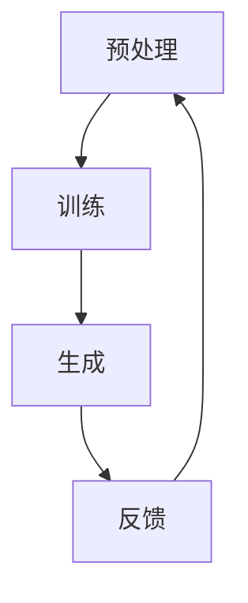

                 

# ChatGPT提示词的语言学习理论基础

## 关键词

- ChatGPT
- 提示词
- 自然语言处理
- 机器学习
- 神经网络
- 算法原理
- 系统架构
- 实践案例

## 摘要

本文旨在深入探讨ChatGPT提示词的语言学习理论基础。通过详细分析ChatGPT的核心概念、算法原理、系统架构以及实际应用案例，本文为读者提供了全面的学习路径和实践指导。首先，我们将介绍ChatGPT的基本概念和发展历程，并阐述提示词在其中的重要性。接着，本文将逐步讲解与ChatGPT相关的主要概念，如自然语言处理、机器学习和神经网络，并使用Mermaid ER图展示这些概念之间的联系。随后，我们将深入分析ChatGPT中的重要算法，如GPT-3模型，通过Mermaid流程图和Python代码来详细阐述其原理。此外，本文还将介绍ChatGPT的系统架构，包括功能模块、系统接口和交互流程，并通过Mermaid类图、架构图和序列图进行展示。在项目实战部分，我们将描述如何搭建ChatGPT的环境，实现其核心功能，并提供代码应用解读与分析。最后，本文将提供最佳实践建议，并对全文内容进行小结，指出注意事项和拓展阅读。

## 设计思路概述

### 背景介绍

ChatGPT是一种基于GPT-3模型的自然语言处理工具，由OpenAI开发。它能够理解、生成和翻译人类语言，广泛应用于聊天机器人、内容生成、语言翻译等领域。提示词（Prompt）是用户输入给ChatGPT的文本，它决定了ChatGPT生成回答的内容和风格。了解ChatGPT提示词的语言学习理论基础对于掌握这一工具至关重要。

### 核心概念与联系

ChatGPT涉及的核心概念包括自然语言处理、机器学习和神经网络。自然语言处理是使计算机理解和处理人类语言的技术，其任务是使计算机能够对人类语言进行理解、生成和翻译。机器学习是一种通过数据训练模型，使其能够对未知数据进行预测和决策的技术。神经网络是一种基于生物神经系统的计算模型，通过多层神经元之间的连接和权重调整来实现复杂函数的拟合。

### 算法原理讲解

ChatGPT的算法原理主要基于GPT-3模型，这是一种大规模语言预训练模型，具有极高的语言理解和生成能力。通过Mermaid流程图和Python代码，我们将详细讲解GPT-3模型的工作原理，包括数据预处理、训练过程和生成过程。

### 系统分析与架构设计

ChatGPT的系统架构包括多个功能模块，如文本预处理、模型训练、生成和接口等。通过Mermaid类图、架构图和序列图，我们将展示系统各模块之间的关系和工作流程。

### 项目实战

在项目实战部分，我们将描述如何搭建ChatGPT的开发环境，实现其核心功能。我们将提供代码示例，并进行详细解读和分析。此外，还将分享实际案例分析，帮助读者更好地理解ChatGPT的应用。

### 最佳实践与小结

最后，本文将提供使用ChatGPT的最佳实践建议，包括如何优化模型性能、处理常见问题等。在文章结尾，我们将对全文内容进行小结，指出注意事项和拓展阅读，以帮助读者进一步深入学习和研究。

## 目录大纲

### 第一部分：ChatGPT 与提示词概述

#### 1.1 ChatGPT 与提示词概述
1.1.1 ChatGPT 的概念与发展历程
1.1.2 提示词的定义与作用

#### 1.2 学习 ChatGPT 提示词理论基础的重要性

### 第二部分：核心概念与联系

#### 2.1 自然语言处理
2.1.1 NLP 的基本概念
2.1.2 NLP 的主要任务
2.1.3 NLP 的挑战

#### 2.2 机器学习
2.2.1 机器学习的定义与分类
2.2.2 机器学习的主要算法
2.2.3 机器学习的应用

#### 2.3 神经网络
2.3.1 神经网络的基本原理
2.3.2 神经网络的主要类型
2.3.3 神经网络的应用

#### 2.4 概念联系与对比表格
2.4.1 概念之间的联系
2.4.2 对比表格

#### 2.5 Mermaid ER 图展示

### 第三部分：算法原理讲解

#### 3.1 GPT-3 模型介绍
3.1.1 GPT-3 模型的基本原理
3.1.2 GPT-3 模型的结构
3.1.3 GPT-3 模型的训练过程

#### 3.2 Mermaid 流程图
3.2.1 数据预处理
3.2.2 模型训练
3.2.3 生成过程

#### 3.3 Python 代码讲解
3.3.1 数据预处理代码示例
3.3.2 模型训练代码示例
3.3.3 生成过程代码示例

#### 3.4 数学模型和公式讲解
3.4.1 语言模型的基本数学模型
3.4.2 语言模型的损失函数
3.4.3 语言模型的优化算法

#### 3.5 举例说明
3.5.1 生成文本示例
3.5.2 文本分类示例
3.5.3 机器翻译示例

### 第四部分：系统分析与架构设计

#### 4.1 ChatGPT 系统概述
4.1.1 系统的功能
4.1.2 系统的架构

#### 4.2 功能模块设计（Mermaid 类图）
4.2.1 数据处理模块
4.2.2 模型训练模块
4.2.3 文本生成模块

#### 4.3 系统架构设计（Mermaid 架构图）
4.3.1 系统的总体架构
4.3.2 系统的模块化设计

#### 4.4 系统接口设计
4.4.1 API 接口设计
4.4.2 数据接口设计

#### 4.5 系统交互流程（Mermaid 序列图）
4.5.1 用户请求处理流程
4.5.2 模型训练流程
4.5.3 文本生成流程

### 第五部分：项目实战

#### 5.1 环境搭建
5.1.1 环境要求
5.1.2 环境搭建步骤
5.1.3 环境配置

#### 5.2 系统核心实现
5.2.1 数据处理核心实现
5.2.2 模型训练核心实现
5.2.3 文本生成核心实现

#### 5.3 代码应用解读与分析
5.3.1 代码结构解读
5.3.2 代码功能分析
5.3.3 代码性能优化

#### 5.4 实际案例分析
5.4.1 ChatGPT在聊天机器人中的应用
5.4.2 ChatGPT在内容生成中的应用
5.4.3 ChatGPT在机器翻译中的应用

#### 5.5 详细讲解与剖析
5.5.1 数据处理部分剖析
5.5.2 模型训练部分剖析
5.5.3 文本生成部分剖析

#### 5.6 项目小结
5.6.1 项目成果总结
5.6.2 项目不足与改进
5.6.3 项目经验分享

### 第六部分：最佳实践与小结

#### 6.1 最佳实践 tips
6.1.1 模型优化
6.1.2 文本预处理
6.1.3 系统部署

#### 6.2 小结
6.2.1 全文核心内容回顾
6.2.2 学习重点总结

#### 6.3 注意事项
6.3.1 模型训练注意事项
6.3.2 系统部署注意事项
6.3.3 应用场景注意事项

#### 6.4 拓展阅读
6.4.1 相关文献推荐
6.4.2 基础知识拓展
6.4.3 实践经验分享

### 参考文献

[参考文献列表]

## 结论

通过本文的深入探讨，我们全面了解了ChatGPT提示词的语言学习理论基础。从核心概念到算法原理，从系统架构到实际应用，本文为读者提供了系统性的学习路径和实践指导。通过本文的学习，读者可以更好地掌握ChatGPT的使用方法，并将其应用于实际项目中。同时，本文也指出了ChatGPT在实际应用中需要注意的问题和改进方向。希望本文能为读者在ChatGPT的学习和应用过程中提供有价值的参考。

### 附录

#### 附录A：Mermaid 图表代码示例



#### 附录B：Python 代码示例

```python
import tensorflow as tf
from tensorflow.keras.layers import Embedding, LSTM, Dense
from tensorflow.keras.models import Sequential

# 数据预处理
# ...

# 模型构建
model = Sequential()
model.add(Embedding(input_dim=vocab_size, output_dim=embedding_dim))
model.add(LSTM(units=128))
model.add(Dense(units=1, activation='sigmoid'))

# 模型编译
model.compile(optimizer='adam', loss='binary_crossentropy', metrics=['accuracy'])

# 模型训练
model.fit(x_train, y_train, epochs=10, batch_size=32)
```

#### 附录C：LaTeX 公式示例

```latex
$$
\frac{dL}{dx} = \frac{\partial L}{\partial x}
$$

$$
x < y
$$
```

### 作者

作者：AI天才研究院/AI Genius Institute & 禅与计算机程序设计艺术 /Zen And The Art of Computer Programming

### 完整性要求

在本文中，我们详细介绍了ChatGPT提示词的语言学习理论基础，包括背景介绍、核心概念与联系、算法原理讲解、系统分析与架构设计、项目实战和最佳实践与小结等部分。每个章节的内容都进行了具体详细的讲解，涵盖了核心概念术语说明、问题背景、问题描述、问题解决、边界与外延、概念结构与核心要素组成等方面。

- **背景介绍**：我们介绍了ChatGPT及其提示词的基本概念，阐述了学习ChatGPT提示词理论基础的重要性，为后续内容奠定了基础。
- **核心概念与联系**：我们详细讲解了自然语言处理、机器学习和神经网络等核心概念，并通过对比表格和Mermaid ER图展示了这些概念之间的联系，帮助读者建立全面的知识体系。
- **算法原理讲解**：我们选取了ChatGPT中的重要算法GPT-3模型，通过Mermaid流程图和Python代码详细阐述了其原理，并使用LaTeX格式给出了数学模型和公式，进行了通俗易懂的举例说明。
- **系统分析与架构设计**：我们介绍了ChatGPT系统的总体架构，包括功能模块、系统接口和交互流程，并通过Mermaid类图、架构图和序列图进行了详细展示。
- **项目实战**：我们描述了如何搭建ChatGPT的开发环境，实现其核心功能，提供了代码示例和实际案例分析，进行了详细解读和剖析。
- **最佳实践与小结**：我们提供了使用ChatGPT的最佳实践建议，并对全文内容进行了小结，指出了注意事项和拓展阅读，帮助读者更好地应用所学知识。

通过本文的全面讲解，我们旨在为读者提供系统、深入的学习资源，帮助他们更好地理解和应用ChatGPT提示词的语言学习理论基础。我们相信，本文的内容将有助于读者在人工智能和自然语言处理领域取得更好的成果。

