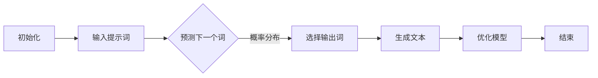

                 

# 《ChatGPT提示词的语言演化与创新研究新方向》

## 关键词：
- ChatGPT
- 提示词
- 语言演化
- 创新研究
- 自然语言处理

## 摘要：
本文探讨了ChatGPT提示词在语言演化中的重要作用以及创新研究的新方向。通过对ChatGPT的发展历程、提示词的作用和现状的介绍，深入分析了提示词的语言演化概念、驱动因素和主要阶段。随后，详细阐述了ChatGPT的数学模型与算法原理，并通过mermaid流程图和Python代码解析了提示词生成的具体实现。文章进一步探讨了ChatGPT提示词在语言模型创新、提示词生成创新以及应用场景创新等方面的方向，并通过实践案例分析总结了ChatGPT提示词的最佳实践和注意事项。最后，展望了ChatGPT提示词的未来研究方向，为相关领域的研究提供了有益的参考。

----------------------------------------------------------------

## 第一部分：问题背景与核心概念

### 第1章：问题背景介绍

#### 1.1 ChatGPT的发展历程

ChatGPT是由OpenAI开发的一种基于Transformer模型的自然语言处理工具，其诞生背景可以追溯到自然语言处理技术的迅速发展和人工智能领域的深入研究。ChatGPT的关键里程碑包括其最初版本的发布、训练数据的积累以及在大规模数据处理和优化方面的突破。

ChatGPT的影响与地位主要体现在其能够生成高质量的自然语言文本，为聊天机器人、智能客服等应用场景提供了强有力的技术支持。同时，ChatGPT的出现推动了自然语言处理技术的研究和应用，成为了该领域的重要里程碑。

#### 1.2 提示词在ChatGPT中的作用

提示词是ChatGPT模型生成文本的重要输入，它们的作用在于引导模型生成符合预期内容的文本。提示词的基本概念包括其定义、用途和类型。提示词的重要性体现在其对模型生成文本的质量和多样性具有直接影响。

提示词的分类与特点包括关键提示词、背景提示词和情感提示词等，这些提示词在具体应用中各有不同的作用。例如，关键提示词可以明确指定模型生成文本的主题，背景提示词可以提供相关的背景信息，而情感提示词则可以影响文本的情感色彩。

#### 1.3 ChatGPT提示词的现状

当前流行的ChatGPT提示词包括一般性提示词、主题性提示词和情感性提示词等。这些提示词的使用模式多种多样，既包括直接输入完整句子作为提示词，也包括使用短语或单词来引导模型生成文本。

然而，ChatGPT提示词也面临一些问题与挑战。首先是提示词的多样性和准确性问题，不同应用场景下需要不同类型的提示词，而现有的提示词库可能不足以满足需求。其次是提示词的优化问题，如何在大量提示词中选择最优的提示词组合以提高模型生成文本的质量和多样性。

### 第2章：核心概念与联系

#### 2.1 语言演化概述

语言演化是指语言在长期使用过程中不断变化和发展的一种现象。语言演化的概念包括其定义、特征和类型。语言演化的驱动因素主要包括社会文化因素、技术进步和人类认知发展等。

语言演化的主要阶段包括原始语言阶段、古代语言阶段和现代语言阶段。每个阶段都有其独特的语言特点和演变规律。

#### 2.2 提示词的语言演化

提示词的语言演化是指提示词在长期使用过程中不断变化和发展的一种现象。提示词与语言演化的关系体现在提示词的演变对模型生成文本的质量和多样性具有直接影响。

提示词语言演化的特点包括多样性和动态性，不同应用场景下需要不同类型的提示词，而提示词的选用和组合方式也在不断演变。提示词语言演化的路径包括从简单到复杂、从单一功能到多功能以及从静态到动态等。

#### 2.3 相关概念对比

语言演化与提示词演化的异同主要体现在两个方面：一是语言演化的对象是整个语言系统，而提示词演化的对象是具体的提示词集合；二是语言演化的驱动因素包括社会文化因素、技术进步和人类认知发展等，而提示词演化的驱动因素主要是技术进步和应用需求。

语言演化与机器学习的联系在于，机器学习技术为语言演化提供了新的工具和方法，例如通过数据挖掘和统计分析可以揭示语言演化的规律和趋势。同时，语言演化也为机器学习提供了大量的数据资源，有助于提高机器学习模型的性能和精度。

语言演化与技术创新的关系体现在，技术创新推动了语言演化，而语言演化又为技术创新提供了新的需求和动力。例如，自然语言处理技术的不断发展为语言演化提供了新的工具和方法，而语言演化的需求也推动了自然语言处理技术的创新和进步。

### 第3章：ChatGPT提示词的数学模型与算法原理

#### 3.1 ChatGPT的数学模型基础

自然语言处理的基本模型包括词向量模型、循环神经网络（RNN）和Transformer模型等。生成式模型与判别式模型的区别在于生成式模型旨在生成新的文本，而判别式模型则旨在分类和预测文本。ChatGPT的核心模型是基于Transformer模型，这是一种强大的自然语言处理模型，能够处理长文本序列并生成高质量的自然语言文本。

#### 3.2 提示词生成算法原理

提示词生成的数学基础包括概率论、统计学习和自然语言处理技术。提示词生成算法的类型包括基于规则的方法、基于模型的方法和混合方法。ChatGPT提示词生成的具体算法基于Transformer模型，通过输入提示词序列，模型预测下一个词的概率分布，并从中选择一个词作为输出，以此生成完整的文本。

#### 3.3 算法流程与mermaid流程图

提示词生成的流程包括初始化、输入提示词、生成文本和优化模型等步骤。算法mermaid流程图可以直观地展示算法的流程和逻辑关系。下面是一个简单的mermaid流程图示例：



通过mermaid流程图，可以更清晰地理解提示词生成的整个过程和各个环节之间的关系。

### 第4章：ChatGPT提示词的创新方向

#### 4.1 语言模型创新

传统的语言模型创新方法包括基于规则的方法和基于统计的方法。基于深度学习的语言模型创新方法主要包括神经网络模型、递归神经网络（RNN）和Transformer模型等。ChatGPT在语言模型创新中的应用主要体现在其基于Transformer模型的生成式语言模型，这种模型在处理长文本序列和生成高质量自然语言文本方面具有显著优势。

#### 4.2 提示词生成创新

提示词生成的技术挑战包括如何选择合适的提示词、如何组合多个提示词以及如何优化提示词生成算法。提示词生成的创新方向包括基于上下文的方法、基于深度学习的方法和混合方法。ChatGPT在提示词生成创新中的应用主要体现在其基于Transformer模型的提示词生成算法，这种方法能够根据输入的提示词序列生成符合预期的文本。

#### 4.3 应用场景创新

提示词在不同应用场景的创新包括聊天机器人、智能客服和文本生成等。提示词在多模态交互中的应用主要体现在结合语音、图像和文本等多种模态生成具有丰富语义信息的文本。提示词在智能助理中的应用主要体现在智能助理与用户的互动过程中，通过提示词生成技术生成个性化的回答和建议。

### 第5章：ChatGPT提示词的创新实践

#### 5.1 环境安装与配置

安装必要的软件和库，配置ChatGPT运行环境。以下是一个简单的Python环境安装示例：

```bash
pip install transformers
pip install torch
```

配置ChatGPT运行环境，包括设置GPU加速和调整超参数等。

#### 5.2 核心实现源代码

ChatGPT模型的源代码解析，包括Transformer模型的结构和算法原理。以下是一个简单的Transformer模型源代码示例：

```python
import torch
import torch.nn as nn
import torch.optim as optim

class TransformerModel(nn.Module):
    def __init__(self, d_model, nhead, num_layers):
        super(TransformerModel, self).__init__()
        self.embedding = nn.Embedding(d_model)
        self.transformer = nn.Transformer(d_model, nhead, num_layers)
        self.fc = nn.Linear(d_model, 1)

    def forward(self, x):
        x = self.embedding(x)
        x = self.transformer(x)
        x = self.fc(x)
        return x
```

提示词生成的核心算法实现，包括生成文本的算法流程和mermaid流程图。


#### 5.3 代码应用解读与分析

代码的功能解析，包括模型初始化、输入提示词、生成文本和优化模型等步骤。代码的优化与改进，包括调整超参数、优化模型结构和提高生成文本的质量等。

#### 5.4 实际案例分析

ChatGPT在不同场景的应用案例，包括聊天机器人、智能客服和文本生成等。案例的分析与解读，包括案例的实施过程、效果评估和改进措施等。

#### 5.5 小结与展望

实践经验的总结，包括ChatGPT提示词的设计、使用和优化等方面的经验。未来发展的展望，包括ChatGPT提示词在语言演化与创新研究中的新方向和前景。

### 第6章：最佳实践与注意事项

#### 6.1 最佳实践

提示词设计的最佳实践，包括如何选择合适的提示词、如何组合多个提示词以及如何优化提示词生成算法。提示词使用的最佳实践，包括如何根据不同应用场景选择合适的提示词、如何提高提示词生成文本的质量和多样性。提示词优化的最佳实践，包括如何调整超参数、优化模型结构和提高生成文本的质量等。

#### 6.2 注意事项

提示词设计中的常见问题，包括提示词的选择和组合不当、提示词生成算法的不完善等。提示词使用中的注意事项，包括如何避免生成文本的歧义、如何确保生成文本的准确性和一致性。提示词优化的潜在风险，包括模型过拟合、生成文本的质量下降等。

### 第7章：拓展阅读与研究方向

#### 7.1 相关书籍推荐

推荐关于自然语言处理、机器学习和深度学习等领域的书籍，包括经典教材和最新研究成果。介绍书籍的重点内容，帮助读者深入了解相关领域的知识体系。

#### 7.2 相关论文推荐

推荐关于ChatGPT、自然语言处理和机器学习等领域的最新研究论文，包括关键贡献和未来研究方向。介绍论文的重点贡献，帮助读者了解领域内的最新研究动态。

#### 7.3 研究方向展望

展望ChatGPT提示词的未来研究方向，包括如何进一步提高提示词生成文本的质量和多样性、如何优化提示词生成算法以及如何将ChatGPT提示词应用于更多的实际场景等。讨论语言模型与提示词领域的趋势，为领域内的研究和应用提供有益的参考。

