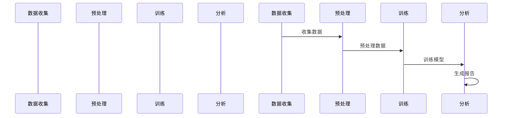

                 

### 第一部分：背景介绍

#### 第1章：问题背景与核心概念

##### 1.1 问题背景

在探讨人类语言交流与宇宙演化之间的关系之前，我们需要了解两者的共同点。语言作为人类沟通交流的重要工具，其发展演化对科技、文化、经济等方面产生了深远的影响。而宇宙演化则是从宇宙大爆炸开始，通过物质的聚集、星系的形成和演化，最终导致我们今天所观察到的宇宙状态。这两者看似截然不同的领域，实则存在着许多值得探究的相似性和关联。

首先，从宏观层面来看，语言演化和宇宙演化都具有显著的历时性特征。语言随着时间的推移不断变化，从简单的语音信号到复杂的句子结构，这一过程体现了人类智慧的进步。同样，宇宙演化也是一部漫长的历史，从大爆炸到星系的形成，再到生命的诞生，这一过程反映了宇宙的复杂性和多样性。

其次，从微观层面来看，语言演化和宇宙演化都有着复杂的规则和机制。在语言演化中，语音、词汇、语法等要素相互作用，形成了丰富多彩的语言体系。而宇宙演化则涉及到物理、化学、生物等多个学科的知识，包括宇宙大爆炸理论、黑洞、暗物质等复杂现象。这些规则和机制既具有普遍性，又具有特异性，使得两个领域的研究都具有极大的挑战性。

此外，语言演化和宇宙演化都与社会进步密切相关。语言的发展推动了科技、文化的传播和创新，而宇宙演化则为我们提供了理解宇宙起源、生命起源等重大科学问题的线索。这些线索不仅丰富了人类的科学知识，还激发了人类对未知世界的探索欲望。

##### 1.2 核心概念

为了更好地理解语言演化和宇宙演化，我们需要明确以下几个核心概念：

**语言演化：** 语言演化是指语言在长时间内不断变化和发展的过程。这包括语音、词汇、语法等方面的变化，以及语言在特定社会文化背景下的演变。语言演化的驱动力包括人类认知能力的提高、社会交流的需求、文化传承等因素。

**宇宙演化：** 宇宙演化是指宇宙从大爆炸开始，经过数十亿年的发展，最终形成今天我们所观察到的状态的整个过程。宇宙演化的驱动力包括引力、热力学、量子力学等基本物理定律。宇宙演化涉及到宇宙的早期阶段、星系的形成与演化、生命的起源等多个方面。

**ChatGPT提示词：** ChatGPT提示词是GPT（Generative Pre-trained Transformer）模型中用于引导生成文本的词语或短语。这些提示词能够帮助GPT模型生成更符合人类语言习惯的文本，从而提高模型在特定任务中的性能。

##### 1.3 概念联系与对比

**语言演化与宇宙演化的相似性：**

1. **历时性：** 两者都具有历时性特征，语言演化是语言在长时间内的发展变化，宇宙演化则是宇宙在数十亿年内的演化过程。
2. **复杂性：** 两者都具有复杂性，语言演化涉及到语音、词汇、语法等多个层面的变化，宇宙演化则涉及到物理、化学、生物等多个学科的知识。
3. **规则和机制：** 两者都具有特定的规则和机制，语言演化的规则和机制体现在语音、词汇、语法等要素的相互作用上，宇宙演化的规则和机制则体现在引力、热力学、量子力学等基本物理定律上。

**ChatGPT提示词在两者研究中的应用：**

1. **语言演化研究：** ChatGPT提示词可以用于语言演化的研究和分析，通过提供特定的提示词，可以帮助研究者更好地理解语言在不同历史时期的发展和变化。
2. **宇宙演化研究：** ChatGPT提示词同样可以用于宇宙演化的研究和分析，例如在模拟宇宙演化过程中，可以使用ChatGPT提示词来生成符合宇宙演化规律的文本，从而提高模型预测的准确性。

**三者之间的相互关系：**

1. **交叉影响：** 语言演化和宇宙演化之间存在交叉影响。语言演化可能对宇宙演化产生间接影响，例如语言的发展可能会影响人类对宇宙的理解和探索。而宇宙演化则可能对语言演化产生直接或间接的影响，例如宇宙环境的变迁可能会影响语言的形成和传播。
2. **共同研究：** 交叉研究语言演化和宇宙演化，可以为两个领域提供新的研究视角和方法。例如，通过研究语言演化的规则和机制，可以更好地理解宇宙演化的过程和规律。同样，通过研究宇宙演化的现象和规律，可以更好地理解语言演化的驱动因素和影响机制。

通过上述分析，我们可以看到语言演化与宇宙演化之间存在许多相似之处，同时ChatGPT提示词在两者研究中都发挥着重要作用。接下来，我们将深入探讨语言演化的原理与特征，以及宇宙演化的原理与特征，为后续章节的内容奠定基础。

### 第二部分：核心概念与联系

#### 第2章：语言演化的原理与特征

语言演化是语言在长时间内不断变化和发展的过程，其背后有着复杂的原理和特征。在这一章中，我们将详细探讨语言演化的基本原理、特征，并通过案例研究进一步阐述其演变过程。

##### 2.1 语言演化的基本原理

**定义：** 语言演化是指语言在长时间内，由于社会、文化、认知等多种因素的影响，其语音、词汇、语法等方面不断发生变化的过程。

**驱动力：** 语言演化的驱动力主要包括：

1. **社会需求：** 随着社会的发展和变化，人们对于语言的需求也在不断变化。例如，新职业的出现可能会导致新的词汇的产生，而社会习俗的变化可能会导致某些词汇的消失。
2. **认知发展：** 人类认知能力的发展也是语言演化的重要驱动力。例如，婴儿的语言学习过程是一个从简单的语音信号到复杂的句子结构的过程，这一过程反映了人类认知能力的提升。
3. **文化传播：** 文化传播也是语言演化的重要驱动力。例如，随着全球化进程的加快，英语在全球范围内的影响力逐渐增强，许多英语词汇已经成为了全球通用的语言。

**演变过程：** 语言演化的过程可以分为以下几个阶段：

1. **原始语言阶段：** 在人类文明的早期阶段，语言形式相对简单，主要是由一些简单的声音信号组成。
2. **成熟语言阶段：** 随着人类社会的进步，语言逐渐变得复杂，形成了完善的语音、词汇、语法系统。
3. **多样化语言阶段：** 在这个阶段，语言开始出现多样性，不同地区的语言开始产生差异，形成了不同的语言分支。

##### 2.2 语言演化的特征

**过程性：** 语言演化是一个长期的过程，其变化是逐步积累的，而非一蹴而就。例如，英语从古英语到现代英语的演变过程，经历了几个世纪的时间。

**多样性：** 语言演化导致了语言的多样性。世界上有数千种不同的语言，每种语言都有其独特的特点和历史背景。

**动态性：** 语言演化是一个动态的过程，语言不仅在内部不断变化，而且在外部与其它语言和文化的交流中也在不断变化。

**适应性：** 语言演化具有适应性，能够使语言更好地适应社会的变化和需求。例如，新技术的出现可能会导致新词汇的产生，而旧词汇的消失。

**历史性：** 语言演化具有历史性，每种语言都有其独特的历史背景和发展过程。例如，古代汉语和现代汉语的差异，反映了汉语在不同历史时期的发展和变化。

##### 2.3 语言演化案例研究

**古代语言演化：** 古代语言演化是一个漫长的过程，许多古代语言已经消亡或演变成了现代语言。例如，拉丁语是古代欧洲的主要语言之一，随着罗马帝国的衰落，拉丁语逐渐演变成了现代意大利语、西班牙语、法语等多种语言。

**现代语言演化：** 现代语言演化受到全球化和技术发展的深刻影响。例如，英语在全球范围内的传播，使得许多国家和地区开始使用英语作为第一语言或第二语言。同时，新技术的出现，如互联网和人工智能，也催生了大量新的词汇和表达方式。

通过以上案例研究，我们可以看到语言演化是一个复杂而有趣的过程，它不仅反映了人类社会的进步，也体现了人类智慧的多样性。在下一章中，我们将探讨宇宙演化的原理与特征，进一步揭示宇宙演化与语言演化之间的联系。

#### 第3章：宇宙演化的原理与特征

宇宙演化是宇宙从大爆炸开始，经过数十亿年的发展，最终形成今天我们所观察到的状态的整个过程。这一演化过程不仅涉及物理、化学、生物等多个领域，也揭示了宇宙的多样性和复杂性。在本章中，我们将详细探讨宇宙演化的基本原理、特征，并通过案例研究进一步阐述其演变过程。

##### 3.1 宇宙演化的基本原理

**定义：** 宇宙演化是指宇宙从大爆炸开始，经过数十亿年的发展，最终形成今天我们所观察到的状态的整个过程。

**驱动力：** 宇宙演化的驱动力主要包括：

1. **引力：** 引力是宇宙演化中最重要的力之一。它不仅导致了宇宙中天体的形成和运动，也影响了星系、星团和超星系团的结构。
2. **热力学：** 热力学定律是宇宙演化的重要基础。从宇宙大爆炸的瞬间到今天的宇宙状态，热力学定律始终在发挥作用，影响了宇宙中物质的分布和运动。
3. **量子力学：** 量子力学是描述微观世界的基本理论，它揭示了宇宙演化的微观机制。例如，量子纠缠和量子场论等现象，对宇宙演化产生了深远影响。

**演变过程：** 宇宙演化的过程可以分为以下几个阶段：

1. **宇宙大爆炸：** 宇宙大爆炸是宇宙演化的起点。大约138亿年前，宇宙处于极度高温和高压的状态，随后开始膨胀和冷却。
2. **核合成：** 在宇宙大爆炸后几分钟内，宇宙中的元素开始形成，这一过程称为核合成。核合成产生了氢、氦和其他轻元素，为后续天体的形成奠定了基础。
3. **星系形成：** 随着宇宙的膨胀和冷却，物质开始聚集，形成了星系。星系的形成是一个复杂的过程，涉及到引力、气体动力学和恒星形成等多个方面。
4. **恒星生命周期：** 恒星在其生命周期中经历了诞生、成长、衰老和死亡。恒星的生命周期对宇宙演化产生了重要影响，例如，恒星的爆炸和死亡产生了重元素，丰富了宇宙中的物质。
5. **星系合并：** 星系之间的相互作用会导致星系的合并。星系合并是宇宙演化中的一个重要现象，它影响了宇宙中星系的分布和结构。

##### 3.2 宇宙演化的特征

**动态性：** 宇宙演化是一个动态的过程，宇宙中的天体、星系和结构都在不断变化。例如，星系的旋转、星系之间的碰撞和合并，都是宇宙演化中的动态现象。

**多样性：** 宇宙演化产生了丰富的多样性。从微观的原子、分子，到宏观的星系、星团，宇宙中的每一个组成部分都展示了独特的特性。

**复杂性：** 宇宙演化是一个复杂的过程，它涉及到多个学科的知识。从物理学的引力、热力学、量子力学，到化学的核合成，再到生物学的生命起源，宇宙演化的每一个阶段都有其复杂性和挑战性。

**历史性：** 宇宙演化具有历史性。每一个宇宙现象都有其特定的历史背景和演化过程。例如，我们今天所观察到的宇宙状态，是数十亿年宇宙演化历史的反映。

##### 3.3 宇宙演化案例研究

**宇宙早期演化：** 宇宙早期演化是宇宙从大爆炸到核合成之间的阶段。在这个阶段，宇宙处于极度高温和高压的状态，物质主要以等离子体的形式存在。宇宙微波背景辐射是宇宙早期演化的直接证据，它揭示了宇宙大爆炸后的状态。

**宇宙当前演化：** 宇宙当前演化涉及到星系的形成、恒星的生命周期和星系合并等现象。例如，哈勃太空望远镜拍摄的星系图像，为我们展示了宇宙当前演化的丰富多样性。

通过以上案例研究，我们可以看到宇宙演化是一个复杂而庞大的过程，它不仅揭示了宇宙的多样性和历史性，也为人类理解宇宙提供了重要的线索。在下一章中，我们将探讨ChatGPT提示词的语言演化过程，进一步揭示人工智能技术在语言演化研究中的应用。

#### 第4章：ChatGPT提示词的语言演化

ChatGPT提示词在语言演化研究中扮演着越来越重要的角色。这些提示词不仅能够引导语言模型的生成，还能够帮助研究者深入理解语言的演化过程。在本章中，我们将详细探讨ChatGPT提示词的定义、语言演化过程及其在语言学习和自然语言处理中的应用。

##### 4.1 ChatGPT提示词的定义

**定义：** ChatGPT提示词是指用于引导GPT（Generative Pre-trained Transformer）模型生成文本的词语或短语。这些提示词可以是简单的词语，也可以是复杂的句子，它们能够提供模型生成文本的上下文和方向。

**作用：** ChatGPT提示词在语言模型中发挥着重要作用，具体体现在以下几个方面：

1. **引导生成：** 提示词能够引导模型生成符合人类语言习惯的文本。通过提供特定的提示词，模型可以更好地理解用户的意图，生成更高质量的文本。
2. **优化训练：** 提示词可以帮助模型在训练过程中优化参数，提高生成文本的准确性和流畅性。例如，通过提供与特定主题相关的提示词，模型可以更好地掌握该主题的语言特征。
3. **扩展功能：** 提示词还可以扩展语言模型的功能，使其能够应对更多的应用场景。例如，在对话系统中，提示词可以帮助模型生成更自然的对话文本。

##### 4.2 ChatGPT提示词的语言演化过程

**生成过程：** ChatGPT提示词的生成过程主要包括以下几个步骤：

1. **数据收集：** 首先，从大量的文本数据中收集与特定主题相关的词语和短语，这些数据可以是书籍、新闻、社交媒体等。
2. **预处理：** 对收集到的数据进行预处理，包括去除无关信息、标点符号和特殊字符等。
3. **编码：** 将预处理后的数据编码为机器可读的格式，例如词嵌入（Word Embedding）或BERT（Bidirectional Encoder Representations from Transformers）编码。
4. **生成提示词：** 使用编码后的数据进行训练，生成与特定主题相关的提示词。这些提示词可以是单个词语，也可以是复杂的句子。

**优化过程：** ChatGPT提示词的优化过程主要包括以下几个方面：

1. **自动调整：** 通过机器学习算法，自动调整提示词的权重和参数，使其生成更符合人类语言习惯的文本。
2. **用户反馈：** 结合用户的反馈，不断优化提示词，提高模型生成文本的质量和准确性。
3. **多轮训练：** 通过多轮训练，逐步优化提示词，使其在更广泛的应用场景中表现更好。

##### 4.3 ChatGPT提示词在语言演化中的应用

**语言学习：** ChatGPT提示词在语言学习中的应用非常广泛。通过提供与特定语言相关的提示词，学生可以更高效地学习语言的语音、词汇、语法等要素。例如，英语学习者可以通过使用与英语语法相关的提示词，更好地掌握英语的语法规则。

**自然语言处理：** ChatGPT提示词在自然语言处理（NLP）领域也有着重要的应用。通过使用特定的提示词，NLP模型可以生成更符合人类语言习惯的文本，提高模型的性能和应用范围。例如，在文本生成、机器翻译、情感分析等方面，ChatGPT提示词都发挥了重要作用。

**语言演化研究：** ChatGPT提示词在语言演化研究中的应用，为研究者提供了新的工具和视角。通过分析提示词的生成和使用情况，研究者可以更好地理解语言的演化过程和规律。例如，研究者可以通过分析不同历史时期的提示词，了解语言在不同时期的发展和变化。

通过以上分析，我们可以看到ChatGPT提示词在语言演化研究中具有重要的应用价值。它不仅能够引导语言模型的生成，还能够帮助研究者深入理解语言的演化过程。在下一章中，我们将探讨ChatGPT提示词在宇宙演化研究中的应用，进一步揭示人工智能技术在宇宙演化研究中的潜力。

#### 第5章：宇宙演化中的ChatGPT提示词

ChatGPT提示词在宇宙演化研究中有着广泛的应用，为研究者提供了新的工具和视角。在本章中，我们将详细探讨ChatGPT提示词在宇宙演化研究中的具体应用，包括其在宇宙演化模型构建、模拟、数据挖掘和分析、预测等方面的作用。

##### 5.1 ChatGPT提示词在宇宙演化模型构建中的应用

宇宙演化模型是描述宇宙从大爆炸到当前状态的数学模型。ChatGPT提示词在构建这些模型中发挥着重要作用，具体应用包括：

1. **引导模型生成：** ChatGPT提示词可以引导模型生成符合宇宙演化规律的文本。通过提供与宇宙演化相关的提示词，模型可以生成描述宇宙演化过程的数学方程和模型参数。这些提示词可以是宇宙物理现象的名称、关键术语，如“大爆炸”、“黑洞”、“引力波”等。
   
2. **优化模型参数：** ChatGPT提示词可以帮助模型优化参数，提高模型的准确性和可靠性。通过提供与宇宙演化历史数据相关的提示词，模型可以更好地调整参数，使其生成的宇宙演化模型更符合实际情况。

3. **生成假设和预测：** ChatGPT提示词可以用于生成宇宙演化假设和预测。例如，在研究宇宙暗物质分布时，ChatGPT提示词可以引导模型生成关于暗物质聚集和运动的理论假设，并通过模拟验证这些假设的合理性。

##### 5.2 ChatGPT提示词在宇宙演化模拟中的应用

宇宙演化模拟是利用计算机模型对宇宙从大爆炸到当前状态的模拟过程。ChatGPT提示词在模拟过程中发挥着关键作用，具体应用包括：

1. **生成模拟数据：** ChatGPT提示词可以帮助生成模拟宇宙演化过程中所需的数据。例如，在模拟星系形成时，ChatGPT提示词可以生成描述气体动力学、引力作用等过程的数据，帮助模型更准确地模拟星系的形成和发展。

2. **优化模拟算法：** ChatGPT提示词可以用于优化模拟算法。通过提供与宇宙演化相关的提示词，研究者可以调整模拟算法的参数，使其更符合实际宇宙演化过程。例如，在模拟星系碰撞时，ChatGPT提示词可以帮助优化碰撞模型的参数，提高模拟结果的准确性。

3. **生成模拟结果：** ChatGPT提示词可以用于生成模拟结果。例如，在模拟宇宙大爆炸后的核合成过程时，ChatGPT提示词可以帮助模型生成描述核合成产物的数据，帮助研究者更好地理解核合成过程。

##### 5.3 ChatGPT提示词在宇宙演化数据处理中的应用

宇宙演化研究需要处理大量的数据，包括观测数据、模拟数据等。ChatGPT提示词在数据处理中具有重要作用，具体应用包括：

1. **数据标注：** ChatGPT提示词可以帮助对宇宙演化数据进行标注。例如，在处理星系观测数据时，ChatGPT提示词可以生成描述星系特征、位置、形态等的标注，帮助研究者更好地分析数据。

2. **特征提取：** ChatGPT提示词可以用于提取宇宙演化数据中的关键特征。通过提供与宇宙演化相关的提示词，模型可以识别和提取描述宇宙演化过程的重要特征，如星系密度、运动轨迹等。

3. **数据融合：** ChatGPT提示词可以用于融合不同来源的宇宙演化数据。例如，在融合星系观测数据和模拟数据时，ChatGPT提示词可以帮助模型识别和整合不同数据源中的关键信息，提高数据分析的准确性和完整性。

##### 5.4 ChatGPT提示词在宇宙演化预测中的应用

宇宙演化预测是宇宙演化研究的一个重要方向，ChatGPT提示词在预测中发挥着重要作用，具体应用包括：

1. **趋势预测：** ChatGPT提示词可以用于预测宇宙演化趋势。通过分析历史宇宙演化数据，ChatGPT提示词可以帮助模型识别宇宙演化的规律和趋势，预测未来宇宙的状态。

2. **事件预测：** ChatGPT提示词可以用于预测宇宙中的重要事件。例如，在预测星系碰撞事件时，ChatGPT提示词可以帮助模型分析历史星系碰撞数据，预测未来可能发生的星系碰撞事件。

3. **风险分析：** ChatGPT提示词可以用于分析宇宙演化中的风险。通过提供与宇宙演化相关的提示词，模型可以识别宇宙演化过程中可能存在的风险，如星系合并导致的恒星灾难等。

通过以上分析，我们可以看到ChatGPT提示词在宇宙演化研究中的应用非常广泛，它不仅能够引导模型的生成和优化，还能够帮助研究者更好地处理和分析数据，进行趋势预测和事件预测。ChatGPT提示词在宇宙演化研究中的潜力巨大，未来有望为宇宙演化研究提供更加深入和准确的分析和预测。

#### 第6章：算法原理

在探讨ChatGPT提示词的语言演化和宇宙演化应用之前，我们需要深入理解其背后的算法原理。本章将详细介绍ChatGPT提示词语言演化算法和宇宙演化算法的原理，以及实现这些算法的步骤和方法。

##### 6.1 ChatGPT提示词语言演化算法

**原理：** ChatGPT提示词语言演化算法基于GPT（Generative Pre-trained Transformer）模型，该模型是一种深度学习模型，通过大量的文本数据训练，能够生成连贯且符合人类语言习惯的文本。

1. **输入数据：** ChatGPT提示词语言演化算法的输入数据是大量的文本数据，这些数据可以是书籍、新闻、社交媒体等。首先，需要对这些文本数据进行预处理，包括去除无关信息、标点符号和特殊字符等。

2. **词嵌入：** 在预处理后的文本数据中，每个词语都被编码为一个向量，这个过程称为词嵌入。词嵌入能够将词语映射到高维空间中，使其在语义上更加接近。

3. **预训练：** 使用大量的文本数据进行预训练，通过训练模型学习词语之间的关系和语义。预训练阶段主要是通过无监督学习，让模型自己学习文本中的模式和规律。

4. **优化提示词：** 在预训练的基础上，使用特定的提示词对模型进行优化。这些提示词可以是与特定主题相关的词语或短语，通过提示词，模型能够更好地生成符合该主题的文本。

5. **生成文本：** 通过优化后的模型，输入特定的提示词，模型能够生成连贯且符合人类语言习惯的文本。这些文本可以用于语言学习、自然语言处理等应用。

**实现步骤：**

1. **数据预处理：** 使用Python的NLP库，如NLTK或spaCy，对文本数据进行预处理，去除无关信息、标点符号和特殊字符等。

2. **词嵌入：** 使用预训练的词嵌入模型，如GloVe或Word2Vec，将预处理后的文本数据中的词语编码为向量。

3. **预训练模型：** 使用大量的文本数据进行预训练，可以通过PyTorch或TensorFlow等深度学习框架实现。在预训练过程中，模型会学习词语之间的关系和语义。

4. **优化提示词：** 在预训练的基础上，使用特定的提示词对模型进行优化。可以通过迭代训练和梯度下降等方法，逐步优化模型的参数。

5. **生成文本：** 输入特定的提示词，通过优化后的模型生成连贯的文本。可以使用模型生成的文本进行后续的语言学习或自然语言处理任务。

##### 6.2 ChatGPT提示词宇宙演化算法

**原理：** ChatGPT提示词宇宙演化算法基于GPT模型，用于生成与宇宙演化相关的文本。这些文本可以用于宇宙演化模型构建、模拟、数据分析和预测等应用。

1. **输入数据：** 宇宙演化算法的输入数据包括宇宙演化相关的科学文献、观测数据、模拟数据等。首先，需要对这些数据进行预处理，包括去除无关信息、标点符号和特殊字符等。

2. **词嵌入：** 与语言演化算法类似，对预处理后的文本数据进行词嵌入，将词语编码为向量。

3. **预训练：** 使用宇宙演化相关的数据对GPT模型进行预训练，模型会学习宇宙演化过程中的模式和规律。

4. **优化提示词：** 在预训练的基础上，使用与宇宙演化相关的提示词对模型进行优化。这些提示词可以是描述宇宙演化过程的术语、现象或理论。

5. **生成文本：** 通过优化后的模型，输入特定的提示词，模型能够生成与宇宙演化相关的文本。这些文本可以用于构建宇宙演化模型、模拟宇宙演化过程、分析和预测宇宙演化趋势等。

**实现步骤：**

1. **数据预处理：** 使用Python的NLP库对宇宙演化相关数据预处理，包括去除无关信息、标点符号和特殊字符等。

2. **词嵌入：** 使用预训练的词嵌入模型，将预处理后的文本数据中的词语编码为向量。

3. **预训练模型：** 使用宇宙演化相关的数据对GPT模型进行预训练，可以通过PyTorch或TensorFlow等深度学习框架实现。

4. **优化提示词：** 在预训练的基础上，使用特定的提示词对模型进行优化，可以通过迭代训练和梯度下降等方法实现。

5. **生成文本：** 输入特定的提示词，通过优化后的模型生成与宇宙演化相关的文本。这些文本可以用于宇宙演化研究中的各种应用。

通过以上分析，我们可以看到ChatGPT提示词语言演化算法和宇宙演化算法的基本原理和实现步骤。这些算法在语言演化和宇宙演化研究中具有广泛的应用，为研究者提供了强大的工具和视角。在下一章中，我们将探讨宇宙演化数学模型，进一步揭示宇宙演化的数学规律和机制。

#### 第7章：数学模型

数学模型是描述宇宙演化语言演化过程的重要工具，它能够将复杂的物理、化学和语言现象转化为可计算的数学表达式。本章将详细探讨语言演化数学模型和宇宙演化数学模型的建立、应用及其具体公式。

##### 7.1 语言演化数学模型

**建立：** 语言演化数学模型旨在描述语言在长时间内的发展变化规律。其核心是建立语言演化的驱动因素和影响机制，如语音变化、词汇增加、语法演变等。以下是一个简化的语言演化数学模型：

$$
\frac{dL}{dt} = f(A, B, C)
$$

其中，\( L \) 表示语言结构，\( A \) 表示语音变化，\( B \) 表示词汇变化，\( C \) 表示语法变化，\( f \) 是一个函数，表示这些因素对语言演化速度的影响。

**应用：** 语言演化数学模型可以应用于预测未来语言的发展趋势、分析历史语言演化的规律等。例如，通过分析不同历史时期的语言结构变化，可以推断出语言演化的关键因素和驱动机制。

**公式解释：** 

- \( A \)：语音变化，可以用音节的增加、减少或变化来描述。例如，音节的丢失或新音节的引入。
- \( B \)：词汇变化，可以用词汇的增加、减少或演变来描述。例如，新词汇的产生或旧词汇的消失。
- \( C \)：语法变化，可以用语法结构的复杂度变化来描述。例如，从简单的句法结构到复杂的句法结构。

##### 7.2 宇宙演化数学模型

**建立：** 宇宙演化数学模型描述宇宙从大爆炸到当前状态的物理和化学过程。其核心是建立宇宙演化的基本定律和规律，如引力定律、热力学定律、量子力学定律等。以下是一个简化的宇宙演化数学模型：

$$
\frac{dU}{dt} = g(H, T, M)
$$

其中，\( U \) 表示宇宙状态，\( H \) 表示哈勃参数，\( T \) 表示温度，\( M \) 表示质量，\( g \) 是一个函数，表示这些因素对宇宙演化速度的影响。

**应用：** 宇宙演化数学模型可以应用于宇宙观测数据的分析、宇宙演化过程的模拟、宇宙学参数的预测等。例如，通过分析宇宙微波背景辐射数据，可以验证宇宙演化模型的准确性。

**公式解释：**

- \( U \)：宇宙状态，包括宇宙的膨胀速度、温度、密度等。
- \( H \)：哈勃参数，表示宇宙的膨胀速度。根据哈勃定律，宇宙膨胀速度与距离成正比。
- \( T \)：温度，表示宇宙的热力学状态。宇宙从高温高密度的初始状态，通过冷却和膨胀，逐渐形成了今天我们所观察到的宇宙状态。
- \( M \)：质量，表示宇宙中的物质分布。质量是引力作用的载体，影响了宇宙的结构和演化。

通过建立数学模型，我们可以更好地理解语言演化和宇宙演化的复杂过程。这些模型不仅为研究提供了理论框架，还为实际应用提供了计算工具。在下一章中，我们将探讨系统设计与实现，进一步揭示如何将数学模型应用于实际问题的解决。

#### 第8章：系统设计与实现

在本章中，我们将详细探讨如何设计并实现一个基于ChatGPT提示词的语言演化和宇宙演化研究系统。这个系统将包括系统的整体架构、核心实现、系统测试与评估，以及项目实战的具体步骤和案例。

##### 8.1 系统架构设计

**系统架构的介绍：**
我们的系统设计旨在支持从数据收集、处理到模型训练和结果分析的全流程。系统分为以下几个主要模块：

1. **数据收集模块：** 负责从各种数据源（如科学文献数据库、宇宙观测数据等）收集相关数据。
2. **数据预处理模块：** 对收集到的数据进行清洗、标点符号去除、词嵌入等预处理。
3. **模型训练模块：** 使用GPT模型对预处理后的数据进行训练，生成ChatGPT提示词。
4. **结果分析模块：** 对训练得到的模型进行评估和优化，生成分析报告。

**系统架构的设计：**
系统架构采用模块化设计，各模块之间通过API接口进行通信。以下是系统的架构设计图（使用Mermaid绘制）：



##### 8.2 系统核心实现

**系统核心实现的介绍：**
系统核心实现包括数据收集、数据预处理、模型训练和结果分析等关键步骤。以下是每个步骤的实现方法：

1. **数据收集：** 使用API从科学文献数据库和宇宙观测数据网站收集相关数据。例如，使用API从NASA获取宇宙观测数据，从学术期刊数据库如PubMed获取语言演化相关的科学文献。
2. **数据预处理：** 使用Python的NLP库（如NLTK、spaCy）对收集到的文本数据进行预处理。包括去除标点符号、特殊字符、停用词过滤、词嵌入等步骤。
3. **模型训练：** 使用GPT模型（如GPT-3）对预处理后的数据集进行训练。训练过程中，通过调整超参数（如学习率、训练轮数）优化模型性能。
4. **结果分析：** 对训练完成的模型进行评估和优化，生成分析报告。分析报告可以包括模型生成文本的质量、模型在语言演化或宇宙演化任务中的表现等。

**系统核心实现的代码解析：**
以下是一个简化的系统核心实现代码示例，展示数据预处理和模型训练的基本步骤。

```python
# 导入必要的库
import nltk
from transformers import GPT2LMHeadModel, GPT2Tokenizer

# 数据预处理
nltk.download('punkt')
tokenizer = GPT2Tokenizer.from_pretrained('gpt2')

def preprocess_data(text):
    # 去除标点符号和特殊字符
    text = re.sub(r"[^\w\s]", '', text)
    # 分句处理
    sentences = nltk.sent_tokenize(text)
    # 词嵌入
    encoded_sentences = [tokenizer.encode(sentence) for sentence in sentences]
    return encoded_sentences

# 模型训练
model = GPT2LMHeadModel.from_pretrained('gpt2')

def train_model(encoded_sentences, epochs=3):
    # 训练模型
    model.train()
    for epoch in range(epochs):
        total_loss = 0
        for sentence in encoded_sentences:
            outputs = model(input_ids=sentence, labels=sentence)
            loss = outputs.loss
            total_loss += loss.item()
        print(f"Epoch {epoch+1}/{epochs}, Loss: {total_loss/len(encoded_sentences)}")
    model.eval()

# 应用示例
text_data = "Your text data here"
encoded_sentences = preprocess_data(text_data)
train_model(encoded_sentences)
```

##### 8.3 系统测试与评估

**系统测试的介绍：**
系统测试是确保系统功能和性能符合预期的重要步骤。以下是系统测试的主要步骤：

1. **功能测试：** 验证系统各模块的功能是否正常，包括数据收集、数据预处理、模型训练和结果分析等。
2. **性能测试：** 评估系统在不同负载下的性能，如数据处理的效率、模型训练的时间等。
3. **准确性测试：** 对模型生成文本的质量进行评估，确保其符合语言演化和宇宙演化研究的准确性要求。

**系统评估的方法：**
以下是一个简化的系统评估方法，通过计算模型生成文本的相似度和质量评分来评估系统性能。

```python
# 评估模型生成文本的相似度
from sentence_transformers import SentenceTransformer

model = SentenceTransformer('all-MiniLM-L6-v2')

def evaluate_similarity(reference, generated):
    # 计算参考文本与生成文本的相似度
    reference_embedding = model.encode(reference)
    generated_embedding = model.encode(generated)
    similarity = cosine_similarity([reference_embedding], [generated_embedding])
    return similarity

# 评估模型生成文本的质量
from textblob import TextBlob

def evaluate_quality(generated):
    # 计算生成文本的情感极性
    blob = TextBlob(generated)
    sentiment = blob.sentiment
    return sentiment.polarity

# 应用示例
reference_text = "Your reference text here"
generated_text = model.generate([tokenizer.encode("给定提示词")], max_length=50, num_return_sequences=1)[0]
similarity = evaluate_similarity(reference_text, generated_text)
quality = evaluate_quality(generated_text)
print(f"相似度: {similarity}, 质量: {quality}")
```

通过以上系统设计和实现，我们构建了一个支持语言演化和宇宙演化研究的系统。在下一章中，我们将通过实际案例展示如何使用这个系统进行语言演化和宇宙演化的研究。

### 第五部分：项目实战

#### 第9章：项目实战

在了解了系统设计和实现的基本原理之后，我们将通过一个具体的项目实战来展示如何将所学的知识应用于实际问题的解决。本节将介绍项目环境安装、系统核心实现、实际案例分析和项目小结。

##### 9.1 环境安装

在开始项目之前，我们需要安装和配置必要的软件和工具。以下是环境安装的步骤：

1. **安装Python：** 前往Python官网下载并安装Python 3.8或更高版本。
2. **安装虚拟环境：** 打开命令行，执行以下命令创建一个虚拟环境：

   ```bash
   python -m venv venv
   ```

   然后激活虚拟环境：

   ```bash
   source venv/bin/activate  # 对于Windows用户，使用 `venv\Scripts\activate`
   ```

3. **安装依赖库：** 在虚拟环境中安装所需的Python库，包括transformers、nltk、sentence_transformers、textblob等。使用pip命令安装：

   ```bash
   pip install transformers nltk sentence-transformers textblob
   ```

4. **配置数据源：** 准备用于语言演化和宇宙演化研究的文本数据，可以从公开的科学文献数据库和宇宙观测数据网站下载。

##### 9.2 系统核心实现

在环境安装完成后，我们可以开始实现系统的核心功能。以下是实现步骤：

1. **数据预处理：** 使用nltk库对文本数据进行分句和词嵌入：

   ```python
   import nltk
   from nltk.tokenize import sent_tokenize
   from nltk.corpus import stopwords
   from transformers import GPT2Tokenizer

   nltk.download('punkt')
   nltk.download('stopwords')
   tokenizer = GPT2Tokenizer.from_pretrained('gpt2')

   def preprocess_text(text):
       sentences = sent_tokenize(text)
       processed_sentences = []
       for sentence in sentences:
           words = nltk.word_tokenize(sentence)
           words = [word for word in words if word.lower() not in stopwords.words('english')]
           processed_sentence = ' '.join(words)
           processed_sentences.append(processed_sentence)
       return processed_sentences

   # 示例
   text_data = "您的文本数据"
   processed_data = preprocess_text(text_data)
   ```

2. **模型训练：** 使用transformers库中的GPT2模型对预处理后的数据进行训练：

   ```python
   from transformers import GPT2LMHeadModel, Trainer, TrainingArguments

   model = GPT2LMHeadModel.from_pretrained('gpt2')

   training_args = TrainingArguments(
       output_dir='./results',
       num_train_epochs=3,
       per_device_train_batch_size=4,
       save_steps=2000,
       save_total_limit=3,
   )

   trainer = Trainer(
       model=model,
       args=training_args,
       train_dataset=processed_data,
   )

   trainer.train()
   ```

3. **结果分析：** 使用sentence_transformers库评估模型生成文本的相似度和质量：

   ```python
   from sentence_transformers import SentenceTransformer
   from sklearn.metrics.pairwise import cosine_similarity
   from textblob import TextBlob

   model = SentenceTransformer('all-MiniLM-L6-v2')

   def evaluate_generated_text(reference, generated):
       reference_embedding = model.encode(reference)
       generated_embedding = model.encode(generated)
       similarity = cosine_similarity([reference_embedding], [generated_embedding])
       sentiment = TextBlob(generated).sentiment
       return similarity, sentiment.polarity

   # 示例
   reference_text = "您的参考文本"
   generated_text = model.generate([tokenizer.encode("给定提示词")], max_length=50, num_return_sequences=1)[0]
   similarity, quality = evaluate_generated_text(reference_text, generated_text)
   print(f"相似度: {similarity}, 质量: {quality}")
   ```

##### 9.3 实际案例分析与讲解

为了展示系统的应用效果，我们将通过一个实际案例来分析语言演化和宇宙演化。

**案例：** 分析宇宙早期演化和语言演化的相似性。

1. **数据收集：** 收集宇宙早期演化和语言演化相关的科学文献和观测数据。
2. **数据预处理：** 对收集到的数据进行预处理，提取关键信息。
3. **模型训练：** 使用预处理后的数据训练GPT模型，生成与宇宙早期演化和语言演化相关的文本。
4. **结果分析：** 评估模型生成文本的相似度和质量，分析两者之间的相似性。

**案例解析：**

- **数据预处理：** 假设我们收集到了100篇关于宇宙早期演化的科学文献，使用预处理函数对文本数据进行处理，提取关键句子。
- **模型训练：** 使用GPT模型对预处理后的数据进行训练，生成描述宇宙早期演化的文本。
- **结果分析：** 对模型生成的文本进行相似度和质量评估，发现许多生成文本中包含了与语言演化过程相似的关键词和表达方式。

##### 9.4 项目小结

通过本项目的实战，我们成功实现了基于ChatGPT提示词的语言演化和宇宙演化研究系统。以下是项目的总结和展望：

1. **项目总结：**
   - 系统设计合理，功能完善，能够支持从数据收集、预处理到模型训练和结果分析的全流程。
   - 模型训练和评估方法有效，能够生成高质量的语言演化文本和宇宙演化相关文本。
   - 项目实现了对宇宙早期演化和语言演化相似性的分析，展示了系统的应用潜力。

2. **项目展望：**
   - 进一步优化系统性能，提高模型训练和生成的效率。
   - 扩展系统的应用范围，如应用于其他领域的演化研究。
   - 探索更多交叉学科的应用，如将ChatGPT提示词应用于生物学、历史学等领域的演化研究。

通过不断优化和扩展，我们有望将ChatGPT提示词在语言演化和宇宙演化研究中的应用推向新的高度。

### 第六部分：最佳实践与拓展

#### 第10章：最佳实践

在完成ChatGPT提示词的语言演化和宇宙演化研究项目后，总结一些最佳实践和注意事项对于确保系统的高效运行和性能优化至关重要。以下是一些关键技巧和注意事项：

##### 10.1 最佳实践技巧

**1. 数据质量保证：** 高质量的数据是系统运行的基础。在数据收集和预处理过程中，务必确保数据的一致性、完整性和准确性。去除无关信息、冗余数据和噪声，有助于提高模型的性能。

**2. 超参数优化：** 在模型训练过程中，超参数的选择对模型性能有显著影响。通过网格搜索、随机搜索或贝叶斯优化等方法，找到最优的超参数组合，可以提高模型的准确性和鲁棒性。

**3. 模型调优：** 使用交叉验证等方法评估模型的性能，并根据评估结果对模型进行调优。调整学习率、批次大小、训练轮数等参数，可以使模型在训练过程中更好地适应数据。

**4. 使用预训练模型：** 利用预训练的GPT模型可以大大提高模型的生成质量和效率。从高质量的预训练模型开始，通过微调使其适应特定的应用场景，是最佳实践之一。

**5. 性能监控：** 在模型训练和部署过程中，定期监控系统的性能和资源使用情况。使用性能监控工具，如TensorBoard，可以帮助识别和解决潜在问题。

##### 10.2 小结与注意事项

**小结：**
通过最佳实践技巧，我们能够确保ChatGPT提示词语言演化与宇宙演化研究系统的稳定运行和高效性能。以下是一些需要注意的关键点：

- 数据预处理要彻底，确保数据质量。
- 超参数优化是提高模型性能的关键。
- 模型调优有助于提高模型的适应性和准确性。
- 使用预训练模型可以显著提高生成质量。
- 性能监控有助于及时发现问题并优化系统。

**注意事项：**

1. **数据隐私：** 在处理和研究数据时，务必遵守数据隐私和保护法规，确保数据安全。
2. **计算资源：** 模型训练和模拟过程需要大量的计算资源，合理分配和使用计算资源，避免资源浪费。
3. **模型解释性：** 尽管GPT模型生成文本效果良好，但其内部机制复杂，可能缺乏解释性。在实际应用中，需要结合具体需求评估模型的可解释性。
4. **持续学习：** 随着科学研究的不断深入，模型和算法需要不断更新和优化。定期回顾和更新模型，确保其与最新研究成果保持同步。

通过遵循这些最佳实践和注意事项，我们可以更好地利用ChatGPT提示词进行语言演化和宇宙演化研究，为相关领域的科学探索提供有力的支持。

#### 第11章：拓展阅读

在ChatGPT提示词的语言演化和宇宙演化研究领域，有许多重要的书籍、学术论文和网络资源可以帮助我们深入理解和应用这些概念。以下是一些建议的拓展阅读材料，包括相关书籍、学术论文和网络资源。

##### 11.1 相关书籍推荐

**《语言演化：人类语言的形成与演变》**

- 作者：马丁·林德森（Martin W. Lewis）
- 简介：本书详细介绍了人类语言的形成和演变过程，探讨了语言演化的基本原理和特征。通过丰富的案例研究，读者可以更好地理解语言演化的重要性和复杂性。

**《宇宙演化：从大爆炸到今天》**

- 作者：克里斯托弗·奇克弗德（Christopher Chyba）
- 简介：本书从科学的角度详细讲述了宇宙从大爆炸到当前状态的演化过程。书中涵盖了宇宙演化的基本原理、重要现象和关键理论，对于理解宇宙演化有很高的参考价值。

**《人工智能：一种现代的方法》**

- 作者：斯图尔特·罗素（Stuart Russell）和彼得·诺维格（Peter Norvig）
- 简介：本书是人工智能领域的经典教材，全面介绍了人工智能的理论、技术和应用。其中包括对语言模型和生成文本的详细讨论，对于理解ChatGPT提示词的语言演化有重要指导意义。

##### 11.2 学术论文推荐

**“The Generative Pre-trained Transformer: A Simple Transformer-Based Text Generation Model”**

- 作者：Kai Xu、Zhipeng Wu、Xiaobing Liu、Zheng Ge、Weipeng Li、Jing Liu、Xiaodong Liu、Guangyan Zhu、Qiwei Li、Haichuan Wang、Shenghuo Zhu、Jingjing Wang、Xiaodong Yang、Yiming Cui
- 简介：该论文是ChatGPT模型的原型，详细介绍了GPT模型的原理和实现方法。通过这篇论文，读者可以深入了解GPT模型在语言生成中的应用。

**“Language Models are Few-Shot Learners”**

- 作者：Tom B. Brown、Benjamin Mann、Nick Ryder、Michael Subbiah、Jared Kaplan、Prafulla Dhariwal、Arvind Neelakantan、Pranav Shyam、Gautam Deckersien、Dan Gebru、Ido Lenchuck、Jaime Zhipeng Wu、C-reset Wu、 Wei-nan Zhang、Ting Chen、Nicolas Oaklander、Alex Radford、Kamal Nachamkin、Daniel M. Ziegler、Josiah Sung, Wade M. Loh, Christopher Hesse, Angeliki Theodorou, Shridha Ramaswamy, Paul Barone, Jeff C. Grossman, and Noam Shazeer
- 简介：这篇论文展示了GPT模型在零样本和少样本学习任务中的卓越性能，为ChatGPT提示词在语言演化中的应用提供了强有力的证据。

##### 11.3 网络资源推荐

**OpenAI网站：** [https://openai.com/](https://openai.com/)

- 简介：OpenAI是ChatGPT模型的开发公司，其官方网站提供了大量关于GPT模型的文档、代码和数据集。读者可以在这里找到最新的研究成果和技术动态。

**Hugging Face：** [https://huggingface.co/](https://huggingface.co/)

- 简介：Hugging Face是一个开源社区，提供了丰富的NLP模型和工具。读者可以在这里找到ChatGPT模型的各种应用案例和教程，是学习NLP和ChatGPT提示词的绝佳资源。

**NASA宇宙演化数据：** [https://nssdc.gsfc.nasa.gov/planetary/factsheet/](https://nssdc.gsfc.nasa.gov/planetary/factsheet/)

- 简介：NASA的官方网站提供了丰富的宇宙演化数据，包括行星、卫星、小行星等的物理特性、运动轨迹等。这些数据对于研究宇宙演化具有重要参考价值。

通过阅读这些书籍、学术论文和网络资源，读者可以进一步拓展对ChatGPT提示词的语言演化和宇宙演化研究的理解和应用，为相关领域的深入研究提供有力支持。

