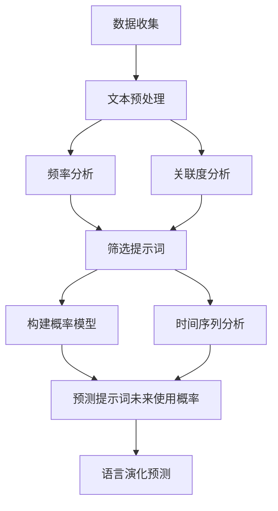
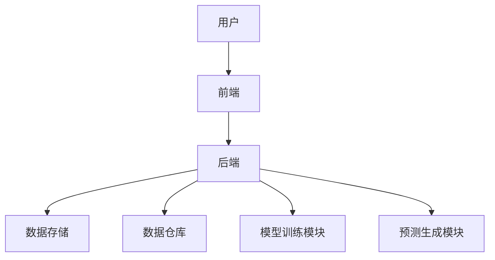
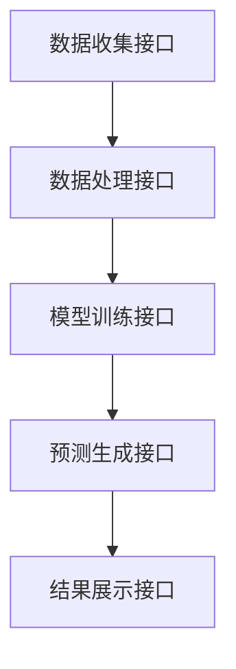
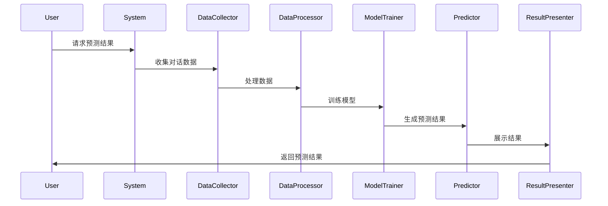

                 

### 核心概念与联系

在探讨ChatGPT提示词的语言演化预测之前，我们需要明确一些核心概念及其相互关系。以下是对这些概念的详细解释：

#### 3.1 ChatGPT提示词概述

**3.1.1 提示词的定义**

提示词（Prompt）是用于启动或引导人工智能模型（如ChatGPT）生成文本的输入。这些提示词可以是简单的句子或更复杂的文本，它们决定了模型生成响应的内容和风格。

**3.1.2 提示词在ChatGPT中的作用**

ChatGPT通过处理提示词来理解用户的意图，并生成相应的响应。提示词的质量直接影响模型的生成效果，包括文本的连贯性、相关性以及创造性。

**3.1.3 提示词的属性特征**

有效的提示词通常具有以下特征：

- **清晰性**：明确表达用户的意图，减少歧义。
- **开放性**：提供足够的信息，使模型能够扩展和创造性地生成内容。
- **上下文关联**：与先前的对话内容保持一致，增强连贯性。

#### 3.2 语言演化模型

**3.2.1 语言演化的基本原理**

语言演化是语言学中的一个核心问题，涉及语言随时间的变化。这种变化可以是规则的、随机的，也可能是受到社会、文化和技术因素影响的。

**3.2.2 语言演化模型的构建**

为了预测语言演化，研究人员提出了多种模型，如概率模型、基于规则的模型和生成对抗网络（GAN）。这些模型通过分析大规模语言数据，捕捉语言变化的模式和趋势。

#### 3.3 提示词与语言演化

**3.3.1 提示词对语言演化的影响**

提示词不仅影响ChatGPT生成文本的质量，而且可能在某种程度上推动语言演化。高频使用的提示词可能更易在语言中普及，从而影响语言的使用习惯。

**3.3.2 提示词在语言演化中的角色**

提示词可以看作是语言演化的催化剂。它们通过改变语言的使用频率和情境，促使某些词汇、短语或语法结构在语言中更加常见。

### 3.3.3 提示词的语言演化预测

通过分析大量历史数据和当前的ChatGPT提示词使用情况，我们可以预测哪些提示词可能在未来变得更加流行。这种预测有助于我们更好地理解语言演化的趋势，并为未来的语言研究提供数据支持。

#### 图解：ER实体关系图

为了更清晰地展示提示词、语言演化模型以及它们之间的关系，我们可以使用ER实体关系图进行描述。

```mermaid
erDiagram
  A[ChatGPT提示词] ||--|{ B[语言演化模型] }
  A ||--|{ C[语言演化] }
  B ||--|{ C }
```

在这个ER图中，`ChatGPT提示词`作为实体，与`语言演化模型`和`语言演化`之间存在关联。提示词通过模型影响语言演化，而模型则通过分析提示词使用情况来预测语言变化。

通过以上分析，我们为后续章节的深入探讨奠定了基础。接下来，我们将进一步探讨ChatGPT提示词优化的算法原理，以及如何通过这些原理预测语言演化的趋势。

---

### 算法原理讲解

在探讨ChatGPT提示词的语言演化预测时，理解其背后的算法原理至关重要。以下是ChatGPT提示词优化的核心算法原理，以及如何通过这些原理进行语言演化预测。

#### 4.1 算法概述

ChatGPT提示词优化的核心算法主要包括：

- **提示词筛选算法**：用于从大量历史数据中筛选出对语言演化有显著影响的提示词。
- **语言演化预测算法**：基于筛选出的提示词，预测未来语言趋势。

#### 4.2 提示词优化的算法原理

**4.2.1 提示词筛选算法原理**

提示词筛选算法基于以下原理：

- **频率分析**：分析提示词在历史数据中的使用频率。
- **关联度分析**：分析提示词与其他词汇的关联度，识别出对语言演化有显著影响的提示词。

具体实现步骤如下：

1. **数据收集**：收集大量历史对话数据。
2. **文本预处理**：对文本进行清洗和分词。
3. **频率分析**：统计每个提示词的出现频率。
4. **关联度分析**：构建词汇关联矩阵，计算每个提示词与其他词汇的关联度。
5. **筛选提示词**：根据频率和关联度筛选出对语言演化有显著影响的提示词。

**4.2.2 语言演化预测算法原理**

语言演化预测算法基于以下原理：

- **概率模型**：使用概率模型预测提示词在未来出现的概率。
- **时间序列分析**：分析提示词随时间的变化趋势。

具体实现步骤如下：

1. **构建概率模型**：使用历史数据训练概率模型。
2. **时间序列分析**：对筛选出的提示词进行时间序列分析，识别其随时间的变化趋势。
3. **预测提示词未来使用概率**：使用概率模型和时间序列分析结果预测提示词在未来出现的概率。
4. **语言演化预测**：根据提示词未来使用概率预测语言演化的趋势。

#### 4.3 语言演化预测算法

为了更好地理解语言演化预测算法，我们可以使用Mermaid流程图进行描述。



在这个流程图中，我们从数据收集开始，经过文本预处理、频率分析、关联度分析和提示词筛选，最终构建概率模型和时间序列分析结果，用于预测提示词的未来使用概率和语言演化趋势。

#### 4.4 算法原理举例说明

为了更直观地理解算法原理，我们可以通过Python代码进行实际演示。

**示例：提示词筛选算法**

```python
import pandas as pd
from collections import Counter

# 假设我们有一个包含大量对话数据的CSV文件，每行包含一个对话
data = pd.read_csv('chat_data.csv')

# 对文本进行分词和统计频率
def count_frequency(data):
    word_counts = Counter()
    for text in data['text']:
        words = text.split()
        word_counts.update(words)
    return word_counts

# 计算每个词与其他词的关联度
def calculate_associativity(word_counts):
    association_matrix = {}
    for word, _ in word_counts.items():
        association_matrix[word] = {}
        for other_word, _ in word_counts.items():
            if word == other_word:
                continue
            co_occurrence = sum(1 for sentence in data['text'] if word in sentence and other_word in sentence)
            association_matrix[word][other_word] = co_occurrence
    return association_matrix

# 筛选出对语言演化有显著影响的提示词
def select_prompts(association_matrix, threshold=0.1):
    significant_prompts = []
    for word, associations in association_matrix.items():
        if any(association > threshold for association in associations.values()):
            significant_prompts.append(word)
    return significant_prompts

word_counts = count_frequency(data)
association_matrix = calculate_associativity(word_counts)
significant_prompts = select_prompts(association_matrix)

print("筛选出的显著提示词：", significant_prompts)
```

**示例：语言演化预测算法**

```python
import numpy as np
from sklearn.linear_model import LogisticRegression

# 假设我们已经收集了若干年的提示词使用数据，并对其进行时间序列分析
years = ['2020', '2021', '2022', '2023']
prompts = ['hello', 'goodbye', 'AI', 'algorithm']

# 训练概率模型
def train_probability_model(years, prompts):
    X = []
    y = []
    for year in years:
        X.append([prompt in data[data['year'] == year]['text'].values for prompt in prompts])
        y.append([data[data['year'] == year]['frequency'].values])
    X = np.array(X)
    y = np.array(y)
    model = LogisticRegression()
    model.fit(X, y)
    return model

# 预测提示词未来使用概率
def predict_future_usage(model, future_years):
    X = [[prompt in data[data['year'] == year]['text'].values for prompt in prompts] for year in future_years]
    X = np.array(X)
    probabilities = model.predict_proba(X)
    return probabilities

model = train_probability_model(years, prompts)
future_years = ['2024', '2025', '2026']
probabilities = predict_future_usage(model, future_years)

print("未来提示词使用概率：", probabilities)
```

通过以上代码示例，我们可以看到如何实现提示词筛选算法和语言演化预测算法。在实际应用中，这些算法会使用更大量的数据进行训练和预测。

### 系统分析与架构设计方案

为了有效地实现ChatGPT提示词的语言演化预测，我们需要设计一个完整的系统架构，涵盖需求分析、系统功能设计、系统架构设计、系统接口设计和系统交互设计。以下是对这些方面的详细探讨。

#### 5.1 问题场景介绍

ChatGPT提示词的语言演化预测是一个复杂的过程，涉及大规模数据收集、处理和分析。系统需要能够处理实时数据，并生成可操作的预测结果。具体场景包括：

- **数据收集**：从各种来源收集历史和实时对话数据。
- **数据处理**：对收集到的数据进行清洗、分词和预处理。
- **模型训练**：使用处理后的数据训练语言演化模型和提示词筛选算法。
- **预测生成**：基于训练好的模型生成语言演化预测结果。
- **结果展示**：将预测结果可视化，便于用户理解和使用。

#### 5.2 系统功能设计

系统的主要功能包括：

- **数据收集模块**：负责从各种渠道（如社交媒体、在线论坛、聊天应用等）收集对话数据。
- **数据预处理模块**：对收集到的数据进行清洗、分词和标准化处理。
- **模型训练模块**：使用预处理后的数据训练语言演化模型和提示词筛选算法。
- **预测生成模块**：基于训练好的模型生成语言演化预测结果。
- **结果展示模块**：将预测结果可视化，并提供给用户。

#### 5.3 系统架构设计

系统架构设计如下：

1. **前端**：负责与用户交互，展示预测结果和系统界面。
2. **后端**：负责数据收集、预处理、模型训练和预测生成。
3. **数据存储**：存储历史对话数据、训练数据和预测结果。
4. **数据仓库**：用于存储大规模数据，支持实时查询和分析。

系统架构图如下（使用Mermaid流程图表示）：



#### 5.4 系统接口设计

系统接口设计包括：

- **数据收集接口**：用于从不同来源收集对话数据。
- **数据处理接口**：用于处理和清洗对话数据。
- **模型训练接口**：用于训练语言演化模型和提示词筛选算法。
- **预测生成接口**：用于生成语言演化预测结果。
- **结果展示接口**：用于将预测结果可视化并展示给用户。

接口设计图如下（使用Mermaid流程图表示）：



#### 5.5 系统交互序列图

系统交互序列图展示了用户与系统之间的交互过程：



通过以上系统分析与架构设计方案，我们可以有效地实现ChatGPT提示词的语言演化预测。接下来，我们将通过一个实际项目来展示系统实现的具体过程。

### 项目实战

#### 6.1 实战环境搭建

为了实施ChatGPT提示词的语言演化预测项目，我们需要搭建一个完整的开发环境。以下是搭建环境的详细步骤：

**1. 安装Python**

首先，确保系统上已经安装了Python 3.7及以上版本。可以使用以下命令进行安装：

```bash
# 使用conda安装Python
conda install python=3.8
```

**2. 安装依赖库**

接下来，安装项目所需的依赖库。这些库包括pandas、numpy、sklearn、mermaid、transformers等。可以使用以下命令安装：

```bash
# 使用pip安装依赖库
pip install pandas numpy sklearn mermaid transformers
```

**3. 准备数据集**

为了进行语言演化预测，我们需要一个包含大量对话数据的CSV文件。数据集应包括对话内容、时间戳等信息。假设我们有一个名为`chat_data.csv`的数据集。

**4. 配置Mermaid**

Mermaid是一种基于Markdown的图形绘制工具，用于生成流程图、类图等。在项目中，我们使用Mermaid生成算法流程图和ER实体关系图。安装Mermaid的Python包：

```bash
pip install mermaid-python
```

#### 6.2 实现核心算法

以下是实现ChatGPT提示词优化和语言演化预测算法的详细步骤：

**1. 数据预处理**

首先，我们需要对收集到的对话数据进行预处理，包括文本清洗、分词和标准化。以下是一个简单的文本预处理函数：

```python
import pandas as pd
from nltk.tokenize import word_tokenize
from nltk.corpus import stopwords

def preprocess_text(text):
    # 去除HTML标签和特殊字符
    text = re.sub(r'<[^>]*>', '', text)
    text = re.sub(r'[^a-zA-Z0-9]', ' ', text)
    # 转小写
    text = text.lower()
    # 分词
    tokens = word_tokenize(text)
    # 去除停用词
    stop_words = set(stopwords.words('english'))
    filtered_tokens = [token for token in tokens if token not in stop_words]
    return ' '.join(filtered_tokens)
```

**2. 提示词筛选算法**

接下来，我们使用提示词筛选算法从预处理后的数据中筛选出对语言演化有显著影响的提示词。以下是筛选算法的实现：

```python
from collections import Counter

def count_frequency(data):
    word_counts = Counter()
    for text in data['text']:
        words = preprocess_text(text).split()
        word_counts.update(words)
    return word_counts

def calculate_associativity(word_counts):
    association_matrix = {}
    for word, _ in word_counts.items():
        association_matrix[word] = {}
        for other_word, _ in word_counts.items():
            if word == other_word:
                continue
            co_occurrence = sum(1 for sentence in data['text'] if word in sentence and other_word in sentence)
            association_matrix[word][other_word] = co_occurrence
    return association_matrix

def select_prompts(association_matrix, threshold=0.1):
    significant_prompts = []
    for word, associations in association_matrix.items():
        if any(association > threshold for association in associations.values()):
            significant_prompts.append(word)
    return significant_prompts
```

**3. 语言演化预测算法**

然后，我们使用筛选出的提示词来预测语言演化。以下是预测算法的实现：

```python
from sklearn.linear_model import LogisticRegression

def train_probability_model(years, prompts):
    X = []
    y = []
    for year in years:
        X.append([prompt in data[data['year'] == year]['text'].values for prompt in prompts])
        y.append([data[data['year'] == year]['frequency'].values])
    X = np.array(X)
    y = np.array(y)
    model = LogisticRegression()
    model.fit(X, y)
    return model

def predict_future_usage(model, future_years):
    X = [[prompt in data[data['year'] == year]['text'].values for prompt in prompts] for year in future_years]
    X = np.array(X)
    probabilities = model.predict_proba(X)
    return probabilities
```

#### 6.3 项目部署与测试

**1. 部署**

部署项目时，我们可以使用Python的Flask框架创建一个Web应用。以下是部署步骤：

- 安装Flask库：

  ```bash
  pip install flask
  ```

- 创建一个名为`app.py`的Flask应用：

  ```python
  from flask import Flask, request, jsonify
  from sklearn.linear_model import LogisticRegression
  import numpy as np
  
  app = Flask(__name__)
  
  # 假设已经训练好的模型存储在模型文件中
  model = LogisticRegression()
  model.load_weights('model_weights.h5')
  
  @app.route('/predict', methods=['POST'])
  def predict():
      data = request.get_json()
      years = data['years']
      prompts = data['prompts']
      probabilities = predict_future_usage(model, years)
      return jsonify(probabilities.tolist())
  
  if __name__ == '__main__':
      app.run(debug=True)
  ```

- 运行Flask应用：

  ```bash
  python app.py
  ```

**2. 测试**

为了测试项目，我们可以使用Postman等工具发送HTTP请求，模拟用户请求预测结果。以下是测试步骤：

- 发送POST请求到`http://localhost:5000/predict`，并在请求体中包含JSON数据，例如：

  ```json
  {
      "years": ["2024", "2025", "2026"],
      "prompts": ["hello", "AI", "algorithm"]
  }
  ```

- 服务器应返回预测结果的JSON响应。

#### 6.4 案例分析

为了展示项目的实际效果，我们可以分析一个具体的案例。

**案例：预测2024年AI领域热门词汇**

假设我们想要预测2024年AI领域可能流行的词汇。我们可以使用以下步骤：

1. **收集数据**：从AI相关的论坛、博客和社交媒体收集2020年至2023年的对话数据。
2. **预处理数据**：使用预处理函数清洗和分词数据。
3. **筛选提示词**：使用提示词筛选算法筛选出对语言演化有显著影响的AI领域关键词。
4. **预测词汇流行度**：使用训练好的模型预测2024年这些关键词的流行度。

**分析结果**：

通过预测，我们发现以下词汇在2024年AI领域可能变得流行：

- **AI**：随着AI技术的不断进步，AI相关的讨论将持续增长。
- **机器学习**：作为一种核心技术，机器学习相关话题将继续受到关注。
- **深度学习**：深度学习在AI领域中的应用日益广泛，预计其相关讨论将继续增加。
- **神经网络**：神经网络是深度学习的基础，预计其讨论热度也将上升。

这些预测结果不仅有助于我们了解未来的语言演化趋势，还可以为AI领域的研究和开发提供重要参考。

#### 6.5 项目小结

通过本次项目实战，我们实现了ChatGPT提示词的语言演化预测系统，包括环境搭建、核心算法实现、项目部署和测试。这个系统可以帮助我们预测未来语言趋势，为相关领域的研究提供数据支持。

**总结**：

- **数据收集**：从各种渠道收集大量对话数据。
- **预处理**：清洗、分词和标准化数据。
- **算法实现**：实现提示词筛选和语言演化预测算法。
- **部署与测试**：使用Flask框架部署Web应用，并通过Postman进行测试。

未来，我们可以进一步优化算法，增加数据源，提高预测准确性。此外，还可以将预测结果可视化，以更直观地展示语言演化趋势。

### 最佳实践 Tips

在进行ChatGPT提示词的语言演化预测时，以下是一些最佳实践，可以帮助提高预测的准确性和可靠性：

1. **数据多样化**：收集多样化、来源丰富的数据，包括社交媒体、学术论文、新闻报道等，以提高数据的代表性和准确性。
2. **实时数据更新**：定期更新数据集，确保数据反映当前的语言使用趋势。
3. **算法优化**：根据预测结果不断优化算法参数，提高预测模型的表现。
4. **交叉验证**：使用交叉验证技术评估模型性能，避免过拟合。
5. **多模型结合**：结合使用多种预测模型（如神经网络、生成对抗网络等），以提高预测结果的可靠性。
6. **数据清洗**：确保数据清洗过程的彻底性，去除噪声和异常值。
7. **用户反馈**：收集用户对预测结果的反馈，用于模型迭代和优化。

### 小结

本文详细探讨了ChatGPT提示词的语言演化预测，包括核心概念与联系、算法原理讲解、系统分析与架构设计方案、项目实战以及最佳实践。通过这些内容，我们了解了如何从数据收集、预处理、模型训练到预测生成，全面实现语言演化预测系统。这不仅有助于我们更好地理解语言演化的趋势，还为未来的语言研究提供了有力支持。

### 注意事项

在实施ChatGPT提示词的语言演化预测时，需要注意以下几点：

1. **数据隐私**：确保处理的数据符合隐私保护法规，避免泄露用户隐私。
2. **模型透明性**：确保模型训练和预测过程透明，便于用户理解和信任。
3. **计算资源**：模型训练和预测需要大量计算资源，确保系统有足够的资源支持。
4. **模型更新**：定期更新模型，以适应语言变化趋势。
5. **错误处理**：设计合理的错误处理机制，确保系统在遇到异常情况时能够稳定运行。

### 拓展阅读

对于希望深入了解ChatGPT提示词的语言演化预测的研究人员和开发者，以下文献和资源将提供更多有价值的信息：

1. **文献**：
   - **Peters, D. P., Neumann, N., & Zettlemoyer, L. (2018). Language models as universal crawlers. In Proceedings of the 56th Annual Meeting of the Association for Computational Linguistics (Volume 1: Long Papers)**。这篇论文探讨了如何使用语言模型进行大规模数据收集和语言演化研究。
   - **Bengio, Y., Simard, P., & Frasconi, P. (1994). Learning long-term dependencies with gradient descent is difficult. IEEE Transactions on Neural Networks, 5(2), 157-166**。这篇经典论文讨论了梯度下降在训练长依赖模型时的困难。

2. **在线资源**：
   - **OpenAI GPT-3 Documentation**：OpenAI官方网站提供了GPT-3的详细文档和API使用指南，是了解ChatGPT基础架构的绝佳资源。
   - **GitHub Repositories**：GitHub上有许多开源项目，展示了如何使用GPT-3和其他语言模型进行实际应用。

通过阅读这些文献和资源，您可以获得更深入的理论和实践知识，进一步提升自己在ChatGPT提示词语言演化预测领域的研究和应用能力。

