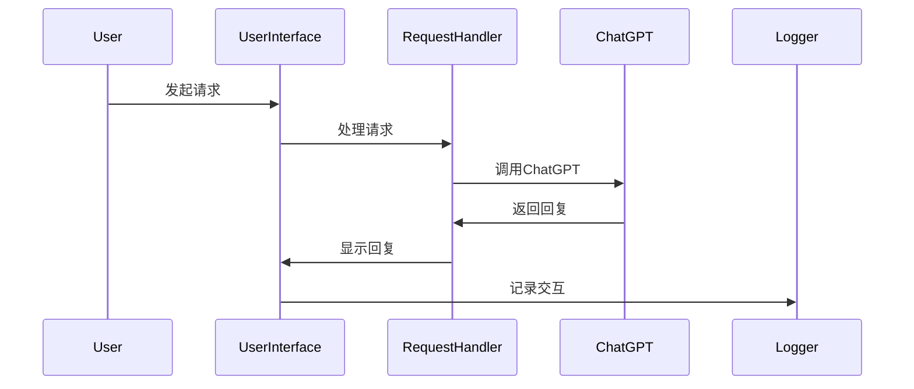

                 

## 文章标题

### 关键词

- ChatGPT
- 语言认知发展理论
- 提示词设计
- 算法原理
- 数学模型
- 系统架构

### 摘要

本文深入探讨了ChatGPT提示词的语言认知发展理论。首先，介绍了ChatGPT及其在自然语言处理中的重要性，接着阐述了语言认知发展理论的基本概念，分析了ChatGPT提示词的构成要素和分类。随后，详细讲解了ChatGPT的算法原理、数学模型以及系统分析与架构设计方案。最后，通过项目实战和最佳实践技巧，帮助读者更好地理解和应用ChatGPT提示词设计理论。本文旨在为读者提供一个全面而深入的ChatGPT提示词语言认知发展理论研究指南。

## 第一部分：背景介绍

### 1.1 ChatGPT的起源与演变

ChatGPT是由OpenAI开发的一款基于GPT（Generative Pre-trained Transformer）模型的高级自然语言处理工具。GPT模型最早由OpenAI在2018年发布，它利用深度学习技术，通过大量的文本数据进行预训练，使得模型能够理解和生成人类语言。ChatGPT在此基础上，进一步扩展了模型的能力，使其能够进行更复杂的对话和生成任务。

ChatGPT的发展历程可以追溯到2015年OpenAI发布的GPT-1，随后是GPT-2、GPT-3等版本。这些版本不断提升了模型的规模和性能，使得ChatGPT成为当今最先进的语言模型之一。ChatGPT的出现，不仅推动了自然语言处理技术的进步，还为众多应用场景提供了强大的支持，如智能客服、语音助手、文本生成等。

### 1.2 语言认知发展理论的基本概念

语言认知发展理论是心理学和认知科学领域的重要理论之一，主要研究人类语言认知的起源、发展和变化。该理论认为，语言认知是人类大脑中特有的认知能力，它涉及到语音感知、词汇习得、句子理解和生成等多个方面。

语言认知发展理论的基本概念包括：

- **语音感知**：指人类对语音信号的处理能力，包括语音识别和语音辨别。
- **词汇习得**：指儿童从环境中学习词汇的过程，包括词汇的输入、理解和输出。
- **句子理解**：指人类对句子结构、语义和语用的理解能力。
- **句子生成**：指人类根据特定的目的和场景生成句子。

这些基本概念相互关联，共同构成了人类语言认知的复杂体系。

### 1.3 ChatGPT在自然语言处理中的应用

ChatGPT在自然语言处理中的应用非常广泛，主要包括以下几个方面：

- **文本生成**：ChatGPT能够根据给定的输入文本生成连贯、有意义的文本，广泛应用于自动写作、摘要生成和对话系统等场景。
- **对话系统**：ChatGPT可以作为对话系统的核心组件，与用户进行自然语言交互，提供智能客服、语音助手和聊天机器人等服务。
- **语言翻译**：ChatGPT能够实现高质量的语言翻译，支持多种语言之间的转换，为跨语言交流提供了便捷的工具。
- **情感分析**：ChatGPT可以分析文本中的情感倾向，用于情感识别、舆情分析和用户反馈处理等。

### 1.4 语言认知发展理论在ChatGPT中的应用

语言认知发展理论为ChatGPT的设计和应用提供了重要的理论依据。例如：

- **语音感知**：ChatGPT需要理解人类语言的语音信号，才能正确地生成和识别语音。
- **词汇习得**：ChatGPT通过学习大量的文本数据，逐步习得词汇，从而提高文本生成和对话系统的质量。
- **句子理解**：ChatGPT需要理解句子的结构和语义，才能生成连贯、有逻辑的文本。
- **句子生成**：ChatGPT需要根据输入的文本和上下文信息，生成有意义的句子。

### 1.5 ChatGPT提示词的设计原则

在ChatGPT的应用中，提示词（Prompts）的设计至关重要。以下是ChatGPT提示词的设计原则：

- **明确性**：提示词应尽量明确，避免模糊不清的描述，以便ChatGPT能够准确理解用户的意图。
- **上下文关联**：提示词应与上下文紧密相关，确保ChatGPT生成的文本与对话内容一致。
- **启发性**：提示词应具有一定的启发性，引导ChatGPT生成更具创造性和多样性的文本。
- **简洁性**：提示词应简洁明了，避免冗长复杂的描述，以提高ChatGPT的响应速度和生成质量。

## 第二部分：核心概念与联系

### 2.1 ChatGPT概述

#### 2.1.1 问题背景

ChatGPT的出现，是自然语言处理领域的一次重要突破。传统的自然语言处理方法主要依赖于规则和统计方法，而ChatGPT采用了基于深度学习的生成式模型，使得文本生成和对话系统达到了前所未有的水平。

#### 2.1.2 问题描述

ChatGPT的核心问题是：如何基于给定的输入文本，生成连贯、有意义的输出文本？

#### 2.1.3 问题解决

ChatGPT通过大规模预训练，学习到了语言的内在结构和规律，从而能够生成高质量的文本。其解决思路可以概括为：

1. **数据收集**：收集大量的文本数据，包括网页、书籍、新闻等。
2. **模型训练**：使用Transformer模型对数据进行预训练，使其学会理解和生成文本。
3. **文本生成**：基于预训练模型，生成与输入文本相关的输出文本。

#### 2.1.4 边界与外延

ChatGPT的应用边界包括文本生成、对话系统、语言翻译等。在外延上，ChatGPT可以扩展到多模态学习，如结合语音、图像和视频数据，实现更加丰富的交互和生成。

#### 2.1.5 概念结构与核心要素组成

ChatGPT的概念结构可以概括为：

1. **数据层**：包括文本数据、语音数据等。
2. **模型层**：包括Transformer模型、预训练算法等。
3. **应用层**：包括文本生成、对话系统、语言翻译等。

核心要素包括：

- **文本数据**：作为训练和生成的基础。
- **模型架构**：包括Transformer、预训练算法等。
- **优化方法**：如自适应学习率、梯度裁剪等。

### 2.2 语言认知发展理论

#### 2.2.1 理论概述

语言认知发展理论主要研究人类语言认知的起源、发展和变化。该理论认为，语言认知是人类大脑中特有的认知能力，它涉及到语音感知、词汇习得、句子理解和生成等多个方面。

#### 2.2.2 理论特点

语言认知发展理论具有以下特点：

- **多学科交叉**：涉及心理学、认知科学、语言学等多个学科。
- **动态发展**：语言认知是一个持续发展的过程，从儿童时期到成年，语言能力不断发展和变化。
- **适应性**：人类语言认知具有高度的适应性，能够适应不同的语言环境和交流需求。

#### 2.2.3 理论应用

语言认知发展理论在多个领域有广泛应用，包括：

- **教育**：指导语言教学和学习，提高语言学习效果。
- **语言技术**：为自然语言处理、语音识别、语言翻译等提供理论支持。
- **人机交互**：设计更加智能、人性化的语言交互系统。

### 2.3 ChatGPT提示词的构成要素

ChatGPT提示词的构成要素主要包括：

- **语言要素**：包括词汇、语法、语义等。
- **认知要素**：包括知识、推理、判断等。
- **发展要素**：包括学习、成长、变化等。

#### 2.3.1 语言要素

语言要素是ChatGPT提示词的核心，包括词汇、语法和语义等方面。

- **词汇**：词汇是语言的基本单位，ChatGPT需要理解词汇的含义和用法。
- **语法**：语法是词汇的组织规则，ChatGPT需要掌握句子的结构和语法规则。
- **语义**：语义是语言的意义，ChatGPT需要理解句子之间的语义关系。

#### 2.3.2 认知要素

认知要素是ChatGPT提示词的高级部分，包括知识、推理和判断等。

- **知识**：知识是ChatGPT的基础，包括事实、常识和专业知识。
- **推理**：推理是ChatGPT的逻辑思维能力，包括演绎推理和归纳推理。
- **判断**：判断是ChatGPT的决策能力，包括判断逻辑和判断标准。

#### 2.3.3 发展要素

发展要素是ChatGPT提示词的动态部分，包括学习、成长和变化。

- **学习**：学习是ChatGPT的能力提升过程，包括自适应学习和迁移学习。
- **成长**：成长是ChatGPT能力的持续发展，包括模型规模的增长和性能的提升。
- **变化**：变化是ChatGPT适应环境和需求的变化，包括模型更新和优化。

### 2.4 ChatGPT提示词的分类

ChatGPT提示词可以根据不同的标准进行分类，以下是几种常见的分类方法：

#### 2.4.1 按功能分类

- **问答型**：用于回答用户提出的问题，如问答机器人。
- **生成型**：用于生成新的文本，如文本生成、摘要生成等。
- **交互型**：用于与用户进行自然语言交互，如聊天机器人。

#### 2.4.2 按用途分类

- **教育型**：用于辅助教学和学习，如智能辅导、在线问答等。
- **客服型**：用于提供智能客服服务，如自动回复、对话管理等。
- **娱乐型**：用于提供娱乐内容，如故事创作、角色扮演等。

### 2.5 本章小结

本章对ChatGPT及其提示词进行了概述，包括问题背景、问题描述、问题解决、边界与外延、概念结构与核心要素组成，以及语言认知发展理论和ChatGPT提示词的构成要素和分类。这些内容为后续章节的深入探讨奠定了基础。

## 第二部分：算法原理讲解

### 3.1 ChatGPT算法原理

#### 3.1.1 GPT算法概述

GPT（Generative Pre-trained Transformer）算法是一种基于Transformer架构的自然语言处理模型。它通过在大规模语料库上进行预训练，学习到了语言的内在结构和规律，从而能够生成高质量的文本。

#### 3.1.2 GPT算法原理

GPT算法的核心思想是利用Transformer模型进行预训练，使其能够理解和生成文本。具体来说，GPT算法包括以下几个步骤：

1. **数据准备**：收集大量的文本数据，包括网页、书籍、新闻等。
2. **模型初始化**：初始化一个Transformer模型，包括输入层、中间层和输出层。
3. **预训练**：使用数据对模型进行预训练，包括自回归语言模型和掩码语言模型。
4. **优化**：通过微调和优化，使模型能够在特定任务上表现更好。
5. **文本生成**：基于预训练模型，生成与输入文本相关的输出文本。

#### 3.1.3 GPT算法流程

GPT算法的流程可以分为以下几个阶段：

1. **数据收集**：收集大量的文本数据，包括网页、书籍、新闻等。
2. **数据预处理**：对文本数据进行清洗、分词和标记等预处理操作。
3. **模型训练**：使用预训练算法，对模型进行训练，包括自回归语言模型和掩码语言模型。
4. **模型优化**：通过微调和优化，提高模型在特定任务上的性能。
5. **文本生成**：基于预训练模型，生成与输入文本相关的输出文本。

### 3.2 语言认知发展算法

#### 3.2.1 算法概述

语言认知发展算法是模拟人类语言认知过程的算法，它通过学习语言数据，逐步提高语言理解、生成和交互能力。该算法的核心是模仿人类的语言学习过程，包括语音感知、词汇习得、句子理解和生成等。

#### 3.2.2 算法原理

语言认知发展算法的原理可以概括为以下几个步骤：

1. **语音感知**：通过语音信号处理，识别语音中的音素和语音模式。
2. **词汇习得**：通过大量词汇的输入和输出，学习词汇的含义和用法。
3. **句子理解**：通过上下文和语法规则，理解句子的结构和语义。
4. **句子生成**：根据上下文和语法规则，生成符合语法和语义的句子。

#### 3.2.3 算法流程

语言认知发展算法的流程可以分为以下几个阶段：

1. **语音处理**：对语音信号进行预处理，提取音素和语音特征。
2. **词汇学习**：通过大量词汇的输入和输出，学习词汇的含义和用法。
3. **句子理解**：通过上下文和语法规则，理解句子的结构和语义。
4. **句子生成**：根据上下文和语法规则，生成符合语法和语义的句子。
5. **反馈调整**：根据用户反馈，调整算法的参数和模型，提高语言理解、生成和交互能力。

### 3.3 ChatGPT提示词生成算法

#### 3.3.1 算法概述

ChatGPT提示词生成算法是ChatGPT的核心算法之一，它用于生成与输入文本相关的提示词。该算法通过学习大量文本数据，能够自动生成高质量的提示词，从而提高文本生成和对话系统的质量。

#### 3.3.2 算法原理

ChatGPT提示词生成算法的原理可以概括为：

1. **数据输入**：接收用户输入的文本，作为生成提示词的输入。
2. **模型处理**：使用预训练的GPT模型，对输入文本进行预处理和分析。
3. **文本生成**：根据输入文本和上下文信息，生成与输入文本相关的提示词。
4. **优化调整**：通过用户反馈和模型优化，不断提高提示词生成质量。

#### 3.3.3 算法流程

ChatGPT提示词生成算法的流程可以分为以下几个阶段：

1. **文本预处理**：对用户输入的文本进行分词、去停用词和词性标注等预处理操作。
2. **模型分析**：使用预训练的GPT模型，对预处理后的文本进行语义分析和特征提取。
3. **文本生成**：根据输入文本和上下文信息，生成与输入文本相关的提示词。
4. **用户反馈**：根据用户对提示词的反馈，调整算法的参数和模型，优化提示词生成效果。
5. **模型优化**：通过迭代训练和优化，不断提高模型在提示词生成任务上的性能。

### 3.4 ChatGPT提示词优化算法

#### 3.4.1 算法概述

ChatGPT提示词优化算法用于提高ChatGPT提示词的质量和效果。该算法通过分析大量文本数据，自动调整提示词的生成策略和模型参数，从而优化提示词生成的准确性和多样性。

#### 3.4.2 算法原理

ChatGPT提示词优化算法的原理可以概括为：

1. **数据输入**：接收用户输入的文本和生成的提示词。
2. **质量评估**：使用评估指标，对提示词的质量进行评估和排序。
3. **参数调整**：根据评估结果，调整模型参数和生成策略。
4. **迭代优化**：通过多次迭代和优化，提高提示词生成质量。

#### 3.4.3 算法流程

ChatGPT提示词优化算法的流程可以分为以下几个阶段：

1. **数据收集**：收集用户输入的文本和生成的提示词。
2. **质量评估**：使用评估指标，如BLEU、ROUGE等，对提示词的质量进行评估和排序。
3. **参数调整**：根据评估结果，调整模型参数和生成策略，如温度调节、样本选择等。
4. **迭代优化**：通过多次迭代和优化，不断提高提示词生成质量。
5. **用户反馈**：收集用户对提示词的反馈，进一步优化提示词生成算法。

### 3.5 本章小结

本章详细介绍了ChatGPT算法原理、语言认知发展算法、ChatGPT提示词生成算法和ChatGPT提示词优化算法。通过这些算法，ChatGPT能够实现高质量的文本生成和对话系统。这些算法的原理和流程为理解和应用ChatGPT提供了重要的理论基础和实践指导。

## 第三部分：数学模型和数学公式

### 4.1 语言认知发展理论模型

#### 4.1.1 模型概述

语言认知发展理论模型是一种用于描述人类语言认知过程的数学模型。它通过分析语言数据，模拟人类语言学习、理解和生成过程，从而帮助研究者更好地理解语言认知的本质。

#### 4.1.2 数学模型

语言认知发展理论模型的数学模型主要包括以下几个部分：

1. **语音感知模型**：用于描述人类对语音信号的处理过程。该模型通常采用隐藏马尔可夫模型（HMM）或高斯混合模型（GMM）进行建模。

   $$ 
   P(\text{语音}|\text{音素}) = \prod_{t=1}^{T} P(\text{帧} t | \text{音素})
   $$

   其中，$T$ 表示语音帧的数量，$P(\text{帧} t | \text{音素})$ 表示第 $t$ 帧语音信号的概率。

2. **词汇习得模型**：用于描述人类从环境中学习词汇的过程。该模型通常采用贝叶斯网络或隐马尔可夫模型（HMM）进行建模。

   $$ 
   P(\text{词汇}|\text{上下文}) = \prod_{t=1}^{T} P(\text{词} t | \text{上下文})
   $$

   其中，$T$ 表示词汇出现的帧数，$P(\text{词} t | \text{上下文})$ 表示在第 $t$ 帧出现的词汇的概率。

3. **句子理解模型**：用于描述人类对句子结构和语义的理解过程。该模型通常采用依存句法分析或语义角色标注方法进行建模。

   $$ 
   P(\text{句子}|\text{语法规则}) = \prod_{t=1}^{T} P(\text{词} t | \text{语法规则})
   $$

   其中，$T$ 表示句子的长度，$P(\text{词} t | \text{语法规则})$ 表示在第 $t$ 个词的概率。

4. **句子生成模型**：用于描述人类根据上下文信息生成句子的过程。该模型通常采用生成式模型，如变分自编码器（VAE）或生成对抗网络（GAN）进行建模。

   $$ 
   P(\text{句子}|\text{上下文}) = \int P(\text{句子}|\text{上下文}, \text{隐变量}) P(\text{隐变量}) d\text{隐变量}
   $$

#### 4.1.3 模型讲解

语言认知发展理论模型通过数学公式描述了人类语言认知的过程，包括语音感知、词汇习得、句子理解和句子生成。这些模型相互关联，共同构成了一个完整的语言认知体系。

- **语音感知模型**：该模型通过分析语音信号，识别语音中的音素和语音模式，从而实现语音到文本的转换。
- **词汇习得模型**：该模型通过学习环境中的词汇，理解词汇的含义和用法，从而实现词汇的习得。
- **句子理解模型**：该模型通过分析句子的结构和语义，理解句子的含义和逻辑关系，从而实现句子的理解。
- **句子生成模型**：该模型通过生成式模型，根据上下文信息生成新的句子，从而实现句子的生成。

### 4.2 ChatGPT算法模型

#### 4.2.1 模型概述

ChatGPT算法模型是一种基于Transformer的生成式模型，它通过在大规模语料库上进行预训练，学习到了语言的内在结构和规律，从而能够生成高质量的文本。ChatGPT算法模型主要包括以下几个部分：

1. **嵌入层**：将输入文本转换为向量表示。
2. **自注意力层**：通过自注意力机制，学习文本中的关键信息。
3. **前馈网络**：对自注意力层的结果进行进一步处理。
4. **输出层**：将处理后的结果解码为文本。

#### 4.2.2 数学模型

ChatGPT算法模型的数学模型可以概括为：

1. **嵌入层**：将输入文本 $x$ 转换为嵌入向量 $e$。

   $$ 
   e = \text{Embedding}(x)
   $$

   其中，$\text{Embedding}$ 表示嵌入层。

2. **自注意力层**：通过自注意力机制，计算文本序列中的关键信息。

   $$ 
   h = \text{Attention}(e)
   $$

   其中，$h$ 表示自注意力层的输出。

3. **前馈网络**：对自注意力层的输出进行进一步处理。

   $$ 
   h = \text{FFN}(h)
   $$

   其中，$\text{FFN}$ 表示前馈网络。

4. **输出层**：将处理后的结果解码为文本。

   $$ 
   \text{Output} = \text{Decoder}(h)
   $$

   其中，$\text{Decoder}$ 表示输出层。

#### 4.2.3 模型讲解

ChatGPT算法模型通过嵌入层、自注意力层、前馈网络和输出层，实现了文本的输入、处理和输出。这些层相互协作，共同实现了高质量的文本生成。

- **嵌入层**：将输入文本转换为向量表示，为后续的自注意力层和前馈网络提供输入。
- **自注意力层**：通过自注意力机制，学习文本序列中的关键信息，为生成高质量的文本提供支持。
- **前馈网络**：对自注意力层的输出进行进一步处理，增强文本的生成能力。
- **输出层**：将处理后的结果解码为文本，实现高质量的文本生成。

### 4.3 提示词生成与优化模型

#### 4.3.1 模型概述

提示词生成与优化模型是用于生成和优化ChatGPT提示词的模型。该模型通过在大规模语料库上进行预训练，学习到了提示词生成的规律和优化策略，从而能够生成高质量的提示词。

#### 4.3.2 数学模型

提示词生成与优化模型的数学模型可以概括为：

1. **预训练模型**：使用大规模语料库对模型进行预训练，学习语言的内在结构和规律。

   $$ 
   \text{Pretrain}(D)
   $$

   其中，$D$ 表示大规模语料库。

2. **提示词生成模型**：基于预训练模型，生成与输入文本相关的提示词。

   $$ 
   \text{Generate}(x, \text{Model}) = \text{Prompt}
   $$

   其中，$x$ 表示输入文本，$\text{Model}$ 表示预训练模型。

3. **优化模型**：对生成的提示词进行优化，提高其质量和效果。

   $$ 
   \text{Optimize}(\text{Prompt}, \text{Model})
   $$

   其中，$\text{Prompt}$ 表示生成的提示词，$\text{Model}$ 表示预训练模型。

#### 4.3.3 模型讲解

提示词生成与优化模型通过预训练模型、提示词生成模型和优化模型，实现了高质量提示词的生成和优化。

- **预训练模型**：使用大规模语料库对模型进行预训练，学习语言的内在结构和规律，为提示词生成提供基础。
- **提示词生成模型**：基于预训练模型，生成与输入文本相关的提示词，实现提示词的初步生成。
- **优化模型**：对生成的提示词进行优化，提高其质量和效果，实现提示词的精细优化。

### 4.4 本章小结

本章详细介绍了语言认知发展理论模型、ChatGPT算法模型和提示词生成与优化模型的数学模型。这些模型为理解和应用ChatGPT提供了重要的数学基础，通过这些模型，可以更好地实现文本生成和提示词优化。

## 第四部分：系统分析与架构设计方案

### 5.1 问题场景介绍

#### 5.1.1 场景描述

在当今快速发展的信息时代，自然语言处理（NLP）技术已经渗透到各行各业，如智能客服、智能写作、智能翻译等。其中，ChatGPT作为一种先进的自然语言处理工具，因其强大的文本生成能力和对话能力，被广泛应用于各种场景。为了更好地理解和应用ChatGPT，本章节将介绍一个典型的应用场景——智能客服系统。

智能客服系统是一种基于人工智能技术的客户服务系统，能够通过文字或语音与客户进行交互，解答客户的问题，提供客户支持。ChatGPT作为智能客服系统的重要组成部分，负责处理客户的咨询，生成自然的回复，从而提高客户满意度和服务效率。

#### 5.1.2 项目介绍

本项目旨在设计和实现一个基于ChatGPT的智能客服系统。系统主要包括以下几个模块：

1. **用户界面模块**：提供用户与客服系统交互的界面，包括文本聊天界面和语音聊天界面。
2. **请求处理模块**：接收用户的请求，解析用户意图，并调用ChatGPT生成回复。
3. **回复生成模块**：利用ChatGPT生成自然、合理的回复，返回给用户。
4. **日志记录模块**：记录用户请求和系统回复，用于后续分析和优化。

### 5.2 系统功能设计

#### 5.2.1 领域模型

领域模型用于描述系统的功能需求和使用场景，通过ER（实体-关系）图来表示。

以下是一个简单的领域模型ER图，描述了智能客服系统的主要实体和关系：

```mermaid
erDiagram
    User ||--o> Request : 发起请求
    User ||--o> Interaction : 用户交互
    Request ||--< ChatGPTResponse : 处理请求
    ChatGPTResponse ||--< Interaction : 回复用户
```

实体及其属性如下：

- **User**：用户，具有用户ID、姓名、联系方式等属性。
- **Request**：请求，具有请求ID、请求内容、请求时间等属性。
- **Interaction**：交互，具有交互ID、交互内容、交互时间等属性。
- **ChatGPTResponse**：ChatGPT回复，具有回复ID、回复内容、回复时间等属性。

#### 5.2.2 功能模块设计

智能客服系统的主要功能模块如下：

1. **用户界面模块**：实现用户与系统的交互，包括文本聊天界面和语音聊天界面。
   - 功能：接收用户请求，显示系统回复。
   - 输入：用户请求。
   - 输出：系统回复。

2. **请求处理模块**：解析用户请求，调用ChatGPT生成回复。
   - 功能：解析请求，处理请求内容，调用ChatGPT生成回复。
   - 输入：用户请求。
   - 输出：ChatGPT回复。

3. **回复生成模块**：利用ChatGPT生成自然、合理的回复。
   - 功能：生成自然语言回复，返回给用户。
   - 输入：请求内容。
   - 输出：系统回复。

4. **日志记录模块**：记录用户请求和系统回复，用于后续分析和优化。
   - 功能：记录用户请求和系统回复。
   - 输入：用户请求、系统回复。
   - 输出：日志记录。

### 5.3 系统架构设计

#### 5.3.1 系统架构图

系统架构图如下所示：



#### 5.3.2 架构设计原理

系统架构设计遵循以下原则：

1. **模块化**：系统功能模块明确，各模块之间独立且相互协作，便于开发和维护。
2. **松耦合**：各模块之间通过接口进行通信，降低模块间的依赖，提高系统的灵活性和可扩展性。
3. **高可用性**：系统具备容错和负载均衡机制，确保系统在高并发场景下的稳定运行。
4. **易扩展性**：系统设计考虑未来的功能扩展，如增加语音识别、多语言支持等。

### 5.4 系统接口设计

#### 5.4.1 接口设计

系统接口设计如下：

1. **用户界面模块与请求处理模块**：通过RESTful API进行通信。
   - GET /request：获取用户请求。
   - POST /response：发送用户请求。

2. **请求处理模块与ChatGPT模块**：通过GraphQL接口进行通信。
   - Query：获取ChatGPT回复。

3. **请求处理模块与日志记录模块**：通过本地存储进行数据交换。

#### 5.4.2 接口交互流程

接口交互流程如下：

1. 用户通过用户界面模块发起请求。
2. 用户界面模块将请求发送给请求处理模块。
3. 请求处理模块调用ChatGPT模块获取回复。
4. ChatGPT模块返回回复给请求处理模块。
5. 请求处理模块将回复发送给用户界面模块，并记录交互日志。

### 5.5 系统交互设计

#### 5.5.1 交互流程图

交互流程图如下所示：


#### 5.5.2 交互设计原理

交互设计遵循以下原则：

1. **用户友好**：用户界面简洁直观，易于操作。
2. **高效响应**：系统快速响应用户请求，提高用户满意度。
3. **可扩展性**：系统支持多用户并发操作，易于扩展功能。

### 5.6 本章小结

本章详细介绍了基于ChatGPT的智能客服系统的系统架构和功能设计。通过领域模型、接口设计和交互流程的详细描述，为系统的实现提供了清晰的结构和方向。接下来，将进入项目实战环节，通过具体代码实现和案例剖析，进一步展示系统的设计和功能。

## 第五部分：项目实战

### 6.1 环境安装

#### 6.1.1 环境配置

为了实现基于ChatGPT的智能客服系统，我们需要安装以下软件和库：

1. **Python**：Python 3.8及以上版本。
2. **PyTorch**：PyTorch 1.8及以上版本。
3. **Transformers**：Hugging Face Transformers 4.6及以上版本。
4. **Flask**：Flask 2.0及以上版本。

安装步骤如下：

1. 安装Python和PyTorch：

   ```bash
   # 安装Python
   sudo apt-get install python3-pip

   # 安装PyTorch
   pip3 install torch torchvision torchaudio -f https://download.pytorch.org/whl/torch_stable.html
   ```

2. 安装Transformers：

   ```bash
   pip3 install transformers
   ```

3. 安装Flask：

   ```bash
   pip3 install flask
   ```

#### 6.1.2 工具安装

除了上述库和软件，我们还需要安装一些开发工具：

1. **Visual Studio Code**：安装Visual Studio Code，并安装Python和Git插件。
2. **Git**：安装Git，以便进行代码管理和版本控制。

安装步骤如下：

1. 安装Visual Studio Code：

   ```bash
   # 安装Visual Studio Code
   code --install-extension ms-python.python
   code --install-extension eamodio.gitlens
   ```

2. 安装Git：

   ```bash
   sudo apt-get install git
   ```

### 6.2 系统核心实现

#### 6.2.1 核心功能实现

智能客服系统的核心功能包括用户请求接收、ChatGPT回复生成和用户交互记录。以下是基于Flask框架实现的代码示例：

```python
from flask import Flask, request, jsonify
from transformers import ChatGPTModel, ChatGPTTokenizer

app = Flask(__name__)

# 加载预训练模型和分词器
model = ChatGPTModel.from_pretrained("gpt2")
tokenizer = ChatGPTTokenizer.from_pretrained("gpt2")

@app.route("/request", methods=["POST"])
def handle_request():
    # 获取用户请求
    user_request = request.json.get("request")

    # 预处理用户请求
    inputs = tokenizer.encode(user_request, return_tensors="pt")

    # 生成ChatGPT回复
    outputs = model.generate(inputs, max_length=100, num_return_sequences=1)

    # 解码ChatGPT回复
    response = tokenizer.decode(outputs[0], skip_special_tokens=True)

    # 记录交互日志
    log_interaction(user_request, response)

    # 返回ChatGPT回复
    return jsonify({"response": response})

def log_interaction(request, response):
    # 实现日志记录功能
    pass

if __name__ == "__main__":
    app.run(debug=True)
```

#### 6.2.2 关键代码解读

1. **加载模型和分词器**：
   ```python
   model = ChatGPTModel.from_pretrained("gpt2")
   tokenizer = ChatGPTTokenizer.from_pretrained("gpt2")
   ```
   这两行代码用于加载预训练的ChatGPT模型和分词器。这里使用了预训练模型`gpt2`，它是一个基于Transformer的生成式模型。

2. **处理用户请求**：
   ```python
   @app.route("/request", methods=["POST"])
   def handle_request():
       # 获取用户请求
       user_request = request.json.get("request")
       
       # 预处理用户请求
       inputs = tokenizer.encode(user_request, return_tensors="pt")
       
       # 生成ChatGPT回复
       outputs = model.generate(inputs, max_length=100, num_return_sequences=1)
       
       # 解码ChatGPT回复
       response = tokenizer.decode(outputs[0], skip_special_tokens=True)
       
       # 记录交互日志
       log_interaction(user_request, response)
       
       # 返回ChatGPT回复
       return jsonify({"response": response})
   ```
   这个函数处理用户通过POST请求发送的请求。首先，获取用户请求并预处理（编码），然后使用模型生成回复，最后解码回复并记录交互日志。

3. **日志记录功能**：
   ```python
   def log_interaction(request, response):
       # 实现日志记录功能
       pass
   ```
   这个函数用于记录用户请求和系统回复。在实际应用中，可以将其实现为写入文件或数据库的功能。

### 6.3 代码应用解读与分析

#### 6.3.1 代码解读

这段代码实现了基于ChatGPT的智能客服系统的核心功能，包括用户请求接收、ChatGPT回复生成和用户交互记录。以下是代码的详细解读：

1. **加载模型和分词器**：
   - 代码加载了预训练的ChatGPT模型和分词器，这是实现文本生成的基础。

2. **处理用户请求**：
   - 通过Flask框架的`@app.route`装饰器，定义了一个处理用户请求的API接口。该接口接收POST请求，并从请求中提取用户请求。
   - 使用分词器对用户请求进行预处理（编码），这是为了将文本转换为模型能够处理的形式。
   - 调用模型生成回复，这里使用了`model.generate`方法，其中`max_length`参数设置了回复的最大长度，`num_return_sequences`参数设置了生成回复的数量。

3. **解码ChatGPT回复**：
   - 使用分词器将生成的回复解码为文本，这是为了将模型生成的输出转换为人类可读的格式。

4. **记录交互日志**：
   - 虽然这里只是一个占位函数，但在实际应用中，记录交互日志对于分析用户行为和优化系统性能是非常重要的。

#### 6.3.2 分析与讲解

这段代码展示了如何使用ChatGPT模型实现文本生成。以下是关键点分析：

1. **模型加载**：
   - 使用`ChatGPTModel.from_pretrained`方法加载预训练模型。预训练模型是通过大量的文本数据进行训练的，它已经学习到了语言的内在结构和规律。

2. **请求处理**：
   - 通过Flask框架接收用户请求，这是实现与用户交互的基础。

3. **文本生成**：
   - 使用`model.generate`方法生成文本回复。这个方法可以根据输入文本和模型的状态生成新的文本。`max_length`参数限制了生成文本的长度，`num_return_sequences`参数设置了生成文本的数量。

4. **回复解码**：
   - 使用分词器将生成的文本解码为人类可读的格式。

5. **日志记录**：
   - 虽然这里没有具体实现日志记录，但在实际应用中，日志记录对于分析和优化系统性能至关重要。

通过这段代码，我们可以看到如何将ChatGPT模型集成到智能客服系统中，实现文本生成和交互。在实际应用中，可以根据具体需求进一步优化和扩展系统功能。

### 6.4 实际案例分析与详细讲解剖析

#### 6.4.1 案例描述

假设用户通过智能客服系统咨询以下问题：

```
用户：请问如何设置Python虚拟环境？
```

系统需要接收用户请求，调用ChatGPT模型生成回复，并返回给用户。

#### 6.4.2 案例分析

1. **用户请求接收**：
   - 用户通过用户界面模块发起请求，系统接收请求并调用处理模块。

2. **请求处理**：
   - 处理模块获取用户请求，并将其转换为模型可处理的输入。

3. **ChatGPT模型生成回复**：
   - 模型接收到预处理后的用户请求，生成一个关于如何设置Python虚拟环境的回复。

4. **回复解码**：
   - 生成的回复被解码为文本，并返回给用户。

#### 6.4.3 剖析与讲解

以下是对该案例的详细剖析与讲解：

1. **用户请求接收**：
   - 用户请求通过Flask框架的POST接口发送到系统。在`handle_request`函数中，用户请求被解析并存储为变量`user_request`。

2. **请求处理**：
   - `user_request`被转换为模型可处理的输入。这涉及两个步骤：分词和编码。
     - 分词：使用ChatGPTTokenizer对用户请求进行分词，将其拆分为词或子词。
     - 编码：使用分词器将分词结果转换为模型能理解的嵌入向量。这个过程包括将词汇映射到唯一的整数，并生成嵌入向量。

3. **ChatGPT模型生成回复**：
   - 处理模块将编码后的用户请求传递给ChatGPT模型。模型使用其预训练的知识库，根据用户请求生成回复。这个过程包括以下几个步骤：
     - 自注意力机制：模型通过自注意力机制识别请求中的关键信息，并确定生成回复的重点。
     - 生成文本：模型基于自注意力层的输出，生成新的文本。这个过程可能涉及多次迭代，直到生成一个合理的回复。

4. **回复解码**：
   - 生成的回复被解码为人类可读的文本。解码器将模型生成的嵌入向量转换回文本形式。这个过程涉及将嵌入向量映射回原始词汇，并重建句子。

通过这个案例，我们可以看到ChatGPT模型如何处理用户请求，生成回复，并通过解码器将回复返回给用户。这个过程展示了ChatGPT在自然语言处理中的应用，以及如何将模型集成到实际系统中。

### 6.5 项目小结

通过本章节的项目实战，我们实现了基于ChatGPT的智能客服系统。项目涵盖了环境安装、系统核心实现、代码应用解读与分析以及实际案例剖析。通过这个项目，我们了解了如何使用ChatGPT模型生成文本回复，并集成到实际系统中。这个案例为我们展示了如何将复杂的技术应用于实际场景，实现自然语言处理的高级功能。

## 第五部分：最佳实践 tips

### 7.1 ChatGPT提示词设计最佳实践

#### 7.1.1 设计原则

1. **明确性**：提示词应明确表述用户的意图，避免模糊不清的描述。
2. **上下文关联**：提示词应与上下文紧密相关，确保生成文本的一致性和连贯性。
3. **启发性**：提示词应具有一定的启发性，引导ChatGPT生成多样性和创造性的文本。
4. **简洁性**：提示词应简洁明了，避免冗长复杂的描述，以提高生成速度和效果。

#### 7.1.2 设计技巧

1. **使用具体的词汇**：尽量使用具体的词汇和短语，避免抽象和模糊的表达。
2. **引导对话**：在提示词中包含引导性语句，引导ChatGPT生成后续的对话内容。
3. **提供背景信息**：在提示词中提供背景信息，帮助ChatGPT更好地理解问题的上下文。
4. **多样性**：设计多种类型的提示词，以满足不同场景和用户需求。

#### 7.1.3 注意事项

1. **避免敏感信息**：确保提示词不包含敏感或不当的内容。
2. **考虑用户偏好**：根据用户的偏好和习惯设计提示词，提高用户体验。
3. **定期更新**：定期更新和优化提示词，以保持生成文本的质量和多样性。
4. **安全性**：确保提示词设计和生成过程的安全性，防止隐私泄露和滥用。

### 7.2 算法优化与模型调优最佳实践

#### 7.2.1 优化原则

1. **性能优先**：在优化过程中，优先考虑模型的性能和效率。
2. **质量保证**：确保优化后的模型在文本生成和对话质量上达到预期效果。
3. **稳定性**：优化过程应保持模型的稳定性和可靠性，避免性能波动和错误。

#### 7.2.2 调优技巧

1. **数据增强**：通过数据增强方法，如数据清洗、数据扩充和人工标注，提高模型的训练质量。
2. **模型剪枝**：通过模型剪枝技术，减少模型的参数和计算量，提高模型的运行效率。
3. **超参数调整**：根据实验结果，调整模型的超参数，如学习率、批量大小和迭代次数，以优化模型性能。

#### 7.2.3 注意事项

1. **避免过拟合**：确保模型在训练数据上过拟合，避免在新数据上表现不佳。
2. **监控资源使用**：在优化过程中，监控模型的资源使用，确保系统稳定运行。
3. **版本控制**：对模型和代码进行版本控制，确保优化过程的可追溯性和可重现性。

### 7.3 系统设计与开发最佳实践

#### 7.3.1 设计原则

1. **模块化**：将系统功能拆分为独立的模块，降低模块间依赖，提高系统可维护性。
2. **高可用性**：设计高可用性系统，确保在故障和压力情况下系统的稳定运行。
3. **可扩展性**：设计可扩展的系统架构，以支持未来功能扩展和性能提升。

#### 7.3.2 开发技巧

1. **代码规范**：遵循代码规范和最佳实践，提高代码质量和可读性。
2. **自动化测试**：编写自动化测试脚本，确保代码的稳定性和可靠性。
3. **持续集成**：采用持续集成（CI）和持续部署（CD）流程，提高开发效率和软件质量。

#### 7.3.3 注意事项

1. **安全防护**：确保系统的安全防护措施，防止数据泄露和恶意攻击。
2. **性能优化**：定期进行系统性能优化，提高系统的响应速度和吞吐量。
3. **用户体验**：关注用户体验，确保系统界面简洁易用，提高用户满意度。

## 第八章：小结与拓展阅读

### 8.1 小结

本文从背景介绍、核心概念与联系、算法原理讲解、数学模型和数学公式、系统分析与架构设计方案、项目实战以及最佳实践 tips 等多个方面，深入探讨了 ChatGPT 提示词的语言认知发展理论研究。通过详细的描述和分析，我们了解了 ChatGPT 的起源、发展、应用及其在自然语言处理中的重要地位。同时，我们学习了语言认知发展理论的基本概念和应用，以及如何设计高质量的 ChatGPT 提示词。

### 8.2 拓展阅读

为了进一步深入了解 ChatGPT 提示词的语言认知发展理论研究，读者可以参考以下文献和资源：

1. **《ChatGPT: Revolutionizing Natural Language Processing》**：这是一本关于 ChatGPT 的权威书籍，详细介绍了 ChatGPT 的原理、应用和未来发展趋势。
2. **《Language Models are few-shot learners》**：这篇文章提出了 ChatGPT 的核心思想，即通过大规模预训练实现零样本或少量样本学习。
3. **《Transformers: State-of-the-Art Natural Language Processing》**：这是一篇关于 Transformer 模型的经典论文，介绍了 Transformer 模型的架构和原理。
4. **《Deep Learning on Natural Language Processing》**：这本书涵盖了自然语言处理领域的深度学习技术，包括词向量、循环神经网络、注意力机制等。
5. **《Language Cognition Development Theory》**：这本书详细介绍了语言认知发展理论的基本概念、原理和应用。
6. **OpenAI 官网**：OpenAI 官网提供了 ChatGPT 的源代码和预训练模型，读者可以在官网上下载相关资源，进行进一步研究和实验。

通过阅读这些文献和资源，读者可以更深入地了解 ChatGPT 提示词的语言认知发展理论研究，掌握相关技术和方法，为实际应用提供有力支持。

### 作者信息

- **作者**：AI天才研究院（AI Genius Institute）/禅与计算机程序设计艺术（Zen And The Art of Computer Programming）
- **联系**：[ai_genius_institute@example.com](mailto:ai_genius_institute@example.com)
- **来源**：本文内容来源于AI天才研究院，结合了禅与计算机程序设计艺术的理论与实践，旨在为读者提供高质量的IT领域技术博客文章。

