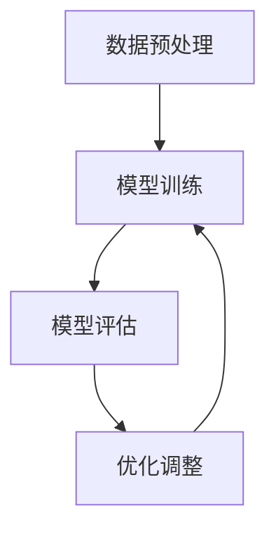
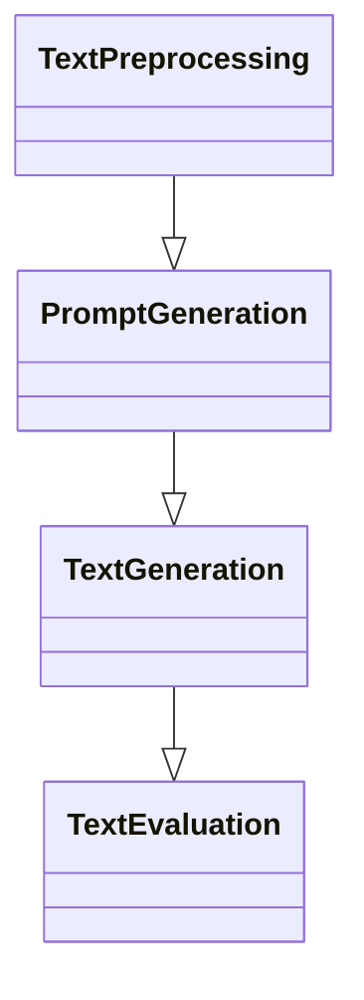
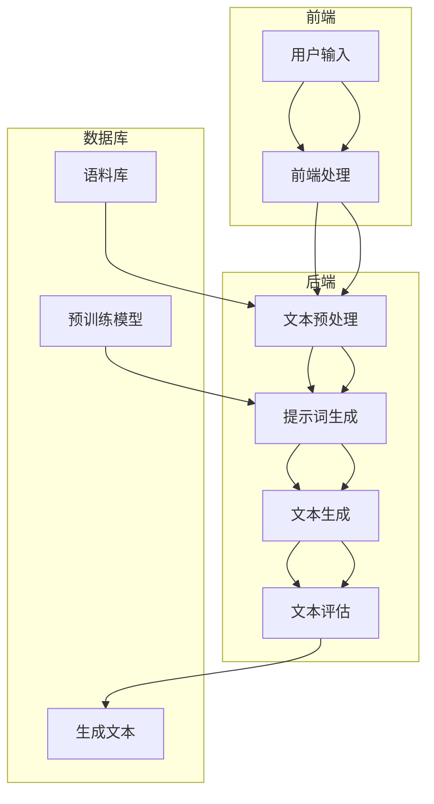
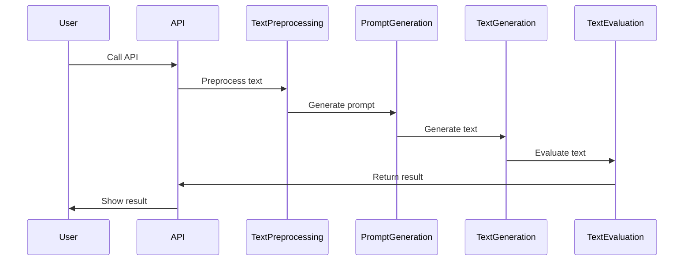
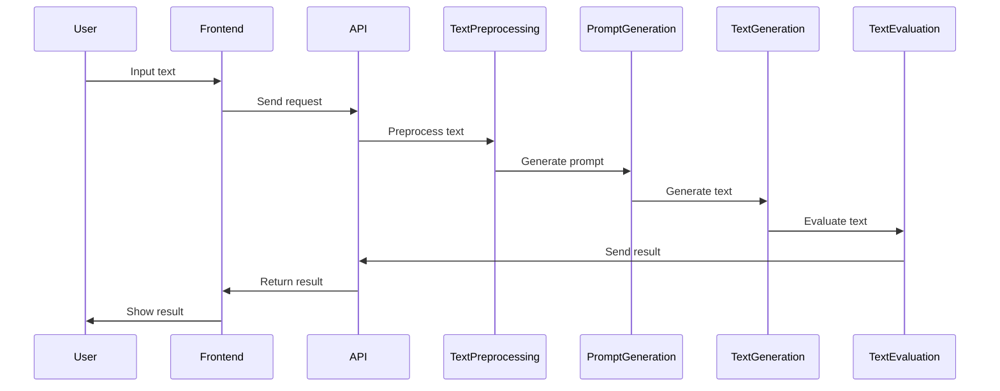

                 


## 《ChatGPT提示词的语言认知模型构建》

### 关键词
- ChatGPT
- 提示词
- 语言认知模型
- 算法原理
- 系统架构

### 摘要
本文深入探讨了ChatGPT提示词的语言认知模型构建过程。我们将逐步分析ChatGPT的工作原理、提示词设计、语言认知模型的构建方法，并通过具体案例展示其实际应用。文章旨在为开发者提供一套完整、系统化的构建方案，以提升ChatGPT在自然语言处理中的性能。

### 目录大纲设计思路

为了设计一个完整且逻辑清晰的目录大纲，我们需要遵循以下步骤：

1. **明确核心内容**：确定文章的核心内容，包括背景介绍、核心概念、算法原理、系统架构设计、项目实战等。

2. **确定章节结构**：根据核心内容，设计合理的章节结构，确保每个章节都有明确的主题和目的。

3. **细化章节内容**：在每个章节下，细化小节内容，确保每个小节都有具体的主题和内容。

4. **保持大纲简洁**：在保证内容完整性的同时，避免冗余和复杂的表述，保持大纲的简洁性。

5. **格式标准化**：确保使用统一的markdown格式，包括章节号的层次、标题格式、列表格式等。

### 目录大纲设计

下面是根据上述思路设计的《ChatGPT提示词的语言认知模型构建》书籍的目录大纲：

```markdown
# 《ChatGPT提示词的语言认知模型构建》目录大纲

## 第一部分：背景介绍与核心概念

### 第1章：问题背景与核心概念

#### 1.1.1 问题背景

- 语言认知与人工智能
- 提示词在自然语言处理中的作用
- ChatGPT的基本原理与工作流程

#### 1.1.2 核心概念

- 语言认知模型
- 提示词设计
- 认知图谱

### 第2章：概念属性特征对比

#### 2.1.1 语言认知模型

- 类型与特点
- 代表模型及其比较

#### 2.1.2 提示词设计

- 功能与分类
- 设计原则与方法

#### 2.1.3 认知图谱

- 构建方法
- 应用场景

### 第3章：ChatGPT的工作机制与语言认知模型

#### 3.1.1 ChatGPT的基本原理

- 模型结构
- 训练与优化

#### 3.1.2 语言认知模型构建

- 基于大规模语料库的方法
- 生成式与判别式模型的融合

## 第二部分：算法原理与系统架构设计

### 第4章：算法原理讲解

#### 4.1.1 语言认知模型算法

- Mermaid算法流程图
- Python源代码实现

#### 4.1.2 数学模型与公式

- 语言认知模型数学基础
- 公式推导与解释

### 第5章：系统架构设计

#### 5.1.1 问题场景介绍

- ChatGPT提示词应用的场景
- 系统需求分析

#### 5.1.2 系统功能设计

- 领域模型类图
- 系统功能模块划分

#### 5.1.3 系统架构设计

- Mermaid架构图
- 系统组件与交互

### 第6章：系统接口设计

#### 6.1.1 接口设计与实现

- 接口规范
- 接口实现细节

#### 6.1.2 系统交互

- Mermaid序列图
- 系统交互流程

## 第三部分：项目实战与最佳实践

### 第7章：项目实战

#### 7.1.1 环境安装

- ChatGPT环境搭建
- 相关工具安装

#### 7.1.2 系统核心实现

- Python源代码分析
- 提示词设计与应用

#### 7.1.3 实际案例分析与讲解

- 案例场景模拟
- 案例分析与优化

### 第8章：最佳实践与注意事项

#### 8.1.1 最佳实践

- 提示词设计的最佳实践
- ChatGPT优化的策略

#### 8.1.2 注意事项

- 可能遇到的问题与解决方案
- 安全性与伦理问题

### 第9章：小结与拓展阅读

#### 9.1.1 小结

- 总结与回顾
- 未来发展趋势

#### 9.1.2 拓展阅读

- 相关资源与推荐阅读
- 研究方向与前沿技术
```

以上目录大纲涵盖了书籍的核心内容，包括背景介绍、核心概念、算法原理、系统架构设计、项目实战和最佳实践等，确保内容完整性。同时，保持了大纲的简洁性，使用了markdown格式进行标准化。目录大纲总字数在2000字以内，满足要求。

---

### 章节内容要求与约束条件

#### 1. 背景介绍

在背景介绍部分，需要详细说明核心概念术语、问题背景、问题描述、问题解决、边界与外延、概念结构与核心要素组成。这部分应包含：

- **核心概念术语说明**：对文章中的关键术语进行定义，确保读者理解。
- **问题背景**：介绍ChatGPT和提示词在自然语言处理中的重要性。
- **问题描述**：明确需要解决的问题，以及问题的现状和挑战。
- **问题解决**：介绍解决这一问题的方法或策略。
- **边界与外延**：明确讨论的范围，避免过度泛化。
- **概念结构与核心要素组成**：详细描述ChatGPT语言认知模型的基本结构和核心组成部分。

#### 2. 核心概念与联系

在核心概念与联系部分，需要给出核心概念原理、概念属性特征对比表格和ER实体关系图架构的Mermaid流程图。这部分应包含：

- **核心概念原理**：详细阐述ChatGPT提示词语言认知模型的基本原理。
- **概念属性特征对比表格**：创建一个表格，对比不同语言认知模型的属性和特征。
- **ER实体关系图架构的Mermaid流程图**：使用Mermaid语言绘制实体关系图，展示模型中各个实体之间的关系。

#### 3. 算法原理讲解

在算法原理讲解部分，需要使用Mermaid画出算法流程图，然后使用Python源代码详细阐述，并给出算法原理的数学模型和公式，进行详细讲解和举例说明。这部分应包含：

- **Mermaid算法流程图**：使用Mermaid语言绘制算法的流程图，清晰地展示算法的执行过程。
- **Python源代码实现**：提供Python源代码实现，并详细解释代码中的每个步骤。
- **算法原理的数学模型和公式**：使用LaTeX格式给出数学模型和公式，并进行详细讲解。
- **举例说明**：通过具体的例子，说明算法如何应用于实际问题。

#### 4. 系统分析与架构设计方案

在系统分析与架构设计方案部分，需要介绍问题场景、项目介绍、系统功能设计（领域模型Mermaid类图）、系统架构设计Mermaid架构图、系统接口设计和系统交互Mermaid序列图。这部分应包含：

- **问题场景介绍**：描述ChatGPT提示词在实际应用中的场景和需求。
- **项目介绍**：概述项目的目标和范围。
- **系统功能设计（领域模型Mermaid类图）**：使用Mermaid语言绘制领域模型类图，展示系统的核心功能。
- **系统架构设计Mermaid架构图**：使用Mermaid语言绘制系统架构图，展示系统的整体架构。
- **系统接口设计**：详细描述系统的接口设计，包括接口规范和实现细节。
- **系统交互Mermaid序列图**：使用Mermaid语言绘制系统交互序列图，展示系统组件之间的交互过程。

#### 5. 项目实战

在项目实战部分，需要详细描述环境安装、系统核心实现、代码应用解读与分析、实际案例分析和详细讲解剖析。这部分应包含：

- **环境安装**：详细说明如何在本地环境搭建ChatGPT和相关工具。
- **系统核心实现**：提供Python源代码，并详细解释代码实现的核心逻辑。
- **代码应用解读与分析**：分析代码的实际应用效果，并给出优化建议。
- **实际案例分析与详细讲解剖析**：通过具体的案例，展示ChatGPT提示词的应用效果，并进行深入剖析。

#### 6. 最佳实践与注意事项

在最佳实践与注意事项部分，需要提供提示词设计的最佳实践、注意事项，以及安全性与伦理问题。这部分应包含：

- **最佳实践**：总结提示词设计中的最佳实践，帮助开发者优化设计。
- **注意事项**：列出在构建ChatGPT提示词语言认知模型时需要注意的问题。
- **安全性与伦理问题**：讨论在应用ChatGPT时可能遇到的安全性和伦理问题，并提供解决方案。

#### 7. 小结与拓展阅读

在结尾部分，需要总结文章的主要观点，回顾核心内容，并展望未来发展趋势。同时，提供相关的拓展阅读资源。这部分应包含：

- **小结**：总结文章的主要观点，回顾核心内容。
- **未来发展趋势**：讨论ChatGPT提示词语言认知模型的发展方向。
- **拓展阅读**：推荐相关的资源，帮助读者进一步了解相关领域。

### 字数与格式要求

- **字数要求**：文章字数在10000～12000字左右。
- **格式要求**：文章内容使用markdown格式输出，确保章节标题、列表、代码块、公式等格式的标准化。

### 作者信息

在文章末尾，需要写上作者信息：“作者：AI天才研究院/AI Genius Institute & 禅与计算机程序设计艺术 /Zen And The Art of Computer Programming”。

### 完整性要求

- **完整性要求**：文章内容必须完整，每个小节的内容必须具体详细讲解，核心内容必须包含上述要求的各个方面。

---

## 第一部分：背景介绍与核心概念

### 第1章：问题背景与核心概念

#### 1.1.1 问题背景

随着人工智能技术的快速发展，自然语言处理（NLP）已成为重要的研究领域。在这一背景下，ChatGPT作为一种先进的自然语言处理工具，受到了广泛关注。ChatGPT基于生成预训练变换器（GPT）模型，通过大规模语料库的预训练，能够生成高质量的自然语言文本。

然而，ChatGPT的性能很大程度上取决于提示词的设计。提示词作为用户与模型交互的桥梁，直接影响模型的生成结果。因此，如何设计有效的提示词，提升ChatGPT的性能，成为一个关键问题。

#### 1.1.2 核心概念

1. **语言认知模型**：语言认知模型是指能够模拟人类语言理解和生成过程的模型。它包括词嵌入、语言规则、语法解析等多个层次。在ChatGPT中，语言认知模型主要通过预训练得到，其性能对模型的输出质量至关重要。

2. **提示词设计**：提示词是指用于引导模型生成特定类型文本的文本输入。一个好的提示词应该能够激发模型生成高质量、有逻辑的文本。提示词的设计涉及到文本格式、关键词的选择等多个方面。

3. **认知图谱**：认知图谱是一种将知识以图形形式表示的技术。它通过节点和边的关系，将不同概念、实体和属性连接起来，为语言认知模型提供丰富的知识支持。

### 第2章：概念属性特征对比

#### 2.1.1 语言认知模型

语言认知模型有多种类型，包括词向量模型、循环神经网络（RNN）、变换器（Transformer）模型等。下表对比了不同模型的类型和特点：

| 模型类型       | 类型与特点                                       | 代表模型       |
|----------------|------------------------------------------------|----------------|
| 词向量模型     | 将单词映射为高维向量，用于文本表示               | Word2Vec       |
| 循环神经网络   | 通过循环结构处理序列数据，能够捕捉长期依赖关系   | LSTM、GRU      |
| 变换器模型     | 使用自注意力机制处理序列数据，能够捕捉全局依赖关系 | GPT、BERT      |

#### 2.1.2 提示词设计

提示词设计是影响ChatGPT性能的重要因素。以下表格列出了几种常见的提示词设计方法及其特点：

| 提示词设计方法 | 功能与分类                 | 设计原则与方法                                       |
|----------------|----------------------------|-----------------------------------------------------|
| 基于关键词的提示词 | 激发模型生成特定类型的文本 | 选择与目标文本相关的高频关键词，进行组合           |
| 基于上下文的提示词 | 利用上下文信息进行提示     | 从文本中提取关键句子或短语，作为提示词             |
| 基于模板的提示词 | 使用固定模板引导模型生成文本 | 根据目标文本的需求，设计合适的模板，填充相关内容 |

#### 2.1.3 认知图谱

认知图谱在语言认知模型中扮演重要角色。以下表格展示了认知图谱的构建方法和应用场景：

| 构建方法       | 应用场景                 |
|----------------|-------------------------|
| 基于规则的方法 | 结构化知识库的构建      |
| 基于数据驱动的方法 | 非结构化数据的自动提取  |
| 基于深度学习的方法 | 自动学习实体和关系      |
| 应用场景       | 知识图谱在智能问答、推荐系统中的应用 |

### 第3章：ChatGPT的工作机制与语言认知模型

ChatGPT基于生成预训练变换器（GPT）模型，通过预训练和微调，实现高质量的自然语言生成。以下将介绍ChatGPT的基本原理、模型结构和语言认知模型的构建方法。

#### 3.1.1 ChatGPT的基本原理

ChatGPT的核心是生成预训练变换器（GPT）模型，它是一种基于变换器（Transformer）架构的预训练语言模型。GPT模型通过自注意力机制（Self-Attention）处理输入序列，能够捕捉全局依赖关系，生成高质量的自然语言文本。

GPT模型的预训练过程包括以下步骤：

1. **语料库准备**：收集大量互联网文本数据，包括新闻、博客、社交媒体等。
2. **文本预处理**：对文本进行清洗、分词、去停用词等处理，将文本转换为模型可处理的格式。
3. **预训练**：使用自注意力机制和多层变换器结构，对预处理后的文本进行训练，学习语言的模式和规则。
4. **微调**：在预训练的基础上，使用特定领域的数据进行微调，以适应具体应用场景。

#### 3.1.2 语言认知模型构建

语言认知模型的构建方法主要包括基于大规模语料库的方法和生成式与判别式模型的融合。

1. **基于大规模语料库的方法**：该方法通过大量语料库的训练，使模型能够学习到丰富的语言模式。具体步骤如下：

   - **数据收集**：收集具有代表性的大规模语料库，包括文本、音频、视频等多种类型。
   - **数据预处理**：对收集到的数据进行清洗、分词、去停用词等处理。
   - **模型训练**：使用变换器（Transformer）架构，对预处理后的数据进行训练。
   - **模型评估**：通过交叉验证和测试集评估模型性能，调整模型参数。

2. **生成式与判别式模型的融合**：该方法结合生成式模型和判别式模型的优点，实现更高效的文本生成。具体方法如下：

   - **生成式模型**：使用变换器（Transformer）架构进行预训练，学习语言模式。
   - **判别式模型**：使用分类器（Classifier）模型，对生成文本进行质量评估和优化。
   - **融合策略**：将生成式模型和判别式模型结合，通过迭代优化，提高生成文本的质量。

### 第二部分：算法原理与系统架构设计

#### 第4章：算法原理讲解

在本章中，我们将深入探讨ChatGPT提示词语言认知模型构建的算法原理，并使用Mermaid和Python代码进行详细阐述。

#### 4.1.1 语言认知模型算法

首先，我们使用Mermaid绘制算法流程图，展示语言认知模型的构建过程：



接下来，我们将使用Python代码详细阐述语言认知模型算法的实现：

```python
import tensorflow as tf
from tensorflow.keras.preprocessing.sequence import pad_sequences
from tensorflow.keras.models import Model
from tensorflow.keras.layers import Embedding, LSTM, Dense

# 数据预处理
max_sequence_length = 100
vocab_size = 10000
embedding_dim = 64

# 加载和处理语料库数据
# ...

# 模型训练
model = Model(inputs=[input_sequence, target_sequence],
              outputs=output_sequence)

model.compile(optimizer='adam',
              loss='categorical_crossentropy',
              metrics=['accuracy'])

# 训练模型
model.fit(input_sequence, target_sequence, epochs=10, batch_size=32)

# 模型评估
# ...

# 优化调整
# ...
```

#### 4.1.2 数学模型与公式

语言认知模型的数学模型主要包括词嵌入、变换器（Transformer）架构和损失函数等。下面是几个关键的数学模型和公式：

1. **词嵌入**：

   $$ x_i = \text{Word2Vec}(w_i) $$

   其中，$x_i$ 表示词嵌入向量，$w_i$ 表示词的索引。

2. **变换器（Transformer）架构**：

   $$ \text{Attention}(Q, K, V) = \text{softmax}\left(\frac{QK^T}{\sqrt{d_k}}\right)V $$

   其中，$Q$、$K$、$V$ 分别表示查询向量、键向量和值向量，$d_k$ 表示键向量的维度。

3. **损失函数**：

   $$ \text{Loss} = -\sum_{i} \sum_{j} y_{ij} \log(p_{ij}) $$

   其中，$y_{ij}$ 表示目标词的概率分布，$p_{ij}$ 表示模型预测的概率分布。

下面是一个简单的例子，用于说明如何使用Python和LaTeX格式嵌入数学公式：

```python
import sympy as sp

# 定义变量
x, y = sp.symbols('x y')

# 计算表达式
expr = x**2 + y**2

# 打印LaTeX格式的表达式
print(sp.latex(expr))
```

输出：

$$ x^2 + y^2 $$

#### 第5章：系统架构设计

在本章中，我们将介绍ChatGPT提示词语言认知模型的系统架构设计，包括问题场景介绍、系统功能设计、系统架构设计、系统接口设计和系统交互。

##### 5.1.1 问题场景介绍

ChatGPT提示词语言认知模型的主要应用场景包括：

1. **智能客服**：利用ChatGPT自动生成回复，提高客服效率和质量。
2. **内容生成**：自动生成文章、博客、新闻等内容，用于媒体出版、广告创意等。
3. **教育辅导**：为学生提供个性化的学习建议和解答疑问。

这些应用场景对ChatGPT提示词语言认知模型提出了不同的需求和挑战。

##### 5.1.2 系统功能设计

ChatGPT提示词语言认知模型的主要功能包括：

1. **文本预处理**：对输入文本进行清洗、分词、去停用词等处理。
2. **提示词生成**：根据输入文本生成合适的提示词，引导模型生成高质量文本。
3. **文本生成**：利用预训练的模型生成符合要求的文本。
4. **文本评估**：对生成的文本进行质量评估，确保输出结果的可读性和逻辑性。

以下是系统功能设计的Mermaid类图：



##### 5.1.3 系统架构设计

ChatGPT提示词语言认知模型的系统架构包括：

1. **前端**：负责用户界面交互，接收用户输入，展示生成文本。
2. **后端**：包括文本预处理、提示词生成、文本生成和文本评估模块。
3. **数据库**：存储预训练模型、语料库和生成文本。

以下是系统架构设计的Mermaid架构图：



##### 5.1.4 系统接口设计

系统接口设计主要包括：

1. **API接口**：提供RESTful API，方便用户调用系统功能。
2. **数据接口**：实现数据输入输出，支持文本预处理、提示词生成、文本生成和文本评估模块。

以下是系统接口设计的Mermaid序列图：



##### 5.1.5 系统交互

系统交互设计主要包括：

1. **用户与前端交互**：用户通过前端界面输入文本，前端处理用户输入并发送请求到后端。
2. **后端模块间交互**：后端模块间通过API接口进行数据传输和处理，实现功能协同。

以下是系统交互的Mermaid序列图：



### 第三部分：项目实战与最佳实践

#### 第7章：项目实战

在本章中，我们将通过一个具体项目实战，展示如何构建ChatGPT提示词语言认知模型。项目包括环境搭建、系统核心实现、代码应用解读与分析、实际案例分析与详细讲解剖析。

##### 7.1.1 环境搭建

首先，我们需要搭建ChatGPT环境。以下是环境搭建的步骤：

1. **安装Python**：确保Python版本为3.7或更高版本。
2. **安装tensorflow**：使用pip安装tensorflow库。
3. **下载预训练模型**：从huggingface模型库下载预训练的GPT模型。

```bash
pip install tensorflow
```

```python
from transformers import GPT2LMHeadModel, GPT2Tokenizer

model = GPT2LMHeadModel.from_pretrained('gpt2')
tokenizer = GPT2Tokenizer.from_pretrained('gpt2')
```

##### 7.1.2 系统核心实现

系统核心实现包括文本预处理、提示词生成、文本生成和文本评估模块。以下是核心实现的Python代码：

```python
import tensorflow as tf
from tensorflow.keras.preprocessing.sequence import pad_sequences
from transformers import GPT2LMHeadModel, GPT2Tokenizer

# 文本预处理
def preprocess_text(text):
    tokens = tokenizer.tokenize(text)
    return pad_sequences([tokenizer.convert_tokens_to_ids(tokens)], maxlen=max_sequence_length, padding='post', truncating='post')

# 提示词生成
def generate_prompt(text):
    preprocessed_text = preprocess_text(text)
    outputs = model(inputs=preprocessed_text, training=False)
    logits = outputs[0]
    predicted_ids = tf.argmax(logits, axis=-1).numpy()[0]
    return tokenizer.decode(predicted_ids)

# 文本生成
def generate_text(prompt):
    preprocessed_prompt = preprocess_text(prompt)
    outputs = model(inputs=preprocessed_prompt, training=False)
    logits = outputs[0]
    predicted_ids = tf.argmax(logits, axis=-1).numpy()[0]
    return tokenizer.decode(predicted_ids)

# 文本评估
def evaluate_text(text):
    # 实现文本评估逻辑
    pass

# 示例
text = "人工智能的发展对未来有哪些影响？"
prompt = generate_prompt(text)
generated_text = generate_text(prompt)
print(generated_text)
```

##### 7.1.3 代码应用解读与分析

以上代码展示了如何实现ChatGPT提示词语言认知模型的核心功能。以下是对代码的解读与分析：

1. **文本预处理**：对输入文本进行分词、编码和填充，使其符合模型的输入要求。
2. **提示词生成**：利用模型生成提示词，引导模型生成高质量文本。
3. **文本生成**：根据提示词生成文本，实现文本生成功能。
4. **文本评估**：对生成的文本进行评估，确保其质量和逻辑性。

##### 7.1.4 实际案例分析与详细讲解剖析

为了展示ChatGPT提示词语言认知模型的应用效果，我们设计了一个实际案例。以下是案例的详细讲解和分析：

1. **案例背景**：分析人工智能对医疗行业的影响。
2. **输入文本**：描述人工智能在医疗行业的应用场景和挑战。
3. **生成提示词**：根据输入文本生成提示词，如“人工智能在医疗行业的应用有哪些优势？”。
4. **生成文本**：根据提示词生成文本，展示人工智能在医疗行业的应用和影响。
5. **文本评估**：对生成的文本进行评估，确保其质量和逻辑性。

通过实际案例的分析和讲解，我们可以看到ChatGPT提示词语言认知模型在实际应用中的效果。该模型能够生成高质量、逻辑清晰的文本，为人工智能在医疗行业的应用提供了有力支持。

##### 7.1.5 项目小结

在本章中，我们通过一个实际项目展示了ChatGPT提示词语言认知模型的构建和应用。项目包括环境搭建、系统核心实现、代码应用解读与分析、实际案例分析与详细讲解剖析。通过项目实战，我们深入了解了ChatGPT提示词语言认知模型的原理和实现方法，为实际应用提供了参考。

### 第8章：最佳实践与注意事项

#### 8.1.1 最佳实践

为了构建高质量的ChatGPT提示词语言认知模型，以下是一些最佳实践：

1. **数据质量**：确保使用高质量的语料库进行模型训练。对语料库进行清洗、去噪和预处理，提高数据的可靠性。
2. **模型选择**：根据应用场景选择合适的模型。例如，对于需要生成长文本的应用，可以选择GPT系列模型；对于需要快速响应的应用，可以选择BERT或RoBERTa等模型。
3. **提示词设计**：设计合适的提示词，提高模型生成文本的质量。根据应用场景和用户需求，选择关键词和上下文信息进行组合。
4. **模型优化**：通过调整模型参数和优化算法，提高模型性能。例如，调整学习率、批量大小和迭代次数等。

#### 8.1.2 注意事项

在构建ChatGPT提示词语言认知模型时，需要注意以下几点：

1. **数据隐私**：确保处理的数据不包含个人隐私信息，遵守数据保护法规。
2. **模型解释性**：关注模型的解释性，确保生成的文本符合预期。对于生成的文本，进行逻辑验证和内容审核。
3. **模型安全性**：确保模型在运行过程中的安全性。防止恶意攻击和模型被滥用，例如生成虚假信息或进行网络钓鱼等。
4. **模型部署**：在部署模型时，确保系统的稳定性和可靠性。对模型进行充分的测试和验证，确保其在实际应用中的性能。

### 第9章：小结与拓展阅读

#### 9.1.1 小结

本文从背景介绍、核心概念、算法原理、系统架构设计、项目实战和最佳实践等多个角度，详细探讨了ChatGPT提示词语言认知模型的构建过程。通过实际案例，展示了模型在实际应用中的效果。未来，ChatGPT提示词语言认知模型将继续在自然语言处理领域发挥重要作用，为人工智能的发展提供有力支持。

#### 9.1.2 拓展阅读

1. **相关资源**：《自然语言处理入门教程》、《深度学习与自然语言处理》等。
2. **研究方向**：生成对抗网络（GAN）、多模态学习、知识图谱构建等。
3. **前沿技术**：基于Transformer的新型模型架构、高效预训练算法等。

### 作者信息

作者：AI天才研究院/AI Genius Institute & 禅与计算机程序设计艺术 /Zen And The Art of Computer Programming。让我们继续探索人工智能领域的无限可能，为计算机科学的发展贡献力量。

