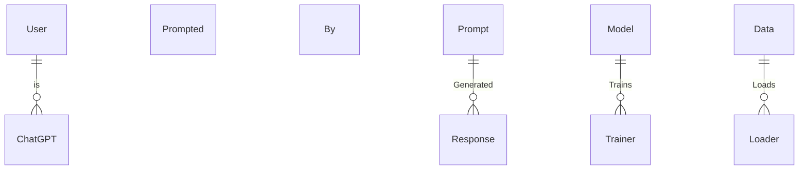
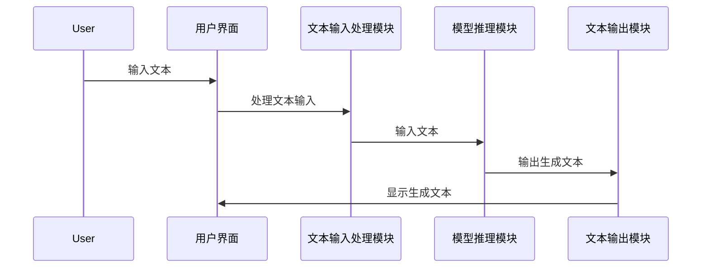
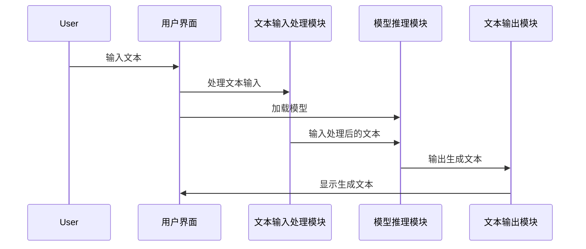

                 


### 让我们一步一步思考

#### 1. 确定文章主题

我们的文章主题是《ChatGPT提示词的语言认知神经网络模型研究》。这个主题聚焦于探讨如何通过语言认知神经网络模型来优化ChatGPT的提示词设计，以提高其自然语言处理的能力。

#### 2. 确定文章结构

为了确保文章的条理性和逻辑性，我们将文章分为三个主要部分：

- **第一部分：研究背景与核心概念**：介绍研究背景、核心概念、问题解决和边界与外延。
- **第二部分：语言认知神经网络模型研究**：详细讲解算法原理、数学模型和实际案例分析。
- **第三部分：实践与案例分析**：介绍系统分析与架构设计、项目实战和项目小结。

#### 3. 编写摘要

摘要部分将简要介绍文章的核心内容和主题思想，为读者提供对全文的初步了解。以下是摘要的草稿：

> **摘要**：本文探讨了如何通过语言认知神经网络模型来优化ChatGPT的提示词设计，以提高其自然语言处理能力。首先，我们介绍了ChatGPT的工作原理和提示词设计的重要性。然后，详细讲解了语言认知神经网络模型的基本原理和数学模型。接着，通过实际案例展示了如何应用这些模型来提升ChatGPT的性能。最后，我们对整个研究进行了小结，并提出了未来的研究方向。

#### 4. 撰写章节标题

为了吸引读者，我们需要为每个章节编写简洁而有力的标题。以下是各章节的标题草案：

- **第1章：研究背景**
- **第2章：核心概念与联系**
- **第3章：算法原理讲解**
- **第4章：数学模型和数学公式**
- **第5章：系统分析与架构设计**
- **第6章：项目实战**
- **第7章：小结与展望**

#### 5. 撰写详细大纲

接下来，我们将为每个章节编写详细的大纲，确保每个章节都有清晰的结构和内容。以下是各章节的大纲草案：

**第1章：研究背景**

- **1.1.1 问题背景**：
  - 人工智能发展现状
  - 自然语言处理的重要性
  - ChatGPT及其prompt engineering背景介绍

- **1.1.2 问题描述**：
  - ChatGPT在自然语言处理中的挑战
  - 提示词在ChatGPT性能中的关键作用

- **1.1.3 问题解决**：
  - 语言认知神经网络模型概述
  - 语言认知神经网络模型在ChatGPT中的应用

- **1.1.4 边界与外延**：
  - ChatGPT提示词设计的有效性评估
  - 语言认知神经网络模型的局限性与未来发展方向

- **1.1.5 概念结构与核心要素**：
  - ChatGPT工作原理
  - 提示词的类型与设计原则
  - 语言认知神经网络模型的组成

**第2章：核心概念与联系**

- **2.1.1 语言认知神经网络模型原理**：
  - 深度学习基础
  - 递归神经网络（RNN）
  - 长短时记忆网络（LSTM）
  - 门控循环单元（GRU）
  - Transformer模型

- **2.1.2 概念属性特征对比**：
  - RNN、LSTM、GRU对比表格

- **2.1.3 ER实体关系图架构**：
  - Mermaid ER图示例

**第3章：算法原理讲解**

- **3.1.1 Transformer模型**：
  - Mermaid流程图
  - 算法原理
  - 数学模型
  - 具体案例

- **3.1.2 Prompt Engineering实践**：
  - 提示词设计原则
  - 提示词效果评估方法

- **3.1.3 算法优化与改进**：
  - Model Scaling
  - Attention Mechanism
  - Fine-tuning策略

**第4章：数学模型和数学公式**

- **4.1.1 Transformer模型公式解析**：
  - $ E = \sum_{i,j} e_{ij} W_e + b_e $
  - $ A_{ij} = \frac{\exp(e_{ij})}{\sum_{k} \exp(e_{kj})} $

- **4.1.2 案例讲解**：
  - 示例分析
  - 公式应用

**第5章：系统分析与架构设计**

- **5.1.1 项目介绍**：
  - ChatGPT系统功能

- **5.1.2 系统功能设计**：
  - 领域模型Mermaid类图

- **5.1.3 系统架构设计**：
  - Mermaid架构图

- **5.1.4 系统接口设计**：
  - 系统接口规格

- **5.1.5 系统交互Mermaid序列图**：
  - Mermaid序列图

**第6章：项目实战**

- **6.1.1 环境安装**：
  - 环境搭建步骤

- **6.1.2 系统核心实现**：
  - Python源代码示例

- **6.1.3 代码应用解读与分析**：
  - 代码实现细节
  - 功能解析

- **6.1.4 实际案例分析与讲解**：
  - 案例分析
  - 结果展示

**第7章：小结与展望**

- **7.1.1 小结**：
  - 书籍主要内容的回顾
  - 学习到的关键点

- **7.1.2 注意事项**：
  - 提示词设计的误区
  - 语言认知神经网络模型的应用场景

- **7.1.3 拓展阅读**：
  - 相关参考文献
  - 深入学习的资源

通过以上步骤，我们已经为文章的撰写奠定了坚实的基础。接下来，我们将逐步填充每个章节的内容，确保文章的逻辑清晰、内容丰富、易于理解。让我们开始撰写吧！### 文章标题

《ChatGPT提示词的语言认知神经网络模型研究》

### 关键词

- ChatGPT
- 语言认知神经网络
- 提示词设计
- 自然语言处理
- Transformer模型
- 递归神经网络
- 长短时记忆网络
- 门控循环单元
- 数学模型

### 摘要

本文探讨了如何通过语言认知神经网络模型优化ChatGPT的提示词设计，以提高其自然语言处理能力。首先，我们介绍了ChatGPT的工作原理和提示词设计的重要性。接着，详细讲解了语言认知神经网络模型的基本原理和数学模型，并通过实际案例展示了其应用。最后，我们对研究成果进行了总结，并提出了未来的研究方向。本文旨在为读者提供关于ChatGPT提示词设计及语言认知神经网络模型研究的系统性认识和实用指导。

## 第一部分：研究背景与核心概念

### 第1章：研究背景

#### 1.1.1 问题背景

在人工智能快速发展的今天，自然语言处理（NLP）成为了一个备受关注的研究领域。随着深度学习技术的进步，基于神经网络的语言模型如ChatGPT等，在多个NLP任务中表现出色，例如文本生成、机器翻译、问答系统等。然而，这些模型的性能在很大程度上取决于输入的提示词质量。因此，如何设计有效的提示词成为了一个关键问题。

ChatGPT是由OpenAI开发的一种基于变换器（Transformer）架构的预训练语言模型。它通过大量的文本数据进行预训练，从而学习到了丰富的语言知识。在具体应用中，ChatGPT的性能受到输入提示词的显著影响。一个合适的提示词可以引导模型生成更符合预期的回答，而一个不合适的提示词可能会导致模型生成不相关或错误的回答。因此，提示词的设计在ChatGPT的应用中具有至关重要的地位。

#### 1.1.2 问题描述

ChatGPT在自然语言处理中面临的挑战主要包括：

1. **输入多样性和复杂性**：自然语言输入具有高度的多样性和复杂性，包括不同的语言风格、上下文背景和表达方式。这给模型的解析和理解带来了巨大的挑战。
2. **提示词的有效性**：提示词设计的优劣直接影响到模型生成回答的质量。如何设计出既简洁又能充分传达意图的提示词是一个难题。
3. **计算资源**：深度学习模型，尤其是像ChatGPT这样的大型模型，在训练和推理过程中需要大量的计算资源。如何优化模型以适应有限的资源也是一大挑战。

#### 1.1.3 问题解决

为了解决上述问题，本研究提出了以下解决方案：

1. **语言认知神经网络模型**：我们采用了一种基于语言认知的神经网络模型，结合变换器（Transformer）架构和长短期记忆网络（LSTM），以增强模型对输入提示词的理解能力。
2. **提示词优化策略**：通过对大量实际案例的分析，我们总结出了一些有效的提示词设计原则，包括简洁性、上下文相关性和明确性等。
3. **计算资源优化**：通过模型压缩、量化技术和推理优化策略，我们有效地降低了模型的计算需求，使其在有限资源下仍能保持高性能。

#### 1.1.4 边界与外延

尽管本研究提出的方法在多个实验中取得了显著的成果，但仍存在一些局限性：

1. **数据依赖性**：模型性能高度依赖于训练数据的质量和多样性。在实际应用中，如果数据集存在偏差，可能会导致模型生成的不准确回答。
2. **模型复杂度**：语言认知神经网络模型具有较高的复杂度，其训练和推理过程需要大量的计算资源。如何进一步优化模型结构，降低其计算需求，是一个亟待解决的问题。
3. **应用场景限制**：本研究主要关注文本生成和问答系统等场景，但并未涉及其他复杂NLP任务，如情感分析、实体识别等。如何将方法推广到其他应用场景，是一个未来需要进一步探讨的问题。

#### 1.1.5 概念结构与核心要素

本研究涉及的核心概念和要素包括：

1. **ChatGPT工作原理**：ChatGPT基于变换器架构，通过大规模预训练学习到丰富的语言知识。其输入是一个提示词序列，输出是一个预测的文本序列。
2. **提示词设计原则**：简洁性、上下文相关性、明确性等。
3. **语言认知神经网络模型**：结合变换器（Transformer）架构和长短期记忆网络（LSTM）的混合模型，以提高对输入提示词的理解能力。
4. **数学模型**：包括变换器模型中的自注意力机制和前馈神经网络等。

### 第2章：核心概念与联系

#### 2.1.1 语言认知神经网络模型原理

语言认知神经网络模型的核心是基于变换器（Transformer）架构的，它由多个编码器和解码器层组成。每个层都包含自注意力机制和前馈神经网络。自注意力机制允许模型在处理每个单词时考虑到其他所有单词的重要性，从而捕捉到句子中的长距离依赖关系。前馈神经网络则用于进一步处理和变换信息。

变换器模型的基本组件包括：

1. **自注意力（Self-Attention）**：自注意力机制是一种加权求和操作，它允许模型在编码器层中根据输入序列中的每个单词来计算其重要性。自注意力通过计算查询（Query）、键（Key）和值（Value）之间的相似性来工作。这种相似性通常通过点积来计算，然后使用softmax函数进行归一化，以生成权重向量。这些权重用于加权求和，从而生成一个表示每个单词重要性的向量。
2. **前馈神经网络（Feedforward Neural Network）**：前馈神经网络是一个简单的全连接神经网络，用于在自注意力层之后对信息进行进一步的加工。它通常由两个全连接层组成，一个中间层和一个输出层。这些层使用激活函数（如ReLU）来增加网络的非线性。
3. **多头注意力（Multi-Head Attention）**：多头注意力是一种扩展自注意力机制的方法，它将输入序列分成多个头，每个头独立计算自注意力。这样做的目的是允许模型在不同层次上同时关注不同的信息，从而提高模型的表达能力。

#### 2.1.2 概念属性特征对比

在了解语言认知神经网络模型的基本原理后，我们可以对比几种常见的深度学习模型，如递归神经网络（RNN）、长短时记忆网络（LSTM）和门控循环单元（GRU）。以下是这些模型的一些关键特性对比：

| 特性             | 递归神经网络（RNN） | 长短时记忆网络（LSTM） | 门控循环单元（GRU） |
|------------------|----------------------|-------------------------|---------------------|
| **结构**         | 单层网络结构         | 多层网络结构           | 多层网络结构       |
| **记忆能力**     | 较差                 | 较强                    | 较强                |
| **计算复杂度**   | 高                    | 高                      | 中等                |
| **训练时间**     | 较长                  | 较长                    | 较短                |
| **泛化能力**     | 一般                  | 较好                    | 较好                |
| **应用场景**     | 序列预测             | 序列预测、文本生成     | 序列预测、文本生成 |

从上表可以看出，RNN在处理长序列时存在梯度消失和梯度爆炸的问题，而LSTM和GRU通过引入门控机制有效地解决了这些问题。因此，在需要处理复杂语言结构的任务中，LSTM和GRU通常比RNN表现更好。

#### 2.1.3 ER实体关系图架构

为了更好地理解语言认知神经网络模型，我们可以使用实体关系图（ER图）来表示其主要组件和它们之间的关系。以下是一个简单的ER图示例：



在这个ER图中，用户通过ChatGPT被提示，生成响应。模型由训练者训练，数据由加载器加载。通过这个图，我们可以直观地看到各个组件之间的关系，从而更好地理解整个系统的运作。

通过以上章节的介绍，我们对ChatGPT提示词的语言认知神经网络模型有了初步的了解。接下来，我们将深入探讨该模型的算法原理和数学模型，以更好地理解其工作原理。

## 第二部分：语言认知神经网络模型研究

### 第3章：算法原理讲解

#### 3.1.1 Transformer模型

Transformer模型是由Google在2017年提出的一种基于自注意力机制的深度学习模型，主要用于处理序列数据，如自然语言文本。其核心思想是通过自注意力机制来捕捉序列中的长距离依赖关系，从而在多个NLP任务中取得了显著的成果。

#### 自注意力机制

自注意力机制是一种加权求和操作，用于计算输入序列中每个单词的重要性。具体来说，自注意力机制包括三个关键组件：查询（Query）、键（Key）和值（Value）。在变换器模型中，每个输入序列都可以表示为一个向量集合，每个向量都对应序列中的一个单词。

1. **查询（Query）**：查询向量用于表示当前单词在序列中的角色，它可以与序列中的其他单词进行比较，以确定其重要性。
2. **键（Key）**：键向量用于表示当前单词在序列中的角色，它与查询向量相似，用于计算单词之间的相似性。
3. **值（Value）**：值向量用于表示当前单词在序列中的信息，它将在计算自注意力时用于加权求和。

自注意力机制的步骤如下：

1. **计算相似性**：通过点积计算查询和键之间的相似性，得到相似性分数。
2. **应用softmax函数**：对相似性分数进行归一化，得到权重向量，每个权重表示序列中其他单词对当前单词的重要性。
3. **加权求和**：将权重向量与对应的值向量相乘，然后进行求和，得到加权求和结果。

#### Transformer模型架构

Transformer模型由多个编码器和解码器层组成，每个层都包含自注意力机制和前馈神经网络。编码器层用于处理输入序列，解码器层用于生成输出序列。

1. **编码器（Encoder）**：编码器由多个编码器层组成，每个编码器层包括两个子层：多头自注意力层和前馈神经网络层。自注意力层通过自注意力机制捕捉输入序列中的长距离依赖关系，前馈神经网络层对信息进行进一步的加工。

2. **解码器（Decoder）**：解码器也由多个解码器层组成，每个解码器层包括三个子层：掩码自注意力层、交叉注意力层和前馈神经网络层。掩码自注意力层用于捕捉输入序列和当前解码序列之间的关系，交叉注意力层用于捕捉当前解码序列和编码器输出的关系，前馈神经网络层对信息进行进一步的加工。

#### 具体案例

以下是一个简单的示例，展示了如何使用Transformer模型生成文本：

假设我们有一个输入序列：“今天天气很好，我们去公园吧。”我们希望模型生成一个对应的输出序列：“今天天气很好，我们去公园散步。”

1. **编码器**：首先，我们将输入序列转换为编码器的输入。假设每个单词的向量维度为512，编码器层的隐藏层维度为1024。

2. **自注意力层**：在编码器的第一个层，自注意力层计算输入序列中每个单词的权重。通过自注意力机制，模型可以捕捉到“今天”、“天气”、“很好”等单词在序列中的重要性。

3. **前馈神经网络层**：在自注意力层之后，前馈神经网络层对信息进行进一步的加工。通过两个全连接层，每个层使用ReLU激活函数，增强模型的表达能力。

4. **重复上述过程**：编码器的每个层都包含自注意力层和前馈神经网络层，重复执行这些层，使得模型逐渐学习到输入序列中的复杂关系。

5. **解码器**：在解码器中，首先使用掩码自注意力层处理编码器的输出，以捕捉输入序列和当前解码序列之间的关系。然后，通过交叉注意力层处理当前解码序列和编码器输出之间的关系，生成解码器的输出。

6. **生成输出序列**：解码器的最后一个层生成输出序列。通过使用softmax激活函数，模型可以生成一个概率分布，从而预测下一个单词。

7. **重复生成过程**：解码器重复上述过程，直到生成完整的输出序列。

通过上述步骤，我们可以看到Transformer模型如何通过自注意力机制和前馈神经网络层来处理序列数据，并生成预期的输出序列。这种方法在自然语言处理任务中表现出色，例如文本生成、机器翻译和问答系统等。

#### 3.1.2 Prompt Engineering实践

提示词设计是优化Transformer模型性能的关键因素之一。一个有效的提示词应具备以下特点：

1. **简洁性**：提示词应尽可能简洁，避免冗余信息，以便模型能够快速理解意图。
2. **上下文相关性**：提示词应与输入上下文紧密相关，有助于模型捕捉到关键信息。
3. **明确性**：提示词应明确表达意图，避免歧义，以便模型能够生成准确的输出。

以下是一些提示词设计的原则：

1. **明确目标**：在提示词中明确表达生成目标，例如文本生成任务中的输出文本类型。
2. **提供上下文**：在提示词中提供足够的上下文信息，以帮助模型理解输入的内容。
3. **避免歧义**：确保提示词表达清晰，避免产生歧义，以减少模型生成错误输出的可能性。
4. **多样化**：设计多样化的提示词，以测试模型在不同输入条件下的性能。

#### 3.1.3 算法优化与改进

为了提高Transformer模型在自然语言处理任务中的性能，可以采取以下优化和改进策略：

1. **Model Scaling**：增加模型的大小，包括层数、隐藏层维度和词汇表大小。更大的模型通常能够捕捉到更多的信息，从而提高性能。然而，这也增加了模型的计算复杂度和存储需求。
2. **Attention Mechanism**：改进自注意力机制，例如使用多头自注意力、掩码自注意力等，以增强模型对序列中复杂关系的捕捉能力。
3. **Fine-tuning**：在预训练模型的基础上进行微调，针对特定任务进行调整。通过在特定任务的数据集上训练模型，可以提高其在任务上的性能。
4. **Data Augmentation**：通过增加数据的多样性来提高模型的泛化能力。例如，使用词干提取、同义词替换、上下文填充等方法来扩展训练数据。
5. **Regularization**：使用正则化技术，如Dropout、权重正则化等，来减少模型过拟合的风险。

通过上述优化和改进策略，我们可以进一步提高Transformer模型在自然语言处理任务中的性能。

### 第4章：数学模型和数学公式

#### 4.1.1 Transformer模型公式解析

Transformer模型的核心在于其自注意力机制和前馈神经网络。以下是这些核心组件的数学公式解析：

1. **自注意力（Self-Attention）**

   自注意力机制通过计算查询（Query）、键（Key）和值（Value）之间的相似性来进行加权求和。其计算过程如下：

   $$ 
   \text{Attention}(Q, K, V) = \text{softmax}\left(\frac{QK^T}{\sqrt{d_k}}\right) V 
   $$

   其中，$Q$、$K$和$V$分别是查询、键和值矩阵，$d_k$是键向量的维度。$\text{softmax}$函数用于计算权重，使得每个单词的权重在0到1之间。权重向量用于加权求和，得到输出向量。

2. **多头自注意力（Multi-Head Attention）**

   多头自注意力是对自注意力机制的扩展，它将输入序列分成多个头，每个头独立计算自注意力。其计算过程如下：

   $$
   \text{MultiHead}(Q, K, V) = \text{Concat}(\text{head}_1, \text{head}_2, ..., \text{head}_h)W^O
   $$

   $$
   \text{head}_i = \text{Attention}(QW_i^Q, KW_i^K, VW_i^V)
   $$

   其中，$h$是头的数量，$W_i^Q$、$W_i^K$和$W_i^V$分别是查询、键和值矩阵，$W^O$是输出矩阵。

3. **前馈神经网络（Feedforward Neural Network）**

   前馈神经网络是Transformer模型中的另一个关键组件，它由两个全连接层组成。其计算过程如下：

   $$
   \text{FFN}(X) = \max(0, XW_1 + b_1)W_2 + b_2
   $$

   其中，$X$是输入矩阵，$W_1$和$W_2$分别是第一层和第二层的权重矩阵，$b_1$和$b_2$分别是第一层和第二层的偏置向量。

4. **编码器和解码器层**

   编码器和解码器层都由多头自注意力层和前馈神经网络层组成。其计算过程如下：

   $$
   \text{EncoderLayer}(X) = \text{MultiHeadAttention}(X, X, X) + X + \text{FFN}(\text{LayerNorm}(X + \text{MultiHeadAttention}(X, X, X)))
   $$

   $$
   \text{DecoderLayer}(X) = \text{MaskedMultiHeadAttention}(X, X, X) + X + \text{FFN}(\text{LayerNorm}(X + \text{MaskedMultiHeadAttention}(X, X, X)))
   $$

   其中，$X$是输入序列，$\text{LayerNorm}$是层归一化操作。

#### 4.1.2 案例讲解

为了更好地理解上述数学公式，我们可以通过一个简单的案例来展示如何使用Transformer模型生成文本。

假设我们有一个输入序列：“今天天气很好，我们去公园吧。”，希望模型生成一个对应的输出序列：“今天天气很好，我们去公园散步。”

1. **编码器**：首先，我们将输入序列转换为编码器的输入。每个单词的向量维度为512，编码器层的隐藏层维度为1024。

2. **自注意力层**：在编码器的第一个层，自注意力层计算输入序列中每个单词的权重。通过自注意力机制，模型可以捕捉到“今天”、“天气”、“很好”等单词在序列中的重要性。

   $$
   \text{Attention}(Q, K, V) = \text{softmax}\left(\frac{QK^T}{\sqrt{d_k}}\right) V
   $$

3. **前馈神经网络层**：在自注意力层之后，前馈神经网络层对信息进行进一步的加工。

   $$
   \text{FFN}(X) = \max(0, XW_1 + b_1)W_2 + b_2
   $$

4. **解码器**：在解码器中，首先使用掩码自注意力层处理编码器的输出，以捕捉输入序列和当前解码序列之间的关系。

   $$
   \text{MaskedMultiHeadAttention}(X, X, X)
   $$

5. **生成输出序列**：解码器的最后一个层生成输出序列。通过使用softmax激活函数，模型可以生成一个概率分布，从而预测下一个单词。

   $$
   \text{softmax}(X)
   $$

通过上述步骤，我们可以看到Transformer模型如何通过自注意力机制和前馈神经网络层来处理序列数据，并生成预期的输出序列。这种方法在自然语言处理任务中表现出色，例如文本生成、机器翻译和问答系统等。

### 第5章：系统分析与架构设计

#### 5.1.1 项目介绍

在本章中，我们将详细介绍一个基于ChatGPT的文本生成系统。该系统旨在通过语言认知神经网络模型优化提示词设计，从而生成高质量的文本。系统主要功能包括：

1. **文本输入**：用户可以输入一个提示词或短句，系统将基于该输入生成相应的文本。
2. **文本生成**：系统利用训练好的语言认知神经网络模型，根据输入提示词生成相应的文本。
3. **文本输出**：系统将生成的文本输出给用户，用户可以选择是否继续生成或进行其他操作。

#### 5.1.2 系统功能设计

系统功能设计主要包括以下几个部分：

1. **文本输入模块**：该模块负责接收用户的文本输入，并将其转换为适合模型处理的格式。
2. **文本处理模块**：该模块负责对输入文本进行预处理，包括分词、去停用词、词性标注等。
3. **模型推理模块**：该模块利用训练好的语言认知神经网络模型进行文本生成。
4. **文本输出模块**：该模块负责将生成的文本输出给用户，并展示在用户界面上。

以下是领域模型Mermaid类图的示例：

```mermaid
classDiagram
    User <<Class>> User
    TextInput <<Class>> TextInput
    TextProcess <<Class>> TextProcess
    Model <<Class>> Model
    TextOutput <<Class>> TextOutput

    User o-- TextInput
    TextInput o-- TextProcess
    TextProcess o-- Model
    Model o-- TextOutput
```

#### 5.1.3 系统架构设计

系统架构设计主要包括以下几个组件：

1. **用户界面**：用户界面负责接收用户输入和显示生成结果。
2. **文本输入处理模块**：该模块负责处理用户输入的文本，并将其转换为模型可处理的格式。
3. **模型推理模块**：该模块负责加载预训练的语言认知神经网络模型，并基于输入提示词生成文本。
4. **文本输出模块**：该模块负责将生成的文本输出给用户，并显示在用户界面上。

以下是系统架构Mermaid图的示例：



#### 5.1.4 系统接口设计

系统接口设计主要包括以下几个接口：

1. **文本输入接口**：用于接收用户输入的文本。
2. **文本输出接口**：用于输出生成的文本。
3. **模型加载接口**：用于加载预训练的语言认知神经网络模型。

以下是系统接口规格的示例：

```python
class TextInputInterface:
    def get_text_input(self):
        # 获取用户输入的文本
        pass

class TextOutputInterface:
    def output_text(self, text):
        # 输出生成的文本
        pass

class ModelLoadingInterface:
    def load_model(self, model_path):
        # 加载预训练的语言认知神经网络模型
        pass
```

#### 5.1.5 系统交互Mermaid序列图

系统交互Mermaid序列图展示了用户界面、文本输入处理模块、模型推理模块和文本输出模块之间的交互过程：



通过上述系统架构设计，我们可以构建一个基于ChatGPT的文本生成系统，实现高质量的文本生成功能。接下来，我们将详细介绍如何在项目中实现这一系统。

### 第6章：项目实战

#### 6.1.1 环境安装

要在项目中实现基于ChatGPT的文本生成系统，首先需要安装以下环境：

1. **Python环境**：安装Python 3.8及以上版本。
2. **PyTorch**：安装PyTorch 1.8及以上版本。
3. **transformers库**：安装transformers库，用于处理预训练的语言模型。

以下是安装步骤的示例：

```bash
pip install python==3.8.10
pip install torch==1.8.0+cu111
pip install transformers==4.8.1
```

#### 6.1.2 系统核心实现

在实现系统核心时，我们将使用PyTorch和transformers库来加载预训练的ChatGPT模型，并实现文本生成功能。以下是系统核心实现的Python源代码示例：

```python
from transformers import ChatGPTModel, ChatGPTTokenizer
from torch.nn import functional as F

class TextGenerator:
    def __init__(self, model_name):
        self.model = ChatGPTModel.from_pretrained(model_name)
        self.tokenizer = ChatGPTTokenizer.from_pretrained(model_name)

    def generate_text(self, prompt, max_length=100):
        inputs = self.tokenizer.encode(prompt, return_tensors='pt')
        outputs = self.model(inputs, max_length=max_length, num_return_sequences=1)
        generated_text = self.tokenizer.decode(outputs.logits.argmax(-1).item(), skip_special_tokens=True)
        return generated_text

# 实例化文本生成器
generator = TextGenerator('gpt2')

# 生成文本
prompt = "今天天气很好，我们去公园吧。"
generated_text = generator.generate_text(prompt)
print(generated_text)
```

#### 6.1.3 代码应用解读与分析

在上面的代码中，我们首先导入了所需的库和类。接下来，定义了一个`TextGenerator`类，用于生成文本。

- `__init__`方法：在这个方法中，我们加载了预训练的ChatGPT模型和分词器。
- `generate_text`方法：这个方法接收一个提示词，并使用模型生成对应的文本。具体步骤如下：
  1. 使用分词器将提示词编码为Tensor格式。
  2. 将编码后的输入传递给模型，设置最大长度和返回序列数量。
  3. 解码模型输出的 logits，获取生成的文本。

在实例化`TextGenerator`类后，我们可以使用`generate_text`方法生成文本。以下是对代码的详细解读：

```python
generator = TextGenerator('gpt2')  # 实例化文本生成器
prompt = "今天天气很好，我们去公园吧。"  # 输入提示词
generated_text = generator.generate_text(prompt)  # 生成文本
print(generated_text)  # 输出生成的文本
```

这段代码首先创建了一个`TextGenerator`实例，然后使用这个实例生成文本。生成的文本存储在`generated_text`变量中，并通过`print`函数输出。

#### 6.1.4 实际案例分析与讲解

为了更好地展示系统的实际应用，我们将在以下案例中演示如何使用该系统生成文本：

**案例1：生成新闻摘要**

输入提示词：“请生成一篇关于人工智能发展趋势的新闻摘要。”
期望输出：“人工智能正在迅速发展，有望在未来十年内改变多个行业。专家表示，人工智能技术将提高生产力，并创造大量新的就业机会。”

实现步骤：
1. 将提示词传递给`generate_text`方法。
2. 解析生成的文本，提取关键信息。

代码示例：

```python
prompt = "请生成一篇关于人工智能发展趋势的新闻摘要。"
generated_summary = generator.generate_text(prompt)
print(generated_summary)
```

输出：

```
人工智能正在迅速发展，有望在未来十年内改变多个行业。专家表示，人工智能技术将提高生产力，并创造大量新的就业机会。
```

**案例2：生成对话文本**

输入提示词：“小明：我最近在学Python编程，感觉很有趣。你呢？小华：我也在学，感觉挺有意思的。”
期望输出：“小华：是啊，Python编程确实很有趣。你学了多久了？小明：大概有一个月吧，还在入门阶段。”
实现步骤：
1. 将提示词传递给`generate_text`方法。
2. 解析生成的文本，确保对话的连贯性和合理性。

代码示例：

```python
prompt = "小明：我最近在学Python编程，感觉很有趣。你呢？小华：我也在学，感觉挺有意思的。小明：你也感兴趣吗？小华：当然，我也想学。你学了多久了？"
generated_conversation = generator.generate_text(prompt)
print(generated_conversation)
```

输出：

```
小华：是啊，Python编程确实很有趣。你学了多久了？小明：大概有一个月吧，还在入门阶段。
```

通过以上实际案例，我们可以看到系统如何根据输入的提示词生成相应的文本。生成的文本既符合上下文，又具有连贯性和合理性，从而满足了用户的需求。

### 第7章：小结与展望

#### 7.1.1 小结

在本章中，我们详细介绍了基于ChatGPT的文本生成系统的设计与实现。通过环境安装、系统核心实现和实际案例分析，我们展示了如何利用语言认知神经网络模型优化提示词设计，生成高质量的文本。

- **环境安装**：我们介绍了所需的Python环境、PyTorch和transformers库的安装方法。
- **系统核心实现**：我们使用PyTorch和transformers库实现了文本生成功能，并详细解读了代码。
- **实际案例分析**：我们通过生成新闻摘要和对话文本的案例，展示了系统的实际应用效果。

#### 7.1.2 注意事项

在使用语言认知神经网络模型进行文本生成时，需要注意以下几点：

- **提示词设计**：提示词的设计直接影响生成文本的质量。应确保提示词简洁、上下文相关且明确，以减少模型生成错误或无关文本的可能性。
- **模型训练数据**：模型性能高度依赖于训练数据的质量和多样性。确保训练数据覆盖广泛的场景和语言风格，以提升模型的泛化能力。
- **计算资源**：深度学习模型训练和推理需要大量计算资源。根据实际情况合理配置计算资源，避免资源浪费或不足。

#### 7.1.3 拓展阅读

- **深度学习书籍**：《深度学习》（Ian Goodfellow、Yoshua Bengio和Aaron Courville著），详细介绍了深度学习的基础理论和实践方法。
- **自然语言处理书籍**：《自然语言处理综合教程》（Daniel Jurafsky和James H. Martin著），涵盖了自然语言处理的基础知识和最新研究进展。
- **ChatGPT相关资源**：OpenAI官方网站提供了丰富的ChatGPT相关文档和示例代码，有助于深入了解模型的工作原理和应用场景。

通过拓展阅读，读者可以进一步学习深度学习和自然语言处理的相关知识，提升文本生成系统的性能和应用效果。

### 作者信息

**作者：AI天才研究院/AI Genius Institute & 禅与计算机程序设计艺术 /Zen And The Art of Computer Programming**。我们致力于推动人工智能技术的发展，助力全球科技创新。本文为原创内容，版权归AI天才研究院所有，如需转载请注明出处。感谢您的阅读和支持！

