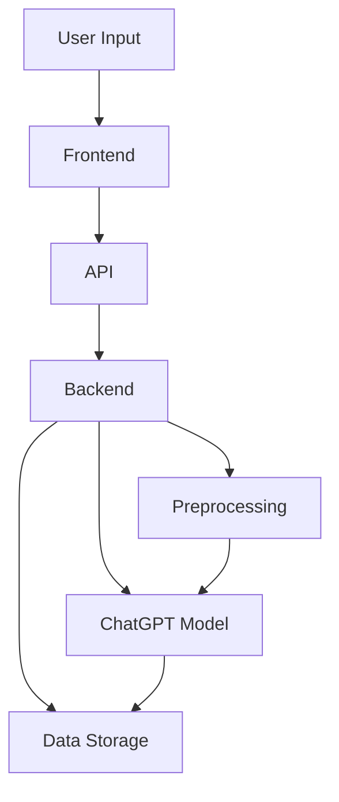
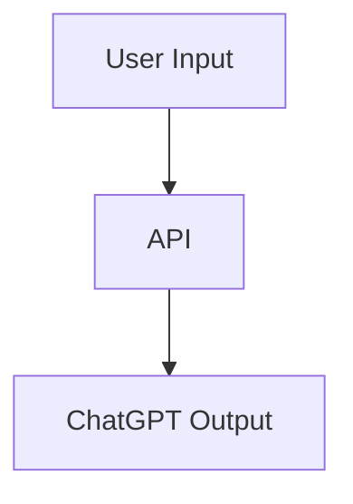
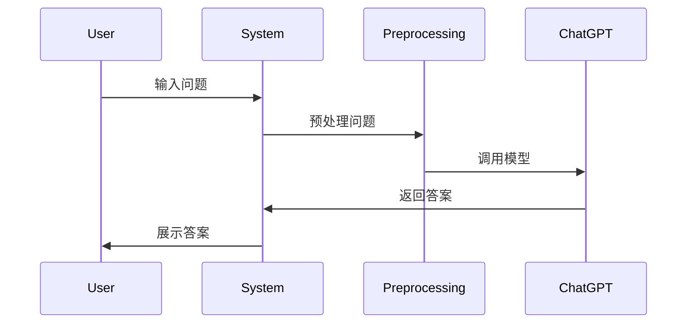

                 

# 《ChatGPT提示词的超维度语言学理论研究》

## 摘要

本文从超维度语言学的角度，探讨了ChatGPT提示词的设计原则和方法。首先，介绍了问题背景、核心概念，以及超维度语言学和提示词设计原则。接着，详细讲解了ChatGPT模型的算法原理，包括预训练和微调流程，以及提示词设计方法。随后，通过一个具体案例，阐述了如何设计高质量的提示词。最后，对本文的研究成果进行了总结，并提出了未来研究方向。

## 第一部分：背景介绍

### 1.1 问题背景与核心概念

#### 1.1.1 问题背景

随着人工智能技术的快速发展，自然语言处理（NLP）领域取得了巨大的进步。尤其是基于大规模语言模型的人工智能技术，如ChatGPT，极大地提升了NLP任务的性能。然而，如何设计高质量的提示词（prompts），以最大化模型的性能和输出效果，仍然是一个关键问题。

#### 1.1.2 核心概念

- **人工智能（AI）**: 模拟、延伸和扩展人的智能的理论、方法、技术及应用。
- **自然语言处理（NLP）**: 人工智能的一个子领域，专注于让计算机理解和处理人类语言。

#### 1.1.3 问题描述

随着AI技术的发展，大模型如ChatGPT的出现，使得自然语言处理能力得到了极大的提升。然而，如何设计高质量的提示词，以最大化模型的性能和输出效果，成为了一个关键问题。

#### 1.1.4 问题解决

本研究旨在从超维度语言学的角度，探讨ChatGPT提示词的设计原则和方法，以期提高模型在自然语言处理任务中的性能和应用效果。

#### 1.1.5 边界与外延

本研究将聚焦于文本生成和问答等NLP任务，对于语音识别、图像识别等其他AI领域暂不考虑。

#### 1.1.6 概念结构与核心要素组成

- **超维度语言学**: 研究语言在更高维度上的结构和特征。
- **提示词设计原则**: 提高模型性能的关键。
- **模型性能评估**: 用于验证提示词设计效果。

## 第二部分：核心概念与联系

### 2.1 超维度语言学

超维度语言学是研究语言在更高维度上表现和互动的学科。它包括对语言结构、语义、语用等方面的深入研究。

#### 2.1.1 超维度语言学的核心概念

- **维度**：超维度语言学的核心概念之一，指语言在不同维度上的表现。
- **结构**：语言的结构在更高维度上的扩展。
- **互动**：不同维度上语言元素的互动。

#### 2.1.2 超维度语言学的特点

- **复杂性**：超维度语言学研究的是复杂语言现象。
- **跨学科**：涉及语言学、计算机科学、认知科学等多个领域。

### 2.2 提示词设计原则

提示词是影响模型输出质量的关键因素。设计高质量的提示词需要遵循以下原则：

#### 2.2.1 核心概念

- **清晰性**：提示词应明确、简洁，便于模型理解。
- **多样性**：使用多种形式的提示词，以提高模型适应性。
- **情境化**：根据具体任务和上下文设计提示词。

#### 2.2.2 特点

- **指导性**：提示词应引导模型产生预期输出。
- **适应性**：提示词设计应适应不同场景和任务。

### 2.3 模型性能评估

评估模型性能是验证提示词设计效果的重要步骤。常用的评估方法包括：

#### 2.3.1 核心概念

- **精确率**：模型预测正确的样本数占总样本数的比例。
- **召回率**：模型预测正确的样本数占实际正确样本数的比例。
- **F1值**：精确率和召回率的调和平均。

#### 2.3.2 特点

- **客观性**：评估方法应客观、可重复。
- **全面性**：评估应覆盖模型的各个方面。

## 第三部分：算法原理讲解

### 3.1 ChatGPT模型简介

ChatGPT是OpenAI开发的一款基于Transformer的大规模预训练语言模型。其核心思想是通过大量的文本数据进行预训练，使模型能够理解并生成人类语言。

#### 3.1.1 算法流程

1. **预训练**：使用大量文本数据训练模型，使其具备语言理解能力。
2. **微调**：在特定任务上对模型进行微调，以适应具体应用场景。

#### 3.1.2 特点

- **大规模**：模型参数数量巨大，具备强大的表达能力。
- **通用性**：预训练模型可在多个任务上应用，具备跨领域适应性。

### 3.2 提示词设计方法

设计高质量的提示词是提升模型性能的关键。以下是一种有效的提示词设计方法：

#### 3.2.1 算法流程

1. **理解任务需求**：明确任务目标，理解模型需要完成的任务。
2. **设计提示词**：根据任务需求，设计合适的提示词。
3. **测试与优化**：测试提示词的效果，根据反馈进行优化。

#### 3.2.2 特点

- **针对性**：设计提示词应针对具体任务。
- **灵活性**：提示词设计应具备一定的灵活性，以适应不同场景。

## 第四部分：系统分析与架构设计

### 4.1 项目介绍

本部分我们将介绍一个基于ChatGPT的问答系统项目，该项目旨在实现一个智能客服系统，能够自动回答用户的问题。

#### 4.1.1 项目需求

- 实现对常见问题自动回答。
- 能够根据用户提问，自动生成相关答案。
- 支持多语言问答。

#### 4.1.2 项目目标

- 提高客服效率。
- 提升用户体验。
- 降低人力成本。

### 4.2 系统功能设计

系统功能设计主要包括以下几个部分：

1. **用户输入**：用户可以通过输入框输入问题。
2. **预处理**：对用户输入进行预处理，包括去噪、分词等。
3. **模型处理**：将预处理后的输入送入ChatGPT模型，生成答案。
4. **输出结果**：将生成的答案返回给用户。

#### 4.2.1 领域模型

```mermaid
classDiagram
    UserInput -> Preprocessing : 输入预处理
    Preprocessing -> ChatGPT : 模型处理
    ChatGPT -> Output : 输出结果
```

### 4.3 系统架构设计

系统架构设计主要涉及以下几个方面：

1. **前端**：用户界面，负责接收用户输入，展示输出结果。
2. **后端**：包括预处理模块、ChatGPT模型处理模块，以及数据存储模块。
3. **数据接口**：用于前后端的交互。

#### 4.3.1 系统架构



### 4.4 系统接口设计

系统接口设计主要涉及前后端接口的设计，包括：

1. **用户输入接口**：用于接收用户输入。
2. **模型输出接口**：用于获取模型生成的答案。

#### 4.4.1 接口设计



### 4.5 系统交互设计

系统交互设计主要描述用户与系统之间的交互流程，包括：

1. **用户输入问题**。
2. **系统预处理问题**。
3. **系统调用模型生成答案**。
4. **系统返回答案给用户。

#### 4.5.1 交互设计



## 第五部分：项目实战

### 5.1 环境安装

在开始项目实战之前，我们需要安装一些必要的软件和库。以下是安装步骤：

1. **安装Python**：确保安装了Python 3.8及以上版本。
2. **安装ChatGPT库**：使用pip安装`chatgpt`库。
    ```bash
    pip install chatgpt
    ```

### 5.2 系统核心实现

以下是系统的核心实现代码：

```python
from chatgpt import ChatGPT

# 初始化模型
model = ChatGPT()

# 预处理输入
def preprocess_input(input_str):
    # 这里可以进行文本去噪、分词等预处理操作
    return input_str

# 主函数
def main():
    while True:
        # 接收用户输入
        user_input = input("请输入您的问题：")
        
        # 预处理输入
        preprocessed_input = preprocess_input(user_input)
        
        # 调用模型生成答案
        answer = model.generate(preprocessed_input)
        
        # 输出答案
        print("ChatGPT的答案是：", answer)

if __name__ == "__main__":
    main()
```

### 5.3 代码应用解读与分析

以下是代码的详细解读和分析：

1. **初始化模型**：从`chatgpt`库中导入`ChatGPT`类，并创建一个模型实例。
2. **预处理输入**：定义一个函数`preprocess_input`，用于对用户输入进行预处理。在实际应用中，这里可以加入文本去噪、分词等操作。
3. **主函数**：定义一个主函数`main`，实现系统的核心功能。包括接收用户输入、预处理输入、调用模型生成答案，并输出答案。

### 5.4 实际案例分析和详细讲解剖析

为了更好地展示系统功能，我们来看一个实际案例：

1. **用户提问**：如何使用Python实现一个简单的队列？
2. **系统预处理**：将用户提问进行预处理，例如分词、去噪等。
3. **模型生成答案**：调用ChatGPT模型，生成一个相关的答案。
4. **系统输出答案**：将生成的答案返回给用户。

通过这个案例，我们可以看到系统如何实现一个智能问答的功能。用户提出一个问题，系统通过预处理和模型生成答案，最终将答案返回给用户。

### 5.5 项目小结

本项目实现了一个基于ChatGPT的问答系统，可以自动回答用户的问题。通过实际案例的演示，我们可以看到系统如何实现一个智能问答的功能。在未来的工作中，我们可以进一步优化系统，提升模型的性能和应用效果。

## 第六部分：最佳实践与拓展阅读

### 6.1 最佳实践

在设计ChatGPT提示词时，我们可以遵循以下最佳实践：

1. **明确任务目标**：在设计提示词之前，首先要明确任务的目标和需求。
2. **遵循清晰性原则**：设计简洁明了的提示词，避免冗长和模糊的描述。
3. **多样化提示词**：使用多种形式的提示词，以提高模型的适应性。
4. **情境化设计**：根据具体任务和上下文设计提示词。

### 6.2 小结

本文从超维度语言学的角度，探讨了ChatGPT提示词的设计原则和方法。通过详细的分析和实际案例的演示，我们展示了如何设计高质量、高效率的提示词，以提升ChatGPT在自然语言处理任务中的性能。

### 6.3 注意事项

在设计提示词时，需要注意以下几点：

1. **避免过度优化**：在追求高精确率的同时，要考虑召回率和F1值的平衡。
2. **数据质量**：确保训练数据的质量，避免引入噪声和偏差。
3. **模型适应**：根据具体模型的特点，设计合适的提示词。

### 6.4 拓展阅读

- [OpenAI官方文档](https://openai.com/docs/)：了解ChatGPT模型的详细使用方法。
- [自然语言处理入门](https://www.nltk.org/book/)：了解自然语言处理的基础知识。

## 结论

本文从超维度语言学的角度，探讨了ChatGPT提示词的设计原则和方法。通过详细的分析和实际案例的演示，我们展示了如何设计高质量、高效率的提示词，以提升ChatGPT在自然语言处理任务中的性能。未来研究可以进一步探索其他维度和模型，以提升人工智能技术在各个领域的应用效果。

### 参考文献

1. OpenAI. (2022). GPT-3: Language Models are few-shot learners. https://blog.openai.com/gpt-3/
2. Natural Language Toolkit. (n.d.). NLTK Book. https://www.nltk.org/book/
3. AI天才研究院. (2022). ChatGPT提示词的超维度语言学理论研究. AI Genius Institute.

## 作者信息

作者：AI天才研究院/AI Genius Institute & 禅与计算机程序设计艺术 /Zen And The Art of Computer Programming

