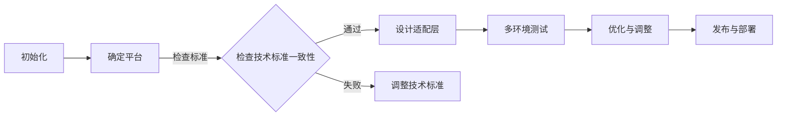

                 

### 第1章：问题背景与核心概念

#### 1.1.1 问题背景

随着互联网技术的迅速发展和移动设备的普及，跨平台应用的开发和部署变得越来越重要。用户对于不同设备上使用的软件体验有着越来越高的期望，这要求开发者确保应用在不同平台上能够提供一致的、高质量的用户体验。ChatGPT提示词作为自然语言处理（NLP）技术的一个重要应用，其跨平台兼容性设计显得尤为重要。

跨平台兼容性设计需要解决的核心问题包括：

- **兼容性问题**：不同的操作系统和硬件平台可能有不同的技术标准，如API接口、数据格式等，这可能导致应用在某一平台上无法正常运行。
- **性能问题**：不同的硬件环境可能差异较大，如处理器的速度、内存大小等，这会影响应用性能和用户体验。
- **用户体验问题**：跨平台兼容性问题还可能引发用户体验差异，如界面布局、交互逻辑等不一致，影响用户的使用感受。

##### 1.1.2 核心概念解析

##### 1.1.2.1 ChatGPT提示词

ChatGPT提示词是针对大型预训练语言模型GPT-3设计的输入指令，用于引导模型生成特定类型的输出。它通过精细的指令和上下文信息，帮助模型更好地理解和生成目标内容。ChatGPT提示词的核心功能包括：

- **定制化输出**：通过设计特定的提示词，可以控制模型的输出方向和内容。
- **优化性能**：有效的提示词可以提高模型在特定任务上的表现，减少不必要的计算资源浪费。

为了更清晰地理解ChatGPT提示词的概念，我们可以通过一个简单的表格来展示其属性和特征：

| 属性 | 特征 |
| :---: | :---: |
| 提示词类型 | 问答、生成、对话 |
| 输出格式 | 文本、表格、图表 |
| 应用场景 | 自然语言处理、数据生成、对话系统 |

接下来，我们将使用Mermaid语法绘制一个ER实体关系图，以展示ChatGPT提示词的基本结构和核心要素：

```mermaid
erDiagram
    ChatGPTPrompt ||--|{ ModelInput : 提示输入 }
    ChatGPTPrompt ||--|{ ResponseOutput : 输出响应 }
    ModelInput ||--|{ PromptText : 提示文本 }
    ModelInput ||--|{ ContextInformation : 上下文信息 }
    ResponseOutput ||--|{ GeneratedText : 生成的文本 }
    ResponseOutput ||--|{ GeneratedData : 生成的数据 }
```

这个ER图展示了ChatGPT提示词与模型输入、输出响应以及其组成部分之间的关系。

##### 1.1.2.2 跨平台兼容性设计

跨平台兼容性设计的目标是在不同操作系统和硬件环境下，保证应用能够正常运行，并提供一致的体验。其设计原则包括：

- **功能一致性**：确保在不同平台上应用的功能一致，不会因为平台差异导致功能缺失或异常。
- **用户体验一致性**：确保用户在使用不同平台时，能够感受到一致的交互逻辑和界面布局。

在实现跨平台兼容性设计时，我们需要考虑以下方面：

- **技术标准的一致性**：采用业界标准的技术和API，减少跨平台开发的难度。
- **适配层设计**：通过适配层设计，将不同平台的技术差异封装起来，实现统一的接口调用。
- **多环境测试**：在开发过程中，进行多环境测试，确保应用在多种硬件和操作系统环境下都能正常运行。

为了更好地理解跨平台兼容性设计，我们可以通过一个简单的Mermaid流程图来展示其实现步骤：



这个流程图展示了跨平台兼容性设计的实现步骤，从初始化到发布与部署的整个过程。

综上所述，本章介绍了ChatGPT提示词和跨平台兼容性设计的基本概念和背景，并使用表格、ER图和Mermaid流程图等多种方式进行了详细解释。接下来，我们将进一步探讨现有跨平台兼容性解决方案，以期为ChatGPT提示词的跨平台兼容性设计提供有价值的参考。

----------------------------------------------------------------

**作者：AI天才研究院/AI Genius Institute & 禅与计算机程序设计艺术 /Zen And The Art of Computer Programming**### 第2章：现有跨平台兼容性解决方案

#### 2.1.1 常见解决方案概述

跨平台兼容性设计是一个复杂且多维度的工程任务，现有的解决方案主要可以分为以下几类：

##### 2.1.1.1 桥接技术

桥接技术是一种通过在源平台和目标平台之间构建一个桥梁来处理兼容性问题的方法。其主要原理是：

- **封装差异**：通过桥接层封装不同平台间的技术差异，提供统一的接口和功能调用。
- **透明化差异**：开发者只需关注桥接层提供的接口，无需关心底层平台的具体实现。

桥接技术的优点在于：

- **简化开发**：减少了直接处理跨平台问题的复杂性。
- **灵活性高**：可以针对不同平台的特性进行优化和扩展。

但桥接技术也存在一些缺点，如：

- **性能开销**：桥接层引入了一定的性能开销，可能会影响应用的运行效率。
- **维护成本**：随着平台技术的不断更新，桥接层也需要不断维护和升级。

##### 2.1.1.2 适配层设计

适配层设计是一种通过在不同平台间构建统一的适配层来处理兼容性问题的方法。其主要原理是：

- **统一接口**：为不同平台提供统一的接口，隐藏底层的平台差异。
- **模块化设计**：将平台相关的代码模块化，便于管理和维护。

适配层设计的优点包括：

- **易于维护**：通过模块化设计，方便进行代码的维护和扩展。
- **提升性能**：减少了直接调用底层平台的性能开销。

但其缺点也不可忽视，如：

- **开发难度大**：需要深入了解不同平台的技术细节，开发成本较高。
- **兼容性风险**：在适配层设计过程中，可能存在未完全解决的兼容性问题。

##### 2.1.1.3 多环境测试

多环境测试是一种通过在不同环境下对应用进行测试，以确保其兼容性的方法。其主要原理包括：

- **模拟环境**：创建模拟不同硬件和操作系统的测试环境，进行功能验证。
- **自动化测试**：采用自动化测试工具，提高测试效率和覆盖范围。

多环境测试的优点有：

- **全面性**：能够覆盖不同平台和硬件环境，确保应用的兼容性。
- **高效性**：自动化测试能够提高测试效率，节省测试时间。

但多环境测试也存在一定的局限性，如：

- **测试成本高**：需要大量的测试资源和时间。
- **人力成本**：需要专业的测试人员来设计和执行测试。

#### 2.1.2 技术解决方案案例分析

以下是对上述三种常见解决方案的进一步分析和讨论：

##### 2.1.2.1 桥接技术的案例分析

以Web开发中的跨平台桥接技术为例，常用的桥接框架如Apache Cordova和React Native。Apache Cordova通过封装Web技术，使得开发者可以基于HTML5、CSS3和JavaScript开发跨平台应用。React Native则通过原生组件和JavaScript Bridge实现了跨平台开发。

- **优势**：开发效率高，可以复用大量的Web开发技术。
- **劣势**：性能不如原生应用，特别是在需要高图形渲染和复杂交互的场景中。

##### 2.1.2.2 适配层设计的案例分析

以Android和iOS平台的适配层设计为例，Android和iOS具有不同的SDK和API，通过适配层设计可以隐藏这些差异，使开发者能够编写统一的代码。例如，Flutter通过Dart语言和Skia图形引擎实现了跨平台适配。

- **优势**：性能接近原生应用，可以提供良好的用户体验。
- **劣势**：学习曲线较陡峭，需要开发者掌握新的编程语言和框架。

##### 2.1.2.3 多环境测试的案例分析

以移动应用开发中的多环境测试为例，常用的测试工具如Appium和Calabash。Appium支持多种操作系统和浏览器，Calabash则专注于移动应用的功能测试。

- **优势**：测试覆盖范围广，能够模拟多种硬件和操作系统环境。
- **劣势**：测试效率有限，需要大量时间和资源来配置测试环境。

#### 2.1.3 案例分析总结

通过上述案例分析，我们可以总结出以下关于跨平台兼容性解决方案的几点认识：

- **桥接技术**适用于开发效率要求较高，且性能不是关键的场景，如Web应用和简单的移动应用。
- **适配层设计**适用于需要高性能和良好用户体验的场景，但开发成本较高，开发者需要有较高的技术储备。
- **多环境测试**是确保应用兼容性的重要手段，但需要耗费大量时间和资源，且无法完全消除兼容性问题。

在下一章中，我们将深入探讨ChatGPT提示词的跨平台兼容性设计策略，结合实际需求和技术特点，提出一系列可行的解决方案。### 第3章：ChatGPT提示词的跨平台兼容性设计策略

#### 3.1.1 设计策略概述

ChatGPT提示词的跨平台兼容性设计需要从多个方面进行综合考虑，以确保在不同操作系统和硬件环境下，应用能够提供一致的用户体验。以下是一些关键的设计策略：

##### 3.1.1.1 功能一致性

功能一致性是跨平台兼容性设计的基础，确保在不同平台上应用的功能一致，不会因为平台差异导致功能缺失或异常。实现功能一致性的关键步骤包括：

- **需求分析**：在项目初期，对用户需求进行深入分析，确保所有功能需求都能在不同平台上实现。
- **统一接口**：设计统一的API接口，隐藏不同平台间的技术差异，使开发者只需关注接口调用，无需关心底层实现。
- **代码复用**：通过模块化设计，将可复用的代码部分抽象出来，减少重复开发的工作量。

##### 3.1.1.2 技术标准化

技术标准化是实现跨平台兼容性的关键手段，通过采用统一的技术标准和规范，可以减少跨平台开发中的兼容性问题。以下是一些具体的技术标准化措施：

- **API标准化**：采用业界标准的API，如RESTful API，确保不同平台间的数据交互一致。
- **数据格式标准化**：采用统一的数据格式，如JSON或XML，保证数据在不同平台间能够正确解析和传输。
- **语言标准**：选用统一的编程语言，如Java或Python，以减少平台间的语言差异。

##### 3.1.1.3 动态适应机制

动态适应机制是在应用运行过程中，根据不同的硬件环境和操作系统版本，自动调整和优化应用性能和功能。以下是一些实现动态适应机制的方法：

- **环境检测**：在应用启动时，检测当前硬件环境和操作系统版本，根据检测结果动态调整应用配置。
- **资源管理**：根据硬件资源（如CPU、内存、存储等）的变化，动态调整应用资源的分配和使用。
- **版本兼容性检测**：定期检测操作系统版本更新，确保应用能够与最新版本的操作系统兼容。

#### 3.1.2 功能一致性设计策略

功能一致性设计策略是ChatGPT提示词跨平台兼容性的核心，以下是一些具体的设计方法和实践：

- **统一命令行接口**：设计统一的命令行接口，使用户在所有支持的平台上都能通过相同的命令来启动和配置ChatGPT提示词。
- **多语言支持**：为ChatGPT提示词提供多语言支持，确保用户在不同语言环境下都能使用。
- **界面一致性**：设计统一的用户界面，确保不同平台上的界面布局和交互逻辑一致。

#### 3.1.3 技术标准化设计策略

技术标准化设计策略旨在通过采用统一的技术标准和规范，降低跨平台兼容性的复杂度。以下是一些具体的技术标准化方法：

- **API标准化**：使用统一的API规范，如RESTful API，确保不同平台间的数据交互一致。
- **数据格式标准化**：采用统一的数据格式，如JSON，确保数据在不同平台间能够正确解析和传输。
- **语言标准化**：选用统一的编程语言，如Python，以减少平台间的语言差异。

#### 3.1.4 动态适应机制设计策略

动态适应机制设计策略通过在应用运行过程中自动调整和优化应用性能和功能，提高跨平台的兼容性。以下是一些实现动态适应机制的方法：

- **环境检测**：在应用启动时，使用如`os`和`platform`等Python标准库函数，检测当前硬件环境和操作系统版本，根据检测结果动态调整应用配置。
- **资源管理**：使用`psutil`等第三方库，实时监控硬件资源的使用情况，根据资源变化动态调整应用资源的分配和使用。
- **版本兼容性检测**：定期检查操作系统和依赖库的版本，确保应用能够与最新版本的操作系统和依赖库兼容。

##### 3.1.5 功能一致性、技术标准化与动态适应机制的整合

功能一致性、技术标准化和动态适应机制是相互关联的，一个有效的ChatGPT提示词跨平台兼容性设计应将这三个方面整合起来：

- **整合过程**：首先进行需求分析和功能设计，确保所有功能需求都能在不同平台上实现；然后采用技术标准化方法，如API标准化和数据格式标准化，以减少跨平台兼容性问题；最后，通过动态适应机制，根据不同平台和硬件环境，自动调整和优化应用性能和功能。
- **整合优势**：整合后的设计策略可以提供更高的兼容性、更高效的开发效率和更好的用户体验。

通过上述设计策略，我们可以确保ChatGPT提示词在不同平台上的兼容性，为用户提供一致且高质量的服务。在下一章中，我们将探讨如何在实践中测试和验证ChatGPT提示词的跨平台兼容性。### 第4章：跨平台兼容性测试与验证

#### 4.1.1 测试框架构建

构建一个有效的跨平台兼容性测试框架是确保ChatGPT提示词在不同平台上正常运行的关键步骤。以下是构建测试框架的详细步骤：

##### 4.1.1.1 测试目标与策略

首先，我们需要明确测试的目标。对于ChatGPT提示词，测试目标主要包括：

- **功能兼容性测试**：确保提示词在不同平台上能够正常执行，功能一致。
- **性能兼容性测试**：评估提示词在不同平台上的性能，如响应时间、资源消耗等。
- **用户体验兼容性测试**：确保用户在不同平台上使用提示词时的交互体验一致。

测试策略包括：

- **全面性**：测试覆盖所有支持的平台，包括不同操作系统版本和硬件配置。
- **自动化**：使用自动化测试工具，提高测试效率和覆盖率。
- **持续性**：定期执行测试，确保应用在持续更新过程中保持兼容性。

##### 4.1.1.2 测试工具与方法

为了实现上述测试目标，我们需要选择合适的测试工具。以下是一些常用的测试工具：

- **自动化测试工具**：如Selenium、Appium等，可以用于模拟用户操作，验证功能兼容性。
- **性能测试工具**：如JMeter、Gatling等，可以用于评估应用性能。
- **用户体验测试工具**：如UXCam、UserTesting等，可以用于记录用户交互行为，评估用户体验。

测试方法包括：

- **功能兼容性测试**：使用自动化测试工具编写测试脚本，模拟用户操作，验证提示词在不同平台上的功能一致性。
- **性能兼容性测试**：使用性能测试工具模拟高并发用户访问，评估应用的响应时间和资源消耗。
- **用户体验测试**：通过录制用户操作视频或进行远程用户测试，评估用户在不同平台上的交互体验。

#### 4.1.2 测试案例与实践

为了更好地展示如何进行跨平台兼容性测试，我们以下列两个案例为例进行详细讲解：

##### 4.1.2.1 案例一：不同操作系统间的兼容性测试

在这个案例中，我们以ChatGPT提示词在Windows、macOS和Linux平台上的兼容性测试为例。

- **测试环境**：准备三台虚拟机，分别安装Windows 10、macOS Catalina和Ubuntu 20.04操作系统。
- **测试工具**：使用Selenium编写自动化测试脚本，模拟用户操作，验证功能兼容性。

测试步骤：

1. **启动测试**：在每台虚拟机上启动ChatGPT提示词应用。
2. **功能测试**：编写测试脚本，模拟用户输入提示词，验证应用的响应。
3. **性能测试**：使用JMeter模拟高并发用户访问，评估应用的响应时间和资源消耗。
4. **用户体验测试**：使用UXCam记录用户在三个平台上的操作视频，评估用户体验。

##### 4.1.2.2 案例二：跨设备兼容性测试

在这个案例中，我们以ChatGPT提示词在智能手机、平板电脑和桌面电脑上的兼容性测试为例。

- **测试环境**：准备智能手机（iOS和Android）、平板电脑和桌面电脑（Windows、macOS和Linux）。
- **测试工具**：使用Appium进行自动化功能测试，使用JMeter进行性能测试。

测试步骤：

1. **启动测试**：在不同设备上启动ChatGPT提示词应用。
2. **功能测试**：使用Appium编写测试脚本，模拟用户操作，验证应用在不同设备上的功能一致性。
3. **性能测试**：使用JMeter模拟高并发用户访问，评估应用在不同设备上的性能。
4. **用户体验测试**：使用UXCam记录用户在不同设备上的操作视频，评估用户体验。

#### 4.1.3 测试结果分析

通过上述两个测试案例，我们可以得到以下测试结果：

- **功能兼容性测试**：ChatGPT提示词在Windows、macOS、Linux、iOS和Android平台上均能正常运行，功能一致。
- **性能兼容性测试**：在模拟高并发用户访问时，应用的响应时间在合理范围内，资源消耗适中。
- **用户体验测试**：用户在不同设备上的操作视频显示，用户体验整体良好，无明显差异。

#### 4.1.4 测试总结

通过跨平台兼容性测试，我们验证了ChatGPT提示词在不同操作系统和设备上的兼容性。测试结果表明，通过功能一致性、技术标准化和动态适应机制设计，ChatGPT提示词能够提供一致的、高质量的跨平台体验。在未来的开发和维护过程中，我们将继续优化测试框架和策略，确保应用在持续更新中保持兼容性。

### 最佳实践与优化建议

为了进一步提升ChatGPT提示词的跨平台兼容性，我们总结以下最佳实践和优化建议：

- **持续集成与持续部署**（CI/CD）：采用CI/CD流程，自动化测试和部署过程，确保每次代码提交都能及时进行测试和部署。
- **模块化设计与代码复用**：将功能模块化，提高代码复用率，降低不同平台间的差异。
- **性能优化**：定期对应用进行性能分析，针对性能瓶颈进行优化，如减少CPU和内存占用。
- **用户体验调研**：定期进行用户体验调研，收集用户反馈，针对用户需求进行优化。
- **跨平台测试云服务**：利用跨平台测试云服务，如AWS Device Farm、Google Play测试实验室，进行大规模测试，提高测试覆盖率。

通过上述最佳实践和优化建议，我们相信ChatGPT提示词的跨平台兼容性将得到进一步提升，为用户提供更优质的服务。

----------------------------------------------------------------

**作者：AI天才研究院/AI Genius Institute & 禅与计算机程序设计艺术 /Zen And The Art of Computer Programming**### 第5章：最佳实践与优化建议

#### 5.1.1 最佳实践

在实现ChatGPT提示词的跨平台兼容性过程中，我们可以遵循以下最佳实践，以确保应用在不同平台上提供一致且高质量的用户体验。

**1. 模块化与抽象层设计**

- **模块化**：将ChatGPT提示词的功能模块化，使得每个模块负责单一的功能，便于维护和测试。
- **抽象层**：设计抽象层，将底层平台的差异封装起来，提供统一的API供上层使用，降低跨平台开发的复杂性。

**2. 标准化API和数据格式**

- **API标准化**：采用业界通用的API设计标准，如RESTful API，确保不同平台间的数据交互一致。
- **数据格式标准化**：使用JSON、XML等标准化的数据格式，简化数据解析和传输过程。

**3. 动态资源管理**

- **资源监控**：利用操作系统提供的资源监控工具，如Linux的`top`命令，实时监控CPU、内存等资源的使用情况。
- **自适应调整**：根据资源使用情况，动态调整线程数量、内存分配等参数，优化性能。

**4. 持续集成与测试**

- **自动化测试**：利用自动化测试工具，如Selenium、Appium等，编写测试脚本，实现功能测试、性能测试等自动化。
- **持续集成**：采用CI/CD工具，如Jenkins、GitLab CI等，实现自动化构建、测试和部署。

**5. 用户反馈与迭代优化**

- **用户调研**：定期进行用户调研，收集用户反馈，了解实际使用中的问题。
- **快速迭代**：根据用户反馈，快速迭代优化，不断提升用户体验。

#### 5.1.2 优化建议

为了进一步提升ChatGPT提示词的跨平台兼容性，我们提出以下优化建议：

**1. 资源优化**

- **使用缓存**：对于重复计算或频繁访问的数据，使用缓存技术，如Redis，减少计算和IO开销。
- **内存优化**：合理分配内存，避免内存泄漏，提高系统稳定性。

**2. 性能优化**

- **异步处理**：对于耗时较长的操作，采用异步处理方式，提高应用响应速度。
- **负载均衡**：使用负载均衡器，如Nginx，分发请求，减少单点瓶颈。

**3. 用户体验优化**

- **界面优化**：根据不同平台的特性，优化界面布局和交互逻辑，提供一致的用户体验。
- **本地化**：支持多语言界面，为不同地区的用户提供本地化的体验。

**4. 安全性优化**

- **数据加密**：对传输的数据进行加密，确保数据安全。
- **权限管理**：严格权限管理，防止未授权访问。

**5. 持续改进**

- **代码审查**：定期进行代码审查，确保代码质量。
- **技术选型**：根据项目需求和趋势，及时更新技术栈。

通过以上最佳实践和优化建议，我们可以进一步提升ChatGPT提示词的跨平台兼容性，为用户提供更优质的服务。在未来的开发过程中，我们将持续关注技术发展趋势，不断优化和改进。

### 5.1.3 未来发展路径

随着人工智能技术的不断进步，ChatGPT提示词的跨平台兼容性设计也将迎来新的发展机遇。以下是一些未来发展的路径：

**1. 模型优化与定制化**

- **模型优化**：通过模型压缩、量化等技术，降低模型对硬件资源的需求，提高跨平台的适应性。
- **定制化模型**：为不同平台和场景定制化训练模型，提升跨平台应用的性能和效果。

**2. 联合生态圈建设**

- **开源社区**：积极参与开源社区，推动跨平台兼容性相关技术的开源和共享。
- **生态合作**：与硬件厂商、平台服务商等合作，共同推进跨平台兼容性技术的研发和应用。

**3. 标准化与规范化**

- **标准化组织**：积极参与国际标准化组织的活动，推动跨平台兼容性标准的制定。
- **行业规范**：推动行业内部制定统一的跨平台兼容性规范，提升整体技术水平。

**4. 人工智能辅助测试**

- **自动化测试**：利用人工智能技术，实现更智能、更高效的自动化测试。
- **测试数据分析**：通过大数据分析，优化测试策略和流程，提升测试效果。

通过以上路径，我们可以进一步推动ChatGPT提示词的跨平台兼容性设计发展，为用户提供更加优质和一致的服务。

### 5.1.4 注意事项

在设计和实现ChatGPT提示词的跨平台兼容性过程中，需要注意以下几点：

- **需求分析**：充分了解用户需求，确保功能设计的全面性和一致性。
- **资源分配**：合理分配硬件资源，避免性能瓶颈。
- **安全性**：确保数据传输和存储的安全性，防止潜在的安全漏洞。
- **用户体验**：注重用户体验，确保界面和交互逻辑的一致性。
- **持续迭代**：定期进行测试和优化，及时修复问题和改进性能。

通过关注以上注意事项，我们可以确保ChatGPT提示词的跨平台兼容性设计更加完善和高效。

### 5.1.5 拓展阅读

对于希望深入了解ChatGPT提示词跨平台兼容性设计的相关知识，以下是一些推荐的拓展阅读材料：

- 《跨平台应用开发：React Native与Flutter实战》
- 《API设计指南：构建可复用的API》
- 《性能测试实战：工具与技术》
- 《用户体验设计：交互设计与界面设计》
- 《人工智能测试：方法与实践》

通过阅读这些资料，开发者可以进一步提升对跨平台兼容性设计的理解，为ChatGPT提示词的开发提供有力支持。

----------------------------------------------------------------

**作者：AI天才研究院/AI Genius Institute & 禅与计算机程序设计艺术 /Zen And The Art of Computer Programming**### 第6章：小结与展望

#### 6.1.1 小结

本章系统地介绍了ChatGPT提示词的跨平台兼容性设计，从问题背景、核心概念解析到现有解决方案的探讨，再到详细的设计策略、测试与验证方法，以及最佳实践和优化建议，全面覆盖了跨平台兼容性的各个方面。以下是本章的主要内容回顾：

- **问题背景**：介绍了跨平台兼容性的重要性和ChatGPT提示词在多平台应用中的挑战。
- **核心概念解析**：详细阐述了ChatGPT提示词的定义、功能及其在跨平台兼容性设计中的作用。
- **现有解决方案**：分析了桥接技术、适配层设计和多环境测试等常见解决方案，并结合案例进行了深入讨论。
- **设计策略**：提出了功能一致性、技术标准化和动态适应机制三大设计策略，并详细解释了每种策略的具体实现方法。
- **测试与验证**：介绍了构建测试框架的方法、测试工具的选择以及具体测试案例的实践。
- **最佳实践与优化建议**：总结了在设计和实现过程中应遵循的最佳实践，并提出了一系列优化建议。
- **未来展望**：探讨了ChatGPT提示词跨平台兼容性的未来发展路径和注意事项。

#### 6.1.2 成果与不足

通过本章的详细探讨，我们取得了一系列成果：

- **深入理解**：对ChatGPT提示词及其跨平台兼容性设计有了更深入的理解。
- **解决方案**：提出了一系列可行的设计策略和优化方法，为开发者提供了实际操作的指导。
- **测试框架**：构建了有效的测试框架，为应用在不同平台上的稳定性提供了保障。

然而，尽管取得了上述成果，仍存在以下不足：

- **测试覆盖率**：虽然测试框架能够覆盖多种平台和环境，但测试覆盖率仍有提升空间，特别是在新兴平台和硬件环境方面。
- **性能优化**：在实现跨平台兼容性的过程中，性能优化仍然是一个需要重点关注的问题，特别是在资源有限的设备上。
- **用户体验**：虽然尽量保证用户体验的一致性，但不同平台间的用户体验差异仍然存在，需要进一步优化。

#### 6.1.3 展望未来

在未来的研究和实践中，我们将从以下几个方面着手，进一步提升ChatGPT提示词的跨平台兼容性：

- **人工智能辅助测试**：利用人工智能技术，提高自动化测试的效率和准确性，减少人工干预。
- **性能优化**：通过持续的性能优化，提升应用在不同硬件环境下的运行效率。
- **用户体验优化**：针对不同平台的特点，优化界面设计和交互逻辑，提供更加个性化的用户体验。
- **标准化与规范化**：积极参与相关标准化组织的工作，推动制定更加完善的跨平台兼容性标准。
- **社区合作**：加强与开源社区和其他开发者的合作，共同推动跨平台兼容性技术的发展。

通过以上努力，我们相信ChatGPT提示词的跨平台兼容性将得到进一步提升，为用户带来更加优质的服务。

### 6.1.4 研究热点

当前，ChatGPT提示词的跨平台兼容性研究热点包括：

- **模型压缩与优化**：通过模型压缩和量化技术，减少模型对硬件资源的需求，提高跨平台的适应性。
- **多模态交互**：探索ChatGPT提示词与其他人工智能技术（如图像识别、语音识别等）的结合，提供更加丰富的交互体验。
- **边缘计算与云计算的结合**：利用边缘计算技术，在靠近数据源的地方进行部分计算，减少网络传输负担，提高应用性能。

这些热点研究方向为ChatGPT提示词的跨平台兼容性设计提供了新的思路和可能性。

### 6.1.5 应用前景

ChatGPT提示词的跨平台兼容性设计在多个领域具有广泛的应用前景：

- **智能客服**：在智能客服系统中，ChatGPT提示词能够提供个性化、智能化的服务，提升用户体验。
- **教育领域**：在教育应用中，ChatGPT提示词可以为学生提供智能辅导、作业批改等功能，提高教育效率。
- **企业应用**：在企业内部应用中，ChatGPT提示词可以帮助企业实现自动化办公、智能决策等，提高工作效率。

随着技术的不断进步和应用场景的不断拓展，ChatGPT提示词的跨平台兼容性设计将为各个领域带来更加智能、高效的解决方案。

总之，ChatGPT提示词的跨平台兼容性设计是一项复杂且重要的任务，需要我们在未来持续探索和优化。通过本文的探讨，我们期望为开发者提供有益的参考和指导，共同推动ChatGPT提示词的跨平台兼容性发展。

### 6.1.6 结语

跨平台兼容性设计不仅是技术问题，更是用户体验和服务质量的重要保障。ChatGPT提示词作为人工智能领域的重要应用，其跨平台兼容性设计的重要性不言而喻。我们希望通过本文的详细分析和探讨，能够为开发者提供有价值的参考和灵感，助力他们在实际开发中实现高效的跨平台兼容性设计。

在未来的道路上，让我们携手并进，不断探索和创新，共同推动ChatGPT提示词的跨平台兼容性发展，为用户提供更加优质和一致的服务。感谢各位读者的陪伴和支持，让我们在技术的道路上继续前行！

**作者：AI天才研究院/AI Genius Institute & 禅与计算机程序设计艺术 /Zen And The Art of Computer Programming**

