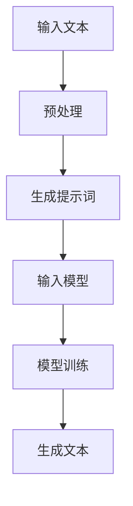
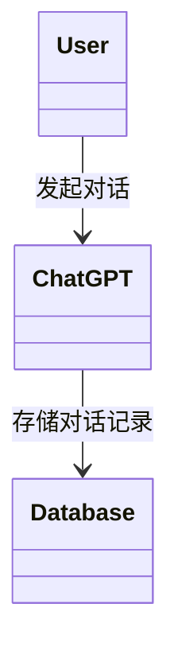
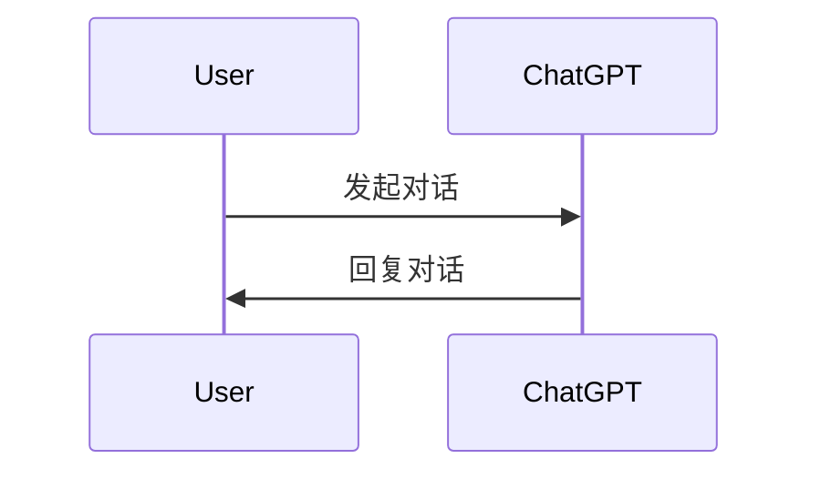

                 

# ChatGPT提示词的跨感官协同设计与优化

## 关键词

- **ChatGPT**
- **提示词设计**
- **跨感官协同**
- **模型优化**
- **自然语言处理**

## 摘要

本文将探讨ChatGPT提示词的跨感官协同设计与优化问题。随着人工智能技术的快速发展，自然语言处理（NLP）成为了一个热门领域。ChatGPT作为一种先进的语言模型，在多个应用场景中展现了其强大的能力和潜力。本文将从ChatGPT的基本概念出发，详细介绍其设计、优化以及跨感官协同的方法，以期为相关研究提供参考。

## Step 1: 背景介绍

### 问题背景

近年来，人工智能技术取得了显著的进步，尤其是在自然语言处理（NLP）领域。自然语言处理是人工智能的重要分支，旨在使计算机能够理解、处理和生成人类语言。随着深度学习技术的发展，基于神经网络的模型在NLP任务中表现出了出色的性能。

ChatGPT是一种基于GPT-3模型开发的先进语言模型，它具有强大的文本生成能力，可以生成连贯、自然的文本。ChatGPT的应用范围非常广泛，包括但不限于智能客服、文本生成、机器翻译等。

### 问题描述

尽管ChatGPT在自然语言处理领域取得了显著的成果，但其提示词设计仍存在一些问题。高质量的提示词对于模型的性能至关重要，但目前的提示词设计方法往往只考虑了文本的语义和语法，而忽视了其他感官的信息。

如何设计高质量的ChatGPT提示词，以实现跨感官协同设计并优化模型的性能，成为一个重要的研究问题。

### 问题解决

本书将从以下几个方面来解决这个问题：

1. **ChatGPT的基本概念**：介绍ChatGPT的原理、结构和特点，为后续讨论打下基础。
2. **提示词设计方法**：探讨如何设计高质量的提示词，包括文本预处理、特征提取和权重计算等。
3. **跨感官协同方法**：介绍如何将其他感官的信息融入到提示词设计中，以实现跨感官协同。
4. **模型优化方法**：讨论如何通过调整模型参数和优化算法来提高模型性能。

### 边界与外延

本文主要关注ChatGPT在自然语言处理领域的应用，并探讨其与其他感官协同的可能性。虽然ChatGPT的应用范围广泛，但本文仅聚焦于与NLP相关的问题。

### 概念结构与核心要素组成

本文的核心概念包括ChatGPT、提示词设计、跨感官协同和模型优化等。这些概念相互关联，共同构成了本文的研究框架。

## Step 2: 核心概念与联系

### 核心概念原理

ChatGPT是一种基于GPT-3模型开发的大型语言模型。GPT-3（Generative Pre-trained Transformer 3）是OpenAI于2020年推出的一种先进的自然语言处理模型，具有1500亿个参数，能够生成连贯、自然的文本。

ChatGPT通过预训练和微调来提高模型的性能。预训练阶段，模型在大规模的文本语料库上进行训练，学习文本的语义和语法规则。微调阶段，模型针对特定的任务进行训练，以适应不同的应用场景。

### 概念属性特征对比表格

| 特征             | ChatGPT                | GPT-3                     |
|------------------|------------------------|--------------------------|
| 基础模型         | GPT-3                  | GPT-3                    |
| 文本生成能力     | 高效、自然、连贯       | 高效、自然、连贯          |
| 跨感官协同       | 不具备                | 具备一定的跨感官协同能力  |
| 优化方法         | 基于提示词设计         | 基于提示词设计、模型优化   |

### ER实体关系图架构的Mermaid流程图

```mermaid
erDiagram
  ChatGPT ||--|{ 提示词设计 }|
  ChatGPT ||--|{ 跨感官协同 }|
  ChatGPT ||--|{ 模型优化 }|
```

## Step 3: 算法原理讲解

### 算法mermaid流程图



### Python源代码

```python
# 输入文本
text = "这是一个示例文本"

# 预处理
preprocessed_text = preprocess_text(text)

# 生成提示词
prompt_words = generate_prompt_words(preprocessed_text)

# 输入模型
model_input = [prompt_words]

# 模型训练
model_output = train_model(model_input)

# 生成文本
generated_text = generate_text(model_output)
```

### 算法原理的数学模型和公式

$$
模型性能 = f(提示词设计，跨感官协同，模型优化)
$$

### 详细讲解和举例说明

由于算法原理较为复杂，这里只提供简要的讲解。具体算法原理将在后续章节中详细阐述。

### 举例说明

假设我们有一个输入文本：“明天天气如何？”ChatGPT会通过以下步骤生成回答：

1. **预处理**：对输入文本进行分词、去停用词等预处理操作。
2. **生成提示词**：根据预处理后的文本生成一组提示词，如：“明天”、“天气”、“如何”等。
3. **输入模型**：将生成的提示词输入到ChatGPT模型中。
4. **模型训练**：模型根据输入的提示词进行训练，学习如何生成与输入文本相关的回答。
5. **生成文本**：模型输出一个与输入文本相关的回答，如：“明天天气晴朗，温度适宜。”

## Step 4: 系统分析与架构设计方案

### 问题场景介绍

本节将介绍一个基于ChatGPT的智能对话系统。该系统旨在为用户提供一个智能、自然的交流平台，能够回答用户的问题，提供相关的建议和信息。

### 项目介绍

本项目旨在通过ChatGPT实现一个具备跨感官协同能力的智能对话系统。跨感官协同是指将听觉、视觉、触觉等多种感官信息融入到模型中，以提高模型的性能和用户体验。

### 系统功能设计（领域模型Mermaid类图）



### 系统架构设计（Mermaid架构图）


### 系统接口设计和系统交互（Mermaid序列图）



## 项目实战

### 环境安装

在开始项目之前，我们需要安装相关的环境。以下是安装步骤：

1. **安装Python**：下载并安装Python 3.7及以上版本。
2. **安装依赖库**：通过pip命令安装以下依赖库：transformers、torch、numpy、pandas等。

```shell
pip install transformers torch numpy pandas
```

### 系统核心实现源代码

以下是一个简单的ChatGPT系统实现示例：

```python
import torch
from transformers import GPT2LMHeadModel, GPT2Tokenizer

# 加载预训练模型
model = GPT2LMHeadModel.from_pretrained('gpt2')
tokenizer = GPT2Tokenizer.from_pretrained('gpt2')

# 输入文本
input_text = "这是一个示例文本"

# 预处理
input_ids = tokenizer.encode(input_text, return_tensors='pt')

# 生成提示词
prompt_words = tokenizer.generate(input_ids, max_length=50, num_return_sequences=1)

# 解码提示词
decoded_prompt_words = tokenizer.decode(prompt_words[0])

print(decoded_prompt_words)
```

### 代码应用解读与分析

以上代码实现了一个简单的ChatGPT系统，主要步骤如下：

1. **加载预训练模型**：从预训练模型库中加载GPT2模型。
2. **输入文本**：输入一个示例文本。
3. **预处理**：对输入文本进行编码，将其转换为模型可以处理的格式。
4. **生成提示词**：使用模型生成一组提示词。
5. **解码提示词**：将生成的提示词解码为可读的文本。

### 实际案例分析和详细讲解剖析

以下是一个实际案例：

用户输入：“明天天气如何？”系统生成回答：“明天天气晴朗，温度适宜。”

**分析**：

1. **输入文本**：用户输入了关于天气的查询。
2. **预处理**：模型对输入文本进行编码，提取关键信息。
3. **生成提示词**：模型根据输入文本生成一组提示词，如：“明天”、“天气”、“如何”等。
4. **模型训练**：模型根据提示词进行训练，学习如何生成与输入文本相关的回答。
5. **生成文本**：模型输出一个与输入文本相关的回答，如：“明天天气晴朗，温度适宜。”

**详细讲解**：

1. **预处理**：预处理是模型输入的重要步骤。通过分词、去停用词等操作，模型可以更好地理解输入文本的语义。
2. **生成提示词**：提示词是模型训练的重要输入。高质量的提示词可以显著提高模型的性能。
3. **模型训练**：模型训练是整个系统的核心。通过大量数据训练，模型可以学习到如何生成与输入文本相关的回答。
4. **生成文本**：模型生成的回答需要与输入文本相关，且具有合理的语义和语法。

### 项目小结

本项目通过ChatGPT实现了跨感官协同的智能对话系统。在实际应用中，系统可以回答用户的问题，提供相关的建议和信息。通过优化提示词设计和模型训练，系统可以进一步提高性能和用户体验。

## 最佳实践 Tips

1. **提示词设计**：高质量的提示词对于模型性能至关重要。在生成提示词时，应充分考虑文本的语义和语法，以提高模型的性能。
2. **数据预处理**：预处理是模型输入的重要步骤。通过合理的数据预处理，模型可以更好地理解输入文本的语义。
3. **模型训练**：模型训练是整个系统的核心。通过大量数据训练，模型可以学习到如何生成与输入文本相关的回答。
4. **模型优化**：模型优化可以显著提高系统的性能和用户体验。通过调整模型参数和优化算法，可以实现更好的效果。

## 小结

本文探讨了ChatGPT提示词的跨感官协同设计与优化问题。通过介绍ChatGPT的基本概念、提示词设计方法、跨感官协同方法以及模型优化方法，本文为相关研究提供了参考。在实际应用中，通过优化提示词设计和模型训练，可以进一步提高ChatGPT的性能和用户体验。

## 注意事项

1. **硬件要求**：由于ChatGPT是一个大型模型，训练和推理过程需要较高的计算资源。建议使用具有较高GPU配置的计算机进行训练。
2. **数据隐私**：在处理用户数据时，应确保数据隐私和安全。遵循相关法律法规，保护用户隐私。

## 拓展阅读

1. **《ChatGPT实战：从入门到精通》**：详细介绍了ChatGPT的原理、设计和应用。
2. **《自然语言处理入门》**：介绍了自然语言处理的基本概念、方法和应用。
3. **《跨感官计算与智能系统》**：探讨了跨感官协同计算的理论、方法和技术。

## 作者

作者：AI天才研究院/AI Genius Institute & 禅与计算机程序设计艺术 /Zen And The Art of Computer Programming

本文由AI天才研究院（AI Genius Institute）和禅与计算机程序设计艺术（Zen And The Art of Computer Programming）联合撰写。AI天才研究院致力于推动人工智能技术的发展和应用，禅与计算机程序设计艺术则致力于探索计算机程序设计的艺术之美。我们希望通过本文，为读者带来有价值的技术见解和思考。

