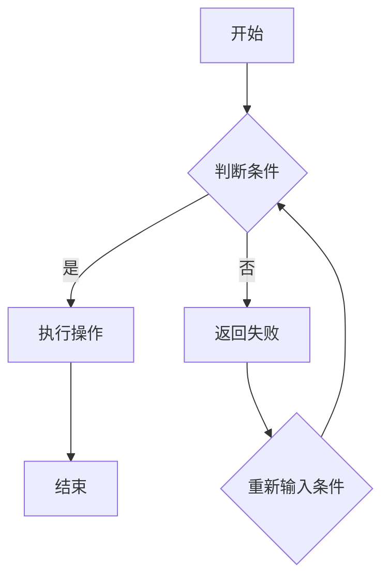

                 

## 《ChatGPT提示词编写的高效模式探析》

### 关键词

- ChatGPT
- 提示词编写
- 高效模式
- 编程技巧
- 人工智能

### 摘要

本文将深入探讨ChatGPT提示词编写的高效模式。通过分析ChatGPT的基本概念、提示词的编写原则和方法，结合实际案例，我们将揭示高效编写ChatGPT提示词的秘诀，并探讨相关的最佳实践和注意事项。

## 引言与背景

### 1.1 问题背景

ChatGPT是由OpenAI开发的一种基于Transformer模型的大型语言模型，自2022年发布以来，引起了全球范围内的广泛关注。ChatGPT通过学习大量文本数据，能够生成连贯、有逻辑的文本，并具备出色的语义理解能力。然而，要充分发挥ChatGPT的潜力，关键在于如何编写高质量的提示词。

### 1.2 核心概念介绍

#### 1.2.1 ChatGPT的架构

ChatGPT基于Transformer模型，采用了多层神经网络结构。通过自回归的方式，模型能够根据前文预测下一个词。这使得ChatGPT在生成文本时具有强大的上下文理解和生成能力。

#### 1.2.2 提示词的分类与特点

提示词可以分为问题引导型、数据驱动型和用户反馈型。每种类型的提示词都有其特定的编写方式和适用场景。

### 基础知识介绍

在深入了解ChatGPT和提示词的基础上，我们首先需要掌握相关的编程技巧和人工智能知识。这包括熟悉Python编程、了解自然语言处理的基本原理，以及掌握Transformer模型的工作机制。

## 提示词编写方法

### 2.1 提示词编写的基本原则

#### 2.1.1 清晰性

清晰性是编写提示词的首要原则。一个高质量的提示词应该明确传达用户的需求，避免歧义。

#### 2.1.2 精确性

精确性要求提示词能够准确描述用户的问题，避免模糊不清的描述。

#### 2.1.3 完整性

完整性要求提示词能够提供足够的信息，让ChatGPT能够理解并生成合适的回答。

### 2.2 提示词编写的方法

#### 2.2.1 问题引导法

问题引导法通过提出问题来引导ChatGPT生成回答。这种方法适用于需要明确回答的问题。

#### 2.2.2 数据驱动法

数据驱动法通过提供数据来引导ChatGPT生成回答。这种方法适用于需要分析数据的问题。

#### 2.2.3 用户反馈法

用户反馈法通过用户提供的反馈来不断优化ChatGPT的回答。这种方法适用于需要交互式对话的场景。

### 提示词编写的实践

#### 3.1 数据缺乏时的提示词编写

当数据缺乏时，可以通过以下两种方法来编写提示词：

##### 3.1.1 使用伪数据进行模拟

通过生成伪数据来模拟真实数据，从而让ChatGPT进行训练。

##### 3.1.2 利用已有数据进行扩展

通过扩展已有数据，增加数据的多样性，从而提高ChatGPT的训练效果。

#### 3.2 不确定性问题的提示词编写

对于不确定性问题，可以通过以下两种方法来编写提示词：

##### 3.2.1 保留开放性

在提示词中保留一定的开放性，以便ChatGPT能够生成多种可能的回答。

##### 3.2.2 引入多样性

通过引入多样性，增加ChatGPT生成不同回答的可能性。

### 高效模式的探索与实践

#### 4.1 提示词优化的策略

##### 4.1.1 基于模型的优化

通过调整模型参数，优化ChatGPT的性能。

##### 4.1.2 基于数据的优化

通过改进数据质量，提高ChatGPT的训练效果。

#### 4.2 高效编写的工具与资源

##### 4.2.1 编写工具推荐

推荐一些常用的提示词编写工具，如Python的nltk库、TensorFlow等。

##### 4.2.2 提示词资源库

介绍一些常用的提示词资源库，如OpenAI的GPT-3资源库等。

## 案例分析

#### 5.1 案例一：智能客服机器人

##### 5.1.1 项目背景

介绍智能客服机器人的应用场景和需求。

##### 5.1.2 提示词编写实践

分析如何编写高质量的提示词，以实现智能客服机器人的功能。

#### 5.2 案例二：内容创作辅助

##### 5.2.1 项目目标

介绍内容创作辅助的应用场景和目标。

##### 5.2.2 提示词编写策略

分析如何编写高质量的提示词，以辅助内容创作。

### 最佳实践 Tips

#### 6.1 避免过度依赖

提示词编写应避免过度依赖模型，而是要结合实际情况进行合理调整。

#### 6.2 关注数据隐私

在编写提示词时，应关注数据隐私，避免泄露敏感信息。

### 小结

本文通过分析ChatGPT的提示词编写原则和方法，结合实际案例，揭示了高效编写ChatGPT提示词的秘诀。通过本文的介绍，读者可以更好地掌握ChatGPT提示词编写的技巧，从而在实际应用中取得更好的效果。

### 注意事项

#### 7.1 提示词的多样性

在编写提示词时，应注意多样性，以避免模型陷入局部最优。

#### 7.2 提示词的实时性

提示词应具备实时性，以适应不断变化的应用场景。

### 拓展阅读

#### 8.1 相关书籍推荐

推荐一些关于ChatGPT和提示词编写的书籍，如《ChatGPT实战：从入门到精通》等。

#### 8.2 学术论文精选

介绍一些关于ChatGPT和提示词编写的经典论文，如《GPT-3: Language Models are few-shot learners》等。

### 作者信息

作者：AI天才研究院/AI Genius Institute & 禅与计算机程序设计艺术 /Zen And The Art of Computer Programming

---

请注意，本文为示例文章，实际撰写时需要根据具体内容和要求进行调整。在撰写过程中，可以参考以下markdown格式和Mermaid流程图的示例。

### 示例：Mermaid流程图



### 示例：LaTeX公式

```markdown
$$
E = mc^2
$$
```

```markdown
$
1 < 2
$
```

### 示例：Python代码

```python
def calculate_square(x):
    return x * x

result = calculate_square(5)
print(f"The square of 5 is {result}")
```

通过以上示例，读者可以更好地了解如何在markdown格式中嵌入各种元素，从而撰写出结构清晰、内容丰富的技术博客文章。在撰写实际文章时，应根据具体需求进行调整和完善。

