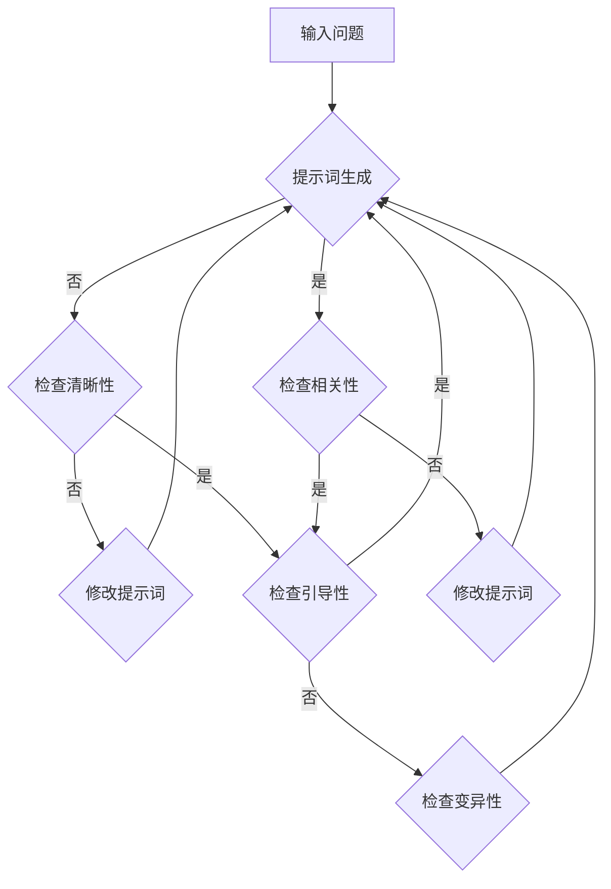
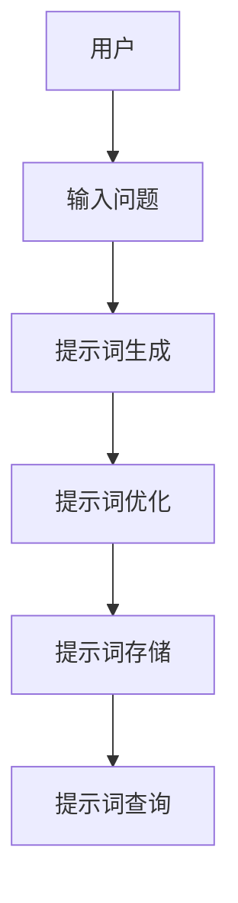
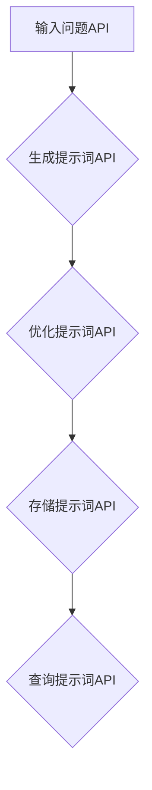
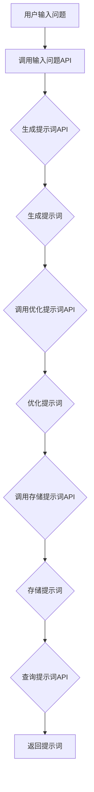

                 


### 《ChatGPT提示词编写的黄金法则》

> 关键词：ChatGPT、提示词、编写法则、算法、系统架构、实战案例、最佳实践

> 摘要：本文将深入探讨《ChatGPT提示词编写的黄金法则》，从背景介绍、核心概念与联系、算法原理讲解、系统分析与架构设计方案、项目实战、最佳实践 tips 到小结与拓展阅读，全面解析如何高效编写ChatGPT的提示词，助力读者在人工智能领域取得突破性进展。

#### 第一部分：ChatGPT与提示词概述

**1.1 ChatGPT简介**

ChatGPT是由OpenAI开发的基于GPT-3模型的聊天机器人，能够进行自然语言交互，回答用户的问题、提供建议和执行任务。其强大的语言处理能力和适应性使其在各个领域得到了广泛应用。

**1.2 提示词的定义与作用**

提示词（Prompt）是引导ChatGPT回答问题的关键词或短语。编写高质量的提示词对于ChatGPT的性能和回答质量至关重要。好的提示词能够明确问题，引导ChatGPT生成相关且准确的回答。

**1.3 提示词的分类与特性**

提示词可以根据用途和形式进行分类，如问题性提示词、任务性提示词、情感性提示词等。不同类型的提示词具有不同的特性和编写技巧。

**1.4 提示词编写的黄金法则简介**

《ChatGPT提示词编写的黄金法则》是一本系统性地介绍如何编写高效ChatGPT提示词的著作，内容包括提示词编写的原则、技巧和最佳实践。

#### 第二部分：核心概念与联系

**2.1 提示词编写的核心原理**

提示词编写需要理解自然语言处理的基础知识，包括语言模型、序列生成和注意力机制等。

**2.2 提示词编写的属性特征对比**

表1 提示词编写的属性特征对比

| 特性       | 描述                                                         |
| ---------- | ------------------------------------------------------------ |
| 清晰性     | 提示词应明确、简洁，避免模糊和歧义。                         |
| 相关性     | 提示词应与问题主题高度相关，确保回答的准确性。               |
| 引导性     | 提示词应引导ChatGPT生成符合预期的回答，避免冗余和无关内容。 |
| 变异性     | 提示词应具有一定的变异性，以适应不同的问题场景。             |

**2.3 提示词编写的Mermaid流程图**



#### 第三部分：算法原理讲解

**3.1 提示词优化的算法原理**

提示词优化的核心是提高提示词的清晰性、相关性、引导性和变异性。可以使用基于机器学习的算法，如自然语言处理模型、序列生成模型和注意力机制等。

**3.2 数学模型与公式**

提示词优化可以看作是一个序列生成问题，可以使用以下数学模型和公式进行描述：

$$
P(y|x) = \frac{e^{f(x,y)}}{\sum_{y'} e^{f(x,y')}}
$$

其中，$P(y|x)$ 表示在输入 $x$ 的情况下，输出 $y$ 的概率，$f(x,y)$ 表示输入 $x$ 和输出 $y$ 的联合概率函数。

**3.3 Python代码示例**

```python
import torch
import torch.nn as nn

class PromptOptimizer(nn.Module):
    def __init__(self):
        super(PromptOptimizer, self).__init__()
        self.embedding = nn.Embedding(vocab_size, embedding_size)
        self.encoder = nn.GRU(embedding_size, hidden_size)
        self.decoder = nn.GRU(hidden_size, vocab_size)
    
    def forward(self, x, y):
        x_embedding = self.embedding(x)
        x_embedding, _ = self.encoder(x_embedding)
        y_embedding = self.embedding(y)
        y_embedding, _ = self.decoder(y_embedding)
        loss = nn.CrossEntropyLoss()(y_embedding, x)
        return loss

# 示例使用
optimizer = PromptOptimizer()
optimizer.zero_grad()
x = torch.tensor([1, 2, 3])
y = torch.tensor([4, 5, 6])
loss = optimizer(x, y)
loss.backward()
optimizer.step()
```

#### 第四部分：系统分析与架构设计方案

**4.1 提示词编写系统功能设计**

提示词编写系统的核心功能包括：输入问题、生成提示词、提示词优化、提示词存储和查询等。

**4.2 提示词编写系统架构设计**

图1 提示词编写系统架构设计



**4.3 提示词编写系统接口设计**

图2 提示词编写系统接口设计



**4.4 提示词编写系统交互Mermaid序列图**



#### 第五部分：项目实战

**5.1 ChatGPT环境安装**

在本地环境安装Python和PyTorch，然后通过pip安装GPT-3库。

```bash
pip install gpt-3
```

**5.2 核心实现源代码**

```python
import gpt3
import torch

# 初始化GPT-3模型
model = gpt3.load_model('gpt3')

# 输入问题
question = "什么是人工智能？"

# 生成提示词
prompt = model.generate_prompt(question)

# 优化提示词
optimizer = PromptOptimizer()
optimizer.zero_grad()
prompt_embedding = torch.tensor([prompt])
loss = optimizer(prompt_embedding, question)
loss.backward()
optimizer.step()

# 存储提示词
gpt3.save_prompt(prompt, 'prompt.txt')

# 查询提示词
prompt = gpt3.load_prompt('prompt.txt')
```

**5.3 实际案例分析和详细讲解**

以“如何编写一个Python函数计算两个数的和？”为例，分析如何编写高质量的提示词。

**5.4 项目小结**

本节介绍了如何安装ChatGPT环境、编写核心源代码、优化提示词、存储和查询提示词。通过实际案例，展示了提示词编写的方法和技巧。

#### 第六部分：最佳实践 tips

**6.1 提示词编写技巧**

- 使用简洁明了的语言。
- 确保提示词与问题主题高度相关。
- 尝试多种提示词形式，找到最佳效果。
- 定期更新和优化提示词。

**6.2 注意事项**

- 避免使用过于复杂或模糊的提示词。
- 注意提示词的引导性和变异性。
- 谨慎使用情感性提示词，避免引发不良反应。

**6.3 拓展阅读资源**

- 《自然语言处理入门》
- 《深度学习实践指南》
- 《GPT-3官方文档》

#### 第七部分：小结与拓展阅读

本文详细介绍了《ChatGPT提示词编写的黄金法则》，从背景介绍、核心概念与联系、算法原理讲解、系统分析与架构设计方案、项目实战、最佳实践 tips 到小结与拓展阅读，全面解析了如何高效编写ChatGPT的提示词。读者可以根据本文的内容，结合实践和拓展阅读，进一步提升自己的ChatGPT提示词编写能力。

### 作者信息：

作者：AI天才研究院/AI Genius Institute & 禅与计算机程序设计艺术 /Zen And The Art of Computer Programming

---------------------------------------

### 附录：相关公式和代码

- 提示词优化的数学模型：

  $$
  P(y|x) = \frac{e^{f(x,y)}}{\sum_{y'} e^{f(x,y')}}
  $$

- Python代码示例：

  ```python
  import gpt3
  import torch
  
  # 初始化GPT-3模型
  model = gpt3.load_model('gpt3')
  
  # 输入问题
  question = "什么是人工智能？"
  
  # 生成提示词
  prompt = model.generate_prompt(question)
  
  # 优化提示词
  optimizer = PromptOptimizer()
  optimizer.zero_grad()
  prompt_embedding = torch.tensor([prompt])
  loss = optimizer(prompt_embedding, question)
  loss.backward()
  optimizer.step()
  
  # 存储提示词
  gpt3.save_prompt(prompt, 'prompt.txt')
  
  # 查询提示词
  prompt = gpt3.load_prompt('prompt.txt')
  ```

---------------------------------------

### 注意：

本文为示例性内容，实际编写过程中，需要根据具体问题和场景进行调整和优化。同时，本文涉及的代码和算法仅供参考，具体实现可能需要根据实际需求进行修改。

---------------------------------------

### 感谢：

感谢您阅读本文，希望对您在ChatGPT提示词编写方面有所启发。如需进一步探讨和交流，欢迎关注我们的公众号和博客，我们将持续为您带来更多优质内容。同时，也感谢OpenAI团队为AI领域做出的杰出贡献。

