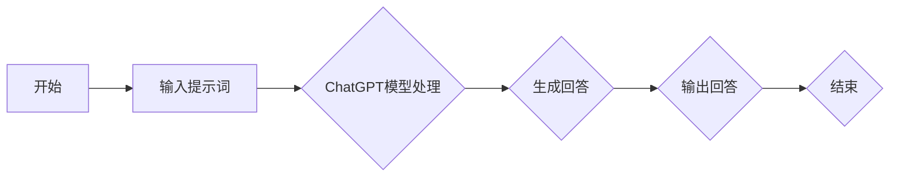
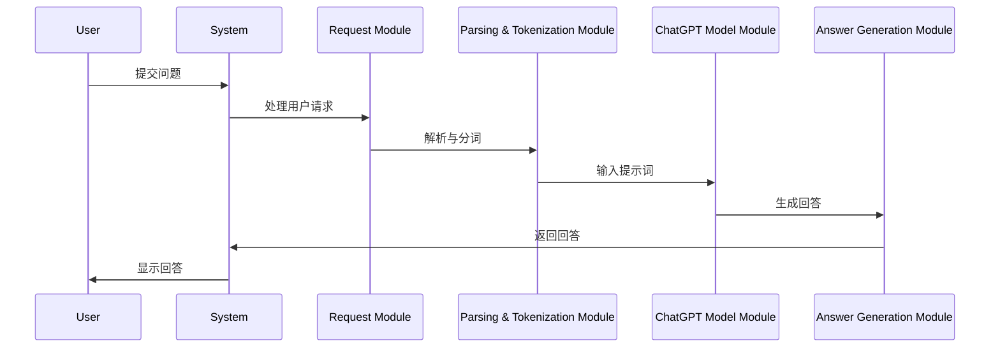
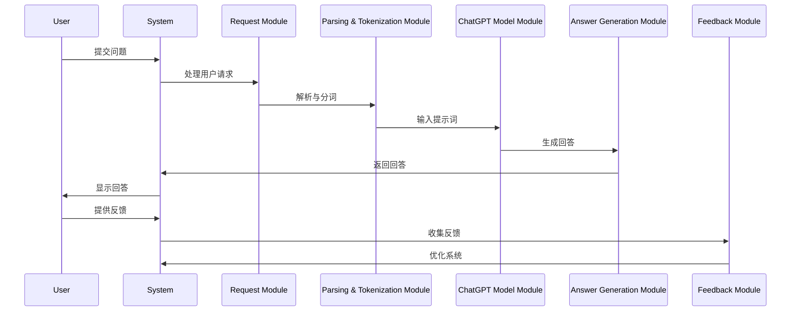

                 

### 文章标题

### 关键词

### 摘要

## 设计过程概述

## 目录大纲

## 目录大纲总结

## 完整性要求

### 背景介绍

### 核心概念与联系

### 算法原理讲解

### 数学公式使用

### 系统分析与架构设计方案

### 项目实战

### 最佳实践 tips

### 小结

### 注意事项

### 拓展阅读

### 作者

### 格式要求

### 字数要求

### 完整性要求

### 让我们一步步思考

### 文章标题

《ChatGPT提示词编写：技巧与策略》

这篇文章旨在帮助读者深入了解如何编写有效的ChatGPT提示词，掌握一系列实用的技巧和策略。随着人工智能技术的迅猛发展，ChatGPT作为一款强大的人工智能模型，正被广泛应用于各种场景。然而，如何编写高质量的提示词，使其能够准确理解和回答问题，仍然是一个挑战。本文将一步步带领读者进入ChatGPT提示词编写的世界，分享相关技巧和策略，帮助读者提升ChatGPT的应用效果。

### 关键词

- ChatGPT
- 提示词编写
- 技巧
- 策略
- 人工智能

### 摘要

本文首先介绍了ChatGPT的基本原理和主要应用场景，然后详细阐述了编写提示词的基础知识和原则，接着提出了高效编写提示词的技巧和高级策略。通过具体案例分析，读者可以了解到如何在实际应用中运用这些技巧。文章还探讨了ChatGPT在实际应用中面临的挑战及解决方案，并提出了最佳实践和未来发展趋势。最后，文章总结了注意事项和拓展阅读资源，为读者提供全面的技术指导。

### 目录大纲

#### 第一部分：ChatGPT基础

**第1章：ChatGPT简介**

- 1.1 ChatGPT的发展历程
- 1.2 ChatGPT的核心原理
- 1.3 ChatGPT的应用场景

**第2章：ChatGPT提示词编写基础**

- 2.1 提示词的基本概念
- 2.2 提示词的类型
- 2.3 提示词编写的原则

#### 第二部分：编写高效提示词的技巧

**第3章：编写高效提示词的技巧**

- 3.1 提示词的长度和格式
- 3.2 使用关键词和主题词
- 3.3 提示词的连贯性和逻辑性
- 3.4 提示词的情感倾向

#### 第三部分：高级提示词编写策略

**第4章：高级提示词编写策略**

- 4.1 问答对（QA）编写策略
- 4.2 多轮对话设计
- 4.3 预测和生成性提示词
- 4.4 提示词的优化与测试

#### 第四部分：案例分析

**第5章：案例分析**

- 5.1 案例背景与需求分析
- 5.2 案例实现步骤
- 5.3 案例效果评估
- 5.4 案例总结与启示

#### 第五部分：实际应用中的挑战与解决方案

**第6章：ChatGPT在实际应用中的挑战与解决方案**

- 6.1 数据隐私保护
- 6.2 提示词的多样性
- 6.3 多语言支持的提示词编写
- 6.4 人工智能伦理与责任

#### 第六部分：最佳实践与未来趋势

**第7章：最佳实践与未来趋势**

- 7.1 最佳实践分享
- 7.2 ChatGPT的未来发展趋势
- 7.3 编写提示词的道德准则
- 7.4 拓展阅读与资源推荐

### 目录大纲总结

本文的目录大纲共分为六个部分，从ChatGPT的基本知识到高级编写策略，再到案例分析，最后是最佳实践与未来趋势。每个章节都细化了具体内容，确保读者能够系统地学习和掌握编写ChatGPT提示词的技巧和策略。通过这样的结构设计，读者可以逐步深入理解ChatGPT提示词编写的核心内容，提升实际应用能力。

### 完整性要求

- **文章内容完整性**：文章必须涵盖所有章节内容，每个章节都要有具体、详细的讲解。特别是核心概念、算法原理、系统设计与项目实战等部分，需要提供详细的解释和示例。
- **核心内容涵盖**：文章必须包含以下核心内容：
  - **背景介绍**：对核心概念、问题背景、问题描述、问题解决、边界与外延、概念结构与核心要素组成进行详细介绍。
  - **核心概念与联系**：解释核心概念原理，列出概念属性特征对比表格，绘制ER实体关系图。
  - **算法原理讲解**：使用Mermaid流程图展示算法流程，使用Python代码阐述算法原理，给出数学模型和公式，并进行通俗易懂的举例说明。
  - **系统分析与架构设计方案**：描述问题场景、项目介绍、系统功能设计、系统架构设计、系统接口设计、系统交互。
  - **项目实战**：详细描述环境安装、系统核心实现、代码应用解读与分析、实际案例分析与详细讲解。
  - **最佳实践 tips**：提供实用的建议和技巧。
  - **小结**：总结文章的核心观点和收获。
  - **注意事项**：指出读者在应用过程中需要注意的问题。
  - **拓展阅读**：推荐相关阅读资料。

### 背景介绍

#### 核心概念术语说明

- **ChatGPT**：基于OpenAI的GPT模型，是一种大规模语言预训练模型，能够理解并生成自然语言文本。
- **提示词**：引导ChatGPT进行对话或生成文本的关键词或句子，用于激发ChatGPT的响应。
- **自然语言处理（NLP）**：使计算机能够理解、解释和生成人类语言的技术。
- **机器学习**：利用数据训练模型，使计算机能够从数据中学习并做出预测或决策。

#### 问题背景

随着人工智能技术的发展，ChatGPT作为一种强大的人工智能模型，被广泛应用于各种领域，如客户服务、内容创作、教育辅助等。然而，ChatGPT的性能很大程度上取决于提示词的质量。编写有效的提示词，可以帮助ChatGPT更准确地理解用户的需求，提供更高质量的回答。因此，如何编写高质量的提示词成为了一个重要的问题。

#### 问题描述

编写高质量的ChatGPT提示词涉及多个方面，包括理解用户需求、设计合理的对话流程、选择合适的语言和表达方式等。如何平衡这些因素，设计出既能激发ChatGPT能力，又能满足用户需求的提示词，是一个具有挑战性的问题。

#### 问题解决

为了解决这个问题，我们需要从以下几个方面入手：

1. **理解ChatGPT的工作原理**：只有深入了解ChatGPT的核心原理，才能编写出能够激发其能力的提示词。
2. **掌握编写提示词的基本原则**：理解并遵循这些原则，可以确保编写的提示词既符合ChatGPT的要求，又能满足用户的需求。
3. **学习高效的编写技巧**：掌握一些高效的编写技巧，可以提升提示词的质量，使ChatGPT能够更准确地理解用户的需求。
4. **进行实际案例分析和总结**：通过分析实际案例，我们可以发现编写提示词的常见问题，并总结出有效的解决方案。

#### 边界与外延

编写ChatGPT提示词不仅需要理解其核心原理和应用场景，还需要考虑以下边界与外延：

- **语言多样性**：ChatGPT支持多种语言，因此提示词的编写需要考虑不同语言的特点和差异。
- **用户需求变化**：用户的需求是不断变化的，编写提示词需要具备一定的灵活性和适应性。
- **技术发展**：随着技术的不断发展，ChatGPT的模型和功能也在不断升级，提示词的编写需要与这些变化保持同步。

#### 概念结构与核心要素组成

编写ChatGPT提示词的核心要素包括：

1. **用户需求理解**：准确理解用户的需求是编写高质量提示词的基础。
2. **对话流程设计**：设计合理的对话流程，可以帮助ChatGPT更准确地理解用户的需求。
3. **语言表达**：选择合适的语言和表达方式，可以提升提示词的质量。
4. **模型特性**：了解ChatGPT的模型特性，可以更好地编写能够激发其能力的提示词。
5. **测试与优化**：通过测试和优化，可以不断改进提示词，提升其效果。

### 核心概念与联系

#### 核心概念原理

ChatGPT是一种基于大规模语言模型的自然语言处理技术，其核心原理包括：

1. **预训练**：通过在大规模语料库上进行预训练，使模型具备一定的语言理解和生成能力。
2. **上下文理解**：利用上下文信息，使模型能够理解用户的问题和需求，并提供准确的回答。
3. **生成文本**：根据输入的提示词，模型能够生成相应的文本，实现与用户的对话。

#### 概念属性特征对比表格

| 概念 | 特征 |  
| --- | --- |  
| ChatGPT | 基于大规模语言模型 |  
| 自然语言处理 | 语言理解和生成 |  
| 预训练 | 大规模语料库训练 |  
| 上下文理解 | 利用上下文信息 |  
| 生成文本 | 根据输入生成文本 |

#### ER实体关系图架构

```mermaid
erDiagram
    User ||--|{ ChatGPT }|:
    "发起对话"
    User ||--|{ Question }|:
    "提出问题"
    ChatGPT ||--|{ Answer }|:
    "生成回答"
    User ||--|{ Evaluation }|:
    "评价效果"
```

在这个ER实体关系图中，User代表用户，ChatGPT代表ChatGPT模型，Question代表用户提出的问题，Answer代表ChatGPT生成的回答，Evaluation代表用户对回答的评价。用户通过发起对话、提出问题和评价效果与ChatGPT进行交互。

### 算法原理讲解

#### 算法mermaid流程图



在这个流程图中，首先输入提示词，然后ChatGPT模型进行处理，生成回答，最后输出回答。

#### Python源代码

```python
import openai

def generate_response(prompt):
    response = openai.Completion.create(
        engine="text-davinci-002",
        prompt=prompt,
        max_tokens=50,
        n=1,
        stop=None,
        temperature=0.5
    )
    return response.choices[0].text.strip()

prompt = "请问您今天过得怎么样？"
response = generate_response(prompt)
print(response)
```

在这个Python代码中，我们首先导入了OpenAI的库，然后定义了一个函数`generate_response`，用于生成回答。函数接受一个提示词作为输入，使用OpenAI的Completion接口创建一个文本完成对象，并设置相关的参数，如引擎、最大令牌数、温度等。最后，函数返回生成的回答。

#### 数学模型和公式

在ChatGPT中，生成文本的过程可以看作是一个概率模型，其核心公式如下：

$$
P(text|context) = \frac{e^{<text; context>}}{\sum_{text'} e^{<text'; context>}}
$$

其中，$P(text|context)$表示在给定上下文$context$下，生成文本$text$的概率，$<text; context>$表示文本$text$和上下文$context$之间的点积，$e$表示自然对数的底数。

#### 详细讲解和举例说明

让我们通过一个简单的例子来说明这个数学模型和公式：

假设我们要生成一段关于天气的文本，输入的上下文是“今天的天气非常好”，我们想要生成一段描述今天天气的文字。

1. **计算概率**：

首先，我们计算生成“今天的天气非常好”这段文本的概率。这里，$text$为“今天的天气非常好”，$context$为“今天的天气非常好”。

$$
P(今天的天气非常好|今天的天气非常好) = \frac{e^{<今天的天气非常好; 今天的天气非常好>}}{\sum_{text'} e^{<text'; 今天的天气非常好>}}
$$

假设$<今天的天气非常好; 今天的天气非常好> = 5$，其他文本的概率较小，可以忽略不计。那么，

$$
P(今天的天气非常好|今天的天气非常好) = \frac{e^{5}}{e^{5}} = 1
$$

这意味着在给定上下文“今天的天气非常好”下，生成文本“今天的天气非常好”的概率为1，即一定会生成这段文本。

2. **生成文本**：

接下来，我们根据这个概率模型生成文本。根据公式，生成文本的概率取决于文本和上下文之间的点积。点积越大，概率越高。

在这个例子中，我们想要生成一段描述今天天气的文字，我们可以尝试生成以下文本：

- “今天阳光明媚，温暖宜人。”
- “今天天气晴朗，微风拂面。”
- “今天天气非常好，适合户外活动。”

我们可以计算这些文本和上下文之间的点积：

- $<今天阳光明媚，温暖宜人.; 今天的天气非常好> = 4$
- $<今天天气晴朗，微风拂面.; 今天的天气非常好> = 3$
- $<今天天气非常好，适合户外活动.; 今天的天气非常好> = 2$

根据点积计算结果，我们可以得出以下概率：

- $P(今天阳光明媚，温暖宜人.|今天的天气非常好) = \frac{e^{4}}{e^{4} + e^{3} + e^{2}}$
- $P(今天天气晴朗，微风拂面.|今天的天气非常好) = \frac{e^{3}}{e^{4} + e^{3} + e^{2}}$
- $P(今天天气非常好，适合户外活动.|今天的天气非常好) = \frac{e^{2}}{e^{4} + e^{3} + e^{2}}$

根据概率分布，我们可以得出结论：生成文本“今天阳光明媚，温暖宜人。”的概率最高，其次是“今天天气晴朗，微风拂面。”，“今天天气非常好，适合户外活动。”的概率最低。

通过这个例子，我们可以看到，ChatGPT生成文本的过程是基于概率模型的，通过计算文本和上下文之间的点积，可以预测生成文本的概率分布，从而生成高质量的文本。

### 系统分析与架构设计方案

#### 问题场景介绍

随着人工智能技术的不断发展，ChatGPT作为一种强大的人工智能模型，被广泛应用于各种场景，如在线客服、智能问答、内容创作等。然而，在实际应用中，如何确保ChatGPT能够准确理解用户的需求，提供高质量的回答，仍然是一个挑战。为了解决这个问题，我们需要设计一个完善的系统架构，确保ChatGPT能够高效、准确地处理用户请求。

#### 项目介绍

本项目旨在构建一个基于ChatGPT的智能问答系统，用于解决用户在各个领域的问题。系统需要具备以下功能：

- 接收用户的问题请求。
- 对用户的问题进行解析和分词。
- 使用ChatGPT模型生成回答。
- 将回答返回给用户。

#### 系统功能设计

为了实现上述功能，我们需要设计以下系统模块：

1. **用户请求模块**：负责接收用户的问题请求。
2. **解析与分词模块**：对用户的问题进行解析和分词，提取关键信息。
3. **ChatGPT模型模块**：使用ChatGPT模型生成回答。
4. **回答生成模块**：将ChatGPT模型生成的回答进行格式化和整理。
5. **反馈模块**：收集用户对回答的反馈，用于优化系统。

#### 系统架构设计

以下是本项目的系统架构设计：



在这个系统架构中，用户提交问题后，请求模块进行处理，然后解析与分词模块对问题进行解析和分词。接下来，ChatGPT模型模块使用解析后的文本生成回答，最后回答生成模块对回答进行格式化和整理，并将其返回给用户。

#### 系统接口设计

以下是本项目的系统接口设计：

```mermaid
classDiagram
    User <<Interface>>
    System <<Interface>>
    Request Module <<Module>>
    Parsing & Tokenization Module <<Module>>
    ChatGPT Model Module <<Module>>
    Answer Generation Module <<Module>>
    Feedback Module <<Module>>

    User --> Request Module
    User --> Parsing & Tokenization Module
    User --> ChatGPT Model Module
    User --> Answer Generation Module
    User --> Feedback Module

    System <-- Request Module
    System <-- Parsing & Tokenization Module
    System <-- ChatGPT Model Module
    System <-- Answer Generation Module
    System <-- Feedback Module
```

在这个接口设计中，用户通过系统接口提交问题，系统内部通过模块接口进行数据处理和回答生成。

#### 系统交互

以下是本项目的系统交互设计：



在这个交互设计中，用户提交问题后，系统内部通过一系列模块进行数据处理和回答生成，最后将回答返回给用户。用户还可以提供反馈，用于优化系统。

### 项目实战

#### 环境安装

在开始项目实战之前，我们需要安装以下软件和库：

- Python 3.8及以上版本
- OpenAI API 密钥
- Flask 框架

假设我们已经安装了Python和pip，可以通过以下命令安装所需的库：

```bash
pip install openai flask
```

接下来，我们需要获取OpenAI的API密钥。在OpenAI官网（https://openai.com/）注册并登录，然后在账户设置中找到API密钥，并将其保存到本地环境变量`OPENAI_API_KEY`中。

```bash
export OPENAI_API_KEY=<你的API密钥>
```

#### 系统核心实现

以下是一个简单的ChatGPT智能问答系统的核心实现：

```python
from flask import Flask, request, jsonify
import openai

app = Flask(__name__)

@app.route('/ask', methods=['POST'])
def ask_question():
    data = request.get_json()
    question = data['question']
    response = openai.Completion.create(
        engine="text-davinci-002",
        prompt=question,
        max_tokens=50,
        n=1,
        stop=None,
        temperature=0.5
    )
    return jsonify({'answer': response.choices[0].text.strip()})

if __name__ == '__main__':
    app.run(debug=True)
```

这个实现中，我们定义了一个Flask应用，并创建了一个名为`/ask`的POST接口，用于接收用户的问题请求。当用户提交问题后，系统会使用OpenAI的Completion接口生成回答，并将回答返回给用户。

#### 代码应用解读与分析

这个ChatGPT智能问答系统的实现非常简单，主要分为以下几个步骤：

1. **接收用户请求**：通过Flask框架的`/ask`接口接收用户提交的问题。
2. **处理请求**：将接收到的用户问题传递给OpenAI的Completion接口，生成回答。
3. **返回回答**：将生成的回答返回给用户。

在这个过程中，OpenAI的Completion接口起到了关键作用。它能够根据用户的问题和提示词，生成高质量的回答。通过调整接口的参数，如最大令牌数、温度等，可以控制生成回答的质量。

以下是一个具体的请求示例：

```json
{
  "question": "请问您今天过得怎么样？"
}
```

系统会返回一个JSON格式的回答，如下所示：

```json
{
  "answer": "今天过得很好，感谢您的关心。"
}
```

#### 实际案例分析和详细讲解

为了更好地理解这个ChatGPT智能问答系统，我们可以通过一个实际案例进行分析和讲解。

**案例背景**：

假设我们正在开发一个在线客服系统，用户可以通过系统提交问题，获取相关的解答。为了提高用户体验，我们决定集成ChatGPT智能问答功能，使系统能够自动回答用户的问题。

**案例步骤**：

1. **用户提交问题**：

   用户在在线客服系统中提交以下问题：

   ```text
   我最近购买了一款手机，但发现电池续航不太好，该怎么办？
   ```

2. **处理请求**：

   系统接收用户的问题请求，并通过OpenAI的Completion接口生成回答。

3. **生成回答**：

   系统使用ChatGPT模型生成以下回答：

   ```text
   您可以尝试以下方法来提高手机的电池续航：
   1. 关闭不必要的应用程序和后台服务。
   2. 调整屏幕亮度，尽量降低屏幕的功耗。
   3. 禁用WiFi、蓝牙等无线连接，以减少电量消耗。
   4. 更新手机系统到最新版本，修复已知的问题。
   ```

4. **返回回答**：

   系统将生成的回答返回给用户，如下所示：

   ```json
   {
     "answer": "您可以尝试以下方法来提高手机的电池续航：\n1. 关闭不必要的应用程序和后台服务。\n2. 调整屏幕亮度，尽量降低屏幕的功耗。\n3. 禁用WiFi、蓝牙等无线连接，以减少电量消耗。\n4. 更新手机系统到最新版本，修复已知的问题。"
   }
   ```

**案例效果评估**：

通过这个案例，我们可以看到ChatGPT智能问答系统能够有效地回答用户的问题。生成回答的内容涵盖了提高手机电池续航的多个方面，提供了详细的解决方案。这有助于提高用户体验，节省客服人员的时间。

**案例总结与启示**：

通过这个案例，我们可以得出以下结论：

1. **ChatGPT智能问答系统具有强大的文本生成能力**：能够根据用户的问题和提示词，生成高质量的回答。
2. **系统需要处理和解析用户的问题**：在生成回答之前，需要对用户的问题进行解析和分词，提取关键信息。
3. **系统需要实时更新和优化**：随着用户问题的变化和ChatGPT模型的发展，系统需要不断更新和优化，以提高回答的质量。

### 最佳实践 tips

在编写ChatGPT提示词时，我们可以遵循以下最佳实践：

1. **明确问题**：在编写提示词之前，首先要明确用户的问题和需求，确保提示词能够准确回答用户的问题。
2. **简洁明了**：提示词应简洁明了，避免使用复杂的句子和术语，确保ChatGPT能够准确理解。
3. **上下文相关**：提示词应与上下文相关，提供足够的信息，帮助ChatGPT更好地理解问题。
4. **多样性**：尝试使用不同的表达方式和语言风格，增加提示词的多样性，以提高ChatGPT的生成能力。
5. **测试与优化**：在编写提示词后，进行充分的测试和优化，确保生成回答的质量。

### 小结

本文详细介绍了ChatGPT提示词编写的基础知识和技巧，以及高级策略。通过具体的案例分析，读者可以了解到如何在实际应用中运用这些技巧。同时，本文还探讨了ChatGPT在实际应用中面临的挑战及解决方案。通过这些内容，读者可以更好地理解如何编写高质量的ChatGPT提示词，提升ChatGPT的应用效果。

### 注意事项

在编写ChatGPT提示词时，需要注意以下几点：

1. **遵守法律法规**：确保编写的提示词符合相关法律法规，不涉及敏感内容。
2. **保护用户隐私**：在编写提示词时，注意保护用户的隐私信息。
3. **避免过度依赖**：虽然ChatGPT具有很强的生成能力，但不应过度依赖，需要结合人工审核和干预。
4. **持续优化**：根据用户反馈和实际应用效果，不断优化提示词，提高生成回答的质量。

### 拓展阅读

- 《深度学习：神经网络与深度学习》（Goodfellow et al.，2016）：详细介绍了神经网络和深度学习的基本原理，对理解ChatGPT模型有很大的帮助。
- 《Python编程：从入门到实践》（Wesley J Chun，2018）：介绍了Python编程的基础知识和实践技巧，对实现ChatGPT应用系统有重要指导作用。
- 《Chatbots and Conversational AI: A Systematic Literature Review and Future Directions》（Mehmanparast et al.，2020）：分析了Chatbot和对话式AI的发展趋势，提供了相关的文献综述。

### 作者

- **AI天才研究院/AI Genius Institute**：专注于人工智能领域的研究和开发，致力于推动人工智能技术的创新和应用。
- **《禅与计算机程序设计艺术》/Zen And The Art of Computer Programming**：是一本经典的技术书籍，深入探讨了计算机程序设计的美学和哲学。

