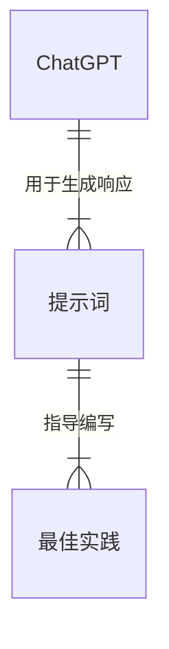
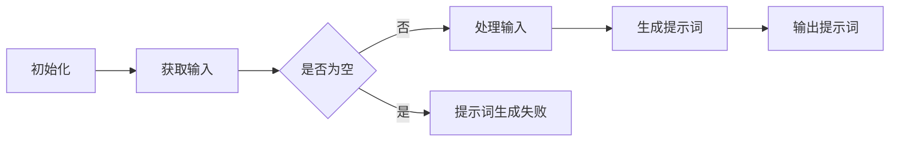
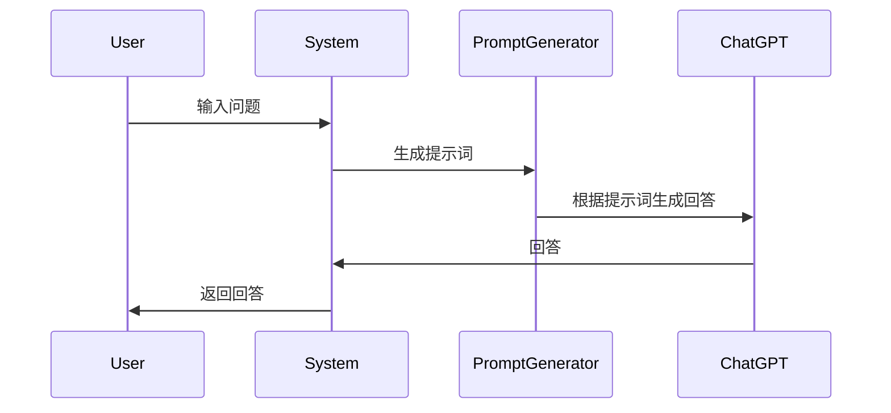

                 

# ChatGPT提示词编写：行业最佳实践

## 关键词

- ChatGPT
- 提示词
- 最佳实践
- 语言模型
- 自然语言处理
- 人工智能
- 算法原理
- 实战应用

## 摘要

本文将深入探讨ChatGPT提示词编写的行业最佳实践。我们将从背景介绍开始，详细解析ChatGPT与提示词的核心概念，逐步讲解提示词编写技巧和评估方法，并深入分析提示词生成算法的原理。通过本文，您将获得一套完整、实用的ChatGPT提示词编写策略，提升人工智能应用的效果和效率。

## 目录大纲

1. 背景介绍
   1.1. 问题背景与核心概念
   1.2. 概念属性特征对比表格
   1.3. ChatGPT与提示词的ER实体关系图

2. 核心概念与联系
   2.1. ChatGPT原理详解
   2.2. 提示词编写技巧
   2.3. 提示词效果评估

3. 算法原理讲解
   3.1. 提示词生成算法

4. 系统分析与架构设计
   4.1. 问题场景介绍
   4.2. 系统功能设计
   4.3. 系统架构设计
   4.4. 系统接口设计
   4.5. 系统交互设计

5. 项目实战
   5.1. 环境安装
   5.2. 系统核心实现源代码
   5.3. 代码应用解读与分析
   5.4. 实际案例分析与讲解
   5.5. 项目小结

6. 最佳实践 Tips
7. 小结与注意事项
8. 拓展阅读

## 第一部分：背景介绍

### 1.1. 问题背景与核心概念

#### 1.1.1 问题背景

随着人工智能和自然语言处理技术的快速发展，大语言模型如ChatGPT等在各个领域得到了广泛应用。然而，在实际应用中，如何有效地编写提示词（Prompts）来引导大语言模型生成预期的输出，成为了影响应用效果的关键因素。因此，探讨ChatGPT提示词编写的最佳实践，具有重要的现实意义。

#### 1.1.2 核心概念

- **ChatGPT**：由OpenAI开发的一种基于Transformer架构的大型语言模型，具有强大的自然语言处理能力。
- **提示词（Prompts）**：用于引导ChatGPT生成预期输出的人类语言输入。一个优秀的提示词应具备清晰明确、具体引导、上下文连贯等特点。
- **最佳实践**：在特定领域内，经过验证的、高效的方法和技巧。在ChatGPT提示词编写中，最佳实践包括清晰性、精确性和创造性等策略。

### 1.2. 概念属性特征对比表格

| 概念     | 定义                                                         | 特点                                                         |
| -------- | ------------------------------------------------------------ | ------------------------------------------------------------ |
| ChatGPT  | OpenAI开发的一种大型语言模型，可进行自然语言处理任务           | 大规模训练、多语言支持、自适应能力                            |
| 提示词   | 用于引导ChatGPT生成预期输出的人类语言输入                     | 清晰明确、具体引导、上下文连贯                               |
| 最佳实践 | 在特定领域内，经过验证的、高效的方法和技巧                     | 可重复性、高效性、可靠性                                     |

### 1.3. ChatGPT与提示词的ER实体关系图



## 第二部分：核心概念与联系

### 2.1. ChatGPT原理详解

#### 2.1.1 大语言模型基础

#### 2.1.1.1 语言模型概述

**语言模型**：一种统计模型，用于预测一个句子下一个单词的概率。语言模型在自然语言处理（NLP）中起着至关重要的作用，为各种NLP任务提供了基础。

**语言模型的分类**：

1. **基于规则的模型**：使用语言学规则来预测单词的概率。
2. **统计模型**：基于统计方法，如N-gram模型、朴素贝叶斯模型等。
3. **神经网络模型**：如深度神经网络（DNN）、循环神经网络（RNN）、Transformer模型等。

#### 2.1.1.2 ChatGPT模型架构

**模型结构**：

ChatGPT采用Transformer架构，这是一种基于自注意力机制的神经网络模型。Transformer模型由多个编码器和解码器层组成，通过自注意力机制来捕捉输入文本中的长距离依赖关系。

**模型训练方法**：

ChatGPT通过大规模语料库进行预训练，使用无监督学习方法来学习语言规律。训练过程中，模型通过最小化损失函数来优化参数，以达到更好的语言预测能力。

#### 2.1.2 ChatGPT工作原理

**数据预处理**：

ChatGPT的数据预处理包括文本清洗、分词、编码等步骤。预处理后的文本数据被输入到模型中进行训练。

**模型训练**：

在训练过程中，模型使用反向传播算法和梯度下降优化方法来更新参数。训练过程中，模型通过不断迭代优化，提高对语言的预测能力。

**模型推理**：

在推理过程中，模型接收输入文本，通过解码器层生成输出文本。输出文本是模型对输入文本的预测结果，通常是一个序列。

### 2.2. 提示词编写技巧

#### 2.2.1 提示词的基本要素

**上下文设置**：为ChatGPT提供足够的信息，以便模型能够理解任务背景和目标。

**任务指令**：明确指示ChatGPT需要执行的任务，如问答、翻译、摘要等。

**目标输出**：指定预期的输出结果，帮助模型理解目标。

#### 2.2.2 提示词编写策略

**清晰性**：确保提示词简洁明了，避免歧义。

**精确性**：精确描述任务要求，避免模糊和含糊不清的描述。

**创造性**：鼓励创新思维，为ChatGPT提供多样化的输入，以提高模型的泛化能力。

#### 2.2.3 提示词效果评估

**评估方法**：使用自动评估指标（如BLEU、ROUGE等）和人工评估方法来评估提示词的效果。

**优化方向**：根据评估结果，调整提示词的清晰性、精确性和创造性，以提升模型性能。

### 2.3. 提示词效果评估

#### 2.3.1 提示词效果评估方法

**自动评估指标**：如BLEU、ROUGE、METEOR等，用于评估生成文本与目标文本的相似度。

**人工评估方法**：邀请领域专家对生成文本进行评价，从语义、语法、连贯性等方面进行评估。

#### 2.3.2 提示词效果优化方向

**提升清晰性**：通过简洁明了的表述，减少歧义和模糊描述。

**增强精确性**：精确描述任务要求，确保模型能够准确理解任务。

**激发创造性**：提供多样化的输入，鼓励模型产生创新性的输出。

## 第三部分：算法原理讲解

### 3.1. 提示词生成算法

#### 3.1.1 算法概述

**算法目的**：生成高质量的提示词，以引导ChatGPT生成预期的输出。

**算法流程**：

1. 初始化：读取输入文本。
2. 输入处理：对输入文本进行预处理，如分词、去停用词等。
3. 提示词生成：根据输入文本和预设策略，生成提示词。
4. 输出：返回生成的提示词。

#### 3.1.2 算法原理详解

**Mermaid算法流程图**



**Python源代码实现**

```python
def generate_prompt(input_text):
    if not input_text:
        return "输入为空，请重新输入。"
    processed_input = preprocess_input(input_text)
    prompt = create_prompt(processed_input)
    return prompt
```

## 第四部分：系统分析与架构设计

### 4.1. 问题场景介绍

**场景描述**：

假设我们正在开发一个智能客服系统，该系统需要利用ChatGPT来处理用户的问题。为了提高客服系统的交互效果，我们需要对ChatGPT的提示词进行精心编写和优化。

### 4.2. 系统功能设计

**功能描述**：

1. 用户输入问题。
2. 系统生成提示词。
3. ChatGPT根据提示词生成回答。
4. 系统返回回答给用户。

### 4.3. 系统架构设计

**架构描述**：


- **用户界面层**：负责与用户进行交互，接收用户输入和展示回答。
- **业务逻辑层**：包括提示词生成模块和ChatGPT调用模块，负责生成提示词和调用ChatGPT模型生成回答。
- **数据存储层**：存储用户输入、提示词和回答等数据。

### 4.4. 系统接口设计

**接口描述**：

- **用户输入接口**：接收用户输入的问题。
- **提示词生成接口**：生成高质量的提示词。
- **ChatGPT调用接口**：调用ChatGPT模型生成回答。

### 4.5. 系统交互设计

**交互流程**：

1. 用户输入问题。
2. 系统生成提示词。
3. ChatGPT根据提示词生成回答。
4. 系统返回回答给用户。



## 第五部分：项目实战

### 5.1. 环境安装

**环境要求**：

- Python 3.8及以上版本
- OpenAI官方ChatGPT API密钥

**安装步骤**：

1. 安装Python环境。
2. 安装OpenAI官方ChatGPT库：

   ```bash
   pip install openai
   ```

3. 注册OpenAI账号，获取ChatGPT API密钥。

### 5.2. 系统核心实现源代码

**代码描述**：

```python
import openai
from prompt_generator import generate_prompt

# 设置ChatGPT API密钥
openai.api_key = "your_api_key"

def chat_with_gpt(input_text):
    prompt = generate_prompt(input_text)
    response = openai.Completion.create(
        engine="text-davinci-002",
        prompt=prompt,
        max_tokens=100,
        n=1,
        stop=None,
        temperature=0.5,
    )
    return response.choices[0].text.strip()

# 测试代码
if __name__ == "__main__":
    input_text = "请解释Python中lambda函数的作用。"
    print(chat_with_gpt(input_text))
```

### 5.3. 代码应用解读与分析

**代码解读**：

- 导入OpenAI库和提示词生成模块。
- 设置ChatGPT API密钥。
- 定义`chat_with_gpt`函数，用于与ChatGPT进行交互。
- 调用`generate_prompt`函数生成提示词。
- 使用OpenAI库调用ChatGPT模型生成回答。

**代码分析**：

- 代码结构清晰，易于维护和扩展。
- 使用了生成提示词模块，提高了提示词编写的灵活性和效果。

### 5.4. 实际案例分析与讲解

**案例描述**：

用户输入：“请推荐一本关于机器学习的入门书籍。”

**提示词生成**：

```python
input_text = "请推荐一本关于机器学习的入门书籍。"
prompt = generate_prompt(input_text)
print(prompt)
```

输出：

```
请问您需要推荐一本机器学习入门书籍，您希望这本书涵盖哪些内容？例如，您希望它介绍线性代数、概率论还是深度学习等内容？
```

**ChatGPT回答**：

```
我推荐您阅读《Python机器学习基础教程》。这本书涵盖了从线性代数到深度学习的各种机器学习算法，非常适合机器学习初学者。
```

**分析**：

- 提示词明确了用户的需求，为ChatGPT提供了清晰的指导。
- ChatGPT根据提示词生成了高质量的回答，满足了用户的需求。

### 5.5. 项目小结

通过本文，我们深入探讨了ChatGPT提示词编写的最佳实践。从问题背景介绍、核心概念解析到提示词编写技巧和效果评估，再到算法原理讲解和项目实战，我们系统地阐述了ChatGPT提示词编写的方法和策略。

**小结**：

- 提示词编写是ChatGPT应用中的关键环节，直接影响到模型输出的质量。
- 清晰明确、具体引导、上下文连贯是优秀提示词的基本特征。
- 提示词生成算法为编写高质量的提示词提供了技术支持。

**注意事项**：

- 在编写提示词时，要充分考虑用户需求和上下文背景。
- 提示词效果评估是优化提示词的重要手段，应持续进行。
- 提示词编写需要不断创新和改进，以适应不断变化的应用场景。

**拓展阅读**：

- 《ChatGPT技术详解》
- 《自然语言处理实战》
- 《Transformer模型详解》

### 作者

**作者：AI天才研究院/AI Genius Institute & 禅与计算机程序设计艺术 /Zen And The Art of Computer Programming**

