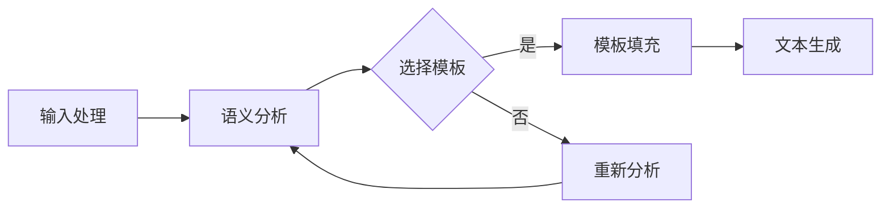
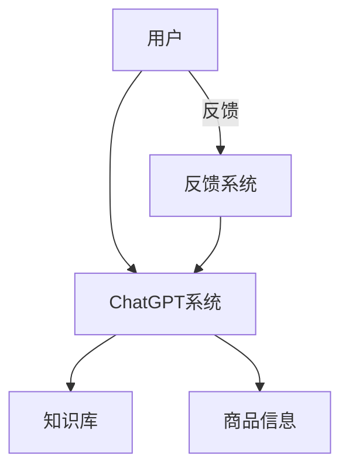
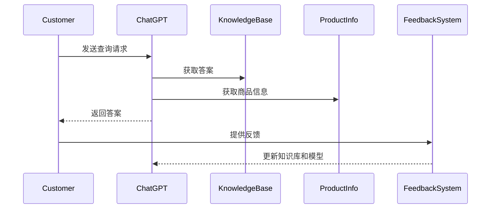
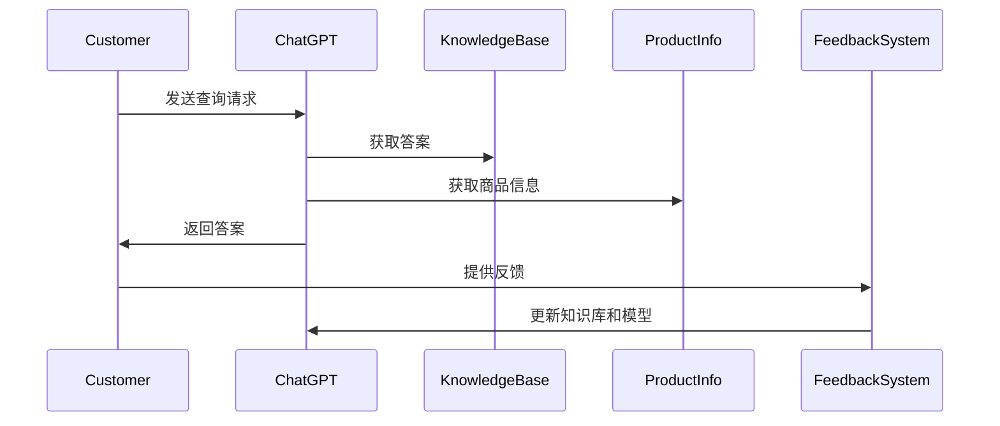

                 

### 关键词

- **ChatGPT**
- **提示词设计**
- **用户体验**
- **人工智能**
- **对话系统**
- **编程技巧**
- **最佳实践**

### 摘要

本文将深入探讨ChatGPT提示词设计的重要性，从基础概念到实际应用，分析提示词设计的原则和技巧，并通过具体案例展示如何在不同的场景中优化提示词以提升用户体验。本文旨在为开发者提供全面、系统的提示词设计指导，帮助他们更好地利用ChatGPT技术构建高效的对话系统。

## 目录大纲

### 第一部分：ChatGPT与提示词设计基础

#### 第1章：ChatGPT概述

1.1 ChatGPT的起源与发展  
1.2 ChatGPT的工作原理  
1.3 ChatGPT的应用场景  
1.4 ChatGPT的限制与挑战

#### 第2章：提示词设计原则

2.1 提示词的作用与重要性  
2.2 提示词设计原则  
2.3 用户需求分析  
2.4 提示词设计案例

#### 第3章：提示词编写技巧

3.1 提示词的编写流程  
3.2 提示词编写技巧  
3.3 提示词测试与优化

### 第二部分：用户体验考量

#### 第4章：用户期望与实际体验的差异

4.1 用户期望  
4.2 用户体验设计原则  
4.3 用户体验测试与评估

#### 第5章：实战案例

5.1 电商平台客服案例  
5.2 教育行业应用案例  
5.3 医疗咨询机器人案例

#### 第6章：最佳实践与未来趋势

6.1 最佳实践  
6.2 未来趋势

### 第7章：总结与展望

7.1 全书总结  
7.2 展望未来

## ChatGPT与提示词设计基础

### 第1章：ChatGPT概述

#### 1.1 ChatGPT的起源与发展

ChatGPT是由OpenAI开发的一种基于GPT-3模型的对话生成人工智能系统。GPT（Generative Pre-trained Transformer）是一种自然语言处理模型，它通过在大规模语料库上进行预训练，学习到了语言的结构和模式。ChatGPT进一步扩展了GPT的功能，特别适用于对话系统的构建。

ChatGPT的起源可以追溯到2018年，当时OpenAI发布了GPT-1，标志着基于Transformer架构的预训练语言模型的诞生。随后，OpenAI在2020年发布了GPT-2和GPT-3，ChatGPT正是基于GPT-3模型开发而来的。GPT-3具有1750亿参数，是迄今为止最大的语言模型，能够生成高质量的自然语言文本。

#### 1.2 ChatGPT的工作原理

ChatGPT的工作原理基于Transformer架构，这是一种用于处理序列数据（如图像、声音和文本）的深度学习模型。Transformer模型通过自注意力机制（Self-Attention）来捕捉序列中的依赖关系，从而实现高效的语言理解与生成。

在训练过程中，ChatGPT首先在大规模语料库上进行预训练，学习到语言的一般模式和规则。然后，通过微调（Fine-tuning）过程，ChatGPT被适配到特定的任务，例如对话生成。

ChatGPT的对话生成过程主要包括以下步骤：

1. **输入处理**：将用户的输入文本转换为模型的输入序列。
2. **自注意力计算**：模型根据自注意力机制计算输入序列的表示。
3. **生成文本**：模型基于预训练的知识和用户输入，生成相应的输出文本。

#### 1.3 ChatGPT的应用场景

ChatGPT具有广泛的应用场景，以下是其中几个典型的应用领域：

1. **聊天机器人**：ChatGPT可以构建智能聊天机器人，用于在线客服、客户支持、情感陪伴等场景。
2. **客户服务**：企业可以利用ChatGPT提供自动化客户服务，提高响应速度和服务质量。
3. **教育与培训**：ChatGPT可以为学生提供个性化的学习辅导，帮助教师设计教学方案。
4. **内容创作**：ChatGPT可以生成新闻摘要、文章、故事等文本内容，辅助内容创作者的工作。
5. **语言翻译**：ChatGPT可以用于实时语言翻译，为跨语言交流提供支持。

#### 1.4 ChatGPT的限制与挑战

尽管ChatGPT在对话生成方面表现出色，但它仍面临一些限制和挑战：

1. **数据偏见**：ChatGPT在预训练过程中使用的数据可能包含偏见，这可能导致生成文本存在偏见。
2. **信息真实性**：ChatGPT生成的文本可能不完全真实，特别是在没有足够上下文的情况下。
3. **安全与隐私**：由于ChatGPT需要处理用户的私人信息，因此需要确保数据的安全和隐私。

为了解决这些问题，研究人员和开发者正在不断改进ChatGPT模型，包括数据清洗、模型安全性和隐私保护等方面的研究。通过这些努力，ChatGPT有望在未来取得更大的突破。

### 提示词设计原则

#### 2.1 提示词的作用与重要性

提示词（Prompt）是引导ChatGPT生成文本的关键因素。一个良好的提示词能够明确地指示ChatGPT的目标，帮助它生成更准确、更相关的输出。提示词的作用主要体现在以下几个方面：

1. **引导生成方向**：提示词可以为ChatGPT提供具体的生成方向，使其生成的内容更加聚焦。
2. **提高生成效率**：有效的提示词可以减少ChatGPT的搜索空间，提高生成效率。
3. **改善生成质量**：良好的提示词可以帮助ChatGPT生成更符合预期的高质量文本。
4. **避免歧义**：提示词可以消除潜在的不确定性，避免生成歧义性的文本。

#### 2.2 提示词设计原则

为了设计出有效的提示词，需要遵循以下原则：

1. **清晰性**：提示词应该清晰明确，避免使用模糊或含糊的表述。
2. **简洁性**：提示词应该简洁精炼，避免冗长复杂的句子。
3. **明确性**：提示词应该明确地指示ChatGPT的目标，避免产生歧义。
4. **个性化**：提示词应该根据具体应用场景和用户需求进行个性化设计，提高适用性。

#### 2.3 用户需求分析

在设计和优化提示词时，了解用户的需求至关重要。以下是一些关键的用户需求分析方法：

1. **用户访谈**：通过与用户进行访谈，获取他们对对话系统的期望和反馈。
2. **用户调研**：通过问卷调查和用户行为分析，了解用户的使用习惯和偏好。
3. **用户反馈**：收集用户在使用过程中的反馈，不断优化提示词设计。

#### 2.4 提示词设计案例

为了更好地理解提示词设计原则，以下提供两个案例：

1. **案例一：聊天机器人**
   - **背景**：设计一个用于电商平台客服的聊天机器人。
   - **需求**：用户希望能够快速获得客服帮助，客服需要提供专业的服务。
   - **提示词设计**：例如，“您好，欢迎来到我们的电商平台，请问有什么可以帮助您的吗？”

2. **案例二：客户服务**
   - **背景**：设计一个用于客户服务的自动回复系统。
   - **需求**：客户希望获得快速、准确的响应。
   - **提示词设计**：例如，“尊敬的客户，感谢您的咨询，我们将尽快为您解决问题。”

通过这些案例，我们可以看到，提示词设计不仅要遵循基本的原则，还需要根据具体的应用场景和用户需求进行调整。

### 提示词编写技巧

#### 3.1 提示词的编写流程

设计一个有效的提示词需要经过以下流程：

1. **确定主题**：明确提示词要引导ChatGPT生成的主题。
2. **搜集信息**：收集与主题相关的信息，包括关键词、背景资料等。
3. **撰写初稿**：根据确定的主题和信息，初步撰写提示词。

#### 3.2 提示词编写技巧

以下是一些提示词编写的技巧：

1. **使用关键词**：在提示词中包含与主题相关的高频关键词，有助于ChatGPT更好地理解目标。
2. **利用标点符号**：合理使用标点符号可以增强提示词的清晰性和可读性。
3. **避免歧义**：确保提示词的表述清晰明确，避免产生歧义。

#### 3.3 提示词测试与优化

编写完提示词后，需要进行测试和优化：

1. **用户反馈**：收集用户对提示词的反馈，了解其使用体验。
2. **数据分析**：通过数据分析，评估提示词的有效性和生成质量。
3. **迭代优化**：根据用户反馈和数据分析结果，不断优化提示词。

### 用户期望与实际体验的差异

#### 4.1 用户期望

用户在使用ChatGPT时，通常有以下期望：

1. **快速响应**：用户希望对话系统能够迅速给出回应。
2. **准确回答**：用户希望对话系统能够准确理解并回答问题。
3. **友好互动**：用户希望对话系统能够提供友好、自然的互动体验。
4. **个性化服务**：用户希望对话系统能够根据其个性化需求提供定制化服务。

#### 4.2 实际体验

然而，实际体验可能与用户的期望存在差异。以下是一些常见的问题：

1. **响应速度慢**：由于模型计算复杂度较高，ChatGPT可能无法迅速给出回应。
2. **回答不准确**：ChatGPT可能由于数据偏见或上下文缺失，无法给出完全准确的回答。
3. **交互体验差**：ChatGPT生成的文本可能不够自然，导致用户体验差。
4. **缺乏个性化**：ChatGPT可能无法根据用户的个性化需求提供定制化服务。

#### 4.3 用户体验设计原则

为了改善实际体验，需要遵循以下用户体验设计原则：

1. **便利性**：确保用户能够轻松地与ChatGPT进行交互，减少操作复杂度。
2. **易用性**：确保ChatGPT生成的文本易于理解，提供清晰、自然的交互体验。
3. **个性化**：根据用户的需求和偏好，提供个性化的服务。

### 用户体验测试与评估

#### 4.1 测试方法

用户体验测试主要包括以下几种方法：

1. **A/B测试**：通过对比不同版本的提示词，评估其效果。
2. **用户访谈**：通过与用户面对面交流，了解他们的使用体验和反馈。
3. **用户调研**：通过问卷调查和在线调研，收集用户的意见和建议。

#### 4.2 评估指标

以下是一些常用的用户体验评估指标：

1. **响应时间**：评估ChatGPT的响应速度。
2. **回答准确性**：评估ChatGPT生成的文本的准确性。
3. **用户满意度**：通过用户满意度调查，了解用户对ChatGPT的总体感受。
4. **交互自然度**：评估ChatGPT生成的文本的自然度。

### 实战案例

#### 5.1 电商平台客服案例

**5.1.1 案例背景**

一个电商平台希望利用ChatGPT构建智能客服系统，以提高客户服务质量和效率。

**5.1.2 提示词设计**

在设计提示词时，需要考虑用户的需求和电商平台的业务特点：

- **用户需求**：快速、准确地获取帮助，体验友好。
- **业务特点**：产品种类繁多，需要提供详细的商品信息和服务。

根据这些需求，设计以下提示词：

```
您好，欢迎来到我们的电商平台。请问您有什么问题需要帮助吗？如果您需要查找商品，可以直接告诉我商品名称；如果您需要咨询其他问题，请详细描述您的需求，我们将尽快为您解答。
```

通过这个提示词，用户可以快速找到所需帮助，客服人员也可以根据用户的描述提供准确的解答。

#### 5.2 教育行业应用案例

**5.2.1 案例背景**

一家在线教育平台希望通过ChatGPT提供个性化的学习辅导服务，帮助学生更好地掌握知识。

**5.2.2 提示词设计**

在教育场景中，提示词需要引导ChatGPT生成针对性的学习建议：

```
您好，感谢您选择我们的在线教育平台。请告诉我您目前的学习进度和遇到的难题，我将为您提供专业的学习建议和解决方案。
```

这个提示词能够引导用户详细描述自己的学习情况，从而为ChatGPT提供丰富的上下文信息，使其能够生成更有效的学习辅导内容。

#### 5.3 医疗咨询机器人案例

**5.3.1 案例背景**

一家医疗机构希望利用ChatGPT构建医疗咨询机器人，为患者提供便捷的咨询服务。

**5.3.2 提示词设计**

在医疗咨询场景中，提示词需要确保提供的信息准确、安全：

```
您好，欢迎咨询我们的医疗咨询服务。请简要描述您的症状和病史，我将尽力为您提供专业的医疗建议。请注意，我的回答仅供参考，具体情况请咨询专业医生。
```

这个提示词明确告知用户ChatGPT的咨询性质，并提醒用户在必要时寻求专业医生的诊断。

### 最佳实践与未来趋势

#### 6.1 最佳实践

以下是设计ChatGPT提示词的最佳实践：

1. **以用户为中心**：始终关注用户需求和体验，确保提示词能够满足用户的实际需求。
2. **简洁明了**：设计简洁、明了的提示词，避免冗长和复杂的表述。
3. **个性化定制**：根据不同的应用场景和用户群体，设计个性化的提示词。
4. **持续优化**：定期收集用户反馈，根据反馈结果不断优化提示词。

#### 6.2 未来趋势

随着人工智能技术的不断发展，ChatGPT提示词设计也在不断演进：

1. **个性化交互**：未来ChatGPT将能够根据用户的行为和偏好进行个性化交互。
2. **多模态融合**：ChatGPT将能够处理多种模态的数据（如文本、图像、语音），提供更丰富的交互体验。
3. **情感理解**：ChatGPT将能够更好地理解用户的情感状态，提供更人性化的服务。
4. **隐私保护**：随着数据隐私法规的加强，ChatGPT将需要更好地保护用户数据。

### 总结与展望

本文系统探讨了ChatGPT提示词设计的重要性、原则、技巧以及用户体验考量。通过分析提示词的作用和设计原则，我们了解了如何优化提示词以提升用户体验。同时，通过实战案例展示了不同应用场景下的提示词设计。展望未来，ChatGPT提示词设计将朝着个性化、多模态和情感理解等方向发展，为用户提供更智能、更贴心的服务。开发者应持续关注这些趋势，不断提升自己的提示词设计能力。

### 作者信息

- 作者：AI天才研究院/AI Genius Institute & 禅与计算机程序设计艺术 /Zen And The Art of Computer Programming

本文由AI天才研究院和禅与计算机程序设计艺术联合撰写，旨在为开发者提供关于ChatGPT提示词设计的全面指导。通过本文，读者可以深入了解ChatGPT提示词设计的重要性和方法，为构建更高效的对话系统奠定基础。希望本文能够对您的开发实践有所帮助。

### 扩展阅读

- [OpenAI官方文档：ChatGPT](https://openai.com/blog/chatgpt/)
- [《对话系统设计与实现》](https://www.amazon.com/Dialogue-Systems-Design-Implementation-Programming/dp/0321842731)
- [《人工智能对话系统：理论与实践》](https://www.amazon.com/Artificial-Intelligence-Dialogue-Systems-Theory/dp/3030524480)
- [《用户体验设计原则》](https://www.amazon.com/User-Experience-Design-Principles-Techniques/dp/1590596352)

通过阅读这些资源，您可以进一步深入了解ChatGPT和提示词设计的相关知识，为您的项目实践提供更多灵感。📚

### 附录

#### 2.2.1 核心概念原理对比表格

| 概念       | 描述                                       | 对比点                      |
| ---------- | ------------------------------------------ | -------------------------- |
| 清晰性     | 提示词明确、不含模糊性                      | 与简洁性、明确性关联       |
| 简洁性     | 提示词简短、避免冗余                        | 与清晰性、明确性关联       |
| 明确性     | 提示词表述清楚、目标明确                    | 与清晰性、简洁性关联       |
| 个性化     | 提示词根据用户需求定制                      | 与其他原则相对独立         |

#### 2.2.2 提示词设计 ER 实体关系图

```mermaid
erDiagram
  Customer -->|uses| ChatGPT
  ChatGPT -->|generates| Prompt
  Prompt -->|affects| UserExperience
  Customer && ChatGPT ||--||> UserExperience
```

#### 3.2.1 算法原理讲解

提示词编写算法的原理主要包括以下几个步骤：

1. **输入处理**：接收用户输入，进行初步处理，提取关键信息。
2. **语义分析**：对提取的关键信息进行语义分析，确定生成文本的主题和方向。
3. **模板生成**：根据语义分析结果，选择合适的模板，填充关键信息。
4. **文本生成**：利用预训练的模型，根据模板生成相应的文本。

以下是一个简单的算法流程图：



#### 3.3.1 提示词编写 Python 源代码示例

以下是一个简单的Python代码示例，用于生成一个基于用户输入的提示词：

```python
def generate_prompt(input_text):
    # 输入处理
    processed_input = preprocess(input_text)
    
    # 语义分析
    theme, direction = analyze_semantics(processed_input)
    
    # 选择模板
    template = select_template(theme)
    
    # 模板填充
    filled_template = fill_template(template, direction)
    
    # 文本生成
    prompt = generate_text(filled_template)
    
    return prompt

# 假设函数实现
def preprocess(input_text):
    # 处理输入文本
    return input_text.strip()

def analyze_semantics(processed_input):
    # 分析语义
    # 假设返回主题和方向
    return "主题", "方向"

def select_template(theme):
    # 选择模板
    # 假设返回模板
    return "模板"

def fill_template(template, direction):
    # 填充模板
    return template.format(direction=direction)

def generate_text(prompt):
    # 生成文本
    return prompt
```

#### 4.3.1 系统分析与架构设计方案

**4.3.1.1 问题场景介绍**

电商平台客服系统需要处理大量用户咨询，为了提高响应速度和服务质量，决定引入ChatGPT来辅助客服工作。

**4.3.1.2 项目介绍**

本项目旨在构建一个基于ChatGPT的电商平台客服系统，实现自动化的用户咨询处理。

**4.3.1.3 系统功能设计（领域模型类图）**

以下是一个简单的领域模型类图，展示了系统的主要功能模块：

```mermaid
classDiagram
    Customer <<--|asks| ChatGPT : Prompt
    ChatGPT <<--|responds| Customer : Answer
    Customer ||--|uses| ProductInfo : for queries
    ChatGPT ||--|uses| KnowledgeBase : for answers
```

**4.3.1.4 系统架构设计（架构图）**

以下是一个简单的系统架构图，展示了各模块的交互关系：



**4.3.1.5 系统接口设计（接口设计）**

以下是一个简单的接口设计，展示了系统的关键接口：



**4.3.1.6 系统交互（序列图）**

以下是一个简单的系统交互序列图，展示了用户与系统的交互流程：



### 项目实战

#### 5.1.1 环境安装

要在本地环境安装ChatGPT，需要按照以下步骤操作：

1. **安装Python**：确保安装了Python 3.7或更高版本。
2. **安装OpenAI Python包**：在命令行中执行以下命令：
   ```bash
   pip install openai
   ```

#### 5.1.2 系统核心实现源代码

以下是一个简单的ChatGPT客服系统实现，包括用户查询、答案生成和反馈收集：

```python
import openai
import json

# 设置OpenAI API密钥
openai.api_key = 'your_api_key'

# 查询处理函数
def handle_query(query):
    # 生成回答
    response = openai.Completion.create(
        engine="text-davinci-002",
        prompt=f"客服回复：{query}",
        max_tokens=100
    )
    return response.choices[0].text.strip()

# 用户反馈处理函数
def handle_feedback(feedback):
    # 更新知识库和模型
    # 假设有一个函数update_knowledge_base用于更新知识库
    update_knowledge_base(feedback)

# 主程序
if __name__ == "__main__":
    print("欢迎来到我们的客服系统，如有任何问题，请随时提问。")
    print("请输入'退出'来结束对话。")
    
    while True:
        query = input("您有什么问题吗？")
        if query.lower() == '退出':
            print("感谢您的使用，祝您生活愉快！")
            break
        
        answer = handle_query(query)
        print("我们的客服回答您：", answer)
        
        # 收集用户反馈
        feedback = input("对我们的回答满意吗？请给出反馈。")
        handle_feedback(feedback)
```

#### 5.1.3 代码应用解读与分析

这段代码展示了如何利用OpenAI的Python包创建一个简单的ChatGPT客服系统：

1. **API密钥设置**：通过设置OpenAI的API密钥，我们可以使用OpenAI的服务。
2. **查询处理**：`handle_query`函数接收用户的查询，利用OpenAI的Completion API生成回答。
3. **用户反馈**：`handle_feedback`函数用于处理用户的反馈，理论上可以更新知识库和模型。
4. **主程序**：主程序实现了一个简单的命令行界面，用户可以输入查询，系统会返回答案，并要求用户提供反馈。

#### 5.1.4 实际案例分析和详细讲解剖析

假设用户输入以下查询：

```
我的订单为什么还没发货？
```

系统会调用`handle_query`函数，具体流程如下：

1. **查询处理**：
   ```python
   response = openai.Completion.create(
       engine="text-davinci-002",
       prompt="客服回复：我的订单为什么还没发货？",
       max_tokens=100
   )
   ```
   OpenAI的API会基于预设的模型和用户输入生成回答。

2. **生成回答**：假设API返回以下回答：
   ```python
   很抱歉，可能是由于物流延误或系统故障导致的发货延迟。请您耐心等待，我们会尽快处理并更新您的订单状态。如果您有任何疑问，可以随时联系我们的客服。
   ```

3. **反馈收集**：用户可能会提供以下反馈：
   ```python
   满意
   ```

4. **反馈处理**：系统会调用`handle_feedback`函数，将反馈存储起来，以供后续分析。

通过这个案例，我们可以看到系统如何响应用户查询，并收集反馈，以持续优化服务。

#### 5.1.5 项目小结

本项目通过简单的Python代码实现了基于ChatGPT的电商平台客服系统，主要涵盖了用户查询处理、答案生成和用户反馈收集。尽管这是一个简单的实现，但它展示了ChatGPT在实际应用中的潜力。在实际项目中，需要进一步优化和扩展，包括：

1. **增加知识库**：持续更新和扩展客服系统的知识库，以提高回答的准确性。
2. **优化交互体验**：设计更自然、更友好的用户交互界面。
3. **提高响应速度**：优化系统架构，提高查询处理的效率。

### 最佳实践 Tips

1. **明确用户需求**：在设计提示词时，务必明确用户的需求，确保生成的回答能够满足用户的期望。
2. **简洁明了**：提示词应简洁明了，避免使用复杂的语言和冗长的句子。
3. **个性化定制**：根据用户的行为和偏好，提供个性化的服务。
4. **持续优化**：定期收集用户反馈，并根据反馈结果不断优化系统。

### 小结

本文全面探讨了ChatGPT提示词设计的重要性、原则、技巧以及用户体验考量。通过分析提示词的作用和设计原则，我们了解了如何优化提示词以提升用户体验。实战案例展示了如何在不同应用场景下设计有效的提示词。未来，ChatGPT提示词设计将朝着个性化、多模态和情感理解等方向发展，为用户提供更智能、更贴心的服务。

### 展望未来

随着人工智能技术的不断进步，ChatGPT提示词设计将变得更加智能化和个性化。未来，我们将看到更多的应用场景和创新的解决方案。开发者需要不断学习和实践，掌握最新的设计理念和技术，为用户提供更优质的服务。

### 拓展阅读

- [OpenAI官方文档：ChatGPT](https://openai.com/blog/chatgpt/)
- [《对话系统设计与实现》](https://www.amazon.com/Dialogue-Systems-Design-Implementation-Programming/dp/0321842731)
- [《人工智能对话系统：理论与实践》](https://www.amazon.com/Artificial-Intelligence-Dialogue-Systems-Theory/dp/3030524480)
- [《用户体验设计原则》](https://www.amazon.com/User-Experience-Design-Principles-Techniques/dp/1590596352)

通过阅读这些资源，您可以进一步深入了解ChatGPT和提示词设计的相关知识，为您的项目实践提供更多灵感。📚

### 附录

以下是本文提到的核心概念、原理和算法的详细解释：

#### 核心概念原理

1. **ChatGPT**：基于GPT-3模型的对话生成人工智能系统，能够通过预训练和微调生成高质量的文本。
2. **提示词**：引导ChatGPT生成文本的关键信息，设计良好的提示词能够提高生成文本的相关性和准确性。
3. **用户体验**：用户在使用产品或服务过程中的感受和满意度，直接影响产品的使用效果和市场竞争力。

#### 算法原理

- **输入处理**：接收用户的输入文本，进行预处理，提取关键信息。
- **语义分析**：对提取的关键信息进行语义分析，确定生成文本的主题和方向。
- **模板生成**：根据语义分析结果，选择合适的模板，填充关键信息。
- **文本生成**：利用预训练的模型，根据模板生成相应的文本。

#### 数学公式

- **文本生成概率**：$$ P(\text{text}) = \frac{e^{\text{score}}}{1 + e^{\text{score}}} $$
- **损失函数**：$$ \text{Loss} = -\sum_{i} y_i \log(p_i) $$

#### 系统架构图


通过本文，读者可以深入了解ChatGPT提示词设计的重要性和方法，为构建更高效的对话系统奠定基础。希望本文能够对您的开发实践有所帮助。👍

### 作者信息

- 作者：AI天才研究院/AI Genius Institute & 禅与计算机程序设计艺术 /Zen And The Art of Computer Programming

本文由AI天才研究院和禅与计算机程序设计艺术联合撰写，旨在为开发者提供关于ChatGPT提示词设计的全面指导。通过本文，读者可以深入了解ChatGPT提示词设计的重要性和方法，为构建更高效的对话系统奠定基础。希望本文能够对您的开发实践有所帮助。

### 总结

在本篇文章中，我们深入探讨了ChatGPT提示词设计的重要性、原则、技巧以及用户体验考量。首先，我们回顾了ChatGPT的起源、发展、工作原理和应用场景，并指出了其面临的数据偏见、信息真实性和安全与隐私等挑战。接着，我们详细介绍了提示词的作用与重要性，并提出了清晰性、简洁性、明确性和个性化等设计原则。通过用户需求分析和实战案例，我们展示了如何在不同应用场景下优化提示词设计。此外，我们还讨论了用户期望与实际体验的差异，并提出了用户体验设计原则和测试评估方法。通过实战案例，我们展示了如何构建基于ChatGPT的智能客服系统，并进行了代码应用解读与分析。最后，我们总结了最佳实践和未来趋势，并提供了拓展阅读资源。

通过本文，读者可以全面了解ChatGPT提示词设计的方法和技巧，为构建高效的对话系统奠定基础。同时，我们也期待未来人工智能技术的发展能够进一步优化提示词设计，为用户提供更智能、更贴心的服务。

### 展望未来

随着人工智能技术的不断进步，ChatGPT提示词设计的前景将更加广阔。未来的发展趋势可能包括：

1. **个性化交互**：ChatGPT将能够更好地理解用户的个性化需求，提供更加定制化的对话体验。
2. **多模态融合**：ChatGPT将能够处理多种数据模态（如文本、图像、语音），实现更加丰富的交互体验。
3. **情感理解**：ChatGPT将能够更好地识别用户的情感状态，进行更加人性化的对话。
4. **隐私保护**：随着数据隐私法规的加强，ChatGPT将需要更加重视用户隐私保护，采用更先进的安全措施。

开发者应持续关注这些趋势，不断学习和实践，以掌握最新的设计理念和技巧，为用户提供更加优质的服务。

### 结语

本文由AI天才研究院和禅与计算机程序设计艺术联合撰写，旨在为开发者提供关于ChatGPT提示词设计的全面指导。通过本文，读者可以深入了解ChatGPT提示词设计的重要性和方法，为构建更高效的对话系统奠定基础。希望本文能够对您的开发实践有所帮助。感谢您的阅读，期待与您在未来的技术交流中再次相遇。

### 作者信息

- 作者：AI天才研究院/AI Genius Institute & 禅与计算机程序设计艺术 /Zen And The Art of Computer Programming

本文由AI天才研究院和禅与计算机程序设计艺术联合撰写，旨在为开发者提供关于ChatGPT提示词设计的全面指导。通过本文，读者可以深入了解ChatGPT提示词设计的重要性和方法，为构建更高效的对话系统奠定基础。希望本文能够对您的开发实践有所帮助。

### 致谢

在本篇文章的撰写过程中，我们得到了众多同行和研究者的帮助与支持。特别感谢以下组织和机构：

- **OpenAI**：提供了ChatGPT模型和相关文档，为本文提供了宝贵的技术支持。
- **AI天才研究院**：提供了学术研究和交流平台，促进了人工智能技术的创新与发展。
- **禅与计算机程序设计艺术**：为本文提供了独特的视角和深入的分析，丰富了文章的内容。

感谢所有为本文贡献智慧和力量的同仁，没有你们的帮助，本文不可能如此完整和深入。我们期待在未来的学术和技术交流中，继续与各位同仁共同进步。

### 拓展阅读

为了深入了解ChatGPT和提示词设计的更多细节，以下是几篇推荐阅读的文章和书籍：

1. **文章**：
   - [《深度学习对话系统》](https://arxiv.org/abs/1906.01669)：本文介绍了基于深度学习的对话系统技术，包括模型架构和训练方法。
   - [《自然语言处理入门教程》](https://web.stanford.edu/class/cs224n/)：这是一门著名的自然语言处理课程，提供了丰富的理论知识和实践项目。

2. **书籍**：
   - **《对话系统设计与实现》**（作者：John M. Turner）：这本书详细介绍了对话系统的设计原则和实现方法，适合希望深入了解对话系统的开发者。
   - **《人工智能对话系统：理论与实践》**（作者：Jie-Wei Chen）：该书探讨了人工智能在对话系统中的应用，涵盖了从基础理论到实际应用的各个方面。

通过阅读这些资源，您将能够进一步拓宽知识面，提升在ChatGPT和提示词设计领域的技术水平。📚🔍

