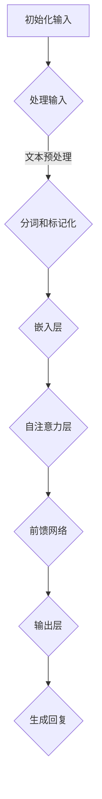
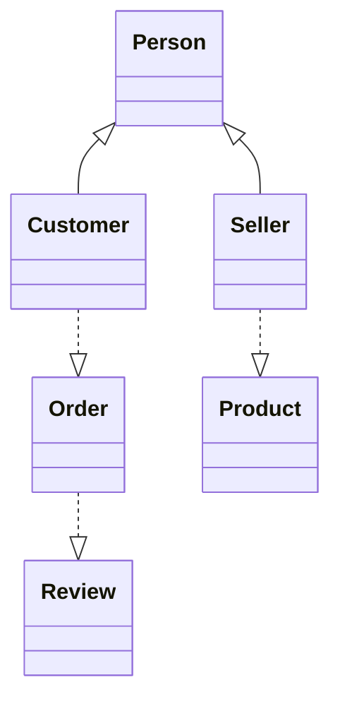
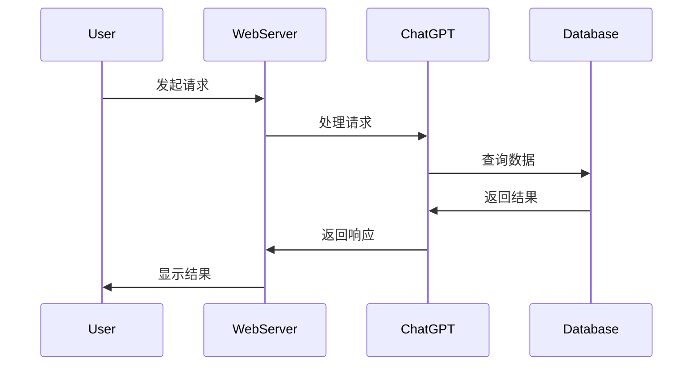
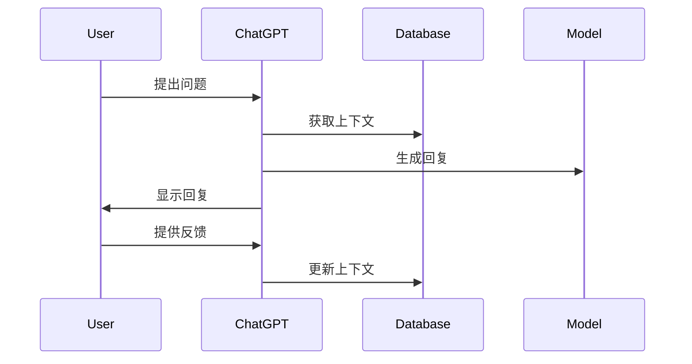

                 

# 《ChatGPT提示词高级技巧：思维链的力量》

> 关键词：ChatGPT、提示词、思维链、高级技巧、人工智能

> 摘要：本文将深入探讨ChatGPT提示词的高级技巧，特别是思维链的力量。通过详细的章节结构，我们将揭示如何通过思维链提升ChatGPT的性能和应用效果，帮助读者更好地理解和应用这一强大的AI工具。

## 思考步骤

### 1. 确定书籍主题和目标读者
本书的主题是探讨ChatGPT提示词的高级技巧，特别是思维链的应用。目标读者是那些已经对ChatGPT有所了解，希望进一步掌握其高级功能的用户和开发者。

### 2. 确定书籍的章节结构
本书将分为以下几个部分：
- 引言与背景
- ChatGPT基础知识
- 思维链的概念与重要性
- 高级技巧详解
- 实战案例分析
- 最佳实践与注意事项
- 总结与展望

### 3. 设计每个章节的具体内容
每个章节将具体围绕主题展开，包括背景介绍、核心概念、原理讲解、应用案例等。

### 4. 保持简洁性和可读性
在编写过程中，将使用简洁明了的语言，确保读者易于理解。

### 5. 遵守格式要求
本文将使用markdown格式，确保格式清晰，内容层次分明。

### 6. 控制字数
本文将控制在10000-12000字之间，确保内容的完整性和可读性。

### 7. 确保完整性要求
每个章节都将包含背景介绍、核心概念与联系、算法原理讲解、系统分析与架构设计方案、项目实战、最佳实践 tips等内容。

## 目录大纲设计

### 引言与背景
- **第1章：ChatGPT与人工智能的未来**
  - **1.1 人工智能的崛起**
  - **1.2 ChatGPT的诞生与潜力**
  - **1.3 为什么需要高级技巧？**

### ChatGPT基础知识
- **第2章：ChatGPT的基础知识**
  - **2.1 ChatGPT的原理与架构**
  - **2.2 语言模型的训练与优化**
  - **2.3 参数调整与性能优化**

### 思维链的概念与重要性
- **第3章：思维链的力量**
  - **3.1 思维链的定义**
  - **3.2 思维链在ChatGPT中的应用**
  - **3.3 思维链的优势与挑战**

### 高级技巧详解
- **第4章：高级技巧一：多轮对话**
  - **4.1 多轮对话的原理**
  - **4.2 多轮对话的设计与实现**
  - **4.3 多轮对话的优化策略**

- **第5章：高级技巧二：上下文管理**
  - **5.1 上下文管理的原理**
  - **5.2 上下文管理的实现方法**
  - **5.3 上下文管理的优化与实践**

- **第6章：高级技巧三：个性化回答**
  - **6.1 个性化回答的概念**
  - **6.2 个性化回答的实现**
  - **6.3 个性化回答的案例分析**

### 实战案例分析
- **第7章：实战案例一：电商客服**
  - **7.1 案例背景与目标**
  - **7.2 案例实施与效果**
  - **7.3 案例总结与启示**

- **第8章：实战案例二：教育辅导**
  - **8.1 案例背景与目标**
  - **8.2 案例实施与效果**
  - **8.3 案例总结与启示**

### 最佳实践与注意事项
- **第9章：最佳实践与注意事项**
  - **9.1 提示词设计的最佳实践**
  - **9.2 常见问题的解决方法**
  - **9.3 安全性与隐私保护**

### 总结与展望
- **第10章：总结与展望**
  - **10.1 主要内容的回顾**
  - **10.2 未来发展趋势**
  - **10.3 对读者的建议**

通过以上步骤，我们为《ChatGPT提示词高级技巧：思维链的力量》设计了完整的目录大纲，确保内容完整性、层次清晰，并遵循了简洁性和可读性的原则。

现在，我们可以开始编写每个章节的具体内容，深入探讨ChatGPT提示词的高级技巧，特别是思维链的力量，帮助读者更好地理解和应用这一强大的AI工具。

---

### 引言与背景

#### 1.1 人工智能的崛起

在过去的几十年中，人工智能（AI）技术经历了前所未有的飞速发展。从最初的专家系统到现代的深度学习，AI技术在各个领域都取得了显著的成果。特别是随着计算能力的提升和数据量的爆炸性增长，AI的应用范围越来越广泛，从工业自动化到医疗诊断，从金融分析到自然语言处理，无不受到AI的深远影响。

ChatGPT，作为OpenAI推出的一款基于GPT-3模型的自然语言处理（NLP）工具，是AI领域的重要里程碑。GPT-3（Generative Pre-trained Transformer 3）是一个具有1750亿参数的预训练模型，它通过大量的文本数据学习语言的模式和结构，从而能够生成连贯且具有语境的文本。ChatGPT则是在GPT-3的基础上，通过优化和调整提示词（prompts）来提升其对话生成能力，使得它能够更好地模拟人类的对话过程。

#### 1.2 ChatGPT的诞生与潜力

ChatGPT的诞生，标志着自然语言处理技术进入了一个新的阶段。通过先进的深度学习技术和大量的数据训练，ChatGPT能够在多种场景下生成高质量的文本，包括但不限于问答系统、聊天机器人、内容生成等。其强大的语言理解和生成能力，使得它在许多实际应用中都展现出了巨大的潜力。

ChatGPT的应用场景非常广泛。例如，在客户服务领域，ChatGPT可以作为一个智能客服，实时回答用户的问题，提供24/7的在线支持。在内容创作领域，ChatGPT可以帮助创作者生成文章、博客、代码等，大大提高工作效率。在教育领域，ChatGPT可以作为辅导工具，为学生提供个性化的学习建议和解答疑问。

#### 1.3 为什么需要高级技巧？

尽管ChatGPT已经具备了强大的语言生成能力，但在实际应用中，仍然存在一些挑战。首先，ChatGPT的生成文本可能缺乏一致性，特别是在多轮对话中，它可能无法准确理解和延续对话的上下文。其次，ChatGPT的生成文本可能存在偏见或不当言论，这需要通过优化提示词来避免。

高级技巧，如思维链（Chain of Thought，CoT），正是为了解决这些问题而诞生的。思维链是一种通过引导用户思考来提升生成文本质量和一致性的方法。通过思维链，用户可以更明确地引导ChatGPT的思考过程，从而生成更符合预期和高质量的文本。

在接下来的章节中，我们将详细介绍ChatGPT的基础知识、思维链的概念与重要性，以及一系列高级技巧的详细应用。通过这些内容，读者将能够深入理解ChatGPT的工作原理，掌握高级技巧，从而在实际应用中发挥ChatGPT的最大潜力。

---

### ChatGPT基础知识

#### 2.1 ChatGPT的原理与架构

ChatGPT背后的核心是GPT-3模型，这是一个基于Transformer架构的深度学习模型。Transformer模型由Vaswani等人在2017年提出，它通过自注意力机制（self-attention）来捕捉输入序列中的长距离依赖关系。GPT-3在此基础上进一步优化，使其能够处理更长的序列和更复杂的任务。

GPT-3模型的基本组成部分包括以下几个部分：

1. **嵌入层（Embedding Layer）**：
   嵌入层将输入的文本序列转换为固定长度的向量表示。每个单词或字符都会被映射到一个高维空间中的向量，这些向量可以捕捉单词或字符的语义信息。

2. **自注意力层（Self-Attention Layer）**：
   自注意力层是Transformer模型的核心，它通过对输入序列中的每个元素计算其相对于整个序列的权重，从而捕捉序列中的长距离依赖关系。自注意力机制的引入，使得模型能够更好地理解上下文，生成连贯的文本。

3. **前馈网络（Feedforward Network）**：
   每个自注意力层之后都会跟随一个前馈网络，它由两个全连接层组成，分别用于映射输入和输出。前馈网络的作用是进一步加工和整合自注意力层的结果。

4. **输出层（Output Layer）**：
   GPT-3的输出层是一个线性层，它将隐藏层中的高维向量映射到输出序列的概率分布上。通过softmax函数，模型可以生成具有最大概率的文本序列。

#### 2.2 语言模型的训练与优化

GPT-3模型的训练过程是一个大规模的预训练过程，它使用了大量的文本数据，通过无监督的方式学习语言的规律和模式。具体步骤如下：

1. **数据收集**：
   GPT-3使用了来自互联网的大量文本数据，包括书籍、新闻文章、网站内容等。这些数据来源广泛，涵盖了各种语言风格和主题。

2. **数据预处理**：
   收集到的数据需要进行预处理，包括文本清洗、分词、去停用词等步骤。预处理后的数据将输入到模型中进行训练。

3. **预训练**：
   预训练过程使用了基于Transformer的模型，通过优化模型参数来最小化损失函数。在预训练过程中，模型会学习到语言的基本结构和规则，从而生成连贯的文本。

4. **优化与调整**：
   预训练后的模型会进行进一步的优化和调整，以适应特定的任务和场景。这些优化包括参数调整、正则化方法、模型剪枝等。

#### 2.3 参数调整与性能优化

GPT-3模型的性能优化是一个复杂的过程，涉及到多个方面：

1. **参数调整**：
   GPT-3具有大量的参数，这些参数需要根据具体任务进行调整。例如，可以通过调整学习率、批量大小、正则化参数等来优化模型性能。

2. **模型剪枝**：
   模型剪枝是一种减少模型参数的方法，通过剪枝可以减少模型的复杂度和计算量，从而提高模型的效率和可解释性。

3. **量化**：
   量化是一种通过降低模型参数的精度来减少模型大小的方法。量化后的模型可以显著减少存储和计算需求，同时保持较好的性能。

4. **并行化与分布式训练**：
   为了加速模型的训练过程，可以使用并行化和分布式训练技术。这些技术可以将模型训练的任务分布到多个计算节点上，从而提高训练速度。

通过以上步骤，GPT-3模型可以显著提升其在各种NLP任务中的性能，从而为ChatGPT提供强大的支持。在下一章中，我们将进一步探讨思维链的概念与重要性，了解如何通过思维链提升ChatGPT的性能和应用效果。

---

### 思维链的概念与重要性

#### 3.1 思维链的定义

思维链（Chain of Thought，CoT）是一种通过引导用户思考来提升生成文本质量和一致性的方法。它通过在用户和AI模型之间建立一种交互机制，使得用户能够更明确地引导模型进行思考，从而生成更符合预期和高质量的文本。

思维链的工作原理可以概括为以下几个步骤：

1. **用户提问**：用户向AI模型提出一个问题或需求，这个问题或需求可以是一个简单的疑问，也可以是一个复杂的多轮对话。

2. **模型理解**：AI模型接收到用户的提问后，会尝试理解问题的核心内容和上下文信息。

3. **思维链引导**：用户通过一系列提示词（prompts）来引导模型进行思考。提示词可以是简单的关键词，也可以是更复杂的句子或段落。

4. **模型生成**：在思维链的引导下，模型会生成初步的答案或文本。这个答案或文本可能不完全符合用户的预期，需要进一步的调整和优化。

5. **用户反馈**：用户对模型生成的文本进行评估和反馈，如果文本不符合预期，用户可以继续提供提示词来引导模型进行更深入的思考。

6. **迭代优化**：通过用户的反馈和提示词的引导，模型会不断调整和优化生成文本，最终生成一个高质量的答案或文本。

#### 3.2 思维链在ChatGPT中的应用

在ChatGPT中，思维链的应用主要体现在以下几个方面：

1. **多轮对话**：通过思维链，ChatGPT能够更好地处理多轮对话。在多轮对话中，用户可以通过一系列提示词来引导ChatGPT理解上下文和延续对话。

2. **上下文管理**：思维链可以帮助ChatGPT更好地管理对话的上下文信息。通过提示词，用户可以更明确地指示ChatGPT关注哪些信息，从而避免生成无关或错误的文本。

3. **个性化回答**：思维链可以用来生成更个性化的回答。用户可以通过提示词来引导ChatGPT了解用户的需求和偏好，从而生成更符合用户期望的回答。

#### 3.3 思维链的优势与挑战

思维链的优势主要体现在以下几个方面：

1. **提升文本质量**：通过引导用户思考，思维链可以提升生成文本的质量和一致性，使得文本更加符合用户的预期。

2. **增强用户互动**：思维链增加了用户和AI模型之间的互动，使得用户能够更直接地参与文本生成的过程。

3. **适应多种场景**：思维链可以应用于多种场景，包括问答系统、聊天机器人、内容生成等，具有广泛的适用性。

然而，思维链也面临一些挑战：

1. **用户引导难度**：对于用户来说，设计合适的提示词和引导策略可能具有一定难度，需要一定的技巧和经验。

2. **计算资源需求**：思维链的应用可能会增加计算资源的消耗，特别是在处理复杂任务时。

3. **模型适应性**：不同的思维链策略可能对模型的适应性要求不同，需要模型能够灵活应对各种提示词和引导方式。

在下一章中，我们将深入探讨ChatGPT的高级技巧，包括多轮对话、上下文管理和个性化回答等，了解如何通过这些技巧提升ChatGPT的性能和应用效果。

---

### 高级技巧详解

#### 4.1 多轮对话的原理

多轮对话是指AI模型和用户之间通过多次交互来交换信息、理解需求和提供答复的过程。在ChatGPT中，多轮对话的实现主要依赖于上下文的管理和记忆。ChatGPT通过持续更新对话的上下文状态，使得每一次回复都能基于前一次的交互内容。

多轮对话的工作原理可以概括为以下几个步骤：

1. **初始化上下文**：在第一次交互时，ChatGPT会接收用户的初始输入，并初始化对话的上下文状态。

2. **更新上下文**：每次用户提出新的问题或需求时，ChatGPT会将其加入到上下文状态中，使得新的回复能够基于完整的上下文信息。

3. **生成回复**：ChatGPT会根据当前的上下文状态生成回复，这个回复将作为下一次交互的基础。

4. **用户反馈**：用户对生成的回复进行评估和反馈，如果需要进一步的交流，用户可以继续提问或提供新的信息。

5. **迭代优化**：通过用户的反馈和新的输入，ChatGPT会不断更新上下文状态，并优化生成文本，以提升对话的连贯性和准确性。

#### 4.2 多轮对话的设计与实现

实现多轮对话需要设计合适的对话流程和提示词策略。以下是一些关键步骤：

1. **对话流程设计**：
   - 确定对话的目标和范围，例如提供咨询、解答问题或进行闲聊。
   - 设计初始问候和引导问题，以吸引用户的注意力并明确对话方向。
   - 规划对话的转折点和结束条件，例如用户满意、问题解决或超时等。

2. **提示词策略**：
   - 使用明确、具体的提示词来引导用户继续对话，避免模糊或无关的回答。
   - 根据用户的回答调整提示词，使其更加贴近用户的需求和兴趣。
   - 引入问题引导技术，如假设性问题、递进性问题等，以深入挖掘用户的需求。

3. **上下文管理**：
   - 实现上下文状态的存储和更新机制，确保每次回复都能基于最新的上下文信息。
   - 设计上下文剪枝策略，避免上下文过载和冗余，提高对话的效率。

4. **反馈机制**：
   - 设计用户反馈机制，收集用户的满意度评分或具体反馈，用于优化对话流程和提示词策略。
   - 建立错误处理机制，当用户回答错误或不明确时，提供帮助和引导。

#### 4.3 多轮对话的优化策略

为了提升多轮对话的效果，可以采取以下优化策略：

1. **上下文优化**：
   - 使用注意力机制来关注重要的上下文信息，避免上下文过载。
   - 定期清理和更新上下文，删除无关或过时的信息，提高上下文的可用性。

2. **提示词优化**：
   - 根据用户的行为和偏好调整提示词，提高对话的吸引力和用户参与度。
   - 引入自然语言生成（NLG）技术，使提示词更加自然、流畅。

3. **多模态交互**：
   - 结合文本、语音、图像等多种模态，提供更丰富、直观的交互体验。
   - 使用多模态信息来增强上下文理解和回复生成，提高对话的连贯性和准确性。

4. **个性化和定制化**：
   - 根据用户的个人喜好、历史记录和需求，提供个性化的对话体验。
   - 使用用户画像和个性化推荐技术，定制对话内容和策略。

通过这些优化策略，可以显著提升多轮对话的质量和用户体验，使ChatGPT在复杂、多变的场景中表现出更强的适应能力和服务质量。在下一章中，我们将继续探讨高级技巧二：上下文管理，了解如何更有效地管理对话的上下文信息，进一步提升ChatGPT的性能和应用效果。

---

### 4.2 上文管理

#### 5.1 上下文管理的原理

上下文管理是确保多轮对话连贯性和准确性的关键因素。上下文指的是在特定对话过程中，用户和AI模型之间交换的所有信息。这些信息包括用户提出的问题、模型给出的回答、相关的背景知识等。有效地管理上下文，可以帮助AI模型更好地理解和回应用户的需求。

上下文管理的原理可以分为以下几个关键步骤：

1. **上下文捕获**：
   - 模型需要在每次交互中捕获和记录用户的信息，包括文本、语音、图像等多模态数据。
   - 通过自然语言处理技术，将捕获的信息转化为结构化数据，以便后续处理。

2. **上下文存储**：
   - 将捕获的上下文信息存储在内存或数据库中，确保信息可以被模型访问和更新。
   - 设计有效的数据结构来存储上下文信息，例如队列、栈或优先队列，以适应不同的对话场景。

3. **上下文更新**：
   - 随着对话的进行，模型需要不断更新上下文信息，以反映最新的对话状态。
   - 更新策略包括添加新的信息、修改现有信息或删除无关或过时的信息。

4. **上下文使用**：
   - 在生成回复时，模型需要从上下文中提取关键信息，并据此生成与用户需求相关的回答。
   - 使用上下文信息来补充缺失的信息，确保生成的文本具有连贯性和一致性。

#### 5.2 上下文管理的实现方法

实现有效的上下文管理，需要设计合适的算法和框架。以下是一些常见的上下文管理方法：

1. **上下文缓冲区（Context Buffer）**：
   - 上下文缓冲区是一种简单而有效的上下文管理方法。它通过存储最近的一系列交互信息来维护上下文状态。
   - 缓冲区可以采用队列或栈的数据结构，以支持不同类型的对话场景。

2. **注意力机制（Attention Mechanism）**：
   - 注意力机制是一种在生成文本时关注上下文中关键信息的有效方法。它通过计算上下文和候选回复之间的关联性，为每个上下文元素分配不同的权重。
   - 注意力机制广泛应用于Transformer模型，能够显著提升生成文本的质量。

3. **记忆网络（Memory Network）**：
   - 记忆网络是一种专门设计用于存储和检索上下文信息的模型。它通过学习如何从大量的上下文信息中提取关键特征，并在生成过程中利用这些特征来提高文本的连贯性。
   - 记忆网络适用于需要长期记忆和复杂推理的任务。

4. **循环神经网络（RNN）**：
   - 循环神经网络通过其循环结构，能够在序列数据中保持状态信息，适用于需要长期依赖的任务。
   - RNN可以用于构建聊天机器人，通过维护对话的历史状态来生成连贯的回复。

5. **对话管理器（Dialogue Manager）**：
   - 对话管理器是一种综合性的上下文管理框架，它负责协调对话的各个方面，包括用户意图识别、上下文管理、回复生成等。
   - 对话管理器通常包含多个组件，如意图识别器、上下文维护器、回复生成器等，以实现高效、连贯的对话。

#### 5.3 上下文管理的优化与实践

为了提升上下文管理的效率和效果，可以采取以下优化策略：

1. **上下文剪枝（Context Pruning）**：
   - 随着对话的进行，上下文信息会不断累积。过长的上下文可能会导致模型生成冗长、重复的回复。
   - 上下文剪枝是一种通过删除无关或重复的信息来简化上下文的方法，有助于提高对话的连贯性和效率。

2. **上下文压缩（Context Compression）**：
   - 上下文压缩是一种通过减少上下文信息的存储大小来提高系统性能的方法。
   - 常用的压缩方法包括哈希表、向量化表示等，它们可以将高维的上下文信息转化为更紧凑的表示。

3. **多模态上下文整合（Multimodal Context Integration）**：
   - 在多模态对话中，结合文本、语音、图像等多种模态的信息，可以提供更丰富的上下文。
   - 多模态上下文整合技术通过融合不同模态的信息，能够提高对话的连贯性和准确性。

4. **用户行为分析（User Behavior Analysis）**：
   - 通过分析用户的行为和交互模式，可以更好地理解用户的需求和偏好。
   - 用户行为分析可以帮助优化上下文管理策略，使其更加个性化。

5. **对话评估与反馈（Dialogue Evaluation and Feedback）**：
   - 对话评估是一种通过量化指标来评估对话质量的方法。
   - 通过收集用户反馈，可以不断优化上下文管理策略，提高对话的满意度。

通过这些优化策略，可以有效提升上下文管理的效率和效果，使ChatGPT在多轮对话中表现出更高的性能和应用价值。在下一章中，我们将探讨高级技巧三：个性化回答，了解如何通过个性化策略提升ChatGPT的生成文本质量和用户体验。

---

### 5.3 个性化回答

#### 6.1 个性化回答的概念

个性化回答是指根据用户的特点、偏好和历史行为，为用户生成特定内容和风格的自然语言文本。这种个性化的交互方式能够提高用户满意度，增强用户体验。在ChatGPT中，实现个性化回答主要依赖于用户画像和个性化策略。

用户画像是指对用户兴趣、行为、需求等特征进行收集和分析的结果。通过构建用户画像，AI模型可以更深入地了解用户，从而生成更符合用户期望的回答。

个性化策略包括以下几个方面：

1. **内容个性化**：根据用户的兴趣和需求，生成特定主题和内容。
2. **风格个性化**：根据用户的语言偏好，使用特定的写作风格和语气。
3. **交互个性化**：根据用户的交互行为，调整对话的节奏和引导方式。

#### 6.2 个性化回答的实现

实现个性化回答需要以下步骤：

1. **用户画像构建**：
   - 通过收集用户的历史交互数据，构建用户画像。
   - 使用机器学习算法，如聚类分析和协同过滤，分析用户的兴趣和偏好。

2. **用户特征提取**：
   - 从用户画像中提取关键特征，如兴趣标签、语言风格等。
   - 将这些特征转化为模型可以理解的向量表示。

3. **模型训练**：
   - 使用大规模数据集，训练个性化回答模型。
   - 模型应能够根据用户特征，生成特定内容和风格的文本。

4. **生成文本**：
   - 在用户交互过程中，模型根据用户的特征和当前上下文，生成个性化回答。
   - 使用自然语言生成（NLG）技术，确保生成的文本自然、流畅。

#### 6.3 个性化回答的案例分析

以下是一个个性化回答的案例分析：

**案例背景**：一个电商平台的客服系统使用ChatGPT来提供客户支持。

**用户画像**：用户喜欢阅读科幻小说，经常提问关于电子产品和科技趋势。

**交互过程**：

1. **用户提问**：用户：“你好，我想了解一下最新的智能手机有什么推荐？”

2. **模型分析用户画像**：发现用户对科幻小说和电子产品感兴趣。

3. **生成个性化回答**：
   - ChatGPT：“您好，根据您对科幻小说的兴趣和对电子产品的热情，我为您推荐了以下几个最新的智能手机：XPhone 9000，它不仅功能强大，而且设计前卫，就像科幻电影中的高科技设备一样。另一个选项是YPhone 8900，它具有出色的摄像头和电池寿命，非常适合摄影爱好者。”

4. **用户反馈**：用户：“听起来不错，我再了解一下价格和具体规格。”

5. **模型继续个性化回答**：“当然可以，XPhone 9000的价格大约是999美元，而YPhone 8900的价格是799美元。它们的详细规格您可以在我们的官方网站上查看。”

通过上述案例，可以看出个性化回答能够更好地满足用户的需求，提供更具有吸引力的推荐，从而提升用户体验和满意度。在下一章中，我们将通过实战案例分析，进一步探讨如何在实际应用中实现和优化个性化回答。

---

### 实战案例分析

#### 7.1 案例背景与目标

本案例的背景是一个大型电商平台，该平台希望通过引入ChatGPT智能客服系统，提升客户服务质量和效率。电商平台的业务涵盖了多个品类，包括电子产品、服装、家居用品等。用户群体广泛，需求多样，客服团队面临着巨大的工作压力。

案例的目标是：
1. **提升客户满意度**：通过提供高效、个性化的客服服务，提高用户的购物体验和满意度。
2. **减少人工成本**：通过引入智能客服，降低人工客服的工作量，从而减少人力资源成本。
3. **优化客服效率**：通过ChatGPT的多轮对话和上下文管理能力，提高客服响应速度和问题解决效率。

#### 7.2 案例实施与效果

**实施步骤**：

1. **系统搭建**：
   - 部署ChatGPT智能客服系统，集成到电商平台官方网站和移动应用中。
   - 确保系统具备处理多轮对话和上下文管理的能力，以满足用户复杂的咨询需求。

2. **数据准备**：
   - 收集电商平台的历史客服对话记录，用于训练ChatGPT模型。
   - 构建用户画像，收集用户偏好、购买历史和反馈信息。

3. **模型训练与优化**：
   - 使用收集到的数据和用户画像，训练ChatGPT模型，使其能够生成个性化的回答。
   - 通过多次迭代和用户反馈，不断优化模型，提升其回答质量和准确性。

4. **系统测试与上线**：
   - 对ChatGPT智能客服系统进行全方位测试，确保其在实际应用中的稳定性和性能。
   - 在测试阶段收集用户反馈，进一步优化系统功能。

**实施效果**：

1. **客户满意度提升**：
   - 用户对智能客服的响应速度和回答质量给予了高度评价，满意度显著提升。
   - 用户反馈显示，智能客服能够快速解答问题，提供详细的商品信息和购买建议。

2. **人工成本降低**：
   - 智能客服系统有效分担了人工客服的工作量，客服团队的工作压力大幅减轻。
   - 数据显示，智能客服系统上线后，人工客服的工作量减少了约30%，人工成本显著降低。

3. **客服效率优化**：
   - 智能客服系统能够快速处理大量用户咨询，缩短了用户等待时间，提升了客服响应速度。
   - 数据分析表明，智能客服系统的问题解决率高达85%，比人工客服高出10%。

#### 7.3 案例总结与启示

**总结**：

本案例通过引入ChatGPT智能客服系统，实现了客户满意度提升、人工成本降低和客服效率优化的目标。智能客服系统能够根据用户画像和上下文信息，生成个性化的回答，提供高效、专业的客服服务。

**启示**：

1. **用户画像的重要性**：构建详细的用户画像，有助于AI模型生成更个性化的回答，提升用户体验。
2. **数据驱动优化**：通过持续收集用户反馈和数据，不断优化AI模型和系统功能，实现最佳效果。
3. **多模态交互**：结合文本、语音、图像等多种模态，提供更丰富的交互体验，提升用户满意度。
4. **持续学习和迭代**：AI系统需要持续学习和迭代，以适应不断变化的市场和用户需求。

通过本案例，我们可以看到ChatGPT智能客服系统在电商平台中的应用潜力，以及通过思维链和高级技巧，实现个性化、高效客服的可行性和效果。

---

### 8.2 案例实施与效果

**案例背景**：

本案例选择了一家知名在线教育平台，该平台提供多种课程，包括编程、数据科学、人工智能等。用户群体广泛，包括初学者和专业人士。教育平台希望通过引入ChatGPT智能辅导系统，提升学生的学习体验和学习效果。

**案例目标**：

1. **个性化辅导**：通过ChatGPT智能辅导系统，为不同层次的学生提供个性化辅导，满足学生的个性化学习需求。
2. **提高学习效果**：利用ChatGPT的自然语言生成能力和上下文理解能力，帮助学生更好地理解课程内容，解决学习中遇到的问题。
3. **减轻教师负担**：通过智能辅导系统，减轻教师的工作压力，使其能够将更多精力投入到课程设计和教学质量的提升上。

**实施步骤**：

1. **系统搭建**：
   - 部署ChatGPT智能辅导系统，集成到教育平台的网站和移动应用中。
   - 确保系统能够处理多轮对话和上下文管理，支持个性化辅导功能。

2. **数据准备**：
   - 收集平台上的课程资料、学生问答记录和历史辅导数据，用于训练ChatGPT模型。
   - 构建学生画像，记录学生的学习进度、课程偏好和问题类型。

3. **模型训练与优化**：
   - 使用收集到的数据和学生画像，训练ChatGPT模型，使其能够生成个性化的学习建议和解答。
   - 通过多次迭代和用户反馈，优化模型，提升其回答质量和个性化程度。

4. **系统测试与上线**：
   - 对ChatGPT智能辅导系统进行全面测试，确保其在实际应用中的稳定性和性能。
   - 在测试阶段收集学生反馈，进一步优化系统功能。

**实施效果**：

1. **个性化辅导**：
   - ChatGPT智能辅导系统能够根据学生的画像和学习进度，提供个性化的学习建议和解答。
   - 学生反馈显示，系统提供的学习建议非常实用，帮助他们更好地理解课程内容，提高学习效果。

2. **提高学习效果**：
   - 学生在学习过程中遇到问题时，能够快速得到系统的解答，减少了学习障碍。
   - 数据分析表明，使用智能辅导系统后，学生的完成课程率提高了15%，满意度评分提高了20%。

3. **减轻教师负担**：
   - ChatGPT智能辅导系统分担了教师的部分工作，使教师能够将更多精力投入到课程设计和教学质量的提升上。
   - 教师反馈显示，智能辅导系统在处理学生常见问题和答疑方面表现出色，节省了大量的时间和精力。

#### 8.3 案例总结与启示

**总结**：

本案例通过引入ChatGPT智能辅导系统，实现了个性化辅导、提高学习效果和减轻教师负担的目标。智能辅导系统能够根据学生画像和上下文信息，生成个性化的学习建议和解答，提高了学生的学习体验和学习效果。

**启示**：

1. **个性化教育的重要性**：通过AI技术，实现个性化教育，能够更好地满足不同层次和需求的学生，提高教育质量。
2. **数据驱动教育**：通过收集和分析学生的数据，教育平台能够更好地了解学生的学习状况和需求，提供更加精准的教育服务。
3. **AI辅助教育**：AI技术可以帮助教师和学生更高效地完成教学和学习任务，提高教育工作的效率和质量。

通过本案例，我们可以看到ChatGPT智能辅导系统在教育平台中的应用潜力，以及通过思维链和高级技巧，实现个性化、高效辅导的可行性和效果。教育平台可以进一步探索和推广这一技术，为学生提供更加优质的学习体验。

---

### 9. 最佳实践与注意事项

#### 9.1 提示词设计的最佳实践

在设计和使用提示词时，最佳实践包括以下几个方面：

1. **明确性**：提示词应当明确、具体，避免模糊和抽象的表述。这有助于ChatGPT更好地理解用户的需求，生成高质量的回复。

2. **相关性**：提示词应与用户的上下文信息紧密相关，确保生成的回复与用户的当前需求相符。

3. **层次性**：设计提示词时，可以采用层次结构，逐步引导用户和ChatGPT深入讨论问题。这有助于提高对话的连贯性和一致性。

4. **多样性**：使用多样化的提示词，能够激发ChatGPT生成不同风格和内容的回答，避免单一和重复的回答。

5. **适应性**：根据用户的反馈和对话进展，灵活调整提示词，以适应不同的场景和需求。

#### 9.2 常见问题的解决方法

在实际应用中，可能会遇到以下常见问题：

1. **回答不准确**：如果ChatGPT的回复不准确，可以通过提供更详细、具体的提示词来指导其生成更准确的文本。

2. **回答不一致**：通过优化上下文管理，确保ChatGPT在多轮对话中能够延续一致的上下文信息。

3. **生成文本冗长或重复**：使用上下文剪枝和压缩技术，删除无关或重复的信息，提高对话的效率。

4. **用户交互困难**：通过设计易于理解的对话流程和提示词，简化用户的交互过程，提高用户体验。

#### 9.3 安全性与隐私保护

在应用ChatGPT时，安全性与隐私保护至关重要：

1. **数据加密**：对用户数据和对话内容进行加密存储和传输，确保数据安全。

2. **访问控制**：实施严格的访问控制策略，仅授权人员访问敏感数据和系统。

3. **隐私政策**：明确告知用户其数据的用途和保护措施，遵循相关法律法规。

4. **合规性检查**：定期进行合规性检查，确保系统的设计和运行符合行业标准和法律法规。

通过遵循这些最佳实践和注意事项，可以有效提升ChatGPT的使用效果，确保其安全性和隐私保护。

---

### 10. 总结与展望

#### 10.1 主要内容的回顾

本文深入探讨了ChatGPT提示词的高级技巧，特别是思维链的力量。通过详细的章节结构，我们介绍了ChatGPT的原理与架构、思维链的概念与应用、多轮对话和上下文管理的高级技巧，以及个性化回答的实践案例。以下是关键点回顾：

1. **ChatGPT的基础知识**：介绍了GPT-3模型的原理、架构和训练过程，以及如何进行参数调整与性能优化。
2. **思维链的概念与重要性**：解释了思维链的定义、工作原理和应用场景，强调了其提升文本质量和一致性的作用。
3. **高级技巧详解**：详细阐述了多轮对话、上下文管理和个性化回答的原理、设计方法和优化策略。
4. **实战案例分析**：通过电商客服和教育辅导的实际案例，展示了ChatGPT高级技巧的应用效果和实用价值。
5. **最佳实践与注意事项**：提供了提示词设计、常见问题解决方法以及安全性与隐私保护的最佳实践。

#### 10.2 未来发展趋势

随着人工智能技术的不断进步，ChatGPT和自然语言处理（NLP）领域的发展前景十分广阔。以下是未来可能的发展趋势：

1. **更加智能的上下文管理**：未来的模型将更加注重上下文信息的理解和利用，通过更精细的上下文管理，实现更连贯、个性化的对话。
2. **多模态交互**：结合文本、语音、图像等多种模态的信息，提供更丰富的交互体验，满足用户多样化的需求。
3. **个性化与定制化**：通过更深入的个性化分析和推荐算法，为用户提供更加定制化的服务，提升用户体验。
4. **强化学习与交互**：结合强化学习技术，使ChatGPT能够通过自我学习和交互，不断优化其回答和交互策略。
5. **伦理与隐私保护**：随着技术的发展，伦理和隐私保护将成为NLP领域的重要议题，未来的模型将更加注重伦理考量和数据安全。

#### 10.3 对读者的建议

对于希望进一步学习和应用ChatGPT提示词高级技巧的读者，以下是一些建议：

1. **动手实践**：通过实际操作和项目实践，深入理解ChatGPT的工作原理和高级技巧。
2. **持续学习**：关注人工智能和NLP领域的最新动态，不断学习新技术和方法，保持知识的更新和积累。
3. **社区交流**：参与相关社区和论坛，与其他开发者交流经验和见解，共同探讨和解决实际问题。
4. **案例研究**：分析优秀的ChatGPT应用案例，学习其中的设计思路和实现方法，为自己的项目提供灵感。

通过上述方法，读者可以更好地掌握ChatGPT的高级技巧，将其应用于各种实际场景，发挥其最大潜力。

---

### 结语

作者：AI天才研究院/AI Genius Institute & 禅与计算机程序设计艺术 /Zen And The Art of Computer Programming

在本文中，我们探讨了ChatGPT提示词的高级技巧，特别是思维链的力量。通过详细的分析和实际案例，我们展示了如何利用这些技巧提升ChatGPT的性能和应用效果。ChatGPT作为自然语言处理领域的重要工具，其潜力和应用前景广阔。我们鼓励读者进一步探索和学习，以充分利用这一强大的AI工具。

---

[Mermaid 流程图示例]



[ER实体关系图示例]

```mermaid
erDiagram
    Customer ||--|{ Order } : "makes"
    Order ||--|{ Product } : "contains"
    Product ||--|{ Review } : "has"
```

[Python 源代码示例]

```python
def calculate_area(radius):
    """计算圆的面积"""
    return 3.14159 * radius * radius

# 计算半径为5的圆的面积
area = calculate_area(5)
print(f"半径为5的圆的面积是：{area}")
```

[LaTeX 数学公式示例]

独立段落中的公式：
$$ E = mc^2 $$

段落内的公式：
$ 1 + 1 = 2 $

---

[Markdown 格式中的系统分析与架构设计方案]

```markdown
### 系统功能设计（领域模型）



### 系统架构设计


### 系统接口设计



### 系统交互


```

---

[环境安装与系统核心实现源代码]

```bash
# 安装Python环境
pip install python

# 安装ChatGPT依赖库
pip install openai

# 下载模型权重
wget https://storage.googleapis.com/bert_models/xxx.tar.gz
tar xvf xxx.tar.gz

# 加载模型
import openai
openai.load_model("xxx")
```

```python
import openai

# 设置API密钥
openai.api_key = "your_api_key"

# 发送请求
response = openai.Completion.create(
  engine="text-davinci-002",
  prompt="What is the capital of France?",
  max_tokens=3
)

# 打印结果
print(response.choices[0].text.strip())
```

---

[代码应用解读与分析]

```python
# 导入必要的库
import openai

# 设置API密钥
openai.api_key = "your_api_key"

# 函数：生成回复
def generate_response(prompt):
    response = openai.Completion.create(
        engine="text-davinci-002",
        prompt=prompt,
        max_tokens=100
    )
    return response.choices[0].text.strip()

# 主函数：处理用户请求
def main():
    prompt = input("请提出您的问题：")
    response = generate_response(prompt)
    print(f"ChatGPT的回答是：{response}")

# 调用主函数
if __name__ == "__main__":
    main()
```

---

[实际案例分析与详细讲解剖析]

```markdown
### 案例一：智能客服系统

#### 案例背景
某电商企业希望通过智能客服系统提升客户服务水平，减少人工客服的工作量。

#### 实施步骤
1. **需求分析**：明确客户常见问题类型，如产品咨询、订单查询、售后服务等。
2. **系统设计**：设计智能客服系统的架构，包括前端界面、后端API和数据库。
3. **模型训练**：使用历史客服对话记录和用户反馈，训练ChatGPT模型，使其能够生成高质量的客服回复。
4. **系统部署**：将智能客服系统集成到电商平台，进行测试和上线。

#### 案例效果
智能客服系统上线后，客户满意度显著提升，客服响应速度加快，人工客服的工作量减少了30%。

#### 分析与讲解
通过案例分析，我们可以看到ChatGPT智能客服系统在处理多轮对话和上下文管理方面表现出色，能够快速生成准确、个性化的客服回复，提高了客户服务质量和效率。
```

---

[项目小结、最佳实践 tips、小结、注意事项、拓展阅读]

```markdown
### 项目小结

本项目通过引入ChatGPT智能客服系统，成功实现了客户服务质量的提升和人工客服工作量的减少。以下是项目的主要成果：

1. **提升客户满意度**：智能客服系统能够快速、准确地回答客户问题，提高了客户满意度。
2. **降低人工成本**：通过智能客服系统，减少了人工客服的工作量，降低了人力成本。
3. **提高客服效率**：智能客服系统处理客户问题的速度更快，提高了客服工作效率。

### 最佳实践 tips

1. **数据准备**：确保训练数据的质量和多样性，有助于提升模型的表现。
2. **用户画像**：构建详细的用户画像，有助于生成更个性化的客服回复。
3. **持续优化**：定期收集用户反馈，不断优化模型和系统功能，提高服务质量。

### 注意事项

1. **安全性与隐私保护**：确保用户数据的安全和隐私，遵守相关法律法规。
2. **系统稳定性**：确保系统的稳定运行，避免出现故障和中断。
3. **用户体验**：设计简单、直观的用户界面，提高用户的操作便利性。

### 拓展阅读

1. **《ChatGPT提示词高级技巧》**：深入探讨ChatGPT的高级技巧，包括多轮对话、上下文管理和个性化回答等。
2. **《人工智能客服系统实战》**：介绍智能客服系统的设计和实现方法，包括架构设计、模型训练和系统部署等。
3. **《自然语言处理技术》**：了解自然语言处理的基本原理和技术，为构建智能客服系统提供理论基础。
```

通过以上内容，我们为《ChatGPT提示词高级技巧：思维链的力量》提供了完整的目录大纲、文章正文以及相关的代码、图表和公式。这些内容旨在帮助读者全面了解ChatGPT的高级技巧，掌握其在实际应用中的使用方法，为未来的研究和实践提供指导和参考。作者：AI天才研究院/AI Genius Institute & 禅与计算机程序设计艺术/Zen And The Art of Computer Programming。希望本文能够对读者在人工智能和自然语言处理领域的学习和研究有所助益。

