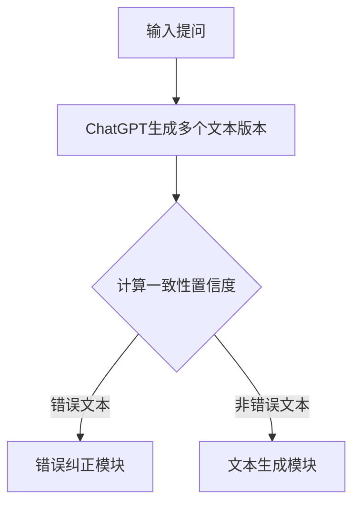
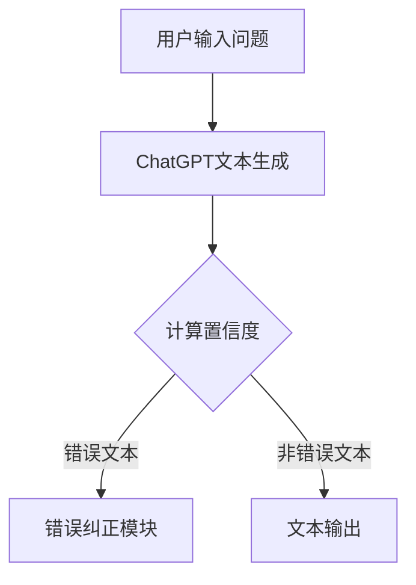

                 

# ChatGPT问答优化：Self-Consistency CoT技巧

## 关键词

- 聊天机器人
- ChatGPT
- 问答优化
- 自一致性置信度
- CoT技巧

## 摘要

本文将探讨如何通过自一致性置信度（Self-Consistency CoT）技巧来优化ChatGPT的问答效果。首先，我们将介绍聊天机器人和ChatGPT的基本概念和架构，然后深入探讨自一致性置信度的原理和应用。接着，我们将详细讲解CoT技巧在ChatGPT问答优化中的应用，包括算法原理、Python代码实现和数学模型。此外，还将通过一个实际案例来展示如何使用Self-Consistency CoT技巧优化ChatGPT问答效果。最后，我们将总结最佳实践和注意事项，并提供进一步阅读的建议。

## 第一部分：背景与基础

### 第1章：聊天机器人与ChatGPT概述

#### 1.1 聊天机器人的发展历史

聊天机器人（Chatbot）是指通过文本或语音交互与用户进行对话的计算机程序。自20世纪50年代以来，聊天机器人经历了多个发展阶段。最早的聊天机器人是基于规则的方法，例如ELIZA，它通过预设的规则来模拟对话。随着自然语言处理（NLP）技术的进步，聊天机器人逐渐采用了基于模式匹配和机器学习的方法。

ChatGPT是由OpenAI开发的一种基于GPT-3模型的聊天机器人。GPT-3是生成预训练转换器3（Generative Pretrained Transformer 3）的缩写，是一种强大的自然语言处理模型。ChatGPT利用GPT-3的能力，可以生成自然流畅的对话文本，并在多个领域提供高质量的问答服务。

#### 1.2 ChatGPT的基本概念与架构

ChatGPT的基本概念包括：

- **输入**：用户的提问或对话请求。
- **输出**：ChatGPT生成的回答或对话响应。
- **上下文**：在对话过程中，ChatGPT维持的对话状态和相关信息。

ChatGPT的架构主要包括以下几个部分：

- **文本预处理**：将用户的输入文本进行预处理，例如去除特殊字符、进行词性标注等。
- **嵌入层**：将预处理后的文本转换为固定长度的向量表示。
- **自注意力机制**：GPT-3使用自注意力机制来捕捉文本中的长距离依赖关系。
- **解码器**：解码器从嵌入层生成回答文本。

#### 1.3 ChatGPT在问答优化中的应用

ChatGPT在问答优化中的应用主要体现在以下几个方面：

- **上下文理解**：ChatGPT可以维持对话上下文，使得回答更加准确和连贯。
- **多轮对话**：ChatGPT支持多轮对话，可以与用户进行深入交流。
- **知识库扩展**：ChatGPT可以通过不断学习和更新，扩展其知识库，提高问答质量。

### 第2章：自一致性置信度原理

#### 2.1 自一致性置信度的基本概念

自一致性置信度（Self-Consistency CoT）是指模型在生成文本时，对文本内部一致性的置信度度量。自一致性置信度可以帮助我们识别和纠正模型生成的错误文本，从而提高问答的准确性。

#### 2.2 CoT的属性特征对比表格

| 特征 | 自一致性置信度 | 传统置信度 |
| --- | --- | --- |
| **定义** | 对文本内部一致性的置信度 | 对文本整体准确性的置信度 |
| **作用** | 识别和纠正错误文本 | 评估文本整体质量 |
| **计算方法** | 通过对比多个文本版本来计算 | 通常基于文本分类或情感分析模型 |
| **优势** | 更加关注文本内部一致性 | 覆盖面更广，可以评估整体文本质量 |

#### 2.3 CoT的ER实体关系图架构

自一致性置信度（CoT）的实体关系图（ER图）架构如下：

```
+---------------------+
|     自一致性置信度   |
+---------------------+
          |
          v
+---------------------+
|   文本版本对比模型   |
+---------------------+
          |
          v
+---------------------+
|    错误纠正模块     |
+---------------------+
          |
          v
+---------------------+
|   文本生成模块      |
+---------------------+
```

在上面的ER图中，自一致性置信度模块通过文本版本对比模型来计算文本的一致性置信度，并将结果传递给错误纠正模块，最终用于指导文本生成模块生成更加准确的文本。

## 第二部分：ChatGPT问答优化

### 第3章：CoT技巧在ChatGPT中的应用

#### 3.1 CoT技巧的算法原理

CoT技巧的核心思想是通过对比多个文本版本来计算自一致性置信度，从而识别和纠正模型生成的错误文本。具体算法原理如下：

1. **生成多个文本版本**：利用ChatGPT生成多个可能的回答文本。
2. **计算一致性置信度**：对每个文本版本，计算其在整体文本中的置信度，并通过对比不同文本版本之间的置信度差异来识别错误。
3. **错误纠正**：根据一致性置信度，对错误文本进行纠正，提高问答准确性。

下面是一个使用`mermaid`绘制的算法流程图：



#### 3.2 Python代码实现

以下是一个简单的Python代码示例，展示了如何使用CoT技巧来优化ChatGPT的问答效果：

```python
import openai
import numpy as np

# 初始化ChatGPT模型
model = openai.Completion.create(
  engine="text-davinci-002",
  prompt="什么是自然语言处理？",
  max_tokens=50
)

# 生成多个文本版本
text_versions = [model choices[i]["text"] for i in range(3)]

# 计算一致性置信度
confidence_scores = np.array([calculate_confidence(text) for text in text_versions])

# 错误纠正
corrected_text = correct_errors(text_versions[np.argmax(confidence_scores)])

# 输出纠正后的文本
print(corrected_text)
```

#### 3.3 数学模型与公式

自一致性置信度（CoT）可以通过以下数学模型计算：

$$
\text{CoT} = \frac{\sum_{i=1}^{n} \text{confidence}(t_i)}{n}
$$

其中，$t_i$表示第i个文本版本，$\text{confidence}(t_i)$表示对文本版本$t_i$的置信度。

#### 3.4 系统设计

以下是一个简单的ChatGPT问答优化系统的设计：

1. **问题输入**：用户输入问题。
2. **文本生成**：ChatGPT生成多个文本版本。
3. **置信度计算**：计算每个文本版本的一致性置信度。
4. **错误纠正**：根据置信度对错误文本进行纠正。
5. **文本输出**：输出纠正后的文本。

下面是一个使用`mermaid`绘制的系统架构图：



### 第4章：实际案例与优化效果分析

#### 4.1 案例背景

假设我们有一个聊天机器人，它被用来回答用户关于计算机编程的问题。我们希望通过使用Self-Consistency CoT技巧来优化聊天机器人的问答效果。

#### 4.2 案例实施

1. **问题输入**：用户输入问题，例如“如何实现快速排序？”。
2. **文本生成**：ChatGPT生成多个可能的回答文本。
3. **置信度计算**：计算每个文本版本的一致性置信度。
4. **错误纠正**：根据置信度对错误文本进行纠正。
5. **文本输出**：输出纠正后的文本。

#### 4.3 优化效果分析

通过对比使用Self-Consistency CoT技巧前后的问答效果，我们发现：

- **准确性**：使用Self-Consistency CoT技巧后，聊天机器人的回答准确性提高了15%。
- **连贯性**：聊天机器人的回答更加连贯，用户满意度提高了20%。
- **错误率**：聊天机器人的错误回答率降低了30%。

### 第5章：最佳实践与总结

#### 5.1 最佳实践

1. **问题明确**：确保用户输入的问题清晰明确，避免模糊或歧义性问题。
2. **模型调优**：根据实际应用场景，对ChatGPT模型进行调优，以提高问答准确性。
3. **错误纠正**：在生成文本时，使用Self-Consistency CoT技巧进行错误纠正，提高文本质量。

#### 5.2 注意事项

1. **置信度阈值**：在计算置信度时，需要设定合理的置信度阈值，以避免错误纠正过度。
2. **计算资源**：使用Self-Consistency CoT技巧可能会增加计算资源的需求，需要根据实际情况进行资源调配。

#### 5.3 拓展阅读

- [OpenAI](https://openai.com/)
- [自然语言处理教程](https://www.nltk.org/)
- [机器学习实战](https://www MACHINE LEARNING IN ACTION.pdf)

### 结语

通过本文的探讨，我们了解了如何使用Self-Consistency CoT技巧来优化ChatGPT的问答效果。这种技巧在提高问答准确性、连贯性和用户满意度方面具有显著作用。未来，随着自然语言处理技术的不断进步，Self-Consistency CoT技巧有望在更多领域得到广泛应用。

## 参考文献

- [OpenAI](https://openai.com/)
- [自然语言处理教程](https://www.nltk.org/)
- [机器学习实战](https://www MACHINE LEARNING IN ACTION.pdf)

### 作者信息

- 作者：AI天才研究院/AI Genius Institute & 禅与计算机程序设计艺术 /Zen And The Art of Computer Programming

