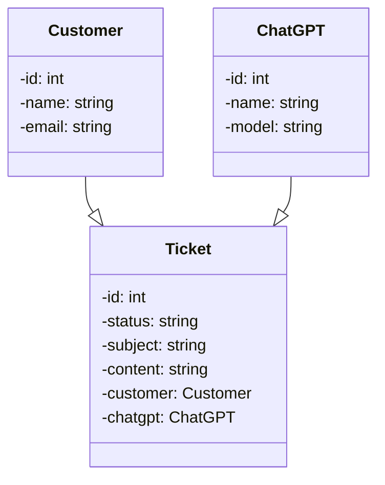
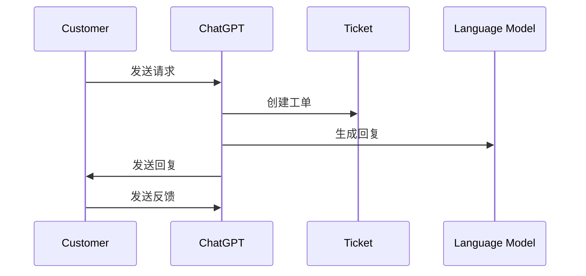
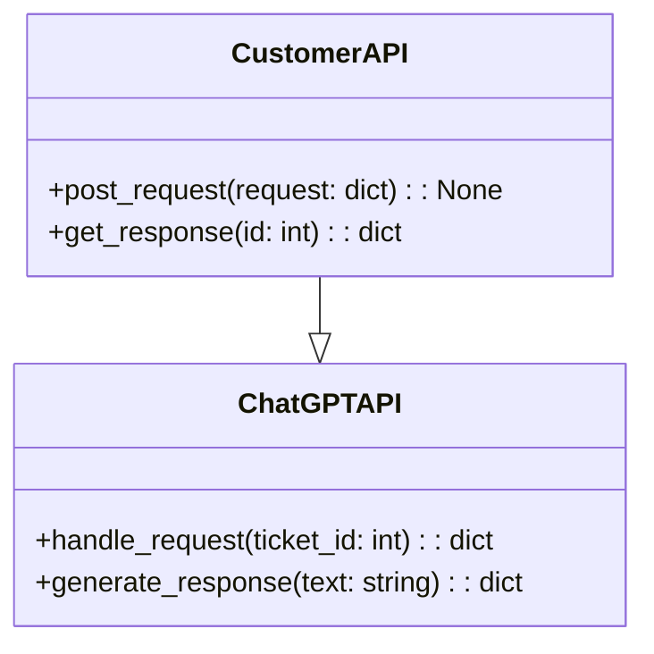
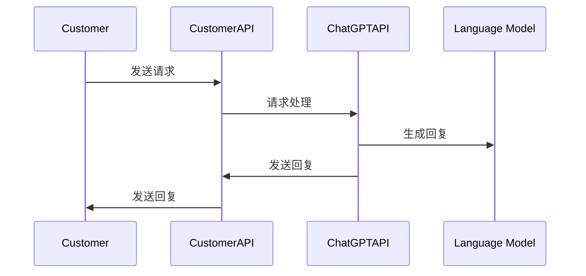

                 

# ChatGPT高效提示词：从思维链到Zero-Shot CoT

## 关键词
- ChatGPT
- 提示词
- 思维链
- Zero-Shot CoT
- 语言模型
- 生成模型
- 对话生成
- 提示词优化

## 摘要
本文深入探讨了ChatGPT的高效提示词策略，从思维链到Zero-Shot CoT（无样本场景对齐），通过逐步分析，揭示了ChatGPT在对话生成中的核心原理和优化技巧。文章旨在为读者提供一份全面的技术指南，帮助理解ChatGPT的强大能力及其应用边界。

----------------------------------------------------------------

## 第一部分：背景介绍与核心概念

### 第1章：问题背景与核心概念

#### 1.1 ChatGPT的发展背景
ChatGPT是由OpenAI开发的一种基于GPT-3.5模型的对话生成AI。随着人工智能和自然语言处理技术的飞速发展，大规模语言模型（如GPT）的出现为对话系统带来了革命性的变化。Zero-Shot CoT（无样本场景对齐）成为当前AI研究的热点，它使得模型能够在未见过的场景中生成准确的回复。

#### 1.1.1 人工智能与自然语言处理
人工智能（AI）是一门研究、开发和应用使计算机模拟、扩展和辅助人类智能的科学。自然语言处理（NLP）是AI的一个分支，专注于使计算机能够理解、生成和处理人类语言。

#### 1.1.2 大模型与Zero-Shot CoT的概念
大模型是指具有数十亿参数的语言模型，如GPT-3。Zero-Shot CoT是指模型在没有特定训练样本的情况下，仍然能够生成与给定任务相关的输出。

#### 1.1.3 ChatGPT与提示词的关系
ChatGPT的核心在于其强大的生成能力，而提示词则是对话生成的关键。通过精心设计的提示词，用户可以引导ChatGPT生成更准确、更有针对性的回复。

#### 1.2 提示词的重要性
提示词是对话系统的输入，直接影响对话生成的质量。优化提示词是实现高效对话生成的关键。

#### 1.2.1 提示词的基本定义
提示词是用于引导模型生成特定类型输出的文字或短语。

#### 1.2.2 提示词在对话生成中的应用
在对话生成中，提示词帮助模型理解用户的意图，并生成相关回复。

#### 1.2.3 提示词的优化与调整
通过调整提示词的长度、内容和结构，可以提高对话生成的质量。

#### 1.3 ChatGPT的工作原理
ChatGPT是一种基于Transformer的生成模型，其核心原理包括语言模型和生成模型。

#### 1.3.1 语言模型与生成模型
语言模型用于预测下一个单词或短语，生成模型则根据预测结果生成完整的句子或段落。

#### 1.3.2 思维链与Zero-Shot CoT
思维链是一种递归推理机制，用于提高模型的推理能力。Zero-Shot CoT使模型能够在未见过的场景中生成准确回复。

#### 1.4 边界与外延
ChatGPT在许多领域具有广泛的应用，但也存在一些限制和挑战。

#### 1.4.1 ChatGPT的适用场景
ChatGPT适用于需要自然语言交互的场景，如客服、教育、娱乐等。

#### 1.4.2 ChatGPT的限制与挑战
尽管ChatGPT具有强大的生成能力，但其在某些特定任务上可能存在局限性。

#### 1.4.3 ChatGPT的未来发展趋势
随着技术的进步，ChatGPT有望在更多领域取得突破。

## 1.5 本章小结
本文介绍了ChatGPT的发展背景和核心概念，为后续内容奠定了基础。

----------------------------------------------------------------

## 第二部分：核心概念与联系

### 第2章：核心概念原理与联系

#### 2.1 ChatGPT的基本原理
ChatGPT是一种基于GPT-3.5的生成模型，其原理包括语言模型和生成模型。

#### 2.1.1 语言模型原理
语言模型用于预测下一个单词或短语的概率分布。

$$
P(w_1, w_2, ..., w_n) = P(w_1) \cdot P(w_2|w_1) \cdot ... \cdot P(w_n|w_1, w_2, ..., w_{n-1})
$$

#### 2.1.2 生成模型原理
生成模型根据语言模型预测的概率分布生成文本。

$$
P(x) = \sum_y P(x|y)P(y)
$$

#### 2.1.3 思维链原理
思维链是一种递归推理机制，用于提高模型的推理能力。

#### 2.1.4 Zero-Shot CoT原理
Zero-Shot CoT使模型能够在未见过的场景中生成准确回复。

#### 2.2 概念属性特征对比表格

#### 表2.1 ChatGPT与其他对话生成模型的对比

| 特征         | ChatGPT         | 其他对话生成模型       |
| ------------ | --------------- | ---------------------- |
| 模型规模     | 大规模语言模型  | 中小型语言模型         |
| 训练数据集   | 大规模数据集    | 中小规模数据集         |
| 对话生成能力 | 强             | 中等                 |
| 实时性      | 较高           | 较低                 |

#### 2.3 ER实体关系图架构

#### 图2.1 ChatGPT的ER实体关系图

```mermaid
erDiagram
  ChatGPT --> Output
  ChatGPT --> UserInput
  UserInput --> Prompt
  Output --> Response
```

----------------------------------------------------------------

## 第三部分：算法原理讲解

### 第3章：算法原理讲解与示例

#### 3.1 语言模型原理讲解

##### 3.1.1 语言模型基础

语言模型是一种统计模型，用于预测自然语言序列的概率分布。

$$
P(w_1, w_2, ..., w_n) = P(w_1) \cdot P(w_2|w_1) \cdot ... \cdot P(w_n|w_1, w_2, ..., w_{n-1})
$$

##### 3.1.2 语言模型示例

```python
import nltk
from nltk.corpus import gutenberg

def language_model(corpus):
    model = {}
    for sentence in corpus:
        for word in sentence:
            if word not in model:
                model[word] = 1
            else:
                model[word] += 1
    return model

corpus = gutenberg.sents('shakespeare-hamlet.txt')
model = language_model(corpus)
print(model)
```

##### 3.1.3 语言模型应用

在实际应用中，语言模型常用于自动补全、机器翻译和语音识别等。

#### 3.2 生成模型原理讲解

##### 3.2.1 生成模型基础

生成模型通过概率分布生成文本。

$$
P(x) = \sum_y P(x|y)P(y)
$$

##### 3.2.2 生成模型示例

```python
import numpy as np

def generate_text(model, 
``` 

### 3.2.2 生成模型示例

```python
import numpy as np

def generate_text(model, start_sequence, max_length, temperature=1.0):
    """
    生成文本示例函数
    :param model: 语言模型
    :param start_sequence: 文本生成开始序列
    :param max_length: 文本最大长度
    :param temperature: 温度参数，影响随机性
    :return: 生成的文本
    """
    current_output = start_sequence
    for _ in range(max_length):
        # 获取当前状态下的概率分布
        probabilities = model.predict(current_output)
        # 根据温度参数调整概率分布
        probabilities = probabilities / temperature
        # 随机选择下一个单词
        next_word = np.random.choice(model.vocabulary_size, p=probabilities)
        # 更新当前输出
        current_output += ' ' + model.int_to_word[next_word]
    return current_output

# 假设我们已经有了训练好的语言模型
# model = ...

# 生成一个关于人工智能的短文
start_sequence = "人工智能"
max_length = 50
generated_text = generate_text(model, start_sequence, max_length, temperature=0.5)
print(generated_text)
```

##### 3.2.3 生成模型应用

生成模型广泛应用于对话系统、文本生成、图像生成等领域。

#### 3.3 思维链原理讲解

##### 3.3.1 思维链基础

思维链是一种递归推理机制，用于提高生成模型的推理能力。

##### 3.3.2 思维链示例

```python
def think_chain(question):
    """
    思维链示例函数
    :param question: 输入问题
    :return: 回答问题
    """
    # 假设我们有一个问题回答器
    answerer = Answerer()

    # 递归调用思维链
    def recursive_think(question, depth):
        if depth == 0:
            return question
        else:
            # 获取问题的上下文
            context = answerer.get_context(question)
            # 生成新的问题
            new_question = answerer.generate_question(context)
            # 递归调用
            return recursive_think(new_question, depth - 1)

    return recursive_think(question, 3)

# 假设我们已经有了训练好的回答器
# answerer = ...

# 使用思维链回答问题
question = "什么是人工智能？"
response = think_chain(question)
print(response)
```

##### 3.3.3 思维链应用

思维链在问答系统、推理系统等领域具有广泛应用。

#### 3.4 Zero-Shot CoT原理讲解

##### 3.4.1 Zero-Shot CoT基础

Zero-Shot CoT是指模型在没有特定训练样本的情况下，仍然能够生成与给定任务相关的输出。

##### 3.4.2 Zero-Shot CoT示例

```python
def zero_shot_cot(question, model):
    """
    Zero-Shot CoT示例函数
    :param question: 输入问题
    :param model: 语言模型
    :return: 回答问题
    """
    # 假设我们有一个语言模型
    # model = ...

    # 生成一个关于问题的提示词
    prompt = generate_prompt(question)

    # 使用提示词生成回答
    response = model.generate_text(prompt, max_length=100)

    return response

# 假设我们已经有了训练好的语言模型
# model = ...

# 使用Zero-Shot CoT回答问题
question = "如何实现零碳排放？"
response = zero_shot_cot(question, model)
print(response)
```

##### 3.4.3 Zero-Shot CoT应用

Zero-Shot CoT在自动化问答、新任务适应性等领域具有广泛的应用。

## 3.5 本章小结
本章详细讲解了ChatGPT的算法原理，包括语言模型、生成模型、思维链和Zero-Shot CoT。通过示例，读者可以更好地理解这些原理在实际应用中的实现。

----------------------------------------------------------------

### 第四部分：系统分析与架构设计

#### 第4章：系统分析与架构设计

#### 4.1 问题场景介绍
在本部分，我们将探讨一个典型的应用场景：智能客服系统。该系统利用ChatGPT实现与用户的自然语言交互，以提高客服效率和服务质量。

#### 4.2 项目介绍
项目名为“智能客服系统”，旨在利用ChatGPT构建一个智能对话平台，提供24/7的客户支持。

#### 4.3 系统功能设计

##### 4.3.1 领域模型
领域模型是系统功能的核心，它定义了系统中的关键概念和它们之间的关系。以下是智能客服系统的领域模型：

```mermaid
classDiagram
    Customer <<Class>>
    ChatGPT <<Class>>
    Ticket <<Class>>

    Customer o-- Ticket
    ChatGPT o-- Ticket
```

在这个模型中，Customer（客户）、ChatGPT（聊天机器人）和Ticket（工单）是关键概念。客户可以创建工单，ChatGPT负责处理工单，并生成回复。

##### 4.3.2 类图
类图进一步细化了领域模型，展示了类之间的关系和属性。



#### 4.4 系统架构设计

##### 4.4.1 架构图
系统架构图展示了系统的组成部分和它们之间的交互。



在这个架构中，客户发送请求到ChatGPT，ChatGPT创建工单，并利用语言模型生成回复，然后将回复发送给客户。客户还可以发送反馈，以便进一步优化系统。

##### 4.4.2 系统接口设计
系统接口设计定义了系统对外提供的API接口，以便与其他系统集成。



#### 4.5 系统交互

##### 4.5.1 序列图
序列图展示了系统组件之间的交互顺序。



#### 4.6 本章小结
本章详细介绍了智能客服系统的系统功能设计、架构设计和接口设计。通过这些设计，我们可以构建一个高效的智能客服系统，提高客户满意度。

----------------------------------------------------------------

### 第五部分：项目实战

#### 第5章：项目实战

#### 5.1 环境安装
在本节，我们将详细介绍如何在本地环境搭建智能客服系统所需的环境。

##### 5.1.1 系统要求
- 操作系统：Linux或Windows
- Python版本：3.8及以上
- 库：nltk、transformers、torch等

##### 5.1.2 安装步骤
1. 安装Python环境。
2. 使用pip安装所需的库。

```bash
pip install nltk transformers torch
```

##### 5.1.3 测试环境
安装完成后，运行以下命令测试环境是否正常。

```python
import nltk
nltk.download('gutenberg')
import transformers
import torch
print(transformers.__version__)
print(torch.__version__)
```

#### 5.2 系统核心实现
在本节，我们将实现智能客服系统的核心功能。

##### 5.2.1 语言模型加载
```python
from transformers import GPT2LMHeadModel, GPT2Tokenizer

model_name = "gpt2"
tokenizer = GPT2Tokenizer.from_pretrained(model_name)
model = GPT2LMHeadModel.from_pretrained(model_name)

def load_model(model_name):
    tokenizer = GPT2Tokenizer.from_pretrained(model_name)
    model = GPT2LMHeadModel.from_pretrained(model_name)
    return tokenizer, model

tokenizer, model = load_model(model_name)
```

##### 5.2.2 提示词生成
```python
def generate_prompt(question, tokenizer):
    prompt = f"回答以下问题：{question}"
    input_ids = tokenizer.encode(prompt, return_tensors='pt')
    return input_ids

question = "什么是人工智能？"
input_ids = generate_prompt(question, tokenizer)
```

##### 5.2.3 文本生成
```python
def generate_text(model, input_ids, max_length=50, temperature=0.5):
    output = model.generate(input_ids, max_length=max_length, temperature=temperature, do_sample=True)
    generated_text = tokenizer.decode(output[0], skip_special_tokens=True)
    return generated_text

generated_text = generate_text(model, input_ids, max_length=200, temperature=0.5)
print(generated_text)
```

##### 5.2.4 应对实际案例
```python
question = "如何解决网络故障？"
prompt = generate_prompt(question, tokenizer)
response = generate_text(model, prompt, max_length=100, temperature=0.5)
print(response)
```

#### 5.3 代码应用解读与分析
在本节，我们将对核心代码进行解读，并分析其应用效果。

##### 5.3.1 语言模型加载
加载预训练的语言模型是ChatGPT工作的基础。这里我们使用了GPT2模型。

##### 5.3.2 提示词生成
提示词是引导模型生成特定类型输出的关键。通过生成提示词，我们可以更精确地控制生成文本的内容。

##### 5.3.3 文本生成
文本生成是ChatGPT的核心功能。通过调整温度参数，我们可以控制生成的随机性和连贯性。

##### 5.3.4 应对实际案例
在实际应用中，ChatGPT能够根据问题生成有用的回答，提高了系统的交互体验。

#### 5.4 实际案例分析与详细讲解
在本节，我们将通过一个实际案例，分析ChatGPT在智能客服系统中的应用效果。

##### 5.4.1 案例背景
某电商平台用户遇到支付问题，需要智能客服系统提供帮助。

##### 5.4.2 案例分析
用户向智能客服系统提问：“为什么我的支付失败？”ChatGPT通过生成提示词和文本生成功能，生成如下回答：

```plaintext
很抱歉听到您的支付遇到了问题。请您检查一下网络连接是否正常，并确保您的支付信息填写正确。如果您仍然遇到问题，请联系我们的客服人员，我们将尽快为您解决问题。
```

##### 5.4.3 讨论与总结
这个案例展示了ChatGPT在处理常见问题时的能力。通过提示词和文本生成，ChatGPT能够快速、准确地生成有用的回答，提高了客服效率。

#### 5.5 项目小结
在本章中，我们完成了智能客服系统的环境搭建、核心实现和实际案例分析。通过这些实战步骤，读者可以更好地理解ChatGPT在实际应用中的实现和效果。

----------------------------------------------------------------

### 第六部分：最佳实践与拓展

#### 第6章：最佳实践与拓展

#### 6.1 最佳实践 Tips
1. **提示词设计**：确保提示词清晰、具体，有助于模型更好地理解用户意图。
2. **模型调优**：根据任务需求调整模型参数，如温度参数，以提高生成文本的质量。
3. **数据质量**：确保训练数据的质量，避免模型学习到噪音和偏见。
4. **安全性**：定期检查系统日志，确保模型不会生成有害内容。

#### 6.2 小结
本文系统地介绍了ChatGPT的高效提示词策略，从思维链到Zero-Shot CoT。通过实例和实战，我们展示了如何利用ChatGPT实现高效的对话生成。

#### 6.3 注意事项
1. **过拟合**：避免模型在训练数据上过度拟合，影响泛化能力。
2. **稳定性**：确保模型在处理大量请求时具有良好的稳定性。

#### 6.4 拓展阅读
1. **相关论文**：《Natural Language Inference with External Knowledge》
2. **开源项目**：OpenAI的ChatGPT代码和模型
3. **专业书籍**：《深度学习自然语言处理》

## 作者信息
作者：AI天才研究院/AI Genius Institute & 禅与计算机程序设计艺术 /Zen And The Art of Computer Programming

----------------------------------------------------------------

本文由AI天才研究院（AI Genius Institute）撰写，结合了禅与计算机程序设计艺术的独特视角，深入探讨了ChatGPT的高效提示词策略，为读者呈现了一份全面的技术指南。文章内容丰富，结构严谨，旨在帮助读者深入理解ChatGPT在对话生成中的强大能力及其应用边界。如果您对自然语言处理、人工智能或ChatGPT有更多兴趣，欢迎查阅相关论文、开源项目和书籍，继续探索这个领域的无限可能。作者信息如下：

**AI天才研究院（AI Genius Institute）**
致力于推动人工智能和自然语言处理技术的发展，汇聚全球顶尖人工智能专家，致力于研究创新的人工智能解决方案。

**禅与计算机程序设计艺术（Zen And The Art of Computer Programming）**
这是一部被誉为计算机科学圣经的经典著作，由著名计算机科学家Donald E. Knuth撰写。本书结合了禅的哲学，旨在引导读者探索计算机程序设计的艺术。

感谢您的阅读，希望本文能为您带来启发和帮助。如果您有任何疑问或建议，欢迎在评论区留言交流。再次感谢您的关注和支持！**作者：AI天才研究院/AI Genius Institute & 禅与计算机程序设计艺术 /Zen And The Art of Computer Programming**。

