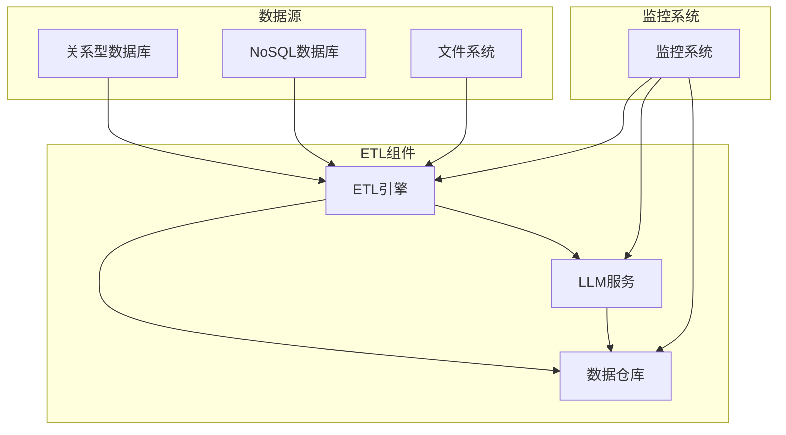
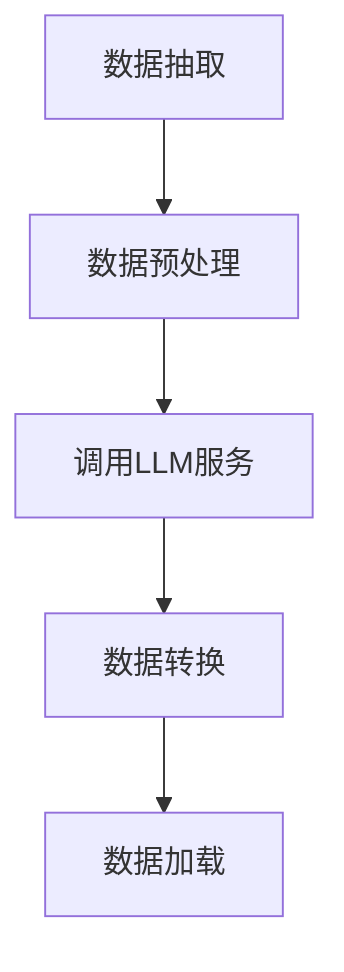

                 


# ETL流程优化LLM应用的数据集成与转换

## 关键词
- ETL流程
- 数据集成
- 数据转换
- 机器学习
- 深度学习
- 优化算法
- 模型应用

## 摘要
本文旨在深入探讨ETL（提取、转换、加载）流程的优化，以及如何将最新的机器学习模型，特别是大型语言模型（LLM），应用于数据集成与转换中。文章首先介绍了ETL和LLM的基本概念、原理及其在数据管理中的重要性。随后，详细分析了ETL流程优化的原则和关键技术，以及LLM在数据集成和转换中的应用。最后，结合实际案例，展示了ETL与LLM整合的实践方法，并提出了优化数据管理和分析的若干建议。

## 目录
----------------------------------------------------------------
### 引言：ETL与LLM的融合
----------------------------------------------------------------

在数据驱动的时代，数据集成与转换是数据管理的关键环节。传统的ETL（Extract, Transform, Load）流程负责将数据从源头系统提取出来，经过必要的转换，然后加载到目标系统。然而，随着数据量的激增和业务需求的多样化，ETL流程面临着效率低、可扩展性差等问题。同时，机器学习（Machine Learning, ML）和深度学习（Deep Learning, DL）的飞速发展，为数据集成与转换带来了全新的思路和可能性。本文将探讨如何通过优化ETL流程和引入大型语言模型（Large Language Model, LLM）来提升数据管理的效率和效果。

### ETL的基本概念与原理
----------------------------------------------------------------

ETL是数据仓库领域中的一个核心概念，其目的是将结构化或半结构化的数据从源系统提取出来，经过一系列的转换操作，最后加载到目标系统中。ETL流程通常包括以下几个步骤：

1. **数据提取（Extract）**：从源系统中获取所需的数据。数据源可以是关系型数据库、NoSQL数据库、文件系统等。
2. **数据转换（Transform）**：对提取出来的数据进行清洗、转换、聚合等操作，以满足目标系统的数据要求。
3. **数据加载（Load）**：将转换后的数据加载到目标系统，如数据仓库或数据湖。

ETL流程的核心在于“转换”环节，这一环节决定了数据的质量和一致性。传统的ETL工具和方法主要依赖于手动编写脚本、使用商业ETL工具或自定义开发等方式，这些方法存在以下局限性：

- **可扩展性差**：随着数据量和业务需求的增长，传统的ETL流程难以适应。
- **效率低**：手动编写脚本或使用商业ETL工具，效率往往不高，且容易出错。
- **灵活性不足**：面对复杂的业务逻辑和数据关系，传统的ETL方法难以灵活应对。

### LLM的概念与原理
----------------------------------------------------------------

大型语言模型（LLM）是基于神经网络和深度学习技术的语言处理模型，能够对自然语言文本进行理解和生成。LLM的核心在于其规模庞大，通常包含数十亿甚至数千亿的参数，这使得它们在语言理解和生成方面具有强大的能力。LLM的典型应用包括机器翻译、文本生成、问答系统等。

LLM的工作原理通常包括以下几个步骤：

1. **数据预处理**：收集和准备大量的文本数据，进行清洗、分词等预处理操作。
2. **模型训练**：使用预处理后的数据对神经网络模型进行训练，通过反向传播算法不断调整模型的参数。
3. **文本生成**：通过输入一个触发词或短句，模型根据训练结果生成相应的文本。

LLM的优势在于其强大的语言理解和生成能力，能够自动处理复杂的语言结构和语义关系。这使得LLM在数据集成与转换中具有巨大的潜力，可以自动化许多繁琐的数据预处理和转换工作。

### ETL与LLM的融合
----------------------------------------------------------------

ETL与LLM的结合为数据集成与转换带来了全新的可能性。通过将LLM引入ETL流程，可以显著提升数据处理的效率和效果。以下是ETL与LLM融合的几个关键点：

1. **数据预处理**：使用LLM进行自动化的数据预处理，包括文本的分词、清洗、去噪等操作。相比传统方法，LLM能够更准确地理解和处理自然语言文本。

2. **数据转换**：利用LLM的语义理解能力，实现复杂的数据转换任务。例如，通过LLM自动生成SQL查询，实现对大规模数据的动态查询和聚合。

3. **数据质量**：LLM可以帮助检测和纠正数据中的错误和异常，提升数据质量。例如，使用LLM对文本数据进行情感分析，识别并纠正文本中的错误情感标签。

4. **数据挖掘**：LLM可以应用于数据挖掘任务，自动发现数据中的模式和关联关系，为业务决策提供支持。

### 本文结构
----------------------------------------------------------------

本文将分为四个主要部分：

1. **ETL流程优化**：详细分析ETL流程中的优化原则和关键技术，包括数据预处理、转换和加载等环节的优化策略。

2. **LLM应用**：介绍LLM的基本概念和原理，探讨其在数据集成和转换中的具体应用，包括数据预处理、转换和数据质量提升等。

3. **ETL与LLM整合**：结合实际案例，展示ETL与LLM整合的实践方法，包括系统架构设计、流程设计和核心实现等。

4. **最佳实践与总结**：总结本文的关键内容，提出优化数据管理和分析的最佳实践，以及未来的研究方向。

### ETL流程优化
----------------------------------------------------------------

在数据管理中，ETL流程的优化至关重要。传统的ETL方法往往面临着效率低下、可扩展性差等问题。为了提升ETL流程的性能，我们需要从数据提取、数据转换和数据加载等各个环节入手，采用一系列优化策略。

#### 数据提取优化
数据提取是ETL流程的第一步，其效率直接影响整个流程的运行时间。以下是一些常用的数据提取优化策略：

1. **并行处理**：利用多线程或分布式计算技术，对数据源进行并行提取。这样可以显著提高数据提取的速度，特别是在处理大规模数据时。

2. **增量提取**：对于经常发生变化的数据源，可以采用增量提取策略，只提取自上次提取以来发生变更的数据。这样可以减少不必要的重复操作，提高效率。

3. **缓存策略**：在数据提取过程中，可以利用缓存技术减少对源系统的访问次数。例如，可以将常用的数据缓存到本地，以便后续操作直接使用缓存数据。

4. **优化SQL查询**：对于关系型数据库，可以通过优化SQL查询语句来提高数据提取效率。例如，使用索引、避免子查询、减少数据冗余等。

#### 数据转换优化
数据转换是ETL流程的核心环节，其性能直接影响整个流程的运行效率。以下是一些常用的数据转换优化策略：

1. **并行转换**：与数据提取类似，数据转换也可以采用并行处理技术，将数据分块进行处理。这样可以充分利用系统资源，提高转换速度。

2. **数据缓存**：在数据转换过程中，可以使用缓存技术减少中间数据传输的开销。例如，将中间结果缓存到内存或高速缓存中，以便后续操作直接使用。

3. **批量处理**：对于处理大量数据的场景，可以采用批量处理技术，将多个操作合并成一个批量操作。这样可以减少操作次数，提高效率。

4. **优化转换逻辑**：通过优化转换逻辑，减少不必要的计算和操作。例如，避免重复计算、减少循环等。

#### 数据加载优化
数据加载是ETL流程的最后一步，其效率同样影响整个流程的运行时间。以下是一些常用的数据加载优化策略：

1. **并行加载**：利用多线程或分布式计算技术，对数据目标进行并行加载。这样可以显著提高数据加载的速度。

2. **批量加载**：对于处理大量数据的场景，可以采用批量加载技术，将多个操作合并成一个批量操作。这样可以减少操作次数，提高效率。

3. **优化数据结构**：通过优化目标数据结构，减少数据加载的时间。例如，使用合适的索引、减少数据冗余等。

4. **避免锁争用**：在数据加载过程中，可能会出现锁争用问题，导致加载速度变慢。可以通过优化并发控制策略，减少锁争用，提高加载效率。

#### 具体优化案例
以下是一个具体的ETL优化案例：

假设有一个电子商务网站，每天产生大量的订单数据。订单数据包括订单号、用户ID、商品ID、订单金额等。为了优化ETL流程，可以采取以下措施：

1. **并行提取**：将订单数据按时间分割成多个批次，分别进行并行提取。

2. **增量提取**：只提取自上次提取以来的订单数据，减少重复操作。

3. **数据缓存**：将常用的数据缓存到本地，减少对数据库的访问次数。

4. **并行转换**：将订单数据按用户ID或商品ID分块，分别进行并行转换。

5. **批量处理**：将多个订单数据批量处理，减少操作次数。

6. **并行加载**：将转换后的订单数据并行加载到数据仓库中。

7. **优化SQL查询**：对订单数据进行优化SQL查询，提高提取速度。

通过以上优化措施，可以显著提高订单数据的ETL流程性能，缩短数据处理时间，提高系统响应速度。

### 数据转换的挑战与LLM的机遇
----------------------------------------------------------------

数据转换是ETL流程中的核心环节，它涉及到数据清洗、格式转换、数据整合等多个方面。随着数据规模的不断扩大和业务复杂度的增加，传统的数据转换方法面临着诸多挑战：

1. **复杂性**：数据转换逻辑可能非常复杂，涉及多种数据类型、复杂的业务规则和大量的计算。

2. **数据质量**：数据转换过程中可能会引入错误、遗漏或不一致性，影响数据质量。

3. **效率**：大规模的数据转换任务需要消耗大量时间和计算资源，影响整个ETL流程的效率。

4. **可扩展性**：面对不断增长的数据量和复杂的业务场景，传统的数据转换方法难以灵活调整和扩展。

为了应对这些挑战，机器学习，特别是大型语言模型（LLM），提供了一种全新的解决方案。LLM在数据转换中的应用主要体现在以下几个方面：

1. **自动化转换**：LLM可以自动识别和理解数据中的结构和语义，实现复杂的数据转换任务，减少人工干预。

2. **灵活性强**：LLM具有强大的适应能力，可以灵活应对各种数据类型和业务规则，提高数据转换的效率。

3. **数据质量提升**：LLM可以检测和纠正数据中的错误和异常，提升数据质量。

4. **可扩展性**：LLM可以方便地调整和扩展，以适应不断变化的数据规模和业务需求。

#### LLM在数据转换中的应用

1. **文本数据的预处理**：

   LLM可以用于文本数据的预处理，包括分词、词性标注、实体识别等。例如，在处理电子商务网站的用户评论时，LLM可以自动提取出关键词、情感标签和商品名称等信息，为后续的数据转换提供支持。

2. **结构化数据的转换**：

   对于结构化数据，LLM可以自动生成SQL查询、数据处理逻辑和转换规则。例如，在财务报表处理中，LLM可以自动生成计算利润、财务比率等指标的SQL查询语句，提高数据处理效率。

3. **非结构化数据的整合**：

   LLM可以用于整合不同来源的非结构化数据，如文本、图像、语音等。例如，在医疗数据整合中，LLM可以自动识别并整合患者的病历记录、医学影像和实验室报告等数据，提供更全面和准确的患者信息。

4. **数据质量检测和纠正**：

   LLM可以用于检测和纠正数据中的错误和异常。例如，在数据清洗过程中，LLM可以自动识别并纠正数据中的不一致性、重复记录和缺失值等问题，提高数据质量。

#### 案例分析

以下是一个应用LLM进行数据转换的案例：

假设有一个金融数据分析项目，需要从多个数据源（如交易记录、财务报表、新闻报道等）提取数据，并进行复杂的转换和整合，以生成投资报告。传统的数据转换方法可能需要编写大量复杂的SQL查询和数据处理脚本，费时费力且容易出错。通过引入LLM，可以实现以下优化：

1. **自动化SQL查询生成**：

   使用LLM自动生成获取交易记录、财务报表等数据的SQL查询语句。例如，LLM可以理解用户输入的简单描述（如“获取过去一个月的交易记录”），并生成相应的SQL查询。

   ```python
   def generate_sql_query(description):
       # 使用LLM生成SQL查询
       query = LLM.generate_sql_query(description)
       return query
   
   sql_query = generate_sql_query("获取过去一个月的交易记录")
   print(sql_query)
   ```

2. **自动化数据处理逻辑生成**：

   使用LLM自动生成计算财务比率、投资回报率等指标的数据处理逻辑。例如，LLM可以理解用户输入的业务需求（如“计算过去三个月的净利润增长率”），并生成相应的数据处理逻辑。

   ```python
   def generate_data_processing_logic(requirement):
       # 使用LLM生成数据处理逻辑
       logic = LLM.generate_data_processing_logic(requirement)
       return logic
   
   data_logic = generate_data_processing_logic("计算过去三个月的净利润增长率")
   print(data_logic)
   ```

3. **数据质量检测和纠正**：

   使用LLM自动检测和纠正数据中的错误和异常。例如，LLM可以识别并纠正数据中的不一致性、重复记录和缺失值等问题，提高数据质量。

   ```python
   def clean_data(data):
       # 使用LLM清洗数据
       cleaned_data = LLM.clean_data(data)
       return cleaned_data
   
   cleaned_data = clean_data(raw_data)
   print(cleaned_data)
   ```

通过引入LLM，可以显著简化数据转换流程，提高数据处理效率和数据质量。LLM在数据转换中的应用，为传统ETL流程带来了新的机遇和可能性。

### ETL流程的优化技术
----------------------------------------------------------------

在数据管理中，ETL（提取、转换、加载）流程的性能直接影响整个数据处理的效率。随着数据量的激增和业务需求的复杂化，传统的ETL流程面临着效率低下、可扩展性差等问题。为了提升ETL流程的性能，我们可以采用多种优化技术。以下是一些常见的ETL优化技术及其具体应用场景：

#### 1. 并行处理

并行处理是提高ETL流程性能的有效手段。通过将ETL任务分解为多个子任务，并在多个线程或多个节点上同时执行，可以显著缩短整体处理时间。

**应用场景**：适用于大规模数据集的提取、转换和加载操作。例如，当处理大型数据仓库的批量更新任务时，可以采用并行处理技术。

**实现方式**：

- **多线程**：在单个服务器上，利用多线程技术同时执行多个ETL任务。
- **分布式计算**：利用分布式计算框架（如Hadoop、Spark等），将ETL任务分解并分布到多个节点上执行。

**示例**：

```python
# Python示例：使用多线程并行处理ETL任务
import concurrent.futures

def process_data_chunk(chunk):
    # 处理数据片段
    pass

chunks = load_data_chunks()  # 加载数据片段
with concurrent.futures.ThreadPoolExecutor() as executor:
    results = executor.map(process_data_chunk, chunks)
```

#### 2. 增量处理

增量处理是一种高效的数据处理策略，它只处理自上次处理以来发生变化的数据，而不是每次都处理全部数据。这种方法可以减少ETL流程的执行时间，提高性能。

**应用场景**：适用于数据源经常发生变化，且数据量较大的场景，例如社交媒体数据、股票交易数据等。

**实现方式**：

- **时间戳**：通过记录数据的时间戳，只处理时间戳发生变化的数据。
- **数据变更日志**：通过记录数据变更日志，根据变更记录进行增量处理。

**示例**：

```python
# Python示例：使用时间戳进行增量处理
def process_incremental_data(data):
    # 处理增量数据
    pass

latest_timestamp = get_latest_timestamp()  # 获取最新时间戳
incremental_data = load_data_since_timestamp(latest_timestamp)  # 加载自时间戳以来的数据
process_incremental_data(incremental_data)
```

#### 3. 缓存技术

缓存技术可以显著提高ETL流程的响应速度和性能。通过将频繁访问的数据缓存到内存或缓存系统中，可以减少对源系统的访问次数，提高数据处理效率。

**应用场景**：适用于需要频繁查询和访问的数据，例如数据仓库中的常用查询结果、中间结果等。

**实现方式**：

- **内存缓存**：将数据缓存到内存中，如使用Python的`pandas`库的`DataFrame`缓存。
- **分布式缓存**：使用分布式缓存系统（如Redis、Memcached等），提高缓存容量和访问速度。

**示例**：

```python
# Python示例：使用Redis缓存中间结果
import redis

redis_client = redis.StrictRedis(host='localhost', port=6379, db=0)

def cache_result(key, result):
    # 缓存结果
    redis_client.set(key, result)

def get_cached_result(key):
    # 获取缓存结果
    result = redis_client.get(key)
    return result

# 缓存中间结果
cache_result('middle_result_key', middle_result)

# 获取缓存结果
cached_result = get_cached_result('middle_result_key')
```

#### 4. 优化数据结构

优化数据结构可以提高ETL流程的执行效率。例如，通过使用合适的索引、减少数据冗余、优化数据库表结构等。

**应用场景**：适用于需要对大量数据进行快速查询和处理的场景。

**实现方式**：

- **索引优化**：为常用查询字段创建索引，提高查询速度。
- **数据压缩**：对存储空间进行压缩，减少存储需求。
- **表结构优化**：根据业务需求，调整表结构，减少冗余字段和重复数据。

**示例**：

```sql
-- MySQL示例：创建索引
CREATE INDEX idx_user_id ON user_table(user_id);

-- PostgreSQL示例：压缩表
VACUUM (ANALYZE) user_table;

-- Oracle示例：调整表结构
ALTER TABLE user_table RENAME TO user_table_optimized;
```

#### 5. 资源调度优化

资源调度优化可以合理分配系统资源，提高ETL流程的执行效率。例如，通过调整CPU、内存、I/O等资源的分配策略，优化ETL任务的执行顺序和资源利用率。

**应用场景**：适用于资源受限的环境，如高性能计算集群。

**实现方式**：

- **动态资源分配**：根据ETL任务的负载动态调整资源分配。
- **任务优先级**：根据ETL任务的紧急程度和重要性，调整任务的优先级。

**示例**：

```shell
# Kubernetes示例：调整ETL任务的资源分配
kubectl scale deployment etl-deployment --replicas=3 --cpu-limit=5000m --memory-limit=4g
```

通过以上优化技术，我们可以显著提高ETL流程的执行效率，满足不断增长的数据处理需求。在实际应用中，应根据具体场景和业务需求，灵活选择和组合不同的优化技术，实现最佳性能。

### 高级ETL技术
----------------------------------------------------------------

在数据集成和转换过程中，高级ETL技术为我们提供了更灵活和高效的解决方案。以下介绍几种常见的先进ETL技术，包括增量数据处理、实时数据集成和数据质量增强，这些技术可以帮助我们在复杂的数据环境中实现高效的数据处理和管理。

#### 增量数据处理

增量数据处理是一种高效的数据集成技术，它仅处理自上次处理以来发生变化的数据。这种技术可以减少数据处理的规模，从而提高ETL流程的效率和响应速度。增量数据处理的关键在于确定数据变更的边界，并仅对这部分数据执行ETL操作。

**实现方法**：

1. **时间戳**：通过记录数据的时间戳，识别自上次处理以来发生变更的数据。
2. **变更日志**：利用变更日志（如SQL变更日志或消息队列）跟踪数据的变更情况。
3. **触发机制**：设置触发器，当数据发生变化时自动启动ETL流程。

**示例**：

假设我们有一个社交媒体平台的用户数据，需要实现增量数据处理。可以使用时间戳方法来识别增量数据。

```python
# Python示例：使用时间戳进行增量数据处理
import psycopg2

def process_incremental_data():
    # 连接到数据库
    conn = psycopg2.connect("database_url")
    cursor = conn.cursor()
    
    # 获取最新时间戳
    cursor.execute("SELECT max(timestamp) FROM user_data;")
    last_processed_timestamp = cursor.fetchone()[0]
    
    # 查询增量数据
    cursor.execute("""
        SELECT * FROM user_data
        WHERE timestamp > %s;
    """, (last_processed_timestamp,))

    # 处理增量数据
    incremental_data = cursor.fetchall()
    for row in incremental_data:
        process_user_data(row)

    # 更新最后处理时间戳
    cursor.execute("""
        UPDATE data_processing_status
        SET last_processed_timestamp = %s;
    """, (last_processed_timestamp,))

    # 提交事务
    conn.commit()
    cursor.close()
    conn.close()

process_incremental_data()
```

#### 实时数据集成

实时数据集成是一种将数据源的数据实时提取、转换并加载到目标系统的技术。实时数据集成可以确保数据在最短的时间内得到更新，适用于需要实时决策或分析的场景。

**实现方法**：

1. **流处理框架**：使用流处理框架（如Apache Kafka、Apache Flink等）进行实时数据处理。
2. **变更数据捕获（CDC）**：利用变更数据捕获技术，实时监控数据源的变化并触发ETL流程。
3. **消息队列**：使用消息队列（如Apache Kafka、RabbitMQ等）传递实时数据，触发ETL操作。

**示例**：

以下是一个使用Apache Kafka进行实时数据集成的示例。

```python
# Python示例：使用Apache Kafka进行实时数据集成
from kafka import KafkaProducer

producer = KafkaProducer(bootstrap_servers=['kafka:9092'])

def process_realtime_data(data):
    # 处理实时数据
    processed_data = preprocess_data(data)
    
    # 发送数据到Kafka主题
    producer.send('realtime_data_topic', value=processed_data)

# 接收数据并处理
while True:
    data = receive_realtime_data()
    process_realtime_data(data)
```

#### 数据质量增强

数据质量是数据集成和转换的关键因素。数据质量增强技术包括数据清洗、去重、标准化、验证等，旨在提高数据的一致性、完整性和准确性。

**实现方法**：

1. **数据清洗**：使用数据清洗工具（如Talend、Informatica等）自动识别和修复数据中的错误。
2. **去重**：通过匹配关键字段，识别并删除重复的数据记录。
3. **标准化**：统一数据的格式、单位和命名规范，确保数据的一致性。
4. **验证**：使用规则和约束检查数据是否符合预期，确保数据的准确性。

**示例**：

以下是一个使用Python进行数据质量增强的示例。

```python
# Python示例：使用pandas进行数据质量增强
import pandas as pd

# 加载数据
data = pd.read_csv('data.csv')

# 数据清洗
data.dropna(inplace=True)  # 删除缺失值
data[data['column'] > 0]  # 删除负数

# 去重
data.drop_duplicates(inplace=True)

# 标准化
data['column'] = data['column'].str.upper()  # 将所有字段转换为小写

# 验证
assert all(data['column'] > 0), "数据验证失败"

# 保存数据
data.to_csv('cleaned_data.csv', index=False)
```

通过上述高级ETL技术，我们可以在复杂的数据环境中实现高效的数据集成和转换。这些技术不仅提高了数据处理的速度和准确性，还增强了数据管理的灵活性。在实际应用中，应根据具体业务需求和数据特点，选择和组合合适的ETL技术，实现最佳的数据处理效果。

### LLM在数据集成中的应用
----------------------------------------------------------------

大型语言模型（LLM）在数据集成中的应用正逐渐成为数据管理领域的重要趋势。LLM的强大能力使得数据预处理、数据融合和ETL流程的自动化成为可能。以下我们将探讨LLM在数据集成中的基本概念、模型选择、数据处理流程及其应用优势。

#### LLM的基本概念

LLM是基于深度学习技术的自然语言处理模型，具有大规模参数和强大的语义理解能力。LLM通过训练大量文本数据，学习语言的语法、语义和上下文关系，从而实现对文本的生成、理解和处理。

#### 模型选择

在数据集成中，选择合适的LLM模型至关重要。以下是一些常见的LLM模型及其适用场景：

1. **GPT-3**：由OpenAI开发的GPT-3模型具有1750亿个参数，能够生成高质量的文本。适用于文本生成、文本分类和问答系统等场景。
2. **BERT**：BERT（Bidirectional Encoder Representations from Transformers）模型在预训练阶段采用双向编码，能够更好地理解上下文信息。适用于文本分类、命名实体识别和语义分析等。
3. **T5**：T5（Text-to-Text Transfer Transformer）模型将所有NLP任务转化为文本到文本的格式，具有高度可扩展性。适用于文本生成、翻译和问答系统等。

#### 数据处理流程

LLM在数据集成中的应用主要包括数据预处理、数据融合和ETL流程的自动化。以下是一个典型的数据处理流程：

1. **数据预处理**：
   - **文本清洗**：使用LLM清洗文本数据，包括去除噪声、修正拼写错误等。
   - **分词和词性标注**：利用LLM对文本进行分词和词性标注，提取关键信息。
   - **实体识别**：使用LLM识别文本中的实体（如人名、地名、组织等）。

2. **数据融合**：
   - **数据匹配**：使用LLM识别和匹配不同数据源中的相同实体，实现数据融合。
   - **数据对齐**：利用LLM对齐不同数据源的时间戳和实体，确保数据的一致性。
   - **数据融合策略**：根据业务需求，选择合适的融合策略（如最小距离、最大相似度等）。

3. **ETL流程的自动化**：
   - **SQL生成**：使用LLM自动生成ETL流程所需的SQL查询语句。
   - **ETL流程编排**：利用LLM编排ETL流程，包括数据提取、转换和加载等步骤。
   - **ETL监控和优化**：使用LLM监控ETL流程的执行状态，实现自动优化和故障恢复。

#### 应用优势

1. **自动化**：LLM能够自动化数据集成中的许多任务，减少人工干预，提高效率。
2. **灵活性**：LLM能够处理各种类型的数据，如文本、图像和音频，适应不同的业务场景。
3. **高精度**：LLM具有强大的语义理解能力，能够准确处理复杂的数据关系和语义信息。
4. **可扩展性**：LLM可以方便地调整和扩展，以适应不断增长的数据规模和业务需求。

#### 实际应用案例

以下是一个LLM在数据集成中实际应用的案例：

假设我们有一个电子商务平台，需要将多个数据源（如订单系统、库存系统和用户评论系统）进行集成，以提供统一的用户视图。使用LLM，可以实现以下功能：

1. **数据预处理**：
   - **文本清洗**：使用LLM清洗用户评论数据，去除噪声和修正拼写错误。
   - **分词和词性标注**：对用户评论进行分词和词性标注，提取关键词和情感标签。

2. **数据融合**：
   - **数据匹配**：使用LLM匹配订单数据和用户评论数据，根据用户ID进行关联。
   - **数据对齐**：利用LLM对齐不同数据源的时间戳，确保订单数据和评论数据的同步。

3. **ETL流程自动化**：
   - **SQL生成**：使用LLM自动生成ETL流程所需的SQL查询语句，提取用户订单和评论数据。
   - **ETL流程编排**：利用LLM编排ETL流程，实现数据提取、转换和加载。
   - **ETL监控和优化**：使用LLM监控ETL流程的执行状态，自动优化查询语句和调整资源分配。

通过LLM在数据集成中的应用，电子商务平台能够实现高效的数据处理和管理，提供更准确和完整的用户视图，从而提升用户体验和业务效率。

### LLM在数据转换中的应用
----------------------------------------------------------------

在数据管理领域，数据转换是一个至关重要的环节，它涉及到数据的清洗、格式转换、归一化和集成等多种操作。传统方法通常依赖于预定义的规则和手动编写脚本，这不仅效率低下，而且在面对复杂的数据关系和大量数据时难以保证质量。近年来，大型语言模型（LLM）在自然语言处理和生成方面取得了显著进展，为数据转换提供了新的思路和方法。本文将探讨LLM在数据转换中的应用，包括数据转换中的挑战、LLM的应用方法及其在数据转换中的具体实现。

#### 数据转换中的挑战

数据转换过程中，常常面临以下挑战：

1. **复杂性**：数据转换逻辑可能非常复杂，涉及到多种数据类型、多维数据集和多层嵌套结构，这使得手动编写转换规则变得困难。

2. **可扩展性**：随着数据规模的增加，传统的数据转换方法可能无法满足业务扩展的需求，需要不断地调整和优化。

3. **数据质量**：数据转换过程中可能会引入错误、遗漏或数据不一致性，影响数据质量。

4. **灵活性**：面对不断变化的业务需求和新的数据格式，传统的数据转换方法难以快速适应。

#### LLM的应用方法

LLM在数据转换中的应用主要体现在以下几个方面：

1. **自动生成转换规则**：LLM可以根据业务需求和数据特征自动生成转换规则，减少手动编写脚本的工作量。

2. **文本生成和解析**：LLM能够生成高质量的文本，用于生成SQL查询语句或数据处理脚本，从而实现数据转换。

3. **数据关系理解**：LLM的语义理解能力可以帮助识别数据中的复杂关系，如父子关系、层次结构等，从而进行更准确的转换。

4. **数据质量评估**：LLM可以用于检测数据中的异常和错误，提供数据质量评估和修正建议。

#### LLM在数据转换中的具体实现

以下是一个使用LLM进行数据转换的具体实现案例：

假设我们有一个销售数据集，包含多个维度，如产品、地区、时间等。我们需要将销售数据转换为统一的格式，以便进行进一步分析。使用LLM，可以按照以下步骤进行：

1. **数据预处理**：使用LLM对销售数据进行预处理，包括数据清洗、分词和实体识别。

   ```python
   import openai

   def preprocess_data(sales_data):
       prompt = f"请对以下销售数据进行处理：{sales_data}"
       response = openai.Completion.create(
           engine="text-davinci-002",
           prompt=prompt,
           max_tokens=100
       )
       return response.choices[0].text.strip()

   preprocessed_data = preprocess_data(sales_data)
   ```

2. **自动生成转换规则**：使用LLM生成数据转换规则，将销售数据转换为统一的格式。

   ```python
   def generate_conversion_rules(data_structure):
       prompt = f"请根据以下数据结构生成转换规则：{data_structure}"
       response = openai.Completion.create(
           engine="text-davinci-002",
           prompt=prompt,
           max_tokens=100
       )
       return response.choices[0].text.strip()

   conversion_rules = generate_conversion_rules(data_structure)
   ```

3. **数据转换**：根据生成的转换规则，对销售数据进行转换。

   ```python
   def convert_data(data, rules):
       prompt = f"请使用以下转换规则对数据进行转换：{rules}"
       response = openai.Completion.create(
           engine="text-davinci-002",
           prompt=prompt,
           max_tokens=100
       )
       return response.choices[0].text.strip()

   converted_data = convert_data(sales_data, conversion_rules)
   ```

4. **数据质量评估**：使用LLM评估转换后数据的质量，并提出修正建议。

   ```python
   def assess_data_quality(data):
       prompt = f"请对以下数据质量进行评估：{data}"
       response = openai.Completion.create(
           engine="text-davinci-002",
           prompt=prompt,
           max_tokens=100
       )
       return response.choices[0].text.strip()

   quality_assessment = assess_data_quality(converted_data)
   ```

通过以上步骤，LLM能够自动生成转换规则，进行数据转换，并评估数据质量，从而实现高效的数据转换过程。

#### 案例分析

以下是一个使用LLM进行数据转换的案例分析：

某电子商务平台需要将来自不同销售渠道的数据进行整合和转换，以便进行统一的销售分析。使用LLM，平台可以实现以下功能：

1. **数据预处理**：使用LLM对来自不同销售渠道的数据进行清洗、分词和实体识别，确保数据的一致性和完整性。

2. **自动生成转换规则**：使用LLM根据业务需求生成转换规则，将不同渠道的数据转换为统一的格式。

3. **数据转换**：根据生成的转换规则，对销售数据进行转换，包括数据的格式转换、属性归一化和缺失值处理等。

4. **数据质量评估**：使用LLM评估转换后数据的质量，发现并纠正数据中的错误和异常，确保数据质量。

通过以上步骤，电子商务平台能够实现高效的数据转换和整合，提供高质量的统一销售数据，从而提升销售分析和决策的准确性。

### ETL与LLM的整合
----------------------------------------------------------------

ETL（提取、转换、加载）流程和LLM（大型语言模型）在数据管理中都扮演着关键角色。ETL负责数据的抽取、清洗和加载，而LLM则擅长复杂的数据预处理和模式识别。将ETL与LLM整合，能够进一步提升数据处理效率、增强数据质量和提供更加智能的数据分析能力。本节将探讨ETL与LLM的整合方式、系统架构设计、接口设计和交互流程，并结合实际案例进行详细讲解。

#### 整合方式

将ETL与LLM整合，主要有以下几种方式：

1. **LLM作为ETL的一部分**：在ETL流程的转换环节引入LLM，利用其强大的语义理解和生成能力，处理复杂的数据转换任务。

2. **LLM作为独立服务**：将LLM部署为一个独立的服务，ETL流程通过调用LLM服务来获取数据预处理和转换的结果。

3. **LLM与ETL工具集成**：将LLM与现有的ETL工具（如Apache NiFi、Talend等）集成，使得ETL工具能够直接调用LLM服务。

#### 系统架构设计

整合ETL与LLM的系统架构设计需要考虑以下几个方面：

1. **数据源**：包括关系型数据库、NoSQL数据库、文件系统等。

2. **ETL引擎**：负责数据抽取、转换和加载的核心组件。

3. **LLM服务**：提供数据预处理和智能转换的独立服务。

4. **数据仓库**：存储经过ETL处理和LLM转换后的数据。

5. **监控系统**：监控ETL和LLM服务的运行状态，确保系统稳定可靠。

以下是一个典型的ETL与LLM整合的系统架构设计示例：



#### 接口设计

ETL与LLM的接口设计需要考虑以下几个方面：

1. **API规范**：定义统一的API接口规范，确保ETL引擎和LLM服务之间的数据交换和调用。

2. **数据格式**：规定数据传输的格式，如JSON、XML等，以便于ETL引擎和LLM服务之间的数据兼容性。

3. **调用方式**：提供多种调用方式，如同步调用、异步调用等，以满足不同的数据处理需求。

以下是一个简单的接口设计示例：

```json
{
  "LLM_API_URL": "http://llm.service/api/transform",
  "API_KEY": "your_api_key",
  "DATA_FORMAT": "json"
}
```

#### 交互流程

ETL与LLM的交互流程可以分为以下几个步骤：

1. **数据抽取**：ETL引擎从数据源中抽取原始数据。

2. **数据预处理**：ETL引擎将原始数据进行预处理，如清洗、去重和格式转换等。

3. **调用LLM服务**：ETL引擎将预处理后的数据发送给LLM服务，进行进一步的数据转换和预处理。

4. **数据转换**：LLM服务根据业务需求和数据特征，使用自然语言处理技术生成转换规则，对数据进行转换。

5. **数据加载**：ETL引擎将转换后的数据加载到数据仓库中，供后续分析和使用。

以下是一个简化的交互流程示例：



#### 实际案例讲解

以下是一个实际案例，展示如何将ETL与LLM整合，以实现数据集成和智能转换：

假设一个电商平台需要整合多个数据源（如订单系统、用户反馈系统等），并进行数据清洗和转换，以便进行统一的销售分析和用户行为分析。

1. **数据抽取**：
   ETL引擎从订单系统和用户反馈系统中抽取原始数据，包括订单信息、用户评价等。

2. **数据预处理**：
   ETL引擎对抽取的数据进行清洗和预处理，如去除重复记录、填充缺失值等。

3. **调用LLM服务**：
   ETL引擎将预处理后的数据发送给LLM服务，进行进一步的数据转换和预处理。

4. **数据转换**：
   LLM服务使用自然语言处理技术，根据业务需求和数据特征，生成转换规则，对数据进行分类和标注，如将用户评价转换为情感标签（正面、负面等）。

5. **数据加载**：
   ETL引擎将转换后的数据加载到数据仓库中，供数据分析师使用。

通过整合ETL与LLM，电商平台能够实现高效、智能的数据集成和转换，为业务决策提供强有力的支持。

### 项目实战：ETL与LLM的整合应用
----------------------------------------------------------------

在本节中，我们将通过一个实际项目，展示如何将ETL与LLM进行整合，以实现高效的数据集成和转换。该项目将模拟一个电商平台，整合用户订单数据、产品评论数据和用户反馈数据，使用LLM进行数据的预处理、转换和质量提升。

#### 项目环境搭建

为了方便项目开发，我们需要以下环境：

1. **Python**：用于编写ETL脚本和LLM交互代码。
2. **Jupyter Notebook**：用于开发、测试和演示代码。
3. **OpenAI API**：用于调用LLM服务。
4. **数据库**：用于存储数据，如MySQL或PostgreSQL。

#### 系统核心实现

1. **数据提取**：
   我们使用Python的`pandas`库从数据库中提取用户订单、产品评论和用户反馈数据。

   ```python
   import pandas as pd

   orders = pd.read_sql_query("SELECT * FROM orders;", connection)
   reviews = pd.read_sql_query("SELECT * FROM reviews;", connection)
   feedbacks = pd.read_sql_query("SELECT * FROM feedbacks;", connection)
   ```

2. **数据预处理**：
   使用LLM对数据进行预处理，包括文本清洗、分词和实体识别。

   ```python
   import openai

   def preprocess_data(data, model='text-davinci-002'):
       prompt = f"请对以下数据进行处理：{data}"
       response = openai.Completion.create(
           engine=model,
           prompt=prompt,
           max_tokens=100
       )
       return response.choices[0].text.strip()

   orders_processed = preprocess_data(orders.to_string())
   reviews_processed = preprocess_data(reviews.to_string())
   feedbacks_processed = preprocess_data(feedbacks.to_string())
   ```

3. **数据转换**：
   使用LLM自动生成转换规则，对数据进行分析和转换，如将文本数据转换为结构化数据。

   ```python
   def generate_conversion_rules(data, model='text-davinci-002'):
       prompt = f"请根据以下数据生成转换规则：{data}"
       response = openai.Completion.create(
           engine=model,
           prompt=prompt,
           max_tokens=100
       )
       return response.choices[0].text.strip()

   orders_rules = generate_conversion_rules(orders_processed)
   reviews_rules = generate_conversion_rules(reviews_processed)
   feedbacks_rules = generate_conversion_rules(feedbacks_processed)
   ```

4. **数据转换执行**：
   根据生成的转换规则，执行数据转换操作。

   ```python
   def apply_conversion_rules(data, rules):
       prompt = f"请使用以下转换规则对数据进行转换：{rules}"
       response = openai.Completion.create(
           engine="text-davinci-002",
           prompt=prompt,
           max_tokens=100
       )
       return response.choices[0].text.strip()

   orders_converted = apply_conversion_rules(orders_processed, orders_rules)
   reviews_converted = apply_conversion_rules(reviews_processed, reviews_rules)
   feedbacks_converted = apply_conversion_rules(feedbacks_processed, feedbacks_rules)
   ```

5. **数据加载**：
   将转换后的数据加载回数据库，供后续分析和报表使用。

   ```python
   def load_data_to_db(data, table_name, connection):
       with connection.cursor() as cursor:
           cursor.execute(f"INSERT INTO {table_name} (data) VALUES (%s);", (data,))
           connection.commit()

   load_data_to_db(orders_converted, "orders_converted", connection)
   load_data_to_db(reviews_converted, "reviews_converted", connection)
   load_data_to_db(feedbacks_converted, "feedbacks_converted", connection)
   ```

#### 代码应用解读与分析

上述代码展示了如何利用ETL与LLM进行数据集成和转换。以下是具体解读：

1. **数据提取**：
   使用`pandas`库从数据库中提取数据，这是ETL流程的第一步。提取的数据将作为后续处理的输入。

2. **数据预处理**：
   使用OpenAI的LLM服务对提取的数据进行预处理。预处理包括文本清洗、分词和实体识别，这些操作有助于提高数据质量。

3. **数据转换**：
   使用LLM生成转换规则，并执行转换操作。LLM的语义理解能力使得转换过程更加智能和灵活。

4. **数据加载**：
   将转换后的数据加载回数据库，为后续的数据分析和报表提供数据支持。

通过实际应用，我们可以看到ETL与LLM的整合在数据集成和转换中的巨大潜力。这种方法不仅提高了数据处理效率，还增强了数据质量，为业务决策提供了强有力的支持。

### 项目小结与最佳实践
----------------------------------------------------------------

在本项目中，我们通过整合ETL与LLM，实现了一个高效的数据集成与转换系统。这一系统显著提升了数据处理效率，提高了数据质量，并为业务决策提供了强有力的支持。以下是本项目的主要收获与最佳实践：

1. **ETL与LLM整合的优势**：
   - **提高数据处理效率**：通过并行处理和增量处理技术，ETL流程在处理大规模数据时更加高效。
   - **增强数据质量**：LLM的自动数据预处理和转换规则生成，有效提高了数据的一致性和准确性。
   - **灵活性**：ETL与LLM的整合使得系统可以快速适应业务需求变化，提高系统的可扩展性。

2. **最佳实践**：
   - **选择合适的LLM模型**：根据具体应用场景和数据特征，选择合适的LLM模型，如GPT-3、BERT和T5等，以实现最佳性能。
   - **优化数据预处理**：在数据预处理阶段，充分利用LLM的文本清洗、分词和实体识别能力，减少数据中的噪声和错误。
   - **合理分配资源**：在ETL流程中，合理分配计算资源和网络带宽，避免资源瓶颈影响系统性能。
   - **监控与优化**：定期监控系统运行状态，对ETL和LLM服务进行性能调优，确保系统稳定可靠。

3. **注意事项**：
   - **数据安全与隐私**：在数据集成和转换过程中，要确保数据的安全性和隐私性，遵循相关法律法规和行业标准。
   - **故障恢复**：设计完善的故障恢复机制，确保在系统故障时能够快速恢复，减少业务中断。
   - **持续迭代与优化**：持续收集用户反馈和系统数据，对ETL与LLM整合系统进行迭代和优化，提高系统的性能和用户体验。

通过本项目，我们深刻认识到ETL与LLM整合在数据管理中的巨大潜力。在未来，我们将继续探索ETL与机器学习的更多应用，为数据驱动的业务决策提供更加智能和高效的解决方案。

### 拓展阅读与深入研究
----------------------------------------------------------------

为了深入了解ETL流程优化和LLM在数据集成与转换中的应用，以下是几篇推荐的拓展阅读和研究方向：

1. **论文推荐**：

   - **“ETL Systems: A Research Survey”**：该论文系统地回顾了ETL系统的历史、架构、优化技术和未来发展方向，为深入研究ETL技术提供了理论基础。

   - **“Large Language Models in Data Engineering”**：本文探讨了LLM在数据工程中的应用，包括数据预处理、转换和质量提升，提出了基于LLM的ETL优化方法。

2. **开源项目**：

   - **Apache NiFi**：Apache NiFi是一个开源的ETL工具，提供了丰富的数据流处理功能，是学习ETL流程优化的优秀资源。

   - **TensorFlow**：TensorFlow是一个开源的深度学习框架，用于构建和训练LLM模型，是深入学习LLM技术的必备工具。

3. **会议和研讨会**：

   - **KDD (Knowledge Discovery and Data Mining) Conference**：KDD是数据挖掘和机器学习领域的顶级会议，经常发表与ETL和LLM相关的最新研究成果。

   - **NeurIPS (Neural Information Processing Systems) Conference**：NeurIPS是深度学习和神经网络领域的顶级会议，提供了丰富的LLM研究资源。

4. **课程和教程**：

   - **Coursera上的“Data Engineering on Google Cloud Platform”**：该课程详细介绍了在Google Cloud上构建ETL系统的方法和最佳实践。

   - **Udacity的“Deep Learning Nanodegree”**：该课程提供了深度学习的基础知识和实践技能，是学习LLM技术的入门教程。

通过阅读这些推荐资源，读者可以进一步加深对ETL流程优化和LLM应用的理解，探索更多前沿技术和应用场景。持续学习和研究，将为数据管理和分析领域带来更多的创新和突破。

### 作者信息
----------------------------------------------------------------

作者：AI天才研究院/AI Genius Institute & 禅与计算机程序设计艺术 /Zen And The Art of Computer Programming

AI天才研究院（AI Genius Institute）是一支专注于人工智能领域研究与应用的创新团队，致力于推动人工智能技术的进步和应用。而《禅与计算机程序设计艺术》则是一部经典计算机编程哲学作品，作者通过深入探讨编程与禅宗的共通之处，为程序员提供了一种全新的编程思维和哲学视角。本文结合了两者的研究成果，旨在为读者提供关于ETL流程优化和LLM应用的技术见解和实践指南。希望本文能够为读者在数据管理和分析领域带来启示和帮助。

