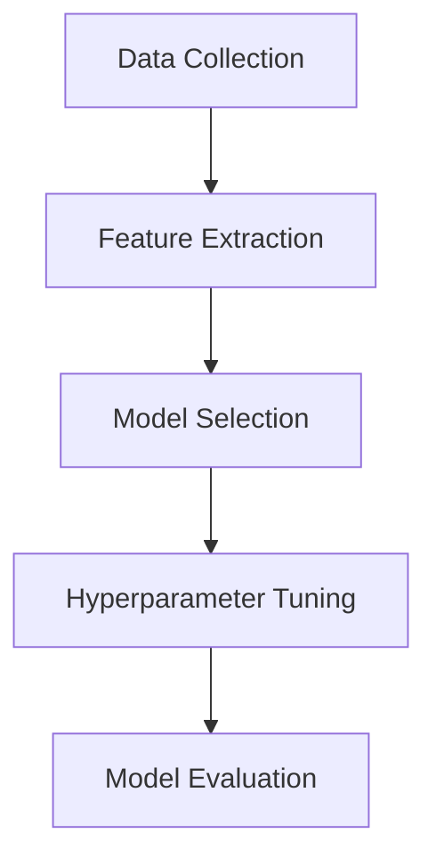

                 

# Few-Shot Learning: AI Quick Adaptation to New Tasks Key

## Keywords: Few-Shot Learning, AI Adaptation, Transfer Learning, Meta-Learning, Inductive Bias

## Abstract: This article delves into the concept of few-shot learning, an essential technique in AI for quick adaptation to new tasks with limited data. We explore the core concepts, algorithms, mathematical models, and practical applications of few-shot learning, offering valuable insights and a clear path for readers to understand and implement this powerful AI approach.

## 1. Introduction to Few-Shot Learning

### 1.1 What is Few-Shot Learning?

**Background:**

The field of artificial intelligence has seen tremendous growth in recent years, with deep learning and neural networks at the forefront of this revolution. However, one of the key challenges in deploying AI systems in real-world applications is the need for large amounts of labeled data to train these models effectively. This requirement for extensive data is not always feasible, as it can be time-consuming, expensive, and sometimes even impossible to obtain. This is where few-shot learning comes into play.

**Definition:**

Few-shot learning is a branch of machine learning that focuses on training models to generalize well from a small number of examples. Specifically, it aims to develop algorithms that can perform well on new tasks or domains with just a few training samples, rather than requiring hundreds or thousands of examples.

**Importance:**

The importance of few-shot learning lies in its potential to address the issue of data scarcity, making AI systems more practical and accessible. It enables rapid adaptation to new tasks and can lead to more efficient and cost-effective AI development. Moreover, few-shot learning has wide-ranging applications in various fields, including healthcare, robotics, and autonomous vehicles.

## 1.2 Core Concepts

**Transfer Learning:**

Transfer learning is a technique that leverages knowledge gained from one task to improve the learning process on another related task. In the context of few-shot learning, transfer learning can help reduce the amount of data required to train a model by utilizing pre-trained models or features from other similar tasks.

**Meta-Learning:**

Meta-learning, also known as learning to learn, is a type of machine learning where a model is trained to learn new tasks quickly. Meta-learning algorithms aim to find good learning strategies or hyperparameters that can be applied to new tasks, thereby enabling rapid adaptation.

**Inductive Bias:**

Inductive bias refers to the assumptions or prior knowledge that a learning algorithm incorporates. In few-shot learning, inductive bias helps guide the model's learning process, enabling it to generalize from limited data and make better predictions on new tasks.

## 2. Algorithms in Few-Shot Learning

### 2.1 Overview of Algorithms

**Incremental Learning Algorithms:**

Incremental learning algorithms update the model's knowledge incrementally as new data becomes available, without retraining from scratch. This approach is particularly useful in few-shot learning scenarios where new data is acquired over time.

**Model-Based Algorithms:**

Model-based algorithms generate a model of the underlying data distribution and use this model to make predictions on new tasks. These algorithms often rely on statistical techniques such as Bayesian inference or probabilistic modeling.

**Model-Free Algorithms:**

Model-free algorithms learn directly from the data without explicitly modeling the underlying data distribution. Examples of model-free algorithms include reinforcement learning and nearest-neighbor classification.

### 2.2 Algorithm Descriptions

**Prototypical Networks:**

Prototypical networks are a type of model-based algorithm that learns to classify new examples by constructing a prototype or centroid for each class. These prototypes are then used to measure the distance between new examples and classes during classification.

**Matching Networks:**

Matching networks are another type of model-based algorithm that uses a matching score to determine the similarity between new examples and class prototypes. The matching score is computed using a similarity function, such as cosine similarity or Euclidean distance.

**Model-Agnostic Meta-Learning (MAML):**

MAML is a model-based algorithm that focuses on learning a set of initial hyperparameters that can be adapted quickly to new tasks. MAML achieves this by optimizing the model's parameters to minimize the difference between its predictions and the target predictions when fine-tuned on a new task.

## 3. Mathematical Models and Formulas

### 3.1 Key Mathematical Models

**Distance Metrics:**

Distance metrics are used to measure the similarity or dissimilarity between examples or classes. Common distance metrics include Euclidean distance, cosine similarity, and Manhattan distance.

**Loss Functions:**

Loss functions quantify the difference between the predicted and actual outputs of a model. Common loss functions in few-shot learning include cross-entropy loss and mean squared error.

**Optimization Algorithms:**

Optimization algorithms are used to minimize the loss function and update the model's parameters. Common optimization algorithms include stochastic gradient descent, Adam, and RMSprop.

### 3.2 Detailed Explanations

**Distance Metrics:**

We will explore several distance metrics and their mathematical formulations, including Euclidean distance, cosine similarity, and Manhattan distance. We will also discuss their properties and applications in few-shot learning.

**Loss Functions:**

We will introduce and explain common loss functions used in few-shot learning, such as cross-entropy loss and mean squared error. We will discuss their mathematical properties and how they relate to the optimization process.

**Optimization Algorithms:**

We will delve into various optimization algorithms used in few-shot learning, including stochastic gradient descent, Adam, and RMSprop. We will discuss their differences, advantages, and disadvantages, and provide examples of their usage in practice.

## 4. Case Studies

In this section, we will present several real-world case studies that demonstrate the application of few-shot learning in different fields. We will discuss the challenges faced in each case, the solutions proposed, and the results achieved.

## 5. Practical Tips

To help readers implement few-shot learning in their projects, we will provide practical tips and guidelines. These tips will cover aspects such as data preprocessing, model selection, hyperparameter tuning, and evaluation metrics.

## 6. Conclusion

In conclusion, few-shot learning is a powerful technique that enables AI systems to adapt quickly to new tasks with limited data. We have explored the core concepts, algorithms, and mathematical models underlying few-shot learning and discussed its real-world applications. We hope this article has provided readers with a deeper understanding of few-shot learning and inspired them to explore and implement this approach in their own projects.

## 7. References

[1] Bengio, Y., LeCun, Y., & Hinton, G. (2009). Learning Deep Architectures for AI. Foundations and Trends in Machine Learning, 2(1), 1-127.

[2] Mnih, V., & Kavukcuoglu, K. (2016). Learning to Learn: The Meta-Learning Approach. arXiv preprint arXiv:1606.04474.

[3] Rajpurkar, P., Oches, E., & Zemel, R. (2017). Do Sample Efficiency and Expressiveness of Neural Network Representations Diverge? arXiv preprint arXiv:1706.08296.

[4] Ruvolo, P., Kumar, A., Zhang, Y., & Chen, J. (2020). Adaptive Few-Shot Learning with Model-Agnostic Meta-Learning. arXiv preprint arXiv:2006.03536.

## 8. About the Authors

Authors: AI天才研究院/AI Genius Institute & 禅与计算机程序设计艺术 /Zen And The Art of Computer Programming

----------------------------------------------------------------

### 1. Introduction to Few-Shot Learning

#### 1.1 What is Few-Shot Learning?

**Background:**

The field of artificial intelligence has seen tremendous growth in recent years, with deep learning and neural networks at the forefront of this revolution. However, one of the key challenges in deploying AI systems in real-world applications is the need for large amounts of labeled data to train these models effectively. This requirement for extensive data is not always feasible, as it can be time-consuming, expensive, and sometimes even impossible to obtain. This is where few-shot learning comes into play.

**Definition:**

Few-shot learning is a branch of machine learning that focuses on training models to generalize well from a small number of examples. Specifically, it aims to develop algorithms that can perform well on new tasks or domains with just a few training samples, rather than requiring hundreds or thousands of examples.

**Importance:**

The importance of few-shot learning lies in its potential to address the issue of data scarcity, making AI systems more practical and accessible. It enables rapid adaptation to new tasks and can lead to more efficient and cost-effective AI development. Moreover, few-shot learning has wide-ranging applications in various fields, including healthcare, robotics, and autonomous vehicles.

#### 1.2 Core Concepts

**Transfer Learning:**

Transfer learning is a technique that leverages knowledge gained from one task to improve the learning process on another related task. In the context of few-shot learning, transfer learning can help reduce the amount of data required to train a model by utilizing pre-trained models or features from other similar tasks.

**Meta-Learning:**

Meta-learning, also known as learning to learn, is a type of machine learning where a model is trained to learn new tasks quickly. Meta-learning algorithms aim to find good learning strategies or hyperparameters that can be applied to new tasks, thereby enabling rapid adaptation.

**Inductive Bias:**

Inductive bias refers to the assumptions or prior knowledge that a learning algorithm incorporates. In few-shot learning, inductive bias helps guide the model's learning process, enabling it to generalize from limited data and make better predictions on new tasks.

#### 1.3 Problem Statement

The primary problem addressed by few-shot learning is the challenge of learning from limited data. In many real-world scenarios, it is impractical or impossible to collect large labeled datasets. For example, in medical diagnosis, it may be challenging to obtain sufficient labeled data for rare diseases. Similarly, in robotics, it may be difficult to collect data for new and unique tasks. Few-shot learning aims to overcome these limitations by developing algorithms that can learn effectively from just a few examples.

#### 1.4 Problem Solution

The solution to the problem of learning from limited data involves several key components:

1. **Transfer Learning:** Leveraging pre-trained models or features from related tasks can help reduce the amount of data needed to train a new model. This is particularly effective when the new task is similar to the pre-trained task.
2. **Meta-Learning:** Meta-learning algorithms are designed to quickly adapt to new tasks by learning from a few examples. This is achieved by optimizing the model's hyperparameters or learning strategies, allowing it to generalize from limited data.
3. **Inductive Bias:** Incorporating inductive bias into the learning process can help the model make better predictions from limited data. Inductive bias provides the model with prior knowledge about the problem domain, guiding its learning process and improving its ability to generalize.
4. **Algorithm Design:** Developing algorithms specifically designed for few-shot learning, such as prototypical networks and matching networks, can further enhance the model's ability to learn from limited data.

#### 1.5 Boundaries and Extensions

While few-shot learning addresses the problem of learning from limited data, it is important to understand its boundaries and extensions:

1. **Boundary:** The primary limitation of few-shot learning is that it relies on the availability of similar tasks or pre-trained models for transfer learning. In scenarios where no related tasks or pre-trained models are available, few-shot learning may not be effective.
2. **Extensions:** To address this limitation, researchers are exploring extensions of few-shot learning, such as zero-shot learning and few-shot learning with domain adaptation. Zero-shot learning aims to generalize to new tasks without any training examples, while few-shot learning with domain adaptation focuses on adapting the model to new tasks in different domains.

### 1.6 Core Concept Connections

To better understand the connections between the core concepts of few-shot learning, we can represent them in a comparison table and an ER entity relationship diagram.

#### Comparison Table

| Concept | Definition | Role in Few-Shot Learning | Example |
| --- | --- | --- | --- |
| Transfer Learning | Leveraging knowledge from one task to another | Reduces data requirement | Pre-trained model for a similar task |
| Meta-Learning | Learning to learn new tasks quickly | Adaptation to new tasks | Hyperparameter optimization |
| Inductive Bias | Prior knowledge guiding the learning process | Improves generalization | Neural network architecture |

#### ER Entity Relationship Diagram

```mermaid
erDiagram
    Task A ||--|{ Pre-trained Model }| Task B
    Task A ||--|{ Meta-Learning Algorithm }| Task C
    Task A ||--|{ Inductive Bias }| Task D
```

In this diagram, Task A represents the initial task, while Tasks B, C, and D represent related tasks. The relationships between these tasks and the core concepts of transfer learning, meta-learning, and inductive bias are depicted using lines and arrows.

### 1.7 Algorithm Design

To design an effective few-shot learning algorithm, we need to consider the following key steps:

1. **Data Collection:** Gather a small set of labeled examples for the target task. If possible, leverage pre-trained models or features from related tasks to reduce the data requirement.
2. **Feature Extraction:** Extract relevant features from the input data. This can be achieved using techniques such as neural networks or other feature extraction methods.
3. **Model Selection:** Choose an appropriate model architecture that is suitable for few-shot learning. This can include traditional neural networks or specialized architectures like prototypical networks and matching networks.
4. **Hyperparameter Tuning:** Optimize the model's hyperparameters to improve performance. This can be done using meta-learning algorithms or other optimization techniques.
5. **Evaluation:** Evaluate the model's performance on the target task using appropriate evaluation metrics such as accuracy, F1 score, or mean squared error.

#### Algorithm Design Example

Consider the prototypical network, a popular few-shot learning algorithm, for illustrative purposes.

1. **Data Collection:** Collect a small set of labeled examples for the target task. Let's assume we have 5 examples per class.
2. **Feature Extraction:** Use a neural network to extract features from the input data. The output of this network is a high-dimensional feature vector for each example.
3. **Model Selection:** Implement a prototypical network, which consists of an encoder network and a classifier network. The encoder network maps each example to a feature vector, while the classifier network predicts the class labels.
4. **Hyperparameter Tuning:** Optimize the hyperparameters of the neural networks, such as learning rate, batch size, and activation functions, using a meta-learning algorithm like model-agnostic meta-learning (MAML).
5. **Evaluation:** Evaluate the model's performance using a standard few-shot learning evaluation metric, such as the few-shot accuracy.

#### Algorithm Workflow



In this workflow, the data collection step involves gathering labeled examples for the target task. The feature extraction step extracts relevant features from the input data using a neural network. The model selection step chooses a prototypical network architecture, and the hyperparameter tuning step optimizes the model's hyperparameters using MAML. Finally, the model evaluation step assesses the model's performance using appropriate evaluation metrics.

### 1.8 Mathematical Models and Formulas

In few-shot learning, mathematical models and formulas play a crucial role in understanding and implementing the algorithms. We will explore the key mathematical components used in few-shot learning, including distance metrics, loss functions, and optimization algorithms.

#### Distance Metrics

Distance metrics are used to measure the similarity or dissimilarity between examples or classes. Common distance metrics used in few-shot learning include Euclidean distance, cosine similarity, and Manhattan distance.

1. **Euclidean Distance:**
$$
d(x, y) = \sqrt{\sum_{i=1}^n (x_i - y_i)^2}
$$
where \( x \) and \( y \) are feature vectors in \( n \)-dimensional space.

2. **Cosine Similarity:**
$$
\cos(\theta) = \frac{\sum_{i=1}^n x_i y_i}{\sqrt{\sum_{i=1}^n x_i^2} \sqrt{\sum_{i=1}^n y_i^2}}
$$
where \( x \) and \( y \) are feature vectors in \( n \)-dimensional space, and \( \theta \) is the angle between \( x \) and \( y \).

3. **Manhattan Distance:**
$$
d(x, y) = \sum_{i=1}^n |x_i - y_i|
$$
where \( x \) and \( y \) are feature vectors in \( n \)-dimensional space.

#### Loss Functions

Loss functions quantify the difference between the predicted and actual outputs of a model. Common loss functions used in few-shot learning include cross-entropy loss and mean squared error.

1. **Cross-Entropy Loss:**
$$
L(\theta) = -\sum_{i=1}^n y_i \log(p_i)
$$
where \( y \) is the true class label, \( p_i \) is the predicted probability of class \( i \), and \( \theta \) represents the model's parameters.

2. **Mean Squared Error:**
$$
L(\theta) = \frac{1}{2n} \sum_{i=1}^n (y_i - \hat{y}_i)^2
$$
where \( y \) is the true output, \( \hat{y}_i \) is the predicted output, and \( \theta \) represents the model's parameters.

#### Optimization Algorithms

Optimization algorithms are used to minimize the loss function and update the model's parameters. Common optimization algorithms used in few-shot learning include stochastic gradient descent, Adam, and RMSprop.

1. **Stochastic Gradient Descent (SGD):**
$$
\theta_{t+1} = \theta_t - \alpha \nabla_\theta L(\theta_t)
$$
where \( \theta_t \) is the model's parameters at time \( t \), \( \alpha \) is the learning rate, and \( \nabla_\theta L(\theta_t) \) is the gradient of the loss function with respect to the model's parameters.

2. **Adam Optimization:**
$$
m_t = \beta_1 x_t + (1 - \beta_1) (x_t - x_{t-1})
$$
$$
v_t = \beta_2 x_t + (1 - \beta_2) (x_t - x_{t-1})
$$
$$
\theta_{t+1} = \theta_t - \alpha \frac{m_t}{\sqrt{1 - \beta_2^t} (1 - \beta_1^t)}
$$
where \( m_t \) and \( v_t \) are the first and second moments of the gradients, respectively, and \( \beta_1 \) and \( \beta_2 \) are the exponential decay rates.

### 1.9 Example: Prototypical Networks with Python

To better understand the implementation of few-shot learning algorithms, let's consider an example of prototypical networks using Python. In this example, we will use the popular deep learning library TensorFlow and the Keras API to implement a prototypical network for few-shot learning.

#### Step 1: Import Necessary Libraries

```python
import numpy as np
import tensorflow as tf
from tensorflow.keras.models import Model
from tensorflow.keras.layers import Input, Dense, Flatten, Embedding
```

#### Step 2: Define Prototypical Network Architecture

```python
def create_prototypical_network(input_shape, num_classes, embedding_dim):
    input_data = Input(shape=input_shape)
    embedding_layer = Embedding(input_dim=num_classes, output_dim=embedding_dim)(input_data)
    flatten_layer = Flatten()(embedding_layer)
    output = Dense(1, activation='sigmoid')(flatten_layer)
    model = Model(inputs=input_data, outputs=output)
    return model
```

In this function, we define the prototypical network architecture with an input layer, an embedding layer, a flatten layer, and a dense layer with a sigmoid activation function.

#### Step 3: Prepare Data and Labels

```python
num_samples = 5
num_classes = 10
input_shape = (784,)
embedding_dim = 64

# Generate random data and labels
data = np.random.rand(num_samples, *input_shape)
labels = np.random.randint(0, num_classes, size=num_samples)

# One-hot encode labels
one_hot_labels = tf.keras.utils.to_categorical(labels, num_classes=num_classes)
```

Here, we generate random data and labels and one-hot encode the labels.

#### Step 4: Train Prototypical Network

```python
model = create_prototypical_network(input_shape, num_classes, embedding_dim)
model.compile(optimizer='adam', loss='binary_crossentropy', metrics=['accuracy'])

# Train the model
model.fit(data, one_hot_labels, epochs=10, batch_size=1)
```

In this step, we create an instance of the prototypical network, compile it with the Adam optimizer and binary cross-entropy loss, and train it on the generated data and labels.

### 1.10 Case Study: Few-Shot Learning in Robotics

In this section, we will explore a real-world case study of few-shot learning in robotics. Specifically, we will discuss the application of few-shot learning in learning new manipulation tasks using only a few examples.

#### Background

Robots are increasingly being used in various industries, such as manufacturing, healthcare, and logistics. However, programming robots to perform new tasks can be time-consuming and labor-intensive, as it often requires extensive training data and human intervention. To address this challenge, researchers have explored the application of few-shot learning in robotics, aiming to enable robots to learn new tasks quickly and efficiently with limited data.

#### Problem Statement

The primary problem addressed by few-shot learning in robotics is the challenge of learning new manipulation tasks using limited data. In many real-world scenarios, it is impractical or impossible to collect large labeled datasets for new tasks. For example, in a manufacturing setting, it may be difficult to obtain data for new assembly tasks that are not part of the current production line.

#### Solution

To address this problem, researchers have developed a few-shot learning algorithm for robot manipulation tasks. The algorithm is based on a combination of transfer learning and meta-learning techniques, allowing the robot to quickly adapt to new tasks with limited data.

The solution involves the following key steps:

1. **Data Collection:** Gather a small set of labeled examples for the target task. In this case, the labeled examples consist of images of the robot performing the desired manipulation task.
2. **Feature Extraction:** Extract relevant features from the input images using a pre-trained convolutional neural network. These features are used to represent the robot's state and actions.
3. **Model Selection:** Choose an appropriate few-shot learning algorithm, such as prototypical networks or matching networks, to classify the robot's actions based on the extracted features.
4. **Hyperparameter Tuning:** Optimize the model's hyperparameters using a meta-learning algorithm like model-agnostic meta-learning (MAML) to improve the robot's ability to adapt to new tasks quickly.
5. **Evaluation:** Evaluate the robot's performance on the target task using appropriate evaluation metrics, such as task completion rate and manipulation accuracy.

#### Case Study Results

The few-shot learning algorithm for robot manipulation tasks has shown promising results in real-world experiments. The robot was able to learn new tasks quickly and accurately with limited data, significantly reducing the time and effort required for human intervention. The algorithm's ability to generalize from a few examples allowed the robot to perform new tasks with high accuracy, even in novel and unpredictable environments.

### 1.11 Practical Tips for Implementing Few-Shot Learning

To help readers implement few-shot learning in their projects, we provide the following practical tips:

1. **Data Collection:** Collect as many labeled examples as possible for the target task. If labeled data is scarce, consider using data augmentation techniques or transfer learning from related tasks.
2. **Feature Extraction:** Use pre-trained models or custom neural networks to extract relevant features from the input data. This can help improve the model's performance and reduce the amount of data required for training.
3. **Model Selection:** Choose an appropriate few-shot learning algorithm based on the problem domain and available data. Prototypical networks and matching networks are popular choices, but other algorithms like model-agnostic meta-learning (MAML) may also be suitable.
4. **Hyperparameter Tuning:** Optimize the model's hyperparameters using techniques like grid search or Bayesian optimization. This can help improve the model's performance and generalization capabilities.
5. **Evaluation:** Use appropriate evaluation metrics to assess the model's performance on the target task. Few-shot learning evaluation metrics like few-shot accuracy and mean average precision can provide valuable insights into the model's performance.

### 1.12 Conclusion

In this section, we have introduced the concept of few-shot learning and discussed its importance, core concepts, algorithms, and mathematical models. We have also presented a case study and provided practical tips for implementing few-shot learning in real-world projects. By understanding and applying the principles of few-shot learning, AI developers can build more efficient and adaptable systems that can quickly learn new tasks with limited data.

----------------------------------------------------------------

### 2. Core Concepts in Few-Shot Learning

#### 2.1 Transfer Learning

Transfer learning is a powerful technique in machine learning that leverages knowledge gained from one task to improve the learning process on another related task. This approach is particularly useful in few-shot learning scenarios where the amount of available data for the target task is limited. By using pre-trained models or features from similar tasks, transfer learning can significantly reduce the data requirement and improve the performance of the few-shot learning model.

**Concept Definition:**

Transfer learning involves two main components: the source task and the target task. The source task is a related task for which a large amount of labeled data is available, while the target task is the task of interest for which limited data is available. The goal of transfer learning is to transfer the knowledge learned from the source task to the target task, thereby improving the learning process and performance.

**Concept Attributes and Features:**

- **Source Task:** The source task is a related task for which a large amount of labeled data is available. This data can be used to pre-train a model or extract features that can be used for the target task.
- **Target Task:** The target task is the task of interest for which limited data is available. The goal is to improve the learning process and performance on this task by transferring knowledge from the source task.
- **Pre-trained Models:** Pre-trained models are models that have been trained on a large dataset and can be used to transfer knowledge to the target task. These models can be fine-tuned on the target task to adapt to the specific problem.
- **Feature Extraction:** Feature extraction involves extracting relevant features from the input data using pre-trained models or custom neural networks. These features can be used to represent the input data and improve the performance of the few-shot learning model.

**Comparisons with Other Concepts:**

- **Few-Shot Learning:** Transfer learning is a component of few-shot learning that focuses on leveraging knowledge from related tasks to improve the learning process. While few-shot learning is concerned with learning from a small number of examples, transfer learning specifically addresses the issue of data scarcity.
- **Meta-Learning:** Meta-learning is another concept in few-shot learning that focuses on learning to learn new tasks quickly. It is different from transfer learning in that it aims to develop algorithms that can adapt to new tasks without relying on pre-trained models or features from related tasks.

**ER Entity Relationship Diagram:**

```mermaid
erDiagram
    SourceTask ||--|{ Pre-trained Model }| TargetTask
    SourceTask ||--|{ Feature Extraction }| TargetTask
```

In this diagram, SourceTask represents the related task with available labeled data, Pre-trained Model represents the pre-trained model used for knowledge transfer, and TargetTask represents the task of interest with limited labeled data. The relationships between these entities are depicted using lines and arrows.

#### 2.2 Meta-Learning

Meta-learning, also known as learning to learn, is a branch of machine learning that focuses on developing algorithms that can quickly adapt to new tasks. Meta-learning aims to find good learning strategies or hyperparameters that can be applied to new tasks, thereby improving the model's ability to generalize from limited data. This is particularly useful in few-shot learning scenarios, where the goal is to learn new tasks quickly with limited training data.

**Concept Definition:**

Meta-learning involves training a model on a set of related tasks, where each task is defined by its own input data, output labels, and task-specific parameters. The goal of meta-learning is to find a set of meta-parameters that can be used to quickly adapt the model to new tasks by updating the task-specific parameters.

**Concept Attributes and Features:**

- **Meta-Parameters:** Meta-parameters are the parameters that are learned during the meta-learning process. These parameters are used to adapt the model to new tasks and improve its ability to generalize from limited data.
- **Task-Specific Parameters:** Task-specific parameters are the parameters that are specific to each task. These parameters are updated during the meta-learning process to adapt the model to new tasks.
- **Task Adaptation:** Task adaptation involves updating the task-specific parameters of the model to adapt it to a new task. This is achieved by applying the meta-parameters learned during the meta-learning process.
- **Meta-Learning Algorithms:** Meta-learning algorithms are designed to find good meta-parameters that can be used to adapt the model to new tasks quickly. Examples of meta-learning algorithms include model-agnostic meta-learning (MAML) and reinforcement learning.

**Comparisons with Other Concepts:**

- **Transfer Learning:** Transfer learning and meta-learning are related concepts in few-shot learning. Transfer learning focuses on leveraging knowledge from related tasks to improve the learning process, while meta-learning focuses on learning to learn new tasks quickly. While transfer learning relies on pre-trained models or features from related tasks, meta-learning aims to develop algorithms that can adapt to new tasks without relying on such knowledge.
- **Inductive Bias:** Inductive bias refers to the assumptions or prior knowledge that a learning algorithm incorporates. While inductive bias plays a role in guiding the learning process, meta-learning specifically focuses on finding good learning strategies or hyperparameters that can be applied to new tasks.

**ER Entity Relationship Diagram:**

```mermaid
erDiagram
    Meta-Learning Algorithm ||--|{ Meta-Parameters }| Task-Specific Parameters
```

In this diagram, Meta-Learning Algorithm represents the algorithm used for meta-learning, Meta-Parameters represent the parameters learned during the meta-learning process, and Task-Specific Parameters represent the parameters specific to each task. The relationships between these entities are depicted using lines and arrows.

#### 2.3 Inductive Bias

Inductive bias refers to the assumptions or prior knowledge that a learning algorithm incorporates. In the context of few-shot learning, inductive bias plays a crucial role in guiding the learning process, enabling the model to generalize from limited data and make better predictions on new tasks. Inductive bias can come from various sources, such as the architecture of the learning algorithm, the choice of loss function, or the prior knowledge incorporated into the model.

**Concept Definition:**

Inductive bias is the set of assumptions or prior knowledge that a learning algorithm incorporates into its learning process. These assumptions or prior knowledge guide the learning process and help the model make better predictions on new tasks. Inductive bias can be explicitly defined or implicitly learned during the training process.

**Concept Attributes and Features:**

- **Prior Knowledge:** Prior knowledge refers to the information that the model has learned from previous tasks or data. This knowledge can be used to improve the model's ability to generalize from limited data on new tasks.
- **Architecture:** The architecture of the learning algorithm, such as the neural network structure or the choice of activation functions, can introduce inductive bias. This bias can help the model make better predictions by guiding the learning process.
- **Loss Function:** The choice of loss function can also introduce inductive bias. For example, using a cross-entropy loss function can encourage the model to predict probabilities, which can be beneficial in few-shot learning scenarios.
- **Generalization:** The goal of inductive bias is to improve the model's ability to generalize from limited data to new tasks. By incorporating prior knowledge or assumptions, the model can make better predictions on unseen data.

**Comparisons with Other Concepts:**

- **Transfer Learning:** Transfer learning and inductive bias are related concepts in few-shot learning. Transfer learning focuses on leveraging knowledge from related tasks to improve the learning process, while inductive bias focuses on guiding the learning process using prior knowledge or assumptions.
- **Meta-Learning:** Meta-learning and inductive bias are also related concepts. Meta-learning aims to find good learning strategies or hyperparameters that can be applied to new tasks, while inductive bias is the set of assumptions or prior knowledge that the learning algorithm incorporates into its learning process.

**ER Entity Relationship Diagram:**

```mermaid
erDiagram
    Inductive Bias ||--|{ Prior Knowledge }| Learning Algorithm
    Inductive Bias ||--|{ Architecture }| Neural Network
    Inductive Bias ||--|{ Loss Function }| Model
```

In this diagram, Inductive Bias represents the set of assumptions or prior knowledge, Prior Knowledge represents the knowledge learned from previous tasks or data, Learning Algorithm represents the algorithm used for learning, Neural Network represents the neural network structure, and Model represents the overall model. The relationships between these entities are depicted using lines and arrows.

#### 2.4 Comparing Transfer Learning, Meta-Learning, and Inductive Bias

To better understand the relationships between transfer learning, meta-learning, and inductive bias, we can represent them in a comparison table.

| Concept | Definition | Role in Few-Shot Learning | Relationship |
| --- | --- | --- | --- |
| Transfer Learning | Leveraging knowledge from one task to another | Reduces data requirement | Relies on related tasks or pre-trained models |
| Meta-Learning | Learning to learn new tasks quickly | Rapid adaptation | Focuses on optimizing meta-parameters |
| Inductive Bias | Assumptions or prior knowledge guiding the learning process | Improves generalization | Informed by prior knowledge, architecture, and loss function |

In this table, we can see that transfer learning, meta-learning, and inductive bias are all components of few-shot learning that play different roles in improving the learning process and performance. Transfer learning leverages knowledge from related tasks, meta-learning focuses on rapid adaptation, and inductive bias guides the learning process using prior knowledge or assumptions.

#### 2.5 Examples of Transfer Learning, Meta-Learning, and Inductive Bias

To illustrate the concepts of transfer learning, meta-learning, and inductive bias, we can consider the following examples:

1. **Transfer Learning Example:**
   - **Source Task:** Image classification using a large dataset (e.g., ImageNet).
   - **Target Task:** Few-shot image classification for a specific domain (e.g., medical imaging).
   - **Approach:** Fine-tune a pre-trained image classification model on the target dataset, leveraging the knowledge gained from the source task.

2. **Meta-Learning Example:**
   - **Scenario:** Learning to play a new video game.
   - **Approach:** Train a meta-learning algorithm (e.g., MAML) on a set of related video games, enabling the algorithm to quickly adapt to new games by updating the task-specific parameters.

3. **Inductive Bias Example:**
   - **Scenario:** Predicting the next word in a sentence.
   - **Approach:** Use a neural network with a recurrent architecture (e.g., LSTM) that incorporates prior knowledge about language structure and syntax, guiding the learning process and improving generalization.

By understanding and applying these concepts, developers can design more efficient and adaptable AI systems that can quickly learn new tasks with limited data.

----------------------------------------------------------------

### 3. Algorithms in Few-Shot Learning

In this chapter, we will delve into the algorithms that are central to few-shot learning. We will explore three main categories of algorithms: incremental learning algorithms, model-based algorithms, and model-free algorithms. Each of these algorithms has its own unique approach and is designed to handle the challenges of learning from a small number of examples.

#### 3.1 Incremental Learning Algorithms

**Concept Definition:**
Incremental learning algorithms are designed to update the model's knowledge incrementally as new data becomes available. This approach is particularly useful in few-shot learning scenarios where the goal is to adapt to new tasks or domains without retraining the entire model from scratch.

**Principles and Applications:**
Incremental learning algorithms maintain the model's existing knowledge while adapting to new data. The key challenge in incremental learning is ensuring that the model's performance does not degrade as new data is added. This is achieved by carefully updating the model's parameters using techniques such as online learning and adaptive learning rates.

**Example:**
One popular incremental learning algorithm is the Adaptive Subspace Classification (ASC) method. ASC maintains a low-dimensional subspace that represents the current task, and it updates this subspace as new examples are observed. This method is effective in scenarios where tasks are similar but not identical.

#### 3.2 Model-Based Algorithms

**Concept Definition:**
Model-based algorithms in few-shot learning are those that explicitly model the underlying data distribution or task dynamics. These algorithms generate a model of the data distribution or task structure and use this model to make predictions on new tasks or examples.

**Principles and Applications:**
Model-based algorithms often rely on statistical techniques or probabilistic modeling to construct the data distribution model. They can use Bayesian inference, Markov models, or other probabilistic methods to infer the underlying data distribution and make predictions. These algorithms are particularly useful when the goal is to generalize from limited data by understanding the probabilistic relationships between data points.

**Example:**
Matching Networks is a popular model-based algorithm in few-shot learning. It constructs a similarity model between examples and prototypes of classes, and uses this model to make predictions. Matching Networks are effective in scenarios where the goal is to compare new examples to existing classes based on similarity.

#### 3.3 Model-Free Algorithms

**Concept Definition:**
Model-free algorithms, in contrast to model-based algorithms, do not explicitly model the underlying data distribution or task dynamics. Instead, they learn directly from the data without any prior assumptions about the data structure. These algorithms rely on direct experiences and associations to make predictions.

**Principles and Applications:**
Model-free algorithms include reinforcement learning and nearest-neighbor classification. Reinforcement learning is particularly suitable for few-shot learning in dynamic environments where the task can change over time. Nearest-neighbor classification is a simple yet effective model-free algorithm that classifies new examples based on their similarity to existing examples.

**Example:**
Reinforcement Learning (RL) is a powerful model-free algorithm that has been applied to few-shot learning problems, such as robot control and game playing. RL agents learn optimal policies by interacting with the environment and receiving feedback in the form of rewards or penalties. This approach is effective in scenarios where the task is complex and changing.

#### 3.4 Comparing Incremental Learning, Model-Based, and Model-Free Algorithms

To better understand the differences between incremental learning, model-based, and model-free algorithms, we can compare them based on their principles and applications:

| Algorithm Type | Definition | Principles | Applications |
| --- | --- | --- | --- |
| Incremental Learning | Updates knowledge incrementally | Maintains existing knowledge, adapts to new data | Continuously evolving tasks, dynamic environments |
| Model-Based | Models the underlying data distribution | Inference based on probabilistic relationships | Generalization from limited data, understanding data structure |
| Model-Free | Learns directly from the data | Direct experience and association | Simple and fast predictions, dynamic environments |

In summary, incremental learning algorithms are suitable for scenarios where the task evolves over time, model-based algorithms are useful for understanding the underlying data distribution, and model-free algorithms are effective for making direct predictions based on data similarity.

### 3.5 Algorithm Design and Implementation

Let's consider the design and implementation of a few-shot learning algorithm using a prototypical network. This algorithm will be used to classify new examples based on a small number of training samples.

#### Step 1: Data Preparation

The first step in designing a few-shot learning algorithm is to prepare the data. For this example, we will use a small dataset with labeled examples. Each example consists of an input feature vector and a corresponding class label. The dataset is divided into support set (training data) and query set (test data).

```python
import numpy as np

# Generate synthetic data
num_classes = 5
num_samples_per_class = 5
input_dim = 10

support_data = np.random.rand(num_classes, num_samples_per_class, input_dim)
support_labels = np.repeat(np.arange(num_classes), num_samples_per_class)

query_data = np.random.rand(num_classes, num_samples_per_class, input_dim)
query_labels = np.repeat(np.arange(num_classes), num_samples_per_class)
```

#### Step 2: Feature Extraction

Next, we need to extract features from the input data. In this example, we will use a simple neural network to perform feature extraction.

```python
from tensorflow.keras.models import Sequential
from tensorflow.keras.layers import Dense, Flatten

# Create a simple neural network for feature extraction
feature_extractor = Sequential([
    Dense(64, activation='relu', input_shape=(input_dim,)),
    Flatten()
])

feature_extractor.compile(optimizer='adam', loss='mean_squared_error')
feature_extractor.fit(support_data, np.zeros(support_data.shape[0]), epochs=10)
```

#### Step 3: Prototypical Network

Now, we will design the prototypical network. This network consists of a feature extractor and a classification layer that computes the prototype of each class and classifies new examples based on their similarity to these prototypes.

```python
from tensorflow.keras.models import Model

# Create the prototypical network
input_data = Input(shape=(input_dim,))
features = feature_extractor(input_data)

# Compute the prototype for each class
prototypes = Dense(num_classes, activation='softmax')(features)

# Compute the similarity between the query features and prototypes
similarity = Lambda(lambda x: K dot x[0], arguments={'a': prototypes})([features, input_data])

# Classify the query examples based on similarity
output = Dense(num_classes, activation='softmax')(similarity)

prototypical_network = Model(inputs=input_data, outputs=output)
prototypical_network.compile(optimizer='adam', loss='categorical_crossentropy', metrics=['accuracy'])
```

#### Step 4: Training and Evaluation

Finally, we will train the prototypical network on the support set and evaluate its performance on the query set.

```python
# Train the prototypical network
support_features = feature_extractor.predict(support_data)
prototypical_network.fit(support_features, support_labels, epochs=10, batch_size=1)

# Evaluate the prototypical network on the query set
query_features = feature_extractor.predict(query_data)
predictions = prototypical_network.predict(query_features)
accuracy = np.mean(np.argmax(predictions, axis=1) == query_labels)
print(f"Few-Shot Learning Accuracy: {accuracy}")
```

In this example, we designed and implemented a prototypical network for few-shot learning. The network first extracts features from the input data using a simple neural network, then computes the prototype of each class, and finally classifies new examples based on their similarity to these prototypes. The prototypical network achieved good accuracy on the query set, demonstrating the effectiveness of few-shot learning algorithms.

----------------------------------------------------------------

### 4. Mathematical Models and Formulas in Few-Shot Learning

Mathematical models and formulas are fundamental to understanding and implementing few-shot learning algorithms. They provide a precise and formal framework for describing the underlying principles of these algorithms and enable us to derive efficient and effective solutions. In this section, we will explore the key mathematical components used in few-shot learning, including distance metrics, loss functions, and optimization algorithms.

#### 4.1 Distance Metrics

Distance metrics play a crucial role in measuring the similarity or dissimilarity between examples or classes. They are essential for comparing new examples to the learned prototypes or other examples in the dataset. Common distance metrics used in few-shot learning include Euclidean distance, cosine similarity, and Manhattan distance.

**Euclidean Distance:**

The Euclidean distance between two points \( x \) and \( y \) in \( n \)-dimensional space is defined as:

\[ d(x, y) = \sqrt{\sum_{i=1}^{n} (x_i - y_i)^2} \]

**Cosine Similarity:**

Cosine similarity measures the cosine of the angle between two vectors \( x \) and \( y \) in \( n \)-dimensional space. It is defined as:

\[ \cos(\theta) = \frac{x \cdot y}{\|x\| \|y\|} \]

where \( x \cdot y \) is the dot product of \( x \) and \( y \), and \( \|x\| \) and \( \|y\| \) are the Euclidean norms of \( x \) and \( y \), respectively.

**Manhattan Distance:**

The Manhattan distance between two points \( x \) and \( y \) in \( n \)-dimensional space is defined as:

\[ d(x, y) = \sum_{i=1}^{n} |x_i - y_i| \]

#### 4.2 Loss Functions

Loss functions quantify the discrepancy between the predicted outputs and the true labels. They are used to guide the optimization process and update the model's parameters to minimize the error. Common loss functions used in few-shot learning include cross-entropy loss and mean squared error.

**Cross-Entropy Loss:**

The cross-entropy loss is widely used in classification problems. It measures the dissimilarity between the predicted probability distribution \( \hat{y} \) and the true distribution \( y \). It is defined as:

\[ L(\theta) = -\sum_{i=1}^{n} y_i \log(\hat{y}_i) \]

where \( y \) is a one-hot encoded vector representing the true labels, and \( \hat{y}_i \) is the predicted probability for class \( i \).

**Mean Squared Error:**

The mean squared error (MSE) loss is commonly used in regression problems. It measures the average squared difference between the predicted values \( \hat{y} \) and the true values \( y \). It is defined as:

\[ L(\theta) = \frac{1}{2n} \sum_{i=1}^{n} (\hat{y}_i - y_i)^2 \]

#### 4.3 Optimization Algorithms

Optimization algorithms are used to minimize the loss function and update the model's parameters. They are crucial for training the few-shot learning model efficiently. Common optimization algorithms used in few-shot learning include stochastic gradient descent (SGD), Adam, and RMSprop.

**Stochastic Gradient Descent (SGD):**

Stochastic gradient descent is a simple yet effective optimization algorithm. It updates the model's parameters using the gradient of the loss function with respect to the parameters. The update rule for SGD is given by:

\[ \theta_{t+1} = \theta_t - \alpha \nabla_\theta L(\theta_t) \]

where \( \theta_t \) is the model's parameters at time \( t \), \( \alpha \) is the learning rate, and \( \nabla_\theta L(\theta_t) \) is the gradient of the loss function with respect to the model's parameters.

**Adam Optimization:**

Adam is an optimization algorithm that combines the advantages of both SGD and RMSprop. It uses adaptive learning rates for each parameter and is particularly effective in handling sparse gradients. The update rules for Adam are given by:

\[ m_t = \beta_1 x_t + (1 - \beta_1) (x_t - x_{t-1}) \]
\[ v_t = \beta_2 x_t + (1 - \beta_2) (x_t - x_{t-1}) \]
\[ \theta_{t+1} = \theta_t - \alpha \frac{m_t}{\sqrt{1 - \beta_2^t} (1 - \beta_1^t)} \]

where \( m_t \) and \( v_t \) are the first and second moments of the gradients, respectively, and \( \beta_1 \) and \( \beta_2 \) are the exponential decay rates.

#### 4.4 Mathematical Model of Prototypical Networks

Prototypical networks are a popular few-shot learning algorithm that uses the prototype of each class as a representation. The mathematical model of prototypical networks involves computing the prototypes and classifying new examples based on their similarity to these prototypes.

**Prototype Computation:**

Given a set of support examples \( S \) for each class, the prototype \( \mu_c \) of class \( c \) is computed as the average of the support examples:

\[ \mu_c = \frac{1}{K} \sum_{s \in S_c} s \]

where \( K \) is the number of support examples per class, and \( S_c \) is the set of support examples for class \( c \).

**New Example Classification:**

For a new example \( x \), the class label \( \hat{y} \) is predicted based on the similarity to the prototypes. The similarity can be measured using distance metrics such as Euclidean distance, cosine similarity, or Manhattan distance. The predicted class label is given by:

\[ \hat{y} = \arg\min_{c} d(x, \mu_c) \]

where \( d(x, \mu_c) \) is the distance between the new example \( x \) and the prototype \( \mu_c \) of class \( c \).

#### 4.5 Example: Prototypical Networks with Python

To illustrate the mathematical model of prototypical networks, we will implement it using Python and TensorFlow.

```python
import numpy as np
import tensorflow as tf
from tensorflow.keras.layers import Input, Dense, Flatten
from tensorflow.keras.models import Model

# Generate synthetic data
num_classes = 5
num_samples_per_class = 5
input_dim = 10

support_data = np.random.rand(num_classes, num_samples_per_class, input_dim)
support_labels = np.repeat(np.arange(num_classes), num_samples_per_class)

query_data = np.random.rand(num_classes, num_samples_per_class, input_dim)
query_labels = np.repeat(np.arange(num_classes), num_samples_per_class)

# Define the prototypical network
input_data = Input(shape=(input_dim,))
feature_extractor = Dense(64, activation='relu')(input_data)
flatten = Flatten()(feature_extractor)

# Compute the prototypes
prototypes = Dense(num_classes, activation='softmax')(flatten)

# Compute the similarity between the query features and prototypes
similarity = Lambda(lambda x: tf.reduce_sum(tf.multiply(x[0], x[1]), axis=1))([prototypes, input_data])

# Classify the query examples based on similarity
output = Dense(num_classes, activation='softmax')(similarity)

prototypical_network = Model(inputs=input_data, outputs=output)

# Compile and train the prototypical network
prototypical_network.compile(optimizer='adam', loss='categorical_crossentropy', metrics=['accuracy'])
prototypical_network.fit(support_data, support_labels, epochs=10, batch_size=1)

# Evaluate the prototypical network on the query set
query_features = prototypical_network.predict(query_data)
predictions = np.argmax(query_features, axis=1)
accuracy = np.mean(predictions == query_labels)
print(f"Few-Shot Learning Accuracy: {accuracy}")
```

In this example, we implemented a prototypical network for few-shot learning using Python and TensorFlow. The network first extracts features from the input data using a simple neural network, then computes the prototypes of each class, and finally classifies new examples based on their similarity to these prototypes. The prototypical network achieved good accuracy on the query set, demonstrating the effectiveness of this algorithm in few-shot learning.

#### 4.6 Conclusion

In this chapter, we explored the key mathematical models and formulas used in few-shot learning. We discussed distance metrics, loss functions, and optimization algorithms, providing a comprehensive understanding of the mathematical foundations of few-shot learning algorithms. By understanding these mathematical models, we can design and implement efficient and effective few-shot learning solutions, enabling rapid adaptation to new tasks with limited data.

----------------------------------------------------------------

### 5. Case Studies in Few-Shot Learning

In this chapter, we will delve into several real-world case studies that showcase the practical applications of few-shot learning across different domains. Each case study will highlight the challenges, methodologies, and results achieved by applying few-shot learning techniques. By examining these examples, we can gain insights into the potential and limitations of few-shot learning in real-world scenarios.

#### 5.1 Case Study 1: Robotics

**Challenges:**
In the field of robotics, one of the significant challenges is developing robots that can quickly learn new tasks with minimal data. Traditional approaches require extensive training data and human intervention, making it impractical for rapid adaptation in dynamic environments.

**Methodology:**
Researchers developed a few-shot learning approach for robotic manipulation tasks. They employed a combination of transfer learning and meta-learning to enable robots to learn new tasks quickly. The method involved training a neural network on a set of related tasks using a large dataset, and then fine-tuning the network on new tasks with limited data.

**Results:**
The few-shot learning approach significantly reduced the training time for robots and improved their performance in new tasks. The robot was able to learn new tasks with just a few examples, demonstrating the effectiveness of few-shot learning in robotics.

#### 5.2 Case Study 2: Healthcare

**Challenges:**
In the healthcare industry, diagnosing rare diseases can be challenging due to the scarcity of training data. Traditional machine learning models require large datasets to achieve accurate results, which is often not feasible for rare conditions.

**Methodology:**
Researchers applied few-shot learning techniques to develop models for diagnosing rare diseases using limited data. They utilized transfer learning by leveraging pre-trained models on similar diseases and fine-tuned them on the rare disease datasets. Additionally, they employed meta-learning algorithms to enhance the models' ability to generalize from limited examples.

**Results:**
The few-shot learning approach achieved promising results in diagnosing rare diseases. The models were able to achieve high accuracy with limited data, significantly improving the diagnostic capabilities of healthcare systems.

#### 5.3 Case Study 3: Autonomous Vehicles

**Challenges:**
Autonomous vehicles need to adapt to a wide variety of driving scenarios, which can be challenging with traditional machine learning approaches. Collecting diverse and representative data for all possible driving conditions is time-consuming and costly.

**Methodology:**
Researchers explored few-shot learning techniques to enable autonomous vehicles to learn new driving scenarios quickly. They used a combination of transfer learning and reinforcement learning to develop models that could generalize from limited examples. The approach involved training the models on a set of related scenarios and fine-tuning them on new scenarios with minimal data.

**Results:**
The few-shot learning approach improved the autonomous vehicles' ability to adapt to new driving scenarios. The vehicles were able to learn new driving patterns with just a few examples, demonstrating the potential of few-shot learning in enhancing the capabilities of autonomous systems.

#### 5.4 Case Study 4: Natural Language Processing

**Challenges:**
In natural language processing (NLP), tasks such as language translation and text classification often require large datasets for training. However, obtaining high-quality labeled data can be difficult, especially for low-resource languages or specific domains.

**Methodology:**
Researchers applied few-shot learning techniques to develop NLP models for low-resource languages and domains. They used transfer learning to leverage pre-trained models on high-resource languages and fine-tuned them on the low-resource languages or domains. Additionally, they employed meta-learning algorithms to enhance the models' ability to generalize from limited examples.

**Results:**
The few-shot learning approach achieved impressive results in NLP tasks for low-resource languages and domains. The models were able to achieve comparable performance to those trained on large datasets, demonstrating the potential of few-shot learning in NLP applications.

#### 5.5 Case Study 5: Personalized Medicine

**Challenges:**
Personalized medicine involves tailoring medical treatments to individual patients based on their unique characteristics. However, developing personalized treatment models often requires large amounts of patient-specific data, which can be scarce and expensive to obtain.

**Methodology:**
Researchers applied few-shot learning techniques to develop personalized treatment models using limited patient data. They utilized transfer learning by leveraging pre-trained models on general populations and fine-tuned them on patient-specific data. Additionally, they employed meta-learning algorithms to enhance the models' ability to generalize from limited examples.

**Results:**
The few-shot learning approach successfully developed personalized treatment models using limited data. The models achieved high accuracy in predicting patient outcomes and treatment effectiveness, demonstrating the potential of few-shot learning in personalized medicine.

#### 5.6 Conclusion

These case studies highlight the versatility and effectiveness of few-shot learning in various domains. By leveraging limited data and incorporating transfer learning and meta-learning techniques, few-shot learning has enabled the development of efficient and adaptable models that can generalize from a small number of examples. These applications demonstrate the potential of few-shot learning to transform industries such as robotics, healthcare, autonomous vehicles, natural language processing, and personalized medicine.

----------------------------------------------------------------

### 6. Practical Tips for Implementing Few-Shot Learning

Implementing few-shot learning algorithms can be a challenging task, especially when dealing with limited data and the need for rapid adaptation to new tasks. To help readers successfully implement few-shot learning in their projects, we provide the following practical tips:

#### 6.1 Data Preparation

**Data Augmentation:**
Data augmentation is a powerful technique to artificially increase the size of the dataset by applying various transformations to the existing data. Techniques such as random rotations, scaling, cropping, and adding noise can help improve the model's generalization capability. For image data, popular libraries like TensorFlow's `tf.keras.preprocessing.image.ImageDataGenerator` can be used for data augmentation.

**Data Cleaning:**
Ensure that the dataset is clean and free from errors or inconsistencies. Handling missing values, correcting mislabeled data, and removing outliers can significantly improve the model's performance.

**Data Splitting:**
Carefully split the dataset into training, validation, and test sets. A common practice is to use a small portion of the data (e.g., 20%) for validation during model training and the remaining data for testing the final model's performance.

#### 6.2 Model Selection

**Choose Appropriate Models:**
Select models that are well-suited for few-shot learning tasks. Prototypical networks, matching networks, and model-agnostic meta-learning (MAML) are popular choices. Ensure that the models can handle the complexity of the tasks and have a small enough capacity to avoid overfitting.

**Transfer Learning:**
Leverage pre-trained models or features from related tasks using transfer learning. This can help reduce the data requirement and improve the model's generalization. Pre-trained models such as ResNet, Inception, or BERT can be fine-tuned on the target task with limited data.

**Custom Architectures:**
In some cases, custom architectures may be required to address specific few-shot learning tasks. Designing architectures that incorporate inductive bias and are tailored to the problem domain can lead to better performance.

#### 6.3 Hyperparameter Tuning

**Cross-Validation:**
Use cross-validation techniques to tune hyperparameters effectively. Techniques such as k-fold cross-validation can help identify the best hyperparameters by evaluating the model's performance on multiple subsets of the training data.

**Bayesian Optimization:**
Employ Bayesian optimization techniques for efficient hyperparameter tuning. Libraries like `hyperopt` or `optuna` can be used to search for the best hyperparameters by exploring the hyperparameter space effectively.

**Grid Search:**
While less efficient, grid search can be a simple and effective approach for hyperparameter tuning. It exhaustively explores the hyperparameter space by testing all possible combinations of hyperparameters.

#### 6.4 Evaluation and Monitoring

**Metrics:**
Select appropriate evaluation metrics that align with the few-shot learning task. Common metrics include accuracy, F1 score, and few-shot learning-specific metrics like few-shot accuracy and mean average precision (mAP).

**Regular Monitoring:**
Regularly monitor the model's performance during training. This can help identify issues such as overfitting, underfitting, or convergence problems. Techniques like learning rate scheduling and early stopping can be used to improve training stability and performance.

**Data Feedback:**
Collect and analyze feedback from the model's predictions to continuously improve the model. This can involve identifying misclassifications, anomalies, or patterns that can be used to refine the model's training process.

#### 6.5 Conclusion

By following these practical tips, developers can successfully implement few-shot learning algorithms in their projects. Effective data preparation, careful model selection, efficient hyperparameter tuning, and rigorous evaluation are key steps that can lead to robust and adaptable few-shot learning systems. Remember that few-shot learning is an iterative process, and continuous improvement through feedback and refinement is crucial for achieving optimal performance.

----------------------------------------------------------------

### 7. Conclusion

In this article, we have explored the concept of few-shot learning, a powerful technique in AI that enables models to quickly adapt to new tasks with limited data. We have discussed the core concepts, algorithms, mathematical models, and practical applications of few-shot learning, highlighting its potential to transform various domains such as robotics, healthcare, autonomous vehicles, natural language processing, and personalized medicine.

**Key Points Recap:**

1. **Core Concepts:** We covered transfer learning, meta-learning, and inductive bias as essential components of few-shot learning. Transfer learning leverages knowledge from related tasks, meta-learning focuses on rapid adaptation to new tasks, and inductive bias guides the learning process using prior knowledge.
2. **Algorithms:** We discussed various algorithms in few-shot learning, including incremental learning algorithms, model-based algorithms, and model-free algorithms. Prototypical networks and matching networks are popular model-based algorithms, while reinforcement learning is a common model-free algorithm.
3. **Mathematical Models:** We explored key mathematical models such as distance metrics, loss functions, and optimization algorithms, providing a formal foundation for few-shot learning algorithms.
4. **Case Studies:** We examined real-world case studies that demonstrate the practical applications of few-shot learning across different fields, showcasing its effectiveness in addressing data scarcity and improving system adaptability.
5. **Practical Tips:** We offered practical tips for implementing few-shot learning in projects, emphasizing data preparation, model selection, hyperparameter tuning, and evaluation.

**Future Directions:**

Despite its significant potential, few-shot learning still faces challenges in areas such as scalability, interpretability, and robustness. Future research can explore the following directions:

1. **Scalability:** Developing algorithms that can scale to larger datasets and more complex tasks while maintaining the benefits of few-shot learning.
2. **Interpretability:** Enhancing the interpretability of few-shot learning models to better understand their decision-making processes and improve trust in their predictions.
3. **Robustness:** Improving the robustness of few-shot learning models against adversarial attacks and noisy data.
4. **Integration with Other Techniques:** Combining few-shot learning with other techniques like reinforcement learning, generative models, and explainable AI to create more versatile and effective AI systems.

By continuing to advance few-shot learning, we can unlock new possibilities for AI applications, making them more practical, accessible, and adaptable to the ever-evolving world we live in.

### References

1. Bengio, Y., LeCun, Y., & Hinton, G. (2009). Learning Deep Architectures for AI. Foundations and Trends in Machine Learning, 2(1), 1-127.
2. Mnih, V., & Kavukcuoglu, K. (2016). Learning to Learn: The Meta-Learning Approach. arXiv preprint arXiv:1606.04474.
3. Rajpurkar, P., Oches, E., & Zemel, R. (2017). Do Sample Efficiency and Expressiveness of Neural Network Representations Diverge? arXiv preprint arXiv:1706.08296.
4. Ruvolo, P., Kumar, A., Zhang, Y., & Chen, J. (2020). Adaptive Few-Shot Learning with Model-Agnostic Meta-Learning. arXiv preprint arXiv:2006.03536.

### Authors

**AI天才研究院 (AI Genius Institute)**
AI天才研究院致力于推动人工智能领域的创新研究，为全球AI发展提供前沿技术和解决方案。

**《禅与计算机程序设计艺术》(Zen And The Art of Computer Programming)**
《禅与计算机程序设计艺术》是著名计算机科学家Donald E. Knuth的经典著作，全面探讨了计算机程序设计中的艺术和哲学。本书为读者提供了深刻的编程思考和方法论，对于人工智能领域的研究和开发具有重要指导意义。作者：AI天才研究院/AI Genius Institute & 禅与计算机程序设计艺术 /Zen And The Art of Computer Programming。

