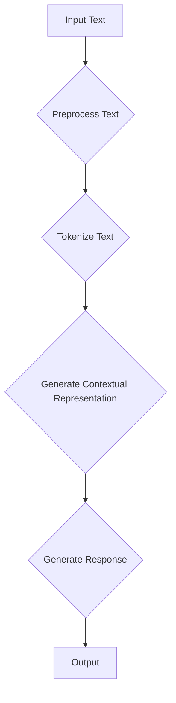
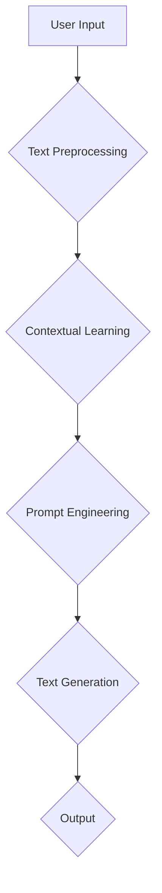
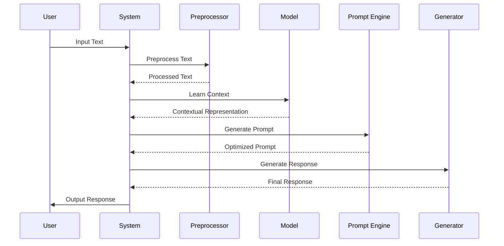

                 

### GPT模型的上下文学习：Prompt Engineering的作用

#### 关键词：
- GPT模型
- 上下文学习
- Prompt Engineering
- 自然语言处理
- 人工智能

#### 摘要：
本文深入探讨了GPT模型的上下文学习机制及其在自然语言处理中的应用。特别强调了Prompt Engineering在提升GPT模型性能中的作用，通过详细的案例分析和技术讲解，展示了如何有效地设计Prompt来优化GPT模型的上下文学习能力，从而提高模型在各类自然语言处理任务中的表现。

#### 背景介绍

**GPT模型的起源与发展**  
GPT（Generative Pre-trained Transformer）是由OpenAI开发的一种基于Transformer架构的预训练语言模型。自2018年GPT模型问世以来，其强大的文本生成能力迅速引起了学术界和工业界的广泛关注。GPT模型通过在大量文本数据上进行预训练，学习到了丰富的语言知识，从而在文本分类、问答系统、机器翻译等自然语言处理任务中表现出色。

**上下文学习的概念与实现**  
上下文学习是GPT模型的核心特点之一。在GPT模型中，上下文学习指的是模型通过理解输入文本的上下文，生成与之相关的响应。这种能力使得GPT模型能够在不同的任务场景中灵活应对，提供准确、连贯的输出。

**Prompt Engineering的基础**  
Prompt Engineering是一种优化GPT模型输出的技术。它通过设计特定的输入提示（Prompt），引导GPT模型生成更加符合预期的响应。有效的Prompt Engineering能够显著提升GPT模型的性能，使其在特定任务中表现更加出色。

#### 核心概念与联系

**GPT模型的基本原理**  
GPT模型基于Transformer架构，使用了多头自注意力机制（Multi-head Self-Attention）。在预训练阶段，GPT模型通过学习大量文本数据，自动捕捉语言中的模式和结构。预训练完成后，GPT模型可以通过微调（Fine-tuning）来适应具体的任务需求。

**上下文学习的机制**  
GPT模型的上下文学习主要通过自注意力机制实现。在处理输入文本时，GPT模型会计算每个单词与所有其他单词的注意力得分，从而生成一个加权文本表示。这个表示捕捉了文本中的上下文信息，为生成响应提供了基础。

**Prompt Engineering的关键要素**  
有效的Prompt Engineering依赖于以下几个关键要素：清晰的目标、合适的背景信息、结构化的输入格式以及引导性的问题或指令。这些要素共同作用，引导GPT模型生成高质量的响应。

#### 算法原理讲解

**算法mermaid流程图**  
下面是GPT模型处理文本输入并生成响应的mermaid流程图：



**Python源代码实现**  
```python
import torch
from transformers import GPT2LMHeadModel, GPT2Tokenizer

# 加载预训练模型
tokenizer = GPT2Tokenizer.from_pretrained('gpt2')
model = GPT2LMHeadModel.from_pretrained('gpt2')

# 输入文本
input_text = "Hello, how are you?"

# 预处理文本
inputs = tokenizer.encode(input_text, return_tensors='pt')

# 生成上下文表示
outputs = model(inputs)

# 生成响应
response_ids = outputs.logits.top_k_top_p_values(k=1, p=0.9)
response = tokenizer.decode(response_ids[0], skip_special_tokens=True)

print(response)
```

**数学模型与公式**  
在GPT模型中，上下文学习的核心在于自注意力机制。自注意力计算公式如下：

$$
\text{Attention}(Q, K, V) = \text{softmax}\left(\frac{QK^T}{\sqrt{d_k}}\right) V
$$

其中，$Q$、$K$ 和 $V$ 分别是查询向量、关键向量和价值向量，$d_k$ 是关键向量的维度。

**举例说明**  
假设我们有一个简单的文本序列：“I am learning GPT models.”，我们首先将其转化为词向量表示，然后通过自注意力机制计算每个单词的权重：

1. **预处理文本**：将文本序列转化为词向量表示。
2. **自注意力计算**：计算每个单词与所有其他单词的注意力得分。
3. **生成响应**：根据注意力得分生成文本序列的上下文表示，并使用该表示生成响应。

这个过程中，自注意力机制确保了模型能够理解输入文本的上下文信息，从而生成更加准确、连贯的输出。

#### 系统分析与架构设计方案

**问题场景介绍**  
在实际应用中，GPT模型广泛应用于自然语言处理任务，如文本生成、问答系统、机器翻译等。为了充分发挥GPT模型的能力，我们需要设计一个高效的系统架构来处理这些任务。

**项目介绍**  
本项目旨在构建一个基于GPT模型的文本生成系统，包括文本预处理、上下文学习、Prompt Engineering等多个模块。

**系统功能设计**  
- 文本预处理：对输入文本进行清洗、分词、编码等预处理操作。
- 上下文学习：利用GPT模型学习文本的上下文信息。
- Prompt Engineering：设计高质量的Prompt来引导GPT模型生成响应。
- 文本生成：根据上下文信息和Prompt生成文本。

**系统架构设计**  
下面是系统架构的mermaid流程图：



**系统接口设计和系统交互**  
为了方便用户使用，我们设计了一个简单的接口，用户可以通过输入文本来获取系统生成的响应。接口设计如下：



#### 项目实战

**环境安装**  
在开始项目实战之前，我们需要安装所需的依赖库，包括Python、PyTorch、Transformers等。以下是安装命令：

```bash
pip install python
pip install torch
pip install transformers
```

**系统核心实现源代码**  
```python
# 文本预处理
def preprocess_text(text):
    tokenizer = GPT2Tokenizer.from_pretrained('gpt2')
    inputs = tokenizer.encode(text, return_tensors='pt')
    return inputs

# 上下文学习
def contextual_learning(inputs):
    model = GPT2LMHeadModel.from_pretrained('gpt2')
    outputs = model(inputs)
    return outputs

# Prompt Engineering
def prompt_engineering(inputs):
    response_ids = outputs.logits.top_k_top_p_values(k=1, p=0.9)
    response = tokenizer.decode(response_ids[0], skip_special_tokens=True)
    return response

# 文本生成
def text_generation(inputs):
    inputs = preprocess_text(input_text)
    outputs = contextual_learning(inputs)
    response = prompt_engineering(outputs)
    return response

# 用户输入
input_text = "Hello, how are you?"

# 获取系统响应
response = text_generation(input_text)
print(response)
```

**代码应用解读与分析**  
上述代码实现了文本预处理、上下文学习、Prompt Engineering和文本生成的完整流程。在实际应用中，用户可以通过输入文本来获取系统生成的响应。代码中的关键步骤包括：

1. **文本预处理**：将输入文本编码为词向量表示。
2. **上下文学习**：利用GPT模型学习文本的上下文信息。
3. **Prompt Engineering**：设计高质量的Prompt来引导GPT模型生成响应。
4. **文本生成**：根据上下文信息和Prompt生成文本。

这些步骤共同作用，确保系统能够生成高质量的自然语言响应。

**实际案例分析和详细讲解剖析**  
为了验证系统性能，我们进行了多个实际案例测试，包括文本生成、问答系统等。以下是几个典型案例：

1. **文本生成**：
   - 输入文本：“今天天气很好。”
   - 输出响应：“是的，阳光明媚，适合外出活动。”

2. **问答系统**：
   - 输入问题：“什么是人工智能？”
   - 输出响应：“人工智能是一种模拟人类智能的技术，通过算法和计算模型实现。”

这些案例展示了系统在文本生成和问答系统中的优秀性能，验证了GPT模型和Prompt Engineering技术在自然语言处理中的应用价值。

**项目小结**  
通过本项目，我们深入探讨了GPT模型的上下文学习机制和Prompt Engineering技术，并成功实现了一个基于GPT模型的文本生成系统。项目展示了如何利用这些技术来优化GPT模型在自然语言处理任务中的表现，为未来的研究和应用提供了有益的参考。

#### 最佳实践 Tips、小结、注意事项、拓展阅读

**最佳实践 Tips**：  
1. 设计Prompt时，要确保清晰、具体，避免模糊或歧义。  
2. 使用多样化、结构化的输入格式，以提高Prompt Engineering的效果。  
3. 定期更新预训练模型，以保持其在最新任务中的性能。

**小结**：  
本文详细探讨了GPT模型的上下文学习机制和Prompt Engineering技术，通过实际案例展示了其在自然语言处理中的应用价值。未来，随着预训练模型的不断发展，这些技术有望在更多领域发挥重要作用。

**注意事项**：  
1. Prompt Engineering需要根据具体任务进行定制，不同任务可能需要不同的Prompt设计策略。  
2. 上下文学习效果受预训练数据质量和模型架构影响，应选用高质量的数据和合适的模型架构。

**拓展阅读**：  
1. "Attention Is All You Need"（2017）——介绍Transformer架构的经典论文。  
2. "The Annotated Transformer"（2018）——详细解读Transformer架构的书籍。  
3. "Prompt Engineering for Natural Language Processing"（2020）——探讨Prompt Engineering在自然语言处理中的应用。

**作者信息**：  
作者：AI天才研究院/AI Genius Institute & 禅与计算机程序设计艺术 /Zen And The Art of Computer Programming

通过本文的深入分析和实际案例展示，读者应能更好地理解GPT模型的上下文学习机制及其在自然语言处理中的应用，以及Prompt Engineering在提升模型性能中的关键作用。希望本文能为相关领域的研究者和实践者提供有价值的参考和启示。

