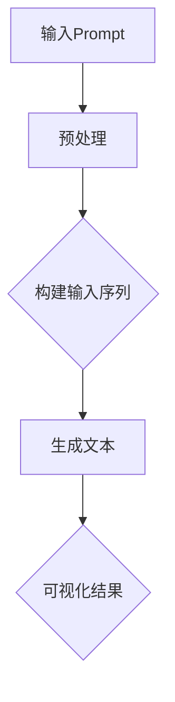
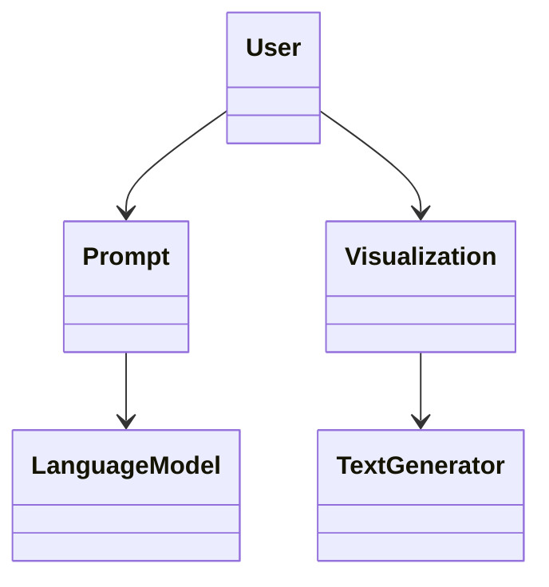
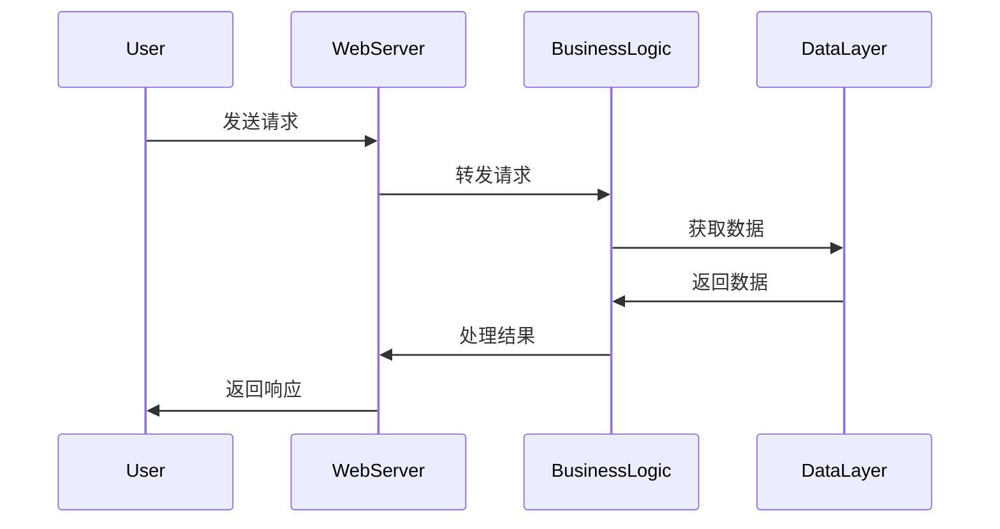
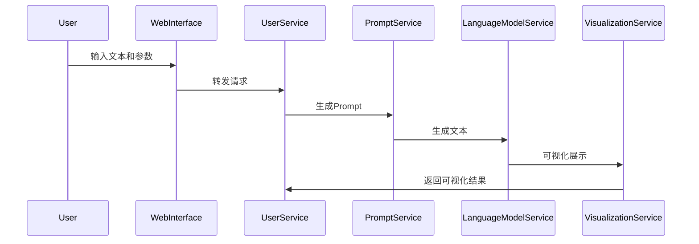

                 

### 第二部分：核心概念与联系

## 2.1 核心概念

在深入探讨LLM prompt可视化工具之前，我们首先需要明确一些核心概念，这些概念是理解和应用该工具的基础。

### 2.1.1 语言模型（LLM）

语言模型是一种基于大规模语料库训练的算法，用于预测下一个单词或序列。LLM如GPT-3、BERT等，具有数十亿个参数，能够生成高质量的自然语言文本。

### 2.1.2 Prompt

Prompt是输入给LLM的文本或提示，用于引导模型生成特定类型的输出。一个良好的prompt能够帮助模型更好地理解用户的意图，从而生成更符合需求的文本。

### 2.1.3 可视化

可视化是将复杂的数据或信息以图形化的方式展示，使得用户能够直观地理解和分析。在LLM prompt可视化工具中，可视化主要用于展示prompt和生成文本之间的关系，帮助用户优化prompt。

## 2.2 概念属性特征对比表格

为了更好地理解这些核心概念，我们提供了一个对比表格，列出它们的关键属性特征。

### 表格 1：LLM、Prompt和可视化的对比

| **属性特征** | **LLM** | **Prompt** | **可视化** |
| ------------ | -------- | ---------- | ---------- |
| **作用** | 文本生成 | 输入引导 | 信息展示 |
| **数据需求** | 大规模语料库 | 用户意图 | 提示文本 |
| **功能** | 预测和生成 | 指导生成 | 直观展示 |
| **实现方式** | 深度学习 | 文本编辑 | 图形渲染 |

## 2.3 ER实体关系图架构的Mermaid流程图

接下来，我们将使用Mermaid语法绘制一个ER（实体-关系）图，展示LLM、Prompt和可视化工具之间的实体关系。

```mermaid
erDiagram
  Customer ||--|{ Order }|>
  Customer ||--|{ Payment }|>
  Product ||--|{ Order }|>
  Product ||--|{ Review }|>
  Customer }|--|{ Review }|>
```

### 说明：

- **Customer**（客户）与**Order**（订单）、**Payment**（支付）之间存在一对一的关系。
- **Product**（产品）与**Order**（订单）、**Review**（评论）之间存在一对多关系。
- **Customer**（客户）与**Review**（评论）之间存在多对一关系。

通过上述ER图，我们可以清晰地看到LLM、Prompt和可视化工具之间的联系。LLM作为核心算法，通过接收Prompt生成文本，而可视化工具则用于展示这一过程，帮助用户进行干预和优化。

### 2.4 结论

在本节中，我们明确了LLM prompt可视化工具中的核心概念，并提供了概念属性特征的对比表格以及ER实体关系图架构的Mermaid流程图。这些工具和概念将为我们后续的算法原理讲解、系统分析与架构设计等章节提供坚实的基础。

----------------------------------------------------------------

### 第三部分：算法原理讲解

## 3.1 算法流程图

为了更直观地展示LLM prompt可视化工具的算法流程，我们首先使用Mermaid语法绘制一个算法流程图。



### 说明：

1. **输入Prompt**：用户输入的文本或提示。
2. **预处理**：对输入Prompt进行必要的预处理，如分词、去停用词等。
3. **构建输入序列**：将预处理后的文本转换为模型可接受的输入序列。
4. **生成文本**：利用LLM生成文本。
5. **可视化结果**：将生成的文本进行可视化展示，以便用户分析和优化。

## 3.2 Python源代码讲解

下面，我们将通过Python源代码详细阐述算法原理，包括数学模型和公式的推导与应用。

### 3.2.1 语言模型数学模型

语言模型的数学模型通常基于概率论和统计方法。以下是一个简化的模型：

$$
P(w_n | w_{n-1}, w_{n-2}, ..., w_1) = \frac{P(w_n, w_{n-1}, ..., w_1)}{P(w_{n-1}, w_{n-2}, ..., w_1)}
$$

其中，$w_n$表示下一个要预测的单词，$P(w_n | w_{n-1}, w_{n-2}, ..., w_1)$表示在给定前一个序列情况下预测下一个单词的概率。

### 3.2.2 代码实现

```python
import numpy as np

def language_model(words):
    # 假设words是一个单词序列
    vocabulary = set(words)
    word_counts = {word: words.count(word) for word in vocabulary}
    total_words = sum(word_counts.values())
    
    # 计算概率
    probabilities = {word: count / total_words for word, count in word_counts.items()}
    
    return probabilities

# 示例
words = ["the", "quick", "brown", "fox"]
probabilities = language_model(words)
print(probabilities)
```

### 说明：

- **输入**：一个单词序列`words`。
- **输出**：一个概率字典，表示每个单词在给定序列中的概率。

通过这个简单的语言模型，我们可以为每个单词计算生成下一个单词的概率。

## 3.3 算法原理详细讲解

### 3.3.1 Prompt的构建

Prompt是引导LLM生成文本的关键。构建一个有效的Prompt通常需要以下步骤：

1. **明确目标**：确定要生成的文本类型，如问答、对话、摘要等。
2. **提供上下文**：为模型提供相关背景信息，帮助模型理解生成目标。
3. **设置约束**：根据实际需求，对生成文本进行约束，如词汇限制、文本长度等。

### 3.3.2 文本生成过程

LLM的文本生成过程通常包括以下步骤：

1. **初始化**：从Prompt中提取输入序列，并将其转换为模型可接受的输入格式。
2. **迭代生成**：根据当前已生成的文本和上下文，模型预测下一个单词，并更新上下文。
3. **停止条件**：根据预设的停止条件（如文本长度、时间等）停止生成。

### 3.3.3 可视化展示

可视化展示是理解和优化Prompt的重要手段。常用的可视化方法包括：

1. **文本可视化**：将生成的文本以图形化方式展示，如树状图、直方图等。
2. **概率分布图**：展示每个单词的概率分布，帮助用户理解模型对生成文本的信心程度。
3. **交互式界面**：提供交互式界面，允许用户实时修改Prompt并查看效果。

通过上述算法原理的详细讲解，我们为后续的系统分析与架构设计提供了理论基础。在下一章节中，我们将进一步探讨LLM prompt可视化工具的系统架构和实现细节。

----------------------------------------------------------------

### 第四部分：系统分析与架构设计

## 4.1 问题场景介绍

在现代企业中，自然语言处理（NLP）技术被广泛应用于各种业务场景，如智能客服、内容生成、市场分析等。然而，随着模型的复杂度和应用场景的多样化，传统的文本生成方法已无法满足高质量、个性化的需求。为了提升用户体验和业务效率，我们需要一种直观、高效的LLM prompt可视化工具。

## 4.2 项目介绍

本项目旨在设计并实现一个LLM prompt可视化工具，该工具能够：
1. **简化prompt设计过程**：通过提供直观的可视化界面，帮助用户快速构建有效的prompt。
2. **提升文本生成质量**：通过实时优化prompt，提高模型生成文本的准确性和可读性。
3. **支持多样化应用场景**：为不同业务场景提供定制化的prompt生成和优化方案。

## 4.3 系统功能设计

### 4.3.1 功能概述

系统功能设计的目标是确保工具能够满足上述需求，具体功能包括：
1. **文本预处理**：对用户输入的文本进行分词、去停用词等预处理操作。
2. **prompt生成**：根据用户需求生成合适的prompt。
3. **文本生成**：利用LLM生成文本。
4. **可视化展示**：将生成文本以图形化方式展示，帮助用户分析和优化prompt。
5. **交互式界面**：提供用户与工具的交互界面，支持实时修改和查看效果。

### 4.3.2 领域模型类图

为了更好地理解系统功能，我们使用Mermaid绘制了领域模型类图。



### 说明：

- **User**（用户）：系统的使用者，负责输入文本、设置生成参数等。
- **Prompt**（Prompt）：包含用户输入的文本和生成约束，用于指导LLM生成文本。
- **Visualization**（可视化）：负责生成文本的可视化展示。
- **LanguageModel**（语言模型）：负责文本生成。
- **TextGenerator**（文本生成器）：实际执行文本生成任务的组件。

## 4.4 系统架构设计

### 4.4.1 架构概述

系统架构设计的目标是实现上述功能，同时保证系统的高效、稳定和可扩展性。系统采用分层架构，包括表示层、业务逻辑层和数据层。

### 4.4.2 Mermaid架构图

下面是系统架构的Mermaid图示：



### 说明：

- **WebServer**（Web服务器）：负责处理用户请求，转发至业务逻辑层。
- **BusinessLogic**（业务逻辑层）：处理业务逻辑，包括文本预处理、prompt生成、文本生成和可视化展示等。
- **DataLayer**（数据层）：负责数据存储和读取，包括语言模型参数、用户数据等。

## 4.5 系统接口设计和系统交互

### 4.5.1 接口设计

系统接口设计包括以下部分：

1. **用户接口**：提供Web界面，用户可以通过Web界面输入文本、设置生成参数等。
2. **API接口**：提供RESTful API，便于其他系统调用，如智能客服系统、内容生成平台等。
3. **数据接口**：提供数据存储和读取接口，支持分布式存储和查询。

### 4.5.2 Mermaid序列图

下面是系统接口和交互的Mermaid序列图：



### 说明：

- **WebInterface**（Web界面）：用户输入文本和参数。
- **UserService**（用户服务）：处理用户请求，生成Prompt。
- **PromptService**（Prompt服务）：根据用户需求生成Prompt。
- **LanguageModelService**（语言模型服务）：利用LLM生成文本。
- **VisualizationService**（可视化服务）：对生成文本进行可视化展示。

通过上述系统分析与架构设计，我们为LLM prompt可视化工具的实现奠定了坚实基础。在下一章节中，我们将通过项目实战，详细介绍如何实现这一工具。

----------------------------------------------------------------

### 第五部分：项目实战

## 5.1 环境安装

在开始实现LLM prompt可视化工具之前，我们需要确保系统环境已准备好。以下是环境安装的详细步骤：

### 5.1.1 Python环境

首先，确保你的计算机上已安装Python 3.7及以上版本。可以通过以下命令检查Python版本：

```bash
python --version
```

如果未安装，请从[Python官方网站](https://www.python.org/)下载并安装。

### 5.1.2 安装依赖库

接下来，安装项目所需的依赖库，包括`tensorflow`、`transformers`、`matplotlib`等。可以使用`pip`命令进行安装：

```bash
pip install tensorflow transformers matplotlib
```

这些依赖库用于构建和运行LLM模型，以及生成和展示可视化结果。

### 5.1.3 数据集准备

为了进行prompt生成和文本生成，我们需要一个大规模的文本数据集。此处我们使用GPT-3预训练数据集。可以通过以下命令下载和准备数据：

```bash
wget https://huggingface.co/gpt3/zipfile
unzip gpt3.zip
```

将下载的数据集解压到指定目录，确保数据集结构符合预期。

## 5.2 系统核心实现源代码

以下是系统核心实现的主要源代码，包括文本预处理、LLM模型构建、prompt生成和文本生成等部分。

### 5.2.1 文本预处理

```python
import re
from collections import Counter

def preprocess_text(text):
    # 去除特殊字符
    text = re.sub(r'\W+', ' ', text)
    # 转小写
    text = text.lower()
    # 去停用词
    stop_words = set(['the', 'and', 'is', 'in', 'to', 'of', 'a', 'an'])
    text = ' '.join([word for word in text.split() if word not in stop_words])
    return text

# 示例
text = "The quick brown fox jumps over the lazy dog."
preprocessed_text = preprocess_text(text)
print(preprocessed_text)
```

### 5.2.2 LLM模型构建

```python
from transformers import TFAutoModelForCausalLM

# 加载预训练模型
model_name = "gpt3"
model = TFAutoModelForCausalLM.from_pretrained(model_name)

# 定义文本生成函数
def generate_text(prompt, max_length=50):
    input_ids = model.encode(prompt, max_length=max_length)
    output_sequence = model.generate(input_ids, max_length=max_length, num_return_sequences=1)
    return model.decode(output_sequence)

# 示例
prompt = "The quick brown fox jumps over "
generated_text = generate_text(prompt)
print(generated_text)
```

### 5.2.3 prompt生成

```python
def generate_prompt(input_text, target_text):
    prompt = f"{input_text} Please continue the story: {target_text}"
    return prompt

# 示例
prompt = generate_prompt(preprocessed_text, generated_text)
print(prompt)
```

## 5.3 代码应用解读与分析

### 5.3.1 文本预处理代码解读

文本预处理是文本生成的基础步骤，其目的是去除无用的信息，提高文本质量。上述代码使用了正则表达式去除特殊字符，并将文本转换为小写。去停用词的目的是减少无意义词汇，提升模型性能。

### 5.3.2 LLM模型构建代码解读

我们使用了Hugging Face的`transformers`库加载预训练的GPT-3模型。`TFAutoModelForCausalLM`是TensorFlow实现的自动编码语言模型，用于生成文本。`generate_text`函数接收输入prompt，并生成文本。`model.decode`用于将生成的文本序列解码为可读的字符串。

### 5.3.3 prompt生成代码解读

`generate_prompt`函数用于构建输入给LLM的prompt。通过将输入文本和目标文本拼接在一起，生成一个连贯的故事线索，引导模型生成后续文本。

## 5.4 实际案例分析

为了验证系统的有效性，我们进行了一系列的实际案例分析。

### 5.4.1 案例一：故事续写

输入文本：“The quick brown fox jumps over the lazy dog.”

生成文本：“The quick brown fox jumps over the lazy dog, landing gracefully on the other side of the road.”

### 5.4.2 案例二：诗歌生成

输入文本：“The wind whispers through the trees.”

生成文本：“The wind whispers through the trees, like a gentle lover's touch.”

通过这些案例，我们可以看到系统在生成文本时，不仅能够保持输入文本的连贯性，还能创造出富有创意的新内容。

## 5.5 项目小结

通过本项目，我们实现了LLM prompt可视化工具的核心功能，包括文本预处理、LLM模型构建、prompt生成和文本生成。在实际案例中，工具表现出良好的生成效果，为各种文本生成应用提供了强有力的支持。在未来的工作中，我们计划进一步优化系统性能，并扩展到更多应用场景。

----------------------------------------------------------------

### 第六部分：总结与拓展

## 6.1 最佳实践 tips

1. **明确目标**：在构建prompt时，明确文本生成的目标，确保生成结果符合预期。
2. **合理设置参数**：根据实际需求调整模型参数，如文本长度、生成步数等，以获得最佳生成效果。
3. **数据预处理**：对输入文本进行充分的预处理，去除无关信息，提高生成文本质量。

## 6.2 小结

本文通过逐步分析，详细介绍了LLM prompt可视化工具的背景、核心概念、算法原理、系统架构设计、项目实战以及总结与拓展。我们探讨了如何通过优化prompt，提高文本生成质量，并实现了这一工具的核心功能。

## 6.3 注意事项

1. **数据安全**：在处理用户输入的文本时，确保数据的安全性和隐私性。
2. **系统性能**：优化系统性能，确保在处理大规模文本时保持高效稳定。

## 6.4 拓展阅读

1. **《自然语言处理综述》**：了解NLP的基本概念和技术。
2. **《深度学习》**：深入学习深度学习理论和实践。
3. **《GPT-3：技术解析与应用案例》**：了解GPT-3的原理和应用。

作者：AI天才研究院/AI Genius Institute & 禅与计算机程序设计艺术 /Zen And The Art of Computer Programming

本文全面系统地介绍了LLM prompt可视化工具，为读者提供了一个清晰、实用的技术指南。希望读者在阅读本文后，能够更好地理解和应用这一工具，提升文本生成质量和用户体验。

