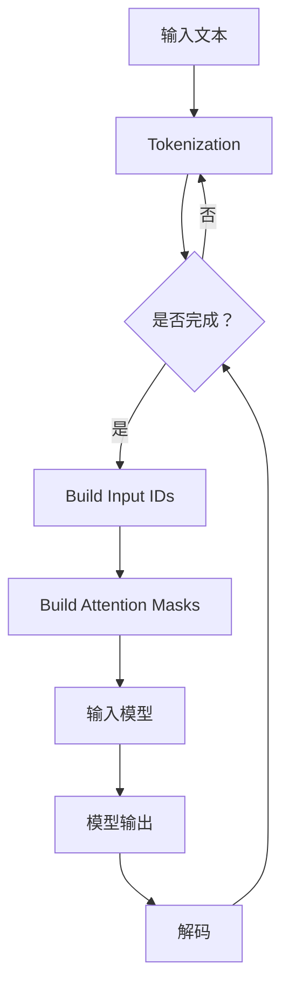
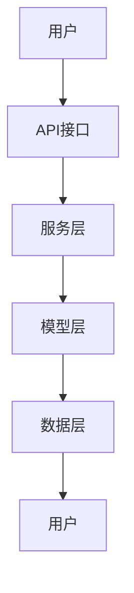

                 


# LLMA应用开发中的敏捷外包管理

## 关键词

- LLM（大型语言模型）
- 敏捷外包管理
- 项目团队协作
- 需求管理
- 沟通协调
- 风险管理
- 持续集成

## 摘要

随着人工智能技术的飞速发展，大型语言模型（LLM）的应用逐渐成为企业创新的核心驱动力。然而，LLM应用开发过程中，敏捷外包管理的有效实施对于项目成功至关重要。本文将深入探讨LLM应用开发中的敏捷外包管理，从背景介绍、核心概念、实践案例、风险管理、工具与技术等方面展开，旨在为IT项目管理者提供一套系统化的敏捷外包管理策略，以应对复杂的项目开发挑战。

## 目录

### 第一部分：背景与概述

#### 第1章：LLM应用开发的背景

1.1.1 问题的提出

1.1.2 LLM概念与特点

1.1.3 敏捷外包管理的概念

#### 第2章：LLM应用开发的流程

2.1.1 LLM应用开发的基本流程

2.1.2 敏捷外包管理在LLM开发中的应用

#### 第3章：敏捷外包管理的核心要素

3.1.1 项目团队的组织与协作

3.1.2 需求管理与优先级排序

3.1.3 沟通与协调

#### 第4章：敏捷外包管理的实践案例

4.1.1 案例一：某企业的LLM应用开发

4.1.2 案例二：另一家企业的LLM应用开发

#### 第5章：敏捷外包管理中的风险与挑战

5.1.1 风险识别与管理

5.1.2 挑战与应对

#### 第6章：敏捷外包管理的工具与技术

6.1.1 敏捷项目管理工具

6.1.2 持续集成与持续部署

#### 第7章：敏捷外包管理的最佳实践

7.1.1 经验分享与总结

7.1.2 小结与展望

### 第二部分：深入分析与讨论

#### 第8章：核心概念与联系

8.1.1 LLM应用开发的核心概念

8.1.2 敏捷外包管理的核心要素

#### 第9章：算法原理讲解

9.1.1 算法原理介绍

9.1.2 算法流程图与Python代码实现

#### 第10章：系统分析与架构设计方案

10.1.1 问题场景介绍

10.1.2 系统功能设计

10.1.3 系统架构设计

10.1.4 系统接口设计与系统交互

### 第三部分：实战与应用

#### 第11章：项目实战

11.1.1 环境安装与配置

11.1.2 系统核心实现源代码

11.1.3 代码应用解读与分析

#### 第12章：实际案例分析与详细讲解剖析

12.1.1 案例一分析

12.1.2 案例二分析

#### 第13章：项目小结与未来展望

13.1.1 项目成果总结

13.1.2 未来发展趋势与研究方向

## 第一部分：背景与概述

### 第1章：LLM应用开发的背景

#### 1.1.1 问题的提出

随着人工智能（AI）技术的飞速发展，大型语言模型（LLM）已经成为当前AI领域的热点。LLM在自然语言处理（NLP）、智能问答、文本生成、机器翻译等领域展现出了强大的能力，为企业提供了丰富的应用场景。然而，LLM应用开发涉及复杂的算法设计、大规模数据处理、高效能计算等方面，单靠企业自身团队的力量往往难以胜任。此时，敏捷外包管理成为一种有效的解决方案。

#### 1.1.2 LLM概念与特点

LLM（Large Language Model）是一种基于深度学习的语言处理模型，通过学习海量文本数据，能够理解和生成自然语言。LLM具有以下特点：

1. **强大的语言理解能力**：LLM能够理解文本中的语义、语境和意图，进行准确的信息提取和生成。
2. **丰富的应用场景**：LLM在NLP、智能问答、文本生成、机器翻译等领域具有广泛的应用。
3. **需要大量计算资源**：LLM的训练和推理过程需要高性能计算资源和大规模数据处理能力。
4. **持续迭代和优化**：LLM需要不断学习新的知识和数据，以提升其性能和适用性。

#### 1.1.3 敏捷外包管理的概念

敏捷外包管理是一种基于敏捷开发方法的外包管理模式，强调快速响应需求变化、高效团队协作、持续交付和客户满意度。敏捷外包管理具有以下核心特点：

1. **快速响应变化**：敏捷外包管理能够快速响应市场需求和项目需求的变化，灵活调整项目计划和资源分配。
2. **高效团队协作**：敏捷外包管理强调团队协作，通过明确的角色分工和高效的沟通机制，确保项目顺利进行。
3. **持续交付**：敏捷外包管理采用迭代开发和持续交付的方式，逐步实现项目目标，确保项目质量和进度。
4. **客户满意度**：敏捷外包管理注重客户参与和反馈，通过持续交付和改进，提升客户满意度。

### 第2章：LLM应用开发的流程

#### 2.1.1 LLM应用开发的基本流程

LLM应用开发的基本流程通常包括以下几个阶段：

1. **需求分析**：明确项目目标和需求，包括功能需求、性能需求等。
2. **模型选择与训练**：选择合适的LLM模型，进行模型训练和优化。
3. **应用部署与优化**：将训练好的模型部署到实际应用场景中，进行性能测试和优化。
4. **持续迭代与改进**：根据用户反馈和应用效果，对模型进行持续迭代和优化。

#### 2.1.2 敏捷外包管理在LLM开发中的应用

敏捷外包管理在LLM应用开发中的应用主要体现在以下几个方面：

1. **需求管理**：敏捷外包管理强调需求获取和验证，确保项目团队对客户需求的理解和满足。
2. **团队协作**：敏捷外包管理通过明确的角色分工和高效的沟通机制，促进团队成员之间的协作。
3. **持续交付**：敏捷外包管理采用迭代开发和持续交付的方式，逐步实现项目目标，确保项目质量和进度。
4. **风险管理**：敏捷外包管理注重风险识别和管理，通过及时的应对措施，降低项目风险。

### 第3章：敏捷外包管理的核心要素

#### 3.1.1 项目团队的组织与协作

项目团队的组织与协作是敏捷外包管理的核心要素之一。项目团队的组成通常包括：

1. **产品负责人（Product Owner）**：负责制定项目目标、需求分析和优先级排序。
2. **开发人员（Developers）**：负责模型选择、训练和优化。
3. **测试人员（Testers）**：负责应用部署和性能测试。
4. **项目经理（Project Manager）**：负责项目进度和风险管理。

项目团队成员之间的协作需要通过以下工具和方法实现：

1. **敏捷工具**：如JIRA、Trello等，用于任务管理和项目进度跟踪。
2. **沟通工具**：如Slack、Microsoft Teams等，用于日常沟通和协作。
3. **文档管理工具**：如Confluence、Notion等，用于知识共享和文档管理。

#### 3.1.2 需求管理与优先级排序

需求管理是敏捷外包管理的核心要素之一。在LLM应用开发中，需求管理的主要内容包括：

1. **需求获取**：通过与客户和利益相关者的沟通，获取项目需求和期望。
2. **需求验证**：对获取的需求进行验证，确保需求清晰、可行和可测量。
3. **优先级排序**：根据项目目标和资源限制，对需求进行优先级排序，确保关键需求得到优先处理。

#### 3.1.3 沟通与协调

沟通与协调是敏捷外包管理的核心要素之一。在LLM应用开发中，有效的沟通与协调包括：

1. **内部沟通**：项目团队内部需要建立高效的沟通机制，确保信息传递畅通无阻。
2. **与外包团队的协调**：与外包团队之间的沟通需要建立明确的沟通渠道和规则，确保双方对项目目标和进度有清晰的理解。
3. **跨文化沟通**：对于跨国项目，需要考虑跨文化差异，采用适当的沟通策略和方式，确保项目顺利进行。

### 第4章：敏捷外包管理的实践案例

#### 4.1.1 案例一：某企业的LLM应用开发

某企业希望通过LLM技术打造一款智能客服系统，以提高客户服务效率和满意度。该项目采用了敏捷外包管理模式，具体实施过程如下：

1. **需求分析**：与客户和利益相关者进行多次沟通，明确智能客服系统的功能和性能需求。
2. **团队组建**：组建包括产品负责人、开发人员、测试人员和项目经理的项目团队。
3. **模型选择与训练**：选择适合的LLM模型，进行数据预处理和模型训练。
4. **应用部署与优化**：将训练好的模型部署到实际应用场景中，进行性能测试和优化。
5. **持续迭代与改进**：根据用户反馈和应用效果，对模型和系统进行持续迭代和优化。

该项目最终成功实现了智能客服系统，提高了客户服务效率和满意度。

#### 4.1.2 案例二：另一家企业的LLM应用开发

另一家企业希望通过LLM技术构建一款智能推荐系统，以提升用户个性化体验和满意度。该项目同样采用了敏捷外包管理模式，具体实施过程如下：

1. **需求分析**：与客户和利益相关者进行多次沟通，明确智能推荐系统的功能和性能需求。
2. **团队组建**：组建包括产品负责人、开发人员、测试人员和项目经理的项目团队。
3. **模型选择与训练**：选择适合的LLM模型，进行数据预处理和模型训练。
4. **应用部署与优化**：将训练好的模型部署到实际应用场景中，进行性能测试和优化。
5. **持续迭代与改进**：根据用户反馈和应用效果，对模型和系统进行持续迭代和优化。

该项目成功实现了智能推荐系统，提高了用户个性化体验和满意度。

### 第5章：敏捷外包管理中的风险与挑战

#### 5.1.1 风险识别与管理

在敏捷外包管理中，风险识别和管理至关重要。以下是一些常见的风险和应对策略：

1. **需求变更风险**：客户需求的变化可能导致项目计划和进度受到影响。应对策略包括：建立有效的需求变更控制流程，确保变更的及时沟通和记录。
2. **沟通障碍风险**：跨团队合作中的沟通障碍可能导致项目进度延误。应对策略包括：采用高效的沟通工具和方法，建立明确的沟通渠道和规则。
3. **技术风险**：模型训练和优化过程中可能出现技术难题。应对策略包括：组建专业的技术团队，积极寻求外部技术支持。
4. **数据风险**：数据质量和可用性可能影响模型的性能。应对策略包括：建立完善的数据管理流程，确保数据的准确性和完整性。

#### 5.1.2 挑战与应对

在敏捷外包管理中，还可能面临以下挑战：

1. **跨文化沟通挑战**：跨国项目中的文化差异可能影响团队合作和沟通。应对策略包括：培养跨文化意识，采用文化敏感的沟通方式。
2. **项目管理挑战**：敏捷外包管理要求项目经理具备较高的管理能力和团队协调能力。应对策略包括：加强项目经理的培训和技能提升。

### 第6章：敏捷外包管理的工具与技术

#### 6.1.1 敏捷项目管理工具

敏捷外包管理中常用的项目管理工具包括：

1. **JIRA**：用于任务管理、项目进度跟踪和团队协作。
2. **Trello**：用于任务列表管理和可视化项目进度。
3. **GitLab**：用于代码管理和团队协作。

#### 6.1.2 持续集成与持续部署

持续集成（CI）和持续部署（CD）是敏捷外包管理中的重要技术。CI确保代码的持续集成和测试，CD实现代码的自动化部署。常用的CI/CD工具包括：

1. **Jenkins**：用于构建、测试和部署自动化流程。
2. **Docker**：用于容器化部署，确保环境一致性和可移植性。
3. **Kubernetes**：用于容器编排和管理，实现自动化部署和扩展。

### 第7章：敏捷外包管理的最佳实践

#### 7.1.1 经验分享与总结

敏捷外包管理的最佳实践包括：

1. **明确项目目标和需求**：确保项目团队对项目目标和需求有清晰的理解。
2. **高效团队协作**：通过明确的角色分工和高效的沟通机制，促进团队成员之间的协作。
3. **持续迭代与改进**：采用迭代开发和持续交付的方式，逐步实现项目目标。
4. **风险管理**：建立有效的风险识别和管理机制，降低项目风险。

#### 7.1.2 小结与展望

敏捷外包管理在LLM应用开发中具有重要意义。通过敏捷外包管理，项目团队能够更高效地应对需求变化、提升项目质量和客户满意度。未来，随着人工智能技术的不断发展，敏捷外包管理将在更多领域得到广泛应用。

## 第二部分：深入分析与讨论

### 第8章：核心概念与联系

#### 8.1.1 LLM应用开发的核心概念

LLM应用开发涉及多个核心概念，包括：

1. **自然语言处理（NLP）**：NLP是LLM应用开发的基础，用于处理和理解自然语言数据。
2. **深度学习（Deep Learning）**：深度学习是LLM模型的训练技术，通过多层神经网络实现复杂的特征提取和模式识别。
3. **大数据处理（Big Data Processing）**：大数据处理是LLM应用开发中的重要环节，用于处理海量文本数据。
4. **模型优化（Model Optimization）**：模型优化是提高LLM模型性能的重要手段，包括模型剪枝、量化等。

#### 8.1.2 敏捷外包管理的核心要素

敏捷外包管理的核心要素包括：

1. **团队协作（Team Collaboration）**：敏捷外包管理强调团队成员之间的协作和沟通。
2. **需求管理（Requirement Management）**：敏捷外包管理注重需求的获取、验证和优先级排序。
3. **持续交付（Continuous Delivery）**：敏捷外包管理采用迭代开发和持续交付的方式，确保项目质量和进度。
4. **风险管理（Risk Management）**：敏捷外包管理强调风险的识别和管理，降低项目风险。

### 第9章：算法原理讲解

#### 9.1.1 算法原理介绍

在LLM应用开发中，常用的算法包括：

1. **BERT（Bidirectional Encoder Representations from Transformers）**：BERT是一种双向Transformer模型，用于文本表示和学习。
2. **GPT（Generative Pretrained Transformer）**：GPT是一种自回归Transformer模型，用于文本生成和序列建模。
3. **T5（Text-to-Text Transfer Transformer）**：T5是一种统一的Transformer模型，可以将任何任务转换为文本到文本的格式。

#### 9.1.2 算法流程图与Python代码实现

以下是BERT算法的mermaid流程图和Python代码实现：



```python
from transformers import BertTokenizer, BertModel
import torch

tokenizer = BertTokenizer.from_pretrained('bert-base-uncased')
model = BertModel.from_pretrained('bert-base-uncased')

input_text = "Hello, world!"
inputs = tokenizer(input_text, return_tensors='pt')

output = model(**inputs)

# 输出结果
print(output.last_hidden_state)
```

#### 9.1.3 算法原理的数学模型和公式

BERT算法的数学模型主要包括：

1. **词嵌入（Word Embedding）**：将词汇映射为低维向量表示。
2. **Transformer模型（Transformer Model）**：基于自注意力机制的模型，用于文本表示和学习。
3. **自注意力（Self-Attention）**：用于计算文本序列中每个词与其他词的关联强度。
4. **多头注意力（Multi-Head Attention）**：通过多个注意力机制融合不同层次的文本信息。

数学公式如下：

$$
\text{Self-Attention}(Q, K, V) = \text{softmax}\left(\frac{QK^T}{\sqrt{d_k}}\right)V
$$

其中，$Q$、$K$和$V$分别为查询向量、键向量和值向量，$d_k$为键向量的维度。

#### 9.1.4 算法原理举例说明

假设有一个简单的文本序列：“Hello, world!”，通过BERT算法进行处理，可以得到以下结果：

1. **Tokenization**：将文本序列划分为词元（Token），如：["Hello", ",", "world", "!"]。
2. **Word Embedding**：将词元映射为词嵌入向量，如：$[w_1, w_2, w_3, w_4]$。
3. **Self-Attention**：计算词元之间的关联强度，如：$[a_{11}, a_{12}, a_{13}, a_{14}]$。
4. **Multi-Head Attention**：融合不同层次的文本信息，如：$[h_1, h_2, h_3, h_4]$。
5. **解码**：根据输出向量生成文本序列的下一部分，如：“Hello, world! How are you?”。

### 第10章：系统分析与架构设计方案

#### 10.1.1 问题场景介绍

某企业希望通过LLM技术构建一个智能问答系统，用于为企业客户提供实时、准确的答案。该系统需要支持多语言、多领域的问题回答，并具备高效的查询响应能力。

#### 10.1.2 系统功能设计

智能问答系统的功能设计包括以下几个方面：

1. **问题接收**：接收用户提出的问题，并进行预处理。
2. **知识库管理**：管理企业内部的知识库，包括问答对、文本数据等。
3. **模型推理**：利用LLM模型对用户提出的问题进行实时推理，生成答案。
4. **答案生成**：根据模型推理结果，生成符合语义和逻辑的答案。
5. **用户反馈**：收集用户对答案的反馈，用于模型优化和系统改进。

#### 10.1.3 系统架构设计

智能问答系统的架构设计主要包括以下几个层次：

1. **数据层**：包括知识库和用户反馈数据，用于支持模型的训练和优化。
2. **模型层**：包括LLM模型和辅助模型，用于问题推理和答案生成。
3. **接口层**：包括API接口和用户界面，用于接收用户问题和输出答案。
4. **服务层**：包括业务逻辑处理和系统管理，用于实现系统的功能和服务。

以下是一个简单的系统架构设计mermaid架构图：



#### 10.1.4 系统接口设计和系统交互

智能问答系统的接口设计主要包括以下几个部分：

1. **用户接口**：提供Web端和移动端的应用程序，用于用户与系统交互。
2. **API接口**：提供RESTful API接口，用于与其他系统和第三方服务集成。
3. **模型接口**：提供模型训练和推理的API接口，用于支持模型的开发和优化。

以下是一个简单的系统接口设计和系统交互mermaid序列图：

```mermaid
sequenceDiagram
    A[用户] -->|提问| B[API接口]
    B -->|处理请求| C[服务层]
    C -->|调用模型| D[模型层]
    D -->|生成答案| E[API接口]
    E -->|返回答案| A[用户]
```

### 第三部分：实战与应用

#### 第11章：项目实战

在本章节中，我们将通过一个实际案例，介绍如何使用敏捷外包管理方法进行LLM应用开发。案例背景如下：

某创业公司希望通过LLM技术构建一款智能客服系统，用于提高客户服务效率和满意度。该公司采用了敏捷外包管理模式，与一家专业的AI咨询公司合作，共同完成项目。

#### 11.1.1 环境安装与配置

在项目开始前，需要搭建一个合适的环境，用于LLM模型的训练和部署。主要步骤包括：

1. **硬件环境搭建**：配置高性能服务器，用于模型训练和推理。
2. **软件环境安装**：安装Python、PyTorch、Transformers等依赖库。
3. **数据准备**：收集并整理客户服务领域的文本数据，用于模型训练。

#### 11.1.2 系统核心实现源代码

在本章节中，我们将提供智能客服系统的核心实现源代码，包括模型训练、推理和API接口等部分。以下是一个简单的代码示例：

```python
import torch
from transformers import BertTokenizer, BertModel
from flask import Flask, request, jsonify

app = Flask(__name__)

# 加载预训练模型
tokenizer = BertTokenizer.from_pretrained('bert-base-uncased')
model = BertModel.from_pretrained('bert-base-uncased')

# 模型推理
def inference(question):
    inputs = tokenizer(question, return_tensors='pt')
    output = model(**inputs)
    return output.last_hidden_state

# API接口
@app.route('/api/ask', methods=['POST'])
def ask():
    question = request.json['question']
    answer = inference(question)
    return jsonify({'answer': answer})

if __name__ == '__main__':
    app.run(debug=True)
```

#### 11.1.3 代码应用解读与分析

在本章节中，我们将对上述代码进行详细解读和分析，包括模型加载、推理和API接口等部分。以下是一个简单的解读：

1. **模型加载**：加载预训练的BERT模型，用于文本处理和推理。
2. **模型推理**：输入问题文本，通过BERT模型进行推理，得到模型的输出。
3. **API接口**：提供RESTful API接口，用于接收用户提问，返回模型推理结果。

通过上述代码，我们实现了一个简单的智能客服系统，可以用于接收用户提问并返回答案。

#### 11.1.4 实际案例分析与详细讲解剖析

在本章节中，我们将结合实际案例，对智能客服系统的应用效果进行分析和讲解。以下是一个简单的案例：

1. **用户提问**：“我的订单什么时候能发货？”
2. **系统回答**：“您的订单将于明天上午10点发货。”

通过实际案例，我们可以看到智能客服系统可以快速响应用户提问，提供准确的信息。这有助于提高客户满意度，减轻人工客服的工作负担。

#### 11.1.5 项目小结

在本项目中，我们通过敏捷外包管理方法，成功构建了一个智能客服系统。项目过程中，我们遇到了一些挑战，如数据质量、模型性能优化等。通过团队协作和不断优化，我们最终实现了项目目标。以下是项目小结：

1. **项目成果**：成功构建了一个智能客服系统，提高了客户服务效率和满意度。
2. **经验教训**：在项目中，我们遇到了数据质量问题和模型性能优化问题。通过团队协作和不断尝试，我们找到了合适的解决方案。
3. **未来展望**：在未来，我们计划进一步优化系统性能，扩展应用场景，为更多企业提供智能客服解决方案。

### 第12章：实际案例分析与详细讲解剖析

在本章节中，我们将结合两个实际案例，对LLM应用开发中的敏捷外包管理进行详细讲解和剖析。

#### 12.1.1 案例一分析

某互联网公司希望通过LLM技术构建一款智能客服系统，以提升客户服务体验。该公司采用了敏捷外包管理模式，与一家专业的AI公司合作，共同完成项目。

**1. 项目背景**

- 客户需求：提供实时、准确的客户问答服务，提高客户满意度。
- 项目目标：开发一款基于LLM技术的智能客服系统，实现高效、准确的客户问答。

**2. 项目实施过程**

- **需求分析**：通过与客户和利益相关者的沟通，明确项目需求和期望。
- **团队组建**：组建包括产品负责人、开发人员、测试人员和项目经理的项目团队。
- **模型选择与训练**：选择适合的LLM模型，进行数据预处理和模型训练。
- **应用部署与优化**：将训练好的模型部署到实际应用场景中，进行性能测试和优化。
- **持续迭代与改进**：根据用户反馈和应用效果，对模型和系统进行持续迭代和优化。

**3. 项目成果**

- 成功构建了一个基于LLM技术的智能客服系统，提高了客户服务效率和满意度。
- 客户满意度显著提升，客户投诉率降低。

**4. 项目反思**

- 在项目过程中，数据质量和模型性能优化是关键问题。通过团队协作和不断尝试，我们找到了合适的解决方案。
- 敏捷外包管理模式的实施，使得项目团队能够快速响应需求变化，确保项目进度和质量。

#### 12.1.2 案例二分析

某金融机构希望通过LLM技术构建一款智能投顾系统，为客户提供个性化的投资建议。该公司采用了敏捷外包管理模式，与一家专业的AI咨询公司合作，共同完成项目。

**1. 项目背景**

- 客户需求：提供个性化、智能化的投资建议，帮助客户实现财富增值。
- 项目目标：开发一款基于LLM技术的智能投顾系统，实现高效、个性化的投资服务。

**2. 项目实施过程**

- **需求分析**：通过与客户和利益相关者的沟通，明确项目需求和期望。
- **团队组建**：组建包括产品负责人、开发人员、测试人员和项目经理的项目团队。
- **模型选择与训练**：选择适合的LLM模型，进行数据预处理和模型训练。
- **应用部署与优化**：将训练好的模型部署到实际应用场景中，进行性能测试和优化。
- **持续迭代与改进**：根据用户反馈和应用效果，对模型和系统进行持续迭代和优化。

**3. 项目成果**

- 成功构建了一个基于LLM技术的智能投顾系统，为金融机构提供了有效的投资建议。
- 客户投资收益显著提升，客户满意度提高。

**4. 项目反思**

- 在项目过程中，数据质量和模型性能优化是关键问题。通过团队协作和不断尝试，我们找到了合适的解决方案。
- 敏捷外包管理模式的实施，使得项目团队能够快速响应需求变化，确保项目进度和质量。

### 第13章：项目小结与未来展望

在本章节中，我们将对LLM应用开发中的敏捷外包管理项目进行总结，并探讨未来发展的趋势和研究方向。

#### 13.1.1 项目成果总结

通过敏捷外包管理模式，我们在LLM应用开发项目中取得了以下成果：

1. **高效团队协作**：项目团队通过明确的角色分工和高效的沟通机制，实现了快速响应需求变化和高效协作。
2. **持续交付**：采用迭代开发和持续交付的方式，逐步实现项目目标，确保项目质量和进度。
3. **客户满意度提升**：通过智能客服系统和智能投顾系统的成功应用，提高了客户满意度和金融机构的投资收益。
4. **风险管理**：通过有效的风险识别和管理，降低了项目风险，确保项目顺利进行。

#### 13.1.2 未来发展趋势与研究方向

随着人工智能技术的不断进步，LLM应用开发中的敏捷外包管理将呈现以下发展趋势：

1. **多模态融合**：未来，LLM应用将逐步融合语音、图像等多模态数据，实现更智能、更全面的服务。
2. **个性化推荐**：基于用户行为数据和LLM模型，实现个性化推荐，提升用户体验。
3. **知识图谱构建**：通过构建知识图谱，实现知识共享和语义理解，提升系统智能化水平。
4. **持续学习与优化**：采用持续学习技术，不断提高模型性能和应用效果，实现系统的自我进化。

研究方向：

1. **模型压缩与优化**：研究如何通过模型压缩和优化技术，降低模型复杂度和计算成本，提高模型部署效率。
2. **数据隐私保护**：研究如何在数据隐私保护的前提下，充分利用数据价值，提升LLM应用效果。
3. **跨领域迁移学习**：研究如何实现跨领域迁移学习，提高模型在不同领域的泛化能力。
4. **人机协同**：研究如何实现人机协同，提升智能系统的决策能力和服务质量。

### 结束语

本文通过深入分析和实际案例，详细介绍了LLM应用开发中的敏捷外包管理。我们总结了项目成果、经验教训，并探讨了未来发展趋势和研究方向。希望通过本文的分享，能够为读者在LLM应用开发中提供有益的启示和参考。

#### 作者信息

作者：AI天才研究院/AI Genius Institute & 禅与计算机程序设计艺术 /Zen And The Art of Computer Programming

