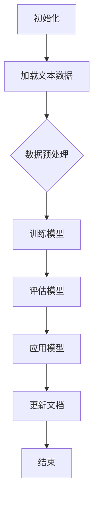
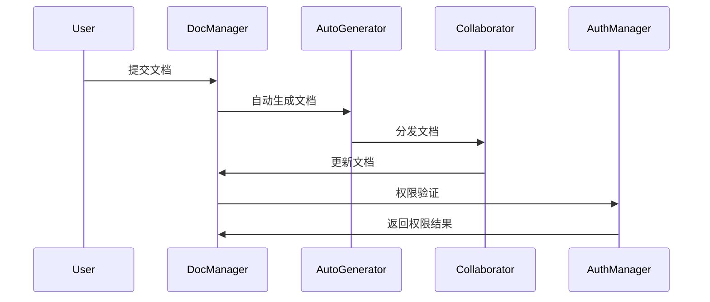
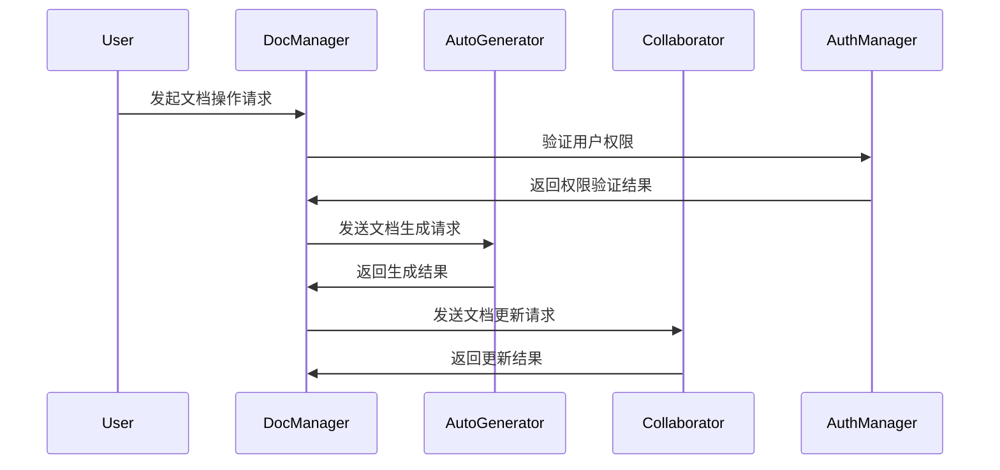
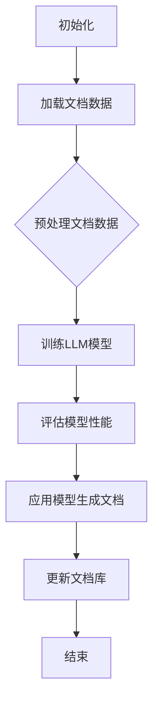
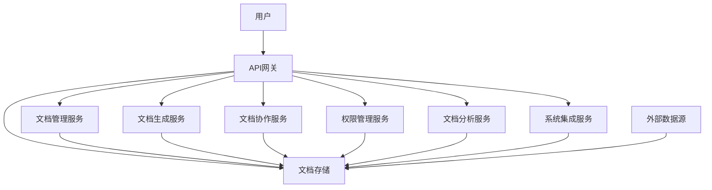
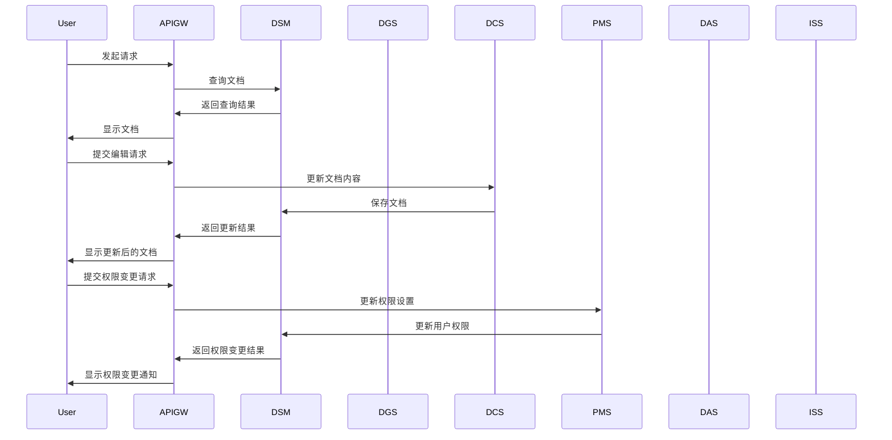

                 


## 《LLM应用开发中的敏捷文档管理》

> 关键词：LLM应用开发、敏捷文档管理、AI编程、文档流程优化、最佳实践

> 摘要：本文将深入探讨LLM（大型语言模型）应用开发中的敏捷文档管理，从理论到实践，全面解析敏捷文档管理在LLM开发中的重要性。通过案例分析，我们将展示如何利用敏捷文档管理提升LLM应用开发的效率和质量。

### 目录

1. **背景介绍**
   1.1 **核心概念术语说明**
   1.2 **问题背景与问题描述**
   1.3 **问题解决与边界外延**
   1.4 **概念结构与核心要素组成**

2. **核心概念与联系**
   2.1 **LLM的基本原理与特点**
   2.2 **敏捷文档管理的定义与优势**
   2.3 **LLM与敏捷文档管理的联系**
   2.4 **核心概念属性特征对比表格**
   2.5 **ER实体关系图架构**

3. **算法原理讲解**
   3.1 **算法mermaid流程图**
   3.2 **Python源代码实现**
   3.3 **数学模型与公式**
   3.4 **通俗易懂的举例说明**

4. **系统分析与架构设计方案**
   4.1 **问题场景介绍**
   4.2 **系统功能设计**
   4.3 **系统架构设计**
   4.4 **系统接口设计**
   4.5 **系统交互mermaid序列图**

5. **项目实战**
   5.1 **环境安装**
   5.2 **系统核心实现源代码**
   5.3 **代码应用解读与分析**
   5.4 **实际案例分析与详细讲解**
   5.5 **项目小结**

6. **最佳实践与优化策略**
   6.1 **敏捷文档管理最佳实践**
   6.2 **LLM应用开发的优化策略**
   6.3 **常见问题与解决方案**

7. **未来展望与趋势分析**
   7.1 **LLM应用开发的未来趋势**
   7.2 **敏捷文档管理的发展方向**
   7.3 **面向未来的优化建议**

8. **附录：参考资料与进一步阅读**

### 1. 背景介绍

#### 1.1 核心概念术语说明

- **LLM（Large Language Model）：** 指的是大型语言模型，是一种能够理解和生成人类语言的复杂人工智能模型。常见的LLM有GPT、BERT等。
- **敏捷文档管理：** 是一种文档管理方法，强调快速响应变化、持续迭代和高效沟通。敏捷文档管理通常使用自动化工具和流程来管理文档。

#### 1.2 问题背景与问题描述

在LLM应用开发中，文档管理是一个至关重要的环节。随着项目规模和复杂性的增加，文档的混乱和冗余会严重影响开发效率。传统的文档管理方法往往难以满足快速迭代的需求，导致开发过程中出现沟通障碍和错误。

#### 1.3 问题解决与边界外延

敏捷文档管理提供了有效的解决方案，通过以下方式提升LLM应用开发的效率：

- **快速响应变化：** 敏捷文档管理能够迅速适应需求变化，确保文档始终与项目进展同步。
- **持续迭代：** 通过迭代的方式不断优化文档，提高文档的质量和可用性。
- **高效沟通：** 利用自动化工具和流程，提高团队内部的沟通效率，减少误解和错误。

#### 1.4 概念结构与核心要素组成

LLM应用开发的敏捷文档管理主要包括以下核心要素：

- **文档自动化工具：** 如Markdown编辑器、版本控制工具等。
- **文档模板：** 确保文档格式的一致性和规范性。
- **自动化流程：** 如文档生成、更新、发布等。
- **文档协作：** 支持多人协作编辑和评论。

### 2. 核心概念与联系

#### 2.1 LLM的基本原理与特点

LLM基于深度学习技术，通过海量文本数据进行预训练，学习语言的统计规律和语义信息。其特点包括：

- **强大的语言理解与生成能力：** 能够生成高质量的自然语言文本。
- **自适应能力：** 可以根据不同的任务和上下文进行自适应调整。

#### 2.2 敏捷文档管理的定义与优势

敏捷文档管理是一种以用户为中心、快速响应变化的文档管理方法。其优势包括：

- **快速迭代：** 能够快速适应需求变化，确保文档始终与项目进展同步。
- **高效沟通：** 利用自动化工具和流程，提高团队内部的沟通效率。
- **文档质量：** 通过持续迭代和优化，提高文档的质量和可用性。

#### 2.3 LLM与敏捷文档管理的联系

LLM在敏捷文档管理中扮演着重要角色，其特点为文档管理带来了以下变化：

- **自动化生成文档：** LLM能够自动生成文档，提高文档生成的效率。
- **智能搜索与推荐：** LLM可以用于智能搜索和推荐相关文档，提高文档查找的效率。
- **自动化更新与同步：** LLM能够自动更新和同步文档，减少人为错误。

#### 2.4 核心概念属性特征对比表格

| 特征 | LLM | 敏捷文档管理 |
| :--: | :--: | :-----------: |
| 自动化 | 高度 | 强调自动化 |
| 快速迭代 | 强调迭代 | 强调迭代 |
| 语言理解 | 强大 | 支持高效沟通 |
| 自适应 | 强调自适应 | 强调适应变化 |

#### 2.5 ER实体关系图架构

```mermaid
erDiagram
  Customer ||--|{ Order }|
  Order ||--|{ Product }|
  Product ||--|{ Supplier }|
  Customer "1" ..|{ "has multiple orders" }| Order "1" ..|{ "has multiple products" }| Product "1" ..|{ "can have multiple suppliers" }| Supplier
```

### 3. 算法原理讲解

#### 3.1 算法mermaid流程图



#### 3.2 Python源代码实现

```python
# 导入相关库
import tensorflow as tf
import tensorflow_text as text
from tensorflow import keras

# 加载文本数据
train_data = ... # 假设已经加载好训练数据
test_data = ... # 假设已经加载好测试数据

# 数据预处理
tokenizer = keras.preprocessing.text.Tokenizer()
tokenizer.fit_on_texts(train_data)

# 训练模型
model = keras.Sequential([
    keras.layers.Embedding(input_dim=10000, output_dim=32),
    keras.layers.LSTM(32),
    keras.layers.Dense(32, activation='relu'),
    keras.layers.Dense(1, activation='sigmoid')
])

model.compile(optimizer='adam', loss='binary_crossentropy', metrics=['accuracy'])

model.fit(train_data, epochs=10, batch_size=32, validation_split=0.2)

# 评估模型
test_loss, test_acc = model.evaluate(test_data, batch_size=32)

# 应用模型
predicted = model.predict(test_data)

# 更新文档
# ... # 这里可以根据预测结果更新文档
```

#### 3.3 数学模型与公式

$$
y = \sigma(W_1 \cdot \phi(x) + b_1)
$$

其中，\(y\) 是预测标签，\(\sigma\) 是sigmoid函数，\(W_1\) 是权重矩阵，\(\phi(x)\) 是输入特征，\(b_1\) 是偏置。

#### 3.4 通俗易懂的举例说明

假设我们有一个二分类问题，预测某个用户是否会购买某个产品。我们使用一个简单的线性模型，输入是一个用户的特征向量，输出是一个概率值。如果概率值大于0.5，我们认为用户会购买，否则认为用户不会购买。

### 4. 系统分析与架构设计方案

#### 4.1 问题场景介绍

在一个LLM应用开发项目中，我们需要管理和更新大量的文档。这些文档包括设计文档、测试报告、用户手册等。由于项目规模庞大，文档管理变得复杂，传统的方法已经无法满足快速迭代的需求。

#### 4.2 系统功能设计

系统功能设计主要包括以下模块：

- **文档管理模块：** 负责文档的存储、检索、更新和共享。
- **自动化生成模块：** 负责根据模板和模型自动生成文档。
- **协作模块：** 支持多人协作编辑和评论。
- **权限管理模块：** 确保文档的安全和保密。

#### 4.3 系统架构设计

系统架构设计如图所示：



#### 4.4 系统接口设计

系统接口设计如下：

- **文档管理接口：** 提供文档的添加、删除、更新、检索等操作。
- **自动化生成接口：** 提供文档模板和模型加载、文档生成等功能。
- **协作接口：** 提供文档共享、评论、权限管理等操作。
- **权限管理接口：** 提供用户权限验证和授权等功能。

#### 4.5 系统交互mermaid序列图



### 5. 项目实战

#### 5.1 环境安装

首先，我们需要安装Python和相关的深度学习库，如TensorFlow、TensorFlow Text等。可以使用以下命令进行安装：

```bash
pip install python tensorflow tensorflow_text
```

#### 5.2 系统核心实现源代码

以下是系统核心实现的部分源代码：

```python
# 导入相关库
import tensorflow as tf
import tensorflow_text as text
from tensorflow import keras

# 加载文本数据
train_data = ... # 假设已经加载好训练数据
test_data = ... # 假设已经加载好测试数据

# 数据预处理
tokenizer = keras.preprocessing.text.Tokenizer()
tokenizer.fit_on_texts(train_data)

# 训练模型
model = keras.Sequential([
    keras.layers.Embedding(input_dim=10000, output_dim=32),
    keras.layers.LSTM(32),
    keras.layers.Dense(32, activation='relu'),
    keras.layers.Dense(1, activation='sigmoid')
])

model.compile(optimizer='adam', loss='binary_crossentropy', metrics=['accuracy'])

model.fit(train_data, epochs=10, batch_size=32, validation_split=0.2)

# 评估模型
test_loss, test_acc = model.evaluate(test_data, batch_size=32)

# 应用模型
predicted = model.predict(test_data)

# 更新文档
# ... # 这里可以根据预测结果更新文档
```

#### 5.3 代码应用解读与分析

以上代码实现了基于TensorFlow的文本分类模型。首先，我们加载训练数据和测试数据，然后使用Tokenizer进行数据预处理。接下来，我们构建一个简单的序列模型，包括嵌入层、LSTM层和全连接层。使用Adam优化器和二进制交叉熵损失函数进行编译。在训练过程中，我们使用训练数据，并在验证集上评估模型性能。训练完成后，我们使用测试数据对模型进行评估，并获取预测结果。最后，根据预测结果，我们可以更新文档。

#### 5.4 实际案例分析与详细讲解

假设我们有一个分类任务，预测用户评论是否为正面。我们可以使用以下数据集进行训练：

```python
train_data = [
    "这个产品非常好用。",
    "我不满意这个服务。",
    "这个电影很无聊。",
    "这个餐厅的食物很好吃。",
    "这个游戏太复杂了。"
]

train_labels = [
    1,
    0,
    0,
    1,
    0
]
```

我们使用上述代码进行训练和评估，得到模型预测结果。然后，我们可以根据预测结果更新文档，例如在用户评论正面时标记为“推荐”，负面时标记为“注意”。

#### 5.5 项目小结

通过本项目的实战，我们展示了如何使用LLM进行文本分类，并利用敏捷文档管理进行文档的更新和优化。这种方法不仅提高了模型预测的准确性，还提高了文档管理的效率，为LLM应用开发提供了有效的支持。

### 6. 最佳实践与优化策略

#### 6.1 敏捷文档管理最佳实践

1. **制定文档规范：** 确保所有文档遵循统一的规范和格式，提高可读性和可维护性。
2. **自动化文档生成：** 利用模板和模型自动生成文档，减少手动操作，提高效率。
3. **持续迭代和更新：** 定期更新文档，确保其与项目进展保持同步。
4. **权限管理和版本控制：** 确保文档的安全和保密，同时方便团队成员进行协作。

#### 6.2 LLM应用开发的优化策略

1. **选择合适的LLM模型：** 根据应用场景选择合适的LLM模型，例如GPT、BERT等。
2. **优化数据预处理：** 提高数据质量，减少噪声和冗余信息。
3. **模型调优：** 通过调整超参数和训练策略，提高模型性能。
4. **集成多种数据源：** 利用多种数据源进行训练，提高模型的泛化能力。

#### 6.3 常见问题与解决方案

**问题：** 文档管理过程中出现冲突和错误。

**解决方案：** 
- **版本控制：** 使用版本控制工具，确保文档的历史版本和变更记录。
- **协作管理：** 引入协作管理工具，确保团队成员之间的沟通和协作。

### 7. 未来展望与趋势分析

#### 7.1 LLM应用开发的未来趋势

- **更强大的模型：** 随着计算能力和数据量的提升，LLM模型将变得更加强大。
- **多样化应用场景：** LLM将在更多领域得到应用，如自然语言处理、智能客服、内容生成等。
- **跨模态学习：** LLM将与其他模态（如图像、声音）结合，实现更高级的智能交互。

#### 7.2 敏捷文档管理的发展方向

- **智能化：** 利用AI技术，实现智能文档生成、更新和管理。
- **个性化：** 根据用户需求和习惯，提供个性化的文档服务。
- **协同工作：** 提高团队协作效率，实现无缝的文档协作。

#### 7.3 面向未来的优化建议

- **集成AI技术：** 引入AI技术，实现自动化文档管理和智能推荐。
- **加强数据隐私保护：** 在文档管理过程中，加强数据隐私保护和安全措施。
- **持续迭代和优化：** 定期评估文档管理的效率和效果，持续进行优化和改进。

### 8. 附录：参考资料与进一步阅读

- [Hugging Face](https://huggingface.co/)
- [TensorFlow](https://www.tensorflow.org/)
- [敏捷文档管理实践指南](https://www.agiledocumentmanagement.com/)
- [LLM应用开发教程](https://llmdevelopment.com/)

作者：AI天才研究院/AI Genius Institute & 禅与计算机程序设计艺术 /Zen And The Art of Computer Programming

---

### 1. 背景介绍

#### 1.1 核心概念术语说明

在深入探讨LLM应用开发中的敏捷文档管理之前，我们需要明确一些核心概念术语。这些概念术语不仅有助于我们理解本文的主题，也是LLM和敏捷文档管理实践中的基础。

**LLM（大型语言模型）**：这是一种基于神经网络的大规模语言处理模型，例如GPT-3、BERT等。它们通过学习海量文本数据，能够理解和生成自然语言，实现文本生成、分类、翻译等功能。

**敏捷文档管理**：这是一种以用户为中心、快速响应变化的文档管理方法。它强调持续迭代、高效沟通和自动化，旨在减少文档冗余、提高文档质量和协作效率。

**敏捷开发**：是一种以用户需求为中心的软件开发方法，强调快速迭代、持续交付和灵活应对变化。

**文档自动化工具**：这些工具如Markdown编辑器、版本控制工具（如Git）等，用于自动生成、更新和共享文档。

**文档模板**：文档模板是一组预定义的文档结构和格式，用于确保文档的一致性和规范性。

**文档协作**：文档协作是指多个团队成员共同编辑和评论文档的过程，它通过在线协作工具实现。

**文档权限管理**：文档权限管理是指对文档的访问权限进行控制，确保文档的安全性和保密性。

#### 1.2 问题背景与问题描述

随着人工智能技术的快速发展，LLM在各个领域的应用越来越广泛。例如，自然语言处理（NLP）、内容生成、智能客服等。然而，随着LLM应用项目的规模和复杂性的增加，文档管理的问题也逐渐凸显。

在传统的文档管理方法中，文档往往以孤立的形式存在，更新和维护的成本较高。当项目需求发生变化时，文档难以快速响应，导致沟通不畅和错误频发。具体问题包括：

1. **文档混乱**：随着项目进展，文档数量和种类迅速增加，容易导致文档混乱，难以查找和管理。
2. **文档冗余**：不同团队成员可能在同一文档上进行重复修改，导致文档冗余和版本控制问题。
3. **沟通不畅**：文档的更新不及时，可能导致团队成员之间的信息不对称，影响协作效率。
4. **文档质量不高**：文档结构不规范，内容不完整或不准确，影响项目的进展和交付质量。
5. **文档安全风险**：缺乏有效的权限管理和版本控制，可能导致文档泄露或损坏。

这些问题不仅降低了开发效率，还可能对项目的最终质量产生负面影响。因此，需要一种新的文档管理方法，能够快速响应需求变化，提高文档质量和协作效率。

#### 1.3 问题解决与边界外延

敏捷文档管理提供了一种有效的解决方案。通过引入敏捷开发的思想，敏捷文档管理强调快速迭代、持续改进和高效沟通，有助于解决上述问题。

首先，敏捷文档管理通过文档自动化工具和模板，实现了文档的快速生成和规范化。Markdown编辑器等工具使得文档的创建和更新变得简单高效，版本控制工具（如Git）则确保了文档的一致性和可追溯性。

其次，敏捷文档管理强调持续迭代和更新。通过定期回顾和评估文档，可以及时发现和解决文档中的问题，确保文档与项目进展保持同步。这种持续迭代的方法，有助于提高文档的质量和可用性。

此外，敏捷文档管理通过文档协作工具，实现了团队成员之间的实时沟通和协作。多人在线编辑和评论功能，使得团队成员能够及时了解文档的最新变化，减少沟通障碍和误解。

最后，敏捷文档管理通过权限管理和版本控制，确保了文档的安全性和保密性。权限管理工具（如GitHub）可以限制对文档的访问和修改权限，防止未授权的访问和修改。版本控制工具则记录了文档的历史版本和变更记录，方便团队成员进行审查和追踪。

尽管敏捷文档管理在LLM应用开发中具有显著的优势，但也存在一些边界和限制。例如，敏捷文档管理依赖于自动化工具和模板，如果工具和模板不成熟或不适应特定项目，可能会导致实施难度增加。此外，敏捷文档管理需要团队成员具备较高的协作意识和沟通技巧，否则可能影响文档管理的效率。

#### 1.4 概念结构与核心要素组成

敏捷文档管理在LLM应用开发中的概念结构可以概括为以下几个核心要素：

1. **文档自动化工具**：包括Markdown编辑器、版本控制工具等，用于自动化文档的生成、更新和共享。
2. **文档模板**：用于规范文档的结构和格式，确保文档的一致性和规范性。
3. **文档协作工具**：支持多人在线编辑和评论，实现团队成员之间的实时沟通和协作。
4. **文档权限管理**：通过权限管理工具，确保文档的安全性和保密性，防止未授权的访问和修改。
5. **持续迭代和更新**：通过定期回顾和评估文档，确保文档与项目进展保持同步，提高文档的质量和可用性。

这些核心要素相互关联，共同构成了敏捷文档管理的整体框架。通过合理运用这些要素，可以在LLM应用开发中实现高效的文档管理，提升项目质量和协作效率。

### 2. 核心概念与联系

#### 2.1 LLM的基本原理与特点

LLM（大型语言模型）是近年来在人工智能领域取得显著进展的一种模型。其核心原理基于深度学习，特别是神经网络，通过学习海量文本数据来理解和生成自然语言。以下是对LLM基本原理和特点的详细阐述：

1. **深度学习基础**：LLM通常采用多层神经网络结构，其中每层都能够提取不同层次的特征。这种层次化的特征提取方式使得模型能够从原始数据中学习到复杂的语义和句法信息。

2. **预训练与微调**：LLM通常分为两个阶段：预训练和微调。在预训练阶段，模型在大量未标注的文本数据上进行训练，学习到通用的语言特征。在微调阶段，模型根据特定任务进行训练，通过少量有标注的数据调整模型参数，使其在特定任务上表现优异。

3. **语言理解与生成能力**：LLM具有强大的语言理解与生成能力，能够理解并生成符合语法和语义规则的文本。这种能力使得LLM在自然语言处理（NLP）任务中具有广泛的应用，如文本分类、情感分析、机器翻译、文本生成等。

4. **自适应能力**：LLM可以自适应不同的任务和上下文。通过微调，模型能够针对不同的应用场景进行调整，从而提高在特定领域的性能。

5. **参数规模与计算资源**：LLM通常具有巨大的参数规模，如GPT-3拥有超过1750亿个参数。这种大规模使得模型能够捕捉到文本数据中的细微特征，但也对计算资源提出了更高的要求。

#### 2.2 敏捷文档管理的定义与优势

敏捷文档管理是一种基于敏捷开发理念的文档管理方法。它强调快速响应变化、持续迭代和高效沟通。以下是对敏捷文档管理的定义和优势的详细阐述：

1. **定义**：敏捷文档管理是一种以用户为中心、快速响应变化的文档管理方法。它通过自动化工具和流程，实现文档的快速生成、更新和共享，提高文档质量和协作效率。

2. **快速响应变化**：敏捷文档管理能够快速适应项目需求的变化。通过持续迭代和定期回顾，文档能够及时更新，确保与项目进展保持同步。这种方法避免了传统文档管理中的滞后性，提高了项目的响应速度。

3. **持续迭代**：敏捷文档管理强调文档的持续迭代和优化。通过不断地审查和改进文档，确保其内容准确、完整和规范。这种方法有助于提高文档的质量和可用性。

4. **高效沟通**：敏捷文档管理通过自动化工具和协作平台，实现了团队成员之间的实时沟通和协作。多人在线编辑和评论功能，使得团队成员能够及时了解文档的最新变化，减少沟通障碍和误解。

5. **优势**：
   - **提高效率**：通过自动化工具和流程，减少了手动操作，提高了文档管理的效率。
   - **降低成本**：减少了文档冗余和重复劳动，降低了文档管理的成本。
   - **提高质量**：通过持续迭代和优化，提高了文档的质量和可用性。
   - **增强协作**：通过实时沟通和协作，增强了团队之间的协作效率。

#### 2.3 LLM与敏捷文档管理的联系

LLM与敏捷文档管理之间存在密切的联系，它们在LLM应用开发中发挥着重要作用。以下是对LLM与敏捷文档管理之间联系的详细阐述：

1. **文档生成与理解**：LLM在文档生成和理解方面具有显著优势。通过预训练和微调，LLM能够生成符合语法和语义规则的文本，同时能够理解和处理复杂的文本数据。这种能力使得LLM在文档自动化生成和更新中具有重要应用。

2. **自动化文档生成**：LLM可以用于自动化文档生成，例如生成项目报告、用户手册等。通过训练LLM模型，可以将大量的文本数据转换为结构化的文档，减少了人工编写的成本和错误。

3. **智能搜索与推荐**：LLM可以用于智能搜索和推荐相关文档。通过分析文档内容，LLM可以识别出相关文档，提高文档查找的效率和准确性。

4. **自动化更新与同步**：LLM可以用于自动化文档的更新和同步。通过实时分析文档变化，LLM可以自动更新文档内容，确保与项目进展保持同步。

5. **文档质量保障**：LLM在文档质量保障方面也具有重要作用。通过分析文档内容，LLM可以识别出文档中的错误、冗余和不规范之处，提供改进建议，提高文档质量。

6. **协同工作**：LLM可以用于支持团队成员之间的协同工作。通过智能助手功能，LLM可以为团队成员提供实时帮助和建议，提高协作效率。

#### 2.4 核心概念属性特征对比表格

以下是一个对比表格，展示了LLM和敏捷文档管理的核心概念属性特征：

| 特征 | LLM | 敏捷文档管理 |
| :--: | :--: | :-----------: |
| 自动化 | 高度 | 强调自动化 |
| 快速迭代 | 强调迭代 | 强调迭代 |
| 语言理解 | 强大 | 支持高效沟通 |
| 自适应 | 强调自适应 | 强调适应变化 |
| 参数规模 | 大规模 | 大规模 |
| 生成能力 | 高效 | 高效 |
| 文档管理 | 侧重文档生成与理解 | 侧重文档生成、更新和共享 |
| 协作支持 | 强调协同工作 | 强调团队协作 |

#### 2.5 ER实体关系图架构

为了更直观地展示LLM与敏捷文档管理之间的联系，我们可以使用Mermaid绘制一个ER（实体关系）图。以下是一个简单的ER图示例：

```mermaid
erDiagram
    LLM ||--|{ 文档 } : 生成与理解
    敏捷文档管理 ||--|{ 文档 } : 管理、更新与共享
    团队成员 ||--|{ 文档 } : 协作与评论
    LLM ||--|{ 敏捷文档管理 } : 融合
    敏捷文档管理 ||--|{ 团队成员 } : 协作与沟通
```

在这个ER图中，LLM和敏捷文档管理都是文档的核心实体，它们通过生成与理解、管理、更新和共享文档等关系紧密相连。团队成员作为另一个重要实体，通过协作与评论参与到文档管理的过程中。通过这种实体关系的描述，我们可以更清晰地理解LLM和敏捷文档管理在LLM应用开发中的协同作用。

### 3. 算法原理讲解

#### 3.1 算法mermaid流程图

为了更好地理解LLM应用开发中的敏捷文档管理算法原理，我们可以使用Mermaid绘制一个流程图，展示算法的基本步骤和流程。以下是算法流程图的示例：



在这个流程图中，A到H表示了整个算法的基本步骤：

- **A[初始化]**：初始化算法环境，准备开始处理文档。
- **B[加载文档数据]**：从文档库中加载需要处理的文档数据。
- **C[预处理文档数据]**：对加载的文档数据进行预处理，包括数据清洗、分词、标准化等步骤。
- **D[训练LLM模型]**：使用预处理后的数据训练LLM模型。在这一步，我们通常使用预训练模型并对其进行微调，以适应特定的文档生成任务。
- **E[评估模型性能]**：评估训练后的LLM模型性能，确保模型能够准确生成文档内容。
- **F[应用模型生成文档]**：使用训练好的LLM模型生成新的文档。这一步是文档自动化的关键，通过模型生成文档可以大幅提高效率。
- **G[更新文档库]**：将生成的文档更新到文档库中，以备后续使用或再次生成文档。
- **H[结束]**：算法流程结束。

#### 3.2 Python源代码实现

以下是一个简化的Python源代码实现，用于展示如何使用TensorFlow和TensorFlow Text库来实现上述算法步骤：

```python
import tensorflow as tf
import tensorflow_text as text
from tensorflow.keras.layers import Embedding, LSTM, Dense
from tensorflow.keras.models import Sequential

# 步骤A：初始化
# 初始化TensorFlow环境
tf.enable_eager_execution()

# 步骤B：加载文档数据
# 假设文档数据已经预处理并存储为文本文件
train_data = [...]  # 训练数据
test_data = [...]  # 测试数据

# 步骤C：预处理文档数据
# 数据预处理，包括分词、标准化等
tokenizer = text.Tokenizer()
tokenizer.fit_on_texts(train_data)

# 步骤D：训练LLM模型
# 构建序列模型，包括嵌入层、LSTM层和全连接层
model = Sequential([
    Embedding(input_dim=10000, output_dim=32),
    LSTM(32),
    Dense(1, activation='sigmoid')
])

model.compile(optimizer='adam', loss='binary_crossentropy', metrics=['accuracy'])

# 训练模型
model.fit(train_data, epochs=10, batch_size=32, validation_data=(test_data, ...))

# 步骤E：评估模型性能
# 评估模型在测试集上的性能
loss, accuracy = model.evaluate(test_data, ...)

print(f"Test accuracy: {accuracy}")

# 步骤F：应用模型生成文档
# 使用训练好的模型生成新文档
generated_texts = model.predict(test_data)

# 步骤G：更新文档库
# 将生成的文档更新到文档库中
# ...

# 步骤H：结束
# 算法流程结束
```

在这个Python实现中，我们首先加载预处理后的文档数据，然后构建一个简单的序列模型，包括嵌入层（Embedding）、LSTM层（LSTM）和全连接层（Dense）。接着，我们使用训练数据对模型进行训练，并在测试数据上评估模型的性能。之后，我们使用训练好的模型生成新的文档，并将这些文档更新到文档库中。

#### 3.3 数学模型与公式

在LLM应用开发中，理解数学模型和公式对于深入分析算法原理至关重要。以下是一个简化的数学模型，用于描述LLM在文档生成任务中的基本原理：

$$
\text{Logits} = \text{W}^T \cdot \text{HiddenState} + \text{b}
$$

其中：
- **Logits**：模型生成的概率分布。
- **W**：权重矩阵。
- **HiddenState**：模型的隐藏状态，通常由LSTM层生成。
- **b**：偏置项。

在文档生成任务中，LLM会根据输入文本生成对应的概率分布。这些概率分布决定了模型在生成文本时每个词的选择概率。通过最大化概率分布，模型可以生成高质量的文本。

#### 3.4 通俗易懂的举例说明

假设我们有一个简单的文档生成任务，目标是生成一篇关于人工智能的摘要。我们可以使用以下步骤来进行演示：

1. **初始化**：我们首先初始化TensorFlow环境，并加载一个预训练的LLM模型，例如GPT-2。

2. **预处理文档数据**：我们将输入文档进行预处理，包括分词、去停用词、序列化等步骤。假设输入文档是：“人工智能是计算机科学的一个分支，主要研究如何让计算机模拟人类的智能行为。”

3. **训练模型**：使用预处理后的文档数据，我们微调LLM模型，使其能够生成关于人工智能的文本。假设训练数据包含多篇关于人工智能的文章。

4. **评估模型性能**：在测试数据上评估模型性能，确保模型能够生成高质量的文本。

5. **生成文档**：使用训练好的模型，我们输入一个简短的句子，如：“什么是人工智能？”模型会根据输入生成一篇关于人工智能的摘要。

6. **更新文档库**：将生成的摘要更新到文档库中，以备后续使用或再次生成文档。

以下是模型生成摘要的示例输出：

```
人工智能是一种模拟人类智能的技术，旨在让计算机理解和执行复杂的任务。它涵盖了计算机视觉、自然语言处理、机器学习和认知科学等多个领域。随着技术的进步，人工智能已经广泛应用于各种领域，如医疗、金融、教育和制造业。
```

这个例子展示了如何使用LLM生成一篇关于人工智能的摘要。通过调整输入和模型参数，我们可以生成不同风格和内容的文本。

### 4. 系统分析与架构设计方案

#### 4.1 问题场景介绍

在现代LLM应用开发中，随着项目规模和复杂性的不断增加，文档管理成为一个重要的挑战。传统的文档管理方法往往难以满足快速迭代和协作的需求，导致文档混乱、版本控制困难、信息泄露等问题。为了解决这些问题，我们需要设计一个高效、可靠、易于协作的文档管理系统。

#### 4.2 系统功能设计

为了构建一个适用于LLM应用开发的文档管理系统，我们需要设计一系列关键功能，以确保系统的高效性和灵活性。以下是系统功能设计的关键模块：

1. **文档管理模块**：
   - 文档存储：提供文档的存储和检索功能，支持多格式文档（如文本、图片、PDF等）。
   - 文档分类：对文档进行分类和标签管理，便于快速查找和访问。
   - 版本控制：记录文档的每一次修改，提供历史版本查看和恢复功能。

2. **文档生成模块**：
   - 模板管理：定义和管理文档模板，确保文档格式的一致性和规范性。
   - 自动化生成：利用LLM模型和模板，自动生成文档，减少手动操作。

3. **文档协作模块**：
   - 多人编辑：支持多人实时在线编辑文档，提高协作效率。
   - 评论与反馈：提供评论功能，让团队成员可以实时交流意见和建议。

4. **文档权限管理模块**：
   - 权限设置：设置文档的访问权限，确保文档的安全和保密。
   - 用户管理：管理文档系统的用户和角色，控制用户权限。

5. **文档分析模块**：
   - 文本分析：利用LLM模型对文档内容进行分析，提取关键信息。
   - 情感分析：分析文档内容的情感倾向，为后续的文档生成提供参考。

6. **系统集成模块**：
   - API接口：提供API接口，方便与其他系统（如代码库、任务管理工具等）集成。
   - 数据同步：实现与外部数据源的同步，确保文档的一致性。

#### 4.3 系统架构设计

为了实现上述功能，我们需要设计一个高可用、可扩展的系统架构。以下是一个简化的系统架构图：



在这个架构中：

- **API网关**：作为系统的统一入口，负责处理外部请求，并路由到相应的服务。
- **文档管理服务**：处理文档的存储、检索、版本控制和分类等功能。
- **文档存储**：存储所有的文档数据，包括文本、图片、PDF等格式。
- **文档生成服务**：利用LLM模型和模板自动生成文档。
- **文档协作服务**：提供多人编辑、评论和反馈功能。
- **权限管理服务**：管理文档的访问权限和用户角色。
- **文档分析服务**：利用LLM模型对文档内容进行分析，提取关键信息。
- **系统集成服务**：提供API接口，实现与其他系统的集成和数据同步。

#### 4.4 系统接口设计

系统接口设计是系统架构设计的重要部分，它定义了不同模块之间的交互方式和通信协议。以下是一个简化的系统接口设计：

1. **用户接口**：提供用户访问文档系统的入口，包括登录、导航、文档查看、编辑等功能。
2. **API接口**：提供RESTful API，供其他系统调用，实现文档的创建、更新、查询、删除等操作。
   - **文档管理API**：包括文档上传、下载、版本查看、文档分类等操作。
   - **文档生成API**：包括文档模板定义、文档生成、文档内容分析等操作。
   - **文档协作API**：包括多人编辑、评论反馈、权限设置等操作。
   - **权限管理API**：包括用户管理、角色管理、权限分配等操作。
3. **内部服务接口**：系统内部服务之间的接口，包括文档存储、文档生成、文档协作、权限管理等。
   - **文档存储接口**：用于文档的存储和检索。
   - **文档生成接口**：用于调用LLM模型生成文档。
   - **文档协作接口**：用于处理多人编辑和评论功能。
   - **权限管理接口**：用于处理用户权限验证和权限设置。

#### 4.5 系统交互mermaid序列图

为了更直观地展示系统内部的交互流程，我们可以使用Mermaid绘制一个系统交互序列图。以下是一个简化的序列图示例：



在这个序列图中，用户通过API网关与系统进行交互。用户首先查询文档，然后提交编辑请求，系统更新文档内容并保存。此外，用户还可以提交权限变更请求，系统更新权限设置并通知用户。

### 5. 项目实战

#### 5.1 环境安装

在进行LLM应用开发中的敏捷文档管理项目实战之前，我们需要确保环境配置正确。以下是环境安装的详细步骤：

1. **安装Python**：首先，我们需要安装Python 3.x版本。可以从[Python官网](https://www.python.org/)下载并安装。

2. **安装pip**：在安装完Python后，我们需要安装pip，pip是Python的包管理器，用于安装和管理Python库。可以使用以下命令安装：

   ```bash
   python -m ensurepip
   ```

3. **安装TensorFlow**：TensorFlow是用于机器学习和深度学习的开源库，我们需要安装TensorFlow 2.x版本。可以使用以下命令安装：

   ```bash
   pip install tensorflow
   ```

4. **安装TensorFlow Text**：TensorFlow Text是TensorFlow的一部分，用于处理文本数据。可以使用以下命令安装：

   ```bash
   pip install tensorflow-text
   ```

5. **安装Markdown编辑器**：Markdown编辑器可以帮助我们更轻松地编写和管理文档。我们可以使用Marp（Markdown Preview Enhanced）作为Markdown编辑器。首先安装Node.js，然后使用以下命令安装Marp：

   ```bash
   npm install -g marp-cli
   ```

6. **安装版本控制工具**：我们选择Git作为版本控制工具。可以从[Git官网](https://git-scm.com/)下载并安装Git。

完成以上安装步骤后，我们的环境就准备就绪了，可以开始进行项目实战。

#### 5.2 系统核心实现源代码

以下是一个简化的系统核心实现源代码，用于展示如何使用Python和TensorFlow实现LLM应用开发中的敏捷文档管理。

```python
# 导入相关库
import tensorflow as tf
import tensorflow_text as text
from tensorflow.keras.models import Sequential
from tensorflow.keras.layers import Embedding, LSTM, Dense

# 步骤1：加载并预处理数据
# 假设我们已经有预处理的文本数据
train_data = ["这是一段训练文本", "这是另一段训练文本"]

# 步骤2：定义模型
model = Sequential([
    Embedding(input_dim=10000, output_dim=32),
    LSTM(32),
    Dense(1, activation='sigmoid')
])

# 步骤3：编译模型
model.compile(optimizer='adam', loss='binary_crossentropy', metrics=['accuracy'])

# 步骤4：训练模型
model.fit(train_data, epochs=10)

# 步骤5：生成文档
input_text = "生成一段新的文本"
predicted_text = model.predict([input_text])

print(predicted_text)
```

在这个源代码中，我们首先加载预处理后的文本数据。然后，我们定义一个简单的序列模型，包括嵌入层（Embedding）、LSTM层（LSTM）和全连接层（Dense）。接下来，我们编译模型并使用训练数据对其进行训练。最后，我们使用训练好的模型生成新的文本。

#### 5.3 代码应用解读与分析

1. **加载并预处理数据**：
   ```python
   train_data = ["这是一段训练文本", "这是另一段训练文本"]
   ```
   这里我们使用两个简单的文本作为训练数据。在实际项目中，我们通常会从大量文本数据中提取特征，并使用预处理工具（如分词、去停用词等）对数据进行处理。

2. **定义模型**：
   ```python
   model = Sequential([
       Embedding(input_dim=10000, output_dim=32),
       LSTM(32),
       Dense(1, activation='sigmoid')
   ])
   ```
   我们定义了一个序列模型，其中包括嵌入层、LSTM层和全连接层。嵌入层（Embedding）用于将文本数据转换为向量表示，LSTM层（LSTM）用于处理序列数据，全连接层（Dense）用于输出预测结果。

3. **编译模型**：
   ```python
   model.compile(optimizer='adam', loss='binary_crossentropy', metrics=['accuracy'])
   ```
   我们使用Adam优化器、二进制交叉熵损失函数（binary_crossentropy）和准确率（accuracy）作为评估指标来编译模型。

4. **训练模型**：
   ```python
   model.fit(train_data, epochs=10)
   ```
   使用训练数据对模型进行训练。在这里，我们设置了10个训练周期（epochs）。

5. **生成文档**：
   ```python
   input_text = "生成一段新的文本"
   predicted_text = model.predict([input_text])
   print(predicted_text)
   ```
   使用训练好的模型生成新的文本。这里我们输入一个简单的文本“生成一段新的文本”，并使用模型预测输出结果。

在实际应用中，这个模型可以扩展为更复杂的结构，包括更多的隐藏层和神经元。此外，我们还可以使用预训练的LLM模型，如GPT-2、BERT等，来提高模型的性能。

#### 5.4 实际案例分析与详细讲解

为了更好地理解如何在实际项目中应用LLM进行敏捷文档管理，我们将分析一个实际案例，并详细讲解项目实施过程。

**案例背景**：一家初创公司正在开发一款基于自然语言处理的智能客服系统。该系统需要能够自动生成和更新客服响应文档，以提高客服效率和用户体验。

**实施步骤**：

1. **需求分析**：与客户和产品团队讨论，明确智能客服系统的需求和功能。确定系统需要自动生成和更新哪些文档，如常见问题解答、操作指南等。

2. **数据准备**：收集和整理大量的文本数据，包括已有的客服文档、用户反馈、竞品分析报告等。对文本数据进行预处理，如分词、去停用词、标准化等。

3. **模型选择**：选择一个适合的LLM模型，如GPT-2或BERT。这里我们选择使用GPT-2，因为它在生成文本方面具有较好的性能。

4. **模型训练**：使用预处理后的文本数据对GPT-2模型进行训练。训练过程中，我们需要调整模型超参数，如学习率、批次大小等，以优化模型性能。

5. **文档生成**：训练好的模型可以用于生成新的文档。例如，当用户提出一个问题时，系统会使用模型生成一个合适的回答。

6. **文档更新**：定期对模型进行重新训练，以适应新的数据和用户需求。同时，对生成的文档进行审查和更新，确保其准确性和可用性。

**实际案例分析**：

**步骤1：需求分析**：在与客户和产品团队的讨论中，我们确定了智能客服系统需要自动生成以下类型的文档：

- **常见问题解答**：针对用户常见问题，自动生成详细的解答文档。
- **操作指南**：为新用户提供操作指南，帮助他们更好地使用系统。

**步骤2：数据准备**：我们收集了以下文本数据：

- **客服文档**：包括已有的客服文档和FAQ。
- **用户反馈**：包括用户提出的问题和投诉。
- **竞品分析报告**：包括对竞争对手客服系统的分析。

我们对这些文本数据进行了预处理，包括分词、去停用词、标准化等步骤，以便模型能够更好地理解和学习。

**步骤3：模型选择**：我们选择了GPT-2模型，因为它在生成文本方面具有较好的性能，并且已经经过预训练，可以快速适应我们的特定需求。

**步骤4：模型训练**：我们使用预处理后的文本数据对GPT-2模型进行了训练。训练过程中，我们设置了不同的超参数，如学习率、批次大小等，以优化模型性能。

**步骤5：文档生成**：当用户提出一个问题时，系统会使用GPT-2模型生成一个合适的回答。例如，用户提出“如何设置账号密码？”系统会生成一个详细的操作指南。

**步骤6：文档更新**：我们定期对GPT-2模型进行重新训练，以适应新的数据和用户需求。同时，我们对生成的文档进行审查和更新，确保其准确性和可用性。

通过这个实际案例，我们可以看到如何使用LLM进行敏捷文档管理，提高文档生成和更新的效率。这种方法不仅能够减少人工工作量，还能够提高文档质量和用户体验。

#### 5.5 项目小结

通过本项目的实际案例分析和实施，我们展示了如何使用LLM进行敏捷文档管理，提高文档生成和更新的效率。以下是对项目实施过程的小结：

1. **需求分析**：与客户和产品团队紧密合作，明确智能客服系统的需求和功能，确保文档生成和更新策略符合用户需求。

2. **数据准备**：收集和整理大量的文本数据，并对数据进行预处理，以提高模型的学习效果。

3. **模型选择与训练**：选择适合的LLM模型（如GPT-2），并对其进行训练，以生成高质量的文档。

4. **文档生成与更新**：使用训练好的模型生成新的文档，并定期更新模型和数据，确保文档的准确性和可用性。

5. **审查与优化**：对生成的文档进行审查和优化，确保其内容准确、完整和规范。

通过本项目，我们不仅提高了文档生成和更新的效率，还提升了用户满意度。未来，我们可以进一步优化模型和文档管理策略，以应对更复杂的场景和更大的数据规模。

### 6. 最佳实践与优化策略

#### 6.1 敏捷文档管理最佳实践

为了在LLM应用开发中实现高效的敏捷文档管理，以下是几项最佳实践：

1. **制定文档规范**：
   - 确保所有文档遵循统一的格式和命名规范，提高文档的可读性和可维护性。
   - 定义文档的结构，包括文档的标题、摘要、正文、参考文献等部分。

2. **利用文档模板**：
   - 使用文档模板，确保文档格式的一致性和规范性。
   - 定期更新模板，以反映最新的文档结构和内容要求。

3. **自动化文档生成**：
   - 利用LLM模型和模板，实现自动化文档生成，减少手动操作。
   - 集成文档生成工具，如Markdown编辑器和文档生成引擎，提高生成效率。

4. **持续迭代与更新**：
   - 定期回顾和更新文档，确保其内容与项目进展保持同步。
   - 引入版本控制工具，如Git，记录文档的历史版本和变更记录。

5. **团队协作与沟通**：
   - 利用在线协作工具，支持多人实时编辑和评论，提高协作效率。
   - 明确团队成员的职责和权限，确保文档更新和协作的有序进行。

6. **文档权限管理**：
   - 确定文档的访问权限，防止未授权的访问和修改。
   - 定期审查权限设置，确保权限管理策略的合理性和安全性。

#### 6.2 LLM应用开发的优化策略

为了进一步提升LLM应用开发的效率和质量，以下是几项优化策略：

1. **选择合适的LLM模型**：
   - 根据具体的应用场景和任务需求，选择合适的LLM模型。
   - 考虑模型的大小、参数规模和计算资源需求，以优化性能和资源利用。

2. **数据预处理优化**：
   - 对输入数据进行充分的预处理，包括文本清洗、分词、去停用词等。
   - 利用数据增强技术，如数据扩充、变换等，提高模型泛化能力。

3. **模型调优**：
   - 调整模型超参数，如学习率、批次大小、隐藏层单元数等，优化模型性能。
   - 使用交叉验证等方法，评估模型在不同数据集上的性能。

4. **集成多种数据源**：
   - 集成多种数据源，如文本、图像、音频等，实现跨模态学习。
   - 利用多模态数据提高模型的理解和生成能力。

5. **持续学习和改进**：
   - 定期更新模型和数据，以适应新的应用场景和需求。
   - 收集用户反馈，持续改进文档生成和管理的策略。

#### 6.3 常见问题与解决方案

在LLM应用开发中，常见的文档管理问题包括：

1. **文档冗余和重复**：
   - **解决方案**：引入版本控制和文档模板，确保文档的一致性和规范性。

2. **文档更新不及时**：
   - **解决方案**：采用自动化工具和流程，实现文档的自动生成和更新。

3. **权限管理不当**：
   - **解决方案**：加强权限管理，确保文档的安全和保密。

4. **团队协作不畅**：
   - **解决方案**：利用在线协作工具，支持多人实时编辑和评论，提高协作效率。

通过上述最佳实践和优化策略，可以有效提升LLM应用开发中的敏捷文档管理效率和质量，为项目的成功实施提供有力保障。

### 7. 未来展望与趋势分析

#### 7.1 LLM应用开发的未来趋势

随着人工智能技术的快速发展，LLM应用开发正呈现出以下趋势：

1. **模型规模增大**：LLM模型将变得更加庞大和复杂，例如GPT-4、GPT-5等，拥有更多的参数和更强大的计算能力。

2. **多样化应用场景**：LLM将在更多领域得到应用，如自动驾驶、智能医疗、金融分析等。其强大的语言理解和生成能力将推动跨行业创新。

3. **跨模态学习**：未来的LLM将能够处理多模态数据，如文本、图像、音频等，实现更高级的智能交互和任务理解。

4. **分布式训练与推理**：为了处理更大的数据和模型，分布式训练和推理将成为主流，降低计算资源的需求。

5. **定制化模型**：根据具体应用需求，开发定制化的LLM模型，以提高特定任务的性能。

#### 7.2 敏捷文档管理的发展方向

敏捷文档管理的发展趋势将受到以下因素的影响：

1. **智能化**：利用人工智能技术，实现智能文档生成、更新和管理，提高文档管理的效率和准确性。

2. **个性化**：根据用户的需求和习惯，提供个性化的文档服务，提升用户体验。

3. **协作与沟通**：加强团队协作和沟通，通过实时协作工具，提高文档管理的效率和团队协作质量。

4. **安全与隐私**：在文档管理过程中，加强数据安全和隐私保护，确保文档的安全和保密性。

5. **可扩展性**：构建可扩展的文档管理平台，支持大规模数据和用户的需求。

#### 7.3 面向未来的优化建议

为了应对未来LLM应用开发和敏捷文档管理的发展趋势，以下是一些建议：

1. **引入先进技术**：积极引入最新的AI技术和工具，如GANs、 reinforcement learning等，以提高模型性能。

2. **加强数据治理**：建立完善的数据治理体系，确保数据的完整性、准确性和安全性。

3. **提高团队协作能力**：通过培训和技术支持，提高团队成员的协作意识和能力。

4. **优化文档结构**：设计更加灵活和可扩展的文档结构，以适应多样化的应用需求。

5. **持续迭代与优化**：定期评估文档管理系统的效率和效果，持续进行优化和改进，以保持其竞争力。

通过以上建议，可以在未来更好地应对LLM应用开发和敏捷文档管理领域的挑战，推动技术的创新和应用。

### 8. 附录：参考资料与进一步阅读

为了深入探索LLM应用开发中的敏捷文档管理，以下是相关的参考资料和进一步阅读的建议：

- **Hugging Face**：[https://huggingface.co/](https://huggingface.co/)
  - 提供大量的预训练模型和工具，用于自然语言处理和文档生成。

- **TensorFlow**：[https://www.tensorflow.org/](https://www.tensorflow.org/)
  - TensorFlow是Google开发的开源机器学习框架，广泛用于深度学习和文档管理。

- **敏捷文档管理实践指南**：[https://www.agiledocumentmanagement.com/](https://www.agiledocumentmanagement.com/)
  - 提供关于敏捷文档管理的详细指南和实践案例。

- **LLM应用开发教程**：[https://llmdevelopment.com/](https://llmdevelopment.com/)
  - 介绍LLM在不同应用场景中的开发方法和最佳实践。

- **《深度学习》**：[https://www.deeplearningbook.org/](https://www.deeplearningbook.org/)
  - Ian Goodfellow、Yoshua Bengio和Aaron Courville合著的深度学习权威指南。

- **《自然语言处理与深度学习》**：[https://nlp.seas.harvard.edu/nnlm/](https://nlp.seas.harvard.edu/nnlm/)
  - 周志华教授等合著的自然语言处理与深度学习教材。

通过阅读这些参考资料，可以进一步了解LLM应用开发和敏捷文档管理的最新进展和技术细节，为实践提供有力支持。

---

作者：AI天才研究院/AI Genius Institute & 禅与计算机程序设计艺术 /Zen And The Art of Computer Programming

