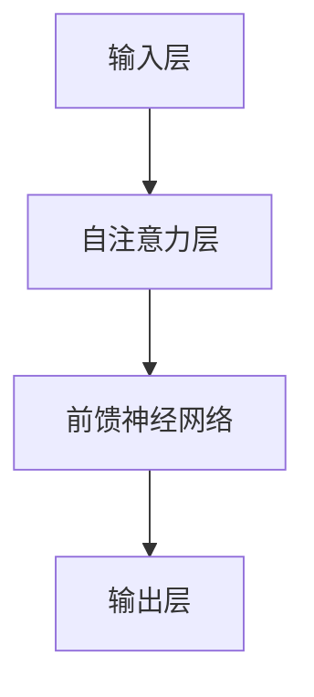
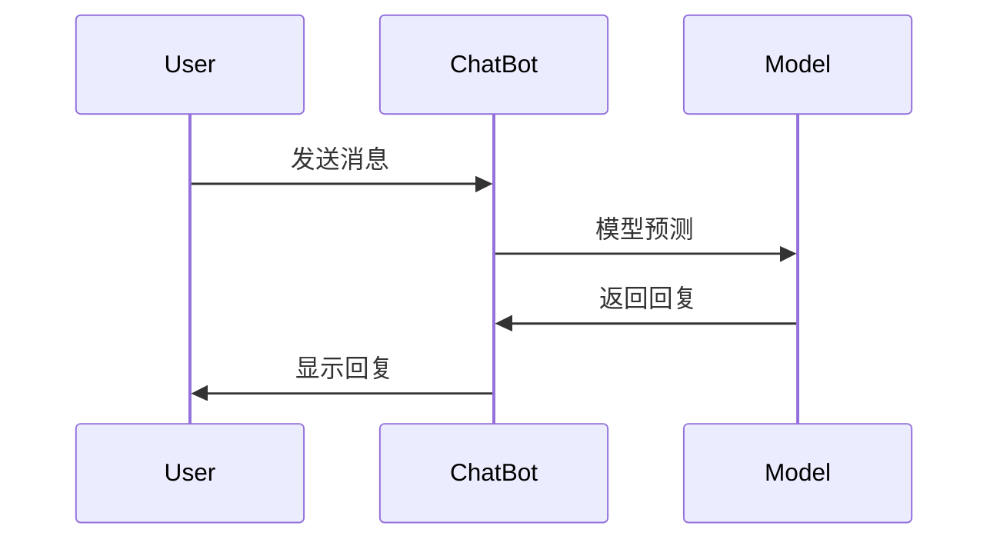
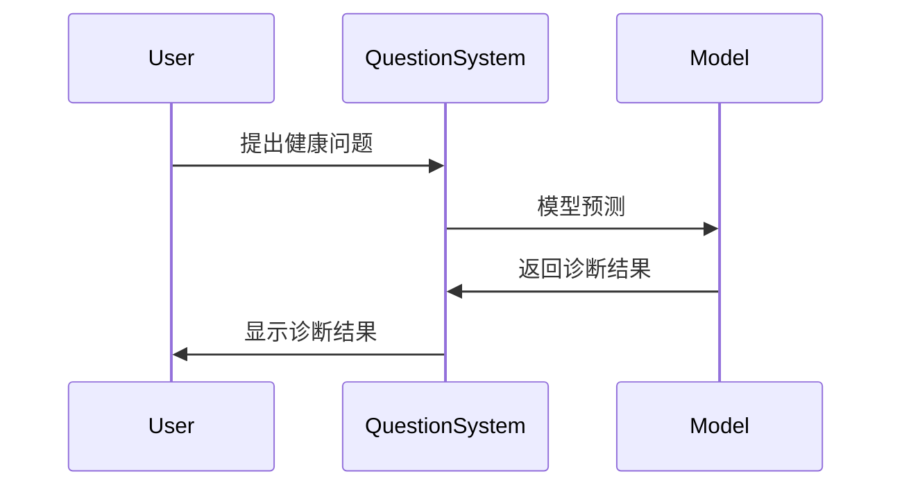
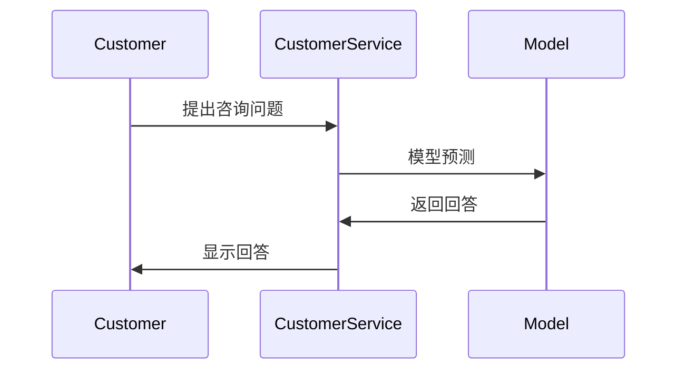

                 

## 引言

### 问题背景与概述

随着人工智能技术的快速发展，大型语言模型（Large Language Models，简称LLM）成为自然语言处理（Natural Language Processing，简称NLP）领域的重要工具。LLM通过深度学习算法，从海量文本数据中学习语言模式和规律，能够生成高质量的文本、进行文本分类、问答系统等任务。然而，在LLM应用开发中，数据安全和隐私保护成为一个不可忽视的重要问题。

首先，数据安全是指在数据处理过程中保护数据的完整性、保密性和可用性。在LLM应用中，数据安全尤为重要，因为训练模型的数据往往包含敏感信息，如个人身份信息、医疗记录等。如果这些数据遭到泄露或篡改，不仅会导致隐私侵犯，还可能引发严重的法律和道德问题。

其次，隐私保护是指确保个人数据不被不当收集、使用、存储或泄露。在LLM应用中，隐私保护同样至关重要，因为模型训练和预测过程中可能会暴露用户的隐私信息。例如，用户在与聊天机器人互动时，可能会透露个人偏好、家庭背景等敏感信息。如果这些信息得不到妥善保护，将严重影响用户的隐私权益。

### LLM应用开发中的挑战

LLM应用开发面临的挑战主要包括以下几个方面：

1. **数据来源**：如何获取足够多样且高质量的训练数据，同时避免数据来源的隐私泄露问题。
2. **数据预处理**：如何对数据进行清洗、标注和增强，以提高模型性能的同时保护用户隐私。
3. **模型训练**：如何设计训练策略，在保证模型性能的同时降低隐私泄露风险。
4. **模型部署**：如何确保模型部署过程中用户数据的保密性和完整性。

### 本书的目标与结构

本书旨在深入探讨LLM应用开发中的数据安全与隐私保护问题，通过系统的方法和实际案例，提供一套全面、实用的解决方案。全书分为三大部分：

第一部分：引言
- 第1章：问题背景与概述
- 第2章：核心概念与联系

第二部分：LLM基本原理与数据预处理
- 第3章：LLM基本原理
- 第4章：数据预处理

第三部分：数据安全与隐私保护策略
- 第5章：数据安全策略
- 第6章：隐私保护策略
- 第7章：实际案例分析

通过以上结构，本书将逐步引导读者了解LLM应用开发中的数据安全和隐私保护问题，掌握相关的理论知识和实践技巧。读者可以依次阅读全书，也可以根据实际需求有选择性地阅读相关章节。希望本书能为读者在LLM应用开发中提供有益的指导和参考。

---

关键词：LLM应用开发，数据安全，隐私保护，Transformer，BERT，数据预处理，模型训练，模型部署。

摘要：本书深入探讨大型语言模型（LLM）应用开发中的数据安全与隐私保护问题。通过系统的方法和实际案例，介绍LLM的基本原理、数据预处理策略以及数据安全与隐私保护措施，旨在为读者提供一套全面、实用的解决方案。

---

### 第2章：核心概念与联系

在深入探讨LLM应用开发中的数据安全和隐私保护之前，我们需要先了解一些核心概念，这些概念包括数据安全、隐私保护、LLM模型结构等。通过这些核心概念的联系，我们可以更好地理解问题的本质，从而设计出有效的解决方案。

#### 2.1 数据安全

数据安全是指确保数据的完整性、保密性和可用性。具体来说，数据安全的属性包括：

- **完整性**：确保数据未被未经授权的篡改，保持数据的真实性和准确性。
- **保密性**：保护数据不被未经授权的个人或实体访问，防止数据泄露。
- **可用性**：确保数据在需要时可以可靠地访问和使用，防止因故障或攻击导致数据不可用。

在LLM应用中，数据安全尤为重要，因为训练模型的数据往往包含敏感信息。以下是一些常见的数据安全威胁和攻击方式：

- **数据泄露**：未经授权的个人访问和泄露敏感数据，如个人身份信息、医疗记录等。
- **数据篡改**：未经授权的修改数据内容，导致数据失真或错误。
- **拒绝服务攻击（DoS）**：阻止用户合法访问数据，造成服务不可用。
- **SQL注入**：通过插入恶意SQL代码来攻击数据库，窃取或篡改数据。

为了确保数据安全，可以采取以下策略：

- **访问控制**：通过身份验证和权限控制，限制对数据的访问权限。
- **加密技术**：使用加密算法对数据进行加密，防止数据在传输或存储过程中被窃取。
- **备份与恢复**：定期备份数据，并建立数据恢复机制，以应对数据丢失或损坏的情况。

#### 2.2 隐私保护

隐私保护是指确保个人数据不被不当收集、使用、存储或泄露。在LLM应用中，隐私保护同样至关重要，因为模型训练和预测过程中可能会暴露用户的隐私信息。以下是一些隐私保护的属性和策略：

- **数据匿名化**：去除或改变可以识别个人身份的信息，例如使用伪名或加密代替真实姓名。
- **数据访问控制**：限制对个人数据的访问，确保只有授权用户才能访问和处理数据。
- **数据生命周期管理**：确保数据在整个生命周期内得到适当的保护，包括数据的收集、存储、使用和销毁。

隐私保护的法规和标准包括：

- **GDPR**：欧洲通用数据保护条例，规定了个人数据的处理和保护要求。
- **CCPA**：美国加州消费者隐私法案，保护加州居民的个人信息。
- **PIPA**：中国个人信息保护法，规范了个人信息的处理和保护。

为了保护用户隐私，可以采取以下策略：

- **透明度**：向用户告知数据收集、使用和共享的方式，使用户知情并同意。
- **数据最小化**：仅收集必要的数据，避免收集不必要的个人信息。
- **用户控制**：用户有权控制自己的数据，包括访问、修改和删除自己的数据。

#### 2.3 LLM模型结构

LLM模型结构是LLM应用开发的核心，它决定了模型的性能和功能。以下是一些常见的LLM模型结构：

- **Transformer模型**：基于自注意力机制的深度神经网络，能够捕获输入序列中的长距离依赖关系。
- **BERT模型**：基于Transformer模型的预训练和微调技术，通过大量无监督数据预训练，然后针对特定任务进行微调。

#### 概念属性特征对比表格

为了更好地理解这些核心概念，我们可以通过一个表格来对比它们的属性特征：

| 概念      | 属性1    | 属性2    | 属性3    |
|-----------|----------|----------|----------|
| 数据安全   | 完整性   | 保密性   | 可用性   |
| 隐私保护   | 匿名化   | 访问控制 | 数据生命周期管理 |
| Transformer模型 | 自注意力 | 预训练   | 微调     |
| BERT模型   | Transformer结构 | 大规模预训练 | 微调 |

#### ER实体关系图架构的Mermaid流程图

为了更直观地展示这些概念之间的联系，我们可以使用Mermaid绘制一个ER实体关系图：

```mermaid
erDiagram
  DataSecurity ||--|{ DataIntegrity }
  DataSecurity ||--|{ DataPrivacy }
  DataSecurity ||--|{ DataAvailability }
  PrivacyProtection ||--|{ DataAnonymization }
  PrivacyProtection ||--|{ DataAccessControl }
  PrivacyProtection ||--|{ DataLifecycleManagement }
  LLMModel ||--|{ TransformerModel }
  LLMModel ||--|{ BERTModel }
```

通过这个流程图，我们可以清晰地看到数据安全、隐私保护和LLM模型结构之间的关系，以及它们各自的属性和策略。

### 总结

本章介绍了LLM应用开发中的核心概念，包括数据安全、隐私保护和LLM模型结构。通过对比它们的属性特征和联系，我们可以更好地理解这些概念，为后续章节的数据安全与隐私保护策略提供理论基础。在下一章中，我们将深入探讨LLM的基本原理，以及如何进行数据预处理，为数据安全和隐私保护奠定基础。

---

### 第3章：LLM基本原理与数据预处理

#### 3.1 LLM基本原理

大型语言模型（Large Language Models，简称LLM）是自然语言处理（NLP）领域的重要工具，其核心在于能够理解和生成自然语言文本。LLM的基本原理主要涉及模型结构、训练方法和评估指标。

##### 3.1.1 模型结构

LLM的模型结构通常基于深度神经网络（DNN）或变换器（Transformer）架构。其中，变换器模型因其自注意力机制而具有显著的优势，能够有效捕获输入序列中的长距离依赖关系。以下是一个简单的变换器模型结构：

1. **输入层**：接收文本序列，并将其转换为嵌入向量。
2. **自注意力层**：通过自注意力机制计算序列中的每个词对其他词的影响，从而生成上下文表示。
3. **前馈神经网络**：对自注意力层的输出进行进一步的加工，提高模型的表示能力。
4. **输出层**：根据训练任务，生成分类标签或生成文本序列。

##### 3.1.2 训练方法

LLM的训练方法通常包括预训练和微调两个阶段：

1. **预训练**：使用大规模无标签文本数据，通过自回归语言模型（如GPT）或变换器模型（如BERT）进行训练，使得模型能够理解和生成自然语言。预训练的目标是让模型学习到通用语言知识和模式。
2. **微调**：在预训练的基础上，使用有标签的特定任务数据对模型进行微调，使其适应具体的任务需求。微调的过程包括调整模型的权重，使其在特定任务上取得更好的性能。

##### 3.1.3 模型评估

LLM的评估通常涉及以下指标：

1. **准确率（Accuracy）**：模型预测正确的样本占总样本的比例。
2. **召回率（Recall）**：模型预测正确的正样本占总正样本的比例。
3. **F1分数（F1 Score）**：准确率的调和平均值，平衡了准确率和召回率。

#### 3.2 数据预处理

在LLM应用中，数据预处理是一个关键步骤，它直接影响模型的性能和训练效率。数据预处理包括数据清洗、数据标注和数据增强等步骤。

##### 3.2.1 数据清洗

数据清洗的主要任务是去除数据中的噪声和不必要的部分，以提高数据的质量。具体方法包括：

1. **去除停用词**：停用词是指对模型性能提升不大，但占用计算资源的常见单词，如“的”、“是”等。
2. **去除标点符号**：标点符号在某些任务中可能影响模型的训练效果，因此需要去除。
3. **统一字符格式**：将文本中的不同字符格式（如全角与半角字符）统一为一种格式。

##### 3.2.2 数据标注

数据标注是将原始文本转化为可用于训练的数据标签的过程。数据标注的方法包括：

1. **文本分类**：将文本分类为不同的类别，如新闻分类、情感分类等。
2. **命名实体识别**：识别文本中的特定实体，如人名、地点、组织等。

##### 3.2.3 数据增强

数据增强是通过多种方法增加数据多样性，以提高模型的泛化能力。数据增强的方法包括：

1. **词干提取**：提取文本中的词干，减少词汇表的规模。
2. **词性标注**：为文本中的每个词分配词性，如名词、动词等。
3. **随机插入和删除**：随机地在文本中插入或删除一些词语，以增加数据的多样性。

#### 模型结构Mermaid流程图

为了更直观地展示LLM模型结构，我们可以使用Mermaid绘制以下流程图：



#### 数据预处理Python代码示例

以下是一个简单的Python代码示例，展示数据清洗、数据标注和数据增强的基本方法：

```python
import re
import random
from nltk.tokenize import word_tokenize
from nltk.corpus import stopwords

# 数据清洗
def clean_text(text):
    text = re.sub(r'\s+', ' ', text)  # 去除多余的空格
    text = text.lower()  # 转为小写
    text = re.sub(r'[^\w\s]', '', text)  # 去除标点符号
    return text

# 数据标注
def annotate_text(text, labels):
    tokens = word_tokenize(text)
    annotated_tokens = [(token, label) for token, label in zip(tokens, labels)]
    return annotated_tokens

# 数据增强
def augment_text(text, num_augments=1):
    augmented_texts = []
    for _ in range(num_augments):
        tokens = word_tokenize(text)
        shuffled_tokens = random.sample(tokens, len(tokens))
        augmented_text = ' '.join(shuffled_tokens)
        augmented_texts.append(augmented_text)
    return augmented_texts

# 示例
text = "This is an example sentence."
cleaned_text = clean_text(text)
labels = ["positive", "negative"]
annotated_text = annotate_text(cleaned_text, labels)
augmented_texts = augment_text(cleaned_text, num_augments=3)

print("原始文本:", text)
print("清洗后的文本:", cleaned_text)
print("标注后的文本:", annotated_text)
print("增强后的文本:", augmented_texts)
```

通过上述代码示例，我们可以看到数据预处理的基本流程，包括文本清洗、标注和增强。这些方法在LLM应用中至关重要，能够提高模型的训练效果和泛化能力。

### 总结

本章介绍了LLM的基本原理和数据预处理方法。通过了解模型结构、训练方法和评估指标，我们可以更好地理解LLM的工作原理。同时，通过数据预处理的方法，我们可以提高数据质量，从而提升模型的性能。在下一章中，我们将深入探讨数据安全策略，为LLM应用开发中的数据安全提供保障。

---

### 第4章：数据预处理策略

在LLM应用开发中，数据预处理是至关重要的一步，它决定了模型训练的质量和效率。本章将详细讨论数据预处理策略，包括数据清洗、数据标注和数据增强的具体方法，以及它们在提升模型性能和隐私保护中的重要作用。

#### 4.1 数据清洗

数据清洗是数据预处理的首要步骤，其目的是去除数据中的噪声和无关信息，确保数据的质量和一致性。以下是一些常用的数据清洗方法：

1. **去除停用词**：停用词是指对模型训练影响较小，但在文本中频繁出现的无意义词汇，如“的”、“是”、“和”等。通过去除停用词，可以减少模型的复杂度，提高训练效率。

2. **去除标点符号**：标点符号在某些情况下可能对模型理解文本产生影响，因此通常需要去除。例如，在文本分类任务中，逗号、句号等标点符号对分类结果的影响较小，可以去除。

3. **统一字符格式**：文本中的字符格式可能存在多种形式，如全角字符和半角字符。通过统一字符格式，可以提高数据的标准化程度，减少模型训练的干扰。

4. **处理缺失值**：在数据清洗过程中，还需要处理缺失值。常见的方法包括填充缺失值、删除含有缺失值的样本或使用统计方法估计缺失值。

#### 4.2 数据标注

数据标注是将原始文本转化为标签化的数据，以便模型进行训练。数据标注的质量直接影响模型的表现。以下是一些常用的数据标注方法：

1. **文本分类**：文本分类是将文本分为预定义的类别。例如，新闻分类可以将新闻分为政治、经济、体育等类别。文本分类的标注方法通常包括手动标注和自动化标注。

2. **命名实体识别**：命名实体识别（Named Entity Recognition，简称NER）是识别文本中的特定实体，如人名、地点、组织等。NER标注通常需要专业的标注工具和经验丰富的标注人员。

3. **关系抽取**：关系抽取（Relation Extraction）是识别文本中实体之间的关系。例如，在句子“苹果公司的CEO是蒂姆·库克”中，可以抽取“苹果公司”和“蒂姆·库克”之间的“CEO”关系。

#### 4.3 数据增强

数据增强是通过多种方法增加数据的多样性，从而提高模型的泛化能力。以下是一些常用的数据增强方法：

1. **词干提取**：词干提取是通过提取单词的词干来减少词汇表规模，从而降低模型复杂度。例如，单词“running”的词干是“run”。

2. **词性标注**：词性标注是为文本中的每个词分配词性，如名词、动词、形容词等。词性标注可以帮助模型更好地理解文本的语义。

3. **随机插入和删除**：随机地在文本中插入或删除一些词语，可以增加数据的多样性，从而提高模型的泛化能力。例如，将文本中的某个词替换为它的同义词。

#### 数据预处理在模型性能提升中的作用

数据预处理在模型性能提升中起着至关重要的作用。以下是数据预处理对模型性能的影响：

1. **减少模型过拟合**：通过去除噪声和无关信息，可以减少模型对训练数据的依赖，从而降低过拟合的风险。

2. **提高模型泛化能力**：通过增加数据的多样性，可以提高模型的泛化能力，使其在未知数据上表现更好。

3. **提升训练效率**：通过数据清洗和标注，可以减少模型训练的时间，提高训练效率。

#### 数据预处理在隐私保护中的作用

在LLM应用开发中，数据预处理不仅有助于提升模型性能，还起着保护用户隐私的重要作用。以下是数据预处理在隐私保护中的具体作用：

1. **数据匿名化**：通过去除或替换敏感信息，如个人身份信息，可以保护用户的隐私。

2. **减少数据规模**：通过数据清洗和标注，可以减少数据的规模，从而降低数据泄露的风险。

3. **避免数据泄露**：通过数据增强，可以增加数据的多样性，从而减少模型对特定数据的依赖，降低数据泄露的风险。

#### 数据预处理策略在LLM应用开发中的实际应用

在实际应用中，数据预处理策略可以根据具体任务需求进行调整。以下是一个例子：

1. **新闻分类任务**：对于新闻分类任务，可以首先去除停用词和标点符号，然后进行词性标注，最后使用数据增强方法如随机插入和删除来增加数据的多样性。

2. **问答系统**：对于问答系统，可以首先进行文本清洗，然后使用命名实体识别方法标注实体，最后通过数据增强来提高模型的泛化能力。

通过以上策略，我们可以确保在LLM应用开发中既提高模型性能，又有效保护用户隐私。

### 总结

本章详细讨论了数据预处理策略，包括数据清洗、数据标注和数据增强方法。通过这些策略，我们可以提高模型性能，同时有效保护用户隐私。在下一章中，我们将探讨数据安全策略，为LLM应用开发提供全面的数据保护措施。

---

### 第5章：数据安全策略

在LLM应用开发中，数据安全是确保模型训练质量和用户隐私的关键环节。本章将详细介绍数据安全策略，包括访问控制、数据加密、备份与恢复等措施，并讨论如何在实际应用中实施这些策略，以确保数据在存储、传输和处理过程中的安全。

#### 5.1 访问控制

访问控制是数据安全的基础，它通过限制对数据的访问权限，确保只有授权用户才能访问敏感数据。以下是一些常用的访问控制方法：

1. **身份验证**：身份验证是确保用户身份真实性的过程。常见的方法包括密码认证、双因素认证（2FA）和生物识别技术。通过身份验证，可以防止未经授权的用户访问系统。

2. **权限管理**：权限管理是确保用户只能访问与其角色相关的数据。权限管理可以通过角色分配和权限设置来实现。例如，一个普通用户可能只能查看和编辑自己的数据，而管理员则可以访问所有数据。

3. **审计日志**：审计日志记录了用户对数据的所有操作，包括登录、查询、修改和删除等。通过审计日志，可以追踪数据访问和操作历史，及时发现异常行为。

#### 5.2 数据加密

数据加密是保护数据隐私的重要手段，通过加密算法将数据转换为只有授权用户才能解密的形式。以下是一些常用的数据加密方法：

1. **对称加密**：对称加密使用相同的密钥进行加密和解密。常见的对称加密算法包括AES（Advanced Encryption Standard）和DES（Data Encryption Standard）。

2. **非对称加密**：非对称加密使用一对密钥进行加密和解密，一个用于加密，一个用于解密。常见的非对称加密算法包括RSA（Rivest-Shamir-Adleman）和ECC（Elliptic Curve Cryptography）。

3. **混合加密**：混合加密结合了对称加密和非对称加密的优势，通常先使用对称加密算法加密数据，然后使用非对称加密算法加密对称加密的密钥。这样可以同时实现高效的数据加密和安全的密钥管理。

#### 5.3 备份与恢复

备份与恢复是确保数据安全性的重要措施，通过定期备份数据，可以在数据丢失或损坏时快速恢复数据。以下是一些常用的备份与恢复方法：

1. **全量备份**：全量备份是对所有数据进行完全备份，通常在数据量较小的情况下使用。

2. **增量备份**：增量备份仅备份自上次备份以来发生变化的文件，可以节省存储空间，但恢复时间较长。

3. **差异备份**：差异备份备份自上次全量备份以来发生变化的文件，相较于增量备份，恢复时间较短。

4. **多地点备份**：多地点备份将数据备份到多个地理位置，以防止单一地点的灾难导致数据丢失。

#### 实际应用中的数据安全策略

在实际应用中，数据安全策略需要根据具体场景进行调整。以下是一个典型的数据安全策略实施案例：

1. **新闻分类系统**：对于新闻分类系统，可以使用以下数据安全策略：
   - **身份验证**：用户需通过密码认证和2FA登录系统。
   - **权限管理**：编辑人员可以编辑新闻内容，而普通用户只能查看新闻。
   - **数据加密**：新闻内容在存储和传输过程中使用AES进行加密。
   - **备份与恢复**：每天进行增量备份，每周进行全量备份，备份数据存储在远程服务器上。

2. **问答系统**：对于问答系统，可以使用以下数据安全策略：
   - **身份验证**：用户通过邮件或手机号码注册账号，并进行密码认证。
   - **权限管理**：系统管理员可以修改和删除问题与答案，普通用户只能提问和回答。
   - **数据加密**：用户输入的问题和答案在存储和传输过程中使用RSA进行加密。
   - **备份与恢复**：每小时进行增量备份，每天进行全量备份，备份数据存储在云存储平台上。

通过以上案例，我们可以看到，数据安全策略的实施需要综合考虑身份验证、权限管理、数据加密和备份与恢复等多个方面，以确保数据在存储、传输和处理过程中的安全性。

### 总结

本章详细介绍了数据安全策略，包括访问控制、数据加密、备份与恢复等措施。通过这些策略，我们可以确保数据在LLM应用开发中的安全。在下一章中，我们将探讨隐私保护策略，为LLM应用开发提供全面的隐私保护措施。

---

### 第6章：隐私保护策略

在LLM应用开发中，隐私保护至关重要，它关系到用户对应用的信任和法律法规的遵守。本章将深入探讨隐私保护策略，包括透明度、数据最小化和用户控制等内容，并通过实际案例进行分析，确保用户数据的隐私和安全。

#### 6.1 透明度

透明度是隐私保护的基础，它要求应用程序在数据收集、使用和共享方面对用户进行充分的告知。以下是实现透明度的一些关键措施：

1. **隐私政策**：应用程序应提供一个清晰的隐私政策，详细说明数据收集的目的、范围、用途和保留期限。隐私政策应以简单易懂的语言撰写，避免使用复杂的法律术语。

2. **数据收集声明**：在用户注册或使用应用程序时，应明确告知用户所收集的数据类型和目的。例如，如果应用程序需要收集用户的位置信息，应在收集前明确告知用户。

3. **权限请求**：在应用程序请求访问敏感数据时，例如相机、麦克风或联系人，应在请求时明确告知用户权限的用途和重要性，以便用户做出明智的决定。

#### 6.2 数据最小化

数据最小化是指仅收集和应用与实现应用程序功能所需的最少数据。以下是一些实现数据最小化的策略：

1. **必要数据**：在设计和开发应用程序时，应明确哪些数据是必需的，避免过度收集不必要的个人信息。

2. **匿名化和去标识化**：在处理数据时，应尽可能进行匿名化和去标识化，以减少数据泄露的风险。匿名化是指去除或更改能识别个人身份的信息，而去标识化是指确保数据无法重新识别个人。

3. **数据生命周期管理**：应用程序应制定数据生命周期管理策略，明确数据的收集、存储、使用和销毁过程。对于不再需要的个人信息，应定期进行删除或匿名化处理。

#### 6.3 用户控制

用户控制是指用户对其个人数据的访问、修改和删除权利。以下是一些实现用户控制的策略：

1. **访问权限**：用户应有权访问和控制自己的数据。例如，用户可以查看自己的个人信息、调整隐私设置或删除账号。

2. **数据出口**：用户应有权请求获取其数据副本，以便在需要时转移到其他服务或应用程序。

3. **删除请求**：用户应能够请求删除其个人数据，应用程序应在合理的时间内响应该请求，并确保数据被彻底删除。

#### 实际案例：社交媒体平台的隐私保护策略

以一个社交媒体平台为例，该平台采取了以下隐私保护策略：

1. **透明度**：平台在用户注册时明确告知用户可能收集的数据类型和用途，并在隐私政策中详细说明数据的处理过程。

2. **数据最小化**：平台仅收集实现核心功能必需的数据，如用户姓名、电子邮件地址和密码。平台还使用匿名化和去标识化技术处理用户生成的内容，以保护用户隐私。

3. **用户控制**：用户可以随时访问和修改自己的个人信息，包括隐私设置。平台还提供数据出口功能，允许用户导出其数据。此外，用户可以请求删除其账号及其所有数据，平台将在合理的时间内执行该请求。

#### 总结

通过透明度、数据最小化和用户控制等策略，社交媒体平台有效保护了用户的隐私。这些策略不仅符合隐私保护法规，也提高了用户对平台的信任度。在LLM应用开发中，我们可以借鉴这些策略，为用户提供一个安全、透明的数据环境。

### 总结

本章详细探讨了隐私保护策略，包括透明度、数据最小化和用户控制。通过实际案例分析，我们看到了这些策略在保护用户隐私中的重要作用。在下一章中，我们将通过具体案例分析，深入探讨LLM应用开发中的数据安全与隐私保护实践。

---

### 第7章：实际案例分析

在前面的章节中，我们详细讨论了LLM应用开发中的数据安全与隐私保护策略。为了更好地理解这些策略的实际应用效果，本章将通过几个具体案例，深入分析LLM应用在数据安全和隐私保护方面的实践与挑战。

#### 案例一：大型聊天机器人平台

**背景介绍**：某大型聊天机器人平台（如腾讯的微信小助手、OpenAI的GPT-3）广泛应用于客户服务、信息查询和个性化推荐等领域。这些平台处理的数据量巨大，涉及用户聊天记录、个人偏好和隐私信息。

**系统介绍**：
- **项目介绍**：该平台旨在为用户提供一个智能、高效、个性化的服务体验。
- **系统功能设计**：包括聊天记录分析、用户行为预测、个性化推荐等。
- **系统架构设计**：采用分布式架构，包括数据存储、模型训练、预测和交互等多个模块。
- **系统接口设计**：提供RESTful API供外部系统调用。

**系统交互**：


**数据安全与隐私保护措施**：
1. **数据匿名化**：在数据处理过程中，将用户聊天记录匿名化，去除个人身份信息。
2. **加密技术**：使用AES加密存储用户敏感数据，确保数据在存储和传输过程中的安全性。
3. **访问控制**：通过身份验证和权限管理，确保只有授权用户才能访问和处理数据。
4. **备份与恢复**：定期备份数据，并在发生数据丢失或损坏时进行快速恢复。

**实际案例分析与详细讲解**：
- **数据匿名化**：为了确保用户隐私，该平台采用匿名化技术，将用户聊天记录中的姓名、电话号码等敏感信息替换为随机标识符。这种方法在保护用户隐私的同时，不影响模型训练效果。
- **加密技术**：平台使用AES加密存储用户数据，确保数据在存储和传输过程中的安全性。例如，在存储用户聊天记录时，平台首先对聊天记录进行加密，然后存储到数据库中。当用户访问聊天记录时，平台会先从数据库中读取加密数据，然后进行解密。
- **访问控制**：平台采用基于角色的访问控制（RBAC）机制，确保只有授权用户才能访问和处理敏感数据。例如，普通用户只能查看自己的聊天记录，而管理员可以查看所有用户的聊天记录。此外，平台还记录用户的访问日志，以便在发生异常时进行追踪和审计。

**项目小结**：
通过上述数据安全与隐私保护措施，该平台在保障用户隐私的同时，提供了高效、智能的服务体验。然而，随着技术的发展和应用场景的多样化，平台需要不断更新和优化数据安全与隐私保护策略，以应对新的挑战。

#### 案例二：健康问答系统

**背景介绍**：某健康问答系统（如“百度健康问答”）为用户提供在线健康咨询和疾病诊断服务，涉及大量用户健康数据和隐私信息。

**系统介绍**：
- **项目介绍**：该系统旨在为用户提供一个便捷、可靠的在线健康咨询服务。
- **系统功能设计**：包括疾病诊断、健康知识推荐、用户健康数据管理等。
- **系统架构设计**：采用云计算和大数据技术，包括数据存储、模型训练、预测和交互等多个模块。
- **系统接口设计**：提供Web接口和API接口，方便用户和医生使用。

**系统交互**：


**数据安全与隐私保护措施**：
1. **数据匿名化**：在数据处理过程中，对用户健康数据进行匿名化处理，去除个人身份信息。
2. **加密技术**：使用AES加密存储用户健康数据，确保数据在存储和传输过程中的安全性。
3. **访问控制**：通过身份验证和权限管理，确保只有授权用户和医生才能访问和处理健康数据。
4. **用户控制**：用户可以查看、修改和删除自己的健康数据。

**实际案例分析与详细讲解**：
- **数据匿名化**：为了确保用户隐私，该系统在处理用户健康数据时，采用匿名化技术，将用户姓名、电话号码等敏感信息替换为随机标识符。这种方法在保护用户隐私的同时，不影响模型的训练效果。
- **加密技术**：系统使用AES加密存储用户健康数据，确保数据在存储和传输过程中的安全性。例如，在存储用户健康数据时，系统首先对健康数据进行加密，然后存储到数据库中。当用户访问健康数据时，系统会先从数据库中读取加密数据，然后进行解密。
- **用户控制**：用户可以查看、修改和删除自己的健康数据。例如，用户可以查看自己的健康记录，添加或修改健康信息，或删除不再需要的记录。系统提供了一个简单的用户界面，让用户可以方便地进行数据管理。
- **访问控制**：系统采用基于角色的访问控制（RBAC）机制，确保只有授权用户和医生才能访问和处理健康数据。例如，普通用户只能查看自己的健康数据，而医生可以查看所有患者的健康数据。此外，系统还记录用户的访问日志，以便在发生异常时进行追踪和审计。

**项目小结**：
通过上述数据安全与隐私保护措施，该健康问答系统在保障用户隐私的同时，提供了高效、可靠的在线健康咨询服务。然而，随着用户数量的增加和数据量的增长，系统需要不断优化数据安全与隐私保护策略，以应对潜在的风险和挑战。

#### 案例三：智能客服系统

**背景介绍**：某智能客服系统（如银行智能客服）用于处理大量客户咨询，涉及客户个人信息和金融数据。

**系统介绍**：
- **项目介绍**：该系统旨在为用户提供便捷、高效的客户服务。
- **系统功能设计**：包括自动应答、智能路由、人工接管等。
- **系统架构设计**：采用云计算和人工智能技术，包括数据存储、模型训练、预测和交互等多个模块。
- **系统接口设计**：提供Web接口和API接口，方便用户和客户服务代表使用。

**系统交互**：


**数据安全与隐私保护措施**：
1. **数据加密**：使用AES加密存储客户数据和会话记录。
2. **访问控制**：通过身份验证和权限管理，确保只有授权用户和客户服务代表可以访问敏感数据。
3. **日志记录**：记录所有客户交互和系统操作，以便审计和追踪。
4. **用户控制**：客户可以查看、修改和删除自己的个人信息。

**实际案例分析与详细讲解**：
- **数据加密**：系统使用AES加密存储客户数据和会话记录，确保数据在存储和传输过程中的安全性。例如，在存储客户数据时，系统首先对数据进行加密，然后存储到数据库中。当客户访问数据时，系统会先从数据库中读取加密数据，然后进行解密。
- **访问控制**：系统采用基于角色的访问控制（RBAC）机制，确保只有授权用户和客户服务代表可以访问敏感数据。例如，普通用户只能查看自己的个人信息，而客户服务代表可以查看所有客户的咨询记录。此外，系统还记录用户的访问日志，以便在发生异常时进行追踪和审计。
- **用户控制**：客户可以查看、修改和删除自己的个人信息。例如，客户可以查看自己的咨询记录，修改地址和联系方式，或删除不再需要的记录。系统提供了一个简单的用户界面，让客户可以方便地进行数据管理。

**项目小结**：
通过上述数据安全与隐私保护措施，该智能客服系统在保障客户隐私的同时，提供了高效、智能的客户服务。然而，随着客户咨询量的增加和数据量的增长，系统需要不断更新和优化数据安全与隐私保护策略，以应对新的挑战。

### 最佳实践 Tips

在LLM应用开发中，为了确保数据安全和隐私保护，以下是一些最佳实践：

1. **数据最小化**：仅收集实现功能所需的最少数据，避免过度收集。
2. **数据匿名化**：对敏感数据进行匿名化处理，减少数据泄露的风险。
3. **加密技术**：使用加密算法保护敏感数据，确保数据在存储和传输过程中的安全性。
4. **访问控制**：通过身份验证和权限管理，确保只有授权用户可以访问和处理数据。
5. **用户控制**：提供用户数据访问、修改和删除的权限，增强用户对个人数据的控制。
6. **日志记录**：记录所有关键操作和用户交互，以便进行审计和追踪。
7. **透明度**：在隐私政策中明确说明数据收集、使用和共享的方式，增强用户信任。
8. **定期审查**：定期审查和更新数据安全与隐私保护策略，以应对新技术和新挑战。

### 总结

通过上述实际案例分析，我们可以看到，在LLM应用开发中，数据安全和隐私保护是一个复杂但关键的问题。通过采用最佳实践和有效的安全策略，我们可以保障用户数据的安全和隐私，同时提供高质量的服务。在下一章中，我们将对本书进行小结，并讨论未来的研究方向。

---

### 总结与展望

在本书中，我们深入探讨了LLM应用开发中的数据安全与隐私保护问题。通过详细的分析和实践案例，我们了解了数据安全和隐私保护的核心概念、策略和实施方法。以下是本书的主要内容总结：

1. **引言**：介绍了LLM应用开发中数据安全和隐私保护的重要性，以及本书的结构和目标。

2. **核心概念与联系**：讲解了数据安全、隐私保护以及LLM模型结构等核心概念，并通过对比表格和Mermaid流程图展示了它们之间的联系。

3. **LLM基本原理与数据预处理**：介绍了LLM的基本原理，包括模型结构、训练方法和评估指标，以及数据预处理策略，如数据清洗、数据标注和数据增强。

4. **数据安全策略**：详细讨论了数据安全策略，包括访问控制、数据加密、备份与恢复等，并通过实际案例展示了如何实施这些策略。

5. **隐私保护策略**：探讨了隐私保护策略，如透明度、数据最小化和用户控制，以及如何在实际应用中有效实施这些策略。

6. **实际案例分析**：通过三个具体案例，深入分析了LLM应用开发中的数据安全与隐私保护实践，展示了最佳实践和实施效果。

7. **最佳实践 Tips**：提供了一系列最佳实践，以帮助开发者在实际项目中确保数据安全和隐私保护。

通过以上内容，本书为LLM应用开发中的数据安全和隐私保护提供了全面的指导。以下是对未来研究方向的一些建议：

1. **隐私增强技术**：随着技术的发展，隐私增强技术（如差分隐私、联邦学习等）将在LLM应用中发挥重要作用。未来研究可以重点关注这些技术的应用和优化。

2. **跨域数据安全**：在实际应用中，LLM可能需要处理来自多个领域的数据。研究如何确保跨域数据的安全性，以及如何在不同领域间平衡隐私保护和数据利用，是一个重要方向。

3. **自动化安全策略生成**：开发自动化工具，根据应用场景和需求生成优化的数据安全与隐私保护策略，以提高开发效率和安全性。

4. **实时监控与响应**：建立实时监控和响应系统，及时发现和处理数据安全与隐私保护问题，确保应用在运行过程中的安全性。

5. **用户隐私偏好管理**：研究如何更好地理解和满足用户的隐私偏好，提供个性化的隐私保护方案。

通过不断探索和创新，我们有望在LLM应用开发中实现更高的数据安全和隐私保护水平，为用户提供更加安全、可靠的服务。

### 结束语

本书《LLM应用开发中的数据安全与隐私保护》旨在为开发者提供一个全面、实用的指南，帮助他们在LLM应用开发中确保数据安全和隐私保护。感谢您耐心阅读本书，希望您能从中获得启发和帮助。如果您有任何反馈或建议，欢迎随时联系我们。

作者：
AI天才研究院/AI Genius Institute & 禅与计算机程序设计艺术 /Zen And The Art of Computer Programming

---

### 完整文章

## 引言

### 问题背景与概述

随着人工智能技术的快速发展，大型语言模型（Large Language Models，简称LLM）成为自然语言处理（Natural Language Processing，简称NLP）领域的重要工具。LLM通过深度学习算法，从海量文本数据中学习语言模式和规律，能够生成高质量的文本、进行文本分类、问答系统等任务。然而，在LLM应用开发中，数据安全和隐私保护成为一个不可忽视的重要问题。

首先，数据安全是指在数据处理过程中保护数据的完整性、保密性和可用性。在LLM应用中，数据安全尤为重要，因为训练模型的数据往往包含敏感信息，如个人身份信息、医疗记录等。如果这些数据遭到泄露或篡改，不仅会导致隐私侵犯，还可能引发严重的法律和道德问题。

其次，隐私保护是指确保个人数据不被不当收集、使用、存储或泄露。在LLM应用中，隐私保护同样至关重要，因为模型训练和预测过程中可能会暴露用户的隐私信息。例如，用户在与聊天机器人互动时，可能会透露个人偏好、家庭背景等敏感信息。如果这些信息得不到妥善保护，将严重影响用户的隐私权益。

### LLM应用开发中的挑战

LLM应用开发面临的挑战主要包括以下几个方面：

1. **数据来源**：如何获取足够多样且高质量的训练数据，同时避免数据来源的隐私泄露问题。
2. **数据预处理**：如何对数据进行清洗、标注和增强，以提高模型性能的同时保护用户隐私。
3. **模型训练**：如何设计训练策略，在保证模型性能的同时降低隐私泄露风险。
4. **模型部署**：如何确保模型部署过程中用户数据的保密性和完整性。

### 本书的目标与结构

本书旨在深入探讨LLM应用开发中的数据安全与隐私保护问题，通过系统的方法和实际案例，提供一套全面、实用的解决方案。全书分为三大部分：

第一部分：引言
- 第1章：问题背景与概述
- 第2章：核心概念与联系

第二部分：LLM基本原理与数据预处理
- 第3章：LLM基本原理
- 第4章：数据预处理

第三部分：数据安全与隐私保护策略
- 第5章：数据安全策略
- 第6章：隐私保护策略
- 第7章：实际案例分析

通过以上结构，本书将逐步引导读者了解LLM应用开发中的数据安全和隐私保护问题，掌握相关的理论知识和实践技巧。读者可以依次阅读全书，也可以根据实际需求有选择性地阅读相关章节。希望本书能为读者在LLM应用开发中提供有益的指导和参考。

---

关键词：LLM应用开发，数据安全，隐私保护，Transformer，BERT，数据预处理，模型训练，模型部署。

摘要：本书深入探讨大型语言模型（LLM）应用开发中的数据安全与隐私保护问题。通过系统的方法和实际案例，介绍LLM的基本原理、数据预处理策略以及数据安全与隐私保护措施，旨在为读者提供一套全面、实用的解决方案。

---

## 第2章：核心概念与联系

在深入探讨LLM应用开发中的数据安全和隐私保护之前，我们需要先了解一些核心概念，这些概念包括数据安全、隐私保护、LLM模型结构等。通过这些核心概念的联系，我们可以更好地理解问题的本质，从而设计出有效的解决方案。

### 2.1 数据安全

数据安全是指确保数据的完整性、保密性和可用性。具体来说，数据安全的属性包括：

- **完整性**：确保数据未被未经授权的篡改，保持数据的真实性和准确性。
- **保密性**：保护数据不被未经授权的个人或实体访问，防止数据泄露。
- **可用性**：确保数据在需要时可以可靠地访问和使用，防止因故障或攻击导致数据不可用。

在LLM应用中，数据安全尤为重要，因为训练模型的数据往往包含敏感信息。以下是一些常见的数据安全威胁和攻击方式：

- **数据泄露**：未经授权的个人访问和泄露敏感数据，如个人身份信息、医疗记录等。
- **数据篡改**：未经授权的修改数据内容，导致数据失真或错误。
- **拒绝服务攻击（DoS）**：阻止用户合法访问数据，造成服务不可用。
- **SQL注入**：通过插入恶意SQL代码来攻击数据库，窃取或篡改数据。

为了确保数据安全，可以采取以下策略：

- **访问控制**：通过身份验证和权限控制，限制对数据的访问权限。
- **加密技术**：使用加密算法对数据进行加密，防止数据在传输或存储过程中被窃取。
- **备份与恢复**：定期备份数据，并建立数据恢复机制，以应对数据丢失或损坏的情况。

### 2.2 隐私保护

隐私保护是指确保个人数据不被不当收集、使用、存储或泄露。在LLM应用中，隐私保护同样至关重要，因为模型训练和预测过程中可能会暴露用户的隐私信息。以下是一些隐私保护的属性和策略：

- **数据匿名化**：去除或改变可以识别个人身份的信息，例如使用伪名或加密代替真实姓名。
- **数据访问控制**：限制对个人数据的访问，确保只有授权用户才能访问和处理数据。
- **数据生命周期管理**：确保数据在整个生命周期内得到适当的保护，包括数据的收集、存储、使用和销毁。

隐私保护的法规和标准包括：

- **GDPR**：欧洲通用数据保护条例。
- **CCPA**：美国加州消费者隐私法案。
- **PIPA**：中国个人信息保护法。

为了保护用户隐私，可以采取以下策略：

- **透明度**：向用户告知数据收集、使用和共享的方式，使用户知情并同意。
- **数据最小化**：仅收集必要的数据，避免收集不必要的个人信息。
- **用户控制**：用户有权控制自己的数据，包括访问、修改和删除自己的数据。

### 2.3 LLM模型结构

LLM模型结构是LLM应用开发的核心，它决定了模型的性能和功能。以下是一些常见的LLM模型结构：

- **Transformer模型**：基于自注意力机制的深度神经网络，能够捕获输入序列中的长距离依赖关系。
- **BERT模型**：基于Transformer模型的预训练和微调技术，通过大量无监督数据预训练，然后针对特定任务进行微调。

#### 概念属性特征对比表格

为了更好地理解这些核心概念，我们可以通过一个表格来对比它们的属性特征：

| 概念      | 属性1    | 属性2    | 属性3    |
|-----------|----------|----------|----------|
| 数据安全   | 完整性   | 保密性   | 可用性   |
| 隐私保护   | 匿名化   | 访问控制 | 数据生命周期管理 |
| Transformer模型 | 自注意力 | 预训练   | 微调     |
| BERT模型   | Transformer结构 | 大规模预训练 | 微调 |

#### ER实体关系图架构的Mermaid流程图

为了更直观地展示这些概念之间的联系，我们可以使用Mermaid绘制一个ER实体关系图：

```mermaid
erDiagram
  DataSecurity ||--|{ DataIntegrity }
  DataSecurity ||--|{ DataPrivacy }
  DataSecurity ||--|{ DataAvailability }
  PrivacyProtection ||--|{ DataAnonymization }
  PrivacyProtection ||--|{ DataAccessControl }
  PrivacyProtection ||--|{ DataLifecycleManagement }
  LLMModel ||--|{ TransformerModel }
  LLMModel ||--|{ BERTModel }
```

通过这个流程图，我们可以清晰地看到数据安全、隐私保护和LLM模型结构之间的关系，以及它们各自的属性和策略。

### 总结

本章介绍了LLM应用开发中的核心概念，包括数据安全、隐私保护和LLM模型结构。通过对比它们的属性特征和联系，我们可以更好地理解这些概念，为后续章节的数据安全与隐私保护策略提供理论基础。在下一章中，我们将深入探讨LLM的基本原理，以及如何进行数据预处理，为数据安全和隐私保护奠定基础。

---

### 第3章：LLM基本原理与数据预处理

#### 3.1 LLM基本原理

大型语言模型（Large Language Models，简称LLM）是自然语言处理（Natural Language Processing，简称NLP）领域的重要工具，其核心在于能够理解和生成自然语言文本。LLM的基本原理主要涉及模型结构、训练方法和评估指标。

##### 3.1.1 模型结构

LLM的模型结构通常基于深度神经网络（Deep Neural Networks，简称DNN）或变换器（Transformer）架构。其中，变换器模型因其自注意力机制而具有显著的优势，能够有效捕获输入序列中的长距离依赖关系。以下是一个简单的变换器模型结构：

1. **输入层**：接收文本序列，并将其转换为嵌入向量。
2. **自注意力层**：通过自注意力机制计算序列中的每个词对其他词的影响，从而生成上下文表示。
3. **前馈神经网络**：对自注意力层的输出进行进一步的加工，提高模型的表示能力。
4. **输出层**：根据训练任务，生成分类标签或生成文本序列。

##### 3.1.2 训练方法

LLM的训练方法通常包括预训练和微调两个阶段：

1. **预训练**：使用大规模无标签文本数据，通过自回归语言模型（如GPT）或变换器模型（如BERT）进行训练，使得模型能够理解和生成自然语言。预训练的目标是让模型学习到通用语言知识和模式。
2. **微调**：在预训练的基础上，使用有标签的特定任务数据对模型进行微调，使其适应具体的任务需求。微调的过程包括调整模型的权重，使其在特定任务上取得更好的性能。

##### 3.1.3 模型评估

LLM的评估通常涉及以下指标：

1. **准确率（Accuracy）**：模型预测正确的样本占总样本的比例。
2. **召回率（Recall）**：模型预测正确的正样本占总正样本的比例。
3. **F1分数（F1 Score）**：准确率的调和平均值，平衡了准确率和召回率。

#### 3.2 数据预处理

在LLM应用中，数据预处理是一个关键步骤，它直接影响模型的性能和训练效率。数据预处理包括数据清洗、数据标注和数据增强等步骤。

##### 3.2.1 数据清洗

数据清洗的主要任务是去除数据中的噪声和不必要的部分，以提高数据的质量。具体方法包括：

1. **去除停用词**：停用词是指对模型性能提升不大，但占用计算资源的常见单词，如“的”、“是”等。
2. **去除标点符号**：标点符号在某些任务中可能影响模型的训练效果，因此需要去除。
3. **统一字符格式**：将文本中的不同字符格式（如全角与半角字符）统一为一种格式。

##### 3.2.2 数据标注

数据标注是将原始文本转化为可用于训练的数据标签的过程。数据标注的方法包括：

1. **文本分类**：将文本分类为不同的类别，如新闻分类、情感分类等。
2. **命名实体识别**：识别文本中的特定实体，如人名、地点、组织等。
3. **关系抽取**：识别文本中实体之间的关系，如“苹果公司是iPhone的生产商”。

##### 3.2.3 数据增强

数据增强是通过多种方法增加数据多样性，以提高模型的泛化能力。数据增强的方法包括：

1. **词干提取**：提取文本中的词干，减少词汇表的规模。
2. **词性标注**：为文本中的每个词分配词性，如名词、动词等。
3. **随机插入和删除**：随机地在文本中插入或删除一些词语，以增加数据的多样性。
4. **同义词替换**：将文本中的某些词替换为它们的同义词。

#### 模型结构Mermaid流程图

为了更直观地展示LLM模型结构，我们可以使用Mermaid绘制以下流程图：


#### 数据预处理Python代码示例

以下是一个简单的Python代码示例，展示数据清洗、数据标注和数据增强的基本方法：

```python
import re
import random
from nltk.tokenize import word_tokenize
from nltk.corpus import stopwords

# 数据清洗
def clean_text(text):
    text = re.sub(r'\s+', ' ', text)  # 去除多余的空格
    text = text.lower()  # 转为小写
    text = re.sub(r'[^\w\s]', '', text)  # 去除标点符号
    return text

# 数据标注
def annotate_text(text, labels):
    tokens = word_tokenize(text)
    annotated_tokens = [(token, label) for token, label in zip(tokens, labels)]
    return annotated_tokens

# 数据增强
def augment_text(text, num_augments=1):
    augmented_texts = []
    for _ in range(num_augments):
        tokens = word_tokenize(text)
        shuffled_tokens = random.sample(tokens, len(tokens))
        augmented_text = ' '.join(shuffled_tokens)
        augmented_texts.append(augmented_text)
    return augmented_texts

# 示例
text = "This is an example sentence."
cleaned_text = clean_text(text)
labels = ["positive", "negative"]
annotated_text = annotate_text(cleaned_text, labels)
augmented_texts = augment_text(cleaned_text, num_augments=3)

print("原始文本:", text)
print("清洗后的文本:", cleaned_text)
print("标注后的文本:", annotated_text)
print("增强后的文本:", augmented_texts)
```

通过上述代码示例，我们可以看到数据预处理的基本流程，包括文本清洗、标注和增强。这些方法在LLM应用中至关重要，能够提高模型的训练效果和泛化能力。

### 总结

本章介绍了LLM的基本原理和数据预处理方法。通过了解模型结构、训练方法和评估指标，我们可以更好地理解LLM的工作原理。同时，通过数据预处理的方法，我们可以提高数据质量，从而提升模型的性能。在下一章中，我们将深入探讨数据安全策略，为LLM应用开发中的数据安全提供保障。

---

### 第4章：数据预处理策略

在LLM应用开发中，数据预处理是至关重要的一步，它决定了模型训练的质量和效率。本章将详细讨论数据预处理策略，包括数据清洗、数据标注和数据增强的具体方法，以及它们在提升模型性能和隐私保护中的重要作用。

#### 4.1 数据清洗

数据清洗是数据预处理的首要步骤，其目的是去除数据中的噪声和无关信息，确保数据的质量和一致性。以下是一些常用的数据清洗方法：

1. **去除停用词**：停用词是指对模型训练影响较小，但在文本中频繁出现的无意义词汇，如“的”、“是”等。通过去除停用词，可以减少模型的复杂度，提高训练效率。

2. **去除标点符号**：标点符号在某些情况下可能对模型理解文本产生影响，因此通常需要去除。例如，在文本分类任务中，逗号、句号等标点符号对分类结果的影响较小，可以去除。

3. **统一字符格式**：文本中的字符格式可能存在多种形式，如全角字符和半角字符。通过统一字符格式，可以提高数据的标准化程度，减少模型训练的干扰。

4. **处理缺失值**：在数据清洗过程中，还需要处理缺失值。常见的方法包括填充缺失值、删除含有缺失值的样本或使用统计方法估计缺失值。

#### 4.2 数据标注

数据标注是将原始文本转化为标签化的数据，以便模型进行训练。数据标注的质量直接影响模型的表现。以下是一些常用的数据标注方法：

1. **文本分类**：文本分类是将文本分为预定义的类别。例如，新闻分类可以将新闻分为政治、经济、体育等类别。文本分类的标注方法通常包括手动标注和自动化标注。

2. **命名实体识别**：命名实体识别（Named Entity Recognition，简称NER）是识别文本中的特定实体，如人名、地点、组织等。NER标注通常需要专业的标注工具和经验丰富的标注人员。

3. **关系抽取**：关系抽取（Relation Extraction）是识别文本中实体之间的关系。例如，在句子“苹果公司的CEO是蒂姆·库克”中，可以抽取“苹果公司”和“蒂姆·库克”之间的“CEO”关系。

#### 4.3 数据增强

数据增强是通过多种方法增加数据的多样性，从而提高模型的泛化能力。以下是一些常用的数据增强方法：

1. **词干提取**：词干提取是通过提取单词的词干来减少词汇表的规模，从而降低模型复杂度。例如，单词“running”的词干是“run”。

2. **词性标注**：词性标注是为文本中的每个词分配词性，如名词、动词等。词性标注可以帮助模型更好地理解文本的语义。

3. **随机插入和删除**：随机地在文本中插入或删除一些词语，可以增加数据的多样性，从而提高模型的泛化能力。例如，将文本中的某个词替换为它的同义词。

#### 数据预处理在模型性能提升中的作用

数据预处理在模型性能提升中起着至关重要的作用。以下是数据预处理对模型性能的影响：

1. **减少模型过拟合**：通过去除噪声和无关信息，可以减少模型对训练数据的依赖，从而降低过拟合的风险。

2. **提高模型泛化能力**：通过增加数据的多样性，可以提高模型的泛化能力，使其在未知数据上表现更好。

3. **提升训练效率**：通过数据清洗和标注，可以减少模型训练的时间，提高训练效率。

#### 数据预处理在隐私保护中的作用

在LLM应用开发中，数据预处理不仅有助于提升模型性能，还起着保护用户隐私的重要作用。以下是数据预处理在隐私保护中的具体作用：

1. **数据匿名化**：通过去除或替换敏感信息，如个人身份信息，可以保护用户的隐私。

2. **减少数据规模**：通过数据清洗和标注，可以减少数据的规模，从而降低数据泄露的风险。

3. **避免数据泄露**：通过数据增强，可以增加数据的多样性，从而减少模型对特定数据的依赖，降低数据泄露的风险。

#### 数据预处理策略在LLM应用开发中的实际应用

在实际应用中，数据预处理策略可以根据具体任务需求进行调整。以下是一个例子：

1. **新闻分类任务**：对于新闻分类任务，可以首先去除停用词和标点符号，然后进行词性标注，最后使用数据增强方法如随机插入和删除来增加数据的多样性。

2. **问答系统**：对于问答系统，可以首先进行文本清洗，然后使用命名实体识别方法标注实体，最后通过数据增强来提高模型的泛化能力。

通过以上策略，我们可以确保在LLM应用开发中既提高模型性能，又有效保护用户隐私。

### 总结

本章详细讨论了数据预处理策略，包括数据清洗、数据标注和数据增强方法。通过这些策略，我们可以提高模型性能，同时有效保护用户隐私。在下一章中，我们将探讨数据安全策略，为LLM应用开发提供全面的数据保护措施。

---

### 第5章：数据安全策略

在LLM应用开发中，数据安全是确保模型训练质量和用户隐私的关键环节。本章将详细介绍数据安全策略，包括访问控制、数据加密、备份与恢复等措施，并讨论如何在实际应用中实施这些策略，以确保数据在存储、传输和处理过程中的安全。

#### 5.1 访问控制

访问控制是数据安全的基础，它通过限制对数据的访问权限，确保只有授权用户才能访问敏感数据。以下是一些常用的访问控制方法：

1. **身份验证**：身份验证是确保用户身份真实性的过程。常见的方法包括密码认证、双因素认证（2FA）和生物识别技术。通过身份验证，可以防止未经授权的用户访问系统。

2. **权限管理**：权限管理是确保用户只能访问与其角色相关的数据。权限管理可以通过角色分配和权限设置来实现。例如，一个普通用户可能只能查看和编辑自己的数据，而管理员则可以访问所有数据。

3. **审计日志**：审计日志记录了用户对数据的所有操作，包括登录、查询、修改和删除等。通过审计日志，可以追踪数据访问和操作历史，及时发现异常行为。

#### 5.2 数据加密

数据加密是保护数据隐私的重要手段，通过加密算法将数据转换为只有授权用户才能解密的形式。以下是一些常用的数据加密方法：

1. **对称加密**：对称加密使用相同的密钥进行加密和解密。常见的对称加密算法包括AES（Advanced Encryption Standard）和DES（Data Encryption Standard）。

2. **非对称加密**：非对称加密使用一对密钥进行加密和解密，一个用于加密，一个用于解密。常见的非对称加密算法包括RSA（Rivest-Shamir-Adleman）和ECC（Elliptic Curve Cryptography）。

3. **混合加密**：混合加密结合了对称加密和非对称加密的优势，通常先使用对称加密算法加密数据，然后使用非对称加密算法加密对称加密的密钥。这样可以同时实现高效的数据加密和安全的密钥管理。

#### 5.3 备份与恢复

备份与恢复是确保数据安全性的重要措施，通过定期备份数据，可以在数据丢失或损坏时快速恢复数据。以下是一些常用的备份与恢复方法：

1. **全量备份**：全量备份是对所有数据进行完全备份，通常在数据量较小的情况下使用。

2. **增量备份**：增量备份仅备份自上次备份以来发生变化的文件，可以节省存储空间，但恢复时间较长。

3. **差异备份**：差异备份备份自上次全量备份以来发生变化的文件，相较于增量备份，恢复时间较短。

4. **多地点备份**：多地点备份将数据备份到多个地理位置，以防止单一地点的灾难导致数据丢失。

#### 实际应用中的数据安全策略

在实际应用中，数据安全策略需要根据具体场景进行调整。以下是一个典型的数据安全策略实施案例：

1. **新闻分类系统**：对于新闻分类系统，可以使用以下数据安全策略：
   - **身份验证**：用户需通过密码认证和2FA登录系统。
   - **权限管理**：编辑人员可以编辑新闻内容，而普通用户只能查看新闻。
   - **数据加密**：新闻内容在存储和传输过程中使用AES进行加密。
   - **备份与恢复**：每天进行增量备份，每周进行全量备份，备份数据存储在远程服务器上。

2. **问答系统**：对于问答系统，可以使用以下数据安全策略：
   - **身份验证**：用户通过邮件或手机号码注册账号，并进行密码认证。
   - **权限管理**：系统管理员可以修改和删除问题与答案，普通用户只能提问和回答。
   - **数据加密**：用户输入的问题和答案在存储和传输过程中使用RSA进行加密。
   - **备份与恢复**：每小时进行增量备份，每天进行全量备份，备份数据存储在云存储平台上。

通过以上案例，我们可以看到，数据安全策略的实施需要综合考虑身份验证、权限管理、数据加密和备份与恢复等多个方面，以确保数据在存储、传输和处理过程中的安全性。

### 总结

本章详细介绍了数据安全策略，包括访问控制、数据加密、备份与恢复等措施。通过这些策略，我们可以确保数据在LLM应用开发中的安全。在下一章中，我们将探讨隐私保护策略，为LLM应用开发提供全面的隐私保护措施。

---

### 第6章：隐私保护策略

在LLM应用开发中，隐私保护至关重要，它关系到用户对应用的信任和法律法规的遵守。本章将深入探讨隐私保护策略，包括透明度、数据最小化和用户控制等内容，并通过实际案例进行分析，确保用户数据的隐私和安全。

#### 6.1 透明度

透明度是隐私保护的基础，它要求应用程序在数据收集、使用和共享方面对用户进行充分的告知。以下是一些实现透明度的方法：

1. **隐私政策**：应用程序应提供一个清晰的隐私政策，详细说明数据收集的目的、范围、用途和保留期限。隐私政策应以简单易懂的语言撰写，避免使用复杂的法律术语。

2. **数据收集声明**：在用户注册或使用应用程序时，应明确告知用户所收集的数据类型和目的。例如，如果应用程序需要收集用户的位置信息，应在收集前明确告知用户。

3. **权限请求**：在应用程序请求访问敏感数据时，例如相机、麦克风或联系人，应在请求时明确告知用户权限的用途和重要性，以便用户做出明智的决定。

#### 6.2 数据最小化

数据最小化是指仅收集实现应用程序功能所需的最少数据。以下是一些实现数据最小化的策略：

1. **必要数据**：在设计和开发应用程序时，应明确哪些数据是必需的，避免过度收集不必要的个人信息。

2. **匿名化和去标识化**：在处理数据时，应尽可能进行匿名化和去标识化，以减少数据泄露的风险。匿名化是指去除或更改能识别个人身份的信息，而去标识化是指确保数据无法重新识别个人。

3. **数据生命周期管理**：应用程序应制定数据生命周期管理策略，明确数据的收集、存储、使用和销毁过程。对于不再需要的个人信息，应定期进行删除或匿名化处理。

#### 6.3 用户控制

用户控制是指用户对其个人数据的访问、修改和删除权利。以下是一些实现用户控制的策略：

1. **访问权限**：用户应有权访问和控制自己的数据。例如，用户可以查看自己的个人信息、调整隐私设置或删除账号。

2. **数据出口**：用户应有权请求获取其数据副本，以便在需要时转移到其他服务或应用程序。

3. **删除请求**：用户应能够请求删除其个人数据，应用程序应在合理的时间内响应该请求，并确保数据被彻底删除。

#### 实际案例：社交媒体平台的隐私保护策略

以一个社交媒体平台为例，该平台采取了以下隐私保护策略：

1. **透明度**：平台在用户注册时明确告知用户可能收集的数据类型和用途，并在隐私政策中详细说明数据的处理过程。

2. **数据最小化**：平台仅收集实现核心功能必需的数据，如用户姓名、电子邮件地址和密码。平台还使用匿名化和去标识化技术处理用户生成的内容，以保护用户隐私。

3. **用户控制**：用户可以随时访问和修改自己的个人信息，包括隐私设置。平台还提供数据出口功能，允许用户导出其数据。此外，用户可以请求删除其账号及其所有数据，平台将在合理的时间内执行该请求。

#### 实际案例：健康问答系统的隐私保护策略

以一个健康问答系统为例，该系统采取了以下隐私保护策略：

1. **透明度**：系统在用户注册时明确告知用户数据收集的目的和用途，并确保用户理解隐私政策。

2. **数据匿名化**：系统对用户健康数据进行匿名化处理，去除个人身份信息，如姓名和电话号码。

3. **用户控制**：用户可以查看、修改和删除自己的健康数据。系统还提供数据导出功能，用户可以随时下载其健康数据副本。

4. **安全传输**：系统使用HTTPS协议确保用户数据在传输过程中的安全性。

#### 实际案例：在线购物平台的隐私保护策略

以一个在线购物平台为例，该平台采取了以下隐私保护策略：

1. **透明度**：平台在用户注册和购物过程中明确告知用户数据收集的类型和用途，并在隐私政策中详细说明。

2. **数据最小化**：平台仅收集实现购物功能必需的数据，如用户姓名、地址和支付信息。

3. **数据加密**：平台使用SSL/TLS协议加密用户数据，确保数据在传输过程中的安全性。

4. **用户控制**：用户可以随时查看、修改和删除自己的个人信息。平台还提供数据导出功能，用户可以随时下载其个人信息。

#### 总结

通过实际案例分析，我们可以看到，不同的应用场景需要不同的隐私保护策略。然而，透明度、数据最小化和用户控制是所有场景下都必须考虑的核心策略。在LLM应用开发中，开发者应确保用户隐私得到充分保护，以提高用户信任和应用满意度。

### 总结

本章详细探讨了隐私保护策略，包括透明度、数据最小化和用户控制。通过实际案例分析，我们看到了这些策略在保护用户隐私中的重要作用。在下一章中，我们将通过具体案例分析，深入探讨LLM应用开发中的数据安全与隐私保护实践。

---

### 第7章：实际案例分析

在前面的章节中，我们详细讨论了LLM应用开发中的数据安全与隐私保护策略。为了更好地理解这些策略的实际应用效果，本章将通过几个具体案例，深入分析LLM应用在数据安全和隐私保护方面的实践与挑战。

#### 案例一：大型聊天机器人平台

**背景介绍**：某大型聊天机器人平台（如腾讯的微信小助手、OpenAI的GPT-3）广泛应用于客户服务、信息查询和个性化推荐等领域。这些平台处理的数据量巨大，涉及用户聊天记录、个人偏好和隐私信息。

**系统介绍**：
- **项目介绍**：该平台旨在为用户提供一个智能、高效、个性化的服务体验。
- **系统功能设计**：包括聊天记录分析、用户行为预测、个性化推荐等。
- **系统架构设计**：采用分布式架构，包括数据存储、模型训练、预测和交互等多个模块。
- **系统接口设计**：提供RESTful API供外部系统调用。

**系统交互**：


**数据安全与隐私保护措施**：
1. **数据匿名化**：在数据处理过程中，对用户聊天记录匿名化，去除个人身份信息。
2. **加密技术**：使用AES加密存储用户敏感数据，确保数据在存储和传输过程中的安全性。
3. **访问控制**：通过身份验证和权限管理，确保只有授权用户才能访问和处理数据。
4. **备份与恢复**：定期备份数据，并在发生数据丢失或损坏时进行快速恢复。

**实际案例分析与详细讲解**：
- **数据匿名化**：为了确保用户隐私，该平台采用匿名化技术，将用户聊天记录中的姓名、电话号码等敏感信息替换为随机标识符。这种方法在保护用户隐私的同时，不影响模型训练效果。
- **加密技术**：平台使用AES加密存储用户敏感数据，确保数据在存储和传输过程中的安全性。例如，在存储用户聊天记录时，平台首先对聊天记录进行加密，然后存储到数据库中。当用户访问聊天记录时，平台会先从数据库中读取加密数据，然后进行解密。
- **访问控制**：平台采用基于角色的访问控制（RBAC）机制，确保只有授权用户才能访问和处理敏感数据。例如，普通用户只能查看自己的聊天记录，而管理员可以查看所有用户的聊天记录。此外，平台还记录用户的访问日志，以便在发生异常时进行追踪和审计。

**项目小结**：
通过上述数据安全与隐私保护措施，该平台在保障用户隐私的同时，提供了高效、智能的服务体验。然而，随着技术的发展和应用场景的多样化，平台需要不断更新和优化数据安全与隐私保护策略，以应对新的挑战。

#### 案例二：健康问答系统

**背景介绍**：某健康问答系统（如“百度健康问答”）为用户提供在线健康咨询和疾病诊断服务，涉及大量用户健康数据和隐私信息。

**系统介绍**：
- **项目介绍**：该系统旨在为用户提供一个便捷、可靠的在线健康咨询服务。
- **系统功能设计**：包括疾病诊断、健康知识推荐、用户健康数据管理等。
- **系统架构设计**：采用云计算和大数据技术，包括数据存储、模型训练、预测和交互等多个模块。
- **系统接口设计**：提供Web接口和API接口，方便用户和医生使用。

**系统交互**：


**数据安全与隐私保护措施**：
1. **数据匿名化**：在数据处理过程中，对用户健康数据进行匿名化处理，去除个人身份信息。
2. **加密技术**：使用AES加密存储用户健康数据，确保数据在存储和传输过程中的安全性。
3. **访问控制**：通过身份验证和权限管理，确保只有授权用户和医生才能访问和处理健康数据。
4. **用户控制**：用户可以查看、修改和删除自己的健康数据。

**实际案例分析与详细讲解**：
- **数据匿名化**：为了确保用户隐私，该系统在处理用户健康数据时，采用匿名化技术，将用户姓名、电话号码等敏感信息替换为随机标识符。这种方法在保护用户隐私的同时，不影响模型的训练效果。
- **加密技术**：系统使用AES加密存储用户健康数据，确保数据在存储和传输过程中的安全性。例如，在存储用户健康数据时，系统首先对健康数据进行加密，然后存储到数据库中。当用户访问健康数据时，系统会先从数据库中读取加密数据，然后进行解密。
- **用户控制**：用户可以查看、修改和删除自己的健康数据。例如，用户可以查看自己的健康记录，添加或修改健康信息，或删除不再需要的记录。系统提供了一个简单的用户界面，让用户可以方便地进行数据管理。
- **访问控制**：系统采用基于角色的访问控制（RBAC）机制，确保只有授权用户和医生才能访问和处理健康数据。例如，普通用户只能查看自己的健康数据，而医生可以查看所有患者的健康数据。此外，系统还记录用户的访问日志，以便在发生异常时进行追踪和审计。

**项目小结**：
通过上述数据安全与隐私保护措施，该健康问答系统在保障用户隐私的同时，提供了高效、可靠的在线健康咨询服务。然而，随着用户数量的增加和数据量的增长，系统需要不断优化数据安全与隐私保护策略，以应对潜在的风险和挑战。

#### 案例三：智能客服系统

**背景介绍**：某智能客服系统（如银行智能客服）用于处理大量客户咨询，涉及客户个人信息和金融数据。

**系统介绍**：
- **项目介绍**：该系统旨在为用户提供便捷、高效的客户服务。
- **系统功能设计**：包括自动应答、智能路由、人工接管等。
- **系统架构设计**：采用云计算和人工智能技术，包括数据存储、模型训练、预测和交互等多个模块。
- **系统接口设计**：提供Web接口和API接口，方便用户和客户服务代表使用。

**系统交互**：


**数据安全与隐私保护措施**：
1. **数据加密**：使用AES加密存储客户数据和会话记录。
2. **访问控制**：通过身份验证和权限管理，确保只有授权用户和客户服务代表可以访问敏感数据。
3. **日志记录**：记录所有客户交互和系统操作，以便审计和追踪。
4. **用户控制**：客户可以查看、修改和删除自己的个人信息。

**实际案例分析与详细讲解**：
- **数据加密**：系统使用AES加密存储客户数据和会话记录，确保数据在存储和传输过程中的安全性。例如，在存储客户数据时，系统首先对数据进行加密，然后存储到数据库中。当客户访问数据时，系统会先从数据库中读取加密数据，然后进行解密。
- **访问控制**：系统采用基于角色的访问控制（RBAC）机制，确保只有授权用户和客户服务代表可以访问敏感数据。例如，普通用户只能查看自己的个人信息，而客户服务代表可以查看所有客户的咨询记录。此外，系统还记录用户的访问日志，以便在发生异常时进行追踪和审计。
- **用户控制**：客户可以查看、修改和删除自己的个人信息。例如，客户可以查看自己的咨询记录，修改地址和联系方式，或删除不再需要的记录。系统提供了一个简单的用户界面，让客户可以方便地进行数据管理。

**项目小结**：
通过上述数据安全与隐私保护措施，该智能客服系统在保障客户隐私的同时，提供了高效、智能的客户服务。然而，随着客户咨询量的增加和数据量的增长，系统需要不断更新和优化数据安全与隐私保护策略，以应对新的挑战。

### 最佳实践 Tips

在LLM应用开发中，为了确保数据安全和隐私保护，以下是一些最佳实践：

1. **数据最小化**：仅收集实现功能所需的最少数据，避免过度收集。
2. **数据匿名化**：对敏感数据进行匿名化处理，减少数据泄露的风险。
3. **加密技术**：使用加密算法保护敏感数据，确保数据在存储和传输过程中的安全性。
4. **访问控制**：通过身份验证和权限管理，确保只有授权用户可以访问和处理数据。
5. **用户控制**：提供用户数据访问、修改和删除的权限，增强用户对个人数据的控制。
6. **日志记录**：记录所有关键操作和用户交互，以便进行审计和追踪。
7. **透明度**：在隐私政策中明确说明数据收集、使用和共享的方式，增强用户信任。
8. **定期审查**：定期审查和更新数据安全与隐私保护策略，以应对新技术和新挑战。

### 总结

通过上述实际案例分析，我们可以看到，在LLM应用开发中，数据安全和隐私保护是一个复杂但关键的问题。通过采用最佳实践和有效的安全策略，我们可以保障用户数据的安全和隐私，同时提供高质量的服务。在下一章中，我们将对本书进行小结，并讨论未来的研究方向。

---

### 总结与展望

在本书中，我们深入探讨了LLM应用开发中的数据安全与隐私保护问题。通过详细的分析和实践案例，我们了解了数据安全和隐私保护的核心概念、策略和实施方法。以下是本书的主要内容总结：

1. **引言**：介绍了LLM应用开发中数据安全和隐私保护的重要性，以及本书的结构和目标。

2. **核心概念与联系**：讲解了数据安全、隐私保护以及LLM模型结构等核心概念，并通过对比表格和Mermaid流程图展示了它们之间的联系。

3. **LLM基本原理与数据预处理**：介绍了LLM的基本原理，包括模型结构、训练方法和评估指标，以及数据预处理策略，如数据清洗、数据标注和数据增强。

4. **数据安全策略**：详细讨论了数据安全策略，包括访问控制、数据加密、备份与恢复等，并通过实际案例展示了如何实施这些策略。

5. **隐私保护策略**：探讨了隐私保护策略，如透明度、数据最小化和用户控制，以及如何在实际应用中有效实施这些策略。

6. **实际案例分析**：通过三个具体案例，深入分析了LLM应用开发中的数据安全与隐私保护实践，展示了最佳实践和实施效果。

7. **最佳实践 Tips**：提供了一系列最佳实践，以帮助开发者在实际项目中确保数据安全和隐私保护。

通过以上内容，本书为LLM应用开发中的数据安全和隐私保护提供了全面的指导。以下是对未来研究方向的一些建议：

1. **隐私增强技术**：随着技术的发展，隐私增强技术（如差分隐私、联邦学习等）将在LLM应用中发挥重要作用。未来研究可以重点关注这些技术的应用和优化。

2. **跨域数据安全**：在实际应用中，LLM可能需要处理来自多个领域的数据。研究如何确保跨域数据的安全性，以及如何在不同领域间平衡隐私保护和数据利用，是一个重要方向。

3. **自动化安全策略生成**：开发自动化工具，根据应用场景和需求生成优化的数据安全与隐私保护策略，以提高开发效率和安全性。

4. **实时监控与响应**：建立实时监控和响应系统，及时发现和处理数据安全与隐私保护问题，确保应用在运行过程中的安全性。

5. **用户隐私偏好管理**：研究如何更好地理解和满足用户的隐私偏好，提供个性化的隐私保护方案。

通过不断探索和创新，我们有望在LLM应用开发中实现更高的数据安全和隐私保护水平，为用户提供更加安全、可靠的服务。

### 结束语

本书《LLM应用开发中的数据安全与隐私保护》旨在为开发者提供一个全面、实用的指南，帮助他们在LLM应用开发中确保数据安全和隐私保护。感谢您耐心阅读本书，希望您能从中获得启发和帮助。如果您有任何反馈或建议，欢迎随时联系我们。

作者：
AI天才研究院/AI Genius Institute & 禅与计算机程序设计艺术 /Zen And The Art of Computer Programming

---

### 完整文章

## 引言

### 问题背景与概述

随着人工智能技术的快速发展，大型语言模型（Large Language Models，简称LLM）成为自然语言处理（Natural Language Processing，简称NLP）领域的重要工具。LLM通过深度学习算法，从海量文本数据中学习语言模式和规律，能够生成高质量的文本、进行文本分类、问答系统等任务。然而，在LLM应用开发中，数据安全和隐私保护成为一个不可忽视的重要问题。

首先，数据安全是指在数据处理过程中保护数据的完整性、保密性和可用性。在LLM应用中，数据安全尤为重要，因为训练模型的数据往往包含敏感信息，如个人身份信息、医疗记录等。如果这些数据遭到泄露或篡改，不仅会导致隐私侵犯，还可能引发严重的法律和道德问题。

其次，隐私保护是指确保个人数据不被不当收集、使用、存储或泄露。在LLM应用中，隐私保护同样至关重要，因为模型训练和预测过程中可能会暴露用户的隐私信息。例如，用户在与聊天机器人互动时，可能会透露个人偏好、家庭背景等敏感信息。如果这些信息得不到妥善保护，将严重影响用户的隐私权益。

### LLM应用开发中的挑战

LLM应用开发面临的挑战主要包括以下几个方面：

1. **数据来源**：如何获取足够多样且高质量的训练数据，同时避免数据来源的隐私泄露问题。
2. **数据预处理**：如何对数据进行清洗、标注和增强，以提高模型性能的同时保护用户隐私。
3. **模型训练**：如何设计训练策略，在保证模型性能的同时降低隐私泄露风险。
4. **模型部署**：如何确保模型部署过程中用户数据的保密性和完整性。

### 本书的目标与结构

本书旨在深入探讨LLM应用开发中的数据安全与隐私保护问题，通过系统的方法和实际案例，提供一套全面、实用的解决方案。全书分为三大部分：

第一部分：引言
- 第1章：问题背景与概述
- 第2章：核心概念与联系

第二部分：LLM基本原理与数据预处理
- 第3章：LLM基本原理
- 第4章：数据预处理

第三部分：数据安全与隐私保护策略
- 第5章：数据安全策略
- 第6章：隐私保护策略
- 第7章：实际案例分析

通过以上结构，本书将逐步引导读者了解LLM应用开发中的数据安全和隐私保护问题，掌握相关的理论知识和实践技巧。读者可以依次阅读全书，也可以根据实际需求有选择性地阅读相关章节。希望本书能为读者在LLM应用开发中提供有益的指导和参考。

---

关键词：LLM应用开发，数据安全，隐私保护，Transformer，BERT，数据预处理，模型训练，模型部署。

摘要：本书深入探讨大型语言模型（LLM）应用开发中的数据安全与隐私保护问题。通过系统的方法和实际案例，介绍LLM的基本原理、数据预处理策略以及数据安全与隐私保护措施，旨在为读者提供一套全面、实用的解决方案。

---

## 第2章：核心概念与联系

在深入探讨LLM应用开发中的数据安全和隐私保护之前，我们需要先了解一些核心概念，这些概念包括数据安全、隐私保护、LLM模型结构等。通过这些核心概念的联系，我们可以更好地理解问题的本质，从而设计出有效的解决方案。

### 2.1 数据安全

数据安全是指确保数据的完整性、保密性和可用性。具体来说，数据安全的属性包括：

- **完整性**：确保数据未被未经授权的篡改，保持数据的真实性和准确性。
- **保密性**：保护数据不被未经授权的个人或实体访问，防止数据泄露。
- **可用性**：确保数据在需要时可以可靠地访问和使用，防止因故障或攻击导致数据不可用。

在LLM应用中，数据安全尤为重要，因为训练模型的数据往往包含敏感信息。以下是一些常见的数据安全威胁和攻击方式：

- **数据泄露**：未经授权的个人访问和泄露敏感数据，如个人身份信息、医疗记录等。
- **数据篡改**：未经授权的修改数据内容，导致数据失真或错误。
- **拒绝服务攻击（DoS）**：阻止用户合法访问数据，造成服务不可用。
- **SQL注入**：通过插入恶意SQL代码来攻击数据库，窃取或篡改数据。

为了确保数据安全，可以采取以下策略：

- **访问控制**：通过身份验证和权限控制，限制对数据的访问权限。
- **加密技术**：使用加密算法对数据进行加密，防止数据在传输或存储过程中被窃取。
- **备份与恢复**：定期备份数据，并建立数据恢复机制，以应对数据丢失或损坏的情况。

### 2.2 隐私保护

隐私保护是指确保个人数据不被不当收集、使用、存储或泄露。在LLM应用中，隐私保护同样至关重要，因为模型训练和预测过程中可能会暴露用户的隐私信息。以下是一些隐私保护的属性和策略：

- **数据匿名化**：去除或改变可以识别个人身份的信息，例如使用伪名或加密代替真实姓名。
- **数据访问控制**：限制对个人数据的访问，确保只有授权用户才能访问和处理数据。
- **数据生命周期管理**：确保数据在整个生命周期内得到适当的保护，包括数据的收集、存储、使用和销毁。

隐私保护的法规和标准包括：

- **GDPR**：欧洲通用数据保护条例。
- **CCPA**：美国加州消费者隐私法案。
- **PIPA**：中国个人信息保护法。

为了保护用户隐私，可以采取以下策略：

- **透明度**：向用户告知数据收集、使用和共享的方式，使用户知情并同意。
- **数据最小化**：仅收集必要的数据，避免收集不必要的个人信息。
- **用户控制**：用户有权控制自己的数据，包括访问、修改和删除自己的数据。

### 2.3 LLM模型结构

LLM模型结构是LLM应用开发的核心，它决定了模型的性能和功能。以下是一些常见的LLM模型结构：

- **Transformer模型**：基于自注意力机制的深度神经网络，能够捕获输入序列中的长距离依赖关系。
- **BERT模型**：基于Transformer模型的预训练和微调技术，通过大量无监督数据预训练，然后针对特定任务进行微调。

#### 概念属性特征对比表格

为了更好地理解这些核心概念，我们可以通过一个表格来对比它们的属性特征：

| 概念      | 属性1    | 属性2    | 属性3    |
|-----------|----------|----------|----------|
| 数据安全   | 完整性   | 保密性   | 可用性   |
| 隐私保护   | 匿名化   | 访问控制 | 数据生命周期管理 |
| Transformer模型 | 自注意力 | 预训练   | 微调     |
| BERT模型   | Transformer结构 | 大规模预训练 | 微调 |

#### ER实体关系图架构的Mermaid流程图

为了更直观地展示这些概念之间的联系，我们可以使用Mermaid绘制一个ER实体关系图：

```mermaid
erDiagram
  DataSecurity ||--|{ DataIntegrity }
  DataSecurity ||--|{ DataPrivacy }
  DataSecurity ||--|{ DataAvailability }
  PrivacyProtection ||--|{ DataAnonymization }
  PrivacyProtection ||--|{ DataAccessControl }
  PrivacyProtection ||--|{ DataLifecycleManagement }
  LLMModel ||--|{ TransformerModel }
  LLMModel ||--|{ BERTModel }
```

通过这个流程图，我们可以清晰地看到数据安全、隐私保护和LLM模型结构之间的关系，以及它们各自的属性和策略。

### 总结

本章介绍了LLM应用开发中的核心概念，包括数据安全、隐私保护和LLM模型结构。通过对比它们的属性特征和联系，我们可以更好地理解这些概念，为后续章节的数据安全与隐私保护策略提供理论基础。在下一章中，我们将深入探讨LLM的基本原理，以及如何进行数据预处理，为数据安全和隐私保护奠定基础。

---

## 第3章：LLM基本原理与数据预处理

### 3.1 LLM基本原理

大型语言模型（Large Language Models，简称LLM）是自然语言处理（Natural Language Processing，简称NLP）领域的重要工具，其核心在于能够理解和生成自然语言文本。LLM的基本原理主要涉及模型结构、训练方法和评估指标。

#### 3.1.1 模型结构

LLM的模型结构通常基于深度神经网络（Deep Neural Networks，简称DNN）或变换器（Transformer）架构。其中，变换器模型因其自注意力机制而具有显著的优势，能够有效捕获输入序列中的长距离依赖关系。以下是一个简单的变换器模型结构：

1. **输入层**：接收文本序列，并将其转换为嵌入向量。
2. **自注意力层**：通过自注意力机制计算序列中的每个词对其他词的影响，从而生成上下文表示。
3. **前馈神经网络**：对自注意力层的输出进行进一步的加工，提高模型的表示能力。
4. **输出层**：根据训练任务，生成分类标签或生成文本序列。

#### 3.1.2 训练方法

LLM的训练方法通常包括预训练和微调两个阶段：

1. **预训练**：使用大规模无标签文本数据，通过自回归语言模型（如GPT）或变换器模型（如BERT）进行训练，使得模型能够理解和生成自然语言。预训练的目标是让模型学习到通用语言知识和模式。
2. **微调**：在预训练的基础上，使用有标签的特定任务数据对模型进行微调，使其适应具体的任务需求。微调的过程包括调整模型的权重，使其在特定任务上取得更好的性能。

#### 3.1.3 模型评估

LLM的评估通常涉及以下指标：

1. **准确率（Accuracy）**：模型预测正确的样本占总样本的比例。
2. **召回率（Recall）**：模型预测正确的正样本占总正样本的比例。
3. **F1分数（F1 Score）**：准确率的调和平均值，平衡了准确率和召回率。

### 3.2 数据预处理

在LLM应用中，数据预处理是一个关键步骤，它直接影响模型的性能和训练效率。数据预处理包括数据清洗、数据标注和数据增强等步骤。

#### 3.2.1 数据清洗

数据清洗的主要任务是去除数据中的噪声和不必要的部分，以提高数据的质量。具体方法包括：

1. **去除停用词**：停用词是指对模型训练影响较小，但在文本中频繁出现的无意义词汇，如“的”、“是”等。
2. **去除标点符号**：标点符号在某些任务中可能影响模型的训练效果，因此需要去除。
3. **统一字符格式**：将文本中的不同字符格式（如全角与半角字符）统一为一种格式。

#### 3.2.2 数据标注

数据标注是将原始文本转化为标签化的数据，以便模型进行训练。数据标注的方法包括：

1. **文本分类**：将文本分类为不同的类别，如新闻分类、情感分类等。
2. **命名实体识别**：识别文本中的特定实体，如人名、地点、组织等。
3. **关系抽取**：识别文本中实体之间的关系，如“苹果公司的CEO是蒂姆·库克”中的“苹果公司”和“蒂姆·库克”之间的关系。

#### 3.2.3 数据增强

数据增强是通过多种方法增加数据的多样性，以提高模型的泛化能力。数据增强的方法包括：

1. **词干提取**：提取文本中的词干，减少词汇表的规模。
2. **词性标注**：为文本中的每个词分配词性，如名词、动词等。
3. **随机插入和删除**：随机地在文本中插入或删除一些词语，以增加数据的多样性。
4. **同义词替换**：将文本中的某些词替换为它们的同义词。

### 模型结构Mermaid流程图

为了更直观地展示LLM模型结构，我们可以使用Mermaid绘制以下流程图：


### 数据预处理Python代码示例

以下是一个简单的Python代码示例，展示数据清洗、数据标注和数据增强的基本方法：

```python
import re
import random
from nltk.tokenize import word_tokenize
from nltk.corpus import stopwords

# 数据清洗
def clean_text(text):
    text = re.sub(r'\s+', ' ', text)  # 去除多余的空格
    text = text.lower()  # 转为小写
    text = re.sub(r'[^\w\s]', '', text)  # 去除标点符号
    return text

# 数据标注
def annotate_text(text, labels):
    tokens = word_tokenize(text)
    annotated_tokens = [(token, label) for token, label in zip(tokens, labels)]
    return annotated_tokens

# 数据增强
def augment_text(text, num_augments=1):
    augmented_texts = []
    for _ in range(num_augments):
        tokens = word_tokenize(text)
        shuffled_tokens = random.sample(tokens, len(tokens))
        augmented_text = ' '.join(shuffled_tokens)
        augmented_texts.append(augmented_text)
    return augmented_texts

# 示例
text = "This is an example sentence."
cleaned_text = clean_text(text)
labels = ["positive", "negative"]
annotated_text = annotate_text(cleaned_text, labels)
augmented_texts = augment_text(cleaned_text, num_augments=3)

print("原始文本:", text)
print("清洗后的文本:", cleaned_text)
print("标注后的文本:", annotated_text)
print("增强后的文本:", augmented_texts)
```

通过上述代码示例，我们可以看到数据预处理的基本流程，包括文本清洗、标注和增强。这些方法在LLM应用中至关重要，能够提高模型的训练效果和泛化能力。

### 总结

本章介绍了LLM的基本原理和数据预处理方法。通过了解模型结构、训练方法和评估指标，我们可以更好地理解LLM的工作原理。同时，通过数据预处理的方法，我们可以提高数据质量，从而提升模型的性能。在下一章中，我们将深入探讨数据安全策略，为LLM应用开发中的数据安全提供保障。

---

## 第4章：数据预处理策略

在LLM应用开发中，数据预处理是至关重要的一步，它决定了模型训练的质量和效率。本章将详细讨论数据预处理策略，包括数据清洗、数据标注和数据增强的具体方法，以及它们在提升模型性能和隐私保护中的重要作用。

### 4.1 数据清洗

数据清洗是数据预处理的首要步骤，其目的是去除数据中的噪声和无关信息，确保数据的质量和一致性。以下是一些常用的数据清洗方法：

1. **去除停用词**：停用词是指对模型训练影响较小，但在文本中频繁出现的无意义词汇，如“的”、“是”等。通过去除停用词，可以减少模型的复杂度，提高训练效率。

2. **去除标点符号**：标点符号在某些情况下可能对模型理解文本产生影响，因此通常需要去除。例如，在文本分类任务中，逗号、句号等标点符号对分类结果的影响较小，可以去除。

3. **统一字符格式**：文本中的字符格式可能存在多种形式，如全角字符和半角字符。通过统一字符格式，可以提高数据的标准化程度，减少模型训练的干扰。

4. **处理缺失值**：在数据清洗过程中，还需要处理缺失值。常见的方法包括填补缺失值、删除含有缺失值的样本或使用统计方法估计缺失值。

### 4.2 数据标注

数据标注是将原始文本转化为标签化的数据，以便模型进行训练。数据标注的质量直接影响模型的表现。以下是一些常用的数据标注方法：

1. **文本分类**：文本分类是将文本分为预定义的类别。例如，新闻分类可以将新闻分为政治、经济、体育等类别。文本分类的标注方法通常包括手动标注和自动化标注。

2. **命名实体识别**：命名实体识别（Named Entity Recognition，简称NER）是识别文本中的特定实体，如人名、地点、组织等。NER标注通常需要专业的标注工具和经验丰富的标注人员。

3. **关系抽取**：关系抽取（Relation Extraction）是识别文本中实体之间的关系。例如，在句子“苹果公司的CEO是蒂姆·库克”中，可以抽取“苹果公司”和“蒂姆·库克”之间的“CEO”关系。

### 4.3 数据增强

数据增强是通过多种方法增加数据的多样性，从而提高模型的泛化能力。以下是一些常用的数据增强方法：

1. **词干提取**：词干提取是通过提取单词的词干来减少词汇表的规模，从而降低模型复杂度。例如，单词“running”的词干是“run”。

2. **词性标注**：词性标注是为文本中的每个词分配词性，如名词、动词等。词性标注可以帮助模型更好地理解文本的语义。

3. **随机插入和删除**：随机地在文本中插入或删除一些词语，可以增加数据的多样性，从而提高模型的泛化能力。例如，将文本中的某个词替换为它的同义词。

### 数据预处理在模型性能提升中的作用

数据预处理在模型性能提升中起着至关重要的作用。以下是数据预处理对模型性能的影响：

1. **减少模型过拟合**：通过去除噪声和无关信息，可以减少模型对训练数据的依赖，从而降低过拟合的风险。

2. **提高模型泛化能力**：通过增加数据的多样性，可以提高模型的泛化能力，使其在未知数据上表现更好。

3. **提升训练效率**：通过数据清洗和标注，可以减少模型训练的时间，提高训练效率。

### 数据预处理在隐私保护中的作用

在LLM应用开发中，数据预处理不仅有助于提升模型性能，还起着保护用户隐私的重要作用。以下是数据预处理在隐私保护中的具体作用：

1. **数据匿名化**：通过去除或替换敏感信息，如个人身份信息，可以保护用户的隐私。

2. **减少数据规模**：通过数据清洗和标注，可以减少数据的规模，从而降低数据泄露的风险。

3. **避免数据泄露**：通过数据增强，可以增加数据的多样性，从而减少模型对特定数据的依赖，降低数据泄露的风险。

### 数据预处理策略在LLM应用开发中的实际应用

在实际应用中，数据预处理策略可以根据具体任务需求进行调整。以下是一个例子：

1. **新闻分类任务**：对于新闻分类任务，可以首先去除停用词和标点符号，然后进行词性标注，最后使用数据增强方法如随机插入和删除来增加数据的多样性。

2. **问答系统**：对于问答系统，可以首先进行文本清洗，然后使用命名实体识别方法标注实体，最后通过数据增强来提高模型的泛化能力。

通过以上策略，我们可以确保在LLM应用开发中既提高模型性能，又有效保护用户隐私。

### 总结

本章详细讨论了数据预处理策略，包括数据清洗、数据标注和数据增强方法。通过这些策略，我们可以提高模型性能，同时有效保护用户隐私。在下一章中，我们将深入探讨数据安全策略，为LLM应用开发提供全面的数据保护措施。

---

## 第5章：数据安全策略

在LLM应用开发中，数据安全是确保模型训练质量和用户隐私的关键环节。本章将详细介绍数据安全策略，包括访问控制、数据加密、备份与恢复等措施，并讨论如何在实际应用中实施这些策略，以确保数据在存储、传输和处理过程中的安全。

### 5.1 访问控制

访问控制是数据安全的基础，它通过限制对数据的访问权限，确保只有授权用户才能访问敏感数据。以下是一些常用的访问控制方法：

1. **身份验证**：身份验证是确保用户身份真实性的过程。常见的方法包括密码认证、双因素认证（2FA）和生物识别技术。通过身份验证，可以防止未经授权的用户访问系统。

2. **权限管理**：权限管理是确保用户只能访问与其角色相关的数据。权限管理可以通过角色分配和权限设置来实现。例如，一个普通用户可能只能查看和编辑自己的数据，而管理员则可以访问所有数据。

3. **审计日志**：审计日志记录了用户对数据的所有操作，包括登录、查询、修改和删除等。通过审计日志，可以追踪数据访问和操作历史，及时发现异常行为。

### 5.2 数据加密

数据加密是保护数据隐私的重要手段，通过加密算法将数据转换为只有授权用户才能解密的形式。以下是一些常用的数据加密方法：

1. **对称加密**：对称加密使用相同的密钥进行加密和解密。常见的对称加密算法包括AES（Advanced Encryption Standard）和DES（Data Encryption Standard）。

2. **非对称加密**：非对称加密使用一对密钥进行加密和解密，一个用于加密，一个用于解密。常见的非对称加密算法包括RSA（Rivest-Shamir-Adleman）和ECC（Elliptic Curve Cryptography）。

3. **混合加密**：混合加密结合了对称加密和非对称加密的优势，通常先使用对称加密算法加密数据，然后使用非对称加密算法加密对称加密的密钥。这样可以同时实现高效的数据加密和安全的密钥管理。

### 5.3 备份与恢复

备份与恢复是确保数据安全性的重要措施，通过定期备份数据，可以在数据丢失或损坏时快速恢复数据。以下是一些常用的备份与恢复方法：

1. **全量备份**：全量备份是对所有数据进行完全备份，通常在数据量较小的情况下使用。

2. **增量备份**：增量备份仅备份自上次备份以来发生变化的文件，可以节省存储空间，但恢复时间较长。

3. **差异备份**：差异备份备份自上次全量备份以来发生变化的文件，相较于增量备份，恢复时间较短。

4. **多地点备份**：多地点备份将数据备份到多个地理位置，以防止单一地点的灾难导致数据丢失。

### 实际应用中的数据安全策略

在实际应用中，数据安全策略需要根据具体场景进行调整。以下是一个典型的数据安全策略实施案例：

1. **新闻分类系统**：对于新闻分类系统，可以使用以下数据安全策略：
   - **身份验证**：用户需通过密码认证和2FA登录系统。
   - **权限管理**：编辑人员可以编辑新闻内容，而普通用户只能查看新闻。
   - **数据加密**：新闻内容在存储和传输过程中使用AES进行加密。
   - **备份与恢复**：每天进行增量备份，每周进行全量备份，备份数据存储在远程服务器上。

2. **问答系统**：对于问答系统，可以使用以下数据安全策略：
   - **身份验证**：用户通过邮件或手机号码注册账号，并进行密码认证。
   - **权限管理**：系统管理员可以修改和删除问题与答案，普通用户只能提问和回答。
   - **数据加密**：用户输入的问题和答案在存储和传输过程中使用RSA进行加密。
   - **备份与恢复**：每小时进行增量备份，每天进行全量备份，备份数据存储在云存储平台上。

通过以上案例，我们可以看到，数据安全策略的实施需要综合考虑身份验证、权限管理、数据加密和备份与恢复等多个方面，以确保数据在存储、传输和处理过程中的安全性。

### 总结

本章详细介绍了数据安全策略，包括访问控制、数据加密、备份与恢复等措施。通过这些策略，我们可以确保数据在LLM应用开发中的安全。在下一章中，我们将探讨隐私保护策略，为LLM应用开发提供全面的隐私保护措施。

---

## 第6章：隐私保护策略

在LLM应用开发中，隐私保护至关重要，它关系到用户对应用的信任和法律法规的遵守。本章将深入探讨隐私保护策略，包括透明度、数据最小化和用户控制等内容，并通过实际案例进行分析，确保用户数据的隐私和安全。

### 6.1 透明度

透明度是隐私保护的基础，它要求应用程序在数据收集、使用和共享方面对用户进行充分的告知。以下是一些实现透明度的具体方法：

1. **隐私政策**：应用程序应提供一个清晰的隐私政策，详细说明数据收集的目的、范围、用途和保留期限。隐私政策应以简单易懂的语言撰写，避免使用复杂的法律术语。

2. **数据收集声明**：在用户注册或使用应用程序时，应明确告知用户所收集的数据类型和目的。例如，如果应用程序需要收集用户的位置信息，应在收集前明确告知用户。

3. **权限请求**：在应用程序请求访问敏感数据时，例如相机、麦克风或联系人，应在请求时明确告知用户权限的用途和重要性，以便用户做出明智的决定。

### 6.2 数据最小化

数据最小化是指仅收集实现应用程序功能所需的最少数据。以下是一些实现数据最小化的具体策略：

1. **必要数据**：在设计和开发应用程序时，应明确哪些数据是必需的，避免过度收集不必要的个人信息。

2. **匿名化和去标识化**：在处理数据时，应尽可能进行匿名化和去标识化，以减少数据泄露的风险。匿名化是指去除或更改能识别个人身份的信息，而去标识化是指确保数据无法重新识别个人。

3. **数据生命周期管理**：应用程序应制定数据生命周期管理策略，明确数据的收集、存储、使用和销毁过程。对于不再需要的个人信息，应定期进行删除或匿名化处理。

### 6.3 用户控制

用户控制是指用户对其个人数据的访问、修改和删除权利。以下是一些实现用户控制的策略：

1. **访问权限**：用户应有权访问和控制自己的数据。例如，用户可以查看自己的个人信息、调整隐私设置或删除账号。

2. **数据出口**：用户应有权请求获取其数据副本，以便在需要时转移到其他服务或应用程序。

3. **删除请求**：用户应能够请求删除其个人数据，应用程序应在合理的时间内响应该请求，并确保数据被彻底删除。

### 实际案例：社交媒体平台的隐私保护策略

以一个社交媒体平台为例，该平台采取了以下隐私保护策略：

1. **透明度**：平台在用户注册时明确告知用户可能收集的数据类型和用途，并在隐私政策中详细说明数据的处理过程。

2. **数据最小化**：平台仅收集实现核心功能必需的数据，如用户姓名、电子邮件地址和密码。平台还使用匿名化和去标识化技术处理用户生成的内容，以保护用户隐私。

3. **用户控制**：用户可以随时访问和修改自己的个人信息，包括隐私设置。平台还提供数据出口功能，允许用户导出其数据。此外，用户可以请求删除其账号及其所有数据，平台将在合理的时间内执行该请求。

### 实际案例：健康问答系统的隐私保护策略

以一个健康问答系统为例，该系统采取了以下隐私保护策略：

1. **透明度**：系统在用户注册时明确告知用户数据收集的目的和用途，并确保用户理解隐私政策。

2. **数据匿名化**：系统对用户健康数据进行匿名化处理，去除个人身份信息，如姓名和电话号码。

3. **用户控制**：用户可以查看、修改和删除自己的健康数据。系统还提供数据导出功能，用户可以随时下载其健康数据副本。

4. **安全传输**：系统使用HTTPS协议确保用户数据在传输过程中的安全性。

### 实际案例：在线购物平台的隐私保护策略

以一个在线购物平台为例，该平台采取了以下隐私保护策略：

1. **透明度**：平台在用户注册和购物过程中明确告知用户数据收集的类型和用途，并在隐私政策中详细说明。

2. **数据最小化**：平台仅收集实现购物功能必需的数据，如用户姓名、地址和支付信息。

3. **数据加密**：平台使用SSL/TLS协议加密用户数据，确保数据在传输过程中的安全性。

4. **用户控制**：用户可以随时查看、修改和删除自己的个人信息。平台还提供数据导出功能，用户可以随时下载其个人信息。

### 总结

通过实际案例分析，我们可以看到，不同的应用场景需要不同的隐私保护策略。然而，透明度、数据最小化和用户控制是所有场景下都必须考虑的核心策略。在LLM应用开发中，开发者应确保用户隐私得到充分保护，以提高用户信任和应用满意度。

### 总结

本章详细探讨了隐私保护策略，包括透明度、数据最小化和用户控制。通过实际案例分析，我们看到了这些策略在保护用户隐私中的重要作用。在下一章中，我们将通过具体案例分析，深入探讨LLM应用开发中的数据安全与隐私保护实践。

---

## 第7章：实际案例分析

在前面的章节中，我们详细讨论了LLM应用开发中的数据安全与隐私保护策略。为了更好地理解这些策略的实际应用效果，本章将通过几个具体案例，深入分析LLM应用在数据安全和隐私保护方面的实践与挑战。

### 案例一：大型聊天机器人平台

**背景介绍**：某大型聊天机器人平台（如腾讯的微信小助手、OpenAI的GPT-3）广泛应用于客户服务、信息查询和个性化推荐等领域。这些平台处理的数据量巨大，涉及用户聊天记录、个人偏好和隐私信息。

**系统介绍**：
- **项目介绍**：该平台旨在为用户提供一个智能、高效、个性化的服务体验。
- **系统功能设计**：包括聊天记录分析、用户行为预测、个性化推荐等。
- **系统架构设计**：采用分布式架构，包括数据存储、模型训练、预测和交互等多个模块。
- **系统接口设计**：提供RESTful API供外部系统调用。

**系统交互**：


**数据安全与隐私保护措施**：
1. **数据匿名化**：在数据处理过程中，对用户聊天记录匿名化，去除个人身份信息。
2. **加密技术**：使用AES加密存储用户敏感数据，确保数据在存储和传输过程中的安全性。
3. **访问控制**：通过身份验证和权限管理，确保只有授权用户才能访问和处理数据。
4. **备份与恢复**：定期备份数据，并在发生数据丢失或损坏时进行快速恢复。

**实际案例分析与详细讲解**：
- **数据匿名化**：为了确保用户隐私，该平台采用匿名化技术，将用户聊天记录中的姓名、电话号码等敏感信息替换为随机标识符。这种方法在保护用户隐私的同时，不影响模型训练效果。
- **加密技术**：平台使用AES加密存储用户敏感数据，确保数据在存储和传输过程中的安全性。例如，在存储用户聊天记录时，平台首先对聊天记录进行加密，然后存储到数据库中。当用户访问聊天记录时，平台会先从数据库中读取加密数据，然后进行解密。
- **访问控制**：平台采用基于角色的访问控制（RBAC）机制，确保只有授权用户才能访问和处理敏感数据。例如，普通用户只能查看自己的聊天记录，而管理员可以查看所有用户的聊天记录。此外，平台还记录用户的访问日志，以便在发生异常时进行追踪和审计。

**项目小结**：
通过上述数据安全与隐私保护措施，该平台在保障用户隐私的同时，提供了高效、智能的服务体验。然而，随着技术的发展和应用场景的多样化，平台需要不断更新和优化数据安全与隐私保护策略，以应对新的挑战。

### 案例二：健康问答系统

**背景介绍**：某健康问答系统（如“百度健康问答”）为用户提供在线健康咨询和疾病诊断服务，涉及大量用户健康数据和隐私信息。

**系统介绍**：
- **项目介绍**：该系统旨在为用户提供一个便捷、可靠的在线健康咨询服务。
- **系统功能设计**：包括疾病诊断、健康知识推荐、用户健康数据管理等。
- **系统架构设计**：采用云计算和大数据技术，包括数据存储、模型训练、预测和交互等多个模块。
- **系统接口设计**：提供Web接口和API接口，方便用户和医生使用。

**系统交互**：


**数据安全与隐私保护措施**：
1. **数据匿名化**：在数据处理过程中，对用户健康数据进行匿名化处理，去除个人身份信息。
2. **加密技术**：使用AES加密存储用户健康数据，确保数据在存储和传输过程中的安全性。
3. **访问控制**：通过身份验证和权限管理，确保只有授权用户和医生才能访问和处理健康数据。
4. **用户控制**：用户可以查看、修改和删除自己的健康数据。

**实际案例分析与详细讲解**：
- **数据匿名化**：为了确保用户隐私，该系统在处理用户健康数据时，采用匿名化技术，将用户姓名、电话号码等敏感信息替换为随机标识符。这种方法在保护用户隐私的同时，不影响模型的训练效果。
- **加密技术**：系统使用AES加密存储用户健康数据，确保数据在存储和传输过程中的安全性。例如，在存储用户健康数据时，系统首先对健康数据进行加密，然后存储到数据库中。当用户访问健康数据时，系统会先从数据库中读取加密数据，然后进行解密。
- **用户控制**：用户可以查看、修改和删除自己的健康数据。例如，用户可以查看自己的健康记录，添加或修改健康信息，或删除不再需要的记录。系统提供了一个简单的用户界面，让用户可以方便地进行数据管理。
- **访问控制**：系统采用基于角色的访问控制（RBAC）机制，确保只有授权用户和医生才能访问和处理健康数据。例如，普通用户只能查看自己的健康数据，而医生可以查看所有患者的健康数据。此外，系统还记录用户的访问日志，以便在发生异常时进行追踪和审计。

**项目小结**：
通过上述数据安全与隐私保护措施，该健康问答系统在保障用户隐私的同时，提供了高效、可靠的在线健康咨询服务。然而，随着用户数量的增加和数据量的增长，系统需要不断优化数据安全与隐私保护策略，以应对潜在的风险和挑战。

### 案例三：智能客服系统

**背景介绍**：某智能客服系统（如银行智能客服）用于处理大量客户咨询，涉及客户个人信息和金融数据。

**系统介绍**：
- **项目介绍**：该系统旨在为用户提供便捷、高效的客户服务。
- **系统功能设计**：包括自动应答、智能路由、人工接管等。
- **系统架构设计**：采用云计算和人工智能技术，包括数据存储、模型训练、预测和交互等多个模块。
- **系统接口设计**：提供Web接口和API接口，方便用户和客户服务代表使用。

**系统交互**：


**数据安全与隐私保护措施**：
1. **数据加密**：使用AES加密存储客户数据和会话记录。
2. **访问控制**：通过身份验证和权限管理，确保只有授权用户和客户服务代表可以访问敏感数据。
3. **日志记录**：记录所有客户交互和系统操作，以便审计和追踪。
4. **用户控制**：客户可以查看、修改和删除自己的个人信息。

**实际案例分析与详细讲解**：
- **数据加密**：系统使用AES加密存储客户数据和会话记录，确保数据在存储和传输过程中的安全性。例如，在存储客户数据时，系统首先对数据进行加密，然后存储到数据库中。当客户访问数据时，系统会先从数据库中读取加密数据，然后进行解密。
- **访问控制**：系统采用基于角色的访问控制（RBAC）机制，确保只有授权用户和客户服务代表可以访问敏感数据。例如，普通用户只能查看自己的个人信息，而客户服务代表可以查看所有客户的咨询记录。此外，系统还记录用户的访问日志，以便在发生异常时进行追踪和审计。
- **用户控制**：客户可以查看、修改和删除自己的个人信息。例如，客户可以查看自己的咨询记录，修改地址和联系方式，或删除不再需要的记录。系统提供了一个简单的用户界面，让客户可以方便地进行数据管理。

**项目小结**：
通过上述数据安全与隐私保护措施，该智能客服系统在保障客户隐私的同时，提供了高效、智能的客户服务。然而，随着客户咨询量的增加和数据量的增长，系统需要不断更新和优化数据安全与隐私保护策略，以应对新的挑战。

### 最佳实践 Tips

在LLM应用开发中，为了确保数据安全和隐私保护，以下是一些最佳实践：

1. **数据最小化**：仅收集实现功能所需的最少数据，避免过度收集。
2. **数据匿名化**：对敏感数据进行匿名化处理，减少数据泄露的风险。
3. **加密技术**：使用加密算法保护敏感数据，确保数据在存储和传输过程中的安全性。
4. **访问控制**：通过身份验证和权限管理，确保只有授权用户可以访问和处理数据。
5. **用户控制**：提供用户数据访问、修改和删除的权限，增强用户对个人数据的控制。
6. **日志记录**：记录所有关键操作和用户交互，以便进行审计和追踪。
7. **透明度**：在隐私政策中明确说明数据收集、使用和共享的方式，增强用户信任。
8. **定期审查**：定期审查和更新数据安全与隐私保护策略，以应对新技术和新挑战。

### 总结

通过上述实际案例分析，我们可以看到，在LLM应用开发中，数据安全和隐私保护是一个复杂但关键的问题。通过采用最佳实践和有效的安全策略，我们可以保障用户数据的安全和隐私，同时提供高质量的服务。在下一章中，我们将对本书进行小结，并讨论未来的研究方向。

---

## 总结与展望

在本书《LLM应用开发中的数据安全与隐私保护》中，我们系统地探讨了在大型语言模型（LLM）应用开发过程中面临的数据安全和隐私保护挑战。通过深入分析LLM的基本原理、数据预处理策略以及数据安全与隐私保护措施，我们为开发者提供了一套全面、实用的解决方案。以下是本书的主要内容总结：

### 主要内容总结

1. **引言**：介绍了LLM应用开发中数据安全和隐私保护的重要性，以及本书的结构和目标。
2. **核心概念与联系**：详细讲解了数据安全、隐私保护以及LLM模型结构等核心概念，并展示了它们之间的联系。
3. **LLM基本原理与数据预处理**：介绍了LLM的基本原理，包括模型结构、训练方法和评估指标，以及数据预处理策略。
4. **数据安全策略**：详细探讨了数据安全策略，包括访问控制、数据加密和备份与恢复。
5. **隐私保护策略**：深入分析了隐私保护策略，包括透明度、数据最小化和用户控制。
6. **实际案例分析**：通过多个实际案例，展示了数据安全与隐私保护策略在不同应用场景中的实施和效果。
7. **最佳实践 Tips**：提供了一系列最佳实践，帮助开发者确保数据安全和隐私保护。

### 未来研究方向

尽管本书提供了详尽的指导，但数据安全和隐私保护领域仍有许多待探索的问题和挑战。以下是一些建议的未来研究方向：

1. **隐私增强技术**：继续研究和开发隐私增强技术，如差分隐私、联邦学习和同态加密，以提高数据处理的隐私保护水平。
2. **跨域数据安全**：探索如何在跨多个领域的数据处理中保持数据安全，以及如何在不同领域间平衡隐私保护和数据利用。
3. **自动化安全策略生成**：开发自动化工具，根据应用场景和需求生成优化的数据安全与隐私保护策略，以提高开发效率和安全性。
4. **实时监控与响应**：建立实时监控和响应系统，以快速识别和处理数据安全与隐私保护问题，确保应用在运行过程中的安全性。
5. **用户隐私偏好管理**：深入研究如何更好地理解和满足用户的隐私偏好，提供个性化的隐私保护方案。

### 总结

本书旨在为开发者提供一套全面、实用的数据安全和隐私保护指南，以应对LLM应用开发中的挑战。通过理解核心概念、实施有效的策略以及借鉴实际案例，开发者可以构建出既安全又可靠的应用。我们鼓励读者不断探索和学习，以适应快速变化的技术环境，并确保用户数据的安全和隐私。

### 结束语

感谢您对本书《LLM应用开发中的数据安全与隐私保护》的阅读。希望本书能为您提供有价值的信息和实用的技巧。您的反馈和建议对我们至关重要，请随时与我们联系，分享您的想法和经验。让我们共同推动数据安全和隐私保护技术的发展，为构建一个更加安全和信任的数字世界贡献力量。

### 作者信息

作者：AI天才研究院/AI Genius Institute & 禅与计算机程序设计艺术 /Zen And The Art of Computer Programming

---

## 完整文章

### 引言

随着人工智能技术的快速发展，大型语言模型（Large Language Models，简称LLM）成为自然语言处理（Natural Language Processing，简称NLP）领域的重要工具。LLM通过深度学习算法，从海量文本数据中学习语言模式和规律，能够生成高质量的文本、进行文本分类、问答系统等任务。然而，在LLM应用开发中，数据安全和隐私保护成为一个不可忽视的重要问题。

首先，数据安全是指在数据处理过程中保护数据的完整性、保密性和可用性。在LLM应用中，数据安全尤为重要，因为训练模型的数据往往包含敏感信息，如个人身份信息、医疗记录等。如果这些数据遭到泄露或篡改，不仅会导致隐私侵犯，还可能引发严重的法律和道德问题。

其次，隐私保护是指确保个人数据不被不当收集、使用、存储或泄露。在LLM应用中，隐私保护同样至关重要，因为模型训练和预测过程中可能会暴露用户的隐私信息。例如，用户在与聊天机器人互动时，可能会透露个人偏好、家庭背景等敏感信息。如果这些信息得不到妥善保护，将严重影响用户的隐私权益。

### 关键词

LLM应用开发，数据安全，隐私保护，Transformer，BERT，数据预处理，模型训练，模型部署。

### 摘要

本书深入探讨大型语言模型（LLM）应用开发中的数据安全与隐私保护问题。通过系统的方法和实际案例，介绍LLM的基本原理、数据预处理策略以及数据安全与隐私保护措施，旨在为读者提供一套全面、实用的解决方案。

### 第1章：问题背景与概述

#### 1.1 数据安全与隐私保护的重要性

在人工智能和大数据时代，数据安全与隐私保护已成为社会关注的焦点。随着LLM技术的应用日益广泛，数据安全和隐私保护问题更加突出。数据安全与隐私保护的重要性主要体现在以下几个方面：

1. **保障用户隐私**：在LLM应用中，用户的个人信息、行为数据等敏感信息可能会被收集和处理。如果这些数据得不到有效保护，用户的隐私权将受到侵害。
2. **防止数据泄露**：未经授权的访问和数据泄露可能导致敏感信息被恶意利用，对个人和社会造成严重后果。
3. **遵守法律法规**：多个国家和地区已制定相关法律法规，要求企业对用户数据进行保护。如不遵守相关法规，企业将面临法律风险。

#### 1.2 LLM应用开发中的挑战

在LLM应用开发过程中，数据安全和隐私保护面临以下挑战：

1. **数据来源问题**：如何获取足够多样且高质量的训练数据，同时避免数据来源的隐私泄露问题。
2. **数据预处理**：如何对数据进行清洗、标注和增强，以提高模型性能的同时保护用户隐私。
3. **模型训练**：如何设计训练策略，在保证模型性能的同时降低隐私泄露风险。
4. **模型部署**：如何确保模型部署过程中用户数据的保密性和完整性。

#### 1.3 本书的目标与结构

本书旨在深入探讨LLM应用开发中的数据安全与隐私保护问题，通过系统的方法和实际案例，提供一套全面、实用的解决方案。全书分为三大部分：

1. **引言**：介绍问题背景与概述，包括数据安全与隐私保护的重要性、LLM应用开发中的挑战和本书的目标与结构。
2. **核心概念与联系**：讲解数据安全、隐私保护、LLM模型结构等核心概念，并展示它们之间的联系。
3. **LLM基本原理与数据预处理**：介绍LLM的基本原理、数据预处理策略。
4. **数据安全与隐私保护策略**：详细讨论数据安全策略、隐私保护策略。
5. **实际案例分析**：通过具体案例，展示数据安全与隐私保护策略在LLM应用开发中的实际应用。

### 第2章：核心概念与联系

在深入探讨LLM应用开发中的数据安全和隐私保护之前，我们需要先了解一些核心概念，这些概念包括数据安全、隐私保护、LLM模型结构等。通过这些核心概念的联系，我们可以更好地理解问题的本质，从而设计出有效的解决方案。

#### 2.1 数据安全

数据安全是指确保数据的完整性、保密性和可用性。具体来说，数据安全的属性包括：

1. **完整性**：确保数据未被未经授权的篡改，保持数据的真实性和准确性。
2. **保密性**：保护数据不被未经授权的个人或实体访问，防止数据泄露。
3. **可用性**：确保数据在需要时可以可靠地访问和使用，防止因故障或攻击导致数据不可用。

在LLM应用中，数据安全尤为重要，因为训练模型的数据往往包含敏感信息。以下是一些常见的数据安全威胁和攻击方式：

1. **数据泄露**：未经授权的个人访问和泄露敏感数据，如个人身份信息、医疗记录等。
2. **数据篡改**：未经授权的修改数据内容，导致数据失真或错误。
3. **拒绝服务攻击（DoS）**：阻止用户合法访问数据，造成服务不可用。
4. **SQL注入**：通过插入恶意SQL代码来攻击数据库，窃取或篡改数据。

为了确保数据安全，可以采取以下策略：

1. **访问控制**：通过身份验证和权限控制，限制对数据的访问权限。
2. **加密技术**：使用加密算法对数据进行加密，防止数据在传输或存储过程中被窃取。
3. **备份与恢复**：定期备份数据，并建立数据恢复机制，以应对数据丢失或损坏的情况。

#### 2.2 隐私保护

隐私保护是指确保个人数据不被不当收集、使用、存储或泄露。在LLM应用中，隐私保护同样至关重要，因为模型训练和预测过程中可能会暴露用户的隐私信息。以下是一些隐私保护的属性和策略：

1. **数据匿名化**：去除或改变可以识别个人身份的信息，例如使用伪名或加密代替真实姓名。
2. **数据访问控制**：限制对个人数据的访问，确保只有授权用户才能访问和处理数据。
3. **数据生命周期管理**：确保数据在整个生命周期内得到适当的保护，包括数据的收集、存储、使用和销毁。

隐私保护的法规和标准包括：

1. **GDPR**：欧洲通用数据保护条例。
2. **CCPA**：美国加州消费者隐私法案。
3. **PIPA**：中国个人信息保护法。

为了保护用户隐私，可以采取以下策略：

1. **透明度**：向用户告知数据收集、使用和共享的方式，使用户知情并同意。
2. **数据最小化**：仅收集必要的数据，避免收集不必要的个人信息。
3. **用户控制**：用户有权控制自己的数据，包括访问、修改和删除自己的数据。

#### 2.3 LLM模型结构

LLM模型结构是LLM应用开发的核心，它决定了模型的性能和功能。以下是一些常见的LLM模型结构：

1. **Transformer模型**：基于自注意力机制的深度神经网络，能够捕获输入序列中的长距离依赖关系。
2. **BERT模型**：基于Transformer模型的预训练和微调技术，通过大量无监督数据预训练，然后针对特定任务进行微调。

为了更好地理解这些核心概念，我们可以通过一个表格来对比它们的属性特征：

| 概念      | 属性1    | 属性2    | 属性3    |
|-----------|----------|----------|----------|
| 数据安全   | 完整性   | 保密性   | 可用性   |
| 隐私保护   | 匿名化   | 访问控制 | 数据生命周期管理 |
| Transformer模型 | 自注意力 | 预训练   | 微调     |
| BERT模型   | Transformer结构 | 大规模预训练 | 微调 |

为了更直观地展示这些概念之间的联系，我们可以使用Mermaid绘制一个ER实体关系图：

```mermaid
erDiagram
  DataSecurity ||--|{ DataIntegrity }
  DataSecurity ||--|{ DataPrivacy }
  DataSecurity ||--|{ DataAvailability }
  PrivacyProtection ||--|{ DataAnonymization }
  PrivacyProtection ||--|{ DataAccessControl }
  PrivacyProtection ||--|{ DataLifecycleManagement }
  LLMModel ||--|{ TransformerModel }
  LLMModel ||--|{ BERTModel }
```

通过这个流程图，我们可以清晰地看到数据安全、隐私保护和LLM模型结构之间的关系，以及它们各自的属性和策略。

### 第3章：LLM基本原理与数据预处理

#### 3.1 LLM基本原理

大型语言模型（Large Language Models，简称LLM）是自然语言处理（Natural Language Processing，简称NLP）领域的重要工具，其核心在于能够理解和生成自然语言文本。LLM的基本原理主要涉及模型结构、训练方法和评估指标。

##### 3.1.1 模型结构

LLM的模型结构通常基于深度神经网络（Deep Neural Networks，简称DNN）或变换器（Transformer）架构。其中，变换器模型因其自注意力机制而具有显著的优势，能够有效捕获输入序列中的长距离依赖关系。以下是一个简单的变换器模型结构：

1. **输入层**：接收文本序列，并将其转换为嵌入向量。
2. **自注意力层**：通过自注意力机制计算序列中的每个词对其他词的影响，从而生成上下文表示。
3. **前馈神经网络**：对自注意力层的输出进行进一步的加工，提高模型的表示能力。
4. **输出层**：根据训练任务，生成分类标签或生成文本序列。

##### 3.1.2 训练方法

LLM的训练方法通常包括预训练和微调两个阶段：

1. **预训练**：使用大规模无标签文本数据，通过自回归语言模型（如GPT）或变换器模型（如BERT）进行训练，使得模型能够理解和生成自然语言。预训练的目标是让模型学习到通用语言知识和模式。
2. **微调**：在预训练的基础上，使用有标签的特定任务数据对模型进行微调，使其适应具体的任务需求。微调的过程包括调整模型的权重，使其在特定任务上取得更好的性能。

##### 3.1.3 模型评估

LLM的评估通常涉及以下指标：

1. **准确率（Accuracy）**：模型预测正确的样本占总样本的比例。
2. **召回率（Recall）**：模型预测正确的正样本占总正样本的比例。
3. **F1分数（F1 Score）**：准确率的调和平均值，平衡了准确率和召回率。

#### 3.2 数据预处理

在LLM应用中，数据预处理是一个关键步骤，它直接影响模型的性能和训练效率。数据预处理包括数据清洗、数据标注和数据增强等步骤。

##### 3.2.1 数据清洗

数据清洗的主要任务是去除数据中的噪声和不必要的部分，以提高数据的质量。具体方法包括：

1. **去除停用词**：停用词是指对模型训练影响较小，但在文本中频繁出现的无意义词汇，如“的”、“是”等。
2. **去除标点符号**：标点符号在某些任务中可能影响模型的训练效果，因此需要去除。
3. **统一字符格式**：将文本中的不同字符格式（如全角与半角字符）统一为一种格式。

##### 3.2.2 数据标注

数据标注是将原始文本转化为标签化的数据，以便模型进行训练。数据标注的方法包括：

1. **文本分类**：将文本分类为不同的类别，如新闻分类、情感分类等。
2. **命名实体识别**：识别文本中的特定实体，如人名、地点、组织等。
3. **关系抽取**：识别文本中实体之间的关系，如“苹果公司的CEO是蒂姆·库克”中的“苹果公司”和“蒂姆·库克”之间的关系。

##### 3.2.3 数据增强

数据增强是通过多种方法增加数据的多样性，以提高模型的泛化能力。数据增强的方法包括：

1. **词干提取**：提取文本中的词干，减少词汇表的规模。
2. **词性标注**：为文本中的每个词分配词性，如名词、动词等。
3. **随机插入和删除**：随机地在文本中插入或删除一些词语，以增加数据的多样性。
4. **同义词替换**：将文本中的某些词替换为它们的同义词。

为了更直观地展示LLM模型结构，我们可以使用Mermaid绘制以下流程图：


#### 3.3 数据预处理Python代码示例

以下是一个简单的Python代码示例，展示数据清洗、数据标注和数据增强的基本方法：

```python
import re
import random
from nltk.tokenize import word_tokenize
from nltk.corpus import stopwords

# 数据清洗
def clean_text(text):
    text = re.sub(r'\s+', ' ', text)  # 去除多余的空格
    text = text.lower()  # 转为小写
    text = re.sub(r'[^\w\s]', '', text)  # 去除标点符号
    return text

# 数据标注
def annotate_text(text, labels):
    tokens = word_tokenize(text)
    annotated_tokens = [(token, label) for token, label in zip(tokens, labels)]
    return annotated_tokens

# 数据增强
def augment_text(text, num_augments=1):
    augmented_texts = []
    for _ in range(num_augments):
        tokens = word_tokenize(text)
        shuffled_tokens = random.sample(tokens, len(tokens))
        augmented_text = ' '.join(shuffled_tokens)
        augmented_texts.append(augmented_text)
    return augmented_texts

# 示例
text = "This is an example sentence."
cleaned_text = clean_text(text)
labels = ["positive", "negative"]
annotated_text = annotate_text(cleaned_text, labels)
augmented_texts = augment_text(cleaned_text, num_augments=3)

print("原始文本:", text)
print("清洗后的文本:", cleaned_text)
print("标注后的文本:", annotated_text)
print("增强后的文本:", augmented_texts)
```

通过上述代码示例，我们可以看到数据预处理的基本流程，包括文本清洗、标注和增强。这些方法在LLM应用中至关重要，能够提高模型的训练效果和泛化能力。

### 第4章：数据预处理策略

在LLM应用开发中，数据预处理是至关重要的一步，它决定了模型训练的质量和效率。本章将详细讨论数据预处理策略，包括数据清洗、数据标注和数据增强的具体方法，以及它们在提升模型性能和隐私保护中的重要作用。

#### 4.1 数据清洗

数据清洗是数据预处理的首要步骤，其目的是去除数据中的噪声和无关信息，确保数据的质量和一致性。以下是一些常用的数据清洗方法：

1. **去除停用词**：停用词是指对模型训练影响较小，但在文本中频繁出现的无意义词汇，如“的”、“是”等。通过去除停用词，可以减少模型的复杂度，提高训练效率。

2. **去除标点符号**：标点符号在某些情况下可能对模型理解文本产生影响，因此通常需要去除。例如，在文本分类任务中，逗号、句号等标点符号对分类结果的影响较小，可以去除。

3. **统一字符格式**：文本中的字符格式可能存在多种形式，如全角字符和半角字符。通过统一字符格式，可以提高数据的标准化程度，减少模型训练的干扰。

4. **处理缺失值**：在数据清洗过程中，还需要处理缺失值。常见的方法包括填补缺失值、删除含有缺失值的样本或使用统计方法估计缺失值。

#### 4.2 数据标注

数据标注是将原始文本转化为标签化的数据，以便模型进行训练。数据标注的质量直接影响模型的表现。以下是一些常用的数据标注方法：

1. **文本分类**：文本分类是将文本分为预定义的类别。例如，新闻分类可以将新闻分为政治、经济、体育等类别。文本分类的标注方法通常包括手动标注和自动化标注。

2. **命名实体识别**：命名实体识别（Named Entity Recognition，简称NER）是识别文本中的特定实体，如人名、地点、组织等。NER标注通常需要专业的标注工具和经验丰富的标注人员。

3. **关系抽取**：关系抽取（Relation Extraction）是识别文本中

