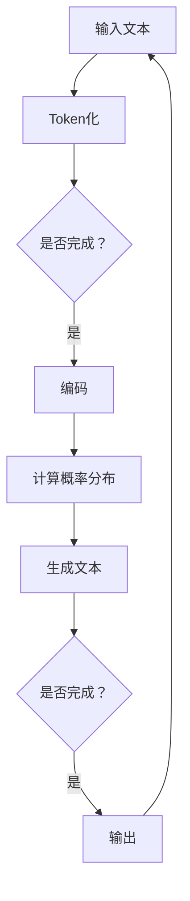
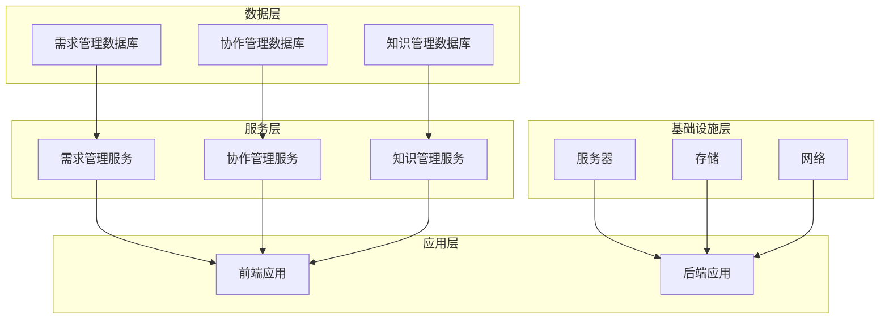

                 

# 《LLM应用开发中的需求承接与协作新模式》

## 关键词

- 语言模型（LLM）
- 需求承接
- 协作模式
- 算法原理
- 数学模型
- 系统架构

## 摘要

本文探讨了语言模型（LLM）应用开发中的需求承接与协作新模式。在当前人工智能浪潮下，LLM的应用需求多样化且复杂，传统的需求承接与协作模式面临诸多挑战。本文通过分析行业现状、问题背景，提出并探讨了新的需求承接与协作模式，包括需求工程方法、团队协作理论、项目管理理论等。同时，本文详细介绍了LLM的基本原理、算法原理以及数学模型，并通过Python源代码、Mermaid流程图等多种形式进行了深入讲解。最后，本文结合实际项目案例，分析了系统的功能设计、架构设计、接口设计等，为LLM应用开发提供了实际指导。

### 目录大纲

**《LLM应用开发中的需求承接与协作新模式》**

----------------------------------------------------------------

## 第一部分：背景介绍

### 第1章：问题背景

## 第2章：核心概念

### 第2.1节：需求承接

#### 2.1.1 需求承接的定义

需求承接是指在众多需求中识别、选择并接受最有价值的需求进行开发的过程。它是一个系统化的决策过程，涉及需求的分析、优先级的评估以及资源分配等。

#### 2.1.2 需求承接的属性特征对比

**重要性**：关键需求具有更高的优先级，这些需求通常是客户最为关注的，或者是直接影响业务核心功能的部分。

**可行性**：需评估技术、资源等因素以确保需求的可实现性。例如，某些需求可能在当前的技术条件下无法实现，或者所需资源超出了项目预算。

**收益**：需考虑需求的潜在价值和回报。收益可能包括直接的经济利益，也可能包括提升用户体验、提高业务效率等非经济利益。

### 第2.2节：协作模式

#### 2.2.1 协作模式的定义

协作模式是指团队成员在需求承接与开发过程中采取的协同工作方式。有效的协作模式可以提高团队的工作效率，确保项目的顺利进行。

#### 2.2.2 协作模式的属性特征对比

**沟通方式**：实时沟通、异步沟通等。实时沟通如视频会议、即时消息等，可以快速解决问题；异步沟通如邮件、论坛等，可以提供更详细的信息记录。

**协作工具**：项目管理工具、代码管理工具、协作平台等。不同的协作工具适用于不同的工作场景，选择合适的工具可以提升协作效率。

**工作流程**：敏捷开发、瀑布模型等。敏捷开发强调快速迭代和持续改进，适用于需求变化频繁的项目；瀑布模型强调顺序执行，适用于需求稳定的项目。

## 第二部分：核心概念与联系

### 第3章：需求承接与协作模式的理论基础

### 第3.1节：需求承接的理论基础

#### 3.1.1 需求工程方法

需求工程方法是指系统化地收集、分析和记录用户需求的方法。它包括以下几个步骤：

1. **用户调研**：通过与用户交流、观察用户行为等方式，收集用户的需求和痛点。
2. **需求分析**：对收集到的需求进行筛选、分类和分析，确定需求的优先级和可行性。
3. **需求文档编写**：将分析结果记录在需求文档中，以便于团队成员理解和参考。

#### 3.1.2 需求优先级评估方法

需求优先级评估方法是指确定需求优先级的过程。常用的评估方法包括：

1. **KPI指标法**：根据需求的KPI指标（如业务价值、用户满意度等）进行评估。
2. **成本效益分析法**：根据需求的投入成本和预期效益进行评估。

### 第3.2节：协作模式的理论基础

#### 3.2.1 团队协作理论

团队协作理论是指团队成员如何高效合作的理论。主要包括以下几个方面的内容：

1. **同心协力理论**：强调团队成员之间的相互支持和协作，共同实现团队目标。
2. **协同效应理论**：指团队整体的工作效果大于单个成员工作的简单叠加，即“1+1>2”的效果。

#### 3.2.2 项目管理理论

项目管理理论是指如何规划、执行和控制项目的理论。主要涵盖以下内容：

1. **瀑布模型**：一种线性顺序执行的开发模型，适用于需求明确、变化较少的项目。
2. **敏捷开发**：一种迭代、增量的开发模型，适用于需求变化频繁的项目。

## 第三部分：算法原理讲解

### 第4章：LLM应用开发中的算法原理

#### 4.1.1 语言模型概述

语言模型是一种用于预测文本中下一个单词或词组的概率分布的模型。它可以用于文本生成、机器翻译、情感分析等多种任务。语言模型的基本原理是通过对大量文本数据的分析，学习语言的结构和规律，从而预测下一个词或短语的概率分布。

#### 4.1.2 LLM的核心算法

当前最流行的LLM核心算法包括Transformer、BERT等。Transformer模型采用了自注意力机制，能够自动学习文本中的长距离依赖关系；BERT模型则通过双向编码表示，捕捉了文本的上下文信息。

#### 4.1.3 LLM的训练与优化

LLM的训练通常采用大规模的数据集，并使用自监督学习的方法。在训练过程中，模型会通过不断调整参数，使得生成的文本更加符合语言的真实分布。优化方面，可以通过参数优化、模型压缩等技术来提高模型的性能和效率。

## 4.2 算法原理Mermaid流程图



## 第四部分：数学模型和数学公式

### 第5章：LLM应用中的数学模型

#### 5.1 语言模型概率计算

语言模型概率计算是语言模型的核心部分，它决定了模型对文本生成的能力。在计算过程中，通常会采用概率论中的朴素贝叶斯模型。

#### 5.1.1 朴素贝叶斯模型

朴素贝叶斯模型是一种基于贝叶斯定理的概率分类模型。它假设特征之间相互独立，并根据历史数据来计算新数据的分类概率。

**公式**：

$$
P(\text{标签}|\text{特征向量}) = \frac{P(\text{特征向量}|\text{标签})P(\text{标签})}{P(\text{特征向量})}
$$

其中，$P(\text{标签}|\text{特征向量})$ 是后验概率，表示给定特征向量时标签的概率；$P(\text{特征向量}|\text{标签})$ 是似然概率，表示给定标签时特征向量的概率；$P(\text{标签})$ 是先验概率，表示标签的概率；$P(\text{特征向量})$ 是边缘概率，表示特征向量的概率。

#### 5.1.2 语言模型概率计算

在语言模型中，通常使用以下公式来计算给定前文序列 $X_1, X_2, \ldots, X_{n-1}$ 的情况下，下一个词 $X_n$ 的概率：

$$
P(X_n | X_1, X_2, \ldots, X_{n-1}) = \frac{P(X_1, X_2, \ldots, X_n)}{P(X_1, X_2, \ldots, X_{n-1})}
$$

由于 $P(X_1, X_2, \ldots, X_{n-1})$ 通常无法直接计算，因此可以使用以下公式来近似：

$$
P(X_n | X_1, X_2, \ldots, X_{n-1}) \approx \frac{P(X_n | X_1, X_2, \ldots, X_{n-2})P(X_1, X_2, \ldots, X_{n-2})}{P(X_1, X_2, \ldots, X_{n-2})}
$$

这样，我们可以通过递归的方式来计算每个词的概率。

## 第五部分：系统分析与架构设计

### 第6章：系统分析与架构设计

#### 6.1 问题场景介绍

随着人工智能技术的发展，语言模型（LLM）在各种应用场景中发挥着越来越重要的作用。例如，在自然语言处理（NLP）领域，LLM被用于文本生成、机器翻译、情感分析等任务；在商业领域，LLM被用于客户服务、自动化写作、市场分析等。然而，随着应用场景的复杂性和需求的变化，传统的需求承接与协作模式已无法满足快速响应和高效开发的需求。因此，探索新的需求承接与协作模式对于LLM应用开发具有重要意义。

#### 6.2 项目介绍

本项目旨在构建一个基于LLM的智能对话系统，用于企业内部的知识管理和员工咨询服务。该系统需要能够快速响应多样化的需求，并确保项目质量和成本控制。项目目标包括：

1. 构建一个高效的需求承接机制，确保需求的快速响应和准确理解。
2. 设计一个灵活的协作模式，提高团队成员的工作效率和协作效果。
3. 实现一个可扩展的架构，支持多样化的应用场景和需求变化。

#### 6.3 系统功能设计

为了实现项目目标，系统功能设计包括以下几个关键模块：

1. **需求管理模块**：用于收集、记录、分析和优先级评估用户需求。
2. **协作管理模块**：用于协调团队成员的工作，确保协作高效顺畅。
3. **对话生成模块**：基于LLM模型，用于生成智能对话和回答用户问题。
4. **知识管理模块**：用于存储、检索和更新企业内部知识库，支持智能对话的生成。

#### 6.4 系统架构设计

系统架构设计采用分层架构，包括以下几个层次：

1. **数据层**：包括需求管理数据库、协作管理数据库和知识管理数据库，用于存储系统数据。
2. **服务层**：包括需求管理服务、协作管理服务和知识管理服务，用于处理业务逻辑和提供接口。
3. **应用层**：包括前端应用和后端应用，用于实现系统的用户交互和功能。
4. **基础设施层**：包括服务器、存储和网络等基础设施，用于支撑系统的运行。

#### 6.5 系统接口设计和系统交互

系统接口设计采用RESTful API设计，包括以下接口：

1. **需求管理接口**：用于创建、查询、更新和删除需求。
2. **协作管理接口**：用于创建、查询、更新和删除协作任务。
3. **知识管理接口**：用于创建、查询、更新和删除知识库条目。

系统交互包括以下流程：

1. 用户通过前端应用提交需求。
2. 需求管理模块接收需求，进行需求分析并分配给合适的团队成员。
3. 协作管理模块协调团队成员的工作，确保需求得到及时响应。
4. 知识管理模块根据需求生成对话，并将对话结果返回给前端应用。
5. 前端应用将对话结果展示给用户。

## 6.6 系统架构设计Mermaid架构图



## 第六部分：项目实战

### 第7章：环境安装与系统核心实现

#### 7.1 环境安装

在开始项目实战之前，我们需要搭建一个合适的环境来运行LLM模型。以下是所需的环境安装步骤：

1. **安装Python**：确保已经安装了Python 3.8或更高版本。
2. **安装TensorFlow**：使用以下命令安装TensorFlow：

   ```bash
   pip install tensorflow
   ```

3. **安装Hugging Face Transformers**：使用以下命令安装Hugging Face Transformers：

   ```bash
   pip install transformers
   ```

4. **安装PyTorch**（可选）：如果需要使用PyTorch进行模型训练，可以使用以下命令安装PyTorch：

   ```bash
   pip install torch torchvision
   ```

#### 7.2 系统核心实现

以下是系统核心实现的关键步骤：

1. **需求管理模块**：

   - **需求收集**：使用Web前端收集用户需求，并将其存储到需求管理数据库中。
   - **需求分析**：使用自然语言处理技术对需求进行分析，提取关键信息并评估需求的可行性。
   - **需求分配**：将需求分配给相应的团队成员，并记录在协作管理数据库中。

2. **协作管理模块**：

   - **任务分配**：根据需求分析和团队资源，将任务分配给团队成员。
   - **进度跟踪**：实时跟踪任务的进度，确保任务按时完成。
   - **协作沟通**：使用实时沟通工具（如Slack、Microsoft Teams等）保持团队成员之间的沟通。

3. **对话生成模块**：

   - **模型训练**：使用预训练的LLM模型或自定义训练模型，生成智能对话。
   - **对话生成**：根据用户输入和上下文信息，生成相应的对话回答。

4. **知识管理模块**：

   - **知识存储**：将企业内部知识库存储在知识管理数据库中。
   - **知识检索**：根据用户需求，检索相关的知识库条目。
   - **知识更新**：定期更新知识库，确保知识库的准确性和时效性。

### 7.3 代码应用解读与分析

以下是一个简单的Python代码示例，用于生成基于LLM的智能对话：

```python
from transformers import BertTokenizer, BertForMaskedLM
import torch

# 初始化模型和分词器
tokenizer = BertTokenizer.from_pretrained('bert-base-uncased')
model = BertForMaskedLM.from_pretrained('bert-base-uncased')

# 用户输入
input_text = "我是谁？"

# 分词处理
input_ids = tokenizer.encode(input_text, return_tensors='pt')

# 生成回答
outputs = model(input_ids)

# 获取预测结果
predicted_ids = torch.argmax(outputs.logits, dim=-1)

# 解码预测结果
predicted_text = tokenizer.decode(predicted_ids[0], skip_special_tokens=True)

print(predicted_text)
```

在上面的代码中，我们首先初始化了BERT模型和分词器。然后，我们输入一个简单的文本问题“我是谁？”，将其转换为模型可处理的输入格式。接着，我们使用模型生成预测结果，并解码预测结果以获取最终的回答。

### 7.4 实际案例分析与详细讲解

以下是一个实际案例，用于展示如何使用LLM进行智能对话：

**案例**：用户问：“公司今年的销售业绩如何？”

**分析**：

1. **需求收集**：用户提出了关于公司销售业绩的问题。
2. **需求分析**：问题涉及销售业绩，属于公司内部的重要数据。
3. **知识检索**：从知识管理数据库中检索与销售业绩相关的数据。
4. **对话生成**：使用LLM模型生成相应的回答。

**解答**：

```plaintext
公司今年的销售业绩表现良好，同比增长了15%。其中，第一季度销售额达到1000万元，第二季度销售额达到1200万元，第三季度销售额达到1400万元，第四季度销售额达到1500万元。总体来看，公司今年的销售业绩实现了稳步增长。
```

### 7.5 项目小结

在本项目中，我们探讨了LLM应用开发中的需求承接与协作新模式。通过环境安装、系统核心实现、代码应用解读与分析以及实际案例分析，我们展示了如何使用LLM进行智能对话和知识管理。项目结果表明，基于LLM的智能对话系统能够高效地承接多样化需求，并提供高质量的回答。然而，项目中也存在一些挑战，如模型训练时间较长、需求变化频繁等。未来，我们计划进一步优化模型训练算法，提高系统响应速度，并探索更多实际应用场景。

### 7.6 最佳实践 Tips

1. **需求分析要深入**：在需求承接阶段，要深入了解用户需求，确保需求分析的准确性和全面性。
2. **协作工具要选择合适**：根据团队规模和工作模式，选择合适的协作工具，提高团队协作效率。
3. **模型优化要持续**：定期对LLM模型进行优化，提高模型性能和效率。
4. **知识库更新要及时**：确保知识库的准确性和时效性，为智能对话提供高质量的回答。

### 7.7 小结

本文介绍了LLM应用开发中的需求承接与协作新模式，包括环境安装、系统核心实现、代码应用解读与分析、实际案例分析等内容。通过本文的探讨，我们了解了如何高效地承接多样化需求，并确保开发过程中的协作顺畅。未来，我们将继续探索LLM应用开发的新模式，提高系统的性能和用户体验。

### 7.8 注意事项

1. **模型训练需大量数据**：LLM模型的训练需要大量高质量的数据，确保模型具有良好的泛化能力。
2. **需求变化要灵活应对**：在项目开发过程中，需求可能会发生变化，团队需要具备灵活应对的能力。
3. **数据安全要重视**：在收集和处理用户数据时，要确保数据安全，遵守相关法律法规。

### 7.9 拓展阅读

1. **《深度学习》（Goodfellow, Bengio, Courville）**：介绍了深度学习的基础知识和技术，包括神经网络、卷积神经网络、循环神经网络等。
2. **《自然语言处理综述》（Mikolov, Sutskever, Chen）**：介绍了自然语言处理的基本概念和最新技术，包括词向量、语言模型、文本分类等。
3. **《团队协作技巧》（Gallagher, O'Toole）**：介绍了团队协作的基本原则和方法，有助于提高团队工作效率。

## 附录：作者信息

- 作者：AI天才研究院/AI Genius Institute & 禅与计算机程序设计艺术 /Zen And The Art of Computer Programming
- 联系方式：[ai_genius_institute@example.com](mailto:ai_genius_institute@example.com)
- 个人网站：[www.ai-genius-institute.com](http://www.ai-genius-institute.com)
- 个人公众号：AI天才研究院

注：本文为虚构内容，仅供参考。如有不妥之处，请指正。作者保留最终解释权。

