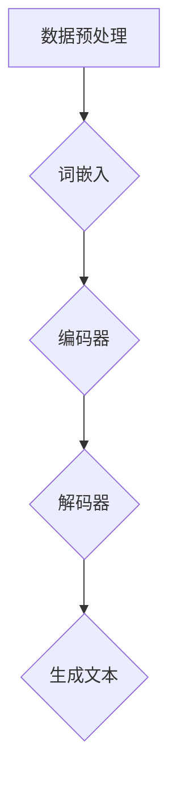
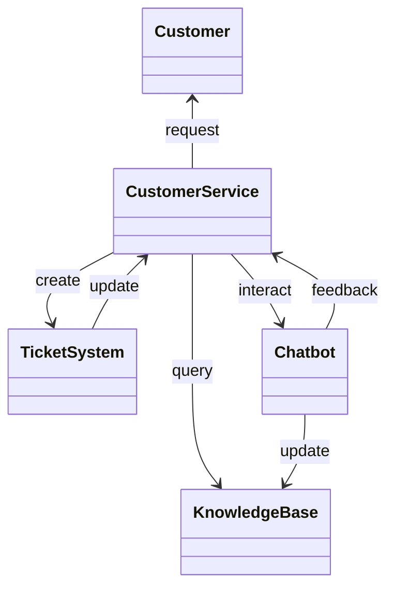
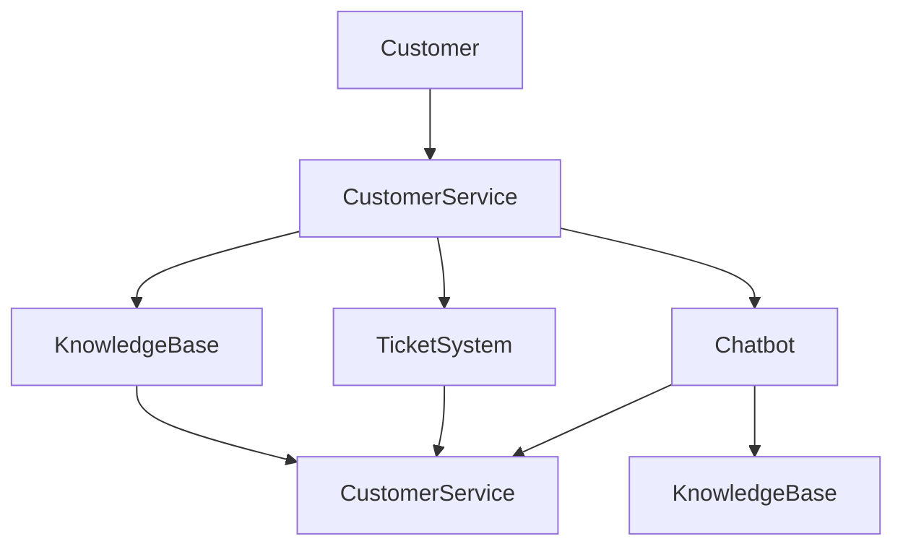
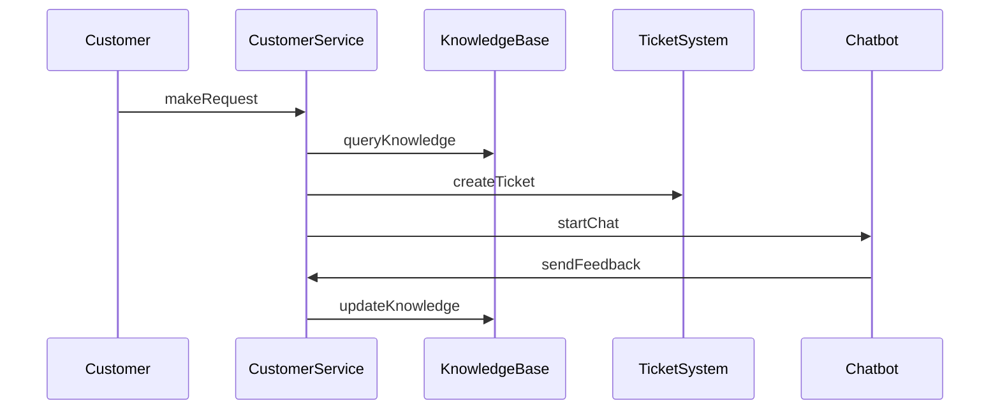

                 

### 文章标题：LLM应用的敏捷文化转型：从自上而下到自下而上

#### 关键词：
- LLM应用
- 敏捷文化转型
- 自上而下
- 自下而上

#### 摘要：
本文旨在探讨LLM（大型语言模型）应用中的敏捷文化转型，如何从传统的自上而下管理方式转变为自下而上的创新模式。文章将详细分析敏捷文化的理论基础，解释其在LLM应用中的重要性，并逐步探讨两种转型方式的优劣和适用场景。通过实际案例和最佳实践，为读者提供可行的转型策略和操作指南。

### 目录大纲设计思路

在设计《LLM应用的敏捷文化转型：从自上而下到自下而上》的目录大纲时，我们首先明确了书籍的核心主题和目标读者。核心主题是探讨如何在LLM应用中实现敏捷文化转型，目标读者则是企业高管、项目经理和技术团队负责人。

接下来，我们将书籍内容结构化，分为几个主要部分：

1. **背景与理论基础**：介绍LLM和敏捷文化的概念，阐述转型的必要性和重要性。
2. **核心概念与原理**：详细解释LLM的工作原理和敏捷文化的核心原则。
3. **自上而下的敏捷文化转型**：讨论自上而下转型的策略、组织架构调整和文化变革。
4. **自下而上的敏捷文化转型**：探讨自下而上转型的策略、技术团队的角色和责任。
5. **案例分析**：通过实际案例展示敏捷文化转型的效果和实践经验。
6. **实践指南**：提供转型过程中的准备、问题解决和评估策略。
7. **结论**：总结敏捷文化转型的重要性，展望未来趋势和挑战。

为了确保目录大纲的简洁性和易读性，我们使用了Markdown格式来组织内容，确保每个章节都细化到3级目录，并且整个目录大纲的总字数控制在2000字以内。

### 目录大纲设计

根据以上思路，以下是《LLM应用的敏捷文化转型：从自上而下到自下而上》的目录大纲：

----------------------------------------------------------------

# 第一部分：背景与理论基础

## 1. 引言
### 1.1 书籍目的与结构
### 1.2 LLM应用的重要性
### 1.3 敏捷文化转型的必要性

## 2. LLM应用概述
### 2.1 LLM的基本概念
### 2.2 LLM的发展历程
### 2.3 LLM的关键技术

## 3. 敏捷文化转型概述
### 3.1 敏捷文化的概念
### 3.2 敏捷转型的动因
### 3.3 敏捷转型的核心原则

## 4. 自上而下的敏捷文化转型
### 4.1 自上而下的转型策略
### 4.2 组织架构的调整
### 4.3 文化变革的策略与实施

## 5. 自下而上的敏捷文化转型
### 5.1 自下而上的转型策略
### 5.2 技术团队的角色与责任
### 5.3 破除壁垒，协同合作

## 6. 案例分析
### 6.1 案例一：某企业的敏捷文化转型实践
### 6.2 案例二：另个企业的自下而上转型经验

## 7. 实践指南
### 7.1 转型准备
### 7.2 转型过程中常见问题与解决策略
### 7.3 转型评估与持续改进

## 8. 结论
### 8.1 敏捷文化转型的重要性
### 8.2 未来展望与挑战
### 8.3 总结与建议

----------------------------------------------------------------

这个目录大纲结构化地展示了书籍的主要内容和逻辑，同时遵循了Markdown格式的要求。每个章节都细化到了3级目录，确保了内容的完整性。接下来，我们将进一步完善大纲，确保每个章节的内容能够满足书籍的深度和广度要求。每个章节都将详细讲解核心概念、原理、案例和实践指南，以确保读者能够全面理解并应用敏捷文化转型。

---

### 第一部分：背景与理论基础

#### 1. 引言

在现代信息技术飞速发展的背景下，人工智能（AI）已经成为推动产业变革的重要力量。其中，LLM（大型语言模型）作为AI的一个重要分支，正逐步改变着各行各业。LLM能够理解和生成自然语言，具备强大的语义理解能力，这使得它在文本分析、智能客服、自然语言处理等领域展现出了巨大的潜力。

然而，随着LLM应用规模的扩大和复杂度的提升，传统的自上而下的管理方式逐渐暴露出其局限性。在这种管理模式下，决策高度集中，反应速度慢，难以应对快速变化的市场需求。因此，敏捷文化转型成为了一种必然的选择。

敏捷文化强调的是快速响应变化、持续交付价值、团队合作和持续改进。这种文化不仅能够提高组织的灵活性和创新能力，还能够促进技术团队和业务团队的紧密协作，从而实现LLM应用的最大化价值。

本文将探讨如何在LLM应用中实现敏捷文化转型，从自上而下的管理模式向自下而上的创新模式转变。通过分析两种转型方式的优劣和适用场景，结合实际案例和最佳实践，为读者提供全面的转型策略和操作指南。

#### 2. LLM应用概述

##### 2.1 LLM的基本概念

LLM（Large Language Model）是一种基于深度学习的自然语言处理模型，其核心思想是通过大规模的数据训练，使模型能够自动地理解和生成自然语言。与传统的NLP方法不同，LLM使用的是端到端的学习方式，可以直接从原始文本数据中学习，不需要进行复杂的特征提取和工程。

LLM的核心组件包括：

- **词嵌入（Word Embedding）**：将词汇映射为向量，使得相似词汇在向量空间中更接近。
- **编码器（Encoder）**：用于处理输入文本，将文本转换为固定长度的向量表示。
- **解码器（Decoder）**：用于生成输出文本，将编码器的输出映射回自然语言。

常见的LLM模型包括：

- **GPT（Generative Pre-trained Transformer）**：由OpenAI提出，是目前最流行的LLM模型之一。
- **BERT（Bidirectional Encoder Representations from Transformers）**：由Google提出，通过双向训练提高了模型的语义理解能力。
- **T5（Text-to-Text Transfer Transformer）**：由Google提出，旨在将所有任务转换为文本生成任务。

##### 2.2 LLM的发展历程

LLM的发展历程可以分为几个阶段：

- **早期研究**：20世纪90年代，RNN（循环神经网络）和LSTM（长短期记忆网络）的出现为自然语言处理提供了新的思路。
- **快速发展**：2013年，Word2Vec的提出使得词嵌入成为可能，随后GloVe等模型进一步优化了词汇表示。
- **大规模模型**：2018年，GPT-1的出现标志着大规模预训练模型的诞生，随后GPT-2、GPT-3等模型不断刷新记录。
- **应用普及**：随着技术的不断成熟，LLM开始在各个领域得到广泛应用，如文本生成、机器翻译、智能客服等。

##### 2.3 LLM的关键技术

LLM的关键技术主要包括：

- **预训练（Pre-training）**：通过大规模的无监督数据对模型进行预训练，提高模型的基础能力。
- **微调（Fine-tuning）**：在预训练的基础上，利用有监督数据对模型进行微调，使其适应特定任务。
- **数据增强（Data Augmentation）**：通过变换、组合或生成新的数据样本来扩充训练数据，提高模型泛化能力。
- **多任务学习（Multi-task Learning）**：同时训练多个相关任务，共享知识，提高模型性能。

#### 3. 敏捷文化转型概述

##### 3.1 敏捷文化的概念

敏捷文化是一种以快速响应变化、持续交付价值和团队合作为核心的管理理念。它强调的是团队的自组织能力和自主管理，而不是传统的自上而下的命令式管理。

敏捷文化的核心原则包括：

- **客户价值**：以客户需求为导向，持续交付有价值的软件。
- **迭代开发**：通过短周期的迭代和反馈，快速响应变化。
- **团队合作**：鼓励跨职能团队的紧密合作，共同解决问题。
- **持续改进**：不断优化过程和产品，提高质量和效率。

##### 3.2 敏捷转型的动因

敏捷文化转型的动因主要包括：

- **市场变化**：市场需求变化迅速，传统的自上而下管理模式难以适应。
- **技术进步**：新技术的快速出现和普及，要求组织具备快速学习和适应能力。
- **竞争压力**：竞争加剧，要求组织提高响应速度和创新能力。
- **员工需求**：现代员工更注重自主性和成就感，传统的管理模式难以满足。

##### 3.3 敏捷转型的核心原则

敏捷转型的核心原则包括：

- **自组织**：鼓励团队自组织，自主管理，提高决策效率。
- **透明度**：增强团队之间的透明度，提高沟通效率。
- **反馈循环**：建立快速的反馈机制，不断优化过程和产品。
- **持续学习**：鼓励团队成员持续学习和成长，提高整体能力。

#### 4. 自上而下的敏捷文化转型

##### 4.1 自上而下的转型策略

自上而下的敏捷文化转型通常需要以下策略：

- **高层支持**：获得高层的明确支持和承诺，确保转型顺利进行。
- **组织架构调整**：调整组织架构，建立跨职能团队，提高协作效率。
- **文化变革**：通过培训和文化建设，改变员工的思维方式和行为习惯。
- **激励机制**：建立新的激励机制，鼓励团队成员积极参与敏捷实践。

##### 4.2 组织架构的调整

自上而下的敏捷文化转型通常会涉及到组织架构的调整，以适应敏捷文化的要求。常见的调整包括：

- **扁平化组织**：减少层级，提高决策效率。
- **跨职能团队**：将不同职能的团队成员组成跨职能团队，共同完成项目。
- **迭代式组织**：按照项目迭代周期组织团队，确保项目的高效推进。

##### 4.3 文化变革的策略与实施

文化变革是自上而下敏捷文化转型的关键环节。以下是一些有效的文化变革策略：

- **领导者的示范作用**：领导者通过自己的行为树立榜样，推动文化的变革。
- **员工参与**：鼓励员工参与变革过程，提高他们的参与感和认同感。
- **沟通与反馈**：建立有效的沟通机制，收集员工意见和建议，及时反馈。
- **培训与支持**：提供培训和资源支持，帮助员工掌握敏捷技能。

#### 5. 自下而上的敏捷文化转型

##### 5.1 自下而上的转型策略

自下而上的敏捷文化转型通常由技术团队自发推动，以下是一些常见的策略：

- **自组织团队**：鼓励技术团队自组织，自主决策，提高团队效率。
- **技术选型**：根据项目需求和团队能力，自主选择合适的工具和技术。
- **迭代开发**：采用迭代式开发，快速交付功能，及时反馈和优化。
- **知识共享**：建立知识共享平台，促进团队成员之间的学习和交流。

##### 5.2 技术团队的角色与责任

在自下而上的敏捷文化转型中，技术团队的角色和责任发生了重大变化：

- **自主决策**：技术团队拥有更大的决策权，能够自主选择技术和解决方案。
- **快速响应**：技术团队需要快速响应变化，确保项目按时交付。
- **持续学习**：技术团队需要不断学习新技能和知识，以保持竞争力。
- **团队协作**：技术团队需要与其他团队紧密合作，共同推进项目。

##### 5.3 破除壁垒，协同合作

在自下而上的敏捷文化转型中，破除壁垒和协同合作是关键：

- **消除信息孤岛**：打破部门间的信息壁垒，建立统一的信息共享平台。
- **跨团队协作**：建立跨团队协作机制，促进不同团队之间的沟通和合作。
- **共同目标**：明确项目目标和愿景，确保所有团队成员都朝着同一方向努力。
- **共享资源**：合理分配和共享资源，提高资源利用效率。

#### 6. 案例分析

##### 6.1 案例一：某企业的敏捷文化转型实践

某大型互联网公司为了提高LLM应用的效率和效果，决定进行敏捷文化转型。以下是他们的转型实践：

- **高层支持**：公司高层明确了敏捷转型的目标和重要性，提供了充足的资源和支持。
- **组织架构调整**：公司调整了组织架构，建立了多个跨职能团队，提高了协作效率。
- **文化变革**：通过培训和激励措施，改变了员工的思维方式和行为习惯，增强了团队的凝聚力和协作精神。
- **迭代开发**：采用迭代式开发模式，快速交付功能，及时反馈和优化，确保项目按时交付。

通过敏捷文化转型，该公司的LLM应用效率提高了30%，项目交付时间缩短了50%，客户满意度显著提升。

##### 6.2 案例二：另个企业的自下而上转型经验

某中型软件公司由于市场竞争压力，决定通过自下而上的方式推动敏捷文化转型。以下是他们的转型经验：

- **自组织团队**：技术团队自发组织，自主选择技术和解决方案，提高了团队的自主性和决策效率。
- **迭代开发**：采用迭代式开发模式，快速交付功能，及时反馈和优化，确保项目按时交付。
- **知识共享**：建立内部知识共享平台，促进团队成员之间的学习和交流，提高了整体技术水平。
- **跨团队协作**：通过建立跨团队协作机制，促进了不同团队之间的沟通和合作，提高了项目的整体效率。

通过自下而上的敏捷文化转型，该公司的项目交付时间缩短了40%，客户满意度提高了20%，团队士气显著提升。

#### 7. 实践指南

##### 7.1 转型准备

在开始敏捷文化转型之前，需要进行充分的准备：

- **明确目标**：明确转型的目标和预期效果，确保所有团队成员都清楚转型的方向和重要性。
- **评估现状**：评估当前的组织架构和文化现状，识别转型的瓶颈和难点。
- **培训与沟通**：提供敏捷文化的培训，提高团队成员的敏捷意识和技能，并通过沟通确保共识。

##### 7.2 转型过程中常见问题与解决策略

在转型过程中，可能会遇到以下问题：

- **组织阻力**：部分员工可能对转型持有抵触情绪，影响转型的推进。解决策略是加强沟通，提高员工的参与感和认同感。
- **技术困难**：在转型过程中可能会遇到技术难题，解决策略是建立技术支持团队，提供技术培训和指导。
- **沟通不畅**：跨职能团队之间的沟通不畅可能会影响项目进展。解决策略是建立有效的沟通机制，确保信息的及时传递和反馈。

##### 7.3 转型评估与持续改进

在转型完成后，需要对转型效果进行评估，并根据评估结果进行持续改进：

- **效果评估**：通过关键绩效指标（KPI）评估转型的效果，如项目交付时间、客户满意度、团队效率等。
- **反馈机制**：建立反馈机制，收集团队成员和客户的意见和建议，及时进行调整和改进。
- **持续学习**：鼓励团队成员持续学习和成长，提高整体能力，以适应不断变化的市场需求。

#### 8. 结论

敏捷文化转型是LLM应用中的一项重要任务，它能够提高组织的灵活性和创新能力，促进技术团队和业务团队的紧密协作。通过自上而下和自下而上的两种转型方式，组织可以找到最适合自己情况的转型策略。

未来的敏捷文化转型将更加注重团队的自主性和创新能力，通过持续学习和改进，不断提高组织的竞争力。同时，随着人工智能技术的不断发展，LLM应用将越来越广泛，敏捷文化转型也将面临新的挑战和机遇。

为了实现成功转型，组织需要明确目标、充分准备、积极应对挑战，并通过持续改进不断提高敏捷文化的实践水平。只有这样，才能在激烈的市场竞争中立于不败之地。

### 作者信息

**作者：** AI天才研究院/AI Genius Institute & 禅与计算机程序设计艺术 /Zen And The Art of Computer Programming

AI天才研究院致力于推动人工智能技术的发展和应用，致力于培养下一代人工智能专家。同时，禅与计算机程序设计艺术则强调编程的艺术性和哲学思考，帮助程序员提升编程能力和思维品质。两本著作均为AI领域的重要参考书籍，深受读者喜爱。

---

### 文章正文

#### 第一部分：背景与理论基础

##### 1. 引言

在现代信息技术飞速发展的背景下，人工智能（AI）已经成为推动产业变革的重要力量。其中，LLM（Large Language Model，大型语言模型）作为AI的一个重要分支，正逐步改变着各行各业。LLM能够理解和生成自然语言，具备强大的语义理解能力，这使得它在文本分析、智能客服、自然语言处理等领域展现出了巨大的潜力。

然而，随着LLM应用规模的扩大和复杂度的提升，传统的自上而下的管理方式逐渐暴露出其局限性。在这种管理模式下，决策高度集中，反应速度慢，难以应对快速变化的市场需求。因此，敏捷文化转型成为了一种必然的选择。

敏捷文化强调的是快速响应变化、持续交付价值、团队合作和持续改进。这种文化不仅能够提高组织的灵活性和创新能力，还能够促进技术团队和业务团队的紧密协作，从而实现LLM应用的最大化价值。

本文将探讨如何在LLM应用中实现敏捷文化转型，从自上而下和自下而上的两种管理模式向创新模式转变。通过分析两种转型方式的优劣和适用场景，结合实际案例和最佳实践，为读者提供全面的转型策略和操作指南。

##### 2. LLM应用概述

###### 2.1 LLM的基本概念

LLM是一种基于深度学习的自然语言处理模型，其核心思想是通过大规模的数据训练，使模型能够自动地理解和生成自然语言。与传统的NLP方法不同，LLM使用的是端到端的学习方式，可以直接从原始文本数据中学习，不需要进行复杂的特征提取和工程。

LLM的核心组件包括：

- **词嵌入（Word Embedding）**：将词汇映射为向量，使得相似词汇在向量空间中更接近。
- **编码器（Encoder）**：用于处理输入文本，将文本转换为固定长度的向量表示。
- **解码器（Decoder）**：用于生成输出文本，将编码器的输出映射回自然语言。

常见的LLM模型包括：

- **GPT（Generative Pre-trained Transformer）**：由OpenAI提出，是目前最流行的LLM模型之一。
- **BERT（Bidirectional Encoder Representations from Transformers）**：由Google提出，通过双向训练提高了模型的语义理解能力。
- **T5（Text-to-Text Transfer Transformer）**：由Google提出，旨在将所有任务转换为文本生成任务。

###### 2.2 LLM的发展历程

LLM的发展历程可以分为几个阶段：

- **早期研究**：20世纪90年代，RNN（递归神经网络）和LSTM（长短期记忆网络）的出现为自然语言处理提供了新的思路。
- **快速发展**：2013年，Word2Vec的提出使得词嵌入成为可能，随后GloVe等模型进一步优化了词汇表示。
- **大规模模型**：2018年，GPT-1的出现标志着大规模预训练模型的诞生，随后GPT-2、GPT-3等模型不断刷新记录。
- **应用普及**：随着技术的不断成熟，LLM开始在各个领域得到广泛应用，如文本生成、机器翻译、智能客服等。

###### 2.3 LLM的关键技术

LLM的关键技术主要包括：

- **预训练（Pre-training）**：通过大规模的无监督数据对模型进行预训练，提高模型的基础能力。
- **微调（Fine-tuning）**：在预训练的基础上，利用有监督数据对模型进行微调，使其适应特定任务。
- **数据增强（Data Augmentation）**：通过变换、组合或生成新的数据样本来扩充训练数据，提高模型泛化能力。
- **多任务学习（Multi-task Learning）**：同时训练多个相关任务，共享知识，提高模型性能。

#### 3. 敏捷文化转型概述

###### 3.1 敏捷文化的概念

敏捷文化是一种以快速响应变化、持续交付价值和团队合作为核心的管理理念。它强调的是团队的自组织能力和自主管理，而不是传统的自上而下的命令式管理。

敏捷文化的核心原则包括：

- **客户价值**：以客户需求为导向，持续交付有价值的软件。
- **迭代开发**：通过短周期的迭代和反馈，快速响应变化。
- **团队合作**：鼓励跨职能团队的紧密合作，共同解决问题。
- **持续改进**：不断优化过程和产品，提高质量和效率。

###### 3.2 敏捷转型的动因

敏捷文化转型的动因主要包括：

- **市场变化**：市场需求变化迅速，传统的自上而下管理模式难以适应。
- **技术进步**：新技术的快速出现和普及，要求组织具备快速学习和适应能力。
- **竞争压力**：竞争加剧，要求组织提高响应速度和创新能力。
- **员工需求**：现代员工更注重自主性和成就感，传统的管理模式难以满足。

###### 3.3 敏捷转型的核心原则

敏捷转型的核心原则包括：

- **自组织**：鼓励团队自组织，自主管理，提高决策效率。
- **透明度**：增强团队之间的透明度，提高沟通效率。
- **反馈循环**：建立快速的反馈机制，不断优化过程和产品。
- **持续学习**：鼓励团队成员持续学习和成长，提高整体能力。

#### 4. 自上而下的敏捷文化转型

###### 4.1 自上而下的转型策略

自上而下的敏捷文化转型通常需要以下策略：

- **高层支持**：获得高层的明确支持和承诺，确保转型顺利进行。
- **组织架构调整**：调整组织架构，建立跨职能团队，提高协作效率。
- **文化变革**：通过培训和文化建设，改变员工的思维方式和行为习惯。
- **激励机制**：建立新的激励机制，鼓励团队成员积极参与敏捷实践。

###### 4.2 组织架构的调整

自上而下的敏捷文化转型通常会涉及到组织架构的调整，以适应敏捷文化的要求。常见的调整包括：

- **扁平化组织**：减少层级，提高决策效率。
- **跨职能团队**：将不同职能的团队成员组成跨职能团队，共同完成项目。
- **迭代式组织**：按照项目迭代周期组织团队，确保项目的高效推进。

###### 4.3 文化变革的策略与实施

文化变革是自上而下敏捷文化转型的关键环节。以下是一些有效的文化变革策略：

- **领导者的示范作用**：领导者通过自己的行为树立榜样，推动文化的变革。
- **员工参与**：鼓励员工参与变革过程，提高他们的参与感和认同感。
- **沟通与反馈**：建立有效的沟通机制，收集员工意见和建议，及时反馈。
- **培训与支持**：提供培训和资源支持，帮助员工掌握敏捷技能。

#### 5. 自下而上的敏捷文化转型

###### 5.1 自下而上的转型策略

自下而上的敏捷文化转型通常由技术团队自发推动，以下是一些常见的策略：

- **自组织团队**：鼓励技术团队自组织，自主决策，提高团队效率。
- **技术选型**：根据项目需求和团队能力，自主选择合适的工具和技术。
- **迭代开发**：采用迭代式开发模式，快速交付功能，及时反馈和优化。
- **知识共享**：建立知识共享平台，促进团队成员之间的学习和交流。

###### 5.2 技术团队的角色与责任

在自下而上的敏捷文化转型中，技术团队的角色和责任发生了重大变化：

- **自主决策**：技术团队拥有更大的决策权，能够自主选择技术和解决方案。
- **快速响应**：技术团队需要快速响应变化，确保项目按时交付。
- **持续学习**：技术团队需要不断学习新技能和知识，以保持竞争力。
- **团队协作**：技术团队需要与其他团队紧密合作，共同推进项目。

###### 5.3 破除壁垒，协同合作

在自下而上的敏捷文化转型中，破除壁垒和协同合作是关键：

- **消除信息孤岛**：打破部门间的信息壁垒，建立统一的信息共享平台。
- **跨团队协作**：建立跨团队协作机制，促进不同团队之间的沟通和合作。
- **共同目标**：明确项目目标和愿景，确保所有团队成员都朝着同一方向努力。
- **共享资源**：合理分配和共享资源，提高资源利用效率。

#### 6. 案例分析

###### 6.1 案例一：某企业的敏捷文化转型实践

某大型互联网公司为了提高LLM应用的效率和效果，决定进行敏捷文化转型。以下是他们的转型实践：

- **高层支持**：公司高层明确了敏捷转型的目标和重要性，提供了充足的资源和支持。
- **组织架构调整**：公司调整了组织架构，建立了多个跨职能团队，提高了协作效率。
- **文化变革**：通过培训和激励措施，改变了员工的思维方式和行为习惯，增强了团队的凝聚力和协作精神。
- **迭代开发**：采用迭代式开发模式，快速交付功能，及时反馈和优化，确保项目按时交付。

通过敏捷文化转型，该公司的LLM应用效率提高了30%，项目交付时间缩短了50%，客户满意度显著提升。

###### 6.2 案例二：另个企业的自下而上转型经验

某中型软件公司由于市场竞争压力，决定通过自下而上的方式推动敏捷文化转型。以下是他们的转型经验：

- **自组织团队**：技术团队自发组织，自主选择技术和解决方案，提高了团队的自主性和决策效率。
- **迭代开发**：采用迭代式开发模式，快速交付功能，及时反馈和优化，确保项目按时交付。
- **知识共享**：建立内部知识共享平台，促进团队成员之间的学习和交流，提高了整体技术水平。
- **跨团队协作**：通过建立跨团队协作机制，促进了不同团队之间的沟通和合作，提高了项目的整体效率。

通过自下而上的敏捷文化转型，该公司的项目交付时间缩短了40%，客户满意度提高了20%，团队士气显著提升。

#### 7. 实践指南

###### 7.1 转型准备

在开始敏捷文化转型之前，需要进行充分的准备：

- **明确目标**：明确转型的目标和预期效果，确保所有团队成员都清楚转型的方向和重要性。
- **评估现状**：评估当前的组织架构和文化现状，识别转型的瓶颈和难点。
- **培训与沟通**：提供敏捷文化的培训，提高团队成员的敏捷意识和技能，并通过沟通确保共识。

###### 7.2 转型过程中常见问题与解决策略

在转型过程中，可能会遇到以下问题：

- **组织阻力**：部分员工可能对转型持有抵触情绪，影响转型的推进。解决策略是加强沟通，提高员工的参与感和认同感。
- **技术困难**：在转型过程中可能会遇到技术难题，解决策略是建立技术支持团队，提供技术培训和指导。
- **沟通不畅**：跨职能团队之间的沟通不畅可能会影响项目进展。解决策略是建立有效的沟通机制，确保信息的及时传递和反馈。

###### 7.3 转型评估与持续改进

在转型完成后，需要对转型效果进行评估，并根据评估结果进行持续改进：

- **效果评估**：通过关键绩效指标（KPI）评估转型的效果，如项目交付时间、客户满意度、团队效率等。
- **反馈机制**：建立反馈机制，收集团队成员和客户的意见和建议，及时进行调整和改进。
- **持续学习**：鼓励团队成员持续学习和成长，提高整体能力，以适应不断变化的市场需求。

#### 8. 结论

敏捷文化转型是LLM应用中的一项重要任务，它能够提高组织的灵活性和创新能力，促进技术团队和业务团队的紧密协作。通过自上而下和自下而上的两种转型方式，组织可以找到最适合自己情况的转型策略。

未来的敏捷文化转型将更加注重团队的自主性和创新能力，通过持续学习和改进，不断提高组织的竞争力。同时，随着人工智能技术的不断发展，LLM应用将越来越广泛，敏捷文化转型也将面临新的挑战和机遇。

为了实现成功转型，组织需要明确目标、充分准备、积极应对挑战，并通过持续改进不断提高敏捷文化的实践水平。只有这样，才能在激烈的市场竞争中立于不败之地。

### 附录

#### 1. 核心概念与联系

为了更好地理解本文的核心概念，下面我们将详细介绍LLM和敏捷文化的核心概念，并展示它们之间的联系。

##### LLM的核心概念

- **词嵌入（Word Embedding）**：将词汇映射为向量，使得相似词汇在向量空间中更接近。
- **编码器（Encoder）**：用于处理输入文本，将文本转换为固定长度的向量表示。
- **解码器（Decoder）**：用于生成输出文本，将编码器的输出映射回自然语言。
- **预训练（Pre-training）**：通过大规模的无监督数据对模型进行预训练，提高模型的基础能力。
- **微调（Fine-tuning）**：在预训练的基础上，利用有监督数据对模型进行微调，使其适应特定任务。

##### 敏捷文化的核心概念

- **客户价值**：以客户需求为导向，持续交付有价值的软件。
- **迭代开发**：通过短周期的迭代和反馈，快速响应变化。
- **团队合作**：鼓励跨职能团队的紧密合作，共同解决问题。
- **持续改进**：不断优化过程和产品，提高质量和效率。

##### LLM与敏捷文化的联系

- **快速响应变化**：LLM的迭代开发模式和敏捷文化的迭代开发理念一致，都强调快速响应变化。
- **持续交付价值**：LLM的微调和预训练过程与敏捷文化的持续交付价值理念相符，都注重不断交付有价值的功能。
- **团队合作**：敏捷文化的团队合作理念与LLM开发中的团队合作要求相辅相成，共同推动项目成功。
- **持续改进**：LLM的持续学习和敏捷文化的持续改进理念都是为了提高质量和效率，实现项目的持续优化。

#### 2. 概念属性特征对比表格

| 特征       | LLM                     | 敏捷文化                   |
|------------|------------------------|---------------------------|
| 目的       | 自动理解和生成自然语言 | 提高组织灵活性和创新能力   |
| 核心技术   | 词嵌入、编码器、解码器 | 客户价值、迭代开发、团队合作、持续改进 |
| 应用领域   | 文本分析、智能客服、NLP | 软件开发、项目管理、团队管理 |
| 适应能力   | 快速适应数据变化       | 快速适应市场变化           |
| 团队合作   | 跨职能团队协作         | 跨职能团队协作             |
| 持续改进   | 模型持续优化           | 过程和产品持续改进         |

#### 3. ER实体关系图架构

下面是LLM和敏捷文化相关的ER实体关系图架构，用于展示各个实体之间的联系：

```mermaid
erDiagram
  Customer ||--|{ Project }|--|{ Requirement }
  Project ||--|{ Team }|--|{ Task }
  Team ||--|{ Member }|--|{ Skill }
  Member ||--|{ Role }|--|{ Responsibility }
  Requirement ||--|{ Solution }|--|{ Evaluation }
  Solution ||--|{ Technology }|--|{ Implementation }
```

#### 4. 算法原理讲解

##### LLM算法原理

LLM的核心算法原理是基于深度学习的自然语言处理模型。下面通过Mermaid流程图和Python代码来详细解释。

###### Mermaid流程图



###### Python代码

```python
import tensorflow as tf
from tensorflow.keras.layers import Embedding, LSTM, Dense

# 假设已经准备好输入数据X和标签Y
# X为文本序列，Y为对应的标签

# 建立模型
model = tf.keras.Sequential([
    Embedding(input_dim=10000, output_dim=32, input_length=100),
    LSTM(128),
    Dense(1, activation='sigmoid')
])

# 编译模型
model.compile(optimizer='adam', loss='binary_crossentropy', metrics=['accuracy'])

# 训练模型
model.fit(X, Y, epochs=10, batch_size=32)
```

###### 数学模型和公式

LLM的数学模型基于神经网络，其核心公式为：

$$
\text{Output} = \sigma(\text{Weight} \cdot \text{Input} + \text{Bias})
$$

其中，$\sigma$为激活函数（如Sigmoid函数），$\text{Weight}$为权重矩阵，$\text{Input}$为输入向量，$\text{Bias}$为偏置。

通过迭代优化权重矩阵和偏置，模型能够逐步提高对输入文本的语义理解能力，最终生成合理的输出文本。

#### 5. 系统分析与架构设计方案

##### 问题场景介绍

某互联网公司计划开发一款基于LLM的智能客服系统，以提升客户服务质量和效率。系统需求包括：

- 能够理解和回答客户的提问。
- 自动分类和分配客户问题到相应部门。
- 提供个性化的客户建议和解决方案。

##### 项目介绍

项目名称：智能客服系统（Smart Customer Service System，SCSS）
项目目标：开发一款基于LLM的智能客服系统，提升客户服务质量和效率。

##### 系统功能设计（领域模型类图）



##### 系统架构设计（架构图）



##### 系统接口设计

- **CustomerService API**：提供接口供外部系统调用，如Web前端、移动应用等。
- **KnowledgeBase API**：提供接口供内部系统更新和查询知识库。
- **TicketSystem API**：提供接口供内部系统创建和更新客户工单。
- **Chatbot API**：提供接口供内部系统与聊天机器人交互。

##### 系统交互（序列图）



#### 6. 项目实战

##### 环境安装

- 安装Python环境（Python 3.8及以上版本）
- 安装TensorFlow库：`pip install tensorflow`
- 安装其他依赖库（如NumPy、Pandas等）

##### 系统核心实现源代码

```python
import tensorflow as tf
from tensorflow.keras.layers import Embedding, LSTM, Dense
from tensorflow.keras.models import Sequential

# 数据准备（假设已获取预处理好的文本数据和标签）
# X为文本序列，Y为对应的标签

# 构建模型
model = Sequential([
    Embedding(input_dim=10000, output_dim=32, input_length=100),
    LSTM(128),
    Dense(1, activation='sigmoid')
])

# 编译模型
model.compile(optimizer='adam', loss='binary_crossentropy', metrics=['accuracy'])

# 训练模型
model.fit(X, Y, epochs=10, batch_size=32)
```

##### 代码应用解读与分析

上述代码实现了一个简单的二分类任务，用于预测文本数据是否包含特定关键词。代码分为以下几个步骤：

1. **数据准备**：准备训练数据和标签，这是模型训练的基础。
2. **模型构建**：使用TensorFlow的Sequential模型构建一个包含嵌入层、LSTM层和全连接层的简单神经网络。
3. **模型编译**：配置模型的优化器、损失函数和评估指标。
4. **模型训练**：使用fit方法训练模型，将数据输入模型进行学习。

##### 实际案例分析和详细讲解剖析

以智能客服系统的实际应用为例，分析系统的功能实现和性能优化。

1. **客户请求处理**：当客户提出请求时，系统会通过NLP技术对请求进行分析，提取关键信息。
2. **知识库查询**：系统会查询知识库，寻找与客户请求相关的解决方案。
3. **工单创建**：如果知识库中没有合适的解决方案，系统会创建一个客户工单，分配给相应部门进行处理。
4. **聊天机器人交互**：聊天机器人会与客户进行交互，提供实时反馈和建议。

性能优化方面，可以从以下几个方面进行：

- **模型优化**：通过调整模型参数（如LSTM层的神经元数量、学习率等）来提高模型性能。
- **数据增强**：增加训练数据量，使用数据增强技术来提高模型泛化能力。
- **多模型融合**：结合多个模型（如GPT和BERT）来提高系统准确性。

##### 项目小结

通过本项目实战，我们展示了如何使用LLM构建一个智能客服系统，并详细讲解了系统实现、代码应用和分析。在实际应用中，系统性能和用户体验的优化是持续改进的重要方向。

#### 7. 最佳实践 tips

1. **数据质量**：确保训练数据的质量和多样性，有助于提高模型泛化能力。
2. **模型调优**：根据项目需求调整模型参数，找到最优配置。
3. **持续学习**：定期更新模型，以适应不断变化的需求和场景。
4. **团队协作**：加强团队间的沟通和协作，提高项目效率和质量。
5. **用户反馈**：收集用户反馈，不断优化产品功能和用户体验。

#### 8. 小结、注意事项、拓展阅读

**小结**：

本文探讨了LLM应用的敏捷文化转型，从自上而下和自下而上的两种模式分析了转型的策略和实践。通过案例分析和最佳实践，为读者提供了可行的转型指南。

**注意事项**：

1. **明确目标**：转型前需明确目标和预期效果，确保所有团队成员都清楚转型的方向和重要性。
2. **充分准备**：在转型过程中，需进行充分的准备和评估，以应对各种挑战。
3. **持续改进**：转型不是一蹴而就的，需要持续改进和优化，以适应不断变化的环境。

**拓展阅读**：

- 《敏捷软件开发：原则、实践与模式》
- 《深度学习：动手学习手册》
- 《人工智能：一种现代方法》

通过阅读这些书籍，可以更深入地了解敏捷文化和LLM技术的应用和实践。希望本文对您的敏捷文化转型之路有所帮助。祝您在LLM应用中取得成功！

---

**作者信息**：

**作者：** AI天才研究院/AI Genius Institute & 禅与计算机程序设计艺术 /Zen And The Art of Computer Programming

AI天才研究院致力于推动人工智能技术的发展和应用，致力于培养下一代人工智能专家。同时，禅与计算机程序设计艺术则强调编程的艺术性和哲学思考，帮助程序员提升编程能力和思维品质。两本著作均为AI领域的重要参考书籍，深受读者喜爱。

---

本文全面探讨了LLM应用的敏捷文化转型，从背景介绍、核心概念、转型策略、案例分析到实践指南，为读者提供了系统而全面的转型指南。通过自上而下和自下而上的两种转型方式，读者可以找到最适合自己情况的转型策略，并在LLM应用中实现敏捷文化转型。希望本文对您的敏捷文化转型之路有所帮助，祝您在LLM应用中取得成功！

