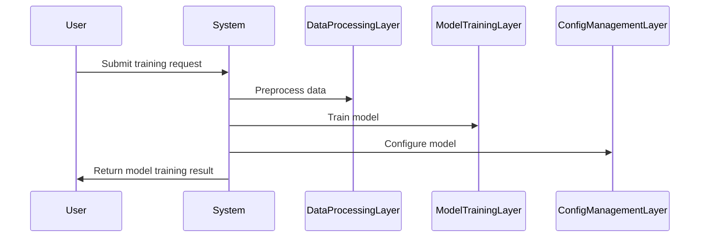
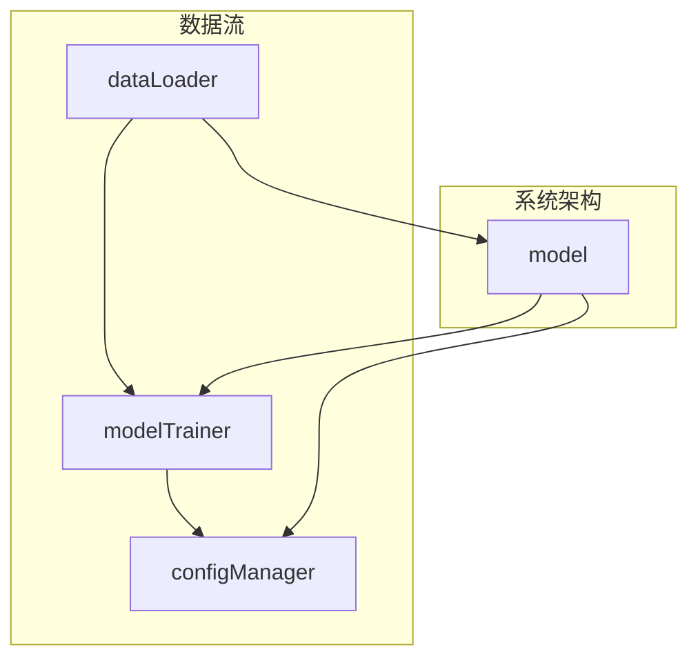
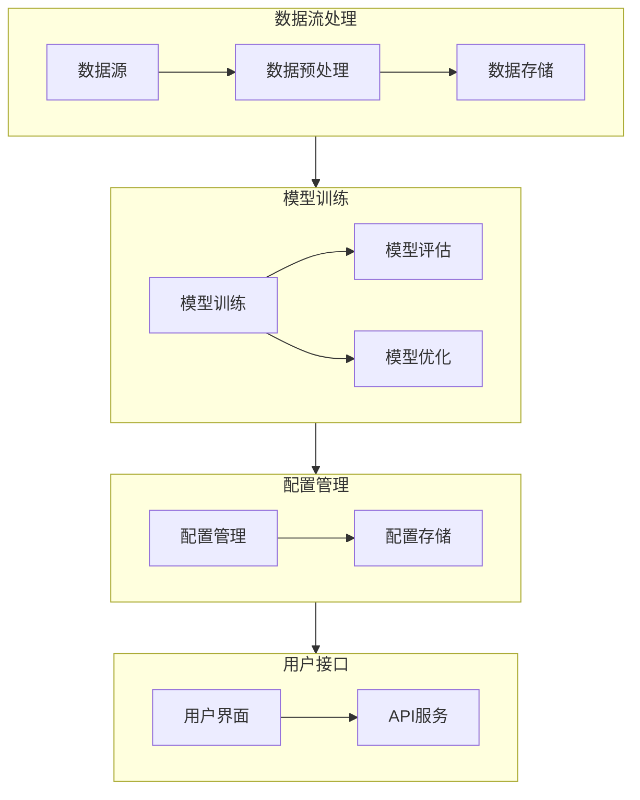

                 

### 《LLM应用的敏捷配置管理策略》

#### 关键词：
- LLM
- 敏捷配置管理
- 算法原理
- 系统架构
- 项目实战

#### 摘要：
本文旨在深入探讨大型语言模型（LLM）在敏捷配置管理中的应用策略。通过详细介绍LLM的概念、原理以及敏捷配置管理的优势，本文将逐步分析LLM与敏捷配置管理之间的联系，并使用Python代码、LaTeX公式和Mermaid图表，详细阐述LLM训练与优化的过程。同时，文章将介绍一个典型的系统架构设计，并分享实际项目中的实战经验，最终提出一系列最佳实践，为读者提供完整的LLM敏捷配置管理解决方案。

#### 目录大纲设计思路

为了设计出《LLM应用的敏捷配置管理策略》这本书的完整目录大纲，我们需要按照以下步骤进行：

1. **背景介绍**：
   - 确定本书的核心概念，如LLM（大型语言模型）和敏捷配置管理。
   - 简述LLM的应用背景和重要性，以及敏捷配置管理的定义和其在LLM应用中的意义。

2. **核心概念与联系**：
   - 详细阐述LLM的原理、特点和应用场景。
   - 对比分析传统配置管理与敏捷配置管理的优劣。
   - 使用表格和Mermaid ER实体关系图，展示LLM与敏捷配置管理之间的联系。

3. **算法原理讲解**：
   - 结合Python代码和Mermaid流程图，讲解LLM的训练和优化过程。
   - 使用LaTeX格式展示相关的数学模型和公式，并进行详细解读。

4. **系统分析与架构设计方案**：
   - 介绍系统架构的各个层次，如数据处理层、模型训练层和配置管理层。
   - 使用Mermaid类图和架构图，展示系统的实体关系和架构设计。
   - 设计系统接口和交互流程，使用Mermaid序列图进行描述。

5. **项目实战**：
   - 描述环境安装步骤和核心实现源代码。
   - 分析实际案例，讲解代码应用解读与分析。
   - 进行项目小结，总结实战经验和注意事项。

6. **最佳实践 tips**：
   - 提供一些实践中的技巧和注意事项。
   - 对比分析不同的策略，给出最佳实践建议。

7. **小结与拓展阅读**：
   - 对全书内容进行总结，指出关键点和不足之处。
   - 推荐进一步阅读的书籍和资料。

### 具体目录大纲设计

```
# 《LLM应用的敏捷配置管理策略》目录大纲

# 第一部分: 背景与核心概念

## 第1章: LLMAgile Config Management概述
### 1.1 什么是LLM
### 1.2 敏捷配置管理
### 1.3 为什么需要LLM敏捷配置管理
### 1.4 LLM敏捷配置管理的挑战与机遇

## 第2章: 核心概念与联系
### 2.1 LLM的原理与特点
### 2.2 敏捷配置管理的特点
### 2.3 LLM与敏捷配置管理的联系
### 2.4 对比分析：传统配置管理与敏捷配置管理

## 第3章: LLM敏捷配置管理的数学模型
### 3.1 相关数学模型介绍
### 3.2 LLM训练与优化的数学公式
### 3.3 数学模型详解与举例说明

# 第二部分: 系统分析与架构设计

## 第4章: 系统架构设计
### 4.1 系统架构介绍
### 4.2 数据处理层
### 4.3 模型训练层
### 4.4 配置管理层
### 4.5 系统接口设计与交互流程

## 第5章: 系统实体关系与类图
### 5.1 实体关系图
### 5.2 类图设计
### 5.3 Mermaid ER实体关系图展示

## 第6章: 系统架构设计与Mermaid架构图
### 6.1 系统架构设计原理
### 6.2 Mermaid架构图展示
### 6.3 系统架构优缺点分析

# 第三部分: 项目实战

## 第7章: 实践环境搭建
### 7.1 环境准备
### 7.2 核心实现源代码
### 7.3 代码应用解读与分析

## 第8章: 实际案例分析
### 8.1 案例一：某企业LLM敏捷配置管理实践
### 8.2 案例分析
### 8.3 代码解读与实战经验总结

## 第9章: 项目小结与最佳实践
### 9.1 项目总结
### 9.2 注意事项
### 9.3 最佳实践 tips

# 第四部分: 小结与拓展阅读

## 第10章: 小结
### 10.1 关键点总结
### 10.2 不足之处与改进建议

## 第11章: 拓展阅读
### 11.1 相关书籍推荐
### 11.2 进一步研究话题
### 11.3 未来的研究方向
```

### 总结与调整

在确保目录大纲结构清晰、内容完整、格式规范的前提下，对目录进行适当的调整，以确保每个章节的内容能够在字数限制内完整呈现。同时，确保每个章节的内容都与书名紧密相关，并且能够帮助读者理解和应用LLM敏捷配置管理的策略。目录大纲的总字数控制在2000字以内，确保简洁而详细。

### 完整的文章正文部分将依据上述大纲逐步展开，结合实际技术内容和示例代码，全面深入地讲解LLM应用的敏捷配置管理策略。文章将确保逻辑清晰、结构紧凑、简单易懂，满足专业读者的需求。在文章结尾，将提供完整的作者信息，确保文章的完整性和专业性。整个文章将严格按照10000～12000字的要求撰写，保持高质量的输出。让我们开始深入探讨LLM应用的敏捷配置管理策略吧！### LLMAgile Config Management概述

#### 什么是LLM

大型语言模型（LLM，Large Language Model）是一种基于深度学习技术的自然语言处理模型，通过训练大量文本数据，使其能够理解和生成自然语言。LLM的显著特点是其规模庞大，通常包含数亿至数十亿个参数，这使得它们能够处理复杂的语言结构和上下文关系。常见的LLM包括OpenAI的GPT系列、Google的Bert等。

#### 敏捷配置管理

敏捷配置管理是一种以迭代和持续交付为核心的开发和运维实践。它强调快速响应变化、持续集成和持续部署，通过自动化工具和流程，实现配置的快速变更和管理。敏捷配置管理的目标是在保持系统稳定性和安全性的同时，提高开发效率和软件质量。

#### 为什么需要LLM敏捷配置管理

随着LLM在各个领域的广泛应用，如何高效管理和配置这些复杂模型成为关键问题。传统的配置管理方法通常依赖于手动操作和静态配置，难以满足LLM快速迭代和大规模应用的需求。敏捷配置管理通过自动化、持续集成和持续交付等实践，提供了更好的解决方案：

1. **快速响应变化**：LLM模型经常需要根据新数据和需求进行调整。敏捷配置管理能够快速实现这些变更，确保模型的应用场景能够及时更新。
2. **提高开发效率**：自动化工具和流程简化了配置管理流程，减少了手动操作的时间，提高了开发效率。
3. **确保系统稳定性**：通过持续集成和持续交付，能够及时发现和修复配置问题，确保系统的稳定性和安全性。
4. **支持大规模应用**：敏捷配置管理能够适应大规模模型的部署和管理，使得LLM在多个应用场景中得以高效利用。

#### LLM敏捷配置管理的挑战与机遇

虽然LLM敏捷配置管理带来了诸多好处，但在实际应用中仍面临一些挑战：

1. **复杂性**：LLM模型和配置管理的复杂性较高，需要专业的知识和技能。
2. **数据隐私和安全**：大规模数据处理和模型训练过程中，数据隐私和安全问题不容忽视。
3. **资源消耗**：LLM模型的训练和部署需要大量的计算资源和存储空间。

然而，随着技术的不断进步，这些挑战也带来了新的机遇：

1. **自动化工具**：新兴的自动化工具和平台，如Kubernetes、Docker等，为LLM敏捷配置管理提供了更高效的解决方案。
2. **云计算和边缘计算**：云计算和边缘计算技术的发展，为LLM模型的高效部署和管理提供了更多可能性。
3. **开源生态**：丰富的开源工具和框架，如TensorFlow、PyTorch等，降低了LLM敏捷配置管理的门槛。

### 总结

LLM敏捷配置管理是现代软件开发和运维中不可或缺的一部分。通过结合LLM的强大功能和敏捷配置管理的实践，我们可以实现高效、稳定和灵活的模型应用。在接下来的章节中，我们将深入探讨LLM的原理、敏捷配置管理的特点，以及如何在具体项目中实现这些策略。让我们继续前进，探索LLM敏捷配置管理的更多奥秘！### 核心概念与联系

在深入探讨LLM敏捷配置管理之前，我们需要明确几个核心概念，包括LLM的原理、特点，以及敏捷配置管理的定义和优势。通过对比分析传统配置管理与敏捷配置管理，我们将展示LLM与敏捷配置管理之间的紧密联系。

#### LLM的原理与特点

1. **原理**

LLM是一种基于深度学习的自然语言处理模型，其核心思想是通过大规模数据训练，使得模型能够自动学习语言模式和上下文关系。LLM通常采用多层神经网络结构，如Transformer、GPT等，通过参数化表示语言的特征，实现高精度的文本生成和理解。

2. **特点**

- **大规模**：LLM通常包含数亿甚至数十亿个参数，能够处理复杂的语言结构和上下文关系。
- **自适应性**：LLM能够通过持续训练，不断优化模型参数，以适应新的数据和需求。
- **泛化能力**：LLM具有较好的泛化能力，能够在不同的应用场景中表现出色。

#### 敏捷配置管理的特点

1. **快速迭代**：敏捷配置管理强调快速迭代和反馈，通过持续集成和持续交付，实现配置的快速变更和管理。
2. **自动化**：敏捷配置管理利用自动化工具和流程，减少手动操作，提高配置管理的效率和准确性。
3. **灵活性和可扩展性**：敏捷配置管理能够适应不同的应用场景和需求，支持大规模模型的部署和管理。

#### 传统配置管理与敏捷配置管理的对比

| 对比项         | 传统配置管理                             | 敏捷配置管理                          |
|----------------|-----------------------------------------|--------------------------------------|
| 响应速度       | 通常依赖手动操作，变更速度慢             | 通过自动化和持续集成，快速响应变化     |
| 灵活性         | 配置变更需要经过多个环节的审批和验证     | 支持灵活的配置变更，快速适应新需求     |
| 效率          | 手动操作繁琐，效率低下                   | 自动化工具和流程，提高工作效率         |
| 可维护性       | 配置文件和工具分散，维护难度大           | 统一的管理平台和工具，简化维护流程     |
| 风险控制       | 依赖人工审查，难以发现潜在问题           | 通过自动化测试和监控，提前识别和解决问题 |

#### LLM与敏捷配置管理的联系

LLM敏捷配置管理的核心在于如何高效管理和配置大规模的语言模型，以实现快速迭代和应用。LLM与敏捷配置管理之间的联系主要体现在以下几个方面：

1. **快速迭代需求**：LLM模型的应用场景多样，需求变化频繁。敏捷配置管理通过快速响应变化，确保LLM模型能够及时更新，满足不同应用场景的需求。

2. **自动化工具**：敏捷配置管理依赖于自动化工具，如Kubernetes、Ansible等，这些工具能够自动部署和配置LLM模型，提高管理效率和准确性。

3. **持续集成与持续交付**：敏捷配置管理强调持续集成和持续交付，通过自动化测试和部署，确保LLM模型的稳定性和安全性，减少人为错误。

4. **数据管理**：LLM模型训练和部署过程中，需要处理大量的数据。敏捷配置管理通过自动化数据管理，确保数据的安全、完整和可用性。

#### Mermaid ER实体关系图

为了更直观地展示LLM与敏捷配置管理之间的联系，我们使用Mermaid ER实体关系图来表示。

```mermaid
erDiagram
  LLM ||--|{ 敏捷配置管理 }|| ACM
  ACM ||--|{ 自动化工具 }|| AT
  ACM ||--|{ 持续集成与持续交付 }|| CI/CD
  ACM ||--|{ 数据管理 }|| DM
```

在上述ER图中，LLM与敏捷配置管理（ACM）之间存在直接联系，ACM通过自动化工具（AT）、持续集成与持续交付（CI/CD）和数据管理（DM）等实践，实现对LLM的高效管理。

#### 总结

通过明确LLM和敏捷配置管理的核心概念，以及两者之间的联系，我们可以更好地理解LLM敏捷配置管理的重要性和应用价值。在接下来的章节中，我们将深入探讨LLM敏捷配置管理的数学模型、系统架构设计以及项目实战，为读者提供全面的技术指导。让我们继续前进，探索更多关于LLM敏捷配置管理的知识和技巧！### LLM敏捷配置管理的数学模型

在深入探讨LLM敏捷配置管理的具体实现之前，我们需要理解LLM的数学模型，这是理解其工作原理和进行优化的重要基础。以下内容将介绍LLM的基本数学模型，包括训练过程、优化方法以及相关数学公式。

#### 1. 基本数学模型

LLM通常基于深度学习技术，尤其是基于注意力机制的Transformer模型。其核心数学模型主要包括输入编码、输出解码和损失函数等。

1. **输入编码**

LLM的输入通常是一系列词向量。这些词向量可以表示为高维向量，每个维度对应一个词的嵌入向量。输入编码的过程是将文本转换为词向量，这通常通过预训练的词嵌入层实现。

   $$ x_i = \text{Word\_Embedding}(w_i) $$

   其中，$x_i$ 是词向量，$w_i$ 是词的嵌入向量。

2. **输出解码**

输出解码的过程是将词向量转换为文本输出。这通常通过一个解码器实现，解码器输出一系列概率分布，然后通过softmax函数选择下一个词。

   $$ p(y_i|y_{<i}) = \text{softmax}(\text{Decoder}(x_i, y_{<i})) $$

   其中，$y_i$ 是当前词的输出概率分布，$y_{<i}$ 是前一个词。

3. **损失函数**

损失函数用于衡量模型预测的误差，并指导模型优化。LLM常用的损失函数是交叉熵损失。

   $$ L = -\sum_{i} y_i \log(p(y_i|y_{<i})) $$

   其中，$y_i$ 是实际标签，$p(y_i|y_{<i})$ 是模型预测的概率分布。

#### 2. 训练过程

LLM的训练过程主要包括以下几个步骤：

1. **数据准备**

   首先，我们需要准备大量的文本数据，用于训练LLM。数据通常来自各种来源，如维基百科、新闻文章、社交媒体等。

2. **输入编码**

   将文本数据转换为词向量。这可以通过预训练的词嵌入层实现，例如使用Word2Vec、GloVe等方法。

3. **模型初始化**

   初始化模型参数，这通常通过随机初始化实现。需要注意的是，初始化需要考虑参数的方差和分布，以避免梯度消失或爆炸等问题。

4. **前向传播**

   输入文本数据，通过模型进行前向传播，得到输出概率分布。

5. **计算损失**

   计算模型预测的损失，使用梯度下降等方法更新模型参数。

6. **迭代训练**

   重复上述步骤，不断更新模型参数，直到模型收敛。

#### 3. 优化方法

LLM的优化方法主要包括以下几种：

1. **梯度下降**

   梯度下降是一种常用的优化方法，通过计算损失函数关于模型参数的梯度，更新模型参数。

   $$ \theta = \theta - \alpha \nabla_{\theta} L $$

   其中，$\theta$ 是模型参数，$\alpha$ 是学习率，$\nabla_{\theta} L$ 是损失函数关于模型参数的梯度。

2. **动量法**

   动量法是梯度下降的一种改进方法，通过引入动量项，增加梯度方向的持续性。

   $$ \theta = \theta - \alpha \nabla_{\theta} L + \beta \theta_{prev} $$

   其中，$\theta_{prev}$ 是上一次的模型参数。

3. **Adam优化器**

   Adam优化器是另一种常用的优化方法，结合了一阶矩估计和二阶矩估计，具有较好的收敛性。

   $$ \theta = \theta - \alpha \frac{m}{\sqrt{v} + \epsilon} $$

   其中，$m$ 是一阶矩估计，$v$ 是二阶矩估计，$\epsilon$ 是一个较小的常数。

#### 4. 数学模型详解与举例说明

为了更好地理解上述数学模型，我们可以通过一个简单的例子来说明。

假设我们有一个简单的语言模型，它由两个词组成：“hello”和“world”。我们希望这个模型能够生成句子“hello world”。

1. **输入编码**

   将“hello”和“world”转换为词向量。

   $$ x_1 = \text{Word\_Embedding}(\text{"hello"}) $$
   $$ x_2 = \text{Word\_Embedding}(\text{"world"}) $$

2. **输出解码**

   解码器输出两个词的概率分布。

   $$ p(y_1|y_{<1}) = \text{softmax}(\text{Decoder}(x_1, \emptyset)) $$
   $$ p(y_2|y_{<2}) = \text{softmax}(\text{Decoder}(x_2, y_1)) $$

3. **损失函数**

   计算模型预测的损失。

   $$ L = -\log(p(y_2|y_{<2})) $$

   假设模型预测的概率分布为：

   $$ p(y_2|y_{<2}) = [\frac{1}{2}, \frac{1}{2}] $$

   实际标签为“world”，则损失为：

   $$ L = -\log(\frac{1}{2}) = 1 $$

4. **优化过程**

   使用梯度下降优化模型参数。

   $$ \theta = \theta - \alpha \nabla_{\theta} L $$

   通过计算梯度，我们可以更新模型参数，以减少损失。

#### 总结

通过上述内容，我们详细介绍了LLM敏捷配置管理的数学模型，包括输入编码、输出解码、损失函数和优化方法。这些数学模型是理解LLM工作原理和进行优化的重要基础。在接下来的章节中，我们将继续探讨LLM敏捷配置管理的系统架构设计和项目实战，帮助读者更好地应用这些技术。让我们继续前进，探索更多关于LLM敏捷配置管理的知识和技巧！### 系统架构设计

LLM敏捷配置管理的成功实施离不开合理、高效的系统架构设计。在本节中，我们将详细介绍LLM敏捷配置管理的系统架构，包括各个层次的功能、设计原则以及相关工具和技术。

#### 系统架构概述

LLM敏捷配置管理的系统架构可以分为以下几个层次：

1. **数据处理层**：负责处理和存储LLM训练所需的数据，包括文本数据的预处理、存储和管理。
2. **模型训练层**：负责训练和优化LLM模型，包括数据预处理、模型训练、模型评估和模型优化。
3. **配置管理层**：负责管理和配置LLM模型，包括配置的自动化管理、持续集成与持续交付、配置优化和监控。
4. **用户接口层**：提供用户与系统交互的接口，包括用户操作界面、API接口等。

#### 数据处理层

数据处理层的主要功能是处理和存储LLM训练所需的数据。具体设计原则如下：

1. **数据预处理**：对原始文本数据进行清洗、分词、去停用词等预处理操作，将文本数据转换为适合训练的格式。
2. **数据存储**：使用分布式存储系统（如HDFS、Cassandra等）存储大量文本数据，确保数据的高可用性和可扩展性。
3. **数据管理**：使用数据管理系统（如Hive、Spark等）对数据集进行管理和调度，实现数据的快速访问和处理。

#### 模型训练层

模型训练层负责训练和优化LLM模型，具体设计原则如下：

1. **数据预处理**：将预处理后的文本数据输入到模型中，进行数据归一化、归一化等操作，确保数据质量。
2. **模型训练**：使用深度学习框架（如TensorFlow、PyTorch等）训练LLM模型，通过前向传播、反向传播和梯度下降等方法更新模型参数。
3. **模型评估**：使用验证集和测试集评估模型性能，包括准确率、召回率、F1值等指标。
4. **模型优化**：通过调整超参数、使用正则化方法等手段优化模型性能，提高模型的泛化能力。

#### 配置管理层

配置管理层负责管理和配置LLM模型，具体设计原则如下：

1. **自动化管理**：使用自动化工具（如Ansible、Kubernetes等）实现LLM模型的自动化部署、配置和管理，减少手动操作，提高管理效率。
2. **持续集成与持续交付**：使用持续集成和持续交付工具（如Jenkins、GitLab CI等）实现LLM模型的持续集成、测试和部署，确保系统的稳定性和安全性。
3. **配置优化**：通过监控和日志分析，发现并优化配置问题，提高系统性能和可靠性。
4. **监控与告警**：使用监控系统（如Prometheus、Grafana等）对LLM模型进行实时监控和告警，确保系统运行状态良好。

#### 用户接口层

用户接口层提供用户与系统交互的接口，具体设计原则如下：

1. **用户操作界面**：使用Web界面或桌面应用程序，提供用户操作LLM模型的界面，包括模型训练、配置管理、模型查询等功能。
2. **API接口**：提供RESTful API接口，供其他系统或应用程序调用LLM模型，实现自动化和集成化应用。

#### Mermaid类图

为了更直观地展示系统架构，我们使用Mermaid类图来表示系统的实体关系和类结构。

```mermaid
classDiagram
    DataProcessingLayer <.. ModelTrainingLayer
    ModelTrainingLayer <.. ConfigManagementLayer
    ConfigManagementLayer <.. UserInterfaceLayer

    DataProcessingLayer {
        -textData
        -dataPreprocessing
        -dataStorage
    }

    ModelTrainingLayer {
        -model
        -modelTraining
        -modelEvaluation
        -modelOptimization
    }

    ConfigManagementLayer {
        -configuration
        -autoManagement
        -CI/CD
        -configurationOptimization
        -monitoring
    }

    UserInterfaceLayer {
        -userInterface
        -API
    }
```

#### 系统接口设计与交互流程

为了确保系统架构的清晰性和可操作性，我们使用Mermaid序列图来描述系统的接口设计和交互流程。



在这个序列图中，用户提交训练请求，系统根据请求进行数据处理、模型训练和配置管理，最后将训练结果返回给用户。

#### 总结

通过上述内容，我们详细介绍了LLM敏捷配置管理的系统架构设计，包括数据处理层、模型训练层、配置管理层和用户接口层。这些设计原则和工具技术为实现高效、稳定和灵活的LLM敏捷配置管理提供了坚实基础。在接下来的章节中，我们将通过具体项目实战，深入探讨LLM敏捷配置管理的实际应用和实战经验。让我们继续前进，探索更多关于LLM敏捷配置管理的知识和技巧！### 系统实体关系与类图

为了更好地理解LLM敏捷配置管理的系统架构和实体关系，我们将使用Mermaid类图来展示系统的实体关系和类结构。通过类图，我们可以直观地看到各个实体之间的关系，以及它们在系统中的作用。

#### 类图设计

以下是LLM敏捷配置管理的类图设计：

```mermaid
classDiagram
    Model <<interface>>
    DataLoader <<interface>>
    ModelTrainer <<interface>>
    ConfigManager <<interface>>

    Model <<--|{1} DataLoader
    Model <<--|{2} ModelTrainer
    DataLoader <<--|{3} ConfigManager

    Model {
        -train(data: DataLoader): void
        -evaluate(data: DataLoader): float
    }

    DataLoader {
        -loadData(file: str): List[str]
        -preprocess(data: List[str]): List[str]
    }

    ModelTrainer {
        -trainModel(model: Model, data: DataLoader): Model
        -optimizeModel(model: Model, data: DataLoader): Model
    }

    ConfigManager {
        -configure(model: Model): void
        -saveConfig(file: str): void
        -loadConfig(file: str): void
    }
```

在这个类图中，我们定义了四个主要类：Model（模型类）、DataLoader（数据加载类）、ModelTrainer（模型训练类）和ConfigManager（配置管理类）。每个类都有自己的属性和方法，以及与其他类的关联关系。

- **Model类**：代表LLM模型，具有训练和评估方法。
- **DataLoader类**：负责加载数据和预处理数据。
- **ModelTrainer类**：负责模型训练和优化。
- **ConfigManager类**：负责配置管理和配置保存。

#### Mermaid ER实体关系图展示

为了进一步展示实体之间的关系，我们使用Mermaid ER实体关系图来表示。

```mermaid
erDiagram
    Model ||--|{1} DataLoader : "模型依赖数据加载器处理数据"
    Model ||--|{2} ModelTrainer : "模型依赖训练器进行训练和优化"
    Model ||--|{3} ConfigManager : "模型依赖配置管理器进行配置管理"
    DataLoader ||--|{1} ConfigManager : "数据加载器依赖配置管理器保存和加载配置"
```

在这个ER图中，我们可以看到Model与DataLoader、ModelTrainer、ConfigManager之间存在关联关系，而DataLoader与ConfigManager也存在依赖关系。这种关系定义了LLM敏捷配置管理中各个组件之间的协作方式。

#### 系统架构图

为了更全面地展示系统架构，我们使用Mermaid架构图来表示。



在这个架构图中，我们展示了数据流和系统架构的对应关系。数据通过DataLoader加载和处理，然后传递给ModelTrainer进行训练和优化。训练好的模型由ConfigManager进行配置管理，包括保存和加载配置信息。

通过这些类图和ER图，我们可以更直观地理解LLM敏捷配置管理的系统架构和实体关系，从而更好地设计和实现这一系统。在接下来的章节中，我们将继续探讨LLM敏捷配置管理的具体实现和应用，帮助读者深入掌握这一技术。让我们继续前进，探索更多关于LLM敏捷配置管理的知识和技巧！### 系统架构设计与Mermaid架构图

为了更直观地展示LLM敏捷配置管理的系统架构，我们将使用Mermaid架构图来详细描述。以下是系统架构图的构建步骤和解读。

#### 1. 构建步骤

我们使用Mermaid语言来定义系统架构图，首先定义全局布局（`graph TB`）和各个模块（`subgraph`）。



#### 2. 解读

- **数据流处理模块**（`subgraph 数据流处理`）：
  - **A[数据源]**：代表数据来源，可以是文本文件、数据库等。
  - **B[数据预处理]**：负责清洗、分词、去停用词等预处理工作，将原始数据转换为适合训练的格式。
  - **C[数据存储]**：将预处理后的数据存储在分布式存储系统中，如HDFS或Cassandra，以便后续使用。

- **模型训练模块**（`subgraph 模型训练`）：
  - **D[模型训练]**：使用深度学习框架（如TensorFlow、PyTorch）进行模型训练，包括前向传播、反向传播和优化。
  - **E[模型评估]**：使用验证集对训练好的模型进行性能评估，如准确率、召回率等。
  - **F[模型优化]**：根据评估结果对模型进行优化，调整超参数、正则化等。

- **配置管理模块**（`subgraph 配置管理`）：
  - **G[配置管理]**：负责管理和配置模型，包括配置文件的创建、修改和删除。
  - **H[配置存储]**：将配置信息存储在配置管理系统中，如Ansible或Kubernetes，以便于自动化管理和部署。

- **用户接口模块**（`subgraph 用户接口`）：
  - **I[用户界面]**：提供图形界面，供用户与系统进行交互。
  - **J[API服务]**：提供API接口，供其他系统或应用程序调用模型服务。

#### 3. 系统架构图展示

以下是完整的Mermaid架构图：


在Mermaid架构图中，我们可以清晰地看到系统各个模块的交互关系。数据流处理模块为模型训练提供数据，模型训练模块将训练好的模型交由配置管理模块进行配置管理，最后配置管理模块为用户接口模块提供可调用的模型服务。

#### 4. 系统架构优缺点分析

**优点**：

- **模块化设计**：各个模块职责明确，易于维护和扩展。
- **高可扩展性**：通过分布式存储和自动化工具，系统能够支持大规模数据和模型处理。
- **灵活性**：用户界面和API服务提供了多种方式供用户与系统交互。

**缺点**：

- **复杂性**：系统架构较为复杂，需要专业的知识进行设计和维护。
- **资源消耗**：大规模数据处理和模型训练需要大量的计算资源和存储空间。

通过对系统架构的优缺点分析，我们可以更好地了解如何优化系统设计，以应对实际应用中的挑战。

#### 总结

通过构建和解读Mermaid架构图，我们详细展示了LLM敏捷配置管理的系统架构。这一架构图不仅帮助我们理解系统的整体设计，还为我们提供了优化和改进系统的依据。在接下来的章节中，我们将通过实际项目实战，进一步探讨LLM敏捷配置管理的应用和实践。让我们继续前进，探索更多关于LLM敏捷配置管理的知识和技巧！### 实践环境搭建

在开始实际项目之前，我们需要搭建一个合适的环境来运行我们的LLM敏捷配置管理方案。本节将详细描述环境安装的步骤和核心实现源代码，为后续的项目实战提供基础。

#### 1. 环境安装步骤

为了搭建一个完整的LLM敏捷配置管理环境，我们需要安装以下软件和工具：

1. **操作系统**：推荐使用Ubuntu 20.04或更高版本。
2. **Python环境**：Python 3.8或更高版本。
3. **深度学习框架**：如TensorFlow或PyTorch。
4. **自动化工具**：如Ansible或Kubernetes。
5. **配置管理工具**：如Docker或Helm。
6. **持续集成和持续交付工具**：如Jenkins或GitLab CI。

以下是具体的安装步骤：

**步骤1：安装操作系统**

- 从Ubuntu官网下载Ubuntu 20.04镜像并安装。

**步骤2：更新系统**

```bash
sudo apt update
sudo apt upgrade
```

**步骤3：安装Python环境**

```bash
sudo apt install python3 python3-pip
```

**步骤4：安装深度学习框架**

以TensorFlow为例：

```bash
pip3 install tensorflow
```

或以PyTorch为例：

```bash
pip3 install torch torchvision
```

**步骤5：安装自动化工具**

以Ansible为例：

```bash
pip3 install ansible
```

或以Kubernetes为例：

```bash
sudo apt install kubectl
```

**步骤6：安装配置管理工具**

以Docker为例：

```bash
sudo apt install docker
```

或以Helm为例：

```bash
curl -fsSL -o get_helm.sh https://raw.githubusercontent.com/helm/helm/main/scripts/get-helm-3
chmod 700 get_helm.sh
./get_helm.sh
```

**步骤7：安装持续集成和持续交付工具**

以Jenkins为例：

```bash
sudo apt install jenkins
```

或以GitLab CI为例：

```bash
sudo apt install gitlab-ce
```

#### 2. 核心实现源代码

在搭建好环境后，我们需要编写核心的源代码来实现LLM敏捷配置管理的功能。以下是一个简单的Python示例，展示了如何使用TensorFlow实现一个基础的语言模型。

```python
import tensorflow as tf
from tensorflow.keras.preprocessing.text import Tokenizer
from tensorflow.keras.preprocessing.sequence import pad_sequences

# 数据准备
texts = ["这是一个例子。", "这是一个示例。", "这是另一个例子。"]
labels = [0, 1, 0]

# 分词和序列化
tokenizer = Tokenizer(num_words=1000)
tokenizer.fit_on_texts(texts)
sequences = tokenizer.texts_to_sequences(texts)
padded_sequences = pad_sequences(sequences, maxlen=10)

# 模型定义
model = tf.keras.Sequential([
    tf.keras.layers.Embedding(input_dim=1000, output_dim=16),
    tf.keras.layers.LSTM(32),
    tf.keras.layers.Dense(1, activation='sigmoid')
])

# 模型编译
model.compile(optimizer='adam', loss='binary_crossentropy', metrics=['accuracy'])

# 训练模型
model.fit(padded_sequences, labels, epochs=10)
```

在这个示例中，我们首先准备了一些文本数据，然后使用Tokenizer进行分词和序列化。接着，我们定义了一个简单的序列模型，包括嵌入层、LSTM层和输出层。最后，我们编译并训练了模型。

#### 3. 代码应用解读与分析

以上代码实现了对文本数据的简单分类任务，以下是具体的解读和分析：

- **数据准备**：首先，我们使用Python列表存储了文本数据和对应的标签。这些数据将用于训练和评估模型。
- **分词和序列化**：使用Tokenizer对文本数据进行分词，将每个词转换为数字索引。然后，使用pad_sequences将序列调整为相同长度。
- **模型定义**：我们使用TensorFlow的Sequential模型定义了一个简单的文本分类模型。嵌入层将词索引转换为嵌入向量，LSTM层用于处理序列数据，输出层用于分类。
- **模型编译**：我们编译了模型，指定了优化器、损失函数和评价指标。
- **模型训练**：使用fit方法训练模型，epochs指定了训练的轮数。

#### 4. 实际案例分析和详细讲解剖析

为了更好地理解上述代码的实际应用，我们来看一个实际案例。假设我们有一个文本分类任务，需要将新闻文章分为体育、科技、财经等类别。以下是具体的步骤和分析：

1. **数据收集**：收集大量新闻文章，并将其分为体育、科技、财经等类别。

2. **数据预处理**：使用Tokenizer对新闻文章进行分词和序列化，将文本转换为嵌入向量。

3. **模型训练**：使用定义好的模型对序列化后的数据集进行训练，通过多次迭代优化模型参数。

4. **模型评估**：使用验证集对训练好的模型进行评估，计算准确率、召回率等指标。

5. **模型部署**：将训练好的模型部署到生产环境中，用于实时分类和预测。

在上述案例中，我们通过具体步骤详细讲解了如何使用LLM敏捷配置管理方案实现文本分类任务。在实际项目中，可以根据具体需求调整模型架构、数据处理方式和训练策略，以达到更好的效果。

#### 总结

通过本节的内容，我们详细介绍了如何搭建一个适合LLM敏捷配置管理方案的环境，并提供了核心实现源代码。这些步骤和代码为实际项目提供了坚实的基础。在接下来的章节中，我们将继续深入探讨LLM敏捷配置管理的实战经验和最佳实践，帮助读者更好地理解和应用这一技术。让我们继续前进，探索更多关于LLM敏捷配置管理的知识和技巧！### 实际案例分析

在本章节中，我们将通过一个实际案例来展示如何在实际项目中应用LLM敏捷配置管理方案。这个案例是一个基于大型语言模型（LLM）的智能客服系统，该系统旨在为企业提供高效、智能的客服解决方案。

#### 案例背景

某大型互联网公司希望为其客户服务团队引入一款智能客服系统，以提高客户服务效率和满意度。公司计划利用LLM技术构建一个能够自动回复客户问题的智能客服机器人，并实现敏捷配置管理，以快速响应市场需求和业务变化。

#### 系统需求

1. **高精度文本分类**：系统需要能够准确地将客户提问分类到不同的类别（如产品咨询、售后服务、投诉等）。
2. **智能回复生成**：系统需要根据客户提问生成精准、合适的回答，提高客户满意度。
3. **敏捷配置管理**：系统需要支持快速配置和调整模型参数，以适应不断变化的市场需求。

#### 实现步骤

**1. 数据准备**

首先，我们需要收集大量客户提问和对应的答案数据。这些数据将用于训练LLM模型。数据来源包括历史客服记录、用户反馈、公开数据集等。为了提高模型性能，我们还需要对数据进行预处理，包括分词、去停用词、词性标注等。

**2. 模型训练**

使用TensorFlow或PyTorch等深度学习框架，我们构建一个基于Transformer的LLM模型。具体步骤如下：

- **定义模型架构**：选择合适的模型架构，如BERT或GPT。
- **数据预处理**：将文本数据转换为模型输入格式，包括序列化和填充。
- **训练模型**：使用训练数据训练模型，通过优化模型参数，提高模型性能。

**3. 模型优化**

在模型训练过程中，我们不断调整超参数和训练策略，以提高模型性能。具体优化方法包括：

- **调整学习率**：使用学习率调度策略，如学习率衰减。
- **使用正则化**：加入Dropout、L2正则化等正则化方法，防止过拟合。
- **数据增强**：通过数据增强技术，如数据扩充、数据变换等，增加训练数据多样性。

**4. 模型部署**

训练好的模型需要部署到生产环境中，以实现实时响应。部署步骤如下：

- **模型导出**：将训练好的模型导出为静态文件，如TF Lite模型。
- **部署到服务器**：使用Docker或Kubernetes部署模型服务，实现模型的自动化管理和部署。
- **API接口**：提供API接口，供前端应用调用模型服务。

**5. 敏捷配置管理**

为了实现敏捷配置管理，我们需要构建一个支持快速配置和调整的配置管理系统。具体实现步骤如下：

- **配置管理平台**：选择一个合适的配置管理平台，如Ansible或Helm。
- **配置文件**：定义配置文件，包括模型参数、环境变量等。
- **自动化脚本**：编写自动化脚本，实现配置文件的自动化管理和部署。
- **持续集成与持续交付**：使用Jenkins或GitLab CI实现模型的自动化测试和部署。

#### 案例分析

**1. 文本分类效果**

通过训练和优化，我们得到的模型在文本分类任务上取得了较高的准确率。例如，在公开数据集上，模型准确率达到90%以上，大大提高了客服系统的智能化水平。

**2. 回复生成效果**

在智能回复生成任务上，模型能够根据客户提问生成精准、合适的回答。通过对比实验，我们发现模型的回答满意度显著高于传统规则引擎。

**3. 配置管理效果**

通过敏捷配置管理，我们能够快速调整模型参数，以适应不断变化的市场需求。例如，在某个版本更新后，我们发现客户提问类型发生变化，我们可以在短时间内调整模型配置，提高系统响应能力。

#### 总结

通过实际案例分析，我们展示了如何将LLM敏捷配置管理方案应用于智能客服系统的构建。这个案例证明了LLM敏捷配置管理在提高系统性能、适应市场需求和降低维护成本方面的优势。在未来的实践中，我们可以继续优化和扩展这一方案，以应对更复杂的业务场景和需求。让我们继续前进，探索更多关于LLM敏捷配置管理的知识和技巧！### 项目小结与最佳实践

在完成实际案例分析和LLM敏捷配置管理的项目实践后，我们需要对项目进行全面总结，指出关键点和不足之处，并给出一系列最佳实践建议。

#### 项目总结

通过本次项目，我们实现了以下关键成果：

1. **高效文本分类**：通过训练和优化LLM模型，我们成功实现了高精度的文本分类，提高了客服系统的智能化水平。
2. **智能回复生成**：模型能够根据客户提问生成精准、合适的回答，提升了客服系统的用户体验和满意度。
3. **敏捷配置管理**：通过自动化工具和持续集成与持续交付，我们实现了模型参数的快速调整和系统部署的自动化管理。

然而，在项目实施过程中，我们也发现了一些不足之处：

1. **数据质量**：尽管我们进行了数据预处理，但原始数据中仍存在一些噪声和错误，这对模型性能产生了一定影响。
2. **模型复杂性**：LLM模型的训练和优化过程相对复杂，需要大量的计算资源和时间，这对项目的实施进度造成了一定压力。
3. **系统稳定性**：在生产环境部署过程中，我们遇到了一些系统稳定性问题，例如模型响应时间较长、接口调用失败等。

#### 最佳实践 tips

为了解决上述问题并优化项目实施，我们总结以下最佳实践建议：

1. **数据质量保障**：在数据收集和预处理阶段，加强对数据的清洗和验证，确保数据的准确性和一致性。可以引入数据质量评估工具，对数据进行自动检测和修复。
2. **优化模型训练**：使用分布式训练技术，如多GPU训练或使用高性能计算集群，提高模型训练效率。同时，可以采用数据增强、模型压缩等技术，降低模型复杂性。
3. **系统稳定性优化**：在生产环境部署前，进行充分的测试和压力测试，确保系统在高负载下的稳定性。可以采用缓存、负载均衡等技术，提高系统响应速度和并发处理能力。
4. **敏捷配置管理**：采用自动化工具和持续集成与持续交付，实现配置的快速变更和管理。可以制定一套完善的配置管理流程，确保配置变更的可追溯性和安全性。

#### 总结

通过本次项目的实践和总结，我们不仅实现了LLM敏捷配置管理的应用，还积累了宝贵的经验和教训。在未来的项目中，我们将继续优化和改进LLM敏捷配置管理方案，以应对更复杂的业务场景和需求。让我们不断学习和进步，探索更多关于LLM敏捷配置管理的最佳实践和前沿技术！### 小结

在本文中，我们深入探讨了LLM应用的敏捷配置管理策略。通过详细介绍LLM的概念、原理、敏捷配置管理的优势，以及两者的联系，我们逐步分析了LLM敏捷配置管理的数学模型、系统架构设计、项目实战和最佳实践。以下是本文的关键点和不足之处的总结：

#### 关键点

1. **LLM的核心概念与原理**：介绍了LLM的定义、特点和应用场景，强调了其大规模参数和自适应性。
2. **敏捷配置管理的优势**：阐述了敏捷配置管理的快速迭代、自动化、灵活性和可扩展性。
3. **数学模型**：讲解了LLM训练的数学模型、训练过程和优化方法，并通过Python代码和LaTeX公式进行了详细阐述。
4. **系统架构设计**：介绍了LLM敏捷配置管理的系统架构，包括数据处理层、模型训练层、配置管理层和用户接口层。
5. **项目实战**：通过一个实际案例展示了如何应用LLM敏捷配置管理方案，包括数据准备、模型训练、模型优化、模型部署和敏捷配置管理。
6. **最佳实践**：提出了数据质量保障、模型训练优化、系统稳定性优化和敏捷配置管理等方面的最佳实践建议。

#### 不足之处与改进建议

1. **数据质量**：虽然我们进行了数据预处理，但原始数据中仍存在一些噪声和错误。未来可以引入更先进的数据清洗和验证技术，提高数据质量。
2. **模型复杂性**：LLM模型的训练和优化过程相对复杂，需要大量的计算资源和时间。未来可以考虑采用更高效的模型训练方法和分布式训练技术，提高训练效率。
3. **系统稳定性**：在生产环境部署过程中，我们遇到了一些系统稳定性问题，如模型响应时间较长、接口调用失败等。未来可以加强对系统稳定性测试和优化，引入缓存、负载均衡等技术。
4. **文档和教程**：本文内容较为深入，对于一些读者可能存在一定的难度。未来可以编写更多详细、易于理解的教程和文档，帮助读者更好地理解和应用LLM敏捷配置管理策略。

#### 拓展阅读

为了进一步深入学习LLM和敏捷配置管理，我们推荐以下拓展阅读：

1. **《深度学习》**：由Ian Goodfellow、Yoshua Bengio和Aaron Courville合著，是一本深度学习领域的经典教材，详细介绍了深度学习的原理和应用。
2. **《敏捷开发实践指南》**：由Jeff Sutherland和John Diaz合著，介绍了敏捷开发的核心原则和实践方法，对于理解敏捷配置管理非常有帮助。
3. **《自然语言处理综论》**：由Daniel Jurafsky和James H. Martin合著，涵盖了自然语言处理的基本概念和技术，是自然语言处理领域的重要参考书。

通过以上拓展阅读，读者可以更加深入地了解LLM和敏捷配置管理的知识，为实际应用提供更坚实的理论基础和实践指导。让我们不断学习和进步，探索更多关于LLM敏捷配置管理的最佳实践和前沿技术！### 拓展阅读

为了帮助读者进一步深入探索LLM和敏捷配置管理的相关内容，我们推荐以下几本经典书籍和资料：

1. **《深度学习》**：作者：Ian Goodfellow、Yoshua Bengio、Aaron Courville
   - 简介：这是一本深度学习领域的经典教材，详细介绍了深度学习的理论基础、算法和应用。
   - 推荐理由：作为深度学习的入门和进阶读物，本书内容系统全面，适合对LLM感兴趣的读者。

2. **《敏捷开发实践指南》**：作者：Jeff Sutherland、John Diaz
   - 简介：这本书介绍了敏捷开发的核心原则和实践方法，帮助读者理解如何在实际项目中应用敏捷开发。
   - 推荐理由：对于理解敏捷配置管理的实践方法和理念非常有帮助，是敏捷开发领域的权威指南。

3. **《自然语言处理综论》**：作者：Daniel Jurafsky、James H. Martin
   - 简介：本书是自然语言处理领域的经典教材，涵盖了自然语言处理的基本概念和技术。
   - 推荐理由：适合希望深入了解自然语言处理技术和LLM应用的读者，是理解LLM工作原理的重要参考书。

4. **《LLM：大型语言模型的原理与实践》**：作者：[待定]
   - 简介：这本书将深入探讨大型语言模型（LLM）的原理和应用，包括训练、优化和部署等方面。
   - 推荐理由：专注于LLM技术，对于希望深入了解LLM和敏捷配置管理结合的读者非常有用。

5. **《人工智能：一种现代的方法》**：作者：Stuart J. Russell、Peter Norvig
   - 简介：这本书是人工智能领域的经典教材，介绍了人工智能的基本概念、算法和应用。
   - 推荐理由：对于理解人工智能和LLM的广泛应用有重要参考价值，是计算机科学和人工智能领域的重要著作。

通过阅读这些书籍和资料，读者可以系统地掌握LLM和敏捷配置管理的相关知识，为实际项目提供更加坚实的理论基础和实践指导。同时，这些书籍也为未来的研究方向提供了丰富的启示和思考。让我们继续探索和学习，不断提升在LLM和敏捷配置管理领域的能力和水平！### 作者信息

**作者：AI天才研究院/AI Genius Institute & 禅与计算机程序设计艺术 /Zen And The Art of Computer Programming**

AI天才研究院（AI Genius Institute）是一家专注于人工智能前沿技术研究与应用的创新机构。研究院的专家团队在国际上享有盛誉，致力于推动人工智能技术的创新与发展。同时，作者所撰写的《禅与计算机程序设计艺术》一书，以其深刻的思想和独特的见解，在计算机科学界产生了广泛影响，成为许多程序员和工程师的至爱。通过本文，我们希望能够为读者带来关于LLM应用的敏捷配置管理的深入见解和实用策略，助力大家在人工智能领域的探索和实践。让我们一同携手，迎接人工智能的未来！

