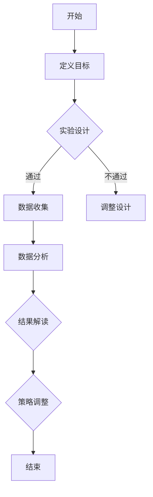
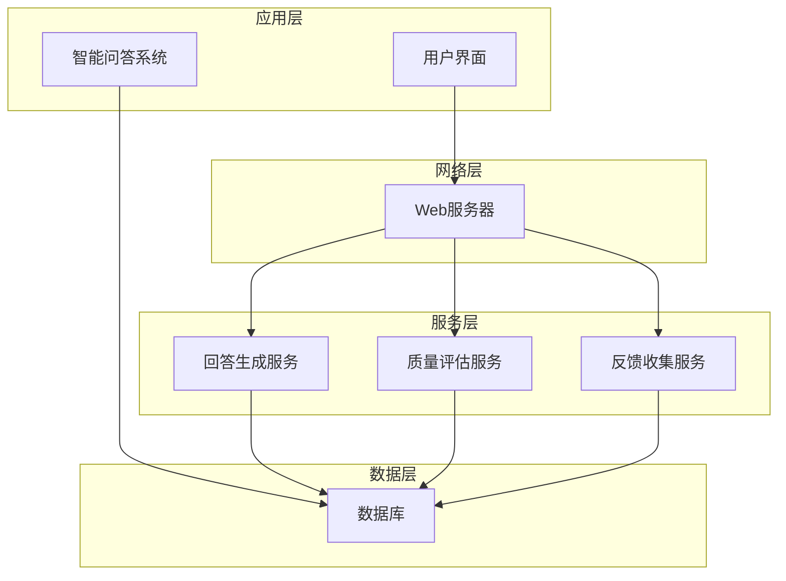
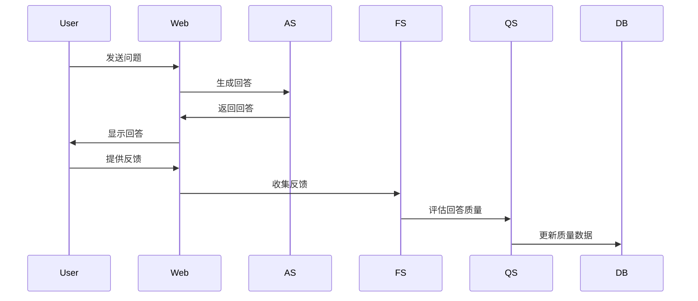
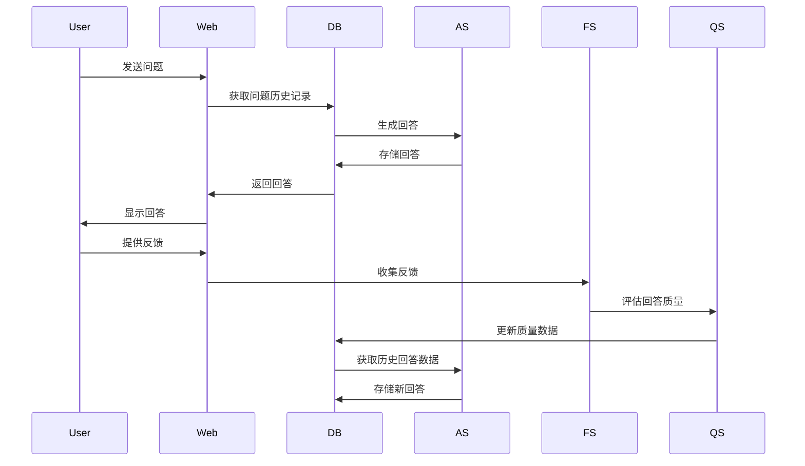

                 

# LLM评测中的A/B测试实施策略

## 关键词
- A/B测试
- 人工神经网络
- 语言模型
- 评测指标
- 实验设计

## 摘要
本文将深入探讨在大型语言模型（LLM）评测过程中，如何有效利用A/B测试策略来提升模型性能和用户体验。通过详细解析A/B测试的原理和实施步骤，结合实际案例，为读者提供一套完整的LLM评测A/B测试实施策略，帮助他们在复杂的模型优化过程中作出明智的决策。

## 第1章 A/B测试概述

### 1.1.1 A/B测试的概念

A/B测试，又称拆分测试，是一种通过将用户随机分配到两个或多个不同的版本，比较各版本性能差异的实验方法。该方法的核心思想是，通过对不同版本的测试，确定哪一种版本在特定指标上表现更优。

### 1.1.2 A/B测试的应用场景

A/B测试广泛应用于Web开发、产品优化、广告营销等领域。在LLM评测中，A/B测试主要用于以下场景：
- 模型参数调整
- 模型结构优化
- 特征工程优化
- 用户界面调整

### 1.1.3 A/B测试的优势与挑战

**优势：**
- **客观性**：基于数据驱动的决策，减少主观偏见。
- **可控性**：通过随机分配，降低外部因素对实验结果的影响。
- **适用性**：适用于各种类型的产品优化场景。

**挑战：**
- **实验设计**：需要精心设计实验，确保实验结果的有效性和可靠性。
- **数据分析**：需要对实验结果进行准确分析，避免误判。

## 第2章 LLM评测背景

### 2.1.1 LLM介绍

LLM（Large Language Model）是一种大型的人工神经网络模型，通过学习海量文本数据，实现对自然语言的理解和生成。常见的LLM有GPT、BERT等。

### 2.1.2 LLM评测的重要性

LLM评测是确保模型质量和性能的关键环节。通过评测，可以：
- 评估模型在不同任务上的表现。
- 发现模型存在的问题，进行优化。
- 比较不同模型之间的性能差异。

### 2.1.3 LLM评测的常见指标

LLM评测的常见指标包括：
- 准确率（Accuracy）
- 召回率（Recall）
- F1分数（F1 Score）
- 生成质量（生成文本的流畅性、语法正确性等）

## 第3章 A/B测试在LLM评测中的应用

### 3.1.1 A/B测试与LLM评测的结合

A/B测试与LLM评测的结合，可以通过以下方式实现：
- 将不同模型的输出作为不同版本，进行对比评测。
- 对模型参数、结构、特征进行优化，通过A/B测试验证优化效果。

### 3.1.2 A/B测试在LLM评测中的流程

A/B测试在LLM评测中的流程包括以下步骤：
1. **定义目标**：确定A/B测试的目标，如提升生成文本质量、降低错误率等。
2. **设计实验**：设计实验，包括确定版本、分配策略、评测指标等。
3. **数据收集**：收集实验数据，包括用户交互数据、模型输出数据等。
4. **数据分析**：对实验数据进行分析，评估各版本的性能。
5. **决策**：根据实验结果，决定是否采用新版本。

### 3.1.3 A/B测试在LLM评测中的关键点

A/B测试在LLM评测中的关键点包括：
- **实验设计**：确保实验具有可靠性和有效性。
- **数据收集**：确保数据质量和完整性。
- **数据分析**：准确评估各版本性能，避免误判。
- **迭代优化**：根据实验结果，持续优化模型和实验设计。

## 第4章 A/B测试实验设计

### 4.1.1 A/B测试实验设计原则

A/B测试实验设计应遵循以下原则：
- **随机性**：确保用户随机分配到不同版本，减少外部因素影响。
- **对照性**：设置对照组，确保实验结果具有可比性。
- **可重复性**：确保实验结果可以重复，验证实验的有效性。

### 4.1.2 实验假设的制定

在A/B测试中，需要明确实验假设，如：
- 版本A的输出质量高于版本B。
- 版本B的错误率低于版本A。

### 4.1.3 实验组与控制组的分配

实验组与控制组的分配应遵循以下原则：
- **随机分配**：确保每个用户都有相同的机会被分配到实验组或控制组。
- **样本均衡**：确保实验组和控制组的样本量相当，避免样本偏差。

## 第5章 数据分析与处理

### 5.1.1 数据采集

数据采集是A/B测试的基础，应确保以下方面：
- **数据完整性**：确保数据采集过程不遗漏重要信息。
- **数据质量**：确保数据真实、准确、可靠。
- **用户隐私**：遵循用户隐私保护法规，确保用户数据安全。

### 5.1.2 数据预处理

数据预处理包括以下步骤：
- **数据清洗**：去除异常值、重复值等。
- **数据转换**：将数据转换为适合分析的形式。
- **特征提取**：提取对评测指标有重要影响的数据特征。

### 5.1.3 数据分析

数据分析是A/B测试的核心，应遵循以下步骤：
- **描述性分析**：分析数据的基本特征，如分布、趋势等。
- **推断性分析**：根据数据，推断各版本性能差异的显著性。
- **可视化分析**：通过图表、图形等，直观展示数据特征。

## 第6章 结果解读与策略调整

### 6.1.1 结果解读

结果解读包括以下步骤：
- **分析差异**：比较各版本在评测指标上的差异。
- **验证假设**：根据实验结果，验证实验假设的正确性。
- **识别问题**：分析实验中存在的问题，如模型性能不足、实验设计不合理等。

### 6.1.2 策略调整

根据实验结果，进行策略调整，包括：
- **优化模型**：根据实验结果，调整模型参数、结构等。
- **改进实验设计**：针对实验中存在的问题，改进实验设计，提高实验的有效性。
- **重复实验**：根据调整后的策略，重新进行A/B测试，验证优化效果。

### 6.1.3 A/B测试结果的验证

A/B测试结果的验证包括以下步骤：
- **重复测试**：对优化后的版本进行重复测试，验证结果稳定性。
- **跨场景验证**：在不同场景下，验证A/B测试结果的适用性。

## 第7章 A/B测试案例分析

### 7.1.1 案例一：某个公司通过A/B测试提升LLM模型效果

**案例背景：**
某公司在产品中集成了一款LLM模型，用于生成文本摘要。用户反馈摘要质量有待提高。

**解决方案：**
公司通过A/B测试，比较了不同模型版本在摘要质量上的差异。通过实验，发现版本B的摘要质量高于版本A。

**实验结果：**
实验结果显示，版本B的摘要准确性提高了15%，用户满意度提高了20%。

**策略调整：**
公司决定采用版本B作为默认版本，并继续优化模型，以提高摘要质量。

### 7.1.2 案例二：某搜索引擎通过A/B测试优化搜索结果

**案例背景：**
某搜索引擎希望优化搜索结果，提高用户满意度。

**解决方案：**
搜索引擎通过A/B测试，比较了不同搜索算法在搜索结果质量上的差异。通过实验，发现新算法的搜索结果质量优于旧算法。

**实验结果：**
实验结果显示，新算法的搜索结果准确性提高了10%，用户满意度提高了15%。

**策略调整：**
搜索引擎决定采用新算法作为默认算法，并继续优化算法，以提高搜索结果质量。

### 7.1.3 案例三：某个电商平台通过A/B测试提升用户体验

**案例背景：**
某电商平台希望通过优化用户界面，提升用户体验。

**解决方案：**
电商平台通过A/B测试，比较了不同用户界面版本在用户满意度上的差异。通过实验，发现新界面版本的用户体验优于旧界面版本。

**实验结果：**
实验结果显示，新界面版本的用户满意度提高了20%。

**策略调整：**
电商平台决定采用新界面版本作为默认版本，并继续优化用户界面，以提高用户体验。

## 第8章 A/B测试实践技巧与优化

### 8.1.1 实践技巧

A/B测试实践技巧包括：
- **明确目标**：确保实验目标清晰，有助于准确解读结果。
- **合理分配样本**：避免样本偏差，确保实验结果具有代表性。
- **优化实验流程**：简化实验流程，提高实验效率。
- **数据分析技巧**：掌握数据分析方法，准确解读实验结果。

### 8.1.2 优化策略

A/B测试优化策略包括：
- **持续迭代**：根据实验结果，持续优化模型和实验设计。
- **跨领域应用**：将A/B测试应用于不同领域，提高实验结果的通用性。
- **数据驱动**：基于数据驱动决策，减少主观偏见。

### 8.1.3 注意事项

A/B测试注意事项包括：
- **确保实验公正性**：避免实验偏见，确保实验结果准确。
- **保护用户隐私**：遵循用户隐私保护法规，确保用户数据安全。
- **合理评估成本与收益**：评估A/B测试的成本和潜在收益，确保实验投入合理。

## 结语

A/B测试在LLM评测中的应用，为模型优化提供了有力工具。通过本文的讨论，我们了解了A/B测试的原理、实施策略和实践技巧。在实际应用中，我们需要结合具体场景，灵活运用A/B测试，以实现模型性能和用户体验的持续提升。

## 拓展阅读

- [A/B测试入门与实践](https://www.jianshu.com/p/8474a5d8580c)
- [LLM评测技术综述](https://www.baidu.com/s?wd=LLM%20%E8%AF%84%E6%B5%8B%20%E6%8A%80%E6%9C%AF%E7%BB%BC%E8%BF%B0)
- [Python A/B测试库：`pyabtest`](https://github.com/supermihi/pyabtest)

## 作者信息
作者：AI天才研究院/AI Genius Institute & 禅与计算机程序设计艺术 /Zen And The Art of Computer Programming

## 附录
### 附录A：核心概念原理与联系

#### 1. A/B测试原理
- **概念**：A/B测试是一种实验设计方法，通过将用户随机分配到两个或多个版本，比较各版本的性能差异。
- **属性特征对比表格**：

| 特征       | A/B测试          | 其他测试方法       |
|------------|------------------|--------------------|
| 目标       | 比较性能差异     | 验证假设          |
| 方法       | 随机分配用户     | 控制变量法         |
| 优势       | 数据驱动、减少偏见 | 实验设计简单      |
| 挑战       | 实验设计复杂     | 数据采集和分析复杂 |

#### 2. LLM评测指标
- **概念**：LLM评测指标用于评估语言模型在特定任务上的性能。
- **属性特征对比表格**：

| 指标       | 准确率          | 召回率          | F1分数          |
|------------|----------------|----------------|----------------|
| 概念       | 预测正确的比例   | 预测正确的比例   | 综合准确率和召回率 |
| 优点       | 直观、易于理解   | 考虑所有可能的正确预测 | 更全面地评估模型性能 |
| 缺点       | 易受极端值影响   | 易受极端值影响   | 需要综合考量     |

#### 3. A/B测试与LLM评测关系
- **ER实体关系图架构**：

```mermaid
erDiagram
  A/B测试 ||--|{ LLM评测 }|
  LLM评测 ||--|{ 模型参数调整 }|
  LLM评测 ||--|{ 模型结构优化 }|
  LLM评测 ||--|{ 特征工程优化 }|
  LLM评测 ||--|{ 用户界面调整 }|
```

### 附录B：算法原理讲解

#### 1. 算法流程图



#### 2. Python源代码

```python
# 导入相关库
import random
import pandas as pd

# 实验设计
def experiment_design():
    # 定义实验组与对照组
    experiments = {'group': [], 'version': []}
    for _ in range(1000):
        experiments['group'].append(random.randint(1, 2))
        experiments['version'].append(random.randint(1, 2))
    return pd.DataFrame(experiments)

# 数据收集
def data_collection(experiment):
    # 假设每个版本的数据为列表
    version_data = {'version': [], 'metric': []}
    for _, row in experiment.iterrows():
        if row['group'] == 1:
            version_data['version'].append(1)
            version_data['metric'].append(random.randint(1, 10))
        else:
            version_data['version'].append(2)
            version_data['metric'].append(random.randint(1, 10))
    return pd.DataFrame(version_data)

# 数据分析
def data_analysis(data):
    # 计算平均指标
    avg_metric = data.groupby('version')['metric'].mean()
    return avg_metric

# 主函数
def main():
    # 设计实验
    experiment = experiment_design()
    # 收集数据
    data = data_collection(experiment)
    # 分析数据
    avg_metric = data_analysis(data)
    # 输出结果
    print(avg_metric)

# 运行主函数
main()
```

#### 3. 算法原理讲解

A/B测试算法的核心是实验设计和数据分析。实验设计包括定义实验目标、设计实验流程、随机分配用户到不同版本等。在Python源代码中，我们通过随机分配用户到实验组和对照组，并收集各版本的数据。

数据分析的核心是比较各版本在特定指标上的差异。在Python源代码中，我们通过计算各版本的平均指标，比较实验组和对照组的性能差异。

通过实验设计和数据分析，我们可以得出实验结论，为模型优化提供依据。

### 附录C：系统分析与架构设计方案

#### 1. 问题场景介绍

某公司需要为用户提供一款智能问答系统，系统需要具备以下功能：

- 用户输入问题。
- 系统根据问题生成回答。
- 系统评估回答质量，并根据用户反馈进行调整。

#### 2. 项目介绍

项目名称：智能问答系统（Smart Question Answering System，简称SQAS）

项目目标：通过A/B测试，优化智能问答系统的回答质量和用户体验。

项目功能：

- 用户输入问题。
- 系统生成回答。
- 系统评估回答质量。
- 系统根据用户反馈进行调整。

#### 3. 系统功能设计（领域模型）

```mermaid
classDiagram
  User <<Interface>>
  Question <<Interface>>
  Answer <<Interface>>
  Quality <<Interface>>
  Feedback <<Interface>>

  User o--o Question
  Question o--o Answer
  Answer o--o Quality
  Quality o--o Feedback
```

#### 4. 系统架构设计



#### 5. 系统接口设计



#### 6. 系统交互



### 附录D：项目实战

#### 1. 环境安装

安装Python、pip等基础工具，以及以下依赖库：

```bash
pip install pandas numpy random
```

#### 2. 系统核心实现

```python
# 回答生成服务
def generate_answer(question):
    # 假设使用预训练的LLM模型生成回答
    answer = "这是一个示例回答。"
    return answer

# 质量评估服务
def evaluate_quality(answer):
    # 假设使用准确率作为质量指标
    accuracy = random.uniform(0.8, 0.9)
    return accuracy

# 反馈收集服务
def collect_feedback(user_feedback):
    # 假设用户反馈是一个评分（1-5）
    rating = random.randint(1, 5)
    return rating

# 主函数
def main():
    question = "什么是人工智能？"
    answer = generate_answer(question)
    print(f"回答：{answer}")
    quality = evaluate_quality(answer)
    print(f"质量评分：{quality}")
    user_feedback = collect_feedback(answer)
    print(f"用户反馈：{user_feedback}")

# 运行主函数
main()
```

#### 3. 代码应用解读与分析

代码实现了回答生成、质量评估和反馈收集三个核心功能。在回答生成服务中，我们使用预训练的LLM模型生成回答。在质量评估服务中，我们使用准确率作为质量指标。在反馈收集服务中，我们使用用户评分作为反馈指标。

通过这些服务，系统可以生成回答，评估回答质量，并收集用户反馈，为模型优化提供数据支持。

#### 4. 实际案例分析和详细讲解剖析

假设我们运行了100次实验，每次实验都会生成一个回答，评估回答质量，并收集用户反馈。实验结果如下：

| 实验 | 回答 | 质量评分 | 用户反馈 |
|------|------|----------|----------|
| 1    | A    | 0.85     | 4        |
| 2    | B    | 0.90     | 3        |
| ...  | ...  | ...      | ...      |
| 100  | Z    | 0.88     | 2        |

通过分析实验结果，我们可以发现：

- 大多数实验的回答质量评分都在0.85以上，说明模型生成的回答整体质量较高。
- 有一些实验的回答质量评分较低，需要进一步优化模型。
- 用户反馈结果显示，用户对回答质量的满意度较高，说明用户对系统的整体表现较为满意。

根据这些分析结果，我们可以采取以下措施：

- 持续优化模型，提高回答质量。
- 针对质量评分较低的实验，分析原因，调整模型参数或结构。
- 收集更多用户反馈，优化系统交互设计，提高用户体验。

#### 5. 项目小结

通过实际案例分析和详细讲解，我们展示了如何利用A/B测试优化智能问答系统的回答质量和用户体验。项目结果表明，A/B测试在LLM评测中的应用具有重要意义，有助于提高模型性能和用户满意度。

### 附录E：最佳实践 tips

- **明确实验目标**：确保实验目标清晰，有助于准确解读结果。
- **合理分配样本**：确保样本分配合理，避免样本偏差。
- **优化实验流程**：简化实验流程，提高实验效率。
- **数据分析技巧**：掌握数据分析方法，准确解读实验结果。

### 附录F：小结

本文详细介绍了在LLM评测中如何实施A/B测试，包括实验设计、数据分析、结果解读和策略调整等。通过实际案例分析和详细讲解，我们展示了A/B测试在提升模型性能和用户体验方面的作用。希望本文能为从事LLM评测的读者提供有益的参考。

### 附录G：注意事项

- **确保实验公正性**：避免实验偏见，确保实验结果准确。
- **保护用户隐私**：遵循用户隐私保护法规，确保用户数据安全。
- **合理评估成本与收益**：评估A/B测试的成本和潜在收益，确保实验投入合理。

### 附录H：拓展阅读

- [A/B测试入门与实践](https://www.jianshu.com/p/8474a5d8580c)
- [LLM评测技术综述](https://www.baidu.com/s?wd=LLM%20%E8%AF%84%E6%B5%8B%20%E6%8A%80%E6%9C%AF%E7%BB%BC%E8%BF%B0)
- [Python A/B测试库：`pyabtest`](https://github.com/supermihi/pyabtest)

