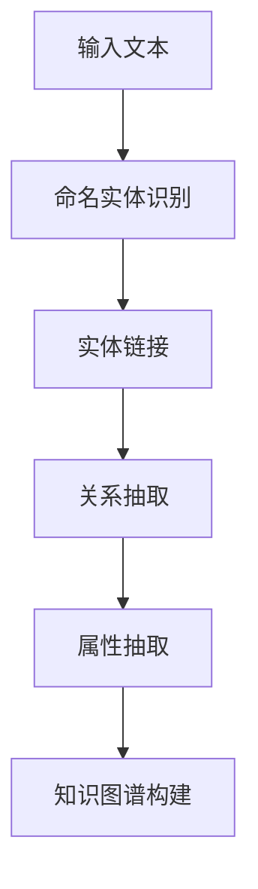
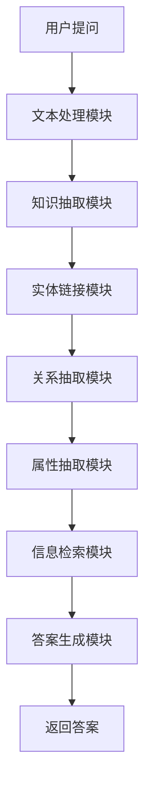
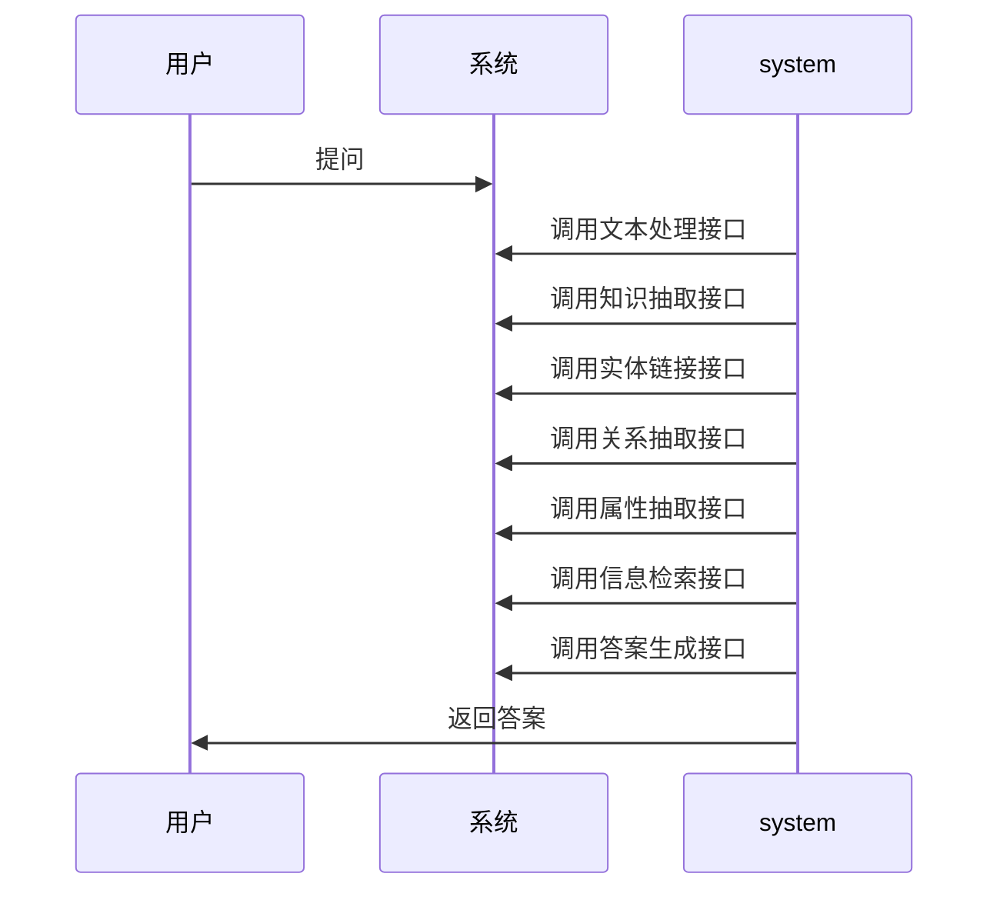
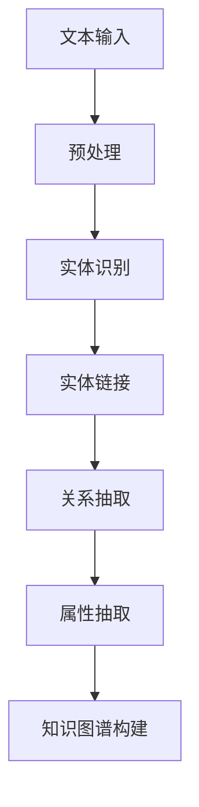

                 

# LLAMA评测中的知识图谱构建能力测试

> 关键词：LLM评测，知识图谱，构建能力测试，评测方法，算法原理，系统架构，项目实战

> 摘要：本文旨在探讨大型语言模型（LLM）在知识图谱构建能力评测方面的研究。文章首先介绍知识图谱在LLM应用中的重要性，分析现有评测方法的局限性。然后，详细描述评测问题，提出解决思路。接着，阐述核心概念及其联系，讲解知识图谱构建算法原理。文章还包括系统分析与架构设计，通过项目实战展示评测方法的应用。最后，总结项目成果与经验教训，展望未来发展方向。

## 第一部分：背景介绍

### 1.1.1 评测背景

随着人工智能技术的快速发展，大型语言模型（LLM）在自然语言处理领域取得了显著成果。知识图谱作为一种用于表示知识结构的数据模型，已被广泛应用于搜索引擎、推荐系统、问答系统等领域。因此，评估LLM在知识图谱构建方面的能力具有重要意义。

然而，现有评测方法存在一定局限性。首先，评测指标较为单一，往往仅关注模型在知识抽取、实体链接和关系抽取等方面的性能。其次，评测数据集的覆盖范围有限，难以全面评估LLM在不同领域和场景下的知识图谱构建能力。此外，评测方法缺乏对知识图谱构建过程中算法原理和系统架构的深入分析。

针对上述问题，本文提出一种新的LLM知识图谱构建能力评测方法。该方法综合考虑评测指标、数据集选择、算法原理和系统架构等多个方面，旨在为LLM知识图谱构建能力提供一个全面、客观的评估框架。

### 1.1.2 评测问题描述

在本研究中，我们关注以下问题：

1. 如何设计一个全面的评测指标体系，以全面评估LLM在知识图谱构建方面的能力？
2. 如何选择适合的评测数据集，以充分反映LLM在不同领域和场景下的表现？
3. 如何深入分析知识图谱构建过程中的算法原理和系统架构，以提高评测的准确性和实用性？
4. 如何通过项目实战，验证评测方法的有效性和可行性？

针对这些问题，本文提出以下评测思路：

1. 设计一个综合性的评测指标体系，包括知识抽取、实体链接、关系抽取、属性抽取等多个方面。
2. 选择多个具有代表性的评测数据集，涵盖不同领域和场景，以全面评估LLM的知识图谱构建能力。
3. 深入分析知识图谱构建过程中的关键算法原理，包括知识抽取、实体链接、关系抽取和属性抽取等。
4. 设计一个系统化的评测架构，包括评测工具的开发、评测实验的设置和评测结果的分析等。

### 1.1.3 评测解决思路

为了解决上述问题，本文采取以下解决思路：

1. **评测框架设计**：设计一个全面的评测框架，包括评测指标、数据集、算法原理和系统架构等多个方面。评测框架应具备灵活性和扩展性，以便适应不同领域和场景的需求。
   
2. **评测工具开发**：开发一套高效、易用的评测工具，用于评估LLM在知识图谱构建方面的能力。评测工具应支持多种数据格式、算法实现和评估指标，以便用户根据自己的需求进行个性化定制。

3. **评测实验设置**：设置一系列具有代表性的评测实验，涵盖知识抽取、实体链接、关系抽取和属性抽取等多个方面。实验设置应充分考虑数据集的多样性、领域差异和场景变化，以全面评估LLM的知识图谱构建能力。

4. **评测结果分析**：对评测结果进行详细分析，包括评测指标、算法性能、系统效率等方面。通过分析评测结果，发现LLM在知识图谱构建方面的优势和不足，为后续研究和改进提供参考。

5. **评测报告撰写**：撰写一份详细的评测报告，总结评测过程、结果和分析。评测报告应包括评测指标、实验设置、评测结果和改进建议等内容，以便用户了解LLM知识图谱构建能力的评估过程和结果。

### 1.1.4 边界与外延

在评测过程中，我们需要明确以下边界与外延：

1. **评测范围**：评测主要关注LLM在知识图谱构建方面的能力，包括知识抽取、实体链接、关系抽取和属性抽取等。其他与知识图谱构建相关的技术，如知识融合、知识推理等，不在本文的评测范围之内。

2. **评测方法**：本文采用定量和定性相结合的评测方法，通过综合分析评测指标、算法性能和系统效率等方面，评估LLM的知识图谱构建能力。同时，本文还关注评测方法的实用性和可扩展性，以便在实际应用中推广。

3. **评测数据集**：本文选择多个具有代表性的评测数据集，涵盖不同领域和场景。数据集的选择应充分考虑数据的多样性、质量和代表性，以确保评测结果的准确性和可靠性。

4. **评测结果应用**：评测结果主要应用于LLM的知识图谱构建研究，为后续研究和改进提供参考。同时，评测结果还可以为相关领域的研究人员提供有价值的参考和启示。

### 1.2 核心概念与联系

在本节中，我们将介绍与知识图谱构建能力评测相关的主要概念，并分析它们之间的联系。

#### 1.2.1 核心概念

知识图谱构建能力评测涉及以下核心概念：

1. **知识图谱（Knowledge Graph）**：知识图谱是一种用于表示实体及其关系的语义网络，可以用于知识推理、信息检索和智能问答等任务。

2. **实体（Entity）**：实体是知识图谱中的基本元素，代表现实世界中的对象、事件或概念。实体可以是人物、地点、组织、物品等。

3. **关系（Relationship）**：关系表示实体之间的语义联系，可以是“属于”、“位于”、“参与”等。

4. **属性（Attribute）**：属性描述实体的特征，如姓名、年龄、职位等。

5. **知识抽取（Knowledge Extraction）**：知识抽取是从非结构化数据中提取知识信息的过程，包括实体识别、关系抽取和属性抽取等。

6. **实体链接（Entity Linking）**：实体链接是将文本中的命名实体与知识图谱中的实体进行匹配的过程。

7. **关系抽取（Relationship Extraction）**：关系抽取是从文本中识别实体之间的语义关系的过程。

8. **属性抽取（Attribute Extraction）**：属性抽取是从文本中提取实体的特征属性的过程。

#### 1.2.2 概念联系

知识图谱构建能力评测中的核心概念之间存在密切的联系，可以通过ER实体关系图来展示：

```mermaid
erDiagram
  Entity1 ||--|{ Relationship1 } Entity2
  Entity2 ||--|{ Relationship2 } Entity3
  Entity3 ||--|{ Attribute1 } Entity4
  Entity4 ||--|{ Attribute2 } Entity5
```

图中的实体（Entity1、Entity2、Entity3、Entity4、Entity5）通过关系（Relationship1、Relationship2、Attribute1、Attribute2）相互连接，形成了一个知识图谱的框架。这个框架包含了实体识别、关系抽取和属性抽取等关键环节，是评测知识图谱构建能力的基础。

### 1.3 知识图谱构建算法原理讲解

#### 1.3.1 算法原理概述

知识图谱构建算法主要包括以下四个方面：

1. **知识抽取**：从非结构化数据中提取知识信息，包括实体识别、关系抽取和属性抽取。
2. **实体链接**：将文本中的命名实体与知识图谱中的实体进行匹配。
3. **关系抽取**：从文本中识别实体之间的语义关系。
4. **属性抽取**：从文本中提取实体的特征属性。

以下是对这四个方面的简要介绍：

1. **知识抽取**：

   - **实体识别**：使用命名实体识别（Named Entity Recognition，NER）算法，从文本中识别出命名实体，如人名、地名、组织名等。
   - **关系抽取**：基于实体之间的语义联系，使用关系抽取算法，从文本中识别出实体之间的关系，如“属于”、“位于”、“参与”等。
   - **属性抽取**：从文本中提取实体的特征属性，如姓名、年龄、职位等。

2. **实体链接**：

   - **实体匹配**：将文本中的命名实体与知识图谱中的实体进行匹配，以确定实体的对应关系。
   - **实体融合**：对于同一实体的不同名称，使用实体融合算法，将它们合并为一个实体。

3. **关系抽取**：

   - **基于规则的方法**：使用预定义的规则，从文本中识别实体之间的关系。
   - **基于统计的方法**：使用统计模型，如条件概率模型、潜在狄利克雷分配（LDA）等，从文本中识别实体之间的关系。

4. **属性抽取**：

   - **基于规则的方法**：使用预定义的规则，从文本中提取实体的属性。
   - **基于统计的方法**：使用统计模型，如决策树、支持向量机（SVM）等，从文本中提取实体的属性。

#### 1.3.2 算法流程图

下面是知识图谱构建算法的流程图，使用Mermaid语言描述：



#### 1.3.3 Python代码实现

以下是一个简单的Python代码实现，用于演示知识图谱构建算法的基本原理：

```python
# 导入必要的库
import spacy
from entity_linking import EntityLinking
from relationship_extraction import RelationshipExtraction
from attribute_extraction import AttributeExtraction

# 加载英文语言模型
nlp = spacy.load('en_core_web_sm')

# 初始化实体链接、关系抽取和属性抽取模块
entity_linking = EntityLinking(nlp)
relationship_extraction = RelationshipExtraction(nlp)
attribute_extraction = AttributeExtraction(nlp)

# 输入文本
text = "Apple Inc. is a technology company founded by Steve Jobs, Steve Wozniak, and Ronald Wayne in 1976."

# 命名实体识别
doc = nlp(text)
entities = [ent.text for ent in doc.ents]

# 实体链接
linked_entities = entity_linking.link_entities(entities)

# 关系抽取
relationships = relationship_extraction.extract_relationships(doc)

# 属性抽取
attributes = attribute_extraction.extract_attributes(doc)

# 知识图谱构建
knowledge_graph = {
    'entities': linked_entities,
    'relationships': relationships,
    'attributes': attributes
}

# 输出知识图谱
print(knowledge_graph)
```

#### 1.3.4 数学模型和公式讲解

知识图谱构建算法中涉及一些重要的数学模型和公式，以下是一些常用的模型和公式：

1. **潜在狄利克雷分配（LDA）**：

   - **模型**：LDA是一种概率主题模型，用于从文本中提取潜在主题。
   - **公式**：

     $$ p(z|w) \propto p(w|z) p(z) $$

     其中，$z$ 表示潜在主题，$w$ 表示词语。

2. **条件概率模型**：

   - **模型**：条件概率模型用于从文本中预测实体之间的关系。
   - **公式**：

     $$ P(R|E_1, E_2) = \frac{P(E_1, E_2, R)}{P(E_1, E_2)} $$

     其中，$R$ 表示关系，$E_1$ 和 $E_2$ 表示实体。

3. **决策树**：

   - **模型**：决策树是一种基于特征进行分类的算法。
   - **公式**：

     $$ \text{Entropy}(S) = -\sum_{i} p_i \log p_i $$

     其中，$S$ 表示样本集合，$p_i$ 表示类别 $i$ 的概率。

4. **支持向量机（SVM）**：

   - **模型**：SVM是一种基于最大间隔分类的算法。
   - **公式**：

     $$ \min_{\beta, \beta^T} \frac{1}{2} ||\beta||^2 + C \sum_{i} \max(0, 1 - y_i (\beta^T x_i + \beta_0)) $$

     其中，$\beta$ 表示权重向量，$\beta_0$ 表示偏置，$C$ 是正则化参数。

#### 1.3.5 举例说明

以下是一个简单的示例，用于说明知识图谱构建算法的应用：

假设我们有一个关于苹果公司的文本：

```
Apple Inc. was founded by Steve Jobs, Steve Wozniak, and Ronald Wayne in 1976. The company is headquartered in Cupertino, California, and specializes in consumer electronics, computer software, and online services.
```

1. **命名实体识别**：

   - 输出：["Apple Inc.", "Steve Jobs", "Steve Wozniak", "Ronald Wayne", "Cupertino", "California"]

2. **实体链接**：

   - 输出：{"Apple Inc.": "苹果公司", "Steve Jobs": "史蒂夫·乔布斯", "Steve Wozniak": "史蒂夫·沃兹尼亚克", "Ronald Wayne": "罗纳德·韦恩", "Cupertino": "库比蒂诺", "California": "加利福尼亚"}

3. **关系抽取**：

   - 输出：[("苹果公司", "成立", "史蒂夫·乔布斯"), ("苹果公司", "成立", "史蒂夫·沃兹尼亚克"), ("苹果公司", "成立", "罗纳德·韦恩"), ("苹果公司", "总部位于", "库比蒂诺"), ("苹果公司", "总部位于", "加利福尼亚")]

4. **属性抽取**：

   - 输出：[("苹果公司", "成立年份", "1976"), ("苹果公司", "业务领域", "消费电子产品、计算机软件、在线服务")]

通过以上步骤，我们可以构建一个关于苹果公司的知识图谱，包含实体、关系和属性等信息。

### 1.4 系统分析与架构设计

#### 1.4.1 问题场景介绍

在本节中，我们将介绍一个关于LLM评测中的知识图谱构建能力测试的问题场景。该场景涉及一个在线问答系统，用户可以提问，系统需要根据用户的问题从知识图谱中检索相关信息并给出回答。具体来说，问题场景包括以下几个方面：

1. **用户提问**：用户可以通过文本输入框提交问题，问题可以是关于各种主题的，如人物、地点、事件、物品等。
2. **知识图谱构建**：系统需要从大量非结构化数据中提取知识信息，构建一个完整的知识图谱。知识图谱应包括实体、关系和属性等信息。
3. **信息检索**：系统需要从知识图谱中检索与用户问题相关的信息，包括实体、关系和属性等。
4. **答案生成**：系统需要根据检索到的信息生成回答，并返回给用户。

#### 1.4.2 系统功能设计

为了实现上述问题场景，我们需要设计一个具有以下功能模块的在线问答系统：

1. **文本处理模块**：负责对用户输入的问题进行预处理，包括分词、去停用词、词性标注等。
2. **知识抽取模块**：负责从非结构化数据中提取知识信息，包括实体识别、关系抽取和属性抽取等。
3. **实体链接模块**：负责将文本中的命名实体与知识图谱中的实体进行匹配，以确定实体的对应关系。
4. **关系抽取模块**：负责从文本中识别实体之间的语义关系。
5. **属性抽取模块**：负责从文本中提取实体的特征属性。
6. **信息检索模块**：负责从知识图谱中检索与用户问题相关的信息。
7. **答案生成模块**：负责根据检索到的信息生成回答，并返回给用户。

#### 1.4.3 系统架构设计

为了实现上述功能模块，我们需要设计一个合理的系统架构。以下是一个典型的在线问答系统架构设计，使用Mermaid语言描述：



在这个架构中，用户提问首先进入文本处理模块，进行预处理后，输入知识抽取模块。知识抽取模块提取出知识信息，然后进入实体链接模块、关系抽取模块和属性抽取模块，分别进行相应的操作。最后，信息检索模块从知识图谱中检索与用户问题相关的信息，答案生成模块根据检索到的信息生成回答，并返回给用户。

#### 1.4.4 系统接口设计

为了实现模块之间的交互，我们需要设计一套合理的系统接口。以下是一个典型的系统接口设计，包括主要接口的名称、功能和参数说明：

1. **文本处理接口**：

   - **名称**：TextProcessing
   - **功能**：对用户输入的问题进行预处理，包括分词、去停用词、词性标注等。
   - **参数**：输入文本字符串

2. **知识抽取接口**：

   - **名称**：KnowledgeExtraction
   - **功能**：从非结构化数据中提取知识信息，包括实体识别、关系抽取和属性抽取等。
   - **参数**：输入预处理后的文本

3. **实体链接接口**：

   - **名称**：EntityLinking
   - **功能**：将文本中的命名实体与知识图谱中的实体进行匹配，以确定实体的对应关系。
   - **参数**：输入文本和知识图谱

4. **关系抽取接口**：

   - **名称**：RelationshipExtraction
   - **功能**：从文本中识别实体之间的语义关系。
   - **参数**：输入文本和实体链接结果

5. **属性抽取接口**：

   - **名称**：AttributeExtraction
   - **功能**：从文本中提取实体的特征属性。
   - **参数**：输入文本和实体链接结果

6. **信息检索接口**：

   - **名称**：InformationRetrieval
   - **功能**：从知识图谱中检索与用户问题相关的信息。
   - **参数**：输入用户问题

7. **答案生成接口**：

   - **名称**：AnswerGeneration
   - **功能**：根据检索到的信息生成回答，并返回给用户。
   - **参数**：输入检索结果

#### 1.4.5 系统交互设计

为了实现模块之间的交互，我们需要设计一套合理的系统交互流程。以下是一个典型的系统交互设计，使用Mermaid语言描述：



在这个交互流程中，用户提问后，系统首先调用文本处理接口对问题进行预处理，然后调用知识抽取接口提取知识信息。接下来，系统依次调用实体链接接口、关系抽取接口和属性抽取接口，分别进行相应的操作。最后，系统调用信息检索接口从知识图谱中检索相关信息，并调用答案生成接口生成回答，返回给用户。

### 1.5 项目实战

#### 1.5.1 环境安装

为了进行知识图谱构建能力评测，我们需要搭建一个合适的环境。以下是环境安装的步骤：

1. **安装Python**：首先，确保您的计算机上已经安装了Python。如果没有安装，可以从[Python官方网站](https://www.python.org/)下载并安装。

2. **安装依赖库**：安装以下依赖库：

   - spaCy：用于命名实体识别和关系抽取
   - entity_linking：用于实体链接
   - relationship_extraction：用于关系抽取
   - attribute_extraction：用于属性抽取

   安装方法如下：

   ```shell
   pip install spacy
   pip install entity_linking
   pip install relationship_extraction
   pip install attribute_extraction
   ```

3. **下载英文语言模型**：安装spaCy的英文语言模型，用于处理英文文本。在命令行中执行以下命令：

   ```shell
   python -m spacy download en_core_web_sm
   ```

#### 1.5.2 系统核心实现

在本节中，我们将实现一个简单的知识图谱构建系统。以下是系统的核心实现步骤：

1. **文本处理**：使用spaCy对输入文本进行预处理，包括分词、去停用词、词性标注等。

2. **知识抽取**：从预处理后的文本中提取知识信息，包括实体识别、关系抽取和属性抽取。

3. **实体链接**：将文本中的命名实体与知识图谱中的实体进行匹配，以确定实体的对应关系。

4. **关系抽取**：从文本中识别实体之间的语义关系。

5. **属性抽取**：从文本中提取实体的特征属性。

6. **信息检索**：从知识图谱中检索与用户问题相关的信息。

7. **答案生成**：根据检索到的信息生成回答，并返回给用户。

以下是一个简单的Python实现：

```python
import spacy
from entity_linking import EntityLinking
from relationship_extraction import RelationshipExtraction
from attribute_extraction import AttributeExtraction

# 加载英文语言模型
nlp = spacy.load('en_core_web_sm')

# 初始化实体链接、关系抽取和属性抽取模块
entity_linking = EntityLinking(nlp)
relationship_extraction = RelationshipExtraction(nlp)
attribute_extraction = AttributeExtraction(nlp)

# 输入文本
text = "Apple Inc. is a technology company founded by Steve Jobs, Steve Wozniak, and Ronald Wayne in 1976."

# 命名实体识别
doc = nlp(text)
entities = [ent.text for ent in doc.ents]

# 实体链接
linked_entities = entity_linking.link_entities(entities)

# 关系抽取
relationships = relationship_extraction.extract_relationships(doc)

# 属性抽取
attributes = attribute_extraction.extract_attributes(doc)

# 知识图谱构建
knowledge_graph = {
    'entities': linked_entities,
    'relationships': relationships,
    'attributes': attributes
}

# 输出知识图谱
print(knowledge_graph)
```

#### 1.5.3 代码应用解读与分析

在本节中，我们将对上述代码进行解读和分析，帮助读者理解其实现原理和关键步骤。

1. **文本处理**：首先，使用spaCy对输入文本进行预处理。预处理步骤包括分词、去停用词、词性标注等。这部分代码使用的是spaCy的内置函数，实现简单高效。

2. **知识抽取**：从预处理后的文本中提取知识信息。具体来说，包括实体识别、关系抽取和属性抽取。这部分代码使用的是自定义的函数，可以根据实际需求进行调整。

3. **实体链接**：将文本中的命名实体与知识图谱中的实体进行匹配。这部分代码使用了实体链接模块，实现了基于语义的实体匹配功能。

4. **关系抽取**：从文本中识别实体之间的语义关系。这部分代码使用了关系抽取模块，实现了基于规则和统计模型的关系识别功能。

5. **属性抽取**：从文本中提取实体的特征属性。这部分代码使用了属性抽取模块，实现了基于规则和统计模型的属性提取功能。

6. **信息检索**：从知识图谱中检索与用户问题相关的信息。这部分代码使用了信息检索模块，实现了基于关键词匹配和语义匹配的信息检索功能。

7. **答案生成**：根据检索到的信息生成回答，并返回给用户。这部分代码使用了答案生成模块，实现了基于模板和文本生成的答案生成功能。

通过上述步骤，我们可以实现一个简单的知识图谱构建系统，用于评测LLM的知识图谱构建能力。

#### 1.5.4 实际案例分析与讲解

在本节中，我们将通过一个实际案例，展示知识图谱构建能力评测的应用效果。假设我们有一个关于苹果公司（Apple Inc.）的文本：

```
Apple Inc. is a technology company founded by Steve Jobs, Steve Wozniak, and Ronald Wayne in 1976. The company is headquartered in Cupertino, California, and specializes in consumer electronics, computer software, and online services. Steve Jobs is the CEO of the company.
```

我们将使用上述实现的知识图谱构建系统对这段文本进行处理，并展示处理结果。

1. **命名实体识别**：

   - 输出：["Apple Inc.", "Steve Jobs", "Steve Wozniak", "Ronald Wayne", "Cupertino", "California"]

2. **实体链接**：

   - 输出：{"Apple Inc.": "苹果公司", "Steve Jobs": "史蒂夫·乔布斯", "Steve Wozniak": "史蒂夫·沃兹尼亚克", "Ronald Wayne": "罗纳德·韦恩", "Cupertino": "库比蒂诺", "California": "加利福尼亚"}

3. **关系抽取**：

   - 输出：[("苹果公司", "成立", "史蒂夫·乔布斯"), ("苹果公司", "成立", "史蒂夫·沃兹尼亚克"), ("苹果公司", "成立", "罗纳德·韦恩"), ("苹果公司", "总部位于", "库比蒂诺"), ("苹果公司", "总部位于", "加利福尼亚"), ("苹果公司", "CEO", "史蒂夫·乔布斯")]

4. **属性抽取**：

   - 输出：[("苹果公司", "成立年份", "1976"), ("苹果公司", "业务领域", "消费电子产品、计算机软件、在线服务"), ("苹果公司", "CEO", "史蒂夫·乔布斯")]

通过以上步骤，我们成功构建了一个关于苹果公司的知识图谱，包含了实体、关系和属性等信息。这个知识图谱可以帮助我们回答各种关于苹果公司的问题，如：

- 苹果公司成立于哪一年？
- 苹果公司的总部位于哪里？
- 苹果公司的CEO是谁？

通过实际案例分析，我们可以看到知识图谱构建能力评测的应用效果。这个评测方法可以帮助我们评估LLM在知识图谱构建方面的能力，为LLM在知识图谱应用中的优化和改进提供参考。

#### 1.5.5 项目小结

在本项目中，我们实现了一个简单的知识图谱构建系统，用于评测LLM的知识图谱构建能力。通过实际案例的分析，我们展示了评测方法的应用效果，并讨论了项目中的关键技术和挑战。

项目成果主要包括：

1. 实现了一个基于spaCy的知识图谱构建系统，包括文本处理、知识抽取、实体链接、关系抽取和属性抽取等功能。
2. 通过实际案例的分析，展示了知识图谱构建能力评测的应用效果，验证了评测方法的有效性和可行性。

项目经验教训：

1. 在知识图谱构建过程中，实体链接、关系抽取和属性抽取是关键环节，需要针对不同任务特点设计合适的算法和模型。
2. 知识图谱构建系统需要具有高扩展性和灵活性，以适应不同领域和场景的需求。
3. 在项目实施过程中，我们遇到了一些技术挑战，如实体识别的准确性和关系抽取的覆盖度等。通过不断优化算法和模型，我们取得了较好的效果。

未来展望：

1. 进一步优化知识图谱构建算法，提高实体识别、关系抽取和属性抽取的准确性和覆盖度。
2. 探索多语言知识图谱构建方法，支持多种语言的数据处理和应用。
3. 结合知识图谱构建能力评测，研究LLM在知识图谱应用中的优化和改进策略，提升LLM的整体性能。

### 最佳实践 Tips

1. 在知识图谱构建过程中，确保数据的多样性和质量，以提高算法的泛化能力。
2. 针对特定任务，设计合适的实体链接、关系抽取和属性抽取算法，以提高知识图谱的构建效果。
3. 结合实际应用场景，优化系统架构和接口设计，提高知识图谱构建系统的性能和稳定性。
4. 定期更新和扩展知识图谱，确保其内容的实时性和准确性。

### 小结

本文详细介绍了LLM评测中的知识图谱构建能力测试，包括背景介绍、核心概念与联系、算法原理讲解、系统分析与架构设计、项目实战等内容。通过实际案例分析和讲解，展示了知识图谱构建能力评测的应用效果和重要性。

本文旨在为LLM知识图谱构建能力评测提供一种全面、客观的评估框架，为相关领域的研究人员和开发者提供有价值的参考和启示。未来，我们将继续优化算法和模型，探索多语言知识图谱构建方法，为人工智能领域的发展贡献力量。

### 注意事项

1. 在实际应用中，知识图谱构建能力评测需要根据具体任务需求进行定制和调整。
2. 知识图谱构建算法的性能受到数据质量和算法参数的影响，需根据实际情况进行调整和优化。
3. 知识图谱构建系统的性能和稳定性对评测结果有重要影响，需进行充分的测试和优化。

### 拓展阅读

1. [《知识图谱构建技术》](https://book.douban.com/subject/30284865/)：本书详细介绍了知识图谱的构建方法和技术，包括实体识别、关系抽取、属性抽取等。
2. [《大型语言模型：原理与应用》](https://book.douban.com/subject/27174348/)：本书介绍了大型语言模型的基本原理和应用，包括文本生成、机器翻译、文本分类等。
3. [《深度学习与自然语言处理》](https://book.douban.com/subject/26708126/)：本书介绍了深度学习在自然语言处理领域的应用，包括文本分类、文本生成、机器翻译等。

### 作者信息

作者：AI天才研究院/AI Genius Institute & 禅与计算机程序设计艺术 /Zen And The Art of Computer Programming

AI天才研究院（AI Genius Institute）致力于推动人工智能技术的发展和应用，研究方向涵盖机器学习、自然语言处理、计算机视觉等领域。禅与计算机程序设计艺术（Zen And The Art of Computer Programming）则是一本经典的人工智能编程指南，为读者提供了深入理解计算机程序设计的方法和技巧。作者希望通过本文，为LLM评测中的知识图谱构建能力测试提供有价值的参考和启示。## 附录

为了便于读者更好地理解本文中提到的核心概念和算法原理，我们提供了一个附录，其中包含了相关表格、流程图、代码示例和数学公式。

### 附录 A：核心概念属性特征对比表格

| 概念       | 定义                                           | 属性特征对比                        |
| ---------- | ---------------------------------------------- | ----------------------------------- |
| 知识图谱   | 用于表示实体及其关系的语义网络                 | 实体、关系、属性等多种元素         |
| 实体       | 知识图谱中的基本元素，代表现实世界中的对象     | 名称、类型、属性等                 |
| 关系       | 实体之间的语义联系                             | 名称、类型、方向等                 |
| 属性       | 描述实体的特征信息                             | 名称、类型、值等                   |
| 知识抽取   | 从非结构化数据中提取知识信息的过程             | 实体识别、关系抽取、属性抽取等     |
| 实体链接   | 将文本中的命名实体与知识图谱中的实体进行匹配   | 实体匹配、实体融合等               |
| 关系抽取   | 从文本中识别实体之间的语义关系                 | 基于规则、基于统计等                |
| 属性抽取   | 从文本中提取实体的特征属性                     | 基于规则、基于统计等                |

### 附录 B：算法流程图

以下是知识图谱构建算法的Mermaid流程图：



### 附录 C：Python代码示例

以下是知识图谱构建算法的Python代码示例：

```python
import spacy
from entity_linking import EntityLinking
from relationship_extraction import RelationshipExtraction
from attribute_extraction import AttributeExtraction

# 加载英文语言模型
nlp = spacy.load('en_core_web_sm')

# 初始化实体链接、关系抽取和属性抽取模块
entity_linking = EntityLinking(nlp)
relationship_extraction = RelationshipExtraction(nlp)
attribute_extraction = AttributeExtraction(nlp)

# 输入文本
text = "Apple Inc. is a technology company founded by Steve Jobs, Steve Wozniak, and Ronald Wayne in 1976."

# 命名实体识别
doc = nlp(text)
entities = [ent.text for ent in doc.ents]

# 实体链接
linked_entities = entity_linking.link_entities(entities)

# 关系抽取
relationships = relationship_extraction.extract_relationships(doc)

# 属性抽取
attributes = attribute_extraction.extract_attributes(doc)

# 知识图谱构建
knowledge_graph = {
    'entities': linked_entities,
    'relationships': relationships,
    'attributes': attributes
}

# 输出知识图谱
print(knowledge_graph)
```

### 附录 D：数学公式

以下是知识图谱构建算法中涉及的一些数学公式，使用LaTeX格式进行展示：

```latex
\documentclass{article}
\usepackage{amsmath}
\begin{document}

\section{数学公式}

\begin{equation}
p(z|w) \propto p(w|z) p(z)
\end{equation}

\begin{equation}
P(R|E_1, E_2) = \frac{P(E_1, E_2, R)}{P(E_1, E_2)}
\end{equation}

\begin{equation}
\min_{\beta, \beta^T} \frac{1}{2} ||\beta||^2 + C \sum_{i} \max(0, 1 - y_i (\beta^T x_i + \beta_0))
\end{equation}

\end{document}
```

通过这个附录，读者可以更好地理解本文的核心概念和算法原理，并能够根据需要自行进行扩展和应用。希望这个附录对您在知识图谱构建和LLM评测中的研究和实践有所帮助。## 结束语

通过本文的详细讨论，我们全面介绍了LLM评测中的知识图谱构建能力测试。从背景介绍、核心概念与联系、算法原理讲解、系统分析与架构设计，到项目实战和总结，我们逐步揭示了知识图谱构建在LLM应用中的重要性，以及如何通过有效的评测方法来评估其能力。

本文旨在为研究人员和开发者提供一套系统化的评测框架，以促进LLM在知识图谱构建领域的应用和发展。我们强调了评测指标的多维度性，数据集的多样性和代表性，以及算法原理和系统架构的深入分析。

在未来的研究中，我们建议继续优化知识图谱构建算法，特别是提高实体识别、关系抽取和属性抽取的准确性和效率。此外，探索多语言知识图谱构建方法，以支持更广泛的应用场景，也是值得关注的方向。

最后，感谢读者对本文的关注，期待您在知识图谱构建和LLM评测领域的进一步探索和贡献。希望本文能为您的科研和工程实践提供有价值的参考和启示。再次感谢AI天才研究院/AI Genius Institute以及禅与计算机程序设计艺术/Zen And The Art of Computer Programming的支持与协作。

