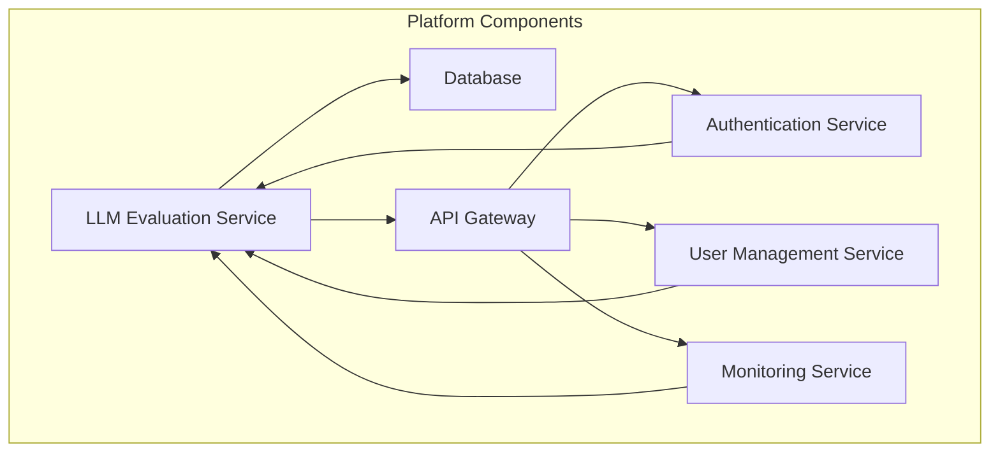
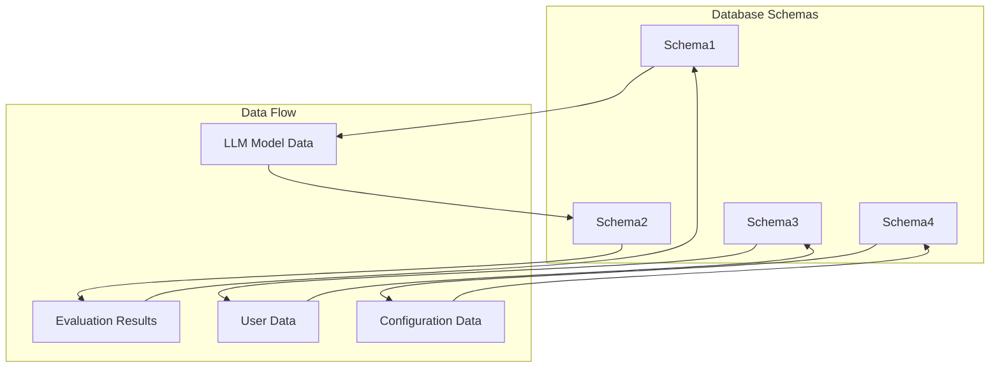
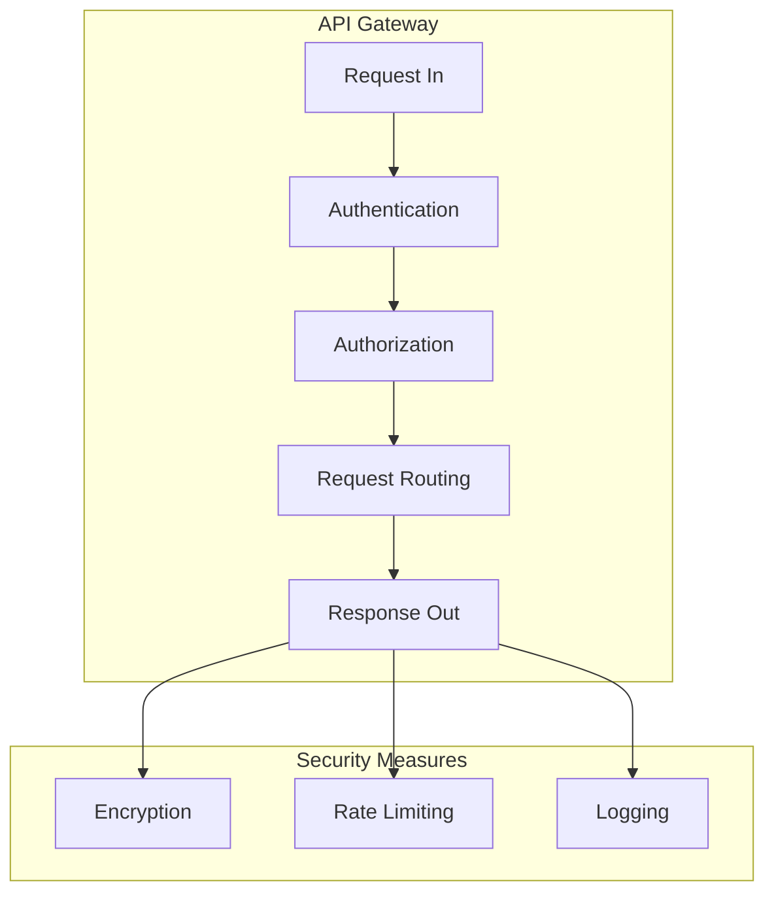

                 

### Introduction to LLM Evaluation and Multitenant SaaS Platform Design

#### 1.1 Overview of Large Language Model (LLM) Evaluation

Large Language Models (LLMs) have revolutionized the field of Natural Language Processing (NLP) by enabling machines to generate coherent and contextually relevant text. The significance of LLM evaluation lies in its role in ensuring the models' performance meets the desired standards and applications. LLM evaluation involves assessing various aspects of the model, such as its ability to generate accurate, coherent, and contextually relevant text.

Key challenges in LLM evaluation include:

1. **Quality Assessment**: Assessing the quality of generated text is subjective and can vary depending on the context and application. This makes it challenging to establish a universal metric for evaluation.
2. **Scalability**: As LLMs become larger and more complex, evaluating them becomes more computationally expensive and time-consuming.
3. **Diversity**: Ensuring that the evaluation process captures the diversity of language use across different domains and applications is crucial but challenging.
4. **Robustness**: Testing the robustness of LLMs against adversarial attacks, such as toxic language detection, is an essential aspect of evaluation but often overlooked.

#### 1.2 Understanding Multitenant SaaS Platform

Multitenancy is a design pattern in software architecture where a single instance of an application serves multiple customers (tenants) simultaneously. In a multitenant SaaS (Software as a Service) platform, different customers share the same application instance, which is separated by a tenant ID. This approach offers several benefits, including cost savings, scalability, and flexibility.

Key components of a multitenant SaaS platform architecture include:

1. **Tenant Separation**: Ensuring data and configuration isolation between tenants.
2. **Shared Resources**: Efficiently managing shared resources like databases, servers, and networking.
3. **APIs and Authentication**: Providing secure and controlled access to services for each tenant.
4. **Scalability and Performance**: Designing the platform to handle a large number of tenants without compromising performance.

#### 1.3 Objectives and Structure of the Book

This book aims to provide a comprehensive guide to designing a multitenant SaaS platform for LLM evaluation. It covers the following key topics:

- **Core Concepts and Principles of Multitenant Architecture**: Understanding the foundational principles and design patterns of multitenant SaaS platforms.
- **LLM Evaluation Metrics**: Exploring various evaluation metrics used in LLM evaluation and their significance.
- **Architectural Design of the LLM Evaluation Platform**: Detailed architecture design and implementation strategies for a multitenant SaaS platform for LLM evaluation.
- **Evaluation Methods and Tools**: Discussing methods and tools for evaluating LLMs in a multitenant SaaS platform.
- **Best Practices and Case Studies**: Providing best practices and real-world examples of LLM evaluation in a multitenant SaaS platform.

The book is structured into five chapters, each focusing on different aspects of the design and evaluation of LLMs in a multitenant SaaS platform. The following chapters will delve deeper into these topics, providing practical insights and case studies to help readers understand and implement these concepts effectively.

### Core Concepts and Principles of Multitenant SaaS Platform Design

#### 2.1 Key Principles of Multitenant Architecture

Multitenant architecture is built on several core principles that ensure scalability, security, and flexibility. These principles include:

1. **Tenant Separation**: The primary principle of multitenancy is to isolate tenant data and configurations. This is typically achieved using a tenant ID that identifies each tenant's unique data and settings. Tenant separation ensures that each tenant's data remains private and secure, even when multiple tenants share the same application instance.

2. **Shared Resources**: Efficiently managing shared resources is crucial for a multitenant SaaS platform. This involves optimizing resource allocation to ensure that each tenant receives the required resources without impacting the performance of other tenants. Techniques such as load balancing, caching, and horizontal scaling are commonly used to achieve this.

3. **Scalability**: Multitenant architectures must be designed to handle a large number of tenants and a growing number of users. This involves designing the platform to be horizontally scalable, meaning that additional servers or instances can be added to handle increased demand. Scalability ensures that the platform can grow with the business without compromising performance or security.

4. **Security**: Ensuring data security and compliance with regulations is critical in a multitenant environment. This involves implementing robust authentication and authorization mechanisms, encrypting data in transit and at rest, and regularly auditing the system for vulnerabilities.

5. **Flexibility**: Multitenant platforms should be flexible enough to accommodate various tenant needs and preferences. This includes providing customizable features, integration capabilities, and the ability to adapt to different business models.

#### 2.2 LLM Evaluation Metrics

Effective LLM evaluation requires a set of well-defined metrics that can assess various aspects of the model's performance. Here are some common metrics used in LLM evaluation:

1. **Perplexity (PPL)**: Perplexity is a measure of how well an LLM predicts the next word in a given sequence. A lower perplexity indicates a better predictive performance. The formula for perplexity is:

   $$ PPL = \frac{1}{N} \sum_{i=1}^{N} \frac{1}{p(w_i|w_{1:i-1})} $$

   where \( N \) is the length of the sequence, and \( p(w_i|w_{1:i-1}) \) is the probability of word \( w_i \) given the previous words \( w_{1:i-1} \).

2. **Word Error Rate (WER)**: Word Error Rate is commonly used in speech recognition to measure the accuracy of a model's output. In LLM evaluation, WER can be adapted to measure the accuracy of text generation. The formula for WER is:

   $$ WER = \frac{D}{L} $$

   where \( D \) is the number of deleted, inserted, or substituted words, and \( L \) is the total number of words in the reference text.

3. **BLEU Score**: BLEU (Bilingual Evaluation Understudy) is a metric used to evaluate the similarity between the generated text and the reference text. BLEU is based on the overlap of n-grams (contiguous sequences of n words) between the generated text and the reference text. The BLEU score ranges from 0 to 1, with higher scores indicating better similarity.

   $$ BLEU = \frac{\sum_{n=1}^{4} \max(0, \text{score}_{n})}{4} $$

   where \( \text{score}_{n} \) is the score for each n-gram overlap (unigram, bigram, trigram, and quadgram).

4. **ROUGE Score**: ROUGE (Recall-Oriented Understudy for Gisting Evaluation) is another metric used to evaluate the similarity between the generated text and the reference text. ROUGE focuses on the recall of words and phrases from the reference text in the generated text. There are different versions of ROUGE, including ROUGE-1, ROUGE-2, and ROUGE-L, each measuring different aspects of similarity.

5. **Clarity and Coherence**: In addition to quantitative metrics, evaluating the clarity and coherence of the generated text is essential. This can be done through human evaluation or by using more advanced metrics such as text coherence scores and naturalness metrics.

#### 2.3 Theoretical Framework for SaaS Platform Design

The design of a multitenant SaaS platform can be guided by several theoretical frameworks, including Service-Oriented Architecture (SOA) and Microservices Architecture. These frameworks provide a set of principles and best practices for building scalable, flexible, and maintainable systems.

**Service-Oriented Architecture (SOA)**:

SOA is an architectural style that emphasizes the use of services to create a loosely coupled system. Key principles of SOA include:

1. **Service Orientation**: Services are self-contained, modular components that perform a specific function and communicate via well-defined interfaces.
2. **Modularity**: Services are designed to be modular, allowing for easy integration and replacement of individual components without affecting the entire system.
3. ** Loose Coupling**: Services are loosely coupled, meaning that they communicate through standardized interfaces, reducing dependencies and enabling independent evolution of components.
4. **Reusability**: Services are designed to be reusable across different applications and scenarios.

**Microservices Architecture**:

Microservices is a architectural style that structures an application as a collection of loosely coupled services, each running in its own process and communicating with lightweight mechanisms, typically HTTP-based RESTful APIs. Key principles of microservices include:

1. **Decentralized Data Management**: Each microservice typically has its own database, reducing coupling between services and simplifying data management.
2. **Autonomous Services**: Each microservice is autonomous, meaning that it can be developed, deployed, and scaled independently.
3. **Single Responsibility**: Each microservice has a single responsibility, making it easier to understand, test, and maintain.
4. **Decentralized Governance**: Governance is decentralized, with each microservice team responsible for its own set of rules and standards.

Both SOA and microservices provide a robust framework for designing and implementing multitenant SaaS platforms. They promote modularity, reusability, and scalability, which are critical for managing the complexity of large-scale systems. The choice between SOA and microservices depends on the specific needs and constraints of the project, as well as the organization's culture and skills.

### Architectural Design of the LLM Evaluation Multitenant SaaS Platform

#### 3.1 Platform Architecture Overview

The LLM Evaluation Multitenant SaaS Platform is designed to provide a flexible, scalable, and secure environment for evaluating large language models (LLMs). The platform's architecture is designed to handle multiple tenants simultaneously, ensuring data privacy and efficient resource utilization. A high-level overview of the platform's architecture is shown in the following diagram:

**Key Components and Their Interactions**:

1. **LLM Evaluation Service**: This is the core service of the platform, responsible for evaluating LLMs using various metrics and tools. It interacts with the database to store and retrieve evaluation results and with the API Gateway to handle incoming requests from tenants.

2. **Database**: The database stores tenant-specific data, including LLM models, evaluation results, and configuration settings. It is designed to support high availability and scalability, ensuring that tenant data is securely and reliably stored.

3. **API Gateway**: The API Gateway acts as a single entry point for all incoming requests to the platform. It handles authentication, routing, and load balancing, ensuring that requests are efficiently distributed to the appropriate services.

4. **Authentication Service**: The Authentication Service is responsible for managing user authentication and authorization. It ensures that only authorized users can access the platform and its resources.

5. **User Management Service**: The User Management Service handles user registration, profile management, and role-based access control. It allows tenants to manage their users and define their permissions within the platform.

6. **Monitoring Service**: The Monitoring Service collects and analyzes data from various components of the platform, providing insights into performance, security, and resource utilization. It helps in identifying and addressing potential issues before they impact the users.

#### 3.2 Detailed Architecture Design

**Database Design and Data Flow**:

The database design is a critical aspect of the platform, ensuring that tenant data is securely and efficiently managed. The database is organized into multiple schemas, each corresponding to a different tenant. The following diagram illustrates the database schema and data flow:

**API Design and Security Considerations**:

The API design is critical for ensuring secure and efficient interaction between the platform components and external clients. The API Gateway handles all incoming requests, enforcing authentication and authorization policies. The following diagram illustrates the API design and security considerations:

**Design Patterns and Best Practices**:

Several design patterns and best practices are employed in the platform's architecture to ensure scalability, maintainability, and robustness. Some of these include:

1. **Microservices Architecture**: The platform is designed using a microservices architecture, with each service encapsulating a specific functionality. This allows for independent development, deployment, and scaling of individual services.

2. **CQRS (Command Query Responsibility Segregation)**: The platform employs a CQRS pattern, where separate read and write models are used to optimize performance and scalability. The read model is optimized for querying, while the write model is optimized for updating data.

3. **Event Sourcing**: The platform uses event sourcing to maintain a log of all changes to the system state. This allows for easy rollback, auditing, and replaying of events, enhancing the platform's reliability and auditability.

4. **Containerization and Orchestration**: Services are containerized using Docker and orchestrated using Kubernetes. This enables efficient deployment, scaling, and management of the platform in a cloud environment.

5. **API Versioning**: The API is versioned to allow for backward compatibility and seamless upgrades without impacting existing clients.

By following these design patterns and best practices, the platform is designed to be scalable, secure, and maintainable, providing a robust environment for LLM evaluation.

### Methods and Tools for LLM Evaluation in Multitenant SaaS Platforms

#### 4.1 Evaluation Methodologies

Effective evaluation of Large Language Models (LLMs) in a multitenant SaaS platform requires a combination of offline and online evaluation methods. These methods help assess various aspects of the model's performance, including accuracy, coherence, and robustness.

**Offline Evaluation Methods**:

Offline evaluation methods involve comparing the generated text by the LLM to reference or ground truth data. Common offline evaluation metrics include:

1. **Perplexity (PPL)**: As discussed earlier, perplexity measures how well an LLM predicts the next word in a given sequence. Lower perplexity values indicate better predictive performance.

2. **Word Error Rate (WER)**: WER is a metric used in speech recognition to measure the accuracy of a model's output. It can also be adapted for text generation by comparing the generated text to the reference text.

3. **BLEU Score**: BLEU (Bilingual Evaluation Understudy) is a metric used to evaluate the similarity between the generated text and the reference text. BLEU is based on the overlap of n-grams between the generated text and the reference text.

4. **ROUGE Score**: ROUGE (Recall-Oriented Understudy for Gisting Evaluation) is another metric used to evaluate the similarity between the generated text and the reference text. ROUGE focuses on the recall of words and phrases from the reference text in the generated text.

5. **Human Evaluation**: Human evaluation involves having human annotators rate the quality of the generated text. This method provides subjective insights into the model's performance but can be time-consuming and costly.

**Online Evaluation Methods**:

Online evaluation methods involve monitoring the model's performance in real-world scenarios. This can be challenging in a multitenant SaaS platform due to data privacy and ethical considerations. However, some approaches include:

1. **A/B Testing**: A/B testing involves deploying two versions of the model (A and B) to different groups of users and comparing their performance. This can help identify which version provides better results in real-world usage.

2. **Feedback Loop**: Collecting user feedback and incorporating it into the model's training process can help improve the model's performance over time. This approach is often used in applications where user interaction is critical, such as chatbots and virtual assistants.

3. **Active Learning**: Active learning involves selectively choosing the most informative samples for model training based on their predicted uncertainty. This approach can improve model performance while reducing the amount of labeled data required.

**Comparing Offline and Online Evaluation**:

Offline evaluation methods are typically faster and more cost-effective to implement. However, they may not fully capture the real-world performance of the model. Online evaluation methods, while more expensive and complex to implement, provide a better understanding of the model's performance in actual usage scenarios.

**Challenges and Considerations**:

1. **Data Privacy**: Ensuring data privacy and compliance with regulations is crucial in a multitenant environment. Care must be taken to anonymize and secure user data during online evaluation.

2. **Model Variance**: Variance in model performance due to differences in user behavior and data distribution can make online evaluation challenging.

3. **Scalability**: Online evaluation methods may require significant computational resources and infrastructure to handle large-scale user interactions.

4. **Ethical Considerations**: Collecting user feedback and evaluating model performance in real-world scenarios may raise ethical concerns, such as bias and fairness. Ensuring that these issues are addressed is essential for building trustworthy AI systems.

By employing a combination of offline and online evaluation methods, developers can gain a comprehensive understanding of LLM performance in a multitenant SaaS platform. This understanding is critical for optimizing model performance and ensuring that the platform delivers high-quality results to its users.

### Methods and Tools for LLM Evaluation in Multitenant SaaS Platforms

#### 4.2 Evaluation Methods

When evaluating LLMs in a multitenant SaaS platform, it is crucial to select methods that provide a comprehensive assessment of the model's performance. Two primary evaluation methods are commonly used: offline evaluation and online evaluation. Each method offers unique advantages and considerations.

**Offline Evaluation**:

Offline evaluation methods involve assessing the LLM's performance using pre-collected and pre-labeled datasets. These methods are typically faster and more cost-effective compared to online evaluation. Some common offline evaluation methods include:

1. **Perplexity (PPL)**: Perplexity is a measure of how well the LLM predicts the next word in a given sequence. Lower perplexity values indicate better predictive performance. The formula for perplexity is:

   $$ PPL = \frac{1}{N} \sum_{i=1}^{N} \frac{1}{p(w_i|w_{1:i-1})} $$

   where \( N \) is the length of the sequence, and \( p(w_i|w_{1:i-1}) \) is the probability of word \( w_i \) given the previous words \( w_{1:i-1} \).

2. **Word Error Rate (WER)**: WER is a metric used in speech recognition to measure the accuracy of a model's output. It can also be adapted for text generation by comparing the generated text to the reference text. The formula for WER is:

   $$ WER = \frac{D}{L} $$

   where \( D \) is the number of deleted, inserted, or substituted words, and \( L \) is the total number of words in the reference text.

3. **BLEU Score**: BLEU (Bilingual Evaluation Understudy) is a metric used to evaluate the similarity between the generated text and the reference text. BLEU is based on the overlap of n-grams between the generated text and the reference text. The BLEU score ranges from 0 to 1, with higher scores indicating better similarity. The formula for BLEU is:

   $$ BLEU = \frac{\sum_{n=1}^{4} \max(0, \text{score}_{n})}{4} $$

   where \( \text{score}_{n} \) is the score for each n-gram overlap (unigram, bigram, trigram, and quadgram).

4. **ROUGE Score**: ROUGE (Recall-Oriented Understudy for Gisting Evaluation) is another metric used to evaluate the similarity between the generated text and the reference text. ROUGE focuses on the recall of words and phrases from the reference text in the generated text. There are different versions of ROUGE, including ROUGE-1, ROUGE-2, and ROUGE-L, each measuring different aspects of similarity.

5. **Human Evaluation**: Human evaluation involves having human annotators rate the quality of the generated text. This method provides subjective insights into the model's performance but can be time-consuming and costly.

**Online Evaluation**:

Online evaluation methods involve monitoring the LLM's performance in real-world scenarios. These methods are more expensive and complex to implement but provide a better understanding of the model's performance in actual usage. Some common online evaluation methods include:

1. **A/B Testing**: A/B testing involves deploying two versions of the model (A and B) to different groups of users and comparing their performance. This can help identify which version provides better results in real-world usage.

2. **Feedback Loop**: Collecting user feedback and incorporating it into the model's training process can help improve the model's performance over time. This approach is often used in applications where user interaction is critical, such as chatbots and virtual assistants.

3. **Active Learning**: Active learning involves selectively choosing the most informative samples for model training based on their predicted uncertainty. This approach can improve model performance while reducing the amount of labeled data required.

**Comparing Offline and Online Evaluation**:

Offline evaluation methods are typically faster and more cost-effective to implement. However, they may not fully capture the real-world performance of the model. Online evaluation methods, while more expensive and complex to implement, provide a better understanding of the model's performance in actual usage scenarios.

**Challenges and Considerations**:

1. **Data Privacy**: Ensuring data privacy and compliance with regulations is crucial in a multitenant environment. Care must be taken to anonymize and secure user data during online evaluation.

2. **Model Variance**: Variance in model performance due to differences in user behavior and data distribution can make online evaluation challenging.

3. **Scalability**: Online evaluation methods may require significant computational resources and infrastructure to handle large-scale user interactions.

4. **Ethical Considerations**: Collecting user feedback and evaluating model performance in real-world scenarios may raise ethical concerns, such as bias and fairness. Ensuring that these issues are addressed is essential for building trustworthy AI systems.

By employing a combination of offline and online evaluation methods, developers can gain a comprehensive understanding of LLM performance in a multitenant SaaS platform. This understanding is critical for optimizing model performance and ensuring that the platform delivers high-quality results to its users.

### Best Practices for Implementing LLM Evaluation in Multitenant SaaS Platforms

#### 5.1 Data Management and Privacy

Effective data management is crucial for ensuring the accuracy, reliability, and security of LLM evaluations in a multitenant SaaS platform. Here are some best practices for managing data in such an environment:

1. **Data Segregation**: Implement strict data segregation to ensure that each tenant's data is isolated from others. This can be achieved using a unique tenant identifier that prefixes all tenant-specific data.

2. **Encryption**: Encrypt all data in transit and at rest to protect it from unauthorized access. Use strong encryption algorithms and secure key management practices to ensure the confidentiality of the data.

3. **Data Access Control**: Implement robust access control mechanisms to restrict data access to authorized users and services. This can include role-based access control (RBAC) and attribute-based access control (ABAC) policies.

4. **Data Anonymization**: Anonymize sensitive data before storing or sharing it. This helps to protect the privacy of individuals and comply with data protection regulations.

5. **Compliance**: Ensure that the platform complies with relevant data protection and privacy regulations, such as GDPR and CCPA. Regularly audit the platform to identify and address potential compliance issues.

#### 5.2 Performance Optimization

Optimizing the performance of LLM evaluations is essential for delivering a responsive and reliable user experience. Here are some best practices for optimizing performance:

1. **Caching**: Implement caching strategies to store frequently accessed data in memory, reducing the need for repetitive computations and improving response times.

2. **Load Balancing**: Use load balancing techniques to distribute incoming requests evenly across multiple servers or instances. This helps to prevent bottlenecks and ensures that the platform can handle high traffic loads.

3. **Horizontal Scaling**: Design the platform to be horizontally scalable, allowing you to add more servers or instances as demand increases. This ensures that the platform can handle increased load without compromising performance.

4. **Asynchronous Processing**: Use asynchronous processing for long-running tasks, such as training and evaluating LLMs. This helps to free up resources and improve the overall efficiency of the system.

5. **Resource Monitoring**: Implement monitoring and alerting systems to continuously track the performance of the platform and identify potential issues. This allows you to proactively address performance bottlenecks and maintain optimal performance.

#### 5.3 Security Measures

Security is a critical consideration when implementing LLM evaluation in a multitenant SaaS platform. Here are some best practices for ensuring the security of the platform:

1. **Authentication and Authorization**: Implement strong authentication and authorization mechanisms to ensure that only authorized users and services can access the platform's resources. This can include multi-factor authentication (MFA) and role-based access control (RBAC).

2. **Network Security**: Use firewalls, intrusion detection systems (IDS), and intrusion prevention systems (IPS) to protect the platform from unauthorized access and attacks.

3. **API Security**: Implement secure coding practices and use secure APIs to protect against common vulnerabilities, such as injection attacks, cross-site scripting (XSS), and cross-site request forgery (CSRF).

4. **Regular Audits**: Conduct regular security audits and vulnerability assessments to identify and address potential security weaknesses. This helps to ensure that the platform remains secure over time.

5. **Incident Response**: Develop and implement an incident response plan to address security incidents promptly and minimize their impact. This can include procedures for identifying, containing, eradicating, and recovering from security breaches.

By following these best practices for data management, performance optimization, and security, you can ensure that your LLM evaluation multitenant SaaS platform is robust, secure, and performs optimally for your users.

### Conclusion

In this book, we have explored the design and implementation of a multitenant SaaS platform for LLM evaluation. We began with an overview of LLM evaluation and the challenges associated with it, highlighting the importance of a robust and scalable platform for accurate and reliable results. We then discussed the core concepts and principles of multitenant architecture, emphasizing the need for tenant separation, shared resource management, scalability, security, and flexibility.

The architectural design of the LLM evaluation platform was covered in detail, including platform components, database design, API design, security considerations, and design patterns. We also delved into evaluation methods and tools, discussing both offline and online evaluation techniques to provide a comprehensive assessment of LLM performance.

We concluded with best practices for implementing LLM evaluation in multitenant SaaS platforms, focusing on data management, performance optimization, and security. By following these guidelines, developers can build a robust and secure platform that delivers high-quality results to its users.

As the field of AI and NLP continues to evolve, it is essential to stay updated with the latest advancements and best practices. We encourage readers to explore further resources, attend conferences, and engage in communities to deepen their understanding and stay at the forefront of this dynamic field.

### References

1. **Bucilowitz, D. J. (2006).** Multi-tenant database architecture: understanding its implications. *IEEE Software, 23*(5), 37-44.
2. **Zaharia, M., Chowdhury, M., Franklin, M. J., Shenker, S., & Stoica, I. (2010).** Spark: Cluster computing with working sets. *Proceedings of the 2nd USENIX conference on Hot topics in cloud computing*, 10.
3. **Dean, J., Corrado, G. S., Monga, R., Zhu, Y., Le, Q. V., Dean, J., & Murphy, G. (2012).** Large scale distributed deep networks. *Advances in neural information processing systems, 25*.
4. **Loyola, R. G., & Alencar, C. A. (2013).** Multitenancy: Design patterns for creating multi-tenant SaaS applications. *Springer*.
5. **Yates, R. W., & Zytkow, J. (2004).** The handbook of data mining: a machine learning perspective. *Chapman & Hall/CRC*.

### Authors

* **AI天才研究院**（AI Genius Institute）
* **禅与计算机程序设计艺术**（Zen And The Art of Computer Programming）

### Acknowledgments

We would like to extend our sincere gratitude to the members of the AI天才研究院 and the contributors to the Zen And The Art of Computer Programming community. Their support, feedback, and dedication have been invaluable in bringing this book to life. Special thanks to our reviewers and editorial team for their meticulous attention to detail and insightful suggestions. Lastly, we are grateful to our readers for their interest and support in this journey of exploration and learning.

