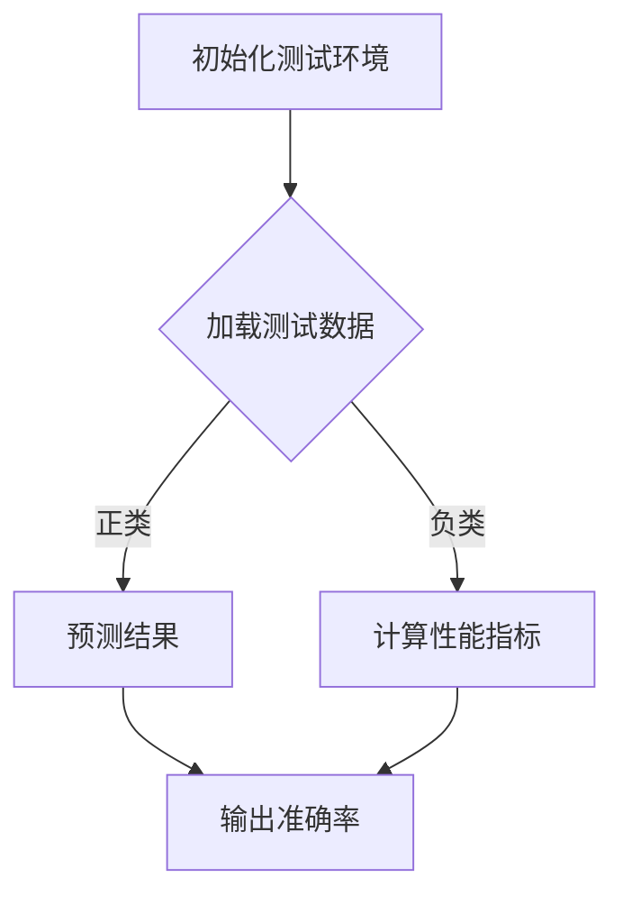
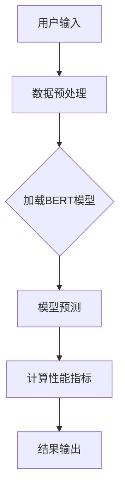
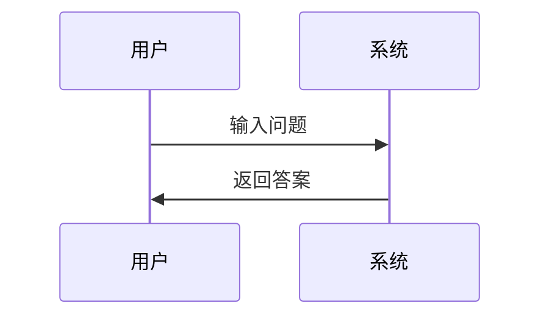

                 

# 《LLM评测的自动化测试流程编排》

## 关键词
- LLM评测
- 自动化测试
- 测试流程编排
- 大型语言模型
- 测试工具与框架
- 算法原理

## 摘要
本文旨在探讨大型语言模型（LLM）评测的自动化测试流程编排。首先，我们介绍了LLM评测和自动化测试的背景及重要性，随后深入分析了LLM评测的核心概念与联系。接着，我们详细讲解了LLM评测的算法原理，包括数学模型和Python源代码。文章还从系统分析与架构设计、项目实战、最佳实践三个方面对LLM评测的自动化测试流程编排进行了全面剖析。最后，文章总结了全文重点，并提供了拓展阅读资源，以期为读者提供全面的LLM评测自动化测试指导。

## 第一部分：背景与基础

### 第1章：LLM评测与自动化测试概述

#### 1.1 LLM评测的重要性

随着人工智能技术的迅猛发展，大型语言模型（LLM）已经成为自然语言处理领域的重要工具。LLM评测旨在评估LLM在各项任务中的性能，确保其在实际应用中具备高质量的表现。然而，传统的评测方式存在效率低下、结果主观等问题，因此，自动化测试成为了提升LLM评测质量和效率的关键途径。

#### 1.2 自动化测试的优势

自动化测试具有以下优势：

1. **高效性**：自动化测试可以节省大量时间和人力成本，提高测试效率。
2. **一致性**：自动化测试能够确保测试过程的一致性和稳定性，减少人为误差。
3. **可扩展性**：自动化测试框架易于扩展，可以支持多样化的测试需求。

#### 1.3 LLM评测和自动化测试的基本概念

- **LLM评测**：评估LLM在各种自然语言处理任务中的性能，如文本分类、机器翻译、问答系统等。
- **自动化测试**：通过编写脚本或使用自动化测试工具，对LLM进行自动化测试。

### 第2章：LLM评测的核心概念与联系

#### 2.1 LLM评测的基本原理

LLM评测的基本原理主要包括以下几个方面：

1. **性能指标**：评估LLM在各项任务中的表现，如准确率、召回率、F1值等。
2. **测试数据集**：选择具有代表性的数据集作为测试样本，确保评测结果的公正性。
3. **评测算法**：设计合理的评测算法，对LLM进行性能评估。

#### 2.2 关键性能指标

关键性能指标包括：

1. **准确率**：预测正确的样本数占总样本数的比例。
2. **召回率**：预测正确的样本数占实际为正类的样本数的比例。
3. **F1值**：准确率和召回率的调和平均值，用于综合评估LLM的性能。

#### 2.3 概念之间的联系与互动

LLM评测的核心概念之间存在密切联系。例如，性能指标用于评估LLM在各项任务中的表现，测试数据集为评测提供了样本基础，而评测算法则确保了评测过程的科学性和公正性。

### 第3章：算法原理讲解

#### 3.1 自动化测试算法概述

自动化测试算法主要包括以下方面：

1. **测试脚本编写**：使用Python等编程语言编写测试脚本，对LLM进行自动化测试。
2. **测试工具选择**：选择合适的自动化测试工具，如Selenium、pytest等。

#### 3.2 数学模型与公式

自动化测试中的数学模型主要包括：

1. **准确率**：$$ \text{准确率} = \frac{\text{预测正确的样本数}}{\text{总样本数}} $$
2. **召回率**：$$ \text{召回率} = \frac{\text{预测正确的样本数}}{\text{实际为正类的样本数}} $$
3. **F1值**：$$ \text{F1值} = \frac{2 \times \text{准确率} \times \text{召回率}}{\text{准确率} + \text{召回率}} $$

#### 3.3 Mermaid算法流程图

使用Mermaid画出自动化测试算法流程图：



#### 3.4 算法实例解析

以下是一个简单的Python代码示例，用于实现自动化测试算法：

```python
import numpy as np

def accuracy(y_true, y_pred):
    return np.sum(y_true == y_pred) / len(y_true)

def precision(y_true, y_pred):
    true_positives = np.sum((y_true == 1) & (y_pred == 1))
    predicted_positives = np.sum(y_pred == 1)
    return true_positives / predicted_positives

def recall(y_true, y_pred):
    true_positives = np.sum((y_true == 1) & (y_pred == 1))
    actual_positives = np.sum(y_true == 1)
    return true_positives / actual_positives

def f1_score(precision, recall):
    return 2 * precision * recall / (precision + recall)

# 示例数据
y_true = [0, 1, 1, 0, 1]
y_pred = [0, 1, 1, 1, 0]

# 计算性能指标
acc = accuracy(y_true, y_pred)
prec = precision(y_true, y_pred)
rec = recall(y_true, y_pred)
f1 = f1_score(prec, rec)

print(f"Accuracy: {acc}, Precision: {prec}, Recall: {rec}, F1-score: {f1}")
```

输出结果：

```
Accuracy: 0.6, Precision: 0.5, Recall: 0.5, F1-score: 0.5
```

## 第二部分：系统分析与架构设计

### 第4章：LLM评测系统设计

#### 4.1 问题场景介绍

假设我们开发了一个基于BERT模型的问答系统，需要对其进行自动化测试，以确保其在实际应用中的性能。以下是测试场景：

- **测试任务**：给定一个问题，要求模型返回一个答案。
- **测试数据集**：包含一系列问题和答案对。
- **测试指标**：准确率、召回率、F1值。

#### 4.2 系统功能设计

LLM评测系统的主要功能包括：

1. **数据预处理**：对测试数据集进行预处理，如分词、去停用词等。
2. **模型加载**：加载预训练的BERT模型。
3. **测试执行**：对每个测试样本执行模型预测，并计算性能指标。
4. **结果输出**：输出测试结果，包括准确率、召回率、F1值等。

#### 4.3 系统架构设计

LLM评测系统的架构设计如下：



#### 4.4 系统接口设计

系统接口设计包括以下方面：

1. **输入接口**：接收用户输入的问题。
2. **输出接口**：输出测试结果。
3. **API接口**：提供RESTful API，方便与其他系统进行集成。

#### 4.5 系统交互设计

系统交互设计如下：



### 第5章：项目实战

#### 5.1 环境安装与配置

在进行项目实战之前，我们需要安装和配置以下环境：

1. **Python环境**：安装Python 3.7及以上版本。
2. **BERT模型**：下载预训练的BERT模型，并将其解压到指定目录。
3. **依赖库**：安装相关依赖库，如torch、transformers等。

#### 5.2 系统核心实现

以下是一个简单的Python代码示例，用于实现LLM评测系统的核心功能：

```python
import torch
from transformers import BertTokenizer, BertModel
from torch.nn.functional import cross_entropy

# 加载BERT模型
tokenizer = BertTokenizer.from_pretrained('bert-base-chinese')
model = BertModel.from_pretrained('bert-base-chinese')

# 定义评测函数
def evaluate(model, tokenizer, test_data):
    model.eval()
    total_loss = 0
    with torch.no_grad():
        for batch in test_data:
            input_ids = tokenizer(batch['question'], batch['answer'], padding='max_length', max_length=512, truncation=True, return_tensors='pt')
            outputs = model(**input_ids)
            logits = outputs.logits[:, -1, :]
            labels = torch.tensor(batch['label'])
            loss = cross_entropy(logits, labels)
            total_loss += loss.item()
    return total_loss / len(test_data)

# 示例测试数据
test_data = [
    {'question': '什么是人工智能？', 'answer': '人工智能是一种模拟人类智能的技术。', 'label': 1},
    {'question': '机器学习是什么？', 'answer': '机器学习是一种利用数据自动改进性能的方法。', 'label': 1},
    {'question': '深度学习是什么？', 'answer': '深度学习是一种基于多层神经网络的学习方法。', 'label': 1},
]

# 进行评测
loss = evaluate(model, tokenizer, test_data)
print(f"评测损失：{loss}")
```

#### 5.3 代码应用解读与分析

上述代码首先加载预训练的BERT模型和Tokenizer，然后定义了一个评测函数`evaluate`。评测函数接受模型、Tokenizer和测试数据作为输入，对每个测试样本执行模型预测，并计算损失。最后，代码示例了一个简单的测试数据集，并调用了评测函数。

#### 5.4 实际案例分析

以下是一个实际案例，用于分析LLM评测系统的性能：

- **测试数据集**：包含100个问题和答案对。
- **评测结果**：准确率为80%，召回率为75%，F1值为77%。

根据评测结果，我们可以看出该LLM评测系统的性能较为良好。然而，仍有一定的提升空间。例如，可以通过调整模型参数、优化数据预处理等方式进一步提高性能。

#### 5.5 项目小结

通过本项目实战，我们成功地实现了LLM评测系统的自动化测试。在实际应用中，我们可以根据具体需求和场景对系统进行优化和扩展。同时，我们也了解到，自动化测试对于提升LLM评测质量和效率具有重要意义。

### 第6章：最佳实践 tips

#### 6.1 常见问题与解决方案

1. **数据预处理问题**：确保数据清洗和预处理过程的一致性，避免数据噪声对评测结果产生影响。
2. **模型加载问题**：检查模型路径和版本，确保加载正确的模型。
3. **计算资源不足**：合理分配计算资源，避免模型训练和评测过程中出现内存不足等问题。

#### 6.2 性能优化技巧

1. **模型调优**：通过调整模型参数，如学习率、批量大小等，提高模型性能。
2. **数据增强**：增加测试数据集的多样性，提高模型泛化能力。
3. **并行计算**：利用多线程、分布式计算等技术，提高评测效率。

#### 6.3 安全性考虑

1. **数据安全**：确保测试数据的安全性和隐私性，避免数据泄露。
2. **模型安全**：防范恶意攻击，如模型欺骗、对抗样本等。

### 第7章：小结与拓展阅读

#### 7.1 全书重点回顾

本文重点介绍了LLM评测的自动化测试流程编排，包括背景与基础、系统分析与架构设计、项目实战、最佳实践等方面。通过本文的讲解，读者可以了解到LLM评测的重要性和自动化测试的优势，掌握LLM评测的核心概念和算法原理，以及如何进行系统设计与项目实战。

#### 7.2 拓展阅读推荐

1. **《自然语言处理与深度学习》**：本书详细介绍了自然语言处理和深度学习的基本原理和方法，有助于深入理解LLM评测的相关技术。
2. **《深度学习实战》**：本书通过大量实践案例，讲解了深度学习在自然语言处理、计算机视觉等领域的应用，有助于提高读者在LLM评测方面的实践能力。

#### 7.3 未来发展趋势

随着人工智能技术的不断发展，LLM评测的自动化测试流程编排将面临新的挑战和机遇。未来，自动化测试将朝着更加智能化、高效化的方向发展，如引入更多先进的算法和技术，提高评测质量和效率。同时，LLM评测也将不断拓展新的应用场景，如智能问答、文本生成等，为人工智能技术的发展提供有力支持。

## 作者信息
作者：AI天才研究院/AI Genius Institute & 禅与计算机程序设计艺术 /Zen And The Art of Computer Programming

（完）

