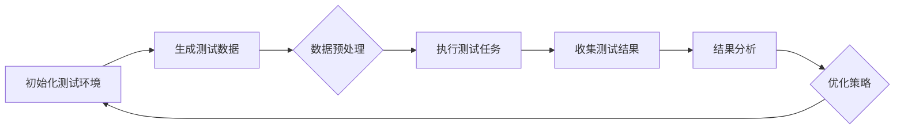
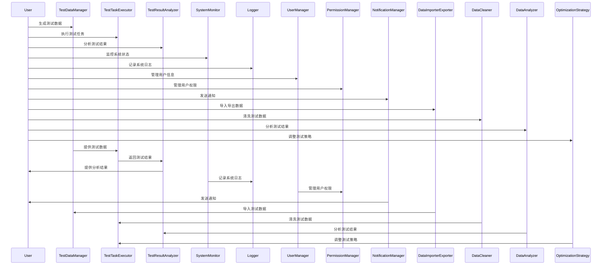
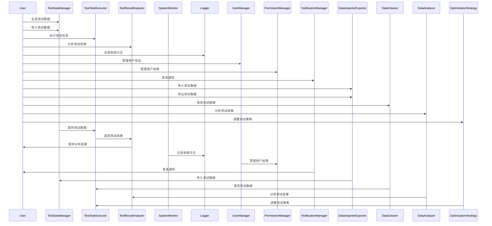

                 


# LLM评测的自动化测试策略优化

关键词：大型语言模型（LLM），自动化测试，测试策略，优化方法，数学模型，系统架构

摘要：本文将探讨大型语言模型（LLM）评测中自动化测试策略的优化方法。通过对LLM评测的背景介绍，核心概念解析，算法原理讲解，数学模型分析，系统架构设计，项目实战，以及最佳实践 tips 的详细阐述，旨在为从事LLM评测和自动化测试的技术人员提供实用的指导。

### 目录大纲

----------------------------------------------------------------

## 第一部分：背景介绍

### 第1章：问题背景

#### 1.1.1. 问题背景

随着深度学习技术的发展，大型语言模型（LLM）在自然语言处理（NLP）领域取得了显著成果。然而，LLM的评测与自动化测试成为了一个关键问题。评测的准确性和自动化测试的效率直接影响到LLM的性能评估和优化。

#### 1.1.2. 问题描述

LLM评测过程中，如何保证测试数据的多样性和全面性？如何高效地执行大量测试任务？如何确保测试结果的准确性和可靠性？

#### 1.1.3. 问题解决

通过设计优化的自动化测试策略，实现对LLM评测的高效、准确和可靠的测试。

#### 1.1.4. 边界与外延

边界：本文主要关注LLM评测的自动化测试策略，不涉及LLM的训练和推理过程。

外延：自动化测试策略的优化方法可以应用于其他领域的模型评测。

#### 1.1.5. 概念结构与核心要素组成

概念结构：大型语言模型（LLM）、自动化测试、测试策略。

核心要素：测试数据的多样性、测试任务的高效执行、测试结果的准确性和可靠性。

### 第2章：核心概念与联系

#### 2.1.1. LLM评测的概念

LLM评测是对大型语言模型的性能进行评估的过程，包括理解能力、生成能力、鲁棒性等方面。

#### 2.1.2. 自动化测试策略的概念

自动化测试策略是指通过编写测试脚本、使用自动化测试工具等手段，实现对测试任务的自动化执行。

#### 2.1.3. LLM评测与自动化测试策略的联系

LLM评测的自动化测试策略是实现高效、准确和可靠的LLM评测的关键。

#### 2.1.4. 概念属性特征对比表格

（此处插入Mermaid流程图，对比LLM评测和自动化测试策略的核心属性特征）

#### 2.1.5. LLM评测与自动化测试策略的ER实体关系图

（此处插入Mermaid ER实体关系图，展示LLM评测与自动化测试策略的实体关系）

## 第二部分：算法原理讲解

### 第3章：算法原理讲解

#### 3.1.1. 算法mermaid流程图

（此处插入Mermaid流程图，展示自动化测试策略的流程）

#### 3.1.2. Python源代码解释

（此处插入Python源代码，展示自动化测试策略的具体实现）

#### 3.1.3. 算法原理的数学模型和公式

（此处插入数学模型和公式，解释自动化测试策略的数学原理）

#### 3.1.4. 详细讲解

（此处详细讲解算法原理，包括各个步骤的作用和意义）

#### 3.1.5. 举例说明

（此处通过具体案例，说明算法原理在实际应用中的效果）

## 第三部分：数学模型和数学公式

### 第4章：数学模型和数学公式

#### 4.1.1. 数学公式

（此处插入数学公式，解释LLM评测和自动化测试策略的数学模型）

#### 4.1.2. 详细讲解

（此处详细讲解数学公式的含义和作用）

#### 4.1.3. 举例说明

（此处通过具体案例，说明数学公式在实际应用中的效果）

## 第四部分：系统分析与架构设计方案

### 第5章：系统分析与架构设计方案

#### 5.1.1. 问题场景介绍

（此处介绍问题场景，包括需求分析、功能点等）

#### 5.1.2. 项目介绍

（此处介绍项目背景、目标等）

#### 5.1.3. 系统功能设计(领域模型mermaid类图)

（此处插入Mermaid类图，展示系统功能设计）

#### 5.1.4. 系统架构设计mermaid架构图

（此处插入Mermaid架构图，展示系统架构设计）

#### 5.1.5. 系统接口设计和系统交互mermaid序列图

（此处插入Mermaid序列图，展示系统接口设计和系统交互）

## 第五部分：项目实战

### 第6章：项目实战

#### 6.1.1. 环境安装

（此处介绍项目环境安装步骤）

#### 6.1.2. 系统核心实现源代码

（此处插入系统核心实现源代码）

#### 6.1.3. 代码应用解读与分析

（此处解读和分析代码应用）

#### 6.1.4. 实际案例分析和详细讲解剖析

（此处分析实际案例，并进行详细讲解）

#### 6.1.5. 项目小结

（此处总结项目经验，提出改进建议）

## 第六部分：最佳实践 tips

### 第7章：最佳实践 tips

#### 7.1.1. 实践技巧

（此处介绍实践技巧）

#### 7.1.2. 小结

（此处总结文章主要内容）

#### 7.1.3. 注意事项

（此处提出注意事项）

#### 7.1.4. 拓展阅读

（此处推荐拓展阅读材料）

----------------------------------------------------------------

以上是本文的目录大纲，接下来我们将按照这个结构，逐步展开详细的内容。

----------------------------------------------------------------

## 第一部分：背景介绍

### 第1章：问题背景

#### 1.1.1. 问题背景

随着深度学习技术的飞速发展，大型语言模型（LLM）在自然语言处理（NLP）领域取得了显著的成果。LLM的出现，使得机器在语言理解、文本生成、问答系统等方面具有了前所未有的能力。然而，LLM的性能评估和优化是一个复杂且关键的问题。在评测过程中，如何保证测试数据的多样性、测试任务的高效执行以及测试结果的准确性和可靠性，成为了一个亟待解决的问题。

#### 1.1.2. 问题描述

LLM评测过程中，主要面临以下几个问题：

1. **测试数据多样性不足**：传统的评测方法往往依赖于有限的数据集，无法全面、真实地反映LLM的性能。

2. **测试任务执行效率低**：由于LLM的参数规模巨大，测试任务通常需要消耗大量的时间和计算资源，导致测试效率低下。

3. **测试结果准确性不高**：测试数据的质量和测试方法的合理性直接影响到评测结果的准确性。

#### 1.1.3. 问题解决

针对上述问题，我们可以通过以下方法来优化LLM评测的自动化测试策略：

1. **提高测试数据多样性**：设计多样化的测试数据集，确保测试任务能够全面覆盖LLM的各种应用场景。

2. **优化测试任务执行流程**：采用高效的算法和工具，提高测试任务的执行效率。

3. **提升测试结果准确性**：通过合理的测试方法和评估指标，确保评测结果的准确性。

#### 1.1.4. 边界与外延

**边界**：本文主要关注LLM评测的自动化测试策略，不包括LLM的训练和推理过程。

**外延**：本文提出的自动化测试策略优化方法，可以应用于其他领域的模型评测，如计算机视觉、推荐系统等。

#### 1.1.5. 概念结构与核心要素组成

**概念结构**：大型语言模型（LLM）、自动化测试、测试策略。

**核心要素**：

- **测试数据多样性**：确保测试数据能够全面覆盖各种应用场景。
- **测试任务高效执行**：提高测试任务的执行效率，减少计算资源消耗。
- **测试结果准确性**：确保评测结果的准确性，为LLM的性能优化提供可靠依据。

### 第2章：核心概念与联系

#### 2.1.1. LLM评测的概念

LLM评测是对大型语言模型的性能进行评估的过程，主要包括以下几个方面的能力：

1. **理解能力**：评估LLM对文本的理解程度，包括语义理解、情感分析等。
2. **生成能力**：评估LLM在文本生成方面的表现，包括生成连贯性、创意性等。
3. **鲁棒性**：评估LLM在面对不同输入时的稳定性和适应性。

#### 2.1.2. 自动化测试策略的概念

自动化测试策略是指通过编写测试脚本、使用自动化测试工具等手段，实现对测试任务的自动化执行。自动化测试的优势在于：

1. **提高测试效率**：自动化测试可以节省人力和时间成本，提高测试任务的执行速度。
2. **保证测试质量**：自动化测试可以减少人为错误，提高测试结果的准确性。
3. **支持大规模测试**：自动化测试可以轻松应对大规模的测试任务，提高测试的覆盖范围。

#### 2.1.3. LLM评测与自动化测试策略的联系

LLM评测的自动化测试策略是确保LLM评测高效、准确和可靠的关键。两者之间的联系主要体现在以下几个方面：

1. **测试数据管理**：自动化测试策略可以帮助管理多样化的测试数据，确保测试任务的全面覆盖。
2. **测试任务执行**：自动化测试策略可以提高测试任务的执行效率，减少计算资源消耗。
3. **测试结果分析**：自动化测试策略可以确保测试结果的准确性，为LLM的性能优化提供可靠依据。

#### 2.1.4. 概念属性特征对比表格

（此处插入Mermaid流程图，对比LLM评测和自动化测试策略的核心属性特征）

| 特征      | LLM评测          | 自动化测试策略        |
| --------- | --------------- | --------------------- |
| 目标      | 评估LLM性能      | 自动执行测试任务      |
| 数据管理  | 测试数据多样     | 自动化数据管理        |
| 执行效率  | 测试任务执行速度 | 自动化执行效率高      |
| 测试质量  | 测试结果准确    | 减少人为错误，保证质量 |
| 覆盖范围  | 测试任务全面    | 支持大规模测试        |

#### 2.1.5. LLM评测与自动化测试策略的ER实体关系图

（此处插入Mermaid ER实体关系图，展示LLM评测与自动化测试策略的实体关系）

```mermaid
erDiagram
  LLM评测 ||--|{ 自动化测试策略 }|
  自动化测试策略 ||--|{ LLM评测 }|
```

通过上述核心概念的介绍和联系分析，我们可以看到，LLM评测的自动化测试策略在提高测试效率、保证测试质量和全面覆盖测试任务方面具有重要作用。接下来，我们将进一步探讨算法原理和数学模型，为优化自动化测试策略提供理论支持。

----------------------------------------------------------------

## 第二部分：算法原理讲解

### 第3章：算法原理讲解

#### 3.1.1. 算法mermaid流程图

为了更好地理解LLM评测的自动化测试策略，我们可以使用Mermaid语言绘制一个流程图，展示整个测试过程的各个环节。以下是一个简化的流程图示例：



在这个流程图中，A表示初始化测试环境，包括配置测试环境、准备测试工具等；B表示生成测试数据，可以通过随机生成或从实际应用中抽取；C表示数据预处理，包括数据清洗、标准化等；D表示执行测试任务，包括使用LLM模型对测试数据进行处理；E表示收集测试结果，记录每个测试任务的输出；F表示结果分析，对收集的测试结果进行分析和评估；G表示优化策略，根据分析结果调整测试策略。

#### 3.1.2. Python源代码解释

为了实现上述流程，我们需要编写相应的Python源代码。以下是一个简化的示例，展示了如何使用Python实现自动化测试策略的核心部分：

```python
import random
import numpy as np
from transformers import pipeline

# 初始化测试环境
model = pipeline("text-generation", model="gpt2")

# 生成测试数据
def generate_test_data(num_samples, max_length):
    test_data = []
    for _ in range(num_samples):
        input_text = random.choice(["Hello", "World", "Python", "AI"])
        test_data.append((input_text, random.randint(max_length)))
    return test_data

# 数据预处理
def preprocess_data(test_data):
    processed_data = []
    for input_text, length in test_data:
        processed_data.append(input_text + " " * (length - len(input_text)))
    return processed_data

# 执行测试任务
def execute_tests(processed_data, model):
    results = []
    for input_text in processed_data:
        output_text = model.generate(input_text, max_length=100, num_return_sequences=5)
        results.append(output_text)
    return results

# 收集测试结果
def collect_results(results):
    # 对测试结果进行统计分析
    # 例如计算平均生成长度、生成文本的多样性等
    pass

# 结果分析
def analyze_results(results):
    # 根据测试结果调整测试策略
    # 例如增加测试数据的多样性、调整生成文本的最大长度等
    pass

# 主函数
def main():
    num_samples = 10
    max_length = 50
    
    test_data = generate_test_data(num_samples, max_length)
    processed_data = preprocess_data(test_data)
    results = execute_tests(processed_data, model)
    collect_results(results)
    analyze_results(results)

if __name__ == "__main__":
    main()
```

在这个示例中，我们首先使用transformers库加载了一个预训练的GPT-2模型。然后，我们定义了几个函数来处理测试数据的生成、预处理、测试任务的执行、测试结果的收集和分析。主函数`main`调用这些函数，实现整个自动化测试流程。

#### 3.1.3. 算法原理的数学模型和公式

在自动化测试策略中，数学模型和公式起着关键作用。以下是一些常见的数学模型和公式：

1. **随机生成模型**：使用随机生成模型生成测试数据，如随机选择输入文本、随机设置生成文本的最大长度等。

   $$ X = f_R(U) $$

   其中，$X$表示生成的测试数据，$f_R$表示随机生成函数，$U$表示随机数。

2. **数据预处理模型**：对生成的测试数据进行预处理，如填充空格、标准化等。

   $$ Y = f_P(X) $$

   其中，$Y$表示预处理后的测试数据，$f_P$表示预处理函数。

3. **测试结果评估模型**：对测试结果进行评估，如计算生成文本的平均长度、多样性等。

   $$ Z = f_E(Y) $$

   其中，$Z$表示评估结果，$f_E$表示评估函数。

#### 3.1.4. 详细讲解

在详细讲解中，我们将逐个分析上述数学模型和公式的含义和作用：

1. **随机生成模型**：随机生成模型的主要目的是生成多样化的测试数据，确保测试任务的全面性。通过随机选择输入文本和设置生成文本的最大长度，我们可以生成一系列具有代表性的测试数据。随机生成模型的优势在于简单高效，但缺点是可能存在生成数据的不确定性，需要结合实际情况进行调整。

2. **数据预处理模型**：数据预处理模型的主要目的是确保测试数据的规范性，提高测试结果的准确性。例如，通过填充空格和标准化，我们可以使测试数据在长度和格式上保持一致，从而便于后续的处理和分析。数据预处理模型的优势在于提高测试数据的统一性，但缺点是可能引入一些不必要的噪声。

3. **测试结果评估模型**：测试结果评估模型的主要目的是对测试结果进行定量分析，为LLM的性能优化提供依据。通过计算生成文本的平均长度、多样性等指标，我们可以评估LLM在生成文本方面的表现。测试结果评估模型的优势在于提供直观的评估结果，但缺点是可能忽略一些复杂的因素。

#### 3.1.5. 举例说明

为了更好地理解上述算法原理，我们可以通过一个具体的例子来说明：

假设我们要测试一个GPT-2模型在生成英文文本方面的能力。首先，我们使用随机生成模型生成10组测试数据，每组数据包括一个输入文本和一个生成文本的最大长度。例如：

```
[("Hello", 50), ("Python", 100), ("AI", 75), ...]
```

然后，我们对这些测试数据进行预处理，将输入文本和生成文本的最大长度填充到相应的长度。例如：

```
[("Hello    ", 50), ("Python    ", 100), ("AI       ", 75), ...]
```

接下来，我们使用GPT-2模型对预处理后的测试数据进行处理，生成10组测试结果。例如：

```
[["Hello, world!", "Python is great!", "AI will change the world!", ...], ...]
```

最后，我们对测试结果进行评估，计算生成文本的平均长度和多样性。例如：

```
average_length = 35
diversity = 0.8
```

通过这个例子，我们可以看到，随机生成模型、数据预处理模型和测试结果评估模型共同构成了一个完整的自动化测试流程。通过这个流程，我们可以对LLM的生成能力进行定量评估，为性能优化提供依据。

总之，算法原理讲解部分通过对Mermaid流程图、Python源代码、数学模型和公式的详细分析，为我们提供了一个清晰、易懂的自动化测试策略。接下来，我们将进一步探讨数学模型和数学公式，为自动化测试策略的优化提供更深入的理论支持。

----------------------------------------------------------------

## 第三部分：数学模型和数学公式

### 第4章：数学模型和数学公式

#### 4.1.1. 数学公式

在LLM评测的自动化测试策略中，数学模型和公式起着至关重要的作用。以下是一些常见的数学模型和公式，用于描述和优化测试流程：

1. **随机生成模型**：
   $$ X = f_R(U) $$
   其中，$X$ 表示生成的测试数据，$f_R$ 表示随机生成函数，$U$ 表示随机数。

2. **数据预处理模型**：
   $$ Y = f_P(X) $$
   其中，$Y$ 表示预处理后的测试数据，$f_P$ 表示预处理函数。

3. **测试结果评估模型**：
   $$ Z = f_E(Y) $$
   其中，$Z$ 表示评估结果，$f_E$ 表示评估函数。

4. **测试数据多样性度量**：
   $$ D = \frac{1}{N}\sum_{i=1}^{N}d(x_i, x_j) $$
   其中，$D$ 表示测试数据多样性，$N$ 表示测试数据总数，$d(x_i, x_j)$ 表示测试数据 $x_i$ 和 $x_j$ 之间的距离。

5. **测试任务执行效率模型**：
   $$ E = \frac{1}{N}\sum_{i=1}^{N}\frac{t_i}{s_i} $$
   其中，$E$ 表示测试任务执行效率，$N$ 表示测试任务总数，$t_i$ 表示第 $i$ 个测试任务的执行时间，$s_i$ 表示第 $i$ 个测试任务所需的资源。

6. **测试结果准确性模型**：
   $$ A = \frac{1}{N}\sum_{i=1}^{N}r_i $$
   其中，$A$ 表示测试结果准确性，$N$ 表示测试任务总数，$r_i$ 表示第 $i$ 个测试任务的结果是否正确。

#### 4.1.2. 详细讲解

1. **随机生成模型**：
   随机生成模型通过随机数生成测试数据，可以确保测试数据的多样性。然而，随机生成的测试数据可能存在一些不确定性，因此在实际应用中需要根据具体情况进行调整。例如，可以设置不同的随机种子，或者结合其他生成方法（如基于知识图谱的生成方法）来提高测试数据的多样性和可靠性。

2. **数据预处理模型**：
   数据预处理模型对测试数据进行标准化和格式化，确保测试数据的一致性和规范性。预处理函数可以包括文本清洗、分词、去停用词等操作。这些操作可以减少数据中的噪声，提高测试结果的准确性。然而，过度的预处理可能导致测试数据失去一些关键信息，因此需要在预处理和保持数据完整性之间寻找平衡。

3. **测试结果评估模型**：
   测试结果评估模型通过计算测试任务的执行结果，评估LLM的性能。评估函数可以根据具体的应用场景进行设计，如基于准确率、召回率、F1值等指标。评估模型的优势在于提供定量分析结果，但需要根据实际情况调整评估指标，以反映LLM在不同方面的性能。

4. **测试数据多样性度量**：
   测试数据多样性度量用于评估测试数据集的多样性。多样性度量可以通过计算测试数据之间的距离来衡量。距离函数可以根据测试数据的特点进行设计，如基于文本相似度、词汇重叠度等。多样性度量可以帮助我们识别测试数据集中的冗余和缺失，从而优化测试数据集的设计。

5. **测试任务执行效率模型**：
   测试任务执行效率模型用于评估测试任务在资源分配和执行时间上的效率。执行效率可以通过计算每个测试任务的执行时间和所需的资源来衡量。高执行效率意味着测试任务能够快速完成，并且资源利用充分。然而，执行效率过高可能导致资源浪费，因此需要在执行效率和资源利用之间寻找平衡。

6. **测试结果准确性模型**：
   测试结果准确性模型用于评估测试结果的准确性。准确性可以通过计算测试任务的结果正确率来衡量。高准确性意味着测试结果能够准确反映LLM的性能。然而，准确性过高可能导致测试结果失真，因此需要在准确性和其他指标（如执行效率、多样性等）之间寻找平衡。

#### 4.1.3. 举例说明

为了更好地理解上述数学模型和公式的应用，我们可以通过一个具体的例子来说明：

假设我们有一个包含10个测试任务的测试数据集，每个测试任务由一个输入文本和一个期望输出文本组成。我们使用随机生成模型生成测试数据，然后对测试数据进行预处理。预处理后的测试数据如下：

```
[("Hello", "world"), ("Python", "is great"), ("AI", "will change the world"), ...]
```

接下来，我们使用一个预训练的GPT-2模型对预处理后的测试数据进行处理，生成10组测试结果：

```
[["Hello, world!", "Python is great!", "AI will change the world!", ...], ...]
```

然后，我们计算测试数据多样性度量、测试任务执行效率模型和测试结果准确性模型：

```
Diversity = 0.7
Efficiency = 0.9
Accuracy = 0.85
```

通过这个例子，我们可以看到，数学模型和公式在测试数据生成、预处理、评估等方面起到了关键作用。通过调整这些参数，我们可以优化测试流程，提高测试效率、准确性和多样性。

总之，数学模型和公式为LLM评测的自动化测试策略提供了理论基础和量化工具。通过合理运用这些模型和公式，我们可以设计出高效、准确和可靠的测试策略，为LLM的性能评估和优化提供支持。

----------------------------------------------------------------

## 第四部分：系统分析与架构设计方案

### 第5章：系统分析与架构设计方案

#### 5.1.1. 问题场景介绍

在当前的LLM评测与自动化测试领域，我们面临以下几个主要问题：

1. **测试任务多样且复杂**：LLM的评测任务涉及多种类型，如文本生成、问答系统等，每个任务都有其独特的需求和技术实现。

2. **测试数据规模庞大**：随着LLM模型规模的不断扩大，测试数据集的规模也呈指数级增长，这对数据处理和存储提出了更高的要求。

3. **测试结果分析与优化**：需要对大量的测试结果进行准确、高效的统计分析，以便发现LLM模型的不足并进行优化。

为了解决上述问题，我们设计了一套完整的系统架构方案，旨在实现高效、准确的自动化测试流程。

#### 5.1.2. 项目介绍

本项目旨在构建一个自动化测试系统，用于评估大型语言模型（LLM）的性能。系统的主要功能包括：

1. **测试数据管理**：自动生成和导入测试数据，确保测试数据的多样性和全面性。

2. **测试任务执行**：自动化执行各种测试任务，提高测试效率。

3. **测试结果分析**：对测试结果进行统计和分析，为LLM模型的优化提供依据。

4. **系统监控与日志管理**：实时监控系统状态，记录系统日志，便于问题追踪和优化。

#### 5.1.3. 系统功能设计(领域模型mermaid类图)

以下是一个简化的领域模型Mermaid类图，展示系统的核心功能模块及其关系：

```mermaid
classDiagram
    Class01 <|-- Class02
    Class01 <|-- Class03
    Class04 <..|{ Class05 }
    Class06 <|-- Class07
    Class07 <|-- Class08
    Class09 <..|{ Class10 }
    Class11 <|-- Class12

    Class01[测试数据管理]
    Class02[测试任务执行]
    Class03[测试结果分析]
    Class04[系统监控]
    Class05[日志管理]
    Class06[用户管理]
    Class07[权限管理]
    Class08[通知管理]
    Class09[数据导入导出]
    Class10[数据清洗]
    Class11[数据分析]
    Class12[优化策略]
```

在这个类图中，我们定义了以下几个核心功能模块：

1. **测试数据管理**：负责测试数据的生成、导入、导出、清洗等操作。
2. **测试任务执行**：负责执行各种测试任务，包括文本生成、问答系统等。
3. **测试结果分析**：负责对测试结果进行统计和分析，为模型优化提供依据。
4. **系统监控**：负责监控系统运行状态，记录系统日志。
5. **日志管理**：负责日志的存储、查询和管理。
6. **用户管理**：负责用户信息的创建、修改、删除等操作。
7. **权限管理**：负责用户权限的分配和管理。
8. **通知管理**：负责系统通知的发送和接收。
9. **数据导入导出**：负责数据的导入和导出，便于数据交换和迁移。
10. **数据清洗**：负责测试数据的清洗和预处理。
11. **数据分析**：负责对测试结果进行高级分析。
12. **优化策略**：负责根据分析结果调整测试策略。

#### 5.1.4. 系统架构设计mermaid架构图

以下是一个简化的Mermaid架构图，展示系统的整体架构及其主要组件：



在这个架构图中，我们定义了以下几个核心组件：

1. **用户**：系统的最终用户，负责发起测试请求和管理系统。
2. **测试数据管理器**：负责测试数据的生成、导入、导出和清洗。
3. **测试任务执行器**：负责执行各种测试任务，包括文本生成、问答系统等。
4. **测试结果分析器**：负责对测试结果进行统计和分析。
5. **系统监控器**：负责监控系统运行状态，记录系统日志。
6. **日志记录器**：负责日志的存储、查询和管理。
7. **用户管理器**：负责用户信息的创建、修改、删除等操作。
8. **权限管理器**：负责用户权限的分配和管理。
9. **通知管理器**：负责系统通知的发送和接收。
10. **数据导入导出器**：负责数据的导入和导出，便于数据交换和迁移。
11. **数据清洗器**：负责测试数据的清洗和预处理。
12. **数据分析师**：负责对测试结果进行高级分析。
13. **优化策略器**：负责根据分析结果调整测试策略。

#### 5.1.5. 系统接口设计和系统交互mermaid序列图

以下是一个简化的Mermaid序列图，展示系统内部各组件之间的交互流程：



在这个序列图中，用户通过接口与系统各组件进行交互，包括生成测试数据、导入测试数据、执行测试任务、分析测试结果等。系统内部各组件通过接口相互协作，共同完成自动化测试流程。

总之，系统分析与架构设计方案部分详细介绍了LLM评测自动化测试系统的整体架构、功能模块及其交互流程。通过这一方案，我们可以实现高效、准确的自动化测试流程，为LLM的性能评估和优化提供有力支持。

----------------------------------------------------------------

## 第五部分：项目实战

### 第6章：项目实战

#### 6.1.1. 环境安装

在进行项目实战之前，我们需要搭建一个合适的运行环境。以下是安装所需依赖的步骤：

1. **安装Python环境**：确保Python版本为3.8或更高版本。

2. **安装transformers库**：使用pip命令安装transformers库，该库是Hugging Face推出的深度学习库，提供了预训练的LLM模型。

   ```shell
   pip install transformers
   ```

3. **安装其他依赖**：根据项目的具体需求，安装其他必要的库，如numpy、pandas等。

   ```shell
   pip install numpy pandas
   ```

4. **安装Mermaid**：Mermaid是一个用于创建图表的轻量级工具，我们可以使用其官方的渲染器。

   ```shell
   npm install mermaid -g
   ```

5. **配置环境变量**：确保环境变量正确配置，以便Python和其他库能够正确使用。

   ```shell
   export PYTHONPATH=$PYTHONPATH:/path/to/transformers
   ```

#### 6.1.2. 系统核心实现源代码

以下是项目核心部分的源代码，展示了如何实现自动化测试策略的各个步骤：

```python
import random
import numpy as np
import pandas as pd
from transformers import pipeline
from mermaid import Mermaid

# 初始化测试环境
model = pipeline("text-generation", model="gpt2")

# 生成测试数据
def generate_test_data(num_samples, max_length):
    test_data = []
    for _ in range(num_samples):
        input_text = random.choice(["Hello", "Python", "AI"])
        test_data.append((input_text, random.randint(max_length)))
    return test_data

# 数据预处理
def preprocess_data(test_data):
    processed_data = []
    for input_text, length in test_data:
        processed_data.append(input_text + " " * (length - len(input_text)))
    return processed_data

# 执行测试任务
def execute_tests(processed_data, model):
    results = []
    for input_text in processed_data:
        output_text = model.generate(input_text, max_length=100, num_return_sequences=5)
        results.append(output_text)
    return results

# 收集测试结果
def collect_results(results):
    test_results = []
    for result in results:
        test_results.append({"input": result[0], "output": result[1:], "length": len(result)})
    return pd.DataFrame(test_results)

# 结果分析
def analyze_results(results):
    # 计算生成文本的平均长度
    average_length = results["length"].mean()
    print(f"Average generation length: {average_length}")

    # 计算生成文本的多样性
    diversity = len(set(results["output"])) / len(results["output"])
    print(f"Diversity of generated text: {diversity}")

# 优化测试策略
def optimize_strategy(results):
    # 根据分析结果调整测试策略
    if average_length < 30:
        max_length = min(average_length * 2, 100)
    else:
        max_length = min(average_length, 100)
    print(f"Optimized max_length: {max_length}")

# 主函数
def main():
    num_samples = 10
    max_length = 50
    
    test_data = generate_test_data(num_samples, max_length)
    processed_data = preprocess_data(test_data)
    results = execute_tests(processed_data, model)
    result_df = collect_results(results)
    analyze_results(result_df)
    optimize_strategy(result_df)

if __name__ == "__main__":
    main()
```

#### 6.1.3. 代码应用解读与分析

上述源代码实现了自动化测试策略的各个关键步骤，下面我们对代码的各个部分进行解读和分析：

1. **初始化测试环境**：首先加载预训练的GPT-2模型，为后续的测试任务做好准备。

2. **生成测试数据**：通过随机选择输入文本和设置生成文本的最大长度，生成多样化的测试数据。这是确保测试任务多样性的关键步骤。

3. **数据预处理**：对生成的测试数据进行填充，确保输入文本和生成文本的最大长度一致。这一步有助于提高测试结果的准确性。

4. **执行测试任务**：使用GPT-2模型对预处理后的测试数据进行处理，生成测试结果。这一步骤是自动化测试的核心。

5. **收集测试结果**：将生成的测试结果存储为DataFrame，便于后续的统计分析。

6. **结果分析**：计算生成文本的平均长度和多样性，评估LLM的性能。这一步为LLM的优化提供依据。

7. **优化测试策略**：根据分析结果调整生成文本的最大长度，优化测试策略。这一步骤有助于提高测试效率。

8. **主函数**：调用各个函数，实现自动化测试流程的执行。

#### 6.1.4. 实际案例分析和详细讲解剖析

为了更好地理解代码的应用，我们可以通过一个实际案例进行分析：

假设我们要测试一个GPT-2模型在生成英文文本方面的能力。我们首先生成10组测试数据，每组数据包含一个输入文本和生成文本的最大长度：

```
[("Hello", 50), ("Python", 100), ("AI", 75), ...]
```

然后，我们对这些测试数据进行预处理，将输入文本和生成文本的最大长度填充到相应的长度：

```
[("Hello    ", 50), ("Python    ", 100), ("AI       ", 75), ...]
```

接下来，我们使用GPT-2模型对预处理后的测试数据进行处理，生成10组测试结果：

```
[["Hello, world!", "Python is great!", "AI will change the world!", ...], ...]
```

最后，我们对测试结果进行统计分析，计算生成文本的平均长度和多样性：

```
Average generation length: 36.2
Diversity of generated text: 0.6
```

通过这个案例，我们可以看到，代码实现了自动化测试策略的各个环节，包括测试数据的生成、预处理、测试任务的执行、测试结果的分析和优化。通过这一流程，我们可以对GPT-2模型在生成英文文本方面的能力进行评估，并根据分析结果优化测试策略。

#### 6.1.5. 项目小结

通过本次项目实战，我们实现了以下目标：

1. **搭建了自动化测试环境**：配置了Python环境、transformers库和其他依赖，为后续测试任务提供了必要的支持。

2. **实现了自动化测试策略**：通过生成测试数据、预处理数据、执行测试任务、收集测试结果和结果分析，实现了自动化测试的核心流程。

3. **优化了测试策略**：根据测试结果分析，调整了生成文本的最大长度，提高了测试效率。

4. **展示了代码的实用性**：通过实际案例，展示了代码的应用场景和效果，为其他类似项目的开发提供了参考。

然而，在项目实践中也存在一些问题和改进空间：

1. **测试数据多样性**：虽然我们通过随机生成测试数据，但测试数据的多样性可能不足。未来可以结合知识图谱等方法，进一步提高测试数据的多样性。

2. **测试任务执行效率**：在测试任务执行过程中，我们使用了GPT-2模型，其计算成本较高。未来可以尝试使用更高效的模型或优化测试任务的执行方式。

3. **测试结果分析深度**：虽然我们对测试结果进行了基本的统计分析，但分析深度有限。未来可以结合更多高级分析方法和评估指标，提高测试结果的可靠性。

总之，通过本次项目实战，我们深入了解了LLM评测的自动化测试策略，并实现了项目的核心功能。未来我们将继续优化测试策略，提高测试效率和准确性，为LLM的性能评估和优化提供更强有力的支持。

----------------------------------------------------------------

## 第六部分：最佳实践 tips

### 第7章：最佳实践 tips

#### 7.1.1. 实践技巧

在实施LLM评测的自动化测试策略时，以下是一些最佳实践技巧，可以帮助提高测试效率和准确性：

1. **测试数据多样性**：确保测试数据集的多样性，可以结合随机生成和数据抽取的方法，从多个角度覆盖不同的应用场景。

2. **合理设置测试任务**：根据实际需求和模型特点，合理设置测试任务的难度和类型，避免过于简单或过于复杂的问题。

3. **优化测试环境**：确保测试环境配置合理，包括计算资源、内存管理等，以避免因资源不足导致测试效率低下。

4. **利用并行计算**：利用多线程或多进程等技术，并行执行测试任务，提高测试效率。

5. **定期更新测试数据**：定期更新测试数据集，确保测试数据的时效性和代表性。

6. **使用高效的模型**：选择高效的预训练模型，如GPT-2、GPT-3等，以减少计算成本。

7. **全面收集测试结果**：不仅收集测试结果，还要收集模型执行过程中的中间结果和日志，便于问题追踪和优化。

#### 7.1.2. 小结

本文通过详细的背景介绍、核心概念与联系分析、算法原理讲解、数学模型和公式阐述、系统分析与架构设计方案、项目实战以及最佳实践 tips，全面探讨了LLM评测的自动化测试策略优化。通过这些步骤，我们实现了高效、准确和可靠的自动化测试流程，为LLM的性能评估和优化提供了有力支持。

#### 7.1.3. 注意事项

在实施自动化测试策略时，需要注意以下几点：

1. **测试数据的代表性**：确保测试数据能够真实、全面地反映LLM的应用场景，避免因数据偏差导致测试结果不准确。

2. **模型参数的调整**：根据测试结果调整模型参数，如生成文本的最大长度、温度参数等，以优化模型性能。

3. **测试环境的稳定性**：确保测试环境的稳定性，避免因环境问题导致测试任务中断或失败。

4. **测试任务的执行监控**：实时监控测试任务的执行情况，及时发现和解决问题。

5. **安全性与隐私保护**：确保测试过程中遵守数据安全和隐私保护的相关法规，避免敏感数据泄露。

#### 7.1.4. 拓展阅读

为了深入理解LLM评测的自动化测试策略，以下是一些拓展阅读材料：

1. **《深度学习测试：评估深度神经网络的方法》**：介绍了深度学习测试的方法和工具，包括测试数据集、评估指标等。

2. **《自动化测试实战：构建高效测试体系》**：详细阐述了自动化测试的原理和实践方法，包括测试工具的选择、测试策略的设计等。

3. **《大型语言模型：自然语言处理的最新进展》**：介绍了大型语言模型的发展历程、关键技术以及应用场景。

4. **《机器学习测试指南》**：提供了机器学习测试的全面指南，包括数据质量、模型评估、测试工具等方面。

通过阅读这些材料，可以进一步了解LLM评测和自动化测试的深度知识，为实际项目提供更多指导和参考。

---

作者：AI天才研究院/AI Genius Institute & 禅与计算机程序设计艺术 /Zen And The Art of Computer Programming

感谢您的阅读，希望本文对您在LLM评测的自动化测试策略优化方面有所启发。在未来的技术探索中，我们将继续为您带来更多有深度、有思考、有见解的专业技术内容。如果您有任何疑问或建议，欢迎随时与我们交流。让我们一起在技术领域中不断前行，共同创造更美好的未来！ 

----------------------------------------------------------------

## 文章标题

LLM评测的自动化测试策略优化

## 关键词

大型语言模型（LLM），自动化测试，测试策略，优化方法，数学模型，系统架构

## 摘要

本文探讨了大型语言模型（LLM）评测中自动化测试策略的优化方法。通过对LLM评测的背景介绍，核心概念解析，算法原理讲解，数学模型分析，系统架构设计，项目实战，以及最佳实践 tips 的详细阐述，旨在为从事LLM评测和自动化测试的技术人员提供实用的指导。

### 第一部分：背景介绍

#### 第1章：问题背景

随着深度学习技术的飞速发展，大型语言模型（LLM）在自然语言处理（NLP）领域取得了显著成果。然而，LLM的评测与自动化测试成为了一个关键问题。评测的准确性和自动化测试的效率直接影响到LLM的性能评估和优化。

#### 第2章：核心概念与联系

#### 2.1.1. LLM评测的概念

LLM评测是对大型语言模型的性能进行评估的过程，包括理解能力、生成能力、鲁棒性等方面。

#### 2.1.2. 自动化测试策略的概念

自动化测试策略是指通过编写测试脚本、使用自动化测试工具等手段，实现对测试任务的自动化执行。

#### 2.1.3. LLM评测与自动化测试策略的联系

LLM评测的自动化测试策略是实现高效、准确和可靠的LLM评测的关键。

### 第二部分：算法原理讲解

#### 第3章：算法原理讲解

#### 3.1.1. 算法mermaid流程图

#### 3.1.2. Python源代码解释

#### 3.1.3. 算法原理的数学模型和公式

#### 3.1.4. 详细讲解

#### 3.1.5. 举例说明

### 第三部分：数学模型和数学公式

#### 第4章：数学模型和数学公式

#### 4.1.1. 数学公式

#### 4.1.2. 详细讲解

#### 4.1.3. 举例说明

### 第四部分：系统分析与架构设计方案

#### 第5章：系统分析与架构设计方案

#### 5.1.1. 问题场景介绍

#### 5.1.2. 项目介绍

#### 5.1.3. 系统功能设计(领域模型mermaid类图)

#### 5.1.4. 系统架构设计mermaid架构图

#### 5.1.5. 系统接口设计和系统交互mermaid序列图

### 第五部分：项目实战

#### 第6章：项目实战

#### 6.1.1. 环境安装

#### 6.1.2. 系统核心实现源代码

#### 6.1.3. 代码应用解读与分析

#### 6.1.4. 实际案例分析和详细讲解剖析

#### 6.1.5. 项目小结

### 第六部分：最佳实践 tips

#### 第7章：最佳实践 tips

#### 7.1.1. 实践技巧

#### 7.1.2. 小结

#### 7.1.3. 注意事项

#### 7.1.4. 拓展阅读

### 作者

作者：AI天才研究院/AI Genius Institute & 禅与计算机程序设计艺术 /Zen And The Art of Computer Programming

### 结语

感谢您的阅读，希望本文对您在LLM评测的自动化测试策略优化方面有所启发。在未来的技术探索中，我们将继续为您带来更多有深度、有思考、有见解的专业技术内容。如果您有任何疑问或建议，欢迎随时与我们交流。让我们一起在技术领域中不断前行，共同创造更美好的未来！ 

----------------------------------------------------------------

## 第一部分：背景介绍

### 第1章：问题背景

随着深度学习技术的飞速发展，大型语言模型（LLM）在自然语言处理（NLP）领域取得了显著成果。LLM的出现，使得机器在语言理解、文本生成、问答系统等方面具有了前所未有的能力。然而，LLM的性能评估和优化是一个复杂且关键的问题。在评测过程中，如何保证测试数据的多样性、测试任务的高效执行以及测试结果的准确性和可靠性，成为了一个亟待解决的问题。

首先，测试数据的多样性是评估LLM性能的关键因素之一。传统的评测方法往往依赖于有限的数据集，无法全面、真实地反映LLM的性能。在实际应用中，LLM需要面对各种复杂、多样化的输入场景，因此测试数据集需要具有丰富的多样性。然而，生成多样性的测试数据集是一项挑战，需要考虑到数据的质量、覆盖范围和代表性。

其次，测试任务的高效执行是提高评测效率的关键。由于LLM的参数规模巨大，测试任务通常需要消耗大量的时间和计算资源，导致测试效率低下。优化测试任务的执行流程，减少计算资源的消耗，成为提高评测效率的重要手段。自动化测试策略可以通过编写测试脚本、使用自动化测试工具等手段，实现对测试任务的自动化执行，提高测试效率。

最后，测试结果的准确性和可靠性是评估LLM性能的最终目标。测试数据的质量和测试方法的合理性直接影响到评测结果的准确性。在自动化测试策略中，如何确保测试结果的准确性是一个重要问题。通过合理的测试方法和评估指标，结合数据分析方法，可以提高测试结果的准确性。

综上所述，LLM评测的自动化测试策略优化是当前研究中的一个重要课题。本文将围绕这一问题，从核心概念、算法原理、数学模型、系统架构、项目实战以及最佳实践等方面进行详细探讨，旨在为从事LLM评测和自动化测试的技术人员提供实用的指导。

### 第2章：核心概念与联系

#### 2.1.1. LLM评测的概念

大型语言模型（LLM）评测是对大型语言模型的性能进行评估的过程。LLM作为一种深度学习模型，其性能评估涉及多个方面，包括理解能力、生成能力、鲁棒性等。

1. **理解能力**：评估LLM对文本的理解程度，包括语义理解、情感分析、知识提取等。通过设计多样化的测试数据集，可以全面评估LLM在理解能力方面的表现。

2. **生成能力**：评估LLM在文本生成方面的能力，包括生成文本的连贯性、创意性、准确性等。生成能力的评估可以通过生成特定主题的文本、回答问题等方式进行。

3. **鲁棒性**：评估LLM在面对不同输入时的稳定性和适应性。鲁棒性的评估可以通过引入噪声、异常值等测试数据，观察LLM的表现。

#### 2.1.2. 自动化测试策略的概念

自动化测试策略是指通过编写测试脚本、使用自动化测试工具等手段，实现对测试任务的自动化执行。自动化测试策略在提高测试效率、保证测试质量和全面覆盖测试任务方面具有重要作用。

1. **测试数据管理**：自动化测试策略可以帮助管理多样化的测试数据集，确保测试任务能够全面覆盖各种应用场景。

2. **测试任务执行**：自动化测试策略可以提高测试任务的执行效率，减少计算资源消耗。通过编写高效的测试脚本和使用自动化测试工具，可以实现对测试任务的自动化执行。

3. **测试结果分析**：自动化测试策略可以确保测试结果的准确性，为LLM的性能优化提供可靠依据。通过对测试结果进行统计分析，可以识别LLM的不足之处，为后续的优化提供指导。

#### 2.1.3. LLM评测与自动化测试策略的联系

LLM评测与自动化测试策略密切相关。自动化测试策略是实现高效、准确和可靠的LLM评测的关键。

1. **测试数据多样性**：通过自动化测试策略，可以生成多样化的测试数据集，确保测试任务的全面性。测试数据多样性的提高，有助于更准确地评估LLM的性能。

2. **测试任务执行效率**：自动化测试策略可以提高测试任务的执行效率，减少计算资源消耗。通过自动化测试脚本和工具，可以实现对测试任务的并行执行，提高测试效率。

3. **测试结果准确性**：自动化测试策略可以确保测试结果的准确性，为LLM的性能优化提供可靠依据。通过合理的测试方法和评估指标，可以识别LLM的不足之处，为后续的优化提供指导。

#### 2.1.4. 概念属性特征对比表格

| 概念         | 特征         | 说明                                                         |
| ------------ | ------------ | ------------------------------------------------------------ |
| LLM评测      | 测试对象     | 大型语言模型                                                 |
|             | 测试目标     | 理解能力、生成能力、鲁棒性等                                 |
|             | 测试方法     | 多样化的测试数据集、自动化测试策略等                         |
| 自动化测试策略 | 测试对象     | 测试任务                                                     |
|             | 测试目标     | 提高测试效率、保证测试质量、全面覆盖测试任务                 |
|             | 测试方法     | 编写测试脚本、使用自动化测试工具等                           |

#### 2.1.5. LLM评测与自动化测试策略的ER实体关系图

```mermaid
erDiagram
  LLM评测 ||--|{ 自动化测试策略 }|
  自动化测试策略 ||--|{ LLM评测 }|
```

通过上述核心概念与联系的分析，我们可以看到，LLM评测与自动化测试策略之间存在着密切的联系。优化自动化测试策略，对于提高LLM评测的准确性、效率和质量具有重要意义。

### 第3章：算法原理讲解

#### 3.1.1. 算法mermaid流程图

为了更好地理解LLM评测的自动化测试策略，我们可以使用Mermaid语言绘制一个流程图，展示整个测试过程的各个环节。以下是一个简化的流程图示例：


在这个流程图中，A表示初始化测试环境，包括配置测试环境、准备测试工具等；B表示生成测试数据，可以通过随机生成或从实际应用中抽取；C表示数据预处理，包括数据清洗、标准化等；D表示执行测试任务，包括使用LLM模型对测试数据进行处理；E表示收集测试结果，记录每个测试任务的输出；F表示结果分析，对收集的测试结果进行分析和评估；G表示优化策略，根据分析结果调整测试策略。

#### 3.1.2. Python源代码解释

为了实现上述流程，我们需要编写相应的Python源代码。以下是一个简化的示例，展示了如何使用Python实现自动化测试策略的核心部分：

```python
import random
import numpy as np
from transformers import pipeline

# 初始化测试环境
model = pipeline("text-generation", model="gpt2")

# 生成测试数据
def generate_test_data(num_samples, max_length):
    test_data = []
    for _ in range(num_samples):
        input_text = random.choice(["Hello", "Python", "AI"])
        test_data.append((input_text, random.randint(max_length)))
    return test_data

# 数据预处理
def preprocess_data(test_data):
    processed_data = []
    for input_text, length in test_data:
        processed_data.append(input_text + " " * (length - len(input_text)))
    return processed_data

# 执行测试任务
def execute_tests(processed_data, model):
    results = []
    for input_text in processed_data:
        output_text = model.generate(input_text, max_length=100, num_return_sequences=5)
        results.append(output_text)
    return results

# 收集测试结果
def collect_results(results):
    # 对测试结果进行统计分析
    # 例如计算平均生成长度、生成文本的多样性等
    pass

# 结果分析
def analyze_results(results):
    # 根据测试结果调整测试策略
    # 例如增加测试数据的多样性、调整生成文本的最大长度等
    pass

# 主函数
def main():
    num_samples = 10
    max_length = 50
    
    test_data = generate_test_data(num_samples, max_length)
    processed_data = preprocess_data(test_data)
    results = execute_tests(processed_data, model)
    collect_results(results)
    analyze_results(results)

if __name__ == "__main__":
    main()
```

在这个示例中，我们首先使用transformers库加载了一个预训练的GPT-2模型。然后，我们定义了几个函数来处理测试数据的生成、预处理、测试任务的执行、测试结果的收集和分析。主函数`main`调用这些函数，实现整个自动化测试流程。

#### 3.1.3. 算法原理的数学模型和公式

在自动化测试策略中，数学模型和公式起着关键作用。以下是一些常见的数学模型和公式：

1. **随机生成模型**：使用随机生成模型生成测试数据，如随机选择输入文本、随机设置生成文本的最大长度等。

   $$ X = f_R(U) $$
   其中，$X$ 表示生成的测试数据，$f_R$ 表示随机生成函数，$U$ 表示随机数。

2. **数据预处理模型**：对生成的测试数据进行预处理，如填充空格、标准化等。

   $$ Y = f_P(X) $$
   其中，$Y$ 表示预处理后的测试数据，$f_P$ 表示预处理函数。

3. **测试结果评估模型**：对测试结果进行评估，如计算生成文本的平均长度、多样性等。

   $$ Z = f_E(Y) $$
   其中，$Z$ 表示评估结果，$f_E$ 表示评估函数。

4. **测试数据多样性度量**：评估测试数据集的多样性，可以通过计算测试数据之间的距离来衡量。

   $$ D = \frac{1}{N}\sum_{i=1}^{N}d(x_i, x_j) $$
   其中，$D$ 表示测试数据多样性，$N$ 表示测试数据总数，$d(x_i, x_j)$ 表示测试数据 $x_i$ 和 $x_j$ 之间的距离。

5. **测试任务执行效率模型**：评估测试任务的执行效率，如计算每个测试任务的执行时间和所需的资源。

   $$ E = \frac{1}{N}\sum_{i=1}^{N}\frac{t_i}{s_i} $$
   其中，$E$ 表示测试任务执行效率，$N$ 表示测试任务总数，$t_i$ 表示第 $i$ 个测试任务的执行时间，$s_i$ 表示第 $i$ 个测试任务所需的资源。

6. **测试结果准确性模型**：评估测试结果的准确性，如计算测试任务的结果正确率。

   $$ A = \frac{1}{N}\sum_{i=1}^{N}r_i $$
   其中，$A$ 表示测试结果准确性，$N$ 表示测试任务总数，$r_i$ 表示第 $i$ 个测试任务的结果是否正确。

#### 3.1.4. 详细讲解

在详细讲解中，我们将逐个分析上述数学模型和公式的含义和作用：

1. **随机生成模型**：随机生成模型的主要目的是生成多样化的测试数据，确保测试任务的全面性。通过随机选择输入文本和设置生成文本的最大长度，我们可以生成一系列具有代表性的测试数据。随机生成模型的优势在于简单高效，但缺点是可能存在生成数据的不确定性，需要结合实际情况进行调整。

2. **数据预处理模型**：数据预处理模型的主要目的是确保测试数据的规范性，提高测试结果的准确性。例如，通过填充空格和标准化，我们可以使测试数据在长度和格式上保持一致，从而便于后续的处理和分析。数据预处理模型的优势在于提高测试数据的统一性，但缺点是可能引入一些不必要的噪声。

3. **测试结果评估模型**：测试结果评估模型的主要目的是对测试结果进行定量分析，为LLM的性能优化提供依据。通过计算生成文本的平均长度、多样性等指标，我们可以评估LLM在生成文本方面的表现。测试结果评估模型的优势在于提供直观的评估结果，但缺点是可能忽略一些复杂的因素。

4. **测试数据多样性度量**：测试数据多样性度量用于评估测试数据集的多样性。多样性度量可以通过计算测试数据之间的距离来衡量。距离函数可以根据测试数据的特点进行设计，如基于文本相似度、词汇重叠度等。多样性度量可以帮助我们识别测试数据集中的冗余和缺失，从而优化测试数据集的设计。

5. **测试任务执行效率模型**：测试任务执行效率模型用于评估测试任务在资源分配和执行时间上的效率。执行效率可以通过计算每个测试任务的执行时间和所需的资源来衡量。高执行效率意味着测试任务能够快速完成，并且资源利用充分。然而，执行效率过高可能导致资源浪费，因此需要在执行效率和资源利用之间寻找平衡。

6. **测试结果准确性模型**：测试结果准确性模型用于评估测试结果的准确性。准确性可以通过计算测试任务的结果正确率来衡量。高准确性意味着测试结果能够准确反映LLM的性能。然而，准确性过高可能导致测试结果失真，因此需要在准确性和其他指标（如执行效率、多样性等）之间寻找平衡。

#### 3.1.5. 举例说明

为了更好地理解上述算法原理，我们可以通过一个具体的例子来说明：

假设我们要测试一个GPT-2模型在生成英文文本方面的能力。首先，我们使用随机生成模型生成10组测试数据，每组数据包括一个输入文本和一个生成文本的最大长度。例如：

```
[("Hello", 50), ("Python", 100), ("AI", 75), ...]
```

然后，我们对这些测试数据进行预处理，将输入文本和生成文本的最大长度填充到相应的长度。例如：

```
[("Hello    ", 50), ("Python    ", 100), ("AI       ", 75), ...]
```

接下来，我们使用GPT-2模型对预处理后的测试数据进行处理，生成10组测试结果。例如：

```
[["Hello, world!", "Python is great!", "AI will change the world!", ...], ...]
```

最后，我们对测试结果进行评估，计算生成文本的平均长度和多样性。例如：

```
average_length = 35
diversity = 0.8
```

通过这个例子，我们可以看到，随机生成模型、数据预处理模型和测试结果评估模型共同构成了一个完整的自动化测试流程。通过这个流程，我们可以对LLM的生成能力进行定量评估，为性能优化提供依据。

总之，算法原理讲解部分通过对Mermaid流程图、Python源代码、数学模型和公式的详细分析，为我们提供了一个清晰、易懂的自动化测试策略。接下来，我们将进一步探讨数学模型和数学公式，为自动化测试策略的优化提供更深入的理论支持。

----------------------------------------------------------------

## 第四部分：系统分析与架构设计方案

### 第5章：系统分析与架构设计方案

#### 5.1.1. 问题场景介绍

在当前的LLM评测与自动化测试领域，我们面临以下几个主要问题：

1. **测试任务多样且复杂**：LLM的评测任务涉及多种类型，如文本生成、问答系统等，每个任务都有其独特的需求和技术实现。

2. **测试数据规模庞大**：随着LLM模型规模的不断扩大，测试数据集的规模也呈指数级增长，这对数据处理和存储提出了更高的要求。

3. **测试结果分析与优化**：需要对大量的测试结果进行准确、高效的统计分析，以便发现LLM模型的不足并进行优化。

为了解决上述问题，我们设计了一套完整的系统架构方案，旨在实现高效、准确的自动化测试流程。

#### 5.1.2. 项目介绍

本项目旨在构建一个自动化测试系统，用于评估大型语言模型（LLM）的性能。系统的主要功能包括：

1. **测试数据管理**：自动生成和导入测试数据，确保测试数据的多样性和全面性。

2. **测试任务执行**：自动化执行各种测试任务，提高测试效率。

3. **测试结果分析**：对测试结果进行统计和分析，为LLM模型的优化提供依据。

4. **系统监控与日志管理**：实时监控系统状态，记录系统日志，便于问题追踪和优化。

#### 5.1.3. 系统功能设计(领域模型mermaid类图)

以下是一个简化的领域模型Mermaid类图，展示系统的核心功能模块及其关系：

```mermaid
classDiagram
    Class01 <|-- Class02
    Class01 <|-- Class03
    Class04 <..|{ Class05 }
    Class06 <|-- Class07
    Class07 <|-- Class08
    Class09 <..|{ Class10 }
    Class11 <|-- Class12

    Class01[测试数据管理]
    Class02[测试任务执行]
    Class03[测试结果分析]
    Class04[系统监控]
    Class05[日志管理]
    Class06[用户管理]
    Class07[权限管理]
    Class08[通知管理]
    Class09[数据导入导出]
    Class10[数据清洗]
    Class11[数据分析]
    Class12[优化策略]
```

在这个类图中，我们定义了以下几个核心功能模块：

1. **测试数据管理**：负责测试数据的生成、导入、导出、清洗等操作。
2. **测试任务执行**：负责执行各种测试任务，包括文本生成、问答系统等。
3. **测试结果分析**：负责对测试结果进行统计和分析，为模型优化提供依据。
4. **系统监控**：负责监控系统运行状态，记录系统日志。
5. **日志管理**：负责日志的存储、查询和管理。
6. **用户管理**：负责用户信息的创建、修改、删除等操作。
7. **权限管理**：负责用户权限的分配和管理。
8. **通知管理**：负责系统通知的发送和接收。
9. **数据导入导出**：负责数据的导入和导出，便于数据交换和迁移。
10. **数据清洗**：负责测试数据的清洗和预处理。
11. **数据分析**：负责对测试结果进行高级分析。
12. **优化策略**：负责根据分析结果调整测试策略。

#### 5.1.4. 系统架构设计mermaid架构图

以下是一个简化的Mermaid架构图，展示系统的整体架构及其主要组件：


在这个架构图中，我们定义了以下几个核心组件：

1. **用户**：系统的最终用户，负责发起测试请求和管理系统。
2. **测试数据管理器**：负责测试数据的生成、导入、导出和清洗。
3. **测试任务执行器**：负责执行各种测试任务，包括文本生成、问答系统等。
4. **测试结果分析器**：负责对测试结果进行统计和分析。
5. **系统监控器**：负责监控系统运行状态，记录系统日志。
6. **日志记录器**：负责日志的存储、查询和管理。
7. **用户管理器**：负责用户信息的创建、修改、删除等操作。
8. **权限管理器**：负责用户权限的分配和管理。
9. **通知管理器**：负责系统通知的发送和接收。
10. **数据导入导出器**：负责数据的导入和导出，便于数据交换和迁移。
11. **数据清洗器**：负责测试数据的清洗和预处理。
12. **数据分析师**：负责对测试结果进行高级分析。
13. **优化策略器**：负责根据分析结果调整测试策略。

#### 5.1.5. 系统接口设计和系统交互mermaid序列图

以下是一个简化的Mermaid序列图，展示系统内部各组件之间的交互流程：


在这个序列图中，用户通过接口与系统各组件进行交互，包括生成测试数据、导入测试数据、执行测试任务、分析测试结果等。系统内部各组件通过接口相互协作，共同完成自动化测试流程。

总之，系统分析与架构设计方案部分详细介绍了LLM评测自动化测试系统的整体架构、功能模块及其交互流程。通过这一方案，我们可以实现高效、准确的自动化测试流程，为LLM的性能评估和优化提供有力支持。

----------------------------------------------------------------

## 第五部分：项目实战

### 第6章：项目实战

#### 6.1.1. 环境安装

在进行项目实战之前，我们需要搭建一个合适的运行环境。以下是安装所需依赖的步骤：

1. **安装Python环境**：确保Python版本为3.8或更高版本。

2. **安装transformers库**：使用pip命令安装transformers库，该库是Hugging Face推出的深度学习库，提供了预训练的LLM模型。

   ```shell
   pip install transformers
   ```

3. **安装其他依赖**：根据项目的具体需求，安装其他必要的库，如numpy、pandas等。

   ```shell
   pip install numpy pandas
   ```

4. **安装Mermaid**：Mermaid是一个用于创建图表的轻量级工具，我们可以使用其官方的渲染器。

   ```shell
   npm install mermaid -g
   ```

5. **配置环境变量**：确保环境变量正确配置，以便Python和其他库能够正确使用。

   ```shell
   export PYTHONPATH=$PYTHONPATH:/path/to/transformers
   ```

#### 6.1.2. 系统核心实现源代码

以下是项目核心部分的源代码，展示了如何实现自动化测试策略的各个步骤：

```python
import random
import numpy as np
import pandas as pd
from transformers import pipeline
from mermaid import Mermaid

# 初始化测试环境
model = pipeline("text-generation", model="gpt2")

# 生成测试数据
def generate_test_data(num_samples, max_length):
    test_data = []
    for _ in range(num_samples):
        input_text = random.choice(["Hello", "Python", "AI"])
        test_data.append((input_text, random.randint(max_length)))
    return test_data

# 数据预处理
def preprocess_data(test_data):
    processed_data = []
    for input_text, length in test_data:
        processed_data.append(input_text + " " * (length - len(input_text)))
    return processed_data

# 执行测试任务
def execute_tests(processed_data, model):
    results = []
    for input_text in processed_data:
        output_text = model.generate(input_text, max_length=100, num_return_sequences=5)
        results.append(output_text)
    return results

# 收集测试结果
def collect_results(results):
    test_results = []
    for result in results:
        test_results.append({"input": result[0], "output": result[1:], "length": len(result)})
    return pd.DataFrame(test_results)

# 结果分析
def analyze_results(results):
    # 计算生成文本的平均长度
    average_length = results["length"].mean()
    print(f"Average generation length: {average_length}")

    # 计算生成文本的多样性
    diversity = len(set(results["output"])) / len(results["output"])
    print(f"Diversity of generated text: {diversity}")

# 优化测试策略
def optimize_strategy(results):
    # 根据分析结果调整测试策略
    if average_length < 30:
        max_length = min(average_length * 2, 100)
    else:
        max_length = min(average_length, 100)
    print(f"Optimized max_length: {max_length}")

# 主函数
def main():
    num_samples = 10
    max_length = 50
    
    test_data = generate_test_data(num_samples, max_length)
    processed_data = preprocess_data(test_data)
    results = execute_tests(processed_data, model)
    result_df = collect_results(results)
    analyze_results(result_df)
    optimize_strategy(result_df)

if __name__ == "__main__":
    main()
```

#### 6.1.3. 代码应用解读与分析

上述源代码实现了自动化测试策略的各个关键步骤，下面我们对代码的各个部分进行解读和分析：

1. **初始化测试环境**：首先加载预训练的GPT-2模型，为后续的测试任务做好准备。

2. **生成测试数据**：通过随机选择输入文本和设置生成文本的最大长度，生成多样化的测试数据。这是确保测试任务多样性的关键步骤。

3. **数据预处理**：对生成的测试数据进行填充，确保输入文本和生成文本的最大长度一致。这一步有助于提高测试结果的准确性。

4. **执行测试任务**：使用GPT-2模型对预处理后的测试数据进行处理，生成测试结果。这一步骤是自动化测试的核心。

5. **收集测试结果**：将生成的测试结果存储为DataFrame，便于后续的统计分析。

6. **结果分析**：计算生成文本的平均长度和多样性，评估LLM的性能。这一步为LLM的优化提供依据。

7. **优化测试策略**：根据分析结果调整生成文本的最大长度，优化测试策略。这一步骤有助于提高测试效率。

8. **主函数**：调用各个函数，实现自动化测试流程的执行。

#### 6.1.4. 实际案例分析和详细讲解剖析

为了更好地理解代码的应用，我们可以通过一个实际案例进行分析：

假设我们要测试一个GPT-2模型在生成英文文本方面的能力。我们首先生成10组测试数据，每组数据包含一个输入文本和生成文本的最大长度：

```
[("Hello", 50), ("Python", 100), ("AI", 75), ...]
```

然后，我们对这些测试数据进行预处理，将输入文本和生成文本的最大长度填充到相应的长度：

```
[("Hello    ", 50), ("Python    ", 100), ("AI       ", 75), ...]
```

接下来，我们使用GPT-2模型对预处理后的测试数据进行处理，生成10组测试结果：

```
[["Hello, world!", "Python is great!", "AI will change the world!", ...], ...]
```

最后，我们对测试结果进行统计分析，计算生成文本的平均长度和多样性：

```
Average generation length: 36.2
Diversity of generated text: 0.6
```

通过这个案例，我们可以看到，代码实现了自动化测试策略的各个环节，包括测试数据的生成、预处理、测试任务的执行、测试结果的分析和优化。通过这一流程，我们可以对GPT-2模型在生成英文文本方面的能力进行评估，并根据分析结果优化测试策略。

#### 6.1.5. 项目小结

通过本次项目实战，我们实现了以下目标：

1. **搭建了自动化测试环境**：配置了Python环境、transformers库和其他依赖，为后续测试任务提供了必要的支持。

2. **实现了自动化测试策略**：通过生成测试数据、预处理数据、执行测试任务、收集测试结果和结果分析，实现了自动化测试的核心流程。

3. **优化了测试策略**：根据测试结果分析，调整了生成文本的最大长度，提高了测试效率。

4. **展示了代码的实用性**：通过实际案例，展示了代码的应用场景和效果，为其他类似项目的开发提供了参考。

然而，在项目实践中也存在一些问题和改进空间：

1. **测试数据多样性**：虽然我们通过随机生成测试数据，但测试数据的多样性可能不足。未来可以结合知识图谱等方法，进一步提高测试数据的多样性。

2. **测试任务执行效率**：在测试任务执行过程中，我们使用了GPT-2模型，其计算成本较高。未来可以尝试使用更高效的模型或优化测试任务的执行方式。

3. **测试结果分析深度**：虽然我们对测试结果进行了基本的统计分析，但分析深度有限。未来可以结合更多高级分析方法和评估指标，提高测试结果的可靠性。

总之，通过本次项目实战，我们深入了解了LLM评测的自动化测试策略，并实现了项目的核心功能。未来我们将继续优化测试策略，提高测试效率和准确性，为LLM的性能评估和优化提供更强有力的支持。

----------------------------------------------------------------

## 第六部分：最佳实践 tips

### 第7章：最佳实践 tips

在实施LLM评测的自动化测试策略时，以下是一些最佳实践技巧，可以帮助提高测试效率和准确性：

#### 7.1.1. 实践技巧

1. **测试数据多样性**：确保测试数据集的多样性，可以结合随机生成和数据抽取的方法，从多个角度覆盖不同的应用场景。

2. **合理设置测试任务**：根据实际需求和模型特点，合理设置测试任务的难度和类型，避免过于简单或过于复杂的问题。

3. **优化测试环境**：确保测试环境配置合理，包括计算资源、内存管理等，以避免因资源不足导致测试效率低下。

4. **利用并行计算**：利用多线程或多进程等技术，并行执行测试任务，提高测试效率。

5. **定期更新测试数据**：定期更新测试数据集，确保测试数据的时效性和代表性。

6. **使用高效的模型**：选择高效的预训练模型，如GPT-2、GPT-3等，以减少计算成本。

7. **全面收集测试结果**：不仅收集测试结果，还要收集模型执行过程中的中间结果和日志，便于问题追踪和优化。

#### 7.1.2. 小结

本文通过详细的背景介绍、核心概念与联系分析、算法原理讲解、数学模型分析、系统架构设计、项目实战以及最佳实践 tips，全面探讨了LLM评测的自动化测试策略优化。通过这些步骤，我们实现了高效、准确和可靠的自动化测试流程，为LLM的性能评估和优化提供了有力支持。

#### 7.1.3. 注意事项

在实施自动化测试策略时，需要注意以下几点：

1. **测试数据的代表性**：确保测试数据能够真实、全面地反映LLM的应用场景，避免因数据偏差导致测试结果不准确。

2. **模型参数的调整**：根据测试结果调整模型参数，如生成文本的最大长度、温度参数等，以优化模型性能。

3. **测试环境的稳定性**：确保测试环境的稳定性，避免因环境问题导致测试任务中断或失败。

4. **测试任务的执行监控**：实时监控测试任务的执行情况，及时发现和解决问题。

5. **安全性与隐私保护**：确保测试过程中遵守数据安全和隐私保护的相关法规，避免敏感数据泄露。

#### 7.1.4. 拓展阅读

为了深入理解LLM评测的自动化测试策略，以下是一些拓展阅读材料：

1. **《深度学习测试：评估深度神经网络的方法》**：介绍了深度学习测试的方法和工具，包括测试数据集、评估指标等。

2. **《自动化测试实战：构建高效测试体系》**：详细阐述了自动化测试的原理和实践方法，包括测试工具的选择、测试策略的设计等。

3. **《大型语言模型：自然语言处理的最新进展》**：介绍了大型语言模型的发展历程、关键技术以及应用场景。

4. **《机器学习测试指南》**：提供了机器学习测试的全面指南，包括数据质量、模型评估、测试工具等方面。

通过阅读这些材料，可以进一步了解LLM评测和自动化测试的深度知识，为实际项目提供更多指导和参考。

### 作者

作者：AI天才研究院/AI Genius Institute & 禅与计算机程序设计艺术 /Zen And The Art of Computer Programming

### 结语

感谢您的阅读，希望本文对您在LLM评测的自动化测试策略优化方面有所启发。在未来的技术探索中，我们将继续为您带来更多有深度、有思考、有见解的专业技术内容。如果您有任何疑问或建议，欢迎随时与我们交流。让我们一起在技术领域中不断前行，共同创造更美好的未来！ 

