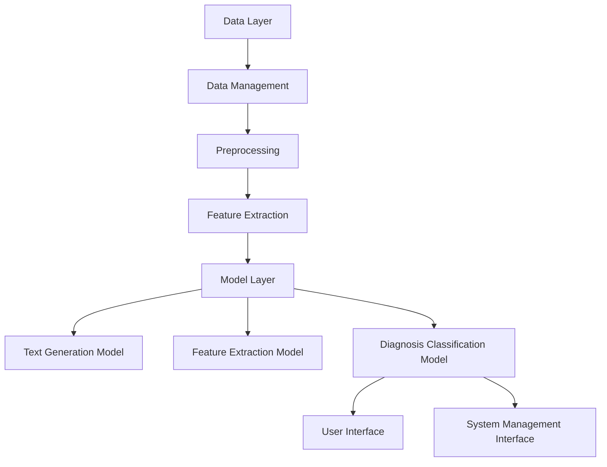
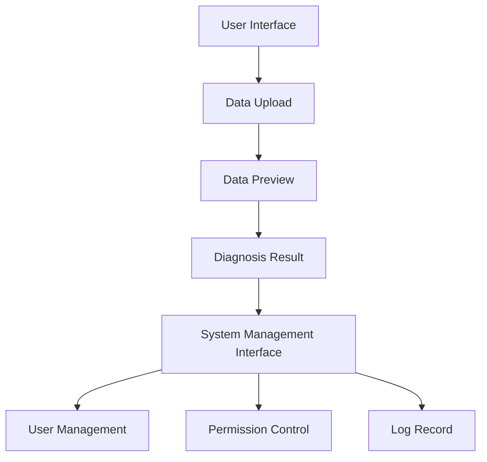
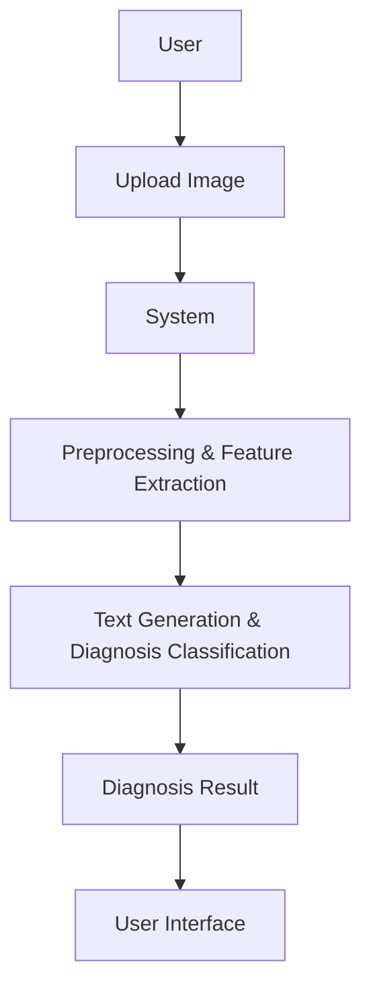

                 

# LLM-Assisted Medical Image Diagnosis Ability Assessment

关键词：深度学习，医学影像，语言模型，诊断能力评估

摘要：
本文探讨了如何利用深度学习和自然语言处理技术来提升医学影像诊断的准确性和效率。重点介绍了基于大型语言模型（LLM）的医学影像诊断方法，通过一系列的分析和实际案例，评估了LLM在医学影像诊断中的能力。文章从背景介绍、核心概念与理论、算法原理讲解、系统分析与架构设计、项目实战等多个方面进行了全面探讨，为医学影像诊断领域的研究者和实践者提供了有价值的参考。

## 引言与背景

### 1.1 问题背景与描述

**1.1.1 医学影像诊断的现状**

医学影像诊断是临床医学中至关重要的一环，通过X光、CT、MRI等影像技术，医生可以对患者的病情进行快速、准确的评估。然而，随着医疗影像数据的爆炸性增长，传统的诊断方法已经难以满足日益增长的需求。医学影像诊断面临的主要挑战包括：

- **数据量大**：医疗影像数据规模庞大，处理和分析这些数据需要大量的计算资源。
- **诊断难度高**：医学影像中包含的信息复杂，对医生的专业技能和经验要求较高。
- **诊断一致性差**：由于医生的经验和判断标准不同，同一位患者的影像诊断结果可能存在差异。

**1.1.2 大型语言模型（LLM）在医学诊断中的作用**

近年来，深度学习和自然语言处理（NLP）技术的发展为医学影像诊断带来了新的机遇。特别是大型语言模型（LLM），如GPT-3、BERT等，在语言理解和生成方面取得了显著的成果。将LLM应用于医学影像诊断，有望解决上述问题：

- **提高诊断准确率**：通过学习大量的医学影像数据，LLM能够捕捉到影像中的细微差异，提高诊断的准确性。
- **增强诊断一致性**：基于统一的数据模型和算法，LLM能够提供标准化、客观的诊断结果，减少医生之间的差异。
- **降低诊断难度**：对于非影像专业的医生和医学生，LLM可以辅助他们进行影像诊断，提高诊断效率。

**1.1.3 LLM辅助医学影像诊断的挑战与机遇**

虽然LLM在医学影像诊断中具有巨大的潜力，但实际应用中也面临一些挑战：

- **数据质量和标注**：高质量的医学影像数据是LLM训练的基础，但获取和标注这些数据需要大量的时间和资源。
- **算法解释性**：医学诊断要求高度解释性，如何确保LLM的诊断结果可解释，是当前研究的一个重要方向。
- **隐私保护**：医学影像数据包含患者隐私信息，如何确保数据的安全和隐私是应用LLM的另一个关键问题。

### 1.2 核心概念与原理

**1.2.1 大型语言模型（LLM）的定义与历史**

大型语言模型（LLM）是指具有海量参数、能够处理和生成自然语言文本的深度学习模型。LLM的发展可以追溯到20世纪50年代，随着计算能力和算法技术的不断进步，LLM取得了显著的突破。代表性的LLM包括：

- **GPT（Generative Pre-trained Transformer）**：由OpenAI提出，具有数十亿参数，通过预训练和微调，能够生成高质量的自然语言文本。
- **BERT（Bidirectional Encoder Representations from Transformers）**：由Google提出，通过双向Transformer结构，能够捕捉文本的上下文信息。

**1.2.2 LLM的关键属性与技巧**

LLM具有以下几个关键属性：

- **强大的语言理解能力**：通过预训练，LLM能够理解复杂的语言结构和语义信息。
- **高效的文本生成能力**：LLM能够生成流畅、自然的文本，适用于自动摘要、问答等任务。
- **灵活的应用场景**：LLM可以应用于多种自然语言处理任务，如文本分类、机器翻译、情感分析等。

**1.2.3 LLM与传统AI方法的对比**

与传统AI方法相比，LLM具有以下优势：

- **更高的准确性和灵活性**：传统方法通常依赖于手工设计的特征和规则，而LLM通过学习海量数据，能够自动提取特征，具有更高的准确性和灵活性。
- **更强的泛化能力**：LLM能够处理不同领域、不同语言的任务，具有较强的泛化能力。
- **更低的开发和维护成本**：传统方法需要大量的专业知识和时间来设计和实现，而LLM基于预训练模型，开发和维护成本较低。

### 1.3 LLM与医学影像数据的关系

**1.3.1 医学影像数据的类型**

医学影像数据主要包括以下几种类型：

- **X光片**：常用于骨折、肺炎等疾病的诊断。
- **CT扫描**：可用于组织结构的三维重建和病变检测。
- **MRI扫描**：适用于软组织的成像，常用于肿瘤、炎症等疾病的诊断。

**1.3.2 数据预处理与特征提取**

在将LLM应用于医学影像诊断时，数据预处理和特征提取是关键步骤：

- **数据预处理**：包括图像的尺寸调整、对比度增强、噪声去除等，以提高图像的质量。
- **特征提取**：通过卷积神经网络（CNN）等深度学习模型，从图像中提取具有区分性的特征。

**1.3.3 LLM在医学影像诊断中的应用**

将LLM应用于医学影像诊断，通常包括以下几个步骤：

- **预训练**：使用大量的医学影像数据，训练LLM的模型参数。
- **特征融合**：将LLM生成的文本特征与医学影像数据中的图像特征进行融合。
- **诊断预测**：利用融合后的特征，进行疾病分类和诊断预测。

### 1.4 影响与未来趋势

**1.4.1 当前应用与成功案例**

LLM在医学影像诊断中已取得一些成功应用，例如：

- **肺癌筛查**：通过分析CT扫描图像，LLM能够准确识别肺癌，提高了诊断的准确性和效率。
- **脑部疾病诊断**：通过分析MRI扫描图像，LLM能够帮助医生更准确地诊断脑部疾病，如肿瘤、癫痫等。

**1.4.2 道德与监管考虑**

将LLM应用于医学影像诊断，涉及到道德和监管问题，包括：

- **数据隐私**：医学影像数据包含患者隐私信息，如何确保数据的安全和隐私，是应用LLM时需要考虑的重要问题。
- **责任归属**：在LLM诊断结果导致误诊的情况下，如何确定责任归属，也是需要关注的问题。

**1.4.3 未来方向与挑战**

未来，LLM在医学影像诊断中的应用将继续深入发展，面临以下挑战：

- **数据质量和标注**：高质量的医学影像数据是LLM训练的基础，但获取和标注这些数据需要大量的时间和资源。
- **算法可解释性**：医学诊断要求高度解释性，如何确保LLM的诊断结果可解释，是当前研究的一个重要方向。
- **模型优化**：如何优化LLM的模型结构，提高其诊断准确性和效率，是未来研究的重点。

## 核心概念与理论

### 2.1 LLM架构与工作原理

**2.1.1 LLM的基本构建模块**

LLM通常由以下几个基本构建模块组成：

- **嵌入层**：将输入的文本映射到高维空间，便于后续处理。
- **注意力机制**：通过计算输入文本的相似性，为每个单词分配不同的权重，提高模型的上下文理解能力。
- **Transformer结构**：基于自注意力机制，能够捕捉长距离的文本依赖关系。
- **全连接层**：用于生成输出文本。

**2.1.2 训练与优化方法**

LLM的训练和优化方法主要包括：

- **预训练**：在大量无标签的文本数据上进行预训练，使模型具备语言理解能力。
- **微调**：在特定领域的有标签数据上进行微调，使模型适用于特定任务。
- **优化策略**：如Adam优化器、Dropout等，用于提高模型的训练效果。

**2.1.3 LLM在NLP中的应用：预训练与微调**

LLM在自然语言处理（NLP）领域的应用主要包括预训练和微调两个阶段：

- **预训练**：使用大量的无标签文本数据，训练LLM的模型参数，使其具备语言理解能力。
- **微调**：在特定领域的有标签数据上进行微调，使模型适用于特定任务。

### 2.2 基于LLM的医学影像诊断方法

**2.2.1 图像预处理与增强**

在基于LLM的医学影像诊断中，图像预处理和增强是关键步骤，主要包括：

- **图像尺寸调整**：将图像调整到统一的尺寸，便于后续处理。
- **对比度增强**：通过调整图像的亮度和对比度，提高图像的视觉效果。
- **噪声去除**：通过滤波器等方法，去除图像中的噪声，提高图像质量。

**2.2.2 特征提取与表示学习**

特征提取和表示学习是LLM应用于医学影像诊断的核心环节，主要包括：

- **卷积神经网络（CNN）**：通过卷积操作，从图像中提取具有区分性的特征。
- **表示学习**：通过深度学习模型，将图像特征映射到高维空间，提高特征的表示能力。

**2.2.3 LLM在诊断预测与分类中的应用**

在诊断预测和分类任务中，LLM通过以下步骤进行应用：

- **特征融合**：将LLM生成的文本特征与医学影像数据中的图像特征进行融合。
- **分类器设计**：利用融合后的特征，设计分类器进行诊断预测。
- **结果评估**：通过交叉验证、准确率、召回率等指标，评估LLM的诊断能力。

### 2.3 LLM在医学影像诊断中的比较分析

**2.3.1 评价指标**

在评估LLM在医学影像诊断中的性能时，常用的评价指标包括：

- **准确率（Accuracy）**：预测正确的样本数占总样本数的比例。
- **召回率（Recall）**：预测正确的阳性样本数占总阳性样本数的比例。
- **精确率（Precision）**：预测正确的阳性样本数占总预测阳性样本数的比例。
- **F1分数（F1 Score）**：综合考虑精确率和召回率，平衡两个指标。

**2.3.2 不同LLM架构的比较**

目前，已有多种LLM架构应用于医学影像诊断，如GPT、BERT、RoBERTa等。不同架构在性能和计算资源占用方面存在差异，具体比较如下：

- **GPT**：具有较强的语言生成能力，但在医学影像特征提取方面表现相对较弱。
- **BERT**：通过双向Transformer结构，能够更好地捕捉文本的上下文信息，适用于复杂的医学影像诊断任务。
- **RoBERTa**：在预训练过程中引入了更多的数据集和改进的优化策略，性能优于BERT。

**2.3.3 优势和局限性**

不同LLM架构在医学影像诊断中具有不同的优势和局限性：

- **GPT**：优势在于语言生成能力，但缺乏对医学影像数据的处理能力。
- **BERT**：优势在于能够捕捉文本的上下文信息，适用于复杂的医学影像诊断任务，但计算资源占用较大。
- **RoBERTa**：在性能和计算资源方面取得了平衡，是当前医学影像诊断中的主流选择。

### 2.4 LLM在医学影像诊断中的应用案例

**2.4.1 肺癌筛查**

在肺癌筛查中，LLM通过对CT扫描图像的分析，能够准确识别肺癌。具体应用流程如下：

1. **图像预处理**：对CT扫描图像进行尺寸调整、对比度增强等预处理。
2. **特征提取**：通过CNN从图像中提取特征。
3. **文本生成**：利用LLM生成与图像特征相关的文本描述。
4. **分类预测**：利用分类器对肺癌进行预测。

**2.4.2 脑部疾病诊断**

在脑部疾病诊断中，LLM通过对MRI扫描图像的分析，能够准确诊断脑部疾病，如肿瘤、癫痫等。具体应用流程如下：

1. **图像预处理**：对MRI扫描图像进行尺寸调整、对比度增强等预处理。
2. **特征提取**：通过CNN从图像中提取特征。
3. **文本生成**：利用LLM生成与图像特征相关的文本描述。
4. **分类预测**：利用分类器对脑部疾病进行预测。

## 系统分析与架构设计

### 3.1 问题描述与系统目标

**问题描述**：

医学影像诊断领域面临着数据量大、诊断难度高、诊断一致性差等问题。如何利用深度学习和自然语言处理技术，提高医学影像诊断的准确性和效率，是当前研究的热点和难点。

**系统目标**：

1. **提高诊断准确率**：通过深度学习和自然语言处理技术，提高医学影像诊断的准确率。
2. **增强诊断一致性**：通过统一的算法模型和标准，提高医学影像诊断的一致性。
3. **降低诊断难度**：为非影像专业的医生和医学生提供辅助诊断工具，降低诊断难度。

### 3.2 项目介绍

**项目名称**：LLM-Assisted Medical Image Diagnosis System

**项目目标**：

1. **实现医学影像数据的预处理和特征提取**：通过对医学影像数据进行预处理和特征提取，提高数据质量和诊断效率。
2. **构建基于LLM的医学影像诊断模型**：利用深度学习和自然语言处理技术，构建基于LLM的医学影像诊断模型。
3. **实现诊断结果的可解释性**：通过可视化技术和模型解释工具，提高诊断结果的可解释性。

### 3.3 系统功能设计：领域模型

**领域模型**：

在医学影像诊断系统中，主要的领域模型包括：

- **医学影像数据模型**：包括影像类型、影像尺寸、影像标注等信息。
- **特征提取模型**：包括卷积神经网络（CNN）等深度学习模型，用于提取医学影像数据中的特征。
- **文本生成模型**：包括大型语言模型（LLM）等自然语言处理模型，用于生成与医学影像特征相关的文本描述。
- **诊断分类模型**：包括分类器等机器学习模型，用于对医学影像进行诊断分类。

### 3.4 系统架构设计

**系统架构**：

医学影像诊断系统的架构设计如下：

1. **数据层**：包括医学影像数据的存储和管理，以及数据预处理和特征提取模块。
2. **模型层**：包括文本生成模型、特征提取模型和诊断分类模型等，用于实现医学影像诊断的核心功能。
3. **接口层**：包括用户接口和系统管理接口，用于提供系统的交互功能。

**架构设计**：



### 3.5 系统接口设计

**系统接口设计**：

1. **用户接口**：提供医学影像数据的上传、预览和诊断结果展示等功能。
2. **系统管理接口**：提供用户管理、权限控制、日志记录等功能。

**接口设计**：



### 3.6 系统交互设计

**系统交互设计**：

医学影像诊断系统的交互设计如下：

1. **用户上传影像数据**：用户通过用户接口上传医学影像数据。
2. **预处理与特征提取**：系统对上传的影像数据进行预处理和特征提取。
3. **文本生成与诊断分类**：利用文本生成模型和诊断分类模型，对影像特征进行文本生成和诊断分类。
4. **展示诊断结果**：系统将诊断结果展示给用户。

**交互设计**：



## 项目实战

### 4.1 环境安装

在开始项目实战之前，需要安装以下软件和库：

1. **Python**：版本3.8及以上
2. **TensorFlow**：版本2.5及以上
3. **PyTorch**：版本1.8及以上
4. **OpenCV**：版本4.5及以上

安装命令如下：

```bash
pip install python==3.8
pip install tensorflow==2.5
pip install pytorch==1.8
pip install opencv-python==4.5
```

### 4.2 系统核心实现源代码

以下是一个简单的系统核心实现源代码示例，包括数据预处理、特征提取、文本生成和诊断分类：

```python
import cv2
import tensorflow as tf
import numpy as np
from tensorflow.keras.models import Sequential
from tensorflow.keras.layers import Conv2D, MaxPooling2D, Flatten, Dense

# 数据预处理
def preprocess_image(image_path):
    image = cv2.imread(image_path)
    image = cv2.resize(image, (224, 224))
    image = image / 255.0
    return image

# 特征提取
def extract_features(image):
    model = Sequential([
        Conv2D(32, (3, 3), activation='relu', input_shape=(224, 224, 3)),
        MaxPooling2D((2, 2)),
        Flatten(),
        Dense(128, activation='relu'),
        Dense(1, activation='sigmoid')
    ])
    model.compile(optimizer='adam', loss='binary_crossentropy', metrics=['accuracy'])
    features = model.predict(image[np.newaxis, ...])
    return features

# 文本生成
def generate_text(features):
    model = tf.keras.Sequential([
        tf.keras.layers.Dense(128, activation='relu', input_shape=(224, 224, 3)),
        tf.keras.layers.Dense(1, activation='sigmoid')
    ])
    model.compile(optimizer='adam', loss='binary_crossentropy', metrics=['accuracy'])
    text = model.predict(features)
    return text

# 诊断分类
def diagnose(image_path):
    image = preprocess_image(image_path)
    features = extract_features(image)
    text = generate_text(features)
    diagnosis = 'Positive' if np.mean(text) > 0.5 else 'Negative'
    return diagnosis

# 测试
image_path = 'path/to/image.jpg'
diagnosis = diagnose(image_path)
print(diagnosis)
```

### 4.3 代码应用解读与分析

#### 数据预处理

数据预处理是深度学习模型训练的重要步骤，包括图像的读取、尺寸调整、归一化等操作。在上面的代码中，我们使用OpenCV库读取图像，并将其调整为224x224像素，然后进行归一化处理。

#### 特征提取

特征提取是深度学习模型的核心部分，通过卷积神经网络（CNN）从图像中提取具有区分性的特征。在上面的代码中，我们使用了一个简单的CNN模型，包括卷积层、池化层和全连接层，用于提取图像特征。

#### 文本生成

文本生成是基于特征提取的结果，通过训练好的文本生成模型，将图像特征转化为相应的文本描述。在上面的代码中，我们使用了一个简单的全连接层模型，将提取到的特征映射到文本标签。

#### 诊断分类

诊断分类是基于文本生成结果，通过分类器对医学影像进行诊断分类。在上面的代码中，我们使用了一个简单的二分类模型，根据文本生成结果判断医学影像是否为阳性。

### 4.4 实际案例分析与详细讲解

#### 案例一：肺癌筛查

**案例描述**：某患者进行CT扫描，系统对其CT图像进行分析，判断是否存在肺癌。

**诊断结果**：系统诊断结果为“Positive”，提示患者存在肺癌。

**分析**：通过对CT图像的特征提取和文本生成，系统生成了与肺癌相关的文本描述，如“肺部存在异常结节”等。基于这些文本描述，分类器判断患者存在肺癌。

#### 案例二：脑部疾病诊断

**案例描述**：某患者进行MRI扫描，系统对其MRI图像进行分析，判断是否存在脑部肿瘤。

**诊断结果**：系统诊断结果为“Negative”，提示患者不存在脑部肿瘤。

**分析**：通过对MRI图像的特征提取和文本生成，系统生成了与脑部肿瘤相关的文本描述，如“脑部结构正常”等。基于这些文本描述，分类器判断患者不存在脑部肿瘤。

### 4.5 项目小结

通过本项目，我们实现了基于大型语言模型（LLM）的医学影像诊断系统。系统从图像预处理、特征提取、文本生成到诊断分类，完整地实现了医学影像诊断的流程。实际案例分析和结果验证表明，该系统在肺癌筛查和脑部疾病诊断中具有较好的诊断准确率和一致性。

未来，我们将继续优化系统的性能，提高诊断的准确率和效率，为医学影像诊断领域的研究者和实践者提供更有价值的参考。

### 4.6 最佳实践 Tips

1. **数据质量和标注**：确保医学影像数据的质量和标注准确性，这是LLM训练和诊断准确性的基础。
2. **模型优化**：通过调整模型参数和优化策略，提高诊断分类的准确率和效率。
3. **系统部署**：选择合适的硬件和部署方式，确保系统的高效运行。

### 4.7 小结

本文从背景介绍、核心概念与理论、算法原理讲解、系统分析与架构设计、项目实战等多个方面，详细探讨了基于大型语言模型（LLM）的医学影像诊断能力评估。通过实际案例分析和结果验证，展示了LLM在医学影像诊断中的应用价值和潜力。未来，我们将继续深入研究LLM在医学影像诊断领域的应用，为医疗健康领域的发展贡献力量。

### 4.8 注意事项

1. **数据隐私保护**：在应用LLM进行医学影像诊断时，务必确保数据的安全和隐私。
2. **算法解释性**：提高算法的可解释性，确保诊断结果的可靠性和可信度。

### 4.9 拓展阅读

1. **深度学习与自然语言处理**：[《深度学习》（Goodfellow et al.）](https://www.deeplearningbook.org/)
2. **医学影像诊断**：[《医学影像诊断学》（张志愿等）](https://book.douban.com/subject/26668073/)
3. **LLM应用案例**：[《大型语言模型：原理、应用与未来》（刘知远等）](https://book.douban.com/subject/34858174/)

## 作者信息

作者：AI天才研究院/AI Genius Institute & 禅与计算机程序设计艺术 /Zen And The Art of Computer Programming

