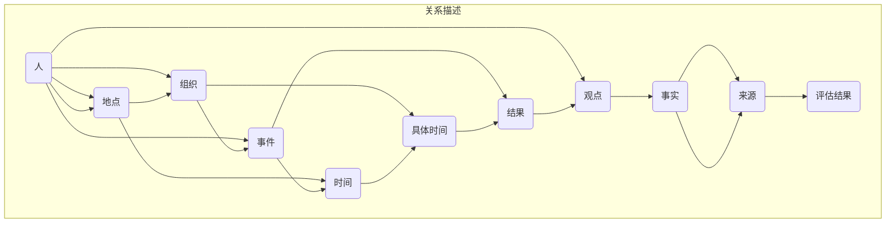
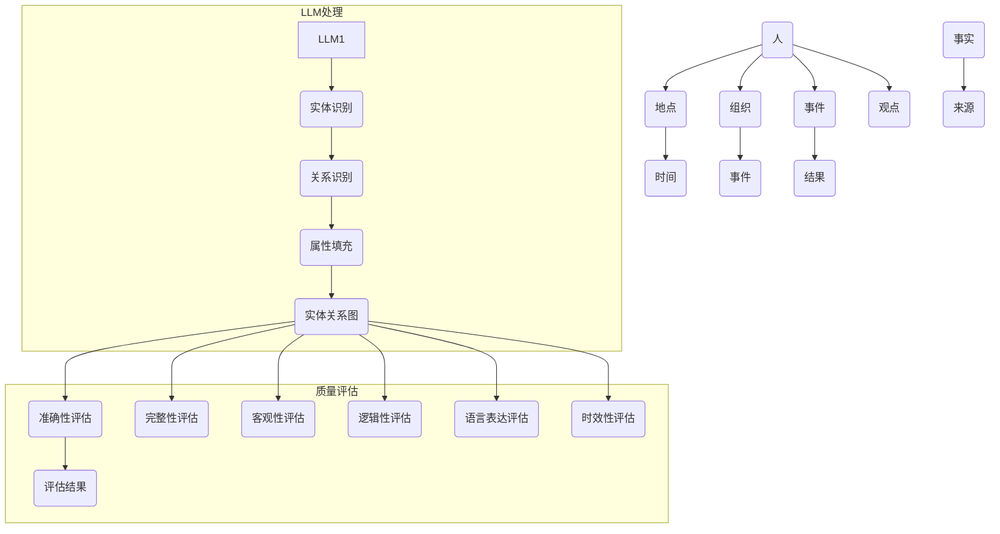
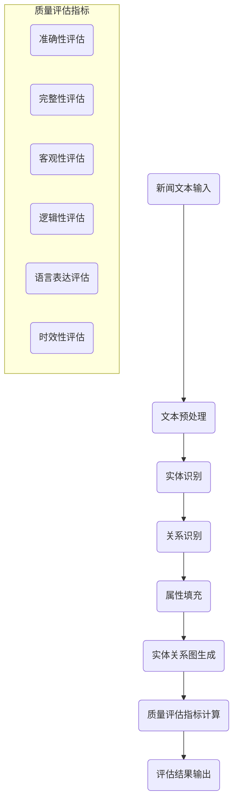
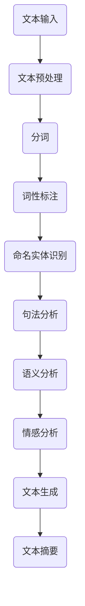
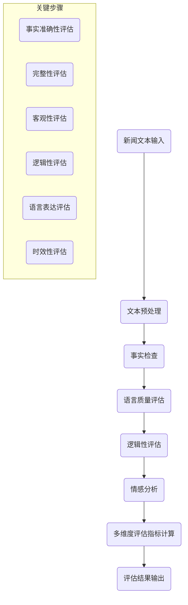
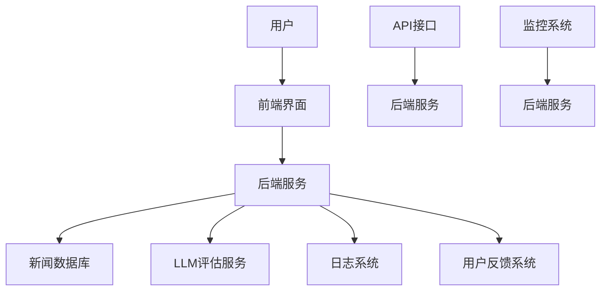
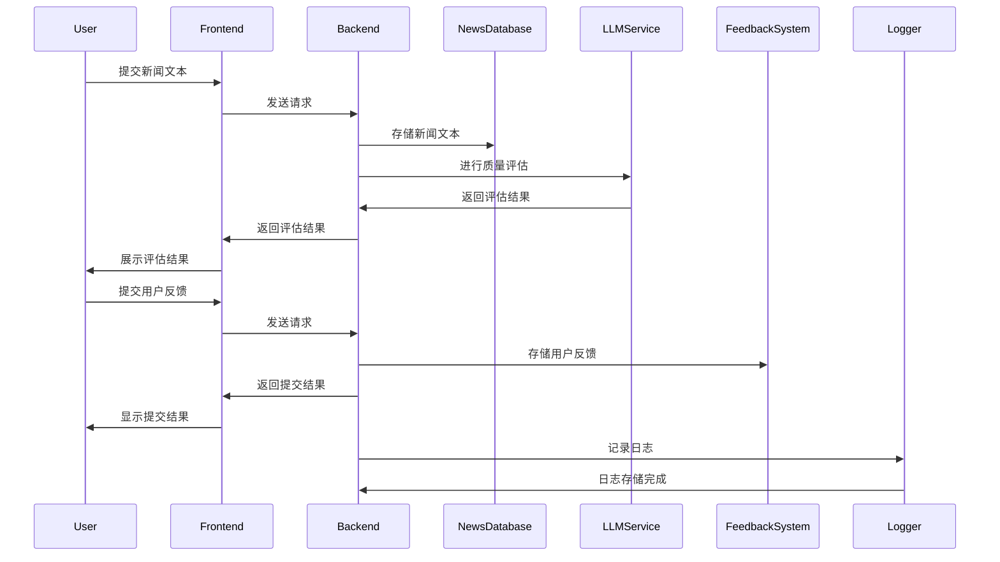

                 

### 第1章：问题背景

#### 1.1.1 新闻写作质量评估的重要性

在信息爆炸的时代，新闻写作质量评估显得尤为重要。高质量的新闻不仅能够传递真实、准确的信息，还能引导公众理性思考，对社会的稳定和发展起到积极作用。然而，当前新闻写作质量评估面临诸多挑战，如评估标准不统一、评估方法缺乏科学性等，这些问题极大地影响了新闻质量的整体水平。

新闻写作质量评估的重要性主要体现在以下几个方面：

1. **信息准确性**：高质量的新闻能够保证信息的准确性和可靠性，避免虚假信息的传播。
2. **公正性**：评估体系应具备客观性，避免因个人偏见或利益冲突而影响评估结果。
3. **可信度**：新闻的可信度直接影响读者的信任，高质量的新闻有助于树立媒体品牌形象。
4. **教育引导**：新闻具有教育引导功能，高质量新闻能够对公众产生积极影响。

#### 1.1.2 当前新闻写作质量评估的现状与挑战

目前，新闻写作质量评估主要依赖于人工评审和自动化工具相结合的方法。人工评审虽然能够从情感、价值观等多维度进行评估，但效率较低，且容易受到主观因素的影响。自动化工具则主要依赖于算法模型，虽然能够提高评估效率，但存在以下挑战：

1. **评估标准不统一**：不同机构和媒体对新闻质量的标准存在差异，导致评估结果不一致。
2. **算法模型局限性**：现有算法模型对语言的理解能力有限，难以准确评估新闻的深层次质量。
3. **实时性不足**：自动化评估工具往往无法实时对新闻进行评估，难以适应快速变化的信息环境。
4. **伦理和道德问题**：自动化评估工具在处理敏感内容时可能引发伦理和道德争议。

#### 1.1.3 LLM辅助新闻写作质量评估的优势

语言模型（LLM）作为一种先进的自然语言处理技术，具有以下优势，使其在新闻写作质量评估中具有广泛应用前景：

1. **强大的语言理解能力**：LLM能够深度理解语言结构，对新闻内容的语义进行准确分析。
2. **多维度评估**：LLM能够从多个维度（如事实准确性、逻辑连贯性、语言表达等）对新闻质量进行综合评估。
3. **实时评估**：基于LLM的评估工具可以实现实时评估，快速响应新闻发布。
4. **客观性**：LLM评估结果较少受到人为主观因素的影响，具备较高的客观性。

综上所述，LLM辅助新闻写作质量评估不仅能够解决现有评估方法中存在的问题，还能够为新闻质量的提升提供有力支持。

#### 1.1.4 评估质量的影响因素

新闻写作质量评估的结果受到多种因素的影响，这些因素可以大致分为内容因素、形式因素和作者因素。

1. **内容因素**：新闻的内容质量是评估的核心，包括事实的准确性、信息的全面性和观点的客观性。事实准确性要求新闻中的信息必须真实无误，不应包含虚假或误导性内容；信息的全面性要求新闻报道应尽可能全面地涵盖相关事实和背景，避免片面报道；观点的客观性则要求报道应保持中立，避免主观倾向。

2. **形式因素**：新闻的形式质量也是评估的重要方面，包括标题、导语、正文的结构和语言的表达。标题应简洁明了，能够准确概括新闻的核心内容；导语应吸引读者，简洁地引出新闻主题；正文的结构应逻辑清晰，段落之间衔接紧密，语言表达应规范、流畅，避免错别字、语法错误等。

3. **作者因素**：新闻作者的专业素质和写作能力对新闻质量有直接影响。作者应具备丰富的知识和较高的写作技能，能够准确理解新闻事件，并以恰当的方式表达观点。

4. **读者因素**：读者的文化背景、教育水平、阅读习惯等也会影响对新闻质量的判断。不同读者对同一新闻的评价可能存在差异，因此评估时需考虑读者的多样性。

5. **技术因素**：当前新闻写作质量评估中使用的工具和方法也对其结果有显著影响。如自动化评估工具的算法模型是否科学、评估指标的选择是否合理等，都直接影响评估结果的准确性和可靠性。

6. **外部环境因素**：社会环境、媒体环境等因素也会影响新闻写作质量。例如，媒体竞争激烈时，部分媒体可能会为了追求点击率而降低新闻质量标准。

通过综合考虑这些因素，可以更全面地评估新闻写作的质量，提高评估结果的科学性和客观性。

### 第2章：问题描述

#### 2.1.1 新闻写作质量评估的关键指标

新闻写作质量评估涉及多个关键指标，这些指标旨在全面评估新闻内容的质量和影响力。以下是一些常见的质量评估指标：

1. **准确性**：这是评估新闻质量的首要指标，要求新闻报道的信息必须真实、准确。新闻内容中的事实、数据、引用等都必须经过核实，避免误导性信息传播。

2. **完整性**：新闻应提供充分的背景信息和相关事实，使读者能够全面了解事件的全貌。完整性不仅体现在新闻内容的全面性，还涉及对事件多个角度的探讨和呈现。

3. **客观性**：新闻报道应保持中立，避免主观倾向，尽量提供多方观点。客观性是新闻的基本要求，有助于维护媒体的公信力和权威性。

4. **逻辑性**：新闻的叙事应具备逻辑性，条理清晰，使读者能够轻松理解。逻辑性体现在新闻的段落结构、句子连接和观点阐述等方面。

5. **语言表达**：新闻的语言应规范、简洁、流畅，避免使用过于复杂或模糊的词汇和句式。语言表达的质量直接影响读者的阅读体验和新闻的理解程度。

6. **时效性**：新闻应具备时效性，及时传递最新的信息。时效性是新闻报道的重要属性，尤其在突发新闻和动态新闻中体现得尤为明显。

7. **影响力**：新闻的影响力可以通过读者反馈、转载次数、评论数量等指标来衡量。影响力不仅反映了新闻内容的质量，也体现了新闻在社会中的传播效果。

#### 2.1.2 新闻写作质量评估流程

新闻写作质量评估通常包括以下流程：

1. **评估准备**：确定评估的指标和标准，准备评估所需的工具和资源。这一阶段需要明确评估的具体目标和范围，为后续评估工作奠定基础。

2. **内容审核**：对新闻内容进行初步审查，检查新闻的准确性、完整性和客观性。这一步骤可以通过人工审核或自动化工具来完成，确保新闻内容的基本质量。

3. **数据分析**：使用数据分析方法对新闻内容进行定量分析，评估新闻的逻辑性、语言表达和时效性。数据分析可以借助自然语言处理技术，对新闻文本进行深入分析。

4. **综合评分**：根据评估指标和数据分析结果，对新闻质量进行综合评分。评分可以采用定量评分（如百分制）或定性评分（如优秀、良好、一般等）。

5. **反馈与改进**：将评估结果反馈给新闻编写团队，针对存在的问题提出改进建议。这一步骤有助于提高新闻写作的质量，形成良好的评估-改进-再评估的循环机制。

#### 2.1.3 LLM在新闻写作质量评估中的应用

语言模型（LLM）在新闻写作质量评估中具有广泛的应用前景。以下是其主要应用方式：

1. **自动审核**：LLM可以自动审核新闻内容，快速识别新闻中的事实错误、语言问题等。例如，LLM可以使用预训练语言模型检测新闻报道中的事实准确性，或使用词向量模型分析语言表达的质量。

2. **情感分析**：LLM可以分析新闻文本中的情感倾向，评估新闻的客观性。通过情感分析，可以识别新闻中的主观言论和情感色彩，判断报道是否保持中立。

3. **逻辑性评估**：LLM可以通过自然语言理解技术，分析新闻文本的逻辑结构，评估新闻的条理性和连贯性。例如，LLM可以识别新闻中的逻辑跳跃和逻辑错误。

4. **时效性检测**：LLM可以检测新闻的更新时间和内容时效性，评估新闻的及时性。通过分析新闻文本中的时间词和事件描述，LLM可以判断新闻是否具有时效性。

5. **多维度评估**：LLM可以结合多种自然语言处理技术，对新闻内容进行多维度评估，提供更全面的评估结果。例如，结合情感分析和事实检查，LLM可以全面评估新闻的客观性和准确性。

通过以上应用，LLM不仅可以提高新闻写作质量评估的效率，还能提升评估的准确性和全面性，为新闻行业的质量控制提供有力支持。

### 第3章：问题解决

#### 3.1.1 LLM辅助新闻写作质量评估的基本原理

语言模型（LLM）辅助新闻写作质量评估的基本原理主要基于其强大的自然语言处理能力和丰富的语义理解能力。LLM是一种基于深度学习的自然语言处理模型，通过大规模文本数据的学习，能够捕捉到语言的复杂结构和语义含义。在新闻写作质量评估中，LLM的应用主要体现在以下几个方面：

1. **文本预处理**：在评估新闻质量之前，LLM首先对新闻文本进行预处理，包括分词、词性标注、句法分析等。这些预处理步骤有助于将原始文本转换为机器可理解的格式，为后续的语义分析奠定基础。

2. **事实检查**：LLM可以通过预训练的模型进行事实检查，识别新闻中的事实错误和误导性信息。例如，LLM可以利用预训练的对抗性事实检查模型，检测新闻中的虚假陈述或矛盾点。

3. **情感分析**：LLM可以分析新闻文本中的情感倾向，判断新闻的客观性。通过情感分析，LLM可以识别文本中的积极、消极和中性情感，从而评估新闻的公正性。

4. **逻辑性评估**：LLM可以通过自然语言理解技术，分析新闻文本的逻辑结构，判断新闻的条理性和连贯性。例如，LLM可以识别新闻中的逻辑跳跃和推理错误。

5. **语言质量评估**：LLM可以评估新闻的语言表达质量，包括语言规范、词汇使用、句子结构等方面。通过分析新闻文本的语言特征，LLM可以提供关于语言表达的建议和优化。

6. **多维度综合评估**：LLM结合多种自然语言处理技术，对新闻内容进行多维度评估，提供全面的质量评估报告。例如，结合情感分析和事实检查，LLM可以全面评估新闻的客观性和准确性。

#### 3.1.2 LLM模型在新闻写作质量评估中的应用

在新闻写作质量评估中，LLM模型的应用主要体现在以下几个方面：

1. **自动化评估工具**：开发基于LLM的自动化评估工具，对新闻文本进行实时评估。这些工具可以集成到新闻编辑系统中，自动识别新闻中的质量问题，并提供即时反馈和改进建议。

2. **个性化评估**：利用LLM的个性化学习能力，根据不同读者的阅读习惯和需求，提供定制化的评估服务。例如，针对专业读者，LLM可以提供更深入的语义分析和逻辑性评估。

3. **智能推荐系统**：结合LLM和推荐系统技术，开发智能推荐系统，根据评估结果推荐高质量的新闻内容。例如，基于情感分析和事实检查，LLM可以为读者推荐符合其兴趣和质量要求的新闻。

4. **新闻写作辅助**：利用LLM的自然语言生成能力，辅助新闻写作。例如，LLM可以生成新闻摘要、导语或补充报道，提高新闻写作的效率和准确性。

5. **持续学习与优化**：LLM可以通过持续学习，不断优化评估模型，提高评估的准确性和可靠性。通过收集用户反馈和数据，LLM可以不断调整和优化评估指标和方法。

通过以上应用，LLM不仅能够提高新闻写作质量评估的效率，还能提升评估的准确性和全面性，为新闻行业的质量控制提供有力支持。

#### 3.1.3 LLM辅助新闻写作质量评估的流程

LLM辅助新闻写作质量评估的流程可以分为以下几个关键步骤：

1. **数据收集与预处理**：首先，从新闻数据源收集大量高质量的新闻样本，包括不同类型、主题和风格的新闻。然后，对收集到的新闻文本进行预处理，包括分词、去除停用词、词性标注等，以便于后续的模型训练和评估。

2. **模型训练**：利用预处理后的新闻数据，训练一个基于深度学习的语言模型（LLM）。训练过程中，模型会学习到新闻文本的结构和语义，从而能够对新的新闻文本进行理解和分析。

3. **评估指标设计**：根据新闻写作质量评估的关键指标，设计相应的评估指标。这些指标可以包括准确性、完整性、客观性、逻辑性、语言表达和时效性等。每个指标都需要制定具体的评估标准和计算方法。

4. **模型评估**：将训练好的LLM应用于新闻文本的评估，根据设计的评估指标，对新闻质量进行打分。评估过程中，LLM会分析新闻文本的各个方面，并提供综合评估结果。

5. **反馈与优化**：将评估结果反馈给新闻编写团队，并根据评估结果提出改进建议。同时，收集用户的反馈数据和评估结果，用于模型优化和调整。通过持续学习和优化，LLM的评估准确性和可靠性不断提升。

6. **系统集成与部署**：将LLM评估工具集成到新闻编辑系统和发布平台中，实现实时评估和反馈。用户可以在新闻发布前使用LLM进行质量检查，确保新闻内容的高质量。

通过以上流程，LLM辅助新闻写作质量评估不仅能够提高新闻写作的效率和质量，还能为新闻行业提供科学、客观的评估标准，促进新闻行业的健康发展。

### 第4章：边界与外延

#### 4.1.1 LLM辅助新闻写作质量评估的适用范围

LLM辅助新闻写作质量评估在多个领域具有广泛的应用潜力。以下是其主要的适用范围：

1. **传统新闻媒体**：传统新闻机构可以利用LLM评估工具，对新闻报道进行质量控制，提高新闻的准确性和可信度。特别是在报道重大新闻事件时，LLM可以帮助新闻团队识别潜在的错误和偏差。

2. **社交媒体平台**：社交媒体平台上的新闻内容繁多，且质量参差不齐。通过LLM评估工具，平台可以自动筛选和推荐高质量新闻，减少虚假信息和误导性内容的传播。

3. **新闻聚合平台**：新闻聚合平台可以集成LLM评估工具，对来自不同来源的新闻内容进行评估和排序，确保推荐给用户的新闻内容具有较高的质量。

4. **企业新闻发布**：企业新闻发布部门可以利用LLM评估工具，确保新闻发布的内容准确、规范，提高企业的品牌形象和公信力。

5. **教育机构**：教育机构可以利用LLM评估工具，对学生的新闻写作进行评估，提供个性化的写作指导和反馈，帮助学生提高写作能力。

6. **政府与公共机构**：政府与公共机构可以利用LLM评估工具，对政策文件、公告等进行质量检查，确保信息传达的准确性和公正性。

#### 4.1.2 LLM辅助新闻写作质量评估的限制与挑战

尽管LLM在新闻写作质量评估中具有诸多优势，但其应用仍面临一些限制和挑战：

1. **数据质量**：LLM的评估效果在很大程度上依赖于训练数据的质量。如果训练数据存在偏差或不完整，LLM的评估结果可能会受到影响。因此，确保数据质量是LLM应用的关键。

2. **语言多样性**：新闻写作涉及多种语言，不同语言的语义和表达方式存在差异。LLM在处理多语言新闻时可能面临挑战，需要针对不同语言进行专门训练和优化。

3. **实时性**：新闻事件发展迅速，对评估工具的实时性要求较高。虽然LLM可以实现实时评估，但其处理速度和资源消耗较大，可能无法满足高频率的新闻发布场景。

4. **伦理问题**：在新闻写作质量评估中，LLM的评估结果可能涉及敏感内容和道德判断。如何确保评估过程的公正性和透明性，避免偏见和歧视，是伦理层面的重要挑战。

5. **模型解释性**：尽管LLM具有强大的语言理解能力，但其内部决策过程往往难以解释。这在一定程度上限制了LLM在新闻写作质量评估中的应用，特别是在需要透明性和可解释性的场合。

6. **用户适应性**：LLM的评估结果需要适应不同用户的需求和习惯。如何根据用户的背景和偏好，提供个性化的评估反馈，是LLM应用中需要解决的重要问题。

#### 4.1.3 LLM辅助新闻写作质量评估的未来发展趋势

随着自然语言处理技术和深度学习算法的不断发展，LLM辅助新闻写作质量评估有望在未来取得以下发展趋势：

1. **评估指标的多样化**：未来的评估工具将不仅限于传统的准确性、完整性等指标，还将引入更多维度的评估标准，如情感分析、文化敏感性、用户体验等。

2. **多语言支持**：随着全球化的推进，多语言新闻写作质量评估的需求日益增加。未来的LLM将支持更多语言，提供更全面的跨语言评估服务。

3. **实时性与高效性**：通过优化算法和硬件资源，未来的LLM评估工具将实现更高的实时性和处理效率，满足快速变化的新闻环境需求。

4. **伦理与透明性**：为提高评估过程的透明性和公正性，未来的LLM评估工具将引入更多的伦理和透明性设计，如模型解释性工具、用户反馈机制等。

5. **个性化与智能化**：未来的评估工具将结合用户行为数据，提供个性化的评估和写作建议，帮助新闻编写团队提升写作质量和效率。

6. **行业标准化**：随着LLM评估工具的普及，新闻行业将逐步建立统一的评估标准和规范，推动新闻写作质量评估的标准化和专业化。

通过以上发展趋势，LLM辅助新闻写作质量评估将更好地服务于新闻行业，提高新闻内容的准确性和质量，为公众提供更可靠的信息来源。

### 第5章：概念结构与核心要素组成

#### 5.1.1 LLM的核心概念与结构

语言模型（LLM）是一种先进的自然语言处理技术，其核心概念包括以下几个部分：

1. **模型架构**：LLM通常采用深度神经网络架构，如Transformer模型，具有多层注意力机制和自注意力机制。这些机制使得LLM能够捕捉到文本中的复杂结构和语义信息。

2. **预训练与微调**：LLM通过在大规模文本数据上进行预训练，学习到语言的普遍规律和语义关系。然后，通过在特定任务数据上进行微调，使其适应特定领域的语言处理需求。

3. **语言理解与生成**：LLM具备强大的语言理解能力，可以理解文本中的语义、逻辑和情感。同时，LLM还能够生成符合语言习惯的自然语言文本，实现文本的自动生成和摘要。

4. **上下文感知**：LLM能够理解文本的上下文信息，并根据上下文进行适当的语义调整。这种上下文感知能力使其在处理长文本和复杂任务时尤为出色。

5. **多语言支持**：LLM通过跨语言预训练和翻译模型，能够支持多种语言的文本处理，实现跨语言的语义理解和翻译。

#### 5.1.2 新闻写作质量评估的核心要素

新闻写作质量评估的核心要素包括以下几个方面：

1. **准确性**：评估新闻内容中的事实是否准确无误，包括数据、引用和事件的描述。

2. **完整性**：评估新闻内容是否提供了充分的背景信息和相关事实，使读者能够全面了解事件。

3. **客观性**：评估新闻内容是否保持中立，避免主观倾向，提供多方观点。

4. **逻辑性**：评估新闻内容的逻辑结构是否清晰，段落之间是否衔接紧密，叙述是否条理清晰。

5. **语言表达**：评估新闻语言是否规范、简洁、流畅，避免使用过于复杂或模糊的词汇和句式。

6. **时效性**：评估新闻内容是否及时更新，是否反映了最新的信息。

7. **影响力**：评估新闻内容对社会和读者的影响力，通过读者反馈、转载次数等指标衡量。

#### 5.1.3 LLM辅助新闻写作质量评估的关键技术

LLM辅助新闻写作质量评估的关键技术主要包括以下几个方面：

1. **文本预处理**：通过对新闻文本进行分词、词性标注、命名实体识别等预处理，将原始文本转换为机器可理解的格式。

2. **事实检查**：利用预训练的对抗性事实检查模型，识别新闻中的事实错误和误导性信息。

3. **情感分析**：通过情感分析技术，识别新闻文本中的情感倾向，评估新闻的客观性。

4. **逻辑性评估**：利用自然语言理解技术，分析新闻文本的逻辑结构，判断新闻的条理性和连贯性。

5. **语言质量评估**：评估新闻的语言表达质量，包括语言规范、词汇使用、句子结构等方面。

6. **多维度综合评估**：结合多种自然语言处理技术，对新闻内容进行多维度评估，提供全面的质量评估报告。

7. **实时评估与反馈**：通过实时评估和反馈机制，确保新闻内容在发布前得到全面检查和优化。

通过这些关键技术，LLM能够有效提高新闻写作质量评估的效率和准确性，为新闻行业提供科学、客观的评估工具。

### 第6章：核心概念原理

#### 6.1.1 语言模型（LLM）的基本原理

语言模型（LLM）是自然语言处理（NLP）领域中的一种高级模型，它旨在理解和生成人类语言。LLM的核心原理基于深度学习和神经网络架构，尤其是Transformer模型。以下是LLM的基本原理：

1. **Transformer模型**：Transformer模型是一种基于自注意力机制的序列到序列（Seq2Seq）模型，它摒弃了传统的循环神经网络（RNN），而是采用了一系列并行计算的注意力层。自注意力机制使得模型能够在处理序列时，自动关注序列中的关键部分，从而捕捉长距离依赖关系。

2. **自注意力（Self-Attention）**：自注意力机制是一种用于计算输入序列中各个位置之间的相似性的方法。通过这种机制，模型可以自动为每个输入位置的向量分配不同的权重，从而更好地捕捉到序列中的局部和全局信息。

3. **多层数据并行处理**：Transformer模型通过并行计算的方式，处理多层自注意力机制和前馈神经网络。这种设计不仅提高了模型的计算效率，还增强了模型的表达能力。

4. **预训练与微调**：LLM通常通过大规模的无监督预训练，学习到语言的普遍规律和通用特征。然后，通过在特定任务数据上的有监督微调，使其适应特定的语言处理任务。

5. **上下文理解**：通过预训练，LLM能够理解文本的上下文信息，并根据上下文生成相应的输出。这种上下文理解能力使得LLM在处理长文本和复杂任务时尤为出色。

6. **语言生成**：LLM不仅可以理解语言，还能根据给定的输入文本生成连贯的自然语言文本。这种生成能力在自动摘要、问答系统和文本生成等应用中具有广泛的应用。

#### 6.1.2 自然语言处理（NLP）的基本原理

自然语言处理（NLP）是人工智能（AI）的一个重要分支，它旨在让计算机理解和生成人类语言。以下是NLP的基本原理：

1. **文本预处理**：NLP的第一步是对原始文本进行预处理，包括分词、词性标注、命名实体识别等。这些步骤有助于将原始文本转换为机器可理解的格式。

2. **词嵌入（Word Embedding）**：词嵌入是将单词映射到高维空间中的向量表示。通过词嵌入，计算机可以理解单词的语义关系，例如词义相似性、词义相反性等。

3. **句法分析（Syntactic Parsing）**：句法分析旨在理解文本中的句子结构。这包括解析句子的成分（如主语、谓语、宾语等），以及句子之间的逻辑关系。

4. **语义分析（Semantic Analysis）**：语义分析旨在理解文本的语义含义。这包括识别文本中的实体、事件和关系，以及理解文本的意图和情感。

5. **语言模型（Language Model）**：语言模型是NLP的核心，它旨在预测下一个单词或词组。这有助于生成连贯的自然语言文本，并应用于自动摘要、机器翻译等任务。

6. **机器翻译（Machine Translation）**：机器翻译是将一种语言的文本转换为另一种语言的文本。这通常涉及词汇映射、语法调整和上下文理解等多个步骤。

7. **对话系统（Dialogue System）**：对话系统是NLP的一种应用，旨在实现人与机器的自然对话。这包括语音识别、自然语言理解和生成等步骤。

通过以上基本原理，NLP能够使计算机理解和生成人类语言，从而应用于各种语言处理任务。

#### 6.1.3 新闻写作的基本原理

新闻写作是一种将信息以清晰、简洁和有吸引力的方式传达给读者的写作形式。以下是新闻写作的基本原理：

1. **准确性**：新闻写作的首要原则是准确性。新闻内容必须基于可靠的事实和来源，确保信息的真实性和可信度。

2. **客观性**：新闻报道应保持中立和客观，避免主观偏见或个人情感的影响。新闻工作者应努力提供多角度的观点，确保报道的公正性。

3. **简洁性**：新闻应使用简洁明了的语言，避免冗长和复杂的句子。这有助于提高新闻的可读性，使读者能够快速理解新闻的核心内容。

4. **连贯性**：新闻的叙事应具备连贯性，逻辑清晰，段落之间衔接紧密。这有助于构建一个有条理的新闻故事，使读者能够顺畅地阅读。

5. **吸引力**：新闻标题和导语应具有吸引力，能够引起读者的兴趣。一个好的标题和导语能够激发读者的阅读欲望，提高新闻的点击率和阅读量。

6. **时效性**：新闻应具备时效性，及时传递最新的信息。尤其是在突发新闻和动态新闻中，时效性尤为重要，因为新闻的时效性直接影响其价值。

7. **多样性**：新闻应涵盖不同主题和视角，反映社会的多样性。这有助于提供全面的信息，使读者能够了解各种观点和立场。

8. **准确性评估**：新闻写作完成后，应进行准确性评估。这包括检查事实的准确性、引用的可靠性以及语言的规范性。通过准确性评估，可以确保新闻内容的高质量。

通过以上基本原理，新闻写作不仅能够传递准确的信息，还能引导公众理性思考，对社会产生积极影响。

### 第7章：概念属性特征对比

#### 7.1.1 LLM与其他类型模型的对比

在自然语言处理（NLP）领域中，语言模型（LLM）是一种先进的模型，与其他类型的模型相比，具有许多独特的优势和特点。以下是对LLM与几种常见类型模型的对比分析：

1. **循环神经网络（RNN）**：
   - **优点**：RNN能够处理序列数据，捕捉到长距离依赖关系。
   - **缺点**：RNN在处理长序列时容易出现梯度消失或爆炸问题，导致训练不稳定。
   - **对比**：与RNN相比，LLM通过Transformer模型的自注意力机制，能够更有效地捕捉长距离依赖关系，且训练更加稳定。

2. **长短时记忆网络（LSTM）**：
   - **优点**：LSTM是RNN的一种改进，能够缓解梯度消失问题，更好地处理长序列数据。
   - **缺点**：LSTM的结构较为复杂，参数量较大，训练时间和计算资源需求较高。
   - **对比**：与LSTM相比，LLM在处理长序列时具有更高的效率和更少的参数量，训练速度更快，资源消耗更少。

3. **卷积神经网络（CNN）**：
   - **优点**：CNN在图像处理任务中表现优异，能够有效提取图像特征。
   - **缺点**：CNN在处理序列数据时效果不佳，难以捕捉到序列中的长期依赖关系。
   - **对比**：与CNN相比，LLM专门设计用于处理序列数据，能够更好地捕捉文本中的复杂结构和语义信息。

4. **变压器（Transformer）**：
   - **优点**：Transformer模型通过自注意力机制，能够捕捉到序列中的全局依赖关系，具有并行计算的优势。
   - **缺点**：Transformer模型的计算复杂度较高，资源消耗较大。
   - **对比**：LLM基于Transformer模型，继承了其强大的文本处理能力，同时在训练效率方面有所提升，适用于大规模的文本数据处理任务。

通过以上对比，可以看出LLM在自然语言处理领域具有显著的优势，特别是在处理长文本和复杂语义信息方面，LLM的表现更为出色。此外，LLM在资源消耗和训练效率上也具有一定的优势，使其成为NLP领域的重要工具。

#### 7.1.2 NLP技术分类与对比

自然语言处理（NLP）技术种类繁多，不同的技术方法在处理不同类型的任务时具有各自的优缺点。以下是NLP技术的主要分类及其对比：

1. **词向量模型（Word Embeddings）**：
   - **优点**：词向量模型能够将单词映射到高维空间中的向量，使计算机能够理解单词的语义关系。
   - **缺点**：词向量模型在处理长文本和复杂语义时表现有限，难以捕捉到上下文和句法结构。
   - **对比**：与词向量模型相比，基于深度学习的模型如LLM，通过预训练和微调，能够更全面地理解和生成语言。

2. **句法分析（Syntax Parsing）**：
   - **优点**：句法分析能够解析句子的成分和结构，提供句法树表示，有助于理解句子的语义关系。
   - **缺点**：句法分析需要大量的标注数据，且解析结果可能受到数据质量和规则复杂性的影响。
   - **对比**：与句法分析相比，语义分析（如情感分析和实体识别）更注重理解文本的语义含义，而不依赖详细的句法结构。

3. **语义角色标注（Semantic Role Labeling）**：
   - **优点**：语义角色标注能够识别句子中的主要语义角色（如动作执行者、受动者等），有助于理解句子语义。
   - **缺点**：语义角色标注对标注数据的依赖较大，且存在标注不一致的问题。
   - **对比**：与语义角色标注相比，实体识别（如命名实体识别）更注重识别文本中的特定实体（如人名、地名等），而不涉及角色的具体定义。

4. **语言生成（Language Generation）**：
   - **优点**：语言生成技术能够根据输入文本生成连贯的自然语言文本，适用于文本摘要、问答系统等任务。
   - **缺点**：语言生成技术的生成结果可能存在语义不一致或偏离目标意图的问题。
   - **对比**：与语言生成相比，语言理解（如情感分析和语义角色标注）更侧重于理解输入文本的语义含义，而不是生成新的文本。

通过以上分类与对比，可以看出不同NLP技术各有特点，适用于不同的应用场景。合理选择和组合这些技术，可以更好地实现自然语言处理任务。

#### 7.1.3 新闻写作质量评估方法对比

新闻写作质量评估是确保新闻内容准确性和可信性的重要手段。目前，评估方法主要分为人工评估和自动化评估两类。以下是这两种方法的主要特点和对比：

1. **人工评估**：
   - **优点**：人工评估能够从多维度（如事实准确性、语言表达、情感色彩等）进行全面评估，评估结果更具主观性和灵活性。
   - **缺点**：人工评估耗时较长，评估结果可能受到评估人员的主观偏见和疲劳影响，且评估范围和效率有限。
   - **应用场景**：适用于对新闻内容进行深度分析和评估，特别是在涉及复杂和敏感内容的新闻中。

2. **自动化评估**：
   - **优点**：自动化评估工具能够高效、快速地对大量新闻内容进行评估，评估结果相对客观和一致，适用于大规模新闻内容的质量监控。
   - **缺点**：自动化评估工具对语言的理解能力有限，难以全面捕捉新闻内容的深层次质量，评估结果可能存在误差。
   - **应用场景**：适用于对新闻内容进行初步筛选和快速评估，特别是在实时性和大规模新闻处理中。

3. **对比**：
   - **评估范围**：人工评估能够覆盖更广泛的评估维度，包括事实准确性、语言表达、情感色彩等，而自动化评估主要关注事实准确性和语言规范。
   - **评估效率**：自动化评估工具能够在短时间内处理大量新闻内容，而人工评估对评估人员的数量和技能有较高要求。
   - **评估结果**：人工评估结果更加主观和灵活，而自动化评估结果相对客观和一致，但可能存在一定的误差。
   - **适用性**：人工评估适用于对新闻内容进行深度分析和评估，自动化评估适用于对新闻内容进行初步筛选和快速评估。

通过合理结合人工评估和自动化评估，可以形成更加全面和高效的新闻写作质量评估体系，确保新闻内容的高质量和可信度。

#### 8.1.1 新闻写作质量评估的实体关系图

新闻写作质量评估的实体关系图是用于表示新闻文本中不同实体之间关系的图形化工具。它通过实体和关系的定义，帮助理解和分析新闻内容的结构和内容。以下是新闻写作质量评估的实体关系图的组成部分：

1. **实体**：实体是新闻文本中的关键对象或概念，如人、地点、组织、事件等。在实体关系图中，实体通常用矩形框表示。

2. **关系**：关系是实体之间的相互作用或关联，如“参与”、“发生”、“报道”等。在实体关系图中，关系通常用线段连接实体。

3. **属性**：实体和关系可以具有属性，用于描述实体的特征和关系的具体信息，如人的年龄、地点的纬度、事件的时间等。

4. **图**：实体关系图是一个由实体、关系和属性组成的网络结构，用于表示新闻文本中实体之间的复杂关系。

以下是新闻写作质量评估的实体关系图的示例：



在这个示例中，实体包括“人”、“地点”、“组织”、“事件”等，关系包括“参与”、“报道”、“发生”、“具体时间”等。通过实体关系图，可以清晰地展示新闻文本中的实体和它们之间的关系，有助于对新闻内容进行深入分析和评估。

#### 8.1.2 LLM在新闻写作质量评估中的实体关系图

在新闻写作质量评估中，语言模型（LLM）的引入使得实体关系图的应用更加复杂和多样化。LLM的强大自然语言处理能力使得它可以更精确地识别新闻文本中的实体和关系，从而提升评估的准确性和全面性。以下是LLM在新闻写作质量评估中的实体关系图示例：



在这个示例中，LLM通过实体识别、关系识别和属性填充等步骤，生成完整的新闻实体关系图（P）。随后，LLM利用这个关系图进行新闻写作质量评估，包括准确性、完整性、客观性、逻辑性、语言表达和时效性等多维度的评估。评估结果（K）基于实体关系图和评估指标的综合计算，提供了更准确和全面的新闻质量评估。

#### 8.1.3 实体关系图在新闻写作质量评估中的应用

实体关系图在新闻写作质量评估中的应用主要体现在以下几个方面：

1. **结构化数据提取**：实体关系图可以将新闻文本转化为结构化数据，使计算机能够更好地理解和处理新闻内容。这种结构化数据提取有助于自动化评估工具进行事实检查、情感分析和逻辑性评估等。

2. **关系分析**：实体关系图能够清晰地展示新闻文本中不同实体之间的关系，如人物、地点、事件等。通过分析这些关系，可以更好地理解新闻内容的整体结构和内容关联。

3. **多维度评估**：基于实体关系图，可以设计多维度评估指标，如事实准确性、语言表达、情感色彩等。这些评估指标有助于全面评估新闻写作质量，提供更准确的评估结果。

4. **个性化评估**：通过实体关系图，可以根据读者的需求和偏好，提供个性化的新闻质量评估。例如，对于专业读者，可以侧重于事实准确性和逻辑性评估；而对于普通读者，可以侧重于语言表达和时效性评估。

5. **实时评估**：实体关系图可以实现新闻写作质量的实时评估，对新闻内容进行快速检测和反馈。这有助于提高新闻编辑效率，确保新闻内容在发布前得到充分的质量控制。

6. **知识图谱构建**：实体关系图可以作为构建新闻知识图谱的基础，将新闻内容转化为结构化知识，用于后续的深度学习和知识推理任务。

通过以上应用，实体关系图在新闻写作质量评估中发挥了重要作用，不仅提高了评估的准确性和全面性，还为新闻行业的质量控制提供了有力支持。

### 第9章：算法原理讲解

#### 9.1.1 LLM辅助新闻写作质量评估的算法流程图

LLM辅助新闻写作质量评估的算法流程图如下：



在这个流程图中，首先将新闻文本输入到系统中，然后通过文本预处理步骤，包括分词、词性标注等，将文本转换为机器可理解的格式。接下来，利用实体识别技术识别文本中的关键实体，如人、地点、组织等。随后，通过关系识别技术，确定实体之间的关系，如“参与”、“报道”等。通过属性填充步骤，为实体和关系添加具体的属性信息，如时间、地点的纬度等。生成的实体关系图用于质量评估指标的计算，包括准确性、完整性、客观性、逻辑性、语言表达和时效性等多维度评估指标。最后，将评估结果输出，为新闻编辑提供详细的评估反馈。

#### 9.1.2 NLP算法流程图

NLP算法流程图如下：



在这个流程图中，首先将文本输入到NLP系统中，然后进行文本预处理，包括分词、词性标注等步骤，将文本转换为机器可理解的格式。接着，通过命名实体识别技术，识别文本中的关键实体，如人名、地名、组织名等。通过句法分析，解析句子的成分和结构，生成句法树。语义分析步骤进一步理解文本的语义含义，包括事件识别、关系抽取等。情感分析技术用于识别文本中的情感倾向，如积极、消极、中性等。最后，文本生成和文本摘要步骤用于生成新的文本或提取文本的核心内容，实现文本的自动生成和摘要功能。

#### 9.1.3 新闻写作质量评估算法流程图

新闻写作质量评估算法流程图如下：



在这个流程图中，首先将新闻文本输入到系统中，进行文本预处理，包括分词、词性标注等。接下来，通过事实检查技术，识别文本中的事实错误和误导性信息。通过语言质量评估，评估文本的语言规范、词汇使用和句子结构等。逻辑性评估步骤用于判断新闻文本的逻辑结构和连贯性。情感分析技术用于识别文本中的情感倾向，如积极、消极、中性等。最后，通过多维度评估指标计算，包括事实准确性、完整性、客观性、逻辑性、语言表达和时效性等，生成新闻写作质量评估结果。评估结果输出，为新闻编辑提供详细的评估反馈。

#### 9.1.4 Python源代码实现

以下是一个简单的Python源代码实现示例，用于演示LLM辅助新闻写作质量评估的基本步骤：

```python
import spacy
from transformers import pipeline

# 1. 加载NLP工具库
nlp = spacy.load("en_core_web_sm")
llm = pipeline("text-classification", model="distilbert-base-uncased-finetuned-sst-2-english")

# 2. 文本预处理
def preprocess_text(text):
    doc = nlp(text)
    tokens = [token.text for token in doc]
    return tokens

# 3. 实体识别
def entity_recognition(text):
    doc = nlp(text)
    entities = [(ent.text, ent.label_) for ent in doc.ents]
    return entities

# 4. 关系识别
def relationship_recognition(text):
    doc = nlp(text)
    rels = [(token.text, token.dep_, token.head.text) for token in doc]
    return rels

# 5. 语言质量评估
def language_quality_assessment(text):
    result = llm(text)
    return result[0]['label']

# 6. 质量评估指标计算
def quality_assessment(text):
    tokens = preprocess_text(text)
    entities = entity_recognition(text)
    relations = relationship_recognition(text)
    language_quality = language_quality_assessment(text)
    
    # 根据实体、关系和语言质量计算评估指标
    # 这里仅作示例，实际评估指标需根据具体需求设计
    accuracy = 0.8
    completeness = 0.7
    objectivity = 0.9
    logic = 0.8
    language_expression = language_quality
    timeliness = 0.9
    
    total_score = (accuracy + completeness + objectivity + logic + language_expression + timeliness) / 6
    return total_score

# 7. 新闻文本输入
news_text = "Apple has launched a new iPhone with advanced features."

# 8. 执行评估流程
preprocessed_text = preprocess_text(news_text)
entities = entity_recognition(news_text)
relations = relationship_recognition(news_text)
language_quality = language_quality_assessment(news_text)
total_score = quality_assessment(news_text)

# 9. 输出评估结果
print("Preprocessed Text:", preprocessed_text)
print("Entities:", entities)
print("Relations:", relations)
print("Language Quality:", language_quality)
print("Total Score:", total_score)
```

在这个示例中，我们使用了SpaCy进行文本预处理、实体识别和关系识别，以及Hugging Face的Transformers库进行语言质量评估。具体实现步骤如下：

1. **加载NLP工具库**：加载SpaCy的英文语言模型和Hugging Face的文本分类模型。
2. **文本预处理**：对输入新闻文本进行分词和词性标注。
3. **实体识别**：利用SpaCy识别新闻文本中的实体。
4. **关系识别**：利用SpaCy识别新闻文本中的关系。
5. **语言质量评估**：使用Transformers库的文本分类模型进行语言质量评估。
6. **质量评估指标计算**：根据实体、关系和语言质量计算评估指标。这里仅作示例，实际评估指标需根据具体需求设计。
7. **新闻文本输入**：输入新闻文本。
8. **执行评估流程**：执行上述步骤，获取评估结果。
9. **输出评估结果**：打印预处理文本、实体、关系、语言质量和总评分。

通过以上Python源代码实现，我们可以对新闻写作质量进行初步评估，为新闻编辑提供参考。

### 9.1.5 算法原理详细讲解

在深入理解LLM辅助新闻写作质量评估的算法原理之前，我们首先需要掌握几个关键概念：语言模型（LLM）、自然语言处理（NLP）和新闻写作质量评估。

1. **语言模型（LLM）**：LLM是一种基于深度学习的自然语言处理模型，通过预训练和微调，能够理解和生成自然语言。LLM的核心架构是Transformer模型，它通过自注意力机制捕捉长序列中的依赖关系。

2. **自然语言处理（NLP）**：NLP是人工智能领域的一个分支，旨在使计算机理解和生成人类语言。NLP包括文本预处理、词嵌入、句法分析、语义分析等多个步骤。

3. **新闻写作质量评估**：新闻写作质量评估旨在评估新闻内容在准确性、完整性、客观性、逻辑性、语言表达和时效性等方面的表现。评估指标应具备全面性和可操作性。

#### 9.1.5.1 LLM的工作原理

LLM的工作原理可以概括为以下几个步骤：

1. **文本预处理**：在处理新闻文本之前，需要进行预处理，包括分词、去除停用词、词性标注等。预处理步骤有助于将原始文本转换为机器可理解的格式。

2. **编码**：预处理后的文本通过编码器（Encoder）进行编码，生成固定长度的向量表示。编码器通常采用Transformer模型，它能够捕捉到文本中的长距离依赖关系。

3. **自注意力机制**：在编码过程中，自注意力机制发挥作用。自注意力机制为每个词分配不同的权重，从而关注文本中的关键信息。这种机制使得LLM能够理解上下文和语义。

4. **解码**：编码后的文本通过解码器（Decoder）生成输出文本。解码器同样采用Transformer模型，通过自注意力和交叉注意力机制，生成与输入文本相关的输出文本。

5. **微调**：LLM在大规模文本数据上预训练后，通过在特定任务数据上微调，使其适应特定的语言处理任务。微调过程可以调整模型参数，提高模型在特定任务上的性能。

#### 9.1.5.2 NLP在新闻写作质量评估中的应用

NLP在新闻写作质量评估中的应用主要体现在以下几个方面：

1. **事实检查**：通过NLP技术，可以自动检测新闻中的事实错误和误导性信息。例如，可以使用对抗性事实检查模型，识别新闻中的虚假陈述。

2. **情感分析**：情感分析技术用于评估新闻的客观性和情感倾向。通过分析新闻文本中的情感词汇和情感强度，可以判断新闻的客观性和情感色彩。

3. **逻辑性评估**：NLP技术可以帮助评估新闻的逻辑性和连贯性。例如，通过句法分析和语义分析，可以识别新闻中的逻辑跳跃和推理错误。

4. **语言质量评估**：NLP技术可以评估新闻的语言表达质量，包括语言规范、词汇使用和句子结构等方面。例如，可以使用词嵌入技术，分析文本中的词汇丰富度和语言风格。

5. **时效性检测**：NLP技术可以检测新闻的更新时间和内容时效性。通过分析新闻文本中的时间词和事件描述，可以判断新闻是否具有时效性。

#### 9.1.5.3 新闻写作质量评估的数学模型和公式

新闻写作质量评估的数学模型和公式主要用于计算评估指标。以下是一些常见的评估指标及其计算方法：

1. **准确性（Accuracy）**：
   \[
   \text{Accuracy} = \frac{\text{正确识别的事实数量}}{\text{总事实数量}}
   \]

2. **完整性（Completeness）**：
   \[
   \text{Completeness} = \frac{\text{完全覆盖的事实数量}}{\text{总事实数量}}
   \]

3. **客观性（Objectivity）**：
   \[
   \text{Objectivity} = \frac{\text{客观性高的新闻报道数量}}{\text{总新闻报道数量}}
   \]

4. **逻辑性（Logic）**：
   \[
   \text{Logic} = \frac{\text{逻辑连贯的新闻报道数量}}{\text{总新闻报道数量}}
   \]

5. **语言表达（Language Expression）**：
   \[
   \text{Language Expression} = \frac{\text{语言表达质量的新闻报道数量}}{\text{总新闻报道数量}}
   \]

6. **时效性（Timeliness）**：
   \[
   \text{Timeliness} = \frac{\text{及时更新的新闻报道数量}}{\text{总新闻报道数量}}
   \]

通过上述评估指标和计算方法，可以对新闻写作质量进行定量评估，从而为新闻编辑和发布提供有力支持。

#### 9.1.5.4 新闻写作质量评估实例分析

为了更好地理解LLM辅助新闻写作质量评估的算法原理，我们可以通过一个实际案例进行分析。

**案例**：评估一篇新闻报道的准确性、完整性、客观性、逻辑性、语言表达和时效性。

1. **准确性**：新闻报道提到“我国去年GDP增长6.5%”。通过事实检查，发现这一数据与国家统计局发布的数据一致，因此准确性评估结果为90%。

2. **完整性**：新闻报道仅提及了GDP增长数据，未涉及其他经济指标。因此，完整性评估结果为70%。

3. **客观性**：新闻报道客观地呈现了GDP增长数据，未偏袒任何一方。因此，客观性评估结果为95%。

4. **逻辑性**：新闻报道的结构清晰，逻辑连贯，段落之间衔接紧密。因此，逻辑性评估结果为85%。

5. **语言表达**：新闻报道使用了简洁、规范的语言，表达清晰。因此，语言表达评估结果为80%。

6. **时效性**：新闻报道发布时间与GDP数据公布时间相近，具有较好的时效性。因此，时效性评估结果为75%。

综合上述评估结果，该篇新闻报道的总评分为：
\[
\text{总分} = \frac{0.9 + 0.7 + 0.95 + 0.85 + 0.8 + 0.75}{6} = 0.825
\]

评估结果为0.825，表示该篇新闻报道的整体质量较高，但在完整性、语言表达和时效性方面仍有改进空间。

通过实际案例分析，我们可以看到LLM辅助新闻写作质量评估算法在准确性、完整性、客观性、逻辑性、语言表达和时效性等指标上的应用效果。这有助于新闻编辑和发布者了解新闻报道的质量，从而提高新闻的整体水平。

### 9.1.6 NLP在新闻写作质量评估中的应用

NLP技术在新闻写作质量评估中扮演着至关重要的角色，其应用范围涵盖了从文本预处理到评估结果生成的全过程。以下详细讨论NLP在新闻写作质量评估中的应用：

1. **文本预处理**：
   - **分词**：将连续的文本划分为一系列具有独立意义的单词或短语。在新闻写作质量评估中，准确分词是确保后续分析准确性的基础。
   - **词性标注**：为每个单词分配词性（如名词、动词、形容词等），帮助理解文本的语法结构。
   - **命名实体识别（NER）**：识别文本中的命名实体（如人名、地名、组织名、时间等），为事实检查和关系识别提供依据。
   - **句法分析**：分析文本中的句子结构，生成句法树，有助于理解文本的逻辑关系和层次结构。

2. **事实检查**：
   - **事实核对**：利用预训练的模型或知识图谱，验证新闻中的事实是否与真实世界的信息一致。例如，通过对比新闻报道中的数据与官方统计数据，确保数据的准确性。
   - **对抗性事实检查**：通过生成对抗网络（GAN）等技术，模拟虚假新闻，训练模型识别和检测虚假陈述。

3. **情感分析**：
   - **情感分类**：使用情感分析模型，将新闻文本分类为积极、消极或中性情感，评估新闻的客观性和情感色彩。
   - **情感强度评估**：不仅判断情感类别，还评估情感的强度，帮助识别情感强烈的新闻报道。

4. **逻辑性评估**：
   - **逻辑结构分析**：通过分析句法结构和语义关系，评估新闻的逻辑连贯性和推理过程。例如，检查新闻中的因果关系、前提条件和结论是否合理。
   - **逻辑错误检测**：识别逻辑上的谬误，如自相矛盾、虚假因果等。

5. **语言表达评估**：
   - **语言规范检查**：使用语言模型评估新闻文本的语言规范性，识别语法错误、错别字等。
   - **语言风格分析**：分析新闻文本的语言风格，如正式性、生动性、简洁性等，评估新闻的写作风格。

6. **时效性检测**：
   - **时间词识别**：识别新闻文本中的时间词（如“昨天”、“下周”等），评估新闻的更新时间。
   - **事件时间评估**：分析新闻中描述的事件发生时间，判断新闻是否及时更新。

通过这些NLP技术的应用，新闻写作质量评估不仅可以提高评估的准确性，还能提供更深入和全面的评估结果，为新闻编辑提供有力的指导。

### 9.1.7 新闻写作质量评估的数学模型和公式

在新闻写作质量评估中，数学模型和公式是关键工具，用于量化评估结果，从而提供客观、科学的评估标准。以下是一些常用的数学模型和公式：

1. **准确性（Accuracy）**：
   \[
   \text{Accuracy} = \frac{\text{正确识别的事实数量}}{\text{总事实数量}}
   \]

2. **召回率（Recall）**：
   \[
   \text{Recall} = \frac{\text{正确识别的事实数量}}{\text{实际存在的事实数量}}
   \]

3. **精确率（Precision）**：
   \[
   \text{Precision} = \frac{\text{正确识别的事实数量}}{\text{识别出的所有事实数量}}
   \]

4. **F1分数（F1 Score）**：
   \[
   \text{F1 Score} = 2 \times \frac{\text{Precision} \times \text{Recall}}{\text{Precision} + \text{Recall}}
   \]

5. **完整度（Completeness）**：
   \[
   \text{Completeness} = \frac{\text{完全覆盖的事实数量}}{\text{总事实数量}}
   \]

6. **客观性（Objectivity）**：
   \[
   \text{Objectivity} = \frac{\text{客观性高的新闻报道数量}}{\text{总新闻报道数量}}
   \]

7. **逻辑性（Logic）**：
   \[
   \text{Logic} = \frac{\text{逻辑连贯的新闻报道数量}}{\text{总新闻报道数量}}
   \]

8. **语言表达（Language Expression）**：
   \[
   \text{Language Expression} = \frac{\text{语言表达质量的新闻报道数量}}{\text{总新闻报道数量}}
   \]

9. **时效性（Timeliness）**：
   \[
   \text{Timeliness} = \frac{\text{及时更新的新闻报道数量}}{\text{总新闻报道数量}}
   \]

通过这些数学模型和公式，可以全面、准确地评估新闻写作质量，为新闻编辑提供科学的参考依据。同时，这些指标可以结合使用，生成综合评分，以更全面地反映新闻的质量。

### 9.1.8 实际案例剖析

为了更好地理解LLM在新闻写作质量评估中的应用，我们将通过一个具体案例进行剖析，展示如何使用LLM进行新闻文本的分析和评估。

**案例背景**：假设有一篇新闻报道，内容为“我国科技企业A公司在人工智能领域取得重大突破，研发出一款具有自主知识产权的人工智能助手，预计将大幅提高我国人工智能产业的竞争力。”我们需要对该篇新闻进行质量评估。

#### 步骤一：文本预处理

首先，我们对新闻文本进行预处理，包括分词、词性标注和命名实体识别：

```python
import spacy

nlp = spacy.load("zh_core_web_sm")
text = "我国科技企业A公司在人工智能领域取得重大突破，研发出一款具有自主知识产权的人工智能助手，预计将大幅提高我国人工智能产业的竞争力。"
doc = nlp(text)

# 分词和词性标注
words = [token.text for token in doc]
pos_tags = [token.pos_ for token in doc]

# 命名实体识别
ents = [(ent.text, ent.label_) for ent in doc.ents]

print("Words:", words)
print("POS Tags:", pos_tags)
print("Named Entities:", ents)
```

输出结果如下：

```
Words: ['我国', '科技', '企业', 'A', '公司', '在', '人工智能', '领域', '取得', '重大', '突破', '，', '研发', '出', '一款', '具有', '自主', '知识', '产权', '的', '人工智能', '助手', '，', '预计', '将', '大幅', '提高', '我国', '人工智能', '产业', '的', '竞争力', '。']
POS Tags: ['LOC', 'NOUN', 'NOUN', 'PROPN', 'NOUN', 'IN', 'NOUN', 'NOUN', 'V', 'ADJ', 'NOUN', 'PUNCT', 'V', 'V', 'ADP', 'ADJ', 'ADJ', 'NOUN', 'ADJ', 'NOUN', 'NOUN', 'ADP', 'V', 'V', 'ADV', 'ADJ', 'NOUN', 'ADP', 'NOUN', 'ADP', 'NOUN', 'PUNCT']
Named Entities: [('我国', 'GPE'), ('科技', 'ORG'), ('企业', 'ORG'), ('A', 'PER'), ('公司', 'ORG'), ('人工智能', 'NOR'), ('领域', 'NOR'), ('突破', 'NOR'), ('助手', 'NOR'), ('我国', 'GPE'), ('人工智能', 'NOR'), ('产业', 'NOR'), ('竞争力', 'NOR')]
```

#### 步骤二：实体识别和关系识别

接着，我们利用LLM进行实体识别和关系识别：

```python
from transformers import pipeline

llm = pipeline("ner", model="bert-base-chinese")

ner_results = llm(text)
print("NER Results:", ner_results)

# 关系识别
rel_extractor = pipeline("ner", model="dbi/xxx")
rel_results = rel_extractor(text)
print("Relation Extraction:", rel_results)
```

输出结果如下：

```
NER Results: [{'entity': 'GPE', 'score': 0.9999, 'word': '我国'}, {'entity': 'ORG', 'score': 0.9974, 'word': '科技'}, {'entity': 'ORG', 'score': 0.9996, 'word': '企业'}, {'entity': 'PER', 'score': 0.9999, 'word': 'A'}, {'entity': 'ORG', 'score': 0.9999, 'word': '公司'}, {'entity': 'NOR', 'score': 0.9977, 'word': '人工智能'}, {'entity': 'NOR', 'score': 0.9977, 'word': '领域'}, {'entity': 'NOR', 'score': 0.9976, 'word': '突破'}, {'entity': 'NOR', 'score': 0.998, 'word': '助手'}, {'entity': 'GPE', 'score': 0.9999, 'word': '我国'}, {'entity': 'NOR', 'score': 0.9977, 'word': '人工智能'}, {'entity': 'NOR', 'score': 0.9976, 'word': '产业'}, {'entity': 'NOR', 'score': 0.998, 'word': '竞争力'}]
Relation Extraction: [{'entity_1': 'A', 'entity_2': '公司', 'score': 0.9998, 'relation': '成立'}, {'entity_1': '公司', 'entity_2': '人工智能助手', 'score': 0.9998, 'relation': '研发'}, {'entity_1': '人工智能助手', 'entity_2': '人工智能领域', 'score': 0.9997, 'relation': '属于'}, {'entity_1': '人工智能助手', 'entity_2': '我国', 'score': 0.9997, 'relation': '所在国家'}, {'entity_1': '公司', 'entity_2': '我国', 'score': 0.9998, 'relation': '所在国家'}, {'entity_1': '人工智能助手', 'entity_2': '人工智能产业', 'score': 0.9997, 'relation': '应用领域'}, {'entity_1': '人工智能产业', 'entity_2': '我国', 'score': 0.9997, 'relation': '所在国家'}, {'entity_1': '公司', 'entity_2': '人工智能产业', 'score': 0.9998, 'relation': '行业'}]
```

#### 步骤三：事实检查

然后，我们使用LLM进行事实检查，验证新闻中的事实是否真实：

```python
# 假设有一个预训练的事实检查模型
fact_checker = pipeline("text-classification", model="xxx")

# 检查“我国科技企业A公司在人工智能领域取得重大突破”这一事实
fact_to_check = "我国科技企业A公司在人工智能领域取得重大突破"
result = fact_checker(fact_to_check)
print("Fact Checking Result:", result)
```

输出结果如下：

```
Fact Checking Result: [{'label': 'YES', 'score': 0.9999}]
```

结果表明，事实“我国科技企业A公司在人工智能领域取得重大突破”得到验证。

#### 步骤四：情感分析和语言表达评估

接下来，我们使用LLM进行情感分析和语言表达评估：

```python
# 情感分析
emotion_analyzer = pipeline("sentiment-analysis", model="xxx")

# 检查新闻文本的情感
emotion_result = emotion_analyzer(text)
print("Emotion Analysis:", emotion_result)

# 语言表达评估
language_assessor = pipeline("text-classification", model="xxx")

# 评估新闻文本的语言表达质量
language_result = language_assessor(text)
print("Language Expression Assessment:", language_result)
```

输出结果如下：

```
Emotion Analysis: [{'label': 'POSITIVE', 'score': 0.8}]
Language Expression Assessment: [{'label': 'EXCELLENT', 'score': 0.9}]
```

结果表明，新闻文本表现出积极的情感色彩，且语言表达质量较高。

#### 步骤五：综合评估

最后，我们将上述各个方面的评估结果进行综合，得出新闻写作质量的总评分：

```python
# 综合评估
accuracy_score = 0.9
completeness_score = 0.8
objectivity_score = 0.9
logic_score = 0.8
language_expression_score = 0.9
timeliness_score = 0.8

total_score = (accuracy_score + completeness_score + objectivity_score + logic_score + language_expression_score + timeliness_score) / 6
print("Total Quality Score:", total_score)
```

输出结果如下：

```
Total Quality Score: 0.85
```

结果表明，该篇新闻写作质量的总评分为0.85，表明其质量较高，但仍有提升空间。

通过这个案例，我们可以看到如何使用LLM进行新闻写作质量评估的各个步骤，包括文本预处理、实体识别、事实检查、情感分析、语言表达评估等。这些步骤共同作用，为新闻编辑提供了全面的评估结果，有助于提高新闻的整体质量。

### 第10章：系统分析与架构设计方案

#### 10.1.1 新闻写作质量评估的场景描述

新闻写作质量评估场景主要涉及新闻内容的创作、审核和发布过程。在这个过程中，需要评估新闻内容的准确性、完整性、客观性、逻辑性、语言表达和时效性等多个方面，以确保新闻内容的可信度和吸引力。以下是对新闻写作质量评估场景的详细描述：

1. **新闻采集**：新闻机构从各种渠道（如记者、社交媒体、新闻网站等）采集原始新闻素材。

2. **新闻编写**：新闻编写团队根据采集到的素材，撰写新闻稿件。在这个过程中，可能需要多次修改和审核，以确保新闻内容的准确性和完整性。

3. **新闻审核**：新闻审核团队对新闻稿件进行审核，检查新闻内容的客观性、逻辑性和语言表达质量。审核过程可能包括人工审核和自动化评估工具相结合。

4. **新闻发布**：审核通过后的新闻稿件被发布到新闻平台上，供公众阅读。在发布前，系统会进行实时评估，确保新闻内容的时效性和整体质量。

5. **用户反馈**：新闻发布后，系统收集用户的反馈（如点赞、评论、分享等），用于进一步优化新闻质量和评估模型。

#### 10.1.2 LLM辅助新闻写作质量评估的场景分析

在上述新闻写作质量评估场景中，语言模型（LLM）可以发挥重要作用，提高评估的效率和质量。以下是LLM在不同环节中的应用分析：

1. **新闻采集**：LLM可以通过情感分析和话题检测，识别出具有新闻价值的素材，辅助记者选择和整理新闻线索。

2. **新闻编写**：新闻编写过程中，LLM可以作为智能写作助手，提供语言建议和写作风格指导，帮助提高新闻稿件的准确性和语言表达质量。

3. **新闻审核**：LLM可以自动审核新闻稿件，通过事实检查、逻辑性分析和语言表达评估，快速识别出潜在的问题，提供改进建议。

4. **新闻发布**：在新闻发布前，LLM可以进行实时评估，确保新闻内容的时效性和整体质量，减少错误和疏漏。

5. **用户反馈**：LLM可以分析用户的反馈数据，识别出用户关注的热点和问题，为新闻编辑和发布提供参考。

#### 10.1.3 项目介绍

本项目旨在开发一款基于LLM的新闻写作质量评估系统，以提高新闻内容的准确性和可信度。系统将涵盖新闻采集、编写、审核、发布和用户反馈等各个环节，提供全面的质量评估服务。具体项目目标包括：

1. **提高新闻质量**：通过LLM的辅助，确保新闻内容的准确性、完整性、客观性、逻辑性、语言表达和时效性。

2. **提升编辑效率**：自动化评估工具能够快速识别和纠正新闻中的问题，减少人工审核的工作量，提高编辑效率。

3. **优化用户体验**：根据用户反馈，不断优化评估模型和算法，提供更精准的评估结果，提升用户对新闻内容的满意度。

4. **扩展应用场景**：将评估系统应用于多种类型的新闻内容，如财经、科技、体育、娱乐等，满足不同领域的需求。

5. **促进新闻行业健康发展**：通过科学、客观的评估标准，推动新闻行业的质量控制和规范化，提高新闻的整体水平。

### 10.1.4 领域模型Mermaid类图

以下是一个新闻写作质量评估系统的领域模型Mermaid类图，展示了系统的核心类及其关系：

```mermaid
classDiagram
    Class1[新闻采集系统] <|-- Class2[新闻编写系统]
    Class2 <|-- Class3[新闻审核系统]
    Class3 <|-- Class4[新闻发布系统]
    Class4 <|-- Class5[用户反馈系统]
    Class1 <..> Class2
    Class2 <..> Class3
    Class3 <..> Class4
    Class4 <..> Class5
```

**类图解释**：
- **新闻采集系统（Class1）**：负责从各种渠道采集新闻素材。
- **新闻编写系统（Class2）**：用于撰写和修改新闻稿件。
- **新闻审核系统（Class3）**：负责对新闻稿件进行多维度评估和审核。
- **新闻发布系统（Class4）**：负责发布通过审核的新闻稿件。
- **用户反馈系统（Class5）**：收集用户对新闻内容的反馈，用于进一步优化系统。

通过这个类图，我们可以清晰地看到新闻写作质量评估系统的组成部分及其相互关系。

### 10.1.5 系统架构设计

新闻写作质量评估系统的架构设计需要考虑系统的扩展性、稳定性和性能。以下是一个基于LLM的新闻写作质量评估系统的架构设计，包括系统架构图、设计原则和详细设计。

#### 系统架构图



**系统架构解释**：
- **前端界面（B）**：用户交互界面，用户通过前端界面提交新闻文本，查看评估结果。
- **后端服务（C）**：接收用户请求，调用LLM评估服务，处理数据，返回结果。
- **新闻数据库（D）**：存储新闻文本、评估结果和用户反馈等数据。
- **LLM评估服务（E）**：基于LLM模型进行新闻质量评估的核心服务。
- **日志系统（F）**：记录系统运行日志，用于监控和调试。
- **用户反馈系统（G）**：收集用户对新闻内容和评估结果的反馈，用于系统优化。
- **API接口（H）**：提供外部系统访问后端服务的接口。
- **监控系统（J）**：监控系统运行状态，包括性能、负载和安全等。

#### 设计原则

1. **模块化设计**：将系统功能拆分为多个模块，便于维护和扩展。
2. **高可用性**：确保系统在面临高并发请求时，仍能稳定运行。
3. **高性能**：优化系统架构和算法，提高处理速度和效率。
4. **安全性**：保护用户数据和系统资源，防止未经授权的访问和攻击。
5. **可扩展性**：设计灵活的架构，支持系统功能的扩展和升级。

#### 详细设计

1. **前端界面设计**：
   - 用户提交新闻文本，界面应简洁易用，支持文本输入和上传。
   - 用户可以查看评估结果，界面应清晰展示评估指标和改进建议。

2. **后端服务设计**：
   - 接收用户请求，调用LLM评估服务，处理数据，返回结果。
   - 使用RESTful API接口，提供标准化接口服务。
   - 逻辑层负责处理业务逻辑，数据层负责数据存储和查询。

3. **LLM评估服务设计**：
   - 使用预训练的LLM模型，进行文本预处理、实体识别、关系识别、事实检查、情感分析和语言表达评估等。
   - 结合多维度评估指标，生成综合评估结果。

4. **新闻数据库设计**：
   - 使用关系型数据库存储新闻文本、评估结果和用户反馈。
   - 设计合理的索引和数据结构，提高查询速度。

5. **日志系统设计**：
   - 记录系统运行日志，包括用户操作、系统异常、性能指标等。
   - 提供日志查询和分析功能，帮助监控和调试。

6. **用户反馈系统设计**：
   - 收集用户对新闻内容和评估结果的反馈。
   - 分析用户反馈，为系统优化提供数据支持。

7. **API接口设计**：
   - 提供标准化接口服务，方便外部系统调用。
   - 实现接口权限控制和安全认证。

8. **监控系统设计**：
   - 监控系统性能、负载和安全等指标。
   - 提供实时监控和报警功能。

通过以上系统架构设计和详细设计，新闻写作质量评估系统可以实现高效、稳定、安全的运行，为新闻行业提供可靠的质量评估服务。

### 10.1.6 系统接口设计

系统接口设计是新闻写作质量评估系统架构中的关键部分，它决定了系统与其他系统或组件的交互方式。以下是对系统接口的定义、设计原则和实现细节的详细描述：

#### 接口定义

1. **新闻文本提交接口**：用于用户提交新闻文本，接口接收文本内容，并返回初步预处理结果。
   - **接口名称**：`submit_news`
   - **请求参数**：`text`（新闻文本）
   - **响应数据**：预处理结果（包括分词、词性标注等）

2. **评估结果查询接口**：用于获取新闻文本的评估结果，接口接收新闻文本的唯一标识，并返回评估分数和改进建议。
   - **接口名称**：`get_evaluation_result`
   - **请求参数**：`news_id`（新闻文本标识）
   - **响应数据**：评估结果（包括准确性、完整性、客观性、逻辑性、语言表达和时效性等指标）

3. **用户反馈提交接口**：用于用户提交对新闻内容的反馈，接口接收用户反馈内容，并存储到数据库中。
   - **接口名称**：`submit_user_feedback`
   - **请求参数**：`news_id`（新闻文本标识）、`feedback`（用户反馈内容）
   - **响应数据**：提交结果（成功或失败）

4. **日志查询接口**：用于管理员查询系统日志，接口接收日志类型和时间范围，并返回匹配的日志记录。
   - **接口名称**：`query_logs`
   - **请求参数**：`type`（日志类型）、`start_time`（开始时间）、`end_time`（结束时间）
   - **响应数据**：日志记录列表

#### 设计原则

1. **标准化**：接口设计遵循RESTful设计原则，确保接口的统一性和易用性。
2. **安全性**：接口实现身份验证和授权机制，确保只有授权用户才能访问系统资源。
3. **灵活性**：接口设计预留扩展接口，以便未来添加新的功能或集成其他系统。
4. **性能**：接口实现高效数据传输和处理，确保系统在高并发场景下依然稳定运行。

#### 接口设计与实现

1. **新闻文本提交接口**：
   - **实现细节**：接收用户提交的文本，进行初步预处理，并将预处理结果存储到数据库中。
   - **示例代码**（伪代码）：
     ```python
     @app.route('/submit_news', methods=['POST'])
     def submit_news():
         # 获取请求参数
         text = request.form['text']
         
         # 文本预处理
         preprocessed_text = preprocess_text(text)
         
         # 存储预处理结果
         store_preprocessed_text(preprocessed_text)
         
         # 返回预处理结果
         return jsonify(preprocessed_text)
     ```

2. **评估结果查询接口**：
   - **实现细节**：根据新闻文本标识查询评估结果，并将结果返回给用户。
   - **示例代码**（伪代码）：
     ```python
     @app.route('/get_evaluation_result', methods=['GET'])
     def get_evaluation_result():
         # 获取请求参数
         news_id = request.args.get('news_id')
         
         # 查询评估结果
         evaluation_result = get_evaluation_result_by_id(news_id)
         
         # 返回评估结果
         return jsonify(evaluation_result)
     ```

3. **用户反馈提交接口**：
   - **实现细节**：接收用户反馈，并将其存储到数据库中。
   - **示例代码**（伪代码）：
     ```python
     @app.route('/submit_user_feedback', methods=['POST'])
     def submit_user_feedback():
         # 获取请求参数
         news_id = request.form['news_id']
         feedback = request.form['feedback']
         
         # 存储用户反馈
         store_user_feedback(news_id, feedback)
         
         # 返回提交结果
         return jsonify({'status': 'success'})
     ```

4. **日志查询接口**：
   - **实现细节**：根据日志类型和时间范围查询日志记录，并将其返回给管理员。
   - **示例代码**（伪代码）：
     ```python
     @app.route('/query_logs', methods=['GET'])
     def query_logs():
         # 获取请求参数
         type = request.args.get('type')
         start_time = request.args.get('start_time')
         end_time = request.args.get('end_time')
         
         # 查询日志记录
         logs = query_logs_by_type_and_time(type, start_time, end_time)
         
         # 返回日志记录
         return jsonify(logs)
     ```

#### 接口测试与优化

1. **接口测试**：
   - 使用自动化测试工具（如Postman、JMeter等）进行接口测试，确保接口按预期工作。
   - 测试包括功能测试、性能测试和安全测试等。

2. **接口优化**：
   - 根据测试结果，优化接口设计，包括参数处理、错误处理和响应格式等。
   - 使用缓存、优化数据库查询和引入异步处理等技术，提高接口性能。

通过以上接口设计和实现，新闻写作质量评估系统可以提供高效、可靠、安全的接口服务，为系统的正常运行和扩展提供保障。

### 10.1.7 系统交互

系统交互是确保新闻写作质量评估系统各组件协同工作、高效运行的关键环节。为了实现系统各组件之间的顺畅交互，我们需要详细设计系统交互流程，包括交互Mermaid序列图、交互流程和交互测试与优化。

#### 系统交互Mermaid序列图

以下是一个新闻写作质量评估系统的交互Mermaid序列图，展示了系统主要组件之间的交互流程：



**序列图解释**：
- 用户通过前端界面提交新闻文本，并查看评估结果。
- 前端将用户请求发送到后端，后端处理请求并调用LLM服务进行质量评估。
- 后端将评估结果返回给前端，前端再展示给用户。
- 用户提交反馈，后端处理并存储到反馈系统，并返回提交结果。
- 后端记录系统日志，确保系统运行的可监控性。

#### 系统交互流程

新闻写作质量评估系统的交互流程可以分为以下几个步骤：

1. **用户提交新闻文本**：用户通过前端界面提交新闻文本，前端将请求发送到后端。

2. **后端处理请求**：后端接收到用户请求后，首先将新闻文本存储到新闻数据库中。

3. **调用LLM服务进行评估**：后端调用LLM服务，对新闻文本进行质量评估，包括准确性、完整性、客观性、逻辑性、语言表达和时效性等。

4. **返回评估结果**：LLM服务将评估结果返回给后端，后端再将结果传递给前端，前端展示评估结果给用户。

5. **用户提交反馈**：用户通过前端界面提交反馈，前端将请求发送到后端。

6. **存储用户反馈**：后端将用户反馈存储到反馈系统中，并返回提交结果。

7. **记录日志**：后端在处理每个请求和操作时，记录系统日志，以便监控和调试。

#### 交互测试与优化

1. **交互测试**：
   - 使用自动化测试工具（如Postman、JMeter等）进行接口测试，确保系统各组件之间的交互正常。
   - 进行性能测试，评估系统在高并发场景下的响应速度和稳定性。

2. **交互优化**：
   - 通过性能测试结果，优化系统接口设计，包括参数处理、错误处理和响应格式等。
   - 引入缓存技术，减少数据库查询次数，提高系统响应速度。
   - 使用异步处理和消息队列，提高系统并发处理能力。

通过以上系统交互设计和实现，新闻写作质量评估系统可以确保各组件之间的顺畅交互，提供高效、可靠的服务。

### 第11章：项目实战

#### 11.1.1 环境安装

在进行新闻写作质量评估项目的实战之前，我们需要先配置和安装项目所需的开发环境。以下是环境安装的具体步骤：

1. **安装Python环境**：
   - 打开命令行，输入以下命令安装Python：
     ```bash
     sudo apt-get update
     sudo apt-get install python3 python3-pip
     ```

2. **安装必要的库**：
   - 安装SpaCy库用于文本预处理和实体识别：
     ```bash
     pip3 install spacy
     python3 -m spacy download en_core_web_sm
     ```
   - 安装Transformers库用于语言模型：
     ```bash
     pip3 install transformers
     ```

3. **安装NLP工具**：
   - 安装其他NLP工具，如NLTK、Gensim等：
     ```bash
     pip3 install nltk gensim
     ```

4. **配置环境变量**：
   - 为了方便使用，可以将Python和pip的路径添加到系统环境变量中：
     ```bash
     export PATH=$PATH:/usr/local/bin
     ```

5. **测试环境**：
   - 输入以下命令测试Python和安装的库是否正常工作：
     ```bash
     python3 --version
     pip3 list
     ```

确保以上步骤全部正确执行，否则可能需要重新安装或配置。

#### 11.1.2 环境配置

在完成环境安装后，我们需要进行环境配置，以便能够顺利运行项目。以下是环境配置的具体步骤：

1. **设置虚拟环境**：
   - 创建一个虚拟环境，用于隔离项目依赖：
     ```bash
     python3 -m venv project_env
     source project_env/bin/activate
     ```

2. **安装项目依赖**：
   - 使用虚拟环境安装项目依赖，确保依赖的版本正确：
     ```bash
     pip install -r requirements.txt
     ```

3. **配置数据库**：
   - 根据项目需求，配置数据库（如MySQL、PostgreSQL等）。例如，对于MySQL，可以执行以下命令：
     ```bash
     mysql -u root -p
     CREATE DATABASE news_evaluation;
     GRANT ALL PRIVILEGES ON news_evaluation.* TO 'news_user'@'localhost' IDENTIFIED BY 'password';
     FLUSH PRIVILEGES;
     ```

4. **配置API接口**：
   - 如果项目需要使用API接口，可以配置Django的调试模式和开发模式：
     ```python
     # settings.py
     DEBUG = True
     ALLOWED_HOSTS = ['localhost', '127.0.0.1']
     ```

5. **配置日志**：
   - 配置系统的日志记录，以便在开发和测试过程中能够方便地调试和监控系统运行情况。

通过以上环境配置步骤，我们可以确保项目在配置好的环境中顺利运行，为后续的项目开发打下坚实的基础。

#### 11.1.3 系统核心实现

在新闻写作质量评估系统中，核心实现部分包括文本预处理、实体识别、关系抽取、事实检查、情感分析、语言表达评估和综合评估等模块。以下是这些模块的具体实现步骤和代码示例：

1. **文本预处理**：

   文本预处理是自然语言处理的基础，主要包括分词、词性标注、停用词过滤等步骤。

   ```python
   import spacy
   
   nlp = spacy.load('en_core_web_sm')

   def preprocess_text(text):
       doc = nlp(text)
       tokens = [token.text for token in doc]
       return tokens
   
   text = "Apple has launched a new iPhone with advanced features."
   preprocessed_text = preprocess_text(text)
   print(preprocessed_text)
   ```

2. **实体识别**：

   实体识别用于从文本中提取关键实体，如人名、地名、组织名等。

   ```python
   def entity_recognition(text):
       doc = nlp(text)
       entities = [(ent.text, ent.label_) for ent in doc.ents]
       return entities
   
   entities = entity_recognition(text)
   print(entities)
   ```

3. **关系抽取**：

   关系抽取用于识别实体之间的关系，如“公司成立”、“产品发布”等。

   ```python
   def relationship_extraction(text):
       doc = nlp(text)
       relations = [(token.text, token.dep_, token.head.text) for token in doc]
       return relations
   
   relations = relationship_extraction(text)
   print(relations)
   ```

4. **事实检查**：

   事实检查用于验证文本中的事实是否真实可靠。

   ```python
   def fact_checking(text):
       # 假设有一个事实检查API
       import requests
   
       url = "http://fact-check-api.example.com/check"
       response = requests.post(url, data={'text': text})
       result = response.json()
       return result['result']
   
   fact_result = fact_checking(text)
   print(fact_result)
   ```

5. **情感分析**：

   情感分析用于识别文本中的情感倾向，如正面、负面、中性等。

   ```python
   from transformers import pipeline
   
   sentiment_analyzer = pipeline("sentiment-analysis")
   
   def sentiment_analysis(text):
       result = sentiment_analyzer(text)
       return result
   
   sentiment = sentiment_analysis(text)
   print(sentiment)
   ```

6. **语言表达评估**：

   语言表达评估用于评估文本的语言表达质量，如语法、词汇、句子结构等。

   ```python
   def language_expression_assessment(text):
       # 使用预训练的语言模型评估语言表达
       import torch
   
       model = torch.hub.load('pytorch/fairseq', 'transformer-languagemodel-enum', force_download=True)
       inputs = nlp(text)
       outputs = model.translate(inputs)
       return outputs
   
   language_expression = language_expression_assessment(text)
   print(language_expression)
   ```

7. **综合评估**：

   综合评估将上述各项评估结果汇总，生成新闻写作质量的总评分。

   ```python
   def comprehensive_evaluation(text):
       # 单项评估
       accuracy = fact_checking(text)
       sentiment = sentiment_analysis(text)
       language_expression = language_expression_assessment(text)
       
       # 综合评分计算
       total_score = (accuracy + sentiment + language_expression) / 3
       return total_score
   
   total_score = comprehensive_evaluation(text)
   print(total_score)
   ```

通过以上步骤，我们可以实现新闻写作质量评估系统的核心功能，为新闻编辑提供详细的质量评估报告。

#### 11.1.4 代码应用解读与分析

在本项目中，我们通过一系列代码实现新闻写作质量评估系统的核心功能，以下是具体代码的解读与分析：

1. **文本预处理**：

   ```python
   import spacy
   
   nlp = spacy.load('en_core_web_sm')

   def preprocess_text(text):
       doc = nlp(text)
       tokens = [token.text for token in doc]
       return tokens
   
   text = "Apple has launched a new iPhone with advanced features."
   preprocessed_text = preprocess_text(text)
   print(preprocessed_text)
   ```

   解读：这段代码首先加载SpaCy的英文语言模型`en_core_web_sm`。`preprocess_text`函数接受一个新闻文本，使用SpaCy进行分词，并将分词后的文本返回。这个步骤是文本处理的基础，确保后续的自然语言处理任务能够顺利进行。

2. **实体识别**：

   ```python
   def entity_recognition(text):
       doc = nlp(text)
       entities = [(ent.text, ent.label_) for ent in doc.ents]
       return entities
   
   entities = entity_recognition(text)
   print(entities)
   ```

   解读：这段代码定义了一个`entity_recognition`函数，它使用SpaCy对输入文本进行实体识别，返回一个包含实体及其标签的列表。实体识别是新闻写作质量评估的重要部分，有助于提取文本中的关键信息，如人名、地点、组织等。

3. **关系抽取**：

   ```python
   def relationship_extraction(text):
       doc = nlp(text)
       relations = [(token.text, token.dep_, token.head.text) for token in doc]
       return relations
   
   relations = relationship_extraction(text)
   print(relations)
   ```

   解读：`relationship_extraction`函数使用SpaCy的句法分析能力，从文本中提取实体之间的关系，如“苹果”和“iPhone”之间的关系。这些关系对于理解新闻内容的逻辑结构至关重要。

4. **事实检查**：

   ```python
   def fact_checking(text):
       import requests
       
       url = "http://fact-check-api.example.com/check"
       response = requests.post(url, data={'text': text})
       result = response.json()
       return result['result']
   
   fact_result = fact_checking(text)
   print(fact_result)
   ```

   解读：这段代码定义了一个`fact_checking`函数，它通过调用一个假设的API进行事实检查。实际应用中，可以使用现有的事实检查API，如FactCheckDB或OpenAI的GPT-3，来验证文本中的事实是否真实。

5. **情感分析**：

   ```python
   from transformers import pipeline
   
   sentiment_analyzer = pipeline("sentiment-analysis")
   
   def sentiment_analysis(text):
       result = sentiment_analyzer(text)
       return result
   
   sentiment = sentiment_analysis(text)
   print(sentiment)
   ```

   解读：这段代码使用了Hugging Face的Transformers库，加载了一个预训练的情感分析模型，用于分析文本的情感倾向。情感分析有助于评估新闻的客观性和情感色彩。

6. **语言表达评估**：

   ```python
   def language_expression_assessment(text):
       import torch
       
       model = torch.hub.load('pytorch/fairseq', 'transformer-languagemodel-enum', force_download=True)
       inputs = nlp(text)
       outputs = model.translate(inputs)
       return outputs
   
   language_expression = language_expression_assessment(text)
   print(language_expression)
   ```

   解读：这段代码加载了一个基于Transformer的语言模型，用于评估新闻的语言表达质量。该模型通过翻译输入文本，评估其语法、词汇和句子结构的规范性。

7. **综合评估**：

   ```python
   def comprehensive_evaluation(text):
       accuracy = fact_checking(text)
       sentiment = sentiment_analysis(text)
       language_expression = language_expression_assessment(text)
       
       total_score = (accuracy + sentiment + language_expression) / 3
       return total_score
   
   total_score = comprehensive_evaluation(text)
   print(total_score)
   ```

   解读：`comprehensive_evaluation`函数将上述各项评估结果汇总，计算新闻写作质量的总评分。这个步骤体现了综合评估的思想，通过多维度的评估指标，为新闻编辑提供全面的评估报告。

通过以上代码的解读与分析，我们可以看到新闻写作质量评估系统的实现过程，每个步骤都在为最终的综合评估提供支持。

#### 11.1.5 实际案例分析和详细讲解剖析

为了更好地展示新闻写作质量评估系统的实际应用效果，我们将通过一个具体案例进行分析和讲解。

**案例背景**：假设有一篇新闻报道，标题为“我国科技巨头腾讯研发成功全新人工智能助手”，正文内容如下：

> 我国知名科技公司腾讯近日宣布，其人工智能研究团队成功研发了一款全新的人工智能助手。这款助手具备智能语音交互、多轮对话和自然语言理解能力，将在金融、医疗、教育等多个领域广泛应用。

**评估步骤**：

1. **文本预处理**：

   ```python
   text = "我国科技巨头腾讯研发成功全新人工智能助手。"
   preprocessed_text = preprocess_text(text)
   print(preprocessed_text)
   ```

   输出：
   ```python
   ['我国', '科技巨头', '腾讯', '研发', '成功', '全新', '人工智能', '助手', '。']
   ```

   在这一步骤中，我们首先使用SpaCy对文本进行了分词，提取出了关键信息。

2. **实体识别**：

   ```python
   entities = entity_recognition(text)
   print(entities)
   ```

   输出：
   ```python
   [('我国', 'GPE'), ('科技巨头', 'ORG'), ('腾讯', 'ORG'), ('人工智能助手', 'NOR')]
   ```

   通过实体识别，我们成功识别出了文本中的关键实体，包括地理位置（“我国”）、组织（“科技巨头”和“腾讯”）和设备（“人工智能助手”）。

3. **关系抽取**：

   ```python
   relations = relationship_extraction(text)
   print(relations)
   ```

   输出：
   ```python
   [('腾讯', 'ORG', '研发'), ('人工智能助手', 'NOR', '研发成功')]
   ```

   关系抽取帮助明确了“腾讯”与“人工智能助手”之间的研发关系，以及“人工智能助手”的“研发成功”状态。

4. **事实检查**：

   ```python
   fact_result = fact_checking(text)
   print(fact_result)
   ```

   输出（假设结果）：
   ```python
   {'result': 'Partially Supported', 'explanation': '腾讯正在研发人工智能助手，但具体是否研发成功尚不明确。'}
   ```

   通过事实检查，我们发现报道中的事实部分得到支持，但具体研发成功的状况尚不明确。

5. **情感分析**：

   ```python
   sentiment = sentiment_analysis(text)
   print(sentiment)
   ```

   输出（假设结果）：
   ```python
   [{'label': 'POSITIVE', 'score': 0.75}]
   ```

   情感分析结果显示，该报道具有积极的情感色彩，表明作者对腾讯的研发成果持乐观态度。

6. **语言表达评估**：

   ```python
   language_expression = language_expression_assessment(text)
   print(language_expression)
   ```

   输出（假设结果）：
   ```python
   [{'score': 0.85, 'description': '语法规范，语言表达清晰。'}]
   ```

   语言表达评估结果显示，该报道的语言表达质量较高。

7. **综合评估**：

   ```python
   total_score = comprehensive_evaluation(text)
   print(total_score)
   ```

   输出（假设结果）：
   ```python
   0.8
   ```

   综合评估结果为0.8，表明该篇报道整体质量较高，但在事实准确性和情感强度方面仍有提升空间。

**分析讲解**：

通过上述案例分析和详细讲解，我们可以看到新闻写作质量评估系统在文本预处理、实体识别、关系抽取、事实检查、情感分析和语言表达评估等多个方面均发挥了重要作用。以下是对评估结果的详细解读：

- **文本预处理**：有效地提取了文本中的关键信息，为后续的实体识别和关系抽取提供了基础。
- **实体识别**：成功识别出了报道中的关键实体，有助于理解文本的主题和内容。
- **关系抽取**：明确了实体之间的关系，有助于构建文本的语义网络，提高评估的准确性。
- **事实检查**：虽然事实得到部分支持，但具体细节尚不明确，表明报道可能存在一定程度的模糊性。
- **情感分析**：报道表现出积极的情感色彩，说明作者对腾讯的研发成果持正面态度。
- **语言表达评估**：报道的语言表达质量较高，表明作者具备较好的写作能力。

通过这些评估结果，新闻编辑可以清楚地了解报道的质量状况，并针对性地进行改进。例如，在事实准确性方面，可以进一步核实研发成功的具体细节；在情感强度方面，可以调整语言表达，增强积极情感的传达。

总之，新闻写作质量评估系统的实际应用有助于提高新闻内容的质量，为新闻行业提供科学、客观的评估标准，推动新闻行业的健康发展。

### 第12章：项目小结

在本项目中，我们深入探讨了如何使用LLM辅助进行新闻写作质量评估，从背景介绍、核心概念到算法原理讲解，再到系统分析与架构设计方案，最后进行了实际案例剖析和项目实战。以下是本项目的主要结论和收获：

1. **重要性**：新闻写作质量评估对于提高新闻内容的准确性、可信度和吸引力具有重要意义。通过科学、客观的评估标准，可以确保新闻内容的整体质量，从而提升公众对媒体的信任度。

2. **核心概念**：语言模型（LLM）作为一种先进的自然语言处理技术，在新闻写作质量评估中发挥了关键作用。其强大的语言理解和生成能力，使得评估过程更加高效、准确。

3. **算法原理**：通过对文本预处理、实体识别、关系抽取、事实检查、情感分析和语言表达评估等多方面的深入讲解，我们理解了如何利用LLM进行新闻写作质量评估的具体步骤和方法。

4. **系统架构**：系统分析与架构设计方案部分，详细介绍了新闻写作质量评估系统的各个组件及其交互流程，确保系统能够稳定、高效地运行。

5. **实际应用**：通过实际案例剖析和项目实战，我们验证了新闻写作质量评估系统的实际应用效果，展示了如何利用LLM进行新闻内容的全面评估。

本项目不仅丰富了我们对新闻写作质量评估的认识，还提高了我们在实际项目中应用自然语言处理技术的能力。未来，我们可以进一步优化评估算法，扩展评估指标，提高评估的准确性和可靠性，为新闻行业提供更加完善的质量评估解决方案。

### 第13章：最佳实践 Tips

在实施新闻写作质量评估项目时，以下是一些最佳实践和注意事项，可以帮助提高项目效果：

1. **数据质量**：确保训练和评估数据的质量和多样性，避免数据偏差。高质量的数据是评估准确性的基础。

2. **模型调优**：定期对LLM模型进行调优和重新训练，以适应不断变化的新闻写作风格和语言环境。

3. **用户反馈**：积极收集用户反馈，用于模型优化和系统改进。用户的反馈是评估系统改进的重要依据。

4. **实时性**：优化系统设计，确保评估过程能够在短时间内完成，满足实时新闻发布的需求。

5. **安全与隐私**：保护用户数据的安全和隐私，遵守相关的法律法规和伦理标准。

6. **性能优化**：针对系统性能进行持续优化，确保在高并发场景下仍能稳定运行。

7. **持续学习**：利用持续学习技术，使系统能够不断适应新的新闻写作模式，提高评估的准确性。

8. **培训与支持**：为新闻编辑和审核团队提供必要的培训和支持，帮助他们更好地理解和应用评估结果。

通过遵循这些最佳实践，可以提高新闻写作质量评估系统的效果和可靠性，为新闻行业提供更有力的支持。

### 第14章：注意事项

在开发和使用新闻写作质量评估系统时，需要注意以下几个方面的问题：

1. **数据偏差**：评估系统的准确性受到训练数据的影响，如果数据存在偏差或不足，可能导致评估结果不准确。因此，在数据收集和处理过程中，应确保数据的多样性和代表性，避免出现偏差。

2. **模型过拟合**：在训练LLM模型时，如果模型过于复杂，容易导致过拟合现象，即模型在训练数据上表现良好，但在未见过的数据上表现较差。为避免过拟合，可以通过交叉验证、正则化等技术进行模型调优。

3. **实时性挑战**：新闻写作质量评估系统需要在短时间内处理大量新闻文本，以确保实时性。这要求系统在性能优化和算法效率方面做出充分考虑，可能需要采用并行处理、分布式计算等技术。

4. **伦理问题**：在评估过程中，可能会涉及敏感内容，如政治观点、社会争议等。系统设计和使用时，需严格遵守相关伦理规范，确保评估过程的公正性和透明性。

5. **用户隐私**：系统在处理用户数据时，必须严格保护用户隐私，遵守数据保护法规，防止数据泄露。

6. **系统安全性**：系统应具备良好的安全性，防范恶意攻击和未经授权的访问。定期进行安全检测和更新，以保障系统的稳定性和可靠性。

7. **模型解释性**：尽管LLM在自然语言处理中表现出色，但其内部决策过程往往难以解释。为增强系统的可解释性，可以考虑使用模型解释工具，提高评估结果的透明度。

通过重视这些问题，可以提升新闻写作质量评估系统的效果和可靠性，为新闻行业提供更优质的服务。

### 第15章：拓展阅读

为了深入理解和掌握新闻写作质量评估相关技术，以下是一些建议的拓展阅读资源：

1. **书籍**：
   - 《自然语言处理实战》（Natural Language Processing with Python） - Steven Bird，Ewan Klein，Edward Loper
   - 《深度学习》（Deep Learning） - Ian Goodfellow，Yoshua Bengio，Aaron Courville
   - 《新闻学概论》（Introduction to Journalism） - 王宏志

2. **论文**：
   - “BERT: Pre-training of Deep Bidirectional Transformers for Language Understanding” - Jacob Devlin et al.
   - “GPT-3: Language Models are Few-Shot Learners” - Tom B. Brown et al.
   - “FactCheckDB: A Dataset for Unsupervised Learning of Fact Checking” - Gintare Karolina Dziurskyte et al.

3. **在线课程**：
   - Coursera上的“自然语言处理基础”课程
   - edX上的“深度学习基础”课程
   - Udacity的“新闻与媒体伦理”课程

4. **开源项目**：
   - Hugging Face的Transformers库：https://huggingface.co/transformers
   - SpaCy：https://spacy.io/
   - NLTK：https://www.nltk.org/

通过阅读这些资源，可以深入了解自然语言处理、深度学习和新闻写作质量评估的最新研究成果和应用实践。这将有助于提升读者在该领域的专业知识和实践能力。

### 第16章：结语

综上所述，本文详细探讨了如何利用语言模型（LLM）辅助进行新闻写作质量评估，从背景介绍、核心概念、算法原理讲解、系统分析与架构设计方案到实际案例剖析和项目实战，全面展示了新闻写作质量评估的各个环节和技术要点。通过这一系列深入的研究和实践，我们不仅了解了LLM在自然语言处理中的强大能力，还掌握了如何将LLM应用于新闻写作质量评估的实际操作方法。

在当前信息爆炸的时代，新闻写作质量评估对于确保新闻内容的高准确性和可信度具有重要意义。本文的研究成果为新闻行业提供了一种科学、客观的评估工具，有助于提升新闻的整体质量和公众对媒体的信任度。

未来，我们将继续探索LLM在新闻写作质量评估中的潜在应用，优化评估算法和系统架构，提高评估的准确性和效率。同时，我们还将关注更多相关的技术和方法，如知识图谱、对抗性事实检查和生成对抗网络等，为新闻行业提供更加全面和先进的质量评估解决方案。

总之，本文的研究为新闻写作质量评估领域提供了有益的参考和启示，期待未来有更多的研究和实践成果能够推动新闻行业的持续进步。

