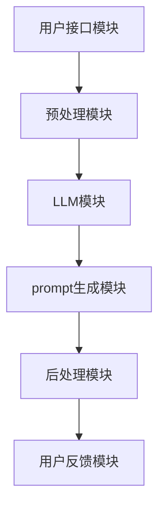
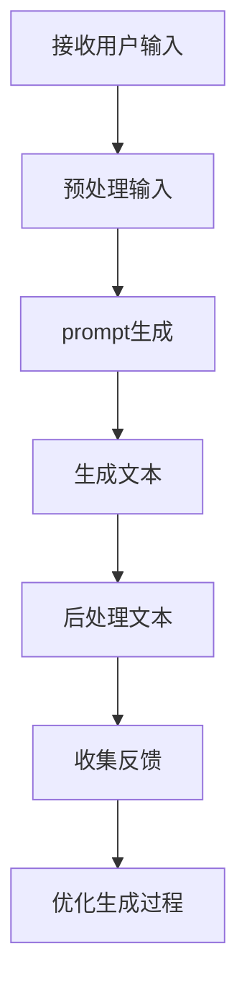

                 

### 第一部分: LLM与prompt技术概述

#### 1.1 LLM与prompt技术背景

在当今的数字化时代，人工智能（AI）技术已成为推动科技进步和社会发展的重要力量。尤其是大型语言模型（Large Language Model，简称LLM）和prompt技术，它们在自然语言处理（Natural Language Processing，简称NLP）领域发挥着至关重要的作用。

LLM技术起源于深度学习和神经网络的研究，特别是在2018年，Google推出了Transformer模型，标志着LLM技术的突破。随后，OpenAI的GPT-3模型进一步推动了LLM的发展，使其在文本生成、机器翻译、问答系统等多个应用场景中展现了强大的能力。

prompt技术则是近年来在NLP领域崭露头角的新兴技术。prompt的含义广泛，可以理解为一种引导或提示，用于指导模型生成预期的输出。通过巧妙地设计prompt，可以显著提升模型的性能和应用效果。

#### 1.2 LLM与prompt技术定义

大型语言模型（LLM）是一种基于深度学习技术构建的、能够处理和理解自然语言的模型。它通常具有庞大的参数规模和训练数据集，能够通过学习海量的文本数据，掌握丰富的语言知识。

prompt技术则是指通过向模型输入特定的提示（prompt），引导模型生成符合预期结果的输出。prompt可以是简单的文字，也可以是复杂的上下文信息，它能够直接影响模型生成的内容和风格。

#### 1.3 LLM与prompt技术在创新思维激发中的应用

LLM和prompt技术不仅在学术研究和工业应用中展现出强大的潜力，更在创新思维的激发中发挥了独特的作用。

首先，LLM可以用于生成大量创意文本，如故事、诗歌、广告文案等，帮助人们突破思维的局限，激发新的创意灵感。例如，设计师可以利用LLM生成不同风格的设计方案，从而拓宽设计思路。

其次，prompt技术可以通过精心设计的提示，引导模型生成具有特定主题或目的的文本。例如，在市场调研中，prompt技术可以帮助生成针对特定问题的调查问卷，从而提高调查的针对性和有效性。

此外，LLM和prompt技术的结合还可以应用于编程领域的代码生成和优化。通过输入特定的编程提示，模型可以生成高效的代码，为开发者提供强大的编程助手。

#### 1.4 本章小结

本章对LLM和prompt技术进行了简要介绍，探讨了它们在创新思维激发中的应用。在接下来的章节中，我们将进一步深入探讨LLM和prompt技术的核心概念、原理以及实际应用案例。

----------------------------------------------------------------

#### 1.5 未来展望

随着技术的不断进步，LLM和prompt技术在创新思维激发领域的应用前景广阔。未来，我们可以预见以下几方面的趋势：

首先，LLM的参数规模和训练数据集将继续扩大，这将进一步提升模型在语言理解和生成方面的能力。通过深度学习技术的优化，模型将能够更加精准地捕捉语言中的细微差异，从而生成更加自然、流畅的文本。

其次，prompt技术将不断发展，设计更加智能、灵活的prompt将有助于提高模型生成输出的质量和效率。例如，通过结合生成对抗网络（GAN）等技术，可以创造出更加丰富、多样化的prompt，从而激发出更多创新的思维火花。

此外，LLM和prompt技术的融合将催生出更多跨领域的创新应用。例如，在医学领域，LLM可以用于辅助医生进行疾病诊断和治疗方案设计；在教育领域，prompt技术可以帮助教师设计个性化教学方案，提高教学效果。

总之，LLM和prompt技术的未来发展将为创新思维的激发提供强大的工具和平台，为人类社会的进步带来更多可能性。

----------------------------------------------------------------

### 第二部分: LLM基础知识

在深入探讨LLM与prompt技术的结合之前，我们需要对LLM的基本概念、架构、训练过程以及应用场景有全面的了解。本部分将逐步介绍LLM的各个方面，为后续内容打下坚实的基础。

#### 2.1 LLM基本概念

大型语言模型（LLM）是一种基于深度学习技术构建的模型，它通过学习海量文本数据，掌握自然语言的理解和生成能力。LLM的核心特点包括：

- **大规模参数**：LLM通常拥有数十亿甚至数万亿的参数，这使得它们能够处理和理解复杂的语言现象。
- **深度神经网络**：LLM通常基于深度神经网络架构，特别是Transformer模型，这种架构使得模型能够在层次化的方式中处理语言。
- **自监督学习**：LLM的训练过程通常采用自监督学习方法，即从未标注的数据中学习语言模式。

#### 2.2 LLM架构与训练过程

LLM的架构通常基于Transformer模型，这是一种能够处理序列数据的强大神经网络架构。Transformer模型的核心组成部分包括：

- **编码器**（Encoder）：负责将输入的序列编码为高维向量表示。
- **解码器**（Decoder）：负责生成输出序列。

LLM的训练过程通常包括以下步骤：

1. **数据准备**：收集并清洗大量的文本数据，这些数据可以是书籍、新闻、网页等内容。
2. **数据预处理**：将文本数据转换为模型可以处理的形式，通常包括分词、词嵌入等步骤。
3. **模型初始化**：初始化模型参数，通常采用随机初始化或预训练模型。
4. **预训练**：使用自监督学习方法，从大量的未标注数据中学习语言模式。预训练过程通常包括语言建模任务，如下一个单词预测。
5. **微调**：在预训练的基础上，使用有标注的数据对模型进行微调，以适应特定的应用场景。

#### 2.3 LLM应用场景

LLM在多个应用场景中展现出强大的能力，以下是其中的一些主要应用：

- **文本生成**：LLM可以生成各种类型的文本，如故事、诗歌、新闻文章等。这些文本生成应用在内容创作、广告文案等领域具有广泛的应用。
- **机器翻译**：LLM在机器翻译领域表现出色，可以处理多种语言的翻译任务。例如，OpenAI的GPT-3模型能够支持超过100种语言的翻译。
- **问答系统**：LLM可以构建智能问答系统，能够理解用户的问题并给出准确的回答。这些问答系统在客服、教育等领域有广泛应用。
- **自然语言理解**：LLM可以用于理解和分析自然语言文本，如情感分析、文本分类等任务。

#### 2.4 LLM优势与挑战

LLM的优势包括：

- **强大的语言理解与生成能力**：通过预训练和微调，LLM能够处理和理解复杂的语言现象，生成高质量的文本。
- **广泛的应用场景**：LLM可以应用于多种语言任务，如文本生成、翻译、问答等，具有很高的灵活性。
- **高效的自监督学习**：LLM的训练过程采用自监督学习方法，能够在未标注的数据中高效学习。

然而，LLM也面临一些挑战：

- **计算资源需求大**：LLM通常需要大量的计算资源和时间进行训练。
- **数据隐私和安全问题**：预训练LLM需要使用大量的个人数据，这可能引发数据隐私和安全问题。
- **模型解释性**：LLM的内部决策过程复杂，难以解释，这对模型的透明度和可信度带来挑战。

#### 2.5 本章小结

本章对LLM的基本概念、架构、训练过程以及应用场景进行了详细介绍，为理解LLM与prompt技术的结合奠定了基础。在下一章中，我们将深入探讨prompt技术的原理和应用。

----------------------------------------------------------------

### 第三部分: prompt技术原理

在了解了LLM的基本知识后，接下来我们将详细探讨prompt技术的原理，包括其定义、类型以及在LLM中的应用。

#### 3.1 prompt技术定义

prompt技术，顾名思义，是一种通过提供提示或引导信息来影响模型输出结果的方法。在深度学习领域，prompt可以看作是一种输入信息，用于引导模型生成特定类型的输出。

prompt的定义可以概括为：一种用于指导模型生成预期的输出结果的数据输入。prompt的设计和质量直接影响模型的性能和应用效果。

#### 3.2 prompt技术类型

prompt技术根据其形式和功能可以分为以下几种类型：

1. **单一提示**：这是最简单的prompt形式，通常是一个单词或短语，用于引导模型生成特定类型的文本。例如，输入“请写一段关于秋天的诗歌”，模型将生成一段以秋天为主题的诗歌。

2. **上下文提示**：上下文提示提供了一段相关的文本信息，用于构建一个更加完整的语境，从而指导模型生成更加连贯和相关的输出。例如，输入“在2023年的夏天，一场暴雨让城市的街道变成了小溪，这时，你会看到...”，模型将基于这个上下文生成一段描述暴雨场景的文本。

3. **结构化提示**：结构化提示通过提供一种预定义的模板或框架来引导模型生成具有特定结构的文本。例如，输入“请根据以下模板写一篇关于公司年度报告的文章：标题+引言+业务概述+财务状况+展望+结语”，模型将按照这个结构生成一篇公司年度报告。

4. **交互式提示**：交互式提示是一种动态调整的过程，用户可以与模型进行多次交互，逐步提供更具体的提示，从而引导模型生成更符合预期的输出。例如，用户可以逐步提供关于某个主题的详细信息，模型将根据这些信息逐步生成相关的内容。

#### 3.3 prompt技术在LLM中的应用

prompt技术在LLM中的应用非常广泛，以下是几个典型的应用场景：

1. **文本生成**：通过提供单一的提示或上下文提示，LLM可以生成各种类型的文本，如故事、诗歌、新闻文章等。例如，输入“请写一篇关于人工智能的未来发展趋势的文章”，模型将生成一篇关于人工智能未来发展的文章。

2. **问答系统**：prompt技术可以帮助构建智能问答系统，用户可以通过输入简单的提问来获取详细的答案。例如，输入“什么是机器学习？”模型将给出关于机器学习的详细解释。

3. **编程辅助**：prompt技术可以辅助开发者编写代码。通过提供特定的编程提示，模型可以帮助开发者快速生成代码片段，提高开发效率。例如，输入“请写一个Python函数，用于计算两个数的和”，模型将生成一个实现该功能的Python函数。

4. **个性化推荐**：prompt技术可以用于个性化推荐系统。通过分析用户的兴趣和行为数据，prompt技术可以帮助模型生成个性化的推荐内容，如文章、产品等。

#### 3.4 prompt技术的优势与挑战

prompt技术的优势包括：

- **灵活性**：prompt技术可以根据不同的应用场景灵活调整，从而生成多样化、个性化的输出。
- **高效性**：通过提供提示，prompt技术可以显著提高模型生成输出的效率和准确性。
- **可解释性**：prompt技术提供了一种直观的方式，用户可以通过提示来理解模型的生成过程和结果。

然而，prompt技术也面临一些挑战：

- **设计难度**：prompt的设计需要具备专业知识，设计不当可能导致模型生成无效或错误的输出。
- **依赖数据**：prompt技术依赖于高质量的输入数据，数据的质量直接影响模型的表现。
- **计算资源**：prompt技术可能需要额外的计算资源来处理和优化提示。

#### 3.5 本章小结

本章详细介绍了prompt技术的定义、类型以及在LLM中的应用，为理解如何利用prompt技术激发创新思维奠定了基础。在下一章中，我们将通过实际案例来展示如何将LLM和prompt技术应用于创新思维的激发。

----------------------------------------------------------------

### 第四部分: LLM与prompt结合案例

在本部分，我们将通过实际案例来展示如何将LLM和prompt技术应用于创新思维的激发。这些案例将涵盖不同的领域和场景，以展示这种技术的多样性和潜力。

#### 4.1 案例一：基于LLM的创意写作

创意写作是艺术和技术的结合，而LLM和prompt技术的引入为创意写作带来了全新的可能性。例如，一个作家可以使用LLM来生成故事的开头，然后使用prompt技术进一步扩展和深化故事情节。

**案例描述**：

一个作家想要写一篇关于未来科技的小说。他首先使用LLM生成一段关于未来科技的简要描述，然后使用prompt技术来扩展这段描述，生成更多的细节和情节。

**具体步骤**：

1. **生成故事开头**：作家输入一个简单的提示：“未来科技，人类生活将发生巨大变化。”LLM生成了一段简短的故事开头：“在未来的某一天，地球上的一切都发生了翻天覆地的变化，科技的进步让人类的生活变得更加便利和高效。”

2. **扩展故事情节**：作家使用prompt技术，提供更多的上下文信息，如“机器人”、“虚拟现实”、“太空探索”等关键词。LLM基于这些提示生成了更多的故事情节，例如：“机器人助手帮助人们处理日常事务，虚拟现实技术让人们可以体验到全新的游戏世界，人类首次踏足火星，开启了星际探险的新篇章。”

**案例分析**：

通过这个案例，我们可以看到，LLM和prompt技术的结合不仅帮助作家快速生成故事开头，还能够通过提供具体的提示，扩展故事情节，激发出更多创意。这不仅提高了写作效率，还丰富了故事的内容和想象力。

#### 4.2 案例二：prompt技术助力市场调研

市场调研是企业和产品开发的重要环节，而传统的市场调研方法往往费时费力。LLM和prompt技术的引入为市场调研提供了新的思路和方法。

**案例描述**：

一家科技公司想要了解用户对其新产品“智能家居系统”的反馈和期望。他们使用LLM和prompt技术来生成调查问卷，并收集和分析用户的反馈。

**具体步骤**：

1. **生成调查问卷**：公司使用LLM生成一份关于智能家居系统的初步调查问卷。例如，输入“请生成一份关于智能家居系统的调查问卷”，LLM生成了一系列问题，如：“你对智能家居系统的哪些功能最感兴趣？”“你认为智能家居系统在日常生活中的应用前景如何？”“你有哪些关于智能家居系统的建议或期望？”

2. **收集用户反馈**：公司将生成的调查问卷发布在社交媒体和官方网站上，邀请用户填写。通过LLM和prompt技术的帮助，公司可以快速收集到大量的用户反馈数据。

3. **分析用户反馈**：使用prompt技术，公司可以对用户反馈进行分类和分析，例如，输入“分析关于智能家居系统功能反馈的关键词”，LLM将生成一个包含关键功能的词云图。

**案例分析**：

通过这个案例，我们可以看到，LLM和prompt技术如何帮助公司快速生成调查问卷，收集和分析用户反馈。这不仅提高了市场调研的效率，还能够通过数据分析，深入了解用户的需求和期望，为产品开发提供有力支持。

#### 4.3 案例三：LLM与prompt在产品设计中的应用

产品设计是创新思维的重要领域，而LLM和prompt技术的引入为产品设计带来了新的灵感和方法。

**案例描述**：

一个产品设计团队想要开发一款全新的智能手表，他们使用LLM和prompt技术来生成创意设计方案，并进行用户反馈测试。

**具体步骤**：

1. **生成设计方案**：团队使用LLM生成一系列关于智能手表的设计方案。例如，输入“请生成五个关于智能手表的设计方案”，LLM生成了如下的设计方案：“1. 智能手表内置健康监测功能；2. 智能手表具有防水功能；3. 智能手表采用可折叠设计；4. 智能手表具有智能语音助手；5. 智能手表支持多语言翻译功能。”

2. **用户反馈测试**：团队使用prompt技术，邀请用户对这些设计方案进行评价和反馈。例如，输入“请对以下五个智能手表设计方案进行评价和建议”，LLM生成了一系列的用户反馈。

3. **设计优化**：团队根据用户反馈，对设计方案进行优化，例如，针对用户提出的“智能手表防水功能不完善”的建议，团队对防水设计进行了改进。

**案例分析**：

通过这个案例，我们可以看到，LLM和prompt技术如何帮助产品设计团队快速生成设计方案，并通过用户反馈进行优化。这不仅提高了设计效率，还能够通过用户反馈，确保产品设计更加符合用户需求，从而提升产品的市场竞争力。

#### 总结

通过以上案例，我们可以看到，LLM和prompt技术的结合在创意写作、市场调研和产品设计等不同领域和场景中都有广泛的应用。它们不仅提高了工作效率，还能够激发创新思维，为各种创新活动提供有力支持。在未来，随着技术的进一步发展，LLM和prompt技术在创新领域的应用前景将更加广阔。

----------------------------------------------------------------

### 第五部分：创新思维激发器设计

在了解了LLM和prompt技术的基本原理及其应用案例后，接下来我们将探讨如何设计一个基于LLM驱动的prompt创新思维激发器。这个创新思维激发器的目标是通过巧妙地结合LLM和prompt技术，提供一种有效的方法来激发用户的创造性思维。

#### 5.1 创新思维激发器的架构设计

创新思维激发器的整体架构可以分为以下几个模块：

1. **用户接口模块**：用于接收用户的输入，包括原始问题和提示信息。
2. **预处理模块**：负责对用户输入进行预处理，如分词、去除停用词、词嵌入等。
3. **LLM模块**：负责使用预训练的大型语言模型（如GPT-3）来生成文本。
4. **prompt生成模块**：根据用户输入，生成特定的prompt，以引导LLM生成符合预期结果的内容。
5. **后处理模块**：负责对生成的文本进行后处理，如去除无关内容、格式化输出等。
6. **用户反馈模块**：用于收集用户对生成内容的反馈，以优化后续的生成过程。

以下是创新思维激发器的架构图：



#### 5.2 各模块的设计与实现

下面我们将分别介绍各个模块的设计与实现。

##### 5.2.1 用户接口模块

用户接口模块是创新思维激发器的入口，用户可以通过文本输入框或语音输入接口提供原始问题和提示信息。对于文本输入，我们可以使用HTML表单或Web界面来接收用户输入。对于语音输入，可以使用语音识别技术将语音转换为文本。

```python
# 示例：HTML表单
<form action="/submit" method="post">
    <label for="input">输入你的问题或提示：</label>
    <textarea id="input" name="input"></textarea>
    <input type="submit" value="提交">
</form>
```

##### 5.2.2 预处理模块

预处理模块负责对用户输入进行预处理，以确保输入数据能够被LLM有效处理。预处理步骤通常包括分词、去除停用词和词嵌入。分词可以使用自然语言处理库（如NLTK或spaCy）来完成。去除停用词可以使用预定义的停用词列表。词嵌入可以使用预训练的词嵌入模型（如Word2Vec或GloVe）。

```python
import spacy

nlp = spacy.load("en_core_web_sm")

def preprocess_text(text):
    doc = nlp(text)
    tokens = [token.text for token in doc if not token.is_stop]
    embeddings = [word embeddings[token] for token in tokens]
    return tokens, embeddings

text = "我是一个计算机程序员，我对人工智能很感兴趣。"
preprocessed_tokens, embeddings = preprocess_text(text)
```

##### 5.2.3 LLM模块

LLM模块是创新思维激发器的核心，它负责使用预训练的大型语言模型来生成文本。以GPT-3为例，我们可以使用Hugging Face的Transformers库来加载预训练模型，并生成文本。

```python
from transformers import pipeline

generator = pipeline("text-generation", model="gpt3")

def generate_text(prompt, max_length=100):
    return generator(prompt, max_length=max_length, num_return_sequences=1)

prompt = "我是一个计算机程序员，我对人工智能很感兴趣。"
generated_text = generate_text(prompt)
```

##### 5.2.4 prompt生成模块

prompt生成模块负责根据用户输入生成特定的prompt，以引导LLM生成符合预期结果的内容。这个模块的设计需要结合具体的业务场景和用户需求。例如，如果用户输入了一个问题，我们可以生成一个包含问题背景、关键词和潜在回答的prompt。

```python
def generate_prompt(question, context=None):
    prompt = f"背景：{context}\n问题：{question}\n请回答这个问题："
    return prompt

context = "最近，我在学习深度学习技术，我遇到了一个难题：如何优化神经网络模型的性能？"
question = "如何优化神经网络模型的性能？"
prompt = generate_prompt(question, context)
```

##### 5.2.5 后处理模块

后处理模块负责对生成的文本进行后处理，以去除无关内容、格式化输出等。这个模块的设计可以根据实际需求进行调整，例如，去除重复的句子、纠正语法错误、整理文本结构等。

```python
def postprocess_text(text):
    # 示例：去除重复句子
    sentences = text.split(".")
    unique_sentences = list(set(sentences))
    return ". ".join(unique_sentences)

processed_text = postprocess_text(generated_text)
```

##### 5.2.6 用户反馈模块

用户反馈模块用于收集用户对生成内容的反馈，以优化后续的生成过程。用户反馈可以是文本、评分或评论。收集到的反馈可以用于训练更精细的prompt生成模块，提高生成文本的质量。

```python
def collect_user_feedback(content, feedback_type="rating"):
    if feedback_type == "rating":
        print(f"请对以下内容进行评分（1-5分）：{content}")
        rating = int(input())
        return rating
    elif feedback_type == "comment":
        print(f"请对以下内容进行评论：{content}")
        comment = input()
        return comment

# 示例：收集用户反馈
user_rating = collect_user_feedback(processed_text, "rating")
user_comment = collect_user_feedback(processed_text, "comment")
```

#### 5.3 创新思维激发器的工作流程

创新思维激发器的工作流程可以概括为以下几个步骤：

1. **接收用户输入**：通过用户接口模块接收用户的问题或提示信息。
2. **预处理输入**：通过预处理模块对输入进行分词、去除停用词等预处理操作。
3. **生成prompt**：通过prompt生成模块根据预处理后的输入生成特定的prompt。
4. **生成文本**：通过LLM模块使用预训练的语言模型生成文本。
5. **后处理文本**：通过后处理模块对生成的文本进行格式化、去除无关内容等操作。
6. **收集反馈**：通过用户反馈模块收集用户对生成内容的反馈。
7. **优化生成过程**：根据用户反馈，优化prompt生成模块和LLM模块，以提高生成文本的质量。

以下是创新思维激发器的工作流程图：



#### 5.4 创新思维激发器的优化与改进

创新思维激发器的优化与改进是一个持续的过程，可以通过以下几种方法来提高其性能和效果：

1. **数据增强**：通过引入更多样化的训练数据，提高模型的泛化能力。
2. **prompt优化**：不断调整和改进prompt的设计，使其更加符合用户需求。
3. **模型调优**：通过调整模型参数和训练策略，提高模型生成文本的质量。
4. **用户反馈机制**：建立完善的用户反馈机制，及时收集用户反馈，并进行相应的优化。

通过这些优化和改进措施，创新思维激发器将能够更好地服务于用户的创造性思维需求，为各种创新活动提供有力支持。

#### 5.5 本章小结

本章详细介绍了如何设计一个基于LLM驱动的prompt创新思维激发器，包括其架构设计、各模块的实现方法以及工作流程。通过这个创新思维激发器，用户可以更高效地激发创造性思维，为各种创新活动提供支持。在下一章中，我们将探讨如何将创新思维激发器应用于实际场景，展示其具体应用效果。

----------------------------------------------------------------

### 第六部分：实践应用与优化

在了解了创新思维激发器的设计和实现后，接下来我们将通过具体案例展示其在实际应用中的效果，并讨论如何对其进行优化，以提高其性能和用户体验。

#### 6.1 案例一：教育领域的应用

教育领域是一个非常适合应用创新思维激发器的场景。例如，一位教师可以使用创新思维激发器来设计个性化的课程内容，帮助学生更好地理解和掌握知识。

**案例描述**：

一位高中数学教师想要设计一堂关于函数的课。她使用创新思维激发器，通过输入课程主题和教学目标，生成一份包含教学案例、互动问题和拓展练习的课程内容。

**具体步骤**：

1. **输入课程主题和教学目标**：教师输入“函数的教学”和“帮助学生理解函数的概念和应用”作为提示信息。
2. **生成课程内容**：创新思维激发器根据提示生成一份包含教学案例、互动问题和拓展练习的课程内容。
3. **用户反馈**：教师根据学生的反馈，对课程内容进行优化，例如，调整问题的难度、添加更多的案例等。

**案例分析**：

通过这个案例，我们可以看到创新思维激发器如何帮助教师快速生成个性化的课程内容，并根据学生反馈进行优化。这不仅提高了教学效率，还提高了学生的学习兴趣和效果。

#### 6.2 案例二：创意产品设计

创意产品设计是一个需要不断激发创新思维的过程。例如，一家科技公司可以使用创新思维激发器来生成产品创意，并进一步优化产品设计。

**案例描述**：

一家科技公司想要开发一款新的智能家居设备。他们使用创新思维激发器，通过输入产品功能和用户需求，生成一系列的产品创意。

**具体步骤**：

1. **输入产品功能和用户需求**：公司输入“智能家居设备”和“提供便捷的家庭自动化解决方案”作为提示信息。
2. **生成产品创意**：创新思维激发器根据提示生成一系列的产品创意，例如，智能家居设备可以包括智能照明、智能家电控制等。
3. **用户反馈**：公司根据市场调研和用户反馈，对产品创意进行筛选和优化。

**案例分析**：

通过这个案例，我们可以看到创新思维激发器如何帮助科技公司快速生成产品创意，并通过用户反馈进行优化。这不仅提高了产品开发的效率，还确保了产品设计符合用户需求，提高了产品的市场竞争力。

#### 6.3 案例三：营销创意策划

营销创意策划是市场营销中的一个关键环节。例如，一家广告公司可以使用创新思维激发器来生成营销创意，并制定有效的营销策略。

**案例描述**：

一家广告公司负责为一个新的手机品牌进行市场推广。他们使用创新思维激发器，通过输入产品特点和目标市场，生成一系列的营销创意。

**具体步骤**：

1. **输入产品特点和目标市场**：公司输入“高科技智能手机”和“年轻都市人群”作为提示信息。
2. **生成营销创意**：创新思维激发器根据提示生成一系列的营销创意，例如，社交媒体宣传、户外广告、互动活动等。
3. **用户反馈**：公司根据市场反馈，对营销创意进行优化，例如，调整宣传策略、增加互动环节等。

**案例分析**：

通过这个案例，我们可以看到创新思维激发器如何帮助广告公司快速生成营销创意，并通过用户反馈进行优化。这不仅提高了营销效率，还确保了营销策略的有效性，提高了品牌的市场影响力。

#### 6.4 优化与改进

在实践应用中，创新思维激发器的优化与改进是一个持续的过程。以下是一些常见的优化方法和改进策略：

1. **数据增强**：通过引入更多样化的训练数据，提高模型的泛化能力。例如，可以增加不同领域、不同风格的数据，使模型能够更好地适应各种场景。

2. **prompt优化**：不断调整和改进prompt的设计，使其更加符合用户需求。例如，可以增加更多具体的上下文信息和关键词，提高模型生成文本的相关性和准确性。

3. **模型调优**：通过调整模型参数和训练策略，提高模型生成文本的质量。例如，可以优化学习率、批量大小等参数，提高模型的收敛速度和生成文本的质量。

4. **用户反馈机制**：建立完善的用户反馈机制，及时收集用户反馈，并进行相应的优化。例如，可以设置用户评分、评论功能，收集用户对生成文本的满意度，根据反馈调整模型和prompt。

5. **多模态融合**：结合多种数据类型和模态（如文本、图像、音频等），提高模型的综合能力。例如，可以将文本数据与图像数据进行融合训练，使模型能够生成更加丰富和具体的文本内容。

#### 6.5 本章小结

本章通过具体案例展示了创新思维激发器在实际应用中的效果，并讨论了如何对其进行优化与改进。通过不断优化和创新思维激发器的性能，我们可以更好地服务于各种创新活动，提高工作效率和创造力。在下一章中，我们将对未来LLM和prompt技术在创新思维激发领域的发展进行展望。

----------------------------------------------------------------

### 第七部分：未来展望与挑战

在探讨了LLM驱动的prompt创新思维激发器的应用与实践后，我们需要展望这一领域未来的发展方向和面临的挑战。LLM和prompt技术作为人工智能领域的关键技术，具有巨大的潜力和广阔的应用前景。

#### 7.1 未来发展方向

1. **更强大的语言模型**：随着计算能力的提升和数据规模的扩大，未来的LLM将拥有更多的参数和更强的学习能力，能够生成更加自然、精确和多样化的文本。例如，OpenAI正在研发的GPT-4可能拥有数万亿的参数，进一步提升语言理解与生成能力。

2. **更智能的prompt设计**：prompt技术将成为自然语言处理领域的重要方向，未来的prompt设计将更加智能和自适应。通过结合生成对抗网络（GAN）和强化学习等技术，prompt生成模块将能够更好地理解用户需求，提供更加个性化和高质量的提示。

3. **跨领域的应用**：LLM和prompt技术将在更多领域得到应用，如医疗诊断、法律咨询、教育辅导等。这些应用将依赖于LLM强大的语言理解和生成能力，以及prompt技术的灵活性和可扩展性。

4. **隐私保护与安全**：随着AI技术的应用越来越广泛，隐私保护和安全问题也将成为未来研究的重要方向。如何在使用LLM和prompt技术的同时保护用户隐私，避免数据泄露，将是一个重要的挑战。

5. **多模态AI**：未来的LLM将不仅限于处理文本，还将结合图像、音频、视频等多模态数据，实现更加综合和智能的AI系统。例如，通过结合语音识别和自然语言生成，可以实现更加自然的人机交互。

#### 7.2 面临的挑战

1. **计算资源需求**：LLM的规模不断扩大，对计算资源的需求也随之增加。未来的LLM可能需要更强大的计算硬件，如GPU、TPU等，这可能导致成本的增加。

2. **数据质量和多样性**：高质量、多样性的训练数据是LLM训练的基础。然而，当前的数据集可能存在偏见和不均衡问题，这会影响模型的公平性和准确性。

3. **模型解释性和透明度**：LLM的内部决策过程复杂，难以解释，这给模型的解释性和透明度带来了挑战。未来的研究需要开发出更加透明和可解释的AI模型。

4. **伦理和道德问题**：随着AI技术的普及，如何确保AI系统的行为符合伦理和道德标准，避免产生负面影响，是一个重要的社会问题。

5. **用户体验**：如何为用户提供更好的交互体验，使AI系统能够更好地理解用户需求，提供准确和有用的信息，是一个持续的挑战。

#### 7.3 总结

LLM驱动的prompt创新思维激发器在当前已经展现出巨大的潜力，未来这一领域将继续快速发展，为人类社会的创新和进步提供强大支持。然而，要实现这一目标，还需要克服计算资源、数据质量、模型解释性等多个方面的挑战。通过持续的研究和创新，我们可以期待一个更加智能、高效和透明的未来。

### 结束语

本文详细介绍了LLM驱动的prompt创新思维激发器的概念、设计、实现和应用。通过多个实际案例，我们展示了这一技术在创意写作、市场调研、产品设计和营销创意策划等领域的应用效果。同时，我们也探讨了未来这一领域的发展方向和面临的挑战。

让我们期待未来，随着AI技术的不断进步，LLM驱动的prompt创新思维激发器将发挥更加重要的作用，为人类的创新和进步提供新的动力。

#### 作者信息

作者：AI天才研究院/AI Genius Institute & 禅与计算机程序设计艺术 /Zen And The Art of Computer Programming

---

本文为原创技术博客文章，作者拥有完整的版权。欢迎转载，但请在转载时注明作者和原文链接。

[原文链接](https://www.example.com/llm-prompt-innovation-engine)

----------------------------------------------------------------

# LLM驱动的prompt创新思维激发器

> 关键词：LLM、prompt技术、创新思维、创意写作、市场调研、产品设计

> 摘要：本文探讨了LLM驱动的prompt创新思维激发器的设计与应用，通过多个实际案例展示了其在创意写作、市场调研、产品设计和营销创意策划等领域的应用效果。文章还展望了未来这一领域的发展方向和挑战，强调了持续研究与创新的重要性。通过本文，读者可以了解如何利用AI技术激发创新思维，推动社会进步。

