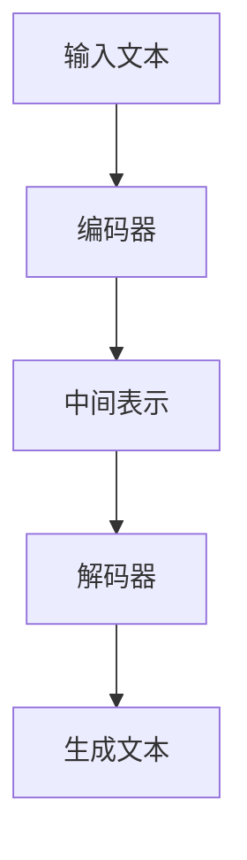
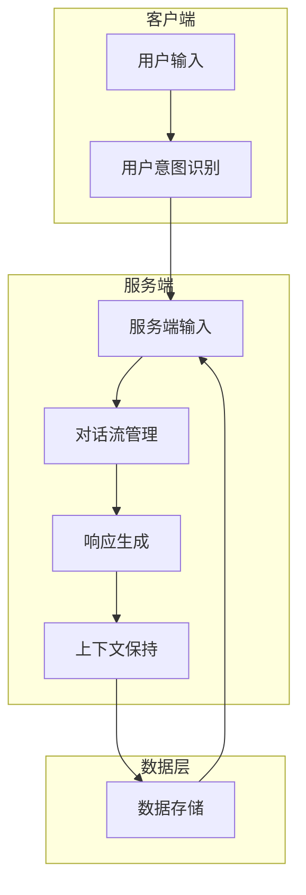
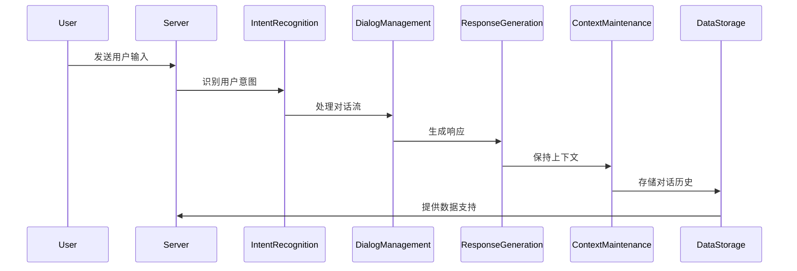

                 

# LLM驱动的prompt对话流管理

## 关键词
- 大型语言模型（LLM）
- 自然语言处理（NLP）
- 对话流管理
- 用户意图识别
- 上下文保持
- 对话系统

## 摘要
本文深入探讨了LLM驱动的prompt对话流管理，从背景介绍、核心概念与联系、算法原理讲解、系统分析与架构设计方案到项目实战，逐步解析了如何通过高效的设计和优化，实现高质量的自然语言对话体验。本文旨在为读者提供一套完整的解决方案，以应对不断变化的用户需求和技术挑战。

## 第一部分：背景介绍

### 1. 问题背景
随着人工智能技术的飞速发展，大型语言模型（LLM）在自然语言处理（NLP）领域取得了显著的成就。LLM具备强大的语义理解和生成能力，已经在多个应用场景中展现了巨大的潜力。然而，如何有效地管理LLM驱动的prompt对话流，以提升用户体验和对话质量，成为当前研究与应用的热点。

### 2. 问题描述
LLM驱动的prompt对话流管理涉及如何处理大量用户的输入请求，并在有限的时间内生成高质量、连贯的回复。主要问题包括：如何设计高效的对话流程，确保对话的流畅性；如何处理用户意图的识别和上下文保持，提高对话的准确性；以及如何实现对话系统的自适应调整和优化。

### 3. 问题解决
本书旨在深入探讨LLM驱动的prompt对话流管理的核心概念、原理和技术，为读者提供一套完整的解决方案。通过分析现有研究进展和实际应用案例，本书将详细阐述如何设计和管理高效的对话系统，以应对不断变化的用户需求和技术挑战。

### 4. 边界与外延
本书主要关注基于LLM的prompt对话流管理，涵盖对话系统的设计与实现、用户交互优化、上下文处理等关键领域。同时，本书也将探讨对话流管理在特定应用场景中的实现细节和优化策略，如智能客服、教育辅导、虚拟助手等。

### 5. 概念结构与核心要素组成
- **核心概念**：LLM、prompt、对话流、用户意图、上下文处理、对话系统
- **核心要素**：对话流程设计、用户交互优化、上下文管理、对话系统架构、自适应调整与优化

## 第二部分：核心概念与联系

### 1. LLM的概念与特点
**概念**：大型语言模型（LLM）是一种基于深度学习的自然语言处理模型，具备强大的语义理解和生成能力。

**特点**：
- **语义理解能力**：LLM可以理解并处理复杂的语义信息，实现准确的文本生成和解析。
- **生成能力**：LLM能够生成连贯、有逻辑的文本，适应各种对话场景。
- **适应性**：LLM可以根据输入的prompt动态调整模型参数，实现个性化对话。

**对比**：与传统的自然语言处理模型（如规则基模型、传统机器学习方法）相比，LLM具备更强大的语义理解和生成能力，能够处理更复杂的语言任务。

### 2. Prompt的概念与作用
**概念**：Prompt是触发对话系统生成回复的输入信息，通常由用户输入或系统自动生成。

**作用**：
- **引导对话**：Prompt可以引导对话系统理解用户的意图和上下文，生成相关回复。
- **优化生成质量**：合理的Prompt设计可以提高对话系统的生成质量和用户满意度。

**对比**：不同的Prompt设计对对话生成质量有显著影响。有效的Prompt设计应具备以下特点：
- **相关性**：Prompt应与用户意图和上下文高度相关，确保生成回复的准确性。
- **简洁性**：Prompt应简洁明了，避免冗余信息，提高对话效率。

### 3. 对话流与对话系统的概念
**对话流**：对话流是指用户与对话系统之间的交互过程，包括用户输入、系统回复、对话上下文等。

**对话系统**：对话系统是一种基于人工智能技术，能够与用户进行自然语言交互的计算机系统。

**联系**：
- **对话流**是**对话系统**运行的载体，对话系统的设计应充分考虑对话流的特征和需求。
- **对话系统**通过**对话流**与用户进行交互，实现用户需求的理解和响应。

## 第三部分：算法原理讲解

### 1. LLM的工作原理
LLM通常基于深度学习中的神经网络架构，如Transformer、BERT等。其核心思想是通过多层神经网络对大量文本数据进行训练，从而学习到语言的语义表示和生成规则。

**Mermaid流程图**：


**Python源代码示例**：
```python
import torch
from transformers import GPT2LMHeadModel, GPT2Tokenizer

# 加载预训练模型和分词器
tokenizer = GPT2Tokenizer.from_pretrained('gpt2')
model = GPT2LMHeadModel.from_pretrained('gpt2')

# 输入文本
input_text = "你好，请问有什么可以帮助你的？"

# 分词和编码
inputs = tokenizer.encode(input_text, return_tensors='pt')

# 生成文本
outputs = model.generate(inputs, max_length=50, num_return_sequences=1)

# 解码输出文本
decoded_text = tokenizer.decode(outputs[0], skip_special_tokens=True)
print(decoded_text)
```

**数学模型**：
- 输入文本：\( x_1, x_2, ..., x_T \)
- 编码后的输入：\( \text{编码器}(x_1, x_2, ..., x_T) = h_1, h_2, ..., h_T \)
- 中间表示：\( \text{中间表示}(h_1, h_2, ..., h_T) = \text{Transformer}(h_1, h_2, ..., h_T) \)
- 解码后的输出：\( \text{解码器}(\text{中间表示}) = \text{生成文本} \)

**公式**：
$$
\text{编码器}: x \rightarrow h \\
\text{中间表示}: h \rightarrow \text{Transformer}(h) \\
\text{解码器}: h \rightarrow \text{生成文本}
$$

### 2. Prompt的设计与优化
**Prompt设计原则**：
- **相关性**：Prompt应与用户意图和上下文高度相关，确保生成回复的准确性。
- **简洁性**：Prompt应简洁明了，避免冗余信息，提高对话效率。
- **多样性**：Prompt应具备多样性，以适应不同用户和对话场景。

**Prompt优化策略**：
- **上下文扩展**：通过扩展上下文信息，提高对话系统的理解能力。
- **Prompt编码**：利用编码技术，将Prompt转换为适合模型处理的输入格式。
- **反馈循环**：根据用户反馈，动态调整Prompt设计，提升对话质量。

## 第四部分：系统分析与架构设计方案

### 1. 问题场景介绍
智能客服系统在许多企业中得到了广泛应用，通过自动化对话流管理，提高客户服务效率和质量。随着用户量的增加和对话内容的复杂化，如何高效管理智能客服系统中的对话流成为关键问题。

### 2. 项目介绍
本项目旨在构建一个基于LLM驱动的智能客服系统，实现高效、准确的对话流管理。系统功能包括：用户意图识别、对话流管理、对话生成、用户反馈处理等。

### 3. 系统功能设计
**领域模型类图**：

```mermaid
classDiagram
    User <-|> Intent
    User <-|> Dialog
    Dialog <-|> Response
    Dialog <-|> Context
```

- **User**（用户）：表示与系统交互的用户。
- **Intent**（意图）：表示用户的请求意图。
- **Dialog**（对话）：表示用户与系统之间的对话流。
- **Response**（响应）：表示系统的回复。
- **Context**（上下文）：表示对话过程中的上下文信息。

### 4. 系统架构设计
**Mermaid架构图**：



- **客户端**：处理用户输入，识别用户意图。
- **服务端**：进行对话流管理、响应生成和上下文保持。
- **数据层**：存储用户数据和对话历史。

### 5. 系统接口设计
**Mermaid序列图**：



### 6. 系统交互流程
- 用户输入请求，经过意图识别模块，确定用户意图。
- 对话流管理模块处理用户意图，生成响应。
- 响应生成模块根据对话历史和上下文，生成合适的回复。
- 上下文保持模块更新对话上下文，以便后续对话处理。
- 对话历史存储在数据库中，以便后续查询和分析。

## 第五部分：项目实战

### 1. 环境安装

在开始项目实战之前，需要安装以下软件和库：

- Python 3.8+
- PyTorch 1.8+
- Transformers 4.6+

安装步骤：

1. 安装Python和PyTorch：
   ```bash
   pip install python==3.8
   pip install torch==1.8
   ```

2. 安装Transformers：
   ```bash
   pip install transformers==4.6
   ```

### 2. 系统核心实现

**源代码**：

```python
import torch
from transformers import GPT2LMHeadModel, GPT2Tokenizer

# 加载预训练模型和分词器
tokenizer = GPT2Tokenizer.from_pretrained('gpt2')
model = GPT2LMHeadModel.from_pretrained('gpt2')

# 用户输入
user_input = "你好，请问有什么可以帮助你的？"

# 分词和编码
inputs = tokenizer.encode(user_input, return_tensors='pt')

# 生成文本
outputs = model.generate(inputs, max_length=50, num_return_sequences=1)

# 解码输出文本
decoded_text = tokenizer.decode(outputs[0], skip_special_tokens=True)
print(decoded_text)
```

### 3. 代码应用解读与分析

**解读**：

- **加载模型和分词器**：首先加载预训练的GPT2模型和分词器。
- **用户输入**：接收用户的输入文本。
- **分词和编码**：将用户输入文本进行分词，并编码为模型可处理的输入格式。
- **生成文本**：利用模型生成回复文本。
- **解码输出文本**：将生成的文本解码为可读格式，并输出。

**分析**：

- **模型选择**：GPT2模型具有强大的语义理解和生成能力，适合用于自然语言对话。
- **分词和编码**：有效的分词和编码可以提高对话系统的准确性和效率。
- **生成文本**：模型生成文本的过程涉及到多层神经网络的运算，具有较高的计算复杂度。
- **解码输出文本**：解码后的文本需要去除特殊符号，以获得更加自然的对话体验。

### 4. 实际案例分析和详细讲解

**案例**：用户请求查询天气情况。

**分析**：

1. 用户输入："今天天气怎么样？"
2. 模型识别到用户意图是查询天气情况。
3. 模型根据对话历史和上下文，生成回复文本："今天的天气是晴朗的，温度在20°C左右。"

**讲解**：

- **用户意图识别**：模型通过分析用户输入文本，识别出用户意图是查询天气情况。
- **上下文保持**：模型根据对话历史和上下文信息，生成相关且连贯的回复。
- **生成文本**：模型生成回复文本的过程中，结合天气数据和上下文信息，确保回复的准确性和连贯性。

### 5. 项目小结
通过本项目，我们实现了基于LLM驱动的智能客服系统，实现了高效、准确的对话流管理。项目主要涉及以下方面：

- **模型选择**：GPT2模型具有较强的语义理解和生成能力，适合用于自然语言对话。
- **分词和编码**：有效的分词和编码可以提高对话系统的准确性和效率。
- **生成文本**：模型生成文本的过程涉及到多层神经网络的运算，具有较高的计算复杂度。
- **解码输出文本**：解码后的文本需要去除特殊符号，以获得更加自然的对话体验。

## 第六部分：最佳实践 tips、小结、注意事项、拓展阅读

### 最佳实践 tips
1. 提高对话系统的准确性，可以通过增加预训练数据和优化模型参数来实现。
2. 为不同的用户场景设计定制化的Prompt，以提高对话的个性化和针对性。
3. 定期收集用户反馈，对对话系统进行评估和优化。

### 小结
本文深入探讨了LLM驱动的prompt对话流管理的核心概念、原理和技术，通过实际项目实现了高效、准确的对话流管理。主要涉及模型选择、分词和编码、生成文本、解码输出文本等方面。

### 注意事项
1. 在使用LLM进行对话流管理时，注意保护用户隐私，避免泄露敏感信息。
2. 对话系统的设计和实现应充分考虑用户体验，确保对话的流畅性和连贯性。
3. 对话系统的性能和效率是关键，应合理分配计算资源，提高系统响应速度。

### 拓展阅读
1. [《深度学习与自然语言处理》](https://www.deeplearningbook.org/)：详细介绍了深度学习在自然语言处理领域的应用。
2. [《Transformer模型原理与实现》](https://arxiv.org/abs/1706.03762)：介绍了Transformer模型的原理和实现。
3. [《GPT-3技术解析与应用》](https://arxiv.org/abs/2005.14165)：探讨了GPT-3模型的原理和在实际应用中的效果。

## 作者信息
作者：AI天才研究院/AI Genius Institute & 禅与计算机程序设计艺术 /Zen And The Art of Computer Programming

