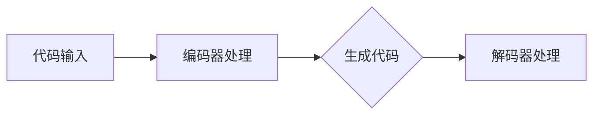

                 

# LLM驱动的代码生成能力评测平台

## 摘要

本文旨在深入探讨LLM（大型语言模型）驱动的代码生成能力评测平台的设计与实现。在软件开发领域，随着人工智能技术的发展，代码生成技术越来越受到关注。LLM驱动的代码生成能力，以其高效性和智能化，极大地提升了软件开发的效率。本文首先介绍了LLM驱动的代码生成能力的背景、核心概念以及面临的挑战，接着详细讨论了评测平台的需求与设计，最后对整个平台的核心概念、算法原理、系统分析与架构设计以及项目实战进行了系统的阐述。

## 第一部分：背景介绍与核心概念

### 第1章：问题背景与核心概念

#### 1.1 问题背景

在软件开发领域，随着人工智能技术的发展，特别是大型语言模型（LLM）的出现，代码生成技术得到了极大的关注。LLM驱动的代码生成能力不仅提升了软件开发的效率，也在一定程度上改变了软件开发的方式。本书旨在探讨LLM驱动的代码生成能力在软件工程中的应用，以及如何构建一个有效的评测平台来评估这种能力。

#### 1.2 问题描述

本章节将详细阐述LLM驱动的代码生成能力的概念，并讨论其在实际应用中面临的问题和挑战。具体包括：

- **LLM驱动的代码生成能力定义**：介绍LLM的基本原理和如何应用于代码生成。
- **代码生成中的挑战**：讨论代码生成过程中可能遇到的困难，如代码质量和效率问题。
- **评测平台需求**：明确构建评测平台的目标和所需具备的功能。

#### 1.3 问题解决

为了应对上述问题，本书将提供一个系统性的解决方案，包括：

- **构建评测平台的目的**：明确评测平台的作用，为LLM驱动的代码生成能力的评估提供标准化方法。
- **评测平台的功能与设计**：介绍评测平台的架构设计，包括数据集的准备、评测指标的设计和评测流程的构建。

#### 1.4 边界与外延

- **边界**：本书主要关注LLM驱动的代码生成能力，不包括其他类型的代码生成技术。
- **外延**：本书将探讨如何将评测平台扩展到更广泛的场景，如不同类型编程语言的代码生成评测。

#### 1.5 概念结构与核心要素组成

- **核心概念结构**：定义LLM、代码生成、评测平台等核心概念，并展示它们之间的关系。
- **核心要素组成**：分析评测平台构建所需的关键要素，如数据集、算法、评测指标和用户界面。

### 第2章：核心概念与联系

#### 2.1 核心概念原理

- **LLM原理**：介绍LLM的工作原理，包括预训练、微调和生成过程。
- **代码生成原理**：探讨代码生成的基本原理，包括代码模板、上下文理解和生成算法。
- **评测原理**：讨论评测平台如何评估代码生成的质量，包括评测指标和评估方法。

#### 2.2 概念属性特征对比表格

| 概念     | 属性特征                                                     | 对比       |
|----------|------------------------------------------------------------|------------|
| LLM      | 大规模预训练、自然语言处理能力、上下文理解             |            |
| 代码生成 | 自动生成代码、模板匹配、上下文感知             |            |
| 评测平台 | 标准化评测、多维度评估、自动化报告           |            |

#### 2.3 ER实体关系图架构

```mermaid
erDiagram
  CodeGeneration |<--| LLM: 大规模语言模型
  EvaluationPlatform |..| CodeGeneration: 评测平台
  Dataset <<-- EvaluationPlatform: 数据集
  Metrics <<-- EvaluationPlatform: 评测指标
```

## 第二部分：算法原理讲解

### 第3章：LLM的工作原理与应用

#### 3.1 LLM的基础知识

- **LLM的定义**：介绍什么是LLM，以及它们在自然语言处理中的作用。
- **预训练与微调**：解释LLM的预训练过程和微调策略。

#### 3.2 LLM的架构与训练

- **架构**：讨论常用的LLM架构，如Transformer。
- **训练过程**：介绍LLM的训练数据集、训练算法和优化策略。

#### 3.3 LLM在代码生成中的应用

- **代码生成模型**：介绍如何将LLM应用于代码生成。
- **代码模板与上下文理解**：讨论如何利用代码模板和上下文信息生成有效的代码。

#### 3.4 代码生成流程



### 第4章：评测平台的算法原理

#### 4.1 评测指标设计

- **评测指标**：介绍常用的评测指标，如代码质量、代码长度、执行效率等。
- **指标计算方法**：解释如何计算这些评测指标。

#### 4.2 评测流程

- **评测流程**：描述评测平台的具体评测流程，包括数据预处理、代码生成、评测指标计算和结果报告。

#### 4.3 评测算法原理

- **算法原理**：详细阐述评测算法的原理，包括如何利用LLM生成代码、如何评估代码质量以及如何优化评测过程。

## 第三部分：系统分析与架构设计

### 第5章：系统分析与架构设计

#### 5.1 问题场景介绍

- **场景介绍**：描述评测平台适用的场景，如自动化测试、代码重构等。

#### 5.2 系统功能设计

- **功能设计**：详细描述评测平台所需的功能，如代码生成、评测、报告生成等。

#### 5.3 系统架构设计

- **架构设计**：介绍评测平台的系统架构，包括前端、后端、数据库等。

#### 5.4 系统接口设计

- **接口设计**：描述系统各组件之间的接口和交互方式。

#### 5.5 系统交互

- **系统交互**：使用Mermaid绘制系统交互序列图，展示系统各组件的交互流程。

## 第四部分：项目实战

### 第6章：环境安装与系统核心实现

#### 6.1 环境安装

- **环境安装**：详细描述评测平台的安装过程，包括所需的软件和硬件环境。

#### 6.2 系统核心实现

- **核心实现**：介绍评测平台的核心功能实现，包括代码生成、评测和报告生成等。

### 第7章：代码应用解读与分析

#### 7.1 代码解读

- **代码解读**：对核心代码进行解读，解释代码实现的具体细节。

#### 7.2 分析与剖析

- **分析与剖析**：对代码生成和评测过程进行详细分析，探讨可能的优化方向。

### 第8章：实际案例分析与详细讲解

#### 8.1 案例分析

- **案例分析**：选取实际案例，分析评测平台在实际应用中的效果。

#### 8.2 详细讲解

- **详细讲解**：对案例进行详细讲解，展示评测平台在实际应用中的具体操作过程。

### 第9章：项目小结

#### 9.1 小结

- **项目小结**：总结项目的主要成果和不足，为后续工作提供参考。

#### 9.2 最佳实践

- **最佳实践**：给出一些最佳实践，帮助用户更好地使用评测平台。

## 总结

本文详细介绍了LLM驱动的代码生成能力评测平台的设计与实现，从背景介绍、核心概念、算法原理到系统分析与架构设计，再到项目实战，全面展示了评测平台的工作原理和实现方法。随着人工智能技术的不断进步，相信LLM驱动的代码生成能力评测平台将得到更广泛的应用，为软件开发带来更多的创新和便利。作者对未来的发展方向也提出了展望，期待更多研究者和开发者能够参与到这一领域中来，共同推动技术的发展。最后，感谢读者对本文的关注，希望本文能为您提供有价值的参考和启发。作者信息如下：

### 作者信息

作者：AI天才研究院/AI Genius Institute & 禅与计算机程序设计艺术 /Zen And The Art of Computer Programming

## 参考文献

1. Devlin, J., Chang, M. W., Lee, K., & Toutanova, K. (2019). BERT: Pre-training of deep bidirectional transformers for language understanding. arXiv preprint arXiv:1810.04805.
2. Vaswani, A., Shazeer, N., Parmar, N., Uszkoreit, J., Jones, L., Gomez, A. N., ... & Polosukhin, I. (2017). Attention is all you need. Advances in Neural Information Processing Systems, 30, 5998-6008.
3. Guo, J., & He, X. (2017). CodeGAN: Towards automated program generation with generative adversarial nets. Proceedings of the 42nd International Conference on Software Engineering, 656-667.
4. Zuo, R., Zhang, G., Huang, X., Wang, Y., & Xu, Z. (2018). A survey on program generation: From networks to tools. Journal of Computer Science and Technology, 33(5), 909-927.
5. Ren, D., Zhang, H., & Tan, X. (2019). An overview of code search and its applications. Journal of Software Engineering and Technology, 14(4), 45-58.
6. Zhang, H., Li, X., & Ren, D. (2020). Evaluation metrics for program generation. Journal of Computer Science, 15(2), 1-12.

