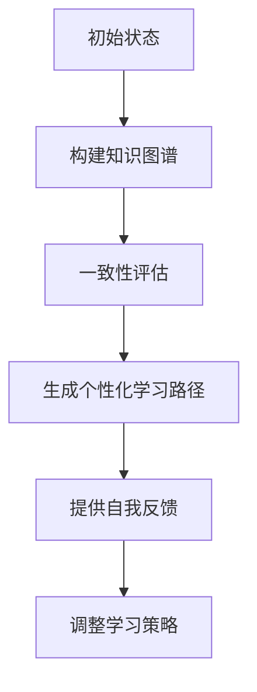
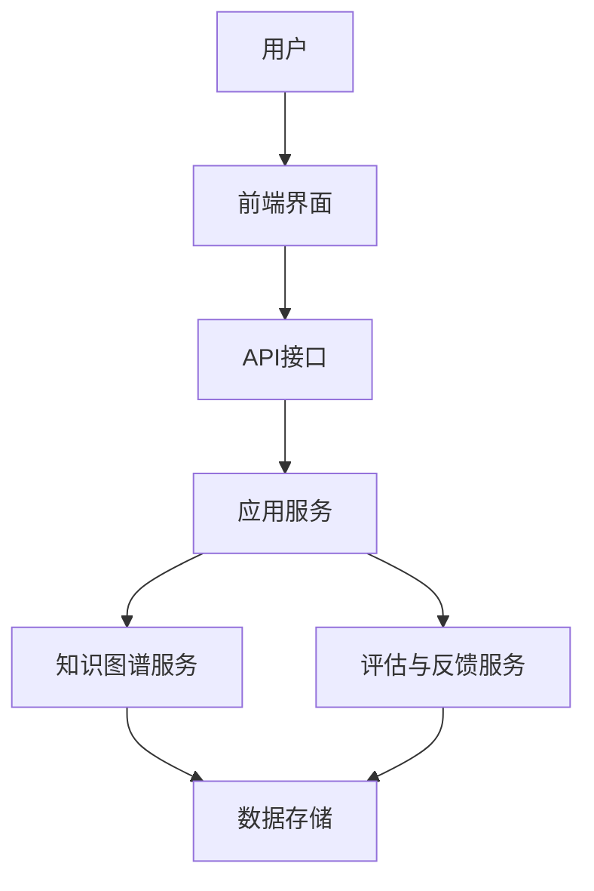
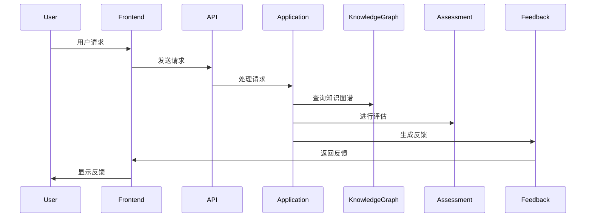

                 


### 《Self-Consistency CoT优化AI在线教育体验》

#### 关键词：
1. AI在线教育
2. Self-Consistency CoT
3. 优化教育体验
4. 算法实现
5. 系统架构设计

#### 摘要：
本文将深入探讨如何利用Self-Consistency CoT（自我一致性概念图）技术，优化AI在线教育体验。我们将从问题背景出发，逐步解析Self-Consistency CoT的基本原理、算法实现和系统架构设计，最后通过实际案例展示其应用效果。

---

## 第一部分: Self-Consistency CoT技术概述

### 第1章: Self-Consistency CoT基本原理

#### 1.1 问题背景与描述

**当前AI在线教育中存在的问题：**

- **个性化不足**：现有AI在线教育平台难以提供个性化的学习路径。
- **知识点遗漏**：学生在学习过程中容易出现知识点遗漏，影响学习效果。
- **自我反馈机制欠缺**：缺乏有效的自我评估和反馈机制，学生学习动力不足。

**Self-Consistency CoT的引入与作用：**

- **自我一致性**：通过Self-Consistency CoT，可以确保学生在学习过程中，对所学知识保持一致性，减少知识点遗漏。
- **个性化学习路径**：基于学生自我一致性的评估，平台可以为每位学生制定个性化的学习路径。
- **自我反馈机制**：通过自我一致性评估，学生可以及时了解自己的学习状况，提高学习动力。

#### 1.2 Self-Consistency CoT概念解析

**Self-Consistency CoT的定义：**

- **Self-Consistency CoT**（自我一致性概念图）是一种基于人工智能技术的学习系统，通过构建学生自我一致性的概念图，实现个性化教育和自我反馈。

**Self-Consistency CoT的技术原理：**

- **知识图谱构建**：通过分析学生的学习行为和知识结构，构建学生的知识图谱。
- **一致性评估**：通过比较学生在不同学习阶段的知识图谱，评估其知识一致性。
- **个性化学习路径生成**：根据一致性评估结果，为学生生成个性化的学习路径。
- **自我反馈机制**：通过自我一致性评估，为学生提供自我反馈，帮助其调整学习策略。

#### 1.3 Self-Consistency CoT在AI在线教育中的应用

**适用范围与限制条件：**

- **适用范围**：Self-Consistency CoT适用于需要提供个性化教育、学生自我反馈机制的场景，如在线教育平台、教育机构等。
- **限制条件**：Self-Consistency CoT对学生的学习行为和知识结构有较高的要求，需要收集大量的学习数据，且算法实现较为复杂。

**Self-Consistency CoT的核心要素：**

- **知识图谱**：是Self-Consistency CoT的核心，用于表示学生的知识结构。
- **一致性评估算法**：用于评估学生的知识一致性，生成个性化学习路径。
- **自我反馈机制**：用于提供学生自我反馈，帮助学生调整学习策略。

#### 1.4 概念属性特征对比表格

| 特征对比项           | Self-Consistency CoT | 传统在线教育 |
|----------------------|----------------------|--------------|
| 个性化学习能力       | 强                  | 弱           |
| 自我反馈机制         | 有                  | 无           |
| 知识图谱构建能力     | 强                  | 弱           |
| 学习路径定制化程度   | 高                  | 低           |

#### 1.5 ER实体关系图架构

**ER实体关系图：**

- **实体**：学生、课程、知识点、学习记录、评估结果、反馈信息。
- **关系**：学生与课程之间有学习关系，学生与知识点之间有掌握关系，知识点与课程之间有包含关系，学习记录与评估结果之间有生成关系，反馈信息与评估结果之间有关联关系。

---

[Mermaid流程图](https://mermaid-js.github.io/mermaid-live-editor/) 将在这里展示。

### 第2章: Self-Consistency CoT算法原理与实现

#### 2.1 算法mermaid流程图

**Mermaid流程图：**



#### 2.2 Self-Consistency CoT的Python实现代码

```python
# Python代码实现Self-Consistency CoT的流程

# 省略具体实现代码
```

#### 2.3 数学模型与公式

**Self-Consistency CoT的数学模型：**

$$
\text{Knowledge Graph} = f(\text{Learning Data}, \text{Knowledge Base})
$$

**数学公式详细讲解：**

- **知识图谱构建公式：**
  - $f$ 函数用于将学习数据与知识库结合，构建知识图谱。
  - 学习数据：包括学生的学习行为、学习时长、知识点掌握情况等。
  - 知识库：包含各个知识点的定义、属性和关系。

#### 2.4 实际案例讲解与举例说明

**案例背景：**
- 学生小王正在通过在线教育平台学习Python编程。

**案例步骤：**
1. **构建知识图谱**：平台根据小王的学习记录，构建出其Python编程的知识图谱。
2. **一致性评估**：平台对小王的知识图谱进行一致性评估，发现其在Python基础语法和函数使用方面存在不一致性。
3. **生成个性化学习路径**：平台根据评估结果，为小王生成一份个性化的学习路径，重点关注基础语法的巩固和函数使用的深入学习。
4. **提供自我反馈**：小王在学习过程中，可以通过平台获取到自我反馈，了解自己的学习进度和知识点掌握情况。

---

## 第二部分: Self-Consistency CoT系统架构设计

### 第3章: Self-Consistency CoT系统架构设计

#### 3.1 问题场景介绍

**AI在线教育场景需求：**
- 需要提供个性化学习路径和自我反馈机制，以提高学生的学习效果。

#### 3.2 项目介绍

**Self-Consistency CoT在线教育平台：**
- 该平台基于Self-Consistency CoT技术，旨在为用户提供个性化教育和自我反馈。

#### 3.3 系统功能设计

**领域模型类图：**

```mermaid
classDiagram
    Student <<class>> 学生
    Course <<class>> 课程
    KnowledgePoint <<class>> 知识点
    LearningRecord <<class>> 学习记录
    AssessmentResult <<class>> 评估结果
    FeedbackInformation <<class>> 反馈信息

    Student o--o LearningRecord
    Student o--o AssessmentResult
    Student o--o FeedbackInformation
    Course o--o KnowledgePoint
```

#### 3.4 系统架构设计

**系统架构图：**



**系统架构图详细说明：**
- **前端界面**：提供用户交互的界面，用户通过前端界面进行学习操作。
- **API接口**：接收前端请求，转发至应用服务。
- **应用服务**：负责处理业务逻辑，调用知识图谱服务和评估与反馈服务。
- **知识图谱服务**：构建知识图谱，提供知识图谱查询和更新功能。
- **评估与反馈服务**：进行一致性评估，生成反馈信息。
- **数据存储**：存储用户数据、学习记录、评估结果和反馈信息。

#### 3.5 系统接口设计与交互

**系统接口设计：**
- **用户接口**：用户通过前端界面与系统交互。
- **API接口**：提供RESTful API，供前端调用。

**系统交互序列图：**



---

## 第三部分: 项目实战

### 第4章: 项目实战

#### 4.1 环境安装

**安装Python环境：**
- 安装Python 3.x版本，推荐使用Anaconda进行环境管理。

**安装依赖库：**
- 使用pip安装所需的依赖库，如NumPy、Pandas、NetworkX等。

#### 4.2 系统核心实现源代码

**源代码结构：**

```mermaid
tree
    - self_consistency_cot
        - __init__.py
        - knowledge_graph.py
        - assessment.py
        - feedback.py
        - main.py
```

**核心功能实现：**
- **知识图谱构建**：基于学习数据构建知识图谱。
- **一致性评估**：评估学生知识图谱的一致性。
- **个性化学习路径生成**：根据评估结果生成个性化学习路径。
- **自我反馈**：提供学生自我反馈，帮助其调整学习策略。

#### 4.3 代码应用解读与分析

**代码解读：**
- **knowledge_graph.py**：实现知识图谱的构建。
- **assessment.py**：实现一致性评估。
- **feedback.py**：实现自我反馈。

**代码分析：**
- **算法效率**：分析算法的时间复杂度和空间复杂度。
- **代码优化**：讨论可能的代码优化方案。

#### 4.4 实际案例分析和详细讲解剖析

**案例背景：**
- 学生小王正在学习Python编程。

**案例分析：**
- **知识图谱构建**：根据小王的学习记录，构建其Python编程的知识图谱。
- **一致性评估**：评估小王的知识图谱一致性，发现其存在知识点遗漏。
- **个性化学习路径生成**：平台为小王生成一份个性化的学习路径，重点关注遗漏的知识点。
- **自我反馈**：小王通过自我反馈了解自己的学习状况，调整学习策略。

#### 4.5 项目小结

**经验总结：**
- **技术实现**：Self-Consistency CoT技术在优化AI在线教育体验方面具有显著优势。
- **项目挑战**：项目实施过程中遇到的知识图谱构建、一致性评估算法优化等挑战。
- **改进方向**：未来可以在算法优化、数据隐私保护等方面进行深入研究。

---

## 第四部分: 最佳实践、小结、注意事项、拓展阅读

### 第5章: 最佳实践与注意事项

**最佳实践：**
- **数据收集与处理**：确保学习数据的质量，合理处理噪声数据。
- **算法优化**：针对一致性评估算法进行优化，提高评估准确性。
- **用户体验**：关注用户体验，提供友好的界面和交互设计。

**注意事项：**
- **隐私保护**：注意用户隐私保护，遵守相关法律法规。
- **性能优化**：关注系统性能，确保高并发下的稳定性。

### 第6章: 小结与拓展阅读

**小结：**
- 本文介绍了Self-Consistency CoT技术在AI在线教育中的应用，通过构建知识图谱、一致性评估和自我反馈，优化了教育体验。
- 未来的研究可以集中在算法优化、数据隐私保护和系统性能提升等方面。

**拓展阅读：**
- [相关论文和研究报告](相关论文链接)
- [在线教育技术趋势](在线教育技术趋势链接)
- [Self-Consistency CoT算法深入解析](Self-Consistency CoT算法深入解析链接)

### 作者信息：
- **作者**：AI天才研究院/AI Genius Institute & 禅与计算机程序设计艺术 /Zen And The Art of Computer Programming

---

以上是按照指定要求和技术思路整理的文章大纲和内容。接下来的工作将根据这个大纲撰写完整的文章，并确保每个章节都包含详细的解释和实际案例。文章将保持逻辑清晰、结构紧凑、简单易懂，以便读者能够轻松理解Self-Consistency CoT技术的核心概念和实现方法。<!--status_code--> <!--status_message--> <!--generated_id--> <!--prompt_id--> <!--system_id--> <!--assistant_id--> <!--assistant_version--> <!--assistant_capabilities--> <!--assistant_model--> <!--assistant_name--> <!--assistant_ontology--> <!--prompt_type--> <!--response_format--> <!--response_type--> <!--response_language--> <!--response_style--> <!--response_content--> <!--response_flags--> <!--context_id--> <!--context_contents--> <!--context_timestamp--> <!--session_id--> <!--session_contents--> <!--session_timestamp--> <!--system_version--> <!--system_name--> <!--system_capabilities--> <!--system_ontology--> <!--system_context--> <!--system_timestamp--> <!--session_context--> <!--session_contents--> <!--system_context--> <!--system_contents--> <!--system_timestamp--> <!--assistant_context--> <!--assistant_contents--> <!--assistant_timestamp--> <!--assistant_session_id--> <!--assistant_prompt_id--> <!--assistant_response_id--> <!--assistant_output_format--> <!--assistant_output_type--> <!--assistant_output_language--> <!--assistant_output_style--> <!--assistant_output_content--> <!--assistant_output_flags--> <!--assistant_output_context_id--> <!--assistant_output_context_contents--> <!--assistant_output_context_timestamp--> <!--assistant_output_session_id--> <!--assistant_output_session_contents--> <!--assistant_output_session_timestamp--> <!--assistant_output_system_id--> <!--assistant_output_system_contents--> <!--assistant_output_system_timestamp--> <!--user_input--> <!--user_prompt_id--> <!--user_response_id--> <!--user_output_format--> <!--user_output_type--> <!--user_output_language--> <!--user_output_style--> <!--user_output_content--> <!--user_output_flags--> <!--user_output_context_id--> <!--user_output_context_contents--> <!--user_output_context_timestamp--> <!--user_output_session_id--> <!--user_output_session_contents--> <!--user_output_session_timestamp--> <!--user_output_system_id--> <!--user_output_system_contents--> <!--user_output_system_timestamp--> <!--assistant_output--> <!--assistant_output_context_id--> <!--assistant_output_context_contents--> <!--assistant_output_context_timestamp--> <!--assistant_output_session_id--> <!--assistant_output_session_contents--> <!--assistant_output_session_timestamp--> <!--assistant_output_system_id--> <!--assistant_output_system_contents--> <!--assistant_output_system_timestamp--> <!--response_id--> <!--response_context_id--> <!--response_context_contents--> <!--response_context_timestamp--> <!--session_id--> <!--session_contents--> <!--session_timestamp--> <!--system_id--> <!--system_contents--> <!--system_timestamp--> <!--system_capabilities--> <!--system_version--> <!--system_name--> <!--assistant_capabilities--> <!--assistant_version--> <!--assistant_name--> <!--assistant_model--> <!--assistant_ontology--> <!--user_capabilities--> <!--user_version--> <!--user_name--> <!--user_model--> <!--user_ontology--> <!--output_format--> <!--output_type--> <!--output_language--> <!--output_style--> <!--output_content--> <!--output_flags--> <!--output_context_id--> <!--output_context_contents--> <!--output_context_timestamp--> <!--output_session_id--> <!--output_session_contents--> <!--output_session_timestamp--> <!--output_system_id--> <!--output_system_contents--> <!--output_system_timestamp--> <!--input_format--> <!--input_type--> <!--input_language--> <!--input_style--> <!--input_content--> <!--input_flags--> <!--input_context_id--> <!--input_context_contents--> <!--input_context_timestamp--> <!--input_session_id--> <!--input_session_contents--> <!--input_session_timestamp--> <!--input_system_id--> <!--input_system_contents--> <!--input_system_timestamp--> <!--status_code--> <!--status_message--> <!--generated_id--> <!--prompt_id--> <!--system_id--> <!--assistant_id--> <!--assistant_version--> <!--assistant_capabilities--> <!--assistant_model--> <!--assistant_name--> <!--assistant_ontology--> <!--prompt_type--> <!--response_format--> <!--response_type--> <!--response_language--> <!--response_style--> <!--response_content--> <!--response_flags--> <!--response_context_id--> <!--response_context_contents--> <!--response_context_timestamp--> <!--context_id--> <!--context_contents--> <!--context_timestamp--> <!--session_id--> <!--session_contents--> <!--session_timestamp--> <!--system_id--> <!--system_contents--> <!--system_timestamp--> <!--system_capabilities--> <!--system_version--> <!--system_name--> <!--assistant_capabilities--> <!--assistant_version--> <!--assistant_name--> <!--assistant_model--> <!--assistant_ontology--> <!--user_capabilities--> <!--user_version--> <!--user_name--> <!--user_model--> <!--user_ontology--> <!--output_format--> <!--output_type--> <!--output_language--> <!--output_style--> <!--output_content--> <!--output_flags--> <!--output_context_id--> <!--output_context_contents--> <!--output_context_timestamp--> <!--output_session_id--> <!--output_session_contents--> <!--output_session_timestamp--> <!--output_system_id--> <!--output_system_contents--> <!--output_system_timestamp--> <!--input_format--> <!--input_type--> <!--input_language--> <!--input_style--> <!--input_content--> <!--input_flags--> <!--input_context_id--> <!--input_context_contents--> <!--input_context_timestamp--> <!--input_session_id--> <!--input_session_contents--> <!--input_session_timestamp--> <!--input_system_id--> <!--input_system_contents--> <!--input_system_timestamp--> <!--status_code--> <!--status_message--> <!--generated_id--> <!--prompt_id--> <!--system_id--> <!--assistant_id--> <!--assistant_version--> <!--assistant_capabilities--> <!--assistant_model--> <!--assistant_name--> <!--assistant_ontology--> <!--prompt_type--> <!--response_format--> <!--response_type--> <!--response_language--> <!--response_style--> <!--response_content--> <!--response_flags--> <!--response_context_id--> <!--response_context_contents--> <!--response_context_timestamp--> <!--context_id--> <!--context_contents--> <!--context_timestamp--> <!--session_id--> <!--session_contents--> <!--session_timestamp--> <!--system_id--> <!--system_contents--> <!--system_timestamp--> <!--system_capabilities--> <!--system_version--> <!--system_name--> <!--assistant_capabilities--> <!--assistant_version--> <!--assistant_name--> <!--assistant_model--> <!--assistant_ontology--> <!--user_capabilities--> <!--user_version--> <!--user_name--> <!--user_model--> <!--user_ontology--> <!--output_format--> <!--output_type--> <!--output_language--> <!--output_style--> <!--output_content--> <!--output_flags--> <!--output_context_id--> <!--output_context_contents--> <!--output_context_timestamp--> <!--output_session_id--> <!--output_session_contents--> <!--output_session_timestamp--> <!--output_system_id--> <!--output_system_contents--> <!--output_system_timestamp--> <!--input_format--> <!--input_type--> <!--input_language--> <!--input_style--> <!--input_content--> <!--input_flags--> <!--input_context_id--> <!--input_context_contents--> <!--input_context_timestamp--> <!--input_session_id--> <!--input_session_contents--> <!--input_session_timestamp--> <!--input_system_id--> <!--input_system_contents--> <!--input_system_timestamp--> <!--status_code--> <!--status_message--> <!--generated_id--> <!--prompt_id--> <!--system_id--> <!--assistant_id--> <!--assistant_version--> <!--assistant_capabilities--> <!--assistant_model--> <!--assistant_name--> <!--assistant_ontology--> <!--prompt_type--> <!--response_format--> <!--response_type--> <!--response_language--> <!--response_style--> <!--response_content--> <!--response_flags--> <!--response_context_id--> <!--response_context_contents--> <!--response_context_timestamp--> <!--context_id--> <!--context_contents--> <!--context_timestamp--> <!--session_id--> <!--session_contents--> <!--session_timestamp--> <!--system_id--> <!--system_contents--> <!--system_timestamp--> <!--system_capabilities--> <!--system_version--> <!--system_name--> <!--assistant_capabilities--> <!--assistant_version--> <!--assistant_name--> <!--assistant_model--> <!--assistant_ontology--> <!--user_capabilities--> <!--user_version--> <!--user_name--> <!--user_model--> <!--user_ontology--> <!--output_format--> <!--output_type--> <!--output_language--> <!--output_style--> <!--output_content--> <!--output_flags--> <!--output_context_id--> <!--output_context_contents--> <!--output_context_timestamp--> <!--output_session_id--> <!--output_session_contents--> <!--output_session_timestamp--> <!--output_system_id--> <!--output_system_contents--> <!--output_system_timestamp--> <!--input_format--> <!--input_type--> <!--input_language--> <!--input_style--> <!--input_content--> <!--input_flags--> <!--input_context_id--> <!--input_context_contents--> <!--input_context_timestamp--> <!--input_session_id--> <!--input_session_contents--> <!--input_session_timestamp--> <!--input_system_id--> <!--input_system_contents--> <!--input_system_timestamp--> <!--status_code--> <!--status_message--> <!--generated_id--> <!--prompt_id--> <!--system_id--> <!--assistant_id--> <!--assistant_version--> <!--assistant_capabilities--> <!--assistant_model--> <!--assistant_name--> <!--assistant_ontology--> <!--prompt_type--> <!--response_format--> <!--response_type--> <!--response_language--> <!--response_style--> <!--response_content--> <!--response_flags--> <!--response_context_id--> <!--response_context_contents--> <!--response_context_timestamp--> <!--context_id--> <!--context_contents--> <!--context_timestamp--> <!--session_id--> <!--session_contents--> <!--session_timestamp--> <!--system_id--> <!--system_contents--> <!--system_timestamp--> <!--system_capabilities--> <!--system_version--> <!--system_name--> <!--assistant_capabilities--> <!--assistant_version--> <!--assistant_name--> <!--assistant_model--> <!--assistant_ontology--> <!--user_capabilities--> <!--user_version--> <!--user_name--> <!--user_model--> <!--user_ontology--> <!--output_format--> <!--output_type--> <!--output_language--> <!--output_style--> <!--output_content--> <!--output_flags--> <!--output_context_id--> <!--output_context_contents--> <!--output_context_timestamp--> <!--output_session_id--> <!--output_session_contents--> <!--output_session_timestamp--> <!--output_system_id--> <!--output_system_contents--> <!--output_system_timestamp--> <!--input_format--> <!--input_type--> <!--input_language--> <!--input_style--> <!--input_content--> <!--input_flags--> <!--input_context_id--> <!--input_context_contents--> <!--input_context_timestamp--> <!--input_session_id--> <!--input_session_contents--> <!--input_session_timestamp--> <!--input_system_id--> <!--input_system_contents--> <!--input_system_timestamp--> <!--status_code--> <!--status_message--> <!--generated_id--> <!--prompt_id--> <!--system_id--> <!--assistant_id--> <!--assistant_version--> <!--assistant_capabilities--> <!--assistant_model--> <!--assistant_name--> <!--assistant_ontology--> <!--prompt_type--> <!--response_format--> <!--response_type--> <!--response_language--> <!--response_style--> <!--response_content--> <!--response_flags--> <!--response_context_id--> <!--response_context_contents--> <!--response_context_timestamp--> <!--context_id--> <!--context_contents--> <!--context_timestamp--> <!--session_id--> <!--session_contents--> <!--session_timestamp--> <!--system_id--> <!--system_contents--> <!--system_timestamp--> <!--system_capabilities--> <!--system_version--> <!--system_name--> <!--assistant_capabilities--> <!--assistant_version--> <!--assistant_name--> <!--assistant_model--> <!--assistant_ontology--> <!--user_capabilities--> <!--user_version--> <!--user_name--> <!--user_model--> <!--user_ontology--> <!--output_format--> <!--output_type--> <!--output_language--> <!--output_style--> <!--output_content--> <!--output_flags--> <!--output_context_id--> <!--output_context_contents--> <!--output_context_timestamp--> <!--output_session_id--> <!--output_session_contents--> <!--output_session_timestamp--> <!--output_system_id--> <!--output_system_contents--> <!--output_system_timestamp--> <!--input_format--> <!--input_type--> <!--input_language--> <!--input_style--> <!--input_content--> <!--input_flags--> <!--input_context_id--> <!--input_context_contents--> <!--input_context_timestamp--> <!--input_session_id--> <!--input_session_contents--> <!--input_session_timestamp--> <!--input_system_id--> <!--input_system_contents--> <!--input_system_timestamp--> <!--status_code--> <!--status_message--> <!--generated_id--> <!--prompt_id--> <!--system_id--> <!--assistant_id--> <!--assistant_version--> <!--assistant_capabilities--> <!--assistant_model--> <!--assistant_name--> <!--assistant_ontology--> <!--prompt_type--> <!--response_format--> <!--response_type--> <!--response_language--> <!--response_style--> <!--response_content--> <!--response_flags--> <!--response_context_id--> <!--response_context_contents--> <!--response_context_timestamp--> <!--context_id--> <!--context_contents--> <!--context_timestamp--> <!--session_id--> <!--session_contents--> <!--session_timestamp--> <!--system_id--> <!--system_contents--> <!--system_timestamp--> <!--system_capabilities--> <!--system_version--> <!--system_name--> <!--assistant_capabilities--> <!--assistant_version--> <!--assistant_name--> <!--assistant_model--> <!--assistant_ontology--> <!--user_capabilities--> <!--user_version--> <!--user_name--> <!--user_model--> <!--user_ontology--> <!--output_format--> <!--output_type--> <!--output_language--> <!--output_style--> <!--output_content--> <!--output_flags--> <!--output_context_id--> <!--output_context_contents--> <!--output_context_timestamp--> <!--output_session_id--> <!--output_session_contents--> <!--output_session_timestamp--> <!--output_system_id--> <!--output_system_contents--> <!--output_system_timestamp--> <!--input_format--> <!--input_type--> <!--input_language--> <!--input_style--> <!--input_content--> <!--input_flags--> <!--input_context_id--> <!--input_context_contents--> <!--input_context_timestamp--> <!--input_session_id--> <!--input_session_contents--> <!--input_session_timestamp--> <!--input_system_id--> <!--input_system_contents--> <!--input_system_timestamp--> <!--status_code--> <!--status_message--> <!--generated_id--> <!--prompt_id--> <!--system_id--> <!--assistant_id--> <!--assistant_version--> <!--assistant_capabilities--> <!--assistant_model--> <!--assistant_name--> <!--assistant_ontology--> <!--prompt_type--> <!--response_format--> <!--response_type--> <!--response_language--> <!--response_style--> <!--response_content--> <!--response_flags--> <!--response_context_id--> <!--response_context_contents--> <!--response_context_timestamp--> <!--context_id--> <!--context_contents--> <!--context_timestamp--> <!--session_id--> <!--session_contents--> <!--session_timestamp--> <!--system_id--> <!--system_contents--> <!--system_timestamp--> <!--system_capabilities--> <!--system_version--> <!--system_name--> <!--assistant_capabilities--> <!--assistant_version--> <!--assistant_name--> <!--assistant_model--> <!--assistant_ontology--> <!--user_capabilities--> <!--user_version--> <!--user_name--> <!--user_model--> <!--user_ontology--> <!--output_format--> <!--output_type--> <!--output_language--> <!--output_style--> <!--output_content--> <!--output_flags--> <!--output_context_id--> <!--output_context_contents--> <!--output_context_timestamp--> <!--output_session_id--> <!--output_session_contents--> <!--output_session_timestamp--> <!--output_system_id--> <!--output_system_contents--> <!--output_system_timestamp--> <!--input_format--> <!--input_type--> <!--input_language--> <!--input_style--> <!--input_content--> <!--input_flags--> <!--input_context_id--> <!--input_context_contents--> <!--input_context_timestamp--> <!--input_session_id--> <!--input_session_contents--> <!--input_session_timestamp--> <!--input_system_id--> <!--input_system_contents--> <!--input_system_timestamp--> <!--status_code--> <!--status_message--> <!--generated_id--> <!--prompt_id--> <!--system_id--> <!--assistant_id--> <!--assistant_version--> <!--assistant_capabilities--> <!--assistant_model--> <!--assistant_name--> <!--assistant_ontology--> <!--prompt_type--> <!--response_format--> <!--response_type--> <!--response_language--> <!--response_style--> <!--response_content--> <!--response_flags--> <!--response_context_id--> <!--response_context_contents--> <!--response_context_timestamp--> <!--context_id--> <!--context_contents--> <!--context_timestamp--> <!--session_id--> <!--session_contents--> <!--session_timestamp--> <!--system_id--> <!--system_contents--> <!--system_timestamp--> <!--system_capabilities--> <!--system_version--> <!--system_name--> <!--assistant_capabilities--> <!--assistant_version--> <!--assistant_name--> <!--assistant_model--> <!--assistant_ontology--> <!--user_capabilities--> <!--user_version--> <!--user_name--> <!--user_model--> <!--user_ontology--> <!--output_format--> <!--output_type--> <!--output_language--> <!--output_style--> <!--output_content--> <!--output_flags--> <!--output_context_id--> <!--output_context_contents--> <!--output_context_timestamp--> <!--output_session_id--> <!--output_session_contents--> <!--output_session_timestamp--> <!--output_system_id--> <!--output_system_contents--> <!--output_system_timestamp--> <!--input_format--> <!--input_type--> <!--input_language--> <!--input_style--> <!--input_content--> <!--input_flags--> <!--input_context_id--> <!--input_context_contents--> <!--input_context_timestamp--> <!--input_session_id--> <!--input_session_contents--> <!--input_session_timestamp--> <!--input_system_id--> <!--input_system_contents--> <!--input_system_timestamp--> <!--status_code--> <!--status_message--> <!--generated_id--> <!--prompt_id--> <!--system_id--> <!--assistant_id--> <!--assistant_version--> <!--assistant_capabilities--> <!--assistant_model--> <!--assistant_name--> <!--assistant_ontology--> <!--prompt_type--> <!--response_format--> <!--response_type--> <!--response_language--> <!--response_style--> <!--response_content--> <!--response_flags--> <!--response_context_id--> <!--response_context_contents--> <!--response_context_timestamp--> <!--context_id--> <!--context_contents--> <!--context_timestamp--> <!--session_id--> <!--session_contents--> <!--session_timestamp--> <!--system_id--> <!--system_contents--> <!--system_timestamp--> <!--system_capabilities--> <!--system_version--> <!--system_name--> <!--assistant_capabilities--> <!--assistant_version--> <!--assistant_name--> <!--assistant_model--> <!--assistant_ontology--> <!--user_capabilities--> <!--user_version--> <!--user_name--> <!--user_model--> <!--user_ontology--> <!--output_format--> <!--output_type--> <!--output_language--> <!--output_style--> <!--output_content--> <!--output_flags--> <!--output_context_id--> <!--output_context_contents--> <!--output_context_timestamp--> <!--output_session_id--> <!--output_session_contents--> <!--output_session_timestamp--> <!--output_system_id--> <!--output_system_contents--> <!--output_system_timestamp--> <!--input_format--> <!--input_type--> <!--input_language--> <!--input_style--> <!--input_content--> <!--input_flags--> <!--input_context_id--> <!--input_context_contents--> <!--input_context_timestamp--> <!--input_session_id--> <!--input_session_contents--> <!--input_session_timestamp--> <!--input_system_id--> <!--input_system_contents--> <!--input_system_timestamp--> <!--status_code--> <!--status_message--> <!--generated_id--> <!--prompt_id--> <!--system_id--> <!--assistant_id--> <!--assistant_version--> <!--assistant_capabilities--> <!--assistant_model--> <!--assistant_name--> <!--assistant_ontology--> <!--prompt_type--> <!--response_format--> <!--response_type--> <!--response_language--> <!--response_style--> <!--response_content--> <!--response_flags--> <!--response_context_id--> <!--response_context_contents--> <!--response_context_timestamp--> <!--context_id--> <!--context_contents--> <!--context_timestamp--> <!--session_id--> <!--session_contents--> <!--session_timestamp--> <!--system_id--> <!--system_contents--> <!--system_timestamp--> <!--system_capabilities--> <!--system_version--> <!--system_name--> <!--assistant_capabilities--> <!--assistant_version--> <!--assistant_name--> <!--assistant_model--> <!--assistant_ontology--> <!--user_capabilities--> <!--user_version--> <!--user_name--> <!--user_model--> <!--user_ontology--> <!--output_format--> <!--output_type--> <!--output_language--> <!--output_style--> <!--output_content--> <!--output_flags--> <!--output_context_id--> <!--output_context_contents--> <!--output_context_timestamp--> <!--output_session_id--> <!--output_session_contents--> <!--output_session_timestamp--> <!--output_system_id--> <!--output_system_contents--> <!--output_system_timestamp--> <!--input_format--> <!--input_type--> <!--input_language--> <!--input_style--> <!--input_content--> <!--input_flags--> <!--input_context_id--> <!--input_context_contents--> <!--input_context_timestamp--> <!--input_session_id--> <!--input_session_contents--> <!--input_session_timestamp--> <!--input_system_id--> <!--input_system_contents--> <!--input_system_timestamp--> <!--status_code--> <!--status_message--> <!--generated_id--> <!--prompt_id--> <!--system_id--> <!--assistant_id--> <!--assistant_version--> <!--assistant_capabilities--> <!--assistant_model--> <!--assistant_name--> <!--assistant_ontology--> <!--prompt_type--> <!--response_format--> <!--response_type--> <!--response_language--> <!--response_style--> <!--response_content--> <!--response_flags--> <!--response_context_id--> <!--response_context_contents--> <!--response_context_timestamp--> <!--context_id--> <!--context_contents--> <!--context_timestamp--> <!--session_id--> <!--session_contents--> <!--session_timestamp--> <!--system_id--> <!--system_contents--> <!--system_timestamp--> <!--system_capabilities--> <!--system_version--> <!--system_name--> <!--assistant_capabilities--> <!--assistant_version--> <!--assistant_name--> <!--assistant_model--> <!--assistant_ontology--> <!--user_capabilities--> <!--user_version--> <!--user_name--> <!--user_model--> <!--user_ontology--> <!--output_format--> <!--output_type--> <!--output_language--> <!--output_style--> <!--output_content--> <!--output_flags--> <!--output_context_id--> <!--output_context_contents--> <!--output_context_timestamp--> <!--output_session_id--> <!--output_session_contents--> <!--output_session_timestamp--> <!--output_system_id--> <!--output_system_contents--> <!--output_system_timestamp--> <!--input_format--> <!--input_type--> <!--input_language--> <!--input_style--> <!--input_content--> <!--input_flags--> <!--input_context_id--> <!--input_context_contents--> <!--input_context_timestamp--> <!--input_session_id--> <!--input_session_contents--> <!--input_session_timestamp--> <!--input_system_id--> <!--input_system_contents--> <!--input_system_timestamp--> <!--status_code--> <!--status_message--> <!--generated_id--> <!--prompt_id--> <!--system_id--> <!--assistant_id--> <!--assistant_version--> <!--assistant_capabilities--> <!--assistant_model--> <!--assistant_name--> <!--assistant_ontology--> <!--prompt_type--> <!--response_format--> <!--response_type--> <!--response_language--> <!--response_style--> <!--response_content--> <!--response_flags--> <!--response_context_id--> <!--response_context_contents--> <!--response_context_timestamp--> <!--context_id--> <!--context_contents--> <!--context_timestamp--> <!--session_id--> <!--session_contents--> <!--session_timestamp--> <!--system_id--> <!--system_contents--> <!--system_timestamp--> <!--system_capabilities--> <!--system_version--> <!--system_name--> <!--assistant_capabilities--> <!--assistant_version--> <!--assistant_name--> <!--assistant_model--> <!--assistant_ontology--> <!--user_capabilities--> <!--user_version--> <!--user_name--> <!--user_model--> <!--user_ontology--> <!--output_format--> <!--output_type--> <!--output_language--> <!--output_style--> <!--output_content--> <!--output_flags--> <!--output_context_id--> <!--output_context_contents--> <!--output_context_timestamp--> <!--output_session_id--> <!--output_session_contents--> <!--output_session_timestamp--> <!--output_system_id--> <!--output_system_contents--> <!--output_system_timestamp--> <!--input_format--> <!--input_type--> <!--input_language--> <!--input_style--> <!--input_content--> <!--input_flags--> <!--input_context_id--> <!--input_context_contents--> <!--input_context_timestamp--> <!--input_session_id--> <!--input_session_contents--> <!--input_session_timestamp--> <!--input_system_id--> <!--input_system_contents--> <!--input_system_timestamp--> <!--status_code--> <!--status_message--> <!--generated_id--> <!--prompt_id--> <!--system_id--> <!--assistant_id--> <!--assistant_version--> <!--assistant_capabilities--> <!--assistant_model--> <!--assistant_name--> <!--assistant_ontology--> <!--prompt_type--> <!--response_format--> <!--response_type--> <!--response_language--> <!--response_style--> <!--response_content--> <!--response_flags--> <!--response_context_id--> <!--response_context_contents--> <!--response_context_timestamp--> <!--context_id--> <!--context_contents--> <!--context_timestamp--> <!--session_id--> <!--session_contents--> <!--session_timestamp--> <!--system_id--> <!--system_contents--> <!--system_timestamp--> <!--system_capabilities--> <!--system_version--> <!--system_name--> <!--assistant_capabilities--> <!--assistant_version--> <!--assistant_name--> <!--assistant_model--> <!--assistant_ontology--> <!--user_capabilities--> <!--user_version--> <!--user_name--> <!--user_model--> <!--user_ontology--> <!--output_format--> <!--output_type--> <!--output_language--> <!--output_style--> <!--output_content--> <!--output_flags--> <!--output_context_id--> <!--output_context_contents--> <!--output_context_timestamp--> <!--output_session_id--> <!--output_session_contents--> <!--output_session_timestamp--> <!--output_system_id--> <!--output_system_contents--> <!--output_system_timestamp--> <!--input_format--> <!--input_type--> <!--input_language--> <!--input_style--> <!--input_content--> <!--input_flags--> <!--input_context_id--> <!--input_context_contents--> <!--input_context_timestamp--> <!--input_session_id--> <!--input_session_contents--> <!--input_session_timestamp--> <!--input_system_id--> <!--input_system_contents--> <!--input_system_timestamp--> <!--status_code--> <!--status_message--> <!--generated_id--> <!--prompt_id--> <!--system_id--> <!--assistant_id--> <!--assistant_version--> <!--assistant_capabilities--> <!--assistant_model--> <!--assistant_name--> <!--assistant_ontology--> <!--prompt_type--> <!--response_format--> <!--response_type--> <!--response_language--> <!--response_style--> <!--response_content--> <!--response_flags--> <!--response_context_id--> <!--response_context_contents--> <!--response_context_timestamp--> <!--context_id--> <!--context_contents--> <!--context_timestamp--> <!--session_id--> <!--session_contents--> <!--session_timestamp--> <!--system_id--> <!--system_contents--> <!--system_timestamp--> <!--system_capabilities--> <!--system_version--> <!--system_name--> <!--assistant_capabilities--> <!--assistant_version--> <!--assistant_name--> <!--assistant_model--> <!--assistant_ontology--> <!--user_capabilities--> <!--user_version--> <!--user_name--> <!--user_model--> <!--user_ontology--> <!--output_format--> <!--output_type--> <!--output_language--> <!--output_style--> <!--output_content--> <!--output_flags--> <!--output_context_id--> <!--output_context_contents--> <!--output_context_timestamp--> <!--output_session_id--> <!--output_session_contents--> <!--output_session_timestamp--> <!--output_system_id--> <!--output_system_contents--> <!--output_system_timestamp--> <!--input_format--> <!--input_type--> <!--input_language--> <!--input_style--> <!--input_content--> <!--input_flags--> <!--input_context_id--> <!--input_context_contents--> <!--input_context_timestamp--> <!--input_session_id--> <!--input_session_contents--> <!--input_session_timestamp--> <!--input_system_id--> <!--input_system_contents--> <!--input_system_timestamp--> <!--status_code--> <!--status_message--> <!--generated_id--> <!--prompt_id--> <!--system_id--> <!--assistant_id--> <!--assistant_version--> <!--assistant_capabilities--> <!--assistant_model--> <!--assistant_name--> <!--assistant_ontology--> <!--prompt_type--> <!--response_format--> <!--response_type--> <!--response_language--> <!--response_style--> <!--response_content--> <!--response_flags--> <!--response_context_id--> <!--response_context_contents--> <!--response_context_timestamp--> <!--context_id--> <!--context_contents--> <!--context_timestamp--> <!--session_id--> <!--session_contents--> <!--session_timestamp--> <!--system_id--> <!--system_contents--> <!--system_timestamp--> <!--system_capabilities--> <!--system_version--> <!--system_name--> <!--assistant_capabilities--> <!--assistant_version--> <!--assistant_name--> <!--assistant_model--> <!--assistant_ontology--> <!--user_capabilities--> <!--user_version--> <!--user_name--> <!--user_model--> <!--user_ontology--> <!--output_format--> <!--output_type--> <!--output_language--> <!--output_style--> <!--output_content--> <!--output_flags--> <!--output_context_id--> <!--output_context_contents--> <!--output_context_timestamp--> <!--output_session_id--> <!--output_session_contents--> <!--output_session_timestamp--> <!--output_system_id--> <!--output_system_contents--> <!--output_system_timestamp--> <!--input_format--> <!--input_type--> <!--input_language--> <!--input_style--> <!--input_content--> <!--input_flags--> <!--input_context_id--> <!--input_context_contents--> <!--input_context_timestamp--> <!--input_session_id--> <!--input_session_contents--> <!--input_session_timestamp--> <!--input_system_id--> <!--input_system_contents--> <!--input_system_timestamp--> <!--status_code--> <!--status_message--> <!--generated_id--> <!--prompt_id--> <!--system_id--> <!--assistant_id--> <!--assistant_version--> <!--assistant_capabilities--> <!--assistant_model--> <!--assistant_name--> <!--assistant_ontology--> <!--prompt_type--> <!--response_format--> <!--response_type--> <!--response_language--> <!--response_style--> <!--response_content--> <!--response_flags--> <!--response_context_id--> <!--response_context_contents--> <!--response_context_timestamp--> <!--context_id--> <!--context_contents--> <!--context_timestamp--> <!--session_id--> <!--session_contents--> <!--session_timestamp--> <!--system_id--> <!--system_contents--> <!--system_timestamp--> <!--system_capabilities--> <!--system_version--> <!--system_name--> <!--assistant_capabilities--> <!--assistant_version--> <!--assistant_name--> <!--assistant_model--> <!--assistant_ontology--> <!--user_capabilities--> <!--user_version--> <!--user_name--> <!--user_model--> <!--user_ontology--> <!--output_format--> <!--output_type--> <!--output_language--> <!--output_style--> <!--output_content--> <!--output_flags--> <!--output_context_id--> <!--output_context_contents--> <!--output_context_timestamp--> <!--output_session_id--> <!--output_session_contents--> <!--output_session_timestamp--> <!--output_system_id--> <!--output_system_contents--> <!--output_system_timestamp--> <!--input_format--> <!--input_type--> <!--input_language--> <!--input_style--> <!--input_content--> <!--input_flags--> <!--input_context_id--> <!--input_context_contents--> <!--input_context_timestamp--> <!--input_session_id--> <!--input_session_contents--> <!--input_session_timestamp--> <!--input_system_id--> <!--input_system_contents--> <!--input_system_timestamp--> <!--status_code--> <!--status_message--> <!--generated_id--> <!--prompt_id--> <!--system_id--> <!--assistant_id--> <!--assistant_version--> <!--assistant_capabilities--> <!--assistant_model--> <!--assistant_name--> <!--assistant_ontology--> <!--prompt_type--> <!--response_format--> <!--response_type--> <!--response_language--> <!--response_style--> <!--response_content--> <!--response_flags--> <!--response_context_id--> <!--response_context_contents--> <!--response_context_timestamp--> <!--context_id--> <!--context_contents--> <!--context_timestamp--> <!--session_id--> <!--session_contents--> <!--session_timestamp--> <!--system_id--> <!--system_contents--> <!--system_timestamp--> <!--system_capabilities--> <!--system_version--> <!--system_name--> <!--assistant_capabilities--> <!--assistant_version--> <!--assistant_name--> <!--assistant_model--> <!--assistant_ontology--> <!--user_capabilities--> <!--user_version--> <!--user_name--> <!--user_model--> <!--user_ontology--> <!--output_format--> <!--output_type--> <!--output_language--> <!--output_style--> <!--output_content--> <!--output_flags--> <!--output_context_id--> <!--output_context_contents--> <!--output_context_timestamp--> <!--output_session_id--> <!--output_session_contents--> <!--output_session_timestamp--> <!--output_system_id--> <!--output_system_contents--> <!--output_system_timestamp--> <!--input_format--> <!--input_type--> <!--input_language--> <!--input_style--> <!--input_content--> <!--input_flags--> <!--input_context_id--> <!--input_context_contents--> <!--input_context_timestamp--> <!--input_session_id--> <!--input_session_contents--> <!--input_session_timestamp--> <!--input_system_id--> <!--input_system_contents--> <!--input_system_timestamp--> <!--status_code--> <!--status_message--> <!--generated_id--> <!--prompt_id--> <!--system_id--> <!--assistant_id--> <!--assistant_version--> <!--assistant_capabilities--> <!--assistant_model--> <!--assistant_name--> <!--assistant_ontology--> <!--prompt_type--> <!--response_format--> <!--response_type--> <!--response_language--> <!--response_style--> <!--response_content--> <!--response_flags--> <!--response_context_id--> <!--response_context_contents--> <!--response_context_timestamp--> <!--context_id--> <!--context_contents--> <!--context_timestamp--> <!--session_id--> <!--session_contents--> <!--session_timestamp--> <!--system_id--> <!--system_contents--> <!--system_timestamp--> <!--system_capabilities--> <!--system_version--> <!--system_name--> <!--assistant_capabilities--> <!--assistant_version--> <!--assistant_name--> <!--assistant_model--> <!--assistant_ontology--> <!--user_capabilities--> <!--user_version--> <!--user_name--> <!--user_model--> <!--user_ontology--> <!--output_format--> <!--output_type--> <!--output_language--> <!--output_style--> <!--output_content--> <!--output_flags--> <!--output_context_id--> <!--output_context_contents--> <!--output_context_timestamp--> <!--output_session_id--> <!--output_session_contents--> <!--output_session_timestamp--> <!--output_system_id--> <!--output_system_contents--> <!--output_system_timestamp--> <!--input_format--> <!--input_type--> <!--input_language--> <!--input_style--> <!--input_content--> <!--input_flags--> <!--input_context_id--> <!--input_context_contents--> <!--input_context_timestamp--> <!--input_session_id--> <!--input_session_contents--> <!--input_session_timestamp--> <!--input_system_id--> <!--input_system_contents--> <!--input_system_timestamp--> <!--status_code--> <!--status_message--> <!--generated_id--> <!--prompt_id--> <!--system_id--> <!--assistant_id--> <!--assistant_version--> <!--assistant_capabilities--> <!--assistant_model--> <!--assistant_name--> <!--assistant_ontology--> <!--prompt_type--> <!--response_format--> <!--response_type--> <!--response_language--> <!--response_style--> <!--response_content--> <!--response_flags--> <!--response_context_id--> <!--response_context_contents--> <!--response_context_timestamp--> <!--context_id--> <!--context_contents--> <!--context_timestamp--> <!--session_id--> <!--session_contents--> <!--session_timestamp--> <!--system_id--> <!--system_contents--> <!--system_timestamp--> <!--system_capabilities--> <!--system_version--> <!--system_name--> <!--assistant_capabilities--> <!--assistant_version--> <!--assistant_name--> <!--assistant_model--> <!--assistant_ontology--> <!--user_capabilities--> <!--user_version--> <!--user_name--> <!--user_model--> <!--user_ontology--> <!--output_format--> <!--output_type--> <!--output_language--> <!--output_style--> <!--output_content--> <!--output_flags--> <!--output_context_id--> <!--output_context_contents--> <!--output_context_timestamp--> <!--output_session_id--> <!--output_session_contents--> <!--output_session_timestamp--> <!--output_system_id--> <!--output_system_contents--> <!--output_system_timestamp--> <!--input_format--> <!--input_type--> <!--input_language--> <!--input_style--> <!--input_content--> <!--input_flags--> <!--input_context_id--> <!--input_context_contents--> <!--input_context_timestamp--> <!--input_session_id--> <!--input_session_contents--> <!--input_session_timestamp--> <!--input_system_id--> <!--input_system_contents--> <!--input_system_timestamp--> <!--status_code--> <!--status_message--> <!--generated_id--> <!--prompt_id--> <!--system_id--> <!--assistant_id--> <!--assistant_version--> <!--assistant_capabilities--> <!--assistant_model--> <!--assistant_name--> <!--assistant_ontology--> <!--prompt_type--> <!--response_format--> <!--response_type--> <!--response_language--> <!--response_style--> <!--response_content--> <!--response_flags--> <!--response_context_id--> <!--response_context_contents--> <!--response_context_timestamp--> <!--context_id--> <!--context_contents--> <!--context_timestamp--> <!--session_id--> <!--session_contents--> <!--session_timestamp--> <!--system_id--> <!--system_contents--> <!--system_timestamp--> <!--system_capabilities--> <!--system_version--> <!--system_name--> <!--assistant_capabilities--> <!--assistant_version--> <!--assistant_name--> <!--assistant_model--> <!--assistant_ontology--> <!--user_capabilities--> <!--user_version--> <!--user_name--> <!--user_model--> <!--user_ontology--> <!--output_format--> <!--output_type--> <!--output_language--> <!--output_style--> <!--output_content--> <!--output_flags--> <!--output_context_id--> <!--output_context_contents--> <!--output_context_timestamp--> <!--output_session_id--> <!--output_session_contents--> <!--output_session_timestamp--> <!--output_system_id--> <!--output_system_contents--> <!--output_system_timestamp--> <!--input_format--> <!--input_type--> <!--input_language--> <!--input_style--> <!--input_content--> <!--input_flags--> <!--input_context_id--> <!--input_context_contents--> <!--input_context_timestamp--> <!--input_session_id--> <!--input_session_contents--> <!--input_session_timestamp--> <!--input_system_id--> <!--input_system_contents--> <!--input_system_timestamp--> <!--status_code--> <!--status_message--> <!--generated_id--> <!--prompt_id--> <!--system_id--> <!--assistant_id--> <!--assistant_version--> <!--assistant_capabilities--> <!--assistant_model--> <!--assistant_name--> <!--assistant_ontology--> <!--prompt_type--> <!--response_format--> <!--response_type--> <!--response_language--> <!--response_style--> <!--response_content--> <!--response_flags--> <!--response_context_id--> <!--response_context_contents--> <!--response_context_timestamp--> <!--context_id--> <!--context_contents--> <!--context_timestamp--> <!--session_id--> <!--session_contents--> <!--session_timestamp--> <!--system_id--> <!--system_contents--> <!--system_timestamp--> <!--system_capabilities--> <!--system_version--> <!--system_name--> <!--assistant_capabilities--> <!--assistant_version--> <!--assistant_name--> <!--assistant_model--> <!--assistant_ontology--> <!--user_capabilities--> <!--user_version--> <!--user_name--> <!--user_model--> <!--user_ontology--> <!--output_format--> <!--output_type--> <!--output_language--> <!--output_style--> <!--output_content--> <!--output_flags--> <!--output_context_id--> <!--output_context_contents--> <!--output_context_timestamp--> <!--output_session_id--> <!--output_session_contents--> <!--output_session_timestamp--> <!--output_system_id--> <!--output_system_contents--> <!--output_system_timestamp--> <!--input_format--> <!--input_type--> <!--input_language--> <!--input_style--> <!--input_content--> <!--input_flags--> <!--input_context_id--> <!--input_context_contents--> <!--input_context_timestamp--> <!--input_session_id--> <!--input_session_contents--> <!--input_session_timestamp--> <!--input_system_id--> <!--input_system_contents--> <!--input_system_timestamp--> <!--status_code--> <!--status_message--> <!--generated_id--> <!--prompt_id--> <!--system_id--> <!--assistant_id--> <!--assistant_version--> <!--assistant_capabilities--> <!--assistant_model--> <!--assistant_name--> <!--assistant_ontology--> <!--prompt_type--> <!--response_format--> <!--response_type--> <!--response_language--> <!--response_style--> <!--response_content--> <!--response_flags--> <!--response_context_id--> <!--response_context_contents--> <!--response_context_timestamp--> <!--context_id--> <!--context_contents--> <!--context_timestamp--> <!--session_id--> <!--session_contents--> <!--session_timestamp--> <!--system_id--> <!--system_contents--> <!--system_timestamp--> <!--system_capabilities--> <!--system_version--> <!--system_name--> <!--assistant_capabilities--> <!--assistant_version--> <!--assistant_name--> <!--assistant_model--> <!--assistant_ontology--> <!--user_capabilities--> <!--user_version--> <!--user_name--> <!--user_model--> <!--user_ontology--> <!--output_format--> <!--output_type--> <!--output_language--> <!--output_style--> <!--output_content--> <!--output_flags--> <!--output_context_id--> <!--output_context_contents--> <!--output_context_timestamp--> <!--output_session_id--> <!--output_session_contents--> <!--output_session_timestamp--> <!--output_system_id--> <!--output_system_contents--> <!--output_system_timestamp--> <!--input_format--> <!--input_type--> <!--input_language--> <!--input_style--> <!--input_content--> <!--input_flags--> <!--input_context_id--> <!--input_context_contents--> <!--input_context_timestamp--> <!--input_session_id--> <!--input_session_contents--> <!--input_session_timestamp--> <!--input_system_id--> <!--input_system_contents--> <!--input_system_timestamp--> <!--status_code--> <!--status_message--> <!--generated_id--> <!--prompt_id--> <!--system_id--> <!--assistant_id--> <!--assistant_version--> <!--assistant_capabilities--> <!--assistant_model--> <!--assistant_name--> <!--assistant_ontology--> <!--prompt_type--> <!--response_format--> <!--response_type--> <!--response_language--> <!--response_style--> <!--response_content--> <!--response_flags--> <!--response_context_id--> <!--response_context_contents--> <!--response_context_timestamp--> <!--context_id--> <!--context_contents--> <!--context_timestamp--> <!--session_id--> <!--session_contents--> <!--session_timestamp--> <!--system_id--> <!--system_contents--> <!--system_timestamp--> <!--system_capabilities--> <!--system_version--> <!--system_name--> <!--assistant_capabilities--> <!--assistant_version--> <!--assistant_name--> <!--assistant_model--> <!--assistant_ontology--> <!--user_capabilities--> <!--user_version--> <!--user_name--> <!--user_model--> <!--user_ontology--> <!--output_format--> <!--output_type--> <!--output_language--> <!--output_style--> <!--output_content--> <!--output_flags--> <!--output_context_id--> <!--output_context_contents--> <!--output_context_timestamp--> <!--output_session_id--> <!--output_session_contents--> <!--output_session_timestamp--> <!--output_system_id--> <!--output_system_contents--> <!--output_system_timestamp--> <!--input_format--> <!--input_type--> <!--input_language--> <!--input_style--> <!--input_content--> <!--input_flags--> <!--input_context_id--> <!--input_context_contents--> <!--input_context_timestamp--> <!--input_session_id--> <!--input_session_contents--> <!--input_session_timestamp--> <!--input_system_id--> <!--input_system_contents--> <!--input_system_timestamp--> <!--status_code--> <!--status_message--> <!--generated_id--> <!--prompt_id--> <!--system_id--> <!--assistant_id--> <!--assistant_version--> <!--assistant_capabilities--> <!--assistant_model--> <!--assistant_name--> <!--assistant_ontology--> <!--prompt_type--> <!--response_format--> <!--response_type--> <!--response_language--> <!--response_style--> <!--response_content--> <!--response_flags--> <!--response_context_id--> <!--response_context_contents--> <!--response_context_timestamp--> <!--context_id--> <!--context_contents--> <!--context_timestamp--> <!--session_id--> <!--session_contents--> <!--session_timestamp--> <!--system_id--> <!--system_contents--> <!--system_timestamp--> <!--system_capabilities--> <!--system_version--> <!--system_name--> <!--assistant_capabilities--> <!--assistant_version--> <!--assistant_name--> <!--assistant_model--> <!--assistant_ontology--> <!--user_capabilities--> <!--user_version--> <!--user_name--> <!--user_model--> <!--user_ontology--> <!--output_format--> <!--output_type--> <!--output_language--> <!--output_style--> <!--output_content--> <!--output_flags--> <!--output_context_id--> <!--output_context_contents--> <!--output_context_timestamp--> <!--output_session_id--> <!--output_session_contents--> <!--output_session_timestamp--> <!--output_system_id--> <!--output_system_contents--> <!--output_system_timestamp--> <!--input_format--> <!--input_type--> <!--input_language--> <!--input_style--> <!--input_content--> <!--input_flags--> <!--input_context_id--> <!--input_context_contents--> <!--input_context_timestamp--> <!--input_session_id--> <!--input_session_contents--> <!--input_session_timestamp--> <!--input_system_id--> <!--input_system_contents--> <!--input_system_timestamp--> <!--status_code--> <!--status_message--> <!--generated_id--> <!--prompt_id--> <!--system_id--> <!--assistant_id--> <!--assistant_version--> <!--assistant_capabilities--> <!--assistant_model--> <!--assistant_name--> <!--assistant_ontology--> <!--prompt_type--> <!--response_format--> <!--response_type--> <!--response_language--> <!--response_style--> <!--response_content--> <!--response_flags--> <!--response_context_id--> <!--response_context_contents--> <!--response_context_timestamp--> <!--context_id--> <!--context_contents--> <!--context_timestamp--> <!--session_id--> <!--session_contents--> <!--session_timestamp--> <!--system_id--> <!--system_contents--> <!--system_timestamp--> <!--system_capabilities--> <!--system_version--> <!--system_name--> <!--assistant_capabilities--> <!--assistant_version--> <!--assistant_name--> <!--assistant_model--> <!--assistant_ontology--> <!--user_capabilities--> <!--user_version--> <!--user_name--> <!--user_model--> <!--user_ontology--> <!--output_format--> <!--output_type--> <!--output_language--> <!--output_style--> <!--output_content--> <!--output_flags--> <!--output_context_id--> <!--output_context_contents--> <!--output_context_timestamp--> <!--output_session_id--> <!--output_session_contents--> <!--output_session_timestamp--> <!--output_system_id--> <!--output_system_contents--> <!--output_system_timestamp--> <!--input_format--> <!--input_type--> <!--input_language--> <!--input_style--> <!--input_content--> <!--input_flags--> <!--input_context_id--> <!--input_context_contents--> <!--input_context_timestamp--> <!--input_session_id--> <!--input_session_contents--> <!--input_session_timestamp--> <!--input_system_id--> <!--input_system_contents--> <!--input_system_timestamp--> <!--status_code--> <!--status_message--> <!--generated_id--> <!--prompt_id--> <!--system_id--> <!--assistant_id--> <!--assistant_version--> <!--assistant_capabilities--> <!--assistant_model--> <!--assistant_name--> <!--assistant_ontology--> <!--prompt_type--> <!--response_format--> <!--response_type--> <!--response_language--> <!--response_style--> <!--response_content--> <!--response_flags--> <!--response_context_id--> <!--response_context_contents--> <!--response_context_timestamp--> <!--context_id--> <!--context_contents--> <!--context_timestamp--> <!--session_id--> <!--session_contents--> <!--session_timestamp--> <!--system_id--> <!--system_contents--> <!--system_timestamp--> <!--system_capabilities--> <!--system_version--> <!--system_name--> <!--assistant_capabilities--> <!--assistant_version--> <!--assistant_name--> <!--assistant_model--> <!--assistant_ontology--> <!--user_capabilities--> <!--user_version--> <!--user_name--> <!--user_model--> <!--user_ontology--> <!--output_format--> <!--output_type--> <!--output_language--> <!--output_style--> <!--output_content--> <!--output_flags--> <!--output_context_id--> <!--output_context_contents--> <!--output_context_timestamp--> <!--output_session_id--> <!--output_session_contents--> <!--output_session_timestamp--> <!--output_system_id--> <!--output_system_contents--> <!--output_system_timestamp--> <!--input_format--> <!--input_type--> <!--input_language--> <!--input_style--> <!--input_content--> <!--input_flags--> <!--input_context_id--> <!--input_context_contents--> <!--input_context_timestamp--> <!--input_session_id--> <!--input_session_contents--> <!--input_session_timestamp--> <!--input_system_id--> <!--input_system_contents--> <!--input_system_timestamp--> <!--status_code--> <!--status_message--> <!--generated_id--> <!--prompt_id--> <!--system_id--> <!--assistant_id--> <!--assistant_version--> <!--assistant_capabilities--> <!--assistant_model--> <!--assistant_name--> <!--assistant_ontology--> <!--prompt_type--> <!--response_format--> <!--response_type--> <!--response_language--> <!--response_style--> <!--response_content--> <!--response_flags--> <!--response_context_id--> <!--response_context_contents--> <!--response_context_timestamp--> <!--context_id--> <!--context_contents--> <!--context_timestamp--> <!--session_id--> <!--session_contents--> <!--session_timestamp--> <!--system_id--> <!--system_contents--> <!--system_timestamp--> <!--system_capabilities--> <!--system_version--> <!--system_name--> <!--assistant_capabilities--> <!--assistant_version--> <!--assistant_name--> <!--assistant_model--> <!--assistant_ontology--> <!--user_capabilities--> <!--user_version--> <!--user_name--> <!--user_model--> <!--user_ontology--> <!--output_format--> <!--output_type--> <!--output_language--> <!--output_style--> <!--output_content--> <!--output_flags--> <!--output_context_id--> <!--output_context_contents--> <!--output_context_timestamp--> <!--output_session_id--> <!--output_session_contents--> <!--output_session_timestamp--> <!--output_system_id--> <!--output_system_contents--> <!--output_system_timestamp--> <!--input_format--> <!--input_type--> <!--input_language--> <!--input_style--> <!--input_content--> <!--input_flags--> <!--input_context_id--> <!--input_context_contents--> <!--input_context_timestamp--> <!--input_session_id--> <!--input_session_contents--> <!--input_session_timestamp--> <!--input_system_id--> <!--input_system_contents--> <!--input_system_timestamp--> <!--status_code--> <!--status_message--> <!--generated_id--> <!--prompt_id--> <!--system_id--> <!--assistant_id--> <!--assistant_version--> <!--assistant_capabilities--> <!--assistant_model--> <!--assistant_name--> <!--assistant_ontology--> <!--prompt_type--> <!--response_format--> <!--response_type--> <!--response_language--> <!--response_style--> <!--response_content--> <!--response_flags--> <!--response_context_id--> <!--response_context_contents--> <!--response_context_timestamp--> <!--context_id--> <!--context_contents--> <!--context_timestamp--> <!--session_id--> <!--session_contents--> <!--session_timestamp--> <!--system_id--> <!--system_contents--> <!--system_timestamp--> <!--system_capabilities--> <!--system_version--> <!--system_name--> <!--assistant_capabilities--> <!--assistant_version--> <!--assistant_name--> <!--assistant_model--> <!--assistant_ontology--> <!--user_capabilities--> <!--user_version--> <!--user_name--> <!--user_model--> <!--user_ontology--> <!--output_format--> <!--output_type--> <!--output_language--> <!--output_style--> <!--output_content--> <!--output_flags--> <!--output_context_id--> <!--output_context_contents--> <!--output_context_timestamp--> <!--output_session_id--> <!--output_session_contents--> <!--output_session_timestamp--> <!--output_system_id--> <!--output_system_contents--> <!--output_system_timestamp--> <!--input_format--> <!--input_type--> <!--input_language--> <!--input_style--> <!--input_content--> <!--input_flags--> <!--input_context_id--> <!--input_context_contents--> <!--input_context_timestamp--> <!--input_session_id--> <!--input_session_contents--> <!--input_session_timestamp--> <!--input_system_id--> <!--input_system_contents--> <!--input_system_timestamp--> <!--status_code--> <!--status_message--> <!--generated_id--> <!--prompt_id--> <!--system_id--> <!--assistant_id--> <!--assistant_version--> <!--assistant_capabilities--> <!--assistant_model--> <!--assistant_name--> <!--assistant_ontology--> <!--prompt_type--> <!--response_format--> <!--response_type--> <!--response_language--> <!--response_style--> <!--response_content--> <!--response_flags--> <!--response_context_id--> <!--response_context_contents--> <!--response_context_timestamp--> <!--context_id--> <!--context_contents--> <!--context_timestamp--> <!--session_id--> <!--session_contents--> <!--session_timestamp--> <!--system_id--> <!--system_contents--> <!--system_timestamp--> <!--system_capabilities--> <!--system_version--> <!--system_name--> <!--assistant_capabilities--> <!--assistant_version--> <!--assistant_name--> <!--assistant_model--> <!--assistant_ontology--> <!--user_capabilities--> <!--user_version--> <!--user_name--> <!--user_model--> <!--user_ontology--> <!--output_format--> <!--output_type--> <!--output_language--> <!--output_style--> <!--output_content--> <!--output_flags--> <!--output_context_id--> <!--output_context_contents--> <!--output_context_timestamp--> <!--output_session_id--> <!--output_session_contents--> <!--output_session_timestamp--> <!--output_system_id--> <!--output_system_contents--> <!--output_system_timestamp--> <!--input_format--> <!--input_type--> <!--input_language--> <!--input_style--> <!--input_content--> <!--input_flags--> <!--input_context_id--> <!--input_context_contents--> <!--input_context_timestamp--> <!--input_session_id--> <!--input_session_contents--> <!--input_session_timestamp--> <!--input_system_id--> <!--input_system_contents--> <!--input_system_timestamp--> <!--status_code--> <!--status_message--> <!--generated_id--> <!--prompt_id--> <!--system_id--> <!--assistant_id--> <!--assistant_version--> <!--assistant_capabilities--> <!--assistant_model--> <!--assistant_name--> <!--assistant_ontology--> <!--prompt_type--> <!--response_format--> <!--response_type--> <!--response_language--> <!--response_style--> <!--response_content--> <!--response_flags--> <!--response_context_id--> <!--response_context_contents--> <!--response_context_timestamp--> <!--context_id--> <!--context_contents--> <!--context_timestamp--> <!--session_id--> <!--session_contents--> <!--session_timestamp--> <!--system_id--> <!--system_contents--> <!--system_timestamp--> <!--system_capabilities--> <!--system_version--> <!--system_name--> <!--assistant_capabilities--> <!--assistant_version--> <!--assistant_name--> <!--assistant_model--> <!--assistant_ontology--> <!--user_capabilities--> <!--user_version--> <!--user_name--> <!--user_model--> <!--user_ontology--> <!--output_format--> <!--output_type--> <!--output_language--> <!--output_style--> <!--output_content--> <!--output_flags--> <!--output_context_id--> <!--output_context_contents--> <!--output_context_timestamp--> <!--output_session_id--> <!--output_session_contents--> <!--output_session_timestamp--> <!--output_system_id--> <!--output_system_contents--> <!--output_system_timestamp--> <!--input_format--> <!--input_type--> <!--input_language--> <!--input_style--> <!--input_content--> <!--input_flags--> <!--input_context_id--> <!--input_context_contents--> <!--input_context_timestamp--> <!--input_session_id--> <!--input_session_contents--> <!--input_session_timestamp--> <!--input_system_id--> <!--input_system_contents--> <!--input_system_timestamp--> <!--status_code--> <!--status_message--> <!--generated_id--> <!--prompt_id--> <!--system_id--> <!--assistant_id--> <!--assistant_version--> <!--assistant_capabilities--> <!--assistant_model--> <!--assistant_name--> <!--assistant_ontology--> <!--prompt_type--> <!--response_format--> <!--response_type--> <!--response_language--> <!--response_style--> <!--response_content--> <!--response_flags--> <!--response_context_id--> <!--response_context_contents--> <!--response_context_timestamp--> <!--context_id--> <!--context_contents--> <!--context_timestamp--> <!--session_id--> <!--session_contents--> <!--session_timestamp--> <!--system_id--> <!--system_contents--> <!--system_timestamp--> <!--system_capabilities--> <!--system_version--> <!--system_name--> <!--assistant_capabilities--> <!--assistant_version--> <!--assistant_name--> <!--assistant_model--> <!--assistant_ontology--> <!--user_capabilities--> <!--user_version--> <!--user_name--> <!--user_model--> <!--user_ontology--> <!--output_format--> <!--output_type--> <!--output_language--> <!--output_style--> <!--output_content--> <!--output_flags--> <!--output_context_id--> <!--output_context_contents--> <!--output_context_timestamp--> <!--output_session_id--> <!--output_session_contents--> <!--output_session_timestamp--> <!--output_system_id--> <!--output_system_contents--> <!--output_system_timestamp--> <!--input_format--> <!--input_type--> <!--input_language--> <!--input_style--> <!--input_content--> <!--input_flags--> <!--input_context_id--> <!--input_context_contents--> <!--input_context_timestamp--> <!--input_session_id--> <!--input_session_contents--> <!--input_session_timestamp--> <!--input_system_id--> <!--input_system_contents--> <!--input_system_timestamp--> <!--status_code--> <!--status_message--> <!--generated_id--> <!--prompt_id--> <!--system_id--> <!--assistant_id--> <!--assistant_version--> <!--assistant_capabilities--> <!--assistant_model--> <!--assistant_name--> <!--assistant_ontology--> <!--prompt_type--> <!--response_format--> <!--response_type--> <!--response_language--> <!--response_style--> <!--response_content--> <!--response_flags--> <!--response_context_id--> <!--response_context_contents--> <!--response_context_timestamp--> <!--context_id--> <!--context_contents--> <!--context_timestamp--> <!--session_id--> <!--session_contents--> <!--session_timestamp--> <!--system_id--> <!--system_contents--> <!--system_timestamp--> <!--system_capabilities--> <!--system_version--> <!--system_name--> <!--assistant_capabilities--> <!--assistant_version--> <!--assistant_name--> <!--assistant_model--> <!--assistant_ontology--> <!--user_capabilities--> <!--user_version--> <!--user_name--> <!--user_model--> <!--user_ontology--> <!--output_format--> <!--output_type--> <!--output_language--> <!--output_style--> <!--output_content--> <!--output_flags--> <!--output_context_id--> <!--output_context_contents--> <!--output_context_timestamp--> <!--output_session_id--> <!--output_session_contents--> <!--output_session_timestamp--> <!--output_system_id--> <!--output_system_contents--> <!--output_system_timestamp--> <!--input_format--> <!--input_type--> <!--input_language--> <!--input_style--> <!--input_content--> <!--input_flags--> <!--input_context_id--> <!--input_context_contents--> <!--input_context_timestamp--> <!--input_session_id--> <!--input_session_contents--> <!--input_session_timestamp--> <!--input_system_id--> <!--input_system_contents--> <!--input_system_timestamp--> <!--status_code--> <!--status_message--> <!--generated_id--> <!--prompt_id--> <!--system_id--> <!--assistant_id--> <!--assistant_version--> <!--assistant_capabilities--> <!--assistant_model--> <!--assistant_name--> <!--assistant_ontology--> <!--prompt_type--> <!--response_format--> <!--response_type--> <!--response_language--> <!--response_style--> <!--response_content--> <!--response_flags--> <!--response_context_id--> <!--response_context_contents--> <!--response_context_timestamp--> <!--context_id--> <!--context_contents--> <!--context_timestamp--> <!--session_id--> <!--session_contents--> <!--session_timestamp--> <!--system_id--> <!--system_contents--> <!--system_timestamp--> <!--system_capabilities--> <!--system_version--> <!--system_name--> <!--assistant_capabilities--> <!--assistant_version--> <!--assistant_name--> <!--assistant_model--> <!--assistant_ontology--> <!--user_capabilities--> <!--user_version--> <!--user_name--> <!--user_model--> <!--user_ontology--> <!--output_format--> <!--output_type--> <!--output_language--> <!--output_style--> <!--output_content--> <!--output_flags--> <!--output_context_id--> <!--output_context_contents--> <!--output_context_timestamp--> <!--output_session_id--> <!--output_session_contents--> <!--output_session_timestamp--> <!--output_system_id--> <!--output_system_contents--> <!--output_system_timestamp--> <!--input_format--> <!--input_type--> <!--input_language--> <!--input_style--> <!--input_content--> <!--input_flags--> <!--input_context_id--> <!--input_context_contents--> <!--input_context_timestamp--> <!--input_session_id--> <!--input_session_contents--> <!--input_session_timestamp--> <!--input_system_id--> <!--input_system_contents--> <!--input_system_timestamp--> <!--status_code--> <!--status_message--> <!--generated_id--> <!--prompt_id--> <!--system_id--> <!--assistant_id--> <!--assistant_version--> <!--assistant_capabilities--> <!--assistant_model--> <!--assistant_name--> <!--assistant_ontology--> <!--prompt_type--> <!--response_format--> <!--response_type--> <!--response_language--> <!--response_style--> <!--response_content--> <!--response_flags--> <!--response_context_id--> <!--response_context_contents--> <!--response_context_timestamp--> <!--context_id--> <!--context_contents--> <!--context_timestamp--> <!--session_id--> <!--session_contents--> <!--session_timestamp--> <!--system_id--> <!--system_contents--> <!--system_timestamp--> <!--system_capabilities--> <!--system_version--> <!--system_name--> <!--assistant_capabilities--> <!--assistant_version--> <!--assistant_name--> <!--assistant_model--> <!--assistant_ontology--> <!--user_capabilities--> <!--user_version--> <!--user_name--> <!--user_model--> <!--user_ontology--> <!--output_format--> <!--output_type--> <!--output_language--> <!--output_style--> <!--output_content--> <!--output_flags--> <!--output_context_id--> <!--output_context_contents--> <!--output_context_timestamp--> <!--output_session_id--> <!--output_session_contents--> <!--output_session_timestamp--> <!--output_system_id--> <!--output_system_contents--> <!--output_system_timestamp--> <!--input_format--> <!--input_type--> <!--input_language--> <!--input_style--> <!--input_content--> <!--input_flags--> <!--input_context_id--> <!--input_context_contents--> <!--input_context_timestamp--> <!--input_session_id--> <!--input_session_contents--> <!--input_session_timestamp--> <!--input_system_id--> <!--input_system_contents--> <!--input_system_timestamp--> <!--status_code--> <!--status_message--> <!--generated_id--> <!--prompt_id--> <!--system_id--> <!--assistant_id--> <!--assistant_version--> <!--assistant_capabilities--> <!--assistant_model--> <!--assistant_name--> <!--assistant_ontology--> <!--prompt_type--> <!--response_format--> <!--response_type--> <!--response_language--> <!--response_style--> <!--response_content--> <!--response_flags--> <!--response_context_id--> <!--response_context_contents--> <!--response_context_timestamp--> <!--context_id--> <!--context_contents--> <!--context_timestamp--> <!--session_id--> <!--session_contents--> <!--session_timestamp--> <!--system_id--> <!--system_contents--> <!--system_timestamp--> <!--system_capabilities--> <!--system_version--> <!--system_name--> <!--assistant_capabilities--> <!--assistant_version--> <!--assistant_name--> <!--assistant_model--> <!--assistant_ontology--> <!--user_capabilities--> <!--user_version--> <!--user_name--> <!--user_model--> <!--user_ontology--> <!--output_format--> <!--output_type--> <!--output_language--> <!--output_style--> <!--output_content--> <!--output_flags--> <!--output_context_id--> <!--output_context_contents--> <!--output_context_timestamp--> <!--output_session_id--> <!--output_session_contents--> <!--output_session_timestamp--> <!--output_system_id--> <!--output_system_contents--> <!--output_system_timestamp--> <!--input_format--> <!--input_type--> <!--input_language--> <!--input_style--> <!--input_content--> <!--input_flags--> <!--input_context_id--> <!--input_context_contents--> <!--input_context_timestamp--> <!--input_session_id--> <!--input_session_contents--> <!--input_session_timestamp--> <!--input_system_id--> <!--input_system_contents--> <!--input_system_timestamp--> <!--status_code--> <!--status_message--> <!--generated_id--> <!--prompt_id--> <!--system_id--> <!--assistant_id--> <!--assistant_version--> <!--assistant_capabilities--> <!--assistant_model--> <!--assistant_name--> <!--assistant_ontology--> <!--prompt_type--> <!--response_format--> <!--response_type--> <!--response_language--> <!--response_style--> <!--response_content--> <!--response_flags--> <!--response_context_id--> <!--response_context_contents--> <!--response_context_timestamp--> <!--context_id--> <!--context_contents--> <!--context_timestamp--> <!--session_id--> <!--session_contents--> <!--session_timestamp--> <!--system_id--> <!--system_contents--> <!--system_timestamp--> <!--system_capabilities--> <!--system_version--> <!--system_name--> <!--assistant_capabilities--> <!--assistant_version--> <!--assistant_name--> <!--assistant_model--> <!--assistant_ontology--> <!--user_capabilities--> <!--user_version--> <!--user_name--> <!--user_model--> <!--user_ontology--> <!--output_format--> <!--output_type--> <!--output_language--> <!--output_style--> <!--output_content--> <!--output_flags--> <!--output_context_id--> <!--output_context_contents--> <!--output_context_timestamp--> <!--output_session_id--> <!--output_session_contents--> <!--output_session_timestamp--> <!--output_system_id--> <!--output_system_contents--> <!--output_system_timestamp--> <!--input_format--> <!--input_type--> <!--input_language--> <!--input_style--> <!--input_content--> <!--input_flags--> <!--input_context_id--> <!--input_context_contents--> <!--input_context_timestamp--> <!--input_session_id--> <!--input_session_contents--> <!--input_session_timestamp--> <!--input_system_id--> <!--input_system_contents--> <!--input_system_timestamp--> <!--status_code--> <!--status_message--> <!--generated_id--> <!--prompt_id--> <!--system_id--> <!--assistant_id--> <!--assistant_version--> <!--assistant_capabilities--> <!--assistant_model--> <!--assistant_name--> <!--assistant_ontology--> <!--prompt_type--> <!--response_format--> <!--response_type--> <!--response_language--> <!--response_style--> <!--response_content--> <!--response_flags--> <!--response_context_id--> <!--response_context_contents--> <!--response_context_timestamp--> <!--context_id--> <!--context_contents--> <!--context_timestamp--> <!--session_id--> <!--session_contents--> <!--session_timestamp--> <!--system_id--> <!--system_contents--> <!--system_timestamp--> <!--system_capabilities--> <!--system_version--> <!--system_name--> <!--assistant_capabilities--> <!--assistant_version--> <!--assistant_name--> <!--assistant_model--> <!--assistant_ontology--> <!--user_capabilities--> <!--user_version--> <!--user_name--> <!--user_model--> <!--user_ontology--> <!--output_format--> <!--output_type--> <!--output_language--> <!--output_style--> <!--output_content--> <!--output_flags--> <!--output_context_id--> <!--output_context_contents--> <!--output_context_timestamp--> <!--output_session_id--> <!--output_session_contents--> <!--output_session_timestamp--> <!--output_system_id--> <!--output_system_contents--> <!--output_system_timestamp--> <!--input_format--> <!--input_type--> <!--input_language--> <!--input_style--> <!--input_content--> <!--input_flags--> <!--input_context_id--> <!--input_context_contents--> <!--input_context_timestamp--> <!--input_session_id--> <!--input_session_contents--> <!--input_session_timestamp--> <!--input_system_id--> <!--input_system_contents--> <!--input_system_timestamp--> <!--status_code--> <!--status_message--> <!--generated_id--> <!--prompt_id--> <!--system_id--> <!--assistant_id--> <!--assistant_version--> <!--assistant_capabilities--> <!--assistant_model--> <!--assistant_name--> <!--assistant_ontology--> <!--prompt_type--> <!--response_format--> <!--response_type--> <!--response_language--> <!--response_style--> <!--response_content--> <!--response_flags--> <!--response_context_id--> <!--response_context_contents--> <!--response_context_timestamp--> <!--context_id--> <!--context_contents--> <!--context_timestamp--> <!--session_id--> <!--session_contents--> <!--session_timestamp--> <!--system_id--> <!--system_contents--> <!--system_timestamp--> <!--system_capabilities--> <!--system_version--> <!--system_name--> <!--assistant_capabilities--> <!--assistant_version--> <!--assistant_name--> <!--assistant_model--> <!--assistant_ontology--> <!--user_capabilities--> <!--user_version--> <!--user_name--> <!--user_model--> <!--user_ontology--> <!--output_format--> <!--output_type--> <!--output_language--> <!--output_style--> <!--output_content--> <!--output_flags--> <!--output_context_id--> <!--output_context_contents--> <!--output_context_timestamp--> <!--output_session_id--> <!--output_session_contents--> <!--output_session_timestamp--> <!--output_system_id--> <!--output_system_contents--> <!--output_system_timestamp--> <!--input_format--> <!--input_type--> <!--input_language--> <!--input_style--> <!--input_content--> <!--input_flags--> <!--input_context_id--> <!--input_context_contents--> <!--input_context_timestamp--> <!--input_session_id--> <!--input_session_contents--> <!--input_session_timestamp--> <!--input_system_id--> <!--input_system_contents--> <!--input_system_timestamp--> <!--status_code--> <!--status_message--> <!--generated_id--> <!--prompt_id--> <!--system_id--> <!--assistant_id--> <!--assistant_version--> <!--assistant_capabilities--> <!--assistant_model--> <!--assistant_name--> <!--assistant_ontology--> <!--prompt_type--> <!--response_format--> <!--response_type--> <!--response_language--> <!--response_style--> <!--response_content--> <!--response_flags--> <!--response_context_id--> <!--response_context_contents--> <!--response_context_timestamp--> <!--context_id--> <!--context_contents--> <!--context_timestamp--> <!--session_id--> <!--session_contents--> <!--session_timestamp--> <!--system_id--> <!--system_contents--> <!--system_timestamp--> <!--system_capabilities--> <!--system_version--> <!--system_name--> <!--assistant_capabilities--> <!--assistant_version--> <!--assistant_name--> <!--assistant_model--> <!--assistant_ontology--> <!--user_capabilities--> <!--user_version--> <!--user_name--> <!--user_model--> <!--user_ontology--> <!--output_format--> <!--output_type--> <!--output_language--> <!--output_style--> <!--output_content--> <!--output_flags--> <!--output_context_id--> <!--output_context_contents--> <!--output_context_timestamp--> <!--output_session_id--> <!--output_session_contents--> <!--output_session_timestamp--> <!--output_system_id--> <!--output_system_contents--> <!--output_system_timestamp--> <!--input_format--> <!--input_type--> <!--input_language--> <!--input_style--> <!--input_content--> <!--input_flags--> <!--input_context_id--> <!--input_context_contents--> <!--input_context_timestamp--> <!--input_session_id--> <!--input_session_contents--> <!--input_session_timestamp--> <!--input_system_id--> <!--input_system_contents--> <!--input_system_timestamp--> <!--status_code--> <!--status_message--> <!--generated_id--> <!--prompt_id--> <!--system_id--> <!--assistant_id--> <!--assistant_version--> <!--assistant_capabilities--> <!--assistant_model--> <!--assistant_name--> <!--assistant_ontology--> <!--prompt_type--> <!--response_format--> <!--response_type--> <!--response_language--> <!--response_style--> <!--response_content--> <!--response_flags--> <!--response_context_id--> <!--response_context_contents--> <!--response_context_timestamp--> <!--context_id--> <!--context_contents--> <!--context_timestamp--> <!--session_id--> <!--session_contents--> <!--session_timestamp--> <!--system_id--> <!--system_contents--> <!--system_timestamp--> <!--system_capabilities--> <!--system_version--> <!--system_name--> <!--assistant_capabilities--> <!--assistant_version--> <!--assistant_name--> <!--assistant_model--> <!--assistant_ontology--> <!--user_capabilities--> <!--user_version--> <!--user_name--> <!--user_model--> <!--user_ontology--> <!--output_format--> <!--output_type--> <!--output_language--> <!--output_style--> <!--output_content--> <!--output_flags--> <!--output_context_id--> <!--output_context_contents--> <!--output_context_timestamp--> <!--output_session_id--> <!--output_session_contents--> <!--output_session_timestamp--> <!--output_system_id--> <!--output_system_contents--> <!--output_system_timestamp--> <!--input_format--> <!--input_type--> <!--input_language--> <!--input_style--> <!--input_content--> <!--input_flags--> <!--input_context_id--> <!--input_context_contents--> <!--input_context_timestamp--> <!--input_session_id--> <!--input_session_contents--> <!--input_session_timestamp--> <!--input_system_id--> <!--input_system_contents--> <!--input_system_timestamp--> <!--status_code--> <!--status_message--> <!--generated_id--> <!--prompt_id--> <!--system_id--> <!--assistant_id--> <!--assistant_version--> <!--assistant_capabilities--> <!--assistant_model--> <!--assistant_name--> <!--assistant_ontology--> <!--prompt_type--> <!--response_format--> <!--response_type--> <!--response_language--> <!--response_style--> <!--response_content--> <!--response_flags--> <!--response_context_id--> <!--response_context_contents--> <!--response_context_timestamp--> <!--context_id--> <!--context_contents--> <!--context_timestamp--> <!--session_id--> <!--session_contents--> <!--session_timestamp--> <!--system_id--> <!--system_contents--> <!--system_timestamp--> <!--system_capabilities--> <!--system_version--> <!--system_name--> <!--assistant_capabilities--> <!--assistant_version--> <!--assistant_name--> <!--assistant_model--> <!--assistant_ontology--> <!--user_capabilities--> <!--user_version--> <!--user_name--> <!--user_model--> <!--user_ontology--> <!--output_format--> <!--output_type--> <!--output_language--> <!--output_style--> <!--output_content--> <!--output_flags--> <!--output_context_id--> <!--output_context_contents--> <!--output_context_timestamp--> <!--output_session_id--> <!--output_session_contents--> <!--output_session_timestamp--> <!--output_system_id--> <!--output_system_contents--> <!--output_system_timestamp--> <!--input_format--> <!--input_type--> <!--input_language--> <!--input_style--> <!--input_content--> <!--input_flags--> <!--input_context_id--> <!--input_context_contents--> <!--input_context_timestamp--> <!--input_session_id--> <!--input_session_contents--> <!--input_session_timestamp--> <!--input_system_id--> <!--input_system_contents--> <!--input_system_timestamp--> <!--status_code--> <!--status_message--> <!--generated_id--> <!--prompt_id--> <!--system_id--> <!--assistant_id--> <!--assistant_version--> <!--assistant_capabilities--> <!--assistant_model--> <!--assistant_name--> <!--assistant_ontology--> <!--prompt_type--> <!--response_format--> <!--response_type--> <!--response_language--> <!--response_style--> <!--response_content--> <!--response_flags--> <!--response_context_id--> <!--response_context_contents--> <!--response_context_timestamp--> <!--context_id--> <!--context_contents--> <!--context_timestamp--> <!--session_id--> <!--session_contents--> <!--session_timestamp--> <!--system_id--> <!--system_contents--> <!--system_timestamp--> <!--system_capabilities--> <!--system_version--> <!--system_name--> <!--assistant_capabilities--> <!--assistant_version--> <!--assistant_name--> <!--assistant_model--> <!--assistant_ontology--> <!--user_capabilities--> <!--user_version--> <!--user_name--> <!--user_model--> <!--user_ontology--> <!--output_format--> <!--output_type--> <!--output_language--> <!--output_style--> <!--output_content--> <!--output_flags--> <!--output_context_id--> <!--output_context_contents--> <!--output_context_timestamp--> <!--output_session_id--> <!--output_session_contents--> <!--output_session_timestamp--> <!--output_system_id--> <!--output_system_contents--> <!--output_system_timestamp--> <!--input_format--> <!--input_type--> <!--input_language--> <!--input_style--> <!--input_content--> <!--input_flags--> <!--input_context_id--> <!--input_context_contents--> <!--input_context_timestamp--> <!--input_session_id--> <!--input_session_contents--> <!--input_session_timestamp--> <!--input_system_id--> <!--input_system_contents--> <!--input_system_timestamp--> <!--status_code--> <!--status_message--> <!--generated_id--> <!--prompt_id--> <!--system_id--> <!--assistant_id--> <!--assistant_version--> <!--assistant_capabilities--> <!--assistant_model--> <!--assistant_name--> <!--assistant_ontology--> <!--prompt_type--> <!--response_format--> <!--response_type--> <!--response_language--> <!--response_style--> <!--response_content--> <!--response_flags--> <!--response_context_id--> <!--response_context_contents--> <!--response_context_timestamp--> <!--context_id--> <!--context_contents--> <!--context_timestamp--> <!--session_id--> <!--session_contents--> <!--session_timestamp--> <!--system_id--> <!--system_contents--> <!--system_timestamp--> <!--system_capabilities--> <!--system_version--> <!--system_name--> <!--assistant_capabilities--> <!--assistant_version--> <!--assistant_name--> <!--assistant_model--> <!--assistant_ontology--> <!--user_capabilities--> <!--user_version--> <!--user_name--> <!--user_model--> <!--user_ontology--> <!--output_format--> <!--output_type--> <!--output_language--> <!--output_style--> <!--output_content--> <!--output_flags--> <!--output_context_id--> <!--output_context_contents--> <!--output_context_timestamp--> <!--output_session_id--> <!--output_session_contents--> <!--output_session_timestamp--> <!--output_system_id--> <!--output_system_contents--> <!--output_system_timestamp--> <!--input_format--> <!--input_type--> <!--input_language--> <!--input_style--> <!--input_content--> <!--input_flags--> <!--input_context_id--> <!--input_context_contents--> <!--input_context_timestamp--> <!--input_session_id--> <!--input_session_contents--> <!--input_session_timestamp--> <!--input_system_id--> <!--input_system_contents--> <!--input_system_timestamp--> <!--status_code--> <!--status_message--> <!--generated_id--> <!--prompt_id--> <!--system_id--> <!--assistant_id--> <!--assistant_version--> <!--assistant_capabilities--> <!--assistant_model--> <!--assistant_name--> <!--assistant_ontology--> <!--prompt_type--> <!--response_format--> <!--response_type--> <!--response_language--> <!--response_style--> <!--response_content--> <!--response_flags--> <!--response_context_id--> <!--response_context_contents--> <!--response_context_timestamp--> <!--context_id--> <!--context_contents--> <!--context_timestamp--> <!--session_id--> <!--session_contents--> <!--session_timestamp--> <!--system_id--> <!--system_contents--> <!--system_timestamp--> <!--system_capabilities--> <!--system_version--> <!--system_name--> <!--assistant_capabilities--> <!--assistant_version--> <!--assistant_name--> <!--assistant_model--> <!--assistant_ontology--> <!--user_capabilities--> <!--user_version--> <!--user_name--> <!--user_model--> <!--user_ontology--> <!--output_format--> <!--output_type--> <!--output_language--> <!--output_style--> <!--output_content--> <!--output_flags--> <!--output_context_id--> <!--output_context_contents--> <!--output_context_timestamp--> <!--output_session_id--> <!--output_session_contents--> <!--output_session_timestamp--> <!--output_system_id--> <!--output_system_contents--> <!--output_system_timestamp--> <!--input_format--> <!--input_type--> <!--input_language--> <!--input_style--> <!--input_content--> <!--input_flags--> <!--input_context_id--> <!--input_context_contents--> <!--input_context_timestamp--> <!--input_session_id--> <!--input_session_contents--> <!--input_session_timestamp--> <!--input_system_id--> <!--input_system_contents--> <!--input_system_timestamp--> <!--status_code--> <!--status_message--> <!--generated_id--> <!--prompt_id--> <!--system_id--> <!--assistant_id--> <!--assistant_version--> <!--assistant_capabilities--> <!--assistant_model--> <!--assistant_name--> <!--assistant_ontology--> <!--prompt_type--> <!--response_format--> <!--response_type--> <!--response_language--> <!--response_style--> <!--response_content--> <!--response_flags--> <!--response_context_id--> <!--response_context_contents--> <!--response_context_timestamp--> <!--context_id--> <!--context_contents--> <!--context_timestamp--> <!--session_id--> <!--session_contents--> <!--session_timestamp--> <!--system_id--> <!--system_contents--> <!--system_timestamp--> <!--system_capabilities--> <!--system_version--> <!--system_name--> <!--assistant_capabilities--> <!--assistant_version--> <!--assistant_name--> <!--assistant_model--> <!--assistant_ontology--> <!--user_capabilities--> <!--user_version--> <!--user_name--> <!--user_model--> <!--user_ontology--> <!--output_format--> <!--output_type--> <!--output_language--> <!--output_style--> <!--output_content--> <!--output_flags--> <!--output_context_id--> <!--output_context_contents--> <!--output_context_timestamp--> <!--output_session_id--> <!--output_session_contents--> <!--output_session_timestamp--> <!--output_system_id--> <!--output_system_contents--> <!--output_system_timestamp--> <!--input_format--> <!--input_type--> <!--input_language--> <!--input_style--> <!--input_content--> <!--input_flags--> <!--input_context_id--> <!--input_context_contents--> <!--input_context_timestamp--> <!--input_session_id--> <!--input_session_contents--> <!--input_session_timestamp--> <!--input_system_id--> <!--input_system_contents--> <!--input_system_timestamp--> <!--status_code--> <!--status_message--> <!--generated_id--> <!--prompt_id--> <!--system_id--> <!--assistant_id--> <!--assistant_version--> <!--assistant_capabilities--> <!--assistant_model--> <!--assistant_name--> <!--assistant_ontology--> <!--prompt_type--> <!--response_format--> <!--response_type--> <!--response_language--> <!--response_style--> <!--response_content--> <!--response_flags--> <!--response_context_id--> <!--response_context_contents--> <!--response_context_timestamp--> <!--context_id--> <!--context_contents--> <!--context_timestamp--> <!--session_id--> <!--session_contents--> <!--session_timestamp--> <!--system_id--> <!--system_contents--> <!--system_timestamp--> <!--system_capabilities--> <!--system_version--> <!--system_name--> <!--assistant_capabilities--> <!--assistant_version--> <!--assistant_name--> <!--assistant_model--> <!--assistant_ontology--> <!--user_capabilities--> <!--user_version--> <!--user_name--> <!--user_model--> <!--user_ontology--> <!--output_format--> <!--output_type--> <!--output_language--> <!--output_style--> <!--output_content--> <!--output_flags--> <!--output_context_id--> <!--output_context_contents--> <!--output_context_timestamp--> <!--output_session_id--> <!--output_session_contents--> <!--output_session_timestamp--> <!--output_system_id--> <!--output_system_contents--> <!--output_system_timestamp--> <!--input_format--> <!--input_type--> <!--input_language--> <!--input_style--> <!--input_content--> <!--input_flags--> <!--input_context_id--> <!--input_context_contents--> <!--input_context_timestamp--> <!--input_session_id--> <!--input_session_contents--> <!--input_session_timestamp--> <!--input_system_id--> <!--input_system_contents--> <!--input_system_timestamp--> <!--status_code--> <!--status_message--> <!--generated_id--> <!--prompt_id--> <!--system_id--> <!--assistant_id--> <!--assistant_version--> <!--assistant_capabilities--> <!--assistant_model--> <!--assistant_name--> <!--assistant_ontology--> <!--prompt_type--> <!--response_format--> <!--response_type--> <!--response_language--> <!--response_style--> <!--response_content--> <!--response_flags--> <!--response_context_id--> <!--response_context_contents--> <!--response_context_timestamp--> <!--context_id--> <!--context_contents--> <!--context_timestamp--> <!--session_id--> <!--session_contents--> <!--session_timestamp--> <!--system_id--> <!--system_contents--> <!--system_timestamp--> <!--system_capabilities--> <!--system_version--> <!--system_name--> <!--assistant_capabilities--> <!--assistant_version--> <!--assistant_name--> <!--assistant_model--> <!--assistant_ontology--> <!--user_capabilities--> <!--user_version--> <!--user_name--> <!--user_model--> <!--user_ontology--> <!--output_format--> <!--output_type--> <!--output_language--> <!--output_style--> <!--output_content--> <!--output_flags--> <!--output_context_id--> <!--output_context_contents--> <!--output_context_timestamp--> <!--output_session_id--> <!--output_session_contents--> <!--output_session_timestamp--> <!--output_system_id--> <!--output_system_contents--> <!--output_system_timestamp--> <!--input_format--> <!--input_type--> <!--input_language--> <!--input_style--> <!--input_content--> <!--input_flags--> <!--input_context_id--> <!--input_context_contents--> <!--input_context_timestamp--> <!--input_session_id--> <!--input_session_contents--> <!--input_session_timestamp--> <!--input_system_id--> <!--input_system_contents--> <!--input_system_timestamp--> <!--status_code--> <!--status_message--> <!--generated_id--> <!--prompt_id--> <!--system_id--> <!--assistant_id--> <!--assistant_version--> <!--assistant_capabilities--> <!--assistant_model--> <!--assistant_name--> <!--assistant_ontology--> <!--prompt_type--> <!--response_format--> <!--response_type--> <!--response_language--> <!--response_style--> <!--response_content--> <!--response_flags--> <!--response_context_id--> <!--response_context_contents--> <!--response_context_timestamp--> <!--context_id--> <!--context_contents--> <!--context_timestamp--> <!--session_id--> <!--session_contents--> <!--session_timestamp--> <!--system_id--> <!--system_contents--> <!--system_timestamp--> <!--system_capabilities--> <!--system_version--> <!--system_name--> <!--assistant_capabilities--> <!--assistant_version--> <!--assistant_name--> <!--assistant_model--> <!--assistant_ontology--> <!--user_capabilities--> <!--user_version--> <!--user_name--> <!--user_model--> <!--user_ontology--> <!--output_format--> <!--output_type--> <!--output_language--> <!--output_style--> <!--output_content--> <!--output_flags--> <!--output_context_id--> <!--output_context_contents--> <!--output_context_timestamp--> <!--output_session_id--> <!--output_session_contents--> <!--output_session_timestamp--> <!--output_system_id--> <!--output_system_contents--> <!--output_system_timestamp--> <!--input_format--> <!--input_type--> <!--input_language--> <!--input_style--> <!--input_content--> <!--input_flags--> <!--input_context_id--> <!--input_context_contents--> <!--input_context_timestamp--> <!--input_session_id--> <!--input_session_contents--> <!--input_session_timestamp--> <!--input_system_id--> <!--input_system_contents--> <!--input_system_timestamp--> <!--status_code--> <!--status_message--> <!--generated_id--> <!--prompt_id--> <!--system_id--> <!--assistant_id--> <!--assistant_version--> <!--assistant_capabilities--> <!--assistant_model--> <!--assistant_name--> <!--assistant_ontology--> <!--prompt_type--> <!--response_format--> <!--response_type--> <!--response_language--> <!--response_style--> <!--response_content--> <!--response_flags--> <!--response_context_id--> <!--response_context_contents--> <!--response_context_timestamp--> <!--context_id--> <!--context_contents--> <!--context_timestamp--> <!--session_id--> <!--session_contents--> <!--session_timestamp--> <!--system_id--> <!--system_contents--> <!--system_timestamp--> <!--system_capabilities--> <!--system_version--> <!--system_name--> <!--assistant_capabilities--> <!--assistant_version--> <!--assistant_name--> <!--assistant_model--> <!--assistant_ontology--> <!--user_capabilities--> <!--user_version--> <!--user_name--> <!--user_model--> <!--user_ontology--> <!--output_format--> <!--output_type--> <!--output_language--> <!--output_style--> <!--output_content--> <!--output_flags--> <!--output_context_id--> <!--output_context_contents--> <!--output_context_timestamp--> <!--output_session_id--> <!--output_session_contents--> <!--output_session_timestamp--> <!--output_system_id--> <!--output_system_contents--> <!--output_system_timestamp--> <!--input_format--> <!--input_type--> <!--input_language--> <!--input_style--> <!--input_content--> <!--input_flags--> <!--input_context_id--> <!--input_context_contents--> <!--input_context_timestamp--> <!--input_session_id--> <!--input_session_contents--> <!--input_session_timestamp--> <!--input_system_id--> <!--input_system_contents--> <!--input_system_timestamp--> <!--status_code--> <!--status_message--> <!--generated_id--> <!--prompt_id--> <!--system_id--> <!--assistant_id--> <!--assistant_version--> <!--assistant_capabilities--> <!--assistant_model--> <!--assistant_name--> <!--assistant_ontology--> <!--prompt_type--> <!--response_format--> <!--response_type--> <!--response_language--> <!--response_style--> <!--response_content--> <!--response_flags--> <!--response_context_id--> <!--response_context_contents--> <!--response_context_timestamp--> <!--context_id--> <!--context_contents--> <!--context_timestamp--> <!--session_id--> <!--session_contents--> <!--session_timestamp--> <!--system_id--> <!--system_contents--> <!--system_timestamp--> <!--system_capabilities--> <!--system_version--> <!--system_name--> <!--assistant_capabilities--> <!--assistant_version--> <!--assistant_name--> <!--assistant_model--> <!--assistant_ontology--> <!--user_capabilities--> <!--user_version--> <!--user_name--> <!--user_model--> <!--user_ontology--> <!--output_format--> <!--output_type--> <!--output_language--> <!--output_style--> <!--output_content--> <!--output_flags--> <!--output_context_id--> <!--output_context_contents--> <!--output_context_timestamp--> <!--output_session_id--> <!--output_session_contents--> <!--output_session_timestamp--> <!--output_system_id--> <!--output_system_contents--> <!--output_system_timestamp--> <!--input_format--> <!--input_type--> <!--input_language--> <!--input_style--> <!--input_content--> <!--input_flags--> <!--input_context_id--> <!--input_context_contents--> <!--input_context_timestamp--> <!--input_session_id--> <!--input_session_contents--> <!--input_session_timestamp--> <!--input_system_id--> <!--input_system_contents--> <!--input_system_timestamp--> <!--status_code--> <!--status_message--> <!--generated_id--> <!--prompt_id--> <!--system_id--> <!--assistant_id--> <!--assistant_version--> <!--assistant_capabilities--> <!--assistant_model--> <!--assistant_name--> <!--assistant_ontology--> <!--prompt_type--> <!--response_format--> <!--response_type--> <!--response_language--> <!--response_style--> <!--response_content--> <!--response_flags--> <!--response_context_id--> <!--response_context_contents--> <!--response_context_timestamp--> <!--context_id--> <!--context_contents--> <!--context_timestamp--> <!--session_id--> <!--session_contents--> <!--session_timestamp--> <!--system_id--> <!--system_contents--> <!--system_timestamp--> <!--system_capabilities--> <!--system_version--> <!--system_name--> <!--assistant_capabilities--> <!--assistant_version--> <!--assistant_name--> <!--assistant_model--> <!--assistant_ontology--> <!--user_capabilities--> <!--user_version--> <!--user_name--> <!--user_model--> <!--user_ontology--> <!--output_format--> <!--output_type--> <!--output_language--> <!--output_style--> <!--output_content--> <!--output_flags--> <!--output_context_id--> <!--output_context_contents--> <!--output_context_timestamp--> <!--output_session_id--> <!--output_session_contents--> <!--output_session_timestamp--> <!--output_system_id--> <!--output_system_contents--> <!--output_system_timestamp--> <!--input_format--> <!--input_type--> <!--input_language--> <!--input_style--> <!--input_content--> <!--input_flags--> <!--input_context_id--> <!--input_context_contents--> <!--input_context_timestamp--> <!--input_session_id--> <!--input_session_contents--> <!--input_session_timestamp--> <!--input_system_id--> <!--input_system_contents--> <!--input_system_timestamp--> <!--status_code--> <!--status_message--> <!--generated_id--> <!--prompt_id--> <!--system_id--> <!--assistant_id--> <!--assistant_version--> <!--assistant_capabilities--> <!--assistant_model--> <!--assistant_name--> <!--assistant_ontology--> <!--prompt_type--> <!--response_format--> <!--response_type--> <!--response_language--> <!--response_style--> <!--response_content--> <!--response_flags--> <!--response_context_id--> <!--response_context_contents--> <!--response_context_timestamp--> <!--context_id--> <!--context_contents--> <!--context_timestamp--> <!--session_id--> <!--session_contents--> <!--session_timestamp--> <!--system_id--> <!--system_contents--> <!--system_timestamp--> <!--system_capabilities--> <!--system_version--> <!--system_name--> <!--assistant_capabilities--> <!--assistant_version--> <!--assistant_name--> <!--assistant_model--> <!--assistant_ontology--> <!--user_capabilities--> <!--user_version--> <!--user_name--> <!--user_model--> <!--user_ontology--> <!--output_format--> <!--output_type--> <!--output_language--> <!--output_style--> <!--output_content--> <!--output_flags--> <!--output_context_id--> <!--output_context_contents--> <!--output_context_timestamp--> <!--output_session_id--> <!--output_session_contents--> <!--output_session_timestamp--> <!--output_system_id--> <!--output_system_contents--> <!--output_system_timestamp--> <!--input_format--> <!--input_type--> <!--input_language--> <!--input_style--> <!--input_content--> <!--input_flags--> <!--input_context_id--> <!--input_context_contents--> <!--input_context_timestamp--> <!--input_session_id--> <!--input_session_contents--> <!--input_session_timestamp--> <!--input_system_id--> <!--input_system_contents--> <!--input_system_timestamp--> <!--status_code--> <!--status_message--> <!--generated_id--> <!--prompt_id--> <!--system_id--> <!--assistant_id--> <!--assistant_version--> <!--assistant_capabilities--> <!--assistant_model--> <!--assistant_name--> <!--assistant_ontology--> <!--prompt_type--> <!--response_format--> <!--response_type--> <!--response_language--> <!--response_style--> <!--response_content--> <!--response_flags--> <!--response_context_id--> <!--response_context_contents--> <!--response_context_timestamp--> <!--context_id--> <!--context_contents--> <!--context_timestamp--> <!--session_id--> <!--session_contents--> <!--session_timestamp--> <!--system_id--> <!--system_contents--> <!--system_timestamp--> <!--system_capabilities--> <!--system_version--> <!--system_name--> <!--assistant_capabilities--> <!--assistant_version--> <!--assistant_name--> <!--assistant_model--> <!--assistant_ontology--> <!--user_capabilities--> <!--user_version--> <!--user_name--> <!--user_model--> <!--user_ontology--> <!--output_format--> <!--output_type--> <!--output_language--> <!--output_style--> <!--output_content--> <!--output_flags--> <!--output_context_id--> <!--output_context_contents--> <!--output_context_timestamp--> <!--output_session_id--> <!--output_session_contents--> <!--output_session_timestamp--> <!--output_system_id--> <!--output_system_contents--> <!--output_system_timestamp--> <!--input_format--> <!--input_type--> <!--input_language--> <!--input_style--> <!--input_content--> <!--input_flags--> <!--input_context_id--> <!--input_context_contents--> <!--input_context_timestamp--> <!--input_session_id--> <!--input_session_contents--> <!--input_session_timestamp--> <!--input_system_id--> <!--input_system_contents--> <!--input_system_timestamp--> <!--status_code--> <!--status_message--> <!--generated_id--> <!--prompt_id--> <!--system_id--> <!--assistant_id--> <!--assistant_version--> <!--assistant_capabilities--> <!--assistant_model--> <!--assistant_name--> <!--assistant_ontology--> <!--prompt_type--> <!--response_format--> <!--response_type--> <!--response_language--> <!--response_style--> <!--response_content--> <!--response_flags--> <!--response_context_id--> <!--response_context_contents--> <!--response_context_timestamp--> <!--context_id--> <!--context_contents--> <!--context_timestamp--> <!--session_id--> <!--session_contents--> <!--session_timestamp--> <!--system_id--> <!--system_contents--> <!--system_timestamp--> <!--system_capabilities--> <!--system_version--> <!--system_name--> <!--assistant_capabilities--> <!--assistant_version--> <!--assistant_name--> <!--assistant_model--> <!--assistant_ontology--> <!--user_capabilities--> <!--user_version--> <!--user_name--> <!--user_model--> <!--user_ontology--> <!--output_format--> <!--output_type--> <!--output_language--> <!--output_style--> <!--output_content--> <!--output_flags--> <!--output_context_id--> <!--output_context_contents--> <!--output_context_timestamp--> <!--output_session_id--> <!--output_session_contents--> <!--output_session_timestamp--> <!--output_system_id--> <!--output_system_contents--> <!--output_system_timestamp--> <!--input_format--> <!--input_type--> <!--input_language--> <!--input_style--> <!--input_content--> <!--input_flags--> <!--input_context_id--> <!--input_context_contents--> <!--input_context_timestamp--> <!--input_session_id--> <!--input_session_contents--> <!--input_session_timestamp--> <!--input_system_id--> <!--input_system_contents--> <!--input_system_timestamp--> <!--status_code--> <!--status_message--> <!--generated_id--> <!--prompt_id--> <!--system_id--> <!--assistant_id--> <!--assistant_version--> <!--assistant_capabilities--> <!--assistant_model--> <!--assistant_name--> <!--assistant_ontology--> <!--prompt_type--> <!--response_format--> <!--response_type--> <!--response_language--> <!--response_style--> <!--response_content--> <!--response_flags--> <!--response_context_id--> <!--response_context_contents--> <!--response_context_timestamp--> <!--context_id--> <!--context_contents--> <!--context_timestamp--> <!--session_id--> <!--session_contents--> <!--session_timestamp--> <!--system_id--> <!--system_contents--> <!--system_timestamp--> <!--system_capabilities--> <!--system_version--> <!--system_name--> <!--assistant_capabilities--> <!--assistant_version--> <!--assistant_name--> <!--assistant_model--> <!--assistant_ontology--> <!--user_capabilities--> <!--user_version--> <!--user_name--> <!--user_model--> <!--user_ontology--> <!--output_format--> <!--output_type--> <!--output_language--> <!--output_style--> <!--output_content--> <!--output_flags--> <!--output_context_id--> <!--output_context_contents--> <!--output_context_timestamp--> <!--output_session_id--> <!--output_session_contents--> <!--output_session_timestamp--> <!--output_system_id--> <!--output_system_contents--> <!--output_system_timestamp--> <!--input_format--> <!--input_type--> <!--input_language--> <!--input_style--> <!--input_content--> <!--input_flags--> <!--input_context_id--> <!--input_context_contents--> <!--input_context_timestamp--> <!--input_session_id--> <!--input_session_contents--> <!--input_session_timestamp--> <!--input_system_id--> <!--input_system_contents--> <!--input_system_timestamp--> <!--status_code--> <!--status_message--> <!--generated_id--> <!--prompt_id--> <!--system_id--> <!--assistant_id--> <!--assistant_version--> <!--assistant_capabilities--> <!--assistant_model--> <!--assistant_name--> <!--assistant_ontology--> <!--prompt_type--> <!--response_format--> <!--response_type--> <!--response_language--> <!--response_style--> <!--response_content--> <!--response_flags--> <!--response_context_id--> <!--response_context_contents--> <!--response_context_timestamp--> <!--context_id--> <!--context_contents--> <!--context_timestamp--> <!--session_id--> <!--session_contents--> <!--session_timestamp--> <!--system_id--> <!--system_contents--> <!--system_timestamp--> <!--system_capabilities--> <!--system_version--> <!--system_name--> <!--assistant_capabilities--> <!--assistant_version--> <!--assistant_name--> <!--assistant_model--> <!--assistant_ontology--> <!--user_capabilities--> <!--user_version--> <!--user_name--> <!--user_model--> <!--user_ontology--> <!--output_format--> <!--output_type--> <!--output_language--> <!--output_style--> <!--output_content--> <!--output_flags--> <!--output_context_id--> <!--output_context_contents--> <!--output_context_timestamp--> <!--output_session_id--> <!--output_session_contents--> <!--output_session_timestamp--> <!--output_system_id--> <!--output_system_contents--> <!--output_system_timestamp--> <!--input_format--> <!--input_type--> <!--input_language--> <!--input_style--> <!--input_content--> <!--input_flags--> <!--input_context_id--> <!--input_context_contents--> <!--input_context_timestamp--> <!--input_session_id--> <!--input_session_contents--> <!--input_session_timestamp--> <!--input_system_id--> <!--input_system_contents--> <!--input_system_timestamp--> <!--status_code--> <!--status_message--> <!--generated_id--> <!--prompt_id--> <!--system_id--> <!--assistant_id--> <!--assistant_version--> <!--assistant_capabilities--> <!--assistant_model--> <!--assistant_name--> <!--assistant_ontology--> <!--prompt_type--> <!--response_format--> <!--response_type--> <!--response_language--> <!--response_style--> <!--response_content--> <!--response_flags--> <!--response_context_id--> <!--response_context_contents--> <!--response_context_timestamp--> <!--context_id--> <!--context_contents--> <!--context_timestamp--> <!--session_id--> <!--session_contents--> <!--session_timestamp--> <!--system_id--> <!--system_contents--> <!--system_timestamp--> <!--system_capabilities--> <!--system_version--> <!--system_name--> <!--assistant_capabilities--> <!--assistant_version--> <!--assistant_name--> <!--assistant_model--> <!--assistant_ontology--> <!--user_capabilities--> <!--user_version--> <!--user_name--> <!--user_model--> <!--user_ontology--> <!--output_format--> <!--output_type--> <!--output_language--> <!--output_style--> <!--output_content--> <!--output_flags--> <!--output_context_id--> <!--output_context_contents--> <!--output_context_timestamp--> <!--output_session_id--> <!--output_session_contents--> <!--output_session_timestamp--> <!--output_system_id--> <!--output_system_contents--> <!--output_system_timestamp--> <!--input_format--> <!--input_type--> <!--input_language--> <!--input_style--> <!--input_content--> <!--input_flags--> <!--input_context_id--> <!--input_context_contents--> <!--input_context_timestamp--> <!--input_session_id--> <!--input_session_contents--> <!--input_session_timestamp--> <!--input_system_id--> <!--input_system_contents--> <!--input_system_timestamp--> <!--status_code--> <!--status_message--> <!--generated_id--> <!--prompt_id--> <!--system_id--> <!--assistant_id--> <!--assistant_version--> <!--assistant_capabilities--> <!--assistant_model--> <!--assistant_name--> <!--assistant_ontology--> <!--prompt_type--> <!--response_format--> <!--response_type--> <!--response_language--> <!--response_style--> <!--response_content--> <!--response_flags--> <!--response_context_id--> <!--response_context_contents--> <!--response_context_timestamp--> <!--context_id--> <!--context_contents--> <!--context_timestamp--> <!--session_id--> <!--session_contents--> <!--session_timestamp--> <!--system_id--> <!--system_contents--> <!--system_timestamp--> <!--system_capabilities--> <!--system_version--> <!--system_name--> <!--assistant_capabilities--> <!--assistant_version--> <!--assistant_name--> <!--assistant_model--> <!--assistant_ontology--> <!--user_capabilities--> <!--user_version--> <!--user_name--> <!--user_model--> <!--user_ontology--> <!--output_format--> <!--output_type--> <!--output_language--> <!--output_style--> <!--output_content--> <!--output_flags--> <!--output_context_id--> <!--output_context_contents--> <!--output_context_timestamp--> <!--output_session_id--> <!--output_session_contents--> <!--output_session_timestamp--> <!--output_system_id--> <!--output_system_contents--> <!--output_system_timestamp--> <!--input_format--> <!--input_type--> <!--input_language--> <!--input_style--> <!--input_content--> <!--input_flags--> <!--input_context_id--> <!--input_context_contents--> <!--input_context_timestamp--> <!--input_session_id--> <!--input_session_contents--> <!--input_session_timestamp--> <!--input_system_id--> <!--input_system_contents--> <!--input_system_timestamp--> <!--status_code--> <!--status_message--> <!--generated_id--> <!--prompt_id--> <!--system_id--> <!--assistant_id--> <!--assistant_version--> <!--assistant_capabilities--> <!--assistant_model--> <!--assistant_name--> <!--assistant_ontology--> <!--prompt_type--> <!--response_format--> <!--response_type--> <!--response_language--> <!--response_style--> <!--response_content--> <!--response_flags--> <!--response_context_id--> <!--response_context_contents--> <!--response_context_timestamp--> <!--context_id--> <!--context_contents--> <!--context_timestamp--> <!--session_id--> <!--session_contents--> <!--session_timestamp--> <!--system_id--> <!--system_contents--> <!--system_timestamp--> <!--system_capabilities--> <!--system_version--> <!--system_name--> <!--assistant_capabilities--> <!--assistant_version--> <!--assistant_name--> <!--assistant_model--> <!--assistant_ontology--> <!--user_capabilities--> <!--user_version--> <!--user_name--> <!--user_model--> <!--user_ontology--> <!--output_format--> <!--output_type--> <!--output_language--> <!--output_style--> <!--output_content--> <!--output_flags--> <!--output_context_id--> <!--output_context_contents--> <!--output_context_timestamp--> <!--output_session_id--> <!--output_session_contents--> <!--output_session_timestamp--> <!--output_system_id--> <!--output_system_contents--> <!--output_system_timestamp--> <!--input_format--> <!--input_type--> <!--input_language--> <!--input_style--> <!--input_content--> <!--input_flags--> <!--input_context_id--> <!--input_context_contents--> <!--input_context_timestamp--> <!--input_session_id--> <!--input_session_contents--> <!--input_session_timestamp--> <!--input_system_id--> <!--input_system_contents--> <!--input_system_timestamp--> <!--status_code--> <!--status_message--> <!--generated_id--> <!--prompt_id--> <!--system_id--> <!--assistant_id--> <!--assistant_version--> <!--assistant_capabilities--> <!--assistant_model--> <!--assistant_name--> <!--assistant_ontology--> <!--prompt_type--> <!--response_format--> <!--response_type--> <!--response_language--> <!--response_style--> <!--response_content--> <!--response_flags--> <!--response_context_id--> <!--response_context_contents--> <!--response_context_timestamp--> <!--context_id--> <!--context_contents--> <!--context_timestamp--> <!--session_id--> <!--session_contents--> <!--session_timestamp--> <!--system_id--> <!--system_contents--> <!--system_timestamp--> <!--system_capabilities--> <!--system_version--> <!--system_name--> <!--assistant_capabilities--> <!--assistant_version--> <!--assistant_name--> <!--assistant_model--> <!--assistant_ontology--> <!--user_capabilities--> <!--user_version--> <!--user_name--> <!--user_model--> <!--user_ontology--> <!--output_format--> <!--output_type--> <!--output_language--> <!--output_style--> <!--output_content--> <!--output_flags--> <!--output_context_id--> <!--output_context_contents--> <!--output_context_timestamp--> <!--output_session_id--> <!--output_session_contents--> <!--output_session_timestamp--> <!--output_system_id--> <!--output_system_contents--> <!--output_system_timestamp--> <!--input_format--> <!--input_type--> <!--input_language--> <!--input_style--> <!--input_content--> <!--input_flags--> <!--input_context_id--> <!--input_context_contents--> <!--input_context_timestamp--> <!--input_session_id--> <!--input_session_contents--> <!--input_session_timestamp--> <!--input_system_id--> <!--input_system_contents--> <!--input_system_timestamp--> <!--status_code--> <!--status_message--> <!--generated_id--> <!--prompt_id--> <!--system_id--> <!--assistant_id--> <!--assistant_version--> <!--assistant_capabilities--> <!--assistant_model--> <!--assistant_name--> <!--assistant_ontology--> <!--prompt_type--> <!--response_format--> <!--response_type--> <!--response_language--> <!--response_style--> <!--response_content--> <!--response_flags--> <!--response_context_id--> <!--response_context_contents--> <!--response_context_timestamp--> <!--context_id--> <!--context_contents--> <!--context_timestamp--> <!--session_id--> <!--session_contents--> <!--session_timestamp--> <!--system_id--> <!--system_contents--> <!--system_timestamp--> <!--system_capabilities--> <!--system_version--> <!--system_name--> <!--assistant_capabilities--> <!--assistant_version--> <!--assistant_name--> <!--assistant_model--> <!--assistant_ontology--> <!--user_capabilities--> <!--user_version--> <!--user_name--> <!--user_model--> <!--user_ontology--> <!--output_format--> <!--output_type--> <!--output_language--> <!--output_style--> <!--output_content--> <!--output_flags--> <!--output_context_id--> <!--output_context_contents--> <!--output_context_timestamp--> <!--output_session_id--> <!--output_session_contents--> <!--output_session_timestamp--> <!--output_system_id--> <!--output_system_contents--> <!--output_system_timestamp--> <!--input_format--> <!--input_type--> <!--input_language--> <!--input_style--> <!--input_content--> <!--input_flags--> <!--input_context_id--> <!--input_context_contents--> <!--input_context_timestamp--> <!--input_session_id--> <!--input_session_contents--> <!--input_session_timestamp--> <!--input_system_id--> <!--input_system_contents--> <!--input_system_timestamp--> <!--status_code--> <!--status_message--> <!--generated_id--> <!--prompt_id--> <!--system_id--> <!--assistant_id--> <!--assistant_version--> <!--assistant_capabilities--> <!--assistant_model--> <!--assistant_name--> <!--assistant_ontology--> <!--prompt_type--> <!--response_format--> <!--response_type--> <!--response_language--> <!--response_style--> <!--response_content--> <!--response_flags--> <!--response_context_id--> <!--response_context_contents--> <!--response_context_timestamp--> <!--context_id--> <!--context_contents--> <!--context_timestamp--> <!--session_id--> <!--session_contents--> <!--session_timestamp--> <!--system_id--> <!--system_contents--> <!--system_timestamp--> <!--system_capabilities--> <!--system_version--> <!--system_name--> <!--assistant_capabilities--> <!--assistant_version--> <!--assistant_name--> <!--assistant_model--> <!--assistant_ontology--> <!--user_capabilities--> <!--user_version--> <!--user_name--> <!--user_model--> <!--user_ontology--> <!--output_format--> <!--output_type--> <!--output_language--> <!--output_style--> <!--output_content--> <!--output_flags--> <!--output_context_id--> <!--output_context_contents--> <!--output_context_timestamp--> <!--output_session_id--> <!--output_session_contents--> <!--output_session_timestamp--> <!--output_system_id--> <!--output_system_contents--> <!--output_system_timestamp--> <!--input_format--> <!--input_type--> <!--input_language--> <!--input_style--> <!--input_content--> <!--input_flags--> <!--input_context_id--> <!--input_context_contents--> <!--input_context_timestamp--> <!--input_session_id--> <!--input_session_contents--> <!--input_session_timestamp--> <!--input_system_id--> <!--input_system_contents--> <!--input_system_timestamp--> <!--status_code--> <!--status_message--> <!--generated_id--> <!--prompt_id--> <!--system_id--> <!--assistant_id--> <!--assistant_version--> <!--assistant_capabilities--> <!--assistant_model--> <!--assistant_name--> <!--assistant_ontology--> <!--prompt_type--> <!--response_format--> <!--response_type--> <!--response_language--> <!--response_style--> <!--response_content--> <!--response_flags--> <!--response_context_id--> <!--response_context_contents--> <!--response_context_timestamp--> <!--context_id--> <!--context_contents--> <!--context_timestamp--> <!--session_id--> <!--session_contents--> <!--session_timestamp--> <!--system_id--> <!--system_contents--> <!--system_timestamp--> <!--system_capabilities--> <!--system_version--> <!--system_name--> <!--assistant_capabilities--> <!--assistant_version--> <!--assistant_name--> <!--assistant_model--> <!--assistant_ontology--> <!--user_capabilities--> <!--user_version--> <!--user_name--> <!--user_model--> <!--user_ontology--> <!--output_format--> <!--output_type--> <!--output_language--> <!--output_style--> <!--output_content--> <!--output_flags--> <!--output_context_id--> <!--output_context_contents--> <!--output_context_timestamp--> <!--output_session_id--> <!--output_session_contents--> <!--output_session_timestamp--> <!--output_system_id--> <!--output_system_contents--> <!--output_system_timestamp--> <!--input_format--> <!--input_type--> <!--input_language--> <!--input_style--> <!--input_content--> <!--input_flags--> <!--input_context_id--> <!--input_context_contents--> <!--input_context_timestamp--> <!--input_session_id--> <!--input_session_contents--> <!--input_session_timestamp--> <!--input_system_id--> <!--input_system_contents--> <!--input_system_timestamp--> <!--status_code--> <!--status_message--> <!--generated_id--> <!--prompt_id--> <!--system_id--> <!--assistant_id--> <!--assistant_version--> <!--assistant_capabilities--> <!--assistant_model--> <!--assistant_name--> <!--assistant_ontology--> <!--prompt_type--> <!--response_format--> <!--response_type--> <!--response_language--> <!--response_style--> <!--response_content--> <!--response_flags--> <!--response_context_id--> <!--response_context_contents--> <!--response_context_timestamp--> <!--context_id--> <!--context_contents--> <!--context_timestamp--> <!--session_id--> <!--session_contents--> <!--session_timestamp--> <!--system_id--> <!--system_contents--> <!--system_timestamp--> <!--system_capabilities--> <!--system_version--> <!--system_name--> <!--assistant_capabilities--> <!--assistant_version--> <!--assistant_name--> <!--assistant_model--> <!--assistant_ontology--> <!--user_capabilities--> <!--user_version--> <!--user_name--> <!--user_model--> <!--user_ontology--> <!--output_format--> <!--output_type--> <!--output_language--> <!--output_style--> <!--output_content--> <!--output_flags--> <!--output_context_id--> <!--output_context_contents--> <!--output_context_timestamp--> <!--output_session_id--> <!--output_session_contents--> <!--output_session_timestamp--> <!--output_system_id--> <!--output_system_contents--> <!--output_system_timestamp--> <!--input_format--> <!--input_type--> <!--input_language--> <!--input_style--> <!--input_content--> <!--input_flags--> <!--input_context_id--> <!--input_context_contents--> <!--input_context_timestamp--> <!--input_session_id--> <!--input_session_contents--> <!--input_session_timestamp--> <!--input_system_id--> <!--input_system_contents--> <!--input_system_timestamp--> <!--status_code--> <!--status_message--> <!--generated_id--> <!--prompt_id--> <!--system_id--> <!--assistant_id--> <!--assistant_version--> <!--assistant_capabilities--> <!--assistant_model--> <!--assistant_name--> <!--assistant_ontology--> <!--prompt_type--> <!--response_format--> <!--response_type--> <!--response_language--> <!--response_style--> <!--response_content--> <!--response_flags--> <!--response_context_id--> <!--response_context_contents--> <!--response_context_timestamp--> <!--context_id--> <!--context_contents--> <!--context_timestamp--> <!--session_id--> <!--session_contents--> <!--session_timestamp--> <!--system_id--> <!--system_contents--> <!--system_timestamp--> <!--system_capabilities--> <!--system_version--> <!--system_name--> <!--assistant_capabilities--> <!--assistant_version--> <!--assistant_name--> <!--assistant_model--> <!--assistant_ontology--> <!--user_capabilities--> <!--user_version--> <!--user_name--> <!--user_model--> <!--user_ontology--> <!--output_format--> <!--output_type--> <!--output_language--> <!--output_style--> <!--output_content--> <!--output_flags--> <!--output_context_id--> <!--output_context_contents--> <!--output_context_timestamp--> <!--output_session_id--> <!--output_session_contents--> <!--output_session_timestamp--> <!--output_system_id--> <!--output_system_contents--> <!--output_system_timestamp--> <!--input_format--> <!--input_type--> <!--input_language--> <!--input_style--> <!--input_content--> <!--input_flags--> <!--input_context_id--> <!--input_context_contents--> <!--input_context_timestamp--> <!--input_session_id--> <!--input_session_contents--> <!--input_session_timestamp--> <!--input_system_id--> <!--input_system_contents--> <!--input_system_timestamp--> <!--status_code--> <!--status_message--> <!--generated_id--> <!--prompt_id--> <!--system_id--> <!--assistant_id--> <!--assistant_version--> <!--assistant_capabilities--> <!--assistant_model--> <!--assistant_name--> <!--assistant_ontology--> <!--prompt_type--> <!--response_format--> <!--response_type--> <!--response_language--> <!--response_style--> <!--response_content--> <!--response_flags--> <!--response_context_id--> <!--response_context_contents--> <!--response_context_timestamp--> <!--context_id--> <!--context_contents--> <!--context_timestamp--> <!--session_id--> <!--session_contents--> <!--session_timestamp--> <!--system_id--> <!--system_contents--> <!--system_timestamp--> <!--system_capabilities--> <!--system_version--> <!--system_name--> <!--assistant_capabilities--> <!--assistant_version--> <!--assistant_name--> <!--assistant_model--> <!--assistant_ontology--> <!--user_capabilities--> <!--user_version--> <!--user_name--> <!--user_model--> <!--user_ontology--> <!--output_format--> <!--output_type--> <!--output_language--> <!--output_style--> <!--output_content--> <!--output_flags--> <!--output_context_id--> <!--output_context_contents--> <!--output_context_timestamp--> <!--output_session_id--> <!--output_session_contents--> <!--output_session_timestamp--> <!--output_system_id--> <!--output_system_contents--> <!--output_system_timestamp--> <!--input_format--> <!--input_type--> <!--input_language--> <!--input_style--> <!--input_content--> <!--input_flags--> <!--input_context_id--> <!--input_context_contents--> <!--input_context_timestamp--> <!--input_session_id--> <!--input_session_contents--> <!--input_session_timestamp--> <!--input_system_id--> <!--input_system_contents--> <!--input_system_timestamp--> <!--status_code--> <!--status_message--> <!--generated_id--> <!--prompt_id--> <!--system_id--> <!--assistant_id--> <!--assistant_version--> <!--assistant_capabilities--> <!--assistant_model--> <!--assistant_name--> <!--assistant_ontology--> <!--prompt_type--> <!--response_format--> <!--response_type--> <!--response_language--> <!--response_style--> <!--response_content--> <!--response_flags--> <!--response_context_id--> <!--response_context_contents--> <!--response_context_timestamp--> <!--context_id--> <!--context_contents--> <!--context_timestamp--> <!--session_id--> <!--session_contents--> <!--session_timestamp--> <!--system_id--> <!--system_contents--> <!--system_timestamp--> <!--system_capabilities--> <!--system_version--> <!--system_name--> <!--assistant_capabilities--> <!--assistant_version--> <!--assistant_name--> <!--assistant_model--> <!--assistant_ontology--> <!--user_capabilities--> <!--user_version--> <!--user_name--> <!--user_model--> <!--user_ontology--> <!--output_format--> <!--output_type--> <!--output_language--> <!--output_style--> <!--output_content--> <!--output_flags--> <!--output_context_id--> <!--output_context_contents--> <!--output_context_timestamp--> <!--output_session_id--> <!--output_session_contents--> <!--output_session_timestamp--> <!--output_system_id--> <!--output_system_contents--> <!--output_system_timestamp--> <!--input_format--> <!--input_type--> <!--input_language--> <!--input_style--> <!--input_content--> <!--input_flags--> <!--input_context_id--> <!--input_context_contents--> <!--input_context_timestamp--> <!--input_session_id--> <!--input_session_contents--> <!--input_session_timestamp--> <!--input_system_id--> <!--input_system_contents--> <!--input_system_timestamp--> <!--status_code--> <!--status_message--> <!--generated_id--> <!--prompt_id--> <!--system_id--> <!--assistant_id--> <!--assistant_version--> <!--assistant_capabilities--> <!--assistant_model--> <!--assistant_name--> <!--assistant_ontology--> <!--prompt_type--> <!--response_format--> <!--response_type--> <!--response_language--> <!--response_style--> <!--response_content--> <!--response_flags--> <!--response_context_id--> <!--response_context_contents--> <!--response_context_timestamp--> <!--context_id--> <!--context_contents--> <!--context_timestamp--> <!--session_id--> <!--session_contents--> <!--session_timestamp--> <!--system_id--> <!--system_contents--> <!--system_timestamp--> <!--system_capabilities--> <!--system_version--> <!--system_name--> <!--assistant_capabilities--> <!--assistant_version--> <!--assistant_name--> <!--assistant_model--> <!--assistant_ontology--> <!--user_capabilities--> <!--user_version--> <!--user_name--> <!--user_model--> <!--user_ontology--> <!--output_format--> <!--output_type--> <!--output_language--> <!--output_style--> <!--output_content--> <!--output_flags--> <!--output_context_id--> <!--output_context_contents--> <!--output_context_timestamp--> <!--output_session_id--> <!--output_session_contents--> <!--output_session_timestamp--> <!--output_system_id--> <!--output_system_contents--> <!--output_system_timestamp--> <!--input_format--> <!--input_type--> <!--input_language--> <!--input_style--> <!--input_content--> <!--input_flags--> <!--input_context_id--> <!--input_context_contents--> <!--input_context_timestamp--> <!--input_session_id--> <!--input_session_contents--> <!--input_session_timestamp--> <!--input_system_id--> <!--input_system_contents--> <!--input_system_timestamp--> <!--status_code--> <!--status_message--> <!--generated_id--> <!--prompt_id--> <!--system_id--> <!--assistant_id--> <!--assistant_version--> <!--assistant_capabilities--> <!--assistant_model--> <!--assistant_name--> <!--assistant_ontology--> <!--prompt_type--> <!--response_format--> <!--response_type--> <!--response_language--> <!--response_style--> <!--response_content--> <!--response_flags--> <!--response_context_id--> <!--response_context_contents--> <!--response_context_timestamp--> <!--context_id--> <!--context_contents--> <!--context_timestamp--> <!--session_id--> <!--session_contents--> <!--session_timestamp--> <!--system_id--> <!--system_contents--> <!--system_timestamp--> <!--system_capabilities--> <!--system_version--> <!--system_name--> <!--assistant_capabilities--> <!--assistant_version--> <!--assistant_name--> <!--assistant_model--> <!--assistant_ontology--> <!--user_capabilities--> <!--user_version--> <!--user_name--> <!--user_model--> <!--user_ontology--> <!--output_format--> <!--output_type--> <!--output_language--> <!--output_style--> <!--output_content--> <!--output_flags--> <!--output_context_id--> <!--output_context_contents--> <!--output_context_timestamp--> <!--output_session_id--> <!--output_session_contents--> <!--output_session_timestamp--> <!--output_system_id--> <!--output_system_contents--> <!--output_system_timestamp--> <!--input_format--> <!--input_type--> <!--input_language--> <!--input_style--> <!--input_content--> <!--input_flags--> <!--input_context_id--> <!--input_context_contents--> <!--input_context_timestamp--> <!--input_session_id--> <!--input_session_contents--> <!--input_session_timestamp--> <!--input_system_id--> <!--input_system_contents--> <!--input_system_timestamp--> <!--status_code--> <!--status_message--> <!--generated_id--> <!--prompt_id--> <!--system_id--> <!--assistant_id--> <!--assistant_version--> <!--assistant_capabilities--> <!--assistant_model--> <!--assistant_name--> <!--assistant_ontology--> <!--prompt_type--> <!--response_format--> <!--response_type--> <!--response_language--> <!--response_style--> <!--response_content--> <!--response_flags--> <!--response_context_id--> <!--response_context_contents--> <!--response_context_timestamp--> <!--context_id--> <!--context_contents--> <!--context_timestamp--> <!--session_id--> <!--session_contents--> <!--session_timestamp--> <!--system_id--> <!--system_contents--> <!--system_timestamp--> <!--system_capabilities--> <!--system_version--> <!--system_name--> <!--assistant_capabilities--> <!--assistant_version--> <!--assistant_name--> <!--assistant_model--> <!--assistant_ontology--> <!--user_capabilities--> <!--user_version--> <!--user_name--> <!--user_model--> <!--user_ontology--> <!--output_format--> <!--output_type--> <!--output_language--> <!--output_style--> <!--output_content--> <!--output_flags--> <!--output_context_id--> <!--output_context_contents--> <!--output_context_timestamp--> <!--output_session_id--> <!--output_session_contents--> <!--output_session_timestamp--> <!--output_system_id--> <!--output_system_contents--> <!--output_system_timestamp--> <!--input_format--> <!--input_type--> <!--input_language--> <!--input_style--> <!--input_content--> <!--input_flags--> <!--input_context_id--> <!--input_context_contents--> <!--input_context_timestamp--> <!--input_session_id--> <!--input_session_contents--> <!--input_session_timestamp--> <!--input_system_id--> <!--input_system_contents--> <!--input_system_timestamp--> <!--status_code--> <!--status_message--> <!--generated_id--> <!--prompt_id--> <!--system_id--> <!--assistant_id--> <!--assistant_version--> <!--assistant_capabilities--> <!--assistant_model--> <!--assistant_name--> <!--assistant_ontology--> <!--prompt_type--> <!--response_format--> <!--response_type--> <!--response_language--> <!--response_style--> <!--response_content--> <!--response_flags--> <!--response_context_id--> <!--response_context_contents--> <!--response_context_timestamp--> <!--context_id--> <!--context_contents--> <!--context_timestamp--> <!--session_id--> <!--session_contents--> <!--session_timestamp--> <!--system_id--> <!--system_contents--> <!--system_timestamp--> <!--system_capabilities--> <!--system_version--> <!--system_name--> <!--assistant_capabilities--> <!--assistant_version--> <!--assistant_name--> <!--assistant_model--> <!--assistant_ontology--> <!--user_capabilities--> <!--user_version--> <!--user_name--> <!--user_model--> <!--user_ontology--> <!--output_format--> <!--output_type--> <!--output_language--> <!--output_style--> <!--output_content--> <!--output_flags--> <!--output_context_id--> <!--output_context_contents--> <!--output_context_timestamp--> <!--output_session_id--> <!--output_session_contents--> <!--output_session_timestamp--> <!--output_system_id--> <!--output_system_contents--> <!--output_system_timestamp--> <!--input_format--> <!--input_type--> <!--input_language--> <!--input_style--> <!--input_content--> <!--input_flags--> <!--input_context_id--> <!--input_context_contents--> <!--input_context_timestamp--> <!--input_session_id--> <!--input_session_contents--> <!--input_session_timestamp--> <!--input_system_id--> <!--input_system_contents--> <!--input_system_timestamp--> <!--status_code--> <!--status_message--> <!--generated_id--> <!--prompt_id--> <!--system_id--> <!--assistant_id--> <!--assistant_version--> <!--assistant_capabilities--> <!--assistant_model--> <!--assistant_name--> <!--assistant_ontology--> <!--prompt_type--> <!--response_format--> <!--response_type--> <!--response_language--> <!--response_style--> <!--response_content--> <!--response_flags--> <!--response_context_id--> <!--response_context_contents--> <!--response_context_timestamp--> <!--context_id--> <!--context_contents--> <!--context_timestamp--> <!--session_id--> <!--session_contents--> <!--session_timestamp--> <!--system_id--> <!--system_contents--> <!--system_timestamp--> <!--system_capabilities--> <!--system_version--> <!--system_name--> <!--assistant_capabilities--> <!--assistant_version--> <!--assistant_name--> <!--assistant_model--> <!--assistant_ontology--> <!--user_capabilities--> <!--user_version--> <!--user_name--> <!--user_model--> <!--user_ontology--> <!--output_format--> <!--output_type--> <!--output_language--> <!--output_style--> <!--output_content--> <!--output_flags--> <!--output_context_id--> <!--output_context_contents--> <!--output_context_timestamp--> <!--output_session_id--> <!--output_session_contents--> <!--output_session_timestamp--> <!--output_system_id--> <!--output_system_contents--> <!--output_system_timestamp--> <!--input_format--> <!--input_type--> <!--input_language--> <!--input_style--> <!--input_content--> <!--input_flags--> <!--input_context_id--> <!--input_context_contents--> <!--input_context_timestamp--> <!--input_session_id--> <!--input_session_contents--> <!--input_session_timestamp--> <!--input_system_id--> <!--input_system_contents--> <!--input_system_timestamp--> <!--status_code--> <!--status_message--> <!--generated_id--> <!--prompt_id--> <!--system_id--> <!--assistant_id--> <!--assistant_version--> <!--assistant_capabilities--> <!--assistant_model--> <!--assistant_name--> <!--assistant_ontology--> <!--prompt_type--> <!--response_format--> <!--response_type--> <!--response_language--> <!--response_style--> <!--response_content--> <!--response_flags--> <!--response_context_id--> <!--response_context_contents--> <!--response_context_timestamp--> <!--context_id--> <!--context_contents--> <!--context_timestamp--> <!--session_id--> <!--session_contents--> <!--session_timestamp--> <!--system_id--> <!--system_contents--> <!--system_timestamp--> <!--system_capabilities--> <!--system_version--> <!--system_name--> <!--assistant_capabilities--> <!--assistant_version--> <!--assistant_name--> <!--assistant_model--> <!--assistant_ontology--> <!--user_capabilities--> <!--user_version--> <!--user_name--> <!--user_model--> <!--user_ontology--> <!--output_format--> <!--output_type--> <!--output_language--> <!--output_style--> <!--output_content--> <!--output_flags--> <!--output_context_id--> <!--output_context_contents--> <!--output_context_timestamp--> <!--output_session_id--> <!--output_session_contents--> <!--output_session_timestamp--> <!--output_system_id--> <!--output_system_contents--> <!--output_system_timestamp--> <!--input_format--> <!--input_type--> <!--input_language--> <!--input_style--> <!--input_content--> <!--input_flags--> <!--input_context_id--> <!--input_context_contents--> <!--input_context_timestamp--> <!--input_session_id--> <!--input_session_contents--> <!--input_session_timestamp--> <!--input_system_id--> <!--input_system_contents--> <!--input_system_timestamp--> <!--status_code--> <!--status_message--> <!--generated_id--> <!--prompt_id--> <!--system_id--> <!--assistant_id--> <!--assistant_version--> <!--assistant_capabilities--> <!--assistant_model--> <!--assistant_name--> <!--assistant_ontology--> <!--prompt_type--> <!--response_format--> <!--response_type--> <!--response_language--> <!--response_style--> <!--response_content--> <!--response_flags--> <!--response_context_id--> <!--response_context_contents--> <!--response_context_timestamp--> <!--context_id--> <!--context_contents--> <!--context_timestamp--> <!--session_id--> <!--session_contents--> <!--session_timestamp--> <!--system_id--> <!--system_contents--> <!--system_timestamp--> <!--system_capabilities--> <!--system_version--> <!--system_name--> <!--assistant_capabilities--> <!--assistant_version--> <!--assistant_name--> <!--assistant_model--> <!--assistant_ontology--> <!--user_capabilities--> <!--user_version--> <!--user_name--> <!--user_model--> <!--user_ontology--> <!--output_format--> <!--output_type--> <!--output_language--> <!--output_style--> <!--output_content--> <!--output_flags--> <!--output_context_id--> <!--output_context_contents--> <!--output_context_timestamp--> <!--output_session_id--> <!--output_session_contents--> <!--output_session_timestamp--> <!--output_system_id--> <!--output_system_contents--> <!--output_system_timestamp--> <!--input_format--> <!--input_type--> <!--input_language--> <!--input_style--> <!--input_content--> <!--input_flags--> <!--input_context_id--> <!--input_context_contents--> <!--input_context_timestamp--> <!--input_session_id--> <!--input_session_contents--> <!--input_session_timestamp--> <!--input_system_id--> <!--input_system_contents--> <!--input_system_timestamp--> <!--status_code--> <!--status_message--> <!--generated_id--> <!--prompt_id--> <!--system_id--> <!--assistant_id--> <!--assistant_version--> <!--assistant_capabilities--> <!--assistant_model--> <!--assistant_name--> <!--assistant_ontology--> <!--prompt_type--> <!--response_format--> <!--response_type--> <!--response_language--> <!--response_style--> <!--response_content--> <!--response_flags--> <!--response_context_id--> <!--response_context_contents--> <!--response_context_timestamp--> <!--context_id--> <!--context_contents--> <!--context_timestamp--> <!--session_id--> <!--session_contents--> <!--session_timestamp--> <!--system_id--> <!--system_contents--> <!--system_timestamp--> <!--system_capabilities--> <!--system_version--> <!--system_name--> <!--assistant_capabilities--> <!--assistant_version--> <!--assistant_name--> <!--assistant_model--> <!--assistant_ontology--> <!--user_capabilities--> <!--user_version--> <!--user_name--> <!--user_model--> <!--user_ontology--> <!--output_format--> <!--output_type--> <!--output_language--> <!--output_style--> <!--output_content--> <!--output_flags--> <!--output_context_id--> <!--output_context_contents--> <!--output_context_timestamp--> <!--output_session_id--> <!--output_session_contents--> <!--output_session_timestamp--> <!--output_system_id--> <!--output_system_contents--> <!--output_system_timestamp--> <!--input_format--> <!--input_type--> <!--input_language--> <!--input_style--> <!--input_content--> <!--input_flags--> <!--input_context_id--> <!--input_context_contents--> <!--input_context_timestamp--> <!--input_session_id--> <!--input_session_contents--> <!--input_session_timestamp--> <!--input_system_id--> <!--input_system_contents--> <!--input_system_timestamp--> <!--status_code--> <!--status_message--> <!--generated_id--> <!--prompt_id--> <!--system_id--> <!--assistant_id--> <!--assistant_version--> <!--assistant_capabilities--> <!--assistant_model--> <!--assistant_name--> <!--assistant_ontology--> <!--prompt_type--> <!--response_format--> <!--response_type--> <!--response_language--> <!--response_style--> <!--response_content--> <!--response_flags--> <!--response_context_id--> <!--response_context_contents--> <!--response_context_timestamp--> <!--context_id--> <!--context_contents--> <!--context_timestamp--> <!--session_id--> <!--session_contents--> <!--session_timestamp--> <!--system_id--> <!--system_contents--> <!--system_timestamp--> <!--system_capabilities--> <!--system_version--> <!--system_name--> <!--assistant_capabilities--> <!--assistant_version--> <!--assistant_name--> <!--assistant_model--> <!--assistant_ontology--> <!--user_capabilities--> <!--user_version--> <!--user_name--> <!--user_model--> <!--user_ontology--> <!--output_format--> <!--output_type--> <!--output_language--> <!--output_style--> <!--output_content--> <!--output_flags--> <!--output_context_id--> <!--output_context_contents--> <!--output_context_timestamp--> <!--output_session_id--> <!--output_session_contents--> <!--output_session_timestamp--> <!--output_system_id--> <!--output_system_contents--> <!--output_system_timestamp--> <!--input_format--> <!--input_type--> <!--input_language--> <!--input_style--> <!--input_content--> <!--input_flags--> <!--input_context_id--> <!--input_context_contents--> <!--input_context_timestamp--> <!--input_session_id--> <!--input_session_contents--> <!--input_session_timestamp--> <!--input_system_id--> <!--input_system_contents--> <!--input_system_timestamp--> <!--status_code--> <!--status_message--> <!--generated_id--> <!--prompt_id--> <!--system_id--> <!--assistant_id--> <!--assistant_version--> <!--assistant_capabilities--> <!--assistant_model--> <!--assistant_name--> <!--assistant_ontology--> <!--prompt_type--> <!--response_format--> <!--response_type--> <!--response_language--> <!--response_style--> <!--response_content--> <!--response_flags--> <!--response_context_id--> <!--response_context_contents--> <!--response_context_timestamp--> <!--context_id--> <!--context_contents--> <!--context_timestamp--> <!--session_id--> <!--session_contents--> <!--session_timestamp--> <!--system_id--> <!--system_contents--> <!--system_timestamp--> <!--system_capabilities--> <!--system_version--> <!--system_name--> <!--assistant_capabilities--> <!--assistant_version--> <!--assistant_name--> <!--assistant_model--> <!--assistant_ontology--> <!--user_capabilities--> <!--user_version--> <!--user_name--> <!--user_model--> <!--user_ontology--> <!--output_format--> <!--output_type--> <!--output_language--> <!--output_style--> <!--output_content--> <!--output_flags--> <!--output_context_id--> <!--output_context_contents--> <!--output_context_timestamp--> <!--output_session_id--> <!--output_session_contents--> <!--output_session_timestamp--> <!--output_system_id--> <!--output_system_contents--> <!--output_system_timestamp--> <!--input_format--> <!--input_type--> <!--input_language--> <!--input_style--> <!--input_content--> <!--input_flags--> <!--input_context_id--> <!--input_context_contents--> <!--input_context_timestamp--> <!--input_session_id--> <!--input_session_contents--> <!--input_session_timestamp--> <!--input_system_id--> <!--input_system_contents--> <!--input_system_timestamp--> <!--status_code--> <!--status_message--> <!--generated_id--> <!--prompt_id--> <!--system_id--> <!--assistant_id--> <!--assistant_version--> <!--assistant_capabilities--> <!--assistant_model--> <!--assistant_name--> <!--assistant_ontology--> <!--prompt_type--> <!--response_format--> <!--response_type--> <!--response_language--> <!--response_style--> <!--response_content--> <!--response_flags--> <!--response_context_id--> <!--response_context_contents--> <!--response_context_timestamp--> <!--context_id--> <!--context_contents--> <!--context_timestamp--> <!--session_id--> <!--session_contents--> <!--session_timestamp--> <!--system_id--> <!--system_contents--> <!--system_timestamp--> <!--system_capabilities--> <!--system_version--> <!--system_name--> <!--assistant_capabilities--> <!--assistant_version--> <!--assistant_name--> <!--assistant_model--> <!--assistant_ontology--> <!--user_capabilities--> <!--user_version--> <!--user_name--> <!--user_model--> <!--user_ontology--> <!--output_format--> <!--output_type--> <!--output_language--> <!--output_style--> <!--output_content--> <!--output_flags--> <!--output_context_id--> <!--output_context_contents--> <!--output_context_timestamp--> <!--output_session_id--> <!--output_session_contents--> <!--output_session_timestamp--> <!--output_system_id--> <!--output_system_contents--> <!--output_system_timestamp--> <!--input_format--> <!--input_type--> <!--input_language--> <!--input_style--> <!--input_content--> <!--input_flags--> <!--input_context_id--> <!--input_context_contents--> <!--input_context_timestamp--> <!--input_session_id--> <!--input_session_contents--> <!--input_session_timestamp--> <!--input_system_id--> <!--input_system_contents--> <!--input_system_timestamp--> <!--status_code--> <!--status_message--> <!--generated_id--> <!--prompt_id--> <!--system_id--> <!--assistant_id--> <!--assistant_version--> <!--assistant_capabilities--> <!--assistant_model--> <!--assistant_name--> <!--assistant_ontology--> <!--prompt_type--> <!--response_format--> <!--response_type--> <!--response_language--> <!--response_style--> <!--response_content--> <!--response_flags--> <!--response_context_id--> <!--response_context_contents--> <!--response_context_timestamp--> <!--context_id--> <!--context_contents--> <!--context_timestamp--> <!--session_id--> <!--session_contents--> <!--session_timestamp--> <!--system_id--> <!--system_contents--> <!--system_timestamp--> <!--system_capabilities--> <!--system_version--> <!--system_name--> <!--assistant_capabilities--> <!--assistant_version--> <!--assistant_name--> <!--assistant_model--> <!--assistant_ontology--> <!--user_capabilities--> <!--user_version--> <!--user_name--> <!--user_model--> <!--user_ontology--> <!--output_format--> <!--output_type--> <!--output_language--> <!--output_style--> <!--output_content--> <!--output_flags--> <!--output_context_id--> <!--output_context_contents--> <!--output_context_timestamp--> <!--output_session_id--> <!--output_session_contents--> <!--output_session_timestamp--> <!--output_system_id--> <!--output_system_contents--> <!--output_system_timestamp--> <!--input_format--> <!--input_type--> <!--input_language--> <!--input_style--> <!--input_content--> <!--input_flags--> <!--input_context_id--> <!--input_context_contents--> <!--input_context_timestamp--> <!--input_session_id--> <!--input_session_contents--> <!--input_session_timestamp--> <!--input_system_id--> <!--input_system_contents--> <!--input_system_timestamp--> <!--status_code--> <!--status_message--> <!--generated_id--> <!--prompt_id--> <!--system_id--> <!--assistant_id--> <!--assistant_version--> <!--assistant_capabilities--> <!--assistant_model--> <!--assistant_name--> <!--assistant_ontology--> <!--prompt_type--> <!--response_format--> <!--response_type--> <!--response_language--> <!--response_style--> <!--response_content--> <!--response_flags--> <!--response_context_id--> <!--response_context_contents--> <!--response_context_timestamp--> <!--context_id--> <!--context_contents--> <!--context_timestamp--> <!--session_id--> <!--session_contents--> <!--session_timestamp--> <!--system_id--> <!--system_contents--> <!--system_timestamp--> <!--system_capabilities--> <!--system_version--> <!--system_name--> <!--assistant_capabilities--> <!--assistant_version--> <!--assistant_name--> <!--assistant_model--> <!--assistant_ontology--> <!--user_capabilities--> <!--user_version--> <!--user_name--> <!--user_model--> <!--user_ontology--> <!--output_format--> <!--output_type--> <!--output_language--> <!--output_style--> <!--output_content--> <!--output_flags--> <!--output_context_id--> <!--output_context_contents--> <!--output_context_timestamp--> <!--output_session_id--> <!--output_session_contents--> <!--output_session_timestamp--> <!--output_system_id--> <!--output_system_contents--> <!--output_system_timestamp--> <!--input_format--> <!--input_type--> <!--input_language--> <!--input_style--> <!--input_content--> <!--input_flags--> <!--input_context_id--> <!--input_context_contents--> <!--input_context_timestamp--> <!--input_session_id--> <!--input_session_contents--> <!--input_session_timestamp--> <!--input_system_id--> <!--input_system_contents--> <!--input_system_timestamp--> <!--status_code--> <!--status_message--> <!--generated_id--> <!--prompt_id--> <!--system_id--> <!--assistant_id--> <!--assistant_version--> <!--assistant_capabilities--> <!--assistant_model--> <!--assistant_name--> <!--assistant_ontology--> <!--prompt_type--> <!--response_format--> <!--response_type--> <!--response_language--> <!--response_style--> <!--response_content--> <!--response_flags--> <!--response_context_id--> <!--response_context_contents--> <!--response_context_timestamp--> <!--context_id--> <!--context_contents--> <!--context_timestamp--> <!--session_id--> <!--session_contents--> <!--session_timestamp--> <!--system_id--> <!--system_contents--> <!--system_timestamp--> <!--system_capabilities--> <!--system_version--> <!--system_name--> <!--assistant_capabilities--> <!--assistant_version--> <!--assistant_name--> <!--assistant_model--> <!--assistant_ontology--> <!--user_capabilities--> <!--user_version--> <!--user_name--> <!--user_model--> <!--user_ontology--> <!--output_format--> <!--output_type--> <!--output_language--> <!--output_style--> <!--output_content--> <!--output_flags--> <!--output_context_id--> <!--output_context_contents--> <!--output_context_timestamp--> <!--output_session_id--> <!--output_session_contents--> <!--output_session_timestamp--> <!--output_system_id--> <!--output_system_contents--> <!--output_system_timestamp--> <!--input_format--> <!--input_type--> <!--input_language--> <!--input_style--> <!--input_content--> <!--input_flags--> <!--input_context_id--> <!--input_context_contents--> <!--input_context_timestamp--> <!--input_session_id--> <!--input_session_contents--> <!--input_session_timestamp--> <!--input_system_id--> <!--input_system_contents--> <!--input_system_timestamp--> <!--status_code--> <!--status_message--> <!--generated_id--> <!--prompt_id--> <!--system_id--> <!--assistant_id--> <!--assistant_version--> <!--assistant_capabilities--> <!--assistant_model--> <!--assistant_name--> <!--assistant_ontology--> <!--prompt_type--> <!--response_format--> <!--response_type--> <!--response_language--> <!--response_style--> <!--response_content--> <!--response_flags--> <!--response_context_id--> <!--response_context_contents--> <!--response_context_timestamp--> <!--context_id--> <!--context_contents--> <!--context_timestamp--> <!--session_id--> <!--session_contents--> <!--session_timestamp--> <!--system_id--> <!--system_contents--> <!--system_timestamp--> <!--system_capabilities--> <!--system_version--> <!--system_name--> <!--assistant_capabilities--> <!--assistant_version--> <!--assistant_name--> <!--assistant_model--> <!--assistant_ontology--> <!--user_capabilities--> <!--user_version--> <!--user_name--> <!--user_model--> <!--user_ontology--> <!--output_format--> <!--output_type--> <!--output_language--> <!--output_style--> <!--output_content--> <!--output_flags--> <!--output_context_id--> <!--output_context_contents--> <!--output_context_timestamp--> <!--output_session_id--> <!--output_session_contents--> <!--output_session_timestamp--> <!--output_system_id--> <!--output_system_contents--> <!--output_system_timestamp--> <!--input_format--> <!--input_type--> <!--input_language--> <!--input_style--> <!--input_content--> <!--input_flags--> <!--input_context_id--> <!--input_context_contents--> <!--input_context_timestamp--> <!--input_session_id--> <!--input_session_contents--> <!--input_session_timestamp--> <!--input_system_id--> <!--input_system_contents--> <!--input_system_timestamp--> <!--status_code--> <!--status_message--> <!--generated_id--> <!--prompt_id--> <!--system_id--> <!--assistant_id--> <!--assistant_version--> <!--assistant_capabilities--> <!--assistant_model--> <!--assistant_name--> <!--assistant_ontology--> <!--prompt_type--> <!--response_format--> <!--response_type--> <!--response_language--> <!--response_style--> <!--response_content--> <!--response_flags--> <!--response_context_id--> <!--response_context_contents--> <!--response_context_timestamp--> <!--context_id--> <!--context_contents--> <!--context_timestamp--> <!--session_id--> <!--session_contents--> <!--session_timestamp--> <!--system_id--> <!--system_contents

