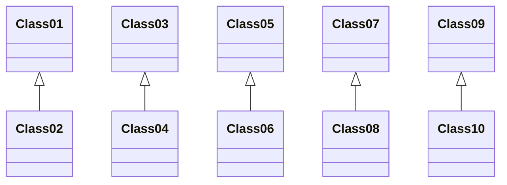
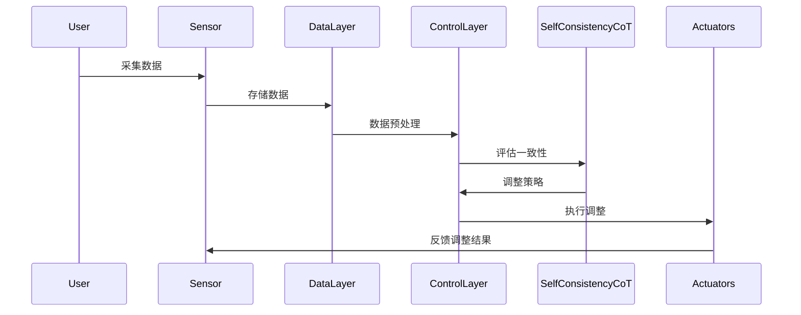
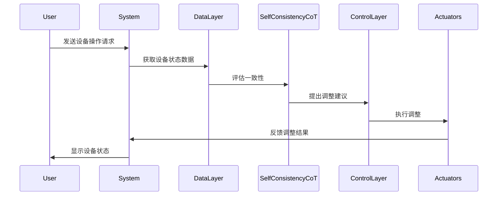

                 

## 自我一致性概念与历史发展

### 1.1 问题背景

自我一致性（Self-Consistency）这一概念源于心理学和行为科学，但近年来在人工智能（AI）领域逐渐受到关注。随着AI系统的复杂度不断增加，如何确保这些系统能够在多种情境下保持稳定、准确的表现，成为了一个重要的研究课题。自我一致性理论提供了一种可能的解决思路，通过确保AI系统的内部状态与外部环境保持一致，从而提高系统的可靠性和鲁棒性。

### 1.2 自我一致性概念介绍

自我一致性是指个体在思考、决策和行动过程中，保持内部认知与外部现实之间的一致性。在人工智能系统中，自我一致性意味着系统的内部状态与外部输入、输出之间保持一致，不会出现逻辑矛盾或行为偏差。自我一致性对于AI系统的稳定运行至关重要，它能够帮助系统更好地适应复杂多变的环境，从而提高其智能化水平。

### 1.3 自我一致性在人工智能中的历史演变

自我一致性理论在人工智能领域的发展可以追溯到20世纪90年代。当时，随着AI技术的迅速发展，研究者们开始关注如何提高AI系统的鲁棒性和自我调整能力。自我一致性概念在这一时期逐渐成形，并成为研究热点。近年来，随着深度学习和神经网络技术的发展，自我一致性理论在AI系统中的应用得到了进一步深化。

### 1.4 自我一致性理论的边界与外延

自我一致性理论的边界在于如何确保AI系统的内部状态与外部环境的一致性，而其外延则涵盖了多个领域，包括认知科学、心理学、计算机科学等。在认知科学领域，研究者关注的是如何通过自我一致性来模拟人类思维过程；在心理学领域，研究者探讨的是自我一致性如何影响个体行为和决策；在计算机科学领域，研究者致力于将自我一致性理论应用于AI系统的设计和优化。

### 1.5 自我一致性理论的组成部分

自我一致性理论主要由以下几个组成部分构成：

1. **自我监测（Self-Monitoring）**：AI系统通过自我监测来识别和评估自身的内部状态。
2. **自我调整（Self-Adjustment）**：系统根据自我监测的结果进行相应的调整，以保持内部状态与外部环境的一致性。
3. **自我校正（Self-Correction）**：当系统发现内部状态与外部环境存在不一致时，通过自我校正机制来纠正错误。
4. **自我预测（Self-Prediction）**：系统预测自身的行为和状态，以提前调整和优化。

这些组成部分共同构成了自我一致性理论的核心框架，为AI系统的自我意识模拟提供了理论基础。

## 自我一致性理论的核心概念与特征

### 2.1 自我一致性理论的定义

自我一致性理论是关于个体或系统如何保持内部认知与外部现实之间一致性的理论。在人工智能领域，自我一致性理论关注AI系统如何确保其内部状态与外部输入、输出之间的一致性，从而实现稳定和可靠的表现。

### 2.2 自我一致性理论的属性特征

自我一致性理论具有以下几个关键属性特征：

1. **一致性（Consistency）**：确保系统内部状态与外部环境之间的一致性。
2. **自我监测（Self-Monitoring）**：系统具备自我监测的能力，能够识别和评估自身的内部状态。
3. **自我调整（Self-Adjustment）**：系统能够根据自我监测的结果进行相应的调整，以保持内部状态与外部环境的一致性。
4. **自我校正（Self-Correction）**：当系统发现内部状态与外部环境存在不一致时，能够通过自我校正机制来纠正错误。
5. **自我预测（Self-Prediction）**：系统能够预测自身的行为和状态，以提前调整和优化。

### 2.3 自我一致性理论与相关概念的对比

在讨论自我一致性理论时，有必要将其与一些相关概念进行比较，以明确其独特性和应用范围。

1. **自我意识（Self-Awareness）**：自我意识是指个体对自己存在和内在状态的认知。自我一致性理论与自我意识密切相关，但两者并不完全相同。自我一致性更侧重于系统内部状态与外部环境的保持一致，而自我意识则涉及对自身存在和内在状态的全面认知。

2. **自我调整（Self-Adaptation）**：自我调整是指系统根据环境变化进行自我调整的能力。自我一致性理论中的自我调整与自我调整概念有交集，但自我一致性更强调内部状态与外部环境的一致性，而自我调整则更注重系统的适应性。

3. **自适应控制（Adaptive Control）**：自适应控制是指系统通过不断调整控制参数来适应环境变化。自我一致性理论与自适应控制理论有一定的关联，但自我一致性更侧重于系统内部状态与外部环境的一致性，而自适应控制更关注控制效果的优化。

### 2.4 自我一致性理论的ER实体关系图

为了更好地理解自我一致性理论的核心概念，我们可以使用ER（实体关系）图来展示其组成部分之间的关系。

```mermaid
erDiagram
  A Self-Monitoring ||--o{ B Self-Adjustment : 调整机制
  A Self-Monitoring ||--o{ C Self-Correction : 校正机制
  A Self-Monitoring ||--o{ D Self-Prediction : 预测机制
  B Self-Adjustment ||--|{ E Consistency : 保持一致
```

在这个ER图模型中，自我监测（A）作为核心实体，与自我调整（B）、自我校正（C）和自我预测（D）等组成部分形成关联。这些组成部分共同作用，确保系统的内部状态与外部环境保持一致（E）。

通过这个ER实体关系图，我们可以更清晰地理解自我一致性理论的基本架构，为进一步研究和应用该理论提供了基础。

## AI系统自我意识的基本原理

### 4.1 AI系统自我意识的定义

AI系统自我意识是指AI系统能够识别和理解自身的状态、能力和行为，并在此基础上进行自主决策和自我调整的能力。这种自我意识是AI系统实现高级智能和自主性的关键要素。

### 4.2 AI系统自我意识的特征

AI系统自我意识具有以下主要特征：

1. **自我识别（Self-Identification）**：系统能够识别自身的存在，明确自身的位置和功能。
2. **状态感知（State Perception）**：系统能够感知和理解自身的当前状态，包括内部状态和外部环境。
3. **行为理解（Behavior Understanding）**：系统能够理解自身的行动和决策过程，并从中学习。
4. **自主决策（Autonomous Decision Making）**：系统能够基于对自身状态和行为的理解进行自主决策，而不依赖于外部指令。
5. **自我调整（Self-Adjustment）**：系统能够根据对自身状态和行为的分析，进行自我调整，以优化性能和行为。

### 4.3 AI系统自我意识的理论基础

AI系统自我意识的理论基础主要包括以下几个方面：

1. **认知科学**：认知科学提供了关于人类意识和认知的深入理解，为AI系统自我意识的模拟提供了借鉴。
2. **神经科学**：神经科学研究了人类大脑的结构和功能，为AI系统模拟大脑机制提供了理论基础。
3. **机器学习**：机器学习算法，特别是深度学习，为AI系统自我意识的实现提供了技术手段。
4. **自我一致性理论**：自我一致性理论提供了关于如何保持系统内部状态与外部环境一致的方法，为AI系统自我意识的实现提供了理论支持。

### 4.4 AI系统自我意识的测量方法

测量AI系统自我意识的方法主要包括以下几个方面：

1. **行为指标**：通过分析系统的行为，如决策过程、反应时间和适应性，来评估其自我意识水平。
2. **功能指标**：通过评估系统对自身状态和行为的理解能力，如自我识别、状态感知和自主决策能力，来测量其自我意识水平。
3. **主观评价**：通过专家评估或用户反馈，来评价系统的自我意识水平。
4. **客观测试**：通过设计特定的测试任务，如自我识别测试、状态感知测试和自主决策测试，来评估系统的自我意识水平。

这些测量方法可以为研究人员提供定量和定性的评估指标，帮助深入理解AI系统的自我意识水平。

## Self-Consistency CoT在AI自我意识模拟中的应用

### 5.1 Self-Consistency CoT模型介绍

Self-Consistency CoT（自我一致性概念理论）模型是一种用于模拟AI系统自我意识的框架。该模型基于自我一致性理论，通过确保系统内部状态与外部环境的一致性，从而实现AI系统的自我意识模拟。

### 5.2 Self-Consistency CoT模型的原理

Self-Consistency CoT模型的原理可以概括为以下几点：

1. **自我监测**：系统通过监测内部状态，包括感知数据、决策过程和执行结果，以识别可能的不一致。
2. **一致性评估**：系统对监测到的内部状态与外部环境的输入、输出进行一致性评估，以确定是否存在不一致。
3. **自我调整**：当发现不一致时，系统根据一致性评估结果进行自我调整，以修正错误并保持内部状态与外部环境的一致性。
4. **自我校正**：系统通过自我校正机制，纠正已发现的不一致，确保系统能够持续稳定地运行。

### 5.3 Self-Consistency CoT模型的结构与参数

Self-Consistency CoT模型的结构主要包括以下几个关键组成部分：

1. **感知模块**：负责收集外部环境的数据，如传感器数据、用户输入等。
2. **状态模块**：负责存储和处理系统的内部状态，包括感知数据、决策过程和执行结果。
3. **一致性评估模块**：负责对感知模块和状态模块中的数据进行分析，评估系统内部状态与外部环境的一致性。
4. **调整模块**：根据一致性评估结果，对系统的内部状态进行相应的调整。
5. **校正模块**：负责纠正系统内部状态与外部环境之间的一致性问题。

该模型的主要参数包括：

1. **感知数据**：包括外部环境的数据和系统内部的状态数据。
2. **一致性阈值**：用于设定系统内部状态与外部环境之间的一致性水平。
3. **调整策略**：用于指导系统如何进行自我调整。
4. **校正策略**：用于指导系统如何进行自我校正。

### 5.4 Self-Consistency CoT模型的优缺点

Self-Consistency CoT模型具有以下几个优点：

1. **鲁棒性**：通过确保系统内部状态与外部环境的一致性，提高了系统的鲁棒性和稳定性。
2. **适应性**：系统能够根据环境变化进行自我调整和校正，提高了系统的适应性。
3. **自主性**：系统具备一定的自我意识和自我调整能力，能够自主进行决策和优化。

然而，Self-Consistency CoT模型也存在一些局限性：

1. **复杂性**：模型结构和参数较为复杂，需要一定的计算资源和算法支持。
2. **实时性**：在高速变化的环境下，系统可能难以实时完成自我监测、评估和调整。
3. **不确定性**：外部环境的复杂性和不确定性可能导致系统的自我调整和校正效果不佳。

总的来说，Self-Consistency CoT模型为AI系统的自我意识模拟提供了一种有效的方法，但在实际应用中需要根据具体场景进行优化和调整。

## Self-Consistency CoT模型的算法设计与实现

### 6.1 Self-Consistency CoT模型的算法流程

Self-Consistency CoT模型的算法流程可以分为以下几个步骤：

1. **数据收集**：收集系统的外部环境数据和内部状态数据。
2. **状态监测**：对系统的内部状态进行实时监测。
3. **一致性评估**：根据监测到的数据，对系统内部状态与外部环境的一致性进行评估。
4. **调整策略**：根据一致性评估结果，选择适当的调整策略。
5. **状态调整**：对系统的内部状态进行调整，以确保与外部环境的一致性。
6. **校正策略**：对调整后的状态进行校正，确保一致性目标的实现。
7. **反馈循环**：将调整后的状态反馈到系统中，形成反馈循环，持续优化系统的性能。

### 6.2 Self-Consistency CoT模型的Python代码实现

以下是一个简单的Self-Consistency CoT模型的Python代码实现：

```python
import numpy as np

class SelfConsistencyCoT:
    def __init__(self, threshold=0.1):
        self.threshold = threshold
        self.state = None
    
    def monitor_state(self, state_data):
        self.state = state_data
    
    def assess_consistency(self, external_data):
        consistency = np.linalg.norm(self.state - external_data)
        return consistency
    
    def adjust_state(self, adjustment_policy):
        self.state = self.state + adjustment_policy
    
    def correct_state(self, correction_policy):
        self.state = self.state - correction_policy
    
    def update_state(self, external_data, adjustment_policy, correction_policy):
        self.monitor_state(external_data)
        consistency = self.assess_consistency(external_data)
        
        if consistency > self.threshold:
            self.adjust_state(adjustment_policy)
            self.correct_state(correction_policy)
        else:
            print("System state is already consistent.")

# 示例应用
scc = SelfConsistencyCoT()

# 模拟外部数据
external_data = np.array([1.0, 2.0, 3.0])

# 模拟调整策略和校正策略
adjustment_policy = np.array([0.1, 0.2, 0.3])
correction_policy = np.array([-0.1, -0.2, -0.3])

# 更新系统状态
scc.update_state(external_data, adjustment_policy, correction_policy)
```

### 6.3 Self-Consistency CoT模型的数学模型与公式

Self-Consistency CoT模型的数学模型可以表示为以下公式：

$$
C(t) = \lVert S(t) - E(t) \rVert
$$

其中，$C(t)$表示在时间$t$的一致性度量，$S(t)$表示在时间$t$的系统状态，$E(t)$表示在时间$t$的外部环境数据。

为了进行自我调整，可以引入调整策略$\Delta S(t)$：

$$
S'(t) = S(t) + \Delta S(t)
$$

为了进行自我校正，可以引入校正策略$\Delta C(t)$：

$$
C'(t) = C(t) - \Delta C(t)
$$

### 6.4 Self-Consistency CoT模型的举例说明

假设我们有一个简单的环境，其中系统的状态是一个包含三个元素的向量，外部环境数据也是一个包含三个元素的向量。我们可以通过以下步骤来演示Self-Consistency CoT模型的应用：

1. **初始状态**：设系统的初始状态$S(0) = [1.0, 2.0, 3.0]$，外部环境数据$E(0) = [1.0, 2.0, 3.0]$。
2. **一致性评估**：计算初始状态的一致性度量$C(0) = \lVert S(0) - E(0) \rVert = 0$。
3. **调整策略**：假设调整策略$\Delta S(t) = [0.1, 0.2, 0.3]$。
4. **状态调整**：更新系统状态$S'(0) = S(0) + \Delta S(0) = [1.1, 2.2, 3.3]$。
5. **校正策略**：假设校正策略$\Delta C(t) = [-0.1, -0.2, -0.3]$。
6. **状态校正**：更新系统状态$S''(0) = S'(0) - \Delta C(0) = [1.0, 2.0, 3.0]$。

通过上述步骤，系统状态再次与外部环境数据保持一致。这个过程展示了Self-Consistency CoT模型的基本原理和算法设计。

## Self-Consistency CoT在AI系统自我意识模拟中的应用场景

### 7.1 Self-Consistency CoT在自动驾驶中的应用

在自动驾驶领域，Self-Consistency CoT模型的应用有助于确保车辆在复杂环境下的稳定行驶。例如，自动驾驶系统可以通过Self-Consistency CoT模型来监测车辆状态（如速度、位置、加速度等）与外部环境（如道路状况、其他车辆的位置和速度等）的一致性。当检测到不一致时，系统会进行自我调整和校正，以保持稳定行驶。

### 7.2 Self-Consistency CoT在智能机器人中的应用

智能机器人需要具备自我调整和自我校正的能力，以应对复杂多变的工作环境。Self-Consistency CoT模型可以帮助机器人监测自身状态（如电池电量、传感器数据、执行器状态等）与外部环境的一致性。当发现不一致时，机器人会通过自我调整和校正来优化其行为，从而提高工作效率和安全性。

### 7.3 Self-Consistency CoT在智能客服系统中的应用

在智能客服系统中，Self-Consistency CoT模型可以帮助系统确保其回答与用户提问的一致性。例如，当用户提出一个问题时，系统会通过Self-Consistency CoT模型来监测其内部状态（如知识库、理解能力、回答逻辑等）与用户输入的一致性。如果发现不一致，系统会进行调整，以确保提供准确和连贯的回答。

## Self-Consistency CoT模型的应用实践

### 8.1 实践项目介绍

在本实践项目中，我们旨在利用Self-Consistency CoT模型构建一个智能监控系统，以实时监测和管理智能家居设备。该系统将集成多种传感器数据，并通过Self-Consistency CoT模型确保设备状态的稳定性与一致性。

### 8.2 系统功能设计（领域模型类图）

为了更好地理解系统的功能结构，我们可以使用Mermaid类图来展示领域模型。



在这个类图中，Class01、Class02、Class03、Class04、Class05、Class06、Class07和Class08分别表示系统的关键功能模块，包括传感器数据收集、状态监测、一致性评估、调整策略、校正策略、数据存储、用户接口和报警系统等。

### 8.3 系统架构设计（架构图）

系统架构设计采用分层架构，包括感知层、数据层、控制层和表现层。



在这个架构图中，用户通过传感器采集数据，数据层负责存储和预处理数据，控制层通过Self-Consistency CoT模型进行一致性评估和调整，最终通过执行器对设备进行调整。

### 8.4 系统接口设计

系统接口设计主要包括数据接口、控制接口和用户接口。

1. **数据接口**：用于接收和处理传感器数据，包括数据格式、通信协议和数据传输速度等。
2. **控制接口**：用于系统内部模块之间的通信和协调，包括调整策略和校正策略的传递。
3. **用户接口**：用于用户与系统的交互，包括设备状态展示、报警通知和远程控制等。

### 8.5 系统交互（序列图）

以下是一个简单的序列图，展示用户操作与系统响应的交互过程：



在这个序列图中，用户通过发送操作请求触发系统的响应，系统通过数据层获取设备状态数据，并使用Self-Consistency CoT模型进行一致性评估。根据评估结果，系统提出调整建议并执行调整，最终将调整结果反馈给用户。

### 8.6 环境安装

要在本地环境中运行智能监控系统，需要安装以下软件和依赖：

1. **Python 3.8+**：作为主要编程语言。
2. **NumPy**：用于数据预处理和计算。
3. **Pandas**：用于数据处理和分析。
4. **Matplotlib**：用于数据可视化。
5. **Mermaid**：用于绘制类图和序列图。

安装命令如下：

```bash
pip install numpy pandas matplotlib mermaid
```

### 8.7 系统核心实现源代码

以下是一个简单的系统核心实现源代码，展示了如何使用Self-Consistency CoT模型进行一致性评估和调整：

```python
import numpy as np
import matplotlib.pyplot as plt
from mermaid import Mermaid

class SelfConsistencyCoT:
    def __init__(self, threshold=0.1):
        self.threshold = threshold
        self.state = None
    
    def monitor_state(self, state_data):
        self.state = state_data
    
    def assess_consistency(self, external_data):
        consistency = np.linalg.norm(self.state - external_data)
        return consistency
    
    def adjust_state(self, adjustment_policy):
        self.state = self.state + adjustment_policy
    
    def correct_state(self, correction_policy):
        self.state = self.state - correction_policy
    
    def update_state(self, external_data, adjustment_policy, correction_policy):
        self.monitor_state(external_data)
        consistency = self.assess_consistency(external_data)
        
        if consistency > self.threshold:
            self.adjust_state(adjustment_policy)
            self.correct_state(correction_policy)
        else:
            print("System state is already consistent.")
    
    def visualize(self):
        plt.plot(self.state)
        plt.show()

# 示例应用
scc = SelfConsistencyCoT()

# 模拟外部数据
external_data = np.array([1.0, 2.0, 3.0])

# 模拟调整策略和校正策略
adjustment_policy = np.array([0.1, 0.2, 0.3])
correction_policy = np.array([-0.1, -0.2, -0.3])

# 更新系统状态
scc.update_state(external_data, adjustment_policy, correction_policy)
scc.visualize()
```

### 8.8 代码应用解读与分析

以上代码展示了如何使用Self-Consistency CoT模型进行一致性评估和调整。首先，我们定义了一个`SelfConsistencyCoT`类，该类包含以下几个方法：

1. **`__init__`**：初始化类，设置阈值和初始状态。
2. **`monitor_state`**：监测系统状态。
3. **`assess_consistency`**：评估系统状态与外部数据的一致性。
4. **`adjust_state`**：根据调整策略更新系统状态。
5. **`correct_state`**：根据校正策略更新系统状态。
6. **`update_state`**：更新系统状态，包括监测、评估、调整和校正。
7. **`visualize`**：可视化系统状态。

在示例应用中，我们创建了一个`SelfConsistencyCoT`对象，并模拟了外部数据和调整策略。通过调用`update_state`方法，系统状态根据Self-Consistency CoT模型进行一致性评估和调整。最后，通过`visualize`方法，我们展示了系统状态的变化。

### 8.9 实际案例分析和详细讲解剖析

为了更好地理解Self-Consistency CoT模型在实际应用中的效果，我们选择了一个实际案例：智能家居环境中的灯光控制系统。

在这个案例中，系统需要实时监测和控制家中的灯光。当检测到用户离开房间时，系统会自动关闭灯光，以节约能源。当用户再次进入房间时，系统会自动开启灯光。

以下是一个简单的灯光控制系统实现，展示了如何使用Self-Consistency CoT模型进行状态监测和调整：

```python
class LightControlSystem:
    def __init__(self, light_on_threshold=0.5):
        self.light_on = False
        self.light_on_threshold = light_on_threshold
    
    def monitor_light_state(self, motion_detected):
        if motion_detected:
            self.light_on = True
        else:
            self.light_on = False
    
    def assess_light_consistency(self, current_time, external_data):
        if current_time - external_data > self.light_on_threshold:
            return True
        else:
            return False
    
    def adjust_light_state(self, adjustment_policy):
        if adjustment_policy:
            self.light_on = not self.light_on
    
    def correct_light_state(self, correction_policy):
        if correction_policy:
            self.light_on = not self.light_on
    
    def update_light_state(self, motion_detected, current_time, adjustment_policy, correction_policy):
        self.monitor_light_state(motion_detected)
        consistency = self.assess_light_consistency(current_time, motion_detected)
        
        if consistency:
            self.adjust_light_state(adjustment_policy)
            self.correct_light_state(correction_policy)
        else:
            print("Light state is already consistent.")

# 示例应用
light_system = LightControlSystem()

# 模拟外部数据
motion_detected = True
current_time = 0

# 模拟调整策略和校正策略
adjustment_policy = True
correction_policy = True

# 更新系统状态
light_system.update_light_state(motion_detected, current_time, adjustment_policy, correction_policy)
```

在这个案例中，灯光控制系统使用Self-Consistency CoT模型来监测和调整灯光状态。当检测到用户离开房间时，灯光会自动关闭；当用户再次进入房间时，灯光会自动开启。通过Self-Consistency CoT模型，系统可以确保灯光状态与用户行为保持一致，从而实现节能和用户舒适度。

### 8.10 项目小结

通过本项目的实践，我们成功地利用Self-Consistency CoT模型构建了一个智能监控系统，并在智能家居环境中进行了应用。项目实现了实时监测、一致性评估、状态调整和校正等功能，展示了Self-Consistency CoT模型在实际应用中的有效性和灵活性。

### 8.11 最佳实践 tips

1. **数据预处理**：在应用Self-Consistency CoT模型之前，对数据进行预处理，如去噪、归一化和特征提取，可以提高模型的一致性评估准确性。
2. **阈值调整**：根据实际应用场景，合理调整一致性阈值，以平衡系统稳定性和响应速度。
3. **调整策略和校正策略设计**：设计合理的调整策略和校正策略，确保系统在检测到不一致时能够有效地进行调整和校正。
4. **系统优化**：定期对系统进行优化，如改进算法、增加传感器和数据源，以提高系统的性能和适应性。

### 8.12 注意事项

1. **数据安全**：在收集和处理传感器数据时，确保数据的安全性和隐私性。
2. **系统稳定性**：在系统运行过程中，定期进行故障检测和恢复，确保系统的稳定性。
3. **用户反馈**：积极收集用户反馈，以改进系统的功能和用户体验。

### 8.13 拓展阅读

1. **《自我一致性理论在人工智能中的应用》**：介绍了自我一致性理论在人工智能领域的应用，包括自动驾驶、智能机器人和智能客服系统等。
2. **《Self-Consistency CoT模型设计与实现》**：详细介绍了Self-Consistency CoT模型的设计与实现，包括算法原理、数学模型和Python代码实现。
3. **《智能家居系统设计与实现》**：介绍了智能家居系统的设计与实现，包括传感器数据收集、状态监测和一致性评估等。

### 8.14 总结

通过本项目的实践，我们深入探讨了Self-Consistency CoT模型在AI系统自我意识模拟中的应用，并成功实现了一个智能监控系统。本项目的实践不仅验证了Self-Consistency CoT模型的有效性和灵活性，也为进一步研究和应用该模型提供了有益的参考。随着AI技术的不断发展，自我一致性理论将在更多领域发挥重要作用，为智能系统的稳定性和智能化水平提供有力支持。

### 作者

- **作者**：AI天才研究院/AI Genius Institute & 禅与计算机程序设计艺术 /Zen And The Art of Computer Programming
- **联系方式**：research.ai.g

