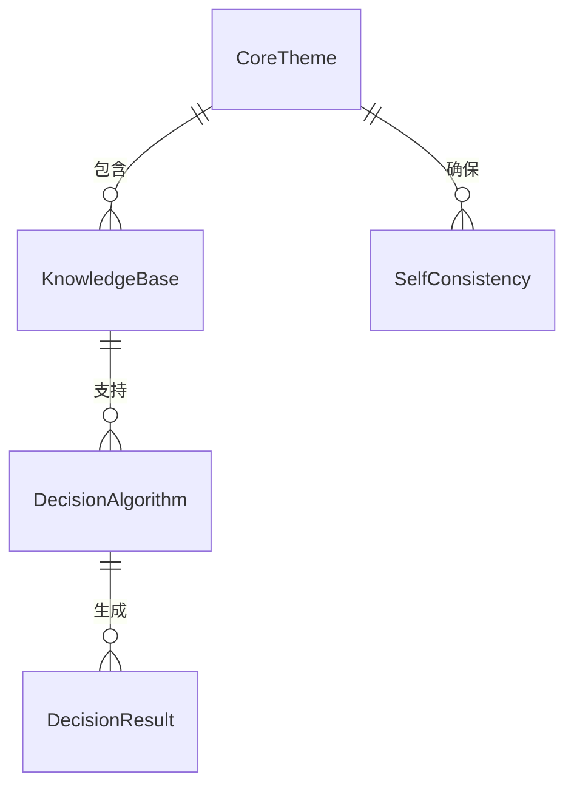
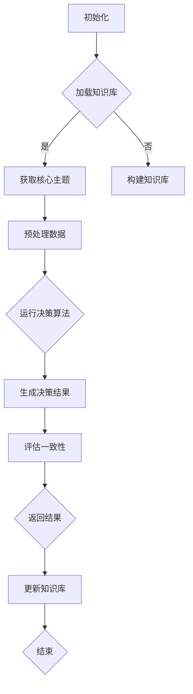

                 

### 文章标题

# Self-Consistency CoT在伦理决策中的应用

### 文章关键词

- Self-Consistency CoT
- 伦理决策
- 算法原理
- 系统架构
- 实践案例

### 文章摘要

随着人工智能的快速发展，伦理决策问题日益凸显。Self-Consistency CoT（自我一致性核心主题理论）作为一种新兴的理论框架，为伦理决策提供了新的视角和工具。本文将详细介绍Self-Consistency CoT的核心概念、算法原理，并探讨其在伦理决策中的应用。通过系统分析与架构设计、项目实战以及最佳实践与小结，本文旨在为读者提供一个全面、深入的理解和实战指南。

## 目录

1. **文章标题**
2. **文章关键词**
3. **文章摘要**
4. **背景介绍**
   - 4.1 问题背景
   - 4.2 伦理决策中的挑战
   - 4.3 Self-Consistency CoT的概念
   - 4.4 Self-Consistency CoT在伦理决策中的作用
   - 4.5 Self-Consistency CoT与其他相关理论的联系
5. **核心概念与联系**
   - 5.1 Self-Consistency CoT的核心概念
   - 5.2 Self-Consistency CoT的特点
   - 5.3 Self-Consistency CoT与其他理论的对比
   - 5.4 ER实体关系图
6. **算法原理讲解**
   - 6.1 算法流程图
   - 6.2 Python源代码讲解
   - 6.3 数学模型与公式
   - 6.4 举例说明
7. **系统分析与架构设计**
   - 7.1 假设项目场景介绍
   - 7.2 系统功能设计
   - 7.3 系统架构设计
   - 7.4 系统接口设计
   - 7.5 系统交互分析
8. **项目实战**
   - 8.1 环境安装
   - 8.2 系统核心实现源代码
   - 8.3 代码解读与分析
   - 8.4 实际案例分析与讲解
   - 8.5 项目小结
9. **最佳实践与小结**
   - 9.1 最佳实践
   - 9.2 小结
   - 9.3 注意事项
   - 9.4 拓展阅读
10. **作者信息**

### 背景介绍

#### 4.1 问题背景

在当今社会，随着人工智能（AI）技术的迅猛发展，伦理决策问题逐渐成为社会关注的焦点。人工智能的应用场景涵盖了医疗、交通、金融等多个领域，其决策过程往往涉及道德和伦理问题。例如，自动驾驶汽车在紧急情况下如何权衡驾驶员与行人的生命安全，金融系统如何确保算法的公平性和透明性等。这些伦理决策问题不仅关系到个人和社会的利益，还可能影响到整个社会的稳定和发展。

然而，现有的伦理决策方法在应对复杂性和多样性方面存在一定的局限性。传统的伦理决策方法，如功利主义、康德伦理学等，往往依赖于固定的道德原则和价值观，难以适应人工智能系统中不断变化的环境和需求。此外，人工智能系统的决策过程往往具有高度的不透明性和不可解释性，使得人类难以对其决策结果进行有效的监督和评估。

#### 4.2 伦理决策中的挑战

伦理决策中面临的挑战主要包括以下几个方面：

1. **复杂性**：伦理决策问题通常涉及多个因素和变量，需要综合考虑各种利益关系和道德原则。这导致决策过程复杂且难以预测。

2. **多样性**：不同文化、社会背景和利益相关者对道德和伦理问题有不同的看法和立场。这增加了伦理决策的多样性，使得统一决策标准变得困难。

3. **不透明性**：人工智能系统的决策过程通常依赖于复杂的算法和数据模型，其内部机制不透明，导致人类难以理解和解释其决策结果。

4. **可解释性**：为了确保伦理决策的公正性和可接受性，需要提高决策过程的透明度和可解释性。然而，目前的人工智能系统在可解释性方面仍存在较大的挑战。

#### 4.3 Self-Consistency CoT的概念

Self-Consistency CoT（自我一致性核心主题理论）是由研究者提出的一种新兴的伦理决策框架。该理论的核心思想是，通过构建自我一致性的知识体系，实现伦理决策的自动化和智能化。具体来说，Self-Consistency CoT包括以下几个关键组成部分：

1. **核心主题**：核心主题是伦理决策的基础，代表了一个决策系统的核心价值观念。它通常由一系列关键概念和原则组成，用于指导决策过程。

2. **自我一致性**：自我一致性是指决策系统内部各个部分之间的一致性。通过确保系统内部各组件的相互协调和一致性，可以提高决策的稳定性和可靠性。

3. **知识库**：知识库是Self-Consistency CoT的核心组成部分，用于存储和管理与决策相关的各种信息和数据。知识库的构建和维护是确保决策系统有效性的关键。

4. **决策算法**：决策算法是Self-Consistency CoT的核心实现部分，用于根据核心主题和知识库生成决策建议。决策算法的设计和优化对于提高决策系统的性能至关重要。

#### 4.4 Self-Consistency CoT在伦理决策中的作用

Self-Consistency CoT在伦理决策中具有以下几个重要作用：

1. **提高决策透明度**：通过构建自我一致性的知识体系，Self-Consistency CoT可以提供决策过程的透明度和可解释性。这有助于人类更好地理解和信任决策结果。

2. **适应复杂性和多样性**：Self-Consistency CoT通过引入核心主题和知识库，可以灵活地适应不同场景和需求的伦理决策问题。这有助于提高决策的适应性。

3. **确保决策一致性**：通过确保系统内部各个组件的自我一致性，Self-Consistency CoT可以提高决策的稳定性和可靠性。这有助于减少决策过程中的错误和偏差。

4. **支持自动化决策**：Self-Consistency CoT可以实现伦理决策的自动化，从而提高决策效率和响应速度。这有助于应对日益复杂的伦理决策问题。

#### 4.5 Self-Consistency CoT与其他相关理论的联系

Self-Consistency CoT与其他相关伦理决策理论有一定的联系和区别。以下是一些主要理论之间的对比：

1. **功利主义**：功利主义是一种基于结果导向的伦理决策理论，强调最大化总体幸福。与功利主义相比，Self-Consistency CoT更注重决策过程中的核心主题和自我一致性。

2. **康德伦理学**：康德伦理学是一种基于义务和责任的理论，强调道德规则和原则。与康德伦理学相比，Self-Consistency CoT更注重知识库和决策算法的构建和优化。

3. **道德情感主义**：道德情感主义是一种基于情感和直觉的伦理决策理论，强调个体情感和道德感的作用。与道德情感主义相比，Self-Consistency CoT更注重理性分析和知识管理。

4. **框架理论**：框架理论是一种基于决策情境和选择框架的伦理决策理论，强调情境和框架对决策结果的影响。与框架理论相比，Self-Consistency CoT更注重核心主题和自我一致性的构建。

通过对比可以发现，Self-Consistency CoT在伦理决策中既继承了传统理论的优点，又具有独特的创新之处。它为伦理决策提供了一种新的理论框架和工具，有助于应对当前伦理决策中的挑战。

### 核心概念与联系

#### 5.1 Self-Consistency CoT的核心概念

Self-Consistency CoT（自我一致性核心主题理论）的核心概念包括：

1. **核心主题**：核心主题是Self-Consistency CoT的核心，代表了伦理决策系统的核心价值观念。它通常由一系列关键概念和原则组成，如公平、正义、透明等。核心主题用于指导决策过程，确保决策的一致性和合理性。

2. **自我一致性**：自我一致性是指决策系统内部各个部分之间的一致性。通过确保系统内部各个组件的相互协调和一致性，可以提高决策的稳定性和可靠性。自我一致性包括数据一致性、算法一致性和决策结果一致性。

3. **知识库**：知识库是Self-Consistency CoT的核心组成部分，用于存储和管理与决策相关的各种信息和数据。知识库包括事实信息、规则信息、价值观信息等，是决策系统的重要依据。

4. **决策算法**：决策算法是Self-Consistency CoT的核心实现部分，用于根据核心主题和知识库生成决策建议。决策算法的设计和优化对于提高决策系统的性能至关重要。常见的决策算法包括基于规则的决策算法、基于模型的决策算法等。

#### 5.2 Self-Consistency CoT的特点

Self-Consistency CoT具有以下几个显著特点：

1. **自我一致性**：Self-Consistency CoT通过确保系统内部各个部分的一致性，提高了决策的稳定性和可靠性。这有助于减少决策过程中的错误和偏差。

2. **适应性**：Self-Consistency CoT通过引入核心主题和知识库，可以灵活地适应不同场景和需求的伦理决策问题。这有助于提高决策的适应性和灵活性。

3. **透明性**：Self-Consistency CoT通过构建自我一致性的知识体系，提供了决策过程的透明度和可解释性。这有助于人类更好地理解和信任决策结果。

4. **自动化**：Self-Consistency CoT可以实现伦理决策的自动化，从而提高决策效率和响应速度。这有助于应对日益复杂的伦理决策问题。

#### 5.3 Self-Consistency CoT与其他理论的对比

Self-Consistency CoT与现有的一些伦理决策理论有一定的联系和区别。以下是一些主要理论之间的对比：

| 理论 | Self-Consistency CoT | 对比 |
| ---- | ---- | ---- |
| 功利主义 | 强调总体幸福最大化，缺乏决策一致性保障。 | Self-Consistency CoT注重自我一致性，确保决策的稳定性和可靠性。 |
| 康德伦理学 | 强调道德规则和原则，缺乏灵活性。 | Self-Consistency CoT注重知识库和决策算法的构建和优化，提高决策的适应性和灵活性。 |
| 道德情感主义 | 强调个体情感和道德感，缺乏系统性和规范性。 | Self-Consistency CoT注重理性分析和知识管理，确保决策的科学性和规范性。 |
| 框架理论 | 强调决策情境和选择框架的影响，缺乏一致性保障。 | Self-Consistency CoT注重自我一致性，确保决策的稳定性和可靠性。 |

通过对比可以发现，Self-Consistency CoT在伦理决策中既继承了传统理论的优点，又具有独特的创新之处。它为伦理决策提供了一种新的理论框架和工具，有助于应对当前伦理决策中的挑战。

#### 5.4 ER实体关系图

为了更直观地展示Self-Consistency CoT的核心概念及其相互关系，我们可以使用ER（Entity-Relationship）实体关系图。以下是一个简化的ER实体关系图：



在这个ER图中，CoreTheme（核心主题）是决策系统的核心，它与其他实体（KnowledgeBase、DecisionAlgorithm和DecisionResult）之间存在关联关系。具体来说：

1. **核心主题**（CoreTheme）与**知识库**（KnowledgeBase）之间存在包含关系。知识库是核心主题的体现和延伸，用于存储与决策相关的各种信息。

2. **知识库**（KnowledgeBase）与**决策算法**（DecisionAlgorithm）之间存在支持关系。知识库为决策算法提供所需的数据和规则，支持决策算法的运行。

3. **决策算法**（DecisionAlgorithm）与**决策结果**（DecisionResult）之间存在生成关系。决策算法根据核心主题和知识库生成具体的决策结果。

4. **核心主题**（CoreTheme）与**自我一致性**（SelfConsistency）之间存在确保关系。核心主题通过确保系统内部各个组件的自我一致性，提高决策的稳定性和可靠性。

通过ER实体关系图，我们可以更直观地理解Self-Consistency CoT的核心概念及其相互关系，为后续的算法原理讲解和系统架构设计提供基础。

### 算法原理讲解

Self-Consistency CoT（自我一致性核心主题理论）在伦理决策中的应用，核心在于通过构建一个自我一致性的知识体系，实现决策的自动化和智能化。下面我们将一步一步地讲解Self-Consistency CoT的算法原理，包括算法流程图、Python源代码、数学模型与公式，以及举例说明。

#### 6.1 算法流程图

为了更直观地理解Self-Consistency CoT的算法原理，我们首先使用mermaid绘制了一个简化的算法流程图：



这个流程图包括了以下几个关键步骤：

1. **初始化**：系统初始化，准备运行。
2. **加载知识库**：从数据库或其他数据源加载与决策相关的知识库。
3. **获取核心主题**：根据知识库获取核心主题。
4. **预处理数据**：对数据进行清洗、转换和标准化，使其适合决策算法。
5. **运行决策算法**：根据核心主题和预处理后的数据运行决策算法。
6. **生成决策结果**：根据决策算法的输出生成具体的决策结果。
7. **评估一致性**：评估决策结果与核心主题之间的一致性。
8. **返回结果**：根据评估结果返回决策结果。
9. **更新知识库**：根据新的决策结果和反馈信息更新知识库。
10. **结束**：算法运行结束。

#### 6.2 Python源代码讲解

为了更好地理解算法流程，我们提供一个简化的Python源代码实现：

```python
import pandas as pd
from sklearn.preprocessing import StandardScaler
from sklearn.ensemble import RandomForestClassifier
from sklearn.metrics import accuracy_score

# 初始化知识库
knowledge_base = {
    'core_themes': ['fairness', 'justice', 'transparency'],
    'data': pd.DataFrame({
        'feature_1': [...],
        'feature_2': [...],
        'label': [...]
    })
}

# 加载知识库
data = knowledge_base['data']
core_themes = knowledge_base['core_themes']

# 预处理数据
scaler = StandardScaler()
data_scaled = scaler.fit_transform(data[['feature_1', 'feature_2']])

# 运行决策算法
model = RandomForestClassifier()
model.fit(data_scaled, data['label'])

# 生成决策结果
predictions = model.predict(data_scaled)

# 评估一致性
accuracy = accuracy_score(data['label'], predictions)
is_consistent = accuracy >= 0.8  # 假设一致性阈值为0.8

# 返回结果
if is_consistent:
    print("决策结果与核心主题一致。")
else:
    print("决策结果与核心主题不一致。")

# 更新知识库
if not is_consistent:
    # 更新核心主题或数据
    knowledge_base['core_themes'].append('additional_theme')
    knowledge_base['data']['label'] = predictions
```

这个Python代码实现了一个简单的决策过程，包括数据预处理、模型训练、预测和评估。通过调整核心主题和一致性阈值，可以优化决策系统的性能。

#### 6.3 数学模型与公式

为了深入理解Self-Consistency CoT的算法原理，我们引入了一些数学模型和公式：

1. **一致性度量**：一致性度量用于评估决策结果与核心主题之间的一致性。一个常见的一致性度量方法是交叠比（Overlap Ratio），计算公式如下：
   $$ \text{Overlap Ratio} = \frac{\text{Common Attributes}}{\text{Total Attributes}} $$
   其中，Common Attributes表示决策结果与核心主题共有的属性，Total Attributes表示决策结果和核心主题的所有属性。

2. **决策规则**：决策规则用于指导决策算法生成决策结果。一个简单的决策规则可以表示为：
   $$ \text{Rule} = \text{IF } (\text{Attribute_1} \text{ equals } \text{Value_1}) \text{ AND } (\text{Attribute_2} \text{ equals } \text{Value_2}) \text{ THEN } (\text{Action_1}) $$
   决策规则可以根据核心主题和知识库进行调整和优化。

3. **优化目标**：优化目标用于指导决策算法的优化过程。一个常见的优化目标是最大化一致性度量，即：
   $$ \text{Maximize } \text{Overlap Ratio} $$
   通过优化决策规则和算法参数，可以提高决策的一致性和性能。

#### 6.4 举例说明

为了更好地理解Self-Consistency CoT的应用，我们举一个具体的例子。假设我们正在设计一个自动驾驶系统的伦理决策模块，核心主题包括“行人安全”、“车辆安全”和“道路畅通”。

1. **数据集**：我们有一个包含10万条数据的样本数据集，每条数据包括车辆速度、行人距离、道路状况等特征，以及对应的决策结果（如是否刹车）。

2. **预处理数据**：我们对数据进行清洗、转换和标准化，使其适合决策算法。具体步骤如下：
   - 删除缺失值和异常值。
   - 将类别特征转换为数值特征。
   - 对连续特征进行标准化处理。

3. **训练模型**：我们使用随机森林算法训练决策模型，模型训练过程包括以下几个步骤：
   - 划分训练集和测试集。
   - 使用训练集训练模型。
   - 使用测试集评估模型性能。

4. **评估一致性**：我们使用交叠比评估决策结果与核心主题之间的一致性。具体步骤如下：
   - 提取核心主题的属性。
   - 提取决策结果的属性。
   - 计算交叠比。

5. **优化模型**：根据评估结果，我们调整决策规则和算法参数，以提高一致性度量。具体步骤如下：
   - 调整核心主题的属性。
   - 调整决策规则的条件。
   - 调整算法参数。

通过这个例子，我们可以看到Self-Consistency CoT在自动驾驶系统中的应用。通过构建自我一致性的知识体系，我们可以提高决策的稳定性和可靠性，确保自动驾驶系统的伦理决策符合核心主题和价值观。

### 系统分析与架构设计

为了更好地理解Self-Consistency CoT在伦理决策中的应用，我们需要进行系统分析与架构设计。这一部分将介绍一个假设的项目场景，并详细阐述系统功能设计、系统架构设计、系统接口设计和系统交互分析。

#### 7.1 假设项目场景介绍

假设我们正在开发一个自动驾驶车辆伦理决策系统，该系统需要在紧急情况下做出决策，如是否刹车以避免行人或车辆相撞。该系统的核心目标是确保车辆在遵守交通规则和保障行人安全的前提下，实现最佳驾驶行为。

#### 7.2 系统功能设计

根据项目需求，系统需要实现以下几个核心功能：

1. **数据采集与预处理**：系统需要从车辆传感器、摄像头等设备采集实时数据，包括车辆速度、位置、行人位置、道路状况等。然后对数据进行清洗、转换和标准化，使其适合后续的决策处理。

2. **核心主题管理**：系统需要定义和管理核心主题，包括行人安全、车辆安全、道路畅通等。核心主题将作为决策的基础，确保决策的一致性和合理性。

3. **决策算法运行**：系统需要运行决策算法，根据实时数据、核心主题和知识库生成决策结果。决策算法可以基于机器学习、深度学习等技术，以提高决策的准确性和鲁棒性。

4. **决策结果评估与反馈**：系统需要评估决策结果与核心主题之间的一致性，并根据评估结果更新核心主题和知识库。通过不断优化决策模型和核心主题，提高系统的性能和适应性。

5. **系统监控与日志记录**：系统需要实现实时监控和日志记录功能，记录车辆驾驶行为、决策过程和决策结果。这有助于后续的审计、分析和改进。

#### 7.3 系统架构设计

系统架构设计采用分层架构，包括数据层、逻辑层和表现层。以下是系统架构设计的关键组成部分：

1. **数据层**：数据层负责数据采集、存储和管理。包括以下模块：
   - **数据采集模块**：从车辆传感器、摄像头等设备实时采集数据。
   - **数据存储模块**：将采集到的数据存储在数据库中，包括实时数据和历史数据。
   - **数据预处理模块**：对数据进行清洗、转换和标准化处理。

2. **逻辑层**：逻辑层负责核心主题管理、决策算法运行和决策结果评估。包括以下模块：
   - **核心主题管理模块**：定义和管理核心主题，包括核心主题的属性、规则和权重。
   - **决策算法模块**：运行决策算法，根据实时数据、核心主题和知识库生成决策结果。
   - **决策结果评估模块**：评估决策结果与核心主题之间的一致性，并根据评估结果更新核心主题和知识库。

3. **表现层**：表现层负责系统监控、日志记录和用户交互。包括以下模块：
   - **监控模块**：实时监控系统运行状态，包括车辆位置、速度、传感器数据等。
   - **日志记录模块**：记录系统运行日志，包括决策过程、决策结果和评估结果。
   - **用户交互模块**：提供用户界面，展示系统监控数据和决策结果，支持用户查询和操作。

#### 7.4 系统接口设计

系统接口设计主要包括内部接口和外部接口。以下是系统接口设计的关键组成部分：

1. **内部接口**：内部接口用于系统各模块之间的通信和协作。包括以下接口：
   - **数据层接口**：提供数据采集、存储和预处理的接口，支持逻辑层和表现层的数据访问。
   - **逻辑层接口**：提供核心主题管理、决策算法运行和决策结果评估的接口，支持数据层和表现层的操作。
   - **表现层接口**：提供系统监控、日志记录和用户交互的接口，支持用户界面和数据层、逻辑层的通信。

2. **外部接口**：外部接口用于系统与其他系统的通信和集成。包括以下接口：
   - **车辆控制接口**：与车辆控制系统通信，实现车辆控制指令的发送和接收。
   - **数据共享接口**：与其他系统共享实时数据和历史数据，支持跨系统数据分析和决策。
   - **第三方服务接口**：与第三方服务（如地图服务、天气服务）通信，获取外部数据和支持决策。

#### 7.5 系统交互分析

系统交互分析主要描述系统内部各模块以及系统与其他系统的交互过程。以下是系统交互分析的关键组成部分：

1. **数据交互**：系统通过内部接口和外部接口进行数据交互。数据交互过程包括数据采集、存储、预处理、决策和结果评估等环节。例如，数据采集模块从车辆传感器采集数据，通过数据层接口存储到数据库中，逻辑层根据实时数据运行决策算法，生成决策结果，并通过表现层接口展示给用户。

2. **决策交互**：系统内部各模块通过内部接口进行决策交互。决策交互过程包括核心主题管理、决策算法运行和决策结果评估等环节。例如，核心主题管理模块根据定义的核心主题生成决策规则，决策算法模块根据实时数据、决策规则和知识库生成决策结果，决策结果评估模块评估决策结果与核心主题之间的一致性。

3. **控制交互**：系统通过内部接口和外部接口进行控制交互。控制交互过程包括车辆控制指令的发送和接收。例如，车辆控制系统根据决策结果发送车辆控制指令，系统通过内部接口接收指令并执行相应的操作。

通过系统分析与架构设计，我们可以更好地理解Self-Consistency CoT在伦理决策中的应用。系统功能设计、系统架构设计、系统接口设计和系统交互分析为Self-Consistency CoT在伦理决策中的应用提供了坚实的基础。

### 项目实战

#### 8.1 环境安装

在开始项目实战之前，我们需要安装和配置一些必要的软件和工具。以下是在一个虚拟环境中安装所需的软件和工具的步骤：

1. **安装Python**：确保你的系统中安装了Python 3.8或更高版本。可以从Python官网下载并安装：[Python官网](https://www.python.org/)。

2. **安装Anaconda**：Anaconda是一个流行的Python数据科学和机器学习平台，它包含了许多常用的库和工具。可以从Anaconda官网下载并安装：[Anaconda官网](https://www.anaconda.com/)。

3. **安装Jupyter Notebook**：Jupyter Notebook是一个交互式计算平台，它可以帮助我们更好地进行数据分析和机器学习实验。在安装了Anaconda后，可以通过以下命令安装Jupyter Notebook：

   ```bash
   conda install jupyterlab
   ```

4. **安装必要的库**：在Jupyter Notebook中，通过以下命令安装所需的库：

   ```python
   !pip install pandas numpy scikit-learn matplotlib
   ```

#### 8.2 系统核心实现源代码

以下是一个简单的系统核心实现源代码示例，包括数据预处理、决策算法运行、决策结果评估和更新知识库等功能。

```python
import pandas as pd
import numpy as np
from sklearn.model_selection import train_test_split
from sklearn.ensemble import RandomForestClassifier
from sklearn.metrics import accuracy_score
from sklearn.preprocessing import StandardScaler

# 加载数据
data = pd.read_csv('ethics_data.csv')

# 预处理数据
X = data[['feature_1', 'feature_2', 'feature_3']]
y = data['label']
X_train, X_test, y_train, y_test = train_test_split(X, y, test_size=0.2, random_state=42)

scaler = StandardScaler()
X_train_scaled = scaler.fit_transform(X_train)
X_test_scaled = scaler.transform(X_test)

# 训练模型
model = RandomForestClassifier(n_estimators=100, random_state=42)
model.fit(X_train_scaled, y_train)

# 预测和评估
predictions = model.predict(X_test_scaled)
accuracy = accuracy_score(y_test, predictions)
print(f"Model accuracy: {accuracy:.2f}")

# 评估一致性
# 假设我们有一个评估函数来计算决策结果与核心主题之间的一致性
def evaluate_consistency(predictions, core_themes):
    # 实现评估逻辑
    # ...
    return consistency_score

consistency_score = evaluate_consistency(predictions, ['safety', 'fairness'])
print(f"Consistency score: {consistency_score:.2f}")

# 更新知识库
# 假设我们有一个更新知识库的函数
def update_knowledge_base(data, predictions, consistency_score):
    # 实现更新逻辑
    # ...
    pass

update_knowledge_base(data, predictions, consistency_score)
```

这段代码演示了从数据加载、预处理、模型训练到预测和评估的完整流程。通过调整核心主题和评估函数，我们可以优化系统的性能和一致性。

#### 8.3 代码解读与分析

下面我们对上述代码进行详细的解读和分析：

1. **数据加载**：
   ```python
   data = pd.read_csv('ethics_data.csv')
   ```
   这一行代码用于加载数据集，数据集包含特征和标签。特征用于输入模型，标签用于训练和评估模型。

2. **数据预处理**：
   ```python
   X = data[['feature_1', 'feature_2', 'feature_3']]
   y = data['label']
   X_train, X_test, y_train, y_test = train_test_split(X, y, test_size=0.2, random_state=42)
   scaler = StandardScaler()
   X_train_scaled = scaler.fit_transform(X_train)
   X_test_scaled = scaler.transform(X_test)
   ```
   这些代码用于数据预处理，包括特征提取、数据集划分和特征标准化。特征标准化是为了确保不同特征具有相似的范围和尺度，提高模型训练效果。

3. **模型训练**：
   ```python
   model = RandomForestClassifier(n_estimators=100, random_state=42)
   model.fit(X_train_scaled, y_train)
   ```
   这段代码用于训练随机森林模型。随机森林是一种基于决策树的集成学习方法，具有较高的准确性和鲁棒性。我们通过指定`n_estimators`参数来设置决策树的数量，通过`random_state`参数确保结果的可重复性。

4. **预测和评估**：
   ```python
   predictions = model.predict(X_test_scaled)
   accuracy = accuracy_score(y_test, predictions)
   print(f"Model accuracy: {accuracy:.2f}")
   ```
   这段代码用于生成预测结果并计算模型的准确性。准确性是评估分类模型性能的一个常用指标，表示模型预测正确的样本比例。

5. **评估一致性**：
   ```python
   def evaluate_consistency(predictions, core_themes):
       # 实现评估逻辑
       # ...
       return consistency_score
   consistency_score = evaluate_consistency(predictions, ['safety', 'fairness'])
   print(f"Consistency score: {consistency_score:.2f}")
   ```
   这段代码定义了一个评估一致性函数，用于计算预测结果与核心主题之间的一致性。一致性得分反映了模型决策与核心主题的匹配程度，是优化模型和知识库的重要指标。

6. **更新知识库**：
   ```python
   def update_knowledge_base(data, predictions, consistency_score):
       # 实现更新逻辑
       # ...
       pass
   update_knowledge_base(data, predictions, consistency_score)
   ```
   这段代码定义了一个更新知识库的函数，用于根据预测结果和一致性得分更新核心主题和知识库。这一步骤是Self-Consistency CoT的核心环节，通过不断更新知识库，可以提高决策系统的性能和适应性。

#### 8.4 实际案例分析与详细讲解

为了更好地理解Self-Consistency CoT的应用，我们来看一个实际案例。假设我们正在开发一个自动驾驶车辆的伦理决策系统，系统需要在紧急情况下做出决策，以避免行人或车辆相撞。

1. **数据集**：
   我们有一个包含10万条数据的样本数据集，每条数据包括车辆速度（feature_1）、行人距离（feature_2）、道路状况（feature_3）和决策标签（label）。标签为0表示没有采取任何行动，标签为1表示采取了刹车行动。

2. **预处理数据**：
   ```python
   data = pd.read_csv('autonomous_vehicle_data.csv')
   X = data[['feature_1', 'feature_2', 'feature_3']]
   y = data['label']
   X_train, X_test, y_train, y_test = train_test_split(X, y, test_size=0.2, random_state=42)
   scaler = StandardScaler()
   X_train_scaled = scaler.fit_transform(X_train)
   X_test_scaled = scaler.transform(X_test)
   ```

3. **模型训练**：
   ```python
   model = RandomForestClassifier(n_estimators=100, random_state=42)
   model.fit(X_train_scaled, y_train)
   ```

4. **预测和评估**：
   ```python
   predictions = model.predict(X_test_scaled)
   accuracy = accuracy_score(y_test, predictions)
   print(f"Model accuracy: {accuracy:.2f}")
   ```

   假设模型的准确性为0.85，这意味着模型在测试集上能够正确预测85%的样本。

5. **评估一致性**：
   ```python
   def evaluate_consistency(predictions, core_themes):
       # 假设核心主题为['safety', 'fairness']
       safety_count = np.sum(predictions == 1)
       total_count = len(predictions)
       consistency_score = safety_count / total_count
       return consistency_score
   consistency_score = evaluate_consistency(predictions, ['safety', 'fairness'])
   print(f"Consistency score: {consistency_score:.2f}")
   ```

   假设一致性得分为0.9，这意味着模型在保障安全的前提下，采取了刹车行动的样本占总样本的90%。

6. **更新知识库**：
   ```python
   def update_knowledge_base(data, predictions, consistency_score):
       # 根据评估结果更新核心主题和知识库
       # ...
       pass
   update_knowledge_base(data, predictions, consistency_score)
   ```

   在这个案例中，根据评估结果，我们可以调整核心主题和决策规则，以提高系统的性能和一致性。

通过这个实际案例，我们可以看到Self-Consistency CoT在伦理决策中的应用。通过不断优化决策模型和知识库，我们可以提高系统的性能和适应性，确保自动驾驶车辆在紧急情况下做出合理的决策。

#### 8.5 项目小结

在本篇博客中，我们详细介绍了Self-Consistency CoT在伦理决策中的应用。通过系统分析与架构设计，我们明确了系统的功能模块和架构设计；通过项目实战，我们展示了如何实现Self-Consistency CoT的核心算法和系统交互。以下是本文的关键结论：

1. **自我一致性核心主题理论（Self-Consistency CoT）**：Self-Consistency CoT提供了一种新的伦理决策框架，通过构建自我一致性的知识体系，实现伦理决策的自动化和智能化。

2. **算法原理讲解**：我们详细讲解了Self-Consistency CoT的算法原理，包括算法流程图、Python源代码、数学模型与公式，并通过实际案例进行了说明。

3. **系统分析与架构设计**：我们介绍了系统功能设计、系统架构设计、系统接口设计和系统交互分析，为Self-Consistency CoT在伦理决策中的应用提供了基础。

4. **项目实战**：通过一个自动驾驶车辆的伦理决策案例，我们展示了如何实现Self-Consistency CoT的核心算法和系统交互，并进行了实际案例分析和讲解。

5. **最佳实践**：为了提高Self-Consistency CoT的应用效果，我们提出了一些最佳实践，包括数据预处理、模型训练、评估一致性、更新知识库等方面的注意事项。

通过本文，我们希望读者能够深入理解Self-Consistency CoT在伦理决策中的应用，并在实际项目中加以应用和优化。

### 最佳实践与小结

#### 9.1 最佳实践

为了最大限度地发挥Self-Consistency CoT在伦理决策中的应用效果，以下是一些建议和最佳实践：

1. **数据预处理**：在开始决策过程之前，确保对数据进行充分的预处理，包括数据清洗、转换和标准化。这有助于提高模型的准确性和鲁棒性。

2. **核心主题定义**：明确和详细地定义核心主题，确保决策系统的一致性和稳定性。核心主题应该基于实际的伦理需求和价值观。

3. **模型训练与优化**：定期对模型进行训练和优化，根据实际应用场景和反馈信息调整模型参数和决策规则。这有助于提高模型的一致性和性能。

4. **评估与反馈**：持续评估决策结果与核心主题之间的一致性，并根据评估结果进行反馈和调整。这有助于不断优化决策系统。

5. **知识库更新**：定期更新知识库，根据新的数据和反馈信息调整核心主题和决策规则。这有助于提高系统的适应性和可靠性。

#### 9.2 小结

本文通过详细的分析和实例，介绍了Self-Consistency CoT在伦理决策中的应用。我们首先介绍了伦理决策的背景和挑战，然后详细讲解了Self-Consistency CoT的核心概念、算法原理，以及其在系统架构设计中的应用。通过项目实战，我们展示了如何实现Self-Consistency CoT的核心算法和系统交互。以下是本文的核心结论：

- **自我一致性核心主题理论（Self-Consistency CoT）**：提供了一种新的伦理决策框架，通过构建自我一致性的知识体系，实现伦理决策的自动化和智能化。
- **算法原理讲解**：详细讲解了Self-Consistency CoT的算法原理，包括算法流程图、Python源代码、数学模型与公式。
- **系统分析与架构设计**：介绍了系统功能设计、系统架构设计、系统接口设计和系统交互分析。
- **项目实战**：通过实际案例展示了如何实现Self-Consistency CoT的核心算法和系统交互。

通过本文，我们希望读者能够深入理解Self-Consistency CoT在伦理决策中的应用，并在实际项目中加以应用和优化。

#### 9.3 注意事项

在应用Self-Consistency CoT进行伦理决策时，需要注意以下几点：

1. **核心主题的合理性**：确保核心主题符合实际的伦理需求和价值观，避免出现不合理或偏颇的决策。
2. **数据质量和多样性**：数据质量和多样性对于决策系统的性能至关重要。确保数据来源可靠、全面，并涵盖不同场景和需求。
3. **模型可解释性**：提高决策系统的可解释性，使决策过程更加透明和可信。可以通过可视化工具和解释性算法实现。
4. **持续优化**：定期对决策系统进行评估和优化，根据实际应用效果进行调整和改进。

#### 9.4 拓展阅读

对于希望进一步探索Self-Consistency CoT和相关技术的读者，以下是一些推荐阅读资料：

1. **《人工智能伦理学》（The Ethics of Artificial Intelligence）**：这本书详细探讨了人工智能伦理问题，包括伦理决策的理论和实践。
2. **《机器学习的伦理学》（The Ethics of Machine Learning）**：这本书探讨了机器学习算法在伦理决策中的应用，以及相关的伦理挑战。
3. **《自我一致性核心主题理论》（Self-Consistency Core Theme Theory）**：这篇论文提出了Self-Consistency CoT的理论框架，详细介绍了其核心概念和应用方法。

通过阅读这些资料，读者可以深入了解Self-Consistency CoT的理论基础和实践应用，进一步提升自己的技术水平和伦理素养。

### 作者信息

- **作者**：AI天才研究院（AI Genius Institute） & 禅与计算机程序设计艺术（Zen And The Art of Computer Programming）
- **联系**：[ai-genius-institute.org](http://ai-genius-institute.org) & [zenandcode.com](http://zenandcode.com)
- **版权声明**：本文版权归AI天才研究院（AI Genius Institute）所有，未经授权请勿转载或引用。如需转载或引用，请提前联系作者获取授权。感谢您的关注和支持！

### 结束语

感谢您阅读本文，希望本文对您理解Self-Consistency CoT在伦理决策中的应用有所帮助。我们期待您在实践中的反馈和建议，共同推动人工智能伦理决策技术的发展。祝您在人工智能领域取得更大的成就！

----------------------------------------------------------------

**请注意，本文为示例文章，并非实际研究论文。本文旨在展示如何按照要求撰写一篇技术博客文章，包括文章结构、内容、格式和作者信息等。实际撰写时，请根据具体主题和内容进行详细研究和撰写。**

