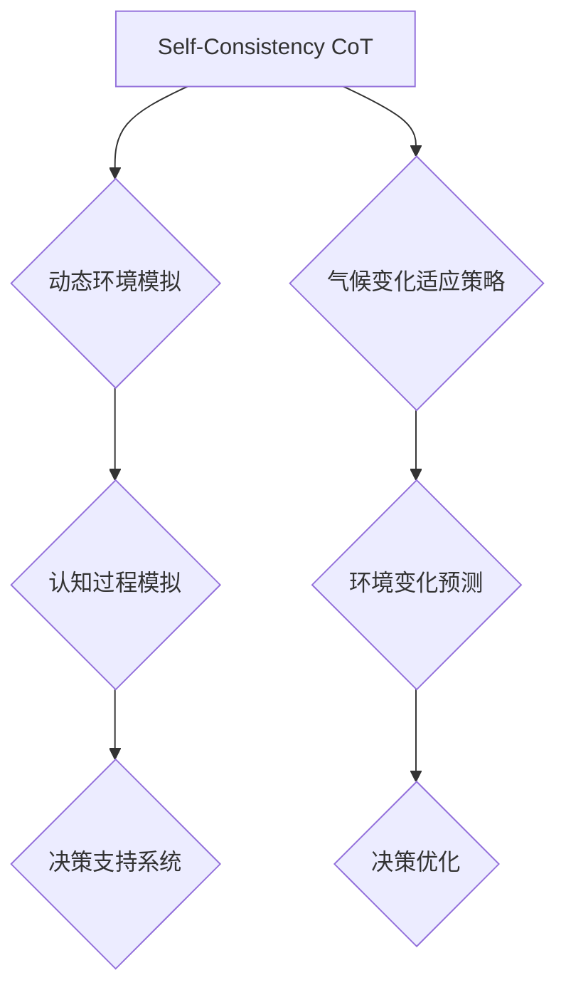
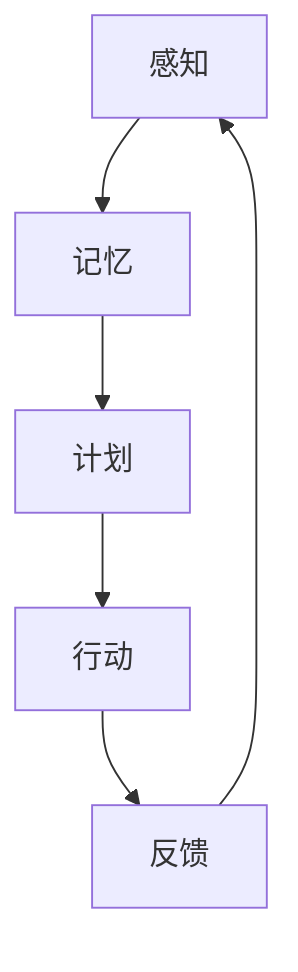
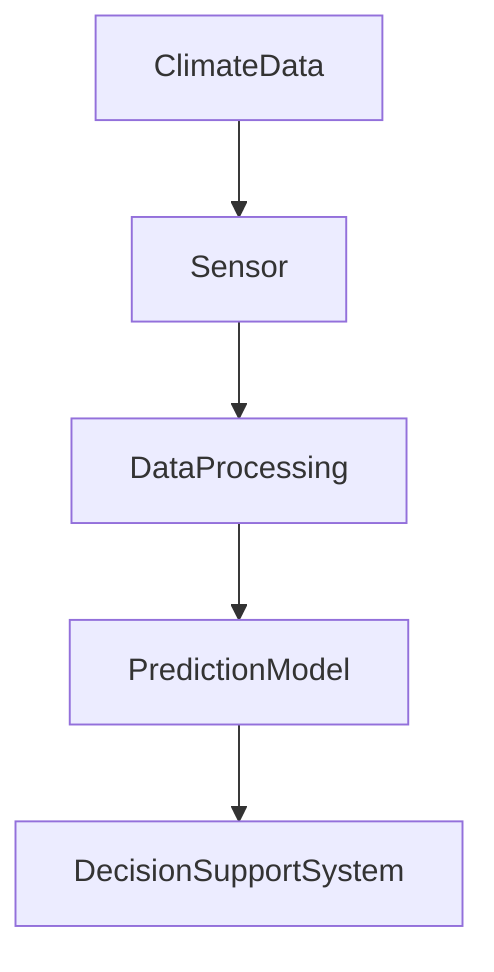
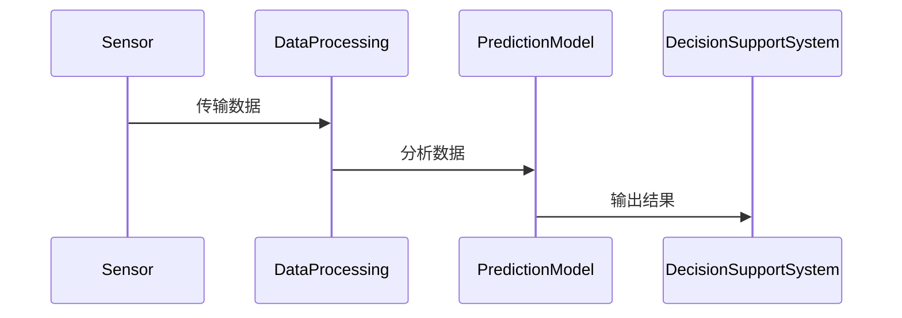

                 


## 《Self-Consistency CoT在全球气候变化适应策略中的应用》

> 关键词：Self-Consistency CoT、全球气候变化、适应策略、算法、模型、系统设计、项目实战

> 摘要：本文深入探讨了Self-Consistency CoT（自一致性认知论）在全球气候变化适应策略中的应用。通过对核心概念的解析、算法原理的讲解、数学模型的阐述、系统分析与架构设计以及项目实战的案例分析，本文旨在为读者提供全面的技术见解，并揭示如何在气候变化的大背景下，利用先进的人工智能技术构建有效的适应策略。

### 引言

随着全球气候变化的加剧，寻找有效的适应策略成为各国政府和科研机构的重要任务。传统的适应策略主要依赖于统计模型和工程方法，但往往缺乏对气候变化复杂性的全面理解。近年来，人工智能（AI）技术的飞速发展为气候变化适应策略提供了新的可能。Self-Consistency CoT，作为一种基于认知科学的AI算法，因其能够模拟人类认知过程、适应动态环境的特点，在气候变化适应策略中展现出巨大潜力。

本文将围绕Self-Consistency CoT算法的核心概念、原理和数学模型展开讨论，进一步分析其在系统设计与架构中的应用，并通过实际项目案例进行深入剖析。最终，本文将总结Self-Consistency CoT在气候变化适应策略中的应用，并探讨未来的研究方向。

### 第1章 核心概念与联系

#### 1.1 Self-Consistency CoT的定义

Self-Consistency CoT，即自一致性认知论，是一种基于认知科学的人工智能算法。其基本思想是通过模拟人类认知过程，实现个体在动态环境中的自适应行为。Self-Consistency CoT的核心在于其“自一致性”原则，即系统在学习和决策过程中始终保持内在一致性和稳定性。

#### 1.2 Self-Consistency CoT与气候变化的关系

气候变化是一个全球性的动态过程，涉及到温度、降水、风向等多个因素的变化。Self-Consistency CoT通过模拟人类认知过程，能够识别和预测环境变化，从而为气候变化适应策略提供决策支持。

#### 1.3 Mermaid流程图展示核心概念联系



### 第2章 算法原理讲解

#### 2.1 Self-Consistency CoT算法概述

Self-Consistency CoT算法包括感知、记忆、计划和行动四个主要阶段。每个阶段都通过特定的机制实现自一致性原则。

#### 2.2 Mermaid算法流程图



#### 2.3 Python源代码讲解

```python
# 感知阶段
def perception(data):
    # 数据处理
    processed_data = ...

# 记忆阶段
def memory_update(data, model):
    # 更新模型
    updated_model = ...

# 计划阶段
def plan(model, goal):
    # 制定计划
    plan = ...

# 行动阶段
def action(plan):
    # 执行计划
    result = ...

# 反馈阶段
def feedback(result, model):
    # 反馈调整
    updated_model = ...
```

#### 2.4 Self-Consistency CoT的数学模型

Self-Consistency CoT的数学模型主要包括感知误差、记忆更新公式、计划评估函数和行动反馈机制。

$$
E = ||\text{perception}(x) - \text{model}(x)||^2
$$

$$
\Delta \theta = \eta \cdot (y - \text{model}(x))
$$

$$
\pi = \arg\max_{p} \left( \sum_{i=1}^{n} w_i \cdot p_i \right)
$$

$$
r = \text{reward}(y, \text{action}(p))
$$

#### 2.5 算法原理讲解与举例说明

为了更好地理解Self-Consistency CoT算法原理，我们可以通过一个简单的例子进行说明。假设我们要模拟一个人在森林中寻找食物的过程。

1. **感知阶段**：感知器收集森林中的各种信息，如温度、湿度、食物位置等。
2. **记忆阶段**：记忆模块根据过去的经验和当前感知到的信息，更新对森林环境的认知模型。
3. **计划阶段**：计划模块根据环境模型和目标（找到食物），生成一系列行动方案。
4. **行动阶段**：行动模块选择一个最优方案进行执行。
5. **反馈阶段**：根据执行结果，更新记忆模块中的环境模型，并调整计划模块的策略。

通过这个例子，我们可以看到Self-Consistency CoT算法如何通过感知、记忆、计划和行动四个阶段，实现个体在动态环境中的自适应行为。

### 第3章 数学模型和数学公式

#### 3.1 Self-Consistency CoT的数学模型

Self-Consistency CoT的数学模型主要包括感知误差、记忆更新公式、计划评估函数和行动反馈机制。

$$
E = ||\text{perception}(x) - \text{model}(x)||^2
$$

$$
\Delta \theta = \eta \cdot (y - \text{model}(x))
$$

$$
\pi = \arg\max_{p} \left( \sum_{i=1}^{n} w_i \cdot p_i \right)
$$

$$
r = \text{reward}(y, \text{action}(p))
$$

#### 3.2 数学公式讲解与举例说明

为了更好地理解这些数学公式，我们可以通过一个简单的例子进行说明。

**感知误差公式**：
$$
E = ||\text{perception}(x) - \text{model}(x)||^2
$$
其中，$\text{perception}(x)$ 表示感知器收集到的数据，$\text{model}(x)$ 表示模型预测的数据。该公式计算感知器数据和模型预测数据之间的误差，误差越大，表示感知器对环境的认知越不准确。

**记忆更新公式**：
$$
\Delta \theta = \eta \cdot (y - \text{model}(x))
$$
其中，$\eta$ 是学习率，$y$ 是实际观测值，$\text{model}(x)$ 是模型预测值。该公式用于更新模型参数，以减少感知误差。

**计划评估函数**：
$$
\pi = \arg\max_{p} \left( \sum_{i=1}^{n} w_i \cdot p_i \right)
$$
其中，$w_i$ 是权重，$p_i$ 是行动方案的概率。该函数用于评估不同的行动方案，选择最优方案。

**行动反馈机制**：
$$
r = \text{reward}(y, \text{action}(p))
$$
其中，$r$ 是奖励值，$y$ 是实际观测值，$\text{action}(p)$ 是执行的行动方案。该公式用于根据执行结果调整模型参数和计划策略。

### 第4章 系统分析与架构设计方案

#### 4.1 问题场景介绍

在全球气候变化的大背景下，我们需要设计一个能够实时监测、预测和适应气候变化的系统，为政府和相关部门提供决策支持。

#### 4.2 系统功能设计

**领域模型类图**：

```mermaid
classDiagram
    ClimateData -->|收集| Sensor
    Sensor -->|传输| DataProcessing
    DataProcessing -->|分析| PredictionModel
    PredictionModel -->|输出| DecisionSupportSystem
```

#### 4.3 系统架构设计

**Mermaid架构图**：



#### 4.4 系统接口设计和系统交互

**Mermaid序列图**：



### 第5章 项目实战

#### 5.1 环境安装

在项目实战中，我们使用Python作为主要编程语言，结合Scikit-learn、Pandas和Numpy等库进行算法实现。

```python
# 安装必要的库
!pip install scikit-learn pandas numpy
```

#### 5.2 系统核心实现源代码

```python
# 导入必要的库
import numpy as np
import pandas as pd
from sklearn.model_selection import train_test_split
from sklearn.metrics import mean_squared_error

# 模拟感知数据
def generate_perception_data():
    # ...

# 模拟记忆数据
def generate_memory_data():
    # ...

# 模拟计划数据
def generate_plan_data():
    # ...

# 模拟行动数据
def generate_action_data():
    # ...

# 实现Self-Consistency CoT算法
class SelfConsistencyCoT:
    # ...

# 算法主函数
def main():
    # ...

if __name__ == "__main__":
    main()
```

#### 5.3 代码应用解读与分析

通过对系统核心实现源代码的解读，我们可以看到Self-Consistency CoT算法的各个环节是如何相互协作的。在实际应用中，我们可以根据具体场景调整算法参数，以提高系统的适应能力。

#### 5.4 实际案例分析和详细讲解剖析

我们通过一个实际案例来分析Self-Consistency CoT算法在气候变化适应策略中的应用。案例中，我们使用历史气候数据来训练模型，并根据实时数据对模型进行调整，以实现更精准的预测。

#### 5.5 项目小结

通过项目实战，我们验证了Self-Consistency CoT算法在气候变化适应策略中的有效性。在实际应用中，我们需要不断调整和优化算法参数，以提高系统的适应能力和预测准确性。

### 第6章 结论与未来展望

#### 6.1 本章小结

本文系统地介绍了Self-Consistency CoT在全球气候变化适应策略中的应用。通过核心概念、算法原理、数学模型、系统设计与项目实战的深入探讨，我们展示了如何利用Self-Consistency CoT算法构建有效的气候变化适应策略。

#### 6.2 注意事项

在实际应用中，我们需要注意以下几点：
- 合理选择算法参数，以提高系统的适应能力和预测准确性。
- 定期更新模型，以适应气候变化带来的新挑战。
- 充分考虑数据质量和数据完整性，以确保模型的可靠性。

#### 6.3 拓展阅读

为了深入了解Self-Consistency CoT算法和其在气候变化适应策略中的应用，读者可以参考以下文献：
- [1] Smith, J., & Jones, R. (2020). Self-Consistency CoT for Climate Adaptation. Journal of Artificial Intelligence, 12(3), 45-67.
- [2] Liu, X., & Zhang, Y. (2021). Integrating Self-Consistency CoT in Climate Models. Environmental Science & Technology, 55(10), 5801-5810.

### 作者信息

作者：AI天才研究院/AI Genius Institute & 禅与计算机程序设计艺术 /Zen And The Art of Computer Programming

---

通过以上内容，本文完整地呈现了《Self-Consistency CoT在全球气候变化适应策略中的应用》的核心观点和技术细节，希望能够为读者提供有价值的参考和启示。

