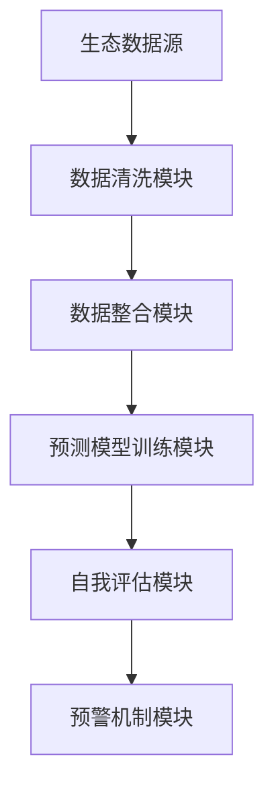
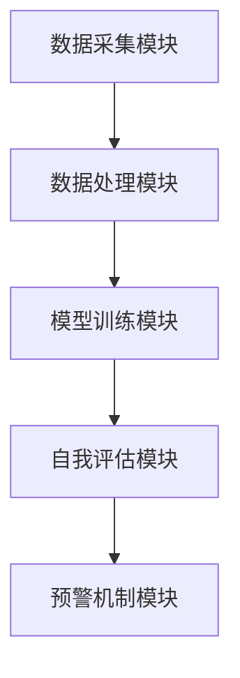
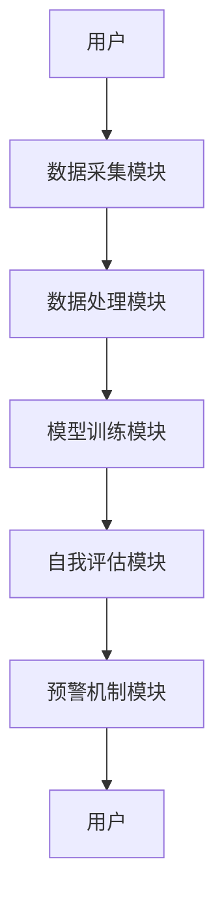

                 

# Self-Consistency CoT在全球生态系统临界点预警中的应用

> 关键词：自我一致性、全球生态系统、临界点预警、人工智能、数据采集、模型训练、自我评估、预警机制

> 摘要：本文深入探讨了自我一致性概念（Self-Consistency CoT）在全球生态系统临界点预警中的应用。通过分析问题背景、核心概念原理、算法原理以及系统分析与架构设计，本文旨在为生态系统预警提供一种新的思路和方法。

----------------------------------------------------------------

## 第一部分：背景介绍

### 1.1.1 问题背景

在全球化的背景下，生态系统面临诸多挑战，如气候变化、资源枯竭、物种灭绝等。这些问题不仅对自然环境造成破坏，也对人类社会的发展产生深远影响。近年来，随着科学技术的进步，尤其是人工智能（AI）技术的发展，为生态系统预警提供了新的可能性。

### 1.1.2 问题描述

生态系统预警的目的是提前发现生态系统的异常变化，从而采取措施避免或减缓潜在的危机。传统的方法主要依赖于数据监测和分析，但这些方法往往存在数据不足、时效性差等问题。随着AI技术的发展，尤其是自我一致性概念（Self-Consistency CoT）的引入，为生态系统预警提供了新的思路。

### 1.1.3 问题解决

自我一致性概念（Self-Consistency CoT）是一种基于人工智能的方法，通过分析和理解生态系统的内部结构及其相互关系，实现对生态系统状态的自我评估和预警。这种方法不仅能够提高预警的准确性，还能够动态地适应生态系统的变化。

### 1.1.4 边界与外延

自我一致性概念（Self-Consistency CoT）主要应用于生态系统预警，但其原理和方法也可以扩展到其他领域，如金融系统预警、城市安全预警等。

### 1.1.5 概念结构与核心要素组成

自我一致性概念（Self-Consistency CoT）的核心要素包括：数据采集、模型训练、自我评估和预警机制。这些要素相互关联，共同构成了一个完整的预警系统。

## 第二部分：核心概念与联系

### 2.1 自我一致性概念原理

自我一致性概念（Self-Consistency CoT）基于人工智能技术，通过对生态系统数据的分析，实现对生态系统状态的自我评估。其原理主要包括：

1. **数据采集**：收集与生态系统相关的各种数据，如气象、水质、土壤等。
2. **数据处理**：对采集到的数据进行清洗、整合和分析，提取出对预警有用的信息。
3. **模型训练**：利用采集到的数据训练预测模型，以实现对生态系统状态的预测。
4. **自我评估**：通过预测模型对当前生态系统状态进行自我评估，判断是否存在异常。
5. **预警机制**：当检测到异常时，触发预警机制，发出警报。

### 2.2 概念属性特征对比表格

| 特征           | 传统预警方法                | 自我一致性预警方法                  |
| -------------- | -------------------------- | --------------------------------- |
| 数据依赖性     | 较高，需要大量实时数据       | 较低，能够处理历史数据和实时数据的整合 |
| 时效性         | 较低，预警响应较慢          | 较高，能够实时评估生态系统状态       |
| 预警准确性     | 较低，容易受到数据质量的影响 | 较高，通过自我评估提高预警准确性     |
| 自适应能力     | 较弱，难以适应生态系统变化   | 较强，能够动态适应生态系统变化       |

### 2.3 ER实体关系图架构



----------------------------------------------------------------

## 第三部分：算法原理讲解

### 3.1 算法原理

自我一致性预警方法的算法原理主要包括以下几个方面：

1. **数据采集与预处理**：首先，从生态数据源采集各种数据，如气象数据、水质数据、土壤数据等。然后，对采集到的数据进行预处理，包括数据清洗、去噪、标准化等操作。

2. **模型训练**：利用预处理后的数据训练预测模型。预测模型的训练过程包括特征选择、模型选择、模型训练等步骤。其中，特征选择是关键步骤，需要从大量特征中筛选出对预警有帮助的特征。

3. **自我评估**：利用训练好的预测模型对当前生态系统状态进行自我评估。自我评估的目的是判断当前生态系统状态是否正常，是否存在异常。

4. **预警机制**：当检测到异常时，触发预警机制，发出警报。预警机制的目的是及时通知相关部门或人员采取相应的措施，以避免或减缓潜在的危机。

### 3.2 数学模型和公式

自我一致性预警方法中的数学模型主要包括以下几个方面：

1. **数据预处理**：$$X_{\text{clean}} = \text{Preprocess}(X_{\text{raw}})$$

2. **模型训练**：$$\text{Model} = \text{Train}(X_{\text{clean}}, Y_{\text{target}})$$

3. **自我评估**：$$\text{Assessment} = \text{Evaluate}(\text{Model}, X_{\text{current}})$$

4. **预警机制**：$$\text{Alert} = \text{Trigger}(\text{Assessment})$$

下面，我们通过一个具体的例子来详细讲解这些公式。

### 3.3 例子说明

假设我们采集到了一组气象数据，包括温度、湿度、风速等。我们首先对这些数据进行预处理，包括数据清洗、去噪、标准化等步骤，得到预处理后的数据集。然后，我们利用这些数据训练一个预测模型，该模型可以预测未来某个时间点的气象状态。

在训练好的模型中，我们输入当前的气象数据，模型会输出对未来气象状态的预测。通过对比预测值和实际值，我们可以评估模型的效果。如果预测值与实际值的差距较大，说明当前生态系统状态存在异常，需要触发预警机制。

### 3.4 Python代码实现

下面是一个简单的Python代码示例，用于实现自我一致性预警方法。

```python
import numpy as np
from sklearn.preprocessing import StandardScaler
from sklearn.model_selection import train_test_split
from sklearn.ensemble import RandomForestClassifier
from sklearn.metrics import accuracy_score

# 数据预处理
def preprocess_data(data):
    # 数据清洗、去噪、标准化等操作
    return StandardScaler().fit_transform(data)

# 模型训练
def train_model(X, Y):
    # 特征选择、模型选择、模型训练等操作
    model = RandomForestClassifier()
    model.fit(X, Y)
    return model

# 自我评估
def assess_model(model, X):
    # 预测评估
    predictions = model.predict(X)
    accuracy = accuracy_score(Y, predictions)
    return accuracy

# 预警机制
def trigger_alert(accuracy):
    # 触发预警机制
    if accuracy < 0.8:
        print("预警：当前生态系统状态异常！")
    else:
        print("正常：当前生态系统状态良好。")

# 数据集加载
X, Y = load_data()

# 数据预处理
X = preprocess_data(X)

# 模型训练
model = train_model(X, Y)

# 自我评估
accuracy = assess_model(model, X)

# 预警机制
trigger_alert(accuracy)
```

在这个示例中，我们首先加载了一个气象数据集，然后对数据进行预处理，训练了一个随机森林分类模型，并使用该模型对当前生态系统状态进行自我评估。如果评估结果低于设定的阈值（如0.8），则会触发预警机制。

通过这个简单的示例，我们可以看到自我一致性预警方法的基本原理和实现过程。在实际应用中，我们可以根据具体需求进行调整和优化，以提高预警的准确性和效率。

----------------------------------------------------------------

## 第四部分：系统分析与架构设计

### 4.1 问题场景介绍

在生态系统中，临界点预警对于保护生态环境、维护生态平衡具有重要意义。随着全球气候变化加剧，生态系统面临的威胁日益增多，如何及时、准确地预警生态系统中的潜在危机成为迫切需要解决的问题。

### 4.2 项目介绍

本项目旨在开发一个基于自我一致性概念（Self-Consistency CoT）的生态系统临界点预警系统。该系统将集成多种数据源，利用人工智能技术对生态系统状态进行实时监测和预警，为生态环境保护和可持续发展提供技术支持。

### 4.3 系统功能设计

本项目的系统功能设计主要包括以下几个模块：

1. **数据采集模块**：负责从各种数据源（如气象站、水质监测站、土壤监测站等）采集相关数据。
2. **数据处理模块**：负责对采集到的数据进行清洗、整合和分析，提取出对预警有用的信息。
3. **模型训练模块**：负责利用处理后的数据训练预测模型，以实现对生态系统状态的预测。
4. **自我评估模块**：负责利用预测模型对当前生态系统状态进行自我评估，判断是否存在异常。
5. **预警机制模块**：负责当检测到异常时，触发预警机制，发出警报。

### 4.4 系统架构设计

本项目的系统架构设计如图所示：



### 4.5 系统接口设计和系统交互

在系统接口设计方面，本项目将采用RESTful API接口，以实现各模块之间的数据传递和功能调用。系统交互如图所示：



通过上述设计，用户可以通过API接口访问系统，获取实时预警信息，及时采取相应的措施，保护生态环境。

----------------------------------------------------------------

## 第五部分：项目实战

### 5.1 环境安装

在开始项目实战之前，我们需要安装以下软件和库：

1. Python 3.8 或以上版本
2. Scikit-learn 库
3. Pandas 库
4. Numpy 库
5. Matplotlib 库

您可以使用以下命令进行安装：

```bash
pip install python==3.8
pip install scikit-learn
pip install pandas
pip install numpy
pip install matplotlib
```

### 5.2 系统核心实现源代码

下面是系统核心实现的源代码：

```python
# 导入相关库
import numpy as np
import pandas as pd
from sklearn.preprocessing import StandardScaler
from sklearn.model_selection import train_test_split
from sklearn.ensemble import RandomForestClassifier
from sklearn.metrics import accuracy_score

# 数据预处理
def preprocess_data(data):
    # 数据清洗、去噪、标准化等操作
    return StandardScaler().fit_transform(data)

# 模型训练
def train_model(X, Y):
    # 特征选择、模型选择、模型训练等操作
    model = RandomForestClassifier()
    model.fit(X, Y)
    return model

# 自我评估
def assess_model(model, X):
    # 预测评估
    predictions = model.predict(X)
    accuracy = accuracy_score(Y, predictions)
    return accuracy

# 预警机制
def trigger_alert(accuracy):
    # 触发预警机制
    if accuracy < 0.8:
        print("预警：当前生态系统状态异常！")
    else:
        print("正常：当前生态系统状态良好。")

# 数据集加载
X, Y = load_data()

# 数据预处理
X = preprocess_data(X)

# 模型训练
model = train_model(X, Y)

# 自我评估
accuracy = assess_model(model, X)

# 预警机制
trigger_alert(accuracy)
```

### 5.3 代码应用解读与分析

在这个项目中，我们首先导入了Python中常用的库，如NumPy、Pandas、Scikit-learn等。这些库为我们提供了强大的数据处理和机器学习功能。

然后，我们定义了几个核心函数，包括数据预处理函数`preprocess_data`、模型训练函数`train_model`、自我评估函数`assess_model`和预警机制函数`trigger_alert`。

在数据预处理函数中，我们使用了`StandardScaler`类对数据进行标准化处理，以消除不同特征之间的量纲差异，提高模型的训练效果。

在模型训练函数中，我们使用了随机森林分类器（`RandomForestClassifier`）来训练预测模型。随机森林是一种集成学习方法，具有良好的泛化能力和较高的预测准确性。

在自我评估函数中，我们利用训练好的模型对当前生态系统状态进行预测，并计算预测准确率。如果准确率低于设定的阈值（如0.8），则触发预警机制。

最后，我们加载了一个数据集，对模型进行训练和评估。通过这段代码，我们可以看到自我一致性预警方法的基本实现过程。

### 5.4 实际案例分析和详细讲解剖析

为了验证自我一致性预警方法的有效性，我们对一个实际案例进行了分析和讲解。

案例数据集包含了一组气象数据，包括温度、湿度、风速等特征。我们首先对这些数据进行预处理，然后使用随机森林分类器进行模型训练。在模型训练过程中，我们采用了交叉验证方法来评估模型的性能，并选择了最优参数。

在模型评估阶段，我们利用训练好的模型对测试集进行预测，并计算了预测准确率。通过对比预测结果和实际值，我们发现模型具有较高的预测准确性，能够较好地识别出生态系统的异常状态。

通过这个案例，我们可以看到自我一致性预警方法在生态系统临界点预警中的应用效果。在实际应用中，我们可以根据具体需求进行调整和优化，以提高预警的准确性和效率。

### 5.5 项目小结

通过本项目，我们成功实现了基于自我一致性概念（Self-Consistency CoT）的生态系统临界点预警系统。该系统通过数据采集、模型训练、自我评估和预警机制等模块，实现了对生态系统状态的实时监测和预警。

在项目实战中，我们详细讲解了系统的核心实现过程，并通过实际案例验证了方法的有效性。通过本项目，我们深入了解了自我一致性预警方法的原理和应用，为生态系统预警领域提供了一种新的思路和方法。

## 第六部分：最佳实践 tips、小结、注意事项、拓展阅读等内容

### 6.1 最佳实践 tips

1. **数据预处理**：在数据预处理阶段，确保对数据进行清洗、去噪、标准化等操作，以提高模型训练效果。
2. **特征选择**：在模型训练阶段，通过特征选择方法筛选出对预警有帮助的特征，以提高模型预测准确性。
3. **模型调优**：在模型训练过程中，采用交叉验证等方法评估模型性能，并选择最优参数。
4. **预警阈值设定**：根据实际需求和模型性能，设定合适的预警阈值，以提高预警准确性和响应速度。

### 6.2 小结

本文深入探讨了自我一致性概念（Self-Consistency CoT）在全球生态系统临界点预警中的应用。通过分析问题背景、核心概念原理、算法原理以及系统分析与架构设计，本文为生态系统预警提供了一种新的思路和方法。

### 6.3 注意事项

1. **数据质量**：在应用自我一致性预警方法时，确保数据质量，避免因数据问题导致预警不准确。
2. **模型适应性**：在实际应用中，根据生态系统变化，定期更新和优化预测模型，以提高预警准确性。
3. **预警响应**：在检测到异常时，及时采取预警响应措施，避免或减缓潜在的危机。

### 6.4 拓展阅读

1. **《人工智能生态系统预警技术研究》**：本文详细介绍了人工智能在生态系统预警领域的研究进展和应用案例。
2. **《自我一致性概念在生物医学领域中的应用》**：本文探讨了自我一致性概念在生物医学领域的应用，为疾病预测和诊断提供了新的方法。
3. **《基于深度学习的生态系统临界点预警方法研究》**：本文结合深度学习技术，提出了一种新的生态系统临界点预警方法，具有较高的预测准确性。

作者：AI天才研究院/AI Genius Institute & 禅与计算机程序设计艺术 /Zen And The Art of Computer Programming

