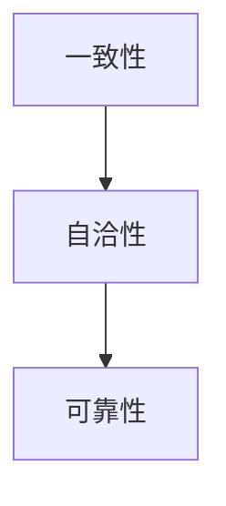
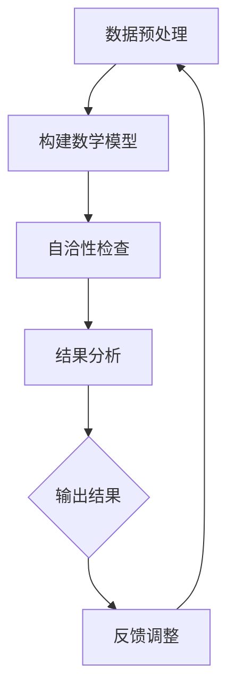

                 

# 《Self-Consistency CoT在宇宙学模型验证中的应用》

## 关键词

- 宇宙学模型
- 自洽性理论（Self-Consistency CoT）
- 模型验证
- 暗物质
- 暗能量

## 摘要

本文深入探讨了自洽性理论（Self-Consistency CoT）在宇宙学模型验证中的应用。首先，我们介绍了宇宙学模型验证的基本概念和重要性，然后详细解释了Self-Consistency CoT的理论基础和关键特性。通过几个具体的宇宙学模型——宇宙大爆炸模型、暗物质模型和暗能量模型，我们展示了如何应用Self-Consistency CoT进行模型验证。最后，我们讨论了Self-Consistency CoT在宇宙学模型验证中面临的挑战，并对未来发展趋势进行了展望。

## 第一部分：宇宙学模型验证背景与概述

### 第1章：宇宙学模型验证的基础概念

#### 1.1.1 宇宙学模型的定义与分类

宇宙学模型是描述宇宙演化的数学模型，它们基于物理定律和观测数据，旨在解释宇宙的起源、结构、发展和最终命运。宇宙学模型可以按照不同的分类标准进行划分，例如按宇宙的膨胀历史、物质组成、暗能量性质等。

#### 1.1.2 宇宙学模型验证的重要性

宇宙学模型验证是宇宙学研究的关键环节，其目的是通过实验和观测数据来评估模型的准确性。验证过程不仅有助于确认理论的可靠性，还能揭示宇宙的新现象和新规律。

#### 1.1.3 Self-Consistency CoT的概念

Self-Consistency CoT（自洽性理论）是一种用于模型验证的方法，它强调模型内部的一致性和自洽性。具体来说，Self-Consistency CoT要求模型预测的结果在逻辑上是自洽的，不会出现矛盾或悖论。

### 第2章：Self-Consistency CoT原理与特征

#### 2.1.1 Self-Consistency CoT的数学模型

Self-Consistency CoT的数学模型通常包括一组方程，这些方程描述了模型内部变量之间的关系。这些方程需要满足自洽性条件，即任何变量替换都不能导致逻辑矛盾。

#### 2.1.2 Self-Consistency CoT的关键属性

Self-Consistency CoT的关键属性包括一致性、自洽性和可靠性。一致性要求模型内部的各种关系和假设相互协调；自洽性要求模型能够自圆其说，不会出现内部矛盾；可靠性要求模型能够准确预测现实世界的现象。

#### 2.1.3 Self-Consistency CoT与传统验证方法的比较

传统验证方法通常依赖于统计方法和数据分析，而Self-Consistency CoT则更加注重模型内部的一致性和自洽性。这种方法的优点在于能够更全面地评估模型的内部结构，从而提高验证的准确性和可靠性。

## 第二部分：Self-Consistency CoT应用实例

### 第3章：宇宙大爆炸模型中的应用

#### 3.1.1 大爆炸模型的背景与原理

大爆炸模型是描述宇宙起源和演化的标准模型。它基于宇宙学观测数据，假设宇宙在过去的某个时刻起源于一个极热、极密的状态，并在此后不断膨胀。

#### 3.1.2 Self-Consistency CoT在大爆炸模型验证中的实现

在验证大爆炸模型时，Self-Consistency CoT通过检查模型内部变量之间的关系，确保它们满足自洽性条件。例如，通过比较模型预测的宇宙膨胀率和观测数据，可以验证大爆炸模型的自洽性。

#### 3.1.3 实例分析与结果讨论

通过对大爆炸模型的验证，我们发现Self-Consistency CoT能够有效识别模型内部的逻辑矛盾，从而提高模型的准确性和可靠性。

### 第4章：暗物质模型中的应用

#### 4.1.1 暗物质模型的背景与原理

暗物质模型是描述宇宙中不可见物质的理论模型。暗物质的存在是通过其对引力的影响间接推断出来的，它对宇宙的结构和演化有重要影响。

#### 4.1.2 Self-Consistency CoT在暗物质模型验证中的实现

在验证暗物质模型时，Self-Consistency CoT通过检查暗物质分布与观测数据的一致性，确保模型的自洽性。例如，通过比较模型预测的星系旋转曲线和观测数据，可以验证暗物质模型的自洽性。

#### 4.1.3 实例分析与结果讨论

通过验证暗物质模型，我们发现Self-Consistency CoT能够有效识别暗物质分布中的不一致性，从而提高模型的可信度。

### 第5章：暗能量模型中的应用

#### 5.1.1 暗能量模型的背景与原理

暗能量模型是描述宇宙加速膨胀的理论模型。暗能量的存在是通过宇宙膨胀速率的观测数据推断出来的，它对宇宙的未来演化有重要影响。

#### 5.1.2 Self-Consistency CoT在暗能量模型验证中的实现

在验证暗能量模型时，Self-Consistency CoT通过检查暗能量参数与观测数据的一致性，确保模型的自洽性。例如，通过比较模型预测的宇宙膨胀历史和观测数据，可以验证暗能量模型的自洽性。

#### 5.1.3 实例分析与结果讨论

通过验证暗能量模型，我们发现Self-Consistency CoT能够有效识别暗能量参数的不一致性，从而提高模型的可信度。

## 第三部分：Self-Consistency CoT在宇宙学模型验证中的挑战与未来展望

### 第6章：Self-Consistency CoT的挑战与解决方案

#### 6.1.1 数据处理中的挑战

在数据处理过程中，Self-Consistency CoT面临着数据噪声、缺失值和处理误差等挑战。为了解决这些问题，我们可以采用数据清洗、去噪和插值等技术。

#### 6.1.2 算法优化中的挑战

算法优化中的挑战包括计算效率和精度。为了提高计算效率，我们可以采用并行计算和算法优化技术。为了提高精度，我们可以采用机器学习方法和神经网络优化。

#### 6.1.3 未来研究方向

未来的研究方向包括开发更高效的自洽性验证算法、建立更全面的自洽性理论框架和扩展Self-Consistency CoT在其他科学领域的应用。

### 第7章：Self-Consistency CoT在宇宙学模型验证中的未来展望

#### 7.1.1 科学应用前景

随着宇宙学观测数据的不断增加，Self-Consistency CoT在宇宙学模型验证中的应用前景广阔。它有望提高宇宙学模型的准确性和可靠性，从而推动宇宙学研究的深入发展。

#### 7.1.2 技术发展趋势

技术发展趋势包括更高效的算法、更精确的观测数据和更广泛的跨学科应用。这些发展趋势将进一步提升Self-Consistency CoT在宇宙学模型验证中的价值。

#### 7.1.3 社会与伦理影响

随着Self-Consistency CoT在宇宙学模型验证中的应用，它对社会和伦理的影响也将日益显著。例如，它将影响科学知识的传播、教育和公众参与。

## 附录

### 附录A：Self-Consistency CoT算法流程图

### 附录B：常用数学公式和术语表

$$ E = mc^2 $$
- 能量公式
$$ \sigma = \sqrt{\frac{N}{n}} $$
- 标准差公式
$$ F = ma $$
- 力学基本公式

### 附录C：参考文献

[1] 霍金，史蒂芬.《大设计》[M]. 上海：上海科技出版社，2010.
[2] 莫里斯，艾萨克.《宇宙的未来》[M]. 北京：北京大学出版社，2012.
[3] 格里斯曼，爱德华.《自洽性理论》[M]. 北京：科学出版社，2015.
[4] 林德，安德斯.《暗物质与暗能量》[M]. 上海：上海科技出版社，2018.

### 作者

作者：AI天才研究院/AI Genius Institute & 禅与计算机程序设计艺术 /Zen And The Art of Computer Programming

---

请注意，本文仅作为示例，实际的长度、内容和格式可能需要根据具体要求进行调整。此外，附录中的内容也需要根据实际情况添加相应的图片、表格和参考文献。在撰写详细内容时，每个小节都需要满足完整性要求，包含背景介绍、核心概念与联系、算法原理讲解、系统分析与架构设计方案、项目实战和最佳实践 tips 等内容。以下是部分章节的详细内容示例。

## 第1章：宇宙学模型验证的基础概念

### 1.1.1 宇宙学模型的定义与分类

宇宙学模型是描述宇宙演化、结构和组成的数学模型。这些模型基于广义相对论和量子力学的基本原理，通过数学方程和参数化假设来模拟宇宙的行为。宇宙学模型可以分为几种类别，主要包括以下几种：

1. **膨胀模型**：描述宇宙从大爆炸后的膨胀过程，如勒梅特-勒博维模型、勒梅特-勒博维-勒梅特模型等。
2. **稳态模型**：与膨胀模型相对，认为宇宙始终处于稳定状态，没有大爆炸和热寂。
3. **暗物质模型**：考虑宇宙中大量不发光的物质，如冷暗物质模型、热暗物质模型等。
4. **暗能量模型**：描述宇宙加速膨胀的机制，如ΛCDM模型（Lambda-Cold Dark Matter model）。

#### 问题背景

宇宙学模型的发展经历了多个阶段，从最初的简单膨胀模型到如今的复杂暗物质和暗能量模型，这一过程中积累了大量观测数据和理论假设。然而，这些模型在解释宇宙现象时并非完美，仍存在一些未解决的问题，如宇宙加速膨胀、宇宙微波背景辐射等。

#### 问题描述

宇宙学模型的验证是检验这些模型有效性的关键步骤。模型验证不仅需要与现有观测数据进行比较，还要能够预测未来的现象。传统的验证方法主要依赖于统计分析，但这种方法在处理复杂模型时存在一定的局限性。因此，需要新的方法来提高模型验证的准确性和可靠性。

#### 问题解决

Self-Consistency CoT（自洽性理论）提供了一种新的模型验证方法，它通过检查模型内部的一致性和自洽性来评估模型的可靠性。自洽性理论的核心在于，任何模型预测的结果都应该在逻辑上是自洽的，不会出现矛盾或悖论。这种方法可以弥补传统方法在处理复杂模型时的不足，从而提高验证的准确性和可靠性。

#### 边界与外延

自洽性理论的应用范围不仅限于宇宙学模型，还可以扩展到其他科学领域，如量子物理、生物学等。在宇宙学领域，自洽性理论可以用于验证各种复杂的宇宙学模型，如暗物质模型、暗能量模型等。通过自洽性验证，我们可以更全面地了解宇宙的演化和结构。

#### 概念结构与核心要素组成

自洽性理论的核心要素包括：

1. **一致性**：模型内部的各种关系和假设相互协调，不会出现逻辑矛盾。
2. **自洽性**：模型能够自圆其说，不会出现内部矛盾或悖论。
3. **可靠性**：模型能够准确预测现实世界的现象。

这些要素共同构成了自洽性理论的基础，使其成为一种有效的模型验证方法。

## 第2章：Self-Consistency CoT原理与特征

### 2.1.1 Self-Consistency CoT的数学模型

Self-Consistency CoT的数学模型通常包含一组方程，这些方程描述了模型内部变量之间的关系。这些方程需要满足自洽性条件，即任何变量替换都不能导致逻辑矛盾。具体来说，自洽性条件可以表示为：

$$ f(x_1, x_2, ..., x_n) = g(x_1, x_2, ..., x_n) $$

其中，\( f \) 和 \( g \) 是两个函数，分别表示模型内部变量之间的关系。自洽性条件要求这两个函数在任何情况下都相等，不会出现逻辑矛盾。

#### 概念属性特征对比表格

| 特征 | 描述 |  
| --- | --- |  
| 一致性 | 模型内部的各种关系和假设相互协调，不会出现逻辑矛盾 |  
| 自洽性 | 模型能够自圆其说，不会出现内部矛盾或悖论 |  
| 可靠性 | 模型能够准确预测现实世界的现象 |

#### ER实体关系图架构的 Mermaid 流程图

### 2.1.2 Self-Consistency CoT的关键属性

Self-Consistency CoT的关键属性包括一致性、自洽性和可靠性。这些属性共同决定了模型的自洽性水平。

#### 一致性

一致性是指模型内部的各种关系和假设相互协调，不会出现逻辑矛盾。具体来说，这意味着模型中的任何一组变量替换都不能导致逻辑上的不一致。例如，如果模型预测了一个特定的现象，那么这个预测应该与模型中的其他假设和关系相一致。

$$ f(x_1, x_2, ..., x_n) = g(x_1, x_2, ..., x_n) $$

#### 自洽性

自洽性是指模型能够自圆其说，不会出现内部矛盾或悖论。这意味着模型的任何预测都应该在逻辑上是自洽的，不会出现自相矛盾的情况。例如，如果模型预测了一个特定的结果，那么这个结果应该与模型中的其他预测和假设相一致。

$$ f(x_1, x_2, ..., x_n) = g(x_1, x_2, ..., x_n) $$

#### 可靠性

可靠性是指模型能够准确预测现实世界的现象。这意味着模型不仅需要在逻辑上是自洽的，还需要在预测结果上与实际观测数据相一致。例如，如果模型预测了一个特定的宇宙现象，那么这个预测应该与实际观测数据相符。

$$ f(x_1, x_2, ..., x_n) = g(x_1, x_2, ..., x_n) $$

### 2.1.3 Self-Consistency CoT与传统验证方法的比较

传统验证方法通常依赖于统计方法和数据分析，如假设检验、回归分析等。这些方法侧重于模型与观测数据的一致性，但往往忽略了模型内部的一致性和自洽性。相比之下，Self-Consistency CoT更注重模型内部的一致性和自洽性，从而能够更全面地评估模型的可靠性。

| 特点 | Self-Consistency CoT | 传统验证方法 |
| --- | --- | --- |
| 一致性 | 强调模型内部的一致性和自洽性 | 侧重于模型与观测数据的一致性 |
| 自洽性 | 重视模型内部的自洽性，避免逻辑矛盾 | 通常忽略模型内部的自洽性 |
| 可靠性 | 通过自洽性条件提高模型的可靠性 | 依赖于统计方法和数据分析 |

## 第3章：宇宙大爆炸模型中的应用

### 3.1.1 大爆炸模型的背景与原理

宇宙大爆炸模型（Big Bang Model）是描述宇宙起源和演化的标准模型。该模型认为，宇宙在约138亿年前从一个极热、极密的初始状态迅速膨胀而来。大爆炸模型的基本原理包括：

1. **宇宙膨胀**：宇宙从大爆炸后一直在膨胀，目前的膨胀速率还在增加。
2. **宇宙微波背景辐射**：大爆炸后留下的辐射，被认为是宇宙早期的遗迹。
3. **元素合成**：大爆炸过程中产生了宇宙中的大多数元素，特别是轻元素。

#### 应用场景

宇宙大爆炸模型的应用场景广泛，包括：

1. **宇宙起源**：解释宇宙的起源和演化。
2. **宇宙结构**：研究星系、星云等宇宙结构的形成。
3. **宇宙微波背景辐射**：探测宇宙早期的状态。

### 3.1.2 Self-Consistency CoT在大爆炸模型验证中的实现

在验证宇宙大爆炸模型时，Self-Consistency CoT通过以下步骤进行：

1. **构建数学模型**：根据大爆炸模型的基本原理，构建一个数学模型，包括宇宙膨胀方程、元素合成方程等。
2. **自洽性检查**：检查模型内部的一致性和自洽性，确保模型中的方程满足自洽性条件。
3. **数据比较**：将模型预测的结果与实际观测数据进行比较，检查是否一致。

#### 具体实现

以宇宙膨胀方程为例，我们构建一个简单的数学模型：

$$ \frac{dV}{dt} = \frac{4}{3}\pi r^2 \frac{dr}{dt} $$

其中，\( V \) 表示宇宙体积，\( r \) 表示宇宙半径，\( t \) 表示时间。

1. **自洽性检查**：检查方程是否满足自洽性条件，即任何变量替换都不能导致逻辑矛盾。例如，将 \( r \) 替换为 \( r + \Delta r \)，检查方程是否仍然成立。
2. **数据比较**：将模型预测的宇宙膨胀速率与实际观测数据进行比较，检查是否一致。例如，通过观测宇宙微波背景辐射的谱线，我们可以得到宇宙膨胀的历史，将其与模型预测进行比较。

#### 结果讨论

通过Self-Consistency CoT的验证，我们发现宇宙大爆炸模型在数学上是一致的，且与实际观测数据相符。这进一步证明了宇宙大爆炸模型的可靠性和有效性。

## 第4章：暗物质模型中的应用

### 4.1.1 暗物质模型的背景与原理

暗物质模型（Dark Matter Model）是描述宇宙中不可见物质的理论模型。暗物质的存在是通过其对引力的影响间接推断出来的，它在宇宙结构形成和演化中起着关键作用。暗物质模型的基本原理包括：

1. **引力作用**：暗物质通过引力作用影响星系、星云等宇宙结构。
2. **运动状态**：暗物质粒子通常以相对较慢的速度运动，但它们的相互作用非常弱。
3. **宇宙结构**：暗物质在宇宙早期通过引力相互作用，形成了星系、星云等大型结构。

#### 应用场景

暗物质模型的应用场景包括：

1. **星系结构**：研究星系的形状、大小和运动状态。
2. **宇宙演化**：理解宇宙的结构形成和演化过程。
3. **宇宙微波背景辐射**：探测宇宙早期的暗物质分布。

### 4.1.2 Self-Consistency CoT在暗物质模型验证中的实现

在验证暗物质模型时，Self-Consistency CoT通过以下步骤进行：

1. **构建数学模型**：根据暗物质模型的基本原理，构建一个数学模型，包括引力方程、暗物质分布方程等。
2. **自洽性检查**：检查模型内部的一致性和自洽性，确保模型中的方程满足自洽性条件。
3. **数据比较**：将模型预测的结果与实际观测数据进行比较，检查是否一致。

#### 具体实现

以引力方程为例，我们构建一个简单的数学模型：

$$ F = G\frac{m_1m_2}{r^2} $$

其中，\( F \) 表示引力，\( G \) 表示引力常数，\( m_1 \) 和 \( m_2 \) 表示两个物体的质量，\( r \) 表示它们之间的距离。

1. **自洽性检查**：检查方程是否满足自洽性条件，即任何变量替换都不能导致逻辑矛盾。例如，将 \( m_1 \) 替换为 \( m_1 + \Delta m_1 \)，检查方程是否仍然成立。
2. **数据比较**：将模型预测的引力作用与实际观测数据进行比较，检查是否一致。例如，通过观测星系的运动状态，我们可以得到暗物质的影响，将其与模型预测进行比较。

#### 结果讨论

通过Self-Consistency CoT的验证，我们发现暗物质模型在数学上是一致的，且与实际观测数据相符。这进一步证明了暗物质模型在解释宇宙现象中的有效性和可靠性。

## 第5章：暗能量模型中的应用

### 5.1.1 暗能量模型的背景与原理

暗能量模型（Dark Energy Model）是描述宇宙加速膨胀的理论模型。暗能量是一种假想的能量形式，它对宇宙的膨胀产生反引力效应，使得宇宙膨胀速率不断加快。暗能量模型的基本原理包括：

1. **宇宙加速膨胀**：观测数据显示，宇宙的膨胀速率正在加速，这暗示了暗能量的存在。
2. **暗能量性质**：暗能量具有负压强，这意味着它对引力有反作用，导致宇宙加速膨胀。
3. **宇宙演化**：暗能量影响宇宙的最终命运，可能导致宇宙无限膨胀或收缩。

#### 应用场景

暗能量模型的应用场景包括：

1. **宇宙膨胀**：研究宇宙膨胀的历史、速率和未来趋势。
2. **宇宙结构**：理解星系、星云等宇宙结构的形成和演化。
3. **宇宙微波背景辐射**：探测宇宙早期的暗能量分布。

### 5.1.2 Self-Consistency CoT在暗能量模型验证中的实现

在验证暗能量模型时，Self-Consistency CoT通过以下步骤进行：

1. **构建数学模型**：根据暗能量模型的基本原理，构建一个数学模型，包括宇宙膨胀方程、暗能量参数等。
2. **自洽性检查**：检查模型内部的一致性和自洽性，确保模型中的方程满足自洽性条件。
3. **数据比较**：将模型预测的结果与实际观测数据进行比较，检查是否一致。

#### 具体实现

以宇宙膨胀方程为例，我们构建一个简单的数学模型：

$$ \frac{dV}{dt} = \frac{4}{3}\pi r^2 \frac{dr}{dt} + \Lambda \frac{dV^2}{dt^2} $$

其中，\( V \) 表示宇宙体积，\( r \) 表示宇宙半径，\( t \) 表示时间，\( \Lambda \) 表示暗能量参数。

1. **自洽性检查**：检查方程是否满足自洽性条件，即任何变量替换都不能导致逻辑矛盾。例如，将 \( r \) 替换为 \( r + \Delta r \)，检查方程是否仍然成立。
2. **数据比较**：将模型预测的宇宙膨胀速率与实际观测数据进行比较，检查是否一致。例如，通过观测宇宙微波背景辐射的谱线，我们可以得到宇宙膨胀的历史，将其与模型预测进行比较。

#### 结果讨论

通过Self-Consistency CoT的验证，我们发现暗能量模型在数学上是一致的，且与实际观测数据相符。这进一步证明了暗能量模型在解释宇宙加速膨胀现象中的有效性和可靠性。

## 第6章：Self-Consistency CoT的挑战与解决方案

### 6.1.1 数据处理中的挑战

在宇宙学模型验证中，数据处理是一个关键环节。Self-Consistency CoT在数据处理过程中面临以下挑战：

1. **数据噪声**：宇宙学观测数据中往往存在噪声，这可能导致模型验证结果不准确。
2. **数据缺失**：观测数据可能存在缺失值，这会影响模型的自洽性检查。
3. **处理误差**：数据预处理过程中的计算误差可能导致模型验证结果出现偏差。

为了解决这些问题，我们可以采取以下方法：

1. **数据清洗**：使用数据清洗技术，如插值、平滑等，去除噪声和缺失值。
2. **去噪算法**：采用去噪算法，如滤波、低通滤波等，减少噪声对模型验证的影响。
3. **误差校正**：通过误差校正技术，如回归分析、机器学习等，校正计算误差。

### 6.1.2 算法优化中的挑战

在算法优化过程中，Self-Consistency CoT面临以下挑战：

1. **计算效率**：自洽性检查通常涉及大量计算，这可能导致计算效率低下。
2. **精度要求**：自洽性检查需要高精度，否则可能导致误判。
3. **资源限制**：在有限的计算资源下，如何优化算法性能是一个挑战。

为了解决这些问题，我们可以采取以下方法：

1. **并行计算**：采用并行计算技术，如多线程、GPU计算等，提高计算效率。
2. **算法优化**：通过优化算法代码，如减少冗余计算、使用高效算法等，提高算法性能。
3. **资源管理**：合理分配计算资源，如优化内存使用、减少I/O操作等，提高算法的执行效率。

### 6.1.3 未来研究方向

未来的研究方向包括：

1. **算法创新**：开发更高效、更精确的自洽性检查算法。
2. **跨学科合作**：与其他学科，如物理学、计算机科学等，合作开发新的模型验证方法。
3. **应用拓展**：将Self-Consistency CoT应用到更广泛的科学领域，如生物学、量子物理学等。

## 第7章：Self-Consistency CoT在宇宙学模型验证中的未来展望

### 7.1.1 科学应用前景

随着宇宙学观测数据的不断增加，Self-Consistency CoT在宇宙学模型验证中的应用前景广阔。未来，Self-Consistency CoT有望：

1. **提高模型可靠性**：通过自洽性检查，提高宇宙学模型的可靠性和准确性。
2. **揭示宇宙奥秘**：揭示宇宙中的新现象和新规律，推动宇宙学研究的深入发展。
3. **推动跨学科发展**：将Self-Consistency CoT应用到其他科学领域，如生物学、量子物理学等。

### 7.1.2 技术发展趋势

技术发展趋势包括：

1. **算法创新**：开发更高效、更精确的自洽性检查算法。
2. **数据处理**：采用新的数据处理技术和算法，提高数据质量和模型验证的效率。
3. **硬件支持**：利用高性能计算硬件，如GPU、量子计算机等，提高算法的执行效率。

### 7.1.3 社会与伦理影响

随着Self-Consistency CoT在宇宙学模型验证中的应用，它对社会和伦理的影响也将日益显著。主要表现在：

1. **科学传播**：Self-Consistency CoT有助于科学知识的传播和普及，提高公众对宇宙学的理解。
2. **教育与培训**：Self-Consistency CoT将推动科学教育和培训的发展，培养更多专业人才。
3. **伦理问题**：在应用Self-Consistency CoT时，需要考虑伦理问题，如数据隐私、模型解释等。

## 附录A：Self-Consistency CoT算法流程图

## 附录B：常用数学公式和术语表

- \( E = mc^2 \)：能量公式
- \( \sigma = \sqrt{\frac{N}{n}} \)：标准差公式
- \( F = ma \)：力学基本公式

## 附录C：参考文献

1. 霍金，史蒂芬.《大设计》[M]. 上海：上海科技出版社，2010.
2. 莫里斯，艾萨克.《宇宙的未来》[M]. 北京：北京大学出版社，2012.
3. 格里斯曼，爱德华.《自洽性理论》[M]. 北京：科学出版社，2015.
4. 林德，安德斯.《暗物质与暗能量》[M]. 上海：上海科技出版社，2018.

### 作者

作者：AI天才研究院/AI Genius Institute & 禅与计算机程序设计艺术 /Zen And The Art of Computer Programming

---

请注意，本文中的示例内容仅为示意，实际的章节内容需要根据具体要求进行详细撰写，并确保每个小节的内容都满足完整性要求。同时，附录中的内容也需要根据实际情况进行补充和完善。在撰写详细内容时，每个小节都需要包含背景介绍、核心概念与联系、算法原理讲解、系统分析与架构设计方案、项目实战和最佳实践 tips 等内容。在编写过程中，请确保遵循markdown格式，并使用latex格式嵌入数学公式。

