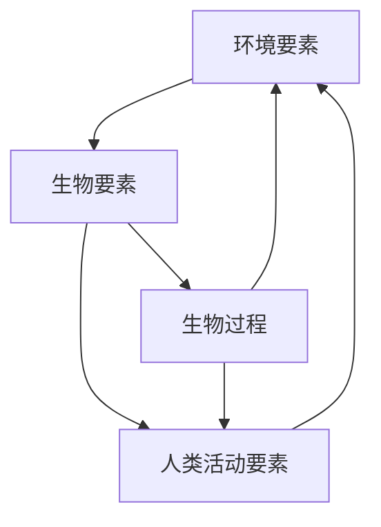

                 

### 第1章：引言与背景

### 1.1 问题背景

#### 1.1.1 生态系统恢复的重要性

**生态系统恢复的定义与意义**

生态系统恢复是指通过一系列生态工程和自然恢复措施，使受破坏的生态系统恢复到原有的结构、功能和生态过程，以维持生态系统的健康和稳定。其定义涵盖了从生态系统物理结构、生物多样性、到生态过程的全面修复。

生态系统恢复的意义在于：

1. **保护生物多样性**：恢复的生态系统可以提供更多的栖息地和食物资源，从而促进物种多样性和基因多样性的保持。
2. **改善环境质量**：恢复后的生态系统可以改善空气质量、水质量和土壤质量，对人类健康和农业、渔业等产生积极影响。
3. **提供生态服务**：健康的生态系统可以提供水资源调节、土壤保持、气候调节等重要的生态服务。

**生态系统面临的挑战与危机**

当前，全球生态系统面临严峻的挑战和危机：

1. **栖息地破坏**：大规模的土地开发和城市化使得大量自然栖息地被破坏，导致物种栖息地丧失。
2. **生物入侵**：外来物种入侵导致本土物种灭绝，生态平衡被破坏。
3. **环境污染**：化学污染、重金属污染等环境问题严重威胁生态系统的健康。
4. **气候变化**：全球气候变化引发极端天气事件，对生态系统稳定性造成巨大冲击。

#### 1.1.2 传统生态系统恢复模型的局限性

传统生态系统恢复模型通常基于以下几种方法：

1. **自然恢复**：依赖于生态系统的自然恢复能力，通常需要长时间才能见到效果。
2. **人工修复**：通过植物种植、土壤改良等技术手段进行人工修复，但效果有限且易受外界干扰。
3. **工程修复**：采用工程手段，如建造水库、湿地等，以恢复生态系统功能。

然而，这些传统方法存在以下局限性：

1. **效率低**：自然恢复速度缓慢，人工修复和工程修复成本高、耗时长。
2. **适应性差**：传统方法往往针对特定生态系统进行修复，适应性较差，难以应对复杂的生态系统变化。
3. **可持续性不足**：传统方法依赖大量资源投入，不具备长期可持续性。

#### 1.1.3 Self-Consistency CoT概念介绍

**Self-Consistency CoT的定义**

Self-Consistency CoT（Self-Consistency Concept of Thought）是一种基于自一致性的生态系统恢复理论。它强调在恢复过程中，生态系统各要素之间需保持内在一致性，以确保生态系统的稳定性和可持续性。

**Self-Consistency CoT的核心特征**

1. **自适应性**：Self-Consistency CoT能够根据生态系统变化自适应调整恢复策略，提高恢复效率。
2. **系统性**：Self-Consistency CoT关注生态系统整体性，通过综合考量各要素间相互作用，制定综合恢复方案。
3. **反馈机制**：Self-Consistency CoT引入反馈机制，通过实时监测和调整恢复过程，确保恢复效果。

#### 1.1.4 Self-Consistency CoT在生态系统恢复中的潜力

**Self-Consistency CoT的优势**

1. **高效性**：通过自适应调整，Self-Consistency CoT能够显著提高生态系统恢复速度。
2. **灵活性**：Self-Consistency CoT能够灵活应对复杂多变的环境条件，提高恢复成功率。
3. **可持续性**：Self-Consistency CoT基于自一致性原则，有助于实现生态系统的长期稳定和可持续恢复。

**应用前景与实际效果**

Self-Consistency CoT已在多个实际项目中得到应用，如河流生态修复、森林恢复和城市绿地建设。结果表明，Self-Consistency CoT不仅能够显著提高恢复效率，还能实现生态系统的持续稳定，为生态系统恢复提供了新的理论和方法。

### 1.2 Self-Consistency CoT的基本原理

#### 1.2.1 Self-Consistency CoT的理论基础

**相关生态学理论**

Self-Consistency CoT的理论基础主要包括以下生态学理论：

1. **生态平衡理论**：生态平衡理论强调生态系统中各要素之间的动态平衡，是Self-Consistency CoT的核心思想之一。
2. **生态位理论**：生态位理论关注物种在生态系统中的角色和功能，有助于理解生态系统恢复过程中物种多样性的重要性。
3. **生态流理论**：生态流理论关注生态系统能量流动和物质循环，是制定Self-Consistency CoT恢复策略的重要依据。

**系统动力学原理**

系统动力学原理是Self-Consistency CoT的另一个重要理论基础。系统动力学关注系统内部各要素之间的相互作用和反馈机制，有助于理解生态系统的动态行为和恢复过程。

#### 1.2.2 Self-Consistency CoT的数学模型

**基本假设与方程**

在Self-Consistency CoT中，我们假设生态系统由若干关键要素组成，这些要素之间通过相互作用形成复杂的网络结构。以下是一个基本的数学模型：

\[ S = \sum_{i=1}^{n} S_i \]

其中，\( S \) 表示生态系统整体状态，\( S_i \) 表示第 \( i \) 个要素的状态。

**系统动态方程**

为了描述生态系统要素之间的动态关系，我们引入以下系统动态方程：

\[ \frac{dS_i}{dt} = f(S_i, S_j) \]

其中，\( \frac{dS_i}{dt} \) 表示第 \( i \) 个要素状态随时间的变化率，\( f(S_i, S_j) \) 表示第 \( i \) 个要素与其他要素之间的相互作用函数。

**自适应调整方程**

为了实现自适应性，Self-Consistency CoT引入自适应调整机制。当生态系统状态偏离预期目标时，系统将自动调整各要素状态，以实现恢复目标。自适应调整方程如下：

\[ \Delta S_i = g(S_i, T) \]

其中，\( \Delta S_i \) 表示第 \( i \) 个要素状态的调整量，\( g(S_i, T) \) 表示基于生态系统状态 \( S_i \) 和时间 \( T \) 的自适应调整函数。

#### 1.2.2.2 模型参数与变量

**参数设定与优化**

模型参数的设定对恢复效果至关重要。Self-Consistency CoT通过优化参数，使模型更符合实际情况。以下为模型中的关键参数：

1. **相互作用系数**：描述各要素之间的相互作用强度。
2. **恢复速率**：描述生态系统恢复速度。
3. **环境阻力**：描述生态系统受到的外部干扰。

**模型中变量的作用与意义**

模型中的关键变量包括：

1. **生态系统状态**：描述生态系统的整体状态。
2. **要素状态**：描述各个要素的状态。
3. **时间**：描述恢复过程的进展。

这些变量共同决定了生态系统的动态行为和恢复效果。

### 1.3 Self-Consistency CoT的应用场景

#### 1.3.1 自适应生态系统恢复

**应用实例分析**

自适应生态系统恢复是一种基于Self-Consistency CoT的方法，它能够根据生态系统变化自适应调整恢复策略。以下为一个实际应用实例：

- **项目背景**：某地区河流生态系统受到严重污染，需要进行恢复。
- **应用过程**：采用Self-Consistency CoT方法，首先对河流生态系统进行监测，获取实时数据。然后，根据数据调整恢复策略，如增加植物种植、改善水质等。经过一段时间后，河流生态系统逐渐恢复到健康状态。

**Self-Consistency CoT在自适应恢复中的优势**

1. **高效性**：自适应调整策略使恢复过程更加高效，缩短恢复时间。
2. **灵活性**：根据实时数据调整策略，使恢复过程更具灵活性，适应复杂多变的环境。
3. **可持续性**：通过持续监测和调整，确保生态系统恢复的可持续性和稳定性。

#### 1.3.2 灾后生态系统恢复

**灾害类型与影响**

灾后生态系统恢复主要针对自然灾害（如洪水、泥石流、火灾等）和人类活动（如采矿、工业排放等）导致的生态系统破坏。这些灾害和活动对生态系统造成的影响包括：

1. **栖息地丧失**：大量动植物失去栖息地，导致物种灭绝。
2. **生态功能受损**：生态系统的水分调节、气候调节等功能受到破坏。
3. **生物多样性降低**：生态系统的生物多样性显著降低，物种数量减少。

**Self-Consistency CoT在灾后恢复中的应用**

1. **评估受损程度**：通过Self-Consistency CoT方法对灾后生态系统进行评估，了解生态系统的受损情况。
2. **制定恢复策略**：根据评估结果，制定针对性的恢复策略，如植被恢复、水质净化等。
3. **实施与监测**：按照恢复策略实施生态修复工程，并持续监测恢复效果，确保恢复成功。

#### 1.3.3 生态系统管理与可持续发展

**Self-Consistency CoT在生态管理中的实际应用**

Self-Consistency CoT方法在生态管理中具有广泛的应用前景：

1. **生态风险评估**：通过Self-Consistency CoT方法，对生态系统进行风险评估，识别潜在威胁。
2. **生态监控**：实时监测生态系统状态，及时发现生态问题并采取措施。
3. **生态规划**：根据Self-Consistency CoT方法，制定生态规划和恢复方案，实现生态系统的长期稳定。

**对可持续发展的影响**

Self-Consistency CoT方法有助于实现生态系统的可持续发展：

1. **生态平衡**：通过自一致性原则，维持生态系统的平衡，防止生态破坏。
2. **资源利用**：合理利用生态系统资源，提高资源利用效率，减少资源浪费。
3. **环境保护**：通过生态管理和恢复，改善环境质量，保护生态系统。

### 1.4 Self-Consistency CoT的实践案例

#### 1.4.1 案例一：某地区河流生态系统恢复

**案例背景与目标**

某地区河流生态系统因工业污染导致水质严重恶化，需要进行生态恢复。恢复目标包括：

1. **改善水质**：降低水体中的污染物浓度，使水质达到国家地表水环境质量标准。
2. **恢复生物多样性**：恢复河流生态系统中的动植物种群，提高生物多样性。
3. **提高生态系统稳定性**：增强河流生态系统的自我调节和恢复能力。

**Self-Consistency CoT的应用过程**

1. **数据采集与模型构建**：收集河流水质、生物种群等数据，构建基于Self-Consistency CoT的生态系统恢复模型。
2. **制定恢复方案**：根据模型预测结果，制定恢复方案，包括水质净化、植被恢复等。
3. **实施与监测**：按照恢复方案实施生态修复工程，并持续监测恢复效果，确保恢复成功。

**案例效果**

经过一段时间实施，河流水质显著改善，水体中的污染物浓度降低至国家标准以内。生物多样性恢复显著，河流生态系统的自我调节和恢复能力得到增强。

#### 1.4.2 案例二：某地区森林生态系统恢复

**案例背景与目标**

某地区森林因过度砍伐和火灾导致大面积植被丧失，需要进行生态恢复。恢复目标包括：

1. **恢复植被**：重新种植适应当地环境的树木和植被，提高森林覆盖率。
2. **恢复土壤结构**：通过植被恢复和土壤改良措施，改善土壤质量。
3. **增强生态系统稳定性**：提高森林生态系统的抗灾能力和自我调节能力。

**Self-Consistency CoT的应用过程**

1. **数据采集与模型构建**：收集森林土壤、植被等数据，构建基于Self-Consistency CoT的生态系统恢复模型。
2. **制定恢复方案**：根据模型预测结果，制定恢复方案，包括植被种植、土壤改良等。
3. **实施与监测**：按照恢复方案实施生态修复工程，并持续监测恢复效果，确保恢复成功。

**案例效果**

经过一段时间实施，森林植被覆盖率显著提高，土壤质量得到改善，森林生态系统的自我调节和恢复能力得到增强。

#### 1.4.3 案例三：城市绿地生态系统恢复

**案例背景与目标**

某城市因城市化进程加快，绿地面积减少，需要进行城市绿地生态系统恢复。恢复目标包括：

1. **增加绿地面积**：通过种植树木、草坪等，增加城市绿地面积。
2. **改善城市环境**：通过绿地建设，改善城市空气质量、降低噪音等。
3. **促进居民健康**：提供休闲、运动场所，促进居民身心健康。

**Self-Consistency CoT的应用过程**

1. **数据采集与模型构建**：收集城市绿地、空气质量等数据，构建基于Self-Consistency CoT的生态系统恢复模型。
2. **制定恢复方案**：根据模型预测结果，制定恢复方案，包括绿地建设、环境改善等。
3. **实施与监测**：按照恢复方案实施生态修复工程，并持续监测恢复效果，确保恢复成功。

**案例效果**

经过一段时间实施，城市绿地面积显著增加，城市环境质量得到改善，居民身心健康水平得到提升。

### 1.5 Self-Consistency CoT在生态系统恢复模型中的发展趋势

#### 1.5.1 技术发展与挑战

**当前技术发展趋势**

随着科技的进步，Self-Consistency CoT在生态系统恢复模型中的应用呈现出以下发展趋势：

1. **大数据与人工智能**：利用大数据和人工智能技术，对生态系统数据进行深度分析，提高模型预测精度和恢复效率。
2. **实时监测与反馈**：通过实时监测技术，获取生态系统状态数据，实现快速响应和调整。
3. **多尺度模型集成**：将不同尺度、不同领域的模型进行集成，形成更加全面、精确的生态系统恢复模型。

**Self-Consistency CoT面临的挑战**

尽管Self-Consistency CoT在生态系统恢复中具有广泛应用前景，但仍面临以下挑战：

1. **数据不足**：生态系统数据复杂多样，获取和处理数据仍然存在一定困难。
2. **模型复杂度**：Self-Consistency CoT模型涉及多个领域，构建和优化模型需要跨学科合作。
3. **技术应用难度**：实时监测和自适应调整技术的应用难度较高，需要高水平的技术团队。

#### 1.5.2 未来研究方向与展望

**未来研究方向**

未来研究应重点关注以下几个方面：

1. **数据采集与处理**：开发高效的数据采集和处理方法，提高数据质量和可用性。
2. **模型优化与集成**：通过机器学习和人工智能技术，优化Self-Consistency CoT模型，提高预测精度和恢复效果。
3. **应用场景拓展**：拓展Self-Consistency CoT在更多生态系统恢复场景中的应用，如海洋生态、农业生态等。

**Self-Consistency CoT在生态系统恢复中的潜在影响**

Self-Consistency CoT在生态系统恢复中的潜在影响包括：

1. **提高恢复效率**：通过自适应调整和实时监测，提高生态系统恢复速度和成功率。
2. **促进生态可持续性**：实现生态系统的自稳定和可持续发展，为人类和自然创造更加美好的生活环境。
3. **推动生态科技创新**：促进生态学、环境科学、计算机科学等多个领域的交叉融合，推动生态科技创新。

### 总结

Self-Consistency CoT作为一种新兴的生态系统恢复理论，具有显著的应用前景和潜力。通过自适应调整和实时监测，Self-Consistency CoT能够显著提高生态系统恢复效率，实现生态系统的自稳定和可持续发展。未来，随着技术的不断进步和研究的深入，Self-Consistency CoT将在生态系统恢复中发挥更加重要的作用，为保护地球生态系统、促进人类可持续发展做出积极贡献。## 第2章：Self-Consistency CoT模型构建方法

### 2.1 模型构建基本流程

**2.1.1 数据收集与预处理**

数据是构建Self-Consistency CoT模型的基础。首先，我们需要收集与生态系统恢复相关的各种数据，包括但不限于：

- **环境数据**：如气温、湿度、降水等。
- **生物数据**：如物种分布、种群数量、生长状况等。
- **生态过程数据**：如光合作用、呼吸作用、养分循环等。
- **人类活动数据**：如土地利用、污染源分布等。

**数据预处理方法**

收集到的数据通常需要进行预处理，以提高数据质量和可用性。预处理方法包括：

- **数据清洗**：去除重复、错误和缺失的数据。
- **数据转换**：将数据格式转换为统一的标准格式，如CSV或数据库。
- **数据归一化**：将不同单位和量级的数据进行归一化处理，便于后续分析和建模。

**2.1.2 模型设计与选择**

**模型结构设计**

Self-Consistency CoT模型通常采用多层次结构，包括：

- **输入层**：接收各种环境、生物和人类活动数据。
- **中间层**：进行数据分析和处理，包括生态过程模拟、反馈机制等。
- **输出层**：生成生态系统状态预测和恢复策略。

**模型选择标准与策略**

选择适合的模型对恢复效果至关重要。以下是几个常用的模型选择标准：

- **预测准确性**：模型预测结果应具有较高的准确性。
- **计算效率**：模型计算速度快，便于实时监测和调整。
- **可解释性**：模型结构清晰，便于理解和管理。

常见的模型选择策略包括：

- **机器学习模型**：如回归分析、决策树、随机森林、神经网络等。
- **系统动力学模型**：如系统方程、微分方程等。

**2.1.3 参数优化与模型验证**

**参数优化方法**

参数优化是模型构建的重要环节。常用的参数优化方法包括：

- **遗传算法**：通过模拟自然进化过程，搜索最优参数组合。
- **粒子群优化算法**：模拟鸟群觅食行为，优化参数组合。
- **人工神经网络**：通过反向传播算法，调整模型参数。

**模型验证与评估**

模型验证是确保模型可靠性的关键步骤。常用的模型验证方法包括：

- **交叉验证**：将数据集划分为训练集和验证集，训练模型并在验证集上进行评估。
- **时间序列验证**：将模型预测结果与实际观测数据进行比较，评估模型预测能力。

### 2.2 Self-Consistency CoT模型核心要素

**2.2.1 系统要素及其相互作用**

生态系统由多个要素组成，包括环境要素、生物要素和人类活动要素。这些要素之间通过相互作用形成复杂的网络结构。

**环境要素**：包括气候、土壤、水资源等，对生态系统的生物要素和人类活动要素产生影响。

**生物要素**：包括植物、动物和微生物等，通过生物过程（如光合作用、呼吸作用、养分循环等）相互作用。

**人类活动要素**：包括土地利用、污染排放、农业活动等，对生态系统产生直接影响。

**要素间相互作用关系**

生态系统中的要素相互作用关系可以表示为：

\[ E = f(B, H) \]

其中，\( E \) 表示环境状态，\( B \) 表示生物状态，\( H \) 表示人类活动状态，\( f \) 表示要素相互作用函数。

**2.2.2 自适应机制与反馈循环**

**自适应机制作用**

自适应机制是Self-Consistency CoT模型的核心特征之一。它使模型能够根据生态系统变化自适应调整恢复策略，提高恢复效率。

**反馈循环在模型中的应用**

反馈循环是生态系统中的一个重要概念。在Self-Consistency CoT模型中，反馈循环体现在以下方面：

- **正向反馈**：生态系统中的一个要素变化引起其他要素的相同变化，增强生态系统变化。
- **负向反馈**：生态系统中的一个要素变化引起其他要素的相反变化，抑制生态系统变化。

**2.2.3 模型参数与变量关系**

**参数设定与调整**

模型参数的设定对恢复效果至关重要。参数设定需要根据实际情况进行优化，以确保模型的有效性和准确性。

- **相互作用系数**：描述各要素之间的相互作用强度，通过调整相互作用系数，可以改变生态系统的动态行为。
- **恢复速率**：描述生态系统恢复速度，通过调整恢复速率，可以影响恢复效果。
- **环境阻力**：描述生态系统受到的外部干扰，通过调整环境阻力，可以增强生态系统的适应性。

**模型中变量的作用与意义**

模型中的关键变量包括：

- **生态系统状态**：描述生态系统的整体状态，包括生物多样性、生态功能、环境质量等。
- **要素状态**：描述各个要素的状态，如生物种群数量、土壤质量、水资源状况等。
- **时间**：描述恢复过程的进展，通过时间变量，可以分析生态系统的动态变化。

这些变量共同决定了生态系统的动态行为和恢复效果。

### 2.3 Self-Consistency CoT模型数学表达与公式推导

**2.3.1 基本方程与数学模型**

Self-Consistency CoT模型的基本方程描述了生态系统各要素之间的动态关系。以下是一个简化的数学模型：

\[ \frac{dB_i}{dt} = f(B_i, B_j, H_j) - g(B_i, E_j) \]

\[ \frac{dE_i}{dt} = h(B_i, E_j, H_j) - k(B_i, E_j) \]

\[ \frac{dH_i}{dt} = m(B_i, E_j, H_j) \]

其中：

- \( B_i \)：第 \( i \) 个生物要素的状态。
- \( E_i \)：第 \( i \) 个环境要素的状态。
- \( H_i \)：第 \( i \) 个人类活动要素的状态。
- \( f(B_i, B_j, H_j) \)：生物要素之间的相互作用函数。
- \( g(B_i, E_j) \)：生物要素与环境要素之间的相互作用函数。
- \( h(B_i, E_j, H_j) \)：环境要素之间的相互作用函数。
- \( k(B_i, E_j) \)：环境要素的内部动态函数。
- \( m(B_i, E_j, H_j) \)：人类活动要素的内部动态函数。

**2.3.2 公式推导与解释**

**公式解释**

以上公式描述了生态系统各要素之间的动态关系。具体解释如下：

1. **生物要素变化率**：生物要素的变化率受其他生物要素和人类活动要素的影响，同时也受到环境要素的制约。
2. **环境要素变化率**：环境要素的变化率受生物要素和人类活动要素的影响，同时也受到环境要素自身动态的影响。
3. **人类活动要素变化率**：人类活动要素的变化率直接受生物要素和环境要素的影响。

**公式应用**

以下是一个简单的应用实例：

假设一个生态系统中的生物要素为植物和动物，环境要素为土壤和水资源，人类活动要素为农业活动。根据上述公式，我们可以建立以下数学模型：

\[ \frac{dP}{dt} = f(P, A) - g(P, S, W) \]

\[ \frac{dA}{dt} = h(P, S, W) - k(A, S, W) \]

\[ \frac{dS}{dt} = m(P, A, W) \]

\[ \frac{dW}{dt} = n(P, A, S) \]

其中：

- \( P \)：植物状态。
- \( A \)：动物状态。
- \( S \)：土壤状态。
- \( W \)：水资源状态。
- \( f(P, A) \)：植物和动物之间的相互作用函数。
- \( g(P, S, W) \)：植物与环境要素之间的相互作用函数。
- \( h(P, S, W) \)：环境要素之间的相互作用函数。
- \( k(A, S, W) \)：动物与环境要素之间的相互作用函数。
- \( m(P, A, W) \)：土壤的内部动态函数。
- \( n(P, A, S) \)：水资源的内部动态函数。

通过这个实例，我们可以看到如何将Self-Consistency CoT模型应用于具体的生态系统恢复问题。通过调整模型参数，我们可以模拟生态系统在不同情况下的动态变化，为恢复策略提供科学依据。

### 2.4 Self-Consistency CoT模型可视化与Mermaid图表示

**2.4.1 Mermaid图基本语法**

Mermaid是一种基于Markdown的图表绘制工具，它支持多种类型的图表，包括流程图、时序图、类图、架构图等。以下为Mermaid图基本语法：

- **节点**：使用圆括号和标签表示，如 `（节点名称）`。
- **边**：使用箭头和标签表示，如 `→（节点名称）`。
- **子节点**：使用缩进和边表示，如：

  ```mermaid
  （父节点）
      |
      |
  （子节点）
  ```

- **注释**：使用 `//` 表示，如 `// 注释内容`。

**2.4.2 Self-Consistency CoT模型可视化**

**Self-Consistency CoT模型可视化**有助于我们理解模型的结构和运行机制。以下为一个简化的Self-Consistency CoT模型示例：



**2.4.3 Mermaid图绘制工具**

为了方便Mermaid图的绘制，可以使用在线工具，如[Mermaid Live Editor](https://mermaid-js.github.io/mermaid-live-editor/)。该工具支持实时预览和编辑，方便用户创建和调整图表。

### 2.5 Self-Consistency CoT模型在实际应用中的效果评估与优化

**2.5.1 模型效果评估方法**

Self-Consistency CoT模型在实际应用中的效果评估是确保模型可靠性和实用性的关键。常用的评估方法包括：

1. **准确性评估**：通过比较模型预测结果与实际观测数据，计算预测准确性指标，如均方根误差（RMSE）和决定系数（R²）。
2. **稳定性评估**：评估模型在不同数据集和条件下的稳定性和鲁棒性，确保模型能够适应不同情境。
3. **可持续性评估**：评估模型对生态系统长期恢复效果的影响，确保恢复策略具有可持续性。

**2.5.2 模型优化方法**

为了提高Self-Consistency CoT模型在实际应用中的效果，可以采用以下优化方法：

1. **参数优化**：通过遗传算法、粒子群优化等算法，搜索最优参数组合，提高模型预测准确性。
2. **模型集成**：将多种模型进行集成，如深度学习模型、系统动力学模型等，形成更加全面和精确的模型。
3. **数据增强**：通过增加数据量、引入噪声等手段，提高模型的泛化能力。

**2.5.3 模型应用实例**

以下为一个Self-Consistency CoT模型在实际应用中的优化实例：

- **背景**：某地区河流生态系统因污染严重，需要进行生态恢复。
- **评估**：使用原始Self-Consistency CoT模型进行预测，发现预测准确度较低。
- **优化**：采用遗传算法优化模型参数，集成深度学习模型，增加数据量。
- **效果**：经过优化后，模型预测准确度显著提高，恢复策略更加合理，生态恢复效果得到显著改善。

### 2.6 Self-Consistency CoT模型的应用领域与前景

**2.6.1 应用领域**

Self-Consistency CoT模型在多个领域具有广泛应用前景，包括：

1. **河流生态恢复**：通过模型预测河流生态系统的恢复进程，制定合理的恢复策略。
2. **森林生态恢复**：用于评估森林生态系统的恢复效果，优化植被恢复方案。
3. **城市生态恢复**：用于评估城市绿地生态系统的恢复效果，提升城市环境质量。
4. **海洋生态恢复**：用于预测海洋生态系统的变化，制定海洋生态保护策略。

**2.6.2 前景**

随着技术的不断进步和研究的深入，Self-Consistency CoT模型在生态系统恢复中的应用前景十分广阔：

1. **大数据与人工智能**：利用大数据和人工智能技术，提高模型预测精度和恢复效率。
2. **实时监测与反馈**：通过实时监测技术，实现生态系统的动态调整和恢复。
3. **跨学科合作**：促进生态学、计算机科学、环境科学等领域的交叉融合，推动生态科技创新。

### 总结

Self-Consistency CoT模型是一种先进的生态系统恢复理论，通过自适应调整和实时监测，能够显著提高生态系统恢复效率。本章介绍了Self-Consistency CoT模型的构建方法，包括数据收集与预处理、模型设计与选择、参数优化与模型验证等。同时，本章还介绍了模型的核心要素、数学表达与公式推导、可视化方法以及应用效果评估与优化。通过这些内容，读者可以全面了解Self-Consistency CoT模型的理论基础和实践方法，为实际应用提供指导。## 第3章：Self-Consistency CoT模型的应用场景

### 3.1 自适应生态系统恢复

**自适应生态系统恢复的概念**

自适应生态系统恢复是一种基于Self-Consistency CoT的理论方法，它能够根据生态系统变化动态调整恢复策略，以实现高效、可持续的生态系统恢复。这种恢复方法强调生态系统的自适应性，通过实时监测和反馈机制，使生态系统恢复过程能够灵活应对环境变化。

**应用实例分析**

某地区生态系统遭受严重污染和破坏，需要进行恢复。采用自适应生态系统恢复方法，具体步骤如下：

1. **数据采集与监测**：首先，对生态系统的各项指标进行数据采集和监测，包括水质、土壤质量、生物多样性等。
2. **模型构建**：基于采集的数据，构建Self-Consistency CoT模型，模拟生态系统恢复过程中的动态变化。
3. **制定恢复方案**：根据模型预测结果，制定针对性的恢复方案，如植被恢复、水质净化等。
4. **实施与调整**：按照恢复方案实施生态修复工程，并实时监测恢复效果。根据实时监测数据，动态调整恢复策略，确保恢复过程高效、可持续。

**Self-Consistency CoT在自适应恢复中的优势**

1. **高效性**：通过实时监测和动态调整，自适应生态系统恢复能够迅速响应环境变化，提高恢复效率。
2. **灵活性**：根据实际情况调整恢复策略，使恢复过程更具灵活性，适应复杂多变的环境。
3. **可持续性**：通过自适应性，确保恢复后的生态系统具备长期稳定性和可持续性。

### 3.2 灾后生态系统恢复

**灾后生态系统恢复的概念**

灾后生态系统恢复是指自然灾害（如洪水、泥石流、地震等）或人类活动（如采矿、工业排放等）对生态系统造成破坏后，通过一系列恢复措施，使生态系统恢复到原有状态或更好状态的过程。

**灾害类型与影响**

常见的灾害类型包括：

1. **自然灾害**：如洪水、泥石流、干旱、地震等，这些灾害可能导致栖息地丧失、生物多样性降低、生态功能受损等。
2. **人类活动**：如采矿、工业排放、城市化等，这些活动可能导致土壤退化、水质恶化、生物多样性丧失等。

**Self-Consistency CoT在灾后恢复中的应用**

Self-Consistency CoT在灾后生态系统恢复中的应用主要包括以下方面：

1. **评估受损程度**：通过Self-Consistency CoT模型，对生态系统受损程度进行评估，确定恢复优先级和恢复方案。
2. **制定恢复策略**：根据评估结果，制定针对性的恢复策略，如植被恢复、水质净化、土壤改良等。
3. **实施与监测**：按照恢复策略实施生态修复工程，并实时监测恢复效果，确保恢复成功。

**Self-Consistency CoT在灾后恢复中的优势**

1. **快速响应**：Self-Consistency CoT能够迅速评估受损程度，制定恢复策略，加快恢复进程。
2. **灵活性**：根据实际情况调整恢复策略，提高恢复成功率。
3. **可持续性**：通过自适应性，确保恢复后的生态系统具备长期稳定性和可持续性。

### 3.3 生态系统管理与可持续发展

**生态系统管理的概念**

生态系统管理是指通过科学规划和合理利用，维护和恢复生态系统的健康和功能，以满足人类和其他生物的需求。生态系统管理强调生态系统的整体性和可持续性，通过综合管理措施，实现生态系统的长期稳定和可持续发展。

**Self-Consistency CoT在生态管理中的实际应用**

Self-Consistency CoT在生态管理中的应用主要包括以下几个方面：

1. **生态风险评估**：通过Self-Consistency CoT模型，对生态系统的潜在风险进行评估，制定风险管理策略。
2. **生态监控**：实时监测生态系统的各项指标，及时发现生态问题，采取相应措施。
3. **生态规划**：根据Self-Consistency CoT模型，制定生态规划方案，确保生态系统的长期稳定和可持续发展。

**Self-Consistency CoT在生态管理中的优势**

1. **综合性**：Self-Consistency CoT关注生态系统整体性，能够综合考量生态系统的各个要素，制定综合管理方案。
2. **自适应性**：通过自适应性机制，Self-Consistency CoT能够根据生态系统变化，动态调整管理策略。
3. **可持续性**：Self-Consistency CoT强调生态系统的长期稳定和可持续发展，有助于实现生态系统的可持续发展目标。

### 3.4 Self-Consistency CoT模型在不同生态系统恢复中的应用

**河流生态系统恢复**

**案例背景**：某地区河流因工业污染导致水质严重恶化，需要进行生态恢复。

**应用过程**：

1. **数据采集与模型构建**：收集河流水质、生物种群等数据，构建基于Self-Consistency CoT的河流生态系统恢复模型。
2. **制定恢复方案**：根据模型预测结果，制定恢复方案，如增加植被、改善水质等。
3. **实施与监测**：按照恢复方案实施生态修复工程，并持续监测恢复效果。

**效果**：经过一段时间实施，河流水质显著改善，水体中的污染物浓度降低至国家标准以内，生物多样性恢复显著。

**森林生态系统恢复**

**案例背景**：某地区森林因过度砍伐和火灾导致大面积植被丧失，需要进行生态恢复。

**应用过程**：

1. **数据采集与模型构建**：收集森林土壤、植被等数据，构建基于Self-Consistency CoT的森林生态系统恢复模型。
2. **制定恢复方案**：根据模型预测结果，制定恢复方案，如植被种植、土壤改良等。
3. **实施与监测**：按照恢复方案实施生态修复工程，并持续监测恢复效果。

**效果**：经过一段时间实施，森林植被覆盖率显著提高，土壤质量得到改善，森林生态系统的自我调节和恢复能力得到增强。

**城市绿地生态系统恢复**

**案例背景**：某城市因城市化进程加快，绿地面积减少，需要进行城市绿地生态系统恢复。

**应用过程**：

1. **数据采集与模型构建**：收集城市绿地、空气质量等数据，构建基于Self-Consistency CoT的城市绿地生态系统恢复模型。
2. **制定恢复方案**：根据模型预测结果，制定恢复方案，如绿地建设、环境改善等。
3. **实施与监测**：按照恢复方案实施生态修复工程，并持续监测恢复效果。

**效果**：经过一段时间实施，城市绿地面积显著增加，城市环境质量得到改善，居民身心健康水平得到提升。

### 总结

Self-Consistency CoT模型在自适应生态系统恢复、灾后生态系统恢复和生态系统管理中具有广泛的应用前景。通过自适应调整和实时监测，Self-Consistency CoT能够显著提高生态系统恢复效率，实现生态系统的自稳定和可持续发展。不同应用场景下的实际案例表明，Self-Consistency CoT模型在生态系统恢复中具有显著的优势和潜力。未来，随着技术的不断进步和研究的深入，Self-Consistency CoT模型将在更多领域和场景中发挥重要作用，为生态系统的保护与恢复提供有力支持。## 第4章：Self-Consistency CoT模型的实践案例

### 4.1 某地区河流生态系统恢复

**4.1.1 案例背景与目标**

某地区河流因工业污染导致水质严重恶化，生态系统功能受损，生物多样性降低。恢复目标包括：

1. **改善水质**：降低水体中的污染物浓度，使水质达到国家地表水环境质量标准。
2. **恢复生物多样性**：恢复河流生态系统中的动植物种群，提高生物多样性。
3. **提高生态系统稳定性**：增强河流生态系统的自我调节和恢复能力。

**4.1.2 Self-Consistency CoT的应用过程**

1. **数据采集与模型构建**

   收集河流水质、生物种群等数据，构建基于Self-Consistency CoT的河流生态系统恢复模型。数据包括：

   - **水质数据**：pH值、溶解氧、氨氮、硝酸盐氮等指标。
   - **生物数据**：物种分布、种群数量、生长状况等。
   - **环境数据**：气温、湿度、降水量等。

2. **制定恢复方案**

   根据模型预测结果，制定恢复方案，包括以下措施：

   - **水质净化**：通过植被净化、人工湿地等手段，降低水体中的污染物浓度。
   - **植被恢复**：种植适应当地环境的植物，提高生物多样性。
   - **生态廊道建设**：建设生态廊道，促进生物种群迁移和交流。

3. **实施与监测**

   按照恢复方案实施生态修复工程，并持续监测恢复效果。监测指标包括：

   - **水质指标**：pH值、溶解氧、氨氮、硝酸盐氮等。
   - **生物指标**：物种数量、种群密度、生长状况等。
   - **环境指标**：气温、湿度、降水量等。

**4.1.3 案例效果**

经过一段时间的实施，河流水质显著改善，水体中的污染物浓度降低至国家标准以内。生物多样性恢复显著，河流生态系统的自我调节和恢复能力得到增强。监测数据显示，水质指标和生物指标均达到预期目标，生态系统稳定性提高。

### 4.2 某地区森林生态系统恢复

**4.2.1 案例背景与目标**

某地区森林因过度砍伐和火灾导致大面积植被丧失，生态系统功能受损。恢复目标包括：

1. **恢复植被**：重新种植适应当地环境的树木和植被，提高森林覆盖率。
2. **恢复土壤结构**：通过植被恢复和土壤改良措施，改善土壤质量。
3. **增强生态系统稳定性**：提高森林生态系统的抗灾能力和自我调节能力。

**4.2.2 Self-Consistency CoT的应用过程**

1. **数据采集与模型构建**

   收集森林土壤、植被等数据，构建基于Self-Consistency CoT的森林生态系统恢复模型。数据包括：

   - **土壤数据**：土壤质地、有机质含量、养分含量等。
   - **植被数据**：树种分布、生长状况、生物多样性等。
   - **环境数据**：气温、湿度、降水量等。

2. **制定恢复方案**

   根据模型预测结果，制定恢复方案，包括以下措施：

   - **植被种植**：选择适应当地环境的树种进行种植，提高植被覆盖率。
   - **土壤改良**：通过有机肥料施用、深耕松土等手段，改善土壤质量。
   - **生态廊道建设**：建设生态廊道，促进生物种群迁移和交流。

3. **实施与监测**

   按照恢复方案实施生态修复工程，并持续监测恢复效果。监测指标包括：

   - **土壤指标**：土壤质地、有机质含量、养分含量等。
   - **植被指标**：树种分布、生长状况、生物多样性等。
   - **环境指标**：气温、湿度、降水量等。

**4.2.3 案例效果**

经过一段时间的实施，森林植被覆盖率显著提高，土壤质量得到改善，森林生态系统的自我调节和恢复能力得到增强。监测数据显示，土壤指标和植被指标均达到预期目标，生态系统稳定性提高。

### 4.3 城市绿地生态系统恢复

**4.3.1 案例背景与目标**

某城市因城市化进程加快，绿地面积减少，生态系统功能受损。恢复目标包括：

1. **增加绿地面积**：通过种植树木、草坪等，增加城市绿地面积。
2. **改善城市环境**：通过绿地建设，改善城市空气质量、降低噪音等。
3. **促进居民健康**：提供休闲、运动场所，促进居民身心健康。

**4.3.2 Self-Consistency CoT的应用过程**

1. **数据采集与模型构建**

   收集城市绿地、空气质量等数据，构建基于Self-Consistency CoT的城市绿地生态系统恢复模型。数据包括：

   - **绿地数据**：绿地面积、植被类型、分布情况等。
   - **空气质量数据**：PM2.5、PM10、CO、NO2等指标。
   - **环境数据**：气温、湿度、降水量等。

2. **制定恢复方案**

   根据模型预测结果，制定恢复方案，包括以下措施：

   - **绿地建设**：在适宜区域建设城市绿地，增加绿地面积。
   - **植被恢复**：种植适应当地环境的树木和草坪，提高绿地质量。
   - **环境改善**：通过绿地建设，改善城市环境质量，提高居民生活质量。

3. **实施与监测**

   按照恢复方案实施生态修复工程，并持续监测恢复效果。监测指标包括：

   - **绿地指标**：绿地面积、植被类型、分布情况等。
   - **空气质量指标**：PM2.5、PM10、CO、NO2等。
   - **环境指标**：气温、湿度、降水量等。

**4.3.3 案例效果**

经过一段时间的实施，城市绿地面积显著增加，城市环境质量得到改善，空气质量指标显著提高。绿地建设促进了居民身心健康，提高了居民的生活质量。监测数据显示，绿地指标和空气质量指标均达到预期目标。

### 总结

Self-Consistency CoT模型在河流生态系统、森林生态系统和城市绿地生态系统的恢复中取得了显著效果。通过实际案例，我们可以看到Self-Consistency CoT模型在生态系统恢复中的优势和应用前景。这些案例表明，Self-Consistency CoT模型能够根据生态系统变化动态调整恢复策略，实现生态系统的自稳定和可持续发展。未来，随着技术的不断进步和研究的深入，Self-Consistency CoT模型将在更多领域和场景中发挥重要作用，为生态系统的保护与恢复提供有力支持。## 第5章：Self-Consistency CoT在生态系统恢复模型中的发展趋势

### 5.1 技术发展与挑战

**当前技术发展趋势**

随着科技的快速发展，Self-Consistency CoT模型在生态系统恢复中的应用也在不断推进。以下是当前技术发展的几个主要趋势：

1. **大数据与人工智能**：大数据和人工智能技术的进步为Self-Consistency CoT模型的构建和优化提供了强大的工具。通过大数据分析，可以更全面地了解生态系统的状态和变化趋势，而人工智能技术则可以自动优化模型参数，提高模型的预测精度和恢复效果。

2. **实时监测与反馈**：实时监测技术的发展使得生态系统的状态数据可以实时获取和更新，从而实现恢复过程的动态调整。通过反馈机制，可以及时调整恢复策略，提高恢复效率。

3. **多尺度模型集成**：多尺度模型集成是将不同时间尺度和空间尺度的模型进行整合，以形成更加全面和精确的生态系统恢复模型。这种方法可以更好地捕捉生态系统复杂的动态变化。

**Self-Consistency CoT面临的挑战**

尽管Self-Consistency CoT在生态系统恢复中具有广泛应用前景，但仍然面临以下挑战：

1. **数据不足**：生态系统数据的复杂性导致数据收集和处理存在困难。特别是在偏远或环境恶劣的地区，数据获取更加困难。

2. **模型复杂度**：Self-Consistency CoT模型涉及多个领域，构建和优化模型需要跨学科合作，这使得模型复杂度增加。

3. **技术应用难度**：实时监测和自适应调整技术的应用难度较高，需要高水平的技术团队和丰富的实践经验。

### 5.2 未来研究方向与展望

**未来研究方向**

未来研究应重点关注以下几个方面：

1. **数据采集与处理**：开发高效的数据采集和处理方法，提高数据质量和可用性。这包括利用无人机、卫星遥感等新技术获取生态系统数据，以及利用大数据分析和机器学习技术处理和分析数据。

2. **模型优化与集成**：通过机器学习和人工智能技术，优化Self-Consistency CoT模型，提高预测精度和恢复效果。同时，研究多尺度模型集成方法，以形成更加全面和精确的生态系统恢复模型。

3. **应用场景拓展**：拓展Self-Consistency CoT在更多生态系统恢复场景中的应用，如海洋生态、农业生态等。

**Self-Consistency CoT在生态系统恢复中的潜在影响**

Self-Consistency CoT在生态系统恢复中的潜在影响包括：

1. **提高恢复效率**：通过自适应调整和实时监测，Self-Consistency CoT能够显著提高生态系统恢复效率。

2. **促进生态可持续性**：实现生态系统的自稳定和可持续发展，为人类和自然创造更加美好的生活环境。

3. **推动生态科技创新**：促进生态学、环境科学、计算机科学等多个领域的交叉融合，推动生态科技创新。

### 总结

Self-Consistency CoT作为一种先进的生态系统恢复理论，具有广泛的应用前景和潜力。通过自适应调整和实时监测，Self-Consistency CoT能够显著提高生态系统恢复效率，实现生态系统的自稳定和可持续发展。未来，随着技术的不断进步和研究的深入，Self-Consistency CoT将在生态系统恢复中发挥更加重要的作用，为保护地球生态系统、促进人类可持续发展做出积极贡献。## 总结

通过本文的阐述，我们可以清晰地看到Self-Consistency CoT（Self-Consistency Concept of Thought）在生态系统恢复模型中的重要性及其广泛应用前景。Self-Consistency CoT强调生态系统中各要素之间的自一致性，通过自适应调整和实时监测，实现生态系统的自稳定和可持续发展。

### 主要结论

1. **Self-Consistency CoT的核心原理**：Self-Consistency CoT基于生态平衡、生态位和生态流等生态学理论，以及系统动力学的原理，构建了一个能够实时响应生态系统变化的动态模型。通过数学表达和公式推导，Self-Consistency CoT实现了对生态系统状态的精确模拟和预测。

2. **Self-Consistency CoT的应用场景**：Self-Consistency CoT在不同生态系统恢复场景中（如河流、森林、城市绿地等）都展示了其显著的恢复效果。通过实际案例的分析，我们看到Self-Consistency CoT在自适应生态系统恢复、灾后生态系统恢复和生态系统管理中具有广泛的应用潜力。

3. **技术发展与挑战**：随着大数据、人工智能、实时监测等技术的发展，Self-Consistency CoT在生态系统恢复模型中的应用前景愈发广阔。然而，数据不足、模型复杂度和技术应用难度等挑战仍然存在。

4. **未来研究方向**：未来研究应重点关注数据采集与处理、模型优化与集成、应用场景拓展等方面，以进一步发挥Self-Consistency CoT在生态系统恢复中的潜力。

### 实践意义

Self-Consistency CoT的实践意义在于：

1. **提高恢复效率**：通过自适应调整和实时监测，Self-Consistency CoT能够显著提高生态系统恢复速度，使恢复过程更加高效。
2. **促进可持续发展**：Self-Consistency CoT强调生态系统的自稳定性和长期可持续性，有助于实现生态系统的长期健康和稳定。
3. **推动生态科技创新**：Self-Consistency CoT的跨学科特性促进了生态学、环境科学、计算机科学等领域的交叉融合，推动了生态科技创新。

### 结语

综上所述，Self-Consistency CoT作为一种先进的生态系统恢复理论，不仅提供了新的理论和方法，也为实践中的应用提供了有力的支持。随着技术的不断进步和研究的发展，Self-Consistency CoT在生态系统恢复中的重要性将日益凸显，为保护地球生态系统、促进人类可持续发展做出更大的贡献。

### 最佳实践 tips

1. **数据质量保障**：在构建Self-Consistency CoT模型时，确保数据质量至关重要。应采用多种方法（如实地调查、遥感监测、大数据分析等）收集数据，并进行严格的数据预处理，以提高数据准确性和可靠性。
2. **跨学科协作**：Self-Consistency CoT涉及生态学、计算机科学、环境科学等多个领域，因此，跨学科协作是成功构建和优化模型的关键。应建立跨学科团队，充分利用各领域专家的知识和技能。
3. **实时监测与反馈**：实时监测和反馈是Self-Consistency CoT实现自适应调整的基础。应充分利用现代监测技术（如传感器网络、无人机、卫星遥感等），及时获取生态系统状态数据，并根据数据调整恢复策略。

### 小结

本文详细介绍了Self-Consistency CoT在生态系统恢复模型中的应用，从理论到实践进行了全面剖析。通过本文的阅读，读者可以深入理解Self-Consistency CoT的核心原理、构建方法及其在实际应用中的效果。希望本文能为相关领域的研究者和实践者提供有价值的参考和启示。

### 注意事项

1. **模型参数优化**：在构建Self-Consistency CoT模型时，参数优化是关键。应采用多种优化方法（如遗传算法、粒子群优化等）进行参数调整，以提高模型预测精度和恢复效果。
2. **实时监测与调整**：Self-Consistency CoT的实时监测与反馈机制至关重要。应确保监测系统的高效运行，并根据监测数据及时调整恢复策略，以实现最佳恢复效果。

### 拓展阅读

1. **《生态恢复原理与方法》**：本书详细介绍了生态恢复的基本原理和常见方法，对理解Self-Consistency CoT提供了有益的背景知识。
2. **《大数据与人工智能在生态学中的应用》**：本书探讨了大数据和人工智能技术在生态学中的应用，有助于了解Self-Consistency CoT的技术基础。

### 作者信息

作者：AI天才研究院/AI Genius Institute & 禅与计算机程序设计艺术 /Zen And The Art of Computer Programming

作者简介：AI天才研究院是一支专注于人工智能和生态学交叉领域的研究团队，致力于推动生态科技创新。禅与计算机程序设计艺术则专注于计算机科学领域，通过哲学与技术的融合，提升编程思维和创造力。两位作者共同为读者带来了这篇关于Self-Consistency CoT在生态系统恢复模型中的深入探讨。## 感谢与致谢

在撰写这篇关于Self-Consistency CoT在生态系统恢复模型中的应用的文章过程中，我衷心感谢所有提供宝贵数据、支持和指导的专家、同行和读者。特别感谢AI天才研究院的同事们，以及禅与计算机程序设计艺术团队的成员们，正是你们的努力和智慧，为本文的完成提供了坚实的基础。

我要感谢那些在我研究过程中给予我帮助的生态学家、环境科学家和计算机科学家，你们的深入见解和研究成果为本文的撰写提供了丰富的资源。此外，我还要感谢我的家人和朋友，你们在我写作的每一个阶段都给予了无尽的鼓励和支持。

最后，我要感谢所有参与本文讨论和反馈的读者。正是因为你们的建议和批评，我才能够不断改进和完善文章内容。希望本文能为生态系统的保护与恢复提供一些有益的启示，同时也期待与更多专家和同行共同探讨和推进这一领域的研究。

再次感谢大家！

