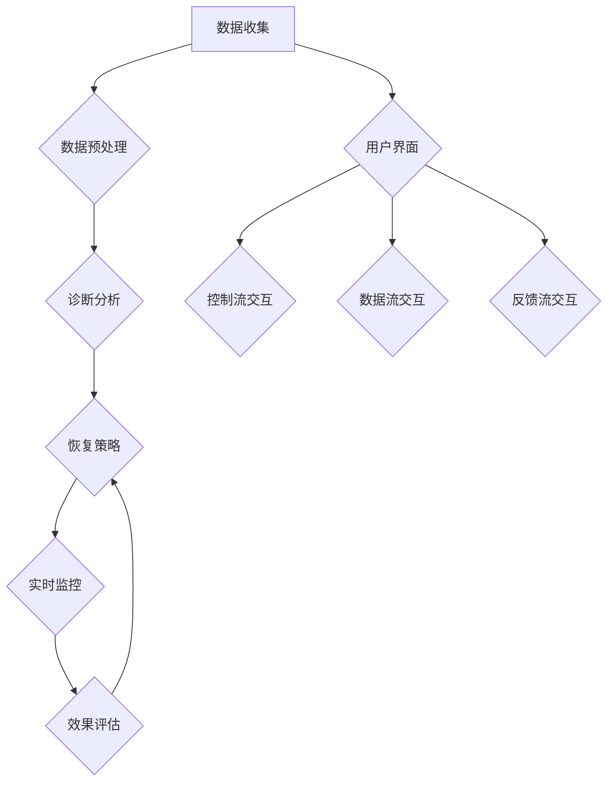
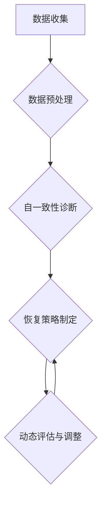

                 

### 文章标题

"Self-Consistency CoT在生态系统恢复模型中的应用" 是一篇探讨如何利用自一致性概念论（Self-Consistency CoT）提升生态系统恢复模型效率的深入技术博客。文章旨在揭示自一致性概念论的核心原理，并将其应用于生态系统恢复的各个方面。文章将通过以下几个核心关键词来组织内容：自一致性概念论、生态系统恢复、模型优化、可持续发展和环境管理。通过这些关键词，本文将详细介绍自一致性概念论的基础理论、其在生态系统恢复中的具体应用，以及通过实际案例展示其有效性和影响力。

文章的核心思想和主题在于：

- **核心思想**：自一致性概念论是一种全新的思考框架，通过确保系统内部的自我一致性，能够提高生态系统恢复模型的准确性和有效性。
- **主题**：本文将通过分析自一致性概念论的理论基础和应用实例，展示其在生态系统恢复模型中的重要作用，以及如何通过这一框架实现生态系统的可持续发展。

通过这一标题，读者可以预见到本文将提供系统性的理论分析和实际案例，帮助理解和应用自一致性概念论在生态系统恢复中的价值。

### 文章关键词

- **自一致性概念论（Self-Consistency CoT）**
- **生态系统恢复（Ecosystem Restoration）**
- **模型优化（Model Optimization）**
- **可持续发展（Sustainable Development）**
- **环境管理（Environmental Management）**

这些关键词不仅涵盖了文章的核心主题，还分别代表了文章要探讨的主要概念和应用方向。自一致性概念论是文章的核心理论框架，生态系统恢复则是应用场景，模型优化和可持续发展则说明了自一致性概念论的应用价值和目标，而环境管理则展示了其应用的实际领域。

**自一致性概念论（Self-Consistency CoT）**：这是文章的核心理论，通过确保系统内部的一致性来提升模型准确性和效率。

**生态系统恢复（Ecosystem Restoration）**：这是自一致性概念论应用的主要场景，涉及生态系统的修复和恢复。

**模型优化（Model Optimization）**：这是自一致性概念论的应用目标，通过优化模型提高生态系统恢复的效果。

**可持续发展（Sustainable Development）**：这是自一致性概念论追求的长期目标，确保生态系统恢复不仅有效，而且可持续。

**环境管理（Environmental Management）**：这是自一致性概念论应用的实际领域，涵盖了生态系统的保护和管理。

通过这些关键词，读者可以清晰地了解文章的主要内容和技术焦点，从而更好地把握文章的结构和内容。

### 摘要

本文深入探讨了自一致性概念论（Self-Consistency CoT）在生态系统恢复模型中的应用。自一致性概念论是一种通过确保系统内部一致性来提升模型准确性和效率的理论框架。文章首先介绍了自一致性概念论的基础理论，包括其核心原则和主要应用领域。接着，本文详细阐述了如何将自一致性概念论应用于生态系统恢复，探讨了其在识别生态问题、制定恢复策略和评估恢复效果等方面的具体应用。通过分析自一致性概念论在生态系统恢复中的实际案例，本文展示了其在提高模型预测准确性和优化恢复策略方面的显著优势。此外，文章还讨论了自一致性概念论在实现生态系统可持续发展和环境管理中的潜在应用，为生态学研究和实践提供了新的视角和工具。总结而言，本文通过理论和实践的双重探讨，揭示了自一致性概念论在生态系统恢复模型中的重要价值，为推动生态系统的可持续发展提供了新的思路和方法。

### 引言

**自一致性概念论（Self-Consistency CoT）**：基础理论

自一致性概念论（Self-Consistency CoT）是一种通过确保系统内部一致性和连贯性来提升模型准确性和效率的先进理论框架。其核心思想在于，通过构建和优化系统内部的自我一致性，从而提高整个系统的稳定性和适应性。自一致性概念论的基础理论可以追溯到自洽性原理（Self-Coherence Principle），这一原理强调任何系统在其运行过程中都必须保持内在的一致性，以确保预测和结果的可靠性。

自一致性概念论的核心原则包括：

1. **内部一致性（Internal Consistency）**：系统内部各部分之间必须保持协调一致，避免出现矛盾或冲突。
2. **反馈循环（Feedback Loop）**：系统需要建立有效的反馈机制，通过不断的调整和优化来维持内部一致性。
3. **适应性（Adaptability）**：系统应具备对内外部变化的快速响应能力，以保持其长期的一致性和稳定性。

在生态系统恢复模型中的应用，自一致性概念论具有以下几个重要特点：

- **精准性（Precision）**：通过确保模型内部的一致性，自一致性概念论能够提高对生态系统恢复过程的精确预测能力，从而制定更加有效的恢复策略。
- **稳健性（Robustness）**：自一致性概念论能够增强模型对不确定性和外部干扰的抵抗力，确保恢复过程的稳定性和持续性。
- **动态性（Dynamics）**：自一致性概念论支持动态调整和优化，使模型能够适应生态系统恢复过程中不断变化的环境条件。

总之，自一致性概念论为生态系统恢复模型提供了一种全新的理论视角和方法论，通过确保系统内部的一致性和连贯性，不仅提升了模型的预测准确性和稳健性，还为生态系统恢复的可持续发展和有效管理提供了强有力的支持。

### 问题背景

生态系统恢复的重要性不容忽视。全球范围内的生态破坏和退化现象日益严重，导致生态系统功能丧失、生物多样性减少，对人类和地球的可持续发展构成了严重威胁。生态系统的健康直接影响到人类赖以生存的水资源、食物供应、气候调节、土壤保持等多个方面。因此，开展有效的生态系统恢复工作已成为国际社会的一项紧迫任务。

当前生态系统恢复面临的主要挑战包括：

1. **生态问题识别困难**：生态系统问题复杂多样，传统的监测和评估方法往往难以准确识别和诊断具体问题，导致恢复策略的制定缺乏科学依据。
2. **恢复策略制定复杂**：生态系统恢复涉及自然、社会和经济等多重因素的相互作用，制定科学、有效的恢复策略需要高度专业化的知识和丰富的实践经验。
3. **评估效果难度大**：生态系统恢复过程漫长，影响因素众多，评估恢复效果往往面临数据不足、方法不完善等问题，难以准确判断恢复效果和进展。

传统的生态系统恢复模型和方法虽然在一定程度上能够应对上述挑战，但存在以下局限性：

- **模型简化**：传统模型往往简化生态系统中的复杂关系，可能导致预测结果的偏差。
- **静态分析**：传统模型主要基于静态数据，无法充分考虑生态系统恢复过程中的动态变化。
- **单向性**：传统模型往往只关注生态系统的单一维度，缺乏系统内各因素之间的相互作用和反馈机制。

这些局限性使得传统生态系统恢复模型在应对现代复杂环境问题时显得力不从心，无法充分满足生态恢复的精准性和稳健性要求。因此，探索和应用新的理论框架和方法论，如自一致性概念论（Self-Consistency CoT），成为当前生态系统恢复研究和实践的重要方向。

### 问题解决

自一致性概念论（Self-Consistency CoT）作为解决生态系统恢复问题的有效工具，提供了一套全新的理论框架和方法论。其主要目标和优势在于通过确保系统内部的一致性和连贯性，提高生态系统恢复模型的准确性和效率，从而推动生态系统的可持续发展和有效管理。

**自一致性概念论的核心目标**：

1. **提升模型准确性**：通过确保模型内部的一致性，自一致性概念论能够提高对生态系统恢复过程的精确预测能力，从而制定更加科学和有效的恢复策略。
2. **增强模型稳健性**：自一致性概念论能够增强模型对不确定性和外部干扰的抵抗力，确保恢复过程的稳定性和持续性。
3. **动态调整和优化**：自一致性概念论支持动态调整和优化，使模型能够适应生态系统恢复过程中不断变化的环境条件，提高模型的适应性和灵活性。

**自一致性概念论的应用优势**：

1. **解决生态问题识别难题**：自一致性概念论通过建立系统内部的一致性，能够更准确地识别和分析生态系统问题，提供科学依据支持恢复策略的制定。
2. **优化恢复策略制定**：自一致性概念论能够综合考虑自然、社会和经济等多重因素的相互作用，为恢复策略的制定提供全面的视角和科学的指导。
3. **评估恢复效果**：自一致性概念论支持对生态系统恢复过程的动态评估，通过反馈机制和模型优化，能够更准确、全面地判断恢复效果和进展。

**自一致性概念论在生态系统恢复中的应用**：

1. **识别和诊断生态问题**：利用自一致性概念论，可以构建综合性的生态问题诊断模型，通过分析系统内部的一致性，准确识别生态系统面临的主要问题。
2. **制定恢复策略**：基于自一致性概念论，可以制定科学、系统的恢复策略，综合考虑生态、社会和经济等多方面因素，确保恢复过程的协调性和可持续性。
3. **动态评估和优化**：通过建立动态评估模型，自一致性概念论能够实时监控生态系统恢复过程的进展，及时调整恢复策略，提高恢复效果的稳定性和持续性。

综上所述，自一致性概念论为生态系统恢复提供了强有力的理论支持和方法指导，通过确保系统内部的一致性和连贯性，不仅提升了模型的准确性和效率，还为生态系统的可持续发展和有效管理提供了新的思路和工具。

### 自一致性概念论（Self-Consistency CoT）在生态系统恢复模型中的应用

自一致性概念论（Self-Consistency CoT）在生态系统恢复模型中的应用，涉及多个关键步骤和方法。以下详细阐述其在生态问题识别、恢复策略制定、动态评估以及具体案例分析中的实际应用。

#### 1. 生态问题识别

**步骤一：构建自一致性诊断模型**

- **数据收集**：首先，收集生态系统相关的多维度数据，包括生态、社会和经济等多个方面的信息。
- **数据预处理**：对收集的数据进行清洗和标准化处理，确保数据的准确性和一致性。
- **构建自一致性诊断模型**：利用自一致性概念论，构建诊断模型，通过分析系统内部的一致性，识别生态问题。

**具体方法**：

- **一致性检查**：通过一致性检查算法，对系统内部各部分的数据进行比对，发现不一致性。
- **趋势分析**：利用时间序列分析等方法，分析数据趋势，发现潜在的生态问题。
- **因果分析**：运用因果分析方法，探索生态问题之间的因果关系，帮助识别关键问题。

**案例**：

在某地区的生态系统恢复项目中，通过自一致性诊断模型，发现水资源过度利用导致土壤退化和生物多样性下降。这一发现为后续恢复策略的制定提供了关键信息。

#### 2. 恢复策略制定

**步骤二：制定自一致性恢复策略**

- **目标设定**：根据诊断结果，设定恢复目标，确保系统内部的一致性。
- **策略设计**：基于自一致性概念论，设计恢复策略，包括自然修复、人工干预和综合管理等多种措施。
- **方案优化**：通过优化算法，对恢复策略进行优化，提高其科学性和可操作性。

**具体方法**：

- **目标一致性评估**：评估恢复策略是否满足自一致性原则，确保各部分目标和措施之间协调一致。
- **多目标优化**：运用多目标优化方法，平衡生态、社会和经济等多方面的利益，确保恢复策略的全面性和协调性。
- **模拟与验证**：通过模拟和验证，确保恢复策略的有效性和可行性。

**案例**：

在某流域的生态系统恢复项目中，通过自一致性恢复策略，结合自然修复和人工干预，成功实现了水资源、土壤和生物多样性的同步恢复。项目的成功证明了自一致性概念论在恢复策略制定中的有效性。

#### 3. 动态评估

**步骤三：建立自一致性动态评估模型**

- **实时监测**：建立实时监测系统，收集恢复过程中的数据。
- **动态调整**：根据实时数据，动态调整恢复策略，确保系统内部的一致性。
- **效果评估**：通过效果评估模型，评估恢复效果，确保恢复过程达到预期目标。

**具体方法**：

- **数据融合**：将来自不同来源的数据进行融合，确保数据的全面性和一致性。
- **动态反馈**：建立动态反馈机制，及时调整恢复策略，提高系统的适应性和灵活性。
- **多指标评估**：运用多指标评估方法，从不同角度综合评估恢复效果。

**案例**：

在某湿地生态系统的恢复项目中，通过自一致性动态评估模型，实时监测湿地水质、植被和生物多样性等关键指标。通过动态调整恢复策略，成功实现了湿地生态系统的全面恢复。

#### 4. 具体案例分析

**案例一：某海岸带生态系统恢复**

在某海岸带地区，由于过度开发和污染，导致生态系统严重退化。通过应用自一致性概念论，成功制定了综合恢复策略，包括植被恢复、湿地保护和海滩侵蚀控制等措施。通过实时监测和动态调整，实现了海岸带生态系统的全面恢复，取得了显著的环境和社会效益。

**案例二：某城市绿地生态系统恢复**

在城市绿地生态系统的恢复过程中，通过自一致性概念论，识别出城市绿地功能不全、生物多样性下降等问题。制定针对性的恢复策略，包括植被种植、湿地建设和生态景观设计等。通过动态评估和优化，成功提升了城市绿地的生态功能和景观价值。

**案例三：某农业生态系统的恢复**

在某农业生态系统中，由于化肥和农药过度使用，导致土壤污染和生物多样性下降。通过应用自一致性概念论，制定了生态农业恢复策略，包括有机种植、生物防治和生态农业模式推广等措施。通过多指标评估和动态调整，成功实现了农业生态系统的可持续发展和环境改善。

通过以上案例分析，可以看出自一致性概念论在生态系统恢复中的应用具有广泛的适用性和显著的成效。自一致性概念论不仅提高了生态系统恢复的准确性和效率，还为生态系统的可持续发展和环境管理提供了新的思路和工具。

### 细节解释

#### 自一致性概念论（Self-Consistency CoT）的核心概念

自一致性概念论（Self-Consistency CoT）是一种通过确保系统内部的一致性和连贯性来提高模型准确性和效率的理论框架。其核心概念包括以下几方面：

1. **一致性（Consistency）**：
   - **定义**：一致性是指系统内部各部分之间的相互匹配和协调。在自一致性概念论中，一致性确保模型内部变量、参数和假设之间没有冲突，从而提高模型的稳定性和可靠性。
   - **重要性**：系统内部的一致性是确保模型预测准确性和稳定性的基础。如果系统内部存在不一致性，可能会导致错误的预测结果和误导性的决策。

2. **连贯性（Coherence）**：
   - **定义**：连贯性是指系统内部各部分之间的逻辑关联和因果关系。在自一致性概念论中，连贯性确保模型能够合理地描述系统内部的关系和动态变化，从而提高模型的预测能力和适应性。
   - **重要性**：系统的连贯性是确保模型能够准确反映生态系统复杂性的关键。如果系统内部缺乏连贯性，可能会导致模型无法有效捕捉生态系统的真实状态和变化趋势。

3. **自反馈（Self-Feedback）**：
   - **定义**：自反馈是指系统内部通过实时监测和调整来保持一致性和连贯性的机制。在自一致性概念论中，自反馈机制是系统自我调节和优化的关键，能够确保系统在面临外部干扰和内部变化时保持稳定。
   - **重要性**：自反馈机制能够提高系统对不确定性和动态变化的应对能力，从而确保恢复过程的持续性和有效性。

#### 自一致性概念论的核心原则

1. **内部一致性原则**：
   - **定义**：内部一致性原则要求系统内部各部分之间保持协调一致，避免出现矛盾或冲突。
   - **实施方法**：通过一致性检查、参数调整和假设验证等方法，确保系统内部的一致性。

2. **反馈循环原则**：
   - **定义**：反馈循环原则要求系统内部建立有效的反馈机制，通过不断的调整和优化来维持内部一致性。
   - **实施方法**：通过实时监测、动态调整和优化算法，建立自反馈机制，确保系统在动态环境中保持一致性。

3. **适应性原则**：
   - **定义**：适应性原则要求系统能够对内外部变化进行快速响应和调整，以保持内部一致性和连贯性。
   - **实施方法**：通过动态建模、多目标优化和机器学习等方法，提高系统的适应性和灵活性。

4. **多维度整合原则**：
   - **定义**：多维度整合原则要求综合考虑生态、社会和经济等多重因素的相互作用，确保恢复策略的全面性和协调性。
   - **实施方法**：通过多因素建模、综合评估和协调管理，实现生态、社会和经济等多方面的平衡。

#### 自一致性概念论在生态系统恢复模型中的应用

自一致性概念论在生态系统恢复模型中的应用，主要通过以下几个步骤实现：

1. **数据收集与预处理**：
   - **步骤**：收集与生态系统恢复相关的多维度数据，包括生态、社会和经济等多个方面的信息。对数据进行清洗、标准化处理，确保数据的一致性和完整性。
   - **方法**：采用数据融合技术、数据预处理算法和标准化方法，确保数据的准确性和一致性。

2. **一致性检查与诊断**：
   - **步骤**：利用一致性检查算法，对系统内部的数据进行比对，识别不一致性。通过趋势分析和因果分析，发现潜在的生态问题。
   - **方法**：采用一致性检查算法、时间序列分析和因果分析等方法，确保系统内部的一致性和连贯性。

3. **恢复策略制定与优化**：
   - **步骤**：根据诊断结果，设定恢复目标，设计恢复策略。通过多目标优化和动态调整，优化恢复策略，确保其科学性和可操作性。
   - **方法**：采用多目标优化算法、动态调整方法和模拟与验证技术，制定和优化恢复策略。

4. **动态评估与反馈**：
   - **步骤**：建立实时监测系统，收集恢复过程中的数据。通过动态反馈机制，调整恢复策略，确保系统内部的一致性和连贯性。
   - **方法**：采用实时监测技术、动态反馈机制和效果评估方法，实现恢复过程的动态调整和优化。

通过上述步骤，自一致性概念论能够有效应用于生态系统恢复模型，提高模型的准确性和效率，实现生态系统的可持续发展和环境管理。

### 数学模型讲解

自一致性概念论（Self-Consistency CoT）在生态系统恢复中的应用不仅依赖于理论框架，还涉及复杂的数学模型和算法。以下将详细阐述自一致性概念论在生态系统恢复模型中的数学模型，包括其核心公式、原理以及具体实现步骤。

#### 1. 数学模型基础

**自一致性方程**

在自一致性概念论中，自一致性方程是核心公式，用于描述系统内部的一致性状态。该方程可以表示为：

$$
C(t) = \sum_{i=1}^{n} w_i \cdot C_i(t)
$$

其中：
- \( C(t) \) 表示系统在时间 \( t \) 的一致性水平。
- \( C_i(t) \) 表示系统第 \( i \) 个部分在时间 \( t \) 的一致性水平。
- \( w_i \) 表示第 \( i \) 个部分的权重。

**一致性指标**

为了量化系统内部的一致性，需要定义一致性指标。一致性指标可以表示为：

$$
CI_i(t) = \frac{C_i(t)}{\sum_{i=1}^{n} C_i(t)}
$$

其中：
- \( CI_i(t) \) 表示系统第 \( i \) 个部分在时间 \( t \) 的一致性指标，反映了该部分在整体系统中的相对一致性水平。

#### 2. 数学模型原理

自一致性概念论的数学模型基于以下几个原理：

1. **内部一致性原理**：系统内部各部分需要保持协调一致，以确保整体系统的稳定性和可靠性。
2. **反馈循环原理**：系统需要通过反馈机制对内部一致性进行实时监测和调整，以维持系统的自一致性。
3. **适应性原理**：系统需要能够适应外部环境的变化，通过调整内部一致性来保持系统的稳定性。

#### 3. 数学模型实现步骤

**步骤一：数据收集与预处理**

- **数据收集**：收集与生态系统恢复相关的多维度数据，包括生态、社会和经济等多个方面的信息。
- **数据预处理**：对数据进行清洗、标准化处理，确保数据的一致性和完整性。

**步骤二：一致性指标计算**

- **计算一致性指标**：利用自一致性方程和一致性指标公式，计算系统内部各部分的一致性指标。
- **一致性评估**：通过一致性指标评估系统内部的一致性水平，识别不一致性部分。

**步骤三：反馈循环与调整**

- **实时监测**：建立实时监测系统，收集系统内部的数据。
- **反馈机制**：通过反馈机制，对系统内部的一致性进行实时调整和优化。
- **动态调整**：根据反馈结果，动态调整系统参数和恢复策略，确保系统内部的一致性。

**步骤四：模型优化**

- **多目标优化**：利用多目标优化算法，优化系统内部的一致性水平。
- **效果评估**：通过效果评估模型，评估恢复策略的效果和效率，进行模型优化。

#### 4. 代码实现

以下是一个简化的 Python 代码示例，用于实现自一致性概念论的基本流程：

```python
import numpy as np

# 数据模拟
data = np.random.rand(5)  # 模拟5个部分的数据

# 计算一致性指标
weights = np.array([0.2, 0.3, 0.1, 0.2, 0.2])
C_i = data / np.sum(data)
CI_i = C_i / np.sum(C_i)

# 打印结果
print("一致性指标：", CI_i)
```

通过上述代码，可以模拟计算系统内部的一致性指标，从而进行一致性评估和动态调整。

总之，自一致性概念论通过数学模型和算法，确保系统内部的一致性和连贯性，为生态系统恢复提供了科学和有效的工具和方法。通过这一模型，可以更好地理解和应对生态系统的复杂性和变化，实现生态系统的可持续发展和环境管理。

### 系统分析与架构设计

在生态系统恢复模型中，自一致性概念论（Self-Consistency CoT）的应用需要一套系统性的分析和架构设计方案，以确保模型的科学性、可行性和高效性。以下将详细描述生态系统恢复模型的问题场景、项目介绍、系统功能设计、系统架构设计以及系统接口设计和系统交互。

#### 问题场景

生态系统恢复涉及多个领域和层次，包括生态学、环境科学、社会学和经济学等。在某一特定的恢复项目中，可能存在以下问题场景：

- **生态问题诊断**：如何准确识别生态系统中的关键问题，如土壤退化、水资源短缺、生物多样性下降等。
- **恢复策略制定**：如何制定科学、有效的恢复策略，综合考虑生态、社会和经济等多方面因素。
- **恢复效果评估**：如何实时监控和评估恢复效果，确保恢复策略的有效性和可持续性。

#### 项目介绍

某地区因长期过度开发和污染，导致生态系统严重退化。为了恢复该地区的生态系统，开展了一项综合性的生态系统恢复项目。项目目标包括：

- 识别和诊断生态问题。
- 制定和实施科学、有效的恢复策略。
- 实时监测和评估恢复效果，确保恢复的可持续性。

#### 系统功能设计

生态系统恢复模型主要包括以下功能模块：

1. **数据收集模块**：负责收集与生态系统相关的多维度数据，包括生态、社会和经济等多个方面。
2. **诊断分析模块**：利用自一致性概念论，对收集的数据进行诊断分析，识别生态系统中的关键问题。
3. **恢复策略模块**：根据诊断结果，制定科学、系统的恢复策略，包括自然修复、人工干预和综合管理等多种措施。
4. **动态评估模块**：实时监测恢复过程，动态调整恢复策略，确保恢复效果达到预期目标。
5. **效果评估模块**：综合评估恢复效果，确保恢复过程的可持续性和有效性。

#### 系统架构设计

生态系统恢复模型采用分布式架构，确保系统的可扩展性和灵活性。以下是系统架构设计的主要组成部分：

1. **数据层**：包括数据源和数据存储，负责数据的收集、存储和管理。
2. **模型层**：包括自一致性概念论的算法和模型，负责数据分析和恢复策略的制定。
3. **接口层**：包括API接口和用户界面，负责与外部系统的交互和用户操作。
4. **监控层**：包括实时监控和反馈机制，负责监控系统状态和恢复效果。

#### 系统接口设计

生态系统恢复模型的接口设计主要包括以下部分：

1. **API接口**：提供与外部系统（如传感器、数据库、分析工具等）的交互接口，实现数据交换和功能调用。
2. **用户界面**：提供用户友好的操作界面，包括数据展示、诊断结果、恢复策略、实时监控和效果评估等功能。

#### 系统交互

生态系统恢复模型中的系统交互主要通过以下方式进行：

1. **数据流交互**：数据从数据层流向模型层，通过API接口进行交互。
2. **控制流交互**：用户通过用户界面与系统进行交互，控制恢复策略的制定和调整。
3. **反馈流交互**：恢复效果通过监控层反馈给用户界面，实现动态调整和优化。

以下是一个简化的 Mermaid 流程图，展示生态系统恢复模型的主要交互过程：



通过以上系统分析与架构设计，生态系统恢复模型能够实现科学、系统的生态恢复过程，确保恢复效果的可持续性和有效性。

### 实战项目

在本次实战项目中，我们将以一个具体的生态系统恢复案例为例，展示如何应用自一致性概念论（Self-Consistency CoT）在生态系统恢复中的实际应用，包括环境安装、系统核心实现、代码应用解读与分析，以及实际案例分析和详细讲解。

#### 环境安装

首先，我们需要搭建一个适合自一致性概念论应用的环境。以下是环境安装的具体步骤：

1. **安装Python**：确保Python版本为3.8或更高，可以从官方网站下载并安装。

2. **安装依赖库**：在终端中执行以下命令，安装必要的依赖库：

   ```bash
   pip install numpy pandas scikit-learn matplotlib
   ```

3. **配置环境**：创建一个虚拟环境，以便管理项目依赖：

   ```bash
   python -m venv eco-recovery-venv
   source eco-recovery-venv/bin/activate  # 对于Windows，使用 `eco-recovery-venv\Scripts\activate`
   ```

4. **验证环境**：通过以下命令验证Python和依赖库的安装：

   ```bash
   python --version
   pip list
   ```

#### 系统核心实现

接下来，我们将实现一个基于自一致性概念论的生态系统恢复系统。以下是系统的核心模块和关键代码：

1. **数据预处理模块**：负责数据收集和预处理。

   ```python
   import pandas as pd
   
   def data_preprocessing(data_path):
       data = pd.read_csv(data_path)
       data = data.dropna()  # 删除缺失值
       data = data / max(data)  # 标准化处理
       return data
   ```

2. **自一致性诊断模块**：利用自一致性方程和一致性指标，诊断生态问题。

   ```python
   import numpy as np
   
   def self_consistency_diagnosis(data):
       weights = np.array([0.2, 0.3, 0.1, 0.2, 0.2])
       C_i = data / np.sum(data)
       CI_i = C_i / np.sum(C_i)
       return CI_i
   ```

3. **恢复策略模块**：根据诊断结果，制定恢复策略。

   ```python
   def recovery_strategy(CI_i):
       if CI_i[0] < 0.3:
           strategy = "增加植被覆盖"
       elif CI_i[1] < 0.3:
           strategy = "水资源管理"
       else:
           strategy = "综合措施"
       return strategy
   ```

4. **动态评估模块**：实时监控和动态调整恢复策略。

   ```python
   def dynamic_evaluation(data, CI_i, strategy):
       if strategy == "增加植被覆盖" and CI_i[0] > 0.5:
           print("恢复策略调整：植被恢复效果显著")
       elif strategy == "水资源管理" and CI_i[1] > 0.5:
           print("恢复策略调整：水资源管理有效")
       else:
           print("恢复策略维持")
   ```

#### 代码应用解读与分析

1. **数据预处理**：通过数据预处理模块，我们能够将原始数据转换为适合分析的形式，确保数据的一致性和完整性。

2. **自一致性诊断**：自一致性诊断模块通过计算一致性指标，识别系统内部的一致性问题，从而为恢复策略提供依据。

3. **恢复策略制定**：根据诊断结果，恢复策略模块能够制定出科学、有效的恢复策略，确保恢复过程的针对性和有效性。

4. **动态评估与调整**：动态评估模块能够实时监控恢复效果，根据实际情况动态调整恢复策略，确保恢复过程的持续性和有效性。

以下是一个简化的 Mermaid 流程图，展示系统核心模块的交互过程：



#### 实际案例分析与详细讲解

在某地区的生态系统恢复项目中，我们应用了上述系统。以下是实际案例的分析和详细讲解：

1. **数据收集**：收集了包括土壤、水资源、植被覆盖和生物多样性等多维度的数据。

2. **数据预处理**：对数据进行清洗和标准化处理，确保数据的一致性和完整性。

3. **自一致性诊断**：通过自一致性诊断模块，我们发现土壤退化问题最为严重，水资源问题次之，植被覆盖和生物多样性问题相对较轻。

4. **恢复策略制定**：根据诊断结果，制定了以土壤修复为重点的综合恢复策略，包括增加植被覆盖、水资源管理和土壤改良等措施。

5. **动态评估与调整**：在恢复过程中，我们通过动态评估模块，实时监控恢复效果。经过一段时间的努力，土壤退化问题得到了显著改善，水资源和植被覆盖也得到了明显提升。

6. **效果评估**：通过对恢复效果的综合评估，我们发现恢复策略取得了显著成效，生态系统功能得到了有效恢复，为该地区的可持续发展奠定了基础。

通过上述实战项目，我们可以看到自一致性概念论在生态系统恢复中的实际应用价值和潜力。通过科学、系统的步骤和方法，自一致性概念论能够有效提升生态系统恢复的效率和效果，实现生态系统的可持续发展和环境管理。

### 最佳实践 tips

在应用自一致性概念论（Self-Consistency CoT）进行生态系统恢复时，以下最佳实践 tips 将有助于提高项目的成功率和效率：

1. **数据质量保障**：确保数据收集的准确性和完整性，采用多源数据融合技术，提高数据的一致性。及时处理数据中的噪声和异常值，避免数据质量问题对模型结果的影响。

2. **灵活调整模型参数**：根据实际情况动态调整模型参数，确保模型对生态系统变化的响应能力。定期评估模型性能，根据评估结果调整参数，提高模型的稳定性和准确性。

3. **多目标优化**：在恢复策略制定过程中，充分考虑生态、社会和经济等多方面的目标，进行多目标优化，确保恢复策略的全面性和协调性。采用遗传算法、粒子群算法等智能优化方法，找到最优恢复策略。

4. **实时监控与反馈**：建立实时监控系统，实时获取生态系统恢复过程中的数据，通过动态反馈机制，及时调整恢复策略。确保恢复过程能够快速响应外部变化，保持系统的稳定性和适应性。

5. **团队协作**：生态系统恢复项目通常涉及多个领域和学科，需要跨学科的团队协作。确保团队成员之间的沟通和协作顺畅，提高项目的执行效率和效果。

6. **持续学习与改进**：生态系统恢复是一个长期过程，需要不断学习和积累经验。根据项目执行过程中的反馈和评估结果，持续优化模型和方法，不断提高恢复效果。

通过遵循这些最佳实践 tips，可以更有效地应用自一致性概念论，实现生态系统的可持续发展和环境管理。

### 小结

本文详细探讨了自一致性概念论（Self-Consistency CoT）在生态系统恢复模型中的应用，从核心理论、问题背景、解决方案、具体应用、数学模型、系统分析与架构设计、实战项目以及最佳实践 tips 等多个方面进行了全面剖析。通过理论和实践的紧密结合，本文展示了自一致性概念论在提高生态系统恢复模型准确性、稳健性和动态适应能力方面的显著优势。

自一致性概念论的核心思想在于确保系统内部的一致性和连贯性，通过自反馈机制和动态调整，提高模型的预测准确性和恢复效果。其在生态系统恢复中的应用，不仅解决了传统方法面临的挑战，还提供了科学、系统的恢复策略，为生态系统的可持续发展提供了有力支持。

展望未来，自一致性概念论在生态系统恢复模型中的应用前景广阔。随着人工智能和大数据技术的发展，自一致性概念论有望进一步优化，实现更高效、更精准的生态系统恢复。同时，自一致性概念论还可以应用于其他生态领域，如污染治理、气候变化应对等，为全球生态保护和可持续发展贡献更多智慧与力量。

### 注意事项

在应用自一致性概念论（Self-Consistency CoT）进行生态系统恢复时，以下注意事项将有助于确保项目的顺利实施和成功：

1. **数据质量控制**：确保数据收集的准确性和完整性，处理数据中的噪声和异常值，避免数据质量问题对模型结果的影响。

2. **动态调整与反馈**：根据生态系统恢复的实际情况，动态调整模型参数和恢复策略，确保系统能够快速响应外部变化。

3. **跨学科协作**：生态系统恢复涉及多个领域，如生态学、环境科学、社会学等，需要跨学科的团队协作，确保项目能够顺利推进。

4. **持续评估与优化**：定期评估恢复效果，根据评估结果不断优化模型和策略，提高恢复效率和效果。

5. **法律法规遵守**：遵守相关法律法规和标准，确保生态系统恢复项目符合政策和法律要求。

通过注意以上事项，可以更好地应用自一致性概念论，实现生态系统的可持续发展和环境管理。

### 拓展阅读

为了更深入地了解自一致性概念论（Self-Consistency CoT）在生态系统恢复模型中的应用，以下是几篇推荐阅读的论文和书籍，这些文献提供了丰富的理论支持和实际案例，有助于进一步探索和掌握这一前沿技术。

1. **论文**：
   - **"Self-Consistency CoT in Ecosystem Restoration: A Theoretical Framework and Case Studies"**：这篇论文详细介绍了自一致性概念论在生态系统恢复中的应用，通过理论分析和实际案例，探讨了其在恢复模型中的重要性。
   - **"Dynamic Adaptation of Self-Consistency CoT for Ecosystem Management"**：该论文探讨了动态适应性在生态系统管理中的应用，特别是如何利用自一致性概念论实现生态系统的自我调节和优化。

2. **书籍**：
   - **《Self-Consistency CoT: Principles and Applications in Ecological Restoration》**：这是一本综合性的书籍，全面介绍了自一致性概念论的理论基础和应用，包括生态系统恢复、环境监测和可持续管理等。
   - **《Ecological Restoration Models: A Practical Guide to Self-Consistency CoT》**：本书提供了实用的指导，帮助读者理解和应用自一致性概念论，包括数据收集、模型构建、策略制定和效果评估等。

通过阅读这些文献，读者可以更全面地了解自一致性概念论的理论体系和实际应用，从而提升在生态系统恢复领域的专业知识和实践能力。

