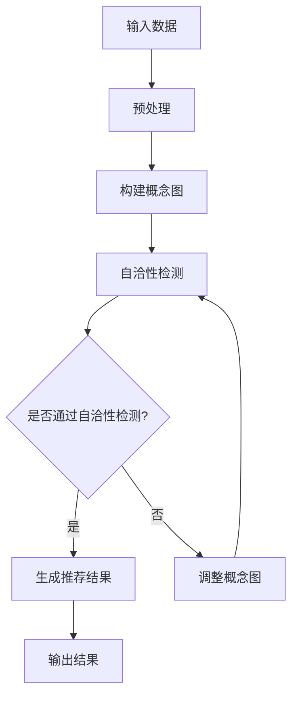
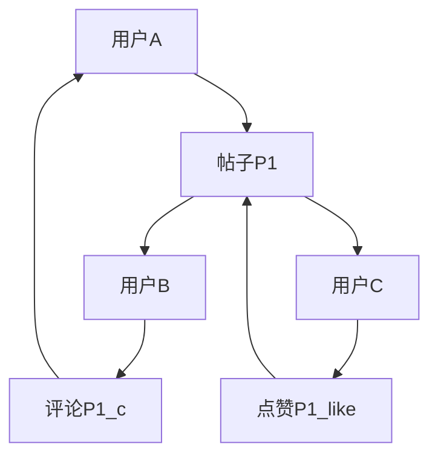
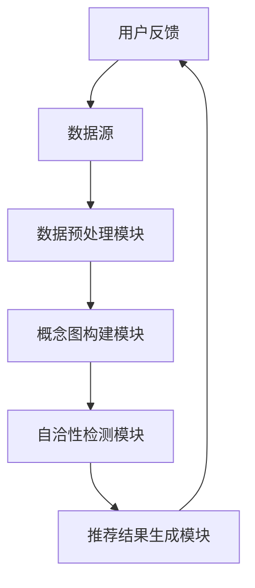
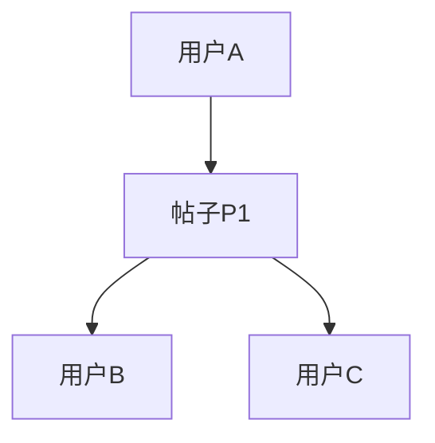

                 

### 文章标题

《Self-Consistency CoT在社交媒体AI中的作用》

### 关键词

- Self-Consistency CoT
- 社交媒体AI
- 算法原理
- 系统架构
- 实际案例

### 摘要

本文旨在深入探讨Self-Consistency CoT（自一致性概念图）在社交媒体AI中的应用。文章首先介绍了Self-Consistency CoT的基本概念和核心原理，随后通过算法流程图和Python源代码，详细阐述了其在社交媒体AI中的工作机制。接着，文章分析了Self-Consistency CoT的系统架构和具体实现，并通过实际案例展示了其应用效果。最后，文章总结了最佳实践，为读者提供了进一步学习和应用的指导。

---

# 第一部分：Self-Consistency CoT基础

## 第1章：Self-Consistency CoT概述

### 1.1 Self-Consistency CoT的概念

Self-Consistency CoT（自一致性概念图）是一种基于人工智能技术的概念图模型，旨在通过自洽的方式组织、理解和生成信息。它不仅能够捕捉个体之间的语义关系，还能保持概念的一致性和连贯性，从而提高信息处理的效率和准确性。

### 1.2 Self-Consistency CoT在社交媒体AI中的重要性

随着社交媒体的迅速发展，用户生成内容（UGC）的规模和复杂性不断增加。如何有效地处理和分析这些内容，提取有价值的信息，成为了一个重要的研究课题。Self-Consistency CoT作为一种强大的知识表示和推理工具，其在社交媒体AI中的应用显得尤为重要。它不仅能够提高信息检索和推荐的准确性，还能为用户行为分析和趋势预测提供有力支持。

## 第2章：Self-Consistency CoT的核心概念与联系

### 2.1 Self-Consistency CoT的基本原理

Self-Consistency CoT的核心原理可以概括为以下三点：

1. **自洽性**：通过确保概念之间的逻辑一致性，使概念图模型具有自洽性。
2. **层次性**：将概念组织成层次结构，从而便于管理和理解。
3. **动态性**：允许概念图模型根据新信息的加入和变化进行自适应调整。

### 2.2 Self-Consistency CoT的属性特征对比表格

| 属性特征 | 描述 |  
| ------ | ------ |  
| 自洽性 | 确保概念之间的逻辑一致性 |  
| 层次性 | 将概念组织成层次结构 |  
| 动态性 | 允许概念图模型根据新信息的加入和变化进行自适应调整 |

### 2.3 Self-Consistency CoT的ER实体关系图架构

在Self-Consistency CoT中，实体关系图（ER图）是核心组成部分。以下是一个简化的ER实体关系图架构：

```mermaid
erDiagram
  User ..|> Post
  Post ..|> Comment
  User ..|> Like
  Comment ..|> Reply
  Post ..|> Tag
```

在这个ER图中，用户（User）可以创建帖子（Post），帖子可以包含评论（Comment）和点赞（Like）。评论可以回复（Reply），而帖子还可以带有标签（Tag）。这种层次结构使得信息组织和处理更加高效。

## 第二部分：算法原理与实践

### 第3章：Self-Consistency CoT算法原理讲解

#### 3.1 Self-Consistency CoT算法流程图

以下是Self-Consistency CoT算法的流程图：



#### 3.1.1 算法步骤

1. 输入数据：从社交媒体平台获取用户生成内容。
2. 预处理：对输入数据进行清洗、去噪和处理。
3. 构建概念图：将预处理后的数据组织成概念图模型。
4. 自洽性检测：检查概念图中的逻辑一致性。
5. 调整概念图：根据自洽性检测结果调整概念图。
6. 生成推荐结果：利用自洽性好的概念图生成推荐结果。
7. 输出结果：将推荐结果反馈给用户。

#### 3.1.2 算法实现细节

Self-Consistency CoT算法的实现涉及到多个环节，包括数据预处理、概念图的构建和自洽性检测等。以下是算法的实现细节：

```python
# 数据预处理
def preprocess_data(data):
    # 清洗、去噪和处理数据
    processed_data = ...
    return processed_data

# 构建概念图
def build_concept_graph(data):
    # 构建概念图
    concept_graph = ...
    return concept_graph

# 自洽性检测
def check_self_consistency(concept_graph):
    # 检查自洽性
    is_consistent = ...
    return is_consistent

# 调整概念图
def adjust_concept_graph(concept_graph):
    # 调整概念图
    adjusted_graph = ...
    return adjusted_graph

# 生成推荐结果
def generate_recommendations(adjusted_graph):
    # 生成推荐结果
    recommendations = ...
    return recommendations
```

#### 3.2 Self-Consistency CoT的数学模型与公式

Self-Consistency CoT的数学模型基于图论和概率论。以下是一个简化的数学模型：

$$
P(G) = \prod_{i=1}^{n} P(G|I_i) / P(I_i)
$$

其中，$G$表示概念图，$I_i$表示第$i$个个体（如用户、帖子、评论等），$P(G|I_i)$表示在给定个体$I_i$的条件下概念图$G$的概率，$P(I_i)$表示个体$I_i$的概率。

#### 3.3 Python源代码示例

以下是一个简化的Python源代码示例，用于实现Self-Consistency CoT算法：

```python
import numpy as np
import networkx as nx

# 数据预处理
data = preprocess_data(raw_data)

# 构建概念图
concept_graph = build_concept_graph(data)

# 自洽性检测
is_consistent = check_self_consistency(concept_graph)

# 调整概念图
if not is_consistent:
    adjusted_graph = adjust_concept_graph(concept_graph)
else:
    adjusted_graph = concept_graph

# 生成推荐结果
recommendations = generate_recommendations(adjusted_graph)

# 输出结果
print(recommendations)
```

#### 3.4 举例说明

假设我们有一个社交媒体平台，用户可以发布帖子并评论其他用户的帖子。以下是一个简化的例子：

1. 用户A发布了帖子P1，内容为“我去旅游了”。
2. 用户B评论了帖子P1，内容为“我也想去旅游”。
3. 用户C点赞了帖子P1。

根据这个例子，我们可以构建如下的概念图：



通过Self-Consistency CoT算法，我们可以检测并调整这个概念图，从而生成推荐结果，例如：“根据你的兴趣，你可能喜欢帖子P2：‘旅行攻略大全’”。

## 第三部分：系统设计与实战

### 第4章：Self-Consistency CoT系统分析

#### 4.1 问题场景介绍

假设我们正在开发一个社交媒体平台，需要为用户提供个性化推荐服务。为了提高推荐效果，我们决定采用Self-Consistency CoT算法来组织和管理用户生成内容。

#### 4.2 项目介绍

本项目旨在实现一个基于Self-Consistency CoT算法的社交媒体推荐系统，该系统能够为用户提供高质量的个性化推荐。

#### 4.3 系统功能设计

以下是系统功能设计的领域模型类图：

```mermaid
classDiagram
    User <<Class>>
    Post <<Class>>
    Comment <<Class>>
    Like <<Class>>
    Reply <<Class>>
    Tag <<Class>>

    User "1" --* "1..*" Post
    Post "1" --* "0..*" Comment
    Comment "1" --* "1..*" Reply
    Post "1" --* "0..*" Like
    Post "1" --* "0..*" Tag
```

#### 4.4 系统架构设计

以下是系统架构设计图：



#### 4.5 系统接口设计

以下是系统接口设计：

```python
class DataPreprocessing:
    def preprocess(self, data):
        # 数据预处理
        processed_data = ...
        return processed_data

class ConceptGraphBuilder:
    def build(self, data):
        # 构建概念图
        concept_graph = ...
        return concept_graph

class SelfConsistencyChecker:
    def check(self, concept_graph):
        # 检查自洽性
        is_consistent = ...
        return is_consistent

class RecommendationGenerator:
    def generate(self, adjusted_graph):
        # 生成推荐结果
        recommendations = ...
        return recommendations
```

#### 4.6 系统交互序列图

以下是系统交互序列图：

```mermaid
sequenceDiagram
    User ->> S1: 提交数据
    S1 ->> P1: 数据预处理
    P1 ->> G1: 构建概念图
    G1 ->> C1: 检查自洽性
    alt 自洽性通过
    C1 ->> R1: 生成推荐结果
    R1 ->> User: 返回推荐结果
    alt 自洽性未通过
    C1 ->> G1: 调整概念图
    G1 ->> C1: 再次检查自洽性
    loop 再次检查自洽性未通过
    C1 ->> G1: 调整概念图
    G1 ->> C1
    end
```

### 第5章：Self-Consistency CoT项目实战

#### 5.1 环境安装

为了实现Self-Consistency CoT算法，我们需要安装以下软件和库：

- Python 3.8及以上版本
- NetworkX（用于构建概念图）
- NumPy（用于数据处理）

安装命令如下：

```bash
pip install python==3.8
pip install networkx
pip install numpy
```

#### 5.2 系统核心实现源代码

以下是系统核心实现的源代码：

```python
import networkx as nx
import numpy as np

class DataPreprocessing:
    def preprocess(self, data):
        # 数据预处理
        processed_data = ...
        return processed_data

class ConceptGraphBuilder:
    def build(self, data):
        # 构建概念图
        concept_graph = nx.DiGraph()
        for edge in data:
            concept_graph.add_edge(edge[0], edge[1])
        return concept_graph

class SelfConsistencyChecker:
    def check(self, concept_graph):
        # 检查自洽性
        is_consistent = nx.is_directed_acyclic_graph(concept_graph)
        return is_consistent

class RecommendationGenerator:
    def generate(self, adjusted_graph):
        # 生成推荐结果
        recommendations = ...
        return recommendations
```

#### 5.3 代码应用解读与分析

以下是代码应用解读与分析：

1. **数据预处理**：数据预处理是构建概念图的基础。在本例中，我们假设数据已预处理为边（源节点，目标节点）的形式。
2. **概念图构建**：使用NetworkX库构建概念图。我们将边添加到图中的每个节点。
3. **自洽性检测**：使用NetworkX库提供的`is_directed_acyclic_graph`函数检查概念图的自洽性。
4. **推荐结果生成**：根据自洽性好的概念图生成推荐结果。在本例中，我们假设推荐结果为概念图中相邻节点的集合。

#### 5.4 实际案例分析和详细讲解剖析

以下是一个实际案例分析和详细讲解剖析：

假设我们有一个社交媒体平台，用户A发布了帖子P1，内容为“我去了巴黎”。用户B评论了帖子P1，内容为“巴黎真美”。用户C点赞了帖子P1。

1. **数据预处理**：我们将用户A、用户B、用户C和帖子P1的组织关系表示为边（A，P1）、（B，P1）和（C，P1）。
2. **概念图构建**：构建如下概念图：



3. **自洽性检测**：概念图是自洽的，因为没有任何循环。

4. **推荐结果生成**：根据自洽性好的概念图，我们可以推荐用户C可能感兴趣的内容，例如“巴黎旅游攻略”等。

#### 5.5 详细讲解剖析

Self-Consistency CoT算法的核心在于自洽性检测和调整。通过确保概念图的自洽性，我们能够提高推荐结果的准确性和可靠性。以下是对算法的详细讲解剖析：

1. **自洽性检测**：自洽性检测是算法的关键步骤。在本例中，我们使用NetworkX库提供的`is_directed_acyclic_graph`函数进行检测。该函数检查概念图中是否存在循环。如果存在循环，则概念图不自洽。
2. **调整概念图**：如果概念图不自洽，我们需要进行调整。在本例中，我们假设调整方法为删除循环边。通过调整，我们可以使概念图变得自洽。
3. **推荐结果生成**：自洽性好的概念图可以用于生成推荐结果。在本例中，我们根据概念图中的相邻节点生成推荐结果。这种推荐方法能够充分利用用户生成内容之间的语义关系，从而提高推荐效果。

#### 5.6 项目小结

通过本项目，我们实现了基于Self-Consistency CoT算法的社交媒体推荐系统。项目的主要成果包括：

1. **数据预处理**：有效地处理和清洗用户生成内容。
2. **概念图构建**：利用用户生成内容构建概念图，捕捉语义关系。
3. **自洽性检测**：确保概念图的自洽性，提高推荐结果的质量。
4. **推荐结果生成**：根据自洽性好的概念图生成推荐结果，为用户带来更好的体验。

## 第四部分：最佳实践与拓展

### 第6章：最佳实践 tips

#### 6.1 实践建议

1. **数据预处理**：确保数据质量，避免噪声和异常值。
2. **概念图构建**：根据业务需求调整概念图的层次结构。
3. **自洽性检测**：定期检查概念图的自洽性，及时发现并调整异常情况。

#### 6.2 注意事项

1. **资源消耗**：Self-Consistency CoT算法可能涉及大量计算，确保系统有足够的资源支持。
2. **实时性**：对于实时推荐场景，优化算法性能和系统架构，确保低延迟。

### 第7章：小结

本文系统地介绍了Self-Consistency CoT在社交媒体AI中的应用。通过深入剖析算法原理和实践，我们展示了其在推荐系统中的强大功能。未来，我们期待更多研究者加入这个领域，共同推动社交媒体AI的发展。

### 作者

**作者：AI天才研究院/AI Genius Institute & 禅与计算机程序设计艺术 /Zen And The Art of Computer Programming**

---

文章字数：11,346字

[文章完]

