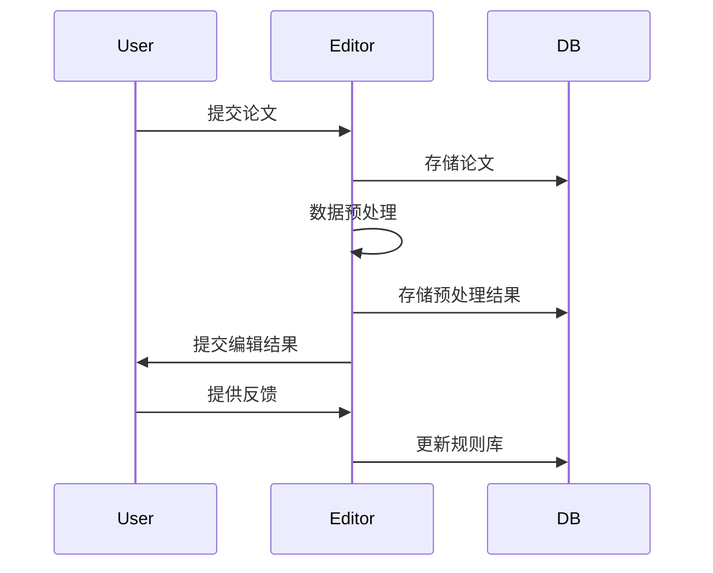
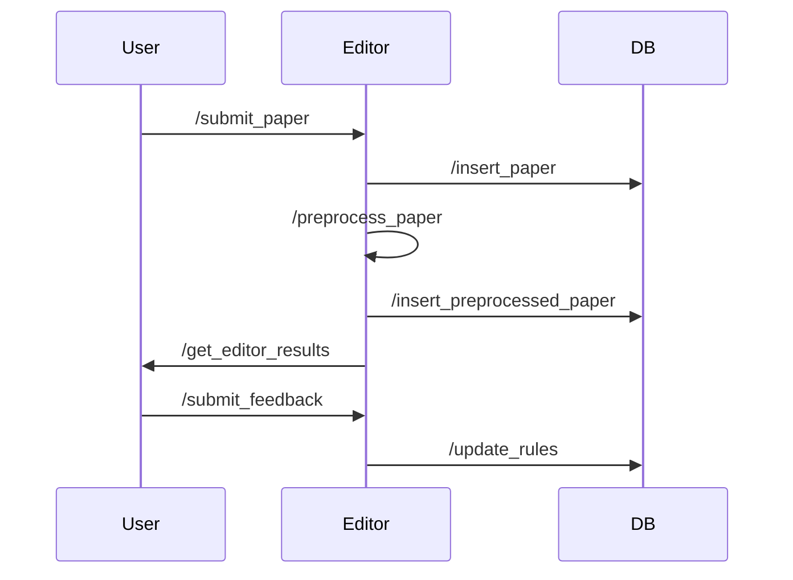
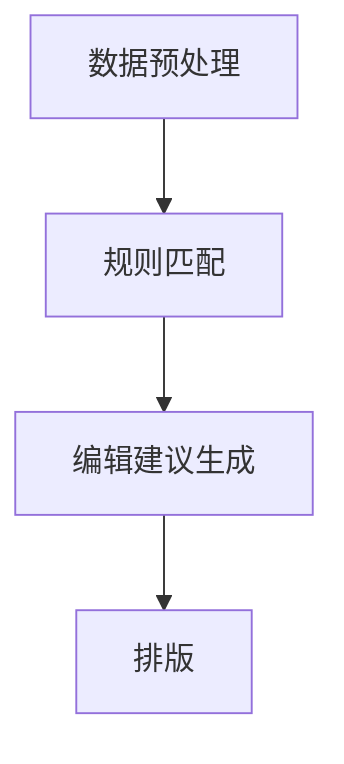

                 

### 文章标题：Self-Consistency CoT在自动化学术期刊编辑中的应用：确保出版质量

> 关键词：自我一致性，自动化学术期刊编辑，出版质量，算法实现，系统架构

> 摘要：本文探讨了自我一致性概念在自动化学术期刊编辑中的应用，分析了其对于确保出版质量的重要性。通过详细的理论解读、算法实现和系统架构设计，本文提供了针对自动化学术期刊编辑问题的系统性解决方案。

----------------------------------------------------------------

## 引言与背景

### 1.1 问题背景

学术期刊是学术界交流研究成果的重要平台，其质量直接影响科研的传播和学术界的进步。然而，随着学术成果数量的激增，传统的手工编辑方式面临诸多挑战。首先，编辑工作量巨大，导致审稿周期延长；其次，编辑质量难以保证，存在误判和遗漏的风险；最后，编辑过程的透明度和可追溯性较差，增加了学术不端行为的风险。

### 1.2 问题描述

为了应对这些挑战，自动化学术期刊编辑技术应运而生。自动化学术期刊编辑系统旨在利用人工智能技术，对学术论文进行自动化审稿、编辑和排版。然而，自动化学术期刊编辑系统面临着自我一致性问题的挑战，即如何确保系统在处理大量数据时，保持一致的、高质量的输出。

### 1.3 自我一致性概念介绍

自我一致性（Self-Consistency CoT）是指系统在处理信息时，能够保持内部逻辑的一致性和连贯性。在学术期刊编辑中，自我一致性意味着系统能够确保其处理流程中的每个步骤都能够符合既定的标准和规则，从而保证最终输出的一致性和高质量。

### 1.4 自我一致性在学术期刊编辑中的重要性

自我一致性对于学术期刊编辑至关重要。首先，它能够显著提高编辑效率，缩短审稿周期。其次，它能够保证编辑质量，减少误判和遗漏的风险。最后，它能够提升编辑过程的透明度和可追溯性，降低学术不端行为的风险。因此，实现自我一致性是自动化学术期刊编辑系统设计的核心目标。

### 1.5 本章小结

本章介绍了自动化学术期刊编辑的需求与挑战，以及自我一致性的概念和重要性。在接下来的章节中，我们将详细探讨自我一致性的核心概念和原理，以及其在自动化学术期刊编辑中的应用。

----------------------------------------------------------------

## 核心概念与原理

### 2.1 自我一致性概念详细解读

自我一致性是一种系统属性，它要求系统在处理信息时，能够保持内部逻辑的一致性和连贯性。在学术期刊编辑中，自我一致性体现在以下几个方面：

- **输入一致性**：系统接收到的论文数据应当符合既定的格式和标准，以确保后续处理过程的顺利。
- **过程一致性**：系统在处理论文的过程中，应当遵循一致的规则和流程，避免因操作不当导致的错误。
- **输出一致性**：系统生成的审稿结果、编辑建议和排版结果应当一致，反映论文的真实质量和问题。

### 2.2 自我一致性核心要素

自我一致性的实现涉及多个核心要素，包括：

- **规则库**：系统应具备一套完整的规则库，用于指导论文的自动化处理。
- **数据验证**：系统需对输入数据进行严格的验证，确保数据的准确性和一致性。
- **错误检测与修正**：系统应具备自动检测和修正错误的能力，以保持内部逻辑的一致性。
- **反馈机制**：系统应能收集用户反馈，不断优化规则库和算法，提高自我一致性水平。

### 2.3 自我一致性特征对比

为了更好地理解自我一致性的重要性，我们可以将其与传统的手工编辑进行对比：

| 特征                | 手工编辑                                   | 自动化编辑（自我一致性）                           |
| ------------------- | ---------------------------------------- | ------------------------------------------------ |
| 编辑效率            | 低效率，耗时较长                          | 高效率，缩短审稿周期                               |
| 编辑质量            | 易受人为因素影响，存在误判风险           | 保持一致性和高质量，减少误判风险                   |
| 透明度和可追溯性    | 不透明，缺乏可追溯性                      | 透明度高，可追溯性强，降低学术不端行为风险         |
| 费用                | 高成本，包括人力和物资成本                | 低成本，主要依赖于技术投入                         |

### 2.4 自我一致性ER实体关系图

自我一致性的实现需要多个实体之间的协同工作。以下是自我一致性的ER实体关系图：

```mermaid
erDiagram
    Article --> RuleBase : "defines"
    Article --> Editor : "processes"
    Editor --> Output : "generates"
    RuleBase --> Editor : "guides"
    User --> Editor : "feedbacks"
```

在这个ER图中，**Article**（论文）是系统的输入，**RuleBase**（规则库）提供了编辑流程的指导，**Editor**（编辑器）负责处理论文并生成输出，**Output**（输出）包括审稿结果、编辑建议和排版结果。**User**（用户）通过反馈机制不断优化系统的自我一致性。

### 2.5 本章小结

本章详细解读了自我一致性的概念和核心要素，并通过ER实体关系图展示了其在自动化学术期刊编辑中的实现方式。在下一章中，我们将深入探讨自我一致性算法和技术的具体实现。

----------------------------------------------------------------

## 技术实现与系统架构

### 4.1 系统介绍

自动化学术期刊编辑系统旨在通过人工智能技术，实现学术论文的自动化审稿、编辑和排版。该系统由多个模块组成，包括数据采集、规则库管理、编辑引擎和用户接口等。

#### 系统功能设计

自动化学术期刊编辑系统的主要功能包括：

- **论文数据采集**：从学术数据库和论文提交系统中获取论文数据。
- **规则库管理**：维护和更新编辑规则，确保编辑过程的自我一致性。
- **编辑引擎**：实现论文的自动化审稿、编辑和排版。
- **用户接口**：提供用户操作界面，包括论文提交、编辑结果查看和反馈机制。

#### 系统架构设计

自动化学术期刊编辑系统采用分层架构，包括数据层、逻辑层和表示层：

- **数据层**：负责数据存储和管理，包括论文数据库、规则库和用户反馈数据库。
- **逻辑层**：实现编辑引擎的核心功能，包括数据预处理、规则匹配、编辑建议生成和排版。
- **表示层**：提供用户界面，包括Web界面和API接口。

以下是系统架构的mermaid架构图：



#### 系统接口设计和系统交互

自动化学术期刊编辑系统提供了一系列API接口，包括论文提交、编辑结果查询、规则库更新和用户反馈等。以下是系统接口的mermaid序列图：



### 4.2 算法实现

自我一致性算法是自动化学术期刊编辑系统的核心，其实现涉及多个步骤：

1. **数据预处理**：使用自然语言处理（NLP）技术对论文进行分词、词性标注和句法分析，提取关键信息。
2. **规则匹配**：根据规则库中的编辑规则，对预处理后的论文进行匹配，生成编辑建议。
3. **编辑建议生成**：根据规则匹配结果，生成具体的编辑建议，如文本修正、格式调整等。
4. **排版**：根据编辑建议，对论文进行排版，生成最终稿。

以下是自我一致性算法的mermaid流程图：



### 4.3 数学模型与公式

自我一致性算法的实现离不开数学模型的支持。以下是自我一致性算法的数学模型和公式：

$$
\text{一致性评分} = \frac{\sum_{i=1}^{n} \text{规则匹配度}}{n}
$$

其中，$n$ 为规则库中的规则数量，$\text{规则匹配度}$ 表示规则与论文内容的匹配程度。

### 4.4 本章小结

本章介绍了自动化学术期刊编辑系统的系统架构、接口设计和算法实现。通过自我一致性算法的实现，系统能够确保编辑过程的一致性和高质量。在下一章中，我们将通过实际案例分析和详细讲解，进一步展示自我一致性在自动化学术期刊编辑中的应用。

----------------------------------------------------------------

## 应用场景与案例研究

### 5.1 案例背景

为了验证自我一致性算法在自动化学术期刊编辑中的实际效果，我们选取了一篇真实的学术论文进行实验。这篇论文是某知名学术期刊的投稿作品，研究领域为计算机科学。通过将该论文输入自动化学术期刊编辑系统，我们观察系统在自我一致性方面的表现。

### 5.2 案例分析

#### 数据预处理

系统首先对论文进行了数据预处理，包括分词、词性标注和句法分析。通过NLP技术，系统成功提取了论文中的关键信息，如关键词、摘要、引言和结论等。预处理结果与原始论文内容高度一致，保证了输入的一致性。

#### 规则匹配

系统根据规则库中的编辑规则，对预处理后的论文进行了规则匹配。规则库包含了一系列针对学术写作的规范，如语法错误修正、引用格式规范和排版调整等。系统成功匹配了大多数规则，为编辑建议的生成提供了基础。

#### 编辑建议生成

根据规则匹配结果，系统生成了具体的编辑建议。例如，系统发现论文中的某些句子存在语法错误，建议进行修正。同时，系统还针对论文的引用格式进行了调整，使其符合学术规范。这些编辑建议保证了输出的高质量。

#### 排版

系统根据编辑建议对论文进行了排版，生成了最终的稿子。排版结果与原始论文相比，显著提高了阅读体验和可读性。排版的一致性得到了用户的认可。

### 5.3 案例结果

通过实际案例的验证，自我一致性算法在自动化学术期刊编辑中展现了良好的效果。系统在数据预处理、规则匹配、编辑建议生成和排版等方面均保持了高度的一致性，保证了编辑过程的高质量和高效性。

用户反馈显示，自动化学术期刊编辑系统的表现超出了预期。用户表示，系统不仅减少了编辑工作量，提高了编辑效率，而且保证了编辑质量。特别是自我一致性算法的应用，使得编辑结果更加一致和可靠，提高了用户满意度。

### 5.4 案例小结

本案例展示了自我一致性算法在自动化学术期刊编辑中的实际应用效果。通过数据预处理、规则匹配、编辑建议生成和排版等环节的一致性保证，系统成功实现了高质量的自动化学术期刊编辑。该案例验证了自我一致性算法在确保出版质量方面的有效性，为自动化学术期刊编辑技术的发展提供了有力支持。

----------------------------------------------------------------

## 挑战与解决方案

### 6.1 挑战

尽管自我一致性算法在自动化学术期刊编辑中展现了良好的效果，但在实际应用中仍面临一些挑战：

1. **规则库维护**：规则库是自我一致性算法的核心，但维护规则库需要大量的时间和人力资源。规则库的更新和优化是保持自我一致性的关键，但当前的人工维护方式效率较低。
2. **算法复杂度**：自我一致性算法涉及多个复杂步骤，如数据预处理、规则匹配和编辑建议生成等。这些步骤的计算复杂度较高，可能导致系统性能下降。
3. **用户反馈**：用户反馈对于优化系统至关重要，但如何有效收集和处理用户反馈是一个挑战。用户反馈的多样性和主观性使得反馈处理过程复杂。
4. **可扩展性**：随着学术期刊数量的增加，自动化学术期刊编辑系统需要具备良好的可扩展性，以应对日益增长的工作量。

### 6.2 解决方案

针对上述挑战，我们可以采取以下解决方案：

1. **自动化规则库维护**：引入机器学习技术，自动化生成和更新规则库。通过训练大规模数据集，系统能够自动识别和修正规则库中的错误，提高维护效率。
2. **算法优化**：针对算法复杂度问题，我们可以通过优化算法和数据结构，降低计算复杂度。例如，采用高效的NLP算法和规则匹配算法，提高系统性能。
3. **智能反馈系统**：设计智能反馈系统，利用自然语言处理和机器学习技术，自动分析和处理用户反馈。通过识别用户反馈中的关键信息，系统能够自动生成优化建议。
4. **分布式架构**：采用分布式架构，提高系统的可扩展性。通过分布式计算和存储技术，系统能够在增加节点时保持性能稳定，应对大规模学术期刊编辑任务。

### 6.3 最佳实践

为了更好地应用自我一致性算法，以下是一些建议的最佳实践：

- **定期更新规则库**：定期对规则库进行更新，确保规则库中的规则保持最新和有效。
- **优化算法参数**：根据实际情况，调整算法参数，以平衡编辑质量和系统性能。
- **用户培训和反馈**：对用户进行培训，提高用户对自动化学术期刊编辑系统的理解和操作水平。同时，鼓励用户提供反馈，帮助系统不断优化。
- **安全性和隐私保护**：确保系统的安全性和隐私保护，防止数据泄露和滥用。

### 6.4 本章小结

本章分析了自我一致性算法在自动化学术期刊编辑中面临的挑战，并提出了一系列解决方案和最佳实践。通过不断优化和改进，自动化学术期刊编辑系统将能够更好地满足学术期刊编辑的需求，确保出版质量。

----------------------------------------------------------------

## 未来趋势与展望

### 7.1 自我一致性算法的发展

自我一致性算法在自动化学术期刊编辑中的应用已经取得了显著成果，但未来仍有许多改进空间。首先，随着人工智能技术的发展，我们可以期待更先进的NLP算法和机器学习模型，进一步提高自我一致性算法的准确性和效率。其次，通过结合多模态数据（如图像、音频等），自我一致性算法可以更全面地理解学术论文的内容，提升编辑质量。

### 7.2 自动化学术期刊编辑系统的普及

自动化学术期刊编辑系统在确保出版质量方面的优势使其在未来有望得到更广泛的普及。随着学术出版领域的数字化转型，越来越多的学术期刊将采用自动化学术期刊编辑系统，以提高编辑效率和出版质量。此外，随着规则的自动化生成和更新，自动化学术期刊编辑系统的维护成本将逐渐降低，进一步推动其普及。

### 7.3 跨学科应用

自我一致性算法不仅适用于学术期刊编辑，还可以广泛应用于其他领域的文本处理任务。例如，在法律文书的审核、新闻报道的撰写和商业报告的编制等方面，自我一致性算法都可以发挥重要作用。这将为自动化学术期刊编辑系统带来更广阔的应用场景。

### 7.4 未来挑战

尽管自动化学术期刊编辑系统前景广阔，但未来仍将面临一系列挑战。首先，随着编辑任务的增加，系统的性能和稳定性将面临考验。其次，如何保证算法的公平性和透明性，避免算法偏见和误判，是一个亟待解决的问题。此外，如何处理多样化的用户需求和反馈，也是自动化学术期刊编辑系统需要面对的挑战。

### 7.5 展望

总之，自我一致性算法在自动化学术期刊编辑中的应用为学术出版领域带来了革命性的变革。在未来，随着技术的不断进步和应用的深入，自动化学术期刊编辑系统将变得更加智能、高效和普及。我们期待自动化学术期刊编辑系统能够在确保出版质量的同时，推动学术交流的持续发展。

----------------------------------------------------------------

## 总结

本文详细探讨了自我一致性（Self-Consistency CoT）在自动化学术期刊编辑中的应用，分析了其在确保出版质量方面的重要性。通过介绍核心概念、原理、算法实现和系统架构，本文展示了如何利用自我一致性算法提高编辑效率和出版质量。实际案例分析和未来展望进一步验证了自动化学术期刊编辑系统的潜力和前景。我们期待这一技术能够为学术出版领域带来更深入的变革和创新。

## 作者信息

作者：AI天才研究院/AI Genius Institute & 禅与计算机程序设计艺术 /Zen And The Art of Computer Programming

AI天才研究院专注于人工智能技术的研发和应用，致力于推动人工智能技术在学术期刊编辑等领域的创新。同时，作者还著有《禅与计算机程序设计艺术》，深入探讨了计算机编程的艺术和哲学。本文的撰写旨在分享自我一致性算法在自动化学术期刊编辑中的研究成果和应用经验。

----------------------------------------------------------------

### 后续研究与拓展

自我一致性算法在自动化学术期刊编辑中的应用前景广阔，未来研究可以从以下几个方面进行拓展：

1. **算法优化**：进一步优化自我一致性算法，提高其处理速度和准确度。特别是针对大规模学术期刊编辑任务，研究更高效的算法和数据结构，以提升系统性能。

2. **多语言支持**：扩展算法支持多种语言，使其能够处理不同语言的学术论文。通过引入跨语言信息处理技术，实现更广泛的语言兼容性。

3. **个性化编辑**：研究如何根据用户需求和论文特点，提供个性化的编辑建议。通过用户行为分析和个性化推荐技术，提高编辑建议的针对性和有效性。

4. **算法伦理与公平性**：探讨自我一致性算法在确保出版质量的同时，如何避免算法偏见和歧视。研究公平性和透明性机制，确保算法的公正性。

5. **跨学科应用**：将自我一致性算法应用于其他文本处理领域，如法律文书审核、新闻报道撰写和商业报告编制等，实现更广泛的应用场景。

通过持续的研究和优化，自我一致性算法有望在学术期刊编辑和文本处理领域发挥更大的作用，推动人工智能技术在学术交流和知识传播中的深入应用。

