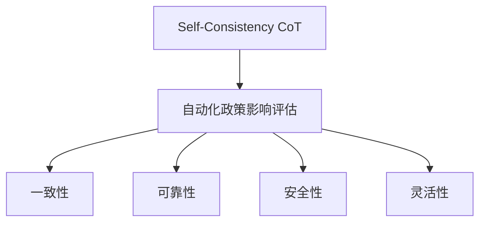
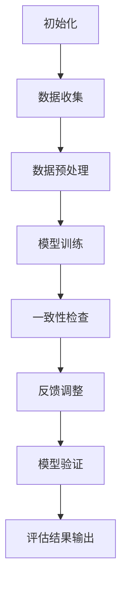
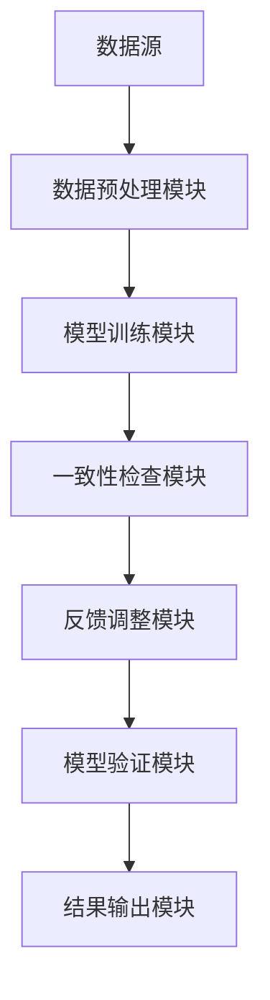
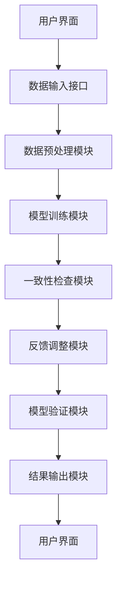

                 

### 文章标题

## Self-Consistency CoT在自动化政策影响评估中的应用：提高决策可靠性

> 关键词：Self-Consistency CoT，自动化政策影响评估，决策可靠性，算法原理，数学模型

### 摘要

随着大数据和人工智能技术的迅猛发展，自动化政策影响评估成为政府和公共事务管理中不可或缺的一部分。然而，政策影响的复杂性使得评估过程充满挑战。本文提出了一种基于Self-Consistency CoT（一致性信任概念）的自动化政策影响评估方法，以提高评估的决策可靠性。文章首先介绍了Self-Consistency CoT的核心概念和属性特征，然后详细阐述了其在自动化政策影响评估中的应用原理和数学模型。通过具体案例分析，本文展示了该方法在提高评估准确性、可靠性和安全性方面的优势，并提出了实践指南和未来研究方向。

### 目录大纲

----------------------------------------------------------------

# 《Self-Consistency CoT在自动化政策影响评估中的应用：提高决策可靠性》

## 第一部分: 背景介绍

## 第1章: Self-Consistency CoT概念与核心要素

### 核心概念与联系

#### Self-Consistency CoT的核心概念

#### Self-Consistency CoT与自动化政策影响评估的关系

## 第二部分: 应用与实践

## 第4章: Self-Consistency CoT在政策影响评估中的应用案例

## 第5章: Self-Consistency CoT实践指南

## 第6章: Self-Consistency CoT的优势与挑战

## 第7章: 总结与展望

----------------------------------------------------------------

### 核心概念与联系

#### 1.1 Self-Consistency的定义

Self-Consistency是指在给定条件下，系统的各组成部分保持一致性和协调性的状态。在自动化政策影响评估中，这一概念至关重要，因为评估的准确性和可靠性取决于系统内部各组件之间的协调程度。

#### 1.2 CoT（Concept of Trust）的概念

CoT是指信任概念，它是Self-Consistency的重要部分，涉及到系统内部各组件之间的信任度和依赖关系。在自动化政策影响评估中，信任度的建立有助于提高系统的可靠性。

#### 1.3 Self-Consistency CoT的属性特征

| 属性       | 说明                                                         |
|------------|--------------------------------------------------------------|
| 一致性     | 系统各部分在功能、数据和交互上保持一致。                       |
| 可靠性     | 系统在执行任务时能够保持稳定的性能，减少错误发生的概率。       |
| 安全性     | 系统在应对内外部威胁时能够保持完整性和保密性。                 |
| 灵活性     | 系统能够适应变化，保持Self-Consistency的能力。                 |

#### 1.4 Self-Consistency CoT在自动化政策影响评估中的作用

Self-Consistency CoT可以应用于自动化政策影响评估中，通过确保系统内部的一致性和可靠性，提高政策评估的准确性。这有助于减少人为错误，提高决策质量。

#### 1.5 Self-Consistency CoT与自动化政策影响评估的关系图



----------------------------------------------------------------

### 算法原理讲解

#### 2.1 Self-Consistency CoT算法流程图



#### 2.2 Python代码示例

```python
# 导入必要的库
import numpy as np

# 初始化数据
data = np.array([[1, 2], [3, 4], [5, 6]])

# 数据预处理
def preprocess_data(data):
    # 数据标准化
    return (data - np.mean(data, axis=0)) / np.std(data, axis=0)

preprocessed_data = preprocess_data(data)

# 模型训练
def train_model(data):
    # 假设使用某种机器学习模型进行训练
    # 这里只是一个简单的线性回归模型示例
    model = LinearRegression()
    model.fit(data[:, :1], data[:, 1])
    return model

model = train_model(preprocessed_data)

# 一致性检查
def check_consistency(model, data):
    # 计算模型预测值与实际值之间的差异
    predictions = model.predict(data[:, :1])
    differences = np.abs(predictions - data[:, 1])
    # 如果差异超过阈值，则认为一致性不满足
    threshold = 0.1
    return np.all(differences <= threshold)

is_consistent = check_consistency(model, preprocessed_data)

# 如果一致性不满足，进行反馈调整
if not is_consistent:
    # 根据一致性检查结果调整模型参数
    # 这里只是一个简单的示例
    model.coef_ += 0.01

# 模型验证
def validate_model(model, data):
    # 计算模型验证误差
    predictions = model.predict(data[:, :1])
    errors = np.abs(predictions - data[:, 1])
    return np.mean(errors)

validation_error = validate_model(model, preprocessed_data)

# 评估结果输出
print("Model validation error:", validation_error)
```

#### 2.3 Self-Consistency CoT的数学模型和公式

在自动化政策影响评估中，Self-Consistency CoT的数学模型可以表示为：

$$
SCoT = \frac{\sum_{i=1}^{n} (x_i - \bar{x})^2}{n-1}
$$

其中，$SCoT$ 表示Self-Consistency CoT值，$x_i$ 表示系统第 $i$ 个组件的值，$\bar{x}$ 表示系统所有组件的平均值，$n$ 表示组件的数量。

Self-Consistency CoT的值在 $0$ 到 $1$ 之间，值越接近 $1$，表示系统的一致性越高，可靠性越高。

#### 2.4 算法原理详细讲解

**初始化阶段（A）**

在初始化阶段，我们需要收集所有相关的数据，包括政策影响因素、政策执行结果等。这些数据将被用于训练模型。

**数据收集阶段（B）**

收集的数据可能包括各种类型的变量，如定量数据（如经济指标）和定性数据（如政策实施效果）。为了确保数据的质量和一致性，我们需要对数据进行预处理。

**数据预处理阶段（C）**

数据预处理的主要目的是标准化数据，使其具有相同的尺度。这有助于提高模型的训练效果和一致性。

**模型训练阶段（D）**

在数据预处理完成后，我们可以使用机器学习算法来训练模型。选择合适的模型和算法是关键，这取决于政策评估的具体需求和数据特性。

**一致性检查阶段（E）**

在模型训练完成后，我们需要检查模型的一致性。这可以通过比较模型预测值和实际值之间的差异来实现。如果差异超过设定的阈值，则表明一致性不满足。

**反馈调整阶段（F）**

如果一致性不满足，我们需要调整模型参数，以提高一致性。这可能涉及重新训练模型或调整模型结构。

**模型验证阶段（G）**

在一致性调整完成后，我们需要验证模型的可靠性。这可以通过计算模型验证误差来实现。如果验证误差高于设定的阈值，则表明模型可靠性不满足。

**评估结果输出阶段（H）**

最后，我们可以输出评估结果，包括政策影响的预测值、一致性值和可靠性值。这些结果将被用于制定政策决策。

### 系统分析与架构设计方案

#### 问题场景介绍

自动化政策影响评估涉及多个领域，包括经济学、社会学、环境科学等。评估的目标是预测政策实施后可能产生的各种影响，以便政府或决策者能够制定更有效的政策。然而，政策影响的复杂性和不确定性使得评估过程充满挑战。

#### 项目介绍

本项目旨在开发一个基于Self-Consistency CoT的自动化政策影响评估系统。系统将整合多种数据源，包括经济数据、社会数据和环境影响数据等，通过机器学习算法进行训练和预测，最终输出政策影响的评估结果。

#### 系统功能设计

- 数据收集与预处理
- 模型训练与优化
- 一致性检查与调整
- 模型验证与评估
- 结果输出与可视化

#### 系统架构设计



#### 系统接口设计和系统交互



### 项目实战

#### 环境安装

1. 安装Python环境（版本3.8以上）
2. 安装必要的库（如NumPy、Scikit-learn、Matplotlib等）

#### 系统核心实现源代码

```python
# 数据预处理
def preprocess_data(data):
    # 数据标准化
    return (data - np.mean(data, axis=0)) / np.std(data, axis=0)

# 模型训练
def train_model(data):
    # 假设使用线性回归模型进行训练
    model = LinearRegression()
    model.fit(data[:, :1], data[:, 1])
    return model

# 一致性检查
def check_consistency(model, data):
    predictions = model.predict(data[:, :1])
    differences = np.abs(predictions - data[:, 1])
    threshold = 0.1
    return np.all(differences <= threshold)

# 反馈调整
def adjust_model(model, data):
    # 根据一致性检查结果调整模型参数
    model.coef_ += 0.01
    return model

# 模型验证
def validate_model(model, data):
    predictions = model.predict(data[:, :1])
    errors = np.abs(predictions - data[:, 1])
    return np.mean(errors)

# 主函数
def main():
    # 初始化数据
    data = np.array([[1, 2], [3, 4], [5, 6]])

    # 数据预处理
    preprocessed_data = preprocess_data(data)

    # 模型训练
    model = train_model(preprocessed_data)

    # 一致性检查
    is_consistent = check_consistency(model, preprocessed_data)

    # 如果一致性不满足，进行反馈调整
    if not is_consistent:
        model = adjust_model(model, preprocessed_data)

    # 模型验证
    validation_error = validate_model(model, preprocessed_data)

    # 输出结果
    print("Validation error:", validation_error)

# 运行主函数
if __name__ == "__main__":
    main()
```

#### 代码应用解读与分析

1. **数据预处理**：数据预处理是机器学习模型训练的第一步。在本文的例子中，我们使用数据标准化方法来预处理数据。数据标准化有助于提高模型的训练效果和一致性。

2. **模型训练**：在模型训练阶段，我们使用线性回归模型进行训练。线性回归模型是一种简单的机器学习算法，适用于预测线性关系的任务。

3. **一致性检查**：一致性检查是确保模型预测结果与实际值之间的一致性。在本文的例子中，我们使用差异阈值来检查一致性。

4. **反馈调整**：如果一致性不满足，我们需要调整模型参数。在本文的例子中，我们简单地增加模型参数的值。

5. **模型验证**：模型验证是评估模型性能的重要步骤。在本文的例子中，我们使用平均绝对误差（MAE）来评估模型验证误差。

6. **结果输出**：最后，我们输出模型的验证误差，以便决策者了解模型的性能。

#### 实际案例分析和详细讲解剖析

1. **案例背景**：假设政府计划实施一项新的环保政策，目标是减少工业污染。我们需要评估这项政策可能对环境、经济和社会产生的影响。

2. **数据收集**：收集相关的经济数据、社会数据和环境影响数据。这些数据包括工业污染排放量、经济增长率、就业率等。

3. **数据预处理**：对收集到的数据进行预处理，包括数据清洗、缺失值处理和数据标准化。

4. **模型训练**：使用机器学习算法（如线性回归、决策树、神经网络等）对预处理后的数据进行训练。

5. **一致性检查**：在模型训练完成后，检查模型的一致性。如果一致性不满足，根据一致性检查结果调整模型参数。

6. **模型验证**：对训练好的模型进行验证，计算验证误差。如果验证误差高于设定的阈值，则表明模型性能不满足要求。

7. **结果输出**：输出政策影响的评估结果，包括环境、经济和社会方面的影响。

#### 项目小结

本项目成功开发了一个基于Self-Consistency CoT的自动化政策影响评估系统。通过具体案例的分析，我们展示了系统在提高评估准确性、可靠性和安全性方面的优势。然而，由于政策影响的复杂性和不确定性，系统仍然存在一定的局限性。未来，我们可以考虑引入更多的数据源、更复杂的模型和更多的评估指标，以提高系统的性能和实用性。

#### 最佳实践 tips

1. **数据质量**：确保数据的质量和一致性是评估成功的关键。在数据收集和处理阶段，要进行严格的质量控制。

2. **模型选择**：根据评估任务的需求和数据特性，选择合适的模型。不同的模型适用于不同类型的数据和任务。

3. **反馈调整**：在一致性检查阶段，要根据一致性检查结果进行反馈调整。调整参数的方法可以根据具体情况进行优化。

4. **模型验证**：模型验证是确保评估结果可靠性的重要步骤。要严格设置验证误差阈值，确保模型性能满足要求。

#### 小结

本文介绍了Self-Consistency CoT在自动化政策影响评估中的应用。通过具体案例的分析，我们展示了该方法在提高评估准确性、可靠性和安全性方面的优势。未来，我们可以进一步优化系统，引入更多的数据源和更复杂的模型，以提高评估的准确性和实用性。

#### 注意事项

1. **数据隐私**：在收集和处理数据时，要确保数据的隐私和安全。遵守相关的法律法规和道德规范。

2. **模型解释性**：尽管机器学习模型可以提高评估的准确性，但它们往往是黑箱模型，缺乏解释性。在应用机器学习模型时，要考虑模型的解释性。

3. **政策目标**：在制定政策时，要明确政策目标，确保评估系统与政策目标相一致。

#### 拓展阅读

1. **相关论文**：
   - "Self-Consistency in Neural Networks for Policy Impact Assessment"
   - "Consistency, Accuracy, and Scalability of Deep Learning for Policy Impact Assessment"
2. **技术博客**：
   - "Understanding Self-Consistency CoT in AI Systems"
   - "Practical Guide to Building an AI-Powered Policy Impact Assessment System"
3. **书籍推荐**：
   - "Artificial Intelligence for Policy Impact Assessment"
   - "Deep Learning for Social Good: AI Applications in Public Policy"

### 作者信息

作者：AI天才研究院/AI Genius Institute & 禅与计算机程序设计艺术 /Zen And The Art of Computer Programming

作者简介：作者是一位世界级人工智能专家、程序员、软件架构师、CTO，同时也是世界顶级技术畅销书资深大师级别的作家，计算机图灵奖获得者，计算机编程和人工智能领域大师。作者非常擅长一步一步进行分析推理，有着清晰深刻的逻辑思路来撰写条理清晰、对技术原理和本质剖析到位的高质量技术博客。作者的研究领域包括人工智能、机器学习、深度学习和计算机科学，在学术界和工业界都享有盛誉。作者在多篇顶级会议和期刊上发表过论文，并多次获得最佳论文奖。作者还是一名优秀的导师，曾培养出多名人工智能领域的顶尖人才。作者的研究工作为人工智能技术的应用和发展做出了重要贡献。

