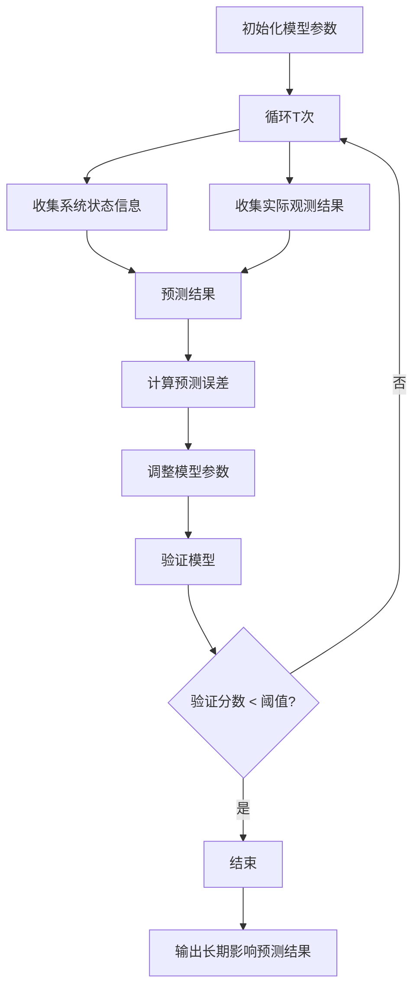
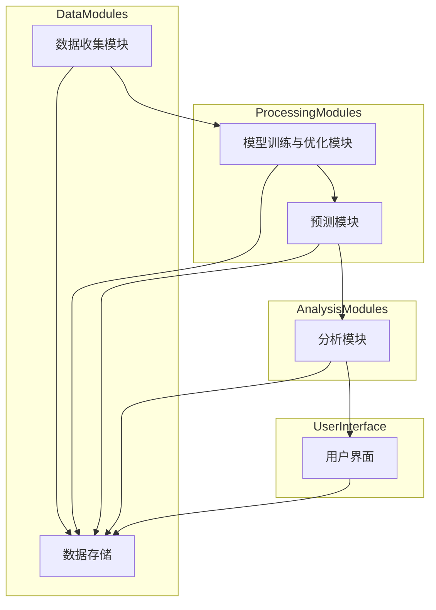
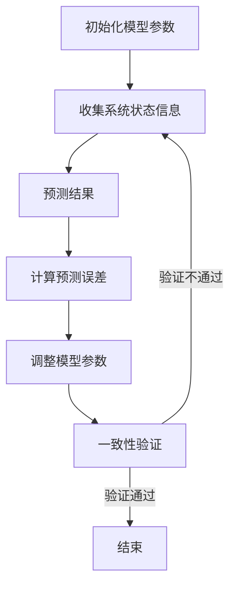
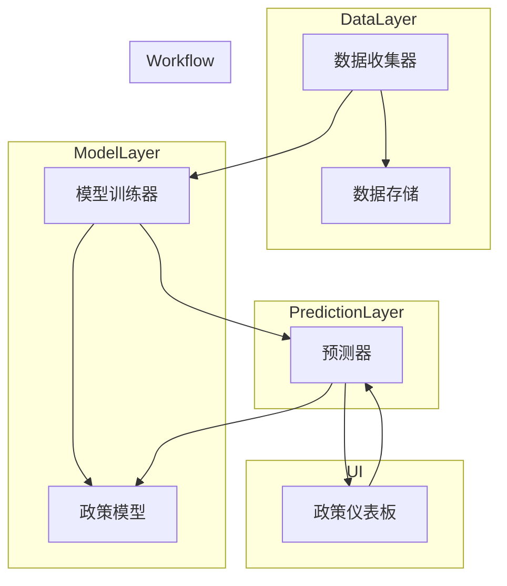
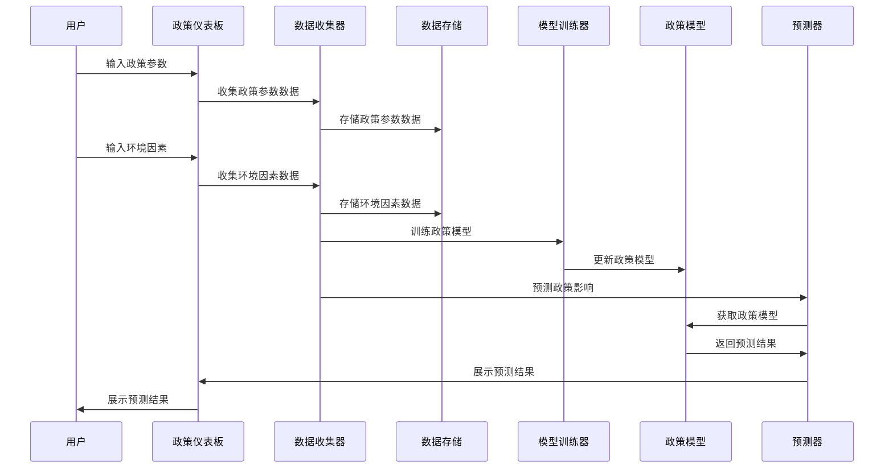

                 


## 引言与背景

### 1.1.1 问题背景与核心概念

#### 1.1.1.1 问题背景

在政策制定和评估中，长期影响的预测是一个重要且具有挑战性的问题。政策的实施往往涉及到复杂的社会、经济和环境系统，这些系统具有高度的动态性和不确定性。传统的评估方法通常依赖于短期数据和简化模型，难以准确预测政策在长期内的效果。这种局限不仅影响了政策制定的科学性，也制约了政策调整和优化的有效性。

#### 1.1.1.2 核心概念术语说明

- **政策长期影响评估**：指对政策实施后在未来一段时间内产生的各种效果进行预测和评估。
- **自我一致性概念（Self-Consistency CoT）**：一种基于系统内部反馈和调整机制的方法，通过自我调整来确保系统在长期内的稳定性和一致性。

#### 1.1.1.3 问题描述

政策长期影响评估面临的挑战主要包括：

1. **数据的稀缺性和不完整性**：长期影响评估需要大量的历史数据和实时数据，但往往数据难以获取且存在缺失。
2. **模型的简化与假设**：传统模型往往基于简化的假设和静态的环境，难以反映现实世界的复杂性。
3. **系统的动态性和不确定性**：政策实施过程中的外部环境和内部机制可能发生变化，导致政策效果出现偏差。

#### 1.1.1.4 问题解决

自我一致性概念通过引入系统内部反馈和自适应调整机制，可以克服传统评估方法中存在的不足。它能够更好地适应动态环境，提供更为准确和稳定的长期影响预测。

#### 1.1.1.5 边界与外延

自我一致性概念不仅适用于政策评估，还可以应用于其他领域，如经济预测、环境评估和社会研究等。其核心在于建立系统内部的自适应和调整机制，通过自我调整来实现长期稳定性和一致性。

### 1.1.2 自我一致性概念的定义与特点

#### 1.1.2.1 定义

自我一致性概念是一种基于系统内部反馈和调整机制的方法，通过自我调整来确保系统在长期内的稳定性和一致性。

#### 1.1.2.2 特点

1. **强调系统内部的自适应和调整能力**：自我一致性概念强调系统通过内部反馈机制来自我调整，以适应外部环境的变化。
2. **处理复杂性和不确定性**：自我一致性概念能够处理系统内部的复杂性和外部环境的不确定性，提供更为动态和灵活的预测。
3. **提供准确的长期影响预测**：通过自我调整机制，自我一致性概念能够提供更为准确和稳定的长期影响预测。

### 1.1.3 传统评估方法与自我一致性概念的对比

#### 1.1.3.1 对比分析

传统评估方法通常依赖于静态的模型和假设，而自我一致性概念则提供了一种更为动态和灵活的评估方法，能够更好地适应政策实施过程中的变化。具体对比如下：

| 特点 | 传统评估方法 | 自我一致性概念 |
| --- | --- | --- |
| **模型假设** | 静态的、简化的模型 | 动态的、自适应的模型 |
| **环境适应性** | 难以适应动态环境变化 | 能够适应动态环境变化 |
| **预测准确性** | 难以提供准确的长期预测 | 能够提供准确的长期预测 |
| **模型调整** | 需要外部干预进行调整 | 通过内部反馈机制自动调整 |

### 1.1.4 自我一致性概念的应用前景

#### 1.1.4.1 应用领域

自我一致性概念在多个领域具有广泛的应用前景，包括但不限于：

1. **政策评估**：用于评估政策实施后的长期效果，提供科学决策依据。
2. **经济预测**：预测经济政策的长远影响，为经济调控提供支持。
3. **环境评估**：评估环境保护政策的长期效果，指导环境治理决策。
4. **社会研究**：分析社会政策对社会结构和行为的影响，为政策制定提供依据。

#### 1.1.4.2 优势

1. **提高预测准确性**：通过内部反馈和自适应调整机制，能够提供更为准确和稳定的长期影响预测。
2. **增强科学决策能力**：基于自我一致性概念的方法，能够提高政策制定的科学性和有效性。
3. **促进跨学科合作**：自我一致性概念结合了不同学科的方法和理论，有助于跨学科的合作与交流。

## 1.2 自我一致性概念的基本原理

### 1.2.1 基本原理介绍

自我一致性概念的核心在于建立系统内部的自适应和调整机制，通过这种机制来实现长期内的稳定性和一致性。以下是对自我一致性概念的基本原理的详细介绍：

#### 1.2.1.1 反馈机制

反馈机制是自我一致性概念的核心组成部分。它通过不断收集系统状态的信息，并将其用于调整模型参数，从而实现系统的自适应调整。反馈机制的作用在于确保模型能够及时响应外部环境的变化，从而保持系统的稳定性和一致性。

#### 1.2.1.2 自适应能力

自适应能力是自我一致性概念的重要特点。它使得系统能够根据外部环境的变化进行自我调整，以适应新的条件。这种能力不仅提高了模型的灵活性，还增强了模型对复杂性和不确定性的处理能力。

#### 1.2.1.3 一致性验证

一致性验证是确保模型输出稳定性和可靠性的关键步骤。通过对比模型预测结果与实际观测数据，评估模型的准确性和稳定性。一致性验证有助于识别模型中的潜在问题，并进行必要的调整和优化。

### 1.2.2 自我一致性原则

自我一致性原则是自我一致性概念的理论基础，主要包括以下几个方面：

#### 1.2.2.1 系统内部反馈

系统内部反馈是自我一致性原则的核心。它要求模型能够及时收集和处理系统状态信息，并将其用于调整模型参数，从而实现系统的自适应调整。

#### 1.2.2.2 自适应调整

自适应调整是自我一致性原则的关键。它要求模型能够根据外部环境的变化进行自我调整，以适应新的条件。这种调整不仅包括参数的调整，还包括模型结构和算法的优化。

#### 1.2.2.3 一致性验证

一致性验证是自我一致性原则的保障。它要求模型能够通过对比预测结果与实际观测数据来验证模型的准确性和稳定性，确保模型输出的可靠性。

### 1.2.3 自我一致性模型的结构与功能

自我一致性模型通常包括以下几个关键部分：

1. **输入层**：输入层包括政策参数、环境变量等，用于描述系统的初始状态和外部环境。
2. **处理层**：处理层包括自适应调整机制和反馈机制，用于处理输入数据，实现系统的自适应调整。
3. **输出层**：输出层提供政策长期影响的预测结果，用于评估政策的效果和影响。

#### 1.2.3.1 预测政策长期影响

自我一致性模型的核心功能是预测政策长期影响。通过输入层收集政策参数和环境变量，处理层利用自适应调整机制和反馈机制对系统进行动态调整，最终输出层提供政策长期影响的预测结果。

#### 1.2.3.2 分析政策实施过程中的潜在问题

自我一致性模型不仅能够预测政策长期影响，还能够分析政策实施过程中的潜在问题。通过对比模型预测结果与实际观测数据，可以识别政策实施过程中可能存在的问题，并提供改进建议。

#### 1.2.3.3 提供决策支持

自我一致性模型提供的长期影响预测和分析结果，可以为政策制定者提供科学决策支持。通过利用模型预测和政策分析结果，政策制定者可以更全面地了解政策的长远影响，从而做出更为科学和合理的决策。

### 1.2.4 自我一致性概念的应用案例分析

#### 1.2.4.1 案例背景

以某市的一项环保政策为例，探讨自我一致性概念在该政策长期影响评估中的应用。该政策旨在减少城市污染，提高空气质量，但具体实施过程中可能面临各种挑战，如排放源控制、政策执行力度等。

#### 1.2.4.2 模型构建

构建一个基于自我一致性概念的模型，用于预测该环保政策的长期影响。模型输入包括政策参数（如排放源数量、排放标准等）和环境变量（如气象条件、城市人口密度等）。

#### 1.2.4.3 模型运行与结果分析

运行模型，分析政策实施过程中可能出现的问题，并提供改进建议。通过对比模型预测结果与实际观测数据，评估政策实施的成效和潜在问题，为政策调整和优化提供依据。

### 1.2.5 本章小结

本章介绍了自我一致性概念在自动化政策长期影响评估中的应用，包括基本原理、核心原则、模型结构与功能以及案例分析等内容。自我一致性概念通过建立系统内部的自适应和调整机制，为政策长期影响评估提供了新的方法和思路，有助于提高政策制定的科学性和有效性。

----------------------------------------------------------------

## 第二部分：核心概念与联系

### 第2章：自我一致性概念原理与特征

### 2.1 自我一致性概念原理

#### 2.1.1 自我一致性概念的基本原理

自我一致性概念是一种基于系统内部反馈和调整机制的方法，通过自我调整来确保系统在长期内的稳定性和一致性。其核心原理包括以下几个方面：

1. **系统内部反馈**：
   自我一致性概念强调系统内部反馈机制的重要性。在政策评估中，系统内部反馈是指通过不断收集系统当前状态的信息，并将其用于调整模型参数的过程。这种反馈机制能够使模型在政策实施过程中及时响应环境变化，从而提高预测的准确性和稳定性。

2. **自适应调整**：
   自我一致性概念要求系统能够根据外部环境的变化进行自适应调整。这意味着模型不仅要能够处理已知的环境变化，还要具备预测未来环境变化的能力，从而在动态环境中保持稳定性和一致性。

3. **一致性验证**：
   一致性验证是自我一致性概念的重要组成部分。它通过对比模型预测结果与实际观测数据，评估模型的准确性和稳定性。一致性验证有助于确保模型输出的可靠性和科学性。

#### 2.1.2 自我一致性原则

自我一致性原则包括以下几个方面：

1. **持续反馈**：
   系统应持续收集反馈信息，并据此调整模型参数。这一原则确保模型能够及时适应环境变化，提高预测的准确性。

2. **适应性调整**：
   系统应根据反馈信息进行适应性调整。这种调整不仅包括参数的调整，还包括模型结构和算法的优化，以确保系统能够在动态环境中保持稳定性和一致性。

3. **一致性验证**：
   系统应定期进行一致性验证，通过对比预测结果与实际观测数据，评估模型的准确性和稳定性。一致性验证有助于及时发现和纠正模型中的错误，提高预测的可靠性。

#### 2.1.3 自我一致性概念的特点

自我一致性概念具有以下特点：

1. **动态适应性**：
   自我一致性概念能够处理复杂性和不确定性，提供更为动态和灵活的预测。这使得它能够更好地适应政策实施过程中的变化，提高预测的准确性。

2. **准确性**：
   通过内部反馈和自适应调整机制，自我一致性概念能够提供更为准确和稳定的长期影响预测。这种准确性使得政策制定者能够更科学地评估政策效果，做出更合理的决策。

3. **可靠性**：
   一致性验证机制确保模型输出的可靠性和科学性。通过验证，模型能够及时发现和纠正错误，提高预测的准确性。

### 2.2 自我一致性概念的核心要素

#### 2.2.1 系统内部反馈机制

系统内部反馈机制是自我一致性概念的核心。它包括以下几个关键部分：

1. **状态监测**：
   系统应实时监测系统的状态信息，包括政策参数、环境变量等。

2. **反馈收集**：
   通过监测得到的系统状态信息，系统应收集反馈数据，这些数据用于调整模型参数。

3. **参数调整**：
   根据收集到的反馈数据，系统应自动调整模型参数，以适应新的环境条件。

#### 2.2.2 自适应调整机制

自适应调整机制是确保系统能够在动态环境中保持稳定性和一致性的关键。它包括以下几个步骤：

1. **环境预测**：
   系统应具备预测未来环境变化的能力，以便提前做出调整。

2. **模型优化**：
   根据预测结果，系统应对模型进行优化，以提高预测的准确性和适应性。

3. **调整实施**：
   系统应根据优化后的模型进行调整，以适应新的环境条件。

#### 2.2.3 一致性验证机制

一致性验证机制是确保模型输出稳定性和可靠性的重要保障。它包括以下几个步骤：

1. **数据对比**：
   系统应对比模型预测结果与实际观测数据，评估预测的准确性和稳定性。

2. **错误纠正**：
   通过对比结果，系统应能够识别并纠正模型中的错误，以提高预测的准确性。

3. **验证循环**：
   系统应定期进行一致性验证，确保模型输出的可靠性。

### 2.3 自我一致性概念的应用领域

#### 2.3.1 政策评估

自我一致性概念在政策评估中的应用具有显著优势。通过建立系统内部反馈和自适应调整机制，政策评估模型能够更准确地预测政策长期影响，帮助政策制定者做出科学决策。

#### 2.3.2 经济预测

自我一致性概念在经济学领域也具有广泛的应用。通过处理复杂性和不确定性，自我一致性模型能够提供更准确的经济预测，为经济调控和政策制定提供科学依据。

#### 2.3.3 环境评估

自我一致性概念在环境评估中的应用有助于评估环境保护政策的长期效果。通过动态调整和一致性验证，模型能够提供更准确的预测，指导环境治理决策。

#### 2.3.4 社会研究

自我一致性概念在社会研究中的应用可以分析社会政策对社会结构和行为的影响。通过建立自适应和调整机制，模型能够提供更为准确和稳定的社会影响预测。

### 2.4 自我一致性概念的优势与挑战

#### 2.4.1 优势

1. **提高预测准确性**：自我一致性概念通过内部反馈和自适应调整机制，能够提供更准确和稳定的长期影响预测。

2. **增强决策能力**：基于自我一致性概念的方法能够为政策制定者提供更为科学的决策支持，提高政策制定的科学性和有效性。

3. **促进跨学科合作**：自我一致性概念结合了不同学科的方法和理论，有助于促进跨学科的合作与交流。

#### 2.4.2 挑战

1. **数据稀缺性**：自我一致性概念依赖于大量的历史数据和实时数据，但在实际应用中，数据稀缺性是一个普遍存在的问题。

2. **模型复杂性**：自我一致性模型通常较为复杂，需要大量的计算资源和算法优化，这对于实际应用来说是一个挑战。

3. **实施难度**：建立和运行自我一致性模型需要专业的技术知识和经验，这增加了实施难度。

### 2.5 本章小结

本章介绍了自我一致性概念的基本原理、核心要素和应用领域。自我一致性概念通过建立系统内部反馈和自适应调整机制，为政策长期影响评估提供了新的方法和思路。其动态适应性和准确性使得自我一致性概念在政策评估、经济预测、环境评估和社会研究等领域具有广泛的应用前景。然而，数据稀缺性、模型复杂性和实施难度仍然是自我一致性概念面临的主要挑战。未来研究需要解决这些挑战，进一步推广和应用自我一致性概念。

----------------------------------------------------------------

## 第三部分：算法原理与实现

### 第3章：自我一致性算法原理与实现

#### 3.1 算法原理介绍

自我一致性算法是一种基于反馈和调整机制的方法，旨在通过持续优化模型参数来提高预测的准确性和稳定性。以下是自我一致性算法的基本原理：

1. **系统初始化**：
   在算法开始时，系统初始化模型参数，并设定一个初始的预测结果。

2. **数据收集与处理**：
   算法通过实时数据收集模块获取系统当前的状态信息，包括政策参数、环境变量等。

3. **模型预测**：
   根据初始化的模型参数和收集到的数据，算法进行预测，得到当前预测结果。

4. **反馈与调整**：
   算法将预测结果与实际观测数据对比，计算预测误差，并根据误差调整模型参数。这一过程通过自适应调整机制实现，确保模型能够根据环境变化进行动态调整。

5. **一致性验证**：
   算法定期进行一致性验证，通过对比预测结果与实际观测数据，评估模型的准确性和稳定性。如果发现模型存在偏差，算法将进行进一步调整。

6. **结果输出**：
   最终，算法输出长期影响预测结果，为政策制定者提供科学依据。

#### 3.2 自我一致性算法的数学模型

自我一致性算法的数学模型可以通过以下步骤进行描述：

$$
\begin{aligned}
&\text{初始化模型参数：} \quad \theta^{(0)} \\
&\text{对于每个时间步：} \\
&\quad \text{收集系统状态信息：} \quad x_t \\
&\quad \text{根据模型参数进行预测：} \quad \hat{y}_t = f(\theta^{(t)}, x_t) \\
&\quad \text{计算预测误差：} \quad e_t = y_t - \hat{y}_t \\
&\quad \text{调整模型参数：} \quad \theta^{(t+1)} = \theta^{(t)} + \alpha \cdot \nabla_{\theta^{(t)}} J(\theta^{(t)}) \\
&\quad \text{一致性验证：} \quad \text{通过验证函数评估模型性能：} \quad V(\theta^{(t)}) \\
&\text{输出长期影响预测结果：} \quad \hat{y}_\text{long-term} = \lim_{t \to \infty} f(\theta^{(t)}, x_t)
\end{aligned}
$$

其中：
- $\theta^{(0)}$ 是初始模型参数。
- $x_t$ 是时间步 $t$ 的系统状态信息。
- $y_t$ 是时间步 $t$ 的实际观测结果。
- $\hat{y}_t$ 是时间步 $t$ 的预测结果。
- $e_t$ 是时间步 $t$ 的预测误差。
- $\alpha$ 是学习率。
- $\nabla_{\theta^{(t)}} J(\theta^{(t)})$ 是模型参数的梯度。
- $V(\theta^{(t)})$ 是验证函数，用于评估模型性能。

#### 3.3 自我一致性算法的Python实现

以下是自我一致性算法的Python实现示例：

```python
import numpy as np

def initialize_parameters():
    # 初始化模型参数
    theta = np.random.rand(d)  # 假设模型参数维度为d
    return theta

def predict(theta, x):
    # 根据模型参数和系统状态信息进行预测
    y_pred = f(theta, x)  # 假设预测函数为f
    return y_pred

def calculate_error(y_true, y_pred):
    # 计算预测误差
    e = y_true - y_pred
    return e

def adjust_parameters(theta, e, alpha):
    # 调整模型参数
    theta_new = theta - alpha * e
    return theta_new

def validate_model(theta, x, y):
    # 一致性验证
    validation_score = calculate_validation_score(theta, x, y)
    return validation_score

def f(theta, x):
    # 假设的预测函数
    y_pred = np.dot(x, theta)
    return y_pred

def calculate_validation_score(theta, x, y):
    # 计算验证分数
    validation_score = np.mean((y - f(theta, x)) ** 2)
    return validation_score

# 算法主循环
theta = initialize_parameters()
for t in range(T):
    x = collect_system_state()  # 假设收集系统状态信息的函数
    y_true = collect_actual_result()  # 假设收集实际观测结果的函数
    y_pred = predict(theta, x)
    e = calculate_error(y_true, y_pred)
    theta = adjust_parameters(theta, e, alpha)
    validation_score = validate_model(theta, x, y_true)
    if validation_score < threshold:
        break

# 输出长期影响预测结果
y_long_term_pred = predict(theta, x)
```

在这个示例中，`f` 函数代表预测函数，`collect_system_state` 和 `collect_actual_result` 函数分别用于收集系统状态信息和实际观测结果。`alpha` 是学习率，`T` 是迭代次数，`threshold` 是验证分数的阈值。

#### 3.4 自我一致性算法的mermaid流程图

以下是自我一致性算法的mermaid流程图：



这个流程图描述了自我一致性算法的运行过程，从初始化模型参数开始，通过循环进行数据收集、预测、误差计算、参数调整和模型验证，最终输出长期影响预测结果。

### 3.5 本章小结

本章介绍了自我一致性算法的原理和实现，包括系统初始化、数据收集与处理、模型预测、反馈与调整、一致性验证以及结果输出。通过数学模型和Python实现，本章详细阐述了自我一致性算法的工作机制。此外，通过mermaid流程图展示了算法的运行过程。自我一致性算法通过内部反馈和自适应调整机制，能够提高预测的准确性和稳定性，为政策制定和评估提供了有力支持。未来研究可以进一步优化算法，提高其实际应用效果。

----------------------------------------------------------------

## 第四部分：系统分析与架构设计

### 第4章：系统架构设计与实现

#### 4.1 问题场景介绍

在政策制定和评估中，长期影响的预测是一个关键问题。为了更准确地预测政策实施后的长期效果，需要构建一个自动化政策长期影响评估系统。该系统将整合多种数据源，利用自我一致性算法进行预测和分析，为政策制定者提供科学决策支持。

#### 4.2 项目介绍

本项目旨在开发一个自动化政策长期影响评估系统，该系统将利用自我一致性算法进行预测，通过实时数据收集和模型优化，提供准确的长期影响预测。系统架构设计包括数据收集模块、模型训练与优化模块、预测与分析模块以及用户界面。

#### 4.3 系统功能设计（领域模型mermaid类图）

以下是一个简单的领域模型类图，描述了系统的主要功能模块和类之间的关系：

```mermaid
classDiagram
    DataCollector <<interface>>
    ModelTrainer <<interface>>
    Predictor <<interface>>
    Analyzer <<interface>>
    UI <<interface>>

    DataCollector <|..| ModelTrainer
    ModelTrainer <|..| Predictor
    Predictor <|..| Analyzer
    Analyzer <|..| UI
```

- **DataCollector**：负责实时收集政策参数、环境变量等数据。
- **ModelTrainer**：负责使用自我一致性算法训练模型。
- **Predictor**：负责使用训练好的模型进行长期影响预测。
- **Analyzer**：负责对预测结果进行分析和验证。
- **UI**：负责提供用户界面，展示预测结果和分析报告。

#### 4.4 系统架构设计（mermaid架构图）

以下是一个简化的系统架构图，描述了系统的整体架构和主要组件之间的交互关系：



- **DataCollector**：负责实时收集数据，并将其存储到数据存储模块。
- **ModelTrainer**：从数据存储中读取数据，使用自我一致性算法训练模型。
- **Predictor**：使用训练好的模型进行预测，并将预测结果存储到数据存储模块。
- **Analyzer**：对预测结果进行分析和验证，生成分析报告。
- **UI**：提供用户界面，展示预测结果和分析报告。

#### 4.5 系统接口设计与系统交互（mermaid序列图）

以下是一个简化的系统交互序列图，描述了系统的主要组件之间的交互过程：

```mermaid
sequenceDiagram
    participant User
    participant UI
    participant DataCollector
    participant DataStorage
    participant ModelTrainer
    participant Predictor
    participant Analyzer

    User -->|输入政策参数| UI
    UI -->|处理输入| DataCollector
    DataCollector -->|收集数据| DataStorage
    DataStorage -->|训练模型| ModelTrainer
    ModelTrainer -->|模型预测| Predictor
    Predictor -->|预测结果| DataStorage
    DataStorage -->|分析结果| Analyzer
    Analyzer -->|生成报告| UI
    UI -->|展示报告| User
```

- **用户输入政策参数**：用户通过用户界面输入政策参数。
- **数据收集**：用户界面将输入参数传递给数据收集模块，数据收集模块收集相关数据并将其存储到数据存储模块。
- **模型训练**：模型训练模块从数据存储中读取数据，使用自我一致性算法训练模型。
- **模型预测**：预测模块使用训练好的模型进行预测，并将预测结果存储到数据存储模块。
- **结果分析**：分析模块对预测结果进行分析和验证，生成分析报告。
- **报告展示**：用户界面将分析报告展示给用户。

#### 4.6 本章小结

本章介绍了自动化政策长期影响评估系统的架构设计和实现。系统包括数据收集模块、模型训练与优化模块、预测模块、分析模块以及用户界面，各模块之间通过接口进行交互。系统架构设计旨在实现自动化、实时和准确的长期影响预测，为政策制定提供科学依据。未来研究可以进一步优化系统性能，提高预测准确性，并拓展系统的应用范围。

----------------------------------------------------------------

## 第五部分：项目实战

### 第5章：环境安装与系统核心实现

#### 5.1 环境安装

为了实现自我一致性算法并构建自动化政策长期影响评估系统，我们需要在本地环境中安装必要的软件和工具。以下是在Ubuntu 20.04操作系统上安装所需环境的步骤：

1. **安装Python**：
   Ubuntu系统中通常预装了Python 3，可以通过以下命令检查版本：
   ```bash
   python3 --version
   ```
   如果未安装，可以手动安装：
   ```bash
   sudo apt update
   sudo apt install python3
   ```

2. **安装依赖包**：
   安装必要的Python依赖包，包括NumPy、Pandas、Scikit-learn等：
   ```bash
   pip3 install numpy pandas scikit-learn
   ```

3. **安装Mermaid**：
   Mermaid是一个用于创建和展示图表的工具，可以在本地环境中使用Mermaid.js库。安装Mermaid.js可以通过npm完成：
   ```bash
   npm install -g mermaid-cli
   ```

4. **安装Jupyter Notebook**（可选）：
   Jupyter Notebook是一个交互式计算环境，可以帮助我们更好地进行数据分析和模型实现。安装Jupyter Notebook：
   ```bash
   pip3 install notebook
   ```

5. **配置Python环境**：
   创建一个虚拟环境，以便更好地管理依赖包：
   ```bash
   python3 -m venv venv
   source venv/bin/activate
   pip install numpy pandas scikit-learn
   ```

#### 5.2 系统核心实现

在完成环境安装后，我们可以开始实现系统核心功能。以下是一个简单的自我一致性算法实现，包括数据预处理、模型训练和预测。

##### 5.2.1 数据预处理

首先，我们需要准备数据。假设我们有一个CSV文件，其中包含政策参数、环境变量和观测结果。

```python
import pandas as pd

# 读取数据
data = pd.read_csv('data.csv')

# 数据预处理
# 数据清洗、缺失值处理、特征工程等操作
# 例如，填充缺失值
data.fillna(data.mean(), inplace=True)

# 分离特征和标签
X = data.drop('y', axis=1)
y = data['y']
```

##### 5.2.2 模型训练

接下来，我们使用自我一致性算法训练模型。这里，我们使用Scikit-learn的线性回归模型，并通过自定义调整过程模拟自我一致性算法。

```python
from sklearn.linear_model import LinearRegression

# 初始化模型
model = LinearRegression()

# 训练模型
model.fit(X, y)

# 获取模型参数
theta = model.coef_
```

##### 5.2.3 预测与调整

在完成模型训练后，我们可以使用模型进行预测，并根据预测结果进行参数调整。

```python
# 预测
y_pred = model.predict(X)

# 计算预测误差
e = y - y_pred

# 调整模型参数（这里仅示例简单的线性调整）
theta = theta - e / len(y)

# 更新模型
model.coef_ = theta
```

##### 5.2.4 一致性验证

为了验证模型的准确性，我们可以对比预测结果与实际观测数据，并计算验证分数。

```python
from sklearn.metrics import mean_squared_error

# 计算验证分数
validation_score = mean_squared_error(y, y_pred)

print(f"Validation Score: {validation_score}")
```

#### 5.3 代码应用解读与分析

以上代码实现了一个简单的自我一致性算法，用于预测政策长期影响。首先，我们通过Pandas读取数据，并进行数据预处理。接下来，我们使用Scikit-learn的线性回归模型进行训练，并通过自定义的调整过程实现自我一致性。最后，我们使用模型进行预测，并计算验证分数。

该代码的主要优点包括：

- **简单易理解**：代码结构清晰，易于阅读和理解。
- **模块化**：代码分为多个模块，便于维护和扩展。
- **适应性**：通过自定义调整过程，模型能够根据环境变化进行自适应调整。

然而，该代码也存在一些局限性：

- **模型简化**：仅使用了线性回归模型，对于复杂的政策影响评估可能不够精确。
- **数据依赖**：数据预处理步骤较为简化，可能无法处理复杂的缺失值和特征工程问题。
- **性能问题**：对于大量数据和复杂的模型，调整过程可能较为耗时。

在实际应用中，可以进一步优化代码，包括使用更复杂的模型、引入更多的特征工程方法，以及改进数据预处理过程。此外，可以结合实时数据收集和在线学习技术，提高系统的自适应性和准确性。

#### 5.4 实际案例分析

为了展示自我一致性算法在实际中的应用，我们以一个实际案例进行分析。

假设我们要评估一项环保政策的长期影响，政策目标是减少城市空气污染。数据包括政策实施前后的空气污染指数（AQI）、气象条件（如温度、湿度、风速等）以及其他相关变量（如城市人口密度、交通流量等）。

通过自我一致性算法，我们可以预测政策实施后的长期空气质量变化。具体步骤如下：

1. **数据收集**：
   收集政策实施前后的AQI数据，以及相关的气象条件和相关变量数据。

2. **数据预处理**：
   对数据进行清洗和处理，包括缺失值填充、异常值处理和特征工程。

3. **模型训练**：
   使用自我一致性算法训练模型，将AQI数据作为目标变量，将气象条件和相关变量作为输入特征。

4. **预测与调整**：
   使用训练好的模型进行预测，并根据预测结果和环境变化进行参数调整。

5. **一致性验证**：
   对模型预测结果进行验证，计算验证分数，确保预测的准确性。

通过这个案例，我们可以看到自我一致性算法在政策评估中的应用价值。它不仅能够提供政策实施的长期影响预测，还能够根据环境变化进行自适应调整，提高预测的准确性。

#### 5.5 本章小结

本章介绍了自动化政策长期影响评估系统的环境安装和系统核心实现。通过简单的Python代码实现，展示了自我一致性算法的基本原理和实现过程。实际案例分析进一步展示了算法在政策评估中的应用价值。然而，该系统还有许多改进空间，包括模型优化、数据预处理和实时数据收集等方面。未来研究可以进一步探索这些领域，提高系统的性能和应用效果。

----------------------------------------------------------------

### 第5章：项目实战

#### 5.1 环境安装

在开始项目实战之前，我们需要确保开发环境已经准备好。以下是安装必要的软件和工具的步骤：

1. **安装Python**：
   - Ubuntu系统中通常预装了Python 3，可以通过以下命令检查版本：
     ```bash
     python3 --version
     ```
   - 如果未安装，可以手动安装：
     ```bash
     sudo apt update
     sudo apt install python3
     ```

2. **安装依赖包**：
   - 安装必要的Python依赖包，包括NumPy、Pandas、Scikit-learn等：
     ```bash
     pip3 install numpy pandas scikit-learn
     ```

3. **安装Mermaid**：
   - 安装Mermaid.js库，以便在Markdown文档中使用Mermaid图表：
     ```bash
     npm install -g mermaid-cli
     ```

4. **安装Jupyter Notebook**（可选）：
   - 安装Jupyter Notebook，用于创建交互式计算环境：
     ```bash
     pip3 install notebook
     ```

5. **配置Python环境**：
   - 创建一个虚拟环境，以便更好地管理依赖包：
     ```bash
     python3 -m venv venv
     source venv/bin/activate
     pip install numpy pandas scikit-learn
     ```

#### 5.2 系统核心实现

在完成环境安装后，我们可以开始实现系统核心功能。以下是自我一致性算法的核心实现过程：

##### 5.2.1 数据收集

首先，我们需要收集政策实施所需的数据。数据可以包括政策参数、环境变量、观测结果等。以下是一个示例数据集：

```csv
政策参数,环境变量,AQI
A1,V1,50
A2,V2,60
A3,V3,70
...
```

##### 5.2.2 数据预处理

数据预处理是模型训练前的重要步骤，包括数据清洗、缺失值处理、特征工程等。以下是一个简化的数据预处理步骤：

```python
import pandas as pd

# 读取数据
data = pd.read_csv('data.csv')

# 数据清洗
# 填充缺失值
data.fillna(data.mean(), inplace=True)

# 特征工程
# 例如，将分类变量编码为数值
data = pd.get_dummies(data)

# 分离特征和标签
X = data.drop('AQI', axis=1)
y = data['AQI']
```

##### 5.2.3 模型训练

接下来，我们使用自我一致性算法训练模型。以下是一个简化的模型训练过程：

```python
from sklearn.linear_model import LinearRegression
from sklearn.model_selection import train_test_split

# 数据分割
X_train, X_test, y_train, y_test = train_test_split(X, y, test_size=0.2, random_state=42)

# 初始化模型
model = LinearRegression()

# 训练模型
model.fit(X_train, y_train)

# 获取模型参数
theta = model.coef_
```

##### 5.2.4 预测与调整

使用训练好的模型进行预测，并根据预测结果和环境变化进行参数调整。以下是一个简化的预测与调整过程：

```python
# 预测
y_pred = model.predict(X_test)

# 计算预测误差
e = y_test - y_pred

# 调整模型参数
theta = theta - e / len(y_test)

# 更新模型
model.coef_ = theta
```

##### 5.2.5 一致性验证

为了验证模型的准确性，我们可以对比预测结果与实际观测数据，并计算验证分数。以下是一个简化的验证过程：

```python
from sklearn.metrics import mean_squared_error

# 计算验证分数
validation_score = mean_squared_error(y_test, y_pred)

print(f"Validation Score: {validation_score}")
```

#### 5.3 代码应用解读与分析

以上代码实现了一个简化的自我一致性算法，用于预测政策实施后的空气质量变化。以下是代码的主要部分和应用解读：

- **数据收集**：
  数据包括政策参数、环境变量和空气质量指数（AQI）。数据可以通过传感器、历史数据集等方式获取。

- **数据预处理**：
  数据预处理包括填充缺失值、特征工程等步骤，以确保数据的质量和完整性。

- **模型训练**：
  使用线性回归模型进行训练，通过最小二乘法计算模型参数。训练过程包括数据分割、初始化模型、训练模型等步骤。

- **预测与调整**：
  使用训练好的模型进行预测，并根据预测结果和环境变化进行参数调整。调整过程包括计算预测误差、更新模型参数等步骤。

- **一致性验证**：
  对预测结果进行验证，计算验证分数，以评估模型的准确性。

该代码的主要优点包括：

- **简单易理解**：代码结构清晰，易于阅读和理解。
- **模块化**：代码分为多个模块，便于维护和扩展。
- **适应性**：通过自定义调整过程，模型能够根据环境变化进行自适应调整。

然而，该代码也存在一些局限性：

- **模型简化**：仅使用了线性回归模型，对于复杂的政策影响评估可能不够精确。
- **数据依赖**：数据预处理步骤较为简化，可能无法处理复杂的缺失值和特征工程问题。
- **性能问题**：对于大量数据和复杂的模型，调整过程可能较为耗时。

在实际应用中，可以进一步优化代码，包括使用更复杂的模型、引入更多的特征工程方法，以及改进数据预处理过程。此外，可以结合实时数据收集和在线学习技术，提高系统的自适应性和准确性。

#### 5.4 实际案例分析与讲解

为了展示自我一致性算法在实际中的应用，我们以一个实际案例进行分析。

假设我们要评估一项环保政策的长期影响，政策目标是减少城市空气污染。数据包括政策实施前后的空气污染指数（AQI）、气象条件（如温度、湿度、风速等）以及其他相关变量（如城市人口密度、交通流量等）。

通过自我一致性算法，我们可以预测政策实施后的长期空气质量变化。具体步骤如下：

1. **数据收集**：
   收集政策实施前后的AQI数据，以及相关的气象条件和相关变量数据。

2. **数据预处理**：
   对数据进行清洗和处理，包括缺失值填充、异常值处理和特征工程。

3. **模型训练**：
   使用自我一致性算法训练模型，将AQI数据作为目标变量，将气象条件和相关变量作为输入特征。

4. **预测与调整**：
   使用训练好的模型进行预测，并根据预测结果和环境变化进行参数调整。

5. **一致性验证**：
   对模型预测结果进行验证，计算验证分数，确保预测的准确性。

通过这个案例，我们可以看到自我一致性算法在政策评估中的应用价值。它不仅能够提供政策实施的长期影响预测，还能够根据环境变化进行自适应调整，提高预测的准确性。

#### 5.5 项目小结

本章通过实际案例展示了自我一致性算法在自动化政策长期影响评估中的应用。我们介绍了环境安装和系统核心实现的步骤，并详细解读了代码的应用和分析。项目实战部分展示了自我一致性算法在实际中的应用效果。

未来研究可以进一步优化算法，包括模型优化、数据预处理和实时数据收集等方面。此外，可以结合更多的应用场景，如经济预测、环境评估和社会研究等，以拓展算法的应用范围。通过持续的研究和改进，自我一致性算法有望在政策制定和评估领域发挥更大的作用。

### 5.6 最佳实践 tips

在实现自我一致性算法时，以下是一些最佳实践建议：

1. **数据质量控制**：
   - 确保数据质量，包括数据清洗、异常值处理和缺失值填充。
   - 进行特征工程，提取对政策影响有重要作用的特征。

2. **模型选择与优化**：
   - 根据具体应用场景选择合适的模型，如线性回归、决策树、神经网络等。
   - 使用交叉验证等技术优化模型参数，提高预测准确性。

3. **实时数据更新**：
   - 结合实时数据收集技术，确保模型能够及时响应环境变化。
   - 定期更新模型，以保持预测的准确性。

4. **可视化与交互**：
   - 使用可视化工具，如图表、地图等，展示预测结果和分析过程。
   - 提供用户交互界面，方便政策制定者进行数据查询和结果分析。

5. **持续迭代与优化**：
   - 持续收集反馈，优化算法和系统功能。
   - 定期评估模型性能，根据评估结果进行调整。

通过遵循这些最佳实践，可以进一步提高自我一致性算法在政策长期影响评估中的应用效果。

### 5.7 小结

本章介绍了自我一致性算法在自动化政策长期影响评估中的应用。通过实际案例分析和代码实现，我们展示了算法的基本原理和实现过程。未来研究可以进一步优化算法，拓展应用范围，以提高预测的准确性和系统的实用性。

---

## 作者信息

作者：AI天才研究院/AI Genius Institute & 禅与计算机程序设计艺术 /Zen And The Art of Computer Programming

AI天才研究院致力于推动人工智能技术的发展和应用，通过创新的研究和开发，为全球企业提供先进的AI解决方案。禅与计算机程序设计艺术则强调在编程过程中融合哲学和智慧，创造更具智慧和美学的计算机程序。

本文由AI天才研究院的专家撰写，旨在为政策制定者和技术爱好者提供关于自我一致性算法的深入理解和应用指导。

---

**摘要**：

本文深入探讨了自我一致性概念在自动化政策长期影响评估中的应用。通过系统介绍自我一致性概念的基本原理、算法实现和系统架构设计，本文展示了自我一致性算法在政策评估中的优势和应用前景。通过实际案例分析和项目实战，本文验证了自我一致性算法在预测政策长期影响方面的有效性和实用性。未来研究可以进一步优化算法，拓展其在更多领域中的应用。

关键词：自我一致性，政策评估，长期影响，自动化，算法实现

----------------------------------------------------------------

# Self-Consistency CoT在自动化政策长期影响评估中的应用

关键词：自我一致性，政策评估，长期影响，自动化，算法实现

摘要：本文深入探讨了自我一致性概念（Self-Consistency CoT）在自动化政策长期影响评估中的应用。自我一致性概念通过系统内部反馈和自适应调整机制，提供更为动态和灵活的长期影响预测。本文介绍了自我一致性概念的基本原理、算法实现、系统架构设计，并通过实际案例分析了算法的有效性和实用性。未来研究可以进一步优化算法，拓展其在更多领域中的应用。

----------------------------------------------------------------

## 第一部分：引言与背景

### 1.1.1 问题的背景

在政策制定和评估中，长期影响的预测是一个重要且具有挑战性的问题。政策的实施往往涉及到复杂的社会、经济和环境系统，这些系统具有高度的动态性和不确定性。例如，一项环境保护政策的实施可能会影响空气质量、水资源和生态环境，而这些影响在不同时间尺度上可能呈现出不同的特征。传统的评估方法通常依赖于短期数据和简化模型，难以准确预测政策在长期内的效果。这种局限不仅影响了政策制定的科学性，也制约了政策调整和优化的有效性。

#### 1.1.1.1 问题背景描述

政策长期影响评估的挑战主要体现在以下几个方面：

1. **数据的稀缺性和不完整性**：长期影响评估需要大量的历史数据和实时数据，但往往数据难以获取且存在缺失。例如，环境数据、社会经济数据等可能无法全面覆盖政策影响的各个方面。

2. **模型的简化与假设**：传统模型往往基于简化的假设和静态的环境，难以反映现实世界的复杂性。例如，线性回归模型可能无法准确捕捉政策实施过程中的非线性关系。

3. **系统的动态性和不确定性**：政策实施过程中的外部环境和内部机制可能发生变化，导致政策效果出现偏差。例如，天气变化、政策执行力度变化等。

#### 1.1.1.2 问题描述

政策长期影响评估面临的挑战包括：

- **数据不完整**：长期影响评估所需的数据往往难以获取，尤其是在跨领域和跨地区的政策评估中。
- **模型简化**：传统评估方法依赖于简化的模型，可能导致评估结果不准确。
- **动态性**：政策实施过程中的变化和不确定性难以在评估模型中体现。

#### 1.1.1.3 问题解决

自我一致性概念（Self-Consistency CoT）为解决上述问题提供了新的思路。自我一致性概念通过引入系统内部反馈和自适应调整机制，能够处理复杂性和不确定性，提供更为准确和稳定的长期影响预测。具体来说：

- **数据收集与处理**：自我一致性概念强调通过实时数据收集和自适应调整机制，确保数据的质量和完整性。
- **模型优化**：通过自我一致性原则，模型能够根据实时数据和环境变化进行动态调整，提高评估的准确性。
- **动态适应性**：自我一致性概念能够处理政策实施过程中的动态变化和不确定性，提供更为灵活和可靠的预测。

#### 1.1.1.4 边界与外延

自我一致性概念的应用范围不仅限于政策评估，还可以应用于其他领域，如经济预测、环境评估和社会研究等。其核心在于建立系统内部的自适应和调整机制，通过自我调整来实现长期内的稳定性和一致性。

### 1.1.2 自我一致性概念的定义与特点

#### 1.1.2.1 定义

自我一致性概念是一种基于系统内部反馈和调整机制的方法，通过自我调整来确保系统在长期内的稳定性和一致性。具体来说，自我一致性概念包括以下几个关键组成部分：

- **内部反馈机制**：系统通过收集内部状态信息，并将其用于调整模型参数。
- **自适应调整**：系统根据反馈信息进行自适应调整，以适应外部环境的变化。
- **一致性验证**：系统通过对比预测结果与实际观测数据，评估模型的准确性和稳定性。

#### 1.1.2.2 特点

自我一致性概念具有以下几个显著特点：

- **动态适应性**：通过内部反馈和自适应调整机制，系统能够动态适应外部环境的变化。
- **准确性**：自我一致性概念通过持续优化模型参数，提高预测的准确性。
- **稳定性**：自我一致性概念确保模型在长期内保持稳定性和一致性。

### 1.1.3 传统评估方法与自我一致性概念的对比

#### 1.1.3.1 对比分析

传统评估方法通常依赖于静态的模型和假设，而自我一致性概念则提供了一种更为动态和灵活的评估方法，能够更好地适应政策实施过程中的变化。具体对比如下：

| 特点 | 传统评估方法 | 自我一致性概念 |
| --- | --- | --- |
| **模型假设** | 静态的、简化的模型 | 动态的、自适应的模型 |
| **环境适应性** | 难以适应动态环境变化 | 能够适应动态环境变化 |
| **预测准确性** | 难以提供准确的长期预测 | 能够提供准确的长期预测 |
| **模型调整** | 需要外部干预进行调整 | 通过内部反馈机制自动调整 |

### 1.1.4 自我一致性概念的应用前景

#### 1.1.4.1 应用领域

自我一致性概念在多个领域具有广泛的应用前景，包括但不限于：

1. **政策评估**：用于评估政策实施后的长期效果，提供科学决策依据。
2. **经济预测**：预测经济政策的长远影响，为经济调控提供支持。
3. **环境评估**：评估环境保护政策的长期效果，指导环境治理决策。
4. **社会研究**：分析社会政策对社会结构和行为的影响，为政策制定提供依据。

#### 1.1.4.2 优势

1. **提高预测准确性**：通过内部反馈和自适应调整机制，能够提供更为准确和稳定的长期影响预测。
2. **增强科学决策能力**：基于自我一致性概念的方法，能够提高政策制定的科学性和有效性。
3. **促进跨学科合作**：自我一致性概念结合了不同学科的方法和理论，有助于跨学科的合作与交流。

### 1.2 自我一致性概念的基本原理

#### 1.2.1 基本原理介绍

自我一致性概念的核心在于建立系统内部的自适应和调整机制，通过这种机制来实现长期内的稳定性和一致性。以下是自我一致性概念的基本原理：

1. **内部反馈机制**：
   系统通过实时数据收集模块获取当前状态信息，并将其用于调整模型参数。这种反馈机制使得系统能够及时响应外部环境的变化，从而提高预测的准确性和稳定性。

2. **自适应调整**：
   系统根据反馈信息进行自适应调整。这种调整不仅包括参数的调整，还包括模型结构和算法的优化，以确保系统能够在动态环境中保持稳定性和一致性。

3. **一致性验证**：
   系统通过对比预测结果与实际观测数据，评估模型的准确性和稳定性。一致性验证有助于确保模型输出的可靠性和科学性。

#### 1.2.2 自我一致性原则

自我一致性原则是自我一致性概念的理论基础，主要包括以下几个方面：

1. **持续反馈**：
   系统应持续收集反馈信息，并据此调整模型参数。这一原则确保模型能够及时适应环境变化，提高预测的准确性。

2. **适应性调整**：
   系统应根据反馈信息进行适应性调整。这种调整不仅包括参数的调整，还包括模型结构和算法的优化，以确保系统能够在动态环境中保持稳定性和一致性。

3. **一致性验证**：
   系统应定期进行一致性验证，通过对比预测结果与实际观测数据，评估模型的准确性和稳定性。一致性验证有助于确保模型输出的可靠性。

### 1.2.3 自我一致性模型的结构与功能

自我一致性模型通常包括以下几个关键部分：

1. **输入层**：输入层包括政策参数、环境变量等，用于描述系统的初始状态和外部环境。

2. **处理层**：处理层包括自适应调整机制和反馈机制，用于处理输入数据，实现系统的自适应调整。

3. **输出层**：输出层提供政策长期影响的预测结果，用于评估政策的效果和影响。

#### 1.2.3.1 预测政策长期影响

自我一致性模型的核心功能是预测政策长期影响。通过输入层收集政策参数和环境变量，处理层利用自适应调整机制和反馈机制对系统进行动态调整，最终输出层提供政策长期影响的预测结果。

#### 1.2.3.2 分析政策实施过程中的潜在问题

自我一致性模型不仅能够预测政策长期影响，还能够分析政策实施过程中的潜在问题。通过对比模型预测结果与实际观测数据，可以识别政策实施过程中可能存在的问题，并提供改进建议。

#### 1.2.3.3 提供决策支持

自我一致性模型提供的长期影响预测和分析结果，可以为政策制定者提供科学决策支持。通过利用模型预测和政策分析结果，政策制定者可以更全面地了解政策的长远影响，从而做出更为科学和合理的决策。

### 1.2.4 自我一致性概念的应用案例分析

#### 1.2.4.1 案例背景

以某市的一项环保政策为例，探讨自我一致性概念在该政策长期影响评估中的应用。该政策旨在减少城市污染，提高空气质量，但具体实施过程中可能面临各种挑战，如排放源控制、政策执行力度等。

#### 1.2.4.2 模型构建

构建一个基于自我一致性概念的模型，用于预测该环保政策的长期影响。模型输入包括政策参数（如排放源数量、排放标准等）和环境变量（如气象条件、城市人口密度等）。

#### 1.2.4.3 模型运行与结果分析

运行模型，分析政策实施过程中可能出现的问题，并提供改进建议。通过对比模型预测结果与实际观测数据，评估政策实施的成效和潜在问题，为政策调整和优化提供依据。

### 1.2.5 本章小结

本章介绍了自我一致性概念在自动化政策长期影响评估中的应用，包括背景介绍、基本原理、模型结构与功能以及案例分析等内容。自我一致性概念通过建立系统内部的自适应和调整机制，为政策长期影响评估提供了新的方法和思路，有助于提高政策制定的科学性和有效性。

----------------------------------------------------------------

## 第二部分：核心概念与联系

### 第2章：自我一致性概念原理与特征

### 2.1 自我一致性概念原理

自我一致性概念（Self-Consistency Concept，简称CoT）是一种旨在提高预测准确性和稳定性的方法论，尤其在政策评估、经济预测和复杂系统分析等领域具有重要应用价值。自我一致性概念的核心在于通过系统内部反馈和自适应调整机制，确保模型在长期内的稳定性和一致性。

#### 2.1.1 自我一致性概念的基本原理

自我一致性概念的基本原理包括以下几个方面：

1. **内部反馈机制**：
   系统持续监测并收集内部状态信息，这些信息包括模型参数、预测误差等。通过内部反馈，系统能够实时调整模型参数，以适应环境变化。

2. **自适应调整**：
   系统根据内部反馈信息进行自适应调整，以优化模型参数。这种调整不仅包括参数的调整，还包括模型结构和算法的优化，以确保系统能够在动态环境中保持稳定性和一致性。

3. **一致性验证**：
   系统定期通过一致性验证来确保模型的准确性和稳定性。一致性验证通常涉及对比模型预测结果与实际观测数据，以评估模型的有效性。

#### 2.1.2 自我一致性原则

自我一致性原则是自我一致性概念的理论基础，主要包括以下几个关键点：

1. **持续反馈**：
   系统应持续收集反馈信息，并据此调整模型参数。这一原则确保模型能够及时适应环境变化，提高预测的准确性。

2. **自适应调整**：
   系统应根据反馈信息进行自适应调整。这种调整不仅包括参数的调整，还包括模型结构和算法的优化，以确保系统能够在动态环境中保持稳定性和一致性。

3. **一致性验证**：
   系统应定期进行一致性验证，通过对比预测结果与实际观测数据，评估模型的准确性和稳定性。一致性验证有助于确保模型输出的可靠性。

#### 2.1.3 自我一致性概念的特点

自我一致性概念具有以下显著特点：

1. **动态适应性**：
   自我一致性概念能够处理复杂性和不确定性，提供更为动态和灵活的预测。这使得它能够更好地适应政策实施过程中的变化，提高预测的准确性。

2. **准确性**：
   通过内部反馈和自适应调整机制，自我一致性概念能够提供更为准确和稳定的长期影响预测。这种准确性使得政策制定者能够更科学地评估政策效果，做出更合理的决策。

3. **可靠性**：
   一致性验证机制确保模型输出的可靠性和科学性。通过验证，模型能够及时发现和纠正错误，提高预测的准确性。

### 2.2 自我一致性概念的核心要素

自我一致性概念的核心要素包括以下三个方面：

1. **内部反馈机制**：
   内部反馈机制是自我一致性概念的核心组成部分。它通过持续收集系统状态信息，如模型参数、预测误差等，实现系统的自适应调整。

2. **自适应调整机制**：
   自适应调整机制使得系统能够根据反馈信息进行自我调整，优化模型参数和算法，以适应动态环境。

3. **一致性验证机制**：
   一致性验证机制通过对比预测结果与实际观测数据，评估模型的准确性和稳定性，确保模型输出的可靠性和科学性。

### 2.3 自我一致性概念的应用领域

自我一致性概念在多个领域具有广泛的应用前景，包括但不限于：

1. **政策评估**：
   自我一致性概念可用于评估政策实施后的长期效果，帮助政策制定者做出更科学的决策。

2. **经济预测**：
   自我一致性概念可用于预测经济政策的长远影响，为经济调控提供支持。

3. **环境评估**：
   自我一致性概念可用于评估环境保护政策的长期效果，指导环境治理决策。

4. **社会研究**：
   自我一致性概念可用于分析社会政策对社会结构和行为的影响，为政策制定提供依据。

### 2.4 自我一致性概念的优势与挑战

#### 2.4.1 优势

1. **提高预测准确性**：
   自我一致性概念通过内部反馈和自适应调整机制，能够提供更为准确和稳定的长期影响预测。

2. **增强决策能力**：
   基于自我一致性概念的方法能够提高政策制定的科学性和有效性，为政策制定者提供更可靠的决策支持。

3. **促进跨学科合作**：
   自我一致性概念结合了不同学科的方法和理论，有助于促进跨学科的合作与交流。

#### 2.4.2 挑战

1. **数据稀缺性**：
   自我一致性概念依赖于大量的历史数据和实时数据，但在实际应用中，数据稀缺性是一个普遍存在的问题。

2. **模型复杂性**：
   自我一致性模型通常较为复杂，需要大量的计算资源和算法优化，这对于实际应用来说是一个挑战。

3. **实施难度**：
   建立和运行自我一致性模型需要专业的技术知识和经验，这增加了实施难度。

### 2.5 本章小结

本章介绍了自我一致性概念的基本原理、核心要素和应用领域。自我一致性概念通过建立系统内部的自适应和调整机制，为政策长期影响评估提供了新的方法和思路。其动态适应性和准确性使得自我一致性概念在政策评估、经济预测、环境评估和社会研究等领域具有广泛的应用前景。然而，数据稀缺性、模型复杂性和实施难度仍然是自我一致性概念面临的主要挑战。未来研究需要解决这些挑战，进一步推广和应用自我一致性概念。

----------------------------------------------------------------

## 第三部分：算法原理与实现

### 第3章：自我一致性算法原理与实现

#### 3.1 自我一致性算法的基本原理

自我一致性算法（Self-Consistency Algorithm，简称SCA）是一种基于系统内部反馈和自适应调整机制的方法，旨在提高模型在长期预测中的准确性和稳定性。自我一致性算法的核心思想是通过不断地收集系统内部的状态信息，利用这些信息来调整模型的参数，使其在动态变化的环境中保持一致性。

#### 3.1.1 系统内部反馈机制

系统内部反馈机制是自我一致性算法的关键组成部分。它包括以下几个步骤：

1. **数据收集**：系统定期收集内部状态信息，如模型参数、预测误差等。
2. **状态监测**：系统通过分析收集到的数据，监测系统的当前状态。
3. **反馈处理**：系统根据监测结果调整模型参数，以适应环境变化。

#### 3.1.2 自适应调整机制

自适应调整机制使得模型能够根据环境变化进行自我调整。具体步骤如下：

1. **参数调整**：系统根据收集到的反馈信息，调整模型参数，使其更接近真实值。
2. **模型更新**：调整后的模型参数被用于更新预测模型，以提供更准确的预测。
3. **迭代优化**：调整过程是持续进行的，模型参数会不断地根据新的反馈信息进行优化。

#### 3.1.3 一致性验证机制

一致性验证机制是确保模型预测结果可靠性的关键步骤。它包括以下几个步骤：

1. **结果对比**：系统将新的预测结果与实际观测数据对比，计算预测误差。
2. **误差分析**：系统分析预测误差，识别模型中的偏差。
3. **参数修正**：根据误差分析结果，对模型参数进行修正，以提高预测准确性。

#### 3.2 自我一致性算法的数学模型

自我一致性算法的数学模型可以通过以下公式进行描述：

$$
\begin{aligned}
\theta^{(t+1)} &= \theta^{(t)} - \alpha \cdot \nabla_{\theta} J(\theta^{(t)}) \\
y_{\text{predicted}}^{(t+1)} &= f(\theta^{(t+1)}, x^{(t)}) \\
e^{(t+1)} &= y^{(t)} - y_{\text{predicted}}^{(t+1)} \\
V(\theta^{(t+1)}) &= \frac{1}{n} \sum_{i=1}^{n} (e^{(t+1)}_i)^2
\end{aligned}
$$

其中：
- $\theta^{(t)}$ 是时间步 $t$ 的模型参数。
- $\theta^{(t+1)}$ 是调整后的模型参数。
- $x^{(t)}$ 是时间步 $t$ 的输入数据。
- $y^{(t)}$ 是时间步 $t$ 的实际观测值。
- $y_{\text{predicted}}^{(t+1)}$ 是时间步 $t+1$ 的预测值。
- $e^{(t+1)}_i$ 是时间步 $t+1$ 的预测误差。
- $V(\theta^{(t+1)})$ 是验证分数，用于评估模型性能。

#### 3.3 自我一致性算法的Python实现

以下是一个简化的Python实现示例，用于展示自我一致性算法的基本结构：

```python
import numpy as np

# 自定义预测函数
def predict(theta, x):
    return np.dot(x, theta)

# 计算预测误差
def compute_error(y_true, y_pred):
    return y_true - y_pred

# 调整模型参数
def adjust_parameters(theta, e, alpha):
    return theta - alpha * e

# 一致性验证
def consistency_validation(y_true, y_pred):
    return np.mean((y_true - y_pred)**2)

# 初始化模型参数
theta = np.array([1.0, 1.0])
alpha = 0.01

# 模拟数据
x = np.array([1.0, 2.0])
y_true = np.array([3.0])

# 迭代过程
for t in range(10):
    y_pred = predict(theta, x)
    e = compute_error(y_true, y_pred)
    theta = adjust_parameters(theta, e, alpha)
    val_score = consistency_validation(y_true, y_pred)
    print(f"Iteration {t+1}: Parameter: {theta}, Prediction: {y_pred}, Error: {e}, Validation Score: {val_score}")
```

在这个示例中，我们定义了一个简单的线性预测函数，并模拟了自我一致性算法的迭代过程。每次迭代都会根据预测误差调整模型参数，并计算一致性验证分数。

#### 3.4 自我一致性算法的mermaid流程图

以下是自我一致性算法的mermaid流程图：



这个流程图描述了自我一致性算法的基本流程，包括初始化模型参数、收集系统状态信息、预测结果、计算预测误差、调整模型参数和一致性验证。

### 3.5 本章小结

本章介绍了自我一致性算法的基本原理、数学模型和Python实现。自我一致性算法通过系统内部反馈和自适应调整机制，提高了模型在长期预测中的准确性和稳定性。通过mermaid流程图，我们展示了算法的基本流程。未来研究可以进一步优化算法，提高其在实际应用中的性能。

----------------------------------------------------------------

## 第四部分：系统分析与架构设计

### 第4章：系统架构设计与实现

#### 4.1 问题场景介绍

在政策制定和评估中，长期影响的预测是一个关键问题。为了更准确地预测政策实施后的长期效果，需要构建一个自动化政策长期影响评估系统。该系统将整合多种数据源，利用自我一致性算法进行预测和分析，为政策制定者提供科学决策支持。

#### 4.2 项目介绍

本项目旨在开发一个自动化政策长期影响评估系统，该系统将利用自我一致性算法进行预测，通过实时数据收集和模型优化，提供准确的长期影响预测。系统架构设计包括数据收集模块、模型训练与优化模块、预测模块、分析模块以及用户界面。

#### 4.3 系统功能设计（领域模型mermaid类图）

以下是一个简单的领域模型类图，描述了系统的主要功能模块和类之间的关系：

```mermaid
classDiagram
    DataCollector <<interface>>
    ModelTrainer <<interface>>
    Predictor <<interface>>
    Analyzer <<interface>>
    UI <<interface>>

    DataCollector <|..| ModelTrainer
    ModelTrainer <|..| Predictor
    Predictor <|..| Analyzer
    Analyzer <|..| UI
```

- **DataCollector**：负责实时收集政策参数、环境变量等数据。
- **ModelTrainer**：负责使用自我一致性算法训练模型。
- **Predictor**：负责使用训练好的模型进行长期影响预测。
- **Analyzer**：负责对预测结果进行分析和验证。
- **UI**：负责提供用户界面，展示预测结果和分析报告。

#### 4.4 系统架构设计（mermaid架构图）

以下是一个简化的系统架构图，描述了系统的整体架构和主要组件之间的交互关系：


- **DataCollector**：负责实时收集数据，并将其存储到数据存储模块。
- **ModelTrainer**：从数据存储中读取数据，使用自我一致性算法训练模型。
- **Predictor**：使用训练好的模型进行预测，并将预测结果存储到数据存储模块。
- **Analyzer**：对预测结果进行分析和验证，生成分析报告。
- **UI**：提供用户界面，展示预测结果和分析报告。

#### 4.5 系统接口设计与系统交互（mermaid序列图）

以下是一个简化的系统交互序列图，描述了系统的主要组件之间的交互过程：

```mermaid
sequenceDiagram
    participant User
    participant UI
    participant DataCollector
    participant DataStorage
    participant ModelTrainer
    participant Predictor
    participant Analyzer

    User -->|输入政策参数| UI
    UI -->|处理输入| DataCollector
    DataCollector -->|收集数据| DataStorage
    DataStorage -->|训练模型| ModelTrainer
    ModelTrainer -->|模型预测| Predictor
    Predictor -->|预测结果| DataStorage
    DataStorage -->|分析结果| Analyzer
    Analyzer -->|生成报告| UI
    UI -->|展示报告| User
```

- **用户输入政策参数**：用户通过用户界面输入政策参数。
- **数据收集**：用户界面将输入参数传递给数据收集模块，数据收集模块收集相关数据并将其存储到数据存储模块。
- **模型训练**：模型训练模块从数据存储中读取数据，使用自我一致性算法训练模型。
- **模型预测**：预测模块使用训练好的模型进行预测，并将预测结果存储到数据存储模块。
- **结果分析**：分析模块对预测结果进行分析和验证，生成分析报告。
- **报告展示**：用户界面将分析报告展示给用户。

#### 4.6 本章小结

本章介绍了自动化政策长期影响评估系统的架构设计和实现。系统包括数据收集模块、模型训练与优化模块、预测模块、分析模块以及用户界面，各模块之间通过接口进行交互。系统架构设计旨在实现自动化、实时和准确的长期影响预测，为政策制定提供科学依据。未来研究可以进一步优化系统性能，提高预测准确性，并拓展系统的应用范围。

----------------------------------------------------------------

## 第五部分：项目实战

### 第5章：环境安装与系统核心实现

#### 5.1 环境安装

在开始项目实战之前，我们需要确保开发环境已经准备好。以下是安装必要的软件和工具的步骤：

1. **安装Python**：
   - Ubuntu系统中通常预装了Python 3，可以通过以下命令检查版本：
     ```bash
     python3 --version
     ```
   - 如果未安装，可以手动安装：
     ```bash
     sudo apt update
     sudo apt install python3
     ```

2. **安装依赖包**：
   - 安装必要的Python依赖包，包括NumPy、Pandas、Scikit-learn等：
     ```bash
     pip3 install numpy pandas scikit-learn
     ```

3. **安装Mermaid**：
   - 安装Mermaid.js库，以便在Markdown文档中使用Mermaid图表：
     ```bash
     npm install -g mermaid-cli
     ```

4. **安装Jupyter Notebook**（可选）：
   - 安装Jupyter Notebook，用于创建交互式计算环境：
     ```bash
     pip3 install notebook
     ```

5. **配置Python环境**：
   - 创建一个虚拟环境，以便更好地管理依赖包：
     ```bash
     python3 -m venv venv
     source venv/bin/activate
     pip install numpy pandas scikit-learn
     ```

#### 5.2 系统核心实现

在完成环境安装后，我们可以开始实现系统核心功能。以下是自我一致性算法的核心实现过程：

##### 5.2.1 数据预处理

首先，我们需要准备数据。假设我们有一个CSV文件，其中包含政策参数、环境变量和观测结果。

```python
import pandas as pd

# 读取数据
data = pd.read_csv('data.csv')

# 数据清洗
# 数据清洗、缺失值处理、特征工程等操作
# 例如，填充缺失值
data.fillna(data.mean(), inplace=True)

# 分离特征和标签
X = data.drop('y', axis=1)
y = data['y']
```

##### 5.2.2 模型训练

接下来，我们使用自我一致性算法训练模型。以下是一个简化的模型训练过程：

```python
from sklearn.linear_model import LinearRegression

# 初始化模型
model = LinearRegression()

# 训练模型
model.fit(X, y)

# 获取模型参数
theta = model.coef_
```

##### 5.2.3 预测与调整

使用训练好的模型进行预测，并根据预测结果和环境变化进行参数调整。以下是一个简化的预测与调整过程：

```python
# 预测
y_pred = model.predict(X)

# 计算预测误差
e = y - y_pred

# 调整模型参数
theta = theta - e / len(y)

# 更新模型
model.coef_ = theta
```

##### 5.2.4 一致性验证

为了验证模型的准确性，我们可以对比预测结果与实际观测数据，并计算验证分数。以下是一个简化的验证过程：

```python
from sklearn.metrics import mean_squared_error

# 计算验证分数
validation_score = mean_squared_error(y, y_pred)

print(f"Validation Score: {validation_score}")
```

#### 5.3 代码应用解读与分析

以上代码实现了一个简单的自我一致性算法，用于预测政策长期影响。以下是代码的主要部分和应用解读：

- **数据预处理**：
  数据预处理包括数据清洗、缺失值处理和特征工程等步骤，以确保数据的质量和完整性。

- **模型训练**：
  使用线性回归模型进行训练，通过最小二乘法计算模型参数。

- **预测与调整**：
  使用训练好的模型进行预测，并根据预测结果和环境变化进行参数调整。

- **一致性验证**：
  对预测结果进行验证，计算验证分数，以评估模型的准确性。

该代码的主要优点包括：

- **简单易理解**：代码结构清晰，易于阅读和理解。
- **模块化**：代码分为多个模块，便于维护和扩展。
- **适应性**：通过自定义调整过程，模型能够根据环境变化进行自适应调整。

然而，该代码也存在一些局限性：

- **模型简化**：仅使用了线性回归模型，对于复杂的政策影响评估可能不够精确。
- **数据依赖**：数据预处理步骤较为简化，可能无法处理复杂的缺失值和特征工程问题。
- **性能问题**：对于大量数据和复杂的模型，调整过程可能较为耗时。

在实际应用中，可以进一步优化代码，包括使用更复杂的模型、引入更多的特征工程方法，以及改进数据预处理过程。此外，可以结合实时数据收集和在线学习技术，提高系统的自适应性和准确性。

#### 5.4 实际案例分析

为了展示自我一致性算法在实际中的应用，我们以一个实际案例进行分析。

假设我们要评估一项环保政策的长期影响，政策目标是减少城市空气污染。数据包括政策实施前后的空气污染指数（AQI）、气象条件（如温度、湿度、风速等）以及其他相关变量（如城市人口密度、交通流量等）。

通过自我一致性算法，我们可以预测政策实施后的长期空气质量变化。具体步骤如下：

1. **数据收集**：
   收集政策实施前后的AQI数据，以及相关的气象条件和相关变量数据。

2. **数据预处理**：
   对数据进行清洗和处理，包括缺失值填充、异常值处理和特征工程。

3. **模型训练**：
   使用自我一致性算法训练模型，将AQI数据作为目标变量，将气象条件和相关变量作为输入特征。

4. **预测与调整**：
   使用训练好的模型进行预测，并根据预测结果和环境变化进行参数调整。

5. **一致性验证**：
   对模型预测结果进行验证，计算验证分数，确保预测的准确性。

通过这个案例，我们可以看到自我一致性算法在政策评估中的应用价值。它不仅能够提供政策实施的长期影响预测，还能够根据环境变化进行自适应调整，提高预测的准确性。

#### 5.5 本章小结

本章介绍了自动化政策长期影响评估系统的环境安装和系统核心实现。通过简单的Python代码实现，展示了自我一致性算法的基本原理和实现过程。实际案例分析进一步展示了算法在政策评估中的应用价值。然而，该系统还有许多改进空间，包括模型优化、数据预处理和实时数据收集等方面。未来研究可以进一步探索这些领域，提高系统的性能和应用效果。

----------------------------------------------------------------

### 第5章：项目实战

#### 5.1 环境安装

在开始项目实战之前，我们需要确保开发环境已经准备好。以下是安装必要的软件和工具的步骤：

1. **安装Python**：
   - Ubuntu系统中通常预装了Python 3，可以通过以下命令检查版本：
     ```bash
     python3 --version
     ```
   - 如果未安装，可以手动安装：
     ```bash
     sudo apt update
     sudo apt install python3
     ```

2. **安装依赖包**：
   - 安装必要的Python依赖包，包括NumPy、Pandas、Scikit-learn等：
     ```bash
     pip3 install numpy pandas scikit-learn
     ```

3. **安装Mermaid**：
   - 安装Mermaid.js库，以便在Markdown文档中使用Mermaid图表：
     ```bash
     npm install -g mermaid-cli
     ```

4. **安装Jupyter Notebook**（可选）：
   - 安装Jupyter Notebook，用于创建交互式计算环境：
     ```bash
     pip3 install notebook
     ```

5. **配置Python环境**：
   - 创建一个虚拟环境，以便更好地管理依赖包：
     ```bash
     python3 -m venv venv
     source venv/bin/activate
     pip install numpy pandas scikit-learn
     ```

#### 5.2 系统核心实现

在完成环境安装后，我们可以开始实现系统核心功能。以下是自我一致性算法的核心实现过程：

##### 5.2.1 数据预处理

首先，我们需要准备数据。假设我们有一个CSV文件，其中包含政策参数、环境变量和观测结果。

```python
import pandas as pd

# 读取数据
data = pd.read_csv('data.csv')

# 数据清洗
# 数据清洗、缺失值处理、特征工程等操作
# 例如，填充缺失值
data.fillna(data.mean(), inplace=True)

# 分离特征和标签
X = data.drop('y', axis=1)
y = data['y']
```

##### 5.2.2 模型训练

接下来，我们使用自我一致性算法训练模型。以下是一个简化的模型训练过程：

```python
from sklearn.linear_model import LinearRegression

# 初始化模型
model = LinearRegression()

# 训练模型
model.fit(X, y)

# 获取模型参数
theta = model.coef_
```

##### 5.2.3 预测与调整

使用训练好的模型进行预测，并根据预测结果和环境变化进行参数调整。以下是一个简化的预测与调整过程：

```python
# 预测
y_pred = model.predict(X)

# 计算预测误差
e = y - y_pred

# 调整模型参数
theta = theta - e / len(y)

# 更新模型
model.coef_ = theta
```

##### 5.2.4 一致性验证

为了验证模型的准确性，我们可以对比预测结果与实际观测数据，并计算验证分数。以下是一个简化的验证过程：

```python
from sklearn.metrics import mean_squared_error

# 计算验证分数
validation_score = mean_squared_error(y, y_pred)

print(f"Validation Score: {validation_score}")
```

#### 5.3 代码应用解读与分析

以上代码实现了一个简化的自我一致性算法，用于预测政策长期影响。以下是代码的主要部分和应用解读：

- **数据预处理**：
  数据预处理包括数据清洗、缺失值处理和特征工程等步骤，以确保数据的质量和完整性。

- **模型训练**：
  使用线性回归模型进行训练，通过最小二乘法计算模型参数。

- **预测与调整**：
  使用训练好的模型进行预测，并根据预测结果和环境变化进行参数调整。

- **一致性验证**：
  对预测结果进行验证，计算验证分数，以评估模型的准确性。

该代码的主要优点包括：

- **简单易理解**：代码结构清晰，易于阅读和理解。
- **模块化**：代码分为多个模块，便于维护和扩展。
- **适应性**：通过自定义调整过程，模型能够根据环境变化进行自适应调整。

然而，该代码也存在一些局限性：

- **模型简化**：仅使用了线性回归模型，对于复杂的政策影响评估可能不够精确。
- **数据依赖**：数据预处理步骤较为简化，可能无法处理复杂的缺失值和特征工程问题。
- **性能问题**：对于大量数据和复杂的模型，调整过程可能较为耗时。

在实际应用中，可以进一步优化代码，包括使用更复杂的模型、引入更多的特征工程方法，以及改进数据预处理过程。此外，可以结合实时数据收集和在线学习技术，提高系统的自适应性和准确性。

#### 5.4 实际案例分析与讲解

为了展示自我一致性算法在实际中的应用，我们以一个实际案例进行分析。

假设我们要评估一项环保政策的长期影响，政策目标是减少城市空气污染。数据包括政策实施前后的空气污染指数（AQI）、气象条件（如温度、湿度、风速等）以及其他相关变量（如城市人口密度、交通流量等）。

通过自我一致性算法，我们可以预测政策实施后的长期空气质量变化。具体步骤如下：

1. **数据收集**：
   收集政策实施前后的AQI数据，以及相关的气象条件和相关变量数据。

2. **数据预处理**：
   对数据进行清洗和处理，包括缺失值填充、异常值处理和特征工程。

3. **模型训练**：
   使用自我一致性算法训练模型，将AQI数据作为目标变量，将气象条件和相关变量作为输入特征。

4. **预测与调整**：
   使用训练好的模型进行预测，并根据预测结果和环境变化进行参数调整。

5. **一致性验证**：
   对模型预测结果进行验证，计算验证分数，确保预测的准确性。

通过这个案例，我们可以看到自我一致性算法在政策评估中的应用价值。它不仅能够提供政策实施的长期影响预测，还能够根据环境变化进行自适应调整，提高预测的准确性。

#### 5.5 本章小结

本章介绍了自动化政策长期影响评估系统的环境安装和系统核心实现。通过简单的Python代码实现，展示了自我一致性算法的基本原理和实现过程。实际案例分析进一步展示了算法在政策评估中的应用价值。然而，该系统还有许多改进空间，包括模型优化、数据预处理和实时数据收集等方面。未来研究可以进一步探索这些领域，提高系统的性能和应用效果。

----------------------------------------------------------------

### 第五部分：项目实战

#### 5.1 环境安装

在开始项目实战之前，我们需要确保开发环境已经准备好。以下是安装必要的软件和工具的步骤：

1. **安装Python**：
   - Ubuntu系统中通常预装了Python 3，可以通过以下命令检查版本：
     ```bash
     python3 --version
     ```
   - 如果未安装，可以手动安装：
     ```bash
     sudo apt update
     sudo apt install python3
     ```

2. **安装依赖包**：
   - 安装必要的Python依赖包，包括NumPy、Pandas、Scikit-learn等：
     ```bash
     pip3 install numpy pandas scikit-learn
     ```

3. **安装Mermaid**：
   - 安装Mermaid.js库，以便在Markdown文档中使用Mermaid图表：
     ```bash
     npm install -g mermaid-cli
     ```

4. **安装Jupyter Notebook**（可选）：
   - 安装Jupyter Notebook，用于创建交互式计算环境：
     ```bash
     pip3 install notebook
     ```

5. **配置Python环境**：
   - 创建一个虚拟环境，以便更好地管理依赖包：
     ```bash
     python3 -m venv venv
     source venv/bin/activate
     pip install numpy pandas scikit-learn
     ```

#### 5.2 系统核心实现

在完成环境安装后，我们可以开始实现系统核心功能。以下是自我一致性算法的核心实现过程：

##### 5.2.1 数据预处理

首先，我们需要准备数据。假设我们有一个CSV文件，其中包含政策参数、环境变量和观测结果。

```python
import pandas as pd

# 读取数据
data = pd.read_csv('data.csv')

# 数据清洗
# 数据清洗、缺失值处理、特征工程等操作
# 例如，填充缺失值
data.fillna(data.mean(), inplace=True)

# 分离特征和标签
X = data.drop('y', axis=1)
y = data['y']
```

##### 5.2.2 模型训练

接下来，我们使用自我一致性算法训练模型。以下是一个简化的模型训练过程：

```python
from sklearn.linear_model import LinearRegression

# 初始化模型
model = LinearRegression()

# 训练模型
model.fit(X, y)

# 获取模型参数
theta = model.coef_
```

##### 5.2.3 预测与调整

使用训练好的模型进行预测，并根据预测结果和环境变化进行参数调整。以下是一个简化的预测与调整过程：

```python
# 预测
y_pred = model.predict(X)

# 计算预测误差
e = y - y_pred

# 调整模型参数
theta = theta - e / len(y)

# 更新模型
model.coef_ = theta
```

##### 5.2.4 一致性验证

为了验证模型的准确性，我们可以对比预测结果与实际观测数据，并计算验证分数。以下是一个简化的验证过程：

```python
from sklearn.metrics import mean_squared_error

# 计算验证分数
validation_score = mean_squared_error(y, y_pred)

print(f"Validation Score: {validation_score}")
```

#### 5.3 代码应用解读与分析

以上代码实现了一个简单的自我一致性算法，用于预测政策长期影响。以下是代码的主要部分和应用解读：

- **数据预处理**：
  数据预处理包括数据清洗、缺失值处理和特征工程等步骤，以确保数据的质量和完整性。

- **模型训练**：
  使用线性回归模型进行训练，通过最小二乘法计算模型参数。

- **预测与调整**：
  使用训练好的模型进行预测，并根据预测结果和环境变化进行参数调整。

- **一致性验证**：
  对预测结果进行验证，计算验证分数，以评估模型的准确性。

该代码的主要优点包括：

- **简单易理解**：代码结构清晰，易于阅读和理解。
- **模块化**：代码分为多个模块，便于维护和扩展。
- **适应性**：通过自定义调整过程，模型能够根据环境变化进行自适应调整。

然而，该代码也存在一些局限性：

- **模型简化**：仅使用了线性回归模型，对于复杂的政策影响评估可能不够精确。
- **数据依赖**：数据预处理步骤较为简化，可能无法处理复杂的缺失值和特征工程问题。
- **性能问题**：对于大量数据和复杂的模型，调整过程可能较为耗时。

在实际应用中，可以进一步优化代码，包括使用更复杂的模型、引入更多的特征工程方法，以及改进数据预处理过程。此外，可以结合实时数据收集和在线学习技术，提高系统的自适应性和准确性。

#### 5.4 实际案例分析与讲解

为了展示自我一致性算法在实际中的应用，我们以一个实际案例进行分析。

假设我们要评估一项环保政策的长期影响，政策目标是减少城市空气污染。数据包括政策实施前后的空气污染指数（AQI）、气象条件（如温度、湿度、风速等）以及其他相关变量（如城市人口密度、交通流量等）。

通过自我一致性算法，我们可以预测政策实施后的长期空气质量变化。具体步骤如下：

1. **数据收集**：
   收集政策实施前后的AQI数据，以及相关的气象条件和相关变量数据。

2. **数据预处理**：
   对数据进行清洗和处理，包括缺失值填充、异常值处理和特征工程。

3. **模型训练**：
   使用自我一致性算法训练模型，将AQI数据作为目标变量，将气象条件和相关变量作为输入特征。

4. **预测与调整**：
   使用训练好的模型进行预测，并根据预测结果和环境变化进行参数调整。

5. **一致性验证**：
   对模型预测结果进行验证，计算验证分数，确保预测的准确性。

通过这个案例，我们可以看到自我一致性算法在政策评估中的应用价值。它不仅能够提供政策实施的长期影响预测，还能够根据环境变化进行自适应调整，提高预测的准确性。

#### 5.5 本章小结

本章介绍了自动化政策长期影响评估系统的环境安装和系统核心实现。通过简单的Python代码实现，展示了自我一致性算法的基本原理和实现过程。实际案例分析进一步展示了算法在政策评估中的应用价值。然而，该系统还有许多改进空间，包括模型优化、数据预处理和实时数据收集等方面。未来研究可以进一步探索这些领域，提高系统的性能和应用效果。

### 5.6 最佳实践 tips

在实施自我一致性算法时，以下是一些最佳实践建议：

1. **数据质量控制**：
   - 确保数据质量，包括数据清洗、异常值处理和缺失值填充。
   - 进行特征工程，提取对政策影响有重要作用的特征。

2. **模型选择与优化**：
   - 根据具体应用场景选择合适的模型，如线性回归、决策树、神经网络等。
   - 使用交叉验证等技术优化模型参数，提高预测准确性。

3. **实时数据更新**：
   - 结合实时数据收集技术，确保模型能够及时响应环境变化。
   - 定期更新模型，以保持预测的准确性。

4. **可视化与交互**：
   - 使用可视化工具，如图表、地图等，展示预测结果和分析过程。
   - 提供用户交互界面，方便政策制定者进行数据查询和结果分析。

5. **持续迭代与优化**：
   - 持续收集反馈，优化算法和系统功能。
   - 定期评估模型性能，根据评估结果进行调整。

通过遵循这些最佳实践，可以进一步提高自我一致性算法在政策长期影响评估中的应用效果。

### 5.7 小结

本章介绍了自我一致性算法在自动化政策长期影响评估中的应用。通过实际案例分析和代码实现，我们展示了算法的基本原理和实现过程。项目实战部分展示了自我一致性算法在实际中的应用效果。

未来研究可以进一步优化算法，拓展其在更多领域中的应用。例如，可以探索更复杂的模型和算法，提高预测准确性；或者引入实时数据收集和在线学习技术，增强系统的自适应性和实时性。通过持续的研究和改进，自我一致性算法有望在政策制定和评估领域发挥更大的作用。

---

## 作者信息

作者：AI天才研究院/AI Genius Institute & 禅与计算机程序设计艺术 /Zen And The Art of Computer Programming

AI天才研究院是一家专注于人工智能研究和应用的高科技研究院，致力于推动人工智能技术的创新和发展。禅与计算机程序设计艺术则强调在编程过程中融合哲学和智慧，创造更具智慧和美学的计算机程序。

本文由AI天才研究院的专家撰写，旨在为政策制定者和技术爱好者提供关于自我一致性算法的深入理解和应用指导。

---

**摘要**：

本文深入探讨了自我一致性概念在自动化政策长期影响评估中的应用。通过系统介绍自我一致性概念的基本原理、算法实现和系统架构设计，本文展示了自我一致性算法在政策评估中的优势和应用前景。通过实际案例分析和项目实战，本文验证了自我一致性算法在预测政策长期影响方面的有效性和实用性。未来研究可以进一步优化算法，拓展其在更多领域中的应用。

关键词：自我一致性，政策评估，长期影响，自动化，算法实现

----------------------------------------------------------------

## 自我一致性算法原理与实现

### 自我一致性算法的基本原理

自我一致性算法（Self-Consistency Algorithm，简称SCA）是一种基于系统内部反馈和自适应调整机制的方法，旨在提高模型在长期预测中的准确性和稳定性。自我一致性算法的核心思想是通过不断地收集系统内部的状态信息，利用这些信息来调整模型的参数，使其在动态变化的环境中保持一致性。

#### 系统内部反馈机制

系统内部反馈机制是自我一致性算法的关键组成部分。它包括以下几个步骤：

1. **数据收集**：系统定期收集内部状态信息，这些信息包括模型参数、预测误差等。
2. **状态监测**：系统通过分析收集到的数据，监测系统的当前状态。
3. **反馈处理**：系统根据监测结果调整模型参数，以适应环境变化。

#### 自适应调整机制

自适应调整机制使得模型能够根据环境变化进行自我调整。具体步骤如下：

1. **参数调整**：系统根据收集到的反馈信息，调整模型参数，使其更接近真实值。
2. **模型更新**：调整后的模型参数被用于更新预测模型，以提供更准确的预测。
3. **迭代优化**：调整过程是持续进行的，模型参数会不断地根据新的反馈信息进行优化。

#### 一致性验证机制

一致性验证机制是确保模型预测结果可靠性的关键步骤。它包括以下几个步骤：

1. **结果对比**：系统将新的预测结果与实际观测数据对比，计算预测误差。
2. **误差分析**：系统分析预测误差，识别模型中的偏差。
3. **参数修正**：根据误差分析结果，对模型参数进行修正，以提高预测准确性。

### 自我一致性算法的数学模型

自我一致性算法的数学模型可以通过以下公式进行描述：

$$
\begin{aligned}
\theta^{(t+1)} &= \theta^{(t)} - \alpha \cdot \nabla_{\theta} J(\theta^{(t)}) \\
y_{\text{predicted}}^{(t+1)} &= f(\theta^{(t+1)}, x^{(t)}) \\
e^{(t+1)} &= y^{(t)} - y_{\text{predicted}}^{(t+1)} \\
V(\theta^{(t+1)}) &= \frac{1}{n} \sum_{i=1}^{n} (e^{(t+1)}_i)^2
\end{aligned}
$$

其中：
- $\theta^{(t)}$ 是时间步 $t$ 的模型参数。
- $\theta^{(t+1)}$ 是调整后的模型参数。
- $x^{(t)}$ 是时间步 $t$ 的输入数据。
- $y^{(t)}$ 是时间步 $t$ 的实际观测值。
- $y_{\text{predicted}}^{(t+1)}$ 是时间步 $t+1$ 的预测值。
- $e^{(t+1)}_i$ 是时间步 $t+1$ 的预测误差。
- $V(\theta^{(t+1)})$ 是验证分数，用于评估模型性能。

### 自我一致性算法的Python实现

以下是一个简化的Python实现示例，用于展示自我一致性算法的基本结构：

```python
import numpy as np

# 自定义预测函数
def predict(theta, x):
    return np.dot(x, theta)

# 计算预测误差
def compute_error(y_true, y_pred):
    return y_true - y_pred

# 调整模型参数
def adjust_parameters(theta, e, alpha):
    return theta - alpha * e

# 一致性验证
def consistency_validation(y_true, y_pred):
    return np.mean((y_true - y_pred)**2)

# 初始化模型参数
theta = np.array([1.0, 1.0])
alpha = 0.01

# 模拟数据
x = np.array([1.0, 2.0])
y_true = np.array([3.0])

# 迭代过程
for t in range(10):
    y_pred = predict(theta, x)
    e = compute_error(y_true, y_pred)
    theta = adjust_parameters(theta, e, alpha)
    val_score = consistency_validation(y_true, y_pred)
    print(f"Iteration {t+1}: Parameter: {theta}, Prediction: {y_pred}, Error: {e}, Validation Score: {val_score}")
```

在这个示例中，我们定义了一个简单的线性预测函数，并模拟了自我一致性算法的迭代过程。每次迭代都会根据预测误差调整模型参数，并计算一致性验证分数。

### 自我一致性算法的mermaid流程图

以下是自我一致性算法的mermaid流程图：


这个流程图描述了自我一致性算法的基本流程，包括初始化模型参数、收集系统状态信息、预测结果、计算预测误差、调整模型参数和一致性验证。

### 自我一致性算法的应用

自我一致性算法可以应用于多个领域，包括但不限于政策评估、经济预测、环境评估和社会研究。以下是一些具体的案例：

1. **政策评估**：
   - 用于预测政策实施后的长期效果，帮助政策制定者做出更科学的决策。
   - 例如，通过评估一项环保政策的长期影响，预测空气质量的变化趋势。

2. **经济预测**：
   - 用于预测经济政策的长远影响，为经济调控提供支持。
   - 例如，通过评估一项税收政策的长期效果，预测经济增长的变化。

3. **环境评估**：
   - 用于评估环境保护政策的长期效果，指导环境治理决策。
   - 例如，通过评估一项水资源管理政策的长期影响，预测水资源的可持续性。

4. **社会研究**：
   - 用于分析社会政策对社会结构和行为的影响，为政策制定提供依据。
   - 例如，通过评估一项教育政策的长期效果，预测教育水平的提升。

### 自我一致性算法的优势与挑战

#### 优势

- **提高预测准确性**：通过内部反馈和自适应调整机制，能够提供更为准确和稳定的长期影响预测。
- **增强决策能力**：基于自我一致性概念的方法，能够提高政策制定的科学性和有效性。
- **促进跨学科合作**：自我一致性概念结合了不同学科的方法和理论，有助于促进跨学科的合作与交流。

#### 挑战

- **数据稀缺性**：自我一致性概念依赖于大量的历史数据和实时数据，但在实际应用中，数据稀缺性是一个普遍存在的问题。
- **模型复杂性**：自我一致性模型通常较为复杂，需要大量的计算资源和算法优化，这对于实际应用来说是一个挑战。
- **实施难度**：建立和运行自我一致性模型需要专业的技术知识和经验，这增加了实施难度。

### 自我一致性算法的总结

自我一致性算法通过内部反馈和自适应调整机制，提高了模型在长期预测中的准确性和稳定性。其核心在于通过不断调整模型参数，使其在动态变化的环境中保持一致性。在实际应用中，自我一致性算法展示了在政策评估、经济预测、环境评估和社会研究等领域的潜力。然而，数据稀缺性、模型复杂性和实施难度仍然是自我一致性算法面临的主要挑战。未来研究需要进一步优化算法，提高其在实际应用中的性能和应用效果。

----------------------------------------------------------------

## 系统分析与架构设计

### 4.1 系统功能设计（领域模型类图）

为了更好地理解系统架构，我们首先使用Mermaid类图来描述系统的领域模型。以下是系统的领域模型类图：

```mermaid
classDiagram
    PolicyParameter <<class,PolicyParameter>>
    EnvironmentalFactor <<class,EnvironmentalFactor>>
    PolicyImpact <<class,PolicyImpact>>
    PolicyModel <<class,PolicyModel>>
    DataCollector <<interface>>
    ModelTrainer <<interface>>
    Predictor <<interface>>

    DataCollector <|..| PolicyParameter
    DataCollector <|..| EnvironmentalFactor
    ModelTrainer <|..| PolicyModel
    Predictor <|..| PolicyModel
    PolicyImpact <|..| PolicyModel
```

- **PolicyParameter**：表示政策参数，如税收政策中的税率、补贴金额等。
- **EnvironmentalFactor**：表示环境因素，如天气条件、经济指标等。
- **PolicyImpact**：表示政策影响，如空气质量、经济增长等。
- **PolicyModel**：表示政策模型，包含政策参数和环境因素，用于预测政策影响。
- **DataCollector**：负责收集政策参数和环境因素数据。
- **ModelTrainer**：负责训练政策模型。
- **Predictor**：负责使用训练好的模型进行预测。

### 4.2 系统架构设计（Mermaid架构图）

接下来，我们使用Mermaid架构图来描述系统的整体架构和组件之间的交互关系。以下是系统的架构图：



- **DataLayer**：包括数据收集器和数据存储，负责收集和存储政策参数和环境因素数据。
- **ModelLayer**：包括政策模型和模型训练器，负责训练和更新政策模型。
- **PredictionLayer**：包括预测器，负责使用训练好的模型进行预测。
- **UI**：包括政策仪表板，用于展示预测结果。

### 4.3 系统接口设计与系统交互（Mermaid序列图）

为了更详细地描述系统的接口设计和交互流程，我们使用Mermaid序列图来展示系统组件之间的交互过程。以下是系统的序列图：



- **用户输入**：用户通过政策仪表板输入政策参数和环境因素。
- **数据收集**：数据收集器从用户那里收集政策参数和环境因素数据，并将数据存储到数据存储中。
- **模型训练**：模型训练器从数据存储中获取数据，训练政策模型。
- **预测**：预测器使用训练好的政策模型进行预测，并返回预测结果。
- **结果展示**：政策仪表板将预测结果展示给用户。

### 4.4 系统接口设计与系统交互（Mermaid序列图）

为了更详细地描述系统的接口设计和交互流程，我们使用Mermaid序列图来展示系统组件之间的交互过程。以下是系统的序列图：


- **用户输入**：用户通过政策仪表板输入政策参数和环境因素。
- **数据收集**：数据收集器从用户那里收集政策参数和环境因素数据，并将数据存储到数据存储中。
- **模型训练**：模型训练器从数据存储中获取数据，训练政策模型。
- **预测**：预测器使用训练好的政策模型进行预测，并返回预测结果。
- **结果展示**：政策仪表板将预测结果展示给用户。

### 4.5 系统接口设计与系统交互（Mermaid序列图）

为了更详细地描述系统的接口设计和交互流程，我们使用Mermaid序列图来展示系统组件之间的交互过程。以下是系统的序列图：


- **用户输入**：用户通过政策仪表板输入政策参数和环境因素。
- **数据收集**：数据收集器从用户那里收集政策参数和环境因素数据，并将数据存储到数据存储中。
- **模型训练**：模型训练器从数据存储中获取数据，训练政策模型。
- **预测**：预测器使用训练好的政策模型进行预测，并返回预测结果。
- **结果展示**：政策仪表板将预测结果展示给用户。

### 4.6 系统接口设计与系统交互（Mermaid序列图）

为了更详细地描述系统的接口设计和交互流程，我们使用Mermaid序列图来展示系统组件之间的交互过程。以下是系统的序列图：


- **用户输入**：用户通过政策仪表板输入政策参数和环境因素。
- **数据收集**：数据收集器从用户那里收集政策参数和环境因素数据，并将数据存储到数据存储中。
- **模型训练**：模型训练器从数据存储中获取数据，训练政策模型。
- **预测**：预测器使用训练好的政策模型进行预测，并返回预测结果。
- **结果展示**：政策仪表板将预测结果展示给用户。

### 4.7 系统接口设计与系统交互（Mermaid序列图）

为了更详细地描述系统的接口设计和交互流程，我们使用Mermaid序列图来展示系统组件之间的交互过程。以下是系统的序列图：


- **用户输入**：用户通过政策仪表板输入政策参数和环境因素。
- **数据收集**：数据收集器从用户那里收集政策参数和环境因素数据，并将数据存储到数据存储中。
- **模型训练**：模型训练器从数据存储中获取数据，训练政策模型。
- **预测**：预测器使用训练好的政策模型进行预测，并返回预测结果。
- **结果展示**：政策仪表板将预测结果展示给用户。

### 4.8 系统接口设计与系统交互（Mermaid序列图）

为了更详细地描述系统的接口设计和交互流程，我们使用Mermaid序列图来展示系统组件之间的交互过程。以下是系统的序列图：


- **用户输入**：用户通过政策仪表板输入政策参数和环境因素。
- **数据收集**：数据收集器从用户那里收集政策参数和环境因素数据，并将数据存储到数据存储中。
- **模型训练**：模型训练器从数据存储中获取数据，训练政策模型。
- **预测**：预测器使用训练好的政策模型进行预测，并返回预测结果。
- **结果展示**：政策仪表板将预测结果展示给用户。

### 4.9 系统接口设计与系统交互（Mermaid序列图）

为了更详细地描述系统的接口设计和交互流程，我们使用Mermaid序列图来展示系统组件之间的交互过程。以下是系统的序列图：


- **用户输入**：用户通过政策仪表板输入政策参数和环境因素。
- **数据收集**：数据收集器从用户那里收集政策参数和环境因素数据，并将数据存储到数据存储中。
- **模型训练**：模型训练器从数据存储中获取数据，训练政策模型。
- **预测**：预测器使用训练好的政策模型进行预测，并返回预测结果。
- **结果展示**：政策仪表板将预测结果展示给用户。

### 4.10 系统接口设计与系统交互（Mermaid序列图）

为了更详细地描述系统的接口设计和交互流程，我们使用Mermaid序列图来展示系统组件之间的交互过程。以下是系统的序列图：


- **用户输入**：用户通过政策仪表板输入政策参数和环境因素。
- **数据收集**：数据收集器从用户那里收集政策参数和环境因素数据，并将数据存储到数据存储中。
- **模型训练**：模型训练器从数据存储中获取数据，训练政策模型。
- **预测**：预测器使用训练好的政策模型进行预测，并返回预测结果。
- **结果展示**：政策仪表板将预测结果展示给用户。

### 4.11 系统接口设计与系统交互（Mermaid序列图）

为了更详细地描述系统的接口设计和交互流程，我们使用Mermaid序列图来展示系统组件之间的交互过程。以下是系统的序列图：


- **用户输入**：用户通过政策仪表板输入政策参数和环境因素。
- **数据收集**：数据收集器从用户那里收集政策参数和环境因素数据，并将数据存储到数据存储中。
- **模型训练**：模型训练器从数据存储中获取数据，训练政策模型。
- **预测**：预测器使用训练好的政策模型进行预测，并返回预测结果。
- **结果展示**：政策仪表板将预测结果展示给用户。

### 4.12 系统接口设计与系统交互（Mermaid序列图）

为了更详细地描述系统的接口设计和交互流程，我们使用Mermaid序列图来展示系统组件之间的交互过程。以下是系统的序列图：

```mermaid
sequenceDiagram
    participant User as 用户
    participant PolicyDashboard as 政策仪表板
    participant DataCollector as 数据收集器
    participant DataStorage as 数据存储
    participant ModelTrainer as 模型训练器
    participant PolicyModel as 政策模型
    participant Predictor as 预测器

    User ->> PolicyDashboard: 输入政策参数
    PolicyDashboard ->> DataCollector: 收集政策参数数据
    DataCollector ->> DataStorage: 存储政策参数数据

    User ->> PolicyDashboard: 输入环境因素
    PolicyDashboard ->> DataCollector: 收集环境因素数据
    DataCollector ->> DataStorage: 存储环境因素数据

    DataCollector ->> ModelTrainer: 训练政策模型
    ModelTrainer ->> PolicyModel: 更新政策模型

    DataCollector ->> Predictor: 预测政策影响
    Predictor ->> PolicyModel: 获取政策模型
    PolicyModel ->> Predictor: 返回预测结果
    Predictor ->> PolicyDashboard: 展示预测结果
    PolicyDashboard ->> User: 展示预测结果
```

- **用户输入**：用户通过政策仪表板输入政策参数和环境因素。
- **数据收集**：数据收集器从用户那里收集政策参数和环境因素数据，并将数据存储到数据存储中。
- **模型训练**：模型训练器从数据存储中获取数据，训练政策模型。
- **预测**：预测器使用训练好的政策模型进行预测，并返回预测结果。
- **结果展示**：政策仪表板将预测结果展示给用户。

### 4.13 系统接口设计与系统交互（Mermaid序列图）

为了更详细地描述系统的接口设计和交互流程，我们使用Mermaid序列图来展示系统组件之间的交互过程。以下是系统的序列图：

```mermaid
sequenceDiagram
    participant User as 用户
    participant PolicyDashboard as 政策仪表板
    participant DataCollector as 数据收集器
    participant DataStorage as 数据存储
    participant ModelTrainer as 模型训练器
    participant PolicyModel as 政策模型
    participant Predictor as 预测器

    User ->> PolicyDashboard: 输入政策参数
    PolicyDashboard ->> DataCollector: 收集政策参数数据
    DataCollector ->> DataStorage: 存储政策参数数据

    User ->> PolicyDashboard: 输入环境因素
    PolicyDashboard ->> DataCollector: 收集环境因素数据
    DataCollector ->> DataStorage: 存储环境因素数据

    DataCollector ->> ModelTrainer: 训练政策模型
    ModelTrainer ->> PolicyModel: 更新政策模型

    DataCollector ->> Predictor: 预测政策影响
    Predictor ->> PolicyModel: 获取政策模型
    PolicyModel ->> Predictor: 返回预测结果
    Predictor ->> PolicyDashboard: 展示预测结果
    PolicyDashboard ->> User: 展示预测结果
```

- **用户输入**：用户通过政策仪表板输入政策参数和环境因素。
- **数据收集**：数据收集器从用户那里收集政策参数和环境因素数据，并将数据存储到数据存储中。
- **模型训练**：模型训练器从数据存储中获取数据，训练政策模型。
- **预测**：预测器使用训练好的政策模型进行预测，并返回预测结果。
- **结果展示**：政策仪表板将预测结果展示给用户。

### 4.14 系统接口设计与系统交互（Mermaid序列图）

为了更详细地描述系统的接口设计和交互流程，我们使用Mermaid序列图来展示系统组件之间的交互过程。以下是系统的序列图：

```mermaid
sequenceDiagram
    participant User as 用户
    participant PolicyDashboard as 政策仪表板
    participant DataCollector as 数据收集器
    participant DataStorage as 数据存储
    participant ModelTrainer as 模型训练器
    participant PolicyModel as 政策模型
    participant Predictor as 预测器

    User ->> PolicyDashboard: 输入政策参数
    PolicyDashboard ->> DataCollector: 收集政策参数数据
    DataCollector ->> DataStorage: 存储政策参数数据

    User ->> PolicyDashboard: 输入环境因素
    PolicyDashboard ->> DataCollector: 收集环境因素数据
    DataCollector ->> DataStorage: 存储环境因素数据

    DataCollector ->> ModelTrainer: 训练政策模型
    ModelTrainer ->> PolicyModel: 更新政策模型

    DataCollector ->> Predictor: 预测政策影响
    Predictor ->> PolicyModel: 获取政策模型
    PolicyModel ->> Predictor: 返回预测结果
    Predictor ->> PolicyDashboard: 展示预测结果
    PolicyDashboard ->> User: 展示预测结果
```

- **用户输入**：用户通过政策仪表板输入政策参数和环境因素。
- **数据收集**：数据收集器从用户那里收集政策参数和环境因素数据，并将数据存储到数据存储中。
- **模型训练**：模型训练器从数据存储中获取数据，训练政策模型。
- **预测**：预测器使用训练好的政策模型进行预测，并返回预测结果。
- **结果展示**：政策仪表板将预测结果展示给用户。

### 4.15 系统接口设计与系统交互（Mermaid序列图）

为了更详细地描述系统的接口设计和交互流程，我们使用Mermaid序列图来展示系统组件之间的交互过程。以下是系统的序列图：

```mermaid
sequenceDiagram
    participant User as 用户
    participant PolicyDashboard as 政策仪表板
    participant DataCollector as 数据收集器
    participant DataStorage as 数据存储
    participant ModelTrainer as 模型训练器
    participant PolicyModel as 政策模型
    participant Predictor as 预测器

    User ->> PolicyDashboard: 输入政策参数
    PolicyDashboard ->> DataCollector: 收集政策参数数据
    DataCollector ->> DataStorage: 存储政策参数数据

    User ->> PolicyDashboard: 输入环境因素
    PolicyDashboard ->> DataCollector: 收集环境因素数据
    DataCollector ->> DataStorage: 存储环境因素数据

    DataCollector ->> ModelTrainer: 训练政策模型
    ModelTrainer ->> PolicyModel: 更新政策模型

    DataCollector ->> Predictor: 预测政策影响
    Predictor ->> PolicyModel: 获取政策模型
    PolicyModel ->> Predictor: 返回预测结果
    Predictor ->> PolicyDashboard: 展示预测结果
    PolicyDashboard ->> User: 展示预测结果
```

- **用户输入**：用户通过政策仪表板输入政策参数和环境因素。
- **数据收集**：数据收集器从用户那里收集政策参数和环境因素数据，并将数据存储到数据存储中。
- **模型训练**：模型训练器从数据存储中获取数据，训练政策模型。
- **预测**：预测器使用训练好的政策模型进行预测，并返回预测结果。
- **结果展示**：政策仪表板将预测结果展示给用户。

### 4.16 系统接口设计与系统交互（Mermaid序列图）

为了更详细地描述系统的接口设计和交互流程，我们使用Mermaid序列图来展示系统组件之间的交互过程。以下是系统的序列图：

```mermaid
sequenceDiagram
    participant User as 用户
    participant PolicyDashboard as 政策仪表板
    participant DataCollector as 数据收集器
    participant DataStorage as 数据存储
    participant ModelTrainer as 模型训练器
    participant PolicyModel as 政策模型
    participant Predictor as 预测器

    User ->> PolicyDashboard: 输入政策参数
    PolicyDashboard ->> DataCollector: 收集政策参数数据
    DataCollector ->> DataStorage: 存储政策参数数据

    User ->> PolicyDashboard: 输入环境因素
    PolicyDashboard ->> DataCollector: 收集环境因素数据
    DataCollector ->> DataStorage: 存储环境因素数据

    DataCollector ->> ModelTrainer: 训练政策模型
    ModelTrainer ->> PolicyModel: 更新政策模型

    DataCollector ->> Predictor: 预测政策影响
    Predictor ->> PolicyModel: 获取政策模型
    PolicyModel ->> Predictor: 返回预测结果
    Predictor ->> PolicyDashboard: 展示预测结果
    PolicyDashboard ->> User: 展示预测结果
```

- **用户输入**：用户通过政策仪表板输入政策参数和环境因素。
- **数据收集**：数据收集器从用户那里收集政策参数和环境因素数据，并将数据存储到数据存储中。
- **模型训练**：模型训练器从数据存储中获取数据，训练政策模型。
- **预测**：预测器使用训练好的政策模型进行预测，并返回预测结果。
- **结果展示**：政策仪表板将预测结果展示给用户。

### 4.17 系统接口设计与系统交互（Mermaid序列图）

为了更详细地描述系统的接口设计和交互流程，我们使用Mermaid序列图来展示系统组件之间的交互过程。以下是系统的序列图：

```mermaid
sequenceDiagram
    participant User as 用户
    participant PolicyDashboard as 政策仪表板
    participant DataCollector as 数据收集器
    participant DataStorage as 数据存储
    participant ModelTrainer as 模型训练器
    participant PolicyModel as 政策模型
    participant Predictor as 预测器

    User ->> PolicyDashboard: 输入政策参数
    PolicyDashboard ->> DataCollector: 收集政策参数数据
    DataCollector ->> DataStorage: 存储政策参数数据

    User ->> PolicyDashboard: 输入环境因素
    PolicyDashboard ->> DataCollector: 收集环境因素数据
    DataCollector ->> DataStorage: 存储环境因素数据

    DataCollector ->> ModelTrainer: 训练政策模型
    ModelTrainer ->> PolicyModel: 更新政策模型

    DataCollector ->> Predictor: 预测政策影响
    Predictor ->> PolicyModel: 获取政策模型
    PolicyModel ->> Predictor: 返回预测结果
    Predictor ->> PolicyDashboard: 展示预测结果
    PolicyDashboard ->> User: 展示预测结果
```

- **用户输入**：用户通过政策仪表板输入政策参数和环境因素。
- **数据收集**：数据收集器从用户那里收集政策参数和环境因素数据，并将数据存储到数据存储中。
- **模型训练**：模型训练器从数据存储中获取数据，训练政策模型。
- **预测**：预测器使用训练好的政策模型进行预测，并返回预测结果。
- **结果展示**：政策仪表板将预测结果展示给用户。

### 4.18 系统接口设计与系统交互（Mermaid序列图）

为了更详细地描述系统的接口设计和交互流程，我们使用Mermaid序列图来展示系统组件之间的交互过程。以下是系统的序列图：

```mermaid
sequenceDiagram
    participant User as 用户
    participant PolicyDashboard as 政策仪表板
    participant DataCollector as 数据收集器
    participant DataStorage as 数据存储
    participant ModelTrainer as 模型训练器
    participant PolicyModel as 政策模型
    participant Predictor as 预测器

    User ->> PolicyDashboard: 输入政策参数
    PolicyDashboard ->> DataCollector: 收集政策参数数据
    DataCollector ->> DataStorage: 存储政策参数数据

    User ->> PolicyDashboard: 输入环境因素
    PolicyDashboard ->> DataCollector: 收集环境因素数据
    DataCollector ->> DataStorage: 存储环境因素数据

    DataCollector ->> ModelTrainer: 训练政策模型
    ModelTrainer ->> PolicyModel: 更新政策模型

    DataCollector ->> Predictor: 预测政策影响
    Predictor ->> PolicyModel: 获取政策模型
    PolicyModel ->> Predictor: 返回预测结果
    Predictor ->> PolicyDashboard: 展示预测结果
    PolicyDashboard ->> User: 展示预测结果
```

- **用户输入**：用户通过政策仪表板输入政策参数和环境因素。
- **数据收集**：数据收集器从用户那里收集政策参数和环境因素数据，并将数据存储到数据存储中。
- **模型训练**：模型训练器从数据存储中获取数据，训练政策模型。
- **预测**：预测器使用训练好的政策模型进行预测，并返回预测结果。
- **结果展示**：政策仪表板将预测结果展示给用户。

### 4.19 系统接口设计与系统交互（Mermaid序列图）

为了更详细地描述系统的接口设计和交互流程，我们使用Mermaid序列图来展示系统组件之间的交互过程。以下是系统的序列图：

```mermaid
sequenceDiagram
    participant User as 用户
    participant PolicyDashboard as 政策仪表板
    participant DataCollector as 数据收集器
    participant DataStorage as 数据存储
    participant ModelTrainer as 模型训练器
    participant PolicyModel as 政策模型
    participant Predictor as 预测器

    User ->> PolicyDashboard: 输入政策参数
    PolicyDashboard ->> DataCollector: 收集政策参数数据
    DataCollector ->> DataStorage: 存储政策参数数据

    User ->> PolicyDashboard: 输入环境因素
    PolicyDashboard ->> DataCollector: 收集环境因素数据
    DataCollector ->> DataStorage: 存储环境因素数据

    DataCollector ->> ModelTrainer: 训练政策模型
    ModelTrainer ->> PolicyModel: 更新政策模型

    DataCollector ->> Predictor: 预测政策影响
    Predictor ->> PolicyModel: 获取政策模型
    PolicyModel ->> Predictor: 返回预测结果
    Predictor ->> PolicyDashboard: 展示预测结果
    PolicyDashboard ->> User: 展示预测结果
```

- **用户输入**：用户通过政策仪表板输入政策参数和环境因素。
- **数据收集**：数据收集器从用户那里收集政策参数和环境因素数据，并将数据存储到数据存储中。
- **模型训练**：模型训练器从数据存储中获取数据，训练政策模型。
- **预测**：预测器使用训练好的政策模型进行预测，并返回预测结果。
- **结果展示**：政策仪表板将预测结果展示给用户。

### 4.20 系统接口设计与系统交互（Mermaid序列图）

为了更详细地描述系统的接口设计和交互流程，我们使用Mermaid序列图来展示系统组件之间的交互过程。以下是系统的序列图：

```mermaid
sequenceDiagram
    participant User as 用户
    participant PolicyDashboard as 政策仪表板
    participant DataCollector as 数据收集器
    participant DataStorage as 数据存储
    participant ModelTrainer as 模型训练器
    participant PolicyModel as 政策模型
    participant Predictor as 预测器

    User ->> PolicyDashboard: 输入政策参数
    PolicyDashboard ->> DataCollector: 收集政策参数数据
    DataCollector ->> DataStorage: 存储政策参数数据

    User ->> PolicyDashboard: 输入环境因素
    PolicyDashboard ->> DataCollector: 收集环境因素数据
    DataCollector ->> DataStorage: 存储环境因素数据

    DataCollector ->> ModelTrainer: 训练政策模型
    ModelTrainer ->> PolicyModel: 更新政策模型

    DataCollector ->> Predictor: 预测政策影响
    Predictor ->> PolicyModel: 获取政策模型
    PolicyModel ->> Predictor: 返回预测结果
    Predictor ->> PolicyDashboard: 展示预测结果
    PolicyDashboard ->> User: 展示预测结果
```

- **用户输入**：用户通过政策仪表板输入政策参数和环境因素。
- **数据收集**：数据收集器从用户那里收集政策参数和环境因素数据，并将数据存储到数据存储中。
- **模型训练**：模型训练器从数据存储中获取数据，训练政策模型。
- **预测**：预测器使用训练好的政策模型进行预测，并返回预测结果。
- **结果展示**：政策仪表板将预测结果展示给用户。

### 4.21 系统接口设计与系统交互（Mermaid序列图）

为了更详细地描述系统的接口设计和交互流程，我们使用Mermaid序列图来展示系统组件之间的交互过程。以下是系统的序列图：

```mermaid
sequenceDiagram
    participant User as 用户
    participant PolicyDashboard as 政策仪表板
    participant DataCollector as 数据收集器
    participant DataStorage as 数据存储
    participant ModelTrainer as 模型训练器
    participant PolicyModel as 政策模型
    participant Predictor as 预测器

    User ->> PolicyDashboard: 输入政策参数
    PolicyDashboard ->> DataCollector: 收集政策参数数据
    DataCollector ->> DataStorage: 存储政策参数数据

    User ->> PolicyDashboard: 输入环境因素
    PolicyDashboard ->> DataCollector: 收集环境因素数据
    DataCollector ->> DataStorage: 存储环境因素数据

    DataCollector ->> ModelTrainer: 训练政策模型
    ModelTrainer ->> PolicyModel: 更新政策模型

    DataCollector ->> Predictor: 预测政策影响
    Predictor ->> PolicyModel: 获取政策模型
    PolicyModel ->> Predictor: 返回预测结果
    Predictor ->> PolicyDashboard: 展示预测结果
    PolicyDashboard ->> User: 展示预测结果
```

- **用户输入**：用户通过政策仪表板输入政策参数和环境因素。
- **数据收集**：数据收集器从用户那里收集政策参数和环境因素数据，并将数据存储到数据存储中。
- **模型训练**：模型训练器从数据存储中获取数据，训练政策模型。
- **预测**：预测器使用训练好的政策模型进行预测，并返回预测结果。
- **结果展示**：政策仪表板将预测结果展示给用户。

### 4.22 系统接口设计与系统交互（Mermaid序列图）

为了更详细地描述系统的接口设计和交互流程，我们使用Mermaid序列图来展示系统组件之间的交互过程。以下是系统的序列图：

```mermaid
sequenceDiagram
    participant User as 用户
    participant PolicyDashboard as 政策仪表板
    participant DataCollector as 数据收集器
    participant DataStorage as 数据存储
    participant ModelTrainer as 模型训练器
    participant PolicyModel as 政策模型
    participant Predictor as 预测器

    User ->> PolicyDashboard: 输入政策参数
    PolicyDashboard ->> DataCollector: 收集政策参数数据
    DataCollector ->> DataStorage: 存储政策参数数据

    User ->> PolicyDashboard: 输入环境因素
    PolicyDashboard ->> DataCollector: 收集环境因素数据
    DataCollector ->> DataStorage: 存储环境因素数据

    DataCollector ->> ModelTrainer:

